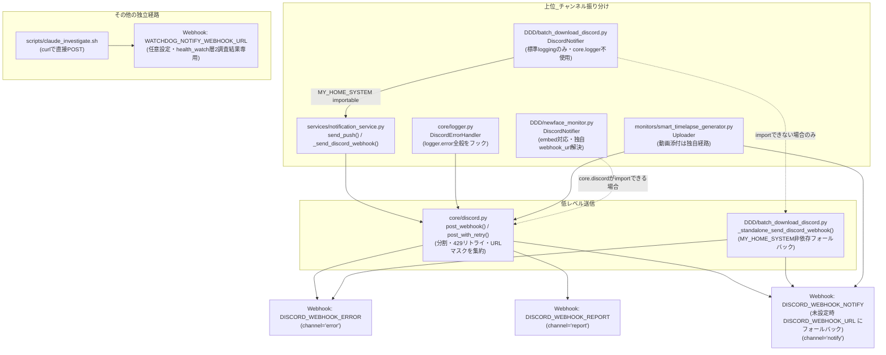

# Discord通知システム 現状把握レポート (2026-09-26)

## 0. 目的とスコープ

このリポジトリ全体（`MY_HOME_SYSTEM/`・`DDD/`・`.github/`・`deploy/`・`family-quest/`）を対象に、
「何が」「どの条件で」「どのDiscordチャネルへ」「どのような内容で」通知されるかを、
**コードを一切変更せず**読み取り専用で調査した結果をまとめる。

- 推測での補完は行わず、コード上で確認できないものは「不明」「要確認」と明記する。
- 秘密情報（Webhook URLそのもの・トークン）は一切出力しない。
- 「コード上存在する通知」と「実際に自動実行されている可能性が高い通知」を区別する（cron/systemd/scheduler_bootへの登録有無で判定）。
- 実際の挙動とドキュメント（`docs/specifications/`）の記載に食い違いがあれば両方記録する。

### 調査した範囲

| 観点 | 確認結果 |
| --- | --- |
| ディレクトリ構成 / README / CLAUDE.md | 確認済み。3サブシステム構成（`MY_HOME_SYSTEM`・`family-quest`・`DDD`）と共有のDBのみで連携する設計 |
| GitHub Actions (`.github/workflows/*.yml`) | 全7ワークフローを検索。**Discordへ通知を送るステップは存在しない**（`test.yml`・`claude-review.yml`にDiscordという語はあるが、いずれもテストのモック/回避チェックについての言及で送信処理ではない） |
| cron (`deploy/cron/crontab`) | 全エントリを確認 |
| systemd (`MY_HOME_SYSTEM/deploy/systemd/*.service` / `*.timer`) | 全ユニットを確認 |
| scheduler_boot.py（アプリ内蔵の別プロセス定期実行） | `TASKS` リストを確認 |
| `.env.example` | Discord/Webhook関連の設定項目を全て確認 |
| `config.py` | Discord関連定数を全て確認 |
| Discord関連コード本体 | `core/discord.py`・`services/notification_service.py`・`core/logger.py`（`DiscordErrorHandler`）・各`monitors/*.py`・`services/*.py`・`DDD/*.py` を確認 |
| family-quest (フロントエンド) | Discordを直接呼び出すコードは無し（バックエンドAPI経由のみ）。確認済み |
| Discord Bot / Gateway接続 | `import discord`、`discord.Client`、Bot Token、Guild ID、Channel ID、`@everyone`/`@here`/ロールメンションの類は**リポジトリ全体で1件も存在しない**。確認済み（grep網羅） |

---

## 1. アーキテクチャ全体像

このシステムのDiscord連携は **Incoming Webhook のみ**であり、Bot・Gateway接続は一切使われていない。
「宛先の決定」と「実際のPOST」が明確に分離されている。

### 1.1 Webhook URL（宛先）一覧

コード上に存在する環境変数は次の4つ＋層2専用の1つ。

**2026-09-26 追記(実機での追加確認)**: 各WebhookのURL自体は本レポートに一切出力していないが、Discord公式API(`GET /webhooks/{id}/{token}`、Webhookトークンを使った読み取り専用リクエストで、送信・設定変更は行っていない)に直接問い合わせ、返却された`name`(Webhookの表示名)・`channel_id`・`guild_id`のみを確認した。`name`はWebhook自体の表示名であり、**Discordチャンネルの名前(`#〇〇`)そのものではない**点に注意(その名前が指すチャンネル自体の表示名を得るには、チャンネル読み取り権限を持つBotトークンが必要で、本システムはBotを持たないため取得不能)。

| 環境変数 | 用途（コード上の意味） | Webhook表示名(`name`) | Channel ID | Guild ID | 備考 |
| --- | --- | --- | --- | --- | --- |
| `DISCORD_WEBHOOK_ERROR` | `channel="error"` の宛先。`core/logger.DiscordErrorHandler`（=アプリ全体の`logger.error`）の既定送信先でもある | エラー警告マン | `1448293091093250139` | `1445677808029274214` | 実質「エラー・障害専用」チャンネル |
| `DISCORD_WEBHOOK_REPORT` | `channel="report"` の宛先 | 毎日伝えるマン | `1448290479258075254` | 同上 | 実質「定期レポート・情報共有」チャンネル |
| `DISCORD_WEBHOOK_NOTIFY` | `channel="notify"`（既定値）の宛先 | 通知するマン | `1448293164623466507` | 同上 | 実質「見守り・防犯・日常イベント」チャンネル |
| `DISCORD_WEBHOOK_URL` | レガシー。`DISCORD_WEBHOOK_NOTIFY`未設定時のフォールバック用として書かれているが、**実機では`DISCORD_WEBHOOK_NOTIFY`と別の値が設定されている**ため実際にはフォールバックは発生していない。`monitors/smart_timelapse_generator.Uploader`が動画添付送信で直接参照する専用経路でもある | Spidey Bot(Discordのデフォルト初期名のまま) | `1445678504317550643` | 同上 | **重要な訂正**: 初版では「NOTIFYと実質同一先」と記載していたが、実機確認により**4つとも全て別々のchannel_id**であることが判明した。動画ダイジェスト(N020)は独立した第4のチャンネルに届いている |
| `WATCHDOG_NOTIFY_WEBHOOK_URL` | `health_watch.py`層2（自動調査）フックの調査結果通知専用 | (`DISCORD_WEBHOOK_ERROR`と値が同一のため上記と同じ) | `1448293091093250139`(ERRORと同一) | 同上 | ハッシュ比較で`DISCORD_WEBHOOK_ERROR`と完全一致すると確認済み。独立チャンネルではない |

4つのWebhookは全て**同一のDiscordサーバー(Guild)**内の、互いに異なる4つのチャンネルに届く（Guild自体は1つのみで分散していない）。

DDD側は独自の環境変数を持たず、上記と同じ変数名を`os.getenv()`で直接参照する（`.env`をMY_HOME_SYSTEMと共用。CLAUDE.mdにも明記されている設計）。

### 1.2 「チャンネル振り分け」の実装が実は2系統ある

- **`services/notification_service.py`（正規経路）**: `channel`引数（`"error"`/`"report"`/`"notify"`）で3つのWebhookを振り分ける。`monitors/*.py`のほぼ全て、`services/*.py`の一部がこれを使う。
- **`core/logger.py`の`DiscordErrorHandler`（フックによる自動経路）**: `logging.Logger.error()`（レベルERROR以上）が呼ばれると、**呼び出し元がDiscordを意図していなくても**自動的に`DISCORD_WEBHOOK_ERROR`へ飛ぶ。`setup_logging(name)`でロガーを作っている全モジュール（`unified_server.py`本体を含め約35ファイル）が対象。`extra={"skip_discord": True}`を明示しない限り常に発火する。
  - これにより、「明示的に`send_push(channel="error")`を呼んでいる箇所」と「単に`logger.error(...)`しているだけで結果的にerrorチャンネルへ飛ぶ箇所」が**二重に存在**する。両者は独立した経路であり、片方だけを見ても全体像はつかめない。
  - 重複通知防止として600秒(10分)のプロセスローカルなdedupウィンドウがある（`DISCORD_DEDUP_WINDOW_SEC`）。ただしcron等で毎回新規プロセスが起動するタスクにはこのdedupは効かない（後述の`notify_task_failure.py`のクールダウンが別途必要になった理由）。

### 1.3 独立した第三の経路（動画アップロード）

`monitors/smart_timelapse_generator.py`の`Uploader`クラスは、`send_push`/`channel`の仕組みを経由せず、`config.DISCORD_WEBHOOK_URL`を直接参照して`core.discord.post_webhook`を呼ぶ。動画ファイルという添付付き送信のための歴史的経緯（コードコメントに明記）と思われる。**2026-09-26訂正**: 初版では「未設定時はNOTIFYにフォールバックする関係で実質notifyチャンネルと同一先」と推測していたが、実機確認の結果、`DISCORD_WEBHOOK_URL`は`DISCORD_WEBHOOK_NOTIFY`とは異なる値が設定されており、**独立した第4のチャンネル**(Webhook表示名は初期値のまま`Spidey Bot`)に届いていることが判明した。つまり動画ダイジェスト配信は、見守り通知等が届く「notify」チャンネルとは別の専用チャンネルで運用されている。

---

## 2. 通知の分類（実際のコード上の意味に基づく）

勝手な分類基準ではなく、コード中の`channel`引数・コメント・トリガーの性質から次の6グループに整理した。

| グループ | 説明 | 対応する`channel` |
| --- | --- | --- |
| ① システム障害・エラー | サービス停止、NAS障害、バックアップ失敗、DB保存失敗、Webhook設定エラー等、介入が必要な異常 | `error` |
| ② 定期レポート・情報共有 | 週間ログ分析、週間電気代レポート、起動後ヘルスチェック、NAS稼働レポート、古いファイル自動削除サマリ | `report` |
| ③ 見守り・防犯（家庭内IoTイベント） | 動きの検知/停止、ドア開閉、電力閾値クロス（家電のON/OFF） | `notify` |
| ④ カメラ/タイムラプス動画配信 | 日次・イベント検知のダイジェスト動画そのもの、完了通知 | `notify`相当（`DISCORD_WEBHOOK_URL`直参照） |
| ⑤ DDD（コンテンツ収集バッチ）の運用通知 | ダウンロード完了、ボット検知/レート制限、ディスク容量、NASマウント、新規キャスト検知 | 独自の`error`/`notify`（DDD側で再実装） |
| ⑥ 開発運用系（cron/systemdの失敗検知・自動調査） | Pythonが起動する前の失敗、外部デッドマンスイッチ以外での層2自動調査結果 | `error`（ログ経由）／`WATCHDOG_NOTIFY_WEBHOOK_URL`（独立） |

Family Quest（子供のクエスト管理）関連の通知は、LINE（親グループ・本人）が主経路で、Discordは失敗時のフォールバックまたは`target="both"`の副経路としてのみ登場する（②③のような専用チャンネル運用ではない）。

---

## 3. 通知マトリクス（全件）

「同じチャンネルでも通知内容・発生条件が異なるものは別扱い」という指示に従い、送信文言・トリガー条件の単位でIDを振っている。
`DiscordErrorHandler`経由（明示的な`send_push`を伴わない`logger.error`一般）はN001として1行にまとめ、個別の`send_push`呼び出しをN002以降に列挙する。

| ID | 通知内容 | 発生条件 | トリガー | 通知処理 | Discord通知先 | 通知頻度 | 重要度 | 現状 |
|---|---|---|---|---|---|---|---|---|
| N001 | アプリ全体の`logger.error`/`critical`の汎用エラー通知 | `setup_logging()`で作られた約35個のロガーのいずれかで ERROR 以上が記録され、`skip_discord`フラグが立っていない | 各所（例外処理全般） | `core.logger.DiscordErrorHandler.emit` → `core_discord.post_with_retry` | Webhook: `DISCORD_WEBHOOK_ERROR`(不明) | 随時（600秒dedup） | 高 | 使用中（実質的に最大量の通知経路） |
| N002 | SwitchBot/LINE Webhook再登録: 新URL登録失敗 | `update_switchbot_webhook`が`None`を返す(旧設定削除後に新規登録失敗) | サーバー起動時(`start_all.sh`→`switchbot_webhook_fix.py`) | `send_push(channel="error")` | `DISCORD_WEBHOOK_ERROR` | 起動時のみ | 高 | 使用中 |
| N003 | SwitchBot/LINE Webhook再登録: 修復完了 | SwitchBotまたはLINEのWebhook URLが実際に更新された時 | サーバー起動時 | `send_push(channel="report")` | `DISCORD_WEBHOOK_REPORT` | 起動時のみ | 低 | 使用中 |
| N004 | 週間レポート(電気代・自炊回数等) | 月曜08時台の実行かつ当日未送信 | cron `30 8 * * 1` (`weekly_analyze_report.py`) | `send_push(target="discord")`(channel既定=`notify`) | `DISCORD_WEBHOOK_NOTIFY` | 週1回(月曜) | 低 | 使用中 |
| N005 | 起動後ヘルスチェック: NAS書き込み権限エラー | NASマウント済みだが書き込みテストが`IOError`/`PermissionError` | systemd `health-check.service`(ネットワーク到達後・home_system.service起動後の1回) | `send_push(channel="report")` | `DISCORD_WEBHOOK_REPORT` | 起動毎 | 中 | 使用中 |
| N006 | 起動後ヘルスチェック: 統合レポート(NAS/カメラ等の状態一覧) | チェック完走後に常時送信 | 同上 | `send_push(channel="report")` | `DISCORD_WEBHOOK_REPORT` | 起動毎 | 低 | 使用中 |
| N007 | サービス復旧通知(`home_system.service`が停止状態から復帰) | ロックファイルが存在する状態で`is_healthy`になった | scheduler_boot 10分毎(`server_watchdog.py`) | `send_push(channel="notify")` | `DISCORD_WEBHOOK_NOTIFY` | 復旧時のみ | 中 | 使用中 |
| N008 | サービス停止検知(初回) | サービス/プロセスが異常かつロックファイル未作成 | 同上 | `send_push(channel="error")` | `DISCORD_WEBHOOK_ERROR` | 異常検知時 | 高 | 使用中 |
| N009 | サービス停止継続リマインダー | 異常が継続しリマインダー間隔(`REMINDER_INTERVAL_SEC`)を超過 | 同上 | `send_push(channel="error")` | `DISCORD_WEBHOOK_ERROR` | 継続中は間隔毎 | 高 | 使用中 |
| N010 | NAS復旧+ローカルからの同期完了 | フォールバック運用中にNAS復旧を検知しrsync成功 | scheduler_boot 1時間毎(`nas_monitor.py`) | `send_push(channel="report")` | `DISCORD_WEBHOOK_REPORT` | 復旧時のみ | 中 | 使用中 |
| N011 | 古いファイルの自動削除サマリ(+DB行削除件数、既定はドライラン集計のみ) | 保持期間削除の対象が1件以上ある | 同上(1日1回相当のリテンション処理内) | `send_push(channel="report")` | `DISCORD_WEBHOOK_REPORT` | 概ね日1回 | 低 | 使用中 |
| N012 | NAS障害検知(ローカルフォールバックへ移行) | ping/mount/write のいずれかが正常→異常に遷移 | scheduler_boot 1時間毎 | `send_push(channel="error")` | `DISCORD_WEBHOOK_ERROR` | 障害検知時 | 高 | 使用中 |
| N013 | NAS容量不足警告 | ディスク使用率が閾値超過(`is_full`) | 同上 | `send_push(channel="error")` | `DISCORD_WEBHOOK_ERROR` | 超過検知時 | 高 | 使用中 |
| N014 | NAS稼働レポート(定期) | 容量不足ではなく、日次レポート時刻に該当 | 同上 | `send_push(channel="report")` | `DISCORD_WEBHOOK_REPORT` | 日1回 | 低 | 使用中 |
| N015 | カメラ接続障害アラート | 連続失敗5回目、以降12回毎 | カメラ監視専用プロセス常時ループ内(`monitors/camera_monitor.py`、lifespanが起動する別プロセス) | `send_push(channel="error")` | `DISCORD_WEBHOOK_ERROR` | 連続失敗が続く間、12回毎 | 高 | 使用中 |
| N016 | 日次タイムラプス: FFmpeg等依存不足エラー | `check_dependencies()`が失敗 | cron 09:15/15:15 (`daily_timelapse_job.py entrance`) | `send_push(channel="error")` | `DISCORD_WEBHOOK_ERROR` | 実行毎(条件成立時) | 中 | 使用中 |
| N017 | 日次タイムラプス: イベント検知はあったがクリップ抽出が全滅 | 動き検知イベント>0だが有効クリップ0件 | 同上 | `send_push(channel="error")` | `DISCORD_WEBHOOK_ERROR` | 該当時 | 中 | 使用中 |
| N018 | 日次タイムラプス: 動きなし情報 | 対象期間内に動き検知イベントが1件も無い | 同上 | `send_push(channel="report")` | `DISCORD_WEBHOOK_REPORT` | 該当時(頻度高め、日2回の実行毎) | 低 | 使用中 |
| N019 | 日次タイムラプス: 予期せぬ例外 | バッチ処理中に未捕捉の例外 | 同上 | `send_push(channel="error")` | `DISCORD_WEBHOOK_ERROR` | 例外発生時 | 中 | 使用中 |
| N020 | ダイジェスト動画本体のアップロード(+分割時は完了通知) | クリップ結合に成功 | 同上、および`smart_timelapse_generator.py`単体実行時 | `Uploader.split_and_send`→`core_discord.post_webhook`(送信本体) | `DISCORD_WEBHOOK_URL`(直接参照。**実機確認により独立した第4のチャンネルと判明、`notify`とは別**) | 実行毎(条件成立時) | 低〜中(見守り目的なら実質視聴コンテンツ) | 使用中(日次分)／N024-N026参照(単体実行分は自動実行契機なしと確定) |
| N021 | 一次ヘルスチェック異常検知(7種のチェックの統合。サービス停止/journalエラー/appログエラー/ディスク/メモリ/NAS未マウント/API無応答/録画停止/デプロイ設定drift/questマスタdrift/孤立行/crontab実機drift のいずれか) | いずれかのチェックが異常を検出、かつ同一異常セットの再通知間隔(6時間)を超過 | cron `10 * * * *`(毎時10分、`health_watch.py`) | `send_push(channel="error")` | `DISCORD_WEBHOOK_ERROR` | 毎時判定、異常時は最短6時間間隔 | 高 | 使用中 |
| N022 | メモリリーク/リソース枯渇兆候の警告 | メモリ異常検知かつクールダウン経過 | scheduler_boot 10分毎(`memory_monitor.py`) | `send_push(channel="error", target=config.NOTIFICATION_TARGET)` | `DISCORD_WEBHOOK_ERROR`(既定target="discord") | 異常時、クールダウン単位 | 高 | 使用中 |
| N023 | データベースバックアップ失敗 | オフサイト複製失敗、または`perform_backup`内の失敗経路 | cron `0 4 * * *`(`services/backup_service.py`) | `_notify_and_log_error`→`send_push(channel="report")` | `DISCORD_WEBHOOK_REPORT` | 失敗時のみ、日1回実行 | 高(内容は障害だがchannelは`report`) | 使用中 |
| N024 | 動きなし情報(smart_timelapse_generator単体) | 動き検知イベントが0件 | `run_smart_timelapse_job(input_video)`はCLI引数(`sys.argv[1]`)で起動される設計。**追加調査で確定**: 実機の`crontab -l`とリポジトリの`deploy/cron/crontab`は完全一致し、systemdユニット・`scheduler_boot.py`・他スクリプトのいずれにも呼び出しが無い(`camera_monitor.py`のモーション検知は静止画保存`save_image_from_stream`のみで、本ファイルは起動しない)。**自動実行経路はリポジトリ内に存在しない** | `send_push(channel="report")` | `DISCORD_WEBHOOK_REPORT` | 手動実行時のみ | 低 | 手動実行専用と確定(自動実行契機なし) |
| N025 | 動画生成失敗(smart_timelapse_generator単体) | `VideoBuilder().build()`が`False`を返す | 同上 | `send_push(channel="error")` | `DISCORD_WEBHOOK_ERROR` | 同上 | 中 | 手動実行専用と確定 |
| N026 | 予期せぬ例外(smart_timelapse_generator単体) | バッチ処理中の未捕捉例外 | 同上 | `send_push(channel="error")` | `DISCORD_WEBHOOK_ERROR` | 同上 | 中 | 手動実行専用と確定 |
| N027 | 週間ログ分析: 異常なしレポート | 直近7日分のログに集計対象の異常が無い | cron 日曜08:50(`log_analyzer.py`) | `send_push(channel="report")` | `DISCORD_WEBHOOK_REPORT` | 週1回 | 低 | 使用中 |
| N028 | 週間ログ分析: エラー/警告集計レポート | 集計対象の異常あり | 同上 | `send_push(channel="report")` | `DISCORD_WEBHOOK_REPORT` | 週1回 | 中 | 使用中 |
| N029 | NAS障害・自動修復失敗(共有ヘルパー、Fail-Soft前の通知) | `attempt_remount`後も`is_mounted_and_writable`が偽 | 各呼び出し元から都度(`core/nas_utils.get_managed_target_directory`。カメラ保存・DDD等の複数経路から共有利用) | `send_push(channel="error")` | `DISCORD_WEBHOOK_ERROR` | 該当条件発生毎 | 高 | 使用中 |
| N030 | 見守り: 動き検知(非アクティブ→アクティブ) | SwitchBotモーション/プレゼンスセンサーWebhookで`state="detected"`、かつ直前が非アクティブ | SwitchBot Webhook受信時(イベント駆動、リアルタイム) | `process_sensor_data`→`send_push(channel="notify")` | `DISCORD_WEBHOOK_NOTIFY` | イベント毎(非アクティブ時のみ) | 中 | 使用中 |
| N031 | 見守り: 動き停止(無反応タイムアウト) | 検知後`MOTION_TIMEOUT`秒動きが無い | 同上(非同期タイマー) | `send_inactive_notification`→`send_push(channel="notify")` | `DISCORD_WEBHOOK_NOTIFY` | タイムアウト毎 | 中 | 使用中 |
| N032 | 防犯: ドア/窓の開閉検知 | 接点センサーが`open`/`timeoutnotclose`、かつクールダウン(`CONTACT_COOLDOWN`)経過 | SwitchBot Webhook受信時 | `process_sensor_data`→`send_push(channel="notify")` | `DISCORD_WEBHOOK_NOTIFY` | イベント毎(クールダウン付) | 中 | 使用中 |
| N033 | 家電の電力閾値クロス通知(使用開始/終了) | `devices.json`の`notify_settings.power_threshold_watts`を跨いだ | SwitchBot Webhook/ポーリング受信時 | `send_push(channel="notify", target=devices.jsonのtarget)` | `DISCORD_WEBHOOK_NOTIFY`(実機確認: 18台全てで`target`未指定のため既定の"discord"のまま) | イベント毎 | 低〜中 | 使用中。実機の`devices.json`(匿名化済みサマリは6.2参照)では`power_threshold_watts`設定済みが3台 |
| N034 | TVロック解除失敗の保護者通知 | Family Questのクエスト経由でTVのSwitchBotプラグをONにするAPIが失敗 | Family Quest APIリクエスト時(ユーザー操作起点) | `notification_service.send_push`(target既定`both`→LINE+Discord `notify`) | `DISCORD_WEBHOOK_NOTIFY`(LINEと併送) | 失敗時のみ | 中 | 使用中 |
| N035 | ごほうび券使用結果通知 | Family Questでインベントリのアイテムを使用 | Family Quest APIリクエスト時 | `notification_service.send_push`(target既定`both`) | `DISCORD_WEBHOOK_NOTIFY`(LINEと併送) | 使用毎 | 低 | 使用中 |
| N036 | cronタスクがPython起動前に失敗(依存欠落・venv破損等) | `run_task.sh`経由タスクの終了コード≠0 | 各cronタスク失敗時(`run_task.sh`→`tools/notify_task_failure.py`) | `logger.error`→N001と同じ`DiscordErrorHandler`経路 | `DISCORD_WEBHOOK_ERROR` | 失敗時、タスク毎1時間クールダウン | 高 | 使用中 |
| N037 | /etcバックアップ失敗通知 | `host-config-backup.service`が失敗 | systemd `OnFailure=host-config-backup-failure.service`(`tools/backup_host_config.py`失敗時) | `tools/notify_task_failure.py`→`logger.error`→N001経路 | `DISCORD_WEBHOOK_ERROR` | 失敗時 | 高 | 使用中 |
| N038 | ラズパイ層2自動調査結果の通知 | `health_watch.py`が異常検知し`HEALTH_WATCH_INVESTIGATE_HOOK`設定済み | health_watch異常検知時に起動される`scripts/claude_investigate.sh`完了後 | `curl -X POST`(直接、`notification_service`を経由しない独自実装) | `WATCHDOG_NOTIFY_WEBHOOK_URL` | 異常検知の都度(hook設定時のみ) | 中 | **確定・使用中**: 実機`.env`で`HEALTH_WATCH_INVESTIGATE_HOOK=.../scripts/claude_investigate.sh`が設定済み。`WATCHDOG_NOTIFY_WEBHOOK_URL`は値そのものは非公開のまま、ハッシュ比較で**`DISCORD_WEBHOOK_ERROR`と完全に同一のURL**であると確認した(=独立チャンネルではなく、errorチャンネルへ届く) |
| N039 | DDD: ボット検知/レート制限のCRITICAL警告 | `BotDetectionError`捕捉(429やSign-in要求) | cron `0 2 * * *`(`batch_download_discord.py`) | `DiscordNotifier.send(is_error=True)` | `DISCORD_WEBHOOK_ERROR`(実機で`services.notification_service`のimportに**成功**することを確認済み。フォールバックの`_standalone_send_discord_webhook`は使われていない) | 検知時、以降のタスクは中断 | 高 | 使用中(確定) |
| N040 | DDD: 連続失敗によるタスク中断警告 | 連続失敗が閾値(`CONSECUTIVE_FAILURE_THRESHOLD`)を超過 | 同上 | `DiscordNotifier.send(is_error=True)` | 同上(error相当) | 該当時 | 中 | 使用中 |
| N041 | DDD: 権限エラー/ディレクトリ作成エラー | 保存先ディレクトリ作成/アクセスに失敗 | 同上 | `DiscordNotifier.send(is_error=True)` | 同上(error相当) | 該当時 | 中 | 使用中 |
| N042 | DDD: ディスク容量不足 | `check_disk_space`が閾値割れ | 同上 | `DiscordNotifier.send(is_error=True)` | 同上(error相当) | 該当時 | 高 | 使用中 |
| N043 | DDD: NASマウントエラー(CRITICAL) | NAS未マウント検知 | 同上 | `DiscordNotifier.send(is_error=True)` | 同上(error相当) | 該当時 | 高 | 使用中 |
| N044 | DDD: 動画保存完了通知(通常/missav) | ダウンロード成功 | 同上 | `DiscordNotifier.send(is_error=False)` | notify相当(`DISCORD_WEBHOOK_NOTIFY`優先) | 成功毎 | 低 | 使用中 |
| N045 | DDD: 新規キャスト検知通知(embed) | 新人紹介ページの巡回で新規キャストを検出 | cron `0 * * * *`(毎時、`newface_monitor.py`) | 独自`DiscordNotifier.notify_casts`(embed、`core.discord.post_webhook`直接利用) | `DISCORD_WEBHOOK_NOTIFY`(実機確認済み。`DISCORD_WEBHOOK_URL`とは異なる値のため、未設定時フォールバックは今回の実機では発生しない) | 毎時判定、検知時のみ | 中 | 使用中(確定) |
| N046 | DDD: 日次サマリ通知(サイト別検知件数) | 日付が変わったタイミングでの集計送信 | 同上(毎時実行の中で日次判定) | 同上 | `DISCORD_WEBHOOK_NOTIFY` | 日1回相当 | 低 | 使用中 |
| N047 | DDD: サイト疎通不能アラート(閉鎖・移転疑い) | 対象サイトが連続巡回失敗 | 同上 | 同上 | `DISCORD_WEBHOOK_NOTIFY` | 継続時1回のみ→以後WARNINGへ降格 | 中 | 使用中 |

### 3.1 通知経路として存在するがDiscordではないもの(参考・除外)

調査中に「通知」として見つかったが、Discordではないため上記マトリクスから除外したもの:

| 項目 | 説明 |
| --- | --- |
| `HEALTH_WATCH_DEADMAN_PING_URL` | health_watch完走ごとの外部デッドマンスイッチ(healthchecks.io等)へのハートビート。通知先はそのサービス側の設定(メール等)に委ねる設計で、Discordは経由しない(`.env.example`に明記) |
| LINE通知(`_send_line_push`) | Family Quest本人/親グループへのLINE Push。Discordとは独立した宛先。LINE失敗時のみDiscordの`error`チャンネルへフォールバック通知が飛ぶ(N001経路と同様の仕組みとは別に、`notification_service.send_push`内で明示的に`_send_discord_webhook(fallback, None, 'error')`を呼ぶ) |
| GitHub Actions | 全ワークフローを確認したが、Discordへの通知ステップは存在しない。Issue起票(`pip-audit-weekly-audit.yml`等)やauto-merge等はGitHub上の操作のみ |

---

## 4. Discordチャンネル単位での整理(逆引き)

実機のWebhookに対しDiscord公式APIへ読み取り専用の問い合わせを行い、Channel ID・Guild ID・Webhook表示名を確認した(1.1参照。トークン・URL自体は非公開)。5つの環境変数は**4つの異なるDiscordチャンネル**(同一Guild内)に対応する(`WATCHDOG_NOTIFY_WEBHOOK_URL`は`DISCORD_WEBHOOK_ERROR`と同一チャンネル)。

| Discordチャンネル(環境変数) | Webhook表示名 | Channel ID | 通知される内容(ID) | 通知元 | 通知頻度 | 備考 |
|---|---|---|---|---|---|---|
| `DISCORD_WEBHOOK_ERROR`(+`WATCHDOG_NOTIFY_WEBHOOK_URL`) | エラー警告マン | `1448293091093250139` | N001, N002, N008, N009, N012, N013, N015〜N017, N019, N021, N022, N025, N026, N029, N032(※後述), N036〜N039, N040〜N043 | アプリ全体の`logger.error`(N001経由が大半)＋各`send_push(channel="error")`明示呼び出し＋層2自動調査結果(N038) | 随時〜毎時 | **最も通知量が多いチャンネル**。エラーログの自動転送(N001)と個別の障害通知、さらに`WATCHDOG_NOTIFY_WEBHOOK_URL`経由の調査結果が全て同じ場所に集まる。dedup(600秒)はプロセス内のみ有効 |
| `DISCORD_WEBHOOK_REPORT` | 毎日伝えるマン | `1448290479258075254` | N003, N005, N006, N010, N011, N014, N018, N023, N024, N027, N028 | 定期レポート系(週次ログ分析・週次電気代・起動後チェック・NAS稼働・バックアップ失敗) | 日次〜週次中心 | 名前は"report"だが、N023(バックアップ失敗)のように内容的には障害でもchannelは`report`になっているものがある(要注意点、後述4.1) |
| `DISCORD_WEBHOOK_NOTIFY` | 通知するマン | `1448293164623466507` | N004, N007, N030〜N035, N044〜N047 | 見守り・防犯・家電イベント・週間レポート・DDDの成功通知(動画保存完了・新規キャスト検知・日次サマリ・サイト疎通不能アラート) | 随時(イベント駆動)〜週1 | 家庭内IoTイベント(動き・ドア・電力)がリアルタイムで最も飛ぶチャンネル。新規キャスト検知(N045、embed画像付き)等の「コンテンツ」寄りの通知もここに集まる |
| `DISCORD_WEBHOOK_URL` | Spidey Bot(初期値のまま) | `1445678504317550643` | N020 | `monitors/smart_timelapse_generator.Uploader`(カメラのダイジェスト動画本体+完了通知) | 日次(cron)+動き検知イベント発生時 | **今回の実機確認で判明した独立チャンネル**。初版では「NOTIFYと同一先」と誤って推測していたが、実際は動画配信専用の別チャンネル。Webhook表示名が初期値のままなのも「他の3つと違って手を加えていない/古いまま使われている」ことを示唆する |

### 4.1 ドキュメント記載と実装の食い違い・注意点

- **`channel="report"`だが内容は障害通知**: `services/backup_service.py`の`_notify_and_log_error`(N023、バックアップ失敗)は、コード上のコメントで「ERRORレベルの記録と管理者への即時通知」と書かれているにもかかわらず`channel="report"`を指定している。`post_boot_health_check.py`のNAS権限エラー(N005)も同様に、内容は障害だが`channel="report"`。**「チャンネル名(error/report/notify)と実際の重要度が必ずしも一致しない」**箇所が複数存在する。
- **`docs/specifications/MY_HOME_SYSTEM/discord.md`との整合性**: このドキュメントは`core/discord.py`単体の解析としては正確で、Issue #661での5系統統合の経緯を裏付ける記載がある。ただし「どのチャンネルに何が飛ぶか」という本レポートの粒度の情報は元々スコープに入っていない(意図的にファイル単位の解析にとどめている)。矛盾は確認されなかった。
- **`smart_timelapse_generator.py`の自動実行契機**: 前述の通り、リポジトリ内に自動起動する経路が見つからなかった。`docs/specifications/MY_HOME_SYSTEM/smart_timelapse_generator.md`も「外部依存関係」節でこのファイル自体の呼び出し元を明記していない(呼び出し元として言及されているのは`daily_timelapse_job.py`が`Uploader`等のクラスをインポートしている事実のみで、`run_smart_timelapse_job`自体の起動経路には触れていない)。**現状ドキュメント・コードともに「誰が・いつ呼ぶか」が空白**になっている箇所。

---

## 5. 「使用中」と「要確認」の判定基準

- cron(`deploy/cron/crontab`)・systemdユニット(`MY_HOME_SYSTEM/deploy/systemd/*.service`)・`scheduler_boot.py`の`TASKS`リストのいずれかに登録があり、かつ関連する`.env`変数が`.env.example`に用意されている → **使用中**。
- 上記のいずれにも自動起動の経路が見つからない(CLIから`sys.argv`で直接叩く前提のスクリプト) → **要確認**。
- 実際の`.env`(gitignore対象)の値そのもの(Webhook URLが本当に設定されているか、`WATCHDOG_NOTIFY_WEBHOOK_URL`や`HEALTH_WATCH_INVESTIGATE_HOOK`が実機で有効化されているか)は**このリポジトリの調査だけでは判定不能**。すべて「コード上は到達可能」という意味での「使用中」であり、実機の`.env`設定と`crontab -l`の実態(health_watchのチェック7がドリフト検知している前提)を別途確認しないと確定しない。

---

## 6. 気づいた改善余地

初版(2026-09-26作成時点)は提案のみでコードを変更していなかったが、その後の会話でユーザーの承認を得て一部を実装した。対応状況は各項目末尾に記載。

1. **チャンネル名と重要度の不一致の整理**: 4.1で述べた通り、`channel="report"`でも内容が高重要度の障害(バックアップ失敗、NAS権限エラー)であるケースがある。運用上は問題なく機能している可能性が高いが、「reportチャンネルは緊急度が低い」という前提でDiscordの通知ミュート設定等をしている場合、これらの通知が気づかれないリスクがある。
   **→ 対応済み**: [services/backup_service.py](../../MY_HOME_SYSTEM/services/backup_service.py)の`_notify_and_log_error`(N023)、[post_boot_health_check.py](../../MY_HOME_SYSTEM/post_boot_health_check.py)のNAS権限エラー通知(N005)を`channel="report"`→`channel="error"`へ変更。二重通知(N001経由の`logger.error`自動転送＋明示`send_push`)を避けるため`logger.error`側に`extra={"skip_discord": True}`を追加(`monitors/memory_monitor.py`と同じ既存パターン)。N006(統合レポート)は元々report相当の内容のため対象外・未変更。
2. **`smart_timelapse_generator.py`単体の起動契機の明文化**: 実機の`crontab -l`・systemd・`scheduler_boot.py`のいずれにも登録が無いことを確認した(6.1参照)。意図的に手動専用なのか、失われた/未実装のcron登録なのかをコードまたはドキュメントに明記すると、次に読む人(将来の自分を含む)が同じ調査をやり直さずに済む。
   **→ 対応済み**: [monitors/smart_timelapse_generator.py](../../MY_HOME_SYSTEM/monitors/smart_timelapse_generator.py)の`if __name__ == "__main__":`直前に、自動起動経路が存在しないことを確認済みである旨のコメントを追加。
3. **`WATCHDOG_NOTIFY_WEBHOOK_URL`が実質`DISCORD_WEBHOOK_ERROR`の別名になっている**: 6.1で確認した通り、値そのものが`DISCORD_WEBHOOK_ERROR`と同一である。
   **→ 対応済み(ドキュメントのみ)**: コードの一本化は行わず(挙動を変えるリスクを避けた)、[.env.example](../../MY_HOME_SYSTEM/.env.example)のコメントを「実機では同一URLを設定している」という確定情報に更新。
4. **DDDの二重エラー経路の可視化**: `DDD/newface_monitor.py`は`core.logger.get_logger`経由のため、`logger.error()`が(a)本来意図した`DiscordNotifier`系の明示通知と、(b)MY_HOME_SYSTEMの`DiscordErrorHandler`経由の自動通知の**両方**を発火させる(6.1で実機のimportが成功することを確認済み)。一方`batch_download_discord.py`は標準の`logging.getLogger`のみで後者が発火しない。
   **→ 対応済み(ドキュメントのみ)**: [DDD/newface_monitor.py](../../DDD/newface_monitor.py)・[DDD/batch_download_discord.py](../../DDD/batch_download_discord.py)の該当箇所にこの非対称性を説明するコメントを追加。挙動は変更していない。
5. **`devices.json`の`notify_settings.notify_mode`が死んでいる設定項目になっている**(6.2で確認): 実機の18台全てで`notify_mode: "LOG_ONLY"`が設定されているが、これを読んで通知の送信/抑制を分岐しているコードが無いため、見守り・防犯・電力の通知(N030〜N033)は`notify_mode`の値に関わらず常にDiscordへ送信されている。
   **→ 対応済み(ドキュメントのみ、実装は見送り)**: ユーザーの判断により、コードでの`notify_mode`の有効化(=見守り通知を実際に抑制する変更)は実施せず、[config.py](../../MY_HOME_SYSTEM/config.py)の`NotifySettings`モデルに「現状この値を読む分岐は存在しない」ことを明記するコメントを追加した。見守り・防犯・電力の通知は従来通りすべてDiscordへ送信され続ける。

いずれのコード変更も既存テストスイート(`MY_HOME_SYSTEM/tests/`・`DDD/`・`.github/scripts/`)で新規の失敗が発生しないことを確認済み。`docs/specifications/`側の該当仕様書も`check_spec_line_refs.py --fix`で行番号引用のドリフトを解消した。

### 6.1 実機での追加確認(このセッション内で実施。値は非公開のまま構造だけ確認)

このレポートの調査自体はRaspberry Pi実機(`/home/masahiro/develop`)上で行っているため、以下は秘密情報の値そのものを画面に出力せず、安全な形で追加確認した内容である。

- `crontab -l`(実機の有効なcrontab)と`deploy/cron/crontab`(リポジトリ管理コピー)は**完全一致**(ドリフト無し)。
- `DISCORD_WEBHOOK_ERROR`・`DISCORD_WEBHOOK_REPORT`・`DISCORD_WEBHOOK_NOTIFY`・`DISCORD_WEBHOOK_URL`は**全て設定済み・全て異なる値**(SHA256ハッシュ比較で確認。値そのものは表示していない)。
- `WATCHDOG_NOTIFY_WEBHOOK_URL`は**`DISCORD_WEBHOOK_ERROR`と完全に同一の値**(同上の比較で確認)。
- `HEALTH_WATCH_INVESTIGATE_HOOK`は`scripts/claude_investigate.sh`のフルパスに設定済み(層2自動調査は有効化されている)。
- `HEALTH_WATCH_DEADMAN_PING_URL`は設定済み(層3の外部デッドマンスイッチも有効化されている)。
- DDDの`.venv`から`from core.logger import get_logger`・`from services.notification_service import _send_discord_webhook`は**いずれも実際にimportに成功する**。つまり`newface_monitor.py`・`extract_youtube_urls.py`・`batch_download_discord.py`は全て「MY_HOME_SYSTEMが無い場合のフォールバック」ではなく**正規経路(`core.discord`/`notification_service`経由)で動いている**ことを実機で確認した。
- Discord公式APIへの読み取り専用問い合わせ(GET、送信・設定変更なし)により、4つのWebhookが同一Discordサーバー(Guild)内の**4つの異なるチャンネル**に対応することを確認した(詳細は1.1・4章)。トークン・完全なURLは一切表示・保存していない。

### 6.2 `devices.json`の匿名化サマリ(実名・設置場所は非公開、構造のみユーザーの許可を得て確認)

- カメラ: 3台、全て有効(`enabled: true`)。設置場所は1箇所にまとまっている(場所名は非公開)。
- SwitchBotデバイス(`monitor_devices`): 18台。種別ごとの内訳:
  - Contact Sensor(接点センサー): 5台
  - MeterPlus(温湿度計): 4台
  - Plug Mini (JP)(電源プラグ): 3台
  - Motion Sensor(モーションセンサー): 2台
  - Hub Mini: 2台
  - Indoor Cam: 1台
  - Pan/Tilt Cam: 1台
  - 設置場所は2箇所にまとまっている(場所名は非公開)
- `notify_settings.target`: **18台全てで未指定**(既定の`"discord"`が使われる)。`target`を`line`や`both`に個別設定しているデバイスは現状無い。
- `notify_settings.power_threshold_watts`: 3台に設定済み(N033の対象。おそらくPlug Mini 3台に対応)。
- `notify_settings.notify_mode`: **18台全てが`"LOG_ONLY"`**。ただし**この値を実際に読んで分岐しているコードはリポジトリ全体に1件も存在しない**(`config.py`のPydanticモデルにデフォルト値として定義されているのみで、`sensor_service.py`・`switchbot_power_monitor.py`のどちらも`notify_mode`を参照していない)。つまり`devices.json`側で`LOG_ONLY`に設定しても、動きの検知やドア開閉、電力閾値クロスの通知(N030〜N033)は**現状の実装では抑制されず、常にDiscordへ送信される**。「ログのみにしたい」という意図で`LOG_ONLY`を設定していた場合、その意図はコードに反映されていない可能性がある(6章の改善提案に追記)。

---

## 7. 不明・要確認事項の一覧(2026-09-26 追加調査後の最新状態)

初版で挙げた6件のうち5件を解消した。残るのは、本システムがBotを持たないためAPI経由では原理的に取得できない1件のみ。

| 項目 | 状態 |
| --- | --- |
| `smart_timelapse_generator.py`の自動起動契機 | **解消**: 自動実行経路は存在しないと確定(手動実行専用) |
| `WATCHDOG_NOTIFY_WEBHOOK_URL` / `HEALTH_WATCH_INVESTIGATE_HOOK` の実機設定状況 | **解消**: 両方とも実機で有効化済み。`WATCHDOG_NOTIFY_WEBHOOK_URL`は`DISCORD_WEBHOOK_ERROR`と同一値 |
| DDDの`extract_youtube_urls.py`がDiscordへ直接通知するか | **解消**: 本ファイル自身に`DiscordNotifier`/`send_push`の呼び出しは無い。`core.logger`は`newface_monitor.py`と同じ`try/except ImportError`パターンで参照しており、実機ではimportに成功するため、`logger.error()`はN001(`DiscordErrorHandler`)経由でerrorチャンネルへ届く。本ファイル固有の明示的なDiscord通知(embed等)は無い |
| DDDが実機の`.venv`で`core`パッケージをimportできるか | **解消**: 実機で確認済み。全DDDスクリプトが正規経路(フォールバックではない)で動いている |
| 各WebhookのChannel ID・Guild ID・Webhook表示名 | **解消**(2026-09-26)。Discord公式APIへの読み取り専用問い合わせ(トークン・URL自体は非公開のまま)で確認し、1.1・4章に反映した。4つの環境変数は同一Guild内の**4つの異なるチャンネル**に対応し(初版の「NOTIFYと同一先」という推測は誤りだったと判明)、`WATCHDOG_NOTIFY_WEBHOOK_URL`は`DISCORD_WEBHOOK_ERROR`と同一チャンネルであることも確定した |
| `devices.json`の`notify_settings`の実際の内容 | **解消**(2026-09-26、匿名化サマリで確認。6.2参照)。カメラ3台・SwitchBotデバイス18台(内訳は6.2)。`target`は全台未指定(既定discord)、`power_threshold_watts`設定済みは3台。**副次的な発見**: 全18台に設定されている`notify_mode: "LOG_ONLY"`を実際に読むコードが無く、事実上無効な設定項目だった(改善提案6章5番に追記) |
| Discordチャンネルの表示名(`#〇〇`のような実際のチャンネル名) | **未解消**。Incoming Webhook APIから取得できるのは`channel_id`(数値ID)までで、チャンネル自体の表示名を取得するにはチャンネル読み取り権限を持つBotトークンが必要。本システムはBotを一切持たない設計のため、この情報だけはユーザー自身がDiscordアプリで確認するほうが早い(Channel IDは4章の表に記載済みなので、Discordアプリの検索や設定画面でIDから該当チャンネルを特定できる) |

---

## 8. 主要参照ファイル一覧

調査で読んだ主なコードは次の通り(仕様書は`docs/specifications/`配下に個別ファイルが存在する)。

- 低レベル送信: [MY_HOME_SYSTEM/core/discord.py](../../MY_HOME_SYSTEM/core/discord.py)
- チャンネル振り分け: [MY_HOME_SYSTEM/services/notification_service.py](../../MY_HOME_SYSTEM/services/notification_service.py)
- エラーログの自動転送: [MY_HOME_SYSTEM/core/logger.py](../../MY_HOME_SYSTEM/core/logger.py)
- 設定値: [MY_HOME_SYSTEM/config.py](../../MY_HOME_SYSTEM/config.py), [MY_HOME_SYSTEM/.env.example](../../MY_HOME_SYSTEM/.env.example)
- 定期実行の一覧: [deploy/cron/crontab](../../deploy/cron/crontab), [MY_HOME_SYSTEM/scheduler_boot.py](../../MY_HOME_SYSTEM/scheduler_boot.py), [MY_HOME_SYSTEM/deploy/systemd/](../../MY_HOME_SYSTEM/deploy/systemd/)
- 各監視/バッチ: `MY_HOME_SYSTEM/monitors/*.py`, `MY_HOME_SYSTEM/services/*.py`, `DDD/batch_download_discord.py`, `DDD/newface_monitor.py`
- cron失敗の最終防衛線: [MY_HOME_SYSTEM/run_task.sh](../../MY_HOME_SYSTEM/run_task.sh), [MY_HOME_SYSTEM/tools/notify_task_failure.py](../../MY_HOME_SYSTEM/tools/notify_task_failure.py)
- 自動調査フック: [MY_HOME_SYSTEM/scripts/claude_investigate.sh](../../MY_HOME_SYSTEM/scripts/claude_investigate.sh)
