# リポジトリ総合監査レポート — my_python_project

**監査日**: 2026-09-18
**対象コミット**: `0e86ffa` (master)
**監査範囲**: リポジトリ全体（`MY_HOME_SYSTEM/` / `family-quest/` / `DDD/` / `deploy/` / `.github/` / `docs/`）
**監査の性質**: コードレビューではなく、アーキテクチャ・セキュリティ・SRE・QA・UX・PM の各観点を統合した「プロダクト総合監査」

> **既存レポートとの関係**: `docs/reports/CODE_REVIEW_REPORT_ALL.md`（2026-08-11 時点・34件）およびその後の
> `CODE_REVIEW_REPORT_2026-08-22.md` / `CODE_REVIEW_REPORT_2026-09-04.md` の指摘は本監査でも突き合わせた。
> 既存レポートで「対応済み」とされた項目は現行コードで実際に解消されていることを確認しており、
> **本レポートの指摘は既存レポートと重複しない新規のものだけ**を挙げている。唯一の例外は
> `CODE_REVIEW_REPORT_ALL.md` の Critical#1/#2/#3/#8（LAN内を信頼境界とする方針・エッジ委譲）で、
> これらは**意思決定により方針確定済み**のため本監査でも問題として再掲せず、
> 第5章「セキュリティ監査」の前提条件としてのみ扱う。

---

## 1. エグゼクティブサマリー (Executive Summary)

### 1.1 リポジトリの概要

Raspberry Pi 1台の上で常駐稼働する個人用の統合プラットフォーム。3つの独立サブシステムが
共有 SQLite・NAS マウント・REST API で連携する。

| サブシステム | 規模 | 役割 |
| --- | --- | --- |
| `MY_HOME_SYSTEM/` | Python 3.11 / 8,025 stmts / 1,400 tests / cov 79% | FastAPI バックエンド。IoT制御・環境ロギング・LINE/Discord通知・Family Quest API・Streamlitダッシュボード |
| `family-quest/` | React 18 + TS / 10,206 行 / 228 tests | RPG風の家族タスク管理 PWA。バックエンドが `/quest` で配信 |
| `DDD/` | Python / 1,976 stmts / 305 tests / cov 77% | 動画・コンテンツ収集バッチ。`sys.path` 経由で `MY_HOME_SYSTEM/core.*` に実依存 |

### 1.2 全体的な状態

**このリポジトリのコード品質は、個人プロジェクトとしては例外的に高い。** 監査で確認した事実:

- ruff: ブロッキング対象（F821/F822/F823/E9）**0件**。全体でも 71件（すべて `E701`/`F541` 等のスタイル）
- bandit `-ll -ii`: High **0件**、Medium 7件（すべて config 定数由来の B608 / B104 の誤検知と確認）
- pyright（リポジトリ設定）: エラー **0件**
- backend pytest: **1,400 passed** / coverage **79%**（固定閾値 70 + master比ラチェット）
- DDD pytest: **305 passed** / coverage **77%**
- frontend: ESLint **0件** / `tsc -b` 成功 / vitest **228 passed**
- `shell=True` / `os.system` / `eval` / `exec` / `pickle.load` / `yaml.load`: **全リポジトリで0件**
- タイムアウト未指定の HTTP 呼び出し: **0件**（全 `requests`/`curl_cffi` 呼び出しを確認）
- git 追跡下の機微ファイル（`.env` / `*.db` / 鍵 / `*.local.json`）: **0件**
- 仕様書ドリフト定期監査: **検知事項なし**

過去のレビューで指摘された致命的欠陥（二重報酬・lost update・パストラバーサル・
無制限アップロード・接続リーク・ゾンビプロセス）はいずれも実際に修正済みで、
回帰テストまで揃っている。**「アプリケーションコードの正しさ」という軸では、
このリポジトリに残っている問題はごく少ない。**

**したがって本監査の指摘は、意図的に「アプリケーションコードの外側」に重心を置いた。**
残存リスクはほぼすべて (a) 実機の起動・デプロイ構成、(b) データのライフサイクル、
(c) 障害検知の到達範囲、(d) 型・契約・ドキュメントの検証範囲 に集中している。

### 1.3 最重要リスク

**実機が「静かに起動しなくなる」経路が塞がれていない。**
`home_system.service` は `ExecStartPre` で `npm ci` + Vite ビルド + `pip install` を実行しうるのに
`TimeoutStartSec` を設定していない（systemd 既定 90 秒）。フロントエンドを変更した直後の起動、
または `.venv` 再作成時の起動は Raspberry Pi 上で確実に 90 秒を超え、systemd が起動中の
ユニットを kill する。歯止めであるべき `StartLimitIntervalSec`/`StartLimitBurst` は
`[Service]` セクションに置かれている（v229/v230 以降の正は `[Unit]`）ため、
**意図した「5分に5回」が成立していない可能性が高い** — そうであれば
`RestartSec=10` の再起動ループに入り、毎回 `npm ci` をやり直す。
検知は毎時 cron の `health_watch.py` のみで、最大1時間の空白がある。

なお「歯止めが効いていない」の部分はコードだけでは確定できない（実機の systemd が
後方互換で解釈する可能性が残る）。確定方法は AUDIT-002 の「実機での検証方法」に記載した。
ただし `TimeoutStartSec` の欠落（AUDIT-001）は歯止めの有無に関わらず成立する。

### 1.4 最大の技術的負債

**データのライフサイクルが設計されていない。**
NAS 上のファイル（録画・スナップショット・HLS・DBバックアップ）には保持期間削除があるのに、
**SQLite の行に対する保持期間削除・アーカイブ・VACUUM がリポジトリ内に1つも存在しない**。
同時に、アプリで最もホットなテーブル `quest_history` にはインデックスが1つも無く、
`GET /api/quest/data`（全端末が10秒間隔でポーリング）が毎回3回フルスキャンする。
この2つは掛け算で効く：テーブルが増え続ける → フルスキャンが線形に遅くなる →
読み取りトランザクションが長期化 → 書き込み側が `database is locked` に近づく →
`save_log_async` が `False` を返す → **SwitchBot Webhook 経路はその戻り値を見ていないので
センサーイベントが無音で失われる**。

### 1.5 最優先で確認すべき事項（コードから判断できないもの）

> **2026-09-19 に実機で確認済み（結果は「実機確認の結果」列）。** 1〜6 は解消または判断済み、
> 7 のみ未実施。詳細は各 AUDIT の節、および同日の実機構成ドリフト解消（PR #699）を参照。

| # | 確認事項 | なぜ重要か | 実機確認の結果（2026-09-19） |
| --- | --- | --- | --- |
| 1 | 実機 `.env` に `ALEXA_SKILL_ID` が設定されているか | 未設定だと第三者の Alexa スキルから家族の名前・レベル・ゴールドが読める（AUDIT-010） | **未設定＝露出は発現**。判断は「現状維持」（AUDIT-010 の判断記録を参照） |
| 2 | 実機 `.env` に `SWITCHBOT_WEBHOOK_TOKEN` が設定されているか（Issue #318） | 未設定なら現在 `/webhook/switchbot` は 503。SwitchBot 連携が丸ごと死んでいる可能性 | **設定済み**。外部 IP から `POST /webhook/switchbot` が 200 で継続着信中 |
| 3 | 実機 `.venv` に `yt-dlp` / `curl_cffi` が入っているか | どのインストール手順にも含まれていない（AUDIT-006）。無ければ DDD バッチは毎日無音で失敗 | **両方導入済み**（`yt-dlp 2026.8.19` / `curl_cffi 0.16.1`）。ただし requirements に無い残骸（旧 Gemini SDK・pdfplumber 系）も見つかり、AUDIT-006 の再現性の問題自体は残る（残骸は削除済み） |
| 4 | `home_system.db` の現在のサイズと各テーブルの行数 | AUDIT-003/004 の緊急度がこの数値で決まる | **149MB**。`switchbot_meter_logs` 331,997 / `device_records` 328,391 / `power_usage` 314,589 行。増加は約 +0.8MB/日 で、当面の緊急性は低い |
| 5 | `journalctl -u home_system` に起動タイムアウト（`start operation timed out`）の記録があるか | AUDIT-001 が既に発現しているかの判定 | **記録なし**（確認時点の実機ユニットは Issue #646 以前の `Type=oneshot` 版のままで、AUDIT-001 の前提条件自体が成立していなかった） |
| 6 | `systemctl show home_system.service -p StartLimitIntervalUSec` と `systemd-analyze verify` の出力 | AUDIT-002 の実害確認（`5min` が返れば実害なし／`10s` なら歯止めが効いていない） | **実害あり**。systemd 257 で `Unknown key 'StartLimitIntervalSec' in section [Service], ignoring.` を確認 → PR #699 で `[Unit]` へ移動し、現在は `StartLimitIntervalUSec=5min` |
| 7 | DB バックアップからの復元を実際に通したことがあるか | リストア手順書はあるがリハーサル記録が無い（AUDIT-024） | **未実施**。バックアップ自体は毎日 04:00 に NAS へ出力されている（最新 9/19 04:00・155MB、68ファイル/3.3GB） |

---

## 2. リポジトリ構成 (Repository Architecture)

```mermaid
graph TB
    subgraph EDGE["エッジ（コード外・インフラ）"]
        CF["Cloudflare Access / Tunnel<br/>※外部アクセス制御はここに委譲（Issue #321 案B）"]
    end

    subgraph EXT["外部サービス"]
        SB[SwitchBot API]
        LINE[LINE Messaging API]
        DC[Discord Webhook x3<br/>error/report/notify]
        GEM[Gemini API]
        ALX[Alexa Cloud]
        REMO[Nature Remo]
    end

    subgraph PI["Raspberry Pi（/home/masahiro/develop）"]
        subgraph SD["systemd"]
            SVC["home_system.service<br/>Type=simple / Restart=on-failure<br/>ExecStartPre=start_all.sh --prepare"]
            DASH["home_dashboard.service<br/>streamlit :8501 (127.0.0.1)"]
            NETL["network_logger.service"]
            HC["health-check.service (oneshot)"]
        end

        subgraph SRV["unified_server.py :8000（単一プロセス・単一ループ）"]
            MW["middleware<br/>security_headers → ip_restriction → CORS"]
            R1["routers/*.py（薄い層）"]
            S1["services/*.py<br/>+ services/quest/（分割済）"]
            LOCKS["threading.Lock レジストリ<br/>completion / balance / purchase / item_use"]
        end

        subgraph CHILD["unified_server の子プロセス（30秒毎に死活監視）"]
            CAM["monitors/camera_monitor.py"]
            SCH["scheduler_boot.py<br/>6タスクを 300〜3600 秒間隔で Popen"]
        end

        subgraph CRON["cron（systemd の外）"]
            HW["health_watch.py 毎時10分 ← 唯一の外部監視"]
            BK["backup_service.py 毎日04:00"]
            DDDB["DDD/batch_download_discord.py 毎日02:00"]
            NF["DDD/newface_monitor.py 毎時"]
            TL["daily_timelapse_job.py 09:15/15:15"]
            LA["log_analyzer.py 日曜 / weekly_analyze_report.py 月曜"]
            KA["tools/keep_alive_anker.sh 5分毎"]
        end

        DB[("home_system.db<br/>SQLite WAL<br/>保持期間削除なし")]
        NAS[("/mnt/nas<br/>録画・HLS・DBバックアップ")]
        DIST[("family-quest/dist/<br/>ビルド = デプロイ")]
    end

    subgraph CLIENTS["クライアント"]
        PWA["family-quest PWA<br/>/api/quest/data 10s<br/>/api/routine/today 15s<br/>/api/quest/inventory 15s<br/>/api/quest/family/chronicle 60s"]
        ECHO["Echo Show（キオスク）"]
        PHONE["スマートフォン → /dashboard 中継"]
    end

    CF --> MW
    ALX -->|"/webhook/alexa（IP制限・CF Access ともバイパス）"| MW
    SB -->|"/webhook/switchbot?token="| MW
    LINE -->|/callback/line| MW
    MW --> R1 --> S1 --> DB
    S1 --> LOCKS
    S1 --> SB & LINE & DC & GEM & REMO
    SVC --> SRV
    SRV --> CAM & SCH
    SCH --> DB
    CRON --> DB
    CRON --> NAS
    BK --> NAS
    S1 --> DIST
    DASH --> DB
    R1 -.->|"/dashboard リバースプロキシ"| DASH
    PWA --> CF
    ECHO --> CF
    PHONE --> CF
    CAM --> NAS

    style DB fill:#ffe0e0
    style SVC fill:#ffe8cc
    style HW fill:#e0ffe0
```



### 2.1 アーキテクチャ上の重要な特徴（意図的な設計）

| 特徴 | 位置づけ |
| --- | --- |
| DI コンテナ・`Depends()` を使わない。サービスはモジュールレベルのシングルトン | Issue #554 で検討のうえ現状維持を採用。**妥当** |
| 認可は `user_id`/`approver_id` のクライアント入力を信頼 | LAN内を信頼境界とする方針で合意済み（棚卸し課題4）。**本監査でも問題として再掲しない** |
| 外部アクセス制御をエッジ（Cloudflare Access）へ委譲、アプリ層で JWT 検証しない | Issue #321・2026-09-03 決定（案B）。**方針確定済み** |
| スキーマの唯一の定義元は `migrations/` | Issue #330。`current_schema.sql` は生成物で一致検証テストあり。**優秀** |
| 実機構成（crontab / systemd / logrotate / git hooks）をリポジトリ管理し、`health_watch.py` が毎時ドリフト検知 | **このクラスのプロジェクトとしては非常に優れている** |

---

## 3. 指摘事項一覧 (Issue Summary)

**重大度の内訳: CRITICAL 0 / HIGH 6 / MEDIUM 19 / LOW 6 / INFO 3（計 34件）**

| ID | Category | Issue | Sev | Pri | 難易度 | 主なファイル |
| --- | --- | --- | --- | --- | --- | --- |
| AUDIT-001 | Infrastructure | `home_system.service` に `TimeoutStartSec` が無く、重い `ExecStartPre` が systemd 既定90秒で kill されて再起動ループになりうる | HIGH | P0 | S | `deploy/systemd/home_system.service:20` |
| AUDIT-002 | Infrastructure | `StartLimitIntervalSec`/`StartLimitBurst` が `[Service]` にある（v229/v230 以降の正は `[Unit]`）。クラッシュループの歯止めが効いていない可能性が高い（**実害は実機の systemd 依存・要確認**） | HIGH | P0 | S | `deploy/systemd/home_system.service:30-31` |
| AUDIT-003 | Database | SQLite の行レベル保持期間削除・アーカイブ・VACUUM がリポジトリ内に存在しない | HIGH | P1 | M | `monitors/nas_monitor.py:302` / `config.py:458-465` |
| AUDIT-004 | Performance | `quest_history` にインデックスが1つも無く、10秒ポーリングの `GET /api/quest/data` が毎回3回フルスキャン | HIGH | P1 | S | `services/quest/game_system.py:356,398,403` |
| AUDIT-005 | Operations | 機能的ヘルスチェックが存在しない。`/health` は `migration_ok` を見ず常に healthy | HIGH | P1 | S | `unified_server.py:284,590` / `monitors/server_watchdog.py:187` |
| AUDIT-006 | Dependencies | DDD の実行時依存（`yt-dlp`/`curl_cffi`）がどのインストール経路にも含まれていない | HIGH | P1 | S | `deploy/cron/crontab:32,44` / `start_all.sh` Phase1.5 |
| AUDIT-007 | Bug/Logic | 外部副作用（TV電源ON）が DB トランザクションのコミット前に発火する箇所が3つ残存 | MEDIUM | P1 | S | `services/routine_service.py:424,538,696` |
| AUDIT-008 | API | `GET /api/routine/today` が書き込み・報酬付与・TV解錠を行う（GET に副作用）。15秒ポーリング | MEDIUM | P1 | M | `services/routine_service.py:605` |
| AUDIT-009 | Security | `POST /api/quest/sync_master` / `/seed` が無認可で破壊的。他の管理APIとの認可モデル不整合 | MEDIUM | P1 | S | `routers/quest_router.py:32,69` |
| AUDIT-010 | Security | Alexa の skill ID 検証がフェイルオープン。家族 PII の第三者読み取りを許しうる | MEDIUM | P1 | S | `handlers/alexa_handler.py:224-227` |
| AUDIT-011 | Bug/Logic | SwitchBot Webhook 経路が `save_log_async` の戻り値を無視。DB書き込み失敗でも 200 を返しイベントが消失 | MEDIUM | P1 | S | `routers/webhook_router.py:175,183` |
| AUDIT-012 | Performance | Streamlit ダッシュボードにキャッシュが無いのに `st.cache_data.clear()` を呼ぶ。再実行毎に約33,000行を再読込 | MEDIUM | P1 | S | `dashboard.py:53,123-130` |
| AUDIT-013 | Operations | Discord 通知が `"Discord" not in record.msg` の部分文字列で抑制され、実障害ログが無音になる | MEDIUM | P2 | S | `core/logger.py:98` |
| AUDIT-014 | Code Quality | pyright が `typeCheckingMode: "off"`。basic で 121 エラー（Optional アクセス16件含む） | MEDIUM | P2 | M | `pyrightconfig.json:6` |
| AUDIT-015 | CI/CD | `requirements.in` → `requirements.txt` の同期を検証するゲートが無い | MEDIUM | P2 | S | `.github/workflows/test.yml` |
| AUDIT-016 | Dependencies | `onvif-zeep==0.2.12`（2018年最終リリース・wheel無し）が新しい setuptools でビルド失敗する | MEDIUM | P2 | M | `requirements.txt:131` |
| AUDIT-017 | Database | 削除済み機能の残骸テーブル9個・重複列2組がベースラインスキーマに残存 | MEDIUM | P2 | M | `migrations/0000_baseline_schema.sql` |
| AUDIT-018 | Database | 参照整合性がほぼ無い（FK は1つだけ）。サービス層の大量の防御的 None 分岐の根本原因 | MEDIUM | P2 | L | `current_schema.sql` |
| AUDIT-019 | Documentation | 仕様書の行番号引用のうちゲート対象は 22% のみ。非ゲート部分は 52% が不一致（実際の陳腐化を確認） | MEDIUM | P2 | M | `.github/scripts/check_spec_line_refs.py` |
| AUDIT-020 | Bug/Logic | `scheduler_boot.py` が壁時計 `time.time()` 基準。RTC 無しの Pi で NTP 巻き戻りが起きると全監視が停止 | MEDIUM | P2 | S | `scheduler_boot.py:230,238` |
| AUDIT-021 | Security | AI 生成 SQL に文タイムアウトが無く、`WITH RECURSIVE` は明示的に許可 | MEDIUM | P2 | S | `services/ai_service.py:275,289` |
| AUDIT-022 | Operations | `run_task.sh` の失敗が通知されない（MAILTO 無し・自前通知が無いタスクは無音） | MEDIUM | P2 | S | `MY_HOME_SYSTEM/run_task.sh:39-44` |
| AUDIT-023 | Architecture | バックエンド↔フロントの型契約が手書き Zod の二重管理。OpenAPI 生成パイプラインが無い | MEDIUM | P2 | M | `family-quest/src/lib/gameDataSchema.ts` |
| AUDIT-024 | Security/Privacy | DB バックアップが NAS 共有へ平文コピー。子どもの健康記録等を含む。整合性検証・復元リハーサルも無い | MEDIUM | P2 | M | `services/backup_service.py:65` / `config.py:330` |
| AUDIT-025 | Testing | Streamlit ダッシュボードとその views がカバレッジ対象外でテスト0件。`unsafe_allow_html` と `systemctl restart` を含む | MEDIUM | P2 | M | `.coveragerc:8-12` |
| AUDIT-026 | Documentation | コメントが「BEGIN IMMEDIATE による原子性」を現存する防御として記述するが、実装は既に無い | LOW | P2 | S | `services/quest/user_service.py:104` |
| AUDIT-027 | Testing | `lifespan`（マイグレーション適用・子プロセス起動・NAS prewarm）がフィクスチャ方針上ほぼ未検証 | LOW | P2 | M | `tests/conftest.py:60-75` |
| AUDIT-028 | Infrastructure | `deploy.sh` が毎回 `npm ci` するため実機はオフラインでフロントを再ビルドできない | LOW | P2 | S | `family-quest/deploy.sh:88` |
| AUDIT-029 | Testing | 障害検知系モジュールのカバレッジが低い（`nas_utils` 32% / `network_logger` 39% / `server_watchdog` 41%） | LOW | P2 | M | `core/nas_utils.py` 他 |
| AUDIT-030 | Operations | Discord エラー通知にスロットリング・重複排除が無い（in-flight 16 の上限のみ） | LOW | P3 | S | `core/logger.py:17,131` |
| AUDIT-031 | Architecture | 整合性保証が単一プロセス前提（`threading.Lock`）で、デプロイ制約として強制されていない | LOW | P3 | L | `core/utils.py:57` / `unified_server.py:608` |
| AUDIT-032 | Bug/Logic | `Optional` 戻り値をコメントの不変条件だけに依拠して unpack（pyright basic で2件検出） | LOW | P3 | S | `services/routine_service.py:154,516` |
| AUDIT-033 | Security | Alexa 署名検証がリーフ証明書のみでルートまでの完全なチェーン検証を行わない | INFO | P3 | M | `core/alexa_verifier.py:24-26` |
| AUDIT-034 | Product | `_revert_and_delete_history` が承認済み履歴を DELETE し、年代記から記録が消える | INFO | P3 | M | `services/quest/approval_service.py:282` |

---

## 4. 指摘の詳細 (Detailed Findings)

### AUDIT-001 — `home_system.service` に起動タイムアウトが無い

- **カテゴリ**: Infrastructure / Availability
- **重要度**: HIGH ／ **優先度**: P0 ／ **難易度**: S

**問題**
`home_system.service` は `ExecStartPre=start_all.sh --prepare` を持つが `TimeoutStartSec` を設定していない。
`--prepare` が実行する処理は次のとおりで、いずれも状況によって分単位かかる。

**根拠**

- `MY_HOME_SYSTEM/deploy/systemd/home_system.service:20`（`ExecStartPre`）
- 同ファイル全体を `grep -n "TimeoutStartSec" MY_HOME_SYSTEM/deploy/systemd/home_system.service` で
  確認したが**ヒット0件**（「設定が無い」ことは行番号では示せないため、grep の結果で示す）。
  タイムアウト系で設定されているのは `:36` の `TimeoutStopSec=30` のみ
- `MY_HOME_SYSTEM/start_all.sh` Phase 1（NAS マウント待ち、Exponential Backoff で最大 1+2+4+8+16 = 31 秒）
- `MY_HOME_SYSTEM/start_all.sh` Phase 1.5（`requirements.txt` のハッシュが変われば `pip install -r requirements.txt` を実行。117パッケージ）
- `MY_HOME_SYSTEM/start_all.sh` Phase 2（`family-quest/deploy.sh --if-stale`）
- `family-quest/deploy.sh:88`（`npm ci --no-audit --no-fund`）・`:93`（`npm run build` = `tsc -b && vite build`）
- `MY_HOME_SYSTEM/start_all.sh` Phase 3（`switchbot_webhook_fix.py`。SwitchBot API への HTTP を伴う）
- 対照: `MY_HOME_SYSTEM/deploy/systemd/health-check.service:13` は `TimeoutStartSec=600` を明示している

**なぜ問題なのか**
systemd の起動タイムアウトは `ExecStartPre` を含む start ジョブ全体に適用される。
`Type=simple` はサービスを「`ExecStart` を fork した時点で起動完了」とみなすが、
`ExecStartPre` は `ExecStart` より前に完走しなければならないため、その時間も
`TimeoutStartSec` の対象になる。`TimeoutStartSec` 未指定なら `DefaultTimeoutStartSec`（通常 90 秒）が適用される。

Raspberry Pi 上で `npm ci`（devDependencies に typescript / vite / vitest / tailwind を含む）は
経験的に 1〜4 分、そこに `tsc -b && vite build` が加算される。**つまり
「family-quest を変更した直後の最初の起動」は 90 秒をほぼ確実に超える。**

**発生条件**（いずれか）
1. `family-quest/` の内容が変わった状態でサービスを起動・再起動する（`dist/.built-tree` と HEAD が不一致）
2. `requirements.txt` が変わった状態で起動する（Phase 1.5 の `pip install` が走る）
3. NAS が未マウントで Phase 1 が 31 秒消費し、かつ上記のどちらかが重なる
4. npm / PyPI が遅い・到達不能で、それぞれのコマンドが長時間リトライする

**影響**
- **ユーザー影響**: Family Quest / カメラ / ダッシュボードが全停止。家族全員が使えなくなる
- **運用影響**: systemd が起動中のユニットを SIGTERM → `Restart=on-failure` で 10 秒後に再試行 → また `npm ci` をやり直す、という**再起動ループ**。AUDIT-002 により歯止めも効かない
- **検知**: 毎時10分の `health_watch.py` チェック1（`home_system.service` が active か）のみ。**最大1時間の無検知区間**
- **皮肉な二次影響**: この状況ではループが `npm ci` を繰り返すため CPU/IO/ネットワークを食い続け、
  同居する cron タスク（NAS 監視・バックアップ・タイムラプス）まで巻き込んで劣化させる

**推奨対策**

*最小修正（推奨・即時）*
```ini
# [Service] に追記
TimeoutStartSec=900
```
`health-check.service` と同じ考え方で、重い前処理に見合う上限を明示する。

*推奨修正*
重い前処理を start ジョブのクリティカルパスから外す。
`family-quest` のビルドと `pip install` を別ユニット（`Type=oneshot` + `TimeoutStartSec=900`）に切り出し、
`home_system.service` から `Wants=` + `After=` で先行させる。こうすればビルドが失敗・長引いても
サーバー本体の起動判定には影響しない（旧 `dist/` が配信され続ける既存の設計と整合する）。

*大規模改善*
`dist/` を実機でビルドしない。CI（`test.yml` の frontend ジョブ）が既に同じ `npm ci && npm run build` を
実行しているので、その成果物を成果物ストア（GitHub Releases / Actions artifact）から取得する方式に変える。
実機に Node.js を置く必要自体がなくなり、AUDIT-028 も同時に解消する。

**副作用**
最小修正は `TimeoutStartSec` を伸ばすだけなので副作用は無い。ただし
「本当にハングしたときに 900 秒気づけない」というトレードオフは残る。
`ExecStartPre` の各フェーズが個別にタイムアウトを持つ推奨修正のほうが本質的。

---

### AUDIT-002 — `StartLimit*` が `[Service]` セクションに置かれている

- **カテゴリ**: Infrastructure / Availability
- **重要度**: HIGH ／ **優先度**: P0 ／ **難易度**: S
- **確度**: 配置そのものは事実として確認済み。**実害の有無は実機の systemd バージョンに依存するため要確認**（下記「実機での検証方法」）。ただし修正は2行の移動でリスクが無いため、実害の確定を待たずに対応して差し支えない

**問題**
`StartLimitIntervalSec=300` / `StartLimitBurst=5` が `[Service]` セクションに書かれている。
これらは systemd v229/v230 以降 `[Unit]` セクションの設定である。

**根拠（リポジトリ内で確認できる事実）**
- `MY_HOME_SYSTEM/deploy/systemd/home_system.service:30-31` — 両設定が `[Service]` セクション内にある
- 同 `:28-29` のコメントは「短時間にクラッシュを繰り返す場合の歯止め(5 分間に 5 回まで。超えたら failed で停止し、
  health_watch.py(毎時 cron)のチェック1で検知される)」と、**この設定が効いている前提**で書かれている
- リポジトリ内に `systemd-analyze verify` を実行する仕組みが無く（`.github/workflows/test.yml` は
  shellcheck・ruff・pyright を持つが systemd ユニットの検証は無い）、この配置は**誰にも検証されていない**

**なぜ問題になりうるのか（systemd 側の仕様。断定できる部分と実機確認が必要な部分を分ける）**
systemd はこれらの設定を v229/v230 で `[Service]` から `[Unit]` へ移した。
このとき `[Service]` 側に残された後方互換は**旧名**（`StartLimitInterval=` /
`StartLimitBurst=` / `StartLimitAction=` 等）に対するもので、
**新名の `StartLimitIntervalSec=` は `[Unit]` でのみ有効**とされている
（`[Service]` に書くと `Unknown key name 'StartLimitIntervalSec' in section 'Service', ignoring` の
警告が出て無視される、という報告が systemd-devel のメーリングリストや複数の
プロジェクトの Issue にある）。

このファイルは**新名**を使っているため、`StartLimitIntervalSec=300` は無視され
`DefaultStartLimitIntervalSec`（既定 10 秒）が適用される、というのが最も可能性の高い挙動である。
一方 `StartLimitBurst` は名前が変わっていないため互換で解釈されうる。
その組み合わせは実質「10 秒間に 5 回」となり、`RestartSec=10` によって
再起動間隔が必ず 10 秒以上空くため**原理的に到達せず、レート制限が事実上無い
＝無限再起動ループになる**。

**ただし本監査はコードのみを見ており、実機の systemd がどう解釈するかは確認していない。**
上記は仕様と報告に基づく推定であり、実機のバージョンによっては互換で解釈され
実害が無い可能性も残る。仮に実害が無くても deprecated な配置であり、
`[Unit]` へ移すこと自体が正しい修正であるため、**実害の確定を待たずに対応して構わない。**
重要度を HIGH としているのは、AUDIT-001 と同時に発現したときに
「無限再起動ループ」へ直結しうることと、修正コストが2行の移動で済むことの両面からである。

**実機での検証方法（どちらかで確定する）**
```bash
# 1) ユニットの静的検証（deprecated/不明キーの警告が出る）
systemd-analyze verify /etc/systemd/system/home_system.service

# 2) 起動時のログに無視された旨の警告が出ていないか
journalctl -b | grep -i "Unknown key name.*StartLimit"

# 3) systemd が実際に解釈した値を直接確認する（最も確実）
systemctl show home_system.service -p StartLimitIntervalUSec -p StartLimitBurst
```
3つ目で `StartLimitIntervalUSec=5min` が返れば解釈されている（実害なし・deprecated のみ）。
`10s`（`DefaultStartLimitIntervalSec` の既定）が返れば無視されている（実害あり）。

**発生条件**
`home_system.service` が繰り返し異常終了する任意の状況。とくに AUDIT-001 と同時に発現する。
実害が出るのは上記検証の3つ目が `10s` を返す場合に限る。

**影響**
- **運用影響（実害が確定した場合）**: 意図された「5回失敗したら failed で止まり、
  `health_watch` が検知する」動作にならず、リソースを食いながら無限に再試行し続ける。
  `health_watch` のチェック1は「active か」を見るため、`activating` を繰り返している
  状態では検知が不安定になりうる
- **開発影響（実害の有無に関わらず）**: コメントが「5分間に5回まで」と断定しているが、
  それが実際に成立しているかを**誰も検証していない**。次にこのファイルを読む人は
  歯止めが効いていると信じる。加えて deprecated な配置のままである

**推奨対策**

*最小修正*
```ini
[Unit]
Description=My Home System Server
After=network.target
RequiresMountsFor=/mnt/nas
StartLimitIntervalSec=300
StartLimitBurst=5

[Service]
...（StartLimit* の2行を削除）
```

*推奨修正*
上記に加えて、`.github/workflows/test.yml` の lint ジョブに
`systemd-analyze verify MY_HOME_SYSTEM/deploy/systemd/*.service` を追加する（shellcheck と同じ位置づけ）。
`systemd-analyze` は ubuntu-latest にプリインストール済みで追加インストール不要。
さらに `StartLimitAction=` を明示しておくと意図が読み取りやすい。

**副作用**
なし（正しいセクションへの移動のみ）。

---

### AUDIT-003 — SQLite の行レベル保持期間削除が存在しない

- **カテゴリ**: Database / Performance / Capacity
- **重要度**: HIGH ／ **優先度**: P1 ／ **難易度**: M

**問題**
NAS 上のファイルには保持期間削除が実装されているが、**SQLite の行に対する削除・アーカイブ・
`VACUUM` を行うコードがリポジトリ内に1つも存在しない。**

**根拠**
- `monitors/nas_monitor.py:302-345` `run_retention_cleanup()` — 削除対象は
  `nvr_recordings`（`.mp4`）・カメラスナップショット（`.jpg`）・SDカード退避先・
  `db_backups`（`DB_BACKUP_RETENTION_DAYS`）・HLS VOD（`.ts`/`.m3u8`）。**すべてファイル**
- `config.py:458-465` — `RECORDING_RETENTION_DAYS` / `HLS_VOD_RETENTION_DAYS` /
  `DB_BACKUP_RETENTION_DAYS`。**DB の行に関する保持期間設定は存在しない**
- リポジトリ全体の `DELETE FROM` 出現箇所（テスト除く）は9箇所で、いずれも業務ロジック
  （履歴取消・ユーザーリセット・マスタ同期）であり時系列データの掃除ではない
- 無期限に増加するテーブル（書き込み経路を確認）:
  - `device_records` — SwitchBot Webhook（イベント毎）+ `camera_monitor.py:481` + `nas_monitor.py:365,384`
  - `power_usage` / `switchbot_meter_logs` — `switchbot_power_monitor.py` が **5分間隔**
  - `daily_logs` — Webhook・LINE 経路
  - `quest_history` — クエスト完了・承認・アイテム使用（`quest_id=0`）
  - `routine_step_events` — ルーティンのステップ遷移すべて（`_record_step_events`）
  - `nas_records` — `nas_monitor.py` が **1時間間隔**
  - `weather_history` / `bicycle_parking_records` / `security_logs` / `network_logger` の記録

**なぜ問題なのか**
Raspberry Pi の SD カード上の単一ファイルにすべてが載る。SQLite は行を `DELETE` しても
`VACUUM` するまでファイルが縮まないため、保持期間削除を「後から足す」のは
今のうちにやるより高コストになる（`VACUUM` は DB 全体を書き直すためディスク空き容量を
DB サイズ分必要とし、その間書き込みをブロックする）。

さらに AUDIT-004 と掛け算で効く。増え続けるテーブルをインデックス無しでフルスキャンする
クエリが 10〜15 秒間隔で走るため、**性能劣化はデータ量に対して線形**に進む。

**発生条件**
時間経過のみ。現在のデータ量は**不明**（実機の `home_system.db` サイズは本監査では確認できない）。
概算: `power_usage` + `switchbot_meter_logs` は監視デバイス数 × 288 行/日。
デバイス5台なら年間約 50 万行/テーブル。

**影響**
- **データ影響**: SD カード満杯時に SQLite の書き込みが失敗する。`get_db_cursor` は
  `OperationalError` のうち `"locked"` だけをリトライ対象にしているため、`disk I/O error` /
  `database or disk is full` は即座に例外になる
- **運用影響**: `health_watch.check_disk_usage()` はディスク使用率を見ているので満杯は検知できるが、
  「DB が原因」までは分からない。復旧には手作業の `DELETE` + `VACUUM` が必要で、その間サービス停止
- **性能影響**: AUDIT-004 / AUDIT-012 の劣化が時間とともに悪化する
- **将来的な悪化**: 高い。放置すると悪化し続け、対処コストも上がり続ける典型例

**推奨対策**

*最小修正*
`nas_monitor.run_retention_cleanup()` と同じ「1日1回」のタイミングに、
時系列テーブルの行削除を追加する。既存の保持期間設定と同じ形で `config.py` の7章に
`DB_ROW_RETENTION_DAYS`（既定 400 日程度）を足し、次のようにする。

```python
# monitors/nas_monitor.py または新規 monitors/db_retention.py
TIME_SERIES_TABLES = {
    "device_records": "timestamp",
    "power_usage": "timestamp",
    "switchbot_meter_logs": "timestamp",
    "daily_logs": "timestamp",
    "nas_records": "timestamp",
    "routine_step_events": "occurred_at",
}
# 削除は1回あたりの行数に上限を付け、長時間の書き込みロックを避ける
```
削除件数は既存の Discord サマリに計上する（`nas_monitor` が既にファイル削除件数を出しているのと同じ形）。

*推奨修正*
上記に加え、`quest_history` / `reward_history` は**削除ではなく集約**にする。
これらは Family Quest の「年代記」の原資であり、単純に消すと家族の記録が失われる（AUDIT-034 と同根）。
「N日以前は日次サマリ行に畳む」アーカイブテーブルを `migrations/NNNN_*.sql` で追加する。
併せて、削除後の空き領域回収のために月1回の `VACUUM`（バックアップ直後の 04:30 など、
書き込みが最も少ない時刻）を cron に追加する。

*大規模改善*
時系列テーブルを SQLite から分離する（別ファイルの SQLite、または Pi 上の軽量 TSDB）。
Family Quest の業務データと IoT テレメトリはライフサイクル・アクセスパターン・
バックアップ要件がまったく違うのに同一ファイルに同居していることが構造的な問題。
ただし**現時点でこれを推奨する根拠は無い**（実データ量が不明）。
まず AUDIT-003 の最小修正と「1.5節の確認事項4」の実測を行ってから判断すべき。

**副作用**
行削除は不可逆。実装時は (a) 削除前に必ずバックアップが成功していることを確認する、
(b) 初回はドライラン（件数ログのみ）で運用する、の2点を必須とする。
`.coveragerc` と `config.BACKUP_FILES` の更新規約（CLAUDE.md）にも注意。

---

### AUDIT-004 — `quest_history` にインデックスが無く、ポーリングが毎回フルスキャンする

- **カテゴリ**: Performance / Database
- **重要度**: HIGH ／ **優先度**: P1 ／ **難易度**: S

**問題**
アプリで最も読み書きされるテーブル `quest_history` にインデックスが1つも無い。
そのテーブルに対し、全クライアントが 10 秒間隔でポーリングするエンドポイントが
1リクエストあたり3回のフルスキャンを行っている。

**根拠**

インデックスの現状（`MY_HOME_SYSTEM/current_schema.sql` の末尾3つが全て）:
```
idx_power_usage_device_ts        (device_id, timestamp DESC)
idx_switchbot_logs_device_ts     (device_id, timestamp DESC)
idx_device_records_device_ts     (device_id, timestamp DESC)
```
→ `quest_history` / `user_inventory` / `reward_history` / `daily_logs` /
`routine_progress`（UNIQUE制約由来のものを除く）/ `routine_step_events` にはユーザー定義インデックスが無い。

`GET /api/quest/data` の実装（`services/quest/game_system.py`）:
- `:356-360` — `SELECT user_id, quest_id, MAX(completed_at) FROM quest_history WHERE status != 'rejected' GROUP BY user_id, quest_id`
  → **`WHERE` が否定条件、`GROUP BY` が2列。インデックス無しで全行スキャン + 一時Bツリー**
- `:398` — `SELECT * FROM quest_history WHERE status='approved' AND completed_at >= ? ORDER BY completed_at DESC`
  → **`status` も `completed_at` もインデックスが無いため全行スキャン + ソート**
- `:403` — `SELECT * FROM quest_history WHERE status='pending' ORDER BY completed_at DESC`
  → **同様に全行スキャン + ソート**

呼び出し頻度:
- `family-quest/src/hooks/useGameData.ts:97` — `refetchInterval: 1000 * 10`（**端末ごとに10秒間隔**）
- `handlers/alexa_handler.py:51` — Alexa の LaunchRequest ごとに `get_all_view_data()` を呼ぶ

完了・承認パスの個別クエリも同じテーブルを無索引で叩く:
- `services/quest/quest_service.py:151-155`（`WHERE user_id=? AND quest_id=? AND status != 'rejected' ORDER BY completed_at DESC LIMIT 1`）
- 同 `:222-226`（スパムチェック、同じ形）
- 同 `:237-241`（前提クエストの承認済み履歴）

既存の回帰テストの限界:
- `tests/test_db_indexes.py:17-21` — `EXPECTED_INDEXES` は `power_usage` / `switchbot_meter_logs` /
  `device_records` の3つだけ。docstring も「スケジューラにより5〜10分間隔で書き込まれるテーブル」に
  限定している。**`quest_history` は対象外で、退行検知として機能しない**

**なぜ問題なのか**
`#409` と `#662` でアプリ側の N+1 と O(Q×H) は丁寧に解消済み（クエスト×ユーザーの組合せを
1クエリにまとめ、Python 側で `defaultdict` 索引を作る）。しかし**その1クエリ自体がフルスキャン**
なので、削減したのはクエリ回数だけで、読み取る行数は削減できていない。
AUDIT-003（保持期間削除なし）と組み合わせると、`quest_history` の行数は単調増加し、
1リクエストあたりのコストが線形に増える。

**発生条件**
常時。深刻さは `quest_history` の行数に比例する（現在の行数は**不明**）。
複数端末（家族のスマホ + Echo Show キオスク）が同時に開いていると本数も乗算される。

**影響**
- **性能影響**: `/api/quest/data` のレイテンシがデータ量に線形比例。Pi 4 の SD カード I/O では
  数万行規模から体感に出る。10秒ポーリングなので CPU が恒常的に消費される
- **データ影響（連鎖）**: 長時間の読み取りトランザクション → 書き込み側の
  `database is locked` 確率が上昇 → `save_log_generic` が `False` を返す →
  **AUDIT-011 により SwitchBot のセンサーイベントが無音で失われる**
- **ユーザー影響**: クエスト完了時のレスポンスが遅れ、`INFINITE_QUEST_COOLDOWN_SECONDS` の
  UI 表示と体感がずれる
- **将来的な悪化**: 高い

**推奨対策**

*最小修正（強く推奨・コスト極小）*
`migrations/0013_add_quest_history_indexes.sql` を追加する。

```sql
-- GET /api/quest/data の MAX(completed_at) 集約と、完了/スパム/前提チェックの
-- (user_id, quest_id) 絞り込みを同じ索引でカバーする
CREATE INDEX IF NOT EXISTS idx_quest_history_user_quest_completed
    ON quest_history (user_id, quest_id, completed_at DESC);

-- pending 一覧・approved の期間絞り込み
CREATE INDEX IF NOT EXISTS idx_quest_history_status_completed
    ON quest_history (status, completed_at DESC);

-- インベントリ取得（user_inventory を status で絞る経路）
CREATE INDEX IF NOT EXISTS idx_user_inventory_user_status
    ON user_inventory (user_id, status);

-- YouTube クールダウン判定（reward_id IN (...) + status='consumed' + ORDER BY used_at DESC）
CREATE INDEX IF NOT EXISTS idx_user_inventory_user_reward_used
    ON user_inventory (user_id, reward_id, used_at DESC);

-- 購入スパムチェック・年代記
CREATE INDEX IF NOT EXISTS idx_reward_history_user_reward_redeemed
    ON reward_history (user_id, reward_id, redeemed_at DESC);
```
`init_unified_db.py --dump-schema` で `current_schema.sql` を再生成してコミットすること
（`tests/test_current_schema_sql.py` が一致を検証する）。

併せて `tests/test_db_indexes.py` の `EXPECTED_INDEXES` を拡張し、
**「アプリのホットパスが叩くテーブルに索引がある」ことを退行テストの対象に含める**。
現状の docstring の限定（「スケジューラが書き込むテーブル」）が、この盲点を作った直接の原因である。

*推奨修正*
索引追加後に実測する。`EXPLAIN QUERY PLAN` を CI で確認する軽量なテストを追加すると、
「索引があるのにクエリが使っていない」（例: `status != 'rejected'` の否定条件）を検知できる。
`:356` の集約は `status IN ('pending','approved')` に書き換えると索引が使いやすくなる
（`status` の取り得る値は `pending`/`approved`/`rejected` の3つだけと
`gameDataSchema.ts:79` のコメントで確定している）。

*大規模改善*
`/api/quest/data` のポーリング自体をやめる。
FastAPI 側で `ETag` / `Last-Modified` を返し、変化が無ければ 304 で返す（クエリを打たずに済む）。
もしくは SSE / WebSocket でサーバープッシュに切り替える。
ただし現在の構成（家族4人・端末数台）では**索引追加だけで十分に足りる可能性が高い**ため、
まず最小修正で実測することを勧める。

**副作用**
インデックス追加は書き込みを僅かに遅くし、DB ファイルサイズを増やす。
`quest_history` の書き込み頻度（1日数十行）に対して読み取り頻度（1日数千回）が圧倒的なので、
トレードオフは明白に索引側が有利。

---

### AUDIT-005 — 機能的ヘルスチェックが存在しない

- **カテゴリ**: Operations / Observability
- **重要度**: HIGH ／ **優先度**: P1 ／ **難易度**: S

**問題**
「プロセスは生きているが機能していない」状態を検知する仕組みが無い。
3つの監視経路すべてが、HTTP でアプリの応答性を確認していない。

**根拠**

1. `/health` は無条件に healthy を返す:
   - `unified_server.py:271-284` — マイグレーション失敗時は `migration_ok = False` を
     `app.state.migration_ok` に格納し、CRITICAL ログを出して**監視子プロセスを起動しない**が、
     **サーバー自体は起動を続ける**
   - `unified_server.py:589-591` — `@app.get("/health")` は `return {"status": "healthy"}` のみ。
     `app.state.migration_ok` を参照していない
   - リポジトリ全体で `migration_ok` を読む箇所は `unified_server.py` 内の2箇所のみ（grep 済み）

2. `server_watchdog.py` は systemctl + pgrep のみ:
   - `monitors/server_watchdog.py:187-200` — `get_service_status()`（`systemctl is-active`）と
     `is_process_alive()`（`pgrep -f`）の AND。**HTTP リクエストを1回も送らない**

3. `health_watch.py`（唯一の systemd 外部監視）も HTTP を見ない:
   - チェック関数一覧（grep `def check_`）: `check_service_active` / `check_journal_errors` /
     `check_app_logs` / `check_disk_usage` / `check_memory_usage` / `check_nas_mount` /
     `check_deploy_config_drift`。**HTTP プローブは無い**

**なぜ問題なのか**
`Type=simple` + `Restart=on-failure` は「プロセスが終了したら再起動する」しかできない。
以下はすべて「プロセスは生存、全 API は 500」という状態になり、
どの監視も緑を報告する。

- マイグレーション失敗（`unified_server.py:276-283` が明示的にこの状態を作る）
- DB ファイルの破損・権限異常
- `QUEST_DIST_DIR` が存在せず SPA が配信されない（`unified_server.py:575` は warning ログのみ）
- SQLite が恒久的にロックされている（前世代の孤児プロセスが書き込み中など）
- イベントループが同期 I/O で恒久的に塞がれている

唯一のシグナルは起動時の CRITICAL Discord 通知 1 通だが、`core/logger.py` 自身が
`_webhook_failure_logger` を用意して「Webhook URL 失効やネットワーク障害で通知システムが
壊れていても誰も気づけない」ことを問題視しているとおり、**この1通は失われうる**。

**発生条件**
上記のいずれか。とくにマイグレーション失敗は `migrations/` に新しいファイルを追加した
デプロイ直後に起こりうる（構文エラー、`OperationalError`）。

**影響**
- **ユーザー影響**: 全機能が停止したまま、自動復旧も通知もされない
- **運用影響**: 検知が「家族が使おうとして気づく」に退行する。
  復旧に必要な情報（なぜ失敗したか）はログにあるが、見に行く契機が無い
- **セキュリティ影響**: なし
- **開発影響**: 起動時の失敗経路が観測できないため、デプロイの成否を「動いた／動かない」で
  しか判断できない

**推奨対策**

*最小修正（推奨・即時）*
```python
# unified_server.py
@app.get("/health")
async def health_check(request: Request) -> JSONResponse:
    """readiness を兼ねたヘルスチェック。

    lifespan でマイグレーションが失敗している状態は「プロセスは生きているが
    全APIが500」であり、外形監視からは正常と見分けが付かないため 503 を返す。
    """
    migration_ok = getattr(request.app.state, "migration_ok", True)
    if not migration_ok:
        return JSONResponse(
            status_code=503,
            content={"status": "unhealthy", "reason": "migration_failed"},
        )
    return JSONResponse(status_code=200, content={"status": "healthy"})
```

*推奨修正*
`health_watch.py` に HTTP プローブのチェックを追加する（これが**最も価値が高い**。
`health_watch` は systemd とサーバーのプロセスツリーから完全に独立した唯一の監視で、
既に7つのチェックと Discord 通知・抑制の仕組みを持っているため、追加コストが小さい）。

```python
def check_api_responsive() -> Optional[str]:
    """/health と /api/quest/data に実際にHTTPを投げ、機能していることを確認する。

    check_service_active(systemctl) は「プロセスが生きているか」しか見ないため、
    マイグレーション失敗・DB破損・イベントループ停止のような
    「生きているが機能していない」状態を検知できない。
    """
    try:
        res = requests.get("http://127.0.0.1:8000/health", timeout=10)
        if res.status_code != 200:
            return f"GET /health が {res.status_code} を返しました: {res.text[:200]}"
        # DBまで到達する経路も1本確認する（/health は DB を触らないため）
        res = requests.get("http://127.0.0.1:8000/api/quest/data", timeout=20)
        if res.status_code != 200:
            return f"GET /api/quest/data が {res.status_code} を返しました"
    except requests.exceptions.RequestException as e:
        return f"APIへのHTTPプローブが失敗しました: {type(e).__name__}: {e}"
    return None
```
`server_watchdog.py` にも同じプローブを入れると 10 分間隔で検知できるが、
`server_watchdog` は `unified_server` の子プロセス（`scheduler_boot`）から起動されるため、
「サーバーが起動しなかった」ケースでは走らない。**`health_watch`（cron）側が本命。**

*大規模改善*
`/health`（liveness）と `/ready`（readiness: DB 疎通・`dist/` 存在・子プロセス生存）を分離し、
`deploy/systemd/home_system.service` を `Type=notify` + `sd_notify` に変更して
「本当に受け付け可能になったら started」にする。
ただし `Type=notify` は `python-systemd` への依存を増やすため、
個人用途では上の最小修正 + `health_watch` プローブで費用対効果が十分。

**副作用**
`/health` が 503 を返すようになると、もし将来 Cloudflare / ロードバランサのヘルスチェックに
使った場合の挙動が変わる。現時点で `/health` を読む外部コンポーネントは
リポジトリ内に存在しない（`unified_server.py:74` のログ抑制リストのみ）ため影響はない。

---

### AUDIT-006 — DDD の実行時依存がどのインストール経路にも含まれていない

- **カテゴリ**: Dependencies / Reproducibility
- **重要度**: HIGH ／ **優先度**: P1 ／ **難易度**: S

**問題**
cron は DDD のスクリプトを `MY_HOME_SYSTEM/.venv` の Python で実行するが、
その venv に `DDD/requirements.txt` をインストールする手順がリポジトリ内に存在しない。

**根拠**
- `deploy/cron/crontab:32` — `0 2 * * * .../MY_HOME_SYSTEM/run_task.sh .../DDD/batch_download_discord.py`
  → `run_task.sh:9` は `VENV_PYTHON="${PROJECT_ROOT}/.venv/bin/python3"`（= **MY_HOME_SYSTEM の venv**）
- `deploy/cron/crontab:44` — `0 * * * * cd .../DDD && ... /MY_HOME_SYSTEM/.venv/bin/python newface_monitor.py`
  → **同じく MY_HOME_SYSTEM の venv を明示**
- `MY_HOME_SYSTEM/start_all.sh` Phase 1.5 — `.venv` の鮮度チェックは
  `requirements.txt`（= MY_HOME_SYSTEM のもの）の sha256 だけを見て
  `pip install -r requirements.txt` を実行する。**`DDD/requirements.txt` には一切触れない**
- `DDD/requirements.txt` の内容と `MY_HOME_SYSTEM/requirements.txt` の差分:
  - `yt-dlp>=2026.8.19` → MY_HOME_SYSTEM 側に**無い**（grep 済み）
  - `curl_cffi>=0.16.3` → MY_HOME_SYSTEM 側に**無い**（grep 済み）
  - `requests` / `beautifulsoup4` → MY_HOME_SYSTEM 側にもあるので偶然揃う
- `DDD/batch_download_discord.py:902-909` — `curl_cffi` が無い場合のエラーログは
  「`pip install -r DDD/requirements.txt` でインストールしてください」と案内している。
  つまり**手動インストールが前提**だが、その手順はリポジトリのどこにも自動化されていない
- `DDD/README.md` は `pip install -r requirements.txt` を案内するが、
  どの venv に対して実行するのかを書いていない

**なぜ問題なのか**
実機の `.venv` の中身が**どのファイルからも再現できない状態**になっている。
おそらく過去に手で `pip install -r DDD/requirements.txt` を実行したのだろうが、
その事実はリポジトリに記録されていない。したがって:

- `.venv` を作り直す（ディスク障害・Python バージョン更新・新しい Pi への移行）と
  DDD のバッチが壊れる。しかもそれは `requirements.txt` が変わった任意のデプロイで
  Phase 1.5 が走った後にも起こりうる（`pip install` 自体は既存パッケージを消さないので
  すぐには壊れないが、「venv を作り直したら壊れる」という潜在状態は残り続ける）
- 週次 `pip-audit-weekly-audit.yml` は `DDD/requirements.txt` を**別の venv**で監査する。
  実機の単一 venv での実際の解決結果とは別物なので、
  「監査しているバージョンと動いているバージョンが違う」という盲点になる
- CI の test ジョブは MY_HOME_SYSTEM → DDD の順で同一環境に入れるため、実機に近い。
  しかしそれは偶然そうなっているだけで、意図された不変条件として表現されていない

**発生条件**
`.venv` の再作成、または新しいホストへの移行。
現在 `yt-dlp`/`curl_cffi` が入っているかは**不明**（実機を確認する必要がある）。

**影響**
- **データ影響**: DDD の収集バッチ（毎日02:00 + 毎時）が丸ごと失敗。収集データの欠落
- **運用影響**: **失敗が通知されない**（AUDIT-022）。`run_task.sh` はログファイルに
  「ERROR: Exit Code N」を書くだけで、cron に MAILTO も無い。`newface_monitor.py` は
  `DDD/logs/newface_monitor.log` にリダイレクトされるだけ。
  したがって「数か月気づかない」が現実的なシナリオ
- **開発影響**: 環境の再現性が無いため、実機固有の不具合を切り分けられない

**推奨対策**

*最小修正（推奨・即時）*
`start_all.sh` Phase 1.5 の鮮度チェックを `DDD/requirements.txt` にも拡張する。
単一 venv を共有しているという実態を、コードとして明示する。

```bash
# --- Phase 1.5: Python依存関係の鮮度チェック ---
# deploy/cron/crontab は DDD のスクリプトも MY_HOME_SYSTEM/.venv の python で
# 実行するため(run_task.sh / newface_monitor の行を参照)、DDD/requirements.txt も
# この単一 venv へ入れる。以前は MY_HOME_SYSTEM 側だけを見ており、venv を作り
# 直すと yt-dlp / curl_cffi が失われて DDD のバッチが無音で失敗する状態だった。
REQ_FILES=(requirements.txt "$DEVELOP_ROOT/DDD/requirements.txt")
current_req="$(cat "${REQ_FILES[@]}" 2>/dev/null | sha256sum | cut -d' ' -f1)"
recorded_req="$(cat "$REQ_HASH_FILE" 2>/dev/null || true)"
if [ "$current_req" != "$recorded_req" ]; then
  echo "--- requirements changed: updating .venv ---"
  install_ok=true
  for req in "${REQ_FILES[@]}"; do
    [ -f "$req" ] || continue
    "$PYTHON_EXEC" -m pip install -r "$req" >> logs/pip_install.log 2>&1 || install_ok=false
  done
  if [ "$install_ok" = true ]; then
    echo "$current_req" > "$REQ_HASH_FILE"
    echo "✅ Dependencies updated."
  else
    echo "⚠️ pip install failed. Starting with existing .venv. See logs/pip_install.log" >&2
  fi
fi
```
`tests/test_start_all_sh.py` に「Phase 1.5 が DDD/requirements.txt も対象にしている」ことを
検証するアサーションを追加する（同ファイルは既に `CLEANUP_TARGETS` と
`scheduler_boot.TASKS` の整合を検証する前例がある）。

*推奨修正*
上記に加えて、`post_boot_health_check.py` に「DDD の実行時依存が import 可能か」の
チェックを追加する。このスクリプトは既に起動後の健全性を確認する役割を持っており、
`import yt_dlp` / `import curl_cffi` の成否を1行で確認できる。
さらに AUDIT-022 を解決すれば、失敗が通知されるようになる。

*大規模改善*
DDD に独立した `.venv`（`DDD/.venv`）を持たせ、crontab をそちらに向ける。
サブシステムの独立性という観点では正しいが、
`DDD` は `sys.path` 経由で `MY_HOME_SYSTEM/core.*` に実依存している（CLAUDE.md・Issue #553）ため、
2つの venv に同じ `core.*` の依存を二重に入れることになり、
「`core.logger` のシグネチャ変更時に両方をテストする」という既存の制約がさらに複雑化する。
**現状の単一 venv 共有のほうが、この規模では合理的**。ゆえに最小修正を推奨する。

**副作用**
Phase 1.5 の所要時間が延びる（`yt-dlp` は更新頻度が高い）。
これは AUDIT-001（起動タイムアウト）を悪化させるため、**AUDIT-001 を先に直すこと。**

---

### AUDIT-007 — 外部副作用が DB トランザクションのコミット前に発火する

- **カテゴリ**: Bug / Logic / Consistency
- **重要度**: MEDIUM ／ **優先度**: P1 ／ **難易度**: S

**問題**
物理的に不可逆な副作用（TV の電源 ON）が、それを正当化する DB 更新のコミットより前に発火する。
同じ問題は承認系とアイテム使用系では明示的に修正済みで、ルーティン系にだけ残っている。

**根拠**

修正済みの側（対比のため）:
- `services/quest/approval_service.py:75-79` のコメント:
  「TV解錠(SwitchBot API 経由の副作用)はトランザクションのコミット後に起動する。
  以前は with ブロック内(コミット前)でスレッドを起動していたため、コミットが
  失敗(ディスクフル・ロック待ちタイムアウト等)して承認がロールバックされても
  TVだけが点く可能性があった」
  → 実装は `:81` で `tv_unlock_quest_id` に控え、`with` を抜けた `:148-149` で発火する
- `services/quest/inventory_service.py:82-93` — LINE 通知をロック解放・コミット後に移動（Q-L7 / #544）

未修正の側:
- `services/routine_service.py:424` — `_complete_remind_step()` 内。
  呼び出し元 `complete_step()` は `with get_db_cursor(commit=True) as cur:` の中（`:626-628`）
- `services/routine_service.py:538` — `_toggle_checklist_step()` 内。同じ `with` の中（`:665-668`）。
  さらにこの後 `:706` の `_save_progress()` と `:709` の `_apply_forced_transition()` が続くため、
  **発火してから実際のコミットまでに例外を投げうるコードが2つある**
- `services/routine_service.py:696` — `complete_step()` 内で直接。同じ `with` の中
- `services/quest/rewards.py:66-71` / `quest_service.py:292` / `routine_service.py:362` —
  `sound_manager.play()` も同様にコミット前（影響は軽微だが同根）

`trigger_tv_unlock()` は `services/switchbot_service.py:150-152` で
`threading.Thread(daemon=True).start()` する fire-and-forget であり、
**呼んだ瞬間に取り消せない。**

**なぜ問題なのか**
`get_db_cursor` は例外時に `conn.rollback()` する（`core/database.py:50-52`）。
`:538` のケースでは、TV 解錠後に `_save_progress` が失敗（`database is locked` の
リトライ超過、ディスクフル）すると:

1. TV は物理的に ON になっている
2. `routine_progress.steps_status` は**チェックリスト未達成のまま**ロールバックされる
3. UI は未達成を表示する → 子どもがもう一度チェックできる
4. `_toggle_checklist_step` の冪等ガードは `was_all_done`（**今回の DB 状態から計算**）なので、
   ロールバック後は再度「新たに全達成へ遷移した」と判定され、**TV 解錠がもう一度発火する**

つまり「宿題を終えていないのに TV が点く」という、
ルーティン機能の要件（`:433-437` の「宿題を飛ばしても時間が来れば自由時間が始まる状態を無くす」）を
真正面から破る状態になりうる。

**発生条件**
`_toggle_checklist_step` / `_complete_remind_step` / 夕方フリータイム到達のいずれかで
TV 解錠が発火した後、同じトランザクションのコミットが失敗する。
コミット失敗の現実的な契機: SQLite の書き込みロック競合（AUDIT-004 の連鎖で確率が上がる）、
SD カードの容量枯渇（AUDIT-003 の連鎖）。

**影響**
- **ユーザー影響**: 子どもが宿題を終えていないのに TV が使える状態になる。
  親から見ると「ルール通りに動いていない」ように見え、機能への信頼が損なわれる
- **データ影響**: なし（DB は正しくロールバックされる。不整合は DB と物理世界の間に生じる）
- **開発影響**: 同種の修正が3箇所で行われ、3箇所で漏れている。
  パターンとしての一貫性が無く、次に副作用を追加する人も同じ間違いをする

**推奨対策**

*最小修正*
`approval_service` と同じパターンに揃える。トランザクション内では「解錠すべきか」を
フラグに控え、`with` を抜けてから発火する。

```python
def complete_step(self, user_id, flow_key, step_key, now=None):
    with _get_user_balance_lock(user_id):
        tv_unlock_reason: Optional[str] = None
        with get_db_cursor(commit=True) as cur:
            ...
            # ここまでの各分岐は trigger_tv_unlock() を直接呼ばず、
            # tv_unlock_reason に理由文字列を書くだけにする
            ...
        # コミット・ロック解放後に物理的な副作用を起動する
        # (approval_service._process_approve_quest_locked と同じ方針)
        if tv_unlock_reason:
            switchbot_service.trigger_tv_unlock(tv_unlock_reason)
        return result
```
`_complete_remind_step` / `_toggle_checklist_step` は `progress` dict に
`progress['_tv_unlock_reason'] = ...` を積む形に変えれば、既存の
`granted_gold` / `leveled_up` と同じ「このリクエスト限りのフラグ」の慣習に沿う。

回帰テストは既存の `tests/test_routine_service.py` に
「`_save_progress` が例外を投げるとき `trigger_tv_unlock` が呼ばれないこと」を追加する。
`approval_service` 側には同等のテストが既にあるはずなので、同じ形が使える。

*推奨修正*
「コミット後に実行する副作用」を汎用の仕組みにする。
`get_db_cursor` に `after_commit` フックを持たせ、サービス層は
`cur.after_commit(lambda: trigger_tv_unlock(reason))` と書けるようにする。
そうすれば「副作用をトランザクション内に書いてしまう」という間違い自体が起きにくくなる
（現在は3回同じ間違いをして3回個別に直している）。

*大規模改善*
不要。この規模でアウトボックスパターンやイベントバスを導入するのは過剰設計。

**副作用**
`sound_manager.play()` まで移動させると、効果音のタイミングが数ミリ秒遅れる。
実用上の差は無いが、テストが `play` の呼び出し順序に依存している場合は影響しうるので、
TV 解錠（不可逆・物理）と効果音（可逆・無害）は分けて対応してよい。

---

### AUDIT-008 — `GET /api/routine/today` が副作用を持つ書き込みエンドポイントである

- **カテゴリ**: API Design / Performance
- **重要度**: MEDIUM ／ **優先度**: P1 ／ **難易度**: M

**問題**
`GET` メソッドのエンドポイントが、書き込みトランザクションを開き、
ゴールド・経験値を付与し、状態遷移を確定させる。それを全端末が 15 秒間隔でポーリングする。

**根拠**
- `routers/routine_router.py:12-14` — `@router.get("/today")` → `routine_service.get_today_state(user_id)`
- `services/routine_service.py:605-621` — `get_today_state()` は
  `with _get_user_balance_lock(user_id): with get_db_cursor(commit=True) as cur:` で始まり、
  内部で `_get_or_create_progress()`（**INSERT しうる**）と
  `_apply_forced_transition()`（**ボーナス付与・状態確定**）を呼ぶ
- `services/routine_service.py:355-364` — `_apply_forced_transition` → `_grant_bonus` は
  `UPDATE quest_users SET level=?, exp=?, gold=?` を実行する
- `family-quest/src/hooks/useRoutineData.ts:10,38` — `POLL_INTERVAL_MS = 1000 * 15` / `refetchInterval`
- `services/routine_service.py:605-606` — ロックは `_get_user_balance_lock(user_id)`。
  これはクエスト完了・承認・取消・購入・リセットと**共有**のロックである
  （`services/quest/locks.py:139-145`）

**なぜ問題なのか**

1. **HTTP セマンティクス**: `GET` は安全（safe）であるべきで、プリフェッチ・
   ブラウザのリンク先読み・クローラ・リトライによって副作用が起きてはならない。
   ここでは PWA の `refetchOnWindowFocus` や React Query のリトライがそのまま
   報酬付与のトリガーになる。実害は冪等ガード（`_apply_forced_transition` は
   チェックポイント通過済みなら早期 return）で防いでいるが、
   **正しさが「冪等ガードを漏れなく実装し続けること」に依存している**

2. **ロック競合**: 端末が3台開いていれば 15 秒ごとに `_get_user_balance_lock` を取り合う。
   この間、同じユーザーのクエスト完了・承認・購入はブロックされる。
   ロック保持中に `get_db_cursor(commit=True)` の書き込みトランザクションも握るため、
   SQLite の書き込みロックも同時に保持される

3. **書き込みの無駄**: 状態が変わらない大多数のポーリングでも
   `commit=True` のトランザクションを開く。WAL への書き込みは発生しないが、
   トランザクション確立・コミットのオーバーヘッドと SD カードへの fsync が毎回走る

**発生条件**
常時（ポーリングは常に動いている）。競合の体感は端末数に比例する。

**影響**
- **ユーザー影響**: 複数端末を開いているときのクエスト操作のレスポンス劣化
- **運用影響**: SD カードの書き込み回数の増加（Pi では SD 寿命に直結する）
- **開発影響**: 「GET なのに書く」という設計が、次にこのエンドポイントを触る人の
  前提を裏切る。キャッシュ・CDN・プリフェッチのいずれも安全に導入できない

**推奨対策**

*最小修正*
`get_today_state` を読み取り専用と書き込みに分離する。
`_apply_forced_transition` が実際に状態を変える必要があるかを先に読み取りだけで判定し、
変える必要があるときだけ書き込みトランザクションとロックを取る。

```python
def get_today_state(self, user_id, now=None):
    # まず読み取り専用で「遷移が必要か」を判定する。大多数のポーリングは
    # ここで終わり、書き込みトランザクションもユーザー残高ロックも取らない。
    with get_db_cursor() as cur:            # commit=False
        ...
        if not self._needs_forced_transition(cur, ...):
            return self._serialize_all(...)
    # 遷移が必要なときだけ従来の経路（ロック + commit=True）へ進む
    with _get_user_balance_lock(user_id):
        with get_db_cursor(commit=True) as cur:
            ...
```

*推奨修正*
締切超過による強制遷移（`_apply_forced_transition`）を、クライアントのポーリングから
**サーバー側のスケジュールへ移す**。`scheduler_boot.TASKS` に
「ルーティンの締切処理」を 60 秒間隔で追加すれば、
`GET /today` は純粋な読み取りにできる。締切は `routine_data.py` の
`checkpoint_time` で決まっており、クライアントのアクセス有無とは無関係に
適用されるべき性質のもの（現状は「誰も画面を開いていなければ締切処理が走らない」という
潜在的な不整合もある）。

*大規模改善*
`POST /api/routine/today/refresh` を明示的に作り、`GET` は読み取り専用にする。
ただし上の推奨修正でスケジューラに寄せれば `refresh` 自体が不要になるため、
そちらのほうが筋が良い。

**副作用**
推奨修正はスケジューラ（別プロセス）が `quest_users` を書くことになるため、
`threading.Lock` による直列化の前提（AUDIT-031）が崩れる。
`routine_service` の締切処理をスケジューラへ移すなら、
**そのプロセスも `unified_server` の API 経由で行う**（`reset_game.py` が Issue #547 で
採ったのと同じ解決）べき。この依存関係があるため難易度を M としている。

---

### AUDIT-009 — マスタ同期エンドポイントが無認可で破壊的

- **カテゴリ**: Security / Authorization
- **重要度**: MEDIUM ／ **優先度**: P1 ／ **難易度**: S

**問題**
`POST /api/quest/sync_master` と `POST /api/quest/seed` は認可チェックを一切持たないが、
`DELETE FROM quest_master WHERE quest_id NOT IN (...)` を実行する。
同じリポジトリの `POST /api/quest/admin/reset_user` は `role_adult` を要求しており、
認可モデルが一貫していない。

**根拠**
- `routers/quest_router.py:32-34` — `@router.post("/sync_master")` → `game_system.sync_master_data()`。
  引数も認可チェックも無い
- `routers/quest_router.py:69-71` — `@router.post("/seed")` → 同じ `game_system.sync_master_data()`
- `services/quest/game_system.py:175` — `cur.execute(f"DELETE FROM quest_master WHERE quest_id NOT IN ({ph})", active_q_ids)`
- `services/quest/game_system.py:255` — `cur.execute("DELETE FROM reward_master WHERE reward_id = ?", ...)`
- 対照: `routers/quest_router.py:86-88` → `user_service.reset_user_data(action.admin_id, ...)` →
  `services/quest/user_service.py:120-122` で `admin['role'] != ROLE_ADULT` なら 403

**なぜ問題なのか**
LAN内を信頼境界とする方針（棚卸し課題4）は合意済みなので、
「LAN内の誰でも叩ける」こと自体は本監査の指摘対象ではない。
問題は**同じ信頼境界内で、破壊的操作の一部だけがロールチェックを持ち、
一部が持たないという非対称性**である。

`reset_user` にロールチェックを入れた判断（Issue #547）が正しいなら、
`sync_master` / `seed` にも同じチェックが必要である。逆に
`sync_master` にチェックが不要なら `reset_user` のチェックも意味が無い。
どちらが正しいかは設計判断だが、**現状はどちらの判断も一貫して適用されていない。**

実害の大きさは限定的（`quest_data.py` が正なので、同期は「コードの状態に戻す」操作であり、
データを捏造できるわけではない）。ただし:
- `quest_master` から消えたクエストの `quest_history` 行は**外部キーが無いため孤児化する**（AUDIT-018）
- `approval_service.py:139-141` のコメントが示すとおり、
  マスタから消えた `quest_id` の pending 履歴を承認すると `quest` が `None` になる経路が生まれる
- 子どもが Family Quest の UI から（開発者ツールや `curl` で）叩けば、
  親が設定した期間限定クエストの状態を意図せず変えられる

**発生条件**
LAN内の任意のクライアントから `curl -X POST http://<pi>:8000/api/quest/seed`。
悪意なしでも、開発中の誤操作・Echo Show のブラウザ・古いブックマークで起こりうる。

**影響**
- **セキュリティ影響**: 権限昇格ではない（LAN内は信頼境界）が、
  「子どもは変えられないはずの設定を変えられる」という、
  このアプリ固有の権限モデル（親=`role_adult` / 子=`role_child`）の破れ
- **データ影響**: `quest_master` / `reward_master` の行削除と、それに伴う履歴の孤児化
- **開発影響**: 認可の一貫性が無いため、「新しい管理APIにチェックを入れるべきか」の
  判断基準がコードから読み取れない

**推奨対策**

*最小修正*
`sync_master` / `seed` にも `reset_user` と同じ `admin_id` + `role_adult` チェックを入れる。

```python
# models/quest.py
class SyncMasterAction(BaseModel):
    admin_id: str = Field(min_length=1, max_length=64)

# routers/quest_router.py
@router.post("/sync_master", response_model=SyncResponse)
def sync_master_data(action: SyncMasterAction):
    return game_system.sync_master_data_as_admin(action.admin_id)
```
サービス層に `_require_adult(cur, admin_id)` を切り出し、
`reset_user_data` / `sync_master_data` の双方から呼ぶ（現在 `user_service.py:120-122` に
インラインで書かれているものを共通化する）。

*推奨修正*
上記に加えて、**「破壊的な操作は必ず `role_adult` を要求する」という規約を
`CLAUDE.md` の「MY_HOME_SYSTEM: リクエストフローとレイヤリング」節に明記**し、
`tests/test_quest_authorization.py`（既存）に
「マスタ同期・ユーザーリセットの両方が `role_child` では 403 になる」テストを追加する。
現在 `test_quest_authorization.py` があるのに `sync_master` がその対象に入っていないこと自体が、
この漏れの原因である。

*大規模改善*
セッションベースの認可の導入は、`CODE_REVIEW_REPORT_ALL.md` Critical#1 で
「意思決定によりスコープ外」と合意済みのため**推奨しない**。

**副作用**
`sync_master` / `seed` を呼んでいる既存の呼び出し元がある場合、
リクエストボディの追加で壊れる。リポジトリ内の呼び出し元を確認すると
`sync_strict.py` は `sync_master_data(strict=True)` をサービス層から直接呼んでおり
HTTP を経由しないため影響しない。フロントエンド側からの呼び出しは
`family-quest/src/` に存在しない（grep で確認済み）。

---

### AUDIT-010 — Alexa の skill ID 検証がフェイルオープン

- **カテゴリ**: Security / Information Disclosure
- **重要度**: MEDIUM ／ **優先度**: P1 ／ **難易度**: S

**問題**
`ALEXA_SKILL_ID` が未設定のとき、applicationId 検証は警告ログのみで**無効化されたまま処理を続ける**。
`/webhook/alexa` は IP 制限と Cloudflare Access の両方をバイパスする設計のため、
第三者が自分の Alexa スキルをこのエンドポイントに向けるだけで家族の個人情報を取得できる。

**根拠**
- `handlers/alexa_handler.py:224-227`:
  ```python
  if config.ALEXA_SKILL_ID:
      sb.skill_id = config.ALEXA_SKILL_ID
  else:
      logger.warning("⚠️ ALEXA_SKILL_ID is not set — skill ID verification is DISABLED. Set the env var to enable it.")
  ```
- `unified_server.py:440-446` — `allowed_webhook_paths` に `/webhook/alexa` が含まれ、
  `ip_restriction_middleware` を無条件に通過する
- 同 `:424-430` のコメント — このリストは「Cloudflare Access 側でバイパス設定が必要なパス」の
  一覧でもある。つまり**エッジの認証も通らない**
- `routers/alexa_router.py:33-41` — 署名検証（`verify_signature`）は行うが、
  これは「Amazon から来たこと」しか証明しない。**どのスキル経由かは検証しない**
- `handlers/alexa_handler.py:49-79` `_build_family_datasource()` — `get_all_view_data()` の結果から
  `name` / `level` / `exp` / `gold` / `pendingCount` を組み立てて返す
- `handlers/alexa_handler.py:88-100` `LaunchRequestHandler` — 上記を読み上げ・APL で返す
- `config.py:543-546` / `.env.example:103-105` — 「設定するとリクエストの applicationId 検証が
  有効になる(未設定でも動作するが非推奨)」

**対照（非対称性の証拠）**: `SWITCHBOT_WEBHOOK_TOKEN` は Issue #648 で
**フェイルクローズ**に変更された（未設定時は 503 で拒否、移行用のオプトインのみ従来動作）。
`webhook_router.py:91-97` のコメントはその理由を
「このエンドポイントは ip_restriction_middleware の対象外で、エッジの Cloudflare Access も
バイパスする設計(#321/#517)のため、トークンが唯一の防御になる」と書いている。
**`/webhook/alexa` はまったく同じ条件に当てはまるのに、フェイルオープンのまま残っている。**

**なぜ問題なのか**
Alexa の署名検証は `s3.amazonaws.com/echo.api/` の証明書チェーンで行われる。
この証明書は**すべての Alexa スキルで共通**である。つまり署名検証は
「Amazon のインフラ経由で来た」ことしか保証せず、
「あなたのスキル経由で来た」ことは applicationId の検証でしか保証できない。

攻撃手順は容易: 攻撃者が Alexa Developer Console で自分のスキルを作り、
エンドポイントにこのサーバーの公開 URL + `/webhook/alexa` を設定し、
自分の Echo で起動する。Amazon が正規に署名したリクエストが届き、
署名検証・タイムスタンプ検証を通過し、`LaunchRequestHandler` が
家族の名前・レベル・ゴールド・承認待ち件数を読み上げて返す。

**緩和要因（重要）**: 現在のスキルには**状態を変更するインテントが存在しない。**
ハンドラは `LaunchRequest` / `AMAZON.HelpIntent` / `AMAZON.CancelIntent` /
`AMAZON.StopIntent` / `AMAZON.FallbackIntent` / `AMAZON.NavigateHomeIntent` /
`SessionEndedRequest` のみ（`handlers/alexa_handler.py` の `can_handle` を全列挙して確認）。
したがって影響は**情報漏洩に限定され、クエスト完了・TV 解錠等の状態変更はできない。**
このため重要度を HIGH ではなく MEDIUM とする。

**発生条件**
実機の `.env` で `ALEXA_SKILL_ID` が未設定であること（**コードからは判断できない・要確認**）。
加えて公開 URL が攻撃者に知られていること。
`.env.example` にはプレースホルダが記載されているので設定されている可能性は高いが、
`.env.example` の存在は設定の証拠にならない。

**影響**
- **セキュリティ影響**: 家族（子どもを含む）の名前とゲーム内状態が第三者に読める
- **ユーザー影響**: 直接の機能影響は無い
- **将来的な悪化**: **高い。** 将来 Alexa 側に「クエストを完了する」「TV をつける」等の
  変更系インテントを追加した瞬間、情報漏洩から**状態変更・物理デバイス操作**に格上げされる。
  今のうちにフェイルクローズにしておく価値が大きい

**推奨対策**

*最小修正（推奨・即時）*
`SWITCHBOT_WEBHOOK_TOKEN`（Issue #648）と同じフェイルクローズ方式に揃える。

```python
# routers/alexa_router.py の先頭付近
@router.post("/webhook/alexa")
async def alexa_webhook(request: Request):
    # Issue #648 と同じ理由でフェイルクローズにする。このエンドポイントは
    # ip_restriction_middleware の対象外で、エッジの Cloudflare Access も
    # バイパスする(#321/#517)。Alexa の署名は全スキル共通の証明書チェーンで
    # 行われるため、「Amazon から来た」ことしか証明できず、applicationId の
    # 検証だけが「このスキル経由で来た」ことを保証する。未設定のまま受け付けると
    # 第三者が自分のスキルをこの URL に向けるだけで家族の氏名・レベル・
    # ゴールドを読み出せる。
    if not config.ALEXA_SKILL_ID:
        if not getattr(config, "ALLOW_UNVERIFIED_ALEXA_SKILL", False):
            raise HTTPException(
                status_code=503,
                detail="Alexa endpoint is not configured (ALEXA_SKILL_ID is unset)",
            )
    ...
```
`config.py` に `ALLOW_UNVERIFIED_ALEXA_SKILL` を追加し、`.env.example` にも記載する
（`tests/test_env_example_consistency.py` が整合を検証する）。
`unified_server.py` の lifespan にも、`SWITCHBOT_WEBHOOK_TOKEN` と同じ形で
起動時の警告を追加する（`:265-272` の隣）。

*推奨修正*
`tests/test_alexa_router.py`（既存）に
「`ALEXA_SKILL_ID` 未設定・オプトイン無しで 503 になる」テストを追加する。
`tests/test_switchbot_webhook_contract.py` に同種の前例がある。

*大規模改善*
不要。

**副作用**
実機で `ALEXA_SKILL_ID` が未設定のまま運用されていた場合、この変更で
Alexa スキルが即座に動かなくなる。したがって**移行用オプトインは必須**であり、
`.env` への設定と同時にリリースするか、オプトインを既定 `true` で入れて
設定完了後に `false` へ倒す段階的移行を勧める。

**判断記録（2026-09-19 / 実機棚卸し）— 現状維持**

本監査が「コードからは判断できない・要確認」としていた発生条件を実機で確認した結果、
**`ALEXA_SKILL_ID` は未設定で、露出は発現している**（起動時に
`⚠️ ALEXA_SKILL_ID is not set — skill ID verification is DISABLED` がログに出る）。

そのうえで**現状維持（フェイルクローズ化を行わない）**と判断した。根拠:

- 影響は情報漏洩（家族の名前・レベル・ゴールド・承認待ち件数の読み上げ）に限定され、
  状態変更インテントが存在しない（上記「緩和要因」）
- 外部アクセス制御をエッジの Cloudflare Access に委譲し、アプリ層では行わないという
  既存の設計判断（Issue #321・2026-09-03決定）と整合する
- 攻撃には公開 URL の知得が必要で、家族4人・LAN 内を信頼境界とする本システムの
  リスク許容度の範囲内と判断した

この判断を覆す条件（再検討のトリガー）:

- `/webhook/alexa` に**状態を変更するインテント**を追加するとき（クエスト完了・TV 解錠等）。
  その時点でフェイルクローズ化を先に入れること
- 読み上げ内容に上記以外の個人情報（住所・予定・在宅状況等）を追加するとき

---

### AUDIT-011 — SwitchBot Webhook が DB 書き込み失敗を無視して成功を返す

- **カテゴリ**: Bug / Logic / Data Integrity
- **重要度**: MEDIUM ／ **優先度**: P1 ／ **難易度**: S

**問題**
`save_log_async()` は Fail-Soft で `False` を返す設計だが、SwitchBot Webhook 経路と
`sensor_service` はその戻り値を見ていない。DB 書き込みが失敗しても
`{"status": "success"}` を 200 で返すため、SwitchBot は再送せずイベントが失われる。

**根拠**
- `core/database.py:104-117` `save_log_generic()` — 例外を捕捉して
  `logger.error(...)` の後 `return False`。**例外は伝播しない**
- `core/database.py:119-122` `save_log_async()` — 上記の非同期ラッパー。`bool` を返す
- `routers/webhook_router.py:175-179` — `await save_log_async("device_records", ...)`。**戻り値を破棄**
- `routers/webhook_router.py:183-187` — `await save_log_async(config.SQLITE_TABLE_DAILY_LOGS, ...)`。**破棄**
- `routers/webhook_router.py:193` — 無条件に `return {"status": "success"}`
- `services/sensor_service.py:219`, `:257` — いずれも `await save_log_async(...)` で**破棄**

**対照（非対称性の証拠）**: 同じ関数の戻り値を確認している箇所がある。
- `services/line_service.py:106-110` のコメント: 「Issue #373: `save_log_async` は Fail-Soft で
  `False` を返す(DBロック超過・ディスクフル・…)」→ `save_ok = await save_log_async(...)` で受けて分岐
- `services/line_service.py:123-127` — 同様
- `handlers/line_logic.py:208`, `:279`, `:361` — `save_all_ok` / `save_ok` で受けて分岐

つまり **Issue #373 で「戻り値を確認する」対応が LINE 経路には適用され、
SwitchBot Webhook 経路と `sensor_service` には適用されなかった。**

**なぜ問題なのか**
SwitchBot の Webhook は HTTP ステータスで成否を判断する。200 を返せば
SwitchBot 側は「配信成功」として扱い、再送しない。
したがって DB 書き込みが失敗したイベント（ドアの開閉、人感センサーの検知）は
**永久に失われる。** これは防犯通知の原資でもあるデータである。

さらに悪いのは、`sensor_service.process_sensor_data()` は
`save_log_async` の失敗と無関係に実行されるため、
**「通知は飛んだが記録が無い」**という状態が作られる。後からログを分析しても
（`monitors/log_analyzer.py` / `weekly_analyze_report.py`）そのイベントは見えない。

**発生条件**
`save_log_generic` が `False` を返す状況:
- `database is locked` のリトライ（5回×1秒）を超過 — AUDIT-004 の連鎖で確率が上がる
- ディスクフル — AUDIT-003 の連鎖
- スキーマ不整合（マイグレーション未適用 — AUDIT-005 の状態）
- 識別子ホワイトリスト違反（`core/database.py:105`。現在の呼び出し元はリテラル固定なので該当しない）

**影響**
- **データ影響**: センサーイベントの恒久的な欠落。`device_records` / `daily_logs` の
  欠落は防犯上の意味を持つ（ドアが開いた記録が無い）
- **運用影響**: 失敗は `logger.error` として記録され Discord 通知も飛ぶので、
  **完全に無音ではない**。ただし「どのイベントが失われたか」は復元できない
- **開発影響**: 同じ関数に対して2つの流儀（戻り値を見る／見ない）が混在している

**推奨対策**

*最小修正（推奨）*
`webhook_router.switchbot_webhook` で戻り値を確認し、失敗時は 5xx を返して
SwitchBot に再送させる。

```python
    # 1. ログ保存 (互換性維持)
    # Issue #373 と同じ理由で戻り値を確認する。save_log_async は Fail-Soft で
    # False を返すため、200 "success" を返すと SwitchBot は再送せず
    # センサーイベントが恒久的に失われる。5xx を返して再送に委ねる。
    save_ok = await save_log_async("device_records", [...], (...))
    if not save_ok:
        raise HTTPException(
            status_code=503,
            detail="Failed to persist the sensor event; please retry",
        )
```
`daily_logs` 側は補助的な記録なので、失敗しても通知処理は継続してよい
（ログのみ残す）という判断もあり得る。その判断をコメントで明示することが重要。

*推奨修正*
`sensor_service.py:219`, `:257` も同様に戻り値を確認し、
呼び出し元へ伝播できるようにする。併せて
`tests/test_switchbot_webhook_contract.py`（既存）に
「`save_log_async` が `False` を返すとき 200 を返さない」テストを追加する。

さらに根本的には、`save_log_generic` の Fail-Soft 設計そのものを見直す価値がある。
「例外を握りつぶして `bool` を返す」関数は、呼び出し元が戻り値を見なければ
無音のデータ損失になる。**呼び出し元 5 箇所のうち 2 箇所（webhook / sensor）が
実際に見落としている**のは、設計が間違いを誘発している証拠である。
`save_log_or_raise()` を追加して既定を「例外を投げる」にし、
Fail-Soft が必要な箇所だけ明示的に `save_log_generic` を使う、という反転を勧める。

*大規模改善*
センサーイベントを DB 書き込み前にローカルキュー（`core/state_file.py` の
flock + tmp + `os.replace` の仕組みを流用）へ積み、
書き込み失敗時は後で再試行する。ただし個人用 IoT でこの複雑さは過剰。
再送を SwitchBot に委ねる最小修正で十分。

**副作用**
5xx を返すと SwitchBot が再送する。`sensor_service.is_duplicate_webhook()
（`webhook_router.py:158`）がインメモリで重複排除しているので、
再送による二重記録は防がれる。ただし重複排除の窓を超える遅延再送では
二重記録の可能性が残るため、再送間隔を確認するか、
`device_records` に `(device_id, timestamp, contact_state)` の
UNIQUE 制約を検討する。

---

### AUDITS-012 〜 AUDIT-034（詳細）

以降の指摘は同じ様式で `docs/reports/REPOSITORY_AUDIT_2026-09-18_detail.md` に記載する
（本ファイルが長大になりすぎるため分割）。要約は第3章の一覧表を参照。

---

## 5. セキュリティ監査 (Security Audit)

### 5.1 前提（意思決定済みで本監査の対象外）

- 外部アクセス制御はエッジ（Cloudflare Access）へ委譲し、アプリ層で `Cf-Access-Jwt-Assertion` を
  検証しない（Issue #321・2026-09-03 決定・案B）
- Family Quest API の `user_id`/`approver_id` はクライアント入力を信頼する（棚卸し課題4）
- LAN 内を信頼境界とする（ダッシュボード・カメラの LAN 内無認証を含む）

これらは**方針として確定済み**であり、本監査では問題として再掲しない。
ただし**再検討のトリガー**（オリジンへの直接到達が Cloudflare の IP レンジに
限定されているというルーター/FW 側の前提が崩れること）は変わらず有効である。

### 5.2 確認して問題が無かった項目

| 観点 | 確認結果 |
| --- | --- |
| SQL Injection | **問題なし。** bandit B608 の7件はすべて `config` 定数またはパラメータ化済みプレースホルダ個数の f-string と確認。`core/database.py:17` の識別子ホワイトリストが `save_log_generic` / `save_logs_batch_generic` 両方に適用済み（Q-L9）。AI 経由の SQL は `_search_db_authorizer`（SQLite 認可コールバック）で構造的に許可テーブル以外を拒否 |
| Command Injection | **問題なし。** `shell=True` / `os.system` がリポジトリ全体で 0 件。全 `subprocess` がリスト引数 |
| Path Traversal | **問題なし。** `unified_server.py:551-553`（SPA）・`camera_router.py:28-40`（HLS セグメント）・`user_service.py:172-176`・`:252-256`（アバター削除）がいずれも `realpath` + `commonpath` または `basename` + 親ディレクトリ一致で検証済み。`camera_router.py:139-141` は拡張子ホワイトリストも併用（ffmpeg.log 漏洩の防止） |
| File Upload | **問題なし。** 拡張子ホワイトリスト + マジックバイト検証 + UUID 採番 + サイズ上限 + 書きかけファイルの削除（`user_service.py:198-273`）。SVG は許可されていない |
| Insecure Deserialization | **問題なし。** `pickle` / `yaml.load` が 0 件 |
| CSRF | 実質的な問題なし。Cookie ベースのセッションが存在せず、認証は Cookie に依存しない |
| XSS | **問題なし。** `avatar_url` は `models/quest.py:115-124` でパターン検証（アップロード済みパスまたはパス区切り・HTML 特殊文字を含まない短い絵文字のみ）。ダッシュボードの `unsafe_allow_html` には `tests/test_misc_tab_html_escaping.py` / `test_summary_html_escaping.py` がある |
| Secret 管理 | **良好。** すべて環境変数。git 追跡下に `.env` / 鍵 / DB は 0 件。`.env` は Issue #649 でバックアップ対象からも除外済み。ログ側も `redact_query_secrets`（`unified_server.py:98`）と `redact_webhook_url`（`core/discord.py`）でマスク |
| Security Headers | 実装済み（`unified_server.py:366-405`、Issue #665）。CSP を意図的に付けない判断も理由付きで記録されている |
| CORS | **良好。** `config.CORS_ORIGINS` に一本化。`ALLOW_ALL_ORIGINS=true` のときは `allow_credentials=False` に落とす（#411 S-L7） |
| 依存関係の脆弱性 | pip-audit は週次 Issue 方式（Issue #324）。直近の検知は PR #693 で解消済み |
| SSRF | 問題なし。外向き HTTP はすべて固定ホスト。Alexa 証明書 URL は `s3.amazonaws.com` + `/echo.api/` に固定し、`%2e%2e` のエンコード済み `..` まで対策済み（#173/#223） |

### 5.3 本監査で見つかった残存リスク

| ID | 内容 | 重要度 |
| --- | --- | --- |
| AUDIT-010 | Alexa skill ID 検証のフェイルオープン。IP 制限・CF Access をバイパスする経路で、家族 PII が第三者に読める | MEDIUM |
| AUDIT-009 | マスタ同期エンドポイントが無認可で破壊的。同リポジトリ内の認可モデルと非対称 | MEDIUM |
| AUDIT-021 | AI 生成 SQL に文タイムアウトが無く、`WITH RECURSIVE` は認可コールバックで明示的に許可（`ai_service.py:275`）。LLM が生成した無限再帰 CTE でスレッドプールのワーカーを恒久占有しうる（DoS） | MEDIUM |
| AUDIT-024 | DB バックアップが NAS 共有へ平文。中身は子どもの健康記録・排便記録・防犯カメラログ。`.env` は同じ理由（#649）で除外されたが、より機微な DB 本体は対象のまま | MEDIUM |
| AUDIT-030 | Discord エラー通知のレート制限が in-flight 16 スレッドのみ。ループ障害時に通知が洪水になる。副作用として、AUDIT-013 と合わせて「重要な通知が埋もれる」 | LOW |
| AUDIT-033 | Alexa 署名検証がリーフ証明書のみでルートまでの完全なチェーン検証を行わない。docstring に明記済みで、実効的な悪用には Amazon の S3 バケットへの書き込みが必要 | INFO |

### 5.4 攻撃可能性の評価（コードからの判断）

| 攻撃 | 実際に可能か | 根拠 |
| --- | --- | --- |
| 外部から家族 PII を読み取る | **条件付きで可能**（`ALEXA_SKILL_ID` 未設定なら） | AUDIT-010 |
| 外部から状態を変更する | **不可能** | Alexa ハンドラに変更系インテントが無い。SwitchBot Webhook はトークン必須（#648）。LINE は署名検証必須 |
| 外部から任意のファイルを読む | **不可能** | パストラバーサル対策が全経路で検証済み |
| LAN 内からゴールドを不正に得る | **不可能** | 完了・承認・取消・購入の全経路にサーバー側検証（対象者・出現条件・前提クエスト・周期・スパム・残高）とロックがある。#356 でキャンセル経由の無限ゴールドも塞がれている |
| LAN 内から破壊的な操作を行う | **可能**（設計上の信頼境界内。ただし AUDIT-009 の非対称性は是正すべき） | AUDIT-009 |
| 外部から DoS を起こす | **限定的に可能** | `/webhook/alexa` は無条件通過し、`skill.invoke` が `get_all_view_data()`（AUDIT-004 のフルスキャン×3）を呼ぶ。署名検証が先に走るので任意のリクエストでは不可だが、有効な Alexa スキル経由なら増幅できる |

---

## 6. 性能監査 (Performance Audit)

### 6.1 現在の負荷プロファイル

クライアント1台あたりのポーリング（実測値ではなくコードから読み取った設定値）:

| エンドポイント | 間隔 | 1リクエストのコスト |
| --- | --- | --- |
| `GET /api/quest/data` | **10 秒**（`useGameData.ts:97`） | `quest_history` フルスキャン×3 + `quest_users` / `quest_master` / `reward_master` 全件 |
| `GET /api/routine/today` | **15 秒**（`useRoutineData.ts:10`） | 書き込みトランザクション + ユーザー残高ロック（AUDIT-008） |
| `GET /api/quest/inventory/{id}` | **15 秒**（`uiConstants.ts:22`） | `user_inventory` × `reward_master` JOIN（索引なし） |
| `GET /api/quest/family/chronicle` | **60 秒** | `quest_history` LIMIT 100 + `reward_history` LIMIT 100 + 全ユーザー |

→ **端末1台で約 6 リクエスト/分、うち3種類が索引の無いテーブルを走査する。**
家族のスマホ数台 + Echo Show キオスクで常時数十リクエスト/分。
これが、5 分間隔で `power_usage` / `switchbot_meter_logs` に書き込む監視プロセスと
同じ SQLite ファイルを共有している。

### 6.2 データ量が 10 倍・100 倍になったときに壊れる箇所

| 箇所 | 現状 | 10倍 | 100倍 |
| --- | --- | --- | --- |
| `GET /api/quest/data` の `MAX(completed_at)` 集約（`game_system.py:356`） | フルスキャン | 線形に劣化 | **10秒ポーリングが追いつかず常時CPU飽和** |
| `GET /api/quest/data` の approved/pending 走査（`:398`, `:403`） | フルスキャン + ソート | 同上 | 同上 |
| Streamlit ダッシュボード（`dashboard.py:123`） | `load_sensor_data(limit=10000)` を3テーブル分 + 他5クエリ = 約 33,000 行を**再実行ごとに**読み直す（キャッシュ無し・AUDIT-012） | タブ操作が体感数秒 | **実用不能** |
| `device_records` の `ORDER BY timestamp DESC LIMIT 10000`（`analysis_service.py:199-206`） | 既存索引 `(device_id, timestamp)` は先頭列が `device_id` のため**この ORDER BY には使えない**。全件スキャン + ソート | 同上 | 同上 |
| SD カード容量（AUDIT-003） | 不明 | — | **満杯 → 書き込み失敗 → AUDIT-011 の連鎖でイベント損失** |
| `_fetch_full_adventure_logs`（`user_service.py:74-78`） | `LIMIT 100` × 2 を Python 側でマージ。上限が効いているので**問題なし** | 問題なし | 問題なし |

### 6.3 既に解消済みで問題が無かった項目（誤検出の回避）

- **N+1 クエリ**: `#409` で `calculate_quest_boost` のクエスト毎 SELECT を1クエリに統合済み。
  `#409` で `sync_master_data` の stale reward 毎 SELECT も統合済み
- **O(Q×H) ループ**: `#662` で `filtered_quests × recent_completed` の二重ループを
  `defaultdict` 索引に置換済み
- **イベントループのブロック**: 同期 I/O は `asyncio.to_thread` へ退避済み
  （`webhook_router.py:169` の SwitchBot API、`alexa_router.py:35`・`:61` の証明書取得と
  `skill.invoke`、`camera_router.py:73` の `start_hls_stream`、`ai_service.py:355` の SQL）
- **メモリ**: `scheduler_boot.py:120-131` で子プロセスの stderr を固定長 `deque(maxlen=20)` に
  限定済み（#411 S-L5）。`RefCountedLockRegistry`（`core/utils.py:57`）でロック辞書の
  無制限増加も解消済み（#435）
- **接続リーク**: `contextlib.closing` / `get_ro_connection` で統一済み（#411 S-L8 / #661）
- **ゾンビプロセス**: `sound_manager.py:63` で `proc.wait()` をデーモンスレッドで回収済み（#654）
- **フロントエンドのバンドル**: `hls.js` を含む `CameraDashboard` は動的 import で分離済み
  （通常の Family Quest 画面のバンドルは gzip 49KB + vendor 94KB）

**結論**: 「今のコードの計算量」はよく手入れされている。
残る性能リスクは**すべてデータ量とインデックスの問題**（AUDIT-003 / AUDIT-004 / AUDIT-012）であり、
アルゴリズムの問題ではない。

---

## 7. テスト監査 (Testing Audit)

### 7.1 現状（実測）

| 対象 | テスト数 | カバレッジ | ゲート |
| --- | --- | --- | --- |
| `MY_HOME_SYSTEM` | 1,400 | 79% | `--cov-fail-under=70` + master比 0.5pt ラチェット |
| `DDD` | 305 | 77% | ラチェットのみ |
| `family-quest` | 228 | — | ESLint + `tsc -b` + vitest + master比ラチェット |
| `.github/scripts` | （lint ジョブで実行） | — | ブロッキング |

**このカバレッジと本数は、個人プロジェクトとしては非常に高い。**
とくに以下は特筆に値する。

- **並行性テストが実在する**: `test_balance_lock_cross_path_concurrency.py` /
  `test_coop_approve_cascade_balance_lock_concurrency.py` /
  `test_coop_quest_completion_concurrency.py` / `test_purchase_double_tap_concurrency.py` /
  `test_quest_approve_cancel_concurrency.py` / `test_scheduler_concurrency.py` /
  `test_use_item_conditional_update.py`。lost update と二重報酬という、
  このアプリで最も損害が大きいバグ class に対して回帰テストが揃っている
- **時刻依存テストの方針が確立している**: `freezegun` + JST 固定ヘルパー + 日付境界の専用テスト
  （`test_jst_day_boundary.py`）
- **設定・ドキュメントの整合テスト**: `test_env_example_consistency.py` /
  `test_docs_ci_consistency.py` / `test_coveragerc.py` / `test_current_schema_sql.py` /
  `test_spec_readme_counts.py` / `test_crontab_*.py`。
  「コードとドキュメントが乖離しないことをテストで担保する」という発想は成熟している
- **シェルスクリプトのテスト**: `test_start_all_sh.py` / `test_run_task.sh` 相当 /
  `test_claude_investigate_sh.py` / `test_keep_alive_anker_sh.py` / `test_connect_speaker_sh.py`
- **事故の再発防止テスト**: `test_conftest_masks_discord_webhook.py`（DDD 側）は
  「テストが本物の通知を飛ばした事故」への回帰テスト

### 7.2 何のテストが不足していて、どのバグを防げないのか

「テストが少ない」という指摘ではなく、**特定の失敗モードに対応するテストの不在**として挙げる。

| 不足しているテスト | 防げていないバグ | 関連 |
| --- | --- | --- |
| systemd ユニットの静的検証（`systemd-analyze verify`） | **AUDIT-002 がまさにこれ。** `StartLimit*` の配置の妥当性は 1 コマンドで検証できるが、CI に無いため誰も検証しておらず、本監査でも実害を確定できなかった | AUDIT-002 |
| 起動所要時間の上限テスト / `ExecStartPre` の各フェーズのタイムアウト検証 | AUDIT-001。「起動が 90 秒を超える」ことを検知する手段が無い | AUDIT-001 |
| `/health` が異常時に非 200 を返すテスト | AUDIT-005。`app.state.migration_ok` を読む箇所が無いことに誰も気づいていない | AUDIT-005 |
| ホットパスのテーブルに索引があることの検証 | AUDIT-004。`test_db_indexes.py` は 3 テーブルに限定され、`quest_history` を含まない。**既存テストの限定が盲点を作った直接の原因** | AUDIT-004 |
| 副作用がロールバック時に発火しないテスト（ルーティン系） | AUDIT-007。`approval_service` には同等のテストがあると思われるが `routine_service` には無い | AUDIT-007 |
| `save_log_async` が `False` のとき 200 を返さないテスト | AUDIT-011。`line_service` には Issue #373 で対応が入ったが webhook 側には無い | AUDIT-011 |
| `requirements.in` と `requirements.txt` の同期テスト | AUDIT-015。CLAUDE.md が義務付ける運用に機械的な担保が無い | AUDIT-015 |
| `.venv` に DDD の依存が含まれることの検証 | AUDIT-006。実機環境の再現性が担保されていない | AUDIT-006 |
| Streamlit ダッシュボードのテスト（**0 件**） | AUDIT-025。`.coveragerc:11-12` で `dashboard.py` / `views/dashboard/*` を omit。`sudo systemctl restart` ボタンと `unsafe_allow_html` を含むコードが全く検証されていない（HTML エスケープの2テストのみ例外） | AUDIT-025 |
| バックエンド↔フロントの契約テスト | AUDIT-023。Zod スキーマは手書きで、バックエンドの実レスポンスと突き合わせるテストは無い。`gameDataSchema.ts` のコメント自身が「幽霊フィールド」の実例（`nextLevelExp`）を認めている | AUDIT-023 |
| `lifespan` の統合テスト | AUDIT-027。マイグレーション適用・NAS prewarm・子プロセス起動という**最も危険な経路**が `api_client` フィクスチャの方針上ほぼ未検証（4ファイルが部分的に扱うのみ） | AUDIT-027 |
| DB リストアのリハーサル | AUDIT-024。`docs/runbooks/db_restore.md` はあるが、手順が実際に通ることを検証する自動テストが無い | AUDIT-024 |

### 7.3 カバレッジの低い障害経路（AUDIT-029）

「壊れたときに気づくためのコード」のカバレッジが低い。これは優先度の逆転である。

| モジュール | カバレッジ | 役割 |
| --- | --- | --- |
| `core/nas_utils.py` | **32%** | NAS マウント判定・フォールバック。NAS 障害時の挙動そのもの |
| `core/sound_manager.py` | **38%** | 効果音（`check_and_restore_sounds` は未検証） |
| `monitors/network_logger.py` | **39%** | カメラのネットワーク監視（`Restart=always` の常駐サービス） |
| `monitors/server_watchdog.py` | **41%** | サーバー死活監視。**壊れても誰も気づかない監視** |
| `services/train_service.py` | **43%** | 電車遅延情報 |
| `monitors/nature_remo_monitor.py` | **47%** | Nature Remo 収集（5 分間隔） |
| `post_boot_health_check.py` | **52%** | 起動後の健全性確認 |
| `monitors/smart_timelapse_generator.py` | **55%** | タイムラプス生成（ffmpeg） |
| `reset_game.py` | **58%** | ユーザーリセット CLI |

このうち `server_watchdog.py`（41%）と `post_boot_health_check.py`（52%）は
**「監視が壊れていること」を誰も検知できない**構造にある。
`health_watch.py` は 93% あるので、外部監視の主軸は守られている。

### 7.4 flaky test / テストの保守性

- **flaky の兆候なし**: 1,400 + 305 + 228 テストをそれぞれ実行し、全パス。
  `ResourceWarning: unclosed transport`（`test_dashboard_proxy.py` 由来）と
  `StarletteDeprecationWarning`（httpx → httpx2）の警告が出るが失敗はしない
- **既知の非決定性は封じ込め済み**: `freezegun` の使用が Issue #658 で規約化され、
  JST 固定ヘルパーで TZ 依存も解消。残る「JST の日付が変わる瞬間」の判定は
  `test_jst_day_boundary.py` で明示的にカバー
- **保守性の課題**: `tests/conftest.py:5-11` が認めているとおり、
  古い 11 ファイルは `setUp` で `config.SQLITE_DB_PATH` を書き換えるコピペパターンを使い、
  新しいファイルは `isolated_db` フィクスチャを使う。**2 つの流儀が並存**している。
  CLAUDE.md は「既存ファイルを編集する際はついでにリファクタリングせず、
  そのファイル内の既存パターンにそのまま従う」と規定しており、
  これはリスク管理として合理的だが、負債としては残り続ける
- **テストファイル名に日付・Issue 番号が含まれる**（`test_quest_service_audit_2026_09_06.py` /
  `test_review_2026_09_04_quest_low_fixes.py` / `test_review_2026_09_04_server_fixes.py`）。
  「いつのレビューへの対応か」は追えるが、**「何を保証しているか」がファイル名から読めない**。
  テストの発見性という観点では機能単位の命名のほうが良い（優先度は低い）

---

## 8. 設計監査 (Architecture Audit)

### 8.1 妥当と評価した設計判断（誤検出の回避）

以下は一見問題に見えるが、このリポジトリの制約下では**合理的**であり、指摘しない。

| 設計 | なぜ合理的か |
| --- | --- |
| DI コンテナ・`Depends()` を使わない | Issue #554 で採否を検討済み。単一プロセス・SQLite・個人用途では複雑化のコストが利益を上回る。テストの分離は `isolated_db` と monkeypatch で実際に成立している |
| `services/quest_service.py` が互換再エクスポート層として残っている | Issue #550 の段階的移行。`__all__` を明示し ruff F401 を抑制する理由もコメント済み。テストが「シム経由で辿った先の共有オブジェクト」を差し替える前提に依存しており、一気に消すのは危険 |
| `_apply_quest_rewards` が薄い委譲メソッドとして両クラスに残る | 「テストが monkeypatch で差し込む seam を維持するため」と明記済み。テスト容易性のための意図的な間接層 |
| ルーターが薄く、ロジックが service に集中 | CLAUDE.md の規約どおりに一貫して守られている。`routers/*.py` は最大 193 行 |
| `quest_data.py` をマスタの唯一の正とし DB へ同期する | 個人用途で管理 UI を作らない判断として合理的。`#242` の安全弁（空マスタで全削除しない）もある |
| `migrations/` をスキーマの唯一の定義元とし、実行時 ALTER を退役させた | Issue #330。**この規模のプロジェクトとしては非常に良い設計** |
| モジュールレベルのシングルトン `threading.Lock` による直列化 | 単一プロセス前提が成立している限り正しく、`RefCountedLockRegistry` で肥大化も防いでいる。ただし前提が強制されていない点は AUDIT-031 |
| `DDD` が `sys.path` 経由で `core.*` を import する | Issue #553 で認識済み。`resolve_my_home_system_root()` に集約され、`try/except ImportError` のフォールバックもある |
| `DownloadStrategy` のストラテジーパターン（`DDD`） | `UniversalYtDlpStrategy` / `ScrapingStrategy` の2実装があり、抽象化が実際に使われている。**過剰設計ではない** |
| `dashboard.py` にクエスト表示を持たない（PWA へ集約） | 二重管理の回避。`quest_tab.py` を削除し廃止 notice を残した対応は正しい |

### 8.2 設計上の問題

| ID | 問題 | 種別 |
| --- | --- | --- |
| AUDIT-018 | **参照整合性がほぼ無い。** FK は `user_inventory.reward_id` の1つだけで、`quest_history.user_id` → `quest_users` / `quest_history.quest_id` → `quest_master` / `reward_history.*` / `routine_progress.user_id` にはどれも FK が無い。`PRAGMA foreign_keys=ON`（`core/database.py:33`）が実質空振り | 依存方向・整合性 |
| AUDIT-017 | **削除済み機能の残骸がスキーマに残る。** `users` / `quests` / `equipment_master` / `user_equipments` / `party_state` / `family_mileage` / `family_mileage_history` / `bounties` / `suumo_records` の9テーブルと、`quest_master.days`（`day_of_week` と重複）/ `reward_master.desc`（`description` と重複）。とくに `users` と `quest_users`、`quests` と `quest_master` の並存は、次に触る人が**間違ったテーブルに書く**リスク | モジュール境界・dead code |
| AUDIT-023 | **バックエンド↔フロントの型契約が二重管理。** FastAPI は `/openapi.json` を出しているのに生成パイプラインが無く、`gameDataSchema.ts` は手書きの Zod スキーマ。コメント自身が「幽霊フィールド」の実例を列挙している | 契約・拡張性 |
| AUDIT-008 | `GET` が書き込みを行う。HTTP セマンティクスの破れ | API 設計 |
| AUDIT-031 | 整合性保証が単一プロセス前提で、デプロイ制約として強制・明記されていない | 単一障害点 |
| — | **`server_watchdog.py` が監視対象の子孫プロセスである。** `unified_server.py` → `scheduler_boot.py` → `server_watchdog.py` という親子関係で、`unified_server.py` が起動に失敗した場合は監視自体が走らない。これは Issue #339 の「層1」（cron の `health_watch.py`）で補われているので**設計上は塞がれている**が、`server_watchdog` の役割は実質「起動後のクラッシュ検知」に限られ、名前から期待される役割より狭い | 単一障害点（緩和済み） |

### 8.3 責務分離の評価

| 層 | 評価 |
| --- | --- |
| `routers/` | **良好。** 最大 193 行。パース・検証のみ。例外→HTTP ステータスのマッピングも一貫 |
| `services/` | **概ね良好。** `quest_service.py`（1,572 行）は Issue #550/#662 で `services/quest/` パッケージへ適切に分割済み。残る大きいファイルは `routine_service.py`（707 行）と `ai_service.py`（671 行） |
| `core/` | **良好。** Issue #661 で横断的な低レベル処理（Discord 送信・状態ファイル・RO 接続・ONVIF）を集約済み。`core/discord.py` が `core/logger.py` を import しない制約も明示 |
| `views/dashboard/` | **テストが無い**（AUDIT-025）。責務分離自体はタブ単位で妥当 |
| `models/` | **良好。** Pydantic による入力検証が厚い（SQLite INTEGER 上限・`day_of_week` 正規表現・`avatar_url` パターン・`Literal` による型限定） |
| `family-quest/src/` | **良好。** `features/{quest,family,shop,camera,routine}/` の機能単位分割、`lib/` の純粋関数、`context/` の横断状態、`hooks/` のデータ層。テストがコンポーネントの隣に置かれている |

### 8.4 最も大きい構造的問題

**Family Quest の業務データと IoT テレメトリが同一の SQLite ファイルに同居している。**
両者はライフサイクル（前者は永久保存したい／後者は数か月で捨てたい）、
アクセスパターン（前者は 10 秒間隔の読み取り／後者は 5 分間隔の書き込み）、
バックアップ要件（前者は必須／後者は不要）がすべて異なる。
これが AUDIT-003（保持期間削除の設計しづらさ）と AUDIT-004（ロック競合）の
共通の根っこになっている。

ただし**現時点で分離を推奨する根拠は無い**（データ量が不明で、
インデックス追加と保持期間削除で足りる可能性が高い）。
実測してから判断すべき事項として記録する。

---

## 9. 保守性・技術的負債の監査 (Maintainability Audit)

### 9.1 極めて優れている点

このリポジトリの保守性で最も特徴的なのは**コメントの質**である。

- ほぼすべての非自明な分岐に「なぜそうなっているか」「以前はどうだったか」
  「どの Issue で変わったか」が書かれている
- 「やってはいけないこと」が明示されている（例:
  `core/database.py` の「生の `sqlite3.connect()` を直接開くな」、
  `unified_server.py` の「別のハードコードされたオリジンリストを追加するな」、
  `migrations/README.md` の「ベースラインを書き換えるな」、
  `deploy/cron/README.md` の「cron 側に同種の削除を追加するな」）
- 障害の記録がコード内に残っている（2026-08-28 の PR #80 revert、2026-09-01 の
  API スキーマ不整合、テストが本物の通知を飛ばした事故）

**これは「ドキュメントがコードと乖離する」という典型的な負債を、
コメントをコードと同じファイルに置くことで構造的に回避している。**
個人プロジェクトで属人化が最大のリスクである状況に対する、きわめて有効な対策である。

### 9.2 保守性の問題

| ID | 問題 | 影響 |
| --- | --- | --- |
| AUDIT-026 | **コメントが存在しない防御を現存するものとして記述している。** `services/quest/user_service.py:104` と `reset_game.py:37` は「BEGIN IMMEDIATE で DB 側の原子性を確保」と書くが、`BEGIN IMMEDIATE` は現在リポジトリの実行コードに存在しない（grep で確認。ヒットするのは上記2コメントとテストの docstring だけ）。**コメントが一次設計文書であるこのリポジトリでは、これが最も危険なドリフト形態** |
| AUDIT-019 | **仕様書の行番号引用の 78% が未検証で、サンプル調査では 52% が不一致。** ゲート対象は `def`/`class` 抜粋の 1,174 件のみ（全 5,254 件の 22%）。非ゲートの 4,080 件中 2,127 件が引用行±1 に見つからない。実際の陳腐化を確認した例: `routine_service.md` が `routine_service = RoutineService()` を 605 行と引用するが、実際は 707 行（605 行は `def get_today_state`） |
| AUDIT-014 | **型注釈が網羅的なのに検証されていない。** `pyrightconfig.json:6` が `typeCheckingMode: "off"`。`basic` にすると 121 エラー（`reportCallIssue` 40 / `reportAttributeAccessIssue` 27 / `reportArgumentType` 27 / `reportOptionalMemberAccess` 16 / その他 11）。大半はライブラリスタブ起因だが、`routine_service.py:154`・`:516` の「`None` is not iterable」や `:449` の「`split` is not a known attribute of `None`」は実際の潜在バグ |
| AUDIT-017 | 残骸スキーマ（第8章参照） |
| — | **巨大ファイル。** `DDD/newface_monitor.py` 2,401 行（6クラス、`DataManager` は 22 メソッド）/ `DDD/batch_download_discord.py` 1,627 行（8クラス）/ `MY_HOME_SYSTEM/monitors/camera_monitor.py` 861 行 / `config.py` 698 行（16セクション）/ `family-quest/src/App.tsx` 698 行。ただし各クラスの凝集度は高く、`config.py` は目次付きで構造化されている。**god class ではなく単にファイルが長いだけ**なので、優先度は低い |
| — | ruff の残存指摘 71 件（`E701` 63 / `F541` 6 / `E702` 2）。ほぼ `views/dashboard/summary.py` の1行 if 文に集中。`ruff.toml` 冒頭が説明するとおり、仕様書が行番号でソースを引用する規約のため一括整形できない。**merge-base 比のラチェットで増加は防いでいるので、負債としては管理下にある** |

### 9.3 属人化の評価

| 領域 | 属人化の度合い | 理由 |
| --- | --- | --- |
| 実機の `.venv` の中身 | **最も高い** | AUDIT-006。どのファイルからも再現できない。手で入れた記憶だけが正 |
| Cloudflare Access のバイパス設定 | **高い** | コード外。`unified_server.py:424-430` と `docs/runbooks/cloudflare_access_connectivity_check.md` が一覧と点検手順を残しているのは優秀だが、設定そのものは実機・エッジ側 |
| ルーター/FW のオリジン到達制限 | **高い** | Issue #321 案B の**前提条件**そのものがコード外にあり、崩れても検知できない |
| 実機の `.env` | **高い** | 意図的（#649 でバックアップから除外）。`.env.example` と `test_env_example_consistency.py` でキーの一覧は担保されているが、値は別管理 |
| `quest_data.py` / `routine_data.py` の業務ルール | 中 | 家族固有のルール（誰がどのクエストを、何時から何時まで、TV 解錠の対象は `son` のみ）がコードにハードコード。理由はコメントに書かれている |
| `config.py` の家族氏名 | 中 | LINE Bot のメッセージマッチングが実名に部分文字列マッチするため移せない（CLAUDE.md に明記済み） |
| アプリケーションコード全般 | **低い** | コメントの質が高く、Issue 番号が追跡可能で、仕様書が存在する |

---

## 10. 運用・監視・障害対応の監査 (Operations Audit)

### 10.1 現状の監視体制

3層構造になっており、**設計としては妥当**である。

| 層 | 実装 | 間隔 | 独立性 |
| --- | --- | --- | --- |
| 層0 | systemd `Restart=on-failure` | 即時 | サーバープロセスから独立 |
| 層1 | cron `health_watch.py`（7チェック） | **毎時10分** | **systemd・サーバー両方から完全に独立** |
| 層2 | `scheduler_boot` → `server_watchdog.py` | 10分 | サーバーの子孫（サーバーが起動しなければ走らない） |
| 層2 | `unified_server.restart_dead_children` | 30秒 | サーバー内部（子プロセスのみ対象） |
| 層3 | `post_boot_health_check.py`（systemd oneshot） | 起動後1回 | 独立 |
| 通知 | `core/logger.DiscordErrorHandler`（ERROR 以上を Discord へ） | 即時 | — |

**層1（`health_watch.py`）の存在がこの体制の要**である。Issue #339 でこれを追加した判断は正しい。
実機構成のドリフト検知（チェック7: crontab / systemd / logrotate がリポジトリと乖離していないか）まで
含んでいるのは、この規模のプロジェクトとしては例外的に充実している。

### 10.2 運用上の問題

| ID | 問題 | 重要度 |
| --- | --- | --- |
| AUDIT-005 | **機能的ヘルスチェックが無い。** 3層すべてが「プロセスが生きているか」しか見ず、HTTP プローブが1つも無い。マイグレーション失敗・DB 破損・`dist/` 欠落・イベントループ停止は全層をすり抜ける | HIGH |
| AUDIT-001 / 002 | 起動タイムアウトと再起動レート制限の設定不備。層0（systemd 自動復旧）が期待どおり動かない | HIGH |
| AUDIT-022 | **cron タスクの失敗が通知されない。** `run_task.sh:39-44` は exit code をログファイルに書くだけで、crontab に `MAILTO` が無い。自前で通知する `backup_service.py`（`_notify_and_log_error`）・`health_watch.py`・`memory_monitor.py` は救われるが、`log_analyzer.py` / `weekly_analyze_report.py` / `daily_timelapse_job.py` / `DDD/newface_monitor.py` / `DDD/batch_download_discord.py` の失敗は無音。**`newface_monitor.py` は `run_task.sh` すら経由せず直接リダイレクトなので、ログファイルにしか残らない** | MEDIUM |
| AUDIT-013 | **Discord 通知が部分文字列で抑制される。** `core/logger.py:98` の `"Discord" not in str(record.msg)` は通知ループ防止のためだが対象が広すぎる。実障害が無音になる実例: `smart_timelapse_generator.py:577`「Discord Webhook URLが設定されていないため動画を送信できません」、`:652`「Discord送信失敗: {file_name}」。**タイムラプスの配信失敗は誰にも通知されない** | MEDIUM |
| AUDIT-030 | Discord 通知にスロットリング・重複排除が無い。in-flight 16 スレッドの上限があるだけで、継続的なエラーループでは通知が洪水になる。AUDIT-013 と合わせて「重要な通知が埋もれる／重要な通知が出ない」の両方が起きる | LOW |
| AUDIT-024 | **DR に穴がある。** バックアップは毎日 04:00・NAS 転送・整合性確認（サイズ比較）・失敗通知まで揃っており良好。ただし (a) `PRAGMA integrity_check` を行わない、(b) 平文で NAS 共有に置く（子どもの健康記録・排便記録・防犯カメラログを含む）、(c) `perform_backup()` の戻り値が `__main__` で捨てられるためプロセスは常に exit 0（通知があるので実害は小）、(d) **復元手順書はあるがリハーサル記録・自動検証が無い** | MEDIUM |

### 10.3 ログ

| 観点 | 評価 |
| --- | --- |
| 構造化ログ | **無い。** 全て `'%(asctime)s [%(levelname)s] %(name)s: %(message)s'` のテキスト。`log_analyzer.py` が正規表現でパースしている。この規模では妥当な選択で、指摘しない |
| ログレベル | Issue #665 で `LOG_LEVEL` 環境変数に対応済み（既定 INFO、不正値は INFO） |
| ローテーション | **良好。** 複数プロセスが同じ `home_system.log` を開く構成に合わせて `WatchedFileHandler` + logrotate へ一元化（`TimedRotatingFileHandler` を使わない理由もコメント済み） |
| 秘密情報のマスク | **良好。** `SecretRedactionFilter`（クエリ文字列の `token`/`secret`/`password`/`api_key`/`access_token`）と `redact_webhook_url`（Discord Webhook トークン）の2系統 |
| アクセスログの抑制 | `SilencePolicyFilter` でポーリング・静的アセットの 200/304 のみ抑制。`#177` で「前後スペース付き判定が一度も一致していなかった」バグを修正済み、`#229` で「本番起動経路でフィルタが呼ばれていなかった」バグも修正済み |
| ログの欠落 | `core/discord.py` の `logger` は `logging.getLogger()` 直接取得で、`core.logger` を import しない制約のためハンドラが付かない。Python の `lastResort` で WARNING 以上は stderr に出るため journal には残る。**実害なし** |

### 10.4 runbook

`docs/runbooks/` に5本。**内容の質は高い。**

- `claude_routines.md` — Claude Code の定期起動セッションの正
- `cloudflare_access_connectivity_check.md` — エッジ設定の点検手順（AUDIT の前提条件の点検）
- `db_restore.md` — DB 復元手順（`.env` がバックアップ対象外であることも踏まえた記述）
- `issue_509_repo_settings_and_branch_cleanup.md` — リポジトリ設定の確認記録
- `raspi_claude_log_monitoring.md` — 異常検知時の自動調査
- `ラズパイデプロイ前動作検証手順.md` — デプロイ前検証

**不足している runbook**:
- 「起動しなくなったときの切り分け」（AUDIT-001/002/005 が発現した場合の手順）
- 「DB が肥大化したときの対処」（AUDIT-003 の対処: `DELETE` + `VACUUM` の安全な実行手順）
- 「バックアップからの復元リハーサル」の実施記録（手順書はあるが、通したことがあるかが不明）

---

## 11. ドキュメントと実装の乖離 (Documentation Audit)

### 11.1 ドキュメント資産の規模

| 種類 | 数 |
| --- | --- |
| `docs/specifications/` | ソースファイル1つに対し Markdown 1つ（合計 185 md ファイル中の大部分） |
| `docs/reports/` | 4本（総合 + 日付別2本 + ファイル構成） |
| `docs/runbooks/` | 6本 |
| `README.md` | ルート + 各サブシステム + `deploy/` 配下 |
| `CLAUDE.md` | 28,827 バイト。実質的な開発者ガイド |

**ソースファイル数（226 py + 50 tsx + 49 ts）に対して 185 の Markdown があり、
自動ドリフト検知（PR 差分 + 週次全体監査）が動いている。**
この網羅性と自動化は個人プロジェクトとして例外的である。

### 11.2 コードとドキュメントの一致

| 検証 | 結果 |
| --- | --- |
| 仕様書ドリフト（全体監査） | `check_spec_drift.py full` を実行 → **「検知事項なし。すべての仕様書がソースと整合しています。」** |
| 廃止 notice の規約 | **守られている。** `keep_alive_speaker.md`（`tools/keep_alive_speaker.sh` 削除、#664）と `quest_tab.md`（`views/dashboard/quest_tab.py` 削除）はいずれも冒頭に廃止 notice を持ち、`is_retired_doc` の判定を通る |
| 行番号引用（ゲート対象） | `check_spec_line_refs.py` → **1,174 件すべて一致** |
| 行番号引用（非ゲート） | **4,080 件中 2,127 件（52%）が不一致**（AUDIT-019） |
| `--cov-fail-under` の転記 | `test_docs_ci_consistency.py` が `test.yml` と突き合わせ済み |
| `.env.example` のキー | `test_env_example_consistency.py` が `config.py` と突き合わせ済み |
| `current_schema.sql` | `test_current_schema_sql.py` が `migrations/` からの再生成結果と完全一致を検証済み |
| crontab | `test_crontab_keep_alive.py` / `test_crontab_newface_monitor_log_dir.py` + `health_watch` チェック7 |
| README の CI 説明 | `.github/workflows/` の実内容と一致（本監査で照合） |
| CLAUDE.md の記述 | 本監査で照合した範囲では**すべて正確**。カバレッジ閾値・ジョブ構成・ラチェットの挙動・conftest フィクスチャの説明・DI 非導入の理由・マイグレーション規約がいずれも実装と一致 |

### 11.3 ドキュメントの問題

| ID | 問題 |
| --- | --- |
| AUDIT-019 | 行番号引用の 78% が未検証で、サンプル調査の不一致率は 52%。**両方の自動チェックが「緑」を報告している**ため、実際には信頼できない引用が大量にあることが見えない。`docs/specifications/README.md` は保証範囲を記載しているが、レポートの「検知事項なし」という表示は保証範囲より広く読める |
| AUDIT-026 | コメントが存在しない `BEGIN IMMEDIATE` を現存する防御として記述（第9章参照） |
| — | `CODE_REVIEW_REPORT_ALL.md` の状態管理が構造的に不安定。同レポート自身が「追跡先だった Issue はすべてクローズ済みで、表の記述だけが当時のまま残って追跡不能になっていた」と認めている。2026-09-16 の棚卸しで更新されたが、**同じことが再発する構造は変わっていない**（Issue に一本化する方針が、Issue のクローズによって崩れる） |
| — | `README.md` / `CLAUDE.md` に**保持期間・キャパシティに関する記述が無い**。`config.py` 7章の RETENTION 系はファイル向けだが、そのことが明記されていないため「DB も掃除されている」と誤読しうる（AUDIT-003 が見過ごされた一因と推測される） |

---

## 12. 欠けている能力 (Missing Capabilities) — 存在しないが本来必要なもの

各項目について「なぜ必要か」「このリポジトリでは本当に必要か」まで判断した。

| 能力 | このリポジトリで必要か | 判断の根拠 |
| --- | --- | --- |
| **DB の行レベル保持期間削除** | **必要** | SD カード上の単一ファイルに無期限に蓄積する。ファイル側には既に実装があり、対称性からも必要（AUDIT-003） |
| **ホットパスのインデックス** | **必要** | 10秒ポーリングがフルスキャンしている（AUDIT-004） |
| **機能的ヘルスチェック（HTTP プローブ）** | **必要** | 「生きているが機能していない」が全監視層をすり抜ける（AUDIT-005） |
| **`TimeoutStartSec` の設定** | **必要** | 重い `ExecStartPre` が既定 90 秒を超える（AUDIT-001） |
| **cron 失敗の通知** | **必要** | DDD バッチ・週次レポート・タイムラプスの失敗が無音（AUDIT-022） |
| **`requirements.in` 同期の CI ゲート** | **必要** | CLAUDE.md が義務付ける運用に機械的な担保が無い（AUDIT-015） |
| **systemd ユニットの静的検証（CI）** | **必要** | AUDIT-002 は 1 コマンドで検出できる。shellcheck を入れた判断と同じ論理 |
| **OpenAPI → TS 型生成** | **必要** | 契約が手書きで二重管理。`gameDataSchema.ts` のコメント自身が幽霊フィールドの実例を列挙（AUDIT-023） |
| **バックアップの整合性検証と復元リハーサル** | **必要** | `PRAGMA integrity_check` が無く、復元を通した記録も無い（AUDIT-024） |
| **AI 生成 SQL の文タイムアウト** | **必要** | `WITH RECURSIVE` を許可しているので無限再帰が可能（AUDIT-021） |
| **rate limiting（API 全般）** | **不要** | LAN 内・家族4人・単一プロセス。外部到達する3つの Webhook はいずれも署名/トークン検証があり、`/webhook/alexa` の増幅（第5.4節）は AUDIT-010 の修正で塞がる |
| **認証・セッション管理** | **不要（意思決定済み）** | `CODE_REVIEW_REPORT_ALL.md` Critical#1 で「スコープ外」と合意済み |
| **graceful shutdown** | **実装済み** | `lifespan` が子プロセス terminate → 5秒待ち → kill、ffmpeg 停止、httpx プール close、sensor タスク cancel を行う。systemd も `KillMode=mixed` + `TimeoutStopSec=30` |
| **retry / timeout（外部 API）** | **実装済み** | 全 HTTP 呼び出しにタイムアウト。Discord は `post_with_retry`（429/5xx + Retry-After）。SwitchBot は `retry_with_backoff`。NAS は Exponential Backoff |
| **migration / rollback** | **migration は実装済み、rollback は無い** | `migrations/` は前進のみ。down マイグレーションは無いが、**この規模では不要**（バックアップからの復元が現実的な rollback 手段であり、`db_restore.md` がある） |
| **environment separation（dev/staging/prod）** | **不要** | 単一の Raspberry Pi。CI が環境変数で分離しており、それで足りている |
| **tracing / metrics（OpenTelemetry 等）** | **不要** | ログと Discord 通知で足りる規模。導入コストが利益を上回る |
| **構造化ログ** | **不要** | `log_analyzer.py` の正規表現パースで足りている |
| **CDN / キャッシュ層** | **不要** | クライアントは家族の数台。PWA の service worker で precache 済み |
| **コンテナ化（Docker）** | **判断保留** | 実機が Raspberry Pi 単一ホストで、`.venv` + systemd で足りている。ただし AUDIT-006（venv の再現性）と AUDIT-028（オフラインビルド不可）はコンテナ化で同時に解決する。**優先度は低いが、環境再現性の問題が再発するなら選択肢** |
| **バックアップの暗号化** | **必要（AUDIT-024）** | 子どもの健康記録を NAS 共有に平文で置いている。`.env` を同じ理由で除外した（#649）判断と非対称 |
| **カメラ VOD 生成の同時実行数上限** | **判断保留** | `camera_service` に `_active_vod_processes` による排他はあるが、異なる日付を並列にリクエストされた場合の総数上限は確認できていない。LAN 内信頼境界なので優先度は低い |

---

## 13. 根本原因の分析 (Root Cause Analysis)

個別の指摘の背後にある構造的な原因を5つに整理した。

### RC-1: 「アプリケーションコードの検証」に投資が集中し、「実行環境の検証」に及んでいない

**症状**: AUDIT-001（起動タイムアウト）/ AUDIT-002（`StartLimit*` の誤配置）/
AUDIT-006（venv の再現性）/ AUDIT-028（オフラインビルド不可）

**根拠**:
CI は Python に ruff + pyright、TypeScript に ESLint + `tsc`、シェルに shellcheck、
セキュリティに bandit + pip-audit を持ち、さらに `.env.example` / crontab / `current_schema.sql` /
CI 設定値の整合テストまである。**しかし systemd ユニットと `.venv` の内容を検証するものが1つも無い。**

これは偶然ではない。`health_watch.py` チェック7は systemd ユニットの**ファイル内容**の
ドリフト（実機とリポジトリの差分）を検知するが、**ファイルの内容が正しいか**は検証しない。
`start_all.sh` には5つのテストがあるが、それが systemd の制約下で
時間内に完走するかは検証範囲外である。

**なぜこうなったか**: 静的解析ツールが存在する領域（Python / TS / シェル）には
すべて導入されている。`systemd-analyze verify` という選択肢が
検討されなかったのは、ツールの存在が視野に入っていなかっただけと推測される。

**対策**: CI に `systemd-analyze verify MY_HOME_SYSTEM/deploy/systemd/*.service` を追加する
（shellcheck と同じ位置づけ・ubuntu-latest にプリインストール済み）。
`start_all.sh` Phase 1.5 を `DDD/requirements.txt` にも拡張し、
`tests/test_start_all_sh.py` でその整合を検証する。

### RC-2: データのライフサイクルが「ファイル」の観点でしか設計されていない

**症状**: AUDIT-003（DB 保持期間削除なし）/ AUDIT-004（インデックス不足）/
AUDIT-012（ダッシュボードの全件読み込み）/ AUDIT-011（書き込み失敗の無視）

**問題の連鎖**:
```
保持期間削除が無い（AUDIT-003）
  → quest_history / device_records が無期限に増加
    → インデックスが無いクエリ（AUDIT-004）が線形に遅くなる
      → 10秒/15秒ポーリングの読み取りトランザクションが長期化
        → ダッシュボードの33,000行読み込み（AUDIT-012）と競合
          → 書き込み側が database is locked のリトライを超過
            → save_log_generic が False を返す
              → SwitchBot Webhook がそれを無視して 200 を返す（AUDIT-011）
                → SwitchBot は再送しない
                  → センサーイベントが恒久的に失われる
                    → 防犯通知の原資が欠落し、log_analyzer の分析からも消える
```

**根拠**:
`config.py` 7章のタイトルは「保持期間・クリーンアップ設定」だが、
その中身（`RECORDING_RETENTION_DAYS` / `HLS_VOD_RETENTION_DAYS` /
`DB_BACKUP_RETENTION_DAYS`）はすべてファイル向けである。
`nas_monitor.run_retention_cleanup()` も6つの対象すべてがディレクトリである。
**「保持期間」という概念がファイルにしか適用されていない。**
`DB_BACKUP_RETENTION_DAYS` という名前が「DB のバックアップファイル」を意味するのに
「DB の保持期間」と読めてしまうことも、この盲点を強化していると推測される。

**対策**: `config.py` 7章に DB 行の保持期間を追加し、
`nas_monitor.run_retention_cleanup()` と同じタイミング・同じ Discord サマリで
行削除を行う。同時に AUDIT-004 のインデックスを追加し、
`tests/test_db_indexes.py` の対象を「アプリのホットパスが叩くテーブル」へ拡張する。

### RC-3: 修正パターンが確立しても、既存の全箇所へ展開されない

**症状**: AUDIT-007（副作用がトランザクション内・3箇所）/
AUDIT-011（`save_log_async` の戻り値無視・2箇所）/
AUDIT-010（フェイルオープン・1箇所）/ AUDIT-009（認可の非対称）/
AUDIT-020（壁時計 vs `monotonic`）

**根拠**: いずれも**同じリポジトリ内に正解の実装が存在する**。

| 問題 | 未修正箇所 | 正解の実装（同リポジトリ内） |
| --- | --- | --- |
| 副作用がコミット前 | `routine_service.py:424,538,696` | `approval_service.py:75-79,148-149`（理由をコメントで明記） |
| `save_log_async` の戻り値無視 | `webhook_router.py:175,183` / `sensor_service.py:219,257` | `line_service.py:106-110`（Issue #373 で対応） |
| 外部 Webhook のフェイルオープン | `alexa_handler.py:224-227` | `webhook_router.py:91-104`（Issue #648 でフェイルクローズ化） |
| 破壊的 API の認可なし | `quest_router.py:32,69` | `user_service.py:120-122`（Issue #547） |
| スケジューリングが壁時計 | `scheduler_boot.py:230,238` | `unified_server.py:269,289`（`time.monotonic()`） |

**なぜこうなったか**: Issue 駆動の修正プロセスが機能しすぎている。
「Issue #373 を直す」というスコープで作業すると、
`line_service.py` の2箇所を直して完了になる。
**「同じ関数の他の呼び出し元」を横断的に見る契機が、プロセスに組み込まれていない。**

**対策**: 修正時に「この関数の他の呼び出し元も同じ間違いをしていないか」を
確認する手順を `CLAUDE.md` に追加する。より構造的には、
**間違いを誘発する API を変える**（AUDIT-011 の推奨修正のとおり、
`save_log_or_raise()` を既定にして Fail-Soft を明示的な選択にする）、
**正しいやり方を仕組みで強制する**（AUDIT-007 の推奨修正のとおり、
`get_db_cursor` に `after_commit` フックを持たせる）。

### RC-4: 自動チェックの「保証範囲」が、その出力の見た目より狭い

**症状**: AUDIT-019（仕様書の行番号引用）/ AUDIT-004（インデックス回帰テスト）/
AUDIT-014（pyright の検証範囲）

**根拠**:
- `check_spec_drift.py full` は「検知事項なし。すべての仕様書がソースと整合しています。」と出力するが、
  検証しているのは「対応する仕様書ファイルが存在し、ソース変更時に更新されているか」であって
  内容の正確さではない
- `check_spec_line_refs.py` は「1,174件すべて実ソースの定義位置と一致しています」と出力するが、
  それは全 5,254 件の 22% にすぎず、残り 78% は 52% の不一致率である
- `tests/test_db_indexes.py` は「高頻度書き込みテーブルに時系列インデックスを作成することの
  回帰テスト」と docstring に書き、3テーブルを検証する。読み取りが最も多い
  `quest_history` は対象外だが、テストが緑なので「インデックスは大丈夫」と読める
- `pyrightconfig.json` は `typeCheckingMode: "off"` + 個別診断の有効化。
  CI は「Pyright (correctness gate - blocking)」として実行され緑になるが、
  `basic` にすれば 121 エラーが出る

**共通の構造**: いずれも**制限は正しくドキュメント化されている**
（`docs/specifications/README.md` の保証範囲、`test_db_indexes.py` の docstring、
`pyrightconfig.json` のコメントと Issue #532）。
問題は、**制限が書かれている場所と、緑の結果を見る場所が違う**ことである。

**対策**: チェックの出力自体に保証範囲を含める。
たとえば `check_spec_line_refs.py` の成功メッセージを
「✅ 行番号引用チェック: ゲート対象 1,174 件（全 5,254 件の 22%）すべて一致。
非ゲート 4,080 件中 2,127 件は未照合（`--report` 参照）」に変える。
`test_db_indexes.py` の `EXPECTED_INDEXES` を拡張し、docstring の限定を外す。

### RC-5: 参照整合性を DB に持たせず、アプリ層の防御で代替している

**症状**: AUDIT-018（FK が1つだけ）/ サービス層の大量の防御的 None 分岐

**根拠**: `PRAGMA foreign_keys=ON`（`core/database.py:33`）が設定されているのに、
FK 宣言は `user_inventory.reward_id` の1つだけ。その結果、
以下のような「本来 DB が防げるはずの状態」への防御がアプリ層に散在している。

- `approval_service.py:97-99` — 「履歴のユーザーがマスタから消えている場合、
  以前は `_apply_quest_rewards` 内で TypeError → 500 になっていた」
- `approval_service.py:139-141` — 「`quest` はマスタから削除された `quest_id` の
  pending 履歴を承認する場合 None になり得る（`sync_master_data` の `DELETE ... NOT IN` で
  マスタ行が消えても `quest_history` は残るため）」
- `approval_service.py:104-107` — 「`quest_history.gold_earned`/`exp_earned` は NULL 許容列のため、
  サービス外で挿入された行を承認すると `user['gold'] + None` の TypeError → 500 になっていた」
- `game_system.py:247-252` — `user_inventory` から参照されている `reward_master` 行は
  削除をスキップする（**唯一 FK があるテーブルなので、ここだけ IntegrityError で気づけた**）

**注目すべき点**: FK が存在する `user_inventory.reward_id` については、
`sync_master_data` が IntegrityError を経験して正しい対処（参照が残る行は削除しない）を
実装している。**FK が無い他の関係では、同じ種類の不整合が「500 エラーとして発現してから
個別に None チェックを足す」という形で処理されている。**

**対策**:
`migrations/` で FK を追加するのは既存データの整合性次第で難しい
（孤児行が既に存在する可能性が高い）。段階的に:
1. まず孤児行の実数を調査するクエリを `post_boot_health_check.py` か
   `health_watch.py` のチェックとして追加する（**検知が先**）
2. `quest_history.gold_earned`/`exp_earned` に `DEFAULT 0` と `NOT NULL` を足す
   （これだけで `approval_service.py:104-107` の防御が不要になる）
3. 孤児が 0 と確認できた関係から `FOREIGN KEY ... ON DELETE RESTRICT` を追加する
   （SQLite は `ALTER TABLE ADD CONSTRAINT` を持たないため、テーブル再作成が必要。
   `migrations/README.md` の「再実行しても安全」という要件を満たす書き方に注意）

**この対策は AUDIT-003 の行削除実装より後に行うべき**である
（保持期間削除で孤児が増える可能性があるため、削除の設計と FK の設計は同時に考える必要がある）。

---

## 14. 改善ロードマップ (Improvement Roadmap)

**方針**: 根拠のない大規模リファクタリングは推奨しない。
このリポジトリのアプリケーションコードは十分に手入れされているため、
**投資すべきは「実行環境の検証」と「データのライフサイクル」**である。

### This Week（今週やること）— 実機が止まる経路を塞ぐ

| # | 作業 | ID | 難易度 | 効果 |
| --- | --- | --- | --- | --- |
| 1 | 実機の状況を確認する（1.5節の確認事項1〜6）。とくに `journalctl -u home_system \| grep -i timeout` と `systemd-analyze verify`、`ALEXA_SKILL_ID` / `SWITCHBOT_WEBHOOK_TOKEN` の設定有無、`.venv` の `yt-dlp` / `curl_cffi`、`home_system.db` のサイズと各テーブル行数 | — | S | **以降の全判断の前提**。ここで AUDIT-001 が既に発現しているか、AUDIT-003/004 の緊急度が決まる |
| 2 | `StartLimitIntervalSec`/`StartLimitBurst` を `[Unit]` へ移動 | AUDIT-002 | S | 2行の移動でクラッシュループの歯止めが機能する |
| 3 | `home_system.service` に `TimeoutStartSec=900` を追加 | AUDIT-001 | S | 1行で最大の可用性リスクを塞ぐ |
| 4 | CI に `systemd-analyze verify` を追加 | RC-1 | S | AUDIT-002 の再発防止。shellcheck と同じ位置づけ |
| 5 | `/health` が `migration_ok` を見て 503 を返すようにする | AUDIT-005 | S | 5行で「生きているが機能していない」を外形から見えるようにする |
| 6 | Alexa の skill ID 検証をフェイルクローズ化（移行用オプトイン付き） | AUDIT-010 | S | Issue #648 と同じパターン。将来の変更系インテント追加時のリスクを先に潰す |
| 7 | `start_all.sh` Phase 1.5 を `DDD/requirements.txt` にも拡張 | AUDIT-006 | S | 実機環境の再現性を回復 |

**この7件はいずれも難易度 S で、合計しても半日程度。効果に対してコストが極端に小さい。**

### This Month（今月やること）— データのライフサイクルと検知範囲

| # | 作業 | ID | 難易度 |
| --- | --- | --- | --- |
| 8 | `migrations/0013_add_quest_history_indexes.sql` を追加し、`current_schema.sql` を再生成。`tests/test_db_indexes.py` の対象をホットパスのテーブルへ拡張 | AUDIT-004 | S |
| 9 | `health_watch.py` に HTTP プローブのチェックを追加（`/health` と `/api/quest/data`） | AUDIT-005 | S |
| 10 | DB の行レベル保持期間削除を実装（初回はドライラン運用、削除件数を Discord サマリに計上） | AUDIT-003 | M |
| 11 | `run_task.sh` の失敗を Discord へ通知（`core/discord.py` を使う。cron の全タスクが恩恵を受ける） | AUDIT-022 | S |
| 12 | `DiscordErrorHandler` の抑制条件を部分文字列から明示的なフラグへ変更（`logger.error(..., extra={"skip_discord": True})` 等） | AUDIT-013 | S |
| 13 | SwitchBot Webhook / `sensor_service` で `save_log_async` の戻り値を確認 | AUDIT-011 | S |
| 14 | ルーティン系の TV 解錠をコミット後へ移動 + 回帰テスト | AUDIT-007 | S |
| 15 | `sync_master` / `seed` に `role_adult` チェックを追加 + `test_quest_authorization.py` を拡張 | AUDIT-009 | S |
| 16 | `requirements.in` → `requirements.txt` の同期を CI でゲート | AUDIT-015 | S |
| 17 | AI 生成 SQL に `set_progress_handler` による文タイムアウトを追加 | AUDIT-021 | S |
| 18 | Streamlit ダッシュボードに `@st.cache_data` を追加（`st.cache_data.clear()` が既に呼ばれている前提を実装で満たす） | AUDIT-012 | S |

### Next 3 Months（3か月以内）— 検証範囲の拡大と負債の整理

| # | 作業 | ID | 難易度 |
| --- | --- | --- | --- |
| 19 | 孤児行の実数を調査するチェックを `health_watch.py` に追加（FK 追加の前提調査） | RC-5 / AUDIT-018 | M |
| 20 | `quest_history.gold_earned`/`exp_earned` に `DEFAULT 0 NOT NULL` を付与し、対応する防御コードを削除 | AUDIT-018 | M |
| 21 | pyright を段階的に厳しくする。`reportOptionalMemberAccess` / `reportOptionalSubscript` / `reportOptionalIterable` を error にし、121件のうち真のバグ（`routine_service.py:154,449,516` 等）を修正 | AUDIT-014 | M |
| 22 | OpenAPI → TS 型生成を CI に追加し、`gameDataSchema.ts` との差分をゲートする | AUDIT-023 | M |
| 23 | `check_spec_line_refs.py` の成功メッセージに保証範囲（22%）を含め、非ゲート部分の陳腐化を段階的に解消（`--fix` の適用範囲を拡張できないか検討） | AUDIT-019 / RC-4 | M |
| 24 | バックアップに `PRAGMA integrity_check` を追加。復元リハーサルを1回実施し `db_restore.md` に記録を残す | AUDIT-024 | M |
| 25 | `GET /api/routine/today` の締切処理を `scheduler_boot` へ移し、GET を読み取り専用にする | AUDIT-008 | M |
| 26 | 残骸スキーマの棚卸し。`users` / `quests` / `party_state` / `family_mileage*` / `bounties` / `equipment_master` / `user_equipments` / `suumo_records` の DROP を `migrations/` で実施（**バックアップと行数確認を必須の前提とする**） | AUDIT-017 | M |
| 27 | `dashboard.py` / `views/dashboard/*` のテストを追加し、`.coveragerc` の omit を外す | AUDIT-025 | M |
| 28 | 「起動しなくなったときの切り分け」「DB が肥大化したときの対処」の runbook を追加 | 第10.4節 | S |

### Next 6 Months（半年以内）— 構造的な改善（実測に基づいて判断）

| # | 作業 | 前提条件 |
| --- | --- | --- |
| 29 | バックアップの暗号化（`age` / `gpg`）。子どもの健康記録を NAS 共有に平文で置かない | AUDIT-024 の整合性検証が先 |
| 30 | `dist/` を CI の成果物から取得する方式へ変更（実機で `npm ci` しない） | AUDIT-001 の最小修正で当面の危機は去るため、優先度は中。AUDIT-028 も同時に解消 |
| 31 | 障害検知系モジュール（`core/nas_utils.py` 32% / `server_watchdog.py` 41% / `network_logger.py` 39%）のカバレッジ改善 | — |
| 32 | 監視の低カバレッジと `server_watchdog` の位置づけを見直す（層1に寄せるか、層2を強化するか） | #31 の結果 |
| 33 | FK の段階的追加（孤児 0 を確認できた関係から） | #19, #20, #10 の完了 |
| 34 | **時系列テーブルの分離を検討する** | **#1 の実測と #10 の効果測定の結果、保持期間削除とインデックスで足りないと判明した場合のみ。** 現時点では根拠が無いため推奨しない |

### 実施しないことを明示する

| 提案されがちな改善 | 実施しない理由 |
| --- | --- |
| セッションベース認証・認可の導入 | `CODE_REVIEW_REPORT_ALL.md` Critical#1 で意思決定済み（スコープ外） |
| Cloudflare Access JWT のアプリ層検証 | Issue #321・2026-09-03 決定（案B）。PR #80 revert の経験を踏まえた判断 |
| DI コンテナ・`Depends()` の導入 | Issue #554 で検討済み。現状維持が妥当 |
| OpenTelemetry / Prometheus 等の可観測性基盤 | 家族4人・単一ホスト。ログと Discord で足りる |
| Docker 化 | AUDIT-006/028 は個別対策で解決可能。コンテナ化は Pi 上のオーバーヘッドと運用複雑化のコストが大きい |
| 巨大ファイルの分割（`newface_monitor.py` 等） | 各クラスの凝集度は高く、god class ではない。行数だけを理由にした分割は変更リスクのみを生む |
| ruff の残存 71 件の一括修正 | 仕様書が行番号でソースを引用する規約があり、一括整形は AUDIT-019 を悪化させる。merge-base 比ラチェットで管理下にある |
| 古いテストファイルの `isolated_db` への統一 | CLAUDE.md の規約どおり、挙動を変えるリスクを避けるべき |

---

## 15. 総括 (Final Assessment)

### 15.1 最大の問題

**実行環境（systemd・venv・デプロイスクリプト）が、アプリケーションコードと同じ水準で
検証されていないこと。**

アプリケーションコードには ruff・pyright・bandit・1,400 テスト・79% カバレッジ・
`.env.example` / crontab / スキーマ / CI 設定値の整合テストまである。
一方で systemd ユニットには静的検証が1つも無く、その結果として
**1行の設定漏れ（`TimeoutStartSec`）と、2行の配置（`StartLimit*` が `[Service]` にある）が、
このリポジトリで最も可用性リスクの高い問題**になっている。
後者の実害は実機の systemd バージョン依存で本監査では確定できなかったが、
**「確定できない」こと自体が問題である** — `systemd-analyze verify` を CI に1ステップ
足すだけで、このクラスの疑義はそもそも発生しない。
`.venv` の中身はどのファイルからも再現できず、DDD のバッチは
「手で入れた記憶」に依存して動いている。

### 15.2 最大のリスク

**「静かに壊れて、誰も気づかない」経路が複数開いていること。**

| 経路 | 検知されるか |
| --- | --- |
| マイグレーション失敗 → 全 API が 500 | **されない**（`/health` は healthy、watchdog は systemctl + pgrep のみ） |
| 起動タイムアウト → 再起動ループ | 毎時 cron まで最大1時間 |
| DDD の依存欠落 → 毎日のバッチが失敗 | **されない**（`run_task.sh` は通知しない） |
| タイムラプス配信の失敗 | **されない**（`"Discord"` を含むログが通知から除外される） |
| DB 書き込み失敗 → センサーイベント損失 | 失敗自体は通知されるが、**どのイベントが失われたかは復元不能** |
| SD カード容量の枯渇 | ディスク使用率は検知されるが、原因が DB だとは分からない |

個人用システムでは「壊れたら本人が気づく」が成立しそうに見えるが、
このシステムの大半（環境ロギング・防犯通知・データ収集バッチ・週次レポート）は
**普段は誰も見ないもの**である。だからこそ検知の到達範囲が重要になる。

### 15.3 最大の改善余地

**投資対効果が極端に良い修正が、今週分の7件に集中している。**

`TimeoutStartSec` の1行、`StartLimit*` の2行の移動、`/health` の5行、
`systemd-analyze verify` のCI 1ステップ、`start_all.sh` の数行、
`alexa_router` の5行。**合計で半日程度の作業で、最大の可用性リスクと
最大のセキュリティ残存リスクの両方が解消する。**

続く「今月」の11件も難易度 S が中心で、いずれも
「同じリポジトリ内に正解の実装が既にある」（RC-3）ため、
設計判断を新たに行う必要がない。

### 15.4 最初に着手すべき事項

**実機の状況確認（1.5節の確認事項1〜6）を最初に行うこと。**

本監査はコードからのみ行っており、以下は判断できていない。

- `home_system.db` の現在のサイズと行数 → AUDIT-003/004 の緊急度
- `journalctl` に起動タイムアウトの記録があるか → AUDIT-001 が既に発現しているか
- `systemd-analyze verify` の出力 → AUDIT-002 の実害
- `.env` の `ALEXA_SKILL_ID` / `SWITCHBOT_WEBHOOK_TOKEN` → AUDIT-010 の実際の露出、SwitchBot 連携の生死
- `.venv` の `yt-dlp` / `curl_cffi` → AUDIT-006 が既に発現しているか
- バックアップからの復元を通したことがあるか → AUDIT-024

**この6項目を確認すれば、本レポートの HIGH 6件の優先順位が確定する。**
そのうえで今週分の7件（すべて難易度 S）を実施するのが、最も費用対効果の高い進め方である。

### 15.5 総評

**このリポジトリは、個人プロジェクトとして例外的に高い品質水準にある。**

- CRITICAL 0件
- 一般的なコードレビューで指摘される問題（SQL インジェクション・コマンドインジェクション・
  パストラバーサル・タイムアウト欠如・接続リーク・N+1・lost update・二重報酬）は
  **すべて実際に対処済みで、回帰テストまで揃っている**
- 修正の理由と経緯がコード内に記録されており、属人化への対策として機能している
- CI のラチェット機構（lint・カバレッジ・bandit を merge-base 比で評価）は、
  「既存の負債で PR をブロックせず、増加だけを止める」という現実的な設計になっている
- 実機構成（crontab・systemd・logrotate・git hooks）をリポジトリで管理し、
  毎時ドリフト検知する仕組みは、このクラスのプロジェクトとしてまれに見る完成度

本監査が挙げた 34 件のうち、HIGH 6件はすべて「アプリケーションコードの外側」にある。
これは**このリポジトリの品質向上の努力が、次に向かうべき領域を示している**と読むべきである。
アプリケーションコードに対して行われてきたことと同じこと
（静的解析・整合テスト・回帰テスト・規約の明文化）を、
systemd ユニット・`.venv`・データのライフサイクルに対して行えばよい。

---

## 付録A: 監査で実行したコマンドと結果

| 検証 | コマンド | 結果 |
| --- | --- | --- |
| Lint (Python) | `ruff check MY_HOME_SYSTEM DDD` | 71件（E701 63 / F541 6 / E702 2）。ブロッキング対象（F821,F822,F823,E9）は **0件** |
| 型チェック（リポジトリ設定） | `pyright` | エラー **0件**、警告83件（すべて未解決 import） |
| 型チェック（basic 相当） | `pyright`（`typeCheckingMode: basic`） | 85ファイル / エラー **121件** |
| テスト（backend） | `pytest tests/ --cov=.` | **1,400 passed** / coverage **79%** |
| テスト（DDD） | `pytest . --cov=.` | **305 passed** / coverage **77%** |
| Lint (frontend) | `npm run lint` | **0件** |
| ビルド (frontend) | `npm run build` | 成功（`tsc -b` + vite。PWA precache 28 entries / 1,097 KiB） |
| テスト (frontend) | `npm test -- --run` | **31 files / 228 passed** |
| セキュリティ | `bandit -r MY_HOME_SYSTEM -x tests -ll -ii` | High **0件** / Medium 7件（すべて誤検知と確認） |
| セキュリティ | `bandit -r DDD -ll -ii` | **0件** |
| 仕様書ドリフト | `check_spec_drift.py full` | **検知事項なし** |
| 行番号引用（ゲート） | `check_spec_line_refs.py` | **1,174件すべて一致** |
| 行番号引用（非ゲート） | `check_spec_line_refs.py --report` | 4,080件中 **2,127件（52%）が不一致** |
| 危険なパターン | `grep -rn "shell=True\|os.system\|eval(\|exec(\|pickle.load\|yaml.load"` | **全リポジトリ 0件** |
| HTTP タイムアウト | 全 `requests`/`curl_cffi` 呼び出しを目視確認 | **タイムアウト未指定は 0件** |
| 追跡下の機微ファイル | `git ls-files \| grep -iE "\.env$\|\.db$\|secret\|credential\|\.pem$\|\.key$\|local\.json$"` | **0件** |
| 依存インストール | `pip install -r requirements.txt` | **`onvif-zeep==0.2.12` のビルドに失敗**（setuptools の `install_layout` AttributeError） → AUDIT-016 |

## 付録B: コードから判断できなかった事項（推測せず「不明」とする）

| 事項 | 状態 |
| --- | --- |
| 本番トラフィック / 実際のユーザー数 | **不明**（家族4人 + 端末数台と推定されるが、同時接続数は不明） |
| SLA | **不明**（個人用システムのため定義されていないと推定） |
| 実データ量（`home_system.db` のサイズ・各テーブルの行数） | **不明**。AUDIT-003/004 の緊急度判定に必須 |
| 障害履歴 | **部分的に判明**。コード内コメントから 2026-08-28（PR #80 revert による family-quest 障害）、2026-09-01（API スキーマ不整合）、`docs/reports/MY_HOME_SYSTEM/NAS_TIMEOUT_INVESTIGATION_2026-08-24.md`、テストが本物の通知を飛ばした事故が確認できる。それ以外は不明 |
| セキュリティポリシー | **不明**（LAN 内を信頼境界とする方針は合意済みと記録されている） |
| バックアップ運用（実際に復元したことがあるか） | **不明**。手順書（`db_restore.md`）は存在する |
| 本番インフラ（ルーター/FW の設定、Cloudflare Access のバイパス設定の現状） | **不明**。Issue #321 案B の前提条件であり、点検手順書（`cloudflare_access_connectivity_check.md`）は存在する |
| 実機 `.env` の各値の設定有無 | **不明**。とくに `ALEXA_SKILL_ID`（AUDIT-010）と `SWITCHBOT_WEBHOOK_TOKEN`（Issue #318）が重要 |
| 実機 `.venv` の実際のパッケージ構成 | **不明**。AUDIT-006 の発現状況の判定に必須 |
| 実機の systemd バージョン | **不明**。AUDIT-002 の実害（警告付き互換で動くか、完全に無視されるか）の判定に影響 |
| Raspberry Pi のモデル・メモリ・SD カードの残容量 | **不明**。AUDIT-001（`npm ci` の所要時間）と AUDIT-003（容量枯渇の時期）の見積もりに影響 |
| 実際の利用方法（Echo Show キオスクは常時表示か、スマホは何台か） | **不明**。AUDIT-004/008 のポーリング負荷の実態に影響 |
