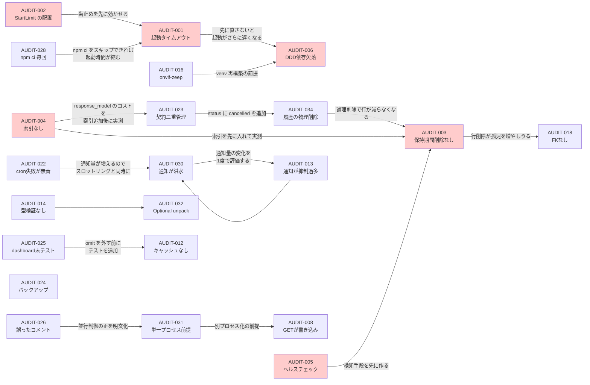

# リポジトリ総合監査レポート — 詳細所見（AUDIT-012 〜 AUDIT-034）

**親レポート**: [REPOSITORY_AUDIT_2026-09-18.md](./REPOSITORY_AUDIT_2026-09-18.md)
**監査日**: 2026-09-18 ／ **対象コミット**: `0e86ffa` (master)

本ファイルは親レポート第4章の続きである。AUDIT-001 〜 AUDIT-011（HIGH 6件と
MEDIUM の上位5件）は親レポートに記載した。重要度・優先度の一覧は親レポート第3章を参照。

---

## AUDIT-012 — ダッシュボードにキャッシュが無いのに `st.cache_data.clear()` を呼んでいる

- **カテゴリ**: Performance ／ **重要度**: MEDIUM ／ **優先度**: P1 ／ **難易度**: S

**問題**
Streamlit のダッシュボードは再実行のたびに約 33,000 行を SQLite から読み直す。
「データを更新」ボタンは `st.cache_data.clear()` を呼ぶが、
**`@st.cache_data` / `@st.cache_resource` のデコレータはリポジトリ全体に1つも存在しない。**

**根拠**
- `MY_HOME_SYSTEM/dashboard.py:53` — `st.cache_data.clear()`
- `grep -n "cache_data\|cache_resource\|st.cache" dashboard.py views/dashboard/*.py services/analysis_service.py`
  の結果は上記1行のみ。**デコレータの定義箇所は0件**
- `dashboard.py:123-131`（`main()` 内、再実行ごとに毎回実行される）:
  - `analysis_service.load_sensor_data(limit=10000)` → 3テーブル分（`device_records` /
    `switchbot_meter_logs` / `power_usage`）で最大 30,000 行
  - `load_generic_data(SQLITE_TABLE_CHILD)` / `(DEFECATION)` / `(FOOD)` / `(CAR)` → 各 500 行（既定）
  - `load_generic_data("security_logs", limit=100)` → 100 行
  - `load_bicycle_data(limit=3000)` → 3,000 行
  - `load_nas_status()` → 1 行
- `services/analysis_service.py:199-206` — `query_legacy` は
  `FROM device_records ORDER BY timestamp DESC LIMIT {limit}`。
  **既存インデックス `idx_device_records_device_ts` は先頭列が `device_id` のため、
  この `ORDER BY timestamp` には使えない → 全件スキャン + ソート**

**なぜ問題なのか**
Streamlit はウィジェット操作・タブ切り替え・ページ読み込みのたびにスクリプト全体を
再実行する。したがって「タブを1回切り替える」＝「33,000 行の読み込み + 3回のフルスキャンソート」である。

`st.cache_data.clear()` が書かれていることは、**作者がキャッシュが効いていると認識していた**
ことを示している。実際には効いていないため、「データを更新」ボタンは
`st.rerun()` の部分しか意味を持っていない（毎回最新を読んでいるので結果は正しいが、
ボタンを押さなくても常に最新である）。

さらにこのダッシュボードは Issue #646 以降スマートフォンからも
`unified_server`（8000番）経由で到達できるようになった。
アクセス経路が増えた分、この負荷が発生する頻度も上がっている。

**発生条件**
ダッシュボードを開く・操作するたび。常時。

**影響**
- **性能影響**: Pi の SD カード I/O と CPU を1操作あたり数百ミリ秒〜数秒占有する。
  AUDIT-003（保持期間削除なし）により `device_records` が増えるほど線形に悪化
- **データ影響（連鎖）**: 長時間の読み取りが `unified_server` 側の書き込みと競合し、
  `database is locked` の確率を上げる。`analysis_service.py:39` のコメントが
  「以前は10秒で、バックアップや保持期間削除と重なると "database is locked" になりえた」と
  書いているとおり、この競合は既に認識されている
- **ユーザー影響**: スマホからのダッシュボード操作の体感が悪い

**推奨対策**

*最小修正（推奨）*
`analysis_service` の読み込み関数に `@st.cache_data` を付ける。
ただし `analysis_service` は `unified_server`（Streamlit 非依存）からも import されるため、
**`analysis_service` に直接 Streamlit 依存を持ち込んではいけない。**
`views/dashboard/common.py` にキャッシュ済みラッパーを置くのが正しい層である。

```python
# views/dashboard/common.py
import streamlit as st
from services import analysis_service

# dashboard.py:53 の st.cache_data.clear() は元々このキャッシュの存在を前提に
# 書かれていたが、実際には @st.cache_data が1つも無く、Streamlit の再実行
# (タブ切替・ウィジェット操作・ページ読み込み)ごとに約33,000行を読み直していた。
# analysis_service は unified_server からも import されるため Streamlit 依存は
# ここ(Viewレイヤ)に閉じ込める。
@st.cache_data(ttl=60)
def load_sensor_data_cached(limit: int = 10000):
    return analysis_service.load_sensor_data(limit=limit)

@st.cache_data(ttl=60)
def load_generic_data_cached(table_name: str, limit: int = 500):
    return analysis_service.load_generic_data(table_name, limit=limit)
```
`ttl=60` はセンサーの更新間隔（5分）より短いため、鮮度は実質劣化しない。
`dashboard.py` の呼び出しを `view_common.load_*_cached(...)` に置き換える。

*推奨修正*
`load_sensor_data` の `limit=10000` を見直す。ダッシュボードのグラフは
実際には直近数日分しか描画していない可能性が高いので、
`WHERE timestamp >= ?` による期間指定に変えれば、`(timestamp)` 単独インデックスの
追加とあわせて読み込み行数を1〜2桁削減できる。
AUDIT-004 のマイグレーションに `CREATE INDEX idx_device_records_ts ON device_records(timestamp DESC)` を
含めることを検討する（ただし書き込み頻度が高いテーブルなので、
期間指定の導入とセットで効果を測ってから判断するのが望ましい）。

*大規模改善*
ダッシュボードのデータ取得を `unified_server` 側の API に寄せ、
`/api/system/dashboard-data` のような集約エンドポイントで
サーバー側キャッシュ（時系列の集計結果）を返す。
ただし現在の構成で得られる利益は小さいため優先度は低い。

**副作用**
`ttl` 分だけ表示が古くなる。「データを更新」ボタン（`st.cache_data.clear()`）が
ようやく意味を持つようになるため、ユーザー体験としては改善方向。

---

## AUDIT-013 — Discord 通知が部分文字列マッチで抑制され、実障害が無音になる

- **カテゴリ**: Operations ／ **重要度**: MEDIUM ／ **優先度**: P2 ／ **難易度**: S

**問題**
`DiscordErrorHandler.emit()` は `"Discord" not in str(record.msg)` を条件に通知を送る。
通知システム自身の失敗による無限ループを防ぐ意図だが、条件が広すぎて
**「Discord」という語を含む正当な障害ログがすべて通知されない。**

**根拠**
- `MY_HOME_SYSTEM/core/logger.py:98`:
  ```python
  if record.levelno >= logging.ERROR and "Discord" not in str(record.msg):
  ```
- 意図された抑制対象（正当）:
  - `services/notification_service.py:68` — `logger.error(f"Discord API エラー: {res.status_code} - {res.text}")`
  - `services/notification_service.py:73` — `logger.error(f"Discord送信失敗: {e}")`
- **意図せず抑制されている実障害**:
  - `monitors/smart_timelapse_generator.py:577` —
    `logger.error("Discord Webhook URLが設定されていないため動画を送信できません。")`
    → **設定不備そのものが通知されない**
  - `monitors/smart_timelapse_generator.py:646` — `logger.error(f"Discord送信中に例外発生: {e}")`
  - `monitors/smart_timelapse_generator.py:652` — `logger.error(f"Discord送信失敗: {file_name}")`
    → **タイムラプス動画の配信失敗が誰にも通知されない**
  - `DDD/newface_monitor.py:700` / `:766` / `:815` —
    `logger.error(f"Failed to send notification for {cast.name}: ... {redact_discord_webhook_url(e)}")`
    等。関数名に `discord` を含むため `record.msg` にも含まれうる
- 参考（実害の無い例）: `monitors/memory_monitor.py:131` の
  「メモリ異常を検知しました。Discordへエラー通知を送信します。」は抑制されるが、
  直後に `send_push(...)` で別経路の通知を行っているため実害はない

**なぜ問題なのか**
`record.msg` はフォーマット前の文字列である。f-string を使っている箇所では
最終メッセージと同じだが、`logger.error("... %s", arg)` 形式では
引数側の「Discord」は判定されない。**つまり抑制の挙動がログの書き方に依存して変わる**という
実装上の不整合もある（`core/logger.py:157` の
`_webhook_failure_logger.warning("Discord webhook送信に失敗しました: %s ...", ...)` は
そもそも別ロガーなので対象外）。

より本質的な問題は、**「通知ループを防ぐ」という要件を「メッセージ内容の推測」で
実装している**ことである。要件は「通知システムの失敗を通知しようとしない」であって、
「Discord という語を含むログを通知しない」ではない。

**発生条件**
タイムラプス生成が失敗する、`DISCORD_WEBHOOK_*` の設定が抜ける、
DDD の通知が失敗する、のいずれか。

**影響**
- **運用影響**: タイムラプスの配信失敗（毎日09:15 / 15:15 の cron）が
  無音で続く。`run_task.sh` も通知しない（AUDIT-022）ので、
  「気づく契機が2重に無い」
- **開発影響**: `logger.error` が通知されるかどうかがメッセージの文面に依存するため、
  新しいエラーログを書くときに挙動を予測できない

**推奨対策**

*最小修正（推奨）*
抑制の判定を、内容の推測から明示的なフラグへ変える。

```python
# core/logger.py
class DiscordErrorHandler(logging.Handler):
    def emit(self, record):
        # 以前は `"Discord" not in str(record.msg)` で判定していたが、これは
        # 「通知システム自身の失敗を通知しようとしない」という要件を
        # メッセージ内容の推測で実装したもので、対象が広すぎた。
        # 例: smart_timelapse_generator の「Discord送信失敗: {file_name}」
        # (タイムラプス配信の実障害)まで無音になっていた。
        # 抑制したい箇所が明示的に extra={"skip_discord": True} を付ける方式へ変える。
        if record.levelno < logging.ERROR:
            return
        if getattr(record, "skip_discord", False):
            return
        ...
```
`services/notification_service.py:68,73` の2箇所に
`logger.error(..., extra={"skip_discord": True})` を付ける。
それ以外の「Discord」を含むログは通知されるようになる。

無限ループの安全性は、`notification_service` が Discord 送信に失敗したときだけ
抑制されるため維持される。加えて `DiscordErrorHandler._send_webhook` の
失敗は既に `_webhook_failure_logger`（propagate=False の独立ロガー）へ逃がしてあるため、
ハンドラ内部からの再入は構造的に起きない。

*推奨修正*
上記に加えて `tests/test_logger.py`（既存）に
「`skip_discord` を付けたレコードは送信されない」「`Discord` を含むが
フラグの無いレコードは送信される」の2テストを追加する。

*大規模改善*
不要。

**副作用**
Discord への通知量が増える。これは意図した改善だが、
AUDIT-030（スロットリングなし）と組み合わせると通知が多くなりすぎる可能性がある。
**AUDIT-030 と同時に対応することを勧める。**

---

## AUDIT-014 — pyright の型チェックが実質無効

- **カテゴリ**: Code Quality ／ **重要度**: MEDIUM ／ **優先度**: P2 ／ **難易度**: M

**問題**
コードベースは網羅的に型注釈されているが、`pyrightconfig.json` が
`typeCheckingMode: "off"` のため、**型の整合性は一切検証されていない。**
有効なのは「未定義名・未束縛変数・await 漏れ」等の明確なバグ診断のみ。

**根拠**
- `MY_HOME_SYSTEM/pyrightconfig.json`:
  ```json
  "typeCheckingMode": "off",
  "reportUndefinedVariable": "error",
  "reportPossiblyUnbound": "error",
  "reportUnboundVariable": "error",
  "reportUnusedCoroutine": "error",
  "reportSelfClsParameterName": "warning",
  "reportUnhashable": "error"
  ```
- 現行設定での実行結果: **エラー 0件**（警告83件はすべて未解決 import）
- `typeCheckingMode: "basic"` + `reportMissingImports: none` で実行した結果（85ファイル）:
  **エラー 121件**
  | ルール | 件数 |
  | --- | --- |
  | `reportCallIssue` | 40 |
  | `reportAttributeAccessIssue` | 27 |
  | `reportArgumentType` | 27 |
  | `reportOptionalMemberAccess` | 16 |
  | `reportPrivateImportUsage` | 5 |
  | `reportReturnType` | 3 |
  | `reportGeneralTypeIssues` | 2 |
  | `reportAssignmentType` | 1 |

- `services/quest_service.py:125-127` のコメントは
  「mypy がこの1行で解析を停止しコードベース全体を検証できなくなっていた」と
  過去の経緯を記録しており、Issue #487/#532 で pyright に移行した判断が記録されている。
  つまり**「型チェッカを動かすこと」は達成されたが「型を検証すること」は未達**の状態

**なぜ問題なのか**
121件の多くはサードパーティのスタブ起因（`cryptography` の `MLKEM768PublicKey` に
`verify` が無い、`pandas` の `Series`/`DataFrame` の曖昧さ、`linebot.v3` の `StrictStr`）で
実害が無い。Issue #532 でこれを理由に `off` にした判断は理解できる。

しかし**`reportOptionalMemberAccess` の16件には真の潜在バグが含まれる。**
これらは「`None` になりうる値のメンバにアクセスしている」であり、
このリポジトリが過去に何度も 500 エラーとして経験してきた失敗モードそのものである
（`#409` の「`os.path.splitext(None)` の TypeError → 500」、
`approval_service.py:97-99` の「`_apply_quest_rewards` 内で TypeError → 500」など）。

つまり**型チェッカを無効にしている一方で、型チェッカが検出できる種類のバグを
実行時に踏んでから個別に修正している。**

実際に確認できる候補:
| 箇所 | 診断 |
| --- | --- |
| `services/routine_service.py:154` | `"None" is not iterable`（`get_checklist_range` の Optional 戻り値を unpack） |
| `services/routine_service.py:516` | 同上 |
| `services/routine_service.py:449` | `"split" is not a known attribute of "None"` |
| `monitors/health_watch.py:374-375` | `proc.stdin` が `None` の可能性（`write`/`close`） |
| `monitors/smart_timelapse_generator.py:316,329` | `proc.stdout`/`stderr` が `None` の可能性（`read`） |
| `handlers/line_handler.py:283,404` | `event.source` が `None` の可能性（`user_id`） |
| `handlers/line_logic.py:415` | 同上 |
| `handlers/alexa_handler.py:84-85` | `request_envelope.context` が `None` の可能性 |

`core/database.py:46-53` の4件（`conn` が `None` の可能性）は**偽陽性**である。
リトライループが必ず `break` または `raise` で抜けるため `conn` は `None` になり得ないが、
pyright はその制御フローを追えていない。`assert conn is not None` を1行入れれば消える。

**発生条件**
`None` が実際に渡る経路（LINE の一部イベント種別で `event.source` が `None`、
`subprocess.Popen` のパイプ未指定など）。
`line_handler` は `dispatch_events_async` がイベント単位で例外を隔離しているため
1件の失敗が全体を壊すことはない。

**影響**
- **開発影響**: **これが主たる影響。** 型注釈が「書かれているだけで検証されていない」ため、
  リファクタリング時の安全網として機能しない。`services/quest_service.py` の
  1,572行→パッケージ分割（Issue #550）のような大きな変更を、型の助けなしで行っている
- **ユーザー影響**: 潜在的な 500 エラー。ただしエラーハンドリングが厚いため
  致命的にはなりにくい
- **将来的な悪化**: 中。コードが増えるほど未検証の型注釈も増える

**推奨対策**

*最小修正*
`typeCheckingMode` は `off` のまま、**Optional 系の診断だけを追加で有効にする。**
これは既存の方針（「明確なバグ診断だけを error にする」）の自然な拡張である。

```json
{
  "typeCheckingMode": "off",
  "reportUndefinedVariable": "error",
  "reportPossiblyUnbound": "error",
  "reportUnboundVariable": "error",
  "reportUnusedCoroutine": "error",
  "reportSelfClsParameterName": "warning",
  "reportUnhashable": "error",
  "reportOptionalMemberAccess": "error",
  "reportOptionalSubscript": "error",
  "reportOptionalIterable": "error",
  "reportOptionalOperand": "error"
}
```
これで有効になるのは 16 + 2 件程度（サードパーティのスタブ起因の
`reportCallIssue` / `reportAttributeAccessIssue` / `reportArgumentType` は含まれない）。
ブロッキング化する前に、`core/database.py` の偽陽性4件に `assert` を入れ、
`routine_service.py` の3件を実際に修正する必要がある。

*推奨修正*
上記を通したうえで、ファイル単位で `typeCheckingMode: "basic"` を段階的に適用する。
pyright は `executionEnvironments` でディレクトリ別の設定を持てるので、
`services/quest/`（分割済みで型注釈が新しい）から始めるのが現実的。

*大規模改善*
全体を `basic` にし、サードパーティのスタブ問題を
`reportPrivateImportUsage: "none"` 等の個別無効化と `# type: ignore` で処理する。
**121件の棚卸しコストに対する利益が不明なため、現時点では推奨しない。**

**副作用**
診断を追加すると CI が赤くなるため、修正とセットでリリースする必要がある。
Issue #482 の「Dependabot 赤 CI 常態化」と同じ轍を踏まないよう、
1コミットで診断追加 + 修正を行うこと。

---

## AUDIT-015 — `requirements.in` と `requirements.txt` の同期を検証するゲートが無い

- **カテゴリ**: CI/CD ／ **重要度**: MEDIUM ／ **優先度**: P2 ／ **難易度**: S

**問題**
`CLAUDE.md` は「依存の追加・変更は `requirements.in` を編集し、`pip-compile` で
lock を再生成する（手で編集しない。Issue #647）」と規定しているが、
**CI にこれを検証するステップが存在しない。**

**根拠**
- `grep -n "pip-compile\|requirements.in" .github/workflows/*.yml .github/scripts/*.py` → **ヒット0件**
- `.github/workflows/test.yml` の lint / test / security ジョブはいずれも
  `pip install -r requirements.txt`（または `-dev.txt`）のみ
- 対照: 同じ「コードとドキュメント/生成物の整合」を守るテストは他に複数ある
  - `tests/test_current_schema_sql.py` — `current_schema.sql` が `migrations/` からの
    再生成結果と完全一致することを検証
  - `tests/test_env_example_consistency.py` — `.env.example` と `config.py` の整合
  - `.github/scripts/test_docs_ci_consistency.py` — ドキュメント中の
    `--cov-fail-under` が `test.yml` と一致
  - `tests/test_coveragerc.py` — `.coveragerc` の各エントリが実在するパスに一致

**つまり「生成物の整合を機械的に担保する」という発想はこのリポジトリに確立している。
`requirements.txt` だけがその対象から漏れている。**

**なぜ問題なのか**
2つの方向で壊れうる。

1. `requirements.in` だけを編集して `pip-compile` を忘れる → CI は緑。
   実機は古い lock でインストールするため、**追加した依存が入らない**。
   AUDIT-006（DDD の依存欠落）と同じ失敗モード
2. `requirements.txt` を手で編集する → CI は緑。次に誰かが `pip-compile` を
   実行した瞬間に手編集が消える。Issue #647 が解決しようとした
   「Dependabot が pydantic と pydantic_core を独立に最新化して
   `ResolutionImpossible` になる」状態が再発しうる

`requirements.in` は 40 行程度で、`requirements.txt` は 280 行の lock である。
この乖離は目視では検出できない。

**発生条件**
`requirements.in` または `requirements.txt` を含む PR。Dependabot の PR も含む。

**影響**
- **開発影響**: CLAUDE.md の規約が守られているかどうかが確認できない
- **運用影響**: 実機のインストール内容がリポジトリの宣言と乖離する
- **将来的な悪化**: 低〜中（Dependabot は `pip-compile` 形式を認識するため、
  自動更新経路では壊れにくい。手動編集時のリスクが主）

**推奨対策**

*最小修正（推奨）*
lint ジョブに1ステップ追加する。

```yaml
      - name: requirements lock is in sync with requirements.in (blocking)
        # CLAUDE.md は「requirements.in を編集し pip-compile で lock を再生成する
        # (手で編集しない。Issue #647)」と規定しているが、これを機械的に担保する
        # ゲートが無く、pip-compile を忘れた PR / requirements.txt の手編集が
        # いずれも緑で通っていた。current_schema.sql(test_current_schema_sql.py)や
        # .env.example(test_env_example_consistency.py)と同じ「生成物の整合検証」を
        # 依存の lock にも適用する。
        run: |
          pip install pip-tools
          for pair in "requirements.in:requirements.txt" "requirements-dev.in:requirements-dev.txt"; do
            src="${pair%%:*}"; lock="${pair##*:}"
            pip-compile --quiet --strip-extras --no-emit-index-url \
              --output-file "/tmp/$lock" "$src"
            if ! diff -u "$lock" "/tmp/$lock"; then
              echo "::error::$lock が $src と同期していません。pip-compile で再生成してコミットしてください。" >&2
              exit 1
            fi
          done
```

**注意**: `pip-compile` の出力はコメントに実行コマンドを含むため、
`--output-file` のパスが異なると diff に差が出る。
実装時は `--output-file` を同名にする（一時ディレクトリで実行する）か、
`diff` の前にヘッダコメント行を除去する必要がある。
CLAUDE.md に記載された正確なコマンド
（`pip-compile --strip-extras --no-emit-index-url --output-file requirements.txt requirements.in`）を
そのまま使うこと。

*推奨修正*
上記に加えて、`.github/scripts/` に Python のテストとして実装する
（`test_docs_ci_consistency.py` と同じ位置づけ）。
そうすればローカルでも `python -m pytest .github/scripts/` で確認できる。

*大規模改善*
不要。

**副作用**
`pip-compile` は解決のためにネットワークアクセスを行うため、
lint ジョブの所要時間が延びる（数十秒程度）。
`--no-upgrade` 相当の挙動（既存 pin を維持）になるので結果は安定する。

---

## AUDIT-016 — `onvif-zeep` がビルド不能になりうる（環境再構築の単一障害点）

- **カテゴリ**: Dependencies ／ **重要度**: MEDIUM ／ **優先度**: P2 ／ **難易度**: M

**問題**
`onvif-zeep==0.2.12` は wheel を提供せず `setup.py` からのビルドを要求するが、
新しい `setuptools` ではビルドに失敗する。1つの依存が
**`.venv` の再構築を丸ごと止める**単一障害点になっている。

**根拠**
- `MY_HOME_SYSTEM/requirements.txt:131` — `onvif-zeep==0.2.12`
- `MY_HOME_SYSTEM/requirements.in` — `onvif_zeep`（IoT / カメラ節）
- **本監査環境で実際に失敗を再現した**（Python 3.11 / setuptools は Debian 同梱版）:
  ```
  File ".../setuptools/command/install_lib.py", line 17, in finalize_options
    self.set_undefined_options('install',('install_layout','install_layout'))
  AttributeError: install_layout. Did you mean: 'install_platlib'?
  ERROR: Failed building wheel for onvif-zeep
  ERROR: Could not build wheels for onvif-zeep, which is required to install pyproject.toml-based projects
  ```
  この1件の失敗で `pip install -r requirements.txt` 全体が中断し、
  **他の 279 パッケージも1つもインストールされなかった。**
- 利用箇所: `monitors/camera_monitor.py:25-26`（`from onvif import ...` / `from onvif.client import ...`）と
  `core/onvif_utils.py`（WSDL 探索。31行）
- `onvif-zeep` の最終リリースは 2018 年頃で、実質的に未保守である

**なぜ問題なのか**
AUDIT-001（起動タイムアウト）と AUDIT-006（venv の再現性）の両方に絡む。

- `start_all.sh` Phase 1.5 は `requirements.txt` のハッシュが変わると
  `pip install -r requirements.txt` を実行する。ここで `onvif-zeep` の
  ビルドが失敗すると**`requirements.txt` の全パッケージの更新が適用されない**
  （失敗時は「既存 `.venv` で起動を続ける」設計なので即座には壊れないが、
  新しい依存を必要とするコードが入っていれば ImportError になる）
- `.venv` を作り直す必要が生じた場合（ディスク障害・Python バージョン更新・
  新しいホストへの移行）、**この1件で復旧が止まる**
- CI では現在ビルドが通っている（GitHub Actions の setuptools バージョンでは動く）ため、
  **CI は緑のまま実機の復旧だけが不可能になる**という最悪の非対称が起こりうる

**発生条件**
`setuptools` が `install_layout` 属性を持たないバージョンの環境で
`onvif-zeep` をソースからビルドしようとしたとき。
Raspberry Pi OS の `setuptools` が今後更新されれば発現する。
**現時点で実機の `setuptools` バージョンは不明。**

**影響**
- **運用影響**: 環境再構築の不能化。DR（新しい Pi への移行）が止まる
- **開発影響**: 新しい開発環境で `pip install` が通らない（本監査で実際に遭遇した）
- **将来的な悪化**: **高い。** 未保守パッケージなので、環境側が新しくなるほど
  壊れる確率が上がる

**推奨対策**

*最小修正*
`setuptools` のバージョンを lock 側で固定する。`requirements-dev.in` ではなく
**インストール手順**の問題なので、`start_all.sh` Phase 1.5 と CI の両方で
`pip install "setuptools<81"` を先に実行する。

```bash
# start_all.sh Phase 1.5
# onvif-zeep(0.2.12、2018年最終リリース、wheel 無し)は新しい setuptools の
# install_lib で AttributeError: install_layout となりビルドに失敗する。
# 1件の失敗で requirements.txt 全体のインストールが中断するため、
# ビルドが通る setuptools を先に固定する。
"$PYTHON_EXEC" -m pip install --quiet "setuptools<81" wheel
```
CI（`test.yml` の test ジョブ）にも同じ1行を入れ、
**CI と実機で同じ制約下でインストールされる**ようにする
（Issue #403 で `.python-version` を共有した判断と同じ考え方）。

*推奨修正*
ONVIF の利用範囲を確認して依存を置き換える。
利用は `monitors/camera_monitor.py` と `core/onvif_utils.py`（31行）の2箇所で、
用途は WSDL 探索とカメラの ONVIF 操作に限られる。
保守されている代替（`onvif-zeep-async`、または `zeep` を直接使った自前実装）へ
移すコストは、`core/onvif_utils.py` が既に薄い抽象層になっていることを考えると
それほど大きくない。**ただし実機のカメラで動作確認が必要なため、
ラズパイ実機作業を伴う（`docs/runbooks/ラズパイデプロイ前動作検証手順.md` の対象）。**

*大規模改善*
ONVIF 依存を `camera_monitor` のオプション機能にし、
import 失敗時は ONVIF を使わないモードで動作させる。
既に `try/except ImportError` のフォールバックを持つ DDD と同じパターン。
これなら `onvif-zeep` がインストールできない環境でも
システム全体は動く（カメラの ONVIF 機能だけが縮退する）。

**副作用**
最小修正の `setuptools<81` は他のパッケージのビルドに影響しうるが、
`requirements.txt` の 280 パッケージの大半は wheel を提供しているため
実害は小さい。CI で確認できる。

---

## AUDIT-017 — 削除済み機能の残骸がスキーマに残っている

- **カテゴリ**: Database ／ Maintainability ／ **重要度**: MEDIUM ／ **優先度**: P2 ／ **難易度**: M

**問題**
2026年8月のリファクタリングで削除された機能（ボス戦・装備・ギルド・マイレージ・
週間ランキング）のテーブルが、ベースラインスキーマに残り続けている。
さらに現行テーブルと紛らわしい旧テーブルが2組ある。

**根拠**
`MY_HOME_SYSTEM/current_schema.sql`（`migrations/0000_baseline_schema.sql` からの生成物）に
存在するが、リポジトリのどのコードからも参照されていないテーブル:

| テーブル | 対応する削除済み機能 |
| --- | --- |
| `users` | **`quest_users` の旧版。** `id`/`user_id`/`name`/`level`/`xp`/`gold`/`status`/`job_class`/`medal_count`/`avatar`。`quest_users` とほぼ同じ列構成で `exp` が `xp` になっている |
| `quests` | **`quest_master` の旧版。** `quest_id`/`title`/`xp_reward`/`gold_reward`/`difficulty`/`quest_type`/`icon_key`/`start_date`/`end_date` |
| `party_state` | ボス戦（`current_boss_id`/`current_hp`/`max_hp`/`total_damage`/`charge_gauge`） |
| `equipment_master` | 装備 |
| `user_equipments` | 装備 |
| `family_mileage` | マイレージ |
| `family_mileage_history` | マイレージ |
| `bounties` | 賞金クエスト（CLAUDE.md の削除機能一覧には無いが参照コードが存在しない） |
| `suumo_records` | 物件情報収集（`financial_service.py` 削除と同時期と推定） |

重複列:
- `quest_master.days` と `quest_master.day_of_week` — `services/quest/quest_service.py:98-99` の
  コメントが「DB生データには 'days' キーがなく、'day_of_week' カラムが存在する」と説明しており、
  **`days` 列は実際には使われていない**（`filter_active_quests` が
  Python 側で `q['days']` を組み立てて返すが、それは DB 列とは無関係）
- `reward_master.desc` と `reward_master.description` — `game_system.py:267-271` が
  「`desc` は `description` の同期用レガシー列であり、このビュー応答では
  `description` のみを正として `desc` 自体を落とす」と明記

**なぜ問題なのか**
**`users` と `quests` の存在が最も危険である。** 新しくこのコードベースに触る人
（または将来の自分、あるいは AI エージェント）が
「ユーザーテーブルは `users` だろう」と推測して書き込むと、
サイレントに間違ったテーブルへ書く。SQLite は
`INSERT INTO users (...)` を問題なく受け付けるため、
**エラーにならずデータが行方不明になる。**

`quest_master.days` も同種のリスクを持つ。`day_of_week` を更新すべき場面で
`days` を更新しても SQL は成功する。

なお `migrations/README.md` は「新しいテーブルの追加もベースラインの書き換えではなく
新しい `NNNN_*.sql` で行う」と規定しているため、
これらを消すのも新しいマイグレーションで行う必要がある。

**発生条件**
新規開発時の誤ったテーブル選択。頻度は低いが、起きたときの検出が難しい。

**影響**
- **開発影響**: **これが主。** スキーマから「何が現行か」が読み取れない。
  9テーブル中どれが生きているかを判断するには全コードを grep する必要がある
- **データ影響**: 誤ったテーブルへの書き込み（起きれば深刻だが確率は低い）
- **性能影響**: 無視できる（空テーブルはコストを生まない）
- **運用影響**: バックアップサイズの無駄（行が残っている場合）

**推奨対策**

*最小修正（低リスク・即効）*
DROP する前に、**スキーマに「使われていない」ことを明示する。**
`migrations/` はスキーマの唯一の定義元なので、
`docs/specifications/MY_HOME_SYSTEM/init_unified_db.md`（または
`migrations/README.md`）に「退役済みテーブル一覧」を追記し、
`current_schema.sql` の冒頭コメント（生成物なので生成スクリプト側）に
警告を入れる方法が最もリスクが低い。

さらに `tests/` に「退役済みテーブルへの参照がコード内に無い」ことを
検証する回帰テストを追加すると、誤用を CI で防げる。

```python
# tests/test_retired_tables_unused.py
"""退役済みテーブルがコードから参照されないことの回帰テスト。

2026年8月のリファクタリング(ボス戦・装備・ギルド・マイレージ削除)で
使われなくなったテーブルがベースラインスキーマに残っている。とくに
`users`(quest_users の旧版)と `quests`(quest_master の旧版)は現行テーブルと
紛らわしく、誤って INSERT しても SQLite はエラーにしないため、
データがサイレントに行方不明になる。
"""
RETIRED_TABLES = [
    "users", "quests", "party_state", "equipment_master", "user_equipments",
    "family_mileage", "family_mileage_history", "bounties", "suumo_records",
]
```

*推奨修正*
実機の各テーブルの行数を確認したうえで（親レポート 1.5節の確認事項4）、
**行数 0 のものから** `migrations/0014_drop_retired_tables.sql` で DROP する。

```sql
-- 2026年8月のリファクタリングで削除された機能の残骸テーブルを撤去する。
-- 「既に無いDBに対して再実行されても安全」でなければならない(migrations/README.md)ため
-- IF EXISTS を付ける。
DROP TABLE IF EXISTS party_state;
DROP TABLE IF EXISTS equipment_master;
DROP TABLE IF EXISTS user_equipments;
DROP TABLE IF EXISTS family_mileage_history;
DROP TABLE IF EXISTS family_mileage;
DROP TABLE IF EXISTS bounties;
DROP TABLE IF EXISTS suumo_records;
-- users / quests は quest_users / quest_master の旧版。行が残っている場合は
-- 移行済みか確認してから別マイグレーションで落とす。
```
`init_unified_db.py --dump-schema` で `current_schema.sql` を再生成してコミットする
（`tests/test_current_schema_sql.py` が一致を検証する）。

重複列（`quest_master.days` / `reward_master.desc`）は SQLite の
`ALTER TABLE DROP COLUMN` が使えるバージョンなら落とせるが、
**AUDIT-018（FK 追加）でテーブル再作成を行う際にまとめて処理するほうが効率的**。

*大規模改善*
不要。

**副作用**
DROP は不可逆。実行前に (a) 行数 0 の確認、(b) バックアップの成功確認、
(c) `grep` によるコード参照 0 件の確認、を必須の前提とする。
**`users` と `quests` に行が残っている場合は、`quest_users`/`quest_master` への
移行が完了しているかを先に確認すること**（旧データが唯一の記録である可能性）。

---

## AUDIT-018 — 参照整合性がほぼ無く、防御的コードで代替している

- **カテゴリ**: Database ／ Architecture ／ **重要度**: MEDIUM ／ **優先度**: P2 ／ **難易度**: L

**問題**
`PRAGMA foreign_keys=ON` を設定しているのに、外部キー宣言は1つしかない。
その結果、「本来 DB が防げる不整合」への防御がアプリ層に散在している。

**根拠**
- `core/database.py:33` — `conn.execute("PRAGMA foreign_keys=ON;")`
- `current_schema.sql` 中の `FOREIGN KEY` 宣言は**1つだけ**:
  `user_inventory.reward_id REFERENCES reward_master(reward_id)`
- FK が無い主要な関係:
  | 子 | 親 | 現状 |
  | --- | --- | --- |
  | `quest_history.user_id` | `quest_users.user_id` | FK なし |
  | `quest_history.quest_id` | `quest_master.quest_id` | FK なし |
  | `quest_history.linked_history_id` | `quest_history.id` | FK なし（自己参照） |
  | `reward_history.user_id` | `quest_users.user_id` | FK なし |
  | `reward_history.reward_id` | `reward_master.reward_id` | FK なし |
  | `user_inventory.user_id` | `quest_users.user_id` | FK なし |
  | `routine_progress.user_id` | `quest_users.user_id` | FK なし |
  | `routine_step_events.user_id` | `quest_users.user_id` | FK なし |

不整合への防御としてアプリ層に散在しているコード（すべてコメントに
「以前は 500 になっていた」と記録されている）:
- `services/quest/approval_service.py:97-99` —
  「履歴のユーザーがマスタから消えている場合、以前は `_apply_quest_rewards` 内で
  TypeError → 500 になっていた」→ 404 を返す防御を追加
- `services/quest/approval_service.py:104-107` —
  「`quest_history.gold_earned`/`exp_earned` は NULL 許容列のため、
  サービス外で挿入された行を承認すると `user['gold'] + None` の
  TypeError → 500 になっていた」→ `or 0` の防御
- `services/quest/approval_service.py:139-141` —
  「`quest` はマスタから削除された `quest_id` の pending 履歴を承認する場合 None になり得る
  （`sync_master_data` の `DELETE ... NOT IN` でマスタ行が消えても
  `quest_history` は残るため）」→ `if quest and ...` の防御
- `services/quest/approval_service.py:175-177` — `_approve_linked_history` の
  `if not linked_user: return None`
- `services/quest/quest_service.py:239-241` — 「前提クエストがマスタから消えている場合は
  daily 扱い」
- `services/quest/quest_service.py:283-286` — 「role が NULL/未知のユーザー
  （migration 0001 対象外の `user_id` や、`MasterUser.role=None` で同期された行）は
  承認ゲート無しで即時報酬を得られていた」（Q-M2 / #370）
- `services/quest/rewards.py:24-25` / `approval_service.py:280` — メダル列の有無を
  `'medals_earned' in hist.keys()` で確認

**注目すべき対照**: FK が存在する `user_inventory.reward_id` については、
`game_system.py:243-252` が **IntegrityError を経験して正しい対処を実装している**
（「`user_inventory` は `reward_master(reward_id)` への FK を持つため、
所持者がいる報酬を削除すると IntegrityError で `sync_master_data` 全体が失敗する。
参照が残っている報酬は削除をスキップし、警告ログのみ出す」）。

**つまり FK がある関係では不整合が「起きる前に」止められ、
FK が無い関係では不整合が「500 エラーとして発現してから」個別に None チェックが足されている。**
これが親レポート RC-5 の根拠である。

**なぜ問題なのか**
1. **同じ種類のバグが繰り返し発生する。** 上記の防御はすべて別々の Issue（#370 / #409 / #550 系）で
   個別に追加されたものである。新しいコードパスを足すたびに同じ検討が必要になる
2. **孤児行が実際に生成される経路がある。** `sync_master_data`（`DELETE FROM quest_master
   WHERE quest_id NOT IN (...)`）と `reset_user_data`（`DELETE FROM quest_history WHERE user_id = ?` は
   整合的だが `reward_history` は残す設計）。前者は AUDIT-009 により**無認可で誰でも実行できる**
3. **データの正しさが「アプリを経由したかどうか」に依存する。** コメントが
   「サービス外で挿入された行」という前提を置いているとおり、
   手動 SQL・`reset_game.py`（現在は API 経由）・将来のスクリプトが不整合を作れる

**発生条件**
`quest_master` / `reward_master` からの行削除（`sync_master_data`）、
`quest_users` の削除（現在そのコードパスは無いが、手動 SQL で可能）。

**影響**
- **開発影響**: **これが主。** 防御的コードが増え続け、
  「この値が None になりうるか」を毎回コードから推論する必要がある
- **データ影響**: 孤児行の蓄積。現在の実数は**不明**
- **ユーザー影響**: 承認時の 404 / ボーナス計算の誤り（すべて防御済みなので
  現時点で顕在化しているものは無い）

**推奨対策**

段階的に進める。**AUDIT-003（行削除の実装）より後に着手すべき**である
（保持期間削除が孤児を増やす可能性があるため、両方を同時に設計する必要がある）。

*ステップ1: 検知（最小修正・推奨）*
孤児行の実数を測る。`health_watch.py` のチェックとして追加するのが良い
（既に7チェックと通知・抑制の仕組みを持つ）。

```python
def check_orphaned_rows() -> Optional[str]:
    """参照整合性の破れ(孤児行)を検知する。

    quest_history / reward_history / user_inventory / routine_progress は
    quest_users・quest_master への外部キーを持たないため(FKは
    user_inventory.reward_id の1つだけ)、sync_master_data の
    DELETE ... NOT IN や手動SQLで参照先が消えても行が残る。
    サービス層はこの状態を個別のNoneチェックで凌いでいるが、
    実際にどれだけ発生しているかは測られていない。
    """
    checks = [
        ("quest_history.user_id",
         "SELECT COUNT(*) FROM quest_history h "
         "LEFT JOIN quest_users u ON h.user_id = u.user_id WHERE u.user_id IS NULL"),
        ("quest_history.quest_id",
         "SELECT COUNT(*) FROM quest_history h "
         "LEFT JOIN quest_master q ON h.quest_id = q.quest_id "
         "WHERE q.quest_id IS NULL AND h.quest_id != 0"),  # quest_id=0 はアイテム使用
        ...
    ]
```
`quest_id = 0` はアイテム使用ログ（`inventory_service.py:141-144`）なので
孤児判定から除外する必要がある点に注意。

*ステップ2: NULL 許容の解消（難易度 S）*
`quest_history.gold_earned` / `exp_earned` に `DEFAULT 0 NOT NULL` を付ける。
これだけで `approval_service.py:104-107` と `rewards.py` の `or 0` 防御が不要になる。
SQLite では既存列への `NOT NULL` 追加はテーブル再作成が必要だが、
`migrations/README.md` の「再実行しても安全」要件を満たす形で書ける。

*ステップ3: FK の追加（難易度 L）*
ステップ1で孤児 0 を確認できた関係から追加する。
SQLite は `ALTER TABLE ADD CONSTRAINT` を持たないため、
「新テーブル作成 → データコピー → 旧テーブル DROP → RENAME」が必要。
`ON DELETE RESTRICT` にすれば `sync_master_data` が
`user_inventory.reward_id` と同じく IntegrityError で気づけるようになる
（そのときは `game_system.py:243-252` と同じ「参照が残る行は削除をスキップ」の
対処を `quest_master` にも適用する）。

**副作用**
FK 追加は `sync_master_data` の挙動を変える（マスタから消したいクエストに
履歴が残っていると削除がスキップされる）。これは**望ましい変化**だが、
`quest_data.py` からクエストを削除したときに DB に残り続けることになるため、
運用上の期待値を `migrations/README.md` に明記する必要がある。
テーブル再作成はデータ量に比例した時間がかかり、その間 DB をロックする。
バックアップ直後（04:30 等）に実行するか、停止時間を許容できるタイミングで行う。

---

## AUDIT-019 — 仕様書の行番号引用の 78% が未検証で、半数以上が陳腐化している

- **カテゴリ**: Documentation ／ **重要度**: MEDIUM ／ **優先度**: P2 ／ **難易度**: M

**問題**
仕様書はソース位置を「根拠」として行番号で引用するが、
ゲートで検証されているのは全体の 22% にすぎない。
残り 78% のサンプル調査では**52% が実ソースと一致しない。**

**根拠**
本監査で実行した結果:
```
$ python3 .github/scripts/check_spec_line_refs.py
✅ 行番号引用チェック: 1174件すべて実ソースの定義位置と一致しています。
EXIT=0

$ python3 .github/scripts/check_spec_line_refs.py --report
ℹ️ def/class 以外の引用の粗い照合: 4080件中 2127件が引用行±1に見つかりません。
   (このチェックはゲートではない。抜粋の表記ゆれによる偽陽性を含む。)
```
- ゲート対象: 1,174件（`def`/`class` で始まる抜粋のみ）
- 非ゲート: 4,080件 → 合計 5,254件。**ゲート率 22.3%**
- 非ゲート部分の不一致率: 2,127 / 4,080 = **52.1%**

ツール自身が「抜粋の表記ゆれによる偽陽性を含む」と注記しているため、
**実際に陳腐化しているかを手で確認した。**
`docs/specifications/MY_HOME_SYSTEM/routine_service.md` と
`MY_HOME_SYSTEM/services/routine_service.py` を突き合わせた結果:

| 仕様書の引用 | 実際 |
| --- | --- |
| 行番号 605 / 抜粋 `routine_service = RoutineService()` | 605行目は `def get_today_state(self, user_id: str, now: Optional[datetime...`。**`routine_service = RoutineService()` は 707 行目**（102行のずれ） |
| 行番号 135 / 抜粋 `-> None:` | 135行目は `"""` |
| 行番号 177 / 抜粋 `) -> None:` | 177行目は `'skipped_keys': set(json.loads(row['skipped_keys'])),` |
| 行番号 197 / 抜粋 `-> None:` | 197行目は `VALUES (?, ?, ?, ?, ?, ?, ?, ?)` |
| 行番号 211 / 抜粋 `self._insert_step_events(cur, progress, chang` | 211行目は日本語コメント行 |
| 行番号 261 / 抜粋 `) -> None:` | 261行目は日本語コメント行 |

**`-> None:` のような短い抜粋は表記ゆれによる偽陽性の可能性があるが、
`routine_service = RoutineService()` を 605 行と引用しているのは明確な陳腐化である**
（実際は 707 行）。同ファイルの一致率は 87/115 と報告されており、
28件が不一致になっている。

**なぜ問題なのか**
1. **両方の自動チェックが緑を報告する。** `check_spec_drift.py full` は
   「検知事項なし。すべての仕様書がソースと整合しています。」と出力し、
   `check_spec_line_refs.py` は「1174件すべて一致」と出力する。
   **この2つの出力を見た人は「仕様書は正確だ」と結論する。**
   実際には引用の半数以上がずれている
2. **仕様書の主要な価値が損なわれる。** この仕様書群は
   「個別のファイルを読み込む前にまずここで概要を確認する」（CLAUDE.md）ための
   ものであり、行番号引用はソースへのナビゲーション手段である。
   ずれていればその機能を果たさない
3. **ずれは単調増加する。** ソースに1行追加するだけで、
   それ以降のすべての引用が1行ずれる。ゲートが `def`/`class` だけを追随させる
   （`--fix` で一括修正できる）ため、**ゲート対象だけが正しく、
   非ゲート対象だけがずれ続ける**という乖離が進行する

Issue #655 で保証範囲を `docs/specifications/README.md` に明記した判断は正しいが、
親レポート RC-4 のとおり**制限が書かれている場所と緑の結果を見る場所が違う。**

**発生条件**
ソースファイルの行数が変わる任意の変更。つまり常時。

**影響**
- **開発影響**: **これが主。** 仕様書からソースへ飛べない。
  とくに `newface_monitor.md`（143/159 一致 = 16件不一致）や
  `batch_download_discord.md`（101/122 = 21件不一致）のような
  巨大ファイルの仕様書ほど、ナビゲーションの価値が高く、ずれの影響も大きい
- **運用影響**: なし
- **将来的な悪化**: 中〜高（単調増加する）

**推奨対策**

*最小修正（推奨・即効）*
チェックの出力に保証範囲を含める。これだけで「緑だから正確」という
誤読を防げる（RC-4 への直接の対策）。

```python
# .github/scripts/check_spec_line_refs.py の成功メッセージ
print(
    f"✅ 行番号引用チェック: ゲート対象 {gated_ok}件"
    f"(全 {gated_ok + ungated_total}件の {gated_ok * 100 // (gated_ok + ungated_total)}%)すべて一致。\n"
    f"   非ゲート {ungated_total}件のうち {ungated_mismatch}件は引用行±1に見つかりません"
    f"(--report で内訳。抜粋の表記ゆれによる偽陽性を含む)。"
)
```

*推奨修正*
`--fix` の対象を拡張する。現在 `def`/`class` の抜粋だけを追随させているが、
**抜粋が十分に長く一意であれば、式・文の抜粋でも自動追随できる。**
具体的には「抜粋（の先頭30文字程度）がソース全体で1回だけ出現する」場合に限り
行番号を更新する、という条件を加える。これなら誤った追随のリスクを抑えつつ、
`routine_service = RoutineService()` のような一意な抜粋は自動で直る。

短すぎて一意でない抜粋（`-> None:` など）は**そもそも「根拠」としての価値が無い**ため、
`--report` に「抜粋が短すぎる」カテゴリを作って別集計し、
仕様書側で抜粋を具体化するよう促すのが良い。

既存の Routine「週次仕様書ドリフト解消」（`docs/runbooks/claude_routines.md`）が
毎週動いているので、拡張した `--fix` をそこに組み込めば
段階的に解消できる。

*大規模改善*
行番号引用をやめ、関数名・クラス名による引用に統一する
（例: `根拠: services/routine_service.py の RoutineService.get_today_state`）。
行番号のずれという問題が構造的に消える。
ただし 5,254 件の書き換えコストが大きく、既存の `--fix` 機構への投資も無駄になるため、
**推奨修正（`--fix` の拡張）のほうが費用対効果が高い。**

**副作用**
`--fix` の対象拡張は、誤った行番号を「自動で」書き込むリスクを持つ。
一意性の条件を厳しく（完全一致・出現回数1回）設定し、
`.github/scripts/test_check_spec_line_refs.py`（既存）に
「一意でない抜粋は更新しない」テストを追加すること。

---

## AUDIT-020 — スケジューラが壁時計を基準にしており、時刻の巻き戻りで全監視が停止する

- **カテゴリ**: Bug / Logic ／ **重要度**: MEDIUM ／ **優先度**: P2 ／ **難易度**: S

**問題**
`scheduler_boot.py` のタスク実行判定が `time.time()`（壁時計）基準である。
Raspberry Pi は RTC を持たないため、NTP 同期で時刻が巻き戻ると
**その差分ぶん全監視タスクが実行されなくなる。**

**根拠**
- `MY_HOME_SYSTEM/scheduler_boot.py:230` — `now: float = time.time()`
- `MY_HOME_SYSTEM/scheduler_boot.py:238-240`:
  ```python
  if now - task["last_run"] >= task["interval"]:
      task["last_run"] = now
      in_flight[script] = executor.submit(run_script, script, task["args"])
  ```
- 対照: **同じリポジトリの `unified_server.py` は正しく `time.monotonic()` を使っている**
  - `unified_server.py:269` — `now = time.monotonic() if now is None else now`
  - `unified_server.py:132` — `_CHILD_RESTART_WINDOW_SEC` の履歴管理も monotonic
  - `core/logger.py:56` — `flush_pending_discord_notifications` も `time.monotonic()`

**なぜ問題なのか**
Raspberry Pi にはバッテリバックアップ付きの RTC が無い。
電源投入時のシステム時刻は「最後にシャットダウンしたときの時刻」または
1970年になり、`systemd-timesyncd` / NTP が同期した瞬間に**大きくジャンプする。**

- **前方へのジャンプ**（起動直後の通常ケース）: `now - last_run` が巨大になり、
  全タスクが即座に実行される。**害は小さい**（`in_flight` チェックで多重起動は防がれる）
- **後方へのジャンプ**（NTP が「実際の時刻は記録より前だった」と判定した場合）:
  `now - last_run` が**負になる**。`interval`（300〜3600秒）を超えるまで
  タスクが1つも実行されない。巻き戻り幅が1日なら**1日間、全監視が沈黙する**

沈黙する対象は `switchbot_power_monitor` / `nature_remo_monitor` /
`server_watchdog` / `tv_lock_monitor` / `memory_monitor` / `nas_monitor` の6つ
（`scheduler_boot.py:31-42`）。つまり**電力ロギング・環境ロギング・サーバー死活監視・
TV ロック・メモリ監視・NAS 監視がすべて止まる。**

`server_watchdog` が止まることは特に痛い（それ自体が監視である）。
ただし毎時 cron の `health_watch.py` は `scheduler_boot` とは独立しているため、
**「監視が止まっていること」自体は検知されない**（`health_watch` は
`home_system.service` の active 状態とログのエラーを見るが、
「6タスクが実行されていない」ことは見ない）。

**発生条件**
システム時刻の後方ジャンプ。現実的な契機:
- Pi の電源を長期間切っていた後に起動し、NTP が同期する
- `systemd-timesyncd` の保存時刻（`/var/lib/systemd/timesync/clock`）より
  実際の時刻が前だった場合
- 手動での時刻修正
- タイムゾーン設定の変更（ただしこれは UTC ベースの `time.time()` には影響しない）

**実機で発生した記録は本監査では確認できない**（journal を見ていない）。

**影響**
- **運用影響**: 最大で巻き戻り幅の時間、全監視タスクが沈黙する。
  かつそのこと自体が検知されない
- **データ影響**: 電力・環境データの欠落
- **ユーザー影響**: TV ロック機能（`tv_lock_monitor` が5分間隔で深夜2時の制限を適用）が
  その間動かない
- **開発影響**: 同じリポジトリ内で `time.time()` と `time.monotonic()` の
  使い分けが一貫していない（親レポート RC-3）

**推奨対策**

*最小修正（推奨）*
`time.monotonic()` に変える。3行の変更で済む。

```python
            # #XXX: 以前は time.time()(壁時計)を基準にしていた。Raspberry Pi は RTC を
            # 持たないため NTP 同期で時刻が巻き戻ると now - last_run が負になり、
            # interval(300〜3600秒)を超えるまで6つの監視タスクすべてが沈黙していた
            # (かつ health_watch は「タスクが実行されていない」ことを見ないため
            # 検知もされない)。unified_server.restart_dead_children と同じく
            # 壁時計の変動に影響されない time.monotonic() を使う。
            now: float = time.monotonic()
```
`task["last_run"]` の初期値は `0` なので、monotonic の起点（プロセス開始時付近）から
`interval` 秒後に初回実行される。**壁時計版では `last_run=0` が
「1970年」を意味し初回は即実行だったが、monotonic 版では
`interval` 秒待つことになる**ため、初回即実行を維持したい場合は
初期値を `-interval` にするか、初回だけ特別扱いする必要がある。
`scheduler_boot.py` の起動は `unified_server` の lifespan からなので、
サーバー起動直後に全タスクが走るかどうかは挙動の変化として意識すべき点である。

*推奨修正*
上記に加えて、`health_watch.py` に「スケジューラのタスクが期待間隔で
実行されているか」のチェックを追加する。
`logger` の出力（`run_script` の `logger.debug(f"✅ Finished: {script_path}")`）は
DEBUG なので使えないが、各監視スクリプトが DB へ書き込む
最新レコードのタイムスタンプを見れば判定できる
（`power_usage` の最新行が2時間以上前なら異常、など）。
これは AUDIT-005（機能的ヘルスチェック）と同じ発想の拡張である。

*大規模改善*
スケジューリングを `scheduler_boot.py` から systemd timer へ移す。
systemd timer は `OnUnitActiveSec=` で monotonic なスケジューリングを行い、
`Persistent=` で欠落した実行の補償もできる。
6タスクに6つの `.timer` + `.service` を書く手間はあるが、
`deploy/systemd/` で既に4ユニットを管理しているので運用の一貫性は上がる。
**ただし現在の `scheduler_boot.py` は `in_flight` による多重起動防止・
`ThreadPoolExecutor` による並列化・stderr の末尾20行保持・
SIGTERM での子プロセス停止（#360/#575）といった作り込みがあるため、
置き換えのコストは小さくない。最小修正を推奨する。**

**副作用**
上記のとおり、初回実行タイミングが変わる可能性がある。
`tests/test_scheduler_concurrency.py`（既存）に
「時刻が巻き戻っても次の interval でタスクが実行される」テストを追加すること。

---

## AUDIT-021 — AI 生成 SQL に文タイムアウトが無く、再帰 CTE が許可されている

- **カテゴリ**: Security (DoS) ／ Performance ／ **重要度**: MEDIUM ／ **優先度**: P2 ／ **難易度**: S

**問題**
LLM（Gemini）が生成した SQL を実行する経路に、文の実行時間制限が無い。
一方で `WITH RECURSIVE` は SQLite 認可コールバックで**明示的に許可**されている。
無限再帰 CTE を生成されると、スレッドプールのワーカーが恒久的に占有される。

**根拠**
- `services/ai_service.py:275-276`:
  ```python
  if action in (sqlite3.SQLITE_SELECT, sqlite3.SQLITE_RECURSIVE):
      return sqlite3.SQLITE_OK
  ```
  `SQLITE_RECURSIVE` を明示的に許可している
- `services/ai_service.py:289-312` `_execute_restricted_read_query()` —
  `conn.set_authorizer()` は設定するが `set_progress_handler()` は設定しない。
  `sqlite3.connect()` の `timeout` パラメータはロック待ち時間の上限であり、
  **クエリの実行時間には効かない**
- `services/ai_service.py:355` — `await asyncio.to_thread(_execute_restricted_read_query, sql)`。
  デフォルトの `ThreadPoolExecutor` で実行される
- `services/ai_service.py:337-341` — `sql.strip().upper().startswith("SELECT")` のチェックは
  `WITH RECURSIVE ... SELECT` を**拒否する**（`WITH` で始まるため）。
  ただし `_extract_referenced_tables` と認可コールバックは `WITH` を想定した作りになっており、
  `SELECT ... FROM (WITH RECURSIVE ...)` のような形や、
  再帰でなくても重いクエリ（大きなクロス結合）は通る
- `services/ai_service.py:363` — 結果は `result[:2000]` で切るが、
  **切るのは取得後**なので、巨大な結果セットの生成コストは払っている

**なぜ問題なのか**
このツールは LINE 経由の自然言語リクエストから LLM が SQL を生成して実行する。
入力は家族のメッセージだが、**LLM の生成内容は制御できない。**
モデルが意図せず（あるいはプロンプトインジェクションによって）
重いクエリを生成した場合、それを止める手段が無い。

具体的な危険:
- クロス結合: `SELECT * FROM device_records a, device_records b` —
  行数の二乗。AUDIT-003（無期限増加）と組み合わせると致命的
- 巨大な結果セット: `SELECT * FROM device_records` は
  `fetchall()` で全行をメモリに読む（`ai_service.py:296`）。
  Pi のメモリでは OOM Killer の対象になりうる
- `asyncio.to_thread` のデフォルトエグゼキュータは
  `min(32, os.cpu_count() + 4)` ワーカー。Pi 4（4コア）なら 8。
  これは**LINE Webhook・Alexa・SwitchBot Webhook・同期ルートハンドラが
  共有するプール**である。数本占有されると全体が詰まる

**緩和要因**: 許可テーブルは `ALLOWED_SEARCH_TABLES` に限定され、
危険な関数は `_DENIED_SQL_FUNCTIONS` で拒否、引用符付き識別子も拒否している。
`SELECT` 以外は構造的に拒否される。したがって**データの改変やテーブル外への
アクセスは不可能**で、影響は DoS に限定される。
また LINE Webhook は署名検証があるため、攻撃者は家族の LINE アカウントを
持っている必要がある。実質的には「事故」のリスクである。

**発生条件**
LLM が重いクエリを生成すること。`ALLOWED_SEARCH_TABLES` に
`device_records` のような大きなテーブルが含まれていれば発生確率は無視できない。

**影響**
- **性能影響**: スレッドプールのワーカー占有 → API 全体の遅延
- **運用影響**: OOM が起きれば `unified_server` が SIGKILL され、
  systemd が再起動する（AUDIT-001/002 の経路に入る）
- **セキュリティ影響**: DoS のみ。データの機密性・完全性への影響は無い

**推奨対策**

*最小修正（推奨）*
`set_progress_handler` で実行時間の上限を設ける。SQLite の
progress handler は N 命令ごとに呼ばれ、非0を返すと文を中断する。

```python
# services/ai_service.py

# AI生成SQLの実行時間上限(秒)。SQLITE_RECURSIVE を許可しているため無限再帰CTEが
# 生成されうるほか、許可テーブル(device_records等)のクロス結合だけでも
# asyncio.to_thread のワーカー(LINE/Alexa/SwitchBot/同期ルートと共有)を
# 恒久的に占有しうる。connect(timeout=) はロック待ちの上限で実行時間には効かない。
_AI_SQL_TIMEOUT_SEC = 5.0
# progress handler を呼ぶ命令数の間隔。小さすぎるとオーバーヘッドになる。
_AI_SQL_PROGRESS_INSTRUCTIONS = 10_000


def _execute_restricted_read_query(query: str, params: tuple = ()) -> str:
    deadline = time.monotonic() + _AI_SQL_TIMEOUT_SEC

    def _abort_if_too_slow() -> int:
        # 非0を返すと SQLite は実行中の文を中断し、
        # sqlite3.OperationalError("interrupted") を送出する。
        return 1 if time.monotonic() > deadline else 0

    try:
        with get_db_cursor() as cursor:
            cursor.connection.set_authorizer(_search_db_authorizer)
            cursor.connection.set_progress_handler(
                _abort_if_too_slow, _AI_SQL_PROGRESS_INSTRUCTIONS
            )
            cursor.execute(query, params)
            rows = cursor.fetchmany(500)   # 結果セットの上限も設ける
        ...
```
併せて `fetchall()` を `fetchmany(N)` に変える。
`result[:2000]` で最終的に切るのだから、500 行も取れば十分である。

*推奨修正*
`ALLOWED_SEARCH_TABLES` の見直し。`device_records` / `power_usage` /
`switchbot_meter_logs` のような大きなテーブルを AI に開放する必要が
本当にあるかを確認する。必要なら、AI 向けには
「直近N日分のビュー」を用意して、そちらだけを許可する
（`CREATE VIEW ai_recent_sensor AS SELECT ... WHERE timestamp >= date('now','-7 days')`）。
これなら行数が構造的に制限される。

*大規模改善*
不要。

**副作用**
タイムアウトで中断されたクエリは `OperationalError` になり、
既存の `except Exception` が `"検索エラー: interrupted"` を返す。
`tool_search_db` はそれを検出して警告ログを出し AI へエラーを伝える
（`ai_service.py:358-361`）ため、**既存のエラー経路がそのまま使える。**
`tests/test_ai_service.py`（既存）にタイムアウトのテストを追加すること。

---

## AUDIT-022 — cron タスクの失敗が通知されない

- **カテゴリ**: Operations ／ **重要度**: MEDIUM ／ **優先度**: P2 ／ **難易度**: S

**問題**
`run_task.sh` は失敗を exit code とログファイルに記録するだけで、通知しない。
crontab に `MAILTO` も無い。自前で通知しないタスクの失敗は完全に無音である。

**根拠**
- `MY_HOME_SYSTEM/run_task.sh:39-46`:
  ```bash
  if [ ${EXIT_CODE} -ne 0 ]; then
      echo "--- [$(date '+%Y-%m-%d %H:%M:%S')] ERROR: Exit Code ${EXIT_CODE} ---" >> "${LOG_FILE}"
  else
      echo "--- [$(date '+%Y-%m-%d %H:%M:%S')] Success ---" >> "${LOG_FILE}"
  fi
  exit ${EXIT_CODE}
  ```
  **通知処理が無い**
- `deploy/cron/crontab` に `MAILTO=` の記述が無く、全エントリの出力が
  ログファイルへリダイレクトされているため、cron のメール通知も機能しない
- `deploy/cron/crontab:44` — `newface_monitor.py` は **`run_task.sh` を経由せず**
  直接 `>> DDD/logs/newface_monitor.log 2>&1` にリダイレクト。ログファイルにしか残らない
- `deploy/cron/crontab:36-40` — `daily_timelapse_job.py` も `run_task.sh` を経由しない

自前で通知するタスク（救われている）:
| タスク | 通知手段 |
| --- | --- |
| `backup_service.py` | `_notify_and_log_error()` → `send_push(target="discord", channel="report")` |
| `health_watch.py` | 各チェックの結果を Discord へ |
| `memory_monitor.py` | `send_push(channel="error")` + クールダウン |
| `server_watchdog.py` | `send_push` + ロックファイルによる抑制 |

通知されないタスク:
| タスク | 頻度 | 失敗時の影響 |
| --- | --- | --- |
| `log_analyzer.py` | 日曜 08:50 | 週間ログ分析が欠落 |
| `weekly_analyze_report.py` | 月曜 08:30 | 週間レポート（電気代・センサー集計）が届かない。**ただし「届かない」ことで気づける可能性がある** |
| `daily_timelapse_job.py` | 毎日 09:15 / 15:15 | タイムラプス動画が生成されない。AUDIT-013 により Discord 送信失敗も無音 |
| `DDD/batch_download_discord.py` | 毎日 02:00 | 収集バッチの停止。**AUDIT-006 の依存欠落もここで発現する** |
| `DDD/newface_monitor.py` | 毎時 | 同上 |
| `tools/keep_alive_anker.sh` | 5分毎 | スピーカーのキープアライブ失敗 |

**重要な補足**: `logger.error` を出すタスクは `core/logger.DiscordErrorHandler` 経由で
通知される。したがって「Python スクリプト内で `logger.error` を出して終了する」
経路は救われている。**通知されないのは、Python が起動する前に失敗する場合
（ImportError・venv が壊れている・ファイルが無い）と、
AUDIT-013 で抑制される場合である。** AUDIT-006（`yt-dlp` 欠落）はまさに
ImportError なので、**このケースに該当する。**

**発生条件**
上記タスクの非0終了。とくに import 失敗・パス不正・権限エラー。

**影響**
- **運用影響**: 「数か月気づかない」が現実的なシナリオ。
  AUDIT-006 との組み合わせが最悪（依存が無い → ImportError → 無音）
- **データ影響**: 収集データ・分析結果の欠落
- **開発影響**: cron タスクの信頼性を測る手段が無い

**推奨対策**

*最小修正（推奨・全 cron タスクが恩恵を受ける）*
`run_task.sh` に Discord 通知を追加する。
`core/discord.py` があるので Python 経由で送るのが簡単。

```bash
if [ ${EXIT_CODE} -ne 0 ]; then
    echo "--- [$(date '+%Y-%m-%d %H:%M:%S')] ERROR: Exit Code ${EXIT_CODE} ---" >> "${LOG_FILE}"
    # cron には MAILTO が無く、出力は全てログファイルへリダイレクトされているため、
    # これまで cron タスクの失敗は完全に無音だった(自前で通知する backup_service /
    # health_watch / memory_monitor / server_watchdog 以外)。とくに Python が
    # 起動する前に失敗する場合(ImportError・venv の破損)は logger.error 経由の
    # Discord 通知にも乗らない。ここで最後の砦として通知する。
    "${VENV_PYTHON}" - <<'PY' || true
import os, sys
sys.path.insert(0, os.environ["PROJECT_ROOT"])
from core import discord as core_discord
import config
core_discord.post_webhook(
    config.DISCORD_WEBHOOK_ERROR,
    content=(
        f"🚨 cron タスクが失敗しました\n"
        f"- スクリプト: `{os.environ['SCRIPT_NAME']}`\n"
        f"- 終了コード: {os.environ['EXIT_CODE']}\n"
        f"- ログ末尾:\n```\n{os.environ['LOG_TAIL']}\n```"
    ),
)
PY
fi
```
**注意**: この通知自体が `VENV_PYTHON` に依存するため、
venv が完全に壊れている場合は通知も失敗する（`|| true` で本体の exit code は保つ）。
より堅牢にするなら `curl` で Webhook を直接叩く
（`.env` から URL を読む必要があり、シェルでの秘密情報の扱いに注意）。
実装時は `tools/` に既にあるシェルスクリプトの流儀に合わせること。

*推奨修正*
上記に加えて、`run_task.sh` を経由していない3エントリ
（`newface_monitor.py` / `daily_timelapse_job.py` × 2）を
`run_task.sh` 経由に統一する。
`crontab:37-40` の `daily_timelapse_job.py` は引数付きなので
`run_task.sh monitors/daily_timelapse_job.py entrance --date ... --start ... --end ...` で渡せる
（`run_task.sh:18` が `shift` して残りを渡す作りになっている）。
`newface_monitor.py` は `cd DDD` と `mkdir -p DDD/logs` が必要なので、
`run_task.sh` 側に作業ディレクトリの指定を足すか、DDD 用のラッパーを作る。

*大規模改善*
cron を systemd timer に移し、`OnFailure=` で通知ユニットを起動する。
systemd 標準の仕組みなので堅牢だが、
`deploy/cron/crontab` をリポジトリ管理して `health_watch` がドリフト検知する
現在の仕組みを作り直すコストがかかる。優先度は低い。

**副作用**
通知量が増える。AUDIT-030（スロットリングなし）と合わせて検討すること。
`keep_alive_anker.sh`（5分毎）が失敗し続けると1日288通になるため、
`run_task.sh` にクールダウン（`memory_monitor` / `server_watchdog` が使っている
ロックファイル方式）を入れるべきである。

---

## AUDIT-023 — バックエンドとフロントエンドの型契約が手書きの二重管理

- **カテゴリ**: Architecture ／ **重要度**: MEDIUM ／ **優先度**: P2 ／ **難易度**: M

**問題**
FastAPI は `/openapi.json` を自動生成しているのに、TypeScript 側の型は
手書きの Zod スキーマと TS interface で二重管理されている。
生成パイプラインが無いため、契約の乖離は実行時にしか分からない。

**根拠**
- `family-quest/src/lib/gameDataSchema.ts:1-16` のモジュールコメント:
  「バックエンド(MY_HOME_SYSTEM)のAPIレスポンス形状とフロントエンドの型定義
  (src/types/index.ts)が乖離していても、**OpenAPI→TS生成パイプラインが無いため**
  ビルド時には検知できなかった」
- 同ファイルには**実際に乖離が発生した記録が列挙されている**:
  - `:31-38` — `hp`/`maxHp` はバックエンドが送出し続けているがフロントは未使用（#327）
  - `:39-41` — `nextLevelExp` は「`get_all_view_data` が実際に付与しているフィールドだが、
    `.strict()` を使わないためこれまでスキーマに含まれておらず、
    parse後は無音で消えていた（**バックエンドの新フィールド追加を検知できない
    この設計の既知の穴の一例**）」
  - `:66-68` — `is_shared_*` / `shared_*_name` は「バックエンドが送出しないため削除」（#530）
  - `:59-61` — `days` は「実際のAPIレスポンスでは常に `number[] | null`
    （string分岐は対応する実データが存在しなかったため削除）」（#474）
  - `:79-81` — `status` は「サーバーが生成する `pending`/`approved`/`rejected` のみ
    （`completed` はどこにも生成されない値だったため削除）」
- `family-quest/src/hooks/useGameData.ts:9-13` — 「`gameData.logs`(AdventureLog)・
  `chronicle.stats`(FamilyStats)はどちらもどのコンポーネントからも参照されていない(grep済み)ため
  型ごと削除した」
- 同 `:19-33` — 「`date`/`id`/`avatar_url`/`message`/`quest_title`/`reward_gold`/`reward_exp`/`created_at` は
  バックエンドから一度も送られてこない**幽霊フィールド**だったため削除した」
- `CLAUDE.md` も「（OpenAPIからTSへの生成パイプラインはまだ存在しないため）
  FastAPIバックエンドとの型付き契約に最も近いもの」と `useGameData.ts` を位置づけている

**なぜ問題なのか**
Zod による実行時検証（Issue #291 / #444 / #659）は**正しい対策で、実際に機能している。**
`gameDataSchema.ts` / `routineDataSchema.ts` が5つの取得境界
（gameData / purchase / routine / chronicle / inventory / cameraSettings）で
形状を検証し、乖離を「幽霊フィールドとして無音で undefined になる」のではなく
「即座にエラーとして検知する」設計に変えたのは優秀である。

しかし残る問題は:
1. **Zod スキーマ自体が手書き**なので、バックエンドの変更に自動追随しない。
   `nextLevelExp` の例が示すとおり、**新しいフィールドの追加は
   `.strict()` を使わない方針により無音で無視される**（この方針自体は
   「将来バックエンドが新フィールドを追加した場合に parse が失敗しないよう」
   という妥当な判断だが、追加の検知を放棄している）
2. **型定義が3箇所に散在する**: `src/types/index.ts`（TS interface）、
   `src/lib/gameDataSchema.ts`（Zod）、`src/hooks/useGameData.ts`（ローカル interface）。
   `useGameData.ts:36-55` は `GameDataResponse` / `ChronicleResponse` / `PurchaseResponse` を
   **Zod スキーマと別に再定義**しており、`as GameDataResponse` でキャストしている
3. **乖離の検知が「誰かが grep する」に依存している。** 上記の記録はすべて
   「レビューで気づいて直した」ものであり、CI では検知できない

**発生条件**
バックエンドのレスポンス形状の変更。`models/quest.py` の response_model を
変えたとき、または `get_all_view_data` が返す dict のキーを変えたとき。
**`get_all_view_data` は `response_model` を持たない**（`quest_router.py:36` は
`-> Dict[str, Any]`）ため、OpenAPI にも形状が出ない点が最大の弱点である。

**影響**
- **開発影響**: **これが主。** バックエンドとフロントを同時に変更するとき、
  型の整合を人間が保証しなければならない
- **ユーザー影響**: 乖離が起きると Zod が parse エラーを投げ、
  `useGameData.ts:177` の `gameDataError` 経由でバナーが出る
  （**無音の undefined より格段に良い**）。ただし機能は停止する
- **将来的な悪化**: 中。API のフィールドが増えるほど手書きの維持コストが上がる

**推奨対策**

*最小修正*
`get_all_view_data` に `response_model` を与える。
これが**すべての前提**である。現在 `Dict[str, Any]` を返しているため、
OpenAPI にレスポンス形状が出ておらず、どんな生成ツールを入れても
このエンドポイントだけは型が取れない。

```python
# models/quest.py
class GameDataResponse(BaseModel):
    users: List[ViewUser]
    quests: List[ViewQuest]
    rewards: List[ViewReward]
    completedQuests: List[ViewQuestHistory]
    pendingQuests: List[ViewQuestHistory]

# routers/quest_router.py
@router.get("/data", response_model=GameDataResponse)
def get_all_data(viewer_user_id: Optional[str] = None) -> GameDataResponse:
```
`gameDataSchema.ts` の Zod 定義が既に正確な形状を記述しているので、
**それを Pydantic に写すだけで済む。** これだけで
「バックエンド側にも契約の単一の記述がある」状態になる。

*推奨修正*
CI に OpenAPI → TS 型生成を追加し、生成物との差分をゲートする。
`current_schema.sql` と同じ「生成物の整合検証」パターンである。

```yaml
      - name: OpenAPI schema is in sync with frontend types (blocking)
        # family-quest/src/lib/gameDataSchema.ts のコメントが指摘するとおり、
        # OpenAPI→TS 生成パイプラインが無いため契約の乖離がビルド時に検知できず、
        # 幽霊フィールド(バックエンドが送らないフィールドをフロントが参照する)と
        # 無音の欠落(バックエンドの新フィールドが Zod で strip される)が
        # 繰り返し発生してきた(#291/#327/#412/#444/#474/#530/#659)。
        run: |
          python -c "
          import json
          from unified_server import app
          print(json.dumps(app.openapi(), ensure_ascii=False, indent=2))
          " > /tmp/openapi.json
          npx --yes openapi-typescript /tmp/openapi.json -o /tmp/api.d.ts
          diff -u family-quest/src/types/api.d.ts /tmp/api.d.ts
```
生成した `api.d.ts` から Zod スキーマを導出する（`zod` は
`openapi-zod-client` 等で生成できる）か、
Zod は「実行時検証の意図を明示する層」として手書きを維持し、
`api.d.ts` との整合を型レベルで検査する（`satisfies` を使う）。
**後者のほうがこのリポジトリの設計意図（`gameDataSchema.ts` の
「ここに無いフィールドを参照しても実行時には常に undefined になることが
すぐ分かるようにするのが目的」）に合う。**

*大規模改善*
不要。上記の推奨修正で構造的な問題は解消する。

**副作用**
`response_model` を付けると FastAPI がレスポンスを検証・シリアライズし直すため、
**現在返している余分なフィールド（`hp`/`maxHp` など）が落ちる。**
`gameDataSchema.ts:31-38` によればフロントは既に使っていないので実害は無いが、
Alexa ハンドラ（`alexa_handler.py:49-79` が `get_all_view_data()` を直接呼ぶ）は
サービス層を経由するため `response_model` の影響を受けない点を確認すること。
また `response_model` による検証は僅かな CPU コストを加える
（10秒ポーリングなので無視できない可能性があり、AUDIT-004 の索引追加後に実測すべき）。

---

## AUDIT-024 — バックアップに整合性検証・暗号化・復元リハーサルが無い

- **カテゴリ**: Operations ／ Security (Privacy) ／ **重要度**: MEDIUM ／ **優先度**: P2 ／ **難易度**: M

**問題**
バックアップの実装自体は良質だが、3つの穴がある。
(a) `PRAGMA integrity_check` を行わない、(b) NAS 共有へ平文でコピーする、
(c) 復元手順書はあるが実際に通した記録・自動検証が無い。

**根拠**

良質な点（先に挙げる）:
- `services/backup_service.py:46-49` — `sqlite3.Connection.backup()` を使用。
  **稼働中の DB に対して一貫したスナップショットを取れる正しい方法**
  （`shutil.copy2` で DB ファイルを直接コピーする実装ではない）
- `:44-48` — `contextlib.closing` で接続を明示的に閉じる（#411 S-L8）
- `:66-71` — NAS 転送後にサイズを比較して整合性を確認
- `:77-89` — 失敗時は一時ファイルと**NAS 側の不完全なファイルの両方**を削除（#248）
- `:112-121` — 失敗時に Discord 通知（`_notify_and_log_error`）
- `config.py:325-330` — `.env` を**意図的にバックアップ対象から除外**（Issue #649）。
  理由が明記されている: 「全シークレットを NAS の db_backups/ へ平文でコピーすることになり、
  NAS 共有の閲覧権限がそのままシークレットの閲覧権限になっていた」
- `monitors/nas_monitor.py:333` — `DB_BACKUP_RETENTION_DAYS` による古いバックアップの削除
- `docs/runbooks/db_restore.md` — 復元手順書が存在する

穴:
1. **整合性検証が無い**: `src_conn.backup(dst_conn)` の成功後、
   `PRAGMA integrity_check` を実行していない。`backup()` API は
   正常に完了すれば一貫したコピーになるが、
   **コピー元が既に破損していれば破損したままコピーされる。**
   NAS 転送の検証はサイズ比較のみ（`:66`）で、内容は見ていない
2. **平文**: `config.py:330` の `BACKUP_FILES = [SQLITE_DB_PATH, "config.py", "devices.json"]` の
   DB 本体が NAS 共有に平文で置かれる。中身は
   `child_health_records`（子どもの体調・体温・症状）、
   `defecation_records`（排便記録）、`security_logs`（防犯カメラの分類結果と画像パス）、
   `ohayo_records` / `food_records` / `daily_records`（生活パターン）。
   **Issue #649 が `.env` を除外した理由（「NAS 共有の閲覧権限が
   そのまま閲覧権限になる」）は、DB 本体にもそのまま当てはまる。**
   むしろ子どもの健康記録のほうが機微度が高いと判断する余地がある
3. **復元リハーサルの記録が無い**: `db_restore.md` は存在するが、
   手順が実際に通ることを検証するテストや、通したことの記録が無い。
   `perform_backup()` の戻り値は `:124-125` の `if __name__ == "__main__":` で
   捨てられるため、**プロセスは失敗時も exit 0** になる（通知はあるので実害は小）
4. `_backup_config_files` は `config.py` と `devices.json` をコピーするが、
   `family_members.local.json` / `quest_users.local.json`（gitignore 対象の
   ローカルオーバーレイ）は `BACKUP_FILES` に含まれていない。
   **復元時にこれらが失われる**（`config.py` の `FAMILY_SETTINGS["styles"]` に
   マージされる表示用データ）

**発生条件**
(a) は DB が破損していたとき。(b) は常時。(c) は復元が必要になったとき。

**影響**
- **データ影響**: (a) 破損に気づかずバックアップを更新し続け、
  `DB_BACKUP_RETENTION_DAYS`（既定30日）で健全な世代が消える。
  (c) 復元手順に不備があっても、必要になるまで分からない。
  (4) ローカルオーバーレイの喪失
- **セキュリティ影響**: (b) NAS 共有にアクセスできる者が
  家族（子どもを含む）の健康記録・生活パターン・防犯カメラログを読める
- **運用影響**: DR の信頼性が検証されていない

**推奨対策**

*最小修正（推奨・整合性検証）*
```python
        # Phase 1: Local Backup (Fast & Safe)
        os.makedirs(temp_dir, exist_ok=True)
        with contextlib.closing(sqlite3.connect(src_db_path)) as src_conn, \
             contextlib.closing(sqlite3.connect(str(temp_path))) as dst_conn:
            src_conn.backup(dst_conn, pages=-1)

        # Issue #XXX: backup() API は正常完了すれば一貫したコピーになるが、
        # コピー元が既に破損していれば破損したままコピーされる。NAS 転送後の
        # 検証(サイズ比較)も内容は見ていないため、破損に気づかないまま
        # DB_BACKUP_RETENTION_DAYS(既定30日)で健全な世代が消えうる。
        with contextlib.closing(sqlite3.connect(str(temp_path))) as verify_conn:
            result = verify_conn.execute("PRAGMA integrity_check").fetchone()
            if not result or result[0] != "ok":
                raise OSError(f"バックアップの整合性検証に失敗しました: {result}")
```
併せて `BACKUP_FILES` に `family_members.local.json` / `quest_users.local.json` を追加する
（`_backup_config_files` は `os.path.exists` を確認してスキップするので、
存在しない環境でも安全）。CLAUDE.md の
「`config.BACKUP_FILES` と `.coveragerc` の omit リスト」の規約に従い、
追加時は両方を確認すること。

`if __name__ == "__main__":` を
`sys.exit(0 if perform_backup()[0] else 1)` に変え、
cron（AUDIT-022 の対応後）からも失敗が見えるようにする。

*推奨修正（暗号化）*
`age`（軽量・鍵管理が簡単）でバックアップを暗号化する。
Issue #649 が `.env` に対して採った「NAS に置かない」という選択の代わりに、
DB は「NAS に置くが暗号化する」を選ぶ。

```python
# 暗号化して NAS へ置く。復号鍵は .env と同じくパスワードマネージャで別管理する
# (Issue #649 が .env をバックアップ対象から外した理由と同じく、NAS 共有の
# 閲覧権限がそのまま子どもの健康記録・排便記録・防犯カメラログの閲覧権限に
# なることを避ける)。
subprocess.run(
    ["age", "-r", config.BACKUP_AGE_RECIPIENT, "-o", str(nas_final_path) + ".age", str(temp_path)],
    check=True, timeout=300,
)
```
**`db_restore.md` の更新が必須**（復号手順と鍵の在り処）。
鍵を失うとバックアップが無価値になるため、
「鍵の保管場所」を runbook に明記し、**平文バックアップからの移行期間中は
両方を残す**運用にすべき。

*推奨修正（復元リハーサル）*
リハーサルを自動化する。バックアップ直後に、
NAS 上のバックアップから一時ファイルへ復元し、
`init_unified_db.init_db()` 相当の検証（マイグレーション適用済みか）と
主要テーブルの行数確認を行う。

```python
def verify_restorable(nas_backup_path: Path) -> Tuple[bool, str]:
    """NAS上のバックアップが実際に復元可能かを検証する(毎日のリハーサル)。

    docs/runbooks/db_restore.md には手順があるが、その手順が通ることを
    検証する自動テストが無く、復元が必要になるまで不備に気づけなかった。
    """
```
結果を週次レポート（`weekly_analyze_report.py`）に含めれば、
「今週もバックアップから復元できた」ことが定期的に確認できる。

*大規模改善*
不要。

**副作用**
`PRAGMA integrity_check` は DB 全体を読むため時間がかかる
（数百MBなら数秒〜数十秒）。毎日 04:00 の実行なので許容できるが、
`nas_monitor` の保持期間削除（1日1回）と重なると
`database is locked` の可能性がある。実行順序を確認すること。
暗号化は復号鍵の管理という新しい単一障害点を作る。
**鍵の保管を確立してから移行すること。**

---

## AUDIT-025 — Streamlit ダッシュボードにテストが無く、カバレッジ対象外

- **カテゴリ**: Testing ／ **重要度**: MEDIUM ／ **優先度**: P2 ／ **難易度**: M

**問題**
`dashboard.py` と `views/dashboard/*` が `.coveragerc` で omit されており、
カバレッジ 0%・専用テストほぼ 0 件である。
その中に `sudo systemctl restart` を実行するボタンと
`unsafe_allow_html` による HTML 生成が含まれる。

**根拠**
- `MY_HOME_SYSTEM/.coveragerc:8-12`:
  ```
  omit =
      tests/*
      */__init__.py
      dashboard.py
      views/dashboard/*
  ```
  理由は同ファイル `:2-7` に「除外対象は tests/ 自身、パッケージマーカー、
  および Streamlit UI(単体テストでは実行不能な dashboard.py と views/dashboard/*)のみ」と明記
- カバレッジレポートに `dashboard.py` / `views/dashboard/*` が**現れない**（本監査で確認）
- 存在するテスト（3件のみ）:
  - `tests/test_dashboard_common_safe_section.py`
  - `tests/test_dashboard_low_items.py`
  - `tests/test_misc_tab_html_escaping.py`
  - `tests/test_summary_html_escaping.py`
  （`test_dashboard_proxy.py` は `services/dashboard_proxy_service.py` のテストで、
  ダッシュボード本体ではない）
- リスクのあるコード:
  - `views/dashboard/log_tab.py:99` — `subprocess.run(...)`。
    `CODE_REVIEW_REPORT_ALL.md` Critical#3 によれば
    「`sudo systemctl restart` ボタンには誤操作防止の確認チェックボックスがある
    （`render_maintenance`）」
  - `views/dashboard/common.py` の `CUSTOM_CSS` を `unsafe_allow_html=True` で適用
    （`dashboard.py:105`, `:112`）
  - `views/dashboard/summary.py:185-197` — HTML を文字列連結で生成。
    ruff の E701 指摘 63 件の大半がこのファイルに集中

**なぜ問題なのか**
`.coveragerc` の判断（「単体テストでは実行不能」）は Streamlit の
スクリプト実行モデルを考えれば理解できる。Issue #367 で
omit を「本当に実行不能なものだけ」に絞った経緯も記録されている。

しかし**「Streamlit の実行が不能」であることと
「その中のロジックがテスト不能」であることは同じではない。**
実際に `test_misc_tab_html_escaping.py` / `test_summary_html_escaping.py` /
`test_dashboard_low_items.py` は Streamlit を起動せずにロジックを検証している。
つまり**テスト可能なロジックが実際に存在するのに、omit によって
カバレッジ指標から見えなくなっている。**

とくに問題なのは:
1. **カバレッジのラチェット（master 比 0.5pt）が効かない。**
   ダッシュボードにコードを足してもカバレッジ指標は動かないため、
   「テストを書かずにコードを足す」ことが構造的に許される。
   Issue #367 が「CIのカバレッジ値が実態より大きく水増しされ
   閾値が退行検知として機能していなかった」と問題視した状態が、
   この2エントリに限って残っている
2. **`sudo systemctl restart` の確認フローがテストされていない。**
   誤操作防止のチェックボックスが実際に機能しているかは、
   コードを読む以外に確認手段が無い
3. **HTML 生成のテストが2ファイルだけ。** `summary.py` の
   `diff_str` 生成や `details` の連結は、データに特殊文字が含まれた場合の
   挙動が検証されていない（`misc_tab` と `summary` にはエスケープテストがあるが、
   `health_tab` / `sensor_tab` / `log_tab` には無い）

**発生条件**
ダッシュボードのコードを変更したとき。
HTML インジェクションは、DB に格納された値（デバイス名・LINE メッセージ・
子どもの体調メモ）に HTML 特殊文字が含まれた場合。
**入力は家族なので攻撃シナリオとしては現実的でないが、
表示が壊れる（レイアウト崩れ）可能性はある。**

**影響**
- **開発影響**: **これが主。** カバレッジのラチェットが効かない領域が
  リポジトリに1つだけ存在する。ダッシュボードは
  「スマホ対応」で最近大きく変更された領域でもあり、変更頻度は低くない
- **ユーザー影響**: HTML 生成のバグによる表示崩れ。
  `systemctl restart` の誤操作（確認フローが壊れた場合）
- **セキュリティ影響**: 低（入力は家族。`avatar_url` 等の外部由来の値は
  `models/quest.py` で検証済み）

**推奨対策**

*最小修正（推奨）*
`views/dashboard/*` の omit を外し、`dashboard.py` だけを残す。
`views/dashboard/` のモジュールは大半が「データを受け取って HTML 文字列を返す」
純粋関数であり、既存の3テストがそれを実証している。

```
omit =
    tests/*
    */__init__.py
    # Streamlit のスクリプト実行モデルに依存する最上位のエントリポイントのみを除外する。
    # views/dashboard/* は「データを受け取ってHTML文字列を返す」純粋関数が大半で、
    # 既に test_misc_tab_html_escaping / test_summary_html_escaping /
    # test_dashboard_low_items が Streamlit を起動せずに検証している。
    # omit したままではカバレッジのラチェット(master比0.5pt)が効かず、
    # Issue #367 が解消した「実態より水増しされた指標」がこの領域だけ残っていた。
    dashboard.py
```
`tests/test_coveragerc.py`（各エントリが実在するパスに一致するかの回帰テスト）の
更新も必要。omit を外した直後はカバレッジが下がるので、
`--cov-fail-under=70` を下回らないことを確認し、
下回るなら先にテストを追加する。

*推奨修正*
`views/dashboard/` の各タブに HTML エスケープのテストを追加する
（`health_tab` / `sensor_tab` / `log_tab`）。
既存の `test_misc_tab_html_escaping.py` がテンプレートになる。
`render_maintenance` の確認フロー（チェックボックスが未チェックなら
`subprocess.run` を呼ばない）のテストも、`subprocess.run` を
monkeypatch すれば Streamlit なしで書ける。

*大規模改善*
Streamlit の公式テストフレームワーク（`streamlit.testing.v1.AppTest`）を導入する。
`dashboard.py` 全体をヘッドレスで実行してウィジェット操作まで検証できる。
ただし `streamlit` は既に依存に含まれているものの、
`AppTest` は DB への実アクセスを伴うため `isolated_db` フィクスチャとの
組み合わせが必要で、初期コストは小さくない。優先度は低い。

**副作用**
omit を外すとカバレッジが下がり、`--cov-fail-under=70` を割る可能性がある。
**テスト追加を先に行うか、同一 PR で両方を行うこと。**
master 比ラチェット（0.5pt）も一時的に引っかかるため、
`check_coverage_ratchet.py` の挙動（比較元が取れない場合はスキップ）を
確認したうえで進める。

---

## AUDIT-026 — コメントが存在しない防御を現存するものとして記述している

- **カテゴリ**: Documentation ／ **重要度**: LOW ／ **優先度**: P2 ／ **難易度**: S

**問題**
複数のコメントが `BEGIN IMMEDIATE` による DB 側の原子性保証を
現存する防御として記述しているが、**`BEGIN IMMEDIATE` は現在の実行コードに存在しない。**

**根拠**
```
$ grep -rn "BEGIN IMMEDIATE\|isolation_level" --include=*.py MY_HOME_SYSTEM
./services/quest/user_service.py:104:  サーバープロセスと共有できない。#544で追加したBEGIN IMMEDIATEはDB側の
./reset_game.py:37:  # BEGIN IMMEDIATEでDB側の原子性のみを確保して直接quest_users/quest_history/
./tests/test_reset_game.py:17:  直接DBを書き換える実装(旧reset_user_data、BEGIN IMMEDIATE使用)を、サーバーの
```
- **実行コードでのヒットは0件。** 3件すべてコメント/docstring
- `core/database.py:29` — `sqlite3.connect(config.SQLITE_DB_PATH, timeout=30.0)`。
  `isolation_level` は指定されていないため既定（`""`）= 暗黙の `BEGIN`（deferred）
- `services/quest/user_service.py:99-110` の該当箇所（全文）:
  ```
  reset_game.py は unified_server とは別プロセス(別のPythonインタプリタ)で
  動くため、たとえ同じモジュールをimportしても _get_user_balance_lock が
  保持するロックオブジェクト(プロセス内メモリ上のthreading.Lock)を稼働中の
  サーバープロセスと共有できない。#544で追加したBEGIN IMMEDIATEはDB側の
  原子性のみを保証するため、process_approve_quest等の「SELECT→Pythonで
  計算→絶対値SET」というread-modify-writeとreset_game.pyの直接DB操作が
  交錯すると、承認側のUPDATEがリセット結果を上書きしうる問題が残っていた。
  ```
  → この記述自体は「#544 の `BEGIN IMMEDIATE` では不十分だったので API 経由にした」
  という**正しい経緯の説明**である。`reset_game.py` が直接 DB を触るのをやめた（#547）際に
  `BEGIN IMMEDIATE` も一緒に消えたが、コメントは当時の記述のまま残っている
- `reset_game.py:37` は現在の実装（API 呼び出し）を説明する文脈にあるため、
  過去形で読むべきだが現在形で書かれている

**なぜ問題なのか**
**このリポジトリではコメントが一次設計文書である。**
コードの隣に「なぜそうなっているか」「以前はどうだったか」を残す方針は
属人化への対策として非常に有効に機能しているが、
その裏返しとして**コメントの誤りがそのまま設計理解の誤りになる。**

具体的な危険: 次にこのコードを読む人（または AI エージェント）が
「プロセス間の DB 書き込み競合は `BEGIN IMMEDIATE` で守られている」と理解すると、
**新しい別プロセス（スケジューラのタスク、cron スクリプト）から
`quest_users` を直接書き換えるコードを書いてしまう。**
実際には `threading.Lock` による直列化しか無いため（AUDIT-031）、
lost update が発生する。

AUDIT-008 の推奨修正（ルーティンの締切処理をスケジューラへ移す）を
検討する際にまさにこの判断が必要になるため、**実害が生じうる誤記である。**

**発生条件**
このコメントを読んで設計判断をしたとき。

**影響**
- **開発影響**: 設計理解の誤り → 別プロセスからの DB 書き込みによる lost update
- **ユーザー影響**: なし（現時点では）
- **将来的な悪化**: 中。AUDIT-008 の対応時に顕在化しうる

**推奨対策**

*最小修正*
コメントを現状に合わせる。3箇所の書き換えのみ。

```python
        # services/quest/user_service.py
        """Issue #547: reset_game.py の対話的リセットをAPI化したもの。

        reset_game.py は unified_server とは別プロセス(別のPythonインタプリタ)で
        動くため、たとえ同じモジュールをimportしても _get_user_balance_lock が
        保持するロックオブジェクト(プロセス内メモリ上のthreading.Lock)を稼働中の
        サーバープロセスと共有できない。#544 では reset_game.py 側に BEGIN IMMEDIATE を
        置いてDB側の原子性だけを確保していたが、process_approve_quest等の
        「SELECT→Pythonで計算→絶対値SET」というread-modify-writeと交錯すると
        承認側のUPDATEがリセット結果を上書きしうる問題が残った。そのため #547 で
        リセット自体をこのメソッド(サーバープロセス内)へ移し、
        BEGIN IMMEDIATE は撤去した(現在リポジトリ内に BEGIN IMMEDIATE は存在しない。
        プロセス間の排他はDBレベルでは行っておらず、quest_users を書き換える
        経路はすべてこのプロセス内の _get_user_balance_lock で直列化している)。
        """
```

*推奨修正*
**`CLAUDE.md` の「データベース」節に、現在の並行制御の正を1段落で明記する。**
AUDIT-031 と併せて対応すると効果的。

```markdown
`quest_users`(gold/exp/level/medal_count)を書き換える経路の排他は、
**プロセス内の `threading.Lock`（`services/quest/locks.py` の
`_get_user_balance_lock`）だけで行っている**。DBレベルの排他（`BEGIN IMMEDIATE` 等）は
使っていない（#544 で一度導入したが #547 でリセット処理をAPI経由に移した際に撤去した）。
したがって**`unified_server` 以外のプロセスから `quest_users` を直接書き換えてはならない**。
別プロセス（cron スクリプト・`scheduler_boot` のタスク・CLI）から更新が必要な場合は、
`reset_game.py` と同じく **HTTP API を経由する**こと。
```

*大規模改善*
DB レベルの排他（`BEGIN IMMEDIATE` の再導入）は AUDIT-031 で扱う。

**副作用**
なし（コメントのみの変更）。

---

## AUDIT-027 — `lifespan` の統合テストがほぼ無い

- **カテゴリ**: Testing ／ **重要度**: LOW ／ **優先度**: P2 ／ **難易度**: M

**問題**
`lifespan`（マイグレーション適用・NAS プリウォーム・監視子プロセスの起動・
死活監視ループの開始・シャットダウン処理）は最も危険な経路だが、
`api_client` フィクスチャの方針により大半のテストで実行されない。

**根拠**
- `tests/conftest.py:60-75` `api_client` の docstring:
  「`with TestClient(app) as c:` は使わない — `unified_server.lifespan()` は
  `subprocess.Popen` でカメラ監視/スケジューラの実プロセスを起動するため、
  通常のエンドポイントテストでそれを毎回起動すると重く、CI環境にも依存する。
  （中略）**lifespan自体を検証したいテストは、このフィクスチャを使わず
  `subprocess.Popen` 等を個別にmonkeypatchした上で `with TestClient(app):` を使うこと。**」
- `lifespan` を扱うテストファイル（4件）: `test_unified_server_app.py` /
  `test_webhook_router.py` / `test_dashboard_proxy.py` / `test_review_2026_09_04_server_fixes.py`
- `unified_server.py` のカバレッジは 89% だが、未到達行に lifespan 内が含まれる:
  `219-221`（`_spawn_child_process` の例外経路）、`233-237`（クラッシュループ判定の一部）、
  `254`（監視ループの例外経路）、`263-264` / `314-315` / `323-324` / `330-331`（シャットダウン処理の一部）

**なぜ問題なのか**
`lifespan` に含まれる処理は、失敗したときの影響が最も大きい。

| 処理 | 失敗時の影響 | テスト状況 |
| --- | --- | --- |
| `config.prewarm_nas_paths()` | NAS 障害時のフォールバック判定 | `core/nas_utils.py` のカバレッジは **32%**（AUDIT-029） |
| `apply_pending_migrations()` | **失敗すると全 API が 500 になり、しかも検知されない**（AUDIT-005） | `tests/test_migrations.py` は `core/migrations.py` を検証（98%）。ただし「lifespan 内で失敗したときにサーバーがどう振る舞うか」は未検証 |
| 監視子プロセスの起動 | camera_monitor / scheduler が起動しない | `_spawn_child_process` の例外経路（`:219-221`）が未到達 |
| `restart_dead_children()` | クラッシュループの検知 | `tests/test_unified_server_app.py` にテストがあると推定されるが、`:233-237` が未到達 |
| シャットダウン処理 | 孤児プロセス・ffmpeg の二重書き込み | `:314-315` / `:323-324` / `:330-331` が未到達 |

フィクスチャの判断（重い・CI 環境依存）は正しい。
問題は「では lifespan をどうテストするか」の指示が docstring にあるだけで、
**実際にそのパターンで書かれたテストが少ない**ことである。

**発生条件**
`lifespan` のコードを変更したとき。Issue #646（子プロセスの死活監視追加）や
`#360`（camera_monitor の起動保護）のような変更は、
まさにこの領域に手を入れている。

**影響**
- **開発影響**: `lifespan` の変更に自信が持てない。
  実機にデプロイして初めて分かる
- **運用影響**: AUDIT-005 の「マイグレーション失敗時にサーバーが起動し続ける」挙動が
  意図どおりか、テストで保証されていない

**推奨対策**

*最小修正（推奨）*
`conftest.py` に「lifespan 付きの TestClient」フィクスチャを追加し、
docstring が指示するパターンを**実際に使える形で提供する。**

```python
@pytest.fixture
def api_client_with_lifespan(isolated_db, monkeypatch):
    """lifespan を実行する TestClient。

    api_client の docstring が指示する「subprocess.Popen 等を個別に
    monkeypatch した上で `with TestClient(app):` を使う」パターンを
    フィクスチャとして提供する。以前はこの指示があるだけで実際に
    そのパターンで書かれたテストが少なく、lifespan(マイグレーション適用・
    NAS プリウォーム・監視子プロセス起動・死活監視・シャットダウン)という
    最も危険な経路がほぼ未検証だった。
    """
    from starlette.testclient import TestClient
    import unified_server

    spawned: list[str] = []

    class _FakeProc:
        pid = 99999
        def poll(self): return None
        def terminate(self): pass
        def wait(self, timeout=None): return 0
        def kill(self): pass

    def _fake_spawn(name: str):
        spawned.append(name)
        return _FakeProc()

    monkeypatch.setattr(unified_server, "_spawn_child_process", _fake_spawn)
    # 30秒間隔の監視ループは即座に終わらせる
    monkeypatch.setattr(unified_server, "CHILD_MONITOR_INTERVAL_SEC", 0.01)

    with TestClient(unified_server.app) as client:
        yield client, spawned
```

そのうえで、最低限これらを検証する:
1. マイグレーション失敗時に `app.state.migration_ok is False` になり、
   子プロセスが起動しないこと
2. マイグレーション失敗時に `/health` が 503 を返すこと（AUDIT-005 の対応後）
3. シャットダウン時に子プロセスの `terminate` が呼ばれること
4. `camera_service.stop_all_processes()` / `sensor_service.cancel_all_tasks()` /
   `dashboard_proxy_service.aclose()` が呼ばれること

*推奨修正*
上記に加えて、`core/nas_utils.py` のカバレッジを上げる（AUDIT-029 と共通）。
`prewarm_nas_paths` の失敗経路は `lifespan` で
`logger.error(f"⚠️ NAS path prewarm failed (continuing startup): {e}")` として
握られているが、その後の挙動（`config.ASSETS_DIR` がフォールバックを返すか）が
検証されていない。

*大規模改善*
実際に `unified_server.py` を起動して HTTP を投げる E2E テストを CI に追加する。
`tests/test_empty_db_e2e.py` / `test_h2_fresh_db_e2e.py` が既に
「空DBからの E2E」を扱っているので、その延長として書ける。
ただし `subprocess.Popen` で実プロセスを起動するため CI 時間が伸びる。
優先度は低い。

**副作用**
`lifespan` 付きのテストは実行時間が長い。
`CHILD_MONITOR_INTERVAL_SEC` の monkeypatch を忘れると
テストが 30 秒待つため、フィクスチャで必ず設定すること。

---

## AUDIT-028 — 実機がオフラインでフロントエンドを再ビルドできない

- **カテゴリ**: Infrastructure ／ **重要度**: LOW ／ **優先度**: P2 ／ **難易度**: S

**問題**
`deploy.sh` は毎回 `npm ci` を実行する。`npm ci` は `node_modules` を
削除してから再インストールするため、**ネットワークが無いと
フロントエンドのビルドが一切できない**（しかも `node_modules` は削除済みになる）。

**根拠**
- `family-quest/deploy.sh:88` — `npm ci --no-audit --no-fund`（**条件なしで必ず実行**）
- 同 `:84-87` のコメント — Issue #489 で `npm install` から `npm ci` へ変えた理由:
  「`npm install` だと `package.json` の範囲指定(^18.3.1等)を再解決して
  lockfile を書き換えてしまい、(1) CIが緑でも実機は別バージョンでビルドされうる、
  (2) 実機のgitツリーがdirtyになり次回のgit pullが失敗する」
  → **この判断自体は正しい**
- `deploy.sh:26` — `set -euo pipefail`。`npm ci` が失敗するとその時点で終了する
- `npm ci` は仕様上 `node_modules` を削除してから `package-lock.json` に従って
  インストールする。**削除は成功し、インストールが失敗すると
  `node_modules` が無い状態が残る**
- 呼び出し元:
  - `MY_HOME_SYSTEM/start_all.sh` Phase 2 — `bash "$QUEST_DIR/deploy.sh" --if-stale`
  - `deploy/git-hooks/post-merge:35` — 同じ

**なぜ問題なのか**
`--if-stale` による冪等チェック（`dist/.built-tree` と HEAD のツリーハッシュ比較）は
「変更が無ければ何もしない」ので、通常はスキップされる。
したがって `npm ci` が走るのは**フロントエンドを変更したときだけ**である。

しかしその「変更したとき」がネットワーク障害と重なると:
1. `npm ci` が `node_modules` を削除する
2. インストールがネットワークエラーで失敗する
3. `set -e` で `deploy.sh` が終了
4. `start_all.sh` は「⚠️ family-quest build failed. Serving existing dist/.」と
   警告して続行する（**旧 `dist/` は Issue #650 のアトミック差し替えにより無傷**）
5. **しかし `node_modules` は消えている。** 次回以降もネットワークが無い限り
   ビルドできない

つまり「旧 dist で配信を続ける」という設計は守られるが、
**「ネットワークが回復するまで新しいフロントを一切デプロイできない」**状態になる。
これは DR（新しい Pi への移行、ネットワーク障害中の緊急修正）で問題になる。

加えて AUDIT-001 との関係: `npm ci` は `home_system.service` の
`ExecStartPre` のクリティカルパスにあり、これが最も時間を食う処理である。

**発生条件**
`family-quest/` を変更した状態で、ネットワークが利用できない環境で
サービスを起動または `git pull` する。

**影響**
- **運用影響**: ネットワーク障害中にフロントエンドをデプロイできない。
  `node_modules` の再取得が必要になる
- **ユーザー影響**: なし（旧 `dist/` が配信され続ける）
- **開発影響**: なし

**推奨対策**

*最小修正（推奨）*
`node_modules` が既に lockfile と整合していればスキップする。

```bash
# family-quest/deploy.sh
# npm ci は node_modules を削除してから再インストールするため、ネットワークが
# 使えないときに実行すると node_modules を失ったままビルド不能になる
# (旧 dist/ は Issue #650 のアトミック差し替えで無傷なので配信は継続するが、
# ネットワーク回復まで新しいフロントを一切デプロイできない)。
# lockfile のハッシュを記録しておき、変わっていなければ npm ci をスキップする
# (start_all.sh Phase 1.5 の requirements.txt 鮮度チェックと同じ方式)。
LOCK_HASH_FILE="node_modules/.package-lock-sha256"
current_lock="$(sha256sum package-lock.json | cut -d' ' -f1)"
recorded_lock="$(cat "$LOCK_HASH_FILE" 2>/dev/null || true)"
if [[ ! -d node_modules || "$current_lock" != "$recorded_lock" ]]; then
    echo "[deploy] family-quest: npm ci..."
    npm ci --no-audit --no-fund
    echo "$current_lock" > "$LOCK_HASH_FILE"
else
    echo "[deploy] family-quest: node_modules は package-lock.json と整合。npm ci をスキップします。"
fi
```
これは Issue #489 の意図（`package-lock.json` を厳密に守る）を損なわない。
lockfile が変わったときだけ `npm ci` を実行するので、
「CI が緑でも実機は別バージョン」という問題は起きない。

**副次的効果として AUDIT-001（起動タイムアウト）も大幅に緩和される。**
フロントの TS/TSX を変更しただけで `package-lock.json` が変わらないケース
（大多数）では `npm ci` がスキップされ、`vite build` のみになる。

*推奨修正*
上記に加えて、`npm ci` の失敗時に `node_modules` を復旧できるようにする。
`npm ci` の前に `node_modules` を `node_modules.prev` へ退避し、
成功したら削除、失敗したら戻す（`deploy.sh` が `dist` に対して
既に行っている `dist.prev` 方式と同じ）。

*大規模改善*
実機で `npm` を動かさない（親レポート This Month 以降の案 #30）。
CI の成果物から `dist/` を取得する方式に変えれば、
`node_modules` も Node.js も実機に不要になる。
AUDIT-001 / AUDIT-016（環境再構築の脆さ）と合わせて解決する。

**副作用**
`node_modules/.package-lock-sha256` を `node_modules` 内に置くため、
`npm ci` が実行されると消える（これは意図どおり）。
`.gitignore` に `node_modules` があるので追跡もされない。

---

## AUDIT-029 — 障害検知系モジュールのカバレッジが低い

- **カテゴリ**: Testing ／ **重要度**: LOW ／ **優先度**: P2 ／ **難易度**: M

**問題**
「壊れたときに気づくためのコード」のカバレッジが、
アプリケーションロジックより一貫して低い。優先度の逆転である。

**根拠**（本監査で実測）

| モジュール | カバレッジ | 役割 | 未到達行の内容 |
| --- | --- | --- | --- |
| `core/nas_utils.py` | **32%** | NAS マウント判定・フォールバック | `13-24, 54-55, 59-61, 70-93, 98-106, 119-145` — **ほぼ全体** |
| `core/sound_manager.py` | **38%** | 効果音 | `26-27, 39-40, 46, 64-69, 77-116` — `check_and_restore_sounds` 全体 |
| `monitors/network_logger.py` | **39%** | カメラのネットワーク監視（`Restart=always` の常駐） | `92-99, 112-142, 155-189, 222-223, 229-276` |
| `monitors/server_watchdog.py` | **41%** | サーバー死活監視 | `83-86, 108-137, 149-150, 160-179, 182, 191-228` — **`check_health` 本体を含む** |
| `services/train_service.py` | **43%** | 電車遅延情報 | `79-171` |
| `monitors/nature_remo_monitor.py` | **47%** | Nature Remo 収集（5分間隔） | `24-33, 50-74, 87, 128-146, 151-162` |
| `post_boot_health_check.py` | **52%** | 起動後の健全性確認 | 広範 |
| `monitors/daily_timelapse_job.py` | **53%** | タイムラプス生成 | 広範 |
| `monitors/switchbot_power_monitor.py` | **53%** | 電力収集（5分間隔） | `59-108, 126-127, 151, 165-166, 174, 178, 195-198, 201-204, 207, 218` |
| `monitors/smart_timelapse_generator.py` | **55%** | ffmpeg による動画生成 | 広範 |
| `reset_game.py` | **58%** | ユーザーリセット CLI | `65-66, 78-80, 86-88, 114-117, 126-164, 238-262` |
| `monitors/log_analyzer.py` | **61%** | 週間ログ分析 | `149-165, 169-202` |

対照（高カバレッジ）:
| モジュール | カバレッジ |
| --- | --- |
| `core/utils.py` | 100% |
| `game_logic.py` | 100% |
| `models/*` | 99〜100% |
| `services/ai_service.py` | 98% |
| `core/database.py` | 98% |
| `core/migrations.py` | 98% |
| `services/quest/*` | 93〜100% |
| `services/routine_service.py` | 96% |
| `monitors/health_watch.py` | **93%** ← 監視系で唯一高い |

**なぜ問題なのか**
`monitors/health_watch.py` が 93% であることは重要で、
**唯一の外部監視（層1）は守られている。**
しかし他の監視は「壊れても誰も気づかない監視」になっている。

とくに問題なのは:
1. **`server_watchdog.py` 41%** — `check_health()` 本体（`191-228`）が未到達。
   これは「サーバーが落ちたら Discord に通知する」という機能そのものである。
   通知の抑制ロジック（ロックファイルの mtime 比較）にバグがあっても分からない
2. **`core/nas_utils.py` 32%** — NAS 障害時のフォールバック判定。
   NAS はこのシステムの中心（録画・HLS・バックアップ）で、
   `docs/reports/MY_HOME_SYSTEM/NAS_TIMEOUT_INVESTIGATION_2026-08-24.md` という
   専用の調査レポートまで存在する**既知の障害領域**である。
   `config.prewarm_nas_paths()` が lifespan から呼ばれる（AUDIT-027）ため、
   ここのバグは起動に影響する
3. **`post_boot_health_check.py` 52%** — 起動後の健全性確認そのもの

**発生条件**
これらのモジュールに手を入れたとき、または実際の障害時。

**影響**
- **運用影響**: 監視・障害対応系のコードのバグが、実際の障害時に初めて分かる。
  「障害が起きたが通知されなかった」「復旧処理自体が失敗した」という
  最悪のタイミングで顕在化する
- **開発影響**: これらのモジュールの変更に自信が持てない

**推奨対策**

*最小修正（優先順位を付けて段階的に）*
カバレッジのラチェットは既に効いているので、**新しいコードは自然にテストされる。**
既存の未到達部分を、影響の大きい順に埋める。

優先順位:
1. `monitors/server_watchdog.py` の `check_health()` —
   「サービスが落ちている → 通知 → ロックファイル作成 → リマインダー →
   復旧 → 復旧通知 → ロックファイル削除」の状態遷移をテストする。
   `get_service_status` / `is_process_alive` / `send_push` を monkeypatch すれば
   純粋なロジックとして検証できる。`tests/test_server_watchdog_is_process_alive.py` が
   既にあるので、同じファイルに追加できる
2. `core/nas_utils.py` — マウント判定・フォールバック・
   `get_managed_target_directory` の各分岐。`subprocess.run` と
   `os.path.exists` を monkeypatch する。
   **`DDD` の3スクリプトがこのモジュールを実依存で使っている**（CLAUDE.md）ため、
   シグネチャ変更時のリスクも下がる
3. `post_boot_health_check.py` — 各チェックの正常・異常経路
4. `monitors/switchbot_power_monitor.py` / `nature_remo_monitor.py` —
   5分間隔で動くデータ収集。API レスポンスの異常形状への耐性

*推奨修正*
カバレッジの**閾値をディレクトリ別に設定する。**
`--cov-fail-under=70` は全体の平均なので、
「アプリケーションロジックが 95% で監視系が 40%」という偏りを許容してしまう。
`.coveragerc` では実現できないが、`pytest-cov` の後に
`coverage report --include='monitors/*' --fail-under=60` のような
追加ステップを CI に入れれば、領域別の床を設けられる。

*大規模改善*
不要。

**副作用**
なし（テスト追加のみ）。

---

## AUDIT-030 — Discord 通知にスロットリング・重複排除が無い

- **カテゴリ**: Operations ／ **重要度**: LOW ／ **優先度**: P3 ／ **難易度**: S

**問題**
`DiscordErrorHandler` には「同時に生存できる送信スレッド数の上限（16）」しか
制限が無い。同じエラーが繰り返し発生する状況では通知が洪水になり、
本当に重要な通知が埋もれる。

**根拠**
- `core/logger.py:17-18` — `DISCORD_MAX_INFLIGHT_SENDERS = 16`。
  コメントは「ループ内でERRORが連発した場合にスレッドが積み上がるのを防ぐ（超過分は破棄する）」
- `core/logger.py:131-133`:
  ```python
  if _inflight_count() >= DISCORD_MAX_INFLIGHT_SENDERS:
      return
  ```
  → **これは「同時実行数」の制限であって「レート」の制限ではない。**
  各送信が高速に完了すれば、1分間に数百通送れる
- 重複排除が無い: 同一内容のエラーが 1,000 回発生すれば 1,000 回送信を試みる
- `core/discord.py:100-122` `post_with_retry` — 429 を受けたら
  `Retry-After` の秒数だけ待ってリトライする（最大 `RETRY_ATTEMPTS` 回）。
  **429 が返るほど送っている状況では、待機中のスレッドが滞留する**
- 対照: 個別の通知経路には抑制がある
  - `monitors/memory_monitor.py:129` — `check_cooldown()` / `record_notification()`
  - `monitors/server_watchdog.py:213-221` — ロックファイルの mtime で
    `REMINDER_INTERVAL_SEC` の抑制
  - `routers/webhook_router.py:86,96-104` — `_unconfigured_webhook_error_logged` で
    プロセスごとに1回だけ（Issue #648）

**つまり「通知の抑制」という発想はリポジトリに存在するが、
`logger.error` → Discord の汎用経路にだけ無い。**

**なぜ問題なのか**
`logger.error` が Discord へ飛ぶのは便利な仕組みだが、
**ループ内のエラーに対する耐性が無い。** 現実的なシナリオ:

- `scheduler_boot` のタスクが起動のたびに失敗する（AUDIT-006 の依存欠落など）→
  5分ごとに `logger.error(f"⚠️ Task failed [{script_path}] (Exit code: {proc.returncode})")` +
  stderr の末尾20行 → 1日 288 通
- `camera_monitor` が 30 秒ごとにカメラへの接続に失敗する → 1日 2,880 通
- AUDIT-001 の再起動ループ中は、起動処理のエラーが再起動ごとに発生する

これが起きると Discord のエラーチャンネルが埋まり、
**同時期に発生した別の（より重要な）エラーが見落とされる。**
`DISCORD_MAX_INFLIGHT_SENDERS = 16` は「プロセスが死ぬこと」は防ぐが
「人が見落とすこと」は防がない。

AUDIT-013（抑制が広すぎて重要な通知が出ない）と合わせると、
**「出ないものは出ない、出るものは出過ぎる」**という両方向の失敗がある。

**発生条件**
同じエラーが繰り返し発生する状況。

**影響**
- **運用影響**: **これが主。** 通知の信号対雑音比の劣化
- **性能影響**: 送信スレッドの生成・Discord API へのリクエスト。
  16 並列の上限があるので致命的ではない
- **セキュリティ影響**: 外部から誘発できるか → `/webhook/switchbot` の
  トークン未設定エラーは Issue #648 で「プロセスごとに1回」に制限済み。
  他の外部到達経路（LINE / Alexa）は署名検証があるため、
  **外部から意図的に洪水を起こすことはできない**

**推奨対策**

*最小修正（推奨）*
メッセージ内容のハッシュによる重複排除を追加する。
`memory_monitor` / `server_watchdog` が使っているクールダウンの発想を
ハンドラ側に一般化する。

```python
# core/logger.py

# 同一内容のエラーを再通知するまでの最短間隔(秒)。
# scheduler のタスク失敗(5分毎)・camera_monitor の接続失敗(30秒毎)のような
# 繰り返しエラーで通知が洪水になり、同時期の別の(より重要な)エラーが
# 見落とされるのを防ぐ。memory_monitor / server_watchdog が個別に持っている
# クールダウンを、logger.error → Discord の汎用経路にも適用する。
DISCORD_DEDUP_WINDOW_SEC = 600.0
DISCORD_DEDUP_MAX_ENTRIES = 256

_recent_notifications: "dict[str, float]" = {}
_dedup_lock = threading.Lock()


def _should_notify(content_key: str, now: float) -> tuple[bool, int]:
    """同一内容の直近通知からの経過時間で判定し、(送るか, 抑制した件数)を返す。"""
    with _dedup_lock:
        for key, ts in [(k, t) for k, t in _recent_notifications.items()
                        if now - t > DISCORD_DEDUP_WINDOW_SEC]:
            _recent_notifications.pop(key, None)
        while len(_recent_notifications) >= DISCORD_DEDUP_MAX_ENTRIES:
            oldest = min(_recent_notifications, key=lambda k: _recent_notifications[k])
            _recent_notifications.pop(oldest, None)
        last = _recent_notifications.get(content_key)
        if last is not None and now - last <= DISCORD_DEDUP_WINDOW_SEC:
            return False, 1
        _recent_notifications[content_key] = now
        return True, 0
```
`content_key` は `f"{record.name}:{record.levelno}:{record.msg}"` のハッシュにする
（f-string で展開済みの `record.msg` を使うと引数の違いで別扱いになるため、
**フォーマット前の `record.msg` をキーにする**のが適切。
「同じログ行から出たエラー」を1つとみなせる）。

抑制した件数を次回の通知に含めると運用上わかりやすい
（「（同じエラーが直近10分で 47 件抑制されました）」）。

*推奨修正*
上記に加えて、`tests/test_logger.py`（既存）に
「同一内容の2回目は送信されない」「ウィンドウ経過後は送信される」テストを追加する。

*大規模改善*
不要。

**副作用**
重複排除により「本当に個別の意味がある同一メッセージ」が抑制されうる。
`DISCORD_DEDUP_WINDOW_SEC` を 10 分程度にすれば、
「1時間に1回の cron タスクが毎回失敗する」ケースは抑制されずに通知される。
**AUDIT-013（抑制が広すぎる問題）の対応と同時に行うと、
通知量の変化を1度で評価できる。**

---

## AUDIT-031 — 整合性保証が単一プロセス前提で、デプロイ制約として強制されていない

- **カテゴリ**: Architecture ／ **重要度**: LOW ／ **優先度**: P3 ／ **難易度**: L

**問題**
`quest_users`（gold/exp/level/medal_count）の更新の正しさは、
すべて**プロセス内の `threading.Lock`** に依存している。
この「単一プロセス・単一インスタンス」という前提は、
コメントに散在しているだけで、設定・テスト・ドキュメントのいずれでも強制されていない。

**根拠**
- `services/quest/locks.py:139-145` — `_user_balance_locks = RefCountedLockRegistry()`。
  `core/utils.py:79` で `threading.Lock()` を使用
- `quest_users` を read-modify-write する経路（すべて `threading.Lock` 依存）:
  - `services/quest/rewards.py:38-43` — `UPDATE quest_users SET level=?, exp=?, gold=?` で
    **Python 側で計算した絶対値を SET する**
  - `services/quest/approval_service.py:280` — 同様（取消時のロールバック）
  - `services/routine_service.py:358` — 同様（ルーティンのボーナス）
  - `services/quest/user_service.py:129` — リセット
- 例外（DB レベルで原子的）: `services/quest/shop_service.py:79` —
  `UPDATE quest_users SET gold = gold - ? WHERE user_id = ? AND gold >= ?`。
  **これは条件付き UPDATE なのでプロセスをまたいでも安全**
- `unified_server.py:608` — `uvicorn.run(app, host="0.0.0.0", port=8000)`。
  `workers` は指定されていないため 1（デフォルト）
- 前提が成立していることの根拠（本監査で確認）:
  - `grep -rn "UPDATE quest_users\|INSERT INTO quest_users"` の結果、
    書き込みはすべて `services/` 配下（= `unified_server` プロセス内）
  - `monitors/*` の DB 書き込みは `device_records` / `nas_records` のみ
    （`nas_monitor.py:365,384` / `camera_monitor.py:481`）
  - `reset_game.py` は Issue #547 で API 経由に変更済み
- 前提が明示されていない箇所:
  - `deploy/systemd/home_system.service` に「workers を増やしてはならない」旨の記述が無い
  - `CLAUDE.md` の「データベース」節に並行制御の記述が無い
    （`get_db_cursor` の説明はあるが、`threading.Lock` による直列化の話が無い）
  - AUDIT-026 のとおり、**コメントは誤って `BEGIN IMMEDIATE` があることを示唆している**

**なぜ問題なのか**
前提が崩れると、**発見が極めて難しいデータ破損**が起きる。

崩れるシナリオ:
1. `uvicorn.run(app, workers=2)` にする（性能改善の意図で）→
   `threading.Lock` はプロセス間で共有されないため、
   2つのワーカーが同じユーザーの gold を同時に read-modify-write →
   lost update。**エラーは出ず、ゴールドが消える/増える**
2. `gunicorn -k uvicorn.workers.UvicornWorker -w 2` でデプロイする
3. 新しい cron スクリプトから `quest_users` を直接更新する
   （AUDIT-026 の誤ったコメントを信じた場合）
4. AUDIT-008 の推奨修正でルーティンの締切処理をスケジューラへ移す際に、
   サービス層を直接呼んでしまう

これらはいずれも「動くように見える」ため、テストでも気づけない
（既存の並行性テストはすべて単一プロセス内のスレッドで検証している）。

**緩和要因**: 現状では前提が成立している。したがって**今は問題が無い。**
これは「将来の変更で静かに壊れる」類のリスクである。

**発生条件**
上記のいずれかの変更が行われたとき。

**影響**
- **データ影響**: lost update によるゴールド・経験値・レベルの不整合。
  **エラーが出ないため検知できない**
- **ユーザー影響**: 「クエストを達成したのにゴールドが増えていない」
- **開発影響**: 前提が読み取れないため、性能改善やプロセス分割の判断を誤る

**推奨対策**

*最小修正（推奨・即効）*
前提を明文化し、テストで守る。

1. `CLAUDE.md` の「データベース」節に追記（AUDIT-026 の推奨修正と同じ内容）
2. `deploy/systemd/home_system.service` にコメントを追加:
   ```ini
   # ExecStart は必ず単一プロセスで起動すること(uvicorn の --workers を増やしてはならない)。
   # quest_users(gold/exp/level/medal_count)の read-modify-write は
   # services/quest/locks.py の threading.Lock だけで直列化しており、
   # DBレベルの排他(BEGIN IMMEDIATE 等)は使っていない。プロセスを増やすと
   # ロックが共有されず lost update が静かに発生する(エラーは出ない)。
   ```
3. 回帰テストを追加:
   ```python
   # tests/test_single_process_invariant.py
   def test_uvicorn_runs_with_single_worker():
       """unified_server が単一ワーカーで起動することを固定する。

       quest_users の read-modify-write は threading.Lock でしか直列化されて
       いないため、workers を増やすと lost update が静かに発生する。
       """
       src = (pathlib.Path(__file__).parent.parent / "unified_server.py").read_text()
       assert "workers" not in src, (
           "uvicorn.run に workers を指定してはならない"
           "(services/quest/locks.py の threading.Lock はプロセス間で共有されない)"
       )
   ```

*推奨修正*
read-modify-write を**条件付き UPDATE に置き換える。**
`shop_service.py:79` が既に採っているパターンで、
これなら `threading.Lock` が無くても正しい。

```python
# services/quest/rewards.py
# 以前は Python 側で final_gold = user['gold'] + earned_gold を計算して
# 絶対値を SET していたため、プロセス内の threading.Lock だけが
# lost update を防いでいた(プロセスを増やすと静かに壊れる)。
# shop_service の残高減算と同じく、DBレベルで原子的な相対更新にする。
cur.execute("""
    UPDATE quest_users
    SET level = ?, exp = ?, gold = gold + ?, medal_count = medal_count + ?, updated_at = ?
    WHERE user_id = ?
""", (new_level, new_exp_val, earned_gold, earned_medals, now_iso, user['user_id']))
```
**`gold` は相対更新にできるが、`level`/`exp` は `calc_level_progress` の
計算結果なので絶対値 SET が必要である。** したがって完全には解消できず、
`level`/`exp` については `WHERE ... AND exp = ?`（楽観ロック）を
追加する必要がある。難易度を L としているのはこのためである。

*大規模改善*
`get_db_cursor` に `immediate=True` オプションを追加し、
read-modify-write を行う経路では `BEGIN IMMEDIATE` を使う。
これなら DB レベルで書き込みを直列化できる。
`#544` で一度導入して `#547` で撤去した経緯があるため、
**再導入する場合は「なぜ今度は必要か」を記録すること**（AUDIT-026）。

**副作用**
条件付き UPDATE への変更は、`rowcount == 0`（競合で更新できなかった）の
ハンドリングを増やす。`shop_service.py:81-82` が
`if cur.rowcount == 0: raise HTTPException(400, "Not enough gold")` としているのと同様に、
リトライまたはエラー応答の設計が必要になる。
既存の並行性テスト7本が挙動の変化を検出するはずなので、
それらを指標に進めること。

---

## AUDIT-032 — Optional 戻り値をコメントの不変条件だけに依拠して unpack している

- **カテゴリ**: Bug / Logic ／ **重要度**: LOW ／ **優先度**: P3 ／ **難易度**: S

**問題**
`Optional` を返す関数の結果を、コメントに書かれた不変条件だけを根拠に
そのまま unpack・属性アクセスしている。不変条件が破れれば 500 になる。

**根拠**（pyright `basic` モードで検出。AUDIT-014 の 121 件のうち)
- `services/routine_service.py:154` — `reportGeneralTypeIssues: "None" is not iterable`
- `services/routine_service.py:516` — 同上。該当コード:
  ```python
  start, end = get_checklist_range(flow)  # target_step['checklist']がTrueなので必ず存在する
  ```
  `get_checklist_range()` は `Optional[Tuple[int, int]]` を返す（`routine_data.py`）。
  コメントが不変条件を主張しているが、**型でも `assert` でも強制されていない**
- `services/routine_service.py:449` — `reportOptionalMemberAccess: "split" is not a known attribute of "None"`
- 同種の箇所（pyright が検出したもの）:
  - `monitors/health_watch.py:374-375` — `proc.stdin.write` / `proc.stdin.close`。
    `subprocess.Popen` の `stdin` は `stdin=PIPE` を指定しなければ `None`
  - `monitors/smart_timelapse_generator.py:316,329` — `proc.stdout.read` / `proc.stderr.read`
  - `handlers/line_handler.py:283,404` — `event.source.user_id`。
    LINE の一部イベント種別では `source` が `None` になりうる
  - `handlers/line_logic.py:415` — 同上
  - `handlers/alexa_handler.py:84-85` — `request_envelope.context.system.device.supported_interfaces`

**偽陽性として除外したもの**: `core/database.py:46-53` の4件
（`conn.cursor()` / `commit` / `rollback` / `close` が `None` の可能性）。
`get_db_cursor` のリトライループは必ず `break` または `raise` で抜けるため
`conn` は `None` になり得ない。pyright がその制御フローを追えていないだけで、
`assert conn is not None` を1行入れれば消える。

**なぜ問題なのか**
`routine_service.py:154`/`:516` の不変条件
（「`target_step['checklist']` が True なら `get_checklist_range` は必ず値を返す」）は
`routine_data.py` のフロー定義に依存している。
**フロー定義を変更したとき（チェックリストのあるフローから
チェックリスト範囲の定義を消したとき）に破れる。**

`routine_data.py` は家族の生活動線を記述するデータで、変更頻度が高い
（「自由時間の時間固定をやめる」等の要件変更がコメントに記録されている）。
つまり**この不変条件は、最も変わりやすいファイルに依存している。**

`handlers/line_handler.py:283,404` については、
`dispatch_events_async` がイベント単位で例外を隔離しているため
1件の失敗が全体を壊すことはない。影響は限定的。

**発生条件**
`routine_data.py` のフロー定義変更、または LINE の想定外のイベント種別。

**影響**
- **ユーザー影響**: ルーティン画面が 500 になる（`AttributeError` / `TypeError`）
- **開発影響**: 不変条件がコメントにしかないため、変更時に気づけない
- **将来的な悪化**: 低〜中

**推奨対策**

*最小修正（推奨）*
不変条件を `assert` で明示する。**コメントを実行可能にする。**

```python
        # target_step['checklist'] が True のフローは必ずチェックリスト範囲を持つ
        # (routine_data.py のフロー定義に依存する不変条件)。定義を変えて破れた場合に
        # 「None is not iterable」の TypeError で 500 になるより、ここで止める。
        checklist_range = get_checklist_range(flow)
        assert checklist_range is not None, (
            f"flow={flow.get('title')!r} は checklist ステップを持つのに "
            "get_checklist_range が None を返した(routine_data.py のフロー定義を確認)"
        )
        start, end = checklist_range
```
`assert` は本番でも有効（Python は `-O` を付けない限り assert を残す。
`deploy/systemd/home_system.service` の `ExecStart` にも `-O` は無い）。
`HTTPException(500, ...)` にするより `assert` のほうが
「これは起きてはならない」という意図が伝わる。

`core/database.py:46` には `assert conn is not None` を追加する
（偽陽性の解消 + 可読性）。

*推奨修正*
AUDIT-014 の最小修正（`reportOptionalMemberAccess` 等を error にする）を行い、
**この種の箇所が CI でブロックされるようにする。**
そうすれば新しいコードで同じパターンが増えない。

`subprocess.Popen` の `stdin`/`stdout`/`stderr` については、
`Popen(..., stdin=subprocess.PIPE)` を指定していることを
`assert proc.stdin is not None` で表明するのが定石である。

*大規模改善*
不要。

**副作用**
`assert` が発火すると `AssertionError` になり、
FastAPI の `global_exception_handler`（`unified_server.py:485-490`）が
500 と「Internal Server Error」を返す。現在の `TypeError` と同じ結果だが、
**ログに明確なメッセージが残る**点が改善になる。

---

## AUDIT-033 — Alexa 署名検証が完全な証明書チェーン検証を行わない

- **カテゴリ**: Security ／ **重要度**: INFO ／ **優先度**: P3 ／ **難易度**: M

**問題**
Alexa リクエストの署名検証は、証明書チェーンの**リーフ証明書のみ**を使い、
ルート CA までのパス検証（full path validation）を行わない。
Alexa の公式手順はこれを要求している。

**根拠**
- `core/alexa_verifier.py:13-26` の docstring が**自ら明記している**:
  ```
  検証手順:
      1. SignatureCertChainUrl が Amazon純正のURL形式か(scheme/host/path/port)
      2. そのURLから証明書チェーンを取得し、先頭(リーフ)証明書を使う
      3. リーフ証明書が有効期限内であること
      4. リーフ証明書のSANに "echo-api.amazon.com" が含まれること
      5. Signatureヘッダ(base64)を、リーフ証明書の公開鍵 + SHA1withRSA でリクエスト
         生ボディに対して検証する
      6. リクエストJSON内の request.timestamp が現在時刻から一定範囲内であること

  なお、証明書チェーンの取得自体はHTTPS(s3.amazonaws.com、通常のCA検証あり)経由で
  行われ、かつURLがAmazon管理下のパスに固定されるため、ルートCAまでの
  チェーン構築(full path validation)は行っていない。
  ```
- 採用理由も明記されている（`:6-11`）:
  「ask-sdk-webservice-support 同梱の検証器は certvalidator -> oscrypto 経由で
  libcrypto を動的ロードしようとするが、oscrypto は OpenSSL 3.x 環境
  (Raspberry Pi OS Bookworm等)でロードに失敗することがある(既知の未解決issue)。
  本番のPi上で import 時に落ちるリスクを避けるため、このプロジェクトでは
  Alexa公式ドキュメント記載の検証手順を、既存依存の `cryptography` と
  `requests` だけで自前実装する。」

**実装の質は高い。** 以下がすべて実装されている:
- URL の scheme / host / path prefix / port の検証（`:79-104`）
- パスの正規化（`posixpath.normpath`）と**パーセントデコード**（`unquote`）による
  `%2e%2e` 経由のバイパス対策（#173 / #223）
- クエリ・フラグメントの拒否（#385）
- 証明書キャッシュ（正規化キー・TTL・上限8件）と**負キャッシュ**（#541）
- 署名長の事前検証（RSA 1024〜4096bit = 128〜512バイト。`:66-67`）
- タイムスタンプの許容範囲 150 秒（リプレイ対策）

**なぜ INFO なのか**
攻撃の成立には**Amazon が管理する S3 バケット
（`s3.amazonaws.com/echo.api/`）へ任意の証明書をアップロードできる**必要がある。
これは Amazon 自身の侵害を意味し、この実装の不備よりはるかに大きな問題である。

したがって**実質的な攻撃可能性はほぼ無い。**
リスクを記録する意味があるのは:
1. Amazon が `echo.api` パスの運用を変えた場合（例: 顧客がアップロードできる領域になる）に
   前提が崩れる
2. AUDIT-010（skill ID 検証のフェイルオープン）と組み合わせると
   防御が薄い層が2つ重なる
3. 実装の制限がこのファイルの docstring にしか書かれておらず、
   `docs/specifications/MY_HOME_SYSTEM/alexa_verifier.md` を読む人が
   前提条件の変化を追跡する契機が無い

**推奨対策**

*最小修正*
制限を記録する場所を増やす。`docs/runbooks/` に
「Alexa 署名検証の前提条件」として、
「`s3.amazonaws.com/echo.api/` が Amazon 管理下であること」が前提であることと、
Amazon 側の運用変更を監視すべきことを1段落書く。
Issue #321 の「エッジ委譲の前提条件」と同じ扱いにする。

*推奨修正*
`cryptography` だけで簡易的なチェーン検証を追加する。
取得した証明書チェーン（PEM が複数連結されている）を順に検証し、
「リーフ → 中間」の署名関係を確認する。
ルート CA ストアとの照合は行わなくても、
**「チェーンの内部的な整合性」を確認するだけで
「リーフだけを差し替えた偽チェーン」は弾ける。**

```python
def _verify_chain_integrity(certs: list[x509.Certificate]) -> None:
    """取得したチェーンの隣接する証明書間の署名関係を検証する。

    ルートCAストアとの照合(full path validation)は行っていない
    (docstring 冒頭の注記のとおり、URLが s3.amazonaws.com/echo.api/ に
    固定されることを前提にしている)。ただしチェーン内部の整合性だけでも
    確認しておけば、リーフだけを差し替えた偽チェーンは弾ける。
    """
    for child, parent in zip(certs, certs[1:]):
        parent.public_key().verify(
            child.signature,
            child.tbs_certificate_bytes,
            padding.PKCS1v15(),
            child.signature_hash_algorithm,
        )
```
**注意**: 現在の実装は `:2`「先頭(リーフ)証明書を使う」とあるとおり
チェーン全体をパースしているかは未確認である。
実装する場合は全証明書のパースから必要になる。

*大規模改善*
`ask-sdk-webservice-support` を使う。
docstring が説明するとおり `oscrypto` の OpenSSL 3.x 問題があるため、
**実機で検証できるまで推奨しない。**

**副作用**
チェーン検証の追加は、Amazon がチェーンの構成を変えたときに
検証が失敗して Alexa スキルが動かなくなるリスクを生む。
`AlexaVerificationError` は 400 を返すので Alexa 側にはエラーが見えるが、
家族から見れば「アレクサが答えない」になる。
**段階的に導入する（まず warning ログのみ、問題なければブロッキング化）ことを勧める。**
これはこのリポジトリが ruff / bandit / shellcheck / pyright で
一貫して採ってきた導入方針と同じである。

---

## AUDIT-034 — 承認済み履歴の DELETE により家族の記録が失われる

- **カテゴリ**: Product ／ Data ／ **重要度**: INFO ／ **優先度**: P3 ／ **難易度**: M

**問題**
クエストの取消（`process_cancel_quest`）は、承認済み履歴を
**物理削除**する。`quest_history` は「家族の年代記」の原資でもあるため、
取消が「報酬のロールバック」だけでなく「記録の消滅」も引き起こす。

**根拠**
- `services/quest/approval_service.py:257` — pending / rejected の場合:
  `cur.execute("DELETE FROM quest_history WHERE id = ?", (hist['id'],))`
- `services/quest/approval_service.py:282` — approved の場合も、
  残高をロールバックしたうえで `DELETE FROM quest_history WHERE id = ?`
- `services/quest/user_service.py:74-78` `_fetch_full_adventure_logs()` —
  年代記は `quest_history`（`status='approved'`）と `reward_history` から構築する
- `services/quest/user_service.py:132` — `reset_user_data` も
  `DELETE FROM quest_history WHERE user_id = ?`。
  ただし `:130-131` のコメントは「`reward_history`(購入ログ)は残高に影響しない
  **監査用の記録**のため対象外」と明記しており、
  **「監査用の記録は残す」という考え方自体はリポジトリに存在する**
- 取消の権限: `_process_cancel_quest_locked` は `hist['user_id'] != user_id` を
  チェックするのみ（`:265-266`）。つまり**本人なら誰でも自分の承認済み履歴を消せる**
  （`user_id` はクライアント入力なので、実質的に誰でも。ただしこれは
  合意済みの認可モデルの範囲内）

**なぜ問題なのか**
これは**バグではなく設計上の割り切り**であり、だから INFO とした。
記録する理由は、プロダクトとしての意図と実装が噛み合っていない可能性があるためである。

- 年代記（`/api/quest/family/chronicle`）は
  「〇〇は △△ を達成した！」という**家族の思い出を見せる機能**である
  （`user_service.py:86-89`）。
  `FamilyLog.tsx` / `FamilyDashboard.tsx` がこれを表示する
- 一方で取消は「間違えて完了報告した」のロールバック手段である
- 現在の実装では、**子どもが古い達成を取り消すと、その思い出も消える。**
  しかも `#356` の対応により「獲得したゴールドを既に使っている場合は取消を拒否する」
  ようになったため、**取り消せるのは「まだ使っていない最近の達成」**に限られる。
  つまり実際に消えるのは主に直近の記録である

より構造的な懸念:
- **監査証跡が無い。** 誰がいつ何を取り消したかの記録が残らない
  （`logger.info(f"Quest Cancelled: User={user_id}, HistoryID={history_id}")` は
  ログにのみ）。AUDIT-003 の「保持期間削除」を実装する際、
  「取消で消えた」と「保持期間で消えた」を区別できない
- `reward_history` を「監査用の記録」として残す判断（`user_service.py:130-131`）と
  非対称である

**発生条件**
ユーザーがクエストの取消を実行したとき。

**影響**
- **ユーザー影響**: 年代記から達成記録が消える（意図された挙動かどうかは要確認）
- **データ影響**: 監査証跡の欠如
- **開発影響**: AUDIT-003（保持期間削除）の設計時に、
  「履歴を消す理由」が複数あることを考慮する必要がある

**推奨対策**

*最小修正*
物理削除をやめ、`status='cancelled'` へ変更する（論理削除）。
`quest_history.status` は既に `pending`/`approved`/`rejected` の3値を持つので、
4値目を追加する形になる。

```python
    def _revert_and_delete_history(self, cur, hist, user) -> None:
        ...
        # 以前は DELETE していたため、取消が「報酬のロールバック」だけでなく
        # 「家族の年代記(_fetch_full_adventure_logs)からの記録の消滅」も
        # 引き起こしていた。reward_history を「残高に影響しない監査用の記録」として
        # 残す判断(reset_user_data 参照)と非対称でもあった。status='cancelled' への
        # 論理削除に変え、年代記側は status='approved' のみを拾う既存の条件で
        # 自然に除外される。
        cur.execute(
            "UPDATE quest_history SET status = 'cancelled', cancelled_at = ? WHERE id = ?",
            (get_now_iso(), hist['id']),
        )
```

**重要な注意**: この変更は `process_complete_quest` のスパムチェックと
周期リセット判定に影響する。両者は
`WHERE user_id = ? AND quest_id = ? AND status != 'rejected'` で
直近履歴を引く（`quest_service.py:151-155`, `:222-226`）。
`cancelled` が `!= 'rejected'` に該当するため、
**取消したのに「本日は完了済み」と判定されて再完了できなくなる。**
したがって条件を `status NOT IN ('rejected', 'cancelled')` に変える必要がある。
この2箇所（+ `calculate_quest_boost` の `:155`）を漏らすと回帰する。

`gameDataSchema.ts:79` の `z.enum(['pending', 'approved', 'rejected'])` も
更新が必要（AUDIT-023 の契約二重管理がここで効く）。

*推奨修正*
論理削除に加えて、`quest_history` に `cancelled_at` / `cancelled_by` を追加し、
監査証跡を残す。`migrations/NNNN_add_quest_history_cancellation.sql` で
`ALTER TABLE ... ADD COLUMN` を先頭に書く（`migrations/README.md` の規約）。

*大規模改善*
不要。

**副作用**
上記のとおり、スパムチェック・周期リセット・ボーナス計算の3箇所の
`status != 'rejected'` 条件を更新する必要がある。
これらは既存の並行性テスト・冪等性テスト
（`test_quest_completion_idempotency.py` / `test_quest_cancel_balance_guard.py` /
`test_quest_approve_cancel_concurrency.py`）が守っている領域なので、
テストが変更の正しさを検証してくれる。

また論理削除により `quest_history` の行が減らなくなるため、
**AUDIT-003（保持期間削除）の必要性がわずかに上がる。**
両者を同時に設計すべきというのが AUDIT-003 の推奨修正で述べた点である。

---

## 付録: 指摘の相互依存関係

対応順序を誤ると手戻りが生じる組み合わせを整理する。



**とくに注意すべき順序**:

| 先 | 後 | 理由 |
| --- | --- | --- |
| AUDIT-002 | AUDIT-001 | 歯止めが効かない状態で起動時間を延ばすと、失敗時に無限ループする |
| AUDIT-028 | AUDIT-001 | `npm ci` のスキップだけで起動時間が大幅に縮む。`TimeoutStartSec` の値の見積もりが変わる |
| AUDIT-001 | AUDIT-006 | `DDD/requirements.txt` を Phase 1.5 に足すと起動がさらに遅くなる |
| AUDIT-016 | AUDIT-006 | `onvif-zeep` のビルド失敗を直さないと、Phase 1.5 の `pip install` 全体が中断する |
| AUDIT-004 → 実測 | AUDIT-003 | 索引だけで足りるなら保持期間削除の緊急度が下がる |
| AUDIT-005 | AUDIT-003 | 行削除は不可逆。検知手段を先に持つべき |
| AUDIT-003 | AUDIT-018 | 行削除が孤児を増やす可能性があるため、FK の設計と同時に考える |
| AUDIT-013 + AUDIT-030 | — | **同時に対応する。** 片方だけだと通知量が偏る |
| AUDIT-022 | AUDIT-030 | cron の失敗通知を足すと通知量が増える。スロットリングが先か同時 |
| AUDIT-026 | AUDIT-031 | 並行制御の正を明文化してから、単一プロセス前提の強制を設計する |
| AUDIT-031 | AUDIT-008 | 締切処理を別プロセスへ移すには、DB レベルの排他が必要 |
| AUDIT-023 | AUDIT-034 | `status` に `cancelled` を追加するなら、契約の同期方法が先に要る |
| AUDIT-025 | AUDIT-012 | omit を外す前にテストを追加しないとカバレッジ閾値を割る |
