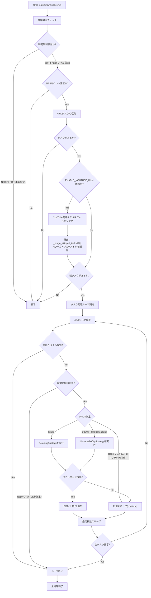
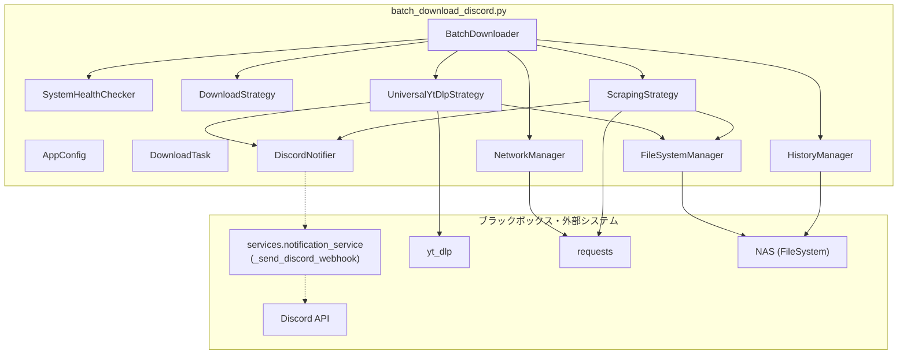

## 1. 解析メタ情報

| 項目 | 内容 |
| --- | --- |
| 対象ファイル | batch_download_discord.py |
| 言語 | Python |
| 解析対象 | 提供されたコードのみ |
| 推測・補完 | 一切なし |

## 2. ファイルの概要

本ファイルは、設定された時間帯（デフォルト02:00〜06:00）において、複数のテキストファイル（リスト）から動画URLを読み込み、NAS等の指定ディレクトリへバッチダウンロードするスクリプトである。
機能として、ディスク空き容量のチェック、ダウンロード履歴の管理、yt-dlpを用いた汎用ダウンロード、特定サイト向けのスクレイピングダウンロード、環境変数によるYouTubeダウロード機能の切り替え、無効時のタスクパージ機能、Discordへの進行状況・エラー通知を担う。

## 3. 外部依存関係

### インポート一覧

| 名称 | 種類 | 用途 | 根拠 |
| --- | --- | --- | --- |
| `os`, `sys`, `time`, `re`, `shutil`, `datetime`, `logging`, `signal`, `glob` | 標準ライブラリ | システム操作、時間管理、正規表現、ファイル操作、シグナル処理など | 根拠: [import文] (行番号: 17-26 / 抜粋: `import os`, `import sys` 等) |
| `collections.defaultdict` | 標準ライブラリ | タスクのグループ化用データ構造 | 根拠: [import文] (行番号: 27 / 抜粋: `from collections import defaultd`) |
| `abc.ABC`, `abstractmethod` | 標準ライブラリ | ストラテジーパターンの抽象基底クラス | 根拠: [import文] (行番号: 28 / 抜粋: `from abc import ABC, abstractm`) |
| `typing.List`, `Optional`, `Tuple`, `Any`, `Set`, `NamedTuple` | 標準ライブラリ | 型ヒント | 根拠: [import文] (行番号: 29 / 抜粋: `from typing import List, Optio`) |
| `dataclasses.dataclass`, `field` | 標準ライブラリ | 設定値保持用のデータクラス | 根拠: [import文] (行番号: 30 / 抜粋: `from dataclasses import datacl`) |
| `pathlib.Path` | 標準ライブラリ | パス操作 | 根拠: [import文] (行番号: 31 / 抜粋: `from pathlib import Path`) |
| `requests` | サードパーティ | HTTPリクエストの送信 | 根拠: [import文] (行番号: 25 / 抜粋: `import requests`) |
| `requests.adapters.HTTPAdapter` | サードパーティ | リトライ処理などセッションのカスタマイズ | 根拠: [import文] (行番号: 34 / 抜粋: `from requests.adapters import `) |
| `urllib3.util.retry.Retry` | サードパーティ | HTTPリクエストのリトライ制御 | 根拠: [import文] (行番号: 35 / 抜粋: `from urllib3.util.retry import`) |
| `tqdm.tqdm` | サードパーティ | プログレスバーの表示 | 根拠: [import文] (行番号: 36 / 抜粋: `from tqdm import tqdm`) |
| `yt_dlp` | サードパーティ | 動画のメタデータ抽出およびダウンロード | 根拠: [import文] (行番号: 37 / 抜粋: `import yt_dlp`) |

### ブラックボックスとなる外部要素

| 名称 | 理由 | 根拠 |
| --- | --- | --- |
| `services.notification_service` | 外部ファイルに依存しており現在のファイルから読み取れないため要確認 | 根拠: [import文] (行番号: 54-55 / 抜粋: `from services.notification_ser`) |

## 4. 主要要素の定義（関数 / エンドポイント / コンポーネント）

### `AppConfig`

* **役割**: アプリケーションの環境設定、時間制限、ディレクトリパス、定数などを保持するデータクラス。
* 根拠: [AppConfigクラス] (行番号: 62-88 / 抜粋: `class AppConfig:`)

* **引数/リクエスト**: なし（データクラスとして初期値定義済み）
* 根拠: [AppConfigクラス] (行番号: 62-88 / 抜粋: `@dataclass(frozen=True)`)

* **戻り値/レスポンス**: 該当なし
* **副作用**: `os.getenv` による環境変数の読み込み。
* 根拠: [ENABLE_YOUTUBE_DL等] (行番号: 69 / 抜粋: `os.getenv("ENABLE_YOUTUBE_DL",`)

* **エラーハンドリング**: なし

### `DiscordNotifier.send`

* **役割**: DiscordWebhookを介して通知メッセージを送信する。
* 根拠: [DiscordNotifier.send] (行番号: 97-104 / 抜粋: `def send(text: str, is_error: `)

* **引数/リクエスト**: `text: str` (通知内容), `is_error: bool = False` (エラー通知フラグ)
* 根拠: [DiscordNotifier.send] (行番号: 98 / 抜粋: `def send(text: str, is_error: `)

* **戻り値/レスポンス**: `None`
* 根拠: [DiscordNotifier.send] (行番号: 98 / 抜粋: `def send(text: str, is_error: `)

* **副作用**: 外部API(`_send_discord_webhook`)の呼び出し。
* 根拠: [API呼び出し] (行番号: 102 / 抜粋: `_send_discord_webhook([message`)

* **エラーハンドリング**: 例外発生時はロガーにてエラーを出力。
* 根拠: [try-exceptブロック] (行番号: 101-104 / 抜粋: `except Exception as e:`)

### `HistoryManager.load_history`

* **役割**: 履歴ファイルからダウンロード済みのURL一覧を読み込む。
* 根拠: [HistoryManager.load_history] (行番号: 107-114 / 抜粋: `def load_history() -> Set[str]`)

* **引数/リクエスト**: なし
* 根拠: [HistoryManager.load_history] (行番号: 107 / 抜粋: `def load_history() -> Set[str]`)

* **戻り値/レスポンス**: `Set[str]` (履歴URLのセット)
* 根拠: [HistoryManager.load_history] (行番号: 107 / 抜粋: `def load_history() -> Set[str]`)

* **副作用**: ローカルファイル(`CONFIG.HISTORY_FILE_PATH`)の読み込み。
* 根拠: [ファイル読み込み] (行番号: 110-111 / 抜粋: `with open(CONFIG.HISTORY_FILE_`)

* **エラーハンドリング**: ファイル読み込み時の例外を無視（`pass`）。
* 根拠: [try-exceptブロック] (行番号: 112-113 / 抜粋: `except Exception: pass`)

### `HistoryManager.add_history`

* **役割**: ダウンロードが完了したURLを履歴ファイルに追記する。
* 根拠: [HistoryManager.add_history] (行番号: 116-120 / 抜粋: `def add_history(url: str) -> N`)

* **引数/リクエスト**: `url: str` (追加するURL)
* 根拠: [HistoryManager.add_history] (行番号: 116 / 抜粋: `def add_history(url: str) -> N`)

* **戻り値/レスポンス**: `None`
* 根拠: [HistoryManager.add_history] (行番号: 116 / 抜粋: `def add_history(url: str) -> N`)

* **副作用**: ローカルファイル(`CONFIG.HISTORY_FILE_PATH`)への追記書き込み。
* 根拠: [ファイル書き込み] (行番号: 118-119 / 抜粋: `with open(CONFIG.HISTORY_FILE_`)

* **エラーハンドリング**: ファイル書き込み時の例外を無視（`pass`）。
* 根拠: [try-exceptブロック] (行番号: 117-120 / 抜粋: `except Exception: pass`)

### `NetworkManager.create_session`

* **役割**: HTTP通信用のリトライ設定およびUser-Agentを付与したSessionオブジェクトを生成する。
* 根拠: [NetworkManager.create_session] (行番号: 123-129 / 抜粋: `def create_session() -> reques`)

* **引数/リクエスト**: なし
* 根拠: [NetworkManager.create_session] (行番号: 123 / 抜粋: `def create_session() -> reques`)

* **戻り値/レスポンス**: `requests.Session`
* 根拠: [NetworkManager.create_session] (行番号: 123 / 抜粋: `def create_session() -> reques`)

* **副作用**: なし
* **エラーハンドリング**: なし

### `FileSystemManager.check_disk_space`

* **役割**: 対象パスのディスク空き容量をチェックし、設定値(MIN_FREE_SPACE_GB)を下回る場合は警告通知を送信する。
* 根拠: [FileSystemManager.check_disk_space] (行番号: 140-151 / 抜粋: `def check_disk_space(path: Pat`)

* **引数/リクエスト**: `path: Path` (確認対象のディレクトリパス)
* 根拠: [FileSystemManager.check_disk_space] (行番号: 140 / 抜粋: `def check_disk_space(path: Pat`)

* **戻り値/レスポンス**: `bool` (容量不足でなければTrue、不足していればFalse、エラー時はTrue)
* 根拠: [FileSystemManager.check_disk_space] (行番号: 140 / 抜粋: `def check_disk_space(path: Pat`)

* **副作用**: `DiscordNotifier.send` による外部への警告通知。
* 根拠: [通知送信] (行番号: 147 / 抜粋: `DiscordNotifier.send(f"⚠️ DISK`)

* **エラーハンドリング**: 取得失敗等の例外時は `True` を返す（処理継続）。
* 根拠: [try-exceptブロック] (行番号: 150-151 / 抜粋: `except Exception: return True`)

### `SystemHealthChecker.is_within_time_window`

* **役割**: 現在時刻が設定された実行許可時間帯に含まれているかを判定する。
* 根拠: [SystemHealthChecker.is_within_time_window] (行番号: 154-157 / 抜粋: `def is_within_time_window() ->`)

* **引数/リクエスト**: なし
* 根拠: [SystemHealthChecker.is_within_time_window] (行番号: 154 / 抜粋: `def is_within_time_window() ->`)

* **戻り値/レスポンス**: `bool` (時間内または制限無効であればTrue)
* 根拠: [SystemHealthChecker.is_within_time_window] (行番号: 154 / 抜粋: `def is_within_time_window() ->`)

* **副作用**: なし
* **エラーハンドリング**: なし

### `UniversalYtDlpStrategy.download`

* **役割**: yt-dlpを使用して指定URLから動画をダウンロードする（YouTubeとそれ以外で保存先を分離）。
* 根拠: [UniversalYtDlpStrategy.download] (行番号: 192-217 / 抜粋: `def download(self, task: Downl`)

* **引数/リクエスト**: `task: DownloadTask` (ダウンロード対象のタスク情報)
* 根拠: [UniversalYtDlpStrategy.download] (行番号: 192 / 抜粋: `def download(self, task: Downl`)

* **戻り値/レスポンス**: `bool` (成功時・スキップ時はTrue、失敗時はFalse)
* 根拠: [UniversalYtDlpStrategy.download] (行番号: 192 / 抜粋: `def download(self, task: Downl`)

* **副作用**: ディレクトリ作成、ディスク容量チェック、ローカルへの動画ファイル保存、Discord通知。
* 根拠: [ファイル保存・通知] (行番号: 211-213 / 抜粋: `ydl.download([task.url])`)

* **エラーハンドリング**: yt-dlpの処理失敗時に例外をキャッチし、ログ出力してFalseを返す。
* 根拠: [try-exceptブロック] (行番号: 215-217 / 抜粋: `except Exception as e:`)

### `ScrapingStrategy.download`

* **役割**: 特定サイト(tktube)のHTMLを取得し、正規表現パターンから動画URLを抽出して直接ダウンロードする。
* 根拠: [ScrapingStrategy.download] (行番号: 220-234 / 抜粋: `def download(self, task: Downl`)

* **引数/リクエスト**: `task: DownloadTask` (ダウンロード対象のタスク情報)
* 根拠: [ScrapingStrategy.download] (行番号: 220 / 抜粋: `def download(self, task: Downl`)

* **戻り値/レスポンス**: `bool` (成功時はTrue、失敗時はFalse)
* 根拠: [ScrapingStrategy.download] (行番号: 220 / 抜粋: `def download(self, task: Downl`)

* **副作用**: 外部サーバーへのHTTPリクエスト（HTML取得、ファイル取得）、ローカルへの動画保存、Discord通知。
* 根拠: [メソッド呼び出し] (行番号: 234 / 抜粋: `return self._execute_atomic_do`)

* **エラーハンドリング**: HTML取得失敗時やURL抽出不可時はFalseを返す。ファイル保存時の例外は `_execute_atomic_download` 内でキャッチ。
* 根拠: [条件分岐] (行番号: 225, 229 / 抜粋: `if not html: return False`)

### `BatchDownloader._purge_skipped_tasks`

* **役割**: スキップ対象となったタスクをアーカイブファイルに退避し、元のリストファイルから該当URLを削除する。
* 根拠: [BatchDownloader._purge_skipped_tasks] (行番号: 304-351 / 抜粋: `def _purge_skipped_tasks(self,`)

* **引数/リクエスト**: `skipped_tasks: List[DownloadTask]` (パージ対象のタスク一覧)
* 根拠: [BatchDownloader._purge_skipped_tasks] (行番号: 304 / 抜粋: `def _purge_skipped_tasks(self,`)

* **戻り値/レスポンス**: `None`
* 根拠: [BatchDownloader._purge_skipped_tasks] (行番号: 304 / 抜粋: `def _purge_skipped_tasks(self,`)

* **副作用**: アーカイブファイル(`archived_tasks.txt`)の追記、各リストファイル(`.txt`)の一時ファイルを利用したアトミックな上書き更新。
* 根拠: [ファイル操作] (行番号: 345 / 抜粋: `temp_path.replace(file_path)`)

* **エラーハンドリング**: アーカイブ書き込み失敗時は処理を中断。リストファイル上書き時の例外はキャッチしてログ出力し、処理を続行。
* 根拠: [try-exceptブロック] (行番号: 323-325, 347-348 / 抜粋: `except Exception as e: logger.`)

### `BatchDownloader.run`

* **役割**: アプリケーション全体の実行フロー（依存関係チェック、タスク収集、パージ処理、各タスクのダウンロードループ）を制御する。
* 根拠: [BatchDownloader.run] (行番号: 354-399 / 抜粋: `def run(self) -> None:`)

* **引数/リクエスト**: なし
* 根拠: [BatchDownloader.run] (行番号: 354 / 抜粋: `def run(self) -> None:`)

* **戻り値/レスポンス**: `None`
* 根拠: [BatchDownloader.run] (行番号: 354 / 抜粋: `def run(self) -> None:`)

* **副作用**: `_purge_skipped_tasks` によるファイル上書き、ダウンロード戦略の実行によるファイル保存、履歴への追加。
* 根拠: [メソッド呼び出し] (行番号: 374, 393-394 / 抜粋: `self._purge_skipped_tasks(skip`, `HistoryManager.add_history(tas`)

* **エラーハンドリング**: 個別タスク実行時の例外をキャッチしログ出力、次のタスクへ進む。停止シグナル(`_shutdown_requested`)を検知してループを中断。
* 根拠: [例外処理・シグナル判定] (行番号: 387, 395-396 / 抜粋: `if self._shutdown_requested: b`, `except Exception as e:`)

## 5. 処理フロー図

## 6. 依存関係図

## 7. 次のステップ（リバースエンジニアリングの提案）

| 優先度 | ファイル名(推測可) | 理由 | 根拠 |
| --- | --- | --- | --- |
| 高 | `services/notification_service.py` | Discordへの実際のWebhook送信ロジック、接続先URL、引数の仕様（`image_data`など）がブラックボックスとなっているため。 | 根拠: [import文] (行番号: 54-55 / 抜粋: `from services.notification_ser`) |

## 8. 保守上の注意点

* **副作用**: `_purge_skipped_tasks` 内で対象となるテキストファイル（`list.txt` や `list/*.txt`）を物理的に上書き・削除する処理が含まれており、バグが混入した場合、読み込み元のタスク一覧データを消失するリスクがある。
* **ファイル操作の安全性**: 上記のファイル上書きや、動画のダウンロード保存時において、`.tmp` 拡張子を利用したテンポラリファイルへの書き込みと `rename`/`replace` によるアトミックな更新が行われている。
* **外部入力の実行制限**: `sys.argv` に `--force` が指定されている場合、`SystemHealthChecker.is_within_time_window` による時間制限の判定が無視される。
* **通知モジュールの依存**: `services.notification_service` が存在しない場合はエラーとせず、何もしないダミー関数で上書き(`pass`)されるフォールバックが実装されている。
* **状態のミスマッチ**: プログラム実行中に手動で `history.txt` やリストのファイルが編集された場合、インメモリのタスク一覧とディスク上の状態に乖離が生じる。

## 9. 不明事項一覧

| 項目 | 理由 | 必要なファイル |
| --- | --- | --- |
| Webhook送信処理の仕様 | `_send_discord_webhook` の具体的な実装（エンドポイント、認証方法、引数 `image_data` の扱いなど）が本ファイルには存在しないため。 | `services/notification_service.py` |

## 10. 自己検証結果

* [x] 推測・外部ファイルの仕様を一切含んでいない
* [x] 全関数・全クラス・全コンポーネントを列挙した
* [x] 全てのインポート要素を列挙した
* [x] すべての仕様説明に「根拠（行番号・抜粋）」を明記した
* [x] 根拠漏れが0件である
* [x] Mermaid構文にエラーの原因となる記号（エスケープ漏れ）がない
* [x] 不明事項を漏れなく列挙した

完了