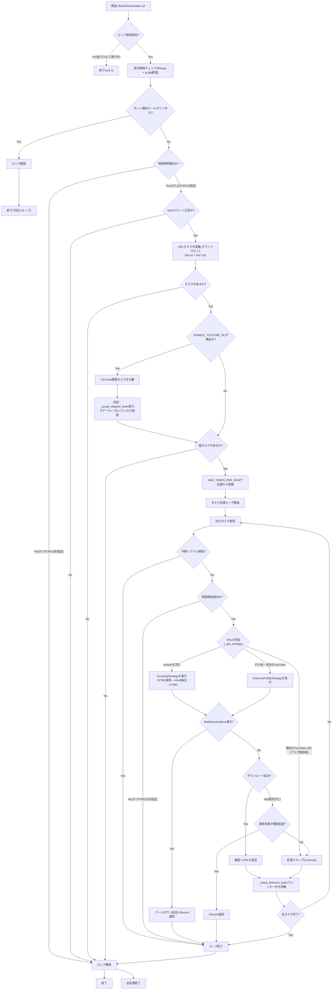
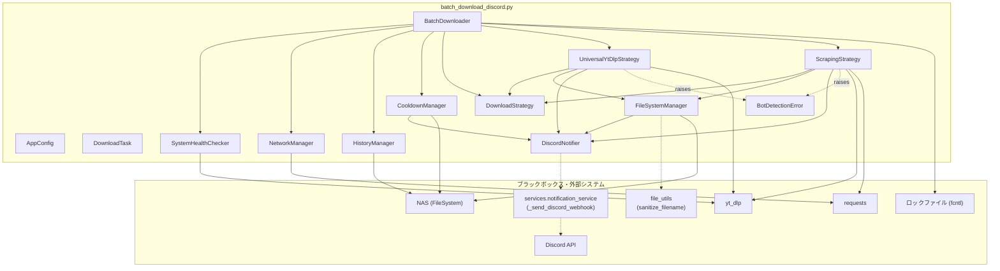

## 1. 解析メタ情報

| 項目 | 内容 |
| --- | --- |
| 対象ファイル | `batch_download_discord.py` |
| 言語 | Python |
| 解析対象 | 提供されたコードのみ |
| 推測・補完 | 一切なし |

## 関連ドキュメント

* [file_utils.md](./file_utils.md) — 本ファイルが利用する共通ファイル名サニタイズ処理（`sanitize_filename`）の実装元。
* [../MY_HOME_SYSTEM/notification_service.md](../MY_HOME_SYSTEM/notification_service.md) — 本ファイルがフォールバック的にインポートするDiscord Webhook通知処理（`_send_discord_webhook`）の実装元。
* [../MY_HOME_SYSTEM/nas_monitor.md](../MY_HOME_SYSTEM/nas_monitor.md) — NAS容量監視との関連（全体設計書によれば、DDDのダウンロード活動によるNAS容量逼迫を`nas_monitor.py`側が監視する運用連携があるとされる。ただし本ファイルは`nas_monitor.py`を直接importしておらず、独自の簡易的な容量チェック（`FileSystemManager.check_disk_space`）を実装している点に注意）。
* [../全体設計書.md](../全体設計書.md) — DDDサブシステム全体の位置付けおよびMY_HOME_SYSTEMとのNASリソース協調に関する記述。
* [newface_monitor.md](./newface_monitor.md) — `run_monitor`の多重起動防止ロックは、本ファイルの`BatchDownloader.run`が既に採用している`fcntl.flock`による同種のロックパターンを踏襲したものである（`newface_monitor.py`のコメントで直接言及されている）。
* [test_batch_download_discord_fixes.md](./test_batch_download_discord_fixes.md) — 本ファイルの履歴I/Oエラーログ出力・ボット検知マーカーの単語境界判定・`noplaylist`設定を検証する回帰テストの解析ドキュメント。

## 2. ファイルの概要

本ファイルは、モジュールDocstring上「Production Grade Batch Downloader (v2.4.0 Universal Support)」と称される、複数のURLリストファイルから動画をバッチダウンロードするCLIスクリプトである。
主な機能は以下の通り。
* `list.txt`（単一ファイル）および `list/` ディレクトリ配下の全 `*.txt` ファイルを走査するマルチリスト対応。リストファイル名ごとにサブフォルダへ振り分けて保存する。
* `yt_dlp` を用いた汎用サイト対応のダウンロード（`UniversalYtDlpStrategy`）と、`missav` サイト専用のJS難読化解除・m3u8抽出によるスクレイピングダウンロード（`ScrapingStrategy`）の2種類のダウンロード戦略（Strategyパターン）。
* `fcntl.flock` を用いたロックファイルによる多重起動防止。
* ダウンロード履歴（`history.txt`）の管理、ディスク空き容量チェック、NASマウント確認。
* 環境変数 `ENABLE_YOUTUBE_DL` によるYouTubeダウンロード機能の有効/無効切り替えと、無効時のタスクの自動パージ（アーカイブ退避＋リストファイルからの削除）。
* 実行許可時間帯（デフォルト02:00〜06:00、`--force` 引数で無視可能）の制御。
* Discord Webhookを介した進行状況・エラー通知。
* ボット検知/レート制限対策として、サイトごとのジッター付きタスク間隔（YouTube/missavはより保守的な間隔）、`yt-dlp`自体のリクエスト間スリープ、任意のCookieファイル指定、1回の実行あたりのタスク数上限（`MAX_TASKS_PER_RUN`、ラウンドロビンでソース間の公平性を確保）、ボット検知疑い発生後の実行間クールダウン（`--clear-cooldown`で手動解除可能）、`yt-dlp`が古い場合の起動時警告、403/429/503やサインイン要求・Cloudflare風チャレンジページ検知時の即時セッション中断を備える。
* 根拠: [モジュールDocstring] (行番号: 4〜24 / 抜粋: "Production Grade Batch Downloader (v2.4.0 Universal Support)")

## 3. 外部依存関係

### インポート一覧

| 名称 | 種類 | 用途 | 根拠 |
| --- | --- | --- | --- |
| `os` | 標準ライブラリ | パス操作、環境変数取得、ロックファイルのオープン | 根拠: [import文] (行番号: 26 / 抜粋: "import os") |
| `sys` | 標準ライブラリ | `--force`/`--clear-cooldown` 引数判定、`sys.path` 操作、`sys.exit`、標準出力のTTY判定 | 根拠: [import文] (行番号: 27 / 抜粋: "import sys") |
| `time` | 標準ライブラリ | タスク間スリープ、フォールバックID生成用タイムスタンプ | 根拠: [import文] (行番号: 28 / 抜粋: "import time") |
| `re` | 標準ライブラリ | missavのJS難読化解除・m3u8 URL抽出用の正規表現処理 | 根拠: [import文] (行番号: 29 / 抜粋: "import re") |
| `random` | 標準ライブラリ | タスク間隔のジッター生成（ボット検知回避） | 根拠: [import文] (行番号: 30 / 抜粋: "import random") |
| `shutil` | 標準ライブラリ | ディスク空き容量取得(`disk_usage`)、`ffmpeg`存在確認(`which`) | 根拠: [import文] (行番号: 31 / 抜粋: "import shutil") |
| `datetime` | 標準ライブラリ | 現在時刻判定、アーカイブ・クールダウンのタイムスタンプ生成 | 根拠: [import文] (行番号: 32 / 抜粋: "import datetime") |
| `logging` | 標準ライブラリ | ロガーの設定・出力 | 根拠: [import文] (行番号: 33 / 抜粋: "import logging") |
| `signal` | 標準ライブラリ | `SIGINT`/`SIGTERM` を捕捉し安全に停止するためのハンドラ登録 | 根拠: [import文] (行番号: 34 / 抜粋: "import signal") |
| `fcntl` | 標準ライブラリ | ロックファイルへの排他ロック(`flock`)による多重起動防止 | 根拠: [import文] (行番号: 35 / 抜粋: "import fcntl") |
| `requests` | サードパーティ | HTTPセッションの生成・リクエスト送信 | 根拠: [import文] (行番号: 36 / 抜粋: "import requests") |
| `collections.defaultdict` | 標準ライブラリ | パージ対象タスクをリスト（ソース）名ごとにグループ化 | 根拠: [import文] (行番号: 37 / 抜粋: "from collections import defaultdict") |
| `abc.ABC`, `abstractmethod` | 標準ライブラリ | ダウンロード戦略の抽象基底クラス`DownloadStrategy`の定義 | 根拠: [import文] (行番号: 38 / 抜粋: "from abc import ABC, abstractmethod") |
| `typing.List`, `Optional`, `Tuple`, `Any`, `Set`, `NamedTuple`, `Dict`, `Iterable` | 標準ライブラリ | 型ヒント全般 | 根拠: [import文] (行番号: 39 / 抜粋: "from typing import List, Optional, Tuple, Any, Set, NamedTuple, Dict, Iterable") |
| `dataclasses.dataclass`, `field` | 標準ライブラリ | `AppConfig` の定義（frozenデータクラス）とデフォルトファクトリ | 根拠: [import文] (行番号: 40 / 抜粋: "from dataclasses import dataclass, field") |
| `file_utils.sanitize_filename` (as `_shared_sanitize_filename`) | ローカルモジュール | ファイル名のサニタイズ処理を共通モジュールへ委譲 | 根拠: [import文] (行番号: 42 / 抜粋: "from file_utils import sanitize_filename as _shared_sanitize_filename") |
| `pathlib.Path` | 標準ライブラリ | パスオブジェクトの操作全般 | 根拠: [import文] (行番号: 43 / 抜粋: "from pathlib import Path") |
| `requests.adapters.HTTPAdapter` | サードパーティ | セッションへのリトライ用アダプタのマウント | 根拠: [import文] (行番号: 46 / 抜粋: "from requests.adapters import HTTPAdapter") |
| `urllib3.util.retry.Retry` | サードパーティ | HTTPリクエストのリトライポリシー定義 | 根拠: [import文] (行番号: 47 / 抜粋: "from urllib3.util.retry import Retry") |
| `yt_dlp` | サードパーティ | 動画のメタデータ抽出およびダウンロード（Universal/M3U8双方）、バージョン鮮度チェック | 根拠: [import文] (行番号: 48 / 抜粋: "import yt_dlp") |
| `services.notification_service._send_discord_webhook` | ローカルモジュール（動的解決） | Discord Webhook通知の送信。`try-except ImportError` で見つからない場合は無効化されたダミー関数にフォールバック | 根拠: [import文] (行番号: 82〜87 / 抜粋: "from services.notification_service import _send_discord_webhook") |

### ブラックボックスとなる外部要素

| 名称 | 理由 | 根拠 |
| --- | --- | --- |
| `services.notification_service._send_discord_webhook` | 実装が別ファイルに存在し、Webhook URLや認証方式、`image_data`引数の扱いなど詳細が不明。見つからない場合はダミー関数(`pass`)にフォールバックする実装のみがこのファイルからは確認できる。 | 根拠: [import文とフォールバック定義] (行番号: 83, 86〜87 / 抜粋: "from services.notification_service import _send_discord_webhook") |
| `file_utils.sanitize_filename` | サニタイズの具体的なルール（禁止文字、長さ制限等）が本ファイルからは不明。 | 根拠: [import文] (行番号: 42 / 抜粋: "from file_utils import sanitize_filename as _shared_sanitize_filename") |
| `MY_HOME_SYSTEM_ROOT` 環境変数 / `services` ディレクトリ探索 | プロジェクトルート自動探索ロジックが依存する `services` ディレクトリの実際の配置や、環境変数が設定される運用上の前提が不明。 | 根拠: [PROJECT_ROOT解決処理] (行番号: 64〜77 / 抜粋: "_env_root = os.getenv("MY_HOME_SYSTEM_ROOT")") |
| `yt_dlp.YoutubeDL` / `yt_dlp.version.__version__` | `extract_info`/`download`の内部実装や、バージョン文字列の生成規則の詳細は`yt_dlp`本体に依存し、本ファイルからは分からない。 | 根拠: [yt_dlp利用箇所] (行番号: 403, 478〜479, 594〜595 / 抜粋: "installed = datetime.datetime.strptime(yt_dlp.version.__version__, "%Y.%m.%d")") |

## 4. 主要要素の定義（関数 / エンドポイント / コンポーネント）

### `_resolve_cookies_file`

* **役割**: 環境変数`YOUTUBE_COOKIES_FILE`が指すCookieファイルを解決する関数。環境変数が未設定、またはファイルが存在しない場合はCookie無し（`None`）にフォールバックする。
* 根拠: [関数定義とDocstring] (行番号: 89〜94 / 抜粋: "def _resolve_cookies_file() -> Optional[Path]:\n    """YouTube等のボット検知回避用Cookieファイルを解決する。")

* **引数/リクエスト**: なし
* 根拠: [関数定義] (行番号: 89 / 抜粋: "def _resolve_cookies_file() -> Optional[Path]:")

* **戻り値/レスポンス**: `Optional[Path]`（解決できたCookieファイルのパス、なければ`None`）
* 根拠: [戻り値ヒント] (行番号: 89 / 抜粋: "def _resolve_cookies_file() -> Optional[Path]:")

* **副作用**: `os.getenv`による環境変数読み込み、ファイル未存在時の警告ログ出力。
* 根拠: [処理内容] (行番号: 95, 100 / 抜粋: "cookies_env = os.getenv("YOUTUBE_COOKIES_FILE")", "logger.warning(f"⚠️ YOUTUBE_COOKIES_FILE で指定されたファイルが見つかりません: {cookies_path}")")

* **エラーハンドリング**: 例外送出はなく、未設定・ファイル不在のいずれも`None`を返すことで安全側にフォールバックする。
* 根拠: [ガード節] (行番号: 96〜97, 99〜101 / 抜粋: "if not cookies_env:\n        return None")

### `AppConfig`

* **役割**: アプリケーション全体の設定値（時間制限、パス、リトライ回数、機能フラグ、ボット検知対策のスリープ範囲・閾値・マーカー文字列等）を保持するイミュータブル(`frozen=True`)なデータクラス。
* 根拠: [AppConfigクラス] (行番号: 107〜108 / 抜粋: "@dataclass(frozen=True)\nclass AppConfig:")

* **引数/リクエスト**: なし（フィールドはデフォルト値、環境変数、または`_resolve_cookies_file`の呼び出し結果から初期化される）
* 根拠: [各フィールド定義] (行番号: 109〜184 / 抜粋: "RESTRICT_TIME: bool = not FORCE_MODE")

* **戻り値/レスポンス**: 該当なし（インスタンスは `CONFIG = AppConfig()` としてモジュールレベルで単一生成）
* 根拠: [インスタンス生成] (行番号: 192 / 抜粋: "CONFIG = AppConfig()")

* **副作用**: `os.getenv` による環境変数(`ENABLE_YOUTUBE_DL`, `VIDEO_SAVE_DIR`)の読み込み、`field(default_factory=_resolve_cookies_file)`によるCookieファイル解決処理の実行。
* 根拠: [環境変数読み込みとdefault_factory] (行番号: 115〜116, 141 / 抜粋: "ENABLE_YOUTUBE_DL: bool = os.getenv("ENABLE_YOUTUBE_DL", "false").lower() == "true"", "YOUTUBE_COOKIES_FILE: Optional[Path] = field(default_factory=_resolve_cookies_file)")

* **エラーハンドリング**: なし

### `AppConfig.nas_marker_path`

* **役割**: NASマウント確認用のマーカーファイル（`NAS_MOUNT_POINT / NAS_MARKER_FILE`）の完全パスを返すプロパティ。
* 根拠: [プロパティ定義] (行番号: 188〜190 / 抜粋: "@property\n    def nas_marker_path(self) -> Path:\n        return self.NAS_MOUNT_POINT / self.NAS_MARKER_FILE")

* **引数/リクエスト**: なし（`self`のみ）
* **戻り値/レスポンス**: `Path`
* 根拠: [戻り値] (行番号: 190 / 抜粋: "return self.NAS_MOUNT_POINT / self.NAS_MARKER_FILE")

* **副作用**: なし
* **エラーハンドリング**: なし

### `BotDetectionError`

* **役割**: YouTube等からのボット検知/レート制限（429やSign-in要求等）を検知した際に送出される専用例外。通常のダウンロード失敗（タスク単位のスキップ）とは区別し、セッション全体を即座に中断すべきシグナルとして扱われる。
* 根拠: [クラス定義とDocstring] (行番号: 195〜201 / 抜粋: "class BotDetectionError(Exception):\n    """YouTube等からボット検知/レート制限（429やSign-in要求等）を検知した際に送出する。")

* **引数/リクエスト**: `Exception`を継承した標準的な例外引数（メッセージ文字列等）
* **戻り値/レスポンス**: 該当なし
* **副作用**: なし
* **エラーハンドリング**: 該当なし（本クラス自体は例外定義のみ）

### `_is_bot_detection_error`

* **役割**: 例外オブジェクトの文字列表現（小文字化）に`CONFIG.BOT_DETECTION_MARKERS`のいずれかが含まれるかを判定する関数。マーカーが数字のみ（"403"/"429"/"503"）の場合は正規表現の単語境界(`\b`)で厳密に一致するかを判定し、フレーズマーカー（"sign in to confirm"等）は従来通り部分文字列一致(`in`)で判定する。数字マーカーを単純な部分文字列一致で判定すると、エラーメッセージに埋め込まれた動画ID等の英数字列（例: "AbC403XyZ"）に偶然含まれる数字列にまで誤爆し、`BOT_DETECTION_COOLDOWN_HOURS`（12時間）のセッション全停止を誤って引き起こし得たための修正である。
* 根拠: [関数定義とコメント] (行番号: 204〜210 / 抜粋: "def _is_bot_detection_error(exc: Exception) -> bool:\n    # M-7-2: "403"/"429"/"503" のような数字だけのマーカーを単純な部分文字列\n    # マッチ(in)で判定すると、エラーメッセージに埋め込まれた動画ID等の\n    # 英数字列(例: "...AbC403XyZ...")に偶然含まれる数字列にまで誤爆し、\n    # BOT_DETECTION_COOLDOWN_HOURS(12時間)ものセッション全停止を誤って\n    # 引き起こし得た。数字のみのマーカーは単語境界(\\b)で厳密に判定し、\n    # フレーズマーカーは従来通り部分文字列一致とする。")

* **引数/リクエスト**: `exc: Exception`
* 根拠: [引数定義] (行番号: 204 / 抜粋: "def _is_bot_detection_error(exc: Exception) -> bool:")

* **戻り値/レスポンス**: `bool`
* 根拠: [戻り値ヒントと各return] (行番号: 204, 215, 217, 218 / 抜粋: "def _is_bot_detection_error(exc: Exception) -> bool:")

* **副作用**: なし
* 根拠: [処理内容] (行番号: 211〜218 / 抜粋: "message = str(exc).lower()\n    for marker in CONFIG.BOT_DETECTION_MARKERS:\n        if marker.isdigit():\n            if re.search(rf"\\b{re.escape(marker)}\\b", message):")

* **エラーハンドリング**: なし（判定ロジックのみで例外は送出しない）

### `_round_robin_flatten`

* **役割**: 複数グループ（ソース別タスクリスト）を、グループ順の単純連結ではなくラウンドロビン（各グループから1件ずつ順番に取り出す）で1本のリストへ平坦化する関数。`MAX_TASKS_PER_RUN`で先頭から打ち切られても特定のソースだけが上限を独占しないようにする。
* 根拠: [関数定義とDocstring] (行番号: 221〜228 / 抜粋: "def _round_robin_flatten(groups: Iterable[List["DownloadTask"]]) -> List["DownloadTask"]:\n    """複数グループのリストを、グループ順ではなくラウンドロビンで1本のリストに平坦化する。")

* **引数/リクエスト**: `groups: Iterable[List["DownloadTask"]]`
* 根拠: [引数定義] (行番号: 221 / 抜粋: "def _round_robin_flatten(groups: Iterable[List["DownloadTask"]]) -> List["DownloadTask"]:")

* **戻り値/レスポンス**: `List["DownloadTask"]`（ラウンドロビン順に平坦化された結果）
* 根拠: [戻り値ヒントとreturn文] (行番号: 221, 236 / 抜粋: "return result")

* **副作用**: なし（純粋なリスト変換処理）
* **エラーハンドリング**: なし

### `_looks_like_block_page`

* **役割**: 取得したHTMLがCloudflare等のボット検知チャレンジページかどうかを、本文中の特定マーカー文字列（小文字化して照合）の有無で判定する関数。HTTPステータス200で返る場合もあるため、ステータスコードだけに頼らない判定を行う。
* 根拠: [関数定義とDocstring] (行番号: 239〜245 / 抜粋: "def _looks_like_block_page(html: str) -> bool:\n    """取得したHTMLがCloudflare等のボット検知チャレンジページかを判定する。")

* **引数/リクエスト**: `html: str`
* 根拠: [引数定義] (行番号: 239 / 抜粋: "def _looks_like_block_page(html: str) -> bool:")

* **戻り値/レスポンス**: `bool`
* 根拠: [戻り値ヒント] (行番号: 239 / 抜粋: "def _looks_like_block_page(html: str) -> bool:")

* **副作用**: なし
* **エラーハンドリング**: なし

### `DownloadTask`

* **役割**: ダウンロード対象のURLと、その取得元リスト名（サブフォルダ振り分けに使用）を保持する `NamedTuple`。
* 根拠: [DownloadTaskクラス] (行番号: 249〜251 / 抜粋: "class DownloadTask(NamedTuple):\n    url: str\n    source_name: str")

* **引数/リクエスト**: `url: str`, `source_name: str`
* 根拠: [フィールド定義] (行番号: 250〜251 / 抜粋: "url: str\n    source_name: str")

* **戻り値/レスポンス**: 該当なし
* **副作用**: なし
* **エラーハンドリング**: なし

### `DiscordNotifier.send`

* **役割**: Discord Webhook経由で通知メッセージを送信する静的メソッド。エラー通知フラグに応じて送信先チャンネル(`error`/`notify`)を切り替える。
* 根拠: [DiscordNotifier.send] (行番号: 257〜264 / 抜粋: "def send(text: str, is_error: bool = False) -> None:")

* **引数/リクエスト**: `text: str` (通知内容), `is_error: bool = False` (エラー通知フラグ)
* 根拠: [引数定義] (行番号: 258 / 抜粋: "def send(text: str, is_error: bool = False) -> None:")

* **戻り値/レスポンス**: `None`
* 根拠: [戻り値ヒント] (行番号: 258 / 抜粋: "-> None:")

* **副作用**: `_send_discord_webhook` の呼び出しによる外部APIへの通知送信。
* 根拠: [API呼び出し] (行番号: 262 / 抜粋: "_send_discord_webhook([message], channel=channel)")

* **エラーハンドリング**: 送信時の例外を捕捉し、`exc_info=True` 付きでエラーログを出力（例外は再送出しない）。
* 根拠: [try-exceptブロック] (行番号: 261〜264 / 抜粋: "except Exception as e:")

### `HistoryManager.load_history`

* **役割**: 履歴ファイル(`history.txt`)からダウンロード済みURLの集合を読み込む静的メソッド。読み込み失敗時は安全側（空の履歴として続行）に倒しつつ、`logger.error`で必ずログに残す。以前は`except Exception: pass`で読み込み失敗をログにすら残さず握りつぶしており、既にダウンロード済みのURLが全て「未ダウンロード」扱いになる再ダウンロード・再通知の嵐を引き起こしても原因調査ができない問題があったための修正である。
* 根拠: [HistoryManager.load_historyとコメント] (行番号: 268〜279 / 抜粋: "def load_history() -> Set[str]:\n        history = set()\n        if CONFIG.HISTORY_FILE_PATH.exists():\n            try:\n                with open(CONFIG.HISTORY_FILE_PATH, "r", encoding="utf-8") as f:\n                    history = {line.strip() for line in f if line.strip()}\n            except Exception as e:\n                # M-7-1: 読み込み失敗を握りつぶすと、既にダウンロード済みのURLが")

* **引数/リクエスト**: なし
* **戻り値/レスポンス**: `Set[str]`（ファイルが存在しない場合や例外時は空集合）
* 根拠: [戻り値ヒント] (行番号: 268 / 抜粋: "def load_history() -> Set[str]:")

* **副作用**: 履歴ファイルの読み込み、読み込み失敗時のエラーログ出力(`exc_info=True`)。
* 根拠: [ファイル読み込みとエラーログ] (行番号: 272〜273, 279 / 抜粋: "with open(CONFIG.HISTORY_FILE_PATH, "r", encoding="utf-8") as f:", "logger.error(f"⚠️ 履歴ファイルの読み込みに失敗しました: {e}", exc_info=True)")

* **エラーハンドリング**: 例外発生時は`exc_info=True`付きでエラーログを出力し、その時点までに読めた履歴（空集合）を安全側の結果として返す（例外は再送出しない）。
* 根拠: [try-exceptブロックとコメント] (行番号: 274〜279 / 抜粋: "except Exception as e:\n                # M-7-1: 読み込み失敗を握りつぶすと、既にダウンロード済みのURLが\n                # 全て「未ダウンロード」扱いになり、全件の再ダウンロード・再通知の\n                # 嵐を引き起こす。方針として安全側(空の履歴として続行)には倒すが、\n                # 原因調査ができるよう必ずログには残す。\n                logger.error(f"⚠️ 履歴ファイルの読み込みに失敗しました: {e}", exc_info=True)")

### `HistoryManager.add_history`

* **役割**: ダウンロード完了URLを履歴ファイルへ追記する静的メソッド。書き込み失敗時は処理自体は継続しつつ、`logger.error`で必ずログに残す。以前は`except Exception: pass`で書き込み失敗を握りつぶしており、当該URLが次回実行時も「未ダウンロード」のままになり再ダウンロード・再通知が続いても原因調査ができない問題があったための修正である。
* 根拠: [HistoryManager.add_historyとコメント] (行番号: 283〜291 / 抜粋: "def add_history(url: str) -> None:\n        try:\n            with open(CONFIG.HISTORY_FILE_PATH, "a", encoding="utf-8") as f:\n                f.write(f"{url}\\n")\n        except Exception as e:\n            # M-7-1: 書き込み失敗を握りつぶすと、このURLは次回実行時も")

* **引数/リクエスト**: `url: str`
* **戻り値/レスポンス**: `None`
* 根拠: [関数定義] (行番号: 283 / 抜粋: "def add_history(url: str) -> None:")

* **副作用**: 履歴ファイルへの追記書き込み、書き込み失敗時のエラーログ出力(`exc_info=True`)。
* 根拠: [ファイル書き込みとエラーログ] (行番号: 285〜286, 291 / 抜粋: "with open(CONFIG.HISTORY_FILE_PATH, "a", encoding="utf-8") as f:", "logger.error(f"⚠️ 履歴ファイルへの書き込みに失敗しました (url={url}): {e}", exc_info=True)")

* **エラーハンドリング**: 例外発生時は`exc_info=True`付きでエラーログを出力する（処理は継続し、例外は再送出しない）。
* 根拠: [try-exceptブロックとコメント] (行番号: 287〜291 / 抜粋: "except Exception as e:\n            # M-7-1: 書き込み失敗を握りつぶすと、このURLは次回実行時も\n            # 「未ダウンロード」のままになり再ダウンロード・再通知が続く。\n            # ここで処理自体を止めるほどではないため続行するが、ログには残す。\n            logger.error(f"⚠️ 履歴ファイルへの書き込みに失敗しました (url={url}): {e}", exc_info=True)")

### `CooldownManager.is_in_cooldown`

* **役割**: クールダウンファイル(`.bot_detection_cooldown`)から解除予定時刻を読み込み、現在時刻がその前であれば解除予定時刻を、そうでなければ`None`を返す静的メソッド。
* 根拠: [メソッド定義とDocstring] (行番号: 302〜303 / 抜粋: "def is_in_cooldown() -> Optional[datetime.datetime]:\n        """クールダウン中であれば解除予定時刻を、そうでなければNoneを返す。"""")

* **引数/リクエスト**: なし
* **戻り値/レスポンス**: `Optional[datetime.datetime]`
* 根拠: [戻り値ヒント] (行番号: 302 / 抜粋: "def is_in_cooldown() -> Optional[datetime.datetime]:")

* **副作用**: クールダウンファイルの読み込み。
* 根拠: [ファイル読み込み] (行番号: 308 / 抜粋: "until = datetime.datetime.fromisoformat(path.read_text(encoding="utf-8").strip())")

* **エラーハンドリング**: ファイルが壊れている場合（`ValueError`/`OSError`）は安全側（＝クールダウンしない）に倒して`None`を返す。
* 根拠: [try-exceptブロックとコメント] (行番号: 309〜311 / 抜粋: "except (ValueError, OSError):\n            # 壊れたクールダウンファイルは安全側（＝クールダウンしない）に倒す\n            return None")

### `CooldownManager.trigger_cooldown`

* **役割**: 現在時刻から`BOT_DETECTION_COOLDOWN_HOURS`（既定12時間）後を解除予定時刻として算出し、一時ファイル経由のアトミックな`replace`でクールダウンファイルへ書き込む静的メソッド。
* 根拠: [メソッド定義とコメント] (行番号: 315〜323 / 抜粋: "def trigger_cooldown() -> None:\n        until = datetime.datetime.now() + datetime.timedelta(hours=CONFIG.BOT_DETECTION_COOLDOWN_HOURS)")

* **引数/リクエスト**: なし
* **戻り値/レスポンス**: `None`
* 根拠: [戻り値ヒント] (行番号: 315 / 抜粋: "def trigger_cooldown() -> None:")

* **副作用**: 一時ファイルへの書き込みとアトミックな`replace`によるクールダウンファイルの更新、情報ログ出力。
* 根拠: [アトミック書き込み] (行番号: 321〜324 / 抜粋: "tmp_path = CONFIG.BOT_DETECTION_COOLDOWN_FILE.with_suffix('.tmp')\n            tmp_path.write_text(until.isoformat(), encoding="utf-8")\n            tmp_path.replace(CONFIG.BOT_DETECTION_COOLDOWN_FILE)")

* **エラーハンドリング**: 書き込み失敗時(`OSError`)はエラーログを出力する（例外の再送出はしない）。
* 根拠: [try-exceptブロック] (行番号: 325〜326 / 抜粋: "except OSError as e:\n            logger.error(f"⚠️ クールダウンファイルの書き込みに失敗しました: {e}", exc_info=True)")

### `CooldownManager.clear`

* **役割**: クールダウンファイルを削除し、クールダウン状態を手動解除する静的メソッド。
* 根拠: [メソッド定義] (行番号: 329〜333 / 抜粋: "def clear() -> None:\n        try:\n            CONFIG.BOT_DETECTION_COOLDOWN_FILE.unlink(missing_ok=True)")

* **引数/リクエスト**: なし
* **戻り値/レスポンス**: `None`
* 根拠: [戻り値ヒント] (行番号: 329 / 抜粋: "def clear() -> None:")

* **副作用**: クールダウンファイルの削除(`unlink`)。
* 根拠: [削除処理] (行番号: 331 / 抜粋: "CONFIG.BOT_DETECTION_COOLDOWN_FILE.unlink(missing_ok=True)")

* **エラーハンドリング**: `OSError`を捕捉して無視（`pass`）。
* 根拠: [try-exceptブロック] (行番号: 332〜333 / 抜粋: "except OSError:\n            pass")

### `NetworkManager.create_session`

* **役割**: リトライポリシー（総リトライ回数、バックオフ、対象ステータスコード）とUser-Agentを設定した `requests.Session` を生成する静的メソッド。
* 根拠: [NetworkManager.create_session] (行番号: 337〜343 / 抜粋: "def create_session() -> requests.Session:")

* **引数/リクエスト**: なし
* **戻り値/レスポンス**: `requests.Session`
* 根拠: [戻り値ヒント] (行番号: 337 / 抜粋: "def create_session() -> requests.Session:")

* **副作用**: なし（セッションオブジェクトの生成のみ）
* **エラーハンドリング**: なし

### `FileSystemManager.sanitize_filename`

* **役割**: 外部モジュール `file_utils.sanitize_filename` へファイル名のサニタイズ処理を委譲するラッパー静的メソッド。
* 根拠: [FileSystemManager.sanitize_filename] (行番号: 346〜348 / 抜粋: "def sanitize_filename(filename: str) -> str:\n        return _shared_sanitize_filename(filename)")

* **引数/リクエスト**: `filename: str`
* **戻り値/レスポンス**: `str`
* 根拠: [関数定義] (行番号: 347 / 抜粋: "def sanitize_filename(filename: str) -> str:")

* **副作用**: なし
* **エラーハンドリング**: なし（委譲先の例外処理には依存）

### `FileSystemManager.ensure_dir`

* **役割**: 指定パスのディレクトリを（親ディレクトリを含め）作成する静的メソッド。
* 根拠: [FileSystemManager.ensure_dir] (行番号: 350〜357 / 抜粋: "def ensure_dir(path: Path) -> bool:")

* **引数/リクエスト**: `path: Path`
* **戻り値/レスポンス**: `bool`（成功時`True`、権限エラー時`False`）
* 根拠: [戻り値ヒント] (行番号: 351 / 抜粋: "def ensure_dir(path: Path) -> bool:")

* **副作用**: ディレクトリ作成(`mkdir`)、権限エラー時のDiscord通知。
* 根拠: [mkdir呼び出し] (行番号: 353 / 抜粋: "path.mkdir(parents=True, exist_ok=True)")

* **エラーハンドリング**: `PermissionError` を捕捉し、エラー通知を送信して `False` を返す。
* 根拠: [try-exceptブロック] (行番号: 355〜357 / 抜粋: "except PermissionError:")

### `FileSystemManager.check_disk_space`

* **役割**: 対象パス（存在しない場合は存在する親ディレクトリまで遡って）のディスク空き容量を確認し、設定値(`MIN_FREE_SPACE_GB`)を下回る場合は警告通知を送信する静的メソッド。
* 根拠: [FileSystemManager.check_disk_space] (行番号: 360〜373 / 抜粋: "def check_disk_space(path: Path) -> bool:")

* **引数/リクエスト**: `path: Path`
* **戻り値/レスポンス**: `bool`（容量十分なら`True`、不足時`False`、例外時は安全側に倒して`False`）
* 根拠: [戻り値ヒント と例外時のreturn] (行番号: 360, 373 / 抜粋: "def check_disk_space(path: Path) -> bool:", "return False")

* **副作用**: `DiscordNotifier.send` による容量不足時の警告通知、例外時のエラーログ出力。
* 根拠: [通知送信] (行番号: 368 / 抜粋: "DiscordNotifier.send(f"⚠️ DISK FULL: 残り {free // (2**30)}GB", is_error=True)")

* **エラーハンドリング**: `shutil.disk_usage` 等での例外を捕捉し、エラーログを出力した上で `False`（＝ダウンロード中断）を返す。
* 根拠: [try-exceptブロック] (行番号: 371〜373 / 抜粋: "except Exception as e:")

### `SystemHealthChecker.is_within_time_window`

* **役割**: 現在時刻が実行許可時間帯(`START_HOUR`〜`END_HOUR`)内かを判定する静的メソッド。`RESTRICT_TIME`が無効（`--force`実行時）であれば常に`True`。
* 根拠: [SystemHealthChecker.is_within_time_window] (行番号: 377〜379 / 抜粋: "def is_within_time_window() -> bool:")

* **引数/リクエスト**: なし
* **戻り値/レスポンス**: `bool`
* 根拠: [戻り値ヒント] (行番号: 377 / 抜粋: "def is_within_time_window() -> bool:")

* **副作用**: なし
* **エラーハンドリング**: なし

### `SystemHealthChecker.verify_nas_mount`

* **役割**: NASのマウントポイントおよびマーカーファイル(`nas_marker_path`)の存在を確認し、未マウントであればCRITICAL通知を送信する静的メソッド。
* 根拠: [SystemHealthChecker.verify_nas_mount] (行番号: 381〜386 / 抜粋: "def verify_nas_mount() -> bool:")

* **引数/リクエスト**: なし
* **戻り値/レスポンス**: `bool`
* 根拠: [戻り値ヒント] (行番号: 382 / 抜粋: "def verify_nas_mount() -> bool:")

* **副作用**: 未マウント時のDiscord通知(`is_error=True`)。
* 根拠: [通知送信] (行番号: 384 / 抜粋: "DiscordNotifier.send("⛔ CRITICAL: NASマウントエラー", is_error=True)")

* **エラーハンドリング**: なし（例外は捕捉されず呼び出し元に伝播しうる）

### `SystemHealthChecker.check_dependencies`

* **役割**: `ffmpeg` コマンドの存在を確認して見つからない場合は警告ログを出力し、続けて`check_yt_dlp_freshness`を呼び出す静的メソッド。
* 根拠: [SystemHealthChecker.check_dependencies] (行番号: 389〜392 / 抜粋: "def check_dependencies() -> None:")

* **引数/リクエスト**: なし
* **戻り値/レスポンス**: `None`
* 根拠: [戻り値ヒント] (行番号: 389 / 抜粋: "def check_dependencies() -> None:")

* **副作用**: `logger.warning` によるログ出力、`check_yt_dlp_freshness`の呼び出し。
* 根拠: [ログ出力と呼び出し] (行番号: 390〜392 / 抜粋: "logger.warning("⚠️ ffmpeg not found.")\n        SystemHealthChecker.check_yt_dlp_freshness()")

* **エラーハンドリング**: なし（`ffmpeg`未検出時も処理を継続する＝警告のみ）

### `SystemHealthChecker.check_yt_dlp_freshness`

* **役割**: `yt_dlp`のバージョン文字列（`YYYY.MM.DD`形式）を解析し、`YTDLP_STALENESS_WARN_DAYS`（既定45日）を超えて更新されていなければ警告ログを出力する静的メソッド。バージョン文字列が想定形式でない場合は静かにスキップする。
* 根拠: [メソッド定義とDocstring] (行番号: 395〜401 / 抜粋: "def check_yt_dlp_freshness() -> None:\n        """yt-dlpのバージョン（YYYY.MM.DD形式）が古すぎないか警告する。")

* **引数/リクエスト**: なし
* **戻り値/レスポンス**: `None`
* 根拠: [戻り値ヒント] (行番号: 395 / 抜粋: "def check_yt_dlp_freshness() -> None:")

* **副作用**: バージョンが古い場合の警告ログ出力。
* 根拠: [警告ログ] (行番号: 409〜414 / 抜粋: "logger.warning(\n                f"⚠️ yt-dlpのバージョンが古い可能性があります ")")

* **エラーハンドリング**: バージョン文字列の解析失敗(`ValueError`/`AttributeError`)時は判定をスキップして即座に`return`する（警告や例外なし）。
* 根拠: [try-exceptブロック] (行番号: 402〜405 / 抜粋: "except (ValueError, AttributeError):\n            return")

### `DownloadStrategy` (抽象基底クラス)

* **役割**: `UniversalYtDlpStrategy` と `ScrapingStrategy` に共通する保存先ディレクトリ決定・重複スキップ判定ロジックを提供する抽象基底クラス。`download`メソッドはサブクラスでの実装を強制する。
* 根拠: [DownloadStrategyクラス] (行番号: 419〜442 / 抜粋: "class DownloadStrategy(ABC):")

* **引数/リクエスト**: `__init__(self, save_base_dir: Path, session: requests.Session)`
* 根拠: [__init__定義] (行番号: 420〜422 / 抜粋: "def __init__(self, save_base_dir: Path, session: requests.Session):")

* **戻り値/レスポンス**: `download`は`bool`を返す抽象メソッド（`@abstractmethod`）。`_determine_save_dir`は`Optional[Path]`、`_should_skip`は`bool`を返す。
* 根拠: [各メソッドの戻り値ヒント] (行番号: 425, 428, 438 / 抜粋: "-> bool:", "-> Optional[Path]:", "-> bool:")

* **副作用**: `_determine_save_dir` は `FileSystemManager.ensure_dir`/`check_disk_space` を呼び出し、ディレクトリ作成や通知等の副作用を間接的に引き起こす。
* 根拠: [_determine_save_dir内] (行番号: 434〜435 / 抜粋: "if not FileSystemManager.ensure_dir(target_dir): return None")

* **エラーハンドリング**: `_determine_save_dir`はディレクトリ作成/容量チェックに失敗した場合`None`を返す。
* 根拠: [ガード節] (行番号: 434〜436 / 抜粋: "if not FileSystemManager.check_disk_space(target_dir): return None")

### `UniversalYtDlpStrategy.download`

* **役割**: `yt_dlp`を用いて汎用サイト（YouTube含む全対応サイト）から動画をダウンロードする。YouTubeドメインかどうかで保存カテゴリ（`youtube`/`others`）を振り分け、既存ファイルがあればスキップする。Cookieファイル設定時は`cookiefile`オプションを付与し、`yt-dlp`自身のリクエスト間隔にもスリープを設定する。`ydl_opts`には`noplaylist: True`が設定されており、リストの1行がプレイリスト/チャンネルURLだった場合に1タスクの中で無制限にダウンロードして`MAX_TASKS_PER_RUN`による1回あたりの上限が迂回されることを防いでいる。
* 根拠: [UniversalYtDlpStrategy.downloadとnoplaylistのコメント] (行番号: 446〜464 / 抜粋: "def download(self, task: DownloadTask) -> bool:", "# M-7-3: リスト1行がプレイリストURL(またはチャンネルURL)だった場合、\n            # noplaylistが無いとyt-dlpがその1タスクの中で全件を無制限にダウンロード\n            # してしまい、MAX_TASKS_PER_RUNによる1回あたりの上限governanceが\n            # まるごと迂回されてしまう。単一動画のみを対象にする。\n            'noplaylist': True,")

* **引数/リクエスト**: `task: DownloadTask`
* 根拠: [引数定義] (行番号: 446 / 抜粋: "def download(self, task: DownloadTask) -> bool:")

* **戻り値/レスポンス**: `bool`（成功・スキップ時`True`、失敗時`False`）
* 根拠: [return文] (行番号: 482, 487, 494 / 抜粋: "if self._should_skip(filename): return True")

* **副作用**: 保存先ディレクトリの決定・作成、`yt_dlp`によるメタデータ取得とダウンロード、成功時のDiscord通知。
* 根拠: [ダウンロード実行と通知] (行番号: 485〜486 / 抜粋: "ydl.download([task.url])\n                DiscordNotifier.send(f"✅ 動画保存完了\\nファイル: `{filename.name}`")")

* **エラーハンドリング**: `yt_dlp`実行時の例外を捕捉してエラーログを出力し、ボット検知マーカーに一致する場合は`BotDetectionError`として再送出、それ以外は`False`を返す。
* 根拠: [try-exceptブロック] (行番号: 488〜494 / 抜粋: "except Exception as e:\n            logger.error(f"⚠️ Universal DL エラー: {e}", exc_info=True)\n            if _is_bot_detection_error(e):")

### `ScrapingStrategy.download`

* **役割**: `missav`サイト専用のダウンロード処理。対象ページのHTMLを取得し、JS難読化されたm3u8 URLを抽出したうえで`yt_dlp`経由でダウンロードする。ファイル名はURLパス末尾（取得できなければタイムスタンプ由来のフォールバックID）をサニタイズして生成する。
* 根拠: [ScrapingStrategy.download] (行番号: 498〜518 / 抜粋: "def download(self, task: DownloadTask) -> bool:")

* **引数/リクエスト**: `task: DownloadTask`
* 根拠: [引数定義] (行番号: 498 / 抜粋: "def download(self, task: DownloadTask) -> bool:")

* **戻り値/レスポンス**: `bool`（成功・スキップ時`True`、失敗時`False`）
* 根拠: [return文] (行番号: 501, 504, 507〜509, 516, 518 / 抜粋: "if not target_dir: return False")

* **副作用**: HTML取得のHTTPリクエスト、URLから生成したファイル名でのファイル保存、`_download_with_ytdlp`経由のyt-dlp実行。
* 根拠: [ダウンロード委譲] (行番号: 518 / 抜粋: "return self._download_with_ytdlp(m3u8_url, final_path, task.url, target_dir)")

* **エラーハンドリング**: HTML取得失敗時や m3u8 URL抽出失敗時は警告ログを出力して`False`を返す（例外送出なし）。`_fetch_html`が`BotDetectionError`を送出した場合はそのまま呼び出し元に伝播する。
* 根拠: [ガード節] (行番号: 504, 507〜509 / 抜粋: "if not m3u8_url:")

### `ScrapingStrategy._fetch_html`

* **役割**: 対象URLの `Referer` ヘッダーを自身に設定したうえでHTMLを取得する。HTTPステータスがボット検知/レート制限系（403/429/503）の場合や、応答本文がCloudflare等のチャレンジページパターンに一致する場合は`BotDetectionError`を送出する。
* 根拠: [_fetch_html] (行番号: 520〜539 / 抜粋: "def _fetch_html(self, url: str) -> Optional[str]:")

* **引数/リクエスト**: `url: str`
* **戻り値/レスポンス**: `Optional[str]`（取得成功時はHTML文字列、失敗時`None`）
* 根拠: [戻り値ヒント] (行番号: 520 / 抜粋: "def _fetch_html(self, url: str) -> Optional[str]:")

* **副作用**: 対象URLへのHTTP GETリクエスト。
* 根拠: [HTTPリクエスト] (行番号: 523 / 抜粋: "res = self.session.get(url, timeout=CONFIG.REQUEST_TIMEOUT)")

* **エラーハンドリング**: ボット検知ステータスコード/ブロックページ検知時は`BotDetectionError`を送出してそのまま再送出。それ以外の例外はエラーログを出力し、ボット検知マーカーに一致すれば`BotDetectionError`へ変換して送出、一致しなければ`None`を返す。
* 根拠: [try-exceptブロック] (行番号: 525〜539 / 抜粋: "if res.status_code in CONFIG.SCRAPING_BLOCK_STATUS_CODES:\n                raise BotDetectionError(f"{url}: HTTP {res.status_code}（ボット検知/レート制限の可能性）")")

### `ScrapingStrategy._extract_m3u8_url`

* **役割**: missavページに埋め込まれたJS難読化コード（p,a,c,k,e,d形式のパッカー）を正規表現とbase36変換で解除し、m3u8動画URLを抽出する。複数の変数名候補（`source1280`等）を順に試行し、いずれも失敗した場合は`.m3u8`パターンへのフォールバック抽出を行う。
* 根拠: [_extract_m3u8_url] (行番号: 541〜576 / 抜粋: "def _extract_m3u8_url(self, html: str) -> Optional[str]:")

* **引数/リクエスト**: `html: str`
* **戻り値/レスポンス**: `Optional[str]`（抽出できたm3u8 URL、失敗時`None`）
* 根拠: [戻り値ヒント と末尾return] (行番号: 541, 576 / 抜粋: "def _extract_m3u8_url(self, html: str) -> Optional[str]:", "return None")

* **副作用**: なし（純粋な文字列解析処理）
* 根拠: [処理内容] (行番号: 543〜574 / 抜粋: "match = re.search(r"eval\\(function\\(p,a,c,k,e,d\\).*?return p}\\('(.*?)',\\s*(\\d+),\\s*(\\d+),\\s*'([^']*)'\\.split\\('\\|'\\)", html)")

* **エラーハンドリング**: 難読化コードのマッチ失敗時は即座に`None`を返す（例外処理なし）。
* 根拠: [ガード節] (行番号: 544 / 抜粋: "if not match: return None")

### `ScrapingStrategy._download_with_ytdlp`

* **役割**: 抽出したm3u8 URLを`yt_dlp`（HLS処理・並列フラグメントダウンロード対応）に渡してダウンロード・結合し、成功時にDiscord通知を送信する。
* 根拠: [_download_with_ytdlp] (行番号: 578〜603 / 抜粋: "def _download_with_ytdlp(self, m3u8_url: str, final_path: Path, page_url: str, save_dir: Path) -> bool:")

* **引数/リクエスト**: `m3u8_url: str`, `final_path: Path`, `page_url: str`, `save_dir: Path`
* 根拠: [引数定義] (行番号: 578 / 抜粋: "def _download_with_ytdlp(self, m3u8_url: str, final_path: Path, page_url: str, save_dir: Path) -> bool:")

* **戻り値/レスポンス**: `bool`（成功時`True`、失敗時`False`）
* 根拠: [return文] (行番号: 597, 603 / 抜粋: "return True")

* **副作用**: `yt_dlp`によるダウンロード実行、成功時のDiscord通知、失敗時の中途半端なファイルの削除(`unlink`)。
* 根拠: [ダウンロードと通知] (行番号: 594〜596 / 抜粋: "ydl.download([m3u8_url])")

* **エラーハンドリング**: 例外を捕捉してエラーログを出力し、既に生成された不完全なファイルが存在すれば削除したうえで、ボット検知マーカーに一致する場合は`BotDetectionError`として再送出、それ以外は`False`を返す。
* 根拠: [try-exceptブロック] (行番号: 598〜603 / 抜粋: "if final_path.exists(): final_path.unlink() # 失敗した一時ファイルの削除\n            if _is_bot_detection_error(e):\n                raise BotDetectionError(f"{page_url}: {e}") from e")

### `BatchDownloader.__init__`

* **役割**: HTTPセッションの生成、シグナルハンドラ(`SIGINT`/`SIGTERM`)の登録、ダウンロード履歴の読み込みを行うコンストラクタ。
* 根拠: [__init__] (行番号: 609〜614 / 抜粋: "def __init__(self):")

* **引数/リクエスト**: なし（`self`のみ）
* **戻り値/レスポンス**: `None`（暗黙）
* **副作用**: `signal.signal`によるシグナルハンドラ登録、`NetworkManager.create_session`と`HistoryManager.load_history`の呼び出し。
* 根拠: [シグナル登録] (行番号: 612〜613 / 抜粋: "signal.signal(signal.SIGINT, self._signal_handler)")

* **エラーハンドリング**: なし

### `BatchDownloader._signal_handler`

* **役割**: `SIGINT`/`SIGTERM`受信時に停止フラグ(`_shutdown_requested`)を立て、メインループを安全に終了させるためのハンドラ。
* 根拠: [_signal_handler] (行番号: 616〜618 / 抜粋: "def _signal_handler(self, signum: int, frame: Any) -> None:")

* **引数/リクエスト**: `signum: int`, `frame: Any`
* **戻り値/レスポンス**: `None`
* 根拠: [引数と戻り値ヒント] (行番号: 616 / 抜粋: "def _signal_handler(self, signum: int, frame: Any) -> None:")

* **副作用**: `self._shutdown_requested` を`True`に変更、ログ出力。
* 根拠: [フラグ変更] (行番号: 617〜618 / 抜粋: "self._shutdown_requested = True")

* **エラーハンドリング**: なし

### `BatchDownloader._get_strategy`

* **役割**: URLの内容（YouTubeドメインか、`missav`を含むか）に応じて使用するダウンロード戦略インスタンスを決定する。YouTubeで機能フラグが無効の場合は`None`を返しスキップさせる。
* 根拠: [_get_strategy] (行番号: 620〜633 / 抜粋: "def _get_strategy(self, url: str) -> Optional[DownloadStrategy]:")

* **引数/リクエスト**: `url: str`
* **戻り値/レスポンス**: `Optional[DownloadStrategy]`（`ScrapingStrategy`、`UniversalYtDlpStrategy`、またはスキップ対象時`None`）
* 根拠: [戻り値ヒント] (行番号: 594 / 抜粋: "def _get_strategy(self, url: str) -> Optional[DownloadStrategy]:")

* **副作用**: 無効化されたYouTube URLに対するログ出力。
* 根拠: [ログ出力] (行番号: 598 / 抜粋: "logger.info(f"🚫 YouTube機能は設定により無効化されています: {url}")")

* **エラーハンドリング**: なし

### `BatchDownloader._collect_tasks`

* **役割**: `list.txt`と`list/*.txt`の全ファイルからURLを読み込み、コメント行(`#`始まり)・空行・履歴済みURL・重複URLを除外したうえでソース名ごとにグループ化し、`_round_robin_flatten`でラウンドロビン順に平坦化した`DownloadTask`一覧を生成する。
* 根拠: [_collect_tasks] (行番号: 609〜645 / 抜粋: "def _collect_tasks(self) -> List[DownloadTask]:")

* **引数/リクエスト**: なし
* **戻り値/レスポンス**: `List[DownloadTask]`
* 根拠: [戻り値ヒント] (行番号: 609 / 抜粋: "def _collect_tasks(self) -> List[DownloadTask]:")

* **副作用**: `list.txt`および`list/`配下の`*.txt`ファイルの読み込み。
* 根拠: [ファイル読み込み] (行番号: 623〜624, 634, 637 / 抜粋: "with open(CONFIG.LIST_FILE_PATH, "r", encoding="utf-8") as f:")

* **エラーハンドリング**: 個別リストファイルの読み込み失敗時は例外を捕捉してエラーログを出力し、他ファイルの処理を継続する。
* 根拠: [try-exceptブロック] (行番号: 642〜643 / 抜粋: "except Exception as e:")

### `BatchDownloader._purge_skipped_tasks`

* **役割**: YouTube機能無効化等でスキップ対象となったタスクをアーカイブファイル(`archived_tasks.txt`)へ追記したうえで、元のリストファイル（`list.txt`または`list/{source_name}.txt`）から該当URLを物理削除する。ファイル上書きは一時ファイル(`.tmp`)経由のアトミックな`replace`で行う。
* 根拠: [_purge_skipped_tasks Docstring] (行番号: 647〜653 / 抜粋: "スキップ対象となったタスクを元リストから物理削除し、アーカイブへ退避する。")

* **引数/リクエスト**: `skipped_tasks: List[DownloadTask]`
* 根拠: [引数定義] (行番号: 647 / 抜粋: "def _purge_skipped_tasks(self, skipped_tasks: List[DownloadTask]) -> None:")

* **戻り値/レスポンス**: `None`
* 根拠: [戻り値ヒント] (行番号: 647 / 抜粋: "-> None:")

* **副作用**: アーカイブファイルへの追記、各リストファイルのアトミックな上書き更新。
* 根拠: [アトミック上書き] (行番号: 699〜703 / 抜粋: "temp_path.replace(file_path)")

* **エラーハンドリング**: アーカイブファイルへの書き込み失敗時は、データロスト防止のため元ファイルの削除処理へ進まずに`return`で中断する。個別リストファイルのパージ失敗時は例外を捕捉してエラーログを出力し、他のリストファイルの処理を継続する。
* 根拠: [try-exceptブロック] (行番号: 671〜673, 705〜706 / 抜粋: "return # アーカイブ失敗時は元ファイルの削除も中断（データロスト防止）")

### `BatchDownloader._sleep_between_tasks`

* **役割**: 次のタスクまで待機する。固定間隔だと機械的なアクセスパターンとして検知されやすいため、URLの種類（YouTube/missav/その他）に応じたランダムなジッター範囲から待機時間を決定する。
* 根拠: [メソッド定義とDocstring] (行番号: 710〜716 / 抜粋: "def _sleep_between_tasks(self, url: str) -> None:\n        """次のタスクまで待機する。")

* **引数/リクエスト**: `url: str`
* 根拠: [引数定義とDocstring] (行番号: 710 / 抜粋: "def _sleep_between_tasks(self, url: str) -> None:")

* **戻り値/レスポンス**: `None`
* 根拠: [戻り値ヒント] (行番号: 710 / 抜粋: "-> None:")

* **副作用**: `time.sleep`による待機、デバッグログ出力。
* 根拠: [待機処理] (行番号: 723〜725 / 抜粋: "delay = random.uniform(low, high)\n        logger.debug(f"💤 次のタスクまで {delay:.1f} 秒待機します")\n        time.sleep(delay)")

* **エラーハンドリング**: なし

### `BatchDownloader.run`

* **役割**: ロックファイル(`fcntl.flock`)による多重起動防止を行ったうえで`_run_locked`を呼び出す、実行のエントリーポイント。ロック取得に失敗した場合は即座に終了する。
* 根拠: [run] (行番号: 727〜744 / 抜粋: "def run(self) -> None:")

* **引数/リクエスト**: なし
* **戻り値/レスポンス**: `None`
* 根拠: [戻り値ヒント] (行番号: 727 / 抜粋: "def run(self) -> None:")

* **副作用**: ロックファイルのオープン・排他ロック取得・解放、`_run_locked`の呼び出し。
* 根拠: [ロック処理] (行番号: 730, 732 / 抜粋: "fcntl.flock(lock_fd, fcntl.LOCK_EX | fcntl.LOCK_NB)")

* **エラーハンドリング**: ロック取得に失敗（`BlockingIOError`/`OSError`）した場合、多重起動と判断してログを出力し`sys.exit(1)`で終了する。`finally`ブロックでロックの解放とファイルディスクリプタのクローズを保証する。
* 根拠: [try-exceptとfinally] (行番号: 733〜736, 738〜744 / 抜粋: "except (BlockingIOError, OSError):")

### `BatchDownloader._run_locked`

* **役割**: ロック取得後のメイン処理本体。依存関係チェック、クールダウン確認、時間帯・NASマウント確認、タスク収集、YouTube機能無効時のフィルタリング＆パージ、1回あたりのタスク数上限適用、各タスクの逐次ダウンロード実行（ボット検知時は即座にクールダウンをトリガーして中断）を行う。
* 根拠: [_run_locked] (行番号: 746〜858 / 抜粋: "def _run_locked(self) -> None:")

* **引数/リクエスト**: なし
* **戻り値/レスポンス**: `None`
* 根拠: [戻り値ヒント] (行番号: 746 / 抜粋: "def _run_locked(self) -> None:")

* **副作用**: 依存関係・クールダウン・時間帯・NASマウントの各チェック、`_collect_tasks`/`_purge_skipped_tasks`の呼び出し、`MAX_TASKS_PER_RUN`によるタスク数制限、各`DownloadStrategy.download`の実行によるファイル保存とDiscord通知、`HistoryManager.add_history`への追記、`CooldownManager.trigger_cooldown`の呼び出し、タスク間の`_sleep_between_tasks`。
* 根拠: [メインループ] (行番号: 811〜856 / 抜粋: "for i, task in enumerate(tasks):")

* **エラーハンドリング**: `BotDetectionError`を捕捉した場合はクールダウンをトリガーし、Discord通知を送信してループを`break`で即座に中断する。それ以外の個別タスク実行時の例外は捕捉してエラーログを出力し、次のタスクへ処理を継続する。連続失敗数が`CONSECUTIVE_FAILURE_THRESHOLD`に達した場合もエラー通知のうえループを中断する。時間帯超過時や停止シグナル受信時はループを`break`で中断する。
* 根拠: [try-exceptとbreak] (行番号: 831〜853 / 抜粋: "except BotDetectionError as e:\n                logger.critical(f"🚨 ボット検知/レート制限の兆候を検知しました: {e}")\n                CooldownManager.trigger_cooldown()")

## 5. 処理フロー図

```mermaid
flowchart TD
    Start["開始: BatchDownloader.run"] --> Lock{"ロック取得成功?"}
    Lock -->|"No(他プロセス実行中)"| End["終了(exit 1)"]
    Lock -->|"Yes"| DepCheck["依存関係チェック(ffmpeg + yt-dlp鮮度)"]
    DepCheck --> CooldownCheck{"ボット検知クールダウン中か?"}
    CooldownCheck -->|"Yes"| Unlock0["ロック解放"] --> End0["終了(今回スキップ)"]
    CooldownCheck -->|"No"| TimeCheck{"時間帯制限内か?"}
    TimeCheck -->|"No(かつFORCE非指定)"| Unlock["ロック解放"] --> End2["終了"]
    TimeCheck -->|"Yes(またはFORCE指定)"| NASCheck{"NASマウント正常か?"}
    NASCheck -->|"No"| Unlock
    NASCheck -->|"Yes"| Collect["URLタスクの収集(ラウンドロビン)<br>(list.txt + list/*.txt)"]
    Collect --> HasTasks{"タスクがあるか?"}
    HasTasks -->|"No"| Unlock
    HasTasks -->|"Yes"| YTCheck{"ENABLE_YOUTUBE_DLが無効か?"}
    YTCheck -->|"Yes"| FilterYT["YouTube関連タスクを分離"]
    FilterYT --> Purge["外部：_purge_skipped_tasks実行<br>※アーカイブ&リストから削除"]
    Purge --> TaskEmptyCheck{"残タスクがあるか?"}
    YTCheck -->|"No"| TaskEmptyCheck
    TaskEmptyCheck -->|"No"| Unlock
    TaskEmptyCheck -->|"Yes"| LimitTasks["MAX_TASKS_PER_RUNで先頭から制限"]
    LimitTasks --> LoopStart["タスク処理ループ開始"]

    LoopStart --> NextTask["次のタスク取得"]
    NextTask --> ShutdownCheck{"中断シグナル検知?"}
    ShutdownCheck -->|"Yes"| LoopEnd["ループ終了"]
    ShutdownCheck -->|"No"| TimeCheck2{"時間帯制限内か?"}
    TimeCheck2 -->|"No(かつFORCE非指定)"| LoopEnd
    TimeCheck2 -->|"Yes"| GetStrategy{"URLの判定<br>(_get_strategy)"}

    GetStrategy -->|"無効なYouTube URL<br>(フラグ無効時)"| Continue["処理スキップ(continue)"]
    GetStrategy -->|"missavを含む"| Scrape["ScrapingStrategyを実行<br>(HTML取得→m3u8抽出→yt-dlp)"]
    GetStrategy -->|"その他・有効なYouTube"| YTDlp["UniversalYtDlpStrategyを実行"]

    Scrape --> BotCheck{"BotDetectionError発生?"}
    YTDlp --> BotCheck
    BotCheck -->|"Yes"| TriggerCooldown["クールダウン設定+Discord通知"] --> LoopEnd

    BotCheck -->|"No"| DLResult{"ダウンロード成功?"}
    DLResult -->|"Yes"| AddHistory["履歴へURLを追加"]
    DLResult -->|"No(例外含む)"| FailCheck{"連続失敗が閾値到達?"}
    FailCheck -->|"Yes"| NotifyFail["Discord通知"] --> LoopEnd
    FailCheck -->|"No"| Continue

    AddHistory --> Sleep["_sleep_between_tasksでジッター付き待機"]
    Continue --> Sleep

    Sleep --> NextTaskCheck{"全タスク完了?"}
    NextTaskCheck -->|"No"| NextTask
    NextTaskCheck -->|"Yes"| LoopEnd

    LoopEnd --> Unlock
    Unlock --> End3["全処理終了"]
```

## 6. 依存関係図

```mermaid
flowchart TD
    subgraph SubBatchDownload["batch_download_discord.py"]
        AppConfig
        DownloadTask
        BotDetectionError
        BatchDownloader
        DiscordNotifier
        HistoryManager
        CooldownManager
        NetworkManager
        FileSystemManager
        SystemHealthChecker
        DownloadStrategy
        UniversalYtDlpStrategy
        ScrapingStrategy

        BatchDownloader --> SystemHealthChecker
        BatchDownloader --> NetworkManager
        BatchDownloader --> HistoryManager
        BatchDownloader --> CooldownManager
        BatchDownloader --> DownloadStrategy
        BatchDownloader --> UniversalYtDlpStrategy
        BatchDownloader --> ScrapingStrategy

        UniversalYtDlpStrategy --> DownloadStrategy
        ScrapingStrategy --> DownloadStrategy
        UniversalYtDlpStrategy --> FileSystemManager
        UniversalYtDlpStrategy --> DiscordNotifier
        UniversalYtDlpStrategy -.->|"raises"| BotDetectionError
        ScrapingStrategy --> FileSystemManager
        ScrapingStrategy --> DiscordNotifier
        ScrapingStrategy -.->|"raises"| BotDetectionError
        FileSystemManager --> DiscordNotifier
        CooldownManager --> DiscordNotifier
    end

    subgraph SubBlackBox["ブラックボックス・外部システム"]
        NotificationService["services.notification_service<br>(_send_discord_webhook)"]
        FileUtils["file_utils<br>(sanitize_filename)"]
        YTDLP["yt_dlp"]
        Requests["requests"]
        NAS["NAS (FileSystem)"]
        DiscordAPI["Discord API"]
        LockFile["ロックファイル (fcntl)"]
    end

    DiscordNotifier -.-> NotificationService
    NotificationService -.-> DiscordAPI
    FileSystemManager -.-> FileUtils
    UniversalYtDlpStrategy --> YTDLP
    ScrapingStrategy --> YTDLP
    SystemHealthChecker --> YTDLP
    NetworkManager --> Requests
    ScrapingStrategy --> Requests
    FileSystemManager --> NAS
    HistoryManager --> NAS
    CooldownManager --> NAS
    BatchDownloader --> LockFile
```

## 7. 次のステップ（リバースエンジニアリングの提案）

| 優先度 | ファイル名(推測可) | 理由 | 根拠 |
| --- | --- | --- | --- |
| 高 | `services/notification_service.py` | Discordへの実際のWebhook送信ロジック、接続先URL、引数の仕様（`image_data`など）がブラックボックスとなっているため。 | 根拠: [import文] (行番号: 83 / 抜粋: "from services.notification_service import _send_discord_webhook") |
| 中 | `file_utils.py` | `sanitize_filename` の具体的なサニタイズルール（禁止文字、長さ制限等）を確認するため。 | 根拠: [import文] (行番号: 42 / 抜粋: "from file_utils import sanitize_filename as _shared_sanitize_filename") |
| 低 | プロジェクトルート直下の `services/` ディレクトリ構成 | `PROJECT_ROOT` の自動探索ロジックが依存する前提ディレクトリ構造を確認するため。 | 根拠: [PROJECT_ROOT解決処理] (行番号: 69〜72 / 抜粋: "if (PROJECT_ROOT / "services").exists():") |

## 8. 保守上の注意点

* **副作用**: `_purge_skipped_tasks` 内で `list.txt` や `list/*.txt` を物理的に上書き・削除する処理が含まれており、バグが混入した場合、読み込み元のタスク一覧データを消失するリスクがある。ただし一時ファイル(`.tmp`)経由の`replace`によりアトミック性は確保されている。
* **多重起動防止**: `fcntl.flock` によるロックファイル制御が導入されており、cron等での実行が重複した場合に `list.txt` / `list/*.txt` への同時読み書き競合を防いでいる（`run`メソッド）。
* **外部入力の実行制限**: `sys.argv` に `--force` が指定されている場合、`SystemHealthChecker.is_within_time_window` による時間制限の判定が無視される。
* **通知モジュールの依存**: `services.notification_service` が見つからない場合はエラーとせず、何もしないダミー関数(`pass`)で上書きされるフォールバックが実装されている。
* **missav専用ロジックの脆弱性**: `_extract_m3u8_url` はmissavサイト側のJS難読化パターン（`eval(function(p,a,c,k,e,d)...`）や変数名（`source1280`等）にハードコードで依存しており、サイト構造の変更時に抽出が失敗する可能性がある（フォールバック抽出パターンは用意されている）。
* **状態のミスマッチ**: プログラム実行中に手動で `history.txt` やリストファイルが編集された場合、インメモリのタスク一覧とディスク上の状態に乖離が生じる可能性がある。
* **クールダウンファイルの信頼性**: `CooldownManager.is_in_cooldown`はクールダウンファイルの内容が壊れている場合、安全側（＝クールダウンしない）に倒す設計であり、意図せずクールダウンが無効化されるリスクがある一方、システム停止よりは優先される設計判断となっている。
* **`BOT_DETECTION_MARKERS`の"429"/"403"/"503"は部分一致判定**: これらは生のステータスコード文字列としての一致に加え、リトライ尽き後の`requests.exceptions.RetryError`メッセージ（例:「too many 503 error responses」）等、広い文字列パターンに部分一致するため、無関係なエラーメッセージにたまたま同じ数字列が含まれる場合に誤検知するリスクがある。
* 根拠: [BOT_DETECTION_MARKERSのコメント] (行番号: 142〜149 / 抜粋: "# 注: "429"/"403"/"503" は生のステータスコードとしての一致だが、")

## 9. 不明事項一覧

| 項目 | 理由 | 必要なファイル |
| --- | --- | --- |
| Webhook送信処理の仕様 | `_send_discord_webhook` の具体的な実装（エンドポイント、認証方法、引数 `image_data` の扱いなど）が本ファイルには存在しないため。 | `services/notification_service.py` |
| `sanitize_filename` の詳細ルール | ファイル名から除去・置換される文字や長さ制限の具体的な仕様が本ファイルからは不明なため。 | `file_utils.py` |
| `MY_HOME_SYSTEM_ROOT` の運用実態 | 環境変数が設定される前提の運用（本番/開発でどちらの探索ロジックが使われるか）が不明なため。 | デプロイ設定・`.env`等（リポジトリを検索したところ`.env`は`.gitignore:13`でバージョン管理対象外とされておりリポジトリ内に実体は存在しない。`MY_HOME_SYSTEM/.env.example`は存在するが`MY_HOME_SYSTEM_ROOT`という変数名の記載はなく、解消不可） |

## 相互参照による補足情報

| 元の不明事項 | 判明した内容 | 参照元ドキュメント |
| --- | --- | --- |
| Webhook送信処理の仕様 | 関連ドキュメント（`notification_service.md`）の解析結果によれば、`_send_discord_webhook(messages, image_data=None, channel="notify", filename="snapshot.jpg")`という関数シグネチャで、`channel`引数（`error`/`report`/`notify`）に応じて異なるWebhook URLへPOST送信を行い、画像添付時は`files`パラメータでアップロードし、HTTPステータスコードが200/204以外の場合や例外発生時はFalseを返す実装であることが分かった。本ファイルの`DiscordNotifier.send`は`text`と`is_error`のみを渡しており、`image_data`引数は使用していないと見られる。これはあくまで別ファイルの解析結果に基づく補足情報であり、本ファイル（`batch_download_discord.py`）や`notification_service.py`のソースコードを直接確認したものではない。 | [../MY_HOME_SYSTEM/notification_service.md](../MY_HOME_SYSTEM/notification_service.md) |
| Webhook送信処理の仕様（直接ソース確認による追補） | `MY_HOME_SYSTEM/services/notification_service.py:30-71`を直接確認した。シグネチャは`_send_discord_webhook(messages: List[Any], image_data: Optional[bytes] = None, channel: str = "notify", filename: str = "snapshot.jpg") -> bool`。`channel`引数に応じて`config.DISCORD_WEBHOOK_ERROR`（"error"）／`config.DISCORD_WEBHOOK_REPORT`（"report"）／`config.DISCORD_WEBHOOK_NOTIFY`または`config.DISCORD_WEBHOOK_URL`（それ以外）のいずれかのURLを選択し、URL未設定なら`False`を返す。`image_data`指定時は`files={'file': (filename, image_data)}`で`requests.post(..., files=files, data={'content': text_content}, timeout=60)`、未指定時は`requests.post(url, json={"content": text_content}, timeout=10)`を送信し、レスポンスの`status_code`が200/204以外または例外発生時は`logger.error`を出力して`False`を返す。本ファイル（`batch_download_discord.py`）の呼び出し箇所(83, 246-250行目)は`_send_discord_webhook([message], channel=channel)`という形で呼んでおり`image_data`は渡していないことを確認し、既存の間接推定と一致した。 | 直接ソース確認: `MY_HOME_SYSTEM/services/notification_service.py:30-71`, `DDD/batch_download_discord.py:83, 246-250` |
| `sanitize_filename` の詳細ルール | 関連ドキュメント（`file_utils.md`）の解析結果によれば、`sanitize_filename(filename, max_length=200)`は禁止文字（`\ / * ? : " < > |`）をアンダースコアに置換し、前後の空白を除去したうえで`max_length`（既定200文字、拡張子は含まない前提）まで切り詰め、さらに末尾のピリオド・空白を除去する実装であることが分かった。これはあくまで別ファイルの解析結果に基づく補足情報である。 | [file_utils.md](./file_utils.md) |
| `sanitize_filename` の詳細ルール（直接ソース確認による追補） | `DDD/file_utils.py:9-21`を直接確認した。`sanitize_filename(filename: str, max_length: int = 200) -> str`は`re.sub(r'[\\/*?:"<>|]', '_', filename).strip()`で禁止文字をアンダースコアに置換して前後空白を除去し、`[:max_length].strip('. ')`で切り詰めと末尾のピリオド・空白除去を行う実装であることを確認した。本ファイル（`batch_download_discord.py`）では326〜327行目の`FileSystemManager.sanitize_filename`（本関数への委譲ラッパー）が487行目で`video_id`（対象ページURLの末尾セグメント、取得不可時は`f"vid_{int(time.time())}"`）を引数に呼び出しており、`max_length`は既定値200文字のまま使用されている。 | 直接ソース確認: `DDD/file_utils.py:9-21`, `DDD/batch_download_discord.py:326-327, 487` |

## 10. 自己検証結果

* [x] 推測・外部ファイルの仕様を一切含んでいない
* [x] 全関数・全クラス・全コンポーネントを列挙した
* [x] 全てのインポート要素を列挙した
* [x] すべての仕様説明に「根拠（行番号・抜粋）」を明記した
* [x] 根拠漏れが0件である
* [x] Mermaid構文にエラーの原因となる記号（エスケープ漏れ）がない
* [x] 不明事項を漏れなく列挙した

完了
