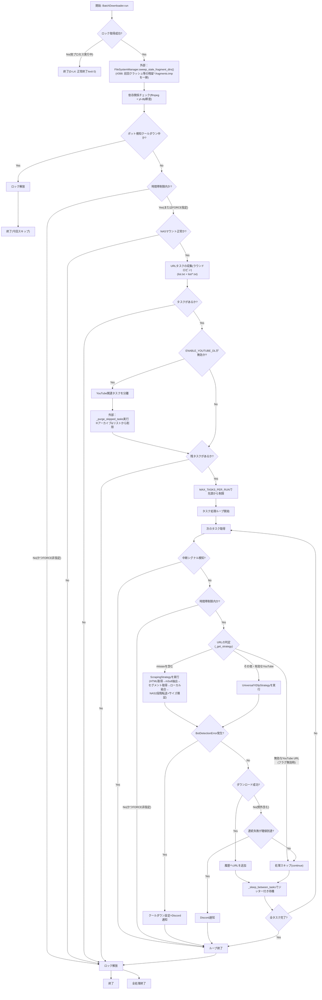
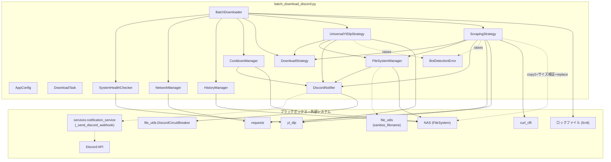

## 1. 解析メタ情報

| 項目 | 内容 |
| --- | --- |
| 対象ファイル | `batch_download_discord.py` |
| 言語 | Python |
| 解析対象 | 提供されたコードのみ |
| 推測・補完 | 一切なし |
| 解析基準コミット | `40c569a` |

## 関連ドキュメント

* [file_utils.md](./file_utils.md) — 本ファイルが利用する共通ファイル名サニタイズ処理（`sanitize_filename`）と、Discord Webhookサーキットブレーカー（`DiscordCircuitBreaker`）の実装元。後者は`newface_monitor.py`の`DiscordNotifier`とも共通利用される。
* [../MY_HOME_SYSTEM/notification_service.md](../MY_HOME_SYSTEM/notification_service.md) — 本ファイルがフォールバック的にインポートするDiscord Webhook通知処理（`_send_discord_webhook`）の実装元。
* [../MY_HOME_SYSTEM/nas_monitor.md](../MY_HOME_SYSTEM/nas_monitor.md) — NAS容量監視との関連（全体設計書によれば、DDDのダウンロード活動によるNAS容量逼迫を`nas_monitor.py`側が監視する運用連携があるとされる。ただし本ファイルは`nas_monitor.py`を直接importしておらず、独自の簡易的な容量チェック（`FileSystemManager.check_disk_space`）を実装している点に注意）。
* [../全体設計書.md](../全体設計書.md) — DDDサブシステム全体の位置付けおよびMY_HOME_SYSTEMとのNASリソース協調に関する記述。
* [newface_monitor.md](./newface_monitor.md) — `run_monitor`の多重起動防止ロックは、本ファイルの`BatchDownloader.run`が既に採用している`fcntl.flock`による同種のロックパターンを踏襲したものである（`newface_monitor.py`のコメントで直接言及されている）。
* [test_batch_download_discord_fixes.md](./test_batch_download_discord_fixes.md) — 本ファイルの履歴I/Oエラーログ出力・ボット検知マーカーの単語境界判定・`noplaylist`設定を検証する回帰テストの解析ドキュメント。

## 2. ファイルの概要

本ファイルは、モジュールDocstring上「Production Grade Batch Downloader (v2.4.0 Universal Support)」と称される、複数のURLリストファイルから動画をバッチダウンロードするCLIスクリプトである。
主な機能は以下の通り。
* `list.txt`（単一ファイル）および `list/` ディレクトリ配下の全 `*.txt` ファイルを走査するマルチリスト対応。リストファイル名ごとにサブフォルダへ振り分けて保存する。
* `yt_dlp` を用いた汎用サイト対応のダウンロード（`UniversalYtDlpStrategy`）と、`missav` サイト専用のJS難読化解除・m3u8抽出によるスクレイピングダウンロード（`ScrapingStrategy`）の2種類のダウンロード戦略（Strategyパターン）。
* `fcntl.flock` を用いたロックファイルによる多重起動防止。
* ダウンロード履歴（`history.txt`）の管理、ディスク空き容量チェック、NASマウント確認。
* 環境変数 `ENABLE_YOUTUBE_DL` によるYouTubeダウンロード機能の有効/無効切り替えと、無効時のタスクの自動パージ（アーカイブ退避＋リストファイルからの削除）。
* 実行許可時間帯（デフォルト02:00〜06:00、`--force` 引数で無視可能）の制御。
* Discord Webhookを介した進行状況・エラー通知。
* ボット検知/レート制限対策として、サイトごとのジッター付きタスク間隔（YouTube/missavはより保守的な間隔）、`yt-dlp`自体のリクエスト間スリープ、任意のCookieファイル指定、1回の実行あたりのタスク数上限（`MAX_TASKS_PER_RUN`、ラウンドロビンでソース間の公平性を確保）、ボット検知疑い発生後の実行間クールダウン（`--clear-cooldown`で手動解除可能）、`yt-dlp`が古い場合の起動時警告、403/429/503やサインイン要求・Cloudflare風チャレンジページ検知時の即時セッション中断を備える。
* 根拠: [モジュールDocstring] (行番号: 4〜24 / 抜粋: "Production Grade Batch Downloader (v2.4.0 Universal Support)")

## 3. 外部依存関係

### インポート一覧

| 名称 | 種類 | 用途 | 根拠 |
| --- | --- | --- | --- |
| `os` | 標準ライブラリ | パス操作、環境変数取得、ロックファイルのオープン | 根拠: [import文] (行番号: 26 / 抜粋: "import os") |
| `sys` | 標準ライブラリ | `--force`/`--clear-cooldown` 引数判定、`sys.path` 操作、`sys.exit`、標準出力のTTY判定 | 根拠: [import文] (行番号: 27 / 抜粋: "import sys") |
| `time` | 標準ライブラリ | タスク間スリープ、フォールバックID生成用タイムスタンプ | 根拠: [import文] (行番号: 28 / 抜粋: "import time") |
| `re` | 標準ライブラリ | missavのJS難読化解除・m3u8 URL抽出用の正規表現処理 | 根拠: [import文] (行番号: 29 / 抜粋: "import re") |
| `random` | 標準ライブラリ | タスク間隔のジッター生成（ボット検知回避） | 根拠: [import文] (行番号: 30 / 抜粋: "import random") |
| `shutil` | 標準ライブラリ | ディスク空き容量取得(`disk_usage`)、`ffmpeg`存在確認(`which`) | 根拠: [import文] (行番号: 31 / 抜粋: "import shutil") |
| `datetime` | 標準ライブラリ | 現在時刻判定、アーカイブ・クールダウンのタイムスタンプ生成 | 根拠: [import文] (行番号: 32 / 抜粋: "import datetime") |
| `logging` | 標準ライブラリ | ロガーの設定・出力 | 根拠: [import文] (行番号: 33 / 抜粋: "import logging") |
| `signal` | 標準ライブラリ | `SIGINT`/`SIGTERM` を捕捉し安全に停止するためのハンドラ登録 | 根拠: [import文] (行番号: 34 / 抜粋: "import signal") |
| `fcntl` | 標準ライブラリ | ロックファイルへの排他ロック(`flock`)による多重起動防止 | 根拠: [import文] (行番号: 35 / 抜粋: "import fcntl") |
| `requests` | サードパーティ | HTTPセッションの生成・リクエスト送信 | 根拠: [import文] (行番号: 36 / 抜粋: "import requests") |
| `collections.defaultdict` | 標準ライブラリ | パージ対象タスクをリスト（ソース）名ごとにグループ化 | 根拠: [import文] (行番号: 37 / 抜粋: "from collections import defaultdict") |
| `abc.ABC`, `abstractmethod` | 標準ライブラリ | ダウンロード戦略の抽象基底クラス`DownloadStrategy`の定義 | 根拠: [import文] (行番号: 38 / 抜粋: "from abc import ABC, abstractmethod") |
| `typing.List`, `Optional`, `Tuple`, `Any`, `Set`, `NamedTuple`, `Dict`, `Iterable` | 標準ライブラリ | 型ヒント全般 | 根拠: [import文] (行番号: 39 / 抜粋: "from typing import List, Optional, Tuple, Any, Set, NamedTuple, Dict, Iterable") |
| `dataclasses.dataclass`, `field` | 標準ライブラリ | `AppConfig` の定義（frozenデータクラス）とデフォルトファクトリ | 根拠: [import文] (行番号: 40 / 抜粋: "from dataclasses import dataclass, field") |
| `file_utils.sanitize_filename` (as `_shared_sanitize_filename`) | ローカルモジュール | ファイル名のサニタイズ処理を共通モジュールへ委譲 | 根拠: [import文] (行番号: 42 / 抜粋: "from file_utils import sanitize_filename as _shared_sanitize_filename") |
| `file_utils.DiscordCircuitBreaker` | ローカルモジュール | `DiscordNotifier.send`が参照するモジュールレベル変数`_discord_circuit_breaker`の型。Discord Webhookへの連続送信失敗検知用 | 根拠: [import文] (行番号: 43 / 抜粋: "from file_utils import DiscordCircuitBreaker") |
| `pathlib.Path` | 標準ライブラリ | パスオブジェクトの操作全般 | 根拠: [import文] (行番号: 43 / 抜粋: "from pathlib import Path") |
| `urllib.parse.urljoin` | 標準ライブラリ | m3u8マニフェスト内の相対URIを絶対URLへ書き換える処理で使用 | 根拠: [import文] (行番号: 44 / 抜粋: "from urllib.parse import urljoin") |
| `concurrent.futures.ThreadPoolExecutor`, `as_completed` | 標準ライブラリ | m3u8セグメントの並行ダウンロード（最大5ワーカー） | 根拠: [import文] (行番号: 45 / 抜粋: "from concurrent.futures import ThreadPoolExecutor, as_completed") |
| `requests.adapters.HTTPAdapter` | サードパーティ | セッションへのリトライ用アダプタのマウント | 根拠: [import文] (行番号: 48 / 抜粋: "from requests.adapters import HTTPAdapter") |
| `urllib3.util.retry.Retry` | サードパーティ | HTTPリクエストのリトライポリシー定義 | 根拠: [import文] (行番号: 49 / 抜粋: "from urllib3.util.retry import Retry") |
| `yt_dlp` | サードパーティ | 動画のメタデータ抽出およびダウンロード（Universal）、`playlist.m3u8`の結合（ScrapingStrategy）、バージョン鮮度チェック | 根拠: [import文] (行番号: 50 / 抜粋: "import yt_dlp") |
| `services.notification_service._send_discord_webhook` | ローカルモジュール（動的解決） | Discord Webhook通知の送信。`try-except ImportError` で見つからない場合は、`DISCORD_WEBHOOK_ERROR`/`DISCORD_WEBHOOK_NOTIFY`（いずれも未設定時は`DISCORD_WEBHOOK_URL`）を`os.getenv`で直接参照し`requests.post`で実際に送信する、本ファイル内実装済みの単独フォールバック関数`_standalone_send_discord_webhook`に置き換えられる（無効化されるダミーではない） | 根拠: [importとフォールバック代入] (行番号: 108〜115 / 抜粋: "from services.notification_service import _send_discord_webhook\nexcept ImportError:", "_send_discord_webhook = _standalone_send_discord_webhook") |
| `curl_cffi.requests` (as `curl_requests`) | サードパーティ（遅延インポート） | m3u8マニフェスト・HLSセグメントの取得をブラウザ偽装(`impersonate="chrome"`)付きで行う。`_fetch_m3u8_manifest`内では`try-except ImportError`でガードされるが、`_download_segment`内では無条件でインポートされる | 根拠: [遅延import] (行番号: 692, 744 / 抜粋: "import curl_cffi.requests as curl_requests") |

### ブラックボックスとなる外部要素

| 名称 | 理由 | 根拠 |
| --- | --- | --- |
| `services.notification_service._send_discord_webhook` | 実装が別ファイルに存在し、Webhook URLや認証方式、`image_data`引数の扱いなど詳細は本ファイルからは不明。ただし見つからない場合のフォールバック(`_standalone_send_discord_webhook`)自体は本ファイル内に実装があり、無効化されたダミー(`pass`)ではなく`os.getenv`で`DISCORD_WEBHOOK_ERROR`/`DISCORD_WEBHOOK_NOTIFY`(または`DISCORD_WEBHOOK_URL`)を参照し`requests.post`で実際に送信する簡易実装であることは本ファイルから確認できる。 | 根拠: [フォールバック関数定義とimport/except] (行番号: 84〜115 / 抜粋: "def _standalone_send_discord_webhook(messages, image_data=None, channel="notify") -> bool:", "_send_discord_webhook = _standalone_send_discord_webhook") |
| `file_utils.sanitize_filename` | サニタイズの具体的なルール（禁止文字、長さ制限等）が本ファイルからは不明。 | 根拠: [import文] (行番号: 42 / 抜粋: "from file_utils import sanitize_filename as _shared_sanitize_filename") |
| `MY_HOME_SYSTEM_ROOT` 環境変数 / `services` ディレクトリ探索 | プロジェクトルート自動探索ロジックが依存する `services` ディレクトリの実際の配置や、環境変数が設定される運用上の前提が不明。**（品質で修正）** 解決ロジック自体は`file_utils.resolve_my_home_system_root`へ集約され、`newface_monitor.py`/`extract_youtube_urls.py`と共通化された。 | 根拠: [PROJECT_ROOT解決処理] (行番号: 67〜72 / 抜粋: "PROJECT_ROOT = resolve_my_home_system_root(CURRENT_DIR)")、詳細は`file_utils.md`の`resolve_my_home_system_root`を参照 |
| `yt_dlp.YoutubeDL` / `yt_dlp.version.__version__` | `extract_info`/`download`の内部実装や、バージョン文字列の生成規則の詳細は`yt_dlp`本体に依存し、本ファイルからは分からない。 | 根拠: [yt_dlp利用箇所] (行番号: 472, 547, 915 / 抜粋: "installed = datetime.datetime.strptime(yt_dlp.version.__version__, "%Y.%m.%d")", "with yt_dlp.YoutubeDL(ydl_opts) as ydl:") |
| `curl_cffi`のブラウザ偽装(`impersonate`)実装 | `impersonate="chrome"`が実際にどのChrome版相当のTLS/HTTP指紋を再現するか、対応バージョンの下限など`curl_cffi`本体の実装詳細は本ファイルからは分からない。 | 根拠: [curl_cffi呼び出し箇所] (行番号: 701〜706, 746〜751 / 抜粋: "impersonate="chrome",") |

## 4. 主要要素の定義（関数 / エンドポイント / コンポーネント）

### `_standalone_send_discord_webhook`

* **役割**: `MY_HOME_SYSTEM`（LINE Bot SDKや`config.py`、DBを要する）を持たない単独環境向けの、追加の依存関係なしでテキスト通知のみを送る簡易Discord Webhook送信関数。`services.notification_service._send_discord_webhook`のインポートに失敗した場合にのみ、`_send_discord_webhook`名へこの関数が代入される（無効化されたダミー(`pass`)ではなく実際にPOST送信を行う）。
* 根拠: [関数定義とDocstring] (行番号: 84〜88 / 抜粋: "def _standalone_send_discord_webhook(messages, image_data=None, channel="notify") -> bool:\n    """MY_HOME_SYSTEM(LINE Bot SDKやconfig.py、DBを要する)を持たない単独環境向けの\n    簡易Discord Webhook送信フォールバック。DISCORD_WEBHOOK_ERROR/DISCORD_WEBHOOK_NOTIFY\n    (未設定時はDISCORD_WEBHOOK_URL)を直接参照し、追加の依存関係なしでテキスト通知のみ送る。")

* **引数/リクエスト**: `messages`（辞書のリスト。各要素は`{"text": ...}`形式を想定し`.get("text", "")`で本文を取り出す。辞書でない要素は`str()`変換される）、`image_data=None`（引数として受け取るが本関数の実装内では未使用）、`channel="notify"`（`"error"`なら`DISCORD_WEBHOOK_ERROR`系、それ以外は`DISCORD_WEBHOOK_NOTIFY`系のURLを選択するチャンネル指定）
* 根拠: [引数定義とチャンネル分岐] (行番号: 84, 90〜93 / 抜粋: "def _standalone_send_discord_webhook(messages, image_data=None, channel="notify") -> bool:", "if channel == "error":\n        url = os.getenv("DISCORD_WEBHOOK_ERROR") or os.getenv("DISCORD_WEBHOOK_URL")\n    else:\n        url = os.getenv("DISCORD_WEBHOOK_NOTIFY") or os.getenv("DISCORD_WEBHOOK_URL")")

* **戻り値/レスポンス**: `bool`（送信成功時`True`、Webhook URL未設定時または送信失敗時`False`）
* 根拠: [戻り値ヒントと各return] (行番号: 84, 95, 102, 105 / 抜粋: "def _standalone_send_discord_webhook(messages, image_data=None, channel="notify") -> bool:", "if not url:\n        return False")

* **副作用**: `os.getenv`による環境変数(`DISCORD_WEBHOOK_ERROR`/`DISCORD_WEBHOOK_NOTIFY`/`DISCORD_WEBHOOK_URL`)の読み込み、`requests.post`によるDiscord Webhookへの実送信（本文は`text[:2000]`に切り詰め、タイムアウトは`CONFIG.REQUEST_TIMEOUT`）、送信失敗時の警告ログ出力。
* 根拠: [requests.post呼び出し] (行番号: 100 / 抜粋: "resp = requests.post(url, json={"content": text[:2000]}, timeout=CONFIG.REQUEST_TIMEOUT)")

* **エラーハンドリング**: `channel`に応じたいずれの環境変数も未設定（URLが`None`）の場合は`requests.post`自体を呼ばずに`False`を返す。送信時の例外は`Exception`で捕捉して`logger.warning`で警告ログを出力したうえで`False`を返す（例外の再送出はしない）。
* 根拠: [try-exceptブロック] (行番号: 99〜105 / 抜粋: "try:\n        resp = requests.post(url, json={"content": text[:2000]}, timeout=CONFIG.REQUEST_TIMEOUT)\n        resp.raise_for_status()\n        return True\n    except Exception as e:\n        logger.warning(f"⚠️ Discord Webhook送信に失敗しました: {e}")\n        return False")

### `_resolve_cookies_file`

* **役割**: 環境変数`YOUTUBE_COOKIES_FILE`が指すCookieファイルを解決する関数。環境変数が未設定、またはファイルが存在しない場合はCookie無し（`None`）にフォールバックする。
* 根拠: [関数定義とDocstring] (行番号: 91〜96 / 抜粋: "def _resolve_cookies_file() -> Optional[Path]:\n    """YouTube等のボット検知回避用Cookieファイルを解決する。")

* **引数/リクエスト**: なし
* 根拠: [関数定義] (行番号: 91 / 抜粋: "def _resolve_cookies_file() -> Optional[Path]:")

* **戻り値/レスポンス**: `Optional[Path]`（解決できたCookieファイルのパス、なければ`None`）
* 根拠: [戻り値ヒント] (行番号: 91 / 抜粋: "def _resolve_cookies_file() -> Optional[Path]:")

* **副作用**: `os.getenv`による環境変数読み込み、ファイル未存在時の警告ログ出力。
* 根拠: [処理内容] (行番号: 97, 102 / 抜粋: "cookies_env = os.getenv("YOUTUBE_COOKIES_FILE")", "logger.warning(f"⚠️ YOUTUBE_COOKIES_FILE で指定されたファイルが見つかりません: {cookies_path}")")

* **エラーハンドリング**: 例外送出はなく、未設定・ファイル不在のいずれも`None`を返すことで安全側にフォールバックする。
* 根拠: [ガード節] (行番号: 98〜99, 101〜103 / 抜粋: "if not cookies_env:\n        return None")

### `AppConfig`

* **役割**: アプリケーション全体の設定値（時間制限、パス、リトライ回数、機能フラグ、ボット検知対策のスリープ範囲・閾値・マーカー文字列等）を保持するイミュータブル(`frozen=True`)なデータクラス。NAS関連では、`REQUIRE_NAS_MOUNT`（`false`でNAS未マウントでも起動を許可し`verify_nas_mount`自体をスキップする単独環境向けフラグ）、`LOCAL_TMP_DIR`（`ScrapingStrategy`がHLSフラグメント・結合を行うローカル一時ディレクトリ。既定は`tempfile.gettempdir()`ではなく`CURRENT_DIR/tmp_fragments`＝本スクリプトと同じ実ディスク上。理由はソースコメントによれば、`/tmp`がtmpfs運用の環境（一部Raspberry Pi OS構成含む）だと動画1本分(数GB)の書き込みでOOM・SSH切断を招きうるため）、`LOCAL_TMP_MIN_FREE_SPACE_GB`（`LOCAL_TMP_DIR`の空き容量下限）の3フィールドが、PR #72で追加されたローカル→NAS二段階転送パイプライン（`ScrapingStrategy._download_with_ytdlp`参照）向けに存在する。**（本PRで追加）** `DISCORD_CIRCUIT_BREAKER_THRESHOLD`（既定3）は、`_discord_circuit_breaker`（`DiscordNotifier.send`が参照するモジュールレベルの`file_utils.DiscordCircuitBreaker`）が連続何回の送信失敗でブレーカーを開くかの閾値。
* 根拠: [AppConfigクラスとNAS関連フィールドのコメント] (行番号: 135〜136, 151〜153, 154〜166, 167〜169 / 抜粋: "@dataclass(frozen=True)\nclass AppConfig:", "REQUIRE_NAS_MOUNT: bool = os.getenv("DDD_REQUIRE_NAS_MOUNT", "true").lower() == "true"", "LOCAL_TMP_DIR: Path = Path(os.getenv("DDD_LOCAL_TMP_DIR", str(CURRENT_DIR / "tmp_fragments")))", "LOCAL_TMP_MIN_FREE_SPACE_GB: int = int(os.getenv("DDD_LOCAL_TMP_MIN_FREE_SPACE_GB", "10"))")

* **（Issue #397で追加）`SEGMENT_DOWNLOAD_MAX_ATTEMPTS: int = 3` / `SEGMENT_RETRY_BASE_DELAY: float = 1.0`について**: `ScrapingStrategy._download_segment`がHLSセグメント1個あたりに行う取得試行回数と、リトライ前の初回待機秒（指数バックオフで1秒→2秒）。数千セグメント中1つの一時的なタイムアウトで数GBのダウンロードが丸ごと破棄されるのを防ぐ。`BotDetectionError`はリトライ対象外。
* 根拠: [定数定義とコメント] (行番号: 178〜183 / 抜粋: "# #397: HLSセグメント1個あたりの取得試行回数と、リトライ前の初回待機秒\n    # (指数バックオフ: 1秒→2秒)。数千セグメント中1つの一時的なタイムアウトで\n    # 数GBのダウンロードが丸ごと破棄されるのを防ぐ。BotDetectionError は\n    # リトライ対象外(即座にセッション中断)。\n    SEGMENT_DOWNLOAD_MAX_ATTEMPTS: int = 3\n    SEGMENT_RETRY_BASE_DELAY: float = 1.0")

* **引数/リクエスト**: なし（フィールドはデフォルト値、環境変数、または`_resolve_cookies_file`の呼び出し結果から初期化される）
* 根拠: [各フィールド定義] (行番号: 137〜237 / 抜粋: "RESTRICT_TIME: bool = not FORCE_MODE")

* **戻り値/レスポンス**: 該当なし（インスタンスは `CONFIG = AppConfig()` としてモジュールレベルで単一生成）
* 根拠: [インスタンス生成] (行番号: 243 / 抜粋: "CONFIG = AppConfig()")

* **副作用**: `os.getenv` による環境変数(`ENABLE_YOUTUBE_DL`, `VIDEO_SAVE_DIR`, `DDD_REQUIRE_NAS_MOUNT`, `DDD_LOCAL_TMP_DIR`, `DDD_LOCAL_TMP_MIN_FREE_SPACE_GB`, `DDD_REQUEST_TIMEOUT`等)の読み込み、`field(default_factory=_resolve_cookies_file)`によるCookieファイル解決処理の実行。
* 根拠: [環境変数読み込みとdefault_factory] (行番号: 143, 153, 166, 169, 192 / 抜粋: "ENABLE_YOUTUBE_DL: bool = os.getenv("ENABLE_YOUTUBE_DL", "false").lower() == "true"", "YOUTUBE_COOKIES_FILE: Optional[Path] = field(default_factory=_resolve_cookies_file)")

* **エラーハンドリング**: なし

### `AppConfig.nas_marker_path`

* **役割**: NASマウント確認用のマーカーファイル（`NAS_MOUNT_POINT / NAS_MARKER_FILE`）の完全パスを返すプロパティ。
* 根拠: [プロパティ定義] (行番号: 239〜241 / 抜粋: "@property\n    def nas_marker_path(self) -> Path:\n        return self.NAS_MOUNT_POINT / self.NAS_MARKER_FILE")

* **引数/リクエスト**: なし（`self`のみ）
* **戻り値/レスポンス**: `Path`
* 根拠: [戻り値] (行番号: 241 / 抜粋: "return self.NAS_MOUNT_POINT / self.NAS_MARKER_FILE")

* **副作用**: なし
* **エラーハンドリング**: なし

### `BotDetectionError`

* **役割**: YouTube等からのボット検知/レート制限（429やSign-in要求等）を検知した際に送出される専用例外。通常のダウンロード失敗（タスク単位のスキップ）とは区別し、セッション全体を即座に中断すべきシグナルとして扱われる。
* 根拠: [クラス定義とDocstring] (行番号: 197〜202 / 抜粋: "class BotDetectionError(Exception):\n    """YouTube等からボット検知/レート制限（429やSign-in要求等）を検知した際に送出する。")

* **引数/リクエスト**: `Exception`を継承した標準的な例外引数（メッセージ文字列等）
* **戻り値/レスポンス**: 該当なし
* **副作用**: なし
* **エラーハンドリング**: 該当なし（本クラス自体は例外定義のみ）

### `_is_bot_detection_error`

* **役割**: 例外オブジェクトの文字列表現（小文字化し、Unicodeのアポストロフィ`’`をASCIIの`'`に正規化）に`CONFIG.BOT_DETECTION_MARKERS`のいずれかが含まれるかを判定する関数。マーカーが数字のみ（"403"/"429"/"503"）の場合は正規表現の単語境界(`\b`)で厳密に一致するかを判定し、フレーズマーカー（"sign in to confirm you're not a bot"等）は部分文字列一致(`in`)で判定する。数字マーカーを単純な部分文字列一致で判定すると、エラーメッセージに埋め込まれた動画ID等の英数字列（例: "AbC403XyZ"）に偶然含まれる数字列にまで誤爆し、`BOT_DETECTION_COOLDOWN_HOURS`（12時間）のセッション全停止を誤って引き起こし得たための修正である。**（Issue #396で修正）** 以前のフレーズマーカー`"sign in to confirm"`は、yt-dlpの年齢制限メッセージ「Sign in to confirm your age. This video may be inappropriate for some users.」にも部分一致し、年齢制限動画1本で`BotDetectionError`→セッション中断＋12時間クールダウンに入っていた。マーカーをボット検知に固有の`"sign in to confirm you're not a bot"`/`"confirm you're not a bot"`に絞るとともに、`CONFIG.BOT_DETECTION_EXCLUDED_MARKERS`（`"confirm your age"`）を含むメッセージはマーカー判定より優先して`False`を返す。
* 根拠: [関数定義とコメント] (行番号: 269〜289 / 抜粋: "def _is_bot_detection_error(exc: Exception) -> bool:\n    # M-7-2: "403"/"429"/"503" のような数字だけのマーカーを単純な部分文字列\n    # マッチ(in)で判定すると、エラーメッセージに埋め込まれた動画ID等の\n    # 英数字列(例: "...AbC403XyZ...")に偶然含まれる数字列にまで誤爆し" / "# #396: yt-dlpのメッセージは "you’re"(U+2019) のような引用符を使うことがある\n    # ため、ASCIIのアポストロフィに正規化してからマーカーと比較する。\n    message = str(exc).lower().replace("’", "'")\n    # #396: 年齢制限("Sign in to confirm your age")等、ボット検知ではないことが\n    # 明確な文言を含む場合は、マーカーに一致しても誤検知として扱わない。\n    if any(excluded in message for excluded in CONFIG.BOT_DETECTION_EXCLUDED_MARKERS):\n        return False")、[マーカー定義] (行番号: 205〜222 / 抜粋: "BOT_DETECTION_MARKERS: Tuple[str, ...] = (\n        \"sign in to confirm you're not a bot\",\n        \"confirm you're not a bot\"," / "BOT_DETECTION_EXCLUDED_MARKERS: Tuple[str, ...] = (\n        \"confirm your age\",\n    )")

* **引数/リクエスト**: `exc: Exception`
* 根拠: [引数定義] (行番号: 269 / 抜粋: "def _is_bot_detection_error(exc: Exception) -> bool:")

* **戻り値/レスポンス**: `bool`
* 根拠: [戻り値ヒントと各return] (行番号: 269, 282, 286, 288, 289 / 抜粋: "def _is_bot_detection_error(exc: Exception) -> bool:")

* **副作用**: なし
* 根拠: [処理内容] (行番号: 278〜289 / 抜粋: "message = str(exc).lower().replace("’", "'")" / "for marker in CONFIG.BOT_DETECTION_MARKERS:\n        if marker.isdigit():\n            if re.search(rf"\\b{re.escape(marker)}\\b", message):")

* **エラーハンドリング**: なし（判定ロジックのみで例外は送出しない）

### `_round_robin_flatten`

* **役割**: 複数グループ（ソース別タスクリスト）を、グループ順の単純連結ではなくラウンドロビン（各グループから1件ずつ順番に取り出す）で1本のリストへ平坦化する関数。`MAX_TASKS_PER_RUN`で先頭から打ち切られても特定のソースだけが上限を独占しないようにする。
* 根拠: [関数定義とDocstring] (行番号: 223〜230 / 抜粋: "def _round_robin_flatten(groups: Iterable[List["DownloadTask"]]) -> List["DownloadTask"]:\n    """複数グループのリストを、グループ順ではなくラウンドロビンで1本のリストに平坦化する。")

* **引数/リクエスト**: `groups: Iterable[List["DownloadTask"]]`
* 根拠: [引数定義] (行番号: 223 / 抜粋: "def _round_robin_flatten(groups: Iterable[List["DownloadTask"]]) -> List["DownloadTask"]:")

* **戻り値/レスポンス**: `List["DownloadTask"]`（ラウンドロビン順に平坦化された結果）
* 根拠: [戻り値ヒントとreturn文] (行番号: 223, 238 / 抜粋: "return result")

* **副作用**: なし（純粋なリスト変換処理）
* **エラーハンドリング**: なし

### `_looks_like_block_page`

* **役割**: 取得したHTMLがCloudflare等のボット検知チャレンジページかどうかを、本文中の特定マーカー文字列（小文字化して照合）の有無で判定する関数。HTTPステータス200で返る場合もあるため、ステータスコードだけに頼らない判定を行う。
* 根拠: [関数定義とDocstring] (行番号: 241〜246 / 抜粋: "def _looks_like_block_page(html: str) -> bool:\n    """取得したHTMLがCloudflare等のボット検知チャレンジページかを判定する。")

* **引数/リクエスト**: `html: str`
* 根拠: [引数定義] (行番号: 241 / 抜粋: "def _looks_like_block_page(html: str) -> bool:")

* **戻り値/レスポンス**: `bool`
* 根拠: [戻り値ヒント] (行番号: 241 / 抜粋: "def _looks_like_block_page(html: str) -> bool:")

* **副作用**: なし
* **エラーハンドリング**: なし

### `DownloadTask`

* **役割**: ダウンロード対象のURLと、その取得元リスト名（サブフォルダ振り分けに使用）を保持する `NamedTuple`。
* 根拠: [DownloadTaskクラス] (行番号: 251〜253 / 抜粋: "class DownloadTask(NamedTuple):\n    url: str\n    source_name: str")

* **引数/リクエスト**: `url: str`, `source_name: str`
* 根拠: [フィールド定義] (行番号: 252〜253 / 抜粋: "url: str\n    source_name: str")

* **戻り値/レスポンス**: 該当なし
* **副作用**: なし
* **エラーハンドリング**: なし

### `_discord_circuit_breaker` (モジュールレベル変数)

* **役割**: `DiscordNotifier.send`が全呼び出しで共有する、モジュールレベル単一インスタンスの`file_utils.DiscordCircuitBreaker`。**（本PRで追加）** 以前は`DiscordNotifier.send`にWebhookへの連続送信失敗を検知する仕組みが一切無く、Webhookが機能していない間の1回の実行で無駄なリクエストを送り続けていた。閾値は`CONFIG.DISCORD_CIRCUIT_BREAKER_THRESHOLD`(既定3)。
* 根拠: [モジュールレベル変数定義] (行番号: 326 / 抜粋: "_discord_circuit_breaker = DiscordCircuitBreaker(failure_threshold=CONFIG.DISCORD_CIRCUIT_BREAKER_THRESHOLD)")

* **引数/リクエスト**: 該当なし（モジュールロード時に1度だけ生成される）
* **戻り値/レスポンス**: 該当なし
* **副作用**: なし（インスタンス生成のみ）
* **エラーハンドリング**: なし
* 根拠: [モジュールレベル変数定義] (行番号: 326 / 抜粋: 前掲)

### `DiscordNotifier.send`

* **役割**: Discord Webhook経由で通知メッセージを送信する静的メソッド。エラー通知フラグに応じて送信先チャンネル(`error`/`notify`)を切り替える。**（本PRで追加）** 送信前に`_discord_circuit_breaker`が開いていないか確認し、開いていれば送信自体を試みずスキップする。
* 根拠: [DiscordNotifier.send] (行番号: 328〜346 / 抜粋: "def send(text: str, is_error: bool = False) -> None:")

* **引数/リクエスト**: `text: str` (通知内容), `is_error: bool = False` (エラー通知フラグ)
* 根拠: [引数定義] (行番号: 330 / 抜粋: "def send(text: str, is_error: bool = False) -> None:")

* **戻り値/レスポンス**: `None`
* 根拠: [戻り値ヒント] (行番号: 330 / 抜粋: "-> None:")

* **副作用**: サーキットブレーカーの開放チェック（開いていれば警告ログを出力し早期return）、`_send_discord_webhook` の呼び出しによる外部APIへの通知送信、送信結果に応じた`_discord_circuit_breaker`の状態更新(`record_success`/`record_failure`)。
* 根拠: [ブレーカーチェックとAPI呼び出し] (行番号: 331〜335, 339, 343〜346 / 抜粋: "if _discord_circuit_breaker.is_open:\n            # Webhookへの連続送信失敗を検知しているため、無駄なリクエストを\n            # 重ねないよう以降の送信をスキップする。" / "sent = _send_discord_webhook([message], channel=channel)")

* **エラーハンドリング**: `_discord_circuit_breaker.is_open`が`True`の場合は警告ログを出力し送信自体を行わずreturnする。送信時の例外を捕捉した場合は`exc_info=True` 付きでエラーログを出力し（例外は再送出しない）`sent = False`とする。`_send_discord_webhook`の戻り値（例外を送出せず`bool`を返す実装のため）が`False`の場合も同様に失敗として扱う。成否いずれの場合も`_discord_circuit_breaker`の`record_success()`/`record_failure()`を呼び状態を更新する。
* 根拠: [try-exceptブロックと成否分岐] (行番号: 336〜346 / 抜粋: "try:\n            sent = _send_discord_webhook([message], channel=channel)\n        except Exception as e:\n            logger.error(f"⚠️ Discord通知エラー: {e}", exc_info=True)\n            sent = False\n        if sent:\n            _discord_circuit_breaker.record_success()\n        else:\n            _discord_circuit_breaker.record_failure()")

### `HistoryManager.load_history`

* **役割**: 履歴ファイル(`history.txt`)からダウンロード済みURLの集合を読み込む静的メソッド。読み込み失敗時は安全側（空の履歴として続行）に倒しつつ、`logger.error`で必ずログに残す。以前は`except Exception: pass`で読み込み失敗をログにすら残さず握りつぶしており、既にダウンロード済みのURLが全て「未ダウンロード」扱いになる再ダウンロード・再通知の嵐を引き起こしても原因調査ができない問題があったための修正である。
* 根拠: [HistoryManager.load_historyとコメント] (行番号: 270〜277 / 抜粋: "def load_history() -> Set[str]:\n        history = set()\n        if CONFIG.HISTORY_FILE_PATH.exists():\n            try:\n                with open(CONFIG.HISTORY_FILE_PATH, "r", encoding="utf-8") as f:\n                    history = {line.strip() for line in f if line.strip()}\n            except Exception as e:\n                # M-7-1: 読み込み失敗を握りつぶすと、既にダウンロード済みのURLが")

* **引数/リクエスト**: なし
* **戻り値/レスポンス**: `Set[str]`（ファイルが存在しない場合や例外時は空集合）
* 根拠: [戻り値ヒント] (行番号: 270 / 抜粋: "def load_history() -> Set[str]:")

* **副作用**: 履歴ファイルの読み込み、読み込み失敗時のエラーログ出力(`exc_info=True`)。
* 根拠: [ファイル読み込みとエラーログ] (行番号: 274, 281 / 抜粋: "with open(CONFIG.HISTORY_FILE_PATH, "r", encoding="utf-8") as f:", "logger.error(f"⚠️ 履歴ファイルの読み込みに失敗しました: {e}", exc_info=True)")

* **エラーハンドリング**: 例外発生時は`exc_info=True`付きでエラーログを出力し、その時点までに読めた履歴（空集合）を安全側の結果として返す（例外は再送出しない）。
* 根拠: [try-exceptブロックとコメント] (行番号: 276〜281 / 抜粋: "except Exception as e:\n                # M-7-1: 読み込み失敗を握りつぶすと、既にダウンロード済みのURLが\n                # 全て「未ダウンロード」扱いになり、全件の再ダウンロード・再通知の\n                # 嵐を引き起こす。方針として安全側(空の履歴として続行)には倒すが、\n                # 原因調査ができるよう必ずログには残す。\n                logger.error(f"⚠️ 履歴ファイルの読み込みに失敗しました: {e}", exc_info=True)")

### `HistoryManager.add_history`

* **役割**: ダウンロード完了URLを履歴ファイルへ追記する静的メソッド。書き込み失敗時は処理自体は継続しつつ、`logger.error`で必ずログに残す。以前は`except Exception: pass`で書き込み失敗を握りつぶしており、当該URLが次回実行時も「未ダウンロード」のままになり再ダウンロード・再通知が続いても原因調査ができない問題があったための修正である。
* 根拠: [HistoryManager.add_historyとコメント] (行番号: 285〜290 / 抜粋: "def add_history(url: str) -> None:\n        try:\n            with open(CONFIG.HISTORY_FILE_PATH, "a", encoding="utf-8") as f:\n                f.write(f"{url}\\n")\n        except Exception as e:\n            # M-7-1: 書き込み失敗を握りつぶすと、このURLは次回実行時も")

* **引数/リクエスト**: `url: str`
* **戻り値/レスポンス**: `None`
* 根拠: [関数定義] (行番号: 285 / 抜粋: "def add_history(url: str) -> None:")

* **副作用**: 履歴ファイルへの追記書き込み、書き込み失敗時のエラーログ出力(`exc_info=True`)。
* 根拠: [ファイル書き込みとエラーログ] (行番号: 287, 293 / 抜粋: "with open(CONFIG.HISTORY_FILE_PATH, "a", encoding="utf-8") as f:", "logger.error(f"⚠️ 履歴ファイルへの書き込みに失敗しました (url={url}): {e}", exc_info=True)")

* **エラーハンドリング**: 例外発生時は`exc_info=True`付きでエラーログを出力する（処理は継続し、例外は再送出しない）。
* 根拠: [try-exceptブロックとコメント] (行番号: 289〜293 / 抜粋: "except Exception as e:\n            # M-7-1: 書き込み失敗を握りつぶすと、このURLは次回実行時も\n            # 「未ダウンロード」のままになり再ダウンロード・再通知が続く。\n            # ここで処理自体を止めるほどではないため続行するが、ログには残す。\n            logger.error(f"⚠️ 履歴ファイルへの書き込みに失敗しました (url={url}): {e}", exc_info=True)")

### `CooldownManager.is_in_cooldown`

* **役割**: クールダウンファイル(`.bot_detection_cooldown`)から解除予定時刻を読み込み、現在時刻がその前であれば解除予定時刻を、そうでなければ`None`を返す静的メソッド。
* 根拠: [メソッド定義とDocstring] (行番号: 304〜305 / 抜粋: "def is_in_cooldown() -> Optional[datetime.datetime]:\n        """クールダウン中であれば解除予定時刻を、そうでなければNoneを返す。"""")

* **引数/リクエスト**: なし
* **戻り値/レスポンス**: `Optional[datetime.datetime]`
* 根拠: [戻り値ヒント] (行番号: 304 / 抜粋: "def is_in_cooldown() -> Optional[datetime.datetime]:")

* **副作用**: クールダウンファイルの読み込み。
* 根拠: [ファイル読み込み] (行番号: 310 / 抜粋: "until = datetime.datetime.fromisoformat(path.read_text(encoding="utf-8").strip())")

* **エラーハンドリング**: ファイルが壊れている場合（`ValueError`/`OSError`）は安全側（＝クールダウンしない）に倒して`None`を返す。
* 根拠: [try-exceptブロックとコメント] (行番号: 311〜313 / 抜粋: "except (ValueError, OSError):\n            # 壊れたクールダウンファイルは安全側（＝クールダウンしない）に倒す\n            return None")

### `CooldownManager.trigger_cooldown`

* **役割**: 現在時刻から`BOT_DETECTION_COOLDOWN_HOURS`（既定12時間）後を解除予定時刻として算出し、一時ファイル経由のアトミックな`replace`でクールダウンファイルへ書き込む静的メソッド。
* 根拠: [メソッド定義とコメント] (行番号: 317〜318 / 抜粋: "def trigger_cooldown() -> None:\n        until = datetime.datetime.now() + datetime.timedelta(hours=CONFIG.BOT_DETECTION_COOLDOWN_HOURS)")

* **引数/リクエスト**: なし
* **戻り値/レスポンス**: `None`
* 根拠: [戻り値ヒント] (行番号: 317 / 抜粋: "def trigger_cooldown() -> None:")

* **副作用**: 一時ファイルへの書き込みとアトミックな`replace`によるクールダウンファイルの更新、情報ログ出力。
* 根拠: [アトミック書き込み] (行番号: 323〜325 / 抜粋: "tmp_path = CONFIG.BOT_DETECTION_COOLDOWN_FILE.with_suffix('.tmp')\n            tmp_path.write_text(until.isoformat(), encoding="utf-8")\n            tmp_path.replace(CONFIG.BOT_DETECTION_COOLDOWN_FILE)")

* **エラーハンドリング**: 書き込み失敗時(`OSError`)はエラーログを出力する（例外の再送出はしない）。
* 根拠: [try-exceptブロック] (行番号: 327〜328 / 抜粋: "except OSError as e:\n            logger.error(f"⚠️ クールダウンファイルの書き込みに失敗しました: {e}", exc_info=True)")

### `CooldownManager.clear`

* **役割**: クールダウンファイルを削除し、クールダウン状態を手動解除する静的メソッド。
* 根拠: [メソッド定義] (行番号: 331〜333 / 抜粋: "def clear() -> None:\n        try:\n            CONFIG.BOT_DETECTION_COOLDOWN_FILE.unlink(missing_ok=True)")

* **引数/リクエスト**: なし
* **戻り値/レスポンス**: `None`
* 根拠: [戻り値ヒント] (行番号: 331 / 抜粋: "def clear() -> None:")

* **副作用**: クールダウンファイルの削除(`unlink`)。
* 根拠: [削除処理] (行番号: 333 / 抜粋: "CONFIG.BOT_DETECTION_COOLDOWN_FILE.unlink(missing_ok=True)")

* **エラーハンドリング**: `OSError`を捕捉して無視（`pass`）。
* 根拠: [try-exceptブロック] (行番号: 334〜335 / 抜粋: "except OSError:\n            pass")

### `NetworkManager.create_session`

* **役割**: リトライポリシー（総リトライ回数、バックオフ、対象ステータスコード）とUser-Agentを設定した `requests.Session` を生成する静的メソッド。
* 根拠: [NetworkManager.create_session] (行番号: 339〜345 / 抜粋: "def create_session() -> requests.Session:")

* **引数/リクエスト**: なし
* **戻り値/レスポンス**: `requests.Session`
* 根拠: [戻り値ヒント] (行番号: 339 / 抜粋: "def create_session() -> requests.Session:")

* **副作用**: なし（セッションオブジェクトの生成のみ）
* **エラーハンドリング**: なし

### `FileSystemManager.sanitize_filename`

* **役割**: 外部モジュール `file_utils.sanitize_filename` へファイル名のサニタイズ処理を委譲するラッパー静的メソッド。
* 根拠: [FileSystemManager.sanitize_filename] (行番号: 349〜350 / 抜粋: "def sanitize_filename(filename: str) -> str:\n        return _shared_sanitize_filename(filename)")

* **引数/リクエスト**: `filename: str`
* **戻り値/レスポンス**: `str`
* 根拠: [関数定義] (行番号: 349 / 抜粋: "def sanitize_filename(filename: str) -> str:")

* **副作用**: なし
* **エラーハンドリング**: なし（委譲先の例外処理には依存）

### `FileSystemManager.ensure_dir`

* **役割**: 指定パスのディレクトリを（親ディレクトリを含め）作成する静的メソッド。
* 根拠: [FileSystemManager.ensure_dir] (行番号: 416〜430 / 抜粋: "def ensure_dir(path: Path) -> bool:")

* **引数/リクエスト**: `path: Path`
* **戻り値/レスポンス**: `bool`（成功時`True`、権限エラーおよびその他の`OSError`時`False`）
* 根拠: [戻り値ヒント] (行番号: 417 / 抜粋: "def ensure_dir(path: Path) -> bool:")

* **副作用**: ディレクトリ作成(`mkdir`)、エラー時のDiscord通知。
* 根拠: [mkdir呼び出し] (行番号: 419 / 抜粋: "path.mkdir(parents=True, exist_ok=True)")

* **エラーハンドリング**: `PermissionError` を捕捉し「❌ 権限エラー」通知を送信して `False` を返す。**（Issue #236で修正）** 以前は`PermissionError`以外の`OSError`(読み取り専用マウントの`Errno 30`、NAS切断時の`Errno 5`、ディスクフル時の`Errno 28`等)を捕捉しておらず、専用通知を経由しないまま呼び出し元(最終的には`run_locked`の`except Exception`)へ伝播していた。`extract_youtube_urls.py`の`process_subscriptions`(#185)と同様に`except OSError`節を追加し、「❌ ディレクトリ作成エラー」通知を送信して`False`を返すようにした。
* 根拠: [try-exceptブロック] (行番号: 421〜430 / 抜粋: "except PermissionError:", "except OSError as e:")

### `FileSystemManager.sweep_stale_fragment_dirs`（Issue #398で追加）

* **役割**: `CONFIG.LOCAL_TMP_DIR`配下に残留した`*.fragments.tmp`ディレクトリ（`ScrapingStrategy._download_with_ytdlp`がHLSセグメント取得・結合に使う一時ディレクトリ）を一掃する静的メソッド。通常は`_download_with_ytdlp`の`finally`節でリクエストごとに削除されるが、プロセスがクラッシュ・SIGKILL等で`finally`すら実行できずに終了した場合、数GB規模のフラグメント断片（SDカード等、Piのローカルディスク上）が残り続け、`LOCAL_TMP_MIN_FREE_SPACE_GB`チェックにより後続の全ダウンロードが失敗する形で顕在化していた（同一動画の再試行時のみ削除される`_cleanup_stale_ytdlp_artifacts`とは異なり、URLがパージ/リストから削除されると永久に残置される）。`BatchDownloader._run_locked`の冒頭（ロック取得後、他プロセスとの競合が無いことが保証された状態）から呼び出される。
* 根拠: [メソッド定義とDocstring] (行番号: 471〜489 / 抜粋: "def sweep_stale_fragment_dirs() -> None:
        """#398: クラッシュ・強制終了等で未クリーンアップのまま残った
        CONFIG.LOCAL_TMP_DIR配下の "*.fragments.tmp" ディレクトリを一掃する。")

* **引数/リクエスト**: なし
* 根拠: [引数定義] (行番号: 472 / 抜粋: "def sweep_stale_fragment_dirs() -> None:")

* **戻り値/レスポンス**: `None`
* 根拠: [戻り値ヒント] (行番号: 472 / 抜粋: "def sweep_stale_fragment_dirs() -> None:")

* **副作用**: `CONFIG.LOCAL_TMP_DIR.glob("*.fragments.tmp")`で列挙した各ディレクトリの`shutil.rmtree`による削除、削除成功時の情報ログ出力。
* 根拠: [glob と rmtree] (行番号: 483〜488 / 抜粋: "for stale_dir in CONFIG.LOCAL_TMP_DIR.glob("*.fragments.tmp"):
            try:
                shutil.rmtree(stale_dir)")

* **エラーハンドリング**: `CONFIG.LOCAL_TMP_DIR`自体が存在しない場合は何もせず`return`する。個別ディレクトリの削除失敗(`OSError`)は警告ログを出力するのみで処理を継続する（例外は再送出しない）。
* 根拠: [ガード節とexcept節] (行番号: 481〜482, 487〜488 / 抜粋: "if not CONFIG.LOCAL_TMP_DIR.exists():
            return", "except OSError as e:
                logger.warning(f"⚠️ 残留フラグメントディレクトリの削除に失敗しました ({stale_dir}): {e}")")

### `FileSystemManager.check_disk_space`

* **役割**: 対象パス（存在しない場合は存在する親ディレクトリまで遡って）のディスク空き容量を確認し、設定値(`MIN_FREE_SPACE_GB`)を下回る場合は警告通知を送信する静的メソッド。
* 根拠: [FileSystemManager.check_disk_space] (行番号: 362〜375 / 抜粋: "def check_disk_space(path: Path) -> bool:")

* **引数/リクエスト**: `path: Path`
* **戻り値/レスポンス**: `bool`（容量十分なら`True`、不足時`False`、例外時は安全側に倒して`False`）
* 根拠: [戻り値ヒント と例外時のreturn] (行番号: 362, 375 / 抜粋: "def check_disk_space(path: Path) -> bool:", "return False")

* **副作用**: `DiscordNotifier.send` による容量不足時の警告通知、例外時のエラーログ出力。
* 根拠: [通知送信] (行番号: 370 / 抜粋: "DiscordNotifier.send(f"⚠️ DISK FULL: 残り {free // (2**30)}GB", is_error=True)")

* **エラーハンドリング**: `shutil.disk_usage` 等での例外を捕捉し、エラーログを出力した上で `False`（＝ダウンロード中断）を返す。
* 根拠: [try-exceptブロック] (行番号: 373〜375 / 抜粋: "except Exception as e:")

### `SystemHealthChecker.is_within_time_window`

* **役割**: 現在時刻が実行許可時間帯(`START_HOUR`〜`END_HOUR`)内かを判定する静的メソッド。`RESTRICT_TIME`が無効（`--force`実行時）であれば常に`True`。
* 根拠: [SystemHealthChecker.is_within_time_window] (行番号: 379〜381 / 抜粋: "def is_within_time_window() -> bool:")

* **引数/リクエスト**: なし
* **戻り値/レスポンス**: `bool`
* 根拠: [戻り値ヒント] (行番号: 379 / 抜粋: "def is_within_time_window() -> bool:")

* **副作用**: なし
* **エラーハンドリング**: なし

### `SystemHealthChecker.verify_nas_mount`

* **役割**: `CONFIG.REQUIRE_NAS_MOUNT`が`False`（環境変数`DDD_REQUIRE_NAS_MOUNT`を`"false"`に設定）の場合は、NASを経由せずローカルディスクへ直接保存する単独環境向けに、以降のマウント確認自体を行わず無条件で`True`を返す。`True`（既定）の場合のみ、NASのマウントポイントおよびマーカーファイル(`nas_marker_path`)の存在を確認し、未マウントであればCRITICAL通知を送信する静的メソッド。
* 根拠: [SystemHealthChecker.verify_nas_mountとREQUIRE_NAS_MOUNT分岐] (行番号: 448〜455 / 抜粋: "def verify_nas_mount() -> bool:\n        if not CONFIG.REQUIRE_NAS_MOUNT:\n            return True")

* **引数/リクエスト**: なし
* **戻り値/レスポンス**: `bool`（`REQUIRE_NAS_MOUNT`無効時、またはマウント確認成功時は`True`。マウント確認失敗時は`False`）
* 根拠: [戻り値ヒント] (行番号: 448 / 抜粋: "def verify_nas_mount() -> bool:")

* **副作用**: `REQUIRE_NAS_MOUNT`有効時、未マウント検知時のDiscord通知(`is_error=True`)。
* 根拠: [通知送信] (行番号: 453 / 抜粋: "DiscordNotifier.send("⛔ CRITICAL: NASマウントエラー", is_error=True)")

* **エラーハンドリング**: なし（例外は捕捉されず呼び出し元に伝播しうる）

### `SystemHealthChecker.check_dependencies`

* **役割**: `ffmpeg` コマンドの存在を確認して見つからない場合は警告ログを出力し、続けて`check_yt_dlp_freshness`を呼び出す静的メソッド。
* 根拠: [SystemHealthChecker.check_dependencies] (行番号: 391〜394 / 抜粋: "def check_dependencies() -> None:")

* **引数/リクエスト**: なし
* **戻り値/レスポンス**: `None`
* 根拠: [戻り値ヒント] (行番号: 391 / 抜粋: "def check_dependencies() -> None:")

* **副作用**: `logger.warning` によるログ出力、`check_yt_dlp_freshness`の呼び出し。
* 根拠: [ログ出力と呼び出し] (行番号: 393〜394 / 抜粋: "logger.warning("⚠️ ffmpeg not found.")\n        SystemHealthChecker.check_yt_dlp_freshness()")

* **エラーハンドリング**: なし（`ffmpeg`未検出時も処理を継続する＝警告のみ）

### `SystemHealthChecker.check_yt_dlp_freshness`

* **役割**: `yt_dlp`のバージョン文字列（`YYYY.MM.DD`形式）を解析し、`YTDLP_STALENESS_WARN_DAYS`（既定45日）を超えて更新されていなければ警告ログを出力する静的メソッド。バージョン文字列が想定形式でない場合は静かにスキップする。
* 根拠: [メソッド定義とDocstring] (行番号: 397〜403 / 抜粋: "def check_yt_dlp_freshness() -> None:\n        """yt-dlpのバージョン（YYYY.MM.DD形式）が古すぎないか警告する。")

* **引数/リクエスト**: なし
* **戻り値/レスポンス**: `None`
* 根拠: [戻り値ヒント] (行番号: 397 / 抜粋: "def check_yt_dlp_freshness() -> None:")

* **副作用**: バージョンが古い場合の警告ログ出力。
* 根拠: [警告ログ] (行番号: 411〜416 / 抜粋: "logger.warning(\n                f"⚠️ yt-dlpのバージョンが古い可能性があります ")")

* **エラーハンドリング**: バージョン文字列の解析失敗(`ValueError`/`AttributeError`)時は判定をスキップして即座に`return`する（警告や例外なし）。
* 根拠: [try-exceptブロック] (行番号: 406〜407 / 抜粋: "except (ValueError, AttributeError):\n            return")

### `DownloadStrategy` (抽象基底クラス)

* **役割**: `UniversalYtDlpStrategy` と `ScrapingStrategy` に共通する保存先ディレクトリ決定・重複スキップ判定ロジックを提供する抽象基底クラス。`download`メソッドはサブクラスでの実装を強制する。
* 根拠: [DownloadStrategyクラス] (行番号: 421〜444 / 抜粋: "class DownloadStrategy(ABC):")

* **引数/リクエスト**: `__init__(self, save_base_dir: Path, session: requests.Session)`
* 根拠: [__init__定義] (行番号: 422〜424 / 抜粋: "def __init__(self, save_base_dir: Path, session: requests.Session):")

* **戻り値/レスポンス**: `download`は`bool`を返す抽象メソッド（`@abstractmethod`）。`_determine_save_dir`は`Optional[Path]`、`_should_skip`は`bool`を返す。
* 根拠: [各メソッドの戻り値ヒント] (行番号: 427, 430, 440 / 抜粋: "-> bool:", "-> Optional[Path]:", "-> bool:")

* **副作用**: `_determine_save_dir` は `FileSystemManager.ensure_dir`/`check_disk_space` を呼び出し、ディレクトリ作成や通知等の副作用を間接的に引き起こす。
* 根拠: [_determine_save_dir内] (行番号: 436 / 抜粋: "if not FileSystemManager.ensure_dir(target_dir): return None")

* **エラーハンドリング**: `_determine_save_dir`はディレクトリ作成/容量チェックに失敗した場合`None`を返す。
* 根拠: [ガード節] (行番号: 436〜437 / 抜粋: "if not FileSystemManager.check_disk_space(target_dir): return None")

### `UniversalYtDlpStrategy.download`

* **役割**: `yt_dlp`を用いて汎用サイト（YouTube含む全対応サイト）から動画をダウンロードする。YouTubeドメインかどうかで保存カテゴリ（`youtube`/`others`）を振り分け、既存ファイルがあればスキップする。Cookieファイル設定時は`cookiefile`オプションを付与し、`yt-dlp`自身のリクエスト間隔にもスリープを設定する。`ydl_opts`には`noplaylist: True`が設定されており、リストの1行がプレイリスト/チャンネルURLだった場合に1タスクの中で無制限にダウンロードして`MAX_TASKS_PER_RUN`による1回あたりの上限が迂回されることを防いでいる。また`trim_file_name`（yt-dlp自身が持つ、拡張子を除いたファイル名を指定文字数に切り詰めるオプション）でファイル名長を制限しているが、これは`no_ext[:trim_file_name]`という単純な文字数ベースのスライスであり、UTF-8で1文字複数バイトになる文字（日本語等）に対してバイト数を保証しない。**（Issue #175で修正）** 以前の`150`文字は、日本語（UTF-8で3バイト/文字）のタイトルでは約85文字を超えるとext4等の255バイト制限を超過しうる不十分な値だったため、拡張子分の余白を見込んで日本語でも255バイトに収まる`80`文字に変更された。**（D-L1で修正）** 保存先ディレクトリ(`target_dir`。リストファイル名由来の`source_name`を含みうる)は、以前`outtmpl`文字列へf-stringで直接埋め込んでいたため、`source_name`に`'%'`が含まれる場合にyt-dlpのテンプレート展開(`%(...)s`)と衝突しテンプレートエラーになりうった。`'paths': {'home': str(target_dir)}`でディレクトリを分離し、`outtmpl`はファイル名部分のみのテンプレート(`'%(title)s.%(ext)s'`)にした。**（D-L2で修正）** 以前は`extract_info(download=False)`でメタデータを取得した後、改めて`ydl.download([task.url])`を呼んでおり、メタデータ取得のネットワークリクエストが2回発生し、ボット検知対策として抑えているはずのアクセス回数を自ら増やしていた。既に取得済みの`info`を`ydl.process_ie_result(info, download=True)`へ渡すことで、再抽出せずに1回のリクエストでダウンロードを完了させる。
* 根拠: [UniversalYtDlpStrategy.downloadとnoplaylistのコメント] (行番号: 515〜533 / 抜粋: "def download(self, task: DownloadTask) -> bool:", "# M-7-3: リスト1行がプレイリストURL(またはチャンネルURL)だった場合、\n            # noplaylistが無いとyt-dlpがその1タスクの中で全件を無制限にダウンロード\n            # してしまい、MAX_TASKS_PER_RUNによる1回あたりの上限governanceが\n            # まるごと迂回されてしまう。単一動画のみを対象にする。\n            'noplaylist': True,")、trim_file_nameの修正 (行番号: 534〜543 / 抜粋: "#175: yt-dlpのtrim_file_nameは文字数ベース(no_ext[:trim_file_name]の\n            # 単純なスライス)であり、バイト数を保証しない。")、[D-L1: paths/outtmplのコメント] (行番号: 621〜629 / 抜粋: "# D-L1: 保存先ディレクトリ(target_dir、リストファイル名由来のsource_name\n            # を含みうる)をouttmpl文字列へf-stringで直接埋め込むと" / "'paths': {'home': str(target_dir)},\n            'outtmpl': '%(title)s.%(ext)s',")、[D-L2: process_ie_resultのコメント] (行番号: 663〜670 / 抜粋: "# D-L2: 以前はここで改めてydl.download([task.url])を呼んでおり、\n                # 直前のextract_info(download=False)と合わせてメタデータ取得の\n                # ネットワークリクエストが2回発生していた" / "ydl.process_ie_result(info, download=True)")

* **引数/リクエスト**: `task: DownloadTask`
* 根拠: [引数定義] (行番号: 515 / 抜粋: "def download(self, task: DownloadTask) -> bool:")

* **戻り値/レスポンス**: `bool`（成功・スキップ時`True`、失敗時`False`）
* 根拠: [return文] (行番号: 522, 558, 563, 570 / 抜粋: "if self._should_skip(filename): return True")

* **副作用**: 保存先ディレクトリの決定・作成、`yt_dlp`によるメタデータ取得とダウンロード（**D-L2で変更**。以前は`extract_info`＋`download`の2リクエストだったが、`extract_info`＋`process_ie_result`の1リクエストに統一）、成功時のDiscord通知。
* 根拠: [ダウンロード実行と通知] (行番号: 670〜671 / 抜粋: "ydl.process_ie_result(info, download=True)\n                DiscordNotifier.send(f"✅ 動画保存完了\\nファイル: `{filename.name}`")")

* **エラーハンドリング**: `yt_dlp`実行時の例外を捕捉してエラーログを出力し、ボット検知マーカーに一致する場合は`BotDetectionError`として再送出、それ以外は`False`を返す。
* 根拠: [try-exceptブロック] (行番号: 564〜570 / 抜粋: "except Exception as e:\n            logger.error(f"⚠️ Universal DL エラー: {e}", exc_info=True)\n            if _is_bot_detection_error(e):")

### `ScrapingStrategy.download`

* **役割**: `missav`サイト専用のダウンロード処理。対象ページのHTMLを取得し、JS難読化されたm3u8 URLを抽出したうえで`yt_dlp`経由でダウンロードする。ファイル名はURLパス末尾（取得できなければタイムスタンプ由来のフォールバックID）をサニタイズして生成する。`_should_skip`による重複スキップ判定の前に、必ず`_cleanup_stale_ytdlp_artifacts`を呼び出し、過去の中断で`final_path`と同名で残った中間生成物（`.part`/`.part-FragN.part`/`.ytdl`/旧版の`.fragments.tmp`ディレクトリ等）を一掃する。
* 根拠: [ScrapingStrategy.downloadとクリーンアップ呼び出し] (行番号: 567〜593 / 抜粋: "def download(self, task: DownloadTask) -> bool:", "self._cleanup_stale_ytdlp_artifacts(final_path)\n\n        if self._should_skip(final_path): return True")

* **引数/リクエスト**: `task: DownloadTask`
* 根拠: [引数定義] (行番号: 567 / 抜粋: "def download(self, task: DownloadTask) -> bool:")

* **戻り値/レスポンス**: `bool`（成功・スキップ時`True`、失敗時`False`）
* 根拠: [return文] (行番号: 570, 573, 578, 591, 593 / 抜粋: "if not target_dir: return False")

* **副作用**: HTML取得のHTTPリクエスト、`_cleanup_stale_ytdlp_artifacts`による残留中間ファイルの削除、URLから生成したファイル名でのファイル保存、`_download_with_ytdlp`経由のyt-dlp実行。
* 根拠: [ダウンロード委譲] (行番号: 593 / 抜粋: "return self._download_with_ytdlp(m3u8_url, final_path, task.url, target_dir)")

* **エラーハンドリング**: HTML取得失敗時や m3u8 URL抽出失敗時は警告ログを出力して`False`を返す（例外送出なし）。`_fetch_html`が`BotDetectionError`を送出した場合はそのまま呼び出し元に伝播する。
* 根拠: [ガード節] (行番号: 576〜578 / 抜粋: "if not m3u8_url:")

### `ScrapingStrategy._cleanup_stale_ytdlp_artifacts`

* **役割**: `final_path`と同じディレクトリ内で、`final_path.name`から始まる中間生成物（NAS上に残った古い`.part`/`.part-FragN.part`/`.ytdl`ファイルや、旧版実装が使っていた`.fragments.tmp`ディレクトリ等）を削除する静的メソッド。Docstringによれば、以前の実装は結合(merge)処理をNAS上の`final_path`へ直接`outtmpl`させていたため、処理が中断すると数百〜数千個のフラグメント断片がNAS上に残留し続けていた（実機で確認）。`_download_with_ytdlp`の修正（後述）により今後この種の残骸は発生しなくなるが、修正前に残った既存の残骸や、本メソッド自身が発見できなかった残骸を安全側で一掃する目的で、`ScrapingStrategy.download`から`_should_skip`判定より前に必ず呼び出される。
* 根拠: [_cleanup_stale_ytdlp_artifactsとDocstring] (行番号: 595〜605 / 抜粋: "def _cleanup_stale_ytdlp_artifacts(final_path: Path) -> None:\n        """final_pathと同名で始まる中間生成物（NAS上に残った古い`.part`/\n        `.part-FragN.part`/`.ytdl`/旧版の`.fragments.tmp`ディレクトリ等）を削除する。", "以前の実装は結合(merge)処理をNAS上のfinal_pathへ直接outtmplさせていたため、\n        処理が中断すると数百〜数千個のフラグメント断片がNAS上に残留し続けていた\n        （実機で確認）。")

* **引数/リクエスト**: `final_path: Path`
* 根拠: [引数定義] (行番号: 595〜596 / 抜粋: "def _cleanup_stale_ytdlp_artifacts(final_path: Path) -> None:")

* **戻り値/レスポンス**: `None`
* 根拠: [戻り値ヒント] (行番号: 596 / 抜粋: "def _cleanup_stale_ytdlp_artifacts(final_path: Path) -> None:")

* **副作用**: `final_path.parent`内の走査(`iterdir`)、`final_path.name`で始まり`final_path`自身とは異なる各エントリの削除（ディレクトリは`shutil.rmtree(ignore_errors=True)`、ファイルは`unlink`）。
* 根拠: [走査と削除処理] (行番号: 609〜616 / 抜粋: "for stale in final_path.parent.iterdir():\n                if stale == final_path or not stale.name.startswith(final_path.name):\n                    continue\n                try:\n                    if stale.is_dir():\n                        shutil.rmtree(stale, ignore_errors=True)\n                    else:\n                        stale.unlink()")

* **エラーハンドリング**: `final_path.parent`が存在しない場合は何もせず`return`する。個別エントリの削除失敗(`OSError`)、および走査自体の失敗(`OSError`)はいずれも警告ログを出力するのみで、例外は再送出されず処理は継続する。
* 根拠: [ガード節とtry-exceptブロック] (行番号: 607〜608, 617〜620 / 抜粋: "if not final_path.parent.exists():\n                return", "except OSError as e:\n            logger.warning(f"⚠️ 残留中間ファイルのスキャンに失敗しました ({final_path.parent}): {e}")")

### `ScrapingStrategy._fetch_html`

* **役割**: 対象URLの `Referer` ヘッダーを自身に設定したうえでHTMLを取得する。HTTPステータスがボット検知/レート制限系（403/429/503）の場合や、応答本文がCloudflare等のチャレンジページパターンに一致する場合は`BotDetectionError`を送出する。
* 根拠: [_fetch_html] (行番号: 522〜541 / 抜粋: "def _fetch_html(self, url: str) -> Optional[str]:")

* **引数/リクエスト**: `url: str`
* **戻り値/レスポンス**: `Optional[str]`（取得成功時はHTML文字列、失敗時`None`）
* 根拠: [戻り値ヒント] (行番号: 522 / 抜粋: "def _fetch_html(self, url: str) -> Optional[str]:")

* **副作用**: 対象URLへのHTTP GETリクエスト。
* 根拠: [HTTPリクエスト] (行番号: 525 / 抜粋: "res = self.session.get(url, timeout=CONFIG.REQUEST_TIMEOUT)")

* **エラーハンドリング**: ボット検知ステータスコード/ブロックページ検知時は`BotDetectionError`を送出してそのまま再送出。それ以外の例外はエラーログを出力し、ボット検知マーカーに一致すれば`BotDetectionError`へ変換して送出、一致しなければ`None`を返す。
* 根拠: [try-exceptブロック] (行番号: 523〜541 / 抜粋: "if res.status_code in CONFIG.SCRAPING_BLOCK_STATUS_CODES:\n                raise BotDetectionError(f"{url}: HTTP {res.status_code}（ボット検知/レート制限の可能性）")")

### `_packer_base_n_digits`（D-L5で追加）

* **役割**: p,a,c,k,e,d形式のJSパッカーが単語の索引を文字列化する際に使う復元関数（JS側の`e`関数）と同じ規則で、数値`num`を`radix`進数の文字列表現に変換するモジュールレベル関数。各桁（0〜radix-1）は、35以下ならbase36の数字/小文字（`0-9a-z`）、36以上なら大文字（`A-Z`、JS側の`String.fromCharCode(c+29)`に相当する`chr(d+29)`）で表現される。**（D-L5で追加）** 以前は`ScrapingStrategy._extract_m3u8_url`内のネスト関数`e_func`が、実際のradix（正規表現の第2捕捉group）を無視してbase36固定（36種の文字にmod 36）で単語索引を復元していたため、radixが36以外（典型的には62）のページでは誤った索引文字列に置換され、m3u8抽出そのものに失敗しうった。radix=36の場合は旧実装と同じ結果を返す（回帰なし）。
* 根拠: [関数定義とDocstring] (行番号: 331〜356 / 抜粋: "def _packer_base_n_digits(num: int, radix: int) -> str:")

* **引数/リクエスト**: `num: int`（変換対象の索引値）, `radix: int`（パッカーの基数。正規表現でHTMLから捕捉した実際の値）
* 根拠: [引数定義] (行番号: 331 / 抜粋: "def _packer_base_n_digits(num: int, radix: int) -> str:")

* **戻り値/レスポンス**: `str`（radix進数表現の文字列。`num == 0`のときは`"0"`）
* 根拠: [戻り値ヒントと各return] (行番号: 331, 349, 358 / 抜粋: "if num == 0:\n        return \"0\"")

* **副作用**: なし（純粋な数値→文字列変換処理）
* **エラーハンドリング**: なし

### `ScrapingStrategy._extract_m3u8_url`（D-L5で変更）

* **役割**: missavページに埋め込まれたJS難読化コード（p,a,c,k,e,d形式のパッカー）を正規表現と`_packer_base_n_digits`による索引復元で解除し、m3u8動画URLを抽出する。複数の変数名候補（`source1280`等）を順に試行し、いずれも失敗した場合は`.m3u8`パターンへのフォールバック抽出を行う。**（D-L5で修正）** 正規表現の第2捕捉group（JS側の`a`＝パッカーの基数）を`radix`として取得し、`_packer_base_n_digits(i, radix)`で各索引を復元するようになった。以前は実際のradixを無視してbase36固定で復元していたため、radixが36以外のページでは索引文字列を取り違え、対応する単語（URL断片等）へ正しく置換できずm3u8抽出に失敗しうった。
* 根拠: [_extract_m3u8_urlとradix取得のコメント] (行番号: 759〜770 / 抜粋: "def _extract_m3u8_url(self, html: str) -> Optional[str]:", "# D-L5: group(2)がpacker本来のradix('a')。以前はこれを無視してbase36固定\n        # (chars 36種のmod 36)で単語を復元していたため、radixが36以外(典型的には\n        # 62)のページでは誤った単語に置換され、m3u8抽出そのものに失敗しうった。\n        radix = int(match.group(2))")

* **引数/リクエスト**: `html: str`
* **戻り値/レスポンス**: `Optional[str]`（抽出できたm3u8 URL、失敗時`None`）
* 根拠: [戻り値ヒント と末尾return] (行番号: 759, 791 / 抜粋: "def _extract_m3u8_url(self, html: str) -> Optional[str]:", "return None")

* **副作用**: なし（純粋な文字列解析処理。索引復元は`_packer_base_n_digits`に委譲）
* 根拠: [処理内容] (行番号: 761〜780 / 抜粋: "match = re.search(r\"eval\\(function\\(p,a,c,k,e,d\\).*?return p}\\('(.*?)',\\s*(\\d+),\\s*(\\d+),\\s*'([^']*)'\\.split\\('\\|'\\)\", html)")

* **エラーハンドリング**: 難読化コードのマッチ失敗時は即座に`None`を返す（例外処理なし）。
* 根拠: [ガード節] (行番号: 762 / 抜粋: "if not match: return None")

### `ScrapingStrategy._fetch_m3u8_manifest`

* **役割**: m3u8マニフェスト本体を、`curl_cffi`によるブラウザ偽装(`impersonate="chrome"`)付きで直接取得する。missavのm3u8はCloudflareのボットチャレンジがかかったCDN（surrit.com等）で配信されていることが多く、`yt-dlp`のgenericエクストラクタに`extractor_args`で`impersonate`を指定しても効くのは最初のURL判定用リクエストのみで、その後内部的に発生するm3u8再取得リクエストには引き継がれない（yt-dlp側の制限。実機検証で403の再現を確認済み）ため、マニフェスト自体を本メソッドで直接取得し、結果をローカルファイル経由で`yt-dlp`に渡す（`_download_with_ytdlp`参照）。
* 根拠: [_fetch_m3u8_manifestとDocstring] (行番号: 580〜590 / 抜粋: "def _fetch_m3u8_manifest(self, m3u8_url: str, page_url: str) -> Optional[str]:\n        """m3u8マニフェスト本体を、ブラウザ偽装(impersonate)付きで直接取得する。")

* **引数/リクエスト**: `m3u8_url: str`, `page_url: str`（Refererヘッダー設定用）
* 根拠: [引数定義] (行番号: 580 / 抜粋: "def _fetch_m3u8_manifest(self, m3u8_url: str, page_url: str) -> Optional[str]:")

* **戻り値/レスポンス**: `Optional[str]`（マニフェスト本文、取得失敗時`None`）
* 根拠: [戻り値ヒント] (行番号: 580 / 抜粋: "def _fetch_m3u8_manifest(self, m3u8_url: str, page_url: str) -> Optional[str]:")

* **副作用**: `curl_cffi.requests`の遅延インポート、対象m3u8 URLへのHTTP GETリクエスト（`impersonate="chrome"`によるブラウザ偽装付き）。
* 根拠: [遅延importとHTTPリクエスト] (行番号: 592, 601 / 抜粋: "import curl_cffi.requests as curl_requests", "res = curl_requests.get(")

* **エラーハンドリング**: `curl_cffi`が見つからない場合(`ImportError`)はエラーログを出力して`None`を返す。取得結果のステータスコードがボット検知/レート制限系（403/429/503）の場合は`BotDetectionError`を送出し、それ以外の例外発生時はエラーログを出力したうえでボット検知マーカーに一致すれば`BotDetectionError`へ変換して送出、一致しなければ`None`を返す。
* 根拠: [try-exceptブロック] (行番号: 593, 607〜608, 611〜617 / 抜粋: "except ImportError:", "if res.status_code in CONFIG.SCRAPING_BLOCK_STATUS_CODES:\n                raise BotDetectionError(f"{m3u8_url}: HTTP {res.status_code}（ボット検知/レート制限の可能性）")")

### `ScrapingStrategy._localize_m3u8_manifest`

* **役割**: m3u8マニフェスト内の相対URI（セグメント/サブプレイリスト/`#EXT-X-KEY`の`URI`属性等）を`urljoin`で絶対URLへ書き換える静的メソッド。マニフェストをローカルファイルとして`yt-dlp`に渡すため、相対URIが取得元のCDN URLではなくローカルファイルパス基準で誤って解決されるのを防ぐ。
* 根拠: [_localize_m3u8_manifestとDocstring] (行番号: 619〜626 / 抜粋: "@staticmethod\n    def _localize_m3u8_manifest(manifest_text: str, base_url: str) -> str:\n        """m3u8内の相対URI(セグメント/サブプレイリスト/鍵URI等)を絶対URLへ書き換える。")

* **引数/リクエスト**: `manifest_text: str`（元のマニフェスト本文）, `base_url: str`（相対URI解決の基準となるURL）
* 根拠: [引数定義] (行番号: 620 / 抜粋: "def _localize_m3u8_manifest(manifest_text: str, base_url: str) -> str:")

* **戻り値/レスポンス**: `str`（絶対URL化済みのマニフェスト本文）
* 根拠: [戻り値ヒントと末尾return] (行番号: 620, 639 / 抜粋: "def _localize_m3u8_manifest(manifest_text: str, base_url: str) -> str:", "return "\\n".join(lines)")

* **副作用**: なし（純粋な文字列変換処理）
* 根拠: [処理内容] (行番号: 630〜638 / 抜粋: "lines = []\n        for line in manifest_text.splitlines():\n            stripped = line.strip()\n            if stripped.startswith('#'):\n                lines.append(re.sub(r'URI="([^"]+)"', _absolutize_uri_attr, line))\n            elif stripped:\n                lines.append(urljoin(base_url, stripped))")

* **エラーハンドリング**: なし

### `ScrapingStrategy._fetch_segment_once`（Issue #397で追加）

* **役割**: 1個のHLSセグメントを`curl_cffi`によるブラウザ偽装(`impersonate="chrome"`)付きで**1回だけ**取得するインスタンスメソッド（旧`_download_segment`の本体をそのまま切り出したもの。リトライは行わず`_download_segment`側で行う）。`yt-dlp`自身の"requests"ネットワークハンドラは独自のSSLContextを使うためTLS指紋(JA3)がブラウザ/素のrequestsとは異なり、WAFに403でブロックされ続けることを実機検証で確認したため、セグメント取得も本メソッド経由で行う（詳細な検証根拠は`_download_segments_and_localize_manifest`のDocstring参照）。
* 根拠: [_fetch_segment_once] (行番号: 796〜812 / 抜粋: "def _fetch_segment_once(self, url: str, page_url: str) -> bytes:\n        \"\"\"1個のHLSセグメントをcurl_cffi(ブラウザ偽装)で1回だけ取得する。\n\n        リトライは行わない(_download_segment側で行う)。")

* **引数/リクエスト**: `url: str`（セグメントの絶対URL）, `page_url: str`（Refererヘッダー設定用）
* 根拠: [引数定義] (行番号: 796 / 抜粋: "def _fetch_segment_once(self, url: str, page_url: str) -> bytes:")

* **戻り値/レスポンス**: `bytes`（セグメントのバイナリ本体）
* 根拠: [戻り値ヒントとreturn文] (行番号: 796, 812 / 抜粋: "return res.content")

* **副作用**: `curl_cffi.requests`の遅延インポート（`try-except`によるガードなし）、対象セグメントURLへのHTTP GETリクエスト。
* 根拠: [遅延importとHTTPリクエスト] (行番号: 801, 803〜808 / 抜粋: "import curl_cffi.requests as curl_requests")

* **エラーハンドリング**: ステータスコードがボット検知/レート制限系（403/429/503）の場合は`BotDetectionError`を送出する。`raise_for_status`によるその他のHTTPエラーはそのまま呼び出し元（`_download_segment`）へ伝播する（本メソッド内での例外の捕捉はない）。
* 根拠: [ボット検知チェック] (行番号: 809〜811 / 抜粋: "if res.status_code in CONFIG.SCRAPING_BLOCK_STATUS_CODES:\n            raise BotDetectionError(f"{url}: HTTP {res.status_code}（ボット検知/レート制限の可能性）")\n        res.raise_for_status()")

### `ScrapingStrategy._download_segment`（Issue #397で変更）

* **役割**: 1個のHLSセグメントを、`_fetch_segment_once`を指数バックオフ付きで最大`CONFIG.SEGMENT_DOWNLOAD_MAX_ATTEMPTS`（3）回試行して取得するインスタンスメソッド。**（Issue #397で修正）** 以前は`curl_cffi`を1回呼ぶだけで、数千セグメント中1つの一時的なタイムアウト（低速回線では`REQUEST_TIMEOUT`のコメントどおり起こりうる）で例外→`_download_with_ytdlp`の`finally`による`tmp_dir`全削除→連続失敗カウント加算、3回で実行中断、という形で数GBのダウンロードが丸ごと破棄されていた。再開機構も無いため、リトライを本メソッドに追加した。
* 根拠: [_download_segmentとDocstring] (行番号: 814〜842 / 抜粋: "def _download_segment(self, url: str, page_url: str) -> bytes:\n        \"\"\"1個のHLSセグメントを、指数バックオフ付きリトライで取得する。\n\n        #397: 以前はcurl_cffiを1回呼ぶだけで、数千セグメント中1つの一時的な\n        タイムアウト(低速回線ではREQUEST_TIMEOUTのコメントどおり起こりうる)で\n        例外→finallyのrmtreeで全フラグメント削除→連続失敗カウント加算、\n        3回で実行中断、という形で数GBのダウンロードが丸ごと破棄されていた。")

* **引数/リクエスト**: `url: str`（セグメントの絶対URL）, `page_url: str`（Refererヘッダー設定用）
* 根拠: [引数定義] (行番号: 814 / 抜粋: "def _download_segment(self, url: str, page_url: str) -> bytes:")

* **戻り値/レスポンス**: `bytes`（セグメントのバイナリ本体。いずれかの試行で`_fetch_segment_once`が成功した時点の内容）
* 根拠: [戻り値ヒントとreturn文] (行番号: 814, 828 / 抜粋: "return self._fetch_segment_once(url, page_url)")

* **副作用**: `_fetch_segment_once`の呼び出し（HTTP GET）。失敗時は警告ログ（試行回数・待機秒・URLを含む）を出力し、`CONFIG.SEGMENT_RETRY_BASE_DELAY * 2^(attempt-1)`秒（1秒→2秒）の`time.sleep`を挟んで再試行する。
* 根拠: [リトライループ] (行番号: 826〜840 / 抜粋: "for attempt in range(1, CONFIG.SEGMENT_DOWNLOAD_MAX_ATTEMPTS + 1):" / "delay = CONFIG.SEGMENT_RETRY_BASE_DELAY * (2 ** (attempt - 1))" / "time.sleep(delay)")

* **エラーハンドリング**: `BotDetectionError`（403/429/503）はIP単位のブロックであり再試行しても悪化させるだけなので、リトライせず即座に再送出する（`_download_segments_and_localize_manifest`経由でセッション中断へつながる）。それ以外の`Exception`（タイムアウト・接続断・`raise_for_status`のHTTPエラー等）は最大試行回数まで再試行し、尽きた場合は最後に発生した例外をそのまま送出する。
* 根拠: [except節と最終raise] (行番号: 829〜833, 841〜842 / 抜粋: "except BotDetectionError:\n                raise\n            except Exception as e:\n                last_exc = e\n                if attempt >= CONFIG.SEGMENT_DOWNLOAD_MAX_ATTEMPTS:\n                    break" / "assert last_exc is not None\n        raise last_exc")

### `ScrapingStrategy._download_segments_and_localize_manifest`

* **役割**: 絶対URL化済みのm3u8マニフェスト内の各セグメント（および`#EXT-X-KEY`等の`URI`属性）を、`ThreadPoolExecutor`（`_FRAGMENT_DOWNLOAD_WORKERS`=5並列）で`_download_segment`により並行ダウンロードし、ローカルファイルの絶対`file://` URIに差し替えたマニフェストを返すインスタンスメソッド。`yt-dlp`自身にセグメント取得をさせるとTLS指紋の違いによりWAFに403でブロックされ続けることを実機の生トラフィック検証(`debug_printtraffic`)で確認したため、セグメント取得自体も`curl_cffi`経由で行い、`yt-dlp`/`ffmpeg`には取得済みのローカルファイルのみを渡す。**Issue #104の修正**により、いずれかのセグメントで例外（`BotDetectionError`含む）が発生した場合は、まだ実行が始まっていない残りのキュー済みセグメント取得を明示的にキャンセルしてから例外を再送出するようになった。
* 根拠: [_download_segments_and_localize_manifestとDocstring] (行番号: 757〜772 / 抜粋: "def _download_segments_and_localize_manifest(\n        self, localized_manifest: str, page_url: str, tmp_dir: Path\n    ) -> str:")

* **引数/リクエスト**: `localized_manifest: str`（絶対URL化済みマニフェスト）, `page_url: str`（Refererヘッダー設定用）, `tmp_dir: Path`（セグメント保存先の一時ディレクトリ）
* 根拠: [引数定義] (行番号: 757〜759 / 抜粋: "def _download_segments_and_localize_manifest(\n        self, localized_manifest: str, page_url: str, tmp_dir: Path\n    ) -> str:")

* **戻り値/レスポンス**: `str`（セグメントURIをローカル`file://`パスへ差し替え済みのマニフェスト本文）
* 根拠: [戻り値ヒントと末尾return] (行番号: 759, 822 / 抜粋: "return "\\n".join(new_lines)")

* **副作用**: マニフェスト内の各セグメントURLを`_download_segment`で並行ダウンロードし`tmp_dir`配下へファイル書き込み（`ThreadPoolExecutor`, 最大5ワーカー）。いずれかのセグメントで例外が発生した場合は、`executor.shutdown(wait=True, cancel_futures=True)`により、まだ実行が始まっていないキュー済みのセグメント取得（＝HTTP GETリクエスト自体）をキャンセルする（Issue #104の修正、後述のエラーハンドリング参照）。
* 根拠: [並行ダウンロードとファイル書き込み] (行番号: 786〜796 / 抜粋: "def _fetch_one(idx: int, url: str) -> Tuple[int, str]:\n            suffix = Path(url.split('?')[0]).suffix or '.bin'\n            local_name = f"seg_{idx:06d}{suffix}"\n            local_path = tmp_dir / local_name\n            content = self._download_segment(url, page_url)\n            local_path.write_bytes(content)")

* **エラーハンドリング**: 個別セグメントのダウンロード失敗（`_download_segment`が送出する例外、`BotDetectionError`含む）は`future.result()`の呼び出し元でそのまま伝播する。**Issue #104の修正（`with ThreadPoolExecutor(...) as executor:`ブロック終了時の暗黙のshutdownがキュー済み残り全件の完走を待ってしまい、モジュールDocstring/仕様書が謳う「即時セッション中断」が事実上機能していなかった不具合の修正）**により、`as_completed`ループを`try`/`except Exception:`で囲み、例外捕捉時に`executor.shutdown(wait=True, cancel_futures=True)`を明示的に呼んで未着手のキュー済みセグメントをキャンセルしたうえで、同じ例外を`raise`により再送出する（実行中だった最大`_FRAGMENT_DOWNLOAD_WORKERS`件分の完了は待つ）。
* 根拠: [コメント] (行番号: 803 / 抜粋: "idx, local_uri = future.result()  # 例外はそのまま呼び出し元へ伝播させる")
* 根拠: [Issue #104修正のtry/except] (行番号: 801〜815 / 抜粋: "try:\n                for future in as_completed(futures):\n                    idx, local_uri = future.result()  # 例外はそのまま呼び出し元へ伝播させる\n                    resolved[idx] = local_uri\n            except Exception:", "executor.shutdown(wait=True, cancel_futures=True)\n                raise")

### `ScrapingStrategy._prepare_fragment_tmp_dir` / `_merge_fragments_and_transfer_to_nas`（品質で追加）

* **役割**: いずれも`_download_with_ytdlp`（以前は約135行の単一メソッドだった）から分離された静的/インスタンスメソッド。`_prepare_fragment_tmp_dir`は**ローカルディスク**上のセグメント取得用一時ディレクトリ(`tmp_dir`)の準備（既存ディレクトリの削除→再作成→`FileSystemManager.check_disk_space`による空き容量確認）を担う。`_merge_fragments_and_transfer_to_nas`は、セグメント取得(`_download_segments_and_localize_manifest`)→結合前の空き容量再チェック→`yt_dlp`によるローカルディスク上での結合→NAS上の一時ファイルへの`shutil.copy2`転送→ファイルサイズ検証→アトミックな`replace`、という一連の処理を担う。両メソッドとも副作用の内容自体は分離前の`_download_with_ytdlp`と完全に同一であり、`_merge_fragments_and_transfer_to_nas`が送出する例外は呼び出し元`_download_with_ytdlp`の`try/except`がそのまま捕捉する。
* 根拠: [各メソッド定義とDocstring] (行番号: 965〜966, 995〜996 / 抜粋: "def _prepare_fragment_tmp_dir(tmp_dir: Path) -> bool:", "def _merge_fragments_and_transfer_to_nas(")

* **引数/リクエスト**: `_prepare_fragment_tmp_dir(tmp_dir: Path)`。`_merge_fragments_and_transfer_to_nas(self, localized_manifest: str, page_url: str, tmp_dir: Path, local_merged_path: Path, nas_tmp_path: Path, final_path: Path)`
* 根拠: [各シグネチャ] (行番号: 966, 997〜1004)

* **戻り値/レスポンス**: いずれも`bool`。`_prepare_fragment_tmp_dir`はディレクトリ作成失敗・空き容量不足時`False`（エラーログ出力済み）。`_merge_fragments_and_transfer_to_nas`は結合前の空き容量不足時のみ`False`（エラーログ出力済み）、それ以外の失敗は例外として送出される。
* 根拠: [戻り値ヒントと各return] (行番号: 966, 1024〜1030, 1096)

* **副作用**: `_prepare_fragment_tmp_dir`は`tmp_dir`の`shutil.rmtree`/`mkdir`。`_merge_fragments_and_transfer_to_nas`は`_download_segments_and_localize_manifest`によるネットワークアクセス（`curl_cffi`）とローカルディスクへの書き込み、`yt_dlp`によるローカルディスク上での結合実行、`shutil.copy2`によるNAS上の一時ファイルへのコピー、検証成功時の`nas_tmp_path.replace(final_path)`。
* 根拠: [処理本体] (行番号: 980〜992, 1052〜1096)

* **エラーハンドリング**: `_prepare_fragment_tmp_dir`はディレクトリ作成失敗時の`OSError`を捕捉してエラーログを出力し`False`を返す。`_merge_fragments_and_transfer_to_nas`自体には`try/except`は無く、NASサイズ不一致時に`OSError`を送出するのみで、それ以外の例外はそのまま呼び出し元へ伝播する。
* 根拠: [OSError捕捉とサイズ検証] (行番号: 971〜973, 1088〜1094)

### `ScrapingStrategy._download_with_ytdlp`（品質でヘルパーメソッドへ分割）

* **役割**: 抽出したm3u8 URLについて、`_fetch_m3u8_manifest`でマニフェスト本文を取得→`_localize_m3u8_manifest`で相対URIを絶対URL化したうえで、`_prepare_fragment_tmp_dir`（品質で追加）による一時ディレクトリ準備、`_merge_fragments_and_transfer_to_nas`（品質で追加）による**ローカルディスク完結の結合＋NASへの2段階転送**（PR #72でNAS上に直接結合する旧実装から変更）を呼び出し、成功時のDiscord通知・失敗時の後始末（`final_path`/`nas_tmp_path`の削除、`BotDetectionError`判定）を行う。**（品質で変更）** 以前はこれら一時ディレクトリ準備・結合・NAS転送の処理がすべて本メソッド内にベタ書きされていたため、`_prepare_fragment_tmp_dir`と`_merge_fragments_and_transfer_to_nas`（いずれも品質で追加）へ分離した。分離後も各処理の内容・エラーハンドリング・`finally`節での`tmp_dir`削除は分離前と完全に同一である。
  1. セグメント本体・差し替え済みマニフェスト(`playlist.m3u8`)は`CONFIG.LOCAL_TMP_DIR / (final_path.name + ".fragments.tmp")`という**ローカルディスク**上の一時ディレクトリ(`tmp_dir`)へ書き込む（NAS上の`save_dir`ではない）。`_prepare_fragment_tmp_dir`が、開始前に同名`tmp_dir`が残っていれば削除してから作り直し、書き込み前に`FileSystemManager.check_disk_space`で`CONFIG.LOCAL_TMP_MIN_FREE_SPACE_GB`以上の空きを確認する。
  2. セグメント取得完了後、結合(`yt-dlp`)＋その後の`FixupM3u8`（ffmpeg再多重化）でさらに同程度のディスクを消費する見込みから、取得済みバイト数の約2.2倍の空き容量があるかを結合開始前に**再度**確認し、不足していれば具体的なバイト数を含むエラーログを出力して`False`を返す（ここで中断せず結合まで進めてディスクフルで失敗すると、それまでの帯域・時間が丸ごと無駄になるため）。
  3. `yt_dlp`の`outtmpl`は`final_path`（NAS上）ではなく`local_merged_path`（`tmp_dir`内、ローカルディスク上）を指す。ソースコメントによれば、HLSの`hlsnative`ダウンローダーはローカル`file://`入力であっても出力先(`outtmpl`)に対し「フラグメント毎に`<name>.part-FragN.part`を書き込んでから結合」という動作をするため、これをNAS上で行うと結局NAS上に数百〜数千個の小ファイルが書き込まれ、セグメント取得側で対処したのと同じNASマウント遅延由来の問題（書き込み直後の読み込みでの"fragment not found"、長時間のハング）が結合段階で再発していた（実機のNAS上に大量の`*.part-FragN.part`/`*.ytdl`が残留する形で確認済み）。
  4. 結合完了後、完成した1ファイルのみをNASへ転送する。ローカルディスク→NAS(CIFS)という異種ファイルシステム間のコピーは原子的にできないため、まず`shutil.copy2`で`nas_tmp_path`（`final_path.with_name(final_path.name + ".nastmp")`、NAS上の一時名）へコピーし、`local_merged_path.stat().st_size`と`nas_tmp_path.stat().st_size`を比較する**ファイルサイズ検証**を行う。ソースコメントによれば、NAS(CIFS)は接続が不安定な場合があり、実機のdmesgで`"sends on sock ... stuck for 15 seconds"`や`"No writable handle in writepages"`が確認されており、この場合`shutil.copy2`自体は例外を送出せず「見かけ上成功」してしまい、末尾のmoov atomが丸ごと欠落した再生不能なmp4が生成される実害が確認されている。サイズが一致しない場合は不完全な`nas_tmp_path`を削除して`OSError`を送出する。
  5. サイズ検証に成功した場合のみ、同一ファイルシステム内(NAS上)でのアトミックな`nas_tmp_path.replace(final_path)`を行い、その後Discord成功通知を送信する。
* 根拠: [_download_with_ytdlpとヘルパー呼び出し] (行番号: 1102〜1131, 1133〜1140 / 抜粋: "def _download_with_ytdlp(self, m3u8_url: str, final_path: Path, page_url: str, save_dir: Path) -> bool:", "tmp_dir = CONFIG.LOCAL_TMP_DIR / (final_path.name + ".fragments.tmp")\n        if not self._prepare_fragment_tmp_dir(tmp_dir):\n            return False", "if not self._merge_fragments_and_transfer_to_nas(\n                localized_manifest, page_url, tmp_dir, local_merged_path, nas_tmp_path, final_path\n            ):\n                return False")

* **引数/リクエスト**: `m3u8_url: str`, `final_path: Path`（NAS上の最終保存先）, `page_url: str`, `save_dir: Path`
* 根拠: [引数定義] (行番号: 1102 / 抜粋: "def _download_with_ytdlp(self, m3u8_url: str, final_path: Path, page_url: str, save_dir: Path) -> bool:")

* **戻り値/レスポンス**: `bool`（NAS転送・サイズ検証まで成功時`True`。マニフェスト取得失敗・一時ディレクトリ作成失敗・ローカルディスク空き容量不足（初回/結合前の再チェックいずれか）・ダウンロード失敗時は`False`）
* 根拠: [return文] (行番号: 1108〜1109, 1117〜1118, 1136〜1137, 1143, 1163, 1174 / 抜粋: "if not self._prepare_fragment_tmp_dir(tmp_dir):\n            return False")

* **副作用**: `_prepare_fragment_tmp_dir`/`_merge_fragments_and_transfer_to_nas`（いずれも品質で追加）への委譲による、ネットワークアクセス・ローカルディスクへのファイル書き込み・NASへの転送。成功時のDiscord通知、`finally`節での`tmp_dir`削除(`shutil.rmtree`、成功・失敗いずれの場合も実行)。
* 根拠: [ヘルパー呼び出しとfinally] (行番号: 1117, 1133〜1138, 1174〜1175 / 抜粋: "finally:\n            shutil.rmtree(tmp_dir, ignore_errors=True)")

* **エラーハンドリング**: マニフェスト取得失敗時（`None`）、`_prepare_fragment_tmp_dir`失敗時（一時ディレクトリ作成失敗・空き容量不足）はエラーログ出力済みで`False`を返す。`BotDetectionError`発生時は生成済みの`final_path`と`nas_tmp_path`（存在すれば）を削除したうえで再送出する。それ以外の例外（NASサイズ不一致による`OSError`含む）はエラーログを出力し、`final_path`が存在すれば削除、`nas_tmp_path`も削除したうえで、ボット検知マーカーに一致する場合は`BotDetectionError`として再送出、それ以外は`False`を返す。いずれの経路でも`finally`節で`tmp_dir`（ローカル一時ディレクトリ）を削除する。
* 根拠: [try-except-finally] (行番号: 1164〜1175 / 抜粋: "except BotDetectionError:\n            if final_path.exists(): final_path.unlink()\n            nas_tmp_path.unlink(missing_ok=True)\n            raise\n        except Exception as e:", "finally:\n            shutil.rmtree(tmp_dir, ignore_errors=True)")

### `BatchDownloader.__init__`（D-L3で変更）

* **役割**: HTTPセッションの生成、シグナルハンドラ(`SIGINT`/`SIGTERM`)の登録、ダウンロード履歴の読み込みを行うコンストラクタ。**（D-L3で追加）** `self._interrupt_count`（受信シグナル回数のカウンタ）を`0`で初期化する。`_shutdown_requested`フラグへの変換だけでは、進行中のタスク（yt-dlpによる数GB規模のダウンロード等）がメインループの次回チェック（タスク境界）まで止まらないため、`_signal_handler`が2回目以降のシグナルを検知して即座に強制中断できるようにするためのカウンタ。
* 根拠: [__init__とD-L3コメント] (行番号: 1114〜1125 / 抜粋: "def __init__(self):", "# D-L3: シグナルを_shutdown_requestedへフラグ化するだけでは、進行中の\n        # タスク(yt-dlpによる数GB規模のダウンロード等)はメインループの次回\n        # チェック(タスク境界)まで止まらない。2回目以降のシグナルでは即座に\n        # KeyboardInterruptを送出し、実行中の処理を強制的に中断できるようにする。\n        self._interrupt_count = 0")

* **引数/リクエスト**: なし（`self`のみ）
* **戻り値/レスポンス**: `None`（暗黙）
* **副作用**: `signal.signal`によるシグナルハンドラ登録、`NetworkManager.create_session`と`HistoryManager.load_history`の呼び出し、`self._shutdown_requested`/`self._interrupt_count`の初期化。
* 根拠: [シグナル登録] (行番号: 1123〜1124 / 抜粋: "signal.signal(signal.SIGINT, self._signal_handler)")

* **エラーハンドリング**: なし

### `BatchDownloader._signal_handler`（D-L3で変更）

* **役割**: `SIGINT`/`SIGTERM`受信時に、1回目は停止フラグ(`_shutdown_requested`)を立ててメインループを安全に終了させ、**（D-L3で追加）** 2回目以降は`self._interrupt_count`が2以上になったことを検知して即座に`KeyboardInterrupt`を送出し、実行中の処理（進行中のダウンロード等）を強制中断するハンドラ。以前は`_shutdown_requested`フラグを立てるだけで、進行中のタスクを止める手段が無く、数GB規模のダウンロード中にシグナルを送っても現在のタスクが完了するまで実質的に終了しなかった。
* 根拠: [_signal_handlerとD-L3コメント] (行番号: 1127〜1137 / 抜粋: "def _signal_handler(self, signum: int, frame: Any) -> None:\n        self._interrupt_count += 1\n        if self._interrupt_count == 1:" / "# D-L3: 1回目のシグナル後もタスクが終わらない(数GB規模のダウンロード中\n        # 等)場合、2回目のシグナルで即座に強制中断する。ロック解放は\n        # run()のtry/finallyが担保する。\n        raise KeyboardInterrupt(\"second interrupt signal received; forcing immediate shutdown\")")

* **引数/リクエスト**: `signum: int`, `frame: Any`
* **戻り値/レスポンス**: `None`（1回目）。**（D-L3で追加）** 2回目以降は`KeyboardInterrupt`を送出するため呼び出し元へは制御が戻らない。
* 根拠: [引数と戻り値ヒント] (行番号: 1127 / 抜粋: "def _signal_handler(self, signum: int, frame: Any) -> None:")

* **副作用**: `self._interrupt_count`のインクリメント、1回目は`self._shutdown_requested`を`True`に変更しログ出力、2回目以降はCRITICALログ出力後に`KeyboardInterrupt`を送出（ロックファイルの解放は`run`の`try/finally`が担保する）。
* 根拠: [フラグ変更と強制中断] (行番号: 1128〜1137 / 抜粋: "self._interrupt_count += 1\n        if self._interrupt_count == 1:" / "raise KeyboardInterrupt(\"second interrupt signal received; forcing immediate shutdown\")")

* **エラーハンドリング**: なし（本メソッド自体はKeyboardInterruptを捕捉しない。呼び出し元の`_run_locked`内の各`try`ブロック、および最終的に`run`の`try/finally`がロック解放を保証する）

### `BatchDownloader._get_strategy`

* **役割**: URLの内容（YouTubeドメインか、`missav`を含むか）に応じて使用するダウンロード戦略インスタンスを決定する。YouTubeで機能フラグが無効の場合は`None`を返しスキップさせる。
* 根拠: [_get_strategy] (行番号: 783〜796 / 抜粋: "def _get_strategy(self, url: str) -> Optional[DownloadStrategy]:")

* **引数/リクエスト**: `url: str`
* **戻り値/レスポンス**: `Optional[DownloadStrategy]`（`ScrapingStrategy`、`UniversalYtDlpStrategy`、またはスキップ対象時`None`）
* 根拠: [戻り値ヒント] (行番号: 783 / 抜粋: "def _get_strategy(self, url: str) -> Optional[DownloadStrategy]:")

* **副作用**: 無効化されたYouTube URLに対するログ出力。
* 根拠: [ログ出力] (行番号: 787 / 抜粋: "logger.info(f"🚫 YouTube機能は設定により無効化されています: {url}")")

* **エラーハンドリング**: なし

### `BatchDownloader._collect_tasks`

* **役割**: `list.txt`と`list/*.txt`の全ファイルからURLを読み込み、コメント行(`#`始まり)・空行・履歴済みURL・重複URLを除外したうえでソース名ごとにグループ化し、`_round_robin_flatten`でラウンドロビン順に平坦化した`DownloadTask`一覧を生成する。**（Issue #184で修正）** 以前は`list/*.txt`側の読み込みのみ`try/except`で保護されており、`list.txt`側にはこの保護が無かった。`list.txt`が非UTF-8バイト等で読み込み失敗すると未処理例外が`_collect_tasks`全体を中断させ、本来は独立して処理されるはずの`list/*.txt`側のタスクまで巻き添えで処理されなくなっていた。`list.txt`の読み込みも`list/*.txt`側と同じ`try/except`パターンで保護し、失敗時はエラーログを出力したうえで`list/*.txt`側の処理を継続するよう修正した。
* 根拠: [_collect_tasks] (行番号: 1000〜1046 / 抜粋: "def _collect_tasks(self) -> List[DownloadTask]:")

* **引数/リクエスト**: なし
* **戻り値/レスポンス**: `List[DownloadTask]`
* 根拠: [戻り値ヒント] (行番号: 1000 / 抜粋: "def _collect_tasks(self) -> List[DownloadTask]:")

* **副作用**: `list.txt`および`list/`配下の`*.txt`ファイルの読み込み。
* 根拠: [ファイル読み込み] (行番号: 1021, 1038 / 抜粋: "with open(CONFIG.LIST_FILE_PATH, "r", encoding="utf-8") as f:")

* **エラーハンドリング**: `list.txt`・`list/*.txt`のいずれについても、個別リストファイルの読み込み失敗時は例外を捕捉してエラーログを出力し、他ファイルの処理を継続する（Issue #184修正後は両者とも同一パターンで保護される）。
* 根拠: [try-exceptブロック(list.txt側)] (行番号: 1020, 1028〜1029 / 抜粋: "try:\n                with open(CONFIG.LIST_FILE_PATH"), [try-exceptブロック(list/*.txt側)] (行番号: 1037, 1045〜1046 / 抜粋: "except Exception as e:\n                    logger.error(f\"リスト読み込みエラー ({list_file.name}): {e}\", exc_info=True)")

### `BatchDownloader._purge_skipped_tasks`

* **役割**: YouTube機能無効化等でスキップ対象となったタスクをアーカイブファイル(`archived_tasks.txt`)へ追記したうえで、元のリストファイル（`list.txt`または`list/{source_name}.txt`）から該当URLを物理削除する。ファイル上書きは一時ファイル(`.tmp`)経由のアトミックな`replace`で行う。
* 根拠: [_purge_skipped_tasks Docstring] (行番号: 836〜842 / 抜粋: "スキップ対象となったタスクを元リストから物理削除し、アーカイブへ退避する。")

* **引数/リクエスト**: `skipped_tasks: List[DownloadTask]`
* 根拠: [引数定義] (行番号: 836 / 抜粋: "def _purge_skipped_tasks(self, skipped_tasks: List[DownloadTask]) -> None:")

* **戻り値/レスポンス**: `None`
* 根拠: [戻り値ヒント] (行番号: 836 / 抜粋: "-> None:")

* **副作用**: アーカイブファイルへの追記、各リストファイルのアトミックな上書き更新。
* 根拠: [アトミック上書き] (行番号: 889〜892 / 抜粋: "temp_path.replace(file_path)")

* **エラーハンドリング**: アーカイブファイルへの書き込み失敗時は、データロスト防止のため元ファイルの削除処理へ進まずに`return`で中断する。個別リストファイルのパージ失敗時は例外を捕捉してエラーログを出力し、他のリストファイルの処理を継続する。
* 根拠: [try-exceptブロック] (行番号: 860〜862, 894〜895 / 抜粋: "return # アーカイブ失敗時は元ファイルの削除も中断（データロスト防止）")

### `BatchDownloader._sleep_between_tasks`

* **役割**: 次のタスクまで待機する。固定間隔だと機械的なアクセスパターンとして検知されやすいため、URLの種類（YouTube/missav/その他）に応じたランダムなジッター範囲から待機時間を決定する。
* 根拠: [メソッド定義とDocstring] (行番号: 899〜905 / 抜粋: "def _sleep_between_tasks(self, url: str) -> None:\n        """次のタスクまで待機する。")

* **引数/リクエスト**: `url: str`
* 根拠: [引数定義とDocstring] (行番号: 899 / 抜粋: "def _sleep_between_tasks(self, url: str) -> None:")

* **戻り値/レスポンス**: `None`
* 根拠: [戻り値ヒント] (行番号: 899 / 抜粋: "-> None:")

* **副作用**: `time.sleep`による待機、デバッグログ出力。
* 根拠: [待機処理] (行番号: 912〜914 / 抜粋: "delay = random.uniform(low, high)\n        logger.debug(f"💤 次のタスクまで {delay:.1f} 秒待機します")\n        time.sleep(delay)")

* **エラーハンドリング**: なし

### `BatchDownloader.run`（D-L4で変更）

* **役割**: ロックファイル(`fcntl.flock`)による多重起動防止を行ったうえで`_run_locked`を呼び出す、実行のエントリーポイント。ロック取得に失敗した場合は即座に終了する。
* 根拠: [run] (行番号: 1285〜1305 / 抜粋: "def run(self) -> None:")

* **引数/リクエスト**: なし
* **戻り値/レスポンス**: `None`
* 根拠: [戻り値ヒント] (行番号: 1285 / 抜粋: "def run(self) -> None:")

* **副作用**: ロックファイルのオープン・排他ロック取得・解放、`_run_locked`の呼び出し。
* 根拠: [ロック処理] (行番号: 1290, 1303 / 抜粋: "fcntl.flock(lock_fd, fcntl.LOCK_EX | fcntl.LOCK_NB)")

* **エラーハンドリング**: **（D-L4で修正）** ロック取得に失敗（`BlockingIOError`/`OSError`）した場合、多重起動と判断してログを出力し`return`で正常終了する（終了コードは`0`）。以前は`sys.exit(1)`で終了しており、`run_task.sh`側がこれをERRORとして記録してしまっていた。ロック競合による多重起動スキップは異常系ではなく想定内の正常系であり、`newface_monitor.run_monitor`（ロック busy 時に単に`return`する）と同じ扱いに揃えた。`finally`ブロックでロックの解放とファイルディスクリプタのクローズを保証する。
* 根拠: [try-exceptとfinally] (行番号: 1289〜1297, 1300〜1305 / 抜粋: "except (BlockingIOError, OSError):\n            # D-L4: 他インスタンス実行中によるスキップは異常系ではなく想定内の\n            # 正常系(newface_monitor.run_monitorと同じ扱い)であり、sys.exit(1)\n            # で終了するとrun_task.sh側がERRORとして記録してしまっていた。\n            # 正常終了(終了コード0)として扱うようreturnに変更する。" / "logger.info(\"⏭️ 他のインスタンスが既に実行中のため終了します (lock busy)\")\n            os.close(lock_fd)\n            return")

### `BatchDownloader._preflight_checks` / `_prepare_tasks` / `_process_tasks`（品質で追加）

* **役割**: いずれも`_run_locked`（以前は約120行の単一メソッドだった）から分離されたインスタンスメソッド。`_preflight_checks`は、ロック取得後最初に行うべき前提条件チェック（**Issue #398**の`FileSystemManager.sweep_stale_fragment_dirs()`による残留一時ディレクトリの掃除、依存関係チェック、クールダウン確認、時間帯確認、NASマウント確認）をまとめ、いずれかで中断すべき場合は`False`を返す。`_prepare_tasks`は、`_collect_tasks`によるタスク収集、YouTube機能無効時のフィルタリング＆パージ（`_purge_skipped_tasks`）、`MAX_TASKS_PER_RUN`による1回あたりのタスク数上限適用を行い、今回実行対象のタスクリストを返す（実行対象が無ければ空リスト）。`_process_tasks`は、収集済みタスクを順次`DownloadStrategy.download`で処理するメインループ（ボット検知時の即時中断、連続失敗閾値到達時の中断、タスク間の`_sleep_between_tasks`を含む）を担う。3メソッドとも分離前の`_run_locked`と処理内容・ログ出力・エラーハンドリングは完全に同一である。
* 根拠: [各メソッド定義とDocstring] (行番号: 1352〜1353, 1387〜1388, 1432〜1433 / 抜粋: "def _preflight_checks(self) -> bool:", "def _prepare_tasks(self) -> List[DownloadTask]:", "def _process_tasks(self, tasks: List[DownloadTask]) -> None:")

* **引数/リクエスト**: `_preflight_checks(self)`、`_prepare_tasks(self)`、`_process_tasks(self, tasks: List[DownloadTask])`
* 根拠: [各シグネチャ] (行番号: 1352, 1387, 1432)

* **戻り値/レスポンス**: `_preflight_checks`は`bool`（処理を継続してよい場合`True`）。`_prepare_tasks`は`List[DownloadTask]`（実行対象タスク。無ければ空リスト）。`_process_tasks`は`None`。
* 根拠: [戻り値ヒント] (行番号: 1352, 1387, 1432)

* **副作用**: `_preflight_checks`は`sweep_stale_fragment_dirs`・依存関係チェック・クールダウン確認・NASマウント確認、いずれかの中断条件でのログ出力。`_prepare_tasks`は`_collect_tasks`/`_purge_skipped_tasks`の呼び出しとログ出力。`_process_tasks`は各`DownloadStrategy.download`実行によるファイル保存とDiscord通知、`HistoryManager.add_history`への追記、`CooldownManager.trigger_cooldown`の呼び出し、タスク間の`_sleep_between_tasks`。
* 根拠: [各処理本体] (行番号: 1357〜1382, 1394〜1429, 1436〜1486)

* **エラーハンドリング**: `_process_tasks`が、`BotDetectionError`を捕捉した場合は`exc_info=True`付きで`logger.critical`によりログ出力したうえでクールダウンをトリガーし、Discord通知を送信してループを`break`で即座に中断する。それ以外の個別タスク実行時の例外は捕捉してエラーログを出力し、次のタスクへ処理を継続する。連続失敗数が`CONSECUTIVE_FAILURE_THRESHOLD`に達した場合もエラー通知のうえループを中断する。時間帯超過時や停止シグナル受信時はループを`break`で中断する。**（本PRで修正）** `logger.critical`呼び出しに以前`exc_info`が付いておらず、同じメソッド内の他の例外ログ（`except Exception as e:`側）が`exc_info=True`付きであることとの一貫性が無かった。
* 根拠: [try-exceptとbreak] (行番号: 1443〜1465 / 抜粋: "except BotDetectionError as e:\n                logger.critical(f"🚨 ボット検知/レート制限の兆候を検知しました: {e}", exc_info=True)\n                CooldownManager.trigger_cooldown()")

### `BatchDownloader._run_locked`（品質でヘルパーメソッドへ分割）

* **役割**: ロック取得後のメイン処理本体。**（品質で変更）** 以前は前提条件チェック・タスク収集/フィルタリング・メインループが全て本メソッド内にベタ書きされていたため、`_preflight_checks`・`_prepare_tasks`・`_process_tasks`（いずれも品質で追加）へ分離した。本メソッドは、`_preflight_checks`が`False`を返せば即`return`、`_prepare_tasks`が空リストを返せば即`return`、それ以外は起動バナーのログを出力したうえで`_process_tasks`へ委譲する、という3ステップのみで構成される。分離後も各処理の内容・ログ出力・エラーハンドリングは分離前と完全に同一である。
* 根拠: [_run_locked全体] (行番号: 1488〜1502 / 抜粋: "def _run_locked(self) -> None:\n        if not self._preflight_checks():\n            return\n\n        tasks = self._prepare_tasks()\n        if not tasks:\n            return" / "self._process_tasks(tasks)")

* **引数/リクエスト**: なし
* **戻り値/レスポンス**: `None`
* 根拠: [戻り値ヒント] (行番号: 1488 / 抜粋: "def _run_locked(self) -> None:")

* **副作用**: `_preflight_checks`/`_prepare_tasks`/`_process_tasks`（いずれも品質で追加）への委譲による間接的な副作用と、起動バナーのログ出力。
* 根拠: [起動バナー] (行番号: 1496〜1500 / 抜粋: "logger.info(\"=\"*60)\n        logger.info(\"   🚀 Smart Pipeline Downloader (v2.4.0)\")")

* **エラーハンドリング**: 本メソッド自体には`try/except`は無い。個別タスク実行時のエラーハンドリングは`_process_tasks`（品質で追加）に委譲される（詳細は同メソッドの項を参照）。
* 根拠: [メソッド本体] (行番号: 1488〜1502)

## 5. 処理フロー図

```mermaid
flowchart TD
    Start["開始: BatchDownloader.run"] --> Lock{"ロック取得成功?"}
    Lock -->|"No(他プロセス実行中)"| End["終了(D-L4: 正常終了/exit 0)"]
    Lock -->|"Yes"| Sweep["外部：FileSystemManager.sweep_stale_fragment_dirs()<br>(#398: 前回クラッシュ等の残留*.fragments.tmpを一掃)"]
    Sweep --> DepCheck["依存関係チェック(ffmpeg + yt-dlp鮮度)"]
    DepCheck --> CooldownCheck{"ボット検知クールダウン中か?"}
    CooldownCheck -->|"Yes"| Unlock0["ロック解放"] --> End0["終了(今回スキップ)"]
    CooldownCheck -->|"No"| TimeCheck{"時間帯制限内か?"}
    TimeCheck -->|"No(かつFORCE非指定)"| Unlock["ロック解放"] --> End2["終了"]
    TimeCheck -->|"Yes(またはFORCE指定)"| NASCheck{"NASマウント正常か?"}
    NASCheck -->|"No"| Unlock
    NASCheck -->|"Yes"| Collect["URLタスクの収集(ラウンドロビン)<br>(list.txt + list/*.txt)"]
    Collect --> HasTasks{"タスクがあるか?"}
    HasTasks -->|"No"| Unlock
    HasTasks -->|"Yes"| YTCheck{"ENABLE_YOUTUBE_DLが無効か?"}
    YTCheck -->|"Yes"| FilterYT["YouTube関連タスクを分離"]
    FilterYT --> Purge["外部：_purge_skipped_tasks実行<br>※アーカイブ&リストから削除"]
    Purge --> TaskEmptyCheck{"残タスクがあるか?"}
    YTCheck -->|"No"| TaskEmptyCheck
    TaskEmptyCheck -->|"No"| Unlock
    TaskEmptyCheck -->|"Yes"| LimitTasks["MAX_TASKS_PER_RUNで先頭から制限"]
    LimitTasks --> LoopStart["タスク処理ループ開始"]

    LoopStart --> NextTask["次のタスク取得"]
    NextTask --> ShutdownCheck{"中断シグナル検知?"}
    ShutdownCheck -->|"Yes"| LoopEnd["ループ終了"]
    ShutdownCheck -->|"No"| TimeCheck2{"時間帯制限内か?"}
    TimeCheck2 -->|"No(かつFORCE非指定)"| LoopEnd
    TimeCheck2 -->|"Yes"| GetStrategy{"URLの判定<br>(_get_strategy)"}

    GetStrategy -->|"無効なYouTube URL<br>(フラグ無効時)"| Continue["処理スキップ(continue)"]
    GetStrategy -->|"missavを含む"| Scrape["ScrapingStrategyを実行<br>(HTML取得→m3u8抽出→<br>セグメント取得→ローカル結合→<br>NAS2段階転送+サイズ検証)"]
    GetStrategy -->|"その他・有効なYouTube"| YTDlp["UniversalYtDlpStrategyを実行"]

    Scrape --> BotCheck{"BotDetectionError発生?"}
    YTDlp --> BotCheck
    BotCheck -->|"Yes"| TriggerCooldown["クールダウン設定+Discord通知"] --> LoopEnd

    BotCheck -->|"No"| DLResult{"ダウンロード成功?"}
    DLResult -->|"Yes"| AddHistory["履歴へURLを追加"]
    DLResult -->|"No(例外含む)"| FailCheck{"連続失敗が閾値到達?"}
    FailCheck -->|"Yes"| NotifyFail["Discord通知"] --> LoopEnd
    FailCheck -->|"No"| Continue

    AddHistory --> Sleep["_sleep_between_tasksでジッター付き待機"]
    Continue --> Sleep

    Sleep --> NextTaskCheck{"全タスク完了?"}
    NextTaskCheck -->|"No"| NextTask
    NextTaskCheck -->|"Yes"| LoopEnd

    LoopEnd --> Unlock
    Unlock --> End3["全処理終了"]
```

## 6. 依存関係図

```mermaid
flowchart TD
    subgraph SubBatchDownload["batch_download_discord.py"]
        AppConfig
        DownloadTask
        BotDetectionError
        BatchDownloader
        DiscordNotifier
        HistoryManager
        CooldownManager
        NetworkManager
        FileSystemManager
        SystemHealthChecker
        DownloadStrategy
        UniversalYtDlpStrategy
        ScrapingStrategy

        BatchDownloader --> SystemHealthChecker
        BatchDownloader --> NetworkManager
        BatchDownloader --> HistoryManager
        BatchDownloader --> CooldownManager
        BatchDownloader --> DownloadStrategy
        BatchDownloader --> UniversalYtDlpStrategy
        BatchDownloader --> ScrapingStrategy

        UniversalYtDlpStrategy --> DownloadStrategy
        ScrapingStrategy --> DownloadStrategy
        UniversalYtDlpStrategy --> FileSystemManager
        UniversalYtDlpStrategy --> DiscordNotifier
        UniversalYtDlpStrategy -.->|"raises"| BotDetectionError
        ScrapingStrategy --> FileSystemManager
        ScrapingStrategy --> DiscordNotifier
        ScrapingStrategy -.->|"raises"| BotDetectionError
        FileSystemManager --> DiscordNotifier
        CooldownManager --> DiscordNotifier
    end

    subgraph SubBlackBox["ブラックボックス・外部システム"]
        NotificationService["services.notification_service<br>(_send_discord_webhook)"]
        FileUtils["file_utils<br>(sanitize_filename)"]
        DiscordCircuitBreaker["file_utils.DiscordCircuitBreaker"]
        YTDLP["yt_dlp"]
        Requests["requests"]
        CurlCffi["curl_cffi"]
        NAS["NAS (FileSystem)"]
        DiscordAPI["Discord API"]
        LockFile["ロックファイル (fcntl)"]
    end

    DiscordNotifier -.-> NotificationService
    NotificationService -.-> DiscordAPI
    DiscordNotifier --> DiscordCircuitBreaker
    FileSystemManager -.-> FileUtils
    UniversalYtDlpStrategy --> YTDLP
    ScrapingStrategy --> YTDLP
    SystemHealthChecker --> YTDLP
    NetworkManager --> Requests
    ScrapingStrategy --> Requests
    ScrapingStrategy --> CurlCffi
    ScrapingStrategy -.->|"copy2+サイズ検証+replace"| NAS
    FileSystemManager --> NAS
    HistoryManager --> NAS
    CooldownManager --> NAS
    BatchDownloader --> LockFile
```

## 7. 次のステップ（リバースエンジニアリングの提案）

| 優先度 | ファイル名(推測可) | 理由 | 根拠 |
| --- | --- | --- | --- |
| 高 | `services/notification_service.py` | Discordへの実際のWebhook送信ロジック、接続先URL、引数の仕様（`image_data`など）がブラックボックスとなっているため。 | 根拠: [import文] (行番号: 85 / 抜粋: "from services.notification_service import _send_discord_webhook") |
| 中 | `file_utils.py` | `sanitize_filename` の具体的なサニタイズルール（禁止文字、長さ制限等）を確認するため。 | 根拠: [import文] (行番号: 42 / 抜粋: "from file_utils import sanitize_filename as _shared_sanitize_filename") |
| 低 | プロジェクトルート直下の `services/` ディレクトリ構成 | `resolve_my_home_system_root`（`file_utils.py`）の自動探索ロジックが依存する前提ディレクトリ構造を確認するため。 | 根拠: [PROJECT_ROOT解決処理] (行番号: 71 / 抜粋: "PROJECT_ROOT = resolve_my_home_system_root(CURRENT_DIR)") |

## 8. 保守上の注意点

* **副作用**: `_purge_skipped_tasks` 内で `list.txt` や `list/*.txt` を物理的に上書き・削除する処理が含まれており、バグが混入した場合、読み込み元のタスク一覧データを消失するリスクがある。ただし一時ファイル(`.tmp`)経由の`replace`によりアトミック性は確保されている。
* **多重起動防止**: `fcntl.flock` によるロックファイル制御が導入されており、cron等での実行が重複した場合に `list.txt` / `list/*.txt` への同時読み書き競合を防いでいる（`run`メソッド）。**（D-L4で修正）** ロック競合時の終了は`sys.exit(1)`から`return`（終了コード`0`）へ変更された。多重起動スキップは想定内の正常系であり、以前は`run_task.sh`側がこれをERRORとして誤記録していた。
* **（D-L3で追加）2回目のシグナルで強制中断**: `_signal_handler`は1回目のシグナルで`_shutdown_requested`フラグを立てるだけ（現在のタスク完了後にメインループが`break`する）だが、進行中のタスク（yt-dlpによる数GB規模のダウンロード等）はこれだけでは止まらない。`self._interrupt_count`が2以上（＝2回目以降のシグナル）になった時点で即座に`KeyboardInterrupt`を送出し、実行中の処理を強制的に中断できるようにした。ただしこれはPythonのシグナル配信の仕組み（メインスレッドで次のバイトコード境界、またはブロッキングI/Oの再試行時に例外が届く）に依存するベストエフォートであり、`ThreadPoolExecutor`のワーカースレッド内で実行中の処理（`ScrapingStrategy._download_segments_and_localize_manifest`のセグメント取得等）を即座に止める保証はない（ロックファイルの解放自体は`run`の`try/finally`が確実に行う）。
* 根拠: [_signal_handlerのD-L3コメント] (行番号: 1133〜1135 / 抜粋: "# D-L3: 1回目のシグナル後もタスクが終わらない(数GB規模のダウンロード中\n        # 等)場合、2回目のシグナルで即座に強制中断する。ロック解放は\n        # run()のtry/finallyが担保する。")
* **（D-L1で修正）outtmplへのディレクトリ埋め込み回避**: `UniversalYtDlpStrategy.download`は以前、保存先ディレクトリ(`target_dir`)をf-stringで`outtmpl`文字列に直接連結していたため、リストファイル名由来の`source_name`に`'%'`が含まれる場合にyt-dlpのテンプレート展開と衝突しテンプレートエラーになりうった。`'paths': {'home': str(target_dir)}`でディレクトリ指定を分離し、`outtmpl`はファイル名部分のみのテンプレートにした。同様のパターン（ユーザー制御可能な文字列を`outtmpl`へ直接連結すること）を新たに追加する際は注意すること。
* **（D-L2で修正）メタデータ取得の二重リクエスト解消**: `UniversalYtDlpStrategy.download`は以前、`extract_info(download=False)`でメタデータを取得した後、改めて`ydl.download([task.url])`を呼んでおり、ネットワークリクエストが2回発生していた（ボット検知対策として抑えているはずのアクセス回数を自ら増やしていた）。取得済みの`info`を`ydl.process_ie_result(info, download=True)`へ渡すことで1回のリクエストに統一した。
* **（D-L5で修正）JSパッカーのradix取り違え**: `ScrapingStrategy._extract_m3u8_url`は以前、正規表現で捕捉したパッカーの基数(`a`)を無視し、単語索引の復元を常にbase36固定（36文字にmod 36）で行っていた。radixが36以外（典型的には62）のページでは索引文字列を取り違え、対応する単語へ正しく置換できずm3u8抽出に失敗しうった。捕捉した`radix`をモジュールレベル関数`_packer_base_n_digits`に渡して正しい進数変換を行うよう修正した。
* **（Issue #398で追加）残留フラグメントの掃除はロック取得後の`_run_locked`冒頭で行う**: `sweep_stale_fragment_dirs`は他プロセスとの競合が無いことが保証された状態でのみ安全にディレクトリ削除を行えるため、ロック取得前の`run`メソッドではなく`_run_locked`の最初に呼び出す設計になっている。以前は同一動画の再試行時のみ削除される`_cleanup_stale_ytdlp_artifacts`しか無かったため、URLがパージ/リストから削除されると数GB規模の残骸が`CONFIG.LOCAL_TMP_DIR`（Piのローカルディスク、多くはSDカード）に永久に残置され、`LOCAL_TMP_MIN_FREE_SPACE_GB`チェックで後続の全ダウンロードが失敗する形で顕在化していた。
* **外部入力の実行制限**: `sys.argv` に `--force` が指定されている場合、`SystemHealthChecker.is_within_time_window` による時間制限の判定が無視される。
* **通知モジュールの依存**: `services.notification_service` が見つからない場合はエラーとせず、`_standalone_send_discord_webhook`という本ファイル内実装済みの単独フォールバック関数で`_send_discord_webhook`が上書きされる。これは何もしないダミー(`pass`)ではなく、`DISCORD_WEBHOOK_ERROR`/`DISCORD_WEBHOOK_NOTIFY`(いずれも未設定時は`DISCORD_WEBHOOK_URL`)を`os.getenv`で直接参照し`requests.post`で実際にDiscordへ送信する、`MY_HOME_SYSTEM`側の依存(LINE Bot SDK・`config.py`・DB等)を必要としない単独環境向けの簡易実装である。ただしいずれの環境変数も未設定の場合は`_standalone_send_discord_webhook`自身が`False`を返し、通知は送信されない。
* 根拠: [_standalone_send_discord_webhookとimport/except] (行番号: 84〜115 / 抜粋: "def _standalone_send_discord_webhook(messages, image_data=None, channel="notify") -> bool:", "except ImportError:", "_send_discord_webhook = _standalone_send_discord_webhook")
* **NAS転送のCIFS破損対策（PR #72）**: `ScrapingStrategy._download_with_ytdlp`は、HLSセグメント取得と結合をNAS上ではなく`CONFIG.LOCAL_TMP_DIR`配下のローカルディスク上で完結させ、完成した1ファイルのみを`shutil.copy2`→ファイルサイズ検証→`Path.replace`によるアトミックなリネームという2段階でNASへ転送する（旧実装はyt-dlpの結合先(`outtmpl`)を直接NAS上の`final_path`にしていた）。ソースコメントによれば、これはNAS(CIFS)接続不安定時に`shutil.copy2`が例外を送出せず「見かけ上成功」し、末尾のmoov atomが欠落した再生不能なmp4を生成する実害（実機のdmesgで`"stuck for 15 seconds"`/`"No writable handle in writepages"`を確認済み）への対策であり、サイズ不一致時は不完全な`.nastmp`ファイルを削除して`OSError`を送出することで、破損ファイルが`final_path`として確定してしまう（＝`_should_skip`が完了済みと誤認する）ことを防いでいる。`CONFIG.REQUIRE_NAS_MOUNT`（環境変数`DDD_REQUIRE_NAS_MOUNT`、既定`true`）を`false`にすると`SystemHealthChecker.verify_nas_mount`自体がスキップされ、NAS未マウントの単独環境でも起動できる。
* 根拠: [_download_with_ytdlpとverify_nas_mountのコメント] (行番号: 858〜867, 926〜934, 151〜153 / 抜粋: "yt-dlpによる結合(merge)先もローカルディスクにする。以前はここに\n        # final_path(NAS上)を直接指定していたが", "NAS(CIFS)は接続が不安定な場合があり、実機のdmesgでも\n        # "sends on sock ... stuck for 15 seconds"や"No writable handle\n        # in writepages"", "REQUIRE_NAS_MOUNT: bool = os.getenv("DDD_REQUIRE_NAS_MOUNT", "true").lower() == "true"")
* **missav専用ロジックの脆弱性**: `_extract_m3u8_url` はmissavサイト側のJS難読化パターン（`eval(function(p,a,c,k,e,d)...`）や変数名（`source1280`等）にハードコードで依存しており、サイト構造の変更時に抽出が失敗する可能性がある（フォールバック抽出パターンは用意されている）。
* **`curl_cffi`によるTLS指紋(WAF)回避の脆弱性**: `_fetch_m3u8_manifest`のDocstringによれば、missavのm3u8はCloudflareのボットチャレンジがかかったCDNで配信されており、`yt-dlp`の`impersonate`指定は最初のリクエストにしか効かない（内部の再取得リクエストには引き継がれない）ことが実機検証で確認されている。また`_download_segments_and_localize_manifest`のDocstringによれば、`yt-dlp`自身の"requests"ネットワークハンドラは独自のSSLContextを使うためTLS指紋(JA3)がブラウザ/素のrequestsと異なり、WAFに403でブロックされ続けることを実機の生トラフィック検証(`debug_printtraffic`)で確認したとされている。そのためマニフェスト取得・セグメント取得の両方を`curl_cffi`の`impersonate="chrome"`偽装に置き換えているが、これは裏を返せば`curl_cffi`のChrome偽装プロファイルが実際のChromeのTLS/HTTP指紋と一致しなくなった場合や、CDN側が`curl_cffi`のChrome偽装自体を検知してブロックするようになった場合には、同じ問題が再発するリスクを内包している。
* 根拠: [_fetch_m3u8_manifest / _download_segments_and_localize_manifestのDocstring] (行番号: 583〜589, 664〜671 / 抜粋: "impersonate設定が引き継がれない(yt-dlp側の制限。実機検証で403の再現を確認済み)。", "ハンドラが独自のSSLContextを使うためTLS指紋(JA3)がブラウザ/素のrequests\n        とは異なり、User-Agent等のヘッダーを完全に一致させてもWAFに403で\n        ブロックされ続けることを実機の生トラフィック検証(debug_printtraffic)で\n        確認した。")
* **状態のミスマッチ**: プログラム実行中に手動で `history.txt` やリストファイルが編集された場合、インメモリのタスク一覧とディスク上の状態に乖離が生じる可能性がある。
* **クールダウンファイルの信頼性**: `CooldownManager.is_in_cooldown`はクールダウンファイルの内容が壊れている場合、安全側（＝クールダウンしない）に倒す設計であり、意図せずクールダウンが無効化されるリスクがある一方、システム停止よりは優先される設計判断となっている。
* **`BOT_DETECTION_MARKERS`の数字マーカーは単語境界一致、フレーズマーカーは部分一致**: `_is_bot_detection_error`は"429"/"403"/"503"のような数字のみのマーカーを正規表現の単語境界(`\b`)で厳密に判定するよう修正済みであり、動画IDなどに埋め込まれた偶然の数字列（例:「AbC403XyZ」）への誤検知は解消されている。一方で"sign in to confirm you're not a bot"等のフレーズマーカーは引き続き部分文字列一致(`in`)で判定されるため、無関係なログメッセージにたまたま同じフレーズが含まれる場合の誤検知リスクは残る。**（Issue #396で修正）** 以前の`"sign in to confirm"`はyt-dlpの年齢制限メッセージ（"Sign in to confirm your age..."）にも一致し、年齢制限動画1本で12時間の全停止に入っていた（`ENABLE_YOUTUBE_DL=true`環境で顕在化）。マーカーを"not a bot"まで含む文言へ絞り、`BOT_DETECTION_EXCLUDED_MARKERS`（"confirm your age"）を含むメッセージは判定より優先して除外する。新たなフレーズマーカーを追加する際は、yt-dlpの他のサインイン系メッセージ（年齢制限・会員限定等）に部分一致しないか確認すること。回帰テストは`test_batch_download_discord_fixes.py`の`TestIsBotDetectionError`。
* 根拠: [マーカー定義のコメント] (行番号: 205〜209 / 抜粋: "# #396: 以前の "sign in to confirm" は、yt-dlpの年齢制限メッセージ\n    # "Sign in to confirm your age. This video may be inappropriate for some users."\n    # にも部分一致し、年齢制限動画1本でセッション中断+12時間クールダウンに\n    # 入っていた。")
* 根拠: [_is_bot_detection_errorのコメントと判定処理] (行番号: 206〜220 / 抜粋: "# 引き起こし得た。数字のみのマーカーは単語境界(\\b)で厳密に判定し、\n    # フレーズマーカーは従来通り部分文字列一致とする。")
* **履歴ファイルI/O失敗の可視化**: `HistoryManager.load_history`/`add_history`は、以前は`except Exception: pass`で読み書き失敗をログにも残さず握りつぶしていたが、現在は`logger.error`（`exc_info=True`付き）で必ず記録するよう修正済みである。読み込み失敗時は安全側（空の履歴として続行）に倒すため、失敗が続くと既存のダウンロード済みURLが繰り返し再ダウンロード・再通知される可能性がある点自体は変わらない。
* 根拠: [HistoryManager.load_history/add_historyのコメント] (行番号: 277〜280, 290〜292 / 抜粋: "# M-7-1: 読み込み失敗を握りつぶすと、既にダウンロード済みのURLが")
* **（本PRで追加）`_discord_circuit_breaker`はモジュールレベルの単一インスタンス・プロセス内限定**: `DiscordNotifier.send`が呼ばれるたびにこの単一インスタンスの状態を更新するため、`BotDetectionError`検知時の通知（`logger.critical`直後）やタスク失敗通知等、送信元に関わらず全ての`DiscordNotifier.send`呼び出しが同じ連続失敗カウントを共有する。1回のプロセス実行内で連続3回(既定)失敗すると、以降そのプロセスが終了するまで（`BotDetectionError`によるクールダウン通知等も含め）全てのDiscord通知がスキップされる。状態はプロセスをまたいで永続化されないため、次回のcron実行では必ず閉じた状態から始まる。
* **`noplaylist`によるプレイリスト一括ダウンロードの防止**: `UniversalYtDlpStrategy.download`の`ydl_opts`に`noplaylist: True`が追加され、リストの1行がプレイリスト/チャンネルURLだった場合に1タスクの中で無制限にダウンロードして`MAX_TASKS_PER_RUN`による1回あたりの上限が迂回される問題が修正されている。
* 根拠: [ydl_optsのコメント] (行番号: 462〜466 / 抜粋: "# M-7-3: リスト1行がプレイリストURL(またはチャンネルURL)だった場合、\n            # noplaylistが無いとyt-dlpがその1タスクの中で全件を無制限にダウンロード")
* **多重起動防止パターンの他ファイルへの伝播**: 本ファイルの`fcntl.flock`によるロックパターンは、同じDDDサブシステム内の`newface_monitor.py`にも同様の目的（cronの多重実行によるデータ競合防止）で移植されている。
* **ディレクトリ作成失敗時のOSError全般の捕捉（Issue #236で修正）**: `FileSystemManager.ensure_dir`は以前`except PermissionError:`のみを定義しており、読み取り専用マウント（`Errno 30`）・NAS切断中のI/Oエラー（`Errno 5`）・ディスクフル（`Errno 28`）等の他の`OSError`サブクラスは専用のDiscord通知を経由せず呼び出し元（最終的には`run_locked`の`except Exception`）へ伝播していた。同種のmkdir呼び出しを持つ`extract_youtube_urls.py`の`process_subscriptions`（#185）が先に`except (sqlite3.Error, OSError)`でOSError全般を捕捉するよう修正済みだったのに対し、本ファイルはその横展開から取り残されていた。`except OSError as e:`節を追加し、原因（`Errno`）を含めた専用通知を送信するよう修正した。

## 9. 不明事項一覧

| 項目 | 理由 | 必要なファイル |
| --- | --- | --- |
| Webhook送信処理の仕様 | `_send_discord_webhook` の具体的な実装（エンドポイント、認証方法、引数 `image_data` の扱いなど）が本ファイルには存在しないため。 | `services/notification_service.py` |
| `sanitize_filename` の詳細ルール | ファイル名から除去・置換される文字や長さ制限の具体的な仕様が本ファイルからは不明なため。 | `file_utils.py` |
| `MY_HOME_SYSTEM_ROOT` の運用実態 | 環境変数が設定される前提の運用（本番/開発でどちらの探索ロジックが使われるか）が不明なため。 | デプロイ設定・`.env`等（リポジトリを検索したところ`.env`は`.gitignore:13`でバージョン管理対象外とされておりリポジトリ内に実体は存在しない。`MY_HOME_SYSTEM/.env.example`は存在するが`MY_HOME_SYSTEM_ROOT`という変数名の記載はなく、解消不可） |
| `curl_cffi`のブラウザ偽装(`impersonate="chrome"`)の忠実度・バージョン要件 | `impersonate="chrome"`が実際にどのChromeバージョン相当のTLS/HTTPフィンガープリントを再現するか、またWAF回避に必要な`curl_cffi`のバージョン下限などの詳細は`curl_cffi`本体に依存し、本ファイルからは不明なため。 | `curl_cffi`のドキュメント、`DDD/requirements.txt` |

## 相互参照による補足情報

| 元の不明事項 | 判明した内容 | 参照元ドキュメント |
| --- | --- | --- |
| Webhook送信処理の仕様 | 関連ドキュメント（`notification_service.md`）の解析結果によれば、`_send_discord_webhook(messages, image_data=None, channel="notify", filename="snapshot.jpg")`という関数シグネチャで、`channel`引数（`error`/`report`/`notify`）に応じて異なるWebhook URLへPOST送信を行い、画像添付時は`files`パラメータでアップロードし、HTTPステータスコードが200/204以外の場合や例外発生時はFalseを返す実装であることが分かった。本ファイルの`DiscordNotifier.send`は`text`と`is_error`のみを渡しており、`image_data`引数は使用していないと見られる。これはあくまで別ファイルの解析結果に基づく補足情報であり、本ファイル（`batch_download_discord.py`）や`notification_service.py`のソースコードを直接確認したものではない。 | [../MY_HOME_SYSTEM/notification_service.md](../MY_HOME_SYSTEM/notification_service.md) |
| Webhook送信処理の仕様（直接ソース確認による追補） | `MY_HOME_SYSTEM/services/notification_service.py:30-71`を直接確認した。シグネチャは`_send_discord_webhook(messages: List[Any], image_data: Optional[bytes] = None, channel: str = "notify", filename: str = "snapshot.jpg") -> bool`。`channel`引数に応じて`config.DISCORD_WEBHOOK_ERROR`（"error"）／`config.DISCORD_WEBHOOK_REPORT`（"report"）／`config.DISCORD_WEBHOOK_NOTIFY`または`config.DISCORD_WEBHOOK_URL`（それ以外）のいずれかのURLを選択し、URL未設定なら`False`を返す。`image_data`指定時は`files={'file': (filename, image_data)}`で`requests.post(..., files=files, data={'content': text_content}, timeout=60)`、未指定時は`requests.post(url, json={"content": text_content}, timeout=10)`を送信し、レスポンスの`status_code`が200/204以外または例外発生時は`logger.error`を出力して`False`を返す。本ファイル（`batch_download_discord.py`）の呼び出し箇所(85, 259-266行目)は`_send_discord_webhook([message], channel=channel)`という形で呼んでおり`image_data`は渡していないことを確認し、既存の間接推定と一致した。 | 直接ソース確認: `MY_HOME_SYSTEM/services/notification_service.py:30-71`, `DDD/batch_download_discord.py:85, 259-266` |
| `sanitize_filename` の詳細ルール | 関連ドキュメント（`file_utils.md`）の解析結果によれば、`sanitize_filename(filename, max_length=200)`は禁止文字（`\ / * ? : " < > |`）をアンダースコアに置換し、前後の空白を除去したうえで`max_length`（既定200文字、拡張子は含まない前提）まで切り詰め、さらに末尾のピリオド・空白を除去する実装であることが分かった。これはあくまで別ファイルの解析結果に基づく補足情報である。 | [file_utils.md](./file_utils.md) |
| `sanitize_filename` の詳細ルール（直接ソース確認による追補） | `DDD/file_utils.py:9-21`を直接確認した。`sanitize_filename(filename: str, max_length: int = 200) -> str`は`re.sub(r'[\\/*?:"<>|]', '_', filename).strip()`で禁止文字をアンダースコアに置換して前後空白を除去し、`[:max_length].strip('. ')`で切り詰めと末尾のピリオド・空白除去を行う実装であることを確認した。本ファイル（`batch_download_discord.py`）では349〜350行目の`FileSystemManager.sanitize_filename`（本関数への委譲ラッパー）が514行目で`video_id`（対象ページURLの末尾セグメント、取得不可時は`f"vid_{int(time.time())}"`）を引数に呼び出しており、`max_length`は既定値200文字のまま使用されている。 | 直接ソース確認: `DDD/file_utils.py:9-21`, `DDD/batch_download_discord.py:349-350, 514` |

## 10. 自己検証結果

* [x] 推測・外部ファイルの仕様を一切含んでいない
* [x] 全関数・全クラス・全コンポーネントを列挙した
* [x] 全てのインポート要素を列挙した
* [x] すべての仕様説明に「根拠（行番号・抜粋）」を明記した
* [x] 根拠漏れが0件である
* [x] Mermaid構文にエラーの原因となる記号（エスケープ漏れ）がない
* [x] 不明事項を漏れなく列挙した

完了
