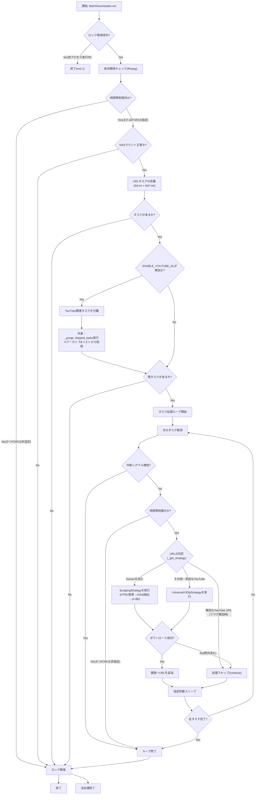
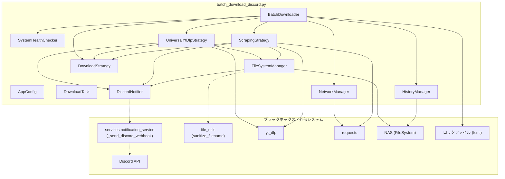

## 1. 解析メタ情報

| 項目 | 内容 |
| --- | --- |
| 対象ファイル | batch_download_discord.py |
| 言語 | Python |
| 解析対象 | 提供されたコードのみ |
| 推測・補完 | 一切なし |

## 2. ファイルの概要

本ファイルは、モジュールDocstring上「Production Grade Batch Downloader (v2.2.0 Universal Support)」と称される、複数のURLリストファイルから動画をバッチダウンロードするCLIスクリプトである。
主な機能は以下の通り。
* `list.txt`（単一ファイル）および `list/` ディレクトリ配下の全 `*.txt` ファイルを走査するマルチリスト対応。リストファイル名ごとにサブフォルダへ振り分けて保存する。
* `yt_dlp` を用いた汎用サイト対応のダウンロード（`UniversalYtDlpStrategy`）と、`missav` サイト専用のJS難読化解除・m3u8抽出によるスクレイピングダウンロード（`ScrapingStrategy`）の2種類のダウンロード戦略（Strategyパターン）。
* `fcntl.flock` を用いたロックファイルによる多重起動防止。
* ダウンロード履歴（`history.txt`）の管理、ディスク空き容量チェック、NASマウント確認。
* 環境変数 `ENABLE_YOUTUBE_DL` によるYouTubeダウンロード機能の有効/無効切り替えと、無効時のタスクの自動パージ（アーカイブ退避＋リストファイルからの削除）。
* 実行許可時間帯（デフォルト02:00〜06:00、`--force` 引数で無視可能）の制御。
* Discord Webhookを介した進行状況・エラー通知。
* 根拠: [モジュールDocstring] (行番号: 4〜16 / 抜粋: "Production Grade Batch Downloader (v2.2.0 Universal Support)")

## 3. 外部依存関係

### インポート一覧

| 名称 | 種類 | 用途 | 根拠 |
| --- | --- | --- | --- |
| `os` | 標準ライブラリ | パス操作、環境変数取得、ロックファイルのオープン | 根拠: [import文] (行番号: 18 / 抜粋: "import os") |
| `sys` | 標準ライブラリ | `--force` 引数判定、`sys.path` 操作、`sys.exit`、標準出力のTTY判定 | 根拠: [import文] (行番号: 19 / 抜粋: "import sys") |
| `time` | 標準ライブラリ | タスク間スリープ、フォールバックID生成用タイムスタンプ | 根拠: [import文] (行番号: 20 / 抜粋: "import time") |
| `re` | 標準ライブラリ | missavのJS難読化解除・m3u8 URL抽出用の正規表現処理 | 根拠: [import文] (行番号: 21 / 抜粋: "import re") |
| `shutil` | 標準ライブラリ | ディスク空き容量取得(`disk_usage`)、`ffmpeg`存在確認(`which`) | 根拠: [import文] (行番号: 22 / 抜粋: "import shutil") |
| `datetime` | 標準ライブラリ | 現在時刻判定、アーカイブのタイムスタンプ生成 | 根拠: [import文] (行番号: 23 / 抜粋: "import datetime") |
| `logging` | 標準ライブラリ | ロガーの設定・出力 | 根拠: [import文] (行番号: 24 / 抜粋: "import logging") |
| `signal` | 標準ライブラリ | `SIGINT`/`SIGTERM` を捕捉し安全に停止するためのハンドラ登録 | 根拠: [import文] (行番号: 25 / 抜粋: "import signal") |
| `fcntl` | 標準ライブラリ | ロックファイルへの排他ロック(`flock`)による多重起動防止 | 根拠: [import文] (行番号: 26 / 抜粋: "import fcntl") |
| `requests` | サードパーティ | HTTPセッションの生成・リクエスト送信 | 根拠: [import文] (行番号: 27 / 抜粋: "import requests") |
| `glob` | 標準ライブラリ | インポートされているが、ファイル内では `Path.glob()` メソッドのみが使用され、`glob` モジュール自体の関数は未使用 | 根拠: [import文] (行番号: 28 / 抜粋: "import glob") |
| `collections.defaultdict` | 標準ライブラリ | パージ対象タスクをリスト（ソース）名ごとにグループ化 | 根拠: [import文] (行番号: 29 / 抜粋: "from collections import defaultdict") |
| `abc.ABC`, `abstractmethod` | 標準ライブラリ | ダウンロード戦略の抽象基底クラス`DownloadStrategy`の定義 | 根拠: [import文] (行番号: 30 / 抜粋: "from abc import ABC, abstractmethod") |
| `typing.List`, `Optional`, `Tuple`, `Any`, `Set`, `NamedTuple` | 標準ライブラリ | 型ヒント全般 | 根拠: [import文] (行番号: 31 / 抜粋: "from typing import List, Optional, Tuple, Any, Set, NamedTuple") |
| `dataclasses.dataclass`, `field` | 標準ライブラリ | `AppConfig` の定義（frozenデータクラス） | 根拠: [import文] (行番号: 32 / 抜粋: "from dataclasses import dataclass, field") |
| `file_utils.sanitize_filename` (as `_shared_sanitize_filename`) | ローカルモジュール | ファイル名のサニタイズ処理を共通モジュールへ委譲 | 根拠: [import文] (行番号: 34 / 抜粋: "from file_utils import sanitize_filename as _shared_sanitize_filename") |
| `pathlib.Path` | 標準ライブラリ | パスオブジェクトの操作全般 | 根拠: [import文] (行番号: 35 / 抜粋: "from pathlib import Path") |
| `requests.adapters.HTTPAdapter` | サードパーティ | セッションへのリトライ用アダプタのマウント | 根拠: [import文] (行番号: 38 / 抜粋: "from requests.adapters import HTTPAdapter") |
| `urllib3.util.retry.Retry` | サードパーティ | HTTPリクエストのリトライポリシー定義 | 根拠: [import文] (行番号: 39 / 抜粋: "from urllib3.util.retry import Retry") |
| `tqdm.tqdm` | サードパーティ | インポートされているが、ファイル内で直接インスタンス化されておらず未使用（進捗表示は yt-dlp 自身の `quiet` フラグ制御に委譲） | 根拠: [import文] (行番号: 40 / 抜粋: "from tqdm import tqdm") |
| `yt_dlp` | サードパーティ | 動画のメタデータ抽出およびダウンロード（Universal/M3U8双方） | 根拠: [import文] (行番号: 41 / 抜粋: "import yt_dlp") |
| `services.notification_service._send_discord_webhook` | ローカルモジュール（動的解決） | Discord Webhook通知の送信。`try-except ImportError` で見つからない場合は無効化されたダミー関数にフォールバック | 根拠: [import文] (行番号: 74〜79 / 抜粋: "from services.notification_service import _send_discord_webhook") |

### ブラックボックスとなる外部要素

| 名称 | 理由 | 根拠 |
| --- | --- | --- |
| `services.notification_service._send_discord_webhook` | 実装が別ファイルに存在し、Webhook URLや認証方式、`image_data`引数の扱いなど詳細が不明。見つからない場合はダミー関数(`pass`)にフォールバックする実装のみがこのファイルからは確認できる。 | 根拠: [import文とフォールバック定義] (行番号: 75, 78〜79 / 抜粋: "from services.notification_service import _send_discord_webhook") |
| `file_utils.sanitize_filename` | サニタイズの具体的なルール（禁止文字、長さ制限等）が本ファイルからは不明。 | 根拠: [import文] (行番号: 34 / 抜粋: "from file_utils import sanitize_filename as _shared_sanitize_filename") |
| `MY_HOME_SYSTEM_ROOT` 環境変数 / `services` ディレクトリ探索 | プロジェクトルート自動探索ロジックが依存する `services` ディレクトリの実際の配置や、環境変数が設定される運用上の前提が不明。 | 根拠: [PROJECT_ROOT解決処理] (行番号: 56〜69 / 抜粋: "if (PROJECT_ROOT / "services").exists():") |

## 4. 主要要素の定義（関数 / エンドポイント / コンポーネント）

### `AppConfig`

* **役割**: アプリケーション全体の設定値（時間制限、パス、リトライ回数、機能フラグ等）を保持するイミュータブル(`frozen=True`)なデータクラス。
* 根拠: [AppConfigクラス] (行番号: 84〜113 / 抜粋: "@dataclass(frozen=True)\nclass AppConfig:")

* **引数/リクエスト**: なし（フィールドはデフォルト値または環境変数から初期化される）
* 根拠: [各フィールド定義] (行番号: 86〜109 / 抜粋: "RESTRICT_TIME: bool = not FORCE_MODE")

* **戻り値/レスポンス**: 該当なし（インスタンスは `CONFIG = AppConfig()` としてモジュールレベルで単一生成）
* 根拠: [インスタンス生成] (行番号: 115 / 抜粋: "CONFIG = AppConfig()")

* **副作用**: `os.getenv` による環境変数(`ENABLE_YOUTUBE_DL`, `VIDEO_SAVE_DIR`)の読み込み。
* 根拠: [環境変数読み込み] (行番号: 93〜94 / 抜粋: "ENABLE_YOUTUBE_DL: bool = os.getenv(")

* **エラーハンドリング**: なし

### `DownloadTask`

* **役割**: ダウンロード対象のURLと、その取得元リスト名（サブフォルダ振り分けに使用）を保持する `NamedTuple`。
* 根拠: [DownloadTaskクラス] (行番号: 117〜119 / 抜粋: "class DownloadTask(NamedTuple):")

* **引数/リクエスト**: `url: str`, `source_name: str`
* 根拠: [フィールド定義] (行番号: 118〜119 / 抜粋: "url: str\n    source_name: str")

* **戻り値/レスポンス**: 該当なし
* **副作用**: なし
* **エラーハンドリング**: なし

### `DiscordNotifier.send`

* **役割**: Discord Webhook経由で通知メッセージを送信する静的メソッド。エラー通知フラグに応じて送信先チャンネル(`error`/`notify`)を切り替える。
* 根拠: [DiscordNotifier.send] (行番号: 125〜132 / 抜粋: "def send(text: str, is_error: bool = False) -> None:")

* **引数/リクエスト**: `text: str` (通知内容), `is_error: bool = False` (エラー通知フラグ)
* 根拠: [引数定義] (行番号: 126 / 抜粋: "def send(text: str, is_error: bool = False) -> None:")

* **戻り値/レスポンス**: `None`
* 根拠: [戻り値ヒント] (行番号: 126 / 抜粋: "-> None:")

* **副作用**: `_send_discord_webhook` の呼び出しによる外部APIへの通知送信。
* 根拠: [API呼び出し] (行番号: 130 / 抜粋: "_send_discord_webhook([message], channel=channel)")

* **エラーハンドリング**: 送信時の例外を捕捉し、`exc_info=True` 付きでエラーログを出力（例外は再送出しない）。
* 根拠: [try-exceptブロック] (行番号: 129〜132 / 抜粋: "except Exception as e:")

### `HistoryManager.load_history`

* **役割**: 履歴ファイル(`history.txt`)からダウンロード済みURLの集合を読み込む静的メソッド。
* 根拠: [HistoryManager.load_history] (行番号: 135〜143 / 抜粋: "def load_history() -> Set[str]:")

* **引数/リクエスト**: なし
* **戻り値/レスポンス**: `Set[str]`（ファイルが存在しない場合や例外時は空集合）
* 根拠: [戻り値ヒント] (行番号: 136 / 抜粋: "def load_history() -> Set[str]:")

* **副作用**: 履歴ファイルの読み込み。
* 根拠: [ファイル読み込み] (行番号: 140〜141 / 抜粋: "with open(CONFIG.HISTORY_FILE_PATH, "r", encoding="utf-8") as f:")

* **エラーハンドリング**: 読み込み時の例外を無視（`pass`）し、その時点までに読めた履歴（空集合）を返す。
* 根拠: [try-exceptブロック] (行番号: 142 / 抜粋: "except Exception: pass")

### `HistoryManager.add_history`

* **役割**: ダウンロード完了URLを履歴ファイルへ追記する静的メソッド。
* 根拠: [HistoryManager.add_history] (行番号: 145〜150 / 抜粋: "def add_history(url: str) -> None:")

* **引数/リクエスト**: `url: str`
* **戻り値/レスポンス**: `None`
* 根拠: [関数定義] (行番号: 146 / 抜粋: "def add_history(url: str) -> None:")

* **副作用**: 履歴ファイルへの追記書き込み。
* 根拠: [ファイル書き込み] (行番号: 148〜149 / 抜粋: "with open(CONFIG.HISTORY_FILE_PATH, "a", encoding="utf-8") as f:")

* **エラーハンドリング**: 書き込み時の例外を無視（`pass`）。
* 根拠: [try-exceptブロック] (行番号: 150 / 抜粋: "except Exception: pass")

### `NetworkManager.create_session`

* **役割**: リトライポリシー（総リトライ回数、バックオフ、対象ステータスコード）とUser-Agentを設定した `requests.Session` を生成する静的メソッド。
* 根拠: [NetworkManager.create_session] (行番号: 153〜160 / 抜粋: "def create_session() -> requests.Session:")

* **引数/リクエスト**: なし
* **戻り値/レスポンス**: `requests.Session`
* 根拠: [戻り値ヒント] (行番号: 154 / 抜粋: "def create_session() -> requests.Session:")

* **副作用**: なし（セッションオブジェクトの生成のみ）
* **エラーハンドリング**: なし

### `FileSystemManager.sanitize_filename`

* **役割**: 外部モジュール `file_utils.sanitize_filename` へファイル名のサニタイズ処理を委譲するラッパー静的メソッド。
* 根拠: [FileSystemManager.sanitize_filename] (行番号: 163〜165 / 抜粋: "return _shared_sanitize_filename(filename)")

* **引数/リクエスト**: `filename: str`
* **戻り値/レスポンス**: `str`
* 根拠: [関数定義] (行番号: 164 / 抜粋: "def sanitize_filename(filename: str) -> str:")

* **副作用**: なし
* **エラーハンドリング**: なし（委譲先の例外処理には依存）

### `FileSystemManager.ensure_dir`

* **役割**: 指定パスのディレクトリを（親ディレクトリを含め）作成する静的メソッド。
* 根拠: [FileSystemManager.ensure_dir] (行番号: 167〜174 / 抜粋: "def ensure_dir(path: Path) -> bool:")

* **引数/リクエスト**: `path: Path`
* **戻り値/レスポンス**: `bool`（成功時`True`、権限エラー時`False`）
* 根拠: [戻り値ヒント] (行番号: 168 / 抜粋: "def ensure_dir(path: Path) -> bool:")

* **副作用**: ディレクトリ作成(`mkdir`)、権限エラー時のDiscord通知。
* 根拠: [mkdir呼び出し] (行番号: 170 / 抜粋: "path.mkdir(parents=True, exist_ok=True)")

* **エラーハンドリング**: `PermissionError` を捕捉し、エラー通知を送信して `False` を返す。
* 根拠: [try-exceptブロック] (行番号: 172〜174 / 抜粋: "except PermissionError:")

### `FileSystemManager.check_disk_space`

* **役割**: 対象パス（存在しない場合は存在する親ディレクトリまで遡って）のディスク空き容量を確認し、設定値(`MIN_FREE_SPACE_GB`)を下回る場合は警告通知を送信する静的メソッド。
* 根拠: [FileSystemManager.check_disk_space] (行番号: 176〜190 / 抜粋: "def check_disk_space(path: Path) -> bool:")

* **引数/リクエスト**: `path: Path`
* **戻り値/レスポンス**: `bool`（容量十分なら`True`、不足時`False`、例外時は安全側に倒して`False`）
* 根拠: [戻り値ヒント と例外時のreturn] (行番号: 177, 190 / 抜粋: "def check_disk_space(path: Path) -> bool:", "return False")

* **副作用**: `DiscordNotifier.send` による容量不足時の警告通知、例外時のエラーログ出力。
* 根拠: [通知送信] (行番号: 185 / 抜粋: "DiscordNotifier.send(f"⚠️ DISK FULL: 残り {free // (2**30)}GB", is_error=True)")

* **エラーハンドリング**: `shutil.disk_usage` 等での例外を捕捉し、エラーログを出力した上で `False`（＝ダウンロード中断）を返す。
* 根拠: [try-exceptブロック] (行番号: 188〜190 / 抜粋: "except Exception as e:")

### `SystemHealthChecker.is_within_time_window`

* **役割**: 現在時刻が実行許可時間帯(`START_HOUR`〜`END_HOUR`)内かを判定する静的メソッド。`RESTRICT_TIME`が無効（`--force`実行時）であれば常に`True`。
* 根拠: [SystemHealthChecker.is_within_time_window] (行番号: 193〜196 / 抜粋: "def is_within_time_window() -> bool:")

* **引数/リクエスト**: なし
* **戻り値/レスポンス**: `bool`
* 根拠: [戻り値ヒント] (行番号: 194 / 抜粋: "def is_within_time_window() -> bool:")

* **副作用**: なし
* **エラーハンドリング**: なし

### `SystemHealthChecker.verify_nas_mount`

* **役割**: NASのマウントポイントおよびマーカーファイル(`.mounted`)の存在を確認し、未マウントであればCRITICAL通知を送信する静的メソッド。
* 根拠: [SystemHealthChecker.verify_nas_mount] (行番号: 198〜203 / 抜粋: "def verify_nas_mount() -> bool:")

* **引数/リクエスト**: なし
* **戻り値/レスポンス**: `bool`
* 根拠: [戻り値ヒント] (行番号: 199 / 抜粋: "def verify_nas_mount() -> bool:")

* **副作用**: 未マウント時のDiscord通知(`is_error=True`)。
* 根拠: [通知送信] (行番号: 201 / 抜粋: "DiscordNotifier.send("⛔ CRITICAL: NASマウントエラー", is_error=True)")

* **エラーハンドリング**: なし（例外は捕捉されず呼び出し元に伝播しうる）

### `SystemHealthChecker.check_dependencies`

* **役割**: `ffmpeg` コマンドの存在を確認し、見つからない場合は警告ログを出力する静的メソッド。
* 根拠: [SystemHealthChecker.check_dependencies] (行番号: 205〜208 / 抜粋: "def check_dependencies() -> None:")

* **引数/リクエスト**: なし
* **戻り値/レスポンス**: `None`
* 根拠: [戻り値ヒント] (行番号: 206 / 抜粋: "def check_dependencies() -> None:")

* **副作用**: `logger.warning` によるログ出力。
* 根拠: [ログ出力] (行番号: 208 / 抜粋: "logger.warning("⚠️ ffmpeg not found.")")

* **エラーハンドリング**: なし（`ffmpeg`未検出時も処理を継続する＝警告のみ）

### `DownloadStrategy` (抽象基底クラス)

* **役割**: `UniversalYtDlpStrategy` と `ScrapingStrategy` に共通する保存先ディレクトリ決定・重複スキップ判定ロジックを提供する抽象基底クラス。`download`メソッドはサブクラスでの実装を強制する。
* 根拠: [DownloadStrategyクラス] (行番号: 213〜236 / 抜粋: "class DownloadStrategy(ABC):")

* **引数/リクエスト**: `__init__(self, save_base_dir: Path, session: requests.Session)`
* 根拠: [__init__定義] (行番号: 214〜216 / 抜粋: "def __init__(self, save_base_dir: Path, session: requests.Session):")

* **戻り値/レスポンス**: `download`は`bool`を返す抽象メソッド（`@abstractmethod`）。`_determine_save_dir`は`Optional[Path]`、`_should_skip`は`bool`を返す。
* 根拠: [各メソッドの戻り値ヒント] (行番号: 219, 222, 232 / 抜粋: "-> bool:", "-> Optional[Path]:", "-> bool:")

* **副作用**: `_determine_save_dir` は `FileSystemManager.ensure_dir`/`check_disk_space` を呼び出し、ディレクトリ作成や通知等の副作用を間接的に引き起こす。
* 根拠: [_determine_save_dir内] (行番号: 228〜229 / 抜粋: "if not FileSystemManager.ensure_dir(target_dir): return None")

* **エラーハンドリング**: `_determine_save_dir`はディレクトリ作成/容量チェックに失敗した場合`None`を返す。
* 根拠: [ガード節] (行番号: 228〜230 / 抜粋: "if not FileSystemManager.check_disk_space(target_dir): return None")

### `UniversalYtDlpStrategy.download`

* **役割**: `yt_dlp`を用いて汎用サイト（YouTube含む全対応サイト）から動画をダウンロードする。YouTubeドメインかどうかで保存カテゴリ（`youtube`/`others`）を振り分け、既存ファイルがあればスキップする。
* 根拠: [UniversalYtDlpStrategy.download] (行番号: 240〜272 / 抜粋: "def download(self, task: DownloadTask) -> bool:")

* **引数/リクエスト**: `task: DownloadTask`
* 根拠: [引数定義] (行番号: 240 / 抜粋: "def download(self, task: DownloadTask) -> bool:")

* **戻り値/レスポンス**: `bool`（成功・スキップ時`True`、失敗時`False`）
* 根拠: [return文] (行番号: 264, 269, 272 / 抜粋: "if self._should_skip(filename): return True")

* **副作用**: 保存先ディレクトリの決定・作成、`yt_dlp`によるメタデータ取得とダウンロード、成功時のDiscord通知。
* 根拠: [ダウンロード実行と通知] (行番号: 267〜268 / 抜粋: "ydl.download([task.url])")

* **エラーハンドリング**: `yt_dlp`実行時の例外を捕捉し、エラーログを出力して`False`を返す。
* 根拠: [try-exceptブロック] (行番号: 270〜272 / 抜粋: "except Exception as e:")

### `ScrapingStrategy.download`

* **役割**: `missav`サイト専用のダウンロード処理。対象ページのHTMLを取得し、JS難読化されたm3u8 URLを抽出したうえで`yt_dlp`経由でダウンロードする。
* 根拠: [ScrapingStrategy.download] (行番号: 276〜296 / 抜粋: "def download(self, task: DownloadTask) -> bool:")

* **引数/リクエスト**: `task: DownloadTask`
* 根拠: [引数定義] (行番号: 276 / 抜粋: "def download(self, task: DownloadTask) -> bool:")

* **戻り値/レスポンス**: `bool`（成功・スキップ時`True`、失敗時`False`）
* 根拠: [return文] (行番号: 279, 282, 287, 294, 296 / 抜粋: "if not target_dir: return False")

* **副作用**: HTML取得のHTTPリクエスト、URLから生成したファイル名でのファイル保存、`_download_with_ytdlp`経由のyt-dlp実行。
* 根拠: [ダウンロード委譲] (行番号: 296 / 抜粋: "return self._download_with_ytdlp(m3u8_url, final_path, task.url, target_dir)")

* **エラーハンドリング**: HTML取得失敗時や m3u8 URL抽出失敗時は警告ログを出力して`False`を返す（例外送出なし）。
* 根拠: [ガード節] (行番号: 282, 285〜287 / 抜粋: "if not m3u8_url:")

### `ScrapingStrategy._fetch_html`

* **役割**: 対象URLの `Referer` ヘッダーを自身に設定したうえでHTMLを取得する。
* 根拠: [_fetch_html] (行番号: 298〜305 / 抜粋: "def _fetch_html(self, url: str) -> Optional[str]:")

* **引数/リクエスト**: `url: str`
* **戻り値/レスポンス**: `Optional[str]`（取得成功時はHTML文字列、失敗時`None`）
* 根拠: [戻り値ヒント] (行番号: 298 / 抜粋: "def _fetch_html(self, url: str) -> Optional[str]:")

* **副作用**: 対象URLへのHTTP GETリクエスト。
* 根拠: [HTTPリクエスト] (行番号: 301 / 抜粋: "res = self.session.get(url, timeout=CONFIG.REQUEST_TIMEOUT)")

* **エラーハンドリング**: 例外を捕捉してエラーログを出力し`None`を返す。
* 根拠: [try-exceptブロック] (行番号: 303〜305 / 抜粋: "except Exception as e:")

### `ScrapingStrategy._extract_m3u8_url`

* **役割**: missavページに埋め込まれたJS難読化コード（p,a,c,k,e,d形式のパッカー）を正規表現とbase36変換で解除し、m3u8動画URLを抽出する。複数の変数名候補（`source1280`等）を順に試行し、いずれも失敗した場合は`.m3u8`パターンへのフォールバック抽出を行う。
* 根拠: [_extract_m3u8_url] (行番号: 307〜342 / 抜粋: "def _extract_m3u8_url(self, html: str) -> Optional[str]:")

* **引数/リクエスト**: `html: str`
* **戻り値/レスポンス**: `Optional[str]`（抽出できたm3u8 URL、失敗時`None`）
* 根拠: [戻り値ヒント と末尾return] (行番号: 307, 342 / 抜粋: "def _extract_m3u8_url(self, html: str) -> Optional[str]:", "return None")

* **副作用**: なし（純粋な文字列解析処理）
* 根拠: [処理内容] (行番号: 309〜340 / 抜粋: "match = re.search(r"eval\\(function\\(p,a,c,k,e,d\\)")

* **エラーハンドリング**: 難読化コードのマッチ失敗時は即座に`None`を返す（例外処理なし）。
* 根拠: [ガード節] (行番号: 310 / 抜粋: "if not match: return None")

### `ScrapingStrategy._download_with_ytdlp`

* **役割**: 抽出したm3u8 URLを`yt_dlp`（HLS処理・並列フラグメントダウンロード対応）に渡してダウンロード・結合し、成功時にDiscord通知を送信する。
* 根拠: [_download_with_ytdlp] (行番号: 344〜363 / 抜粋: "def _download_with_ytdlp(self, m3u8_url: str, final_path: Path, page_url: str, save_dir: Path) -> bool:")

* **引数/リクエスト**: `m3u8_url: str`, `final_path: Path`, `page_url: str`, `save_dir: Path`
* 根拠: [引数定義] (行番号: 344 / 抜粋: "def _download_with_ytdlp(self, m3u8_url: str, final_path: Path, page_url: str, save_dir: Path) -> bool:")

* **戻り値/レスポンス**: `bool`（成功時`True`、失敗時`False`）
* 根拠: [return文] (行番号: 359, 363 / 抜粋: "return True")

* **副作用**: `yt_dlp`によるダウンロード実行、成功時のDiscord通知、失敗時の中途半端なファイルの削除(`unlink`)。
* 根拠: [ダウンロードと通知] (行番号: 356〜358 / 抜粋: "ydl.download([m3u8_url])")

* **エラーハンドリング**: 例外を捕捉してエラーログを出力し、既に生成された不完全なファイルが存在すれば削除したうえで`False`を返す。
* 根拠: [try-exceptブロック] (行番号: 360〜363 / 抜粋: "if final_path.exists(): final_path.unlink()")

### `BatchDownloader.__init__`

* **役割**: HTTPセッションの生成、シグナルハンドラ(`SIGINT`/`SIGTERM`)の登録、ダウンロード履歴の読み込みを行うコンストラクタ。
* 根拠: [__init__] (行番号: 369〜374 / 抜粋: "def __init__(self):")

* **引数/リクエスト**: なし（`self`のみ）
* **戻り値/レスポンス**: `None`（暗黙）
* **副作用**: `signal.signal`によるシグナルハンドラ登録、`NetworkManager.create_session`と`HistoryManager.load_history`の呼び出し。
* 根拠: [シグナル登録] (行番号: 372〜373 / 抜粋: "signal.signal(signal.SIGINT, self._signal_handler)")

* **エラーハンドリング**: なし

### `BatchDownloader._signal_handler`

* **役割**: `SIGINT`/`SIGTERM`受信時に停止フラグ(`_shutdown_requested`)を立て、メインループを安全に終了させるためのハンドラ。
* 根拠: [_signal_handler] (行番号: 376〜378 / 抜粋: "def _signal_handler(self, signum: int, frame: Any) -> None:")

* **引数/リクエスト**: `signum: int`, `frame: Any`
* **戻り値/レスポンス**: `None`
* 根拠: [引数と戻り値ヒント] (行番号: 376 / 抜粋: "def _signal_handler(self, signum: int, frame: Any) -> None:")

* **副作用**: `self._shutdown_requested` を`True`に変更、ログ出力。
* 根拠: [フラグ変更] (行番号: 377〜378 / 抜粋: "self._shutdown_requested = True")

* **エラーハンドリング**: なし

### `BatchDownloader._get_strategy`

* **役割**: URLの内容（YouTubeドメインか、`missav`を含むか）に応じて使用するダウンロード戦略インスタンスを決定する。YouTubeで機能フラグが無効の場合は`None`を返しスキップさせる。
* 根拠: [_get_strategy] (行番号: 380〜393 / 抜粋: "def _get_strategy(self, url: str) -> Optional[DownloadStrategy]:")

* **引数/リクエスト**: `url: str`
* **戻り値/レスポンス**: `Optional[DownloadStrategy]`（`ScrapingStrategy`、`UniversalYtDlpStrategy`、またはスキップ対象時`None`）
* 根拠: [戻り値ヒント] (行番号: 380 / 抜粋: "def _get_strategy(self, url: str) -> Optional[DownloadStrategy]:")

* **副作用**: 無効化されたYouTube URLに対するログ出力。
* 根拠: [ログ出力] (行番号: 384 / 抜粋: "logger.info(f"🚫 YouTube機能は設定により無効化されています: {url}")")

* **エラーハンドリング**: なし

### `BatchDownloader._collect_tasks`

* **役割**: `list.txt`と`list/*.txt`の全ファイルからURLを読み込み、コメント行(`#`始まり)・空行・履歴済みURLを除外したうえで、URL重複を排除した`DownloadTask`一覧を生成する。
* 根拠: [_collect_tasks] (行番号: 395〜422 / 抜粋: "def _collect_tasks(self) -> List[DownloadTask]:")

* **引数/リクエスト**: なし
* **戻り値/レスポンス**: `List[DownloadTask]`
* 根拠: [戻り値ヒント] (行番号: 395 / 抜粋: "def _collect_tasks(self) -> List[DownloadTask]:")

* **副作用**: `list.txt`および`list/`配下の`*.txt`ファイルの読み込み。
* 根拠: [ファイル読み込み] (行番号: 399, 409 / 抜粋: "with open(CONFIG.LIST_FILE_PATH, "r", encoding="utf-8") as f:")

* **エラーハンドリング**: 個別リストファイルの読み込み失敗時は例外を捕捉してエラーログを出力し、他ファイルの処理を継続する。
* 根拠: [try-exceptブロック] (行番号: 414〜415 / 抜粋: "except Exception as e:")

### `BatchDownloader._purge_skipped_tasks`

* **役割**: YouTube機能無効化等でスキップ対象となったタスクをアーカイブファイル(`archived_tasks.txt`)へ追記したうえで、元のリストファイル（`list.txt`または`list/{source_name}.txt`）から該当URLを物理削除する。ファイル上書きは一時ファイル(`.tmp`)経由のアトミックな`replace`で行う。
* 根拠: [_purge_skipped_tasks Docstring] (行番号: 424〜430 / 抜粋: "スキップ対象となったタスクを元リストから物理削除し、アーカイブへ退避する。")

* **引数/リクエスト**: `skipped_tasks: List[DownloadTask]`
* 根拠: [引数定義] (行番号: 424 / 抜粋: "def _purge_skipped_tasks(self, skipped_tasks: List[DownloadTask]) -> None:")

* **戻り値/レスポンス**: `None`
* 根拠: [戻り値ヒント] (行番号: 424 / 抜粋: "-> None:")

* **副作用**: アーカイブファイルへの追記、各リストファイルのアトミックな上書き更新。
* 根拠: [アトミック上書き] (行番号: 477〜480 / 抜粋: "temp_path.replace(file_path)")

* **エラーハンドリング**: アーカイブファイルへの書き込み失敗時は、データロスト防止のため元ファイルの削除処理へ進まずに`return`で中断する。個別リストファイルのパージ失敗時は例外を捕捉してエラーログを出力し、他のリストファイルの処理を継続する。
* 根拠: [try-exceptブロック] (行番号: 448〜450, 482〜483 / 抜粋: "return # アーカイブ失敗時は元ファイルの削除も中断（データロスト防止）")

### `BatchDownloader.run`

* **役割**: ロックファイル(`fcntl.flock`)による多重起動防止を行ったうえで`_run_locked`を呼び出す、実行のエントリーポイント。ロック取得に失敗した場合は即座に終了する。
* 根拠: [run] (行番号: 488〜505 / 抜粋: "def run(self) -> None:")

* **引数/リクエスト**: なし
* **戻り値/レスポンス**: `None`
* 根拠: [戻り値ヒント] (行番号: 488 / 抜粋: "def run(self) -> None:")

* **副作用**: ロックファイルのオープン・排他ロック取得・解放、`_run_locked`の呼び出し。
* 根拠: [ロック処理] (行番号: 491, 493 / 抜粋: "fcntl.flock(lock_fd, fcntl.LOCK_EX | fcntl.LOCK_NB)")

* **エラーハンドリング**: ロック取得に失敗（`BlockingIOError`/`OSError`）した場合、多重起動と判断してログを出力し`sys.exit(1)`で終了する。`finally`ブロックでロックの解放とファイルディスクリプタのクローズを保証する。
* 根拠: [try-exceptとfinally] (行番号: 494〜497, 499〜505 / 抜粋: "except (BlockingIOError, OSError):")

### `BatchDownloader._run_locked`

* **役割**: ロック取得後のメイン処理本体。依存関係チェック、時間帯・NASマウント確認、タスク収集、YouTube機能無効時のフィルタリング＆パージ、各タスクの逐次ダウンロード実行を行う。
* 根拠: [_run_locked] (行番号: 507〜576 / 抜粋: "def _run_locked(self) -> None:")

* **引数/リクエスト**: なし
* **戻り値/レスポンス**: `None`
* 根拠: [戻り値ヒント] (行番号: 507 / 抜粋: "def _run_locked(self) -> None:")

* **副作用**: 依存関係・時間帯・NASマウントの各チェック、`_collect_tasks`/`_purge_skipped_tasks`の呼び出し、各`DownloadStrategy.download`の実行によるファイル保存とDiscord通知、`HistoryManager.add_history`への追記、タスク間の`time.sleep`。
* 根拠: [メインループ] (行番号: 552〜574 / 抜粋: "for i, task in enumerate(tasks):")

* **エラーハンドリング**: 個別タスク実行時の例外を捕捉してエラーログを出力し、次のタスクへ処理を継続する。時間帯超過時や停止シグナル受信時はループを`break`で中断する。
* 根拠: [try-exceptとbreak] (行番号: 553〜556, 569〜570 / 抜粋: "except Exception as e:")

## 5. 処理フロー図

```mermaid
flowchart TD
    Start["開始: BatchDownloader.run"] --> Lock{"ロック取得成功?"}
    Lock -->|"No(他プロセス実行中)"| End["終了(exit 1)"]
    Lock -->|"Yes"| DepCheck["依存関係チェック(ffmpeg)"]
    DepCheck --> TimeCheck{"時間帯制限内か?"}
    TimeCheck -->|"No(かつFORCE非指定)"| Unlock["ロック解放"] --> End2["終了"]
    TimeCheck -->|"Yes(またはFORCE指定)"| NASCheck{"NASマウント正常か?"}
    NASCheck -->|"No"| Unlock
    NASCheck -->|"Yes"| Collect["URLタスクの収集<br>(list.txt + list/*.txt)"]
    Collect --> HasTasks{"タスクがあるか?"}
    HasTasks -->|"No"| Unlock
    HasTasks -->|"Yes"| YTCheck{"ENABLE_YOUTUBE_DLが無効か?"}
    YTCheck -->|"Yes"| FilterYT["YouTube関連タスクを分離"]
    FilterYT --> Purge["外部：_purge_skipped_tasks実行<br>※アーカイブ&リストから削除"]
    Purge --> TaskEmptyCheck{"残タスクがあるか?"}
    YTCheck -->|"No"| TaskEmptyCheck
    TaskEmptyCheck -->|"No"| Unlock
    TaskEmptyCheck -->|"Yes"| LoopStart["タスク処理ループ開始"]

    LoopStart --> NextTask["次のタスク取得"]
    NextTask --> ShutdownCheck{"中断シグナル検知?"}
    ShutdownCheck -->|"Yes"| LoopEnd["ループ終了"]
    ShutdownCheck -->|"No"| TimeCheck2{"時間帯制限内か?"}
    TimeCheck2 -->|"No(かつFORCE非指定)"| LoopEnd
    TimeCheck2 -->|"Yes"| GetStrategy{"URLの判定<br>(_get_strategy)"}

    GetStrategy -->|"無効なYouTube URL<br>(フラグ無効時)"| Continue["処理スキップ(continue)"]
    GetStrategy -->|"missavを含む"| Scrape["ScrapingStrategyを実行<br>(HTML取得→m3u8抽出→yt-dlp)"]
    GetStrategy -->|"その他・有効なYouTube"| YTDlp["UniversalYtDlpStrategyを実行"]

    Scrape --> DLResult{"ダウンロード成功?"}
    YTDlp --> DLResult

    DLResult -->|"Yes"| AddHistory["履歴へURLを追加"]
    DLResult -->|"No(例外含む)"| Continue

    AddHistory --> Sleep["指定秒数スリープ"]
    Continue --> Sleep

    Sleep --> NextTaskCheck{"全タスク完了?"}
    NextTaskCheck -->|"No"| NextTask
    NextTaskCheck -->|"Yes"| LoopEnd

    LoopEnd --> Unlock
    Unlock --> End3["全処理終了"]

```

## 6. 依存関係図

```mermaid
flowchart TD
    subgraph SubBatchDownload["batch_download_discord.py"]
        AppConfig
        DownloadTask
        BatchDownloader
        DiscordNotifier
        HistoryManager
        NetworkManager
        FileSystemManager
        SystemHealthChecker
        DownloadStrategy
        UniversalYtDlpStrategy
        ScrapingStrategy

        BatchDownloader --> SystemHealthChecker
        BatchDownloader --> NetworkManager
        BatchDownloader --> HistoryManager
        BatchDownloader --> DownloadStrategy
        BatchDownloader --> UniversalYtDlpStrategy
        BatchDownloader --> ScrapingStrategy

        UniversalYtDlpStrategy --> DownloadStrategy
        ScrapingStrategy --> DownloadStrategy
        UniversalYtDlpStrategy --> FileSystemManager
        UniversalYtDlpStrategy --> DiscordNotifier
        ScrapingStrategy --> FileSystemManager
        ScrapingStrategy --> DiscordNotifier
        FileSystemManager --> DiscordNotifier
    end

    subgraph SubBlackBox["ブラックボックス・外部システム"]
        NotificationService["services.notification_service<br>(_send_discord_webhook)"]
        FileUtils["file_utils<br>(sanitize_filename)"]
        YTDLP["yt_dlp"]
        Requests["requests"]
        NAS["NAS (FileSystem)"]
        DiscordAPI["Discord API"]
        LockFile["ロックファイル (fcntl)"]
    end

    DiscordNotifier -.-> NotificationService
    NotificationService -.-> DiscordAPI
    FileSystemManager -.-> FileUtils
    UniversalYtDlpStrategy --> YTDLP
    ScrapingStrategy --> YTDLP
    NetworkManager --> Requests
    ScrapingStrategy --> Requests
    FileSystemManager --> NAS
    HistoryManager --> NAS
    BatchDownloader --> LockFile

```

## 7. 次のステップ（リバースエンジニアリングの提案）

| 優先度 | ファイル名(推測可) | 理由 | 根拠 |
| --- | --- | --- | --- |
| 高 | `services/notification_service.py` | Discordへの実際のWebhook送信ロジック、接続先URL、引数の仕様（`image_data`など）がブラックボックスとなっているため。 | 根拠: [import文] (行番号: 75 / 抜粋: "from services.notification_service import _send_discord_webhook") |
| 中 | `file_utils.py` | `sanitize_filename` の具体的なサニタイズルール（禁止文字、長さ制限等）を確認するため。 | 根拠: [import文] (行番号: 34 / 抜粋: "from file_utils import sanitize_filename as _shared_sanitize_filename") |
| 低 | プロジェクトルート直下の `services/` ディレクトリ構成 | `PROJECT_ROOT` の自動探索ロジックが依存する前提ディレクトリ構造を確認するため。 | 根拠: [PROJECT_ROOT解決処理] (行番号: 61〜64 / 抜粋: "if (PROJECT_ROOT / "services").exists():") |

## 8. 保守上の注意点

* **副作用**: `_purge_skipped_tasks` 内で `list.txt` や `list/*.txt` を物理的に上書き・削除する処理が含まれており、バグが混入した場合、読み込み元のタスク一覧データを消失するリスクがある。ただし一時ファイル(`.tmp`)経由の`replace`によりアトミック性は確保されている。
* **多重起動防止**: `fcntl.flock` によるロックファイル制御が導入されており、cron等での重複実行時に `list.txt` / `list/*.txt` への同時読み書き競合を防いでいる（`run`メソッド）。
* **外部入力の実行制限**: `sys.argv` に `--force` が指定されている場合、`SystemHealthChecker.is_within_time_window` による時間制限の判定が無視される。
* **通知モジュールの依存**: `services.notification_service` が見つからない場合はエラーとせず、何もしないダミー関数(`pass`)で上書きされるフォールバックが実装されている。
* **未使用インポート**: `glob`（`glob`モジュール自体の関数は未使用、`Path.glob()`メソッドのみ使用）および `tqdm`（インスタンス化されていない）がインポートされているが、直接は使用されていない。
* **missav専用ロジックの脆弱性**: `_extract_m3u8_url` はmissavサイト側のJS難読化パターン（`eval(function(p,a,c,k,e,d)...`）や変数名（`source1280`等）にハードコードで依存しており、サイト構造の変更時に抽出が失敗する可能性がある（フォールバック抽出パターンは用意されている）。
* **状態のミスマッチ**: プログラム実行中に手動で `history.txt` やリストファイルが編集された場合、インメモリのタスク一覧とディスク上の状態に乖離が生じる可能性がある。

## 9. 不明事項一覧

| 項目 | 理由 | 必要なファイル |
| --- | --- | --- |
| Webhook送信処理の仕様 | `_send_discord_webhook` の具体的な実装（エンドポイント、認証方法、引数 `image_data` の扱いなど）が本ファイルには存在しないため。 | `services/notification_service.py` |
| `sanitize_filename` の詳細ルール | ファイル名から除去・置換される文字や長さ制限の具体的な仕様が本ファイルからは不明なため。 | `file_utils.py` |
| `MY_HOME_SYSTEM_ROOT` の運用実態 | 環境変数が設定される前提の運用（本番/開発でどちらの探索ロジックが使われるか）が不明なため。 | デプロイ設定・`.env`等 |

## 10. 自己検証結果

* [x] 推測・外部ファイルの仕様を一切含んでいない
* [x] 全関数・全クラス・全コンポーネントを列挙した
* [x] 全てのインポート要素を列挙した
* [x] すべての仕様説明に「根拠（行番号・抜粋）」を明記した
* [x] 根拠漏れが0件である
* [x] Mermaid構文にエラーの原因となる記号（エスケープ漏れ）がない
* [x] 不明事項を漏れなく列挙した

完了
