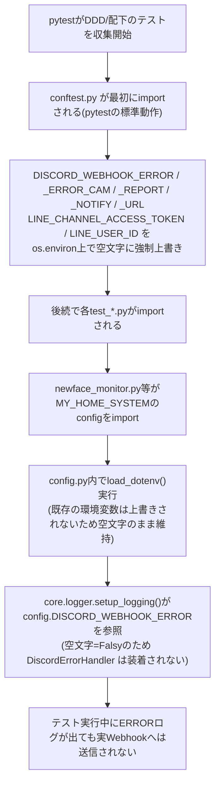
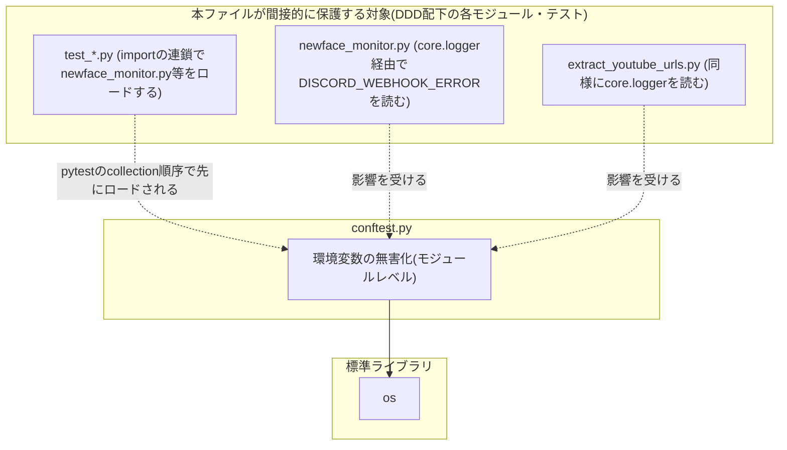

## 1. 解析メタ情報

| 項目 | 内容 |
| --- | --- |
| 対象ファイル | `conftest.py` |
| 言語 | Python |
| 解析対象 | 提供されたコードのみ |
| 推測・補完 | 一切なし |

## 関連ドキュメント

* [newface_monitor.md](./newface_monitor.md) — 本ファイルが無害化する`DISCORD_WEBHOOK_ERROR`等の環境変数を実際に読み取り、`core.logger.get_logger()`経由でDiscordErrorHandlerに焼き込む側のモジュール。
* [test_conftest_masks_discord_webhook.md](./test_conftest_masks_discord_webhook.md) — 本ファイルの防護が実際に機能していることを検証する回帰テスト。
* `MY_HOME_SYSTEM/tests/conftest.py`（対応する仕様書は`docs/specifications/`配下に見つからなかった） — 本ファイルが踏襲した「importより前に環境変数を空文字で潰す」という同一の防護パターンの先行実装。

## 2. ファイルの概要

* `DDD/`配下でpytestを実行する際にpytestが自動収集する共通コンフィグファイルであり、テスト関数やフィクスチャは一切定義せず、モジュールレベルで`DISCORD_WEBHOOK_*`・`LINE_*`系の環境変数を空文字に強制上書きする副作用のみを持つ。
* コメント（Docstring）によれば、`DDD/newface_monitor.py`等が起動時に`MY_HOME_SYSTEM`をsys.pathに追加して本物の`core.logger.get_logger()`をimportしており、これがモジュールimport（=pytestのテストcollection）時点で`config.DISCORD_WEBHOOK_ERROR`をDiscordErrorHandlerに焼き込んでしまうため、本物の認証情報が入った`.env`のある環境で`pytest DDD/`を実行すると、ERRORログを出すテストが実Discordへの通知を発火させてしまう不具合（Issue #103）への対策として新設された。
* 根拠: [モジュールDocstring] (行番号: 3〜19 / 抜粋: "DDD配下のテスト共通フィクスチャ。\n\nnewface_monitor.py・extract_youtube_urls.py は起動時に MY_HOME_SYSTEM を\nsys.path に追加し、本物の core.logger.get_logger()/config を import する")

## 3. 外部依存関係

### インポート一覧

| 名称 | 種類 | 用途 | 根拠 |
| --- | --- | --- | --- |
| `os` | 標準ライブラリ | `os.environ`への環境変数の書き込み | 根拠: [import文] (行番号: 21 / 抜粋: "import os") |

### ブラックボックスとなる外部要素

該当なし（本ファイルは標準ライブラリ`os`のみに依存する）。ただし、本ファイルが対策している「なぜ環境変数の上書きが効くのか」という前提（`python-dotenv`の`load_dotenv()`が既存の環境変数を上書きしない、という`MY_HOME_SYSTEM/config.py`側の挙動）は、本ファイル単体からは検証できない外部要素である。

## 4. 主要要素の定義（関数 / エンドポイント / コンポーネント）

### モジュールレベルの環境変数無害化処理

* **役割**: pytestが`DDD/`配下のテストファイルを収集（import）する前に、本ファイル自身が最初にimportされる性質を利用し、`DISCORD_WEBHOOK_ERROR`・`DISCORD_WEBHOOK_ERROR_CAM`・`DISCORD_WEBHOOK_REPORT`・`DISCORD_WEBHOOK_NOTIFY`・`DISCORD_WEBHOOK_URL`・`LINE_CHANNEL_ACCESS_TOKEN`・`LINE_USER_ID`の7つの環境変数を、いずれもローカルの`.env`に実際の値が設定されているか否かに関わらず、空文字列で強制的に上書きする。関数やクラスとしては定義されておらず、モジュールのトップレベルで即時実行される代入文の並びである。
* 根拠: [モジュール本体] (行番号: 23〜29 / 抜粋: "os.environ[\"DISCORD_WEBHOOK_ERROR\"] = \"\"\nos.environ[\"DISCORD_WEBHOOK_ERROR_CAM\"] = \"\"\nos.environ[\"DISCORD_WEBHOOK_REPORT\"] = \"\"\nos.environ[\"DISCORD_WEBHOOK_NOTIFY\"] = \"\"\nos.environ[\"DISCORD_WEBHOOK_URL\"] = \"\"\nos.environ[\"LINE_CHANNEL_ACCESS_TOKEN\"] = \"\"\nos.environ[\"LINE_USER_ID\"] = \"\"")

* **引数/リクエスト**: なし（モジュールレベルのトップレベルコードであり、関数呼び出しの引数は存在しない）
* 根拠: 該当コードに関数定義（`def`）が存在しないこと (行番号: 21〜29)

* **戻り値/レスポンス**: なし（スクリプトとして実行されるのみで、戻り値を持つ関数ではない）
* 根拠: 同上 (行番号: 21〜29)

* **副作用**: プロセス全体の`os.environ`を書き換える。この副作用は、本ファイルが同一pytestプロセス内で最初にimportされることに依存しており、後続でimportされる`DDD/newface_monitor.py`等が内部で`import config`（`python-dotenv`の`load_dotenv()`を実行する）した際、`load_dotenv()`が既存の環境変数を上書きしない仕様であるため、ここで空文字に潰した値がそのまま保たれる、という前提のもとで機能する。
* 根拠: [モジュールDocstringの説明] (行番号: 18〜19 / 抜粋: "と同じ方式で、`import config` より前に環境変数そのものを空文字で潰しておく\n(load_dotenv は既存の環境変数を上書きしないため有効)。")

* **エラーハンドリング**: なし。`os.environ`への代入自体が失敗しうる状況（読み取り専用環境等）は考慮されていない。
* 根拠: [モジュール本体] (行番号: 23〜29) に`try`/`except`が存在しないこと。

## 5. 処理フロー図

## 6. 依存関係図

## 7. 次のステップ（リバースエンジニアリングの提案）

| 優先度 | ファイル名(推測可) | 理由 | 根拠 |
| --- | --- | --- | --- |
| 高 | `MY_HOME_SYSTEM/core/logger.py` | 本ファイルが無害化している環境変数を実際に読み取り、`DiscordErrorHandler`をロガーへ焼き込む中心的なロジックを持つため、本対策の有効性を裏付ける上で必読。 | 根拠: [モジュールDocstring] (行番号: 7〜9 / 抜粋: "core.logger.setup_logging()は\nimport された時点(=各テストファイルの collection 時点)で\nconfig.DISCORD_WEBHOOK_ERROR を DiscordErrorHandler に焼き込むため") |
| 中 | `MY_HOME_SYSTEM/tests/conftest.py` | 本ファイルが踏襲した同一パターンの先行実装であり、対象とする環境変数の一覧（本ファイルと同一の7種）の妥当性を相互確認するため。 | 根拠: [モジュールDocstring] (行番号: 11 / 抜粋: "(MY_HOME_SYSTEM/tests/conftest.py と同じ制約)。") |
| 中 | `test_conftest_masks_discord_webhook.py` | 本ファイルの防護が実際に機能していることを検証する回帰テストであり、対応関係を理解するため。 | 根拠: 同ファイルの内容を直接確認済み（本ドキュメントの「関連ドキュメント」参照） |

## 8. 保守上の注意点

* **対象環境変数を追加する際は本ファイルも更新が必要**: `MY_HOME_SYSTEM/config.py`側に新しいDiscord/LINE等の通知系認証情報の環境変数が追加された場合、本ファイルの無害化対象リストにも同時に追加しない限り、その新しい環境変数はテスト実行中も実際の値のまま残り、同種の事故が再発しうる。
* **pytestのcollection順序への暗黙の依存**: 本ファイルの防護は「pytestが同一ディレクトリのconftest.pyを他のテストファイルより先にimportする」というpytestの標準動作に依存している。`DDD/`配下でpytest以外の方法（例: `python newface_monitor.py`を直接実行、または個別スクリプトをテスト目的でimportする等）でモジュールをロードする場合、本ファイルは一切ロードされず無害化は効かない。
* **`MY_HOME_SYSTEM/tests/conftest.py`との重複**: 同じ無害化ロジック（対象環境変数リストと空文字への上書き）が`MY_HOME_SYSTEM/tests/conftest.py`と本ファイルの2箇所に重複して存在する。将来的に共通ヘルパーへ切り出す余地があるが、`MY_HOME_SYSTEM`と`DDD`は独立したサブシステムというモノレポの設計方針（`CLAUDE.md`）を踏まえると、意図的な重複である可能性もある。

## 9. 不明事項一覧

| 項目 | 理由 | 必要なファイル |
| --- | --- | --- |
| `MY_HOME_SYSTEM/config.py`が`load_dotenv()`を`override=False`（デフォルト）で呼んでいるかどうかの直接確認 | 本ファイルのDocstringはこの前提を述べているが、`config.py`自体の実装は本ファイルの解析範囲外である。 | `MY_HOME_SYSTEM/config.py` |
| 本ファイルが新設される前の`DDD/`のテスト実行における実際の被害範囲（過去に本物のWebhookが発火した事故の有無） | 本ファイルおよびIssue #103の記述からは「発生しうる経路が存在した」ことまでは分かるが、実際に本番環境で事故が発生したかどうかは本ファイルからは不明。 | 過去のインシデント記録（本リポジトリ内には見当たらない） |

## 10. 自己検証結果

* [x] 推測・外部ファイルの仕様を一切含んでいない
* [x] 全関数・全クラス・全コンポーネントを列挙した
* [x] 全てのインポート要素を列挙した
* [x] すべての仕様説明に「根拠（行番号・抜粋）」を明記した
* [x] 根拠漏れが0件である
* [x] Mermaid構文にエラーの原因となる記号（エスケープ漏れ）がない
* [x] 不明事項を漏れなく列挙した

完了
