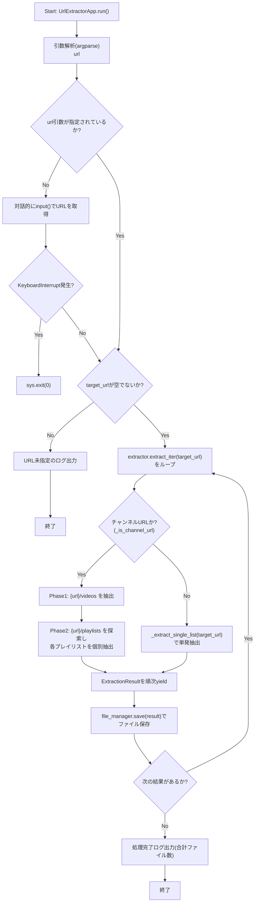
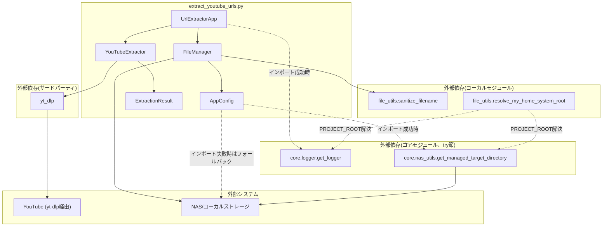

## 1. 解析メタ情報

| 項目 | 内容 |
| --- | --- |
| 対象ファイル | `extract_youtube_urls.py` |
| 言語 | Python |
| 解析対象 | 提供されたコードのみ |
| 推測・補完 | 一切なし |
| 解析基準コミット | `819d03b` (+作業ツリー: Issue #413 D-L11 でデッドコードだった`SubscriptionManager`/`--cron`を削除、本更新時点では未コミット) |

## 関連ドキュメント

* [file_utils.md](./file_utils.md) — 本ファイルが利用する共通ファイル名サニタイズ処理（`sanitize_filename`）の実装元。
* [../MY_HOME_SYSTEM/nas_utils.md](../MY_HOME_SYSTEM/nas_utils.md) — 本ファイルがインポートを試みる`core.nas_utils.get_managed_target_directory`の実装候補（同名関数のシグネチャ・実装が確認できる）。
* [../MY_HOME_SYSTEM/logger.md](../MY_HOME_SYSTEM/logger.md) — 本ファイルがインポートを試みる`core.logger.get_logger`の実装候補に関する参考情報。
* [batch_download_discord.md](./batch_download_discord.md) — 同じDDDサブシステム内で`yt_dlp`と`file_utils.sanitize_filename`を併用する類似スクリプトとの比較参考。
* [newface_monitor.md](./newface_monitor.md) — 本ファイルの`get_managed_target_directory`フォールバックの`fallback_dir_str`尊重パターンは、同じDDDサブシステム内で先行して修正済みのnewface_monitor.pyの同一パターンを踏襲したものである（コード内コメントで直接言及されている）。`PROJECT_ROOT`解決も、以前は本ファイル・newface_monitor.pyそれぞれが個別に実装していた`CURRENT_DIR.parent / "MY_HOME_SYSTEM"`という固定の兄弟ディレクトリ前提のみの単純な方式だったが、現在は両ファイルとも`file_utils.resolve_my_home_system_root`（品質で追加）へ集約されている。
* [test_extract_youtube_urls_paths.md](./test_extract_youtube_urls_paths.md) — 本ファイルの`PROJECT_ROOT`解決・`core.*`インポート可否・フォールバックスタブの引数尊重を検証する回帰テストの解析ドキュメント。**（Issue #413 D-L11で変更）** 以前存在した`_verify_environment`のフォールバック検知・（Issue #123回帰テストとして追加された）`process_subscriptions`のNAS状態再評価タイミングを検証するテストクラス群は、削除された`SubscriptionManager`専用だったため、クラス本体と合わせて削除されている。
* `test_extract_youtube_urls_save_base_dir.py`（Issue #243回帰テスト。専用の仕様書は本リポジトリの命名規則上作成しない対象＝`test_*.py`のため対応なし）— `FileManager.save`への`base_dir`引数受け渡し、および`UrlExtractorApp.run`が`get_output_base_dir()`を1回だけ呼ぶことを検証する。**（Issue #413 D-L11で変更）** 以前存在した`process_subscriptions`向けの同種のテストクラスは、削除された`SubscriptionManager`専用だったため削除されている。
* `test_extract_youtube_urls_rate_limit.py`（Issue #227回帰テスト。専用の仕様書は本リポジトリの命名規則上作成しない対象＝`test_*.py`のため対応なし）— `YouTubeExtractor.extract_iter`内部の`/videos`→`/playlists`→各プレイリスト間のジッター待機、および内部失敗の`last_extract_internal_failures`への記録を検証する。**（Issue #413 D-L11で変更）** 以前存在した`process_subscriptions`のサーキットブレーカーが内部失敗を検知することを検証するテストクラスは、削除された`SubscriptionManager`専用だったため削除されている。

## 2. ファイルの概要

* モジュールDocstring上「YouTube URL Extractor (Integrated with MY_HOME_SYSTEM)」と称される、指定されたYouTubeチャンネルやプレイリストから動画URLを抽出するスクリプトである。
* 根拠: [モジュールDocstring] (行番号: 4〜9 / 抜粋: "YouTube URL Extractor (Integrated with MY_HOME_SYSTEM)\n------------------------------------------------------\n指定されたYouTubeチャンネルやプレイリストから動画URLを抽出するスクリプト。\nMY_HOME_SYSTEMのエコシステム（ロガー、ディレクトリ構成）に準拠。")
* `PROJECT_ROOT`は`file_utils.resolve_my_home_system_root(CURRENT_DIR)`（**品質で変更**。以前は本ファイル・`newface_monitor.py`がそれぞれ個別に`CURRENT_DIR.parent / "MY_HOME_SYSTEM"`という固定の兄弟ディレクトリ前提のみで実装しており、両ファイルで重複していた）として解決される。`core/`の実体は`MY_HOME_SYSTEM/core`配下にあり、DDDの単なる親ディレクトリ（リポジトリルート）を指す実装では`core.*`のインポートが常に失敗し、常にファイル内フォールバックスタブへ落ちてしまう不具合があったための修正である。共通化後も、環境変数`MY_HOME_SYSTEM_ROOT`による明示指定 → `CURRENT_DIR.parent / "MY_HOME_SYSTEM"`（`services`ディレクトリの存在確認付き） → 上位ディレクトリの`services`探索 → 解決不能時は`CURRENT_DIR`自身、という解決順序（`batch_download_discord.py`で先行実装済みだったロバストな方式）は変わらない。
* 根拠: [PROJECT_ROOT定義とコメント] (行番号: 28〜35 / 抜粋: "# プロジェクトルートへのパス解決 (DDD/ から MY_HOME_SYSTEM/core/ を参照するため)。\n# 品質: プロジェクトルート解決をfile_utils.resolve_my_home_system_rootへ集約\n# (以前はnewface_monitor.pyと同じ、固定の兄弟ディレクトリ前提のみの単純な方式を\n# 個別に実装していた)。core/ は develop/MY_HOME_SYSTEM/core に実在する\n# (develop/core ではない)ため、DDDの単なる親ディレクトリではImportErrorになり、\n# 常にローカルフォールバック用スタブへ落ちてしまう点に変わりはない。\nCURRENT_DIR = Path(__file__).resolve().parent  # ~/develop/DDD\nPROJECT_ROOT = resolve_my_home_system_root(CURRENT_DIR)  # ~/develop/MY_HOME_SYSTEM")、共通化先の実装 (参考: [file_utils.md](./file_utils.md) の `resolve_my_home_system_root` 節)
* `MY_HOME_SYSTEM`の共通コア機能（`core.logger.get_logger`, `core.nas_utils.get_managed_target_directory`）のインポートを試み、失敗時（開発環境・単体実行時）はファイル内にフォールバック実装（標準`logging`ベースのロガー、`fallback_dir_str`引数を尊重するディレクトリ解決関数）を用意している。**（Issue #463で追加）** 以前はこの切り替わりを無言で行っていたが、`core.*`のインポート失敗はNASではなくローカルディスクへの書き込みに切り替わることを意味するため、本番環境で`MY_HOME_SYSTEM`へのパス解決が崩れる等の異常があった場合に気づけるよう、フォールバック用ロガー(`logging.getLogger("UrlExtractor")`)自身で`logger.warning(...)`（捕捉した例外`e`の内容を含む）を出力するようになった。
* 根拠: [try-exceptブロックとコメント] (行番号: 39〜54 / 抜粋: "try:\n    from core.logger import get_logger\n    from core.nas_utils import get_managed_target_directory\n    logger = get_logger(__name__)\nexcept ImportError as e:\n    # 開発環境や単体実行時のフォールバック\n    import logging\n    logging.basicConfig(level=logging.INFO)\n    logger = logging.getLogger("UrlExtractor")\n    # #463: core.*のインポート失敗はNASではなくローカルディスクへの書き込みに\n    # 切り替わることを意味する。本番環境でMY_HOME_SYSTEMへのパス解決が崩れる等の\n    # 変更があった場合に気づけるよう、無警告で切り替わらないようにする。\n    logger.warning(\n        f"⚠️ core.*のインポートに失敗したため開発用フォールバックへ切り替わりました "\n        f"(NASではなくローカルディスクへ書き込みます): {e}"\n    )")
* `yt_dlp`を用いて対象URL（チャンネル・プレイリスト・単一動画）から動画URLを抽出する`YouTubeExtractor`、抽出結果をテキストファイルへ保存する`FileManager`、およびコマンドライン引数を解析してこれらを統括する`UrlExtractorApp`の3クラスで構成される。
* 根拠: [各クラス定義] (行番号: 130〜131, 308〜309, 402〜403 / 抜粋: "class YouTubeExtractor:\n    """YouTubeからURL情報を抽出するクラス。"""")
* チャンネルURLが指定された場合は`/videos`と`/playlists`の両方を自動探索し、通常動画一覧に加えて各プレイリストも個別に抽出する。
* 根拠: [extract_iterメソッド] (行番号: 236〜245 / 抜粋: "チャンネルURLの場合は `/videos` と `/playlists` を自動探索する。")
* **[削除済み] Issue #413 (D-L11)**: 以前は`--cron`引数指定時にSQLite DB（`home_system.db`）の`youtube_subscriptions`テーブルに登録されたアクティブなチャンネルURLを順次巡回する`SubscriptionManager`による自動サブスクリプションモード（レート制限対策のジッター付き待機・連続失敗時のサーキットブレーカーを含む）が存在したが、`youtube_subscriptions`テーブルへINSERT/UPDATEするコードがリポジトリ内のどこにも存在せず、`--cron`もどのcrontab/スケジューラにも未登録という、事実上一度も機能しえなかったデッドコードだったため、オーナー承認の上で`SubscriptionManager`クラス本体・`--cron`引数・関連の`AppConfig`定数（`SUBSCRIPTION_FILE`, `SUBSCRIPTION_SLEEP_RANGE`, `CONSECUTIVE_FAILURE_THRESHOLD`）・専用テスト一式を削除した（実装削除、機能追加なし）。詳細は8章を参照。
* 根拠: [削除通知コメント] (行番号: 389〜397 / 抜粋: "# #413 (D-L11): 以前ここにあった SubscriptionManager クラス(定期巡回/サブスク\n# リプション機能。youtube_subscriptions テーブルをSQLite DBで管理し、--cron\n# 実行時に登録済みチャンネルを順次抽出していた)は削除した。youtube_subscriptions\n# テーブルへのINSERT/UPDATEを行うコードがリポジトリ内のどこにも存在せず(仕様書の\n# 旧版でも同じ結論)、crontabにも未登録の、事実上のデッド機能だったため\n# (オーナー判断: --cronは削除)。また同機能が使うDBパス\n# (/mnt/nas/home_system/youtube_extractor/home_system.db)は、MY_HOME_SYSTEM\n# 本体の home_system.db とは別ファイルであるにもかかわらず同名という紛らわしい\n# 設計でもあった。")
* **(Issue #243バグ修正)** `FileManager.save`は以前、呼び出しのたびに常に`AppConfig.get_output_base_dir()`を内部で呼び出していた。1チャンネル/1URLから複数の`ExtractionResult`が得られる場合（`extract_iter`がプレイリストごとに複数回`yield`する等）、`save()`が結果件数分だけ`get_output_base_dir()`を再評価してしまい、NAS瞬断時の再マウント試行・障害通知が保存件数分だけ多重発生しうる不具合があった。現在は`save()`が`base_dir`引数（省略可能、`Optional[Path] = None`）を受け取り、呼び出し元が既に取得済みの値を渡せるようになった。`UrlExtractorApp.run()`は1回だけ取得した値を`save()`へ渡して使い回す。
* 根拠: [FileManager.saveのbase_dir引数とコメント] (行番号: 326, 341〜345 / 抜粋: "def save(self, result: ExtractionResult, base_dir: Optional[Path] = None) -> bool:", "# #243: 呼び出し元から渡されなかった場合のみ遅延評価でディレクトリを取得する。\n        # 以前は常にここでget_output_base_dir()を呼んでいたため、呼び出し元\n        # (UrlExtractorApp.run())が1回に抑えていたつもりの重い処理(NASマウント確認・\n        # 自己修復・障害通知)が、保存件数分だけ再評価され、NAS瞬断時に再マウント試行・\n        # 通知が多重発生していた。\n        if base_dir is None:\n            base_dir = AppConfig.get_output_base_dir()")、UrlExtractorApp.run呼び出し箇所 (行番号: 431〜437 / 抜粋: "base_dir = AppConfig.get_output_base_dir()\n            # イテレータを回して処理\n            for result in self.extractor.extract_iter(target_url):\n                if self.file_manager.save(result, base_dir=base_dir):")

## 3. 外部依存関係

### インポート一覧

| 名称 | 種類 | 用途 | 根拠 |
| --- | --- | --- | --- |
| `sys` | 標準ライブラリ | `sys.path`へのプロジェクトルート追加、`sys.exit`によるプロセス終了 | 根拠: [import文] (行番号: 11 / 抜粋: "import sys") |
| `argparse` | 標準ライブラリ | コマンドライン引数（URL）の解析 | 根拠: [import文] (行番号: 12 / 抜粋: "import argparse") |
| `re` | 標準ライブラリ | チャンネルURL判定用の正規表現(`_is_channel_url`) | 根拠: [import文] (行番号: 13 / 抜粋: "import re") |
| `time` | 標準ライブラリ | チャンネル内部の複数リクエスト（`/videos`→`/playlists`→各プレイリスト）間のスリープ | 根拠: [import文] (行番号: 14 / 抜粋: "import time") |
| `random` | 標準ライブラリ | スリープ時間のランダムなジッター生成 | 根拠: [import文] (行番号: 15 / 抜粋: "import random") |
| `pathlib.Path` | 標準ライブラリ | パス操作全般 | 根拠: [import文] (行番号: 16 / 抜粋: "from pathlib import Path") |
| `dataclasses.dataclass` | 標準ライブラリ | `ExtractionResult`データクラスの定義 | 根拠: [import文] (行番号: 17 / 抜粋: "from dataclasses import dataclass") |
| `typing.List`, `Optional`, `Set`, `Iterator`, `Dict`, `Any` | 標準ライブラリ | 型ヒント全般 | 根拠: [import文] (行番号: 18 / 抜粋: "from typing import List, Optional, Set, Iterator, Dict, Any") |
| `yt_dlp` | サードパーティ | YouTubeチャンネル/プレイリスト/動画のメタデータ抽出(`extract_info`) | 根拠: [import文] (行番号: 20 / 抜粋: "import yt_dlp") |
| `file_utils.sanitize_filename` (as `_shared_sanitize_filename`) | ローカルモジュール | 保存ファイル名のサニタイズ処理の委譲先 | 根拠: [import文] (行番号: 22 / 抜粋: "from file_utils import sanitize_filename as _shared_sanitize_filename") |
| `file_utils.resolve_my_home_system_root` | ローカルモジュール（**品質で追加**） | `PROJECT_ROOT`（`MY_HOME_SYSTEM`のパス）解決処理の委譲先。`newface_monitor.py`/`batch_download_discord.py`と共通化されている | 根拠: [import文] (行番号: 23 / 抜粋: "from file_utils import resolve_my_home_system_root") |
| `core.logger.get_logger` | 内部モジュール（オプショナル、try節） | ロガーインスタンスの取得。インポート失敗時はファイル内フォールバック実装（`logging.getLogger`ベース）を使用 | 根拠: [import文] (行番号: 40 / 抜粋: "from core.logger import get_logger") |
| `core.nas_utils.get_managed_target_directory` | 内部モジュール（オプショナル、try節） | NAS/ローカルの出力先ディレクトリの解決・管理。インポート失敗時はファイル内フォールバック実装（`fallback_dir_str`引数があればそれを、なければ`Path("./data")`を返す）を使用 | 根拠: [import文] (行番号: 41 / 抜粋: "from core.nas_utils import get_managed_target_directory") |

**（#413 D-L11で変更）** 以前ここに存在した`sqlite3`（サブスクリプション管理用DB接続）・`contextlib.closing`（SQLite接続の確実なクローズ）の2行は、これらを使用していた`SubscriptionManager`クラスの削除に伴い、現在の`import`文には存在しない。

### ブラックボックスとなる外部要素

| 名称 | 理由 | 根拠 |
| --- | --- | --- |
| `core.logger.get_logger` | インポート成功時に実際に使用される実装（フォーマット、出力先、ログレベル等）の詳細が本ファイルからは不明。フォールバック実装のみがこのファイルから確認できる。 | 根拠: [import文とフォールバック定義] (行番号: 40, 43〜47 / 抜粋: "from core.logger import get_logger") |
| `core.nas_utils.get_managed_target_directory` | インポート成功時の実際の実装（NASマウント確認・自動修復ロジックの詳細）が不明。フォールバック実装は`fallback_dir_str`があればそれを、なければ`Path("./data")`を返す簡易実装のみがこのファイルから確認できる。 | 根拠: [import文とフォールバック定義] (行番号: 41, 56〜64 / 抜粋: "from core.nas_utils import get_managed_target_directory") |
| `yt_dlp.YoutubeDL` | `extract_info`が返す辞書の詳細な構造（`entries`, `url`, `webpage_url`, `id`, `title`, `channel`, `uploader`等のキーの完全な仕様）は`yt_dlp`本体の実装に依存し、本ファイルからは分からない。 | 根拠: [YoutubeDL利用箇所] (行番号: 196〜197 / 抜粋: "with yt_dlp.YoutubeDL(dict(AppConfig.YDL_OPTS)) as ydl:\n                info = ydl.extract_info(target_url, download=False)") |
| `file_utils.sanitize_filename` | サニタイズの具体的なルール（禁止文字、長さ制限等）は本ファイル単体からは不明。ただし関連ドキュメント`file_utils.md`に実装の解析結果が存在する。 | 根拠: [import文] (行番号: 22 / 抜粋: "from file_utils import sanitize_filename as _shared_sanitize_filename") |

**（#413 D-L11で削除）** 以前ここに存在した`home_system.db`（SQLite DB。`SubscriptionManager._init_db`/`process_subscriptions`が使用していた`youtube_subscriptions`テーブル）の行は、これらのメソッド・クラス自体の削除に伴い削除した。本ファイルは現在いかなるSQLite DBへも接続しない。

## 4. 主要要素の定義（関数 / エンドポイント / コンポーネント）

### `get_managed_target_directory` (フォールバック実装)

* **役割**: `core.nas_utils`のインポートに失敗した場合に使用される簡易フォールバック関数。呼び出し元(`get_output_base_dir`)が渡す`fallback_dir_str`（`BASE_DIR/'data'`の絶対パス）があればそれを、なければカレントディレクトリ相対の`./data`を返す。カレントディレクトリ相対パスを無条件に返すと実行時のカレントディレクトリ次第で保存先・DBパスが毎回変わってしまう不具合につながるため、絶対パスの`fallback_dir_str`を優先する設計であることがコメントで明記されている（`newface_monitor.py`で修正済みの同一バグの踏襲）。
* 根拠: [関数定義とコメント] (行番号: 56〜60 / 抜粋: "def get_managed_target_directory(*args, **kwargs) -> Path:\n        # 呼び出し元(get_output_base_dir)はfallback_dir_str(BASE_DIR/'data'の絶対パス)を\n        # 渡してくる想定。これを無視してカレントディレクトリ相対の"./data"を返すと、\n        # 実行時のカレントディレクトリ次第で保存先・DBパスが毎回変わってしまう\n        # (newface_monitor.pyで修正済みの同一バグ)。")

* **引数/リクエスト**: `*args`, `**kwargs`（本フォールバック実装では`kwargs.get("fallback_dir_str")`のみを参照する）
* 根拠: [引数定義と参照箇所] (行番号: 56, 61 / 抜粋: "fallback_dir_str = kwargs.get("fallback_dir_str")")

* **戻り値/レスポンス**: `Path`（`fallback_dir_str`が渡されていればそれを`Path`化した値、なければ`Path("./data")`）
* 根拠: [各return文] (行番号: 62〜64 / 抜粋: "if fallback_dir_str:\n            return Path(fallback_dir_str)\n        return Path("./data")")

* **副作用**: なし
* **エラーハンドリング**: なし

### `AppConfig`

* **役割**: 出力先ディレクトリ、NASパス、サブディレクトリ名、レート制限対策のスリープ範囲、`yt_dlp`オプションなど、アプリケーション全体の設定値を保持する定数クラス（インスタンス化不要、クラス変数と`classmethod`のみで構成）。`INTRA_CHANNEL_SLEEP_RANGE`は、1チャンネル処理の内部で発行される`/videos`→`/playlists`→各プレイリストという複数リクエスト間に挟むジッター待機の範囲（既定1.0〜3.0秒、**Issue #227で追加**）。**（Issue #413 D-L11で削除）** 以前存在した`SUBSCRIPTION_FILE`・`SUBSCRIPTION_SLEEP_RANGE`（チャンネルURL「間」の巡回間隔）・`CONSECUTIVE_FAILURE_THRESHOLD`（サーキットブレーカーの連続失敗閾値）の3定数は、これらを使用していた`SubscriptionManager`クラス自体の削除に伴い削除された。
* 根拠: [クラス定義とDocstring] (行番号: 69〜70 / 抜粋: "class AppConfig:\n    """アプリケーション設定を保持する定数クラス。"""")、内部リクエスト用スリープ範囲 (行番号: 83 / 抜粋: "INTRA_CHANNEL_SLEEP_RANGE: tuple = (1.0, 3.0)")

* **引数/リクエスト**: なし（クラス変数として静的に定義）
* 根拠: [クラス変数定義群] (行番号: 73〜91 / 抜粋: "BASE_DIR: Path = CURRENT_DIR")

* **戻り値/レスポンス**: 該当なし
* **副作用**: なし（クラス変数の定義自体には外部通信・ファイルI/O等の副作用はない）
* **エラーハンドリング**: なし

### `AppConfig.get_output_base_dir`

* **役割**: NASアクセスを検証・修復し、動的に出力先ベースディレクトリを解決するクラスメソッド。クラスロード時ではなく実際のファイル処理が必要になったタイミング（遅延評価）で呼び出す設計。
* 根拠: [メソッド定義とDocstring] (行番号: 94〜102 / 抜粋: "def get_output_base_dir(cls) -> Path:\n        """NASアクセスを検証・修復し、動的にベースディレクトリを解決する（遅延評価）。")

* **引数/リクエスト**: なし（`cls`のみ、`@classmethod`）
* 根拠: [デコレータと引数] (行番号: 93〜94 / 抜粋: "@classmethod\n    def get_output_base_dir(cls) -> Path:")

* **戻り値/レスポンス**: `Path`（利用可能なディレクトリパス）
* 根拠: [Docstringと戻り値] (行番号: 100〜103 / 抜粋: "Returns:\n            Path: 利用可能なディレクトリパス\n        """\n        return get_managed_target_directory(")

* **副作用**: `get_managed_target_directory`（インポート成功時は`core.nas_utils`、失敗時はフォールバック実装）の呼び出し。
* 根拠: [呼び出し] (行番号: 103〜107 / 抜粋: "return get_managed_target_directory(\n            nas_dir_str=cls.NAS_DIR_STR,\n            fallback_dir_str=cls.LOCAL_DIR_STR,\n            mount_point=cls.MOUNT_POINT\n        )")

* **エラーハンドリング**: なし（本メソッド自体には例外処理なし。委譲先の実装に依存）

### `ExtractionResult`

* **役割**: 1件の抽出結果（動画リスト/プレイリストのタイトル、URLリスト、抽出元URL、チャンネル名、プレイリストか否か）を保持するデータクラス。
* 根拠: [クラス定義とDocstring] (行番号: 110〜120 / 抜粋: "@dataclass\nclass ExtractionResult:\n    """抽出結果を格納するデータクラス。")

* **引数/リクエスト**: `title: str`, `urls: List[str]`, `source_url: str`, `channel_name: str = "unknown_channel"`, `is_playlist: bool = False`
* 根拠: [フィールド定義] (行番号: 121〜125 / 抜粋: "title: str\n    urls: List[str]\n    source_url: str\n    channel_name: str = "unknown_channel"\n    is_playlist: bool = False")

* **戻り値/レスポンス**: 該当なし（データクラスのフィールド定義自体）
* **副作用**: なし
* **エラーハンドリング**: なし

### `YouTubeExtractor.__init__`（Issue #227で追加）

* **役割**: `last_extract_internal_failures`（1チャンネル処理内部での失敗件数カウンタ、初期値0）を初期化するコンストラクタ。以前は`YouTubeExtractor`に`__init__`が無かったが、`extract_iter`内部の失敗を呼び出し元のサーキットブレーカーへ伝えるための状態保持先として追加された。**（Issue #413 D-L11で変更）** 当時の唯一の呼び出し元だった`SubscriptionManager.process_subscriptions`は削除されたが、本属性自体は`extract_iter`が「内部で何件失敗したか」を外部から判定可能にする汎用的な状態であり、削除の対象にはなっていない。
* 根拠: [メソッド定義とコメント] (行番号: 133〜140 / 抜粋: "def __init__(self) -> None:\n        # #227: extract_iter内部(1チャンネルにつき/videos・/playlists・各プレイリスト\n        # という複数リクエスト)で発生した失敗件数。")

* **引数/リクエスト**: なし
* 根拠: (行番号: 133)

* **戻り値/レスポンス**: 該当なし
* **副作用**: `self.last_extract_internal_failures`への属性代入のみ
* 根拠: (行番号: 140 / 抜粋: "self.last_extract_internal_failures: int = 0")

* **エラーハンドリング**: なし

### `YouTubeExtractor._normalize_url`

* **役割**: `yt_dlp`のエントリ辞書から正規化されたYouTube動画URLを生成する静的メソッド。`video_id`があれば`watch?v=`形式のURLを優先的に構築し、なければ既存の`url`/`webpage_url`をYouTubeドメインかどうか判定した上で採用する。
* 根拠: [メソッド定義とDocstring] (行番号: 143〜151 / 抜粋: "def _normalize_url(entry: Dict[str, Any]) -> Optional[str]:\n        """エントリ情報から正規化されたYouTube URLを生成する。")

* **引数/リクエスト**: `entry: Dict[str, Any]`（`yt-dlp`から取得したエントリ辞書）
* 根拠: [引数定義とDocstring] (行番号: 143, 146〜147 / 抜粋: "entry (Dict[str, Any]): yt-dlp から取得したエントリ辞書。")

* **戻り値/レスポンス**: `Optional[str]`（正規化されたURL。生成できない場合は`None`）
* 根拠: [Docstringと各return] (行番号: 149〜151, 156, 159〜160 / 抜粋: "Returns:\n            Optional[str]: 正規化されたURL。生成できない場合は None。")

* **副作用**: なし（純粋な文字列生成処理）
* **エラーハンドリング**: なし（想定外の入力に対しては`None`を返すのみ）

### `YouTubeExtractor._is_channel_url`

* **役割**: 指定URLが末尾クエリを除去・末尾スラッシュを除去した上で、チャンネルトップページ（`@handle`, `channel/`, `c/`, `user/`形式）のURLパターンに一致するかを正規表現で判定するインスタンスメソッド。
* 根拠: [メソッド定義とDocstring] (行番号: 162〜170 / 抜粋: "def _is_channel_url(self, url: str) -> bool:\n        """指定されたURLがチャンネルトップページのURLかを判定する。")

* **引数/リクエスト**: `url: str`
* 根拠: [引数定義とDocstring] (行番号: 162, 165〜166 / 抜粋: "url (str): 判定対象のURL。")

* **戻り値/レスポンス**: `bool`（チャンネルURLであれば`True`）
* 根拠: [Docstringと戻り値] (行番号: 168〜169, 170 / 抜粋: "Returns:\n            bool: チャンネルURLであれば True。")

* **副作用**: なし
* **エラーハンドリング**: なし

### `YouTubeExtractor._extract_single_list`

* **役割**: 単一のURL（動画リストまたはプレイリスト）を`yt_dlp`で解析し、含まれる全動画URLを正規化・重複排除した`ExtractionResult`を構築するインスタンスメソッド。`AppConfig.YDL_OPTS`は呼び出し間の状態汚染を避けるためコピーして渡される。
* 根拠: [メソッド定義とコメント] (行番号: 174〜183 / 抜粋: "def _extract_single_list(self, target_url: str, force_title: str = "") -> Optional[ExtractionResult]:")

* **引数/リクエスト**: `target_url: str`（対象のURL）, `force_title: str = ""`（タイトルを強制指定する場合に使用）
* 根拠: [引数定義とDocstring] (行番号: 174, 178〜179 / 抜粋: "target_url (str): 対象のURL。\n            force_title (str, optional): タイトルを強制指定する場合に使用。")

* **戻り値/レスポンス**: `Optional[ExtractionResult]`（抽出結果オブジェクト。失敗時（`yt_dlp`が情報を返さない、例外発生、URLが1件も抽出できない）は`None`）
* 根拠: [Docstringと各return] (行番号: 181〜182, 198〜199, 222〜223, 226〜227, 229〜234 / 抜粋: "Returns:\n            Optional[ExtractionResult]: 抽出結果オブジェクト。失敗時は None。")

* **副作用**: `yt_dlp.YoutubeDL.extract_info`によるネットワークアクセス、進捗・エラーのログ出力。
* 根拠: [extract_info呼び出しとログ] (行番号: 184, 197 / 抜粋: "logger.info(f"🔍 解析開始: {target_url}")", "info = ydl.extract_info(target_url, download=False)")

* **エラーハンドリング**: `yt_dlp`実行時の例外を`except Exception`で捕捉し、スタックトレース付き(`exc_info=True`)でエラーログを出力して`None`を返す。抽出結果のURLが0件の場合も`None`を返す。
* 根拠: [try-exceptブロック] (行番号: 220〜223 / 抜粋: "except Exception:\n            # Error Handling: スタックトレースを含めてログ出力\n            logger.error(f"❌ 抽出失敗 ({target_url})", exc_info=True)\n            return None")

### `YouTubeExtractor.extract_iter`

* **役割**: URLの種類に応じて抽出方式を切り替えるイテレータメソッド。チャンネルURLの場合は`/videos`（全動画）と`/playlists`（各プレイリスト）を自動探索して複数の`ExtractionResult`を`yield`し、それ以外（プレイリストURLや単一動画URL）の場合は単発で`_extract_single_list`を呼び出す。**（Issue #227で修正）** 以前は`/videos`取得→`/playlists`取得→検出した各プレイリストへの逐次リクエストがsleep無しで連続発行されていたため、1チャンネル内部の複数リクエストがレート制限/Bot検知を誘発しやすい構造だった。現在は`/videos`→`/playlists`間、および各プレイリスト取得の前（最初の1件を除く）に`AppConfig.INTRA_CHANNEL_SLEEP_RANGE`によるジッター待機を挟む。また、呼び出しの先頭で`self.last_extract_internal_failures`を0にリセットし、個々のプレイリスト取得失敗やプレイリスト一覧取得自体の失敗のたびに加算することで、呼び出し元が「1件でも結果をyieldできたか」だけでなく「内部で何件失敗したか」も判定できるようにしている。
* 根拠: [メソッド定義とDocstring] (行番号: 236〜245 / 抜粋: "def extract_iter(self, target_url: str) -> Iterator[ExtractionResult]:\n        """URLの種類に応じて再帰的または単発で抽出を行うイテレータ。")、内部リクエスト間のスリープ (行番号: 266〜268, 284〜288 / 抜粋: "time.sleep(random.uniform(*AppConfig.INTRA_CHANNEL_SLEEP_RANGE))")、失敗カウント (行番号: 247, 296, 299 / 抜粋: "self.last_extract_internal_failures = 0")

* **引数/リクエスト**: `target_url: str`（開始URL）
* 根拠: [引数定義とDocstring] (行番号: 236, 241〜242 / 抜粋: "target_url (str): 開始URL。")

* **戻り値/レスポンス**: `Iterator[ExtractionResult]`（抽出結果を順次`yield`）
* 根拠: [Docstringと戻り値ヒント] (行番号: 236, 244〜245 / 抜粋: "Yields:\n            Iterator[ExtractionResult]: 抽出結果を順次返す。")

* **副作用**: チャンネルURLの場合、`/videos`・`/playlists`双方への`yt_dlp`アクセス（ネットワーク通信）、内部リクエスト間の`time.sleep`、進捗ログ出力、`self.last_extract_internal_failures`のリセットと加算。
* 根拠: [チャンネル探索処理] (行番号: 249〜299 / 抜粋: "if self._is_channel_url(target_url):\n            logger.info("ℹ️ チャンネルURLを検出。詳細スキャンを開始します。")")

* **エラーハンドリング**: プレイリスト一覧取得時（`/playlists`）の例外を`except Exception`で捕捉し、スタックトレース付きでエラーログを出力した上で`last_extract_internal_failures`を1加算する（処理は中断されるがメソッド自体は正常終了）。個々の`_extract_single_list`呼び出しの失敗（`None`が返る場合）は`yield`をスキップし、プレイリスト取得（`pl_url`が存在する場合）に限り`last_extract_internal_failures`を1加算する。
* 根拠: [try-exceptブロックと失敗カウント] (行番号: 297〜299 / 抜粋: "except Exception:\n                logger.error("❌ プレイリスト一覧の取得に失敗しました", exc_info=True)\n                self.last_extract_internal_failures += 1")

### `FileManager._sanitize_filename`

* **役割**: 外部モジュール`file_utils.sanitize_filename`へファイル名のサニタイズ処理を委譲する静的メソッド。**（Issue #175で修正）** 以前は`filename`のみを受け取り委譲先の`max_length`は常に既定値（当時は200文字＝文字数ベース）のままだったが、呼び出し元がバイト数の上限を明示的に指定できるよう`max_length`引数を追加し、そのまま委譲先へ渡すようになった。
* 根拠: [メソッド定義とDocstring] (行番号: 312〜321 / 抜粋: "def _sanitize_filename(filename: str, max_length: int = 200) -> str:\n        """ファイル名として使用できない文字を置換する。")

* **引数/リクエスト**: `filename: str`（元の文字列）, `max_length: int = 200`（生成する文字列の最大バイト数。UTF-8エンコード後）
* 根拠: [引数定義とDocstring] (行番号: 312, 316〜317 / 抜粋: "filename (str): 元の文字列。\n            max_length (int): 生成する文字列の最大バイト数（UTF-8エンコード後）。")

* **戻り値/レスポンス**: `str`（安全なファイル名文字列）
* 根拠: [Docstringと戻り値] (行番号: 319〜320, 322 / 抜粋: "Returns:\n            str: 安全なファイル名文字列。\n        """\n        return _shared_sanitize_filename(filename, max_length=max_length)")

* **副作用**: なし
* **エラーハンドリング**: なし（委譲先の例外処理には依存）

### `FileManager.save`（D-L10で変更）

* **役割**: `ExtractionResult`の抽出結果（チャンネル名・タイトルをサニタイズしたファイル名）をテキストファイルへ1行1URL形式で保存するインスタンスメソッド。**（Issue #243で修正）** 保存先ディレクトリは、引数`base_dir`が渡されればそれをそのまま使い、省略された場合のみ`AppConfig.get_output_base_dir()`を遅延評価で呼び出す。以前は`base_dir`引数が存在せず常に本メソッド内で`get_output_base_dir()`を呼んでいたため、1回の巡回/1URLから複数の`ExtractionResult`が保存される場合に、NASマウント確認・自己修復・障害通知を伴う重い処理が保存件数分だけ再評価されていた不具合の修正である。**（Issue #175で修正）** ファイル名は`{safe_channel}_{safe_title}.txt`という形式で2つのサニタイズ済み文字列を連結するため、以前のように各コンポーネントを`_sanitize_filename`の既定値（200バイト）のまま切り詰めると、連結後のファイル名が最大`200+1+200+4=405`バイトとなりext4等の255バイト制限を確実に超過し`ENAMETOOLONG`で保存が失敗しうる不具合があった。現在はチャンネル名・タイトルの双方に`max_length=100`（バイト）を明示的に指定し、連結後も255バイト以内（`100+1+100+4=205`バイト、安全マージンあり）に収まるようにしている。**（D-L10で修正）** ファイル書き込みは以前`output_path.open("w", ...)`による直接上書きだったため、NAS瞬断等で書き込み中にプロセスが中断すると、同名ファイルが既に存在するケース（チャンネル名/タイトルの重複）で中身が空/一部だけの壊れたファイルが残ってしまいうった。`newface_monitor.py`/`batch_download_discord.py`の他の永続化と同じ「`.tmp`へ書き込み→`replace`」のアトミックパターンに揃えた。
* 根拠: [メソッド定義とDocstring] (行番号: 326〜340 / 抜粋: "def save(self, result: ExtractionResult, base_dir: Optional[Path] = None) -> bool:\n        """抽出結果をテキストファイルに保存する。")、バイト数配分 (行番号: 355〜359 / 抜粋: "#175: 各コンポーネントを既定のmax_length(200バイト)のまま連結すると")、[D-L10: tmp+replaceのコメント] (行番号: 369〜375 / 抜粋: "# D-L10: 以前はoutput_path.open("w", ...)で直接上書きしていたため、\n        # 書き込み中(NAS瞬断等)にプロセスが中断すると" / "tmp_path = output_path.with_suffix(output_path.suffix + '.tmp')")

* **引数/リクエスト**: `result: ExtractionResult`（保存対象の抽出データ）, `base_dir: Optional[Path] = None`（**Issue #243で追加**。保存先のベースディレクトリ。省略時は`AppConfig.get_output_base_dir()`を内部で呼び出して取得する）。**（Issue #413 D-L11で修正済み）** Docstringが以前言及していた呼び出し元`process_subscriptions()`（`SubscriptionManager`）は削除済みであり、現在のDocstringは`UrlExtractorApp.run()`のみを参照する。
* 根拠: [引数定義とDocstring] (行番号: 326, 329〜336 / 抜粋: "def save(self, result: ExtractionResult, base_dir: Optional[Path] = None) -> bool:", "base_dir (Optional[Path]): 保存先のベースディレクトリ。省略時は\n                AppConfig.get_output_base_dir()を呼び出して取得する(#243修正前の\n                挙動)。get_output_base_dir()はNASマウント確認・自己修復・障害通知を\n                伴う重い処理のため、複数件のExtractionResultを保存する呼び出し元は\n                同一処理内で1回だけ取得した値をここへ渡して使い回すこと\n                (UrlExtractorApp.run()参照)。")

* **戻り値/レスポンス**: `bool`（保存に成功した場合`True`。ディレクトリ作成失敗時・ファイル書き込み失敗時は`False`）
* 根拠: [Docstringと各return] (行番号: 338〜339, 353, 381〜382, 390 / 抜粋: "Returns:\n            bool: 保存に成功した場合は True。")

* **副作用**: 保存先ディレクトリの作成(`mkdir`)、**（D-L10で変更）** 一時ファイル(`.tmp`)への書き込みと`tmp_path.replace(output_path)`によるアトミックな置換（以前は`output_path`への直接書き込み）、成功/失敗・上書き時のログ出力。
* 根拠: [ディレクトリ作成とアトミック書き込み] (行番号: 350, 375〜380 / 抜粋: "target_dir.mkdir(parents=True, exist_ok=True)", "tmp_path = output_path.with_suffix(output_path.suffix + '.tmp')\n        try:\n            with tmp_path.open("w", encoding="utf-8") as f:\n                for url in result.urls:\n                    f.write(url + "\\n")\n            tmp_path.replace(output_path)")

* **エラーハンドリング**: ディレクトリ作成時の`OSError`を捕捉してエラーログを出力し`False`を返す。ファイル書き込み時の`IOError`を捕捉してエラーログを出力し`False`を返す。**（D-L10で追加）** 書き込み失敗時は、残置された`.tmp`ファイルをbest-effortで削除する（削除自体の失敗は無視する）。出力先ファイルが既に存在する場合は警告ログを出力するのみで上書きを継続する（`replace`によりアトミックに置き換わるため、書き込み成功時に既存ファイルが中途半端な状態になることはない）。
* 根拠: [try-exceptブロックとtmp削除] (行番号: 351〜353, 383〜389 / 抜粋: "except OSError:\n            logger.error(f"❌ ディレクトリ作成失敗: {target_dir}", exc_info=True)\n            return False" / "except IOError:\n            logger.error(f"❌ ファイル書き込みエラー: {output_path}", exc_info=True)\n            # 書き込み失敗時の.tmpファイル残置を防ぐ(best-effort)。\n            try:\n                tmp_path.unlink(missing_ok=True)")

### `SubscriptionManager.__init__` / `_verify_environment` / `_init_db` / `process_subscriptions`

**[削除済み] Issue #413 (D-L11)**: 以前ここに存在した`SubscriptionManager`クラス全体（上記4メソッド）は削除された。定期巡回（サブスクリプション）機能として、SQLite DB（`home_system.db`）の`youtube_subscriptions`テーブルに登録されたアクティブなチャンネルURLを`--cron`実行時に順次抽出していたが、同テーブルへINSERT/UPDATEするコードがリポジトリ内のどこにも存在せず、`--cron`もどのcrontab/スケジューラにも未登録という、事実上一度も機能しえなかったデッドコードだったため、オーナー承認の上で削除された（実装削除、機能追加なし）。Issue #123（`db_path`評価タイミングのバグ）・Issue #185（`OSError`未捕捉のバグ）・Issue #227（サーキットブレーカーが内部失敗を検知できないバグ）に関する過去の修正はいずれもこのクラスに対するものであり、クラス自体の削除により内容ごと不要になった。詳細な削除理由は8章「保守上の注意点」を参照。
* 根拠: [削除通知コメント] (行番号: 389〜397 / 抜粋: "# #413 (D-L11): 以前ここにあった SubscriptionManager クラス(定期巡回/サブスク\n# リプション機能。youtube_subscriptions テーブルをSQLite DBで管理し、--cron\n# 実行時に登録済みチャンネルを順次抽出していた)は削除した。")

### `UrlExtractorApp.__init__`

* **役割**: `YouTubeExtractor`, `FileManager`の各インスタンスを生成・保持するコンストラクタ。**（Issue #413 D-L11で変更）** 以前は`SubscriptionManager(self.extractor, self.file_manager)`を`self.sub_manager`として3つ目に保持していたが、`SubscriptionManager`クラス自体の削除に伴い、生成・保持するインスタンスは2つになった。
* 根拠: [メソッド定義] (行番号: 405〜407 / 抜粋: "def __init__(self):\n        self.extractor = YouTubeExtractor()\n        self.file_manager = FileManager()")

* **引数/リクエスト**: なし（`self`のみ）
* **戻り値/レスポンス**: 該当なし
* **副作用**: 2つのインスタンス属性への代入のみ。
* 根拠: [属性代入] (行番号: 406〜407 / 抜粋: "self.extractor = YouTubeExtractor()\n        self.file_manager = FileManager()")

* **エラーハンドリング**: なし

### `UrlExtractorApp.run`

* **役割**: コマンドライン引数（`url`位置引数のみ）を解析し、URL引数（未指定時は対話的に`input()`で取得）を`extract_iter`で処理・保存するエントリーポイントメソッド。**（Issue #413 D-L11で変更）** 以前存在した`--cron`フラグと、指定時にサブスクリプション巡回（`self.sub_manager.process_subscriptions()`）へ分岐する処理は、`SubscriptionManager`クラス自体の削除に伴い削除された。現在は常にURL引数（または対話入力）の処理のみを行う。**（Issue #243で修正、現存）** 1本のURLから複数の`ExtractionResult`が得られる場合に`get_output_base_dir()`が結果ごとに再評価されないよう、ループ開始前に`base_dir = AppConfig.get_output_base_dir()`で1回だけ取得した値を、各`self.file_manager.save(result, base_dir=base_dir)`呼び出しへ渡して使い回す。
* 根拠: [メソッド定義とDocstring] (行番号: 409〜410 / 抜粋: "def run(self) -> None:\n        """コマンドライン引数を解析し、メイン処理を実行する。"""")

* **引数/リクエスト**: なし（`self`のみ、`sys.argv`経由で`argparse`が解析）
* 根拠: [argparse定義] (行番号: 413〜415 / 抜粋: "parser = argparse.ArgumentParser(description="Extract YouTube URLs from channels or playlists.")\n        parser.add_argument("url", nargs="?", help="Target YouTube URL")\n        args = parser.parse_args()")

* **戻り値/レスポンス**: `None`
* 根拠: [戻り値ヒント] (行番号: 409 / 抜粋: "def run(self) -> None:")

* **副作用**: 起動・完了ログ出力、URL未指定時の対話的`input()`呼び出し、`extractor.extract_iter`によるネットワークアクセスと`file_manager.save`によるファイル保存。ループ開始前に`AppConfig.get_output_base_dir()`を1回呼び出す（Issue #243）。
* 根拠: [メイン処理フロー] (行番号: 414, 420〜442 / 抜粋: "logger.info("=== YouTube URL Extractor (v3.1.0) Started ===")")、base_dir事前取得箇所 (行番号: 432〜438 / 抜粋: "# #243: 1本のURLから複数のExtractionResultが得られる場合に\n            # get_output_base_dir()が結果ごとに再評価されないよう、\n            # 1回だけ取得した値をsave()へ渡して使い回す。\n            base_dir = AppConfig.get_output_base_dir()\n            # イテレータを回して処理\n            for result in self.extractor.extract_iter(target_url):\n                if self.file_manager.save(result, base_dir=base_dir):")

* **エラーハンドリング**: 対話的URL入力時の`KeyboardInterrupt`を捕捉し、情報ログを出力して`sys.exit(0)`で正常終了する。それ以外の例外処理はこのメソッド自体にはない。
* 根拠: [try-exceptブロック] (行番号: 423〜425 / 抜粋: "except KeyboardInterrupt:\n                logger.info("ユーザーにより中断されました")\n                sys.exit(0)")

## 5. 処理フロー図

## 6. 依存関係図

## 7. 次のステップ（リバースエンジニアリングの提案）

| 優先度 | ファイル名(推測可) | 理由 | 根拠 |
| --- | --- | --- | --- |
| 高 | `core/nas_utils.py` | `get_managed_target_directory`の実際の実装（NASマウント確認・自動修復ロジック）が、フォールバック実装（`fallback_dir_str`があればそれを返すのみ）とどう異なるかを確認する必要があるため。 | 根拠: [import文] (行番号: 41 / 抜粋: "from core.nas_utils import get_managed_target_directory") |
| 中 | `core/logger.py` | `get_logger`の実際の実装（出力フォーマット、ログレベル、出力先）を確認するため。 | 根拠: [import文] (行番号: 40 / 抜粋: "from core.logger import get_logger") |
| 中 | `file_utils.py` | `sanitize_filename`の具体的なサニタイズルールを確認するため（既に`docs/specifications/DDD/file_utils.md`として解析済み）。 | 根拠: [import文] (行番号: 22 / 抜粋: "from file_utils import sanitize_filename as _shared_sanitize_filename") |

## 8. 保守上の注意点

* **フォールバック実装と本番実装の差異リスク（Issue #463でログ可視化）**: `core.logger`, `core.nas_utils`のインポートに失敗した場合、ファイル内の簡易フォールバック実装に切り替わる。`get_managed_target_directory`のフォールバック実装は`fallback_dir_str`（`AppConfig.LOCAL_DIR_STR`、`BASE_DIR/'data'`の絶対パス）を尊重するよう修正済みだが、本番環境で意図せずインポートが失敗した場合、依然としてNASではなくローカルディスクにデータが保存される点は変わらない。以前はこの切り替わり自体が無言で発生していたが、Issue #463でフォールバック用ロガーから`logger.warning`（捕捉した`ImportError`の内容付き）が必ず出力されるようになり、本番環境での意図しない切り替わりにログから気づけるようになった。
* 根拠: [フォールバック定義とコメント] (行番号: 43〜54 / 抜粋: "except ImportError as e:\n    # 開発環境や単体実行時のフォールバック\n    import logging\n    logging.basicConfig(level=logging.INFO)\n    logger = logging.getLogger("UrlExtractor")\n    # #463: core.*のインポート失敗はNASではなくローカルディスクへの書き込みに\n    # 切り替わることを意味する。本番環境でMY_HOME_SYSTEMへのパス解決が崩れる等の\n    # 変更があった場合に気づけるよう、無警告で切り替わらないようにする。\n    logger.warning(")
* **[修正済み] Issue #413 (D-L11)**: 以前存在した`SubscriptionManager`クラス（定期巡回/サブスクリプション機能。SQLite DB`home_system.db`の`youtube_subscriptions`テーブルを管理し、`--cron`実行時に登録済みチャンネルを順次抽出）と`--cron`引数を削除した。理由は、(1) `youtube_subscriptions`テーブルへINSERT/UPDATEするコードがリポジトリ内のどこにも存在せず、チャンネルURLを登録・有効化する手段自体が存在しなかった（旧版仕様書の9章で不明事項として記録されていた点が、今回の削除でそのまま解消された）、(2) `--cron`もどのcrontab/systemdタイマー定義にも登録されておらず起動されうる経路が無かった、という2点から事実上一度も機能しえなかったデッドコードだったため。加えて、同機能が使うDBパス(`/mnt/nas/home_system/youtube_extractor/home_system.db`)がMY_HOME_SYSTEM本体の`home_system.db`とは別ファイルであるにもかかわらず同名という紛らわしい設計でもあった。オーナー承認の上でクラス本体・`--cron`引数・関連定数（`SUBSCRIPTION_FILE`, `SUBSCRIPTION_SLEEP_RANGE`, `CONSECUTIVE_FAILURE_THRESHOLD`）・専用回帰テスト一式を削除した（実装削除、機能追加なし）。Issue #123（`db_path`評価タイミングのバグ）・Issue #185（`OSError`未捕捉のバグ）・Issue #227のサーキットブレーカー部分は、いずれも本削除で対象コードごと不要になった過去の修正である。
* 根拠: [削除通知コメント] (行番号: 389〜397 / 抜粋: "# #413 (D-L11): 以前ここにあった SubscriptionManager クラス(定期巡回/サブスク\n# リプション機能。youtube_subscriptions テーブルをSQLite DBで管理し、--cron\n# 実行時に登録済みチャンネルを順次抽出していた)は削除した。youtube_subscriptions\n# テーブルへのINSERT/UPDATEを行うコードがリポジトリ内のどこにも存在せず(仕様書の\n# 旧版でも同じ結論)、crontabにも未登録の、事実上のデッド機能だったため\n# (オーナー判断: --cronは削除)。")
* **YDL_OPTS共有辞書のコピー渡し**: `yt_dlp.YoutubeDL.__init__`が渡された`params`辞書を直接書き換えるため、`AppConfig.YDL_OPTS`（クラス属性の共有辞書）をそのまま渡すと繰り返し呼び出し時に状態汚染が起きるリスクがあり、コード内コメントで明示的に`dict(AppConfig.YDL_OPTS)`によるコピー渡しが行われている。
* 根拠: [コメントとコピー渡し] (行番号: 191〜196, 272〜273 / 抜粋: "# yt_dlp.YoutubeDL.__init__は渡されたparams辞書を直接書き換える\n            # （実測でjs_runtimes/http_headers/outtmpl等のキーが追加される）ため、")
* **(Issue #243バグ修正の背景)** `FileManager.save`は`base_dir`引数を省略した場合のみ内部で`get_output_base_dir()`を呼び出す設計になった。`get_output_base_dir()`はNASマウント確認・自己修復・障害通知を伴う重い処理であるため、1回の処理で複数回`save()`を呼ぶ呼び出し元（現状は`UrlExtractorApp.run()`の直接URL実行分岐のみ）は、必ず処理開始時に1回だけ取得した値を`base_dir`として渡して使い回すこと。新たに`save()`を複数回呼ぶ処理を追加する際は、この呼び出し規約を踏襲すること。
* 根拠: [save()のbase_dir引数コメント] (行番号: 341〜345 / 抜粋: "# #243: 呼び出し元から渡されなかった場合のみ遅延評価でディレクトリを取得する。\n        # 以前は常にここでget_output_base_dir()を呼んでいたため、呼び出し元\n        # (UrlExtractorApp.run())が1回に抑えていたつもりの重い処理(NASマウント確認・\n        # 自己修復・障害通知)が、保存件数分だけ再評価され、NAS瞬断時に再マウント試行・\n        # 通知が多重発生していた。")
* **既存ファイルの無警告上書き**: `FileManager.save`は出力先に同名ファイルが既存の場合、警告ログを出力するのみで上書きを継続する。**（D-L10で追加）** ただし上書き自体は`.tmp`経由のアトミックな`replace`で行われるため、書き込み中に中断しても既存ファイルが破損した状態で残ることはない（以前は`output_path`への直接書き込みだったため、NAS瞬断等での中断時に破損ファイルが残りうった）。
* 根拠: [上書きチェック] (行番号: 363〜364 / 抜粋: "if output_path.exists():\n            logger.warning(f"⚠️ 上書き: {filename} は既に存在します（チャンネル名/タイトルが重複している可能性）")")
* **チャンネルURL探索の暗黙的な仕様依存**: `/videos`・`/playlists`のURLパス付与がYouTube側のURL構造に依存しており、YouTube側の仕様変更で機能しなくなるリスクがある。
* 根拠: [extract_iter内のURL構築] (行番号: 251 / 抜粋: "base_url = target_url.split('?')[0].rstrip('/')")
* **`_is_channel_url`の判定パターンの限定性**: 正規表現は`@handle`, `channel/`, `c/`, `user/`の4形式のみに対応しており、これら以外のURL形式（例: カスタムショートURL等）は判定対象外となる可能性がある。
* 根拠: [正規表現定義] (行番号: 172 / 抜粋: "return bool(re.search(r"youtube\\.com/(@[\\w\\-\\.]+|channel/[\\w\\-]+|c/[\\w\\-]+|user/[\\w\\-]+)$", clean_url))")

## 9. 不明事項一覧

| 項目 | 理由 | 必要なファイル |
| --- | --- | --- |
| `core.logger.get_logger`の実際の実装 | ログの出力フォーマット、出力先、ログレベルの詳細が本ファイルからは不明（フォールバック実装のみ確認可能）。 | `core/logger.py` |
| `core.nas_utils.get_managed_target_directory`の実際の実装 | NASマウント確認・自動修復ロジックの詳細な挙動が不明（フォールバック実装は`fallback_dir_str`引数を尊重する簡易実装のみ）。 | `core/nas_utils.py` |
| `yt_dlp.extract_info`が返す辞書の完全な構造 | `entries`, `channel`, `uploader`等の各キーが常に存在するか、`yt_dlp`のバージョンによって変化しうるかは本ファイルのコードからは分からない。 | `yt_dlp`本体のソースまたは公式ドキュメント（コード外。実行環境で`import yt_dlp`を試みたところ`ModuleNotFoundError`であり、リポジトリ内にも`yt_dlp`パッケージ自体のソースは存在せず、解消不可） |

## 相互参照による補足情報

| 元の不明事項 | 判明した内容 | 参照元ドキュメント |
| --- | --- | --- |
| `sanitize_filename`の詳細ルール | 関連ドキュメント（`file_utils.md`）の解析結果によれば、`sanitize_filename(filename, max_length=200)`は禁止文字（`\ / * ? : " < > |`）をアンダースコアに置換し、前後の空白を除去したうえで`max_length`（既定200バイト。**Issue #175で文字数からバイト数ベースへ修正済み**）まで切り詰め、さらに末尾のピリオド・空白を除去する実装であることが分かった。これはあくまで別ファイルの解析結果に基づく補足情報である。 | [file_utils.md](./file_utils.md) |
| `core.logger.get_logger`の実際の実装 | `MY_HOME_SYSTEM/core/logger.py`を直接確認した（Issue #126で修正: 過去の解析時点では`get_logger`という名前の関数が未定義だったが、現在は定義済み）。同ファイル103〜105行目に`def get_logger(name: str) -> logging.Logger: return setup_logging(name)`という、`setup_logging(name, webhook_url=None)`関数(61〜100行目)のエイリアスとして`get_logger`が明示的に定義されている。したがって`from core.logger import get_logger`（本ファイル40行目）は`MY_HOME_SYSTEM`が`sys.path`上にありインポート可能な環境（本リポジトリのようなモノレポ構成でのCI・開発環境を含む）では正常に成功し、本ファイルは`setup_logging`が返す本番用ロガー（`propagate=False`、コンソール出力・`WatchedFileHandler`によるファイル出力・条件付きDiscord通知を備える）を使用する。43〜47行目のフォールバック分岐（`logging.getLogger("UrlExtractor")`）が使われるのは、`MY_HOME_SYSTEM`自体が存在しない・`sys.path`に追加できない等、真に`core`パッケージがインポート不可能な環境（DDD単体デプロイ等）に限られる。 | 直接ソース確認: `MY_HOME_SYSTEM/core/logger.py:103-105`（参考: [../MY_HOME_SYSTEM/logger.md](../MY_HOME_SYSTEM/logger.md)） |
| `core.nas_utils.get_managed_target_directory`の実際の実装 | `MY_HOME_SYSTEM/core/nas_utils.py:87-126`を直接確認した。シグネチャは`get_managed_target_directory(nas_dir_str: str, fallback_dir_str: str, mount_point: str = "/mnt/nas") -> Path`であり、本ファイルの呼び出し箇所（`nas_dir_str`, `fallback_dir_str`, `mount_point`）と引数名が完全に一致することを確認した。実装は、(1) `is_mounted_and_writable`（74〜85行目）でマウント状態と書き込み権限を確認し正常なら`sync_fallback_to_nas`でフォールバックデータをNASへ同期して`nas_dir`を返す、(2) 異常時は`attempt_remount`（19〜45行目、`sudo mount`コマンド呼び出し）で再マウントを試行し成功すれば同様に同期して`nas_dir`を返す、(3) それでも復旧しない場合はエラーログ出力と`config.LINE_USER_ID`宛の`send_push`通知を行った上でローカルの`fallback_dir`を作成して返す、というフェイルソフト設計である。関連ドキュメント`nas_utils.md`が示していた内容と一致することも確認した。 | 直接ソース確認: `MY_HOME_SYSTEM/core/nas_utils.py:87-126`（参考: [../MY_HOME_SYSTEM/nas_utils.md](../MY_HOME_SYSTEM/nas_utils.md)） |

## 10. 自己検証結果

* [x] 推測・外部ファイルの仕様を一切含んでいない
* [x] 全関数・全クラス・全コンポーネントを列挙した
* [x] 全てのインポート要素を列挙した
* [x] すべての仕様説明に「根拠（行番号・抜粋）」を明記した
* [x] 根拠漏れが0件である
* [x] Mermaid構文にエラーの原因となる記号（エスケープ漏れ）がない
* [x] 不明事項を漏れなく列挙した

完了
