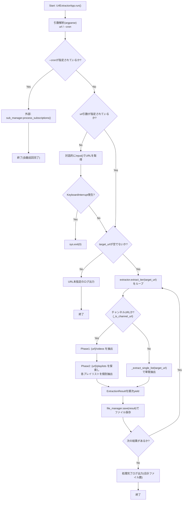
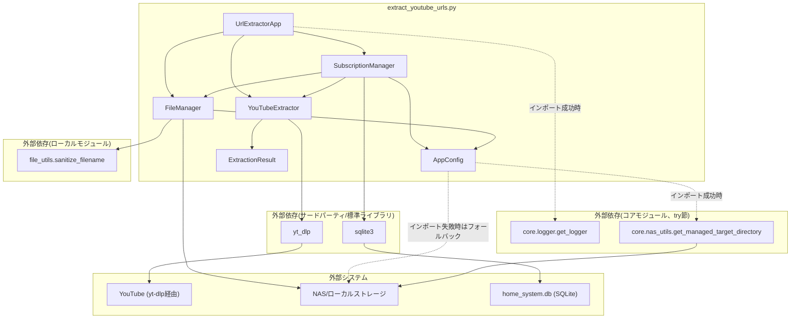

## 1. 解析メタ情報

| 項目 | 内容 |
| --- | --- |
| 対象ファイル | `extract_youtube_urls.py` |
| 言語 | Python |
| 解析対象 | 提供されたコードのみ |
| 推測・補完 | 一切なし |

## 関連ドキュメント

* [file_utils.md](./file_utils.md) — 本ファイルが利用する共通ファイル名サニタイズ処理（`sanitize_filename`）の実装元。
* [../MY_HOME_SYSTEM/nas_utils.md](../MY_HOME_SYSTEM/nas_utils.md) — 本ファイルがインポートを試みる`core.nas_utils.get_managed_target_directory`の実装候補（同名関数のシグネチャ・実装が確認できる）。
* [../MY_HOME_SYSTEM/logger.md](../MY_HOME_SYSTEM/logger.md) — 本ファイルがインポートを試みる`core.logger.get_logger`の実装候補に関する参考情報。
* [batch_download_discord.md](./batch_download_discord.md) — 同じDDDサブシステム内で`yt_dlp`と`file_utils.sanitize_filename`を併用する類似スクリプトとの比較参考。
* [newface_monitor.md](./newface_monitor.md) — 本ファイルの`PROJECT_ROOT`解決方式（`CURRENT_DIR.parent / "MY_HOME_SYSTEM"`）と`get_managed_target_directory`フォールバックの`fallback_dir_str`尊重パターンは、同じDDDサブシステム内で先行して修正済みのnewface_monitor.pyの同一パターンを踏襲したものである（コード内コメントで直接言及されている）。
* [test_extract_youtube_urls_paths.md](./test_extract_youtube_urls_paths.md) — 本ファイルの`PROJECT_ROOT`解決・`core.*`インポート可否・フォールバックスタブの引数尊重・`_verify_environment`のフォールバック検知・（Issue #123回帰テストとして追加された）`process_subscriptions`のNAS状態再評価タイミングを検証する回帰テストの解析ドキュメント。

## 2. ファイルの概要

* モジュールDocstring上「YouTube URL Extractor (Integrated with MY_HOME_SYSTEM)」と称される、指定されたYouTubeチャンネルやプレイリストから動画URLを抽出するスクリプトである。
* 根拠: [モジュールDocstring] (行番号: 4〜9 / 抜粋: "YouTube URL Extractor (Integrated with MY_HOME_SYSTEM)\n------------------------------------------------------\n指定されたYouTubeチャンネルやプレイリストから動画URLを抽出するスクリプト。\nMY_HOME_SYSTEMのエコシステム（ロガー、ディレクトリ構成）に準拠。")
* `PROJECT_ROOT`は`CURRENT_DIR.parent / "MY_HOME_SYSTEM"`（`newface_monitor.py`と同じ方式）として解決される。`core/`の実体は`MY_HOME_SYSTEM/core`配下にあり、DDDの単なる親ディレクトリ（リポジトリルート）を指す実装では`core.*`のインポートが常に失敗し、常にファイル内フォールバックスタブへ落ちてしまう不具合があったための修正である。
* 根拠: [PROJECT_ROOT定義とコメント] (行番号: 29〜34 / 抜粋: "# newface_monitor.py と同じ方式: core/ は develop/MY_HOME_SYSTEM/core に実在する\n# (develop/core ではない)。DDDの単なる親ディレクトリではImportErrorになり、\n# 常にローカルフォールバック用スタブへ落ちてしまっていた。\nCURRENT_DIR = Path(__file__).resolve().parent  # ~/develop/DDD\nPROJECT_ROOT = CURRENT_DIR.parent / "MY_HOME_SYSTEM"  # ~/develop/MY_HOME_SYSTEM")
* `MY_HOME_SYSTEM`の共通コア機能（`core.logger.get_logger`, `core.nas_utils.get_managed_target_directory`）のインポートを試み、失敗時（開発環境・単体実行時）はファイル内にフォールバック実装（標準`logging`ベースのロガー、`fallback_dir_str`引数を尊重するディレクトリ解決関数）を用意している。
* 根拠: [try-exceptブロック] (行番号: 38〜42 / 抜粋: "try:\n    from core.logger import get_logger\n    from core.nas_utils import get_managed_target_directory\n    logger = get_logger(__name__)\nexcept ImportError:")
* `SubscriptionManager._verify_environment`によるNASフォールバック検知は、出力先ベースディレクトリと`AppConfig.LOCAL_DIR_STR`（絶対パス）を`Path.resolve()`で正規化した上で完全一致比較する。フォールバック関数が想定外の相対パスを返す場合でも検知漏れが起きないようにするための修正であることがコメントで明記されている。
* 根拠: [_verify_environmentの比較処理とコメント] (行番号: 355〜359 / 抜粋: "# 絶対パスの包含チェック(旧実装)は、フォールバック関数がkwargsを無視して\n        # CWD相対の"./data"を返すバグと組み合わさると、絶対パスのLOCAL_DIR_STRが\n        # 短い相対パス文字列に決して含まれず、フォールバック状態を検知できなかった。\n        # パス正規化した上での比較にすることで、表記揺れに関わらず確実に検知する。\n        if current_base.resolve() == Path(AppConfig.LOCAL_DIR_STR).resolve():")
* `yt_dlp`を用いて対象URL（チャンネル・プレイリスト・単一動画）から動画URLを抽出する`YouTubeExtractor`、抽出結果をテキストファイルへ保存する`FileManager`、SQLite DBに登録されたチャンネルを定期巡回する`SubscriptionManager`、およびコマンドライン引数を解析してこれらを統括する`UrlExtractorApp`の4クラスで構成される。
* 根拠: [各クラス定義] (行番号: 122〜123, 275〜276, 326〜330, 449〜450 / 抜粋: "class YouTubeExtractor:\n    """YouTubeからURL情報を抽出するクラス。"""")
* チャンネルURLが指定された場合は`/videos`と`/playlists`の両方を自動探索し、通常動画一覧に加えて各プレイリストも個別に抽出する。
* 根拠: [extract_iterメソッド] (行番号: 219〜229 / 抜粋: "チャンネルURLの場合は `/videos` と `/playlists` を自動探索する。")
* `--cron`引数指定時は、SQLite DB（`home_system.db`）の`youtube_subscriptions`テーブルに登録されたアクティブなチャンネルURLを順次巡回する自動サブスクリプションモードで動作する。レート制限対策としてリクエスト間のジッター付き待機と、連続失敗時のサーキットブレーカーを備える。
* 根拠: [SubscriptionManager.process_subscriptionsとrunメソッド] (行番号: 379〜444, 466〜469 / 抜粋: "if args.cron:\n            self.sub_manager.process_subscriptions()")
* **(Issue #123バグ修正)** `SubscriptionManager`のサブスクリプション用DBパス(`db_path`)は、以前は`__init__`時点で一度だけ確定していたため、アプリ起動時にNASがフォールバック中で、その後`process_subscriptions()`実行時までにNASが復帰していると（autofsの再マウント遅延はこのリポジトリで既知の事象）、NAS状態の検証自体は最新状態で通過するのに`db_path`だけ古いローカルパスのまま取り残され、ローカルに空DBが新規作成されてサブスクリプションが1件も読み込まれない（無言のno-op）という不具合があった。現在は`process_subscriptions()`実行のたびに`AppConfig.get_output_base_dir()`を1回呼び出し、その同一時点の値から環境検証と`db_path`の導出を両方行うことで、評価タイミングのズレを解消している。
* 根拠: [process_subscriptions冒頭のコメントとdb_path導出] (行番号: 381〜396 / 抜粋: "# ★バグ修正(Issue #123): 以前はdb_pathを__init__時点のNAS状態で固定していたため、\n        # プロセス起動時にNASがフォールバック中で、その後この巡回開始時までにNASが復帰\n        ...\n        current_base = AppConfig.get_output_base_dir()\n        if not self._verify_environment(current_base):\n            return\n        db_path = current_base.parent / "home_system.db"")

## 3. 外部依存関係

### インポート一覧

| 名称 | 種類 | 用途 | 根拠 |
| --- | --- | --- | --- |
| `sys` | 標準ライブラリ | `sys.path`へのプロジェクトルート追加、`sys.exit`によるプロセス終了 | 根拠: [import文] (行番号: 11 / 抜粋: "import sys") |
| `argparse` | 標準ライブラリ | コマンドライン引数（URL、`--cron`フラグ）の解析 | 根拠: [import文] (行番号: 12 / 抜粋: "import argparse") |
| `re` | 標準ライブラリ | チャンネルURL判定用の正規表現(`_is_channel_url`) | 根拠: [import文] (行番号: 13 / 抜粋: "import re") |
| `time` | 標準ライブラリ | サブスクリプション巡回時のリクエスト間スリープ | 根拠: [import文] (行番号: 14 / 抜粋: "import time") |
| `random` | 標準ライブラリ | スリープ時間のランダムなジッター生成 | 根拠: [import文] (行番号: 15 / 抜粋: "import random") |
| `pathlib.Path` | 標準ライブラリ | パス操作全般 | 根拠: [import文] (行番号: 16 / 抜粋: "from pathlib import Path") |
| `dataclasses.dataclass`, `field` | 標準ライブラリ | `ExtractionResult`データクラスの定義 | 根拠: [import文] (行番号: 17 / 抜粋: "from dataclasses import dataclass, field") |
| `typing.List`, `Optional`, `Set`, `Iterator`, `Dict`, `Any` | 標準ライブラリ | 型ヒント全般 | 根拠: [import文] (行番号: 18 / 抜粋: "from typing import List, Optional, Set, Iterator, Dict, Any") |
| `sqlite3` | 標準ライブラリ | サブスクリプション管理用DB（`home_system.db`）への接続・クエリ実行 | 根拠: [import文] (行番号: 19 / 抜粋: "import sqlite3") |
| `contextlib.closing` | 標準ライブラリ | SQLite接続・カーソルの確実なクローズ（`with closing(...)`） | 根拠: [import文] (行番号: 20 / 抜粋: "from contextlib import closing") |
| `yt_dlp` | サードパーティ | YouTubeチャンネル/プレイリスト/動画のメタデータ抽出(`extract_info`) | 根拠: [import文] (行番号: 22 / 抜粋: "import yt_dlp") |
| `file_utils.sanitize_filename` (as `_shared_sanitize_filename`) | ローカルモジュール | 保存ファイル名のサニタイズ処理の委譲先 | 根拠: [import文] (行番号: 24 / 抜粋: "from file_utils import sanitize_filename as _shared_sanitize_filename") |
| `core.logger.get_logger` | 内部モジュール（オプショナル、try節） | ロガーインスタンスの取得。インポート失敗時はファイル内フォールバック実装（`logging.getLogger`ベース）を使用 | 根拠: [import文] (行番号: 39 / 抜粋: "from core.logger import get_logger") |
| `core.nas_utils.get_managed_target_directory` | 内部モジュール（オプショナル、try節） | NAS/ローカルの出力先ディレクトリの解決・管理。インポート失敗時はファイル内フォールバック実装（`fallback_dir_str`引数があればそれを、なければ`Path("./data")`を返す）を使用 | 根拠: [import文] (行番号: 40 / 抜粋: "from core.nas_utils import get_managed_target_directory") |

### ブラックボックスとなる外部要素

| 名称 | 理由 | 根拠 |
| --- | --- | --- |
| `core.logger.get_logger` | インポート成功時に実際に使用される実装（フォーマット、出力先、ログレベル等）の詳細が本ファイルからは不明。フォールバック実装のみがこのファイルから確認できる。 | 根拠: [import文とフォールバック定義] (行番号: 39, 44〜46 / 抜粋: "from core.logger import get_logger") |
| `core.nas_utils.get_managed_target_directory` | インポート成功時の実際の実装（NASマウント確認・自動修復ロジックの詳細）が不明。フォールバック実装は`fallback_dir_str`があればそれを、なければ`Path("./data")`を返す簡易実装のみがこのファイルから確認できる。 | 根拠: [import文とフォールバック定義] (行番号: 40, 48〜56 / 抜粋: "from core.nas_utils import get_managed_target_directory") |
| `yt_dlp.YoutubeDL` | `extract_info`が返す辞書の詳細な構造（`entries`, `url`, `webpage_url`, `id`, `title`, `channel`, `uploader`等のキーの完全な仕様）は`yt_dlp`本体の実装に依存し、本ファイルからは分からない。 | 根拠: [YoutubeDL利用箇所] (行番号: 179〜180 / 抜粋: "with yt_dlp.YoutubeDL(dict(AppConfig.YDL_OPTS)) as ydl:\n                info = ydl.extract_info(target_url, download=False)") |
| `file_utils.sanitize_filename` | サニタイズの具体的なルール（禁止文字、長さ制限等）は本ファイル単体からは不明。ただし関連ドキュメント`file_utils.md`に実装の解析結果が存在する。 | 根拠: [import文] (行番号: 24 / 抜粋: "from file_utils import sanitize_filename as _shared_sanitize_filename") |
| `home_system.db`（SQLite DB） | `youtube_subscriptions`テーブル以外にどのようなテーブル・データが存在するか、他プロセスとの共有スキーマの全体像は本ファイルからは不明（本ファイルは`CREATE TABLE IF NOT EXISTS`で自テーブルのみ関知）。 | 根拠: [_init_db] (行番号: 365〜377 / 抜粋: "CREATE TABLE IF NOT EXISTS youtube_subscriptions (") |

## 4. 主要要素の定義（関数 / エンドポイント / コンポーネント）

### `get_managed_target_directory` (フォールバック実装)

* **役割**: `core.nas_utils`のインポートに失敗した場合に使用される簡易フォールバック関数。呼び出し元(`get_output_base_dir`)が渡す`fallback_dir_str`（`BASE_DIR/'data'`の絶対パス）があればそれを、なければカレントディレクトリ相対の`./data`を返す。カレントディレクトリ相対パスを無条件に返すと実行時のカレントディレクトリ次第で保存先・DBパスが毎回変わってしまう不具合につながるため、絶対パスの`fallback_dir_str`を優先する設計であることがコメントで明記されている（`newface_monitor.py`で修正済みの同一バグの踏襲）。
* 根拠: [関数定義とコメント] (行番号: 48〜56 / 抜粋: "def get_managed_target_directory(*args, **kwargs) -> Path:\n        # 呼び出し元(get_output_base_dir)はfallback_dir_str(BASE_DIR/'data'の絶対パス)を\n        # 渡してくる想定。これを無視してカレントディレクトリ相対の"./data"を返すと、\n        # 実行時のカレントディレクトリ次第で保存先・DBパスが毎回変わってしまう\n        # (newface_monitor.pyで修正済みの同一バグ)。")

* **引数/リクエスト**: `*args`, `**kwargs`（本フォールバック実装では`kwargs.get("fallback_dir_str")`のみを参照する）
* 根拠: [引数定義と参照箇所] (行番号: 48, 53 / 抜粋: "fallback_dir_str = kwargs.get("fallback_dir_str")")

* **戻り値/レスポンス**: `Path`（`fallback_dir_str`が渡されていればそれを`Path`化した値、なければ`Path("./data")`）
* 根拠: [各return文] (行番号: 54〜56 / 抜粋: "if fallback_dir_str:\n            return Path(fallback_dir_str)\n        return Path("./data")")

* **副作用**: なし
* **エラーハンドリング**: なし

### `AppConfig`

* **役割**: 出力先ディレクトリ、NASパス、サブディレクトリ名、レート制限対策のスリープ範囲、`yt_dlp`オプションなど、アプリケーション全体の設定値を保持する定数クラス（インスタンス化不要、クラス変数と`classmethod`のみで構成）。
* 根拠: [クラス定義とDocstring] (行番号: 61〜62 / 抜粋: "class AppConfig:\n    """アプリケーション設定を保持する定数クラス。"""")

* **引数/リクエスト**: なし（クラス変数として静的に定義）
* 根拠: [クラス変数定義群] (行番号: 64〜83 / 抜粋: "BASE_DIR: Path = CURRENT_DIR")

* **戻り値/レスポンス**: 該当なし
* **副作用**: なし（クラス変数の定義自体には外部通信・ファイルI/O等の副作用はない）
* **エラーハンドリング**: なし

### `AppConfig.get_output_base_dir`

* **役割**: NASアクセスを検証・修復し、動的に出力先ベースディレクトリを解決するクラスメソッド。クラスロード時ではなく実際のファイル処理が必要になったタイミング（遅延評価）で呼び出す設計。
* 根拠: [メソッド定義とDocstring] (行番号: 85〜94 / 抜粋: "def get_output_base_dir(cls) -> Path:\n        """NASアクセスを検証・修復し、動的にベースディレクトリを解決する（遅延評価）。")

* **引数/リクエスト**: なし（`cls`のみ、`@classmethod`）
* 根拠: [デコレータと引数] (行番号: 85〜86 / 抜粋: "@classmethod\n    def get_output_base_dir(cls) -> Path:")

* **戻り値/レスポンス**: `Path`（利用可能なディレクトリパス）
* 根拠: [Docstringと戻り値] (行番号: 92〜95 / 抜粋: "Returns:\n            Path: 利用可能なディレクトリパス\n        """\n        return get_managed_target_directory(")

* **副作用**: `get_managed_target_directory`（インポート成功時は`core.nas_utils`、失敗時はフォールバック実装）の呼び出し。
* 根拠: [呼び出し] (行番号: 95〜99 / 抜粋: "return get_managed_target_directory(\n            nas_dir_str=cls.NAS_DIR_STR,\n            fallback_dir_str=cls.LOCAL_DIR_STR,\n            mount_point=cls.MOUNT_POINT\n        )")

* **エラーハンドリング**: なし（本メソッド自体には例外処理なし。委譲先の実装に依存）

### `ExtractionResult`

* **役割**: 1件の抽出結果（動画リスト/プレイリストのタイトル、URLリスト、抽出元URL、チャンネル名、プレイリストか否か）を保持するデータクラス。
* 根拠: [クラス定義とDocstring] (行番号: 102〜112 / 抜粋: "@dataclass\nclass ExtractionResult:\n    """抽出結果を格納するデータクラス。")

* **引数/リクエスト**: `title: str`, `urls: List[str]`, `source_url: str`, `channel_name: str = "unknown_channel"`, `is_playlist: bool = False`
* 根拠: [フィールド定義] (行番号: 113〜117 / 抜粋: "title: str\n    urls: List[str]\n    source_url: str\n    channel_name: str = "unknown_channel"\n    is_playlist: bool = False")

* **戻り値/レスポンス**: 該当なし（データクラスのフィールド定義自体）
* **副作用**: なし
* **エラーハンドリング**: なし

### `YouTubeExtractor._normalize_url`

* **役割**: `yt_dlp`のエントリ辞書から正規化されたYouTube動画URLを生成する静的メソッド。`video_id`があれば`watch?v=`形式のURLを優先的に構築し、なければ既存の`url`/`webpage_url`をYouTubeドメインかどうか判定した上で採用する。
* 根拠: [メソッド定義とDocstring] (行番号: 125〜143 / 抜粋: "def _normalize_url(entry: Dict[str, Any]) -> Optional[str]:\n        """エントリ情報から正規化されたYouTube URLを生成する。")

* **引数/リクエスト**: `entry: Dict[str, Any]`（`yt-dlp`から取得したエントリ辞書）
* 根拠: [引数定義とDocstring] (行番号: 126, 129〜130 / 抜粋: "entry (Dict[str, Any]): yt-dlp から取得したエントリ辞書。")

* **戻り値/レスポンス**: `Optional[str]`（正規化されたURL。生成できない場合は`None`）
* 根拠: [Docstringと各return] (行番号: 132〜133, 139, 142, 143 / 抜粋: "Returns:\n            Optional[str]: 正規化されたURL。生成できない場合は None。")

* **副作用**: なし（純粋な文字列生成処理）
* **エラーハンドリング**: なし（想定外の入力に対しては`None`を返すのみ）

### `YouTubeExtractor._is_channel_url`

* **役割**: 指定URLが末尾クエリを除去・末尾スラッシュを除去した上で、チャンネルトップページ（`@handle`, `channel/`, `c/`, `user/`形式）のURLパターンに一致するかを正規表現で判定するインスタンスメソッド。
* 根拠: [メソッド定義とDocstring] (行番号: 145〜155 / 抜粋: "def _is_channel_url(self, url: str) -> bool:\n        """指定されたURLがチャンネルトップページのURLかを判定する。")

* **引数/リクエスト**: `url: str`
* 根拠: [引数定義とDocstring] (行番号: 145, 148〜149 / 抜粋: "url (str): 判定対象のURL。")

* **戻り値/レスポンス**: `bool`（チャンネルURLであれば`True`）
* 根拠: [Docstringと戻り値] (行番号: 151〜152, 155 / 抜粋: "Returns:\n            bool: チャンネルURLであれば True。")

* **副作用**: なし
* **エラーハンドリング**: なし

### `YouTubeExtractor._extract_single_list`

* **役割**: 単一のURL（動画リストまたはプレイリスト）を`yt_dlp`で解析し、含まれる全動画URLを正規化・重複排除した`ExtractionResult`を構築するインスタンスメソッド。`AppConfig.YDL_OPTS`は呼び出し間の状態汚染を避けるためコピーして渡される。
* 根拠: [メソッド定義とコメント] (行番号: 157〜179 / 抜粋: "def _extract_single_list(self, target_url: str, force_title: str = "") -> Optional[ExtractionResult]:")

* **引数/リクエスト**: `target_url: str`（対象のURL）, `force_title: str = ""`（タイトルを強制指定する場合に使用）
* 根拠: [引数定義とDocstring] (行番号: 157, 160〜162 / 抜粋: "target_url (str): 対象のURL。\n            force_title (str, optional): タイトルを強制指定する場合に使用。")

* **戻り値/レスポンス**: `Optional[ExtractionResult]`（抽出結果オブジェクト。失敗時（`yt_dlp`が情報を返さない、例外発生、URLが1件も抽出できない）は`None`）
* 根拠: [Docstringと各return] (行番号: 164〜165, 181〜182, 203〜206, 209〜210 / 抜粋: "Returns:\n            Optional[ExtractionResult]: 抽出結果オブジェクト。失敗時は None。")

* **副作用**: `yt_dlp.YoutubeDL.extract_info`によるネットワークアクセス、進捗・エラーのログ出力。
* 根拠: [extract_info呼び出しとログ] (行番号: 167, 180 / 抜粋: "logger.info(f"🔍 解析開始: {target_url}")", "info = ydl.extract_info(target_url, download=False)")

* **エラーハンドリング**: `yt_dlp`実行時の例外を`except Exception`で捕捉し、スタックトレース付き(`exc_info=True`)でエラーログを出力して`None`を返す。抽出結果のURLが0件の場合も`None`を返す。
* 根拠: [try-exceptブロック] (行番号: 203〜206 / 抜粋: "except Exception:\n            # Error Handling: スタックトレースを含めてログ出力\n            logger.error(f"❌ 抽出失敗 ({target_url})", exc_info=True)\n            return None")

### `YouTubeExtractor.extract_iter`

* **役割**: URLの種類に応じて抽出方式を切り替えるイテレータメソッド。チャンネルURLの場合は`/videos`（全動画）と`/playlists`（各プレイリスト）を自動探索して複数の`ExtractionResult`を`yield`し、それ以外（プレイリストURLや単一動画URL）の場合は単発で`_extract_single_list`を呼び出す。
* 根拠: [メソッド定義とDocstring] (行番号: 219〜229 / 抜粋: "def extract_iter(self, target_url: str) -> Iterator[ExtractionResult]:\n        """URLの種類に応じて再帰的または単発で抽出を行うイテレータ。")

* **引数/リクエスト**: `target_url: str`（開始URL）
* 根拠: [引数定義とDocstring] (行番号: 219, 224〜225 / 抜粋: "target_url (str): 開始URL。")

* **戻り値/レスポンス**: `Iterator[ExtractionResult]`（抽出結果を順次`yield`）
* 根拠: [Docstringと戻り値ヒント] (行番号: 219, 227〜228 / 抜粋: "Yields:\n            Iterator[ExtractionResult]: 抽出結果を順次返す。")

* **副作用**: チャンネルURLの場合、`/videos`・`/playlists`双方への`yt_dlp`アクセス（ネットワーク通信）、進捗ログ出力。
* 根拠: [チャンネル探索処理] (行番号: 230〜266 / 抜粋: "if self._is_channel_url(target_url):\n            logger.info("ℹ️ チャンネルURLを検出。詳細スキャンを開始します。")")

* **エラーハンドリング**: プレイリスト一覧取得時（`/playlists`）の例外を`except Exception`で捕捉し、スタックトレース付きでエラーログを出力（処理は中断されるがメソッド自体は正常終了）。個々の`_extract_single_list`呼び出しの失敗（`None`が返る場合）は単に`yield`をスキップする。
* 根拠: [try-exceptブロック] (行番号: 265〜266 / 抜粋: "except Exception:\n                logger.error("❌ プレイリスト一覧の取得に失敗しました", exc_info=True)")

### `FileManager._sanitize_filename`

* **役割**: 外部モジュール`file_utils.sanitize_filename`へファイル名のサニタイズ処理を委譲する静的メソッド。
* 根拠: [メソッド定義とDocstring] (行番号: 278〜288 / 抜粋: "def _sanitize_filename(filename: str) -> str:\n        """ファイル名として使用できない文字を置換する。")

* **引数/リクエスト**: `filename: str`（元の文字列）
* 根拠: [引数定義とDocstring] (行番号: 279, 282〜283 / 抜粋: "filename (str): 元の文字列。")

* **戻り値/レスポンス**: `str`（安全なファイル名文字列）
* 根拠: [Docstringと戻り値] (行番号: 285〜286, 288 / 抜粋: "Returns:\n            str: 安全なファイル名文字列。\n        """\n        return _shared_sanitize_filename(filename)")

* **副作用**: なし
* **エラーハンドリング**: なし（委譲先の例外処理には依存）

### `FileManager.save`

* **役割**: `ExtractionResult`の抽出結果（チャンネル名・タイトルをサニタイズしたファイル名）をテキストファイルへ1行1URL形式で保存するインスタンスメソッド。保存先ディレクトリは`AppConfig.get_output_base_dir()`を遅延評価で取得する。
* 根拠: [メソッド定義とDocstring] (行番号: 290〜298 / 抜粋: "def save(self, result: ExtractionResult) -> bool:\n        """抽出結果をテキストファイルに保存する。")

* **引数/リクエスト**: `result: ExtractionResult`（保存対象の抽出データ）
* 根拠: [引数定義とDocstring] (行番号: 290, 293〜294 / 抜粋: "result (ExtractionResult): 保存対象の抽出データ。")

* **戻り値/レスポンス**: `bool`（保存に成功した場合`True`。ディレクトリ作成失敗時・ファイル書き込み失敗時は`False`）
* 根拠: [Docstringと各return] (行番号: 296〜297, 305, 321, 324 / 抜粋: "Returns:\n            bool: 保存に成功した場合は True。")

* **副作用**: 保存先ディレクトリの作成(`mkdir`)、テキストファイルへの書き込み(`open(..., "w")`)、成功/失敗・上書き時のログ出力。
* 根拠: [ディレクトリ作成とファイル書き込み] (行番号: 301〜302, 316〜319 / 抜粋: "target_dir.mkdir(parents=True, exist_ok=True)", "with output_path.open("w", encoding="utf-8") as f:\n                for url in result.urls:\n                    f.write(url + "\\n")")

* **エラーハンドリング**: ディレクトリ作成時の`OSError`を捕捉してエラーログを出力し`False`を返す。ファイル書き込み時の`IOError`を捕捉してエラーログを出力し`False`を返す。出力先ファイルが既に存在する場合は警告ログを出力するのみで上書きを継続する。
* 根拠: [try-exceptブロック] (行番号: 301〜305, 316〜324 / 抜粋: "except OSError as e:\n            logger.error(f"❌ ディレクトリ作成失敗: {target_dir}", exc_info=True)\n            return False")

### `SubscriptionManager.__init__`

* **役割**: `YouTubeExtractor`と`FileManager`のインスタンスを保持するコンストラクタ。**(Issue #123バグ修正)** 以前はここでサブスクリプション管理用SQLite DB（`home_system.db`）のパスを`self.db_path`として一度だけ決定していたが、`process_subscriptions()`実行のたびに評価し直す方式に変更したため、`db_path`はインスタンス属性として持たない（詳細は`process_subscriptions`の項を参照）。
* 根拠: [クラス定義とDocstringおよび__init__] (行番号: 326〜337 / 抜粋: "class SubscriptionManager:\n    """\n    定期巡回（サブスクリプション）を管理するクラス。\n    SSOTポリシーに基づき、SQLite DBを用いて状態を管理する。\n    """")

* **引数/リクエスト**: `extractor: YouTubeExtractor`, `file_manager: FileManager`
* 根拠: [引数定義] (行番号: 332 / 抜粋: "def __init__(self, extractor: YouTubeExtractor, file_manager: FileManager):")

* **戻り値/レスポンス**: 該当なし
* **副作用**: `self.extractor`, `self.file_manager`への属性代入のみ。（Issue #123修正前は`self.db_path`決定時に`AppConfig.get_output_base_dir()`の呼び出しがここにあったが、現在は存在しない。）
* 根拠: [属性代入とコメント] (行番号: 333〜337 / 抜粋: "self.extractor = extractor\n        self.file_manager = file_manager\n        # ★バグ修正(Issue #123): db_pathは以前ここ(__init__時点)で一度だけ確定していたが、\n        # process_subscriptions()実行のたびに評価し直す方式に変更したため、インスタンス\n        # 属性としては持たない(詳細はprocess_subscriptions()のコメント参照)。")

* **エラーハンドリング**: なし

### `SubscriptionManager._verify_environment`

* **役割**: 出力先ベースディレクトリが`AppConfig.LOCAL_DIR_STR`（ローカルフォールバック用パス）と一致するか（＝NASが正常にマウントされているか）を検証するインスタンスメソッド。`Path.resolve()`によるパス正規化を行った上で完全一致比較する。フォールバック関数が想定外の相対パスを返した場合でも検知漏れが起きないよう、絶対パスの文字列包含チェック(旧実装)ではなく正規化パスの完全一致比較を用いる設計であることがコメントで明記されている。**(Issue #123バグ修正)** 引数`current_base`が追加され、省略時のみ内部で`AppConfig.get_output_base_dir()`を呼び出す。`get_output_base_dir()`はマウント確認・自己修復・障害通知を伴う重い処理のため、呼び出し元（`process_subscriptions`）が既に取得済みの値を渡して使い回すことで、環境検証と`db_path`導出を同一時点のNAS状態から行えるようにするための変更である。
* 根拠: [メソッド定義とDocstringおよび比較処理のコメント] (行番号: 339〜359 / 抜粋: "def _verify_environment(self, current_base: Optional[Path] = None) -> bool:\n        """\n        NASのマウント状態（フォールバック中ではないか）を検証する。")

* **引数/リクエスト**: `current_base: Optional[Path] = None`（省略時は`AppConfig.get_output_base_dir()`を呼び出して取得する）
* 根拠: [引数定義とDocstring] (行番号: 339, 343〜348 / 抜粋: "def _verify_environment(self, current_base: Optional[Path] = None) -> bool:", "current_base (Optional[Path]): 検証対象のベースディレクトリ。省略時は\n                AppConfig.get_output_base_dir()を呼び出して取得する。")

* **戻り値/レスポンス**: `bool`（正常なNAS環境であれば`True`、ローカルフォールバック中であれば`False`）
* 根拠: [Docstringと各return] (行番号: 350〜352, 363 / 抜粋: "Returns:\n            bool: 正常なNAS環境であれば True、ローカルフォールバック中であれば False\n        """)

* **副作用**: `current_base`省略時のみ`AppConfig.get_output_base_dir()`呼び出し（間接的にNASアクセス確認等の副作用を誘発しうる）。フォールバック検知時のエラーログ出力（2行）。
* 根拠: [current_base取得とログ出力] (行番号: 353〜354, 360〜361 / 抜粋: "if current_base is None:\n            current_base = AppConfig.get_output_base_dir()", "logger.error("🚨 NASがアンマウント状態(ローカルフォールバック中)を検知しました。")\n            logger.error("データの不整合・上書きを防ぐため、サブスクリプション処理をFail-Softで中断します。")")

* **エラーハンドリング**: なし

### `SubscriptionManager._init_db`

* **役割**: サブスクリプション管理用テーブル(`youtube_subscriptions`)が存在しない場合に作成するインスタンスメソッド。`id`, `channel_url`（一意制約）, `is_active`, `added_at`の各カラムを持つ。**(Issue #123バグ修正)** 以前は`self.db_path`を参照していたが、呼び出し元(`process_subscriptions`)から渡された`db_path`引数を使うように変更された。
* 根拠: [メソッド定義とDocstring] (行番号: 365〜377 / 抜粋: "def _init_db(self, db_path: Path) -> None:\n        """サブスクリプション管理用のテーブルが存在しない場合は作成する。"""")

* **引数/リクエスト**: `db_path: Path`（接続先のDBファイルパス。呼び出し元が同一時点で解決した値を渡す）
* 根拠: [引数定義] (行番号: 365 / 抜粋: "def _init_db(self, db_path: Path) -> None:")

* **戻り値/レスポンス**: `None`
* 根拠: [戻り値ヒント] (行番号: 365 / 抜粋: "def _init_db(self, db_path: Path) -> None:")

* **副作用**: SQLite DB接続、テーブル作成用DDL実行(`CREATE TABLE IF NOT EXISTS`)、コミット。
* 根拠: [DDL実行] (行番号: 367〜377 / 抜粋: "with closing(sqlite3.connect(db_path)) as conn:\n            with closing(conn.cursor()) as cur:\n                cur.execute(\"\"\"\n                    CREATE TABLE IF NOT EXISTS youtube_subscriptions (")

* **エラーハンドリング**: なし（本メソッド自体には例外処理なし。呼び出し元の`process_subscriptions`が`sqlite3.Error`を捕捉する）

### `SubscriptionManager.process_subscriptions`

* **役割**: DBから読み込んだアクティブなチャンネルURLを順次巡回し、`extractor.extract_iter`で抽出→`file_manager.save`で保存するメイン処理。環境検証（NASフォールバック中でないか）、DB初期化、リクエスト間のジッター付き待機、連続失敗時のサーキットブレーカー（`CONSECUTIVE_FAILURE_THRESHOLD`回で巡回を中断）を含む。**(Issue #123バグ修正)** 以前は`db_path`を`__init__`時点のNAS状態で固定していたため、アプリ起動時にNASがフォールバック中で、その後この巡回開始時までにNASが復帰していると（autofsの再マウント遅延はこのリポジトリで既知の事象）、ここでの検証自体は最新のNAS状態を見て通過するのに`db_path`だけ古いローカルパスのまま取り残されていた。結果、ローカルに空DBが新規作成されてSELECTが0件になり「アクティブなサブスクリプションが登録されていません」で無言のno-op終了し、巡回1回分が静かにスキップされてゴミの空`DDD/home_system.db`が残る不具合があった。現在は`AppConfig.get_output_base_dir()`の呼び出し結果を1回だけ取得し（呼び出し回数を1回に抑えるためでもある）、環境検証と`db_path`導出の両方をその同一時点の値から行う。
* 根拠: [メソッド定義とDocstringおよびIssue #123修正コメント] (行番号: 379〜396 / 抜粋: "def process_subscriptions(self) -> None:\n        """登録されたチャンネルリストをDBから読み込み、順次抽出を実行する。"""\n        # 1. 環境検証（データロスト防止の防波堤）\n        # ★バグ修正(Issue #123): 以前はdb_pathを__init__時点のNAS状態で固定していたため、\n        ...\n        current_base = AppConfig.get_output_base_dir()\n        if not self._verify_environment(current_base):\n            return\n        db_path = current_base.parent / "home_system.db"")

* **引数/リクエスト**: なし（`self`のみ）
* **戻り値/レスポンス**: `None`
* 根拠: [戻り値ヒント] (行番号: 379 / 抜粋: "def process_subscriptions(self) -> None:")

* **副作用**: `AppConfig.get_output_base_dir()`の呼び出し（NASアクセス確認等の副作用を誘発しうる）、環境検証・DB初期化・DBからのSELECT、URL巡回ごとの`time.sleep`、`extractor.extract_iter`によるネットワークアクセス、`file_manager.save`によるファイル書き込み、各段階でのログ出力。
* 根拠: [メイン処理フロー] (行番号: 393, 423 / 抜粋: "current_base = AppConfig.get_output_base_dir()", "logger.info(f"🔄 サブスクリプション巡回開始: {len(urls)} 件 (Source: SQLite DB)")")

* **エラーハンドリング**: 環境検証失敗時は即座に`return`。DB初期化(`sqlite3.Error`)・DB読み込み(`sqlite3.Error`)失敗時はエラーログを出力して`return`。アクティブなURLが0件の場合はデバッグログを出力して`return`。連続失敗数が`CONSECUTIVE_FAILURE_THRESHOLD`（既定3）に達した場合はエラーログを出力してループを`break`で中断する。
* 根拠: [各種ガード節とbreak] (行番号: 394〜395, 402〜404, 415〜417, 419〜421, 442〜444 / 抜粋: "if consecutive_failures >= AppConfig.CONSECUTIVE_FAILURE_THRESHOLD:\n                    logger.error("複数回連続で抽出に失敗したため巡回を中断します — レート制限の可能性があります")\n                    break")

### `UrlExtractorApp.__init__`

* **役割**: `YouTubeExtractor`, `FileManager`, `SubscriptionManager`の各インスタンスを生成・保持するコンストラクタ。
* 根拠: [メソッド定義] (行番号: 452〜455 / 抜粋: "def __init__(self):\n        self.extractor = YouTubeExtractor()\n        self.file_manager = FileManager()\n        self.sub_manager = SubscriptionManager(self.extractor, self.file_manager)")

* **引数/リクエスト**: なし（`self`のみ）
* **戻り値/レスポンス**: 該当なし
* **副作用**: 3つのインスタンス属性への代入。**(Issue #123バグ修正)** 以前は`SubscriptionManager.__init__`がここでNASアクセス確認（`db_path`決定）を間接的に誘発していたが、修正後はその副作用がなくなり、本メソッドの副作用はインスタンス生成のみになった。
* 根拠: [属性代入] (行番号: 453〜455 / 抜粋: "self.extractor = YouTubeExtractor()\n        self.file_manager = FileManager()\n        self.sub_manager = SubscriptionManager(self.extractor, self.file_manager)")

* **エラーハンドリング**: なし

### `UrlExtractorApp.run`

* **役割**: コマンドライン引数（`url`位置引数、`--cron`フラグ）を解析し、`--cron`指定時はサブスクリプション巡回、それ以外はURL引数（未指定時は対話的に`input()`で取得）を`extract_iter`で処理・保存するエントリーポイントメソッド。
* 根拠: [メソッド定義とDocstring] (行番号: 457〜458 / 抜粋: "def run(self) -> None:\n        """コマンドライン引数を解析し、メイン処理を実行する。"""")

* **引数/リクエスト**: なし（`self`のみ、`sys.argv`経由で`argparse`が解析）
* 根拠: [argparse定義] (行番号: 461〜464 / 抜粋: "parser = argparse.ArgumentParser(description="Extract YouTube URLs from channels or playlists.")\n        parser.add_argument("url", nargs="?", help="Target YouTube URL")\n        parser.add_argument("--cron", action="store_true", help="Auto-subscription mode")")

* **戻り値/レスポンス**: `None`
* 根拠: [戻り値ヒント] (行番号: 457 / 抜粋: "def run(self) -> None:")

* **副作用**: 起動・完了ログ出力、`--cron`時は`sub_manager.process_subscriptions()`呼び出し、URL未指定時の対話的`input()`呼び出し、`extractor.extract_iter`によるネットワークアクセスと`file_manager.save`によるファイル保存。
* 根拠: [メイン処理フロー] (行番号: 459, 466〜469, 471〜489 / 抜粋: "logger.info("=== YouTube URL Extractor (v3.1.0) Started ===")")

* **エラーハンドリング**: 対話的URL入力時の`KeyboardInterrupt`を捕捉し、情報ログを出力して`sys.exit(0)`で正常終了する。それ以外の例外処理はこのメソッド自体にはない。
* 根拠: [try-exceptブロック] (行番号: 474〜479 / 抜粋: "except KeyboardInterrupt:\n                logger.info("ユーザーにより中断されました")\n                sys.exit(0)")

## 5. 処理フロー図

## 6. 依存関係図

## 7. 次のステップ（リバースエンジニアリングの提案）

| 優先度 | ファイル名(推測可) | 理由 | 根拠 |
| --- | --- | --- | --- |
| 高 | `core/nas_utils.py` | `get_managed_target_directory`の実際の実装（NASマウント確認・自動修復ロジック）が、フォールバック実装（`fallback_dir_str`があればそれを返すのみ）とどう異なるかを確認する必要があるため。 | 根拠: [import文] (行番号: 40 / 抜粋: "from core.nas_utils import get_managed_target_directory") |
| 中 | `core/logger.py` | `get_logger`の実際の実装（出力フォーマット、ログレベル、出力先）を確認するため。 | 根拠: [import文] (行番号: 39 / 抜粋: "from core.logger import get_logger") |
| 中 | `file_utils.py` | `sanitize_filename`の具体的なサニタイズルールを確認するため（既に`docs/specifications/DDD/file_utils.md`として解析済み）。 | 根拠: [import文] (行番号: 24 / 抜粋: "from file_utils import sanitize_filename as _shared_sanitize_filename") |
| 低 | `home_system.db`を書き込む他のプロセス/スクリプト | `youtube_subscriptions`テーブルへどのようにチャンネルURLが登録・アクティブ化されるか（本ファイルはSELECTのみで、INSERT/UPDATEを行う箇所が存在しない）を確認するため。 | 根拠: [process_subscriptions] (行番号: 412 / 抜粋: "cur.execute("SELECT channel_url FROM youtube_subscriptions WHERE is_active = 1")") |

## 8. 保守上の注意点

* **フォールバック実装と本番実装の差異リスク**: `core.logger`, `core.nas_utils`のインポートに失敗した場合、ファイル内の簡易フォールバック実装に切り替わる。`get_managed_target_directory`のフォールバック実装は`fallback_dir_str`（`AppConfig.LOCAL_DIR_STR`、`BASE_DIR/'data'`の絶対パス）を尊重するよう修正済みだが、本番環境で意図せずインポートが失敗した場合、依然としてNASではなくローカルディスクにデータが保存される点は変わらない。
* 根拠: [フォールバック定義] (行番号: 42〜56 / 抜粋: "except ImportError:\n    # 開発環境や単体実行時のフォールバック")
* **`youtube_subscriptions`テーブルへの書き込み手段が本ファイルに存在しない**: `_init_db`はテーブル作成のみを行い、`process_subscriptions`はSELECTのみを実行する。チャンネルURLの登録・有効化（INSERT/UPDATE）を行う手段が本ファイル内に見当たらず、外部プロセスまたは手動でのDB操作が前提と見られる。
* 根拠: [process_subscriptions] (行番号: 412 / 抜粋: "cur.execute("SELECT channel_url FROM youtube_subscriptions WHERE is_active = 1")")
* **(Issue #123バグ修正の背景)** `SubscriptionManager`は`db_path`をインスタンス属性として保持せず、`process_subscriptions()`実行のたびに`AppConfig.get_output_base_dir()`から再導出する設計に変更された。これは、NASのマウント状態がプロセスの生存期間中に変化しうる（autofsの再マウント遅延等）ことを前提とした設計であり、今後同様に「起動時に一度だけ解決した値」をNAS関連の状態判定と組み合わせて使う実装を追加する際は、両者の評価タイミングを揃える（同一の`get_output_base_dir()`呼び出し結果を使い回す）よう注意すること。
* 根拠: [process_subscriptions冒頭のコメント] (行番号: 382〜392 / 抜粋: "# ★バグ修正(Issue #123): 以前はdb_pathを__init__時点のNAS状態で固定していたため、\n        # プロセス起動時にNASがフォールバック中で、その後この巡回開始時までにNASが復帰\n        # していると(autofsの再マウント遅延はこのリポジトリで既知の事象)、ここでの検証\n        # 自体は最新のNAS状態を見て通過するのにdb_pathだけ古いローカルパスのまま取り\n        # 残されていた。")
* **YDL_OPTS共有辞書のコピー渡し**: `yt_dlp.YoutubeDL.__init__`が渡された`params`辞書を直接書き換えるため、`AppConfig.YDL_OPTS`（クラス属性の共有辞書）をそのまま渡すと繰り返し呼び出し時に状態汚染が起きるリスクがあり、コード内コメントで明示的に`dict(AppConfig.YDL_OPTS)`によるコピー渡しが行われている。
* 根拠: [コメントとコピー渡し] (行番号: 174〜179, 249〜250 / 抜粋: "# yt_dlp.YoutubeDL.__init__は渡されたparams辞書を直接書き換える\n            # （実測でjs_runtimes/http_headers/outtmpl等のキーが追加される）ため、")
* **既存ファイルの無警告上書き**: `FileManager.save`は出力先に同名ファイルが既存の場合、警告ログを出力するのみで上書きを継続する。
* 根拠: [上書きチェック] (行番号: 313〜314 / 抜粋: "if output_path.exists():\n            logger.warning(f"⚠️ 上書き: {filename} は既に存在します（チャンネル名/タイトルが重複している可能性）")")
* **チャンネルURL探索の暗黙的な仕様依存**: `/videos`・`/playlists`のURLパス付与がYouTube側のURL構造に依存しており、YouTube側の仕様変更で機能しなくなるリスクがある。
* 根拠: [extract_iter内のURL構築] (行番号: 232, 235, 251 / 抜粋: "base_url = target_url.split('?')[0].rstrip('/')")
* **`_is_channel_url`の判定パターンの限定性**: 正規表現は`@handle`, `channel/`, `c/`, `user/`の4形式のみに対応しており、これら以外のURL形式（例: カスタムショートURL等）は判定対象外となる可能性がある。
* 根拠: [正規表現定義] (行番号: 155 / 抜粋: "return bool(re.search(r"youtube\\.com/(@[\\w\\-\\.]+|channel/[\\w\\-]+|c/[\\w\\-]+|user/[\\w\\-]+)$", clean_url))")

## 9. 不明事項一覧

| 項目 | 理由 | 必要なファイル |
| --- | --- | --- |
| `core.logger.get_logger`の実際の実装 | ログの出力フォーマット、出力先、ログレベルの詳細が本ファイルからは不明（フォールバック実装のみ確認可能）。 | `core/logger.py` |
| `core.nas_utils.get_managed_target_directory`の実際の実装 | NASマウント確認・自動修復ロジックの詳細な挙動が不明（フォールバック実装は`fallback_dir_str`引数を尊重する簡易実装のみ）。 | `core/nas_utils.py` |
| `youtube_subscriptions`テーブルへのレコード登録手段 | 本ファイルはSELECT（読み取り専用）のみを行っており、チャンネルURLがどのプロセス・手段で登録・有効化(`is_active=1`)されるかが不明。 | DB登録を行う別スクリプトまたは運用手順書（リポジトリ全体を`youtube_subscriptions`という文字列で`grep`検索したが、`INSERT`または`UPDATE`によりこのテーブルへ書き込む箇所は本ファイル自身にも他のどのファイルにも見つからず、解消不可。`MY_HOME_SYSTEM/current_schema.sql:327-332`に同名テーブルのスキーマ定義自体は存在するが、これはDBスキーマのダンプであり登録処理の実装ではない） |
| `yt_dlp.extract_info`が返す辞書の完全な構造 | `entries`, `channel`, `uploader`等の各キーが常に存在するか、`yt_dlp`のバージョンによって変化しうるかは本ファイルのコードからは分からない。 | `yt_dlp`本体のソースまたは公式ドキュメント（コード外。実行環境で`import yt_dlp`を試みたところ`ModuleNotFoundError`であり、リポジトリ内にも`yt_dlp`パッケージ自体のソースは存在せず、解消不可） |
| 本ファイルの実行方法（cron設定等） | `--cron`引数での自動巡回モードが存在するが、実際にどのスケジュール（cron、systemdタイマー等）で起動されるかは本ファイルからは不明。 | デプロイ設定・cron定義ファイル等（リポジトリ全体を`cron`/`systemd`/`docker-compose`関連のファイル名・記述で検索したが、本ファイルの実行スケジュールを定義する設定ファイルはリポジトリ内に見つからず、解消不可） |

## 相互参照による補足情報

| 元の不明事項 | 判明した内容 | 参照元ドキュメント |
| --- | --- | --- |
| `sanitize_filename`の詳細ルール | 関連ドキュメント（`file_utils.md`）の解析結果によれば、`sanitize_filename(filename, max_length=200)`は禁止文字（`\ / * ? : " < > |`）をアンダースコアに置換し、前後の空白を除去したうえで`max_length`（既定200文字）まで切り詰め、さらに末尾のピリオド・空白を除去する実装であることが分かった。これはあくまで別ファイルの解析結果に基づく補足情報である。 | [file_utils.md](./file_utils.md) |
| `core.logger.get_logger`の実際の実装 | `MY_HOME_SYSTEM/core/logger.py`を直接確認したところ、同ファイルには`get_logger`という名前の関数は一切定義されていない（定義されているのは`setup_logging(name, webhook_url=None)`関数(46〜86行目)と`DiscordErrorHandler`クラス(9〜44行目)のみ）。したがって`from core.logger import get_logger`（本ファイル39行目）は実行環境によらず常に`ImportError`となり、本ファイルは常に43〜46行目のフォールバック分岐（`logging.getLogger("UrlExtractor")`）を使用する設計であることが確定した。 | 直接ソース確認: `MY_HOME_SYSTEM/core/logger.py`（全86行、`get_logger`定義なし） |
| `core.nas_utils.get_managed_target_directory`の実際の実装 | `MY_HOME_SYSTEM/core/nas_utils.py:87-126`を直接確認した。シグネチャは`get_managed_target_directory(nas_dir_str: str, fallback_dir_str: str, mount_point: str = "/mnt/nas") -> Path`であり、本ファイルの呼び出し箇所（`nas_dir_str`, `fallback_dir_str`, `mount_point`）と引数名が完全に一致することを確認した。実装は、(1) `is_mounted_and_writable`（74〜85行目）でマウント状態と書き込み権限を確認し正常なら`sync_fallback_to_nas`でフォールバックデータをNASへ同期して`nas_dir`を返す、(2) 異常時は`attempt_remount`（19〜45行目、`sudo mount`コマンド呼び出し）で再マウントを試行し成功すれば同様に同期して`nas_dir`を返す、(3) それでも復旧しない場合はエラーログ出力と`config.LINE_USER_ID`宛の`send_push`通知を行った上でローカルの`fallback_dir`を作成して返す、というフェイルソフト設計である。関連ドキュメント`nas_utils.md`が示していた内容と一致することも確認した。 | 直接ソース確認: `MY_HOME_SYSTEM/core/nas_utils.py:87-126`（参考: [../MY_HOME_SYSTEM/nas_utils.md](../MY_HOME_SYSTEM/nas_utils.md)） |

## 10. 自己検証結果

* [x] 推測・外部ファイルの仕様を一切含んでいない
* [x] 全関数・全クラス・全コンポーネントを列挙した
* [x] 全てのインポート要素を列挙した
* [x] すべての仕様説明に「根拠（行番号・抜粋）」を明記した
* [x] 根拠漏れが0件である
* [x] Mermaid構文にエラーの原因となる記号（エスケープ漏れ）がない
* [x] 不明事項を漏れなく列挙した

完了
