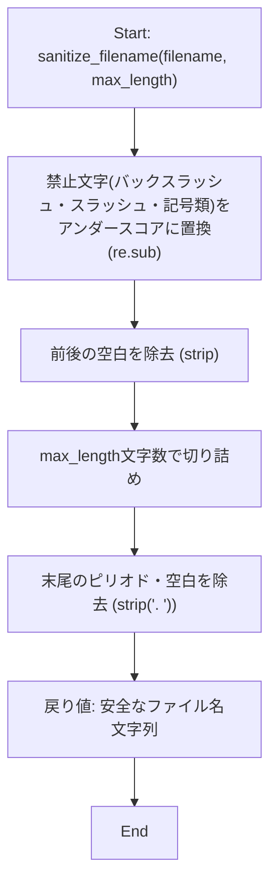
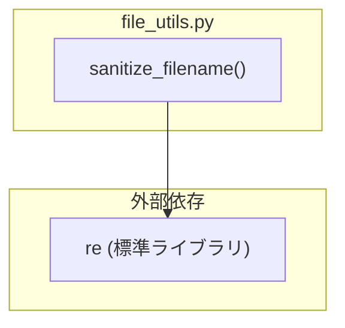

## 1. 解析メタ情報

| 項目 | 内容 |
| --- | --- |
| 対象ファイル | `file_utils.py` |
| 言語 | Python |
| 解析対象 | 提供されたコードのみ |
| 推測・補完 | 一切なし |

## 関連ドキュメント

* [batch_download_discord.md](./batch_download_discord.md) — 本モジュールの`sanitize_filename`の主要な呼び出し元（`FileSystemManager.sanitize_filename`という委譲ラッパー経由で利用）。ただし関連ドキュメント側にも、実際にどのような文字列（動画タイトル等）に対して呼び出しているかの具体的な呼び出し箇所は明記されていない。
* `extract_youtube_urls.py`についても本モジュールDocstring上の呼び出し元候補として記載されているが、対応する仕様書は`docs/specifications/`配下に見つからなかった。

## 2. ファイルの概要

* DDD配下の複数スクリプト（モジュールDocstringによれば`batch_download_discord.py`および`extract_youtube_urls.py`）で個別に重複実装されていたファイル名サニタイズ処理を、DRY違反解消のため1箇所に集約した共通ユーティリティモジュールである。
* 提供する機能は、ファイルシステム上で使用できない記号をアンダースコアに置換し、かつ長さを制限した安全なファイル名文字列を生成する関数`sanitize_filename`のみである。
* 根拠: [モジュールDocstring] (行番号: 1〜5 / 抜粋: "batch_download_discord.py / extract_youtube_urls.py がそれぞれ個別に\nほぼ同一のロジックを実装していた（DRY違反）ため、ここに集約する。")

## 3. 外部依存関係

### インポート一覧

| 名称 | 種類 | 用途 | 根拠 |
| --- | --- | --- | --- |
| `re` | 標準ライブラリ | 禁止文字を検出・置換するための正規表現処理(`re.sub`) | 根拠: [import文] (行番号: 6 / 抜粋: "import re") |

### ブラックボックスとなる外部要素

該当なし（本ファイルは標準ライブラリ`re`のみに依存しており、独自のブラックボックス外部要素は存在しない）。

## 4. 主要要素の定義（関数 / エンドポイント / コンポーネント）

### `sanitize_filename`

* **役割**: ファイル名として使用できない記号（`\`, `/`, `*`, `?`, `:`, `"`, `<`, `>`, `|`）をアンダースコア(`_`)に置換し、前後の空白を除去したうえで、指定文字数以内に切り詰め、さらに末尾のピリオドと空白を除去した安全なファイル名文字列を生成する。
* 根拠: [関数定義とDocstring] (行番号: 9〜21 / 抜粋: "def sanitize_filename(filename: str, max_length: int = 200) -> str:\n    """ファイル名として使用できない文字を置換し、長さを制限する。")

* **引数/リクエスト**: `filename: str`（元の文字列）, `max_length: int = 200`（生成するファイル名の最大文字数。拡張子は含まない前提。ext4等の255バイト制限に対する安全マージンとして既定200文字）
* 根拠: [引数定義とDocstring] (行番号: 9, 12〜15 / 抜粋: "max_length: 生成するファイル名の最大文字数（拡張子は含まない前提）。\n            ext4等の255バイト制限に対する安全マージンとして既定200文字。")

* **戻り値/レスポンス**: `str`（安全なファイル名文字列）
* 根拠: [戻り値ヒントとDocstring] (行番号: 9, 17〜18 / 抜粋: "Returns:\n        安全なファイル名文字列。")

* **副作用**: なし（純粋な文字列変換処理。ファイルシステムへのアクセスは行わない）
* 根拠: [関数本体] (行番号: 20〜21 / 抜粋: "safe = re.sub(r'[\\/*?:"<>|]', '_', filename).strip()\n    return safe[:max_length].strip('. ')")

* **エラーハンドリング**: なし（例外を送出する処理は含まれていない。`filename`が文字列でない場合の型チェックも存在しない）
* 根拠: [関数本体] (行番号: 20〜21 / 抜粋: "safe = re.sub(r'[\\/*?:"<>|]', '_', filename).strip()\n    return safe[:max_length].strip('. ')")

## 5. 処理フロー図

`sanitize_filename` の変換ロジックのフローを示します。

## 6. 依存関係図

## 7. 次のステップ（リバースエンジニアリングの提案）

| 優先度 | ファイル名(推測可) | 理由 | 根拠 |
| --- | --- | --- | --- |
| 中 | `batch_download_discord.py` | 本モジュールDocstringに記載の通り、`sanitize_filename`の主要な呼び出し元の一つであり、実際にどのようなファイル名（動画タイトル等）に対して本関数が使われているかを確認するため（別ドキュメントとして既に存在する可能性あり）。 | 根拠: [モジュールDocstring] (行番号: 3 / 抜粋: "batch_download_discord.py / extract_youtube_urls.py がそれぞれ個別に") |
| 中 | `extract_youtube_urls.py` | 同上のDocstringに記載されているもう一方の呼び出し元候補ファイルであり、本関数がどのような入力（YouTube動画タイトル等）に対して使われているかを確認するため。 | 根拠: [モジュールDocstring] (行番号: 3 / 抜粋: "batch_download_discord.py / extract_youtube_urls.py がそれぞれ個別に") |

## 8. 保守上の注意点

* **入力型の未検証**: `filename`引数が`str`型であることを前提としており、`None`や非文字列が渡された場合の型チェック・エラーハンドリングが存在しない。呼び出し元での事前検証に依存する設計となっている。
* **禁止文字リストの限定性**: 置換対象は`\/*?:"<>|`の8文字のみであり、制御文字（NULバイト等）やOS/ファイルシステム固有の予約語（Windowsの`CON`, `PRN`等）には対応していない。
* **`max_length`のデフォルト値の前提**: Docstringに「拡張子は含まない前提」と明記されているが、関数自体は拡張子の有無を判別するロジックを持たず、呼び出し元が拡張子を別途扱う必要がある。

## 9. 不明事項一覧

| 項目 | 理由 | 必要なファイル |
| --- | --- | --- |
| 実際の呼び出し箇所・呼び出しパターン | `batch_download_discord.py`や`extract_youtube_urls.py`が本関数をどのような文字列（動画タイトル、URL由来の文字列等）に対して呼び出しているかは、本ファイル単体からは不明。 | `batch_download_discord.py`, `extract_youtube_urls.py` |

## 10. 自己検証結果

* [x] 推測・外部ファイルの仕様を一切含んでいない
* [x] 全関数・全クラス・全コンポーネントを列挙した
* [x] 全てのインポート要素を列挙した
* [x] すべての仕様説明に「根拠（行番号・抜粋）」を明記した
* [x] 根拠漏れが0件である
* [x] Mermaid構文にエラーの原因となる記号（エスケープ漏れ）がない
* [x] 不明事項を漏れなく列挙した

完了
