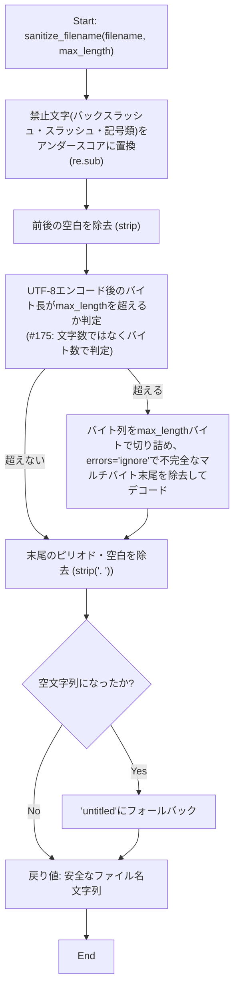
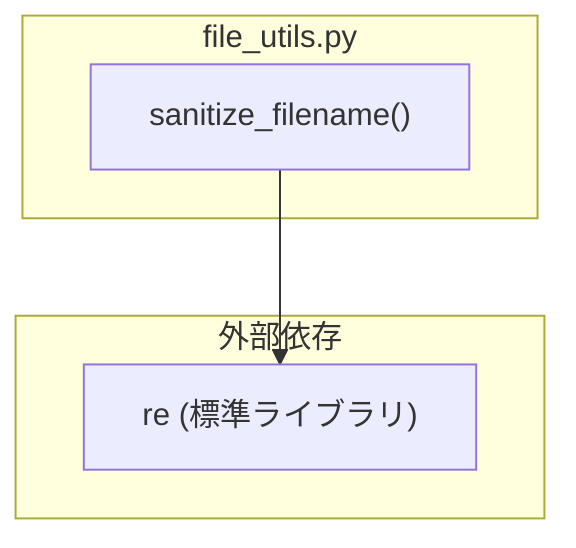

## 1. 解析メタ情報

| 項目 | 内容 |
| --- | --- |
| 対象ファイル | `file_utils.py` |
| 言語 | Python |
| 解析対象 | 提供されたコードのみ |
| 推測・補完 | 一切なし |

## 関連ドキュメント

* [batch_download_discord.md](./batch_download_discord.md) — 本モジュールの`sanitize_filename`の主要な呼び出し元（`FileSystemManager.sanitize_filename`という委譲ラッパー経由で利用）。ただし関連ドキュメント側にも、実際にどのような文字列（動画タイトル等）に対して呼び出しているかの具体的な呼び出し箇所は明記されていない。
* [../DDD/extract_youtube_urls.md](./extract_youtube_urls.md) — 本モジュールDocstring上のもう一方の呼び出し元候補。`FileManager._sanitize_filename`が本関数への委譲ラッパーとして存在する（Issue #126で修正: 過去の解析時点では対応する仕様書が`docs/specifications/`配下に見つからなかったが、現在は`extract_youtube_urls.md`として存在する）。

## 2. ファイルの概要

* DDD配下の複数スクリプト（モジュールDocstringによれば`batch_download_discord.py`および`extract_youtube_urls.py`）で個別に重複実装されていたファイル名サニタイズ処理を、DRY違反解消のため1箇所に集約した共通ユーティリティモジュールである。
* 提供する機能は、ファイルシステム上で使用できない記号をアンダースコアに置換し、かつ長さを制限した安全なファイル名文字列を生成する関数`sanitize_filename`のみである。変換結果が空文字列になった場合（入力が`".."`や`"."`等の記号のみで構成されていた場合等）は、呼び出し元が拡張子を連結するだけの用途（例: `sanitize_filename(video_id) + ".mp4"`）で空stemの隠しファイルが生成されるのを防ぐため、`"untitled"`というフォールバック名を補う。
* 根拠: [モジュールDocstring] (行番号: 1〜5 / 抜粋: "batch_download_discord.py / extract_youtube_urls.py がそれぞれ個別に\nほぼ同一のロジックを実装していた（DRY違反）ため、ここに集約する。")
* 根拠: [untitledフォールバックとコメント] (行番号: 22〜28 / 抜粋: "if not safe:\n        # Low: 入力が \"..\" や \".\" 等の記号のみで構成されている場合、ここまでの\n        # 処理で空文字列になりうる。呼び出し側は戻り値へ拡張子を連結するだけの\n        # ものが多く(例: sanitize_filename(video_id) + \".mp4\")、空文字のままだと\n        # \".mp4\" のような隠しファイル(空stem)が生成されてしまうため、安全な\n        # フォールバック名を補う。\n        safe = \"untitled\"")

## 3. 外部依存関係

### インポート一覧

| 名称 | 種類 | 用途 | 根拠 |
| --- | --- | --- | --- |
| `re` | 標準ライブラリ | 禁止文字を検出・置換するための正規表現処理(`re.sub`) | 根拠: [import文] (行番号: 6 / 抜粋: "import re") |

### ブラックボックスとなる外部要素

該当なし（本ファイルは標準ライブラリ`re`のみに依存しており、独自のブラックボックス外部要素は存在しない）。

## 4. 主要要素の定義（関数 / エンドポイント / コンポーネント）

### `sanitize_filename`

* **役割**: ファイル名として使用できない記号（`\`, `/`, `*`, `?`, `:`, `"`, `<`, `>`, `|`）をアンダースコア(`_`)に置換し、前後の空白を除去したうえで、指定バイト数以内（UTF-8エンコード後）に切り詰め、さらに末尾のピリオドと空白を除去した安全なファイル名文字列を生成する。変換結果が空文字列になった場合は`"untitled"`にフォールバックする。**（Issue #175で修正）** 以前は`safe[:max_length]`という「文字数」ベースの切り詰めだったため、UTF-8で1文字3バイトになる日本語では`max_length`文字が最大その3倍のバイト数になり、ext4等の255バイト制限を容易に超過してENAMETOOLONGを引き起こしていた。現在はUTF-8エンコード後のバイト列を切り詰めており、マルチバイト文字の境界で分断された末尾の不完全なバイト列は`errors='ignore'`で安全に除去する。
* 根拠: [関数定義とDocstring] (行番号: 9〜20 / 抜粋: "def sanitize_filename(filename: str, max_length: int = 200) -> str:\n    """ファイル名として使用できない文字を置換し、長さを制限する。")、バイト単位の切り詰め (行番号: 23〜30 / 抜粋: "#175: 以前は safe[:max_length] で「文字数」を制限していたが、UTF-8では\n    # 日本語1文字が3バイトになるため")

* **引数/リクエスト**: `filename: str`（元の文字列）, `max_length: int = 200`（生成するファイル名の最大バイト数。UTF-8エンコード後、拡張子は含まない前提。ext4等の255バイト制限に対する安全マージンとして既定200バイト）
* 根拠: [引数定義とDocstring] (行番号: 9, 12〜16 / 抜粋: "max_length: 生成するファイル名の最大バイト数（UTF-8エンコード後、拡張子は\n            含まない前提）。ext4等の255バイト制限に対する安全マージンとして\n            既定200バイト。")

* **戻り値/レスポンス**: `str`（安全なファイル名文字列。変換結果が空文字列であれば`"untitled"`）
* 根拠: [戻り値ヒントとDocstringおよびフォールバック] (行番号: 9, 18〜19, 33, 39〜40 / 抜粋: "Returns:\n        安全なファイル名文字列。", "if not safe:", "safe = \"untitled\"\n    return safe")

* **副作用**: なし（純粋な文字列変換処理。ファイルシステムへのアクセスは行わない）
* 根拠: [関数本体] (行番号: 21〜40 / 抜粋: "safe = re.sub(r'[\\/*?:"<>|]', '_', filename).strip()\n\n    encoded = safe.encode('utf-8')\n    if len(encoded) > max_length:\n        safe = encoded[:max_length].decode('utf-8', errors='ignore')")

* **エラーハンドリング**: なし（例外を送出する処理は含まれていない。`filename`が文字列でない場合の型チェックも存在しない）
* 根拠: [関数本体] (行番号: 21〜40 / 抜粋: "safe = re.sub(r'[\\/*?:"<>|]', '_', filename).strip()\n\n    encoded = safe.encode('utf-8')\n    if len(encoded) > max_length:\n        safe = encoded[:max_length].decode('utf-8', errors='ignore')")

## 5. 処理フロー図

`sanitize_filename` の変換ロジックのフローを示します。

## 6. 依存関係図

## 7. 次のステップ（リバースエンジニアリングの提案）

| 優先度 | ファイル名(推測可) | 理由 | 根拠 |
| --- | --- | --- | --- |
| 中 | `batch_download_discord.py` | 本モジュールDocstringに記載の通り、`sanitize_filename`の主要な呼び出し元の一つであり、実際にどのようなファイル名（動画タイトル等）に対して本関数が使われているかを確認するため（別ドキュメントとして既に存在する可能性あり）。 | 根拠: [モジュールDocstring] (行番号: 3 / 抜粋: "batch_download_discord.py / extract_youtube_urls.py がそれぞれ個別に") |
| 中 | `extract_youtube_urls.py` | 同上のDocstringに記載されているもう一方の呼び出し元候補ファイルであり、本関数がどのような入力（YouTube動画タイトル等）に対して使われているかを確認するため。 | 根拠: [モジュールDocstring] (行番号: 3 / 抜粋: "batch_download_discord.py / extract_youtube_urls.py がそれぞれ個別に") |

## 8. 保守上の注意点

* **入力型の未検証**: `filename`引数が`str`型であることを前提としており、`None`や非文字列が渡された場合の型チェック・エラーハンドリングが存在しない。呼び出し元での事前検証に依存する設計となっている。
* **禁止文字リストの限定性**: 置換対象は`\/*?:"<>|`の8文字のみであり、制御文字（NULバイト等）やOS/ファイルシステム固有の予約語（Windowsの`CON`, `PRN`等）には対応していない。
* **`max_length`のデフォルト値の前提**: Docstringに「拡張子は含まない前提」と明記されているが、関数自体は拡張子の有無を判別するロジックを持たず、呼び出し元が拡張子を別途扱う必要がある。
* **（Issue #175で解消）文字数ベースの切り詰めによるバイト制限超過**: 以前は`safe[:max_length]`という単純な文字列スライスで切り詰めており、`max_length`は実質「文字数」を制限するものだった。UTF-8で1文字3バイトになる日本語等では、既定値200文字が最大600バイトとなりext4等の255バイト制限を容易に超過し、`ENAMETOOLONG`でファイル操作が失敗する不具合があった（`extract_youtube_urls.py`はチャンネル名とタイトルの2つの`sanitize_filename`結果を連結するため、この問題がさらに顕著だった）。現在はUTF-8エンコード後のバイト列を切り詰めるよう修正済み。ただし本関数単体は拡張子分のバイト数を考慮しないため、呼び出し元が拡張子や区切り文字（`extract_youtube_urls.py`の`"_"`等）の分を差し引いた`max_length`を渡す必要がある点は変わらない。

## 9. 不明事項一覧

| 項目 | 理由 | 必要なファイル |
| --- | --- | --- |
| 実際の呼び出し箇所・呼び出しパターン | `batch_download_discord.py`や`extract_youtube_urls.py`が本関数をどのような文字列（動画タイトル、URL由来の文字列等）に対して呼び出しているかは、本ファイル単体からは不明。 | `batch_download_discord.py`, `extract_youtube_urls.py` |

## 相互参照による補足情報

| 元の不明事項 | 判明した内容 | 参照元ドキュメント |
| --- | --- | --- |
| 実際の呼び出し箇所・呼び出しパターン | `DDD/batch_download_discord.py`と`DDD/extract_youtube_urls.py`を直接確認した。(1) `batch_download_discord.py`では、`FileSystemManager.sanitize_filename`（411, 413行目、本関数への委譲ラッパー）が589行目で`video_id`（対象ページのURL末尾セグメントから生成した文字列。取得できない場合は`f"vid_{int(time.time())}"`にフォールバック）を引数に呼び出され、戻り値に`.mp4`を付与してファイル名としている（`max_length`未指定、既定値200バイト）。(2) `extract_youtube_urls.py`では、`FileManager._sanitize_filename`（279行目、同じく本関数への委譲ラッパー）が313〜314行目で`result.channel_name`（チャンネル名）と`result.title`（動画タイトル）の2種類の文字列に対しそれぞれ呼び出され、`{safe_channel}_{safe_title}.txt`（`safe_channel`が`"unknown_channel"`の場合は`{safe_title}.txt`）というファイル名を構成している。**（Issue #175で修正）** 以前はいずれも`max_length`未指定（既定値200文字＝当時の文字数ベース実装では最大600バイト×2）で、連結後のファイル名が255バイト制限を大幅に超過しうる不具合があったため、現在はチャンネル名・タイトルの双方に明示的に`max_length=100`（バイト）を指定し（313〜314行目）、連結後も255バイトに収まるようにしている。 | 直接ソース確認: `DDD/batch_download_discord.py:411,413,589`, `DDD/extract_youtube_urls.py:279,313-314` |

## 10. 自己検証結果

* [x] 推測・外部ファイルの仕様を一切含んでいない
* [x] 全関数・全クラス・全コンポーネントを列挙した
* [x] 全てのインポート要素を列挙した
* [x] すべての仕様説明に「根拠（行番号・抜粋）」を明記した
* [x] 根拠漏れが0件である
* [x] Mermaid構文にエラーの原因となる記号（エスケープ漏れ）がない
* [x] 不明事項を漏れなく列挙した

完了
