## 1. 解析メタ情報

| 項目 | 内容 |
| --- | --- |
| 対象ファイル | `newface_monitor.py` |
| 言語 | Python |
| 解析対象 | 提供されたコードのみ |
| 推測・補完 | 一切なし |
| 解析基準コミット | `46c9bc4` |

## 関連ドキュメント

* [../MY_HOME_SYSTEM/nas_utils.md](../MY_HOME_SYSTEM/nas_utils.md) — 本ファイルがインポートを試みる`core.nas_utils.get_managed_target_directory`の実装候補（同名関数のシグネチャ・実装が確認できる）。
* [../MY_HOME_SYSTEM/utils.md](../MY_HOME_SYSTEM/utils.md) — 本ファイルがインポートを試みる`core.utils.wait_for_storage_warmup`の実装候補（同名関数のシグネチャ・実装が確認できる）。
* [../MY_HOME_SYSTEM/logger.md](../MY_HOME_SYSTEM/logger.md) — `core.logger`配下のロガー実装（`setup_logging`, `DiscordErrorHandler`）に関する参考情報。ただし本ファイルがインポートする`get_logger`関数自体はこのドキュメントでは文書化されていない。
* [../MY_HOME_SYSTEM/notification_service.md](../MY_HOME_SYSTEM/notification_service.md) — Discord Webhook通知の別実装パターンとの比較参考（本ファイルは`services.notification_service`を使わず、独自の`DiscordNotifier`クラスで`requests`セッションを直接使いWebhookへPOSTする）。
* [../MY_HOME_SYSTEM/nas_monitor.md](../MY_HOME_SYSTEM/nas_monitor.md) — NAS監視・容量管理という運用文脈での関連。
* [batch_download_discord.md](./batch_download_discord.md) — 一時ファイル経由のアトミック書き込み（`.tmp`→`replace`）という同一パターンを採用している同じDDDサブシステム内の類似スクリプト（`DataManager.save_known_casts`のコメントで直接言及されている）。また、`run_monitor`の多重起動防止ロックは、本ファイルの`BatchDownloader.run`が既に採用している`fcntl.flock`による同種のロックパターンを踏襲したものである（本ファイルのコメントで直接言及されている）。
* [test_newface_monitor_lock.md](./test_newface_monitor_lock.md) — 本ファイルの多重起動防止ロック（`run_monitor`/`_run_monitor_locked`/`_MONITOR_LOCK_FILE_PATH`）を検証する回帰テストの解析ドキュメント。
* [file_utils.md](./file_utils.md) — `DiscordNotifier`がインスタンス単位で保持する`DiscordCircuitBreaker`（Discord Webhookへの連続送信失敗検知用）の実装。`batch_download_discord.py`の`DiscordNotifier.send`とも共通利用される。

## 2. ファイルの概要

* モジュールDocstring上「NewFace Monitor System (Refactored for MY_HOME_SYSTEM)」と称される、`sites.json`に登録された複数のWebサイトの新人紹介ページを定期巡回し、新規キャストの追加をDiscord Webhookで通知するバッチスクリプトである。**（Issue #413で変更）** 監視対象サイトの定義は、以前は本ファイル内に`SiteConfig`インスタンスを約970行のPythonリテラルとして直書きしていたが、同ディレクトリの`sites.json`へ外出しされた。拡張時は`sites.json`にエントリを1件追記するだけでよく、本ファイル（2000行超のロジックファイル）の変更は不要になった。
* 根拠: [モジュールDocstring] (行番号: 4〜13 / 抜粋: "NewFace Monitor System (Refactored for MY_HOME_SYSTEM)\nTargets: sites.json に登録された複数サイト（起動時に MonitorConfig.SITES へ読み込まれる）")
* `MY_HOME_SYSTEM`の共通コア機能（`core.logger`, `core.nas_utils`, `core.utils`）のインポートを試み、失敗時（単体テスト用・モジュール欠損時）はファイル内にフォールバック実装（ロガー、NASディレクトリ解決の簡易版、ストレージウォームアップ処理）を用意している。
* 根拠: [try-exceptブロック] (行番号: 41〜46 / 抜粋: "try:\n    # システム統合環境下でのインポート\n    from core.logger import get_logger\n    from core.nas_utils import get_managed_target_directory\n    from core.utils import wait_for_storage_warmup\nexcept ImportError:")
* `SiteConfig`データクラスは監視対象1サイト分の設定（対象URL、CSSセレクタ、画像取得方法、名前抽出時の特殊処理フラグ等）を保持し、モジュールimport時に`_load_sites(SITES_JSON_PATH)`が`sites.json`を読み込んで`MonitorConfig.SITES`（`SiteConfig`インスタンス79件のリスト）を構築する（2026-09-02にサイト閉鎖が確認された`bellica`が削除され80件から79件になった。削除理由は`sites.json`の該当エントリの`_comment`フィールドとして残されている）。各サイトのHTML構造の違い（lazyload画像、インラインCSS背景画像、年齢バッジの位置、クエリパラメータ形式のID等）を、コード変更ではなく`SiteConfig`のフラグ・パラメータ調整のみで吸収する設計である。バリデーション自体は`SiteConfig`（frozen dataclass）に委譲しており、`sites.json`側はデータを保持するだけという役割分担は変わっていない。
* 根拠: [SiteConfigクラスと_load_sites定義] (行番号: 129〜134 / 抜粋: "新しいサイトを監視対象に加える場合は、sites.json にこのデータクラスの\n    フィールド名をキーとするエントリを1件追加するだけでよい\n    （コード本体の変更は不要。読み込みは _load_sites が担う）。")、[_load_sitesとMonitorConfig.SITES] (行番号: 208〜275 / 抜粋: "SITES: List[SiteConfig] = _load_sites(SITES_JSON_PATH)")
* `requests`と`BeautifulSoup`を用いて各サイトをスクレイピングし、キャスト情報（ID・名前・詳細URL・画像URL・年齢）を抽出、サイトごとに保存された既知キャスト一覧（JSON永続化、`known_casts_{site_id}.json`）との差分検知により新規キャストのみをDiscordへ通知する。
* 根拠: [WebMonitor._parse_htmlとCastMember] (行番号: 685〜836, 327〜343 / 抜粋: "def _parse_html(self, soup: BeautifulSoup, site: SiteConfig) -> Set[CastMember]:")
* 1サイトの通信障害・レイアウト変更・パースエラーが他サイトの監視処理に波及しないよう、サイト単位の処理は`_check_site`関数として分離され、例外は`run_monitor`内でサイトごとに個別捕捉される。
* 根拠: [_check_site Docstring] (行番号: 1170〜1179 / 抜粋: "サイト単位の処理を分離することで、あるサイトの通信障害・レイアウト変更が\n    他サイトの監視処理に波及しないようにする。")
* **（2026-09-02のbellica閉鎖対応で追加）** サイト別の連続失敗回数を`site_failures.json`に永続化し、`CONSECUTIVE_FAILURE_ALERT_THRESHOLD`（24回=1時間毎実行前提で約1日）に達したサイトは「閉鎖・移転の疑い」としてDiscordへ1回だけテキストアラートを送信した上で、以降の失敗ログをERRORからWARNINGへ降格する（一次ヘルスチェックのERROR監視が恒久的に消失したサイトで発報し続けないようにするため）。キャストを1件以上取得できた時点で連続失敗状態はリセットされ、通常のERROR運用に自動的に戻る。**（Issue #395で拡張）** 失敗として計上する対象はネットワーク例外に加えて「別ドメインへのリダイレクト（200を返す消失サイト）」「キャスト0件」にも広げられ、ログの降格はアラート送信の成否ではなく閾値到達で判定し、アラートは全サイト処理後にまとめて送信（失敗サイト割合が`SELF_OUTAGE_SUPPRESS_RATIO`超なら自局側障害とみなして抑止）する。
* 根拠: [_handle_site_network_failure Docstring] (行番号: 1134〜1152 / 抜粋: "単発・短期のネットワーク障害は従来\n    どおりERRORで記録しつつ、CONSECUTIVE_FAILURE_ALERT_THRESHOLD回連続で失敗した\n    サイトは「閉鎖・移転の疑い」としてDiscordへ1回だけテキスト通知し")
* 各サイトの新規検知件数はサイト単位のJSONに加え、`daily_summary.json`にも累積され、21時台の実行時にこれまでの累積分をテキスト形式でDiscordへ別途通知する（重複送信は送信済み日付の永続化で防止）。**（Issue #183で修正）** 以前はカレンダー日付が変わると集計が無条件にリセットされていたため、21時台送信後(22時〜24時)の検知や21時台の実行自体が無かった日の検知がどのサマリにも計上されないまま失われていたが、現在は実際に送信された時にのみ累積がクリアされ、日付をまたいでも未送信分は必ず次回送信に引き継がれる。
* 根拠: [_maybe_send_daily_summary Docstring] (行番号: 1017〜1035 / 抜粋: "このスクリプトはcron等により1時間毎に別プロセスとして起動される前提\n    (デーモン常駐ではない)のため、「21時になったら送る」という時刻トリガーは\n    実行時刻の時(hour)が21かどうかで判定する。")
* **（Issue #364で修正）** データディレクトリ（NAS上の`known_casts_*.json`等の保存先）は`_run_monitor_locked`の冒頭で`MonitorConfig.get_data_dir()`により**1回だけ**解決され、その値を束縛した`DataManager`インスタンスが全サイトの処理で使い回される。以前は`DataManager`の全メソッドが静的メソッドで、呼び出しのたびに`get_data_dir()`（= `core.nas_utils.get_managed_target_directory`。NAS未マウント時は`sudo mount`による自己修復とDiscord/LINE障害通知を伴う）を再評価していたため、79サイト×最低3回で1実行あたり240回以上呼ばれ、NAS障害時には毎時数百回の`sudo mount`と数百件のDiscord投稿が発生していた。あわせて、解決結果がローカルフォールバック先（`MonitorConfig.LOCAL_DIR_STR`）だった場合は、ローカル側に`known_casts_*.json`が無く全サイトの全在籍キャストが「新規」として再通知されてしまうため、`MonitorConfig.is_local_fallback_dir`で検知して実行全体を中断する（`extract_youtube_urls.py`の`_verify_environment`と同じ方針）。
* 根拠: [_run_monitor_lockedの解決・フォールバック判定とDataManager生成] (行番号: 1344〜1366 / 抜粋: "# #364: データディレクトリはここで1回だけ解決し、DataManagerに束縛して全サイトで\n    # 使い回す。" / "if MonitorConfig.is_local_fallback_dir(data_dir):" / "data_manager = DataManager(data_dir)")、[DataManagerクラスDocstring] (行番号: 616〜625 / 抜粋: "#364: 以前は全メソッドが静的メソッドで、呼び出しのたびに\n    MonitorConfig.get_data_dir()(= core.nas_utils.get_managed_target_directory。")
* 保存データはNAS等のストレージ上に一時ファイル経由のアトミック書き込みで永続化される。書き込み後は一時ファイルを読み戻して検証し、既存データを`.bak`としてバックアップしてから本番ファイルへ置き換える多段の安全策を持つ（詳細は4章`DataManager.save_known_casts`を参照）。
* 根拠: [DataManager.save_known_castsのコメント] (行番号: 607〜609 / 抜粋: "# アトミック書き込み: 一時ファイルに書き出してから置き換えることで、\n            # 書き込み中断時に既存データが破損/空になるのを防ぐ\n            # (batch_download_discord.py の _purge_skipped_tasks と同じパターン)")
* `run_monitor`はモニタープロセスのエントリポイントとして、`fcntl.flock`による多重起動防止ロック（`_MONITOR_LOCK_FILE_PATH`）を非ブロッキングで取得してから処理本体`_run_monitor_locked`を呼び出す。cronの1回の実行が想定より長引く（1時間超）と新旧プロセスが並行実行され、既知キャストリスト・サマリファイルの読み書きが競合しうる問題への対策であり、`batch_download_discord.py`が既に採用している同種のロックパターンを踏襲している。
* 根拠: [_MONITOR_LOCK_FILE_PATHのコメントとrun_monitor] (行番号: 1052〜1059 / 抜粋: "# M-7-4: 多重起動防止ロック。cron等での実行が重複すると、既知キャストリストや\n# サマリファイルへの読み書きが競合し、一時消失→再通知等のデータ不整合が起きうる\n# (batch_download_discord.pyでは既にflockによる同種のロックが導入済み)。")

## 3. 外部依存関係

### インポート一覧

| 名称 | 種類 | 用途 | 根拠 |
| --- | --- | --- | --- |
| `os` | 標準ライブラリ | 環境変数取得(`os.getenv`)、パス操作(`os.path.basename`) | 根拠: [import文] (行番号: 14 / 抜粋: "import os") |
| `json` | 標準ライブラリ | キャストデータ・日次サマリのJSONシリアライズ/デシリアライズ | 根拠: [import文] (行番号: 15 / 抜粋: "import json") |
| `re` | 標準ライブラリ | 年齢抽出(`AGE_PATTERN`)、背景画像URL抽出用の正規表現処理 | 根拠: [import文] (行番号: 16 / 抜粋: "import re") |
| `time` | 標準ライブラリ | Discord通知間のレート制限待機、スクレイピング前のBot検知回避待機、フォールバック実装のリトライ間隔 | 根拠: [import文] (行番号: 17 / 抜粋: "import time") |
| `random` | 標準ライブラリ | スクレイピング前のランダムな待機時間生成 | 根拠: [import文] (行番号: 18 / 抜粋: "import random") |
| `sys` | 標準ライブラリ | `sys.path`へのプロジェクトルート追加 | 根拠: [import文] (行番号: 19 / 抜粋: "import sys") |
| `logging` | 標準ライブラリ | フォールバック時のロガー基本設定・生成 | 根拠: [import文] (行番号: 20 / 抜粋: "import logging") |
| `hashlib` | 標準ライブラリ | ID未取得時のフォールバックIDを生成するためのフィンガープリント(sha1)算出 | 根拠: [import文] (行番号: 21 / 抜粋: "import hashlib") |
| `fcntl` | 標準ライブラリ | 多重起動防止ロックファイルへの排他ロック(`flock`)取得・解放 | 根拠: [import文] (行番号: 22 / 抜粋: "import fcntl") |
| `dataclasses.dataclass`, `asdict` | 標準ライブラリ | `SiteConfig`/`CastMember`データクラスの定義、辞書変換 | 根拠: [import文] (行番号: 24 / 抜粋: "from dataclasses import dataclass, asdict") |
| `datetime.datetime` | 標準ライブラリ | 現在時刻の取得（日次サマリの日付判定、21時台判定） | 根拠: [import文] (行番号: 25 / 抜粋: "from datetime import datetime") |
| `pathlib.Path` | 標準ライブラリ | ファイル・ディレクトリパスの操作全般 | 根拠: [import文] (行番号: 26 / 抜粋: "from pathlib import Path") |
| `typing.List`, `Set`, `Dict`, `Optional`, `Tuple` | 標準ライブラリ | 型ヒント全般（`Tuple`は`record_site_failure`の戻り値型） | 根拠: [import文] (行番号: 26 / 抜粋: "from typing import List, Set, Dict, Optional, Tuple") |
| `urllib.parse.urljoin`, `urlparse`, `parse_qs` | 標準ライブラリ | 相対URL（キャスト詳細ページ・画像）の絶対URL化、クエリパラメータからのID抽出 | 根拠: [import文] (行番号: 28 / 抜粋: "from urllib.parse import urljoin, urlparse, parse_qs") |
| `file_utils.DiscordCircuitBreaker` | 内部モジュール(DDD配下) | `DiscordNotifier`が保持するDiscord Webhook連続送信失敗検知用サーキットブレーカー | 根拠: [import文] (行番号: 29 / 抜粋: "from file_utils import DiscordCircuitBreaker") |
| `requests` | サードパーティ | HTTPセッションの生成・GETリクエスト送信、Discord Webhookへの POST送信 | 根拠: [import文] (行番号: 36 / 抜粋: "import requests") |
| `requests.adapters.HTTPAdapter` | サードパーティ | セッションへのリトライ用アダプタのマウント | 根拠: [import文] (行番号: 37 / 抜粋: "from requests.adapters import HTTPAdapter") |
| `urllib3.util.retry.Retry` | サードパーティ | HTTPリクエストのリトライポリシー定義（Discord向けは429の`Retry-After`尊重を含む） | 根拠: [import文] (行番号: 38 / 抜粋: "from urllib3.util.retry import Retry") |
| `bs4.BeautifulSoup`, `NavigableString` | サードパーティ | 取得したHTMLのパース・要素抽出、テキストノード判定（`name_first_text_only`処理） | 根拠: [import文] (行番号: 39 / 抜粋: "from bs4 import BeautifulSoup, NavigableString") |
| `core.logger.get_logger` | 内部モジュール（オプショナル、try節） | ロガーインスタンスの取得。インポート失敗時はファイル内フォールバック実装を使用 | 根拠: [import文] (行番号: 43 / 抜粋: "from core.logger import get_logger") |
| `core.nas_utils.get_managed_target_directory` | 内部モジュール（オプショナル、try節） | NAS/ローカルのデータ保存ディレクトリの解決・管理。インポート失敗時はファイル内フォールバック実装を使用 | 根拠: [import文] (行番号: 44 / 抜粋: "from core.nas_utils import get_managed_target_directory") |
| `core.utils.wait_for_storage_warmup` | 内部モジュール（オプショナル、try節） | ストレージ（NAS等）が書き込み可能になるまでの待機処理。インポート失敗時はファイル内フォールバック実装を使用 | 根拠: [import文] (行番号: 45 / 抜粋: "from core.utils import wait_for_storage_warmup") |

### ブラックボックスとなる外部要素

| 名称 | 理由 | 根拠 |
| --- | --- | --- |
| `core.logger.get_logger` | インポート成功時に実際に使用される実装（フォーマット、出力先、ログレベル等）の詳細が本ファイルからは不明。フォールバック実装（`logging.getLogger`ベース）のみがこのファイルから確認できる。 | 根拠: [import文とフォールバック定義] (行番号: 43, 53〜54 / 抜粋: "from core.logger import get_logger") |
| `core.nas_utils.get_managed_target_directory` | インポート成功時の実際の実装（NASマウント確認・自動修復ロジックの詳細）が不明。フォールバック実装は`fallback_dir_str`引数をそのまま返すのみ。 | 根拠: [import文とフォールバック定義] (行番号: 44, 56〜64 / 抜粋: "from core.nas_utils import get_managed_target_directory") |
| `core.utils.wait_for_storage_warmup` | インポート成功時の実際の実装が不明。フォールバック実装（Exponential Backoffでのテストファイル書き込み確認）のみがこのファイルから確認できる。 | 根拠: [import文とフォールバック定義] (行番号: 45, 66〜103 / 抜粋: "from core.utils import wait_for_storage_warmup") |
| `MonitorConfig.SITES`に登録された79件の対象Webサイト | 各サイトのHTML構造（CSSセレクタが依拠する実際のマークアップ）は本ファイルのコードからは分からず、外部Webサイトの実物に依存する。 | 根拠: [SiteConfig各エントリ] (行番号: 206〜1174 / 抜粋: "SITES: List[SiteConfig] = [") |
| Discord Webhook API | Webhookエンドポイントの認証・レート制限・レスポンス仕様の詳細は本ファイルのコードからは分からず、Discord側の実装に依存する。 | 根拠: [Webhook POST送信] (行番号: 443, 498 / 抜粋: "response = self.session.post(self.webhook_url, json=payload, timeout=10)") |

## 4. 主要要素の定義（関数 / エンドポイント / コンポーネント）

### `get_logger` (フォールバック実装)

* **役割**: `core.logger`のインポートに失敗した場合に使用される、標準`logging`モジュールベースの簡易ロガー取得関数。
* 根拠: [関数定義] (行番号: 53〜54 / 抜粋: "def get_logger(name: str) -> logging.Logger: \n        return logging.getLogger(name)")

* **引数/リクエスト**: `name: str`
* 根拠: [引数定義] (行番号: 53 / 抜粋: "def get_logger(name: str) -> logging.Logger: ")

* **戻り値/レスポンス**: `logging.Logger`
* 根拠: [戻り値ヒント] (行番号: 53 / 抜粋: "-> logging.Logger: ")

* **副作用**: なし（`logging.getLogger`は既存ロガーの取得または新規作成）
* **エラーハンドリング**: なし

### `get_managed_target_directory` (フォールバック実装)

* **役割**: `core.nas_utils`のインポートに失敗した場合に使用される簡易フォールバック関数。呼び出し元(`get_data_dir`)が渡す`fallback_dir_str`（`BASE_DIR/'data'`の絶対パス）があればそれを、なければカレントディレクトリ相対の`./data`を返す。カレントディレクトリ相対パスを無条件に返すと実行時のカレントディレクトリ次第で保存先が変わり、既存データが見つからず全キャストを新人として誤検知する不具合につながるため、絶対パスの`fallback_dir_str`を優先する設計であることがコメントで明記されている。
* 根拠: [関数定義とコメント] (行番号: 56〜64 / 抜粋: "def get_managed_target_directory(*args, **kwargs) -> Path:\n        # 呼び出し元(get_data_dir)はfallback_dir_str（BASE_DIR/'data'の絶対パス）を\n        # 渡してくる想定。これを無視してカレントディレクトリ相対の"./data"を返すと、\n        # 実行時のカレントディレクトリ次第で保存先が毎回変わってしまい、\n        # known_casts_*.jsonが見つからず全キャストを新人として誤検知する原因になる。")

* **引数/リクエスト**: `*args`, `**kwargs`（本フォールバック実装では`kwargs.get("fallback_dir_str")`のみを参照する）
* 根拠: [引数定義と参照箇所] (行番号: 56, 61 / 抜粋: "fallback_dir_str = kwargs.get("fallback_dir_str")")

* **戻り値/レスポンス**: `Path`（`fallback_dir_str`が渡されていればそれを`Path`化した値、なければ`Path("./data")`）
* 根拠: [各return文] (行番号: 63〜64 / 抜粋: "if fallback_dir_str:\n            return Path(fallback_dir_str)\n        return Path("./data")")

* **副作用**: なし
* **エラーハンドリング**: なし

### `wait_for_storage_warmup` (フォールバック実装)

* **役割**: NAS等のストレージがマウントされ書き込み可能になるまで、テストファイルの作成・削除による死活確認とExponential Backoffでのリトライにより待機する。`core.utils`のインポート失敗時に使用される。
* 根拠: [関数定義とDocstring] (行番号: 66〜78 / 抜粋: "def wait_for_storage_warmup(target_dir: Path, max_retries: int = 5, base_delay: float = 1.0) -> bool:\n        """\n        NAS等のストレージがマウントされ、書き込み可能になるまで待機する。")

* **引数/リクエスト**: `target_dir: Path`（アクセス確認を行う対象ディレクトリ）, `max_retries: int = 5`（最大リトライ回数）, `base_delay: float = 1.0`（ベースとなる待機時間・秒）
* 根拠: [引数定義とDocstring] (行番号: 66, 71〜74 / 抜粋: "target_dir (Path): アクセス確認を行う対象ディレクトリ。\n            max_retries (int): 最大リトライ回数。\n            base_delay (float): ベースとなる待機時間（秒）。")

* **戻り値/レスポンス**: `bool`（アクセス確立できた場合`True`、最大リトライ到達で`False`）
* 根拠: [Docstring] (行番号: 76〜77 / 抜粋: "bool: ストレージへのアクセスが確立できた場合はTrue、タイムアウトした場合はFalse。")

* **副作用**: ディレクトリ作成試行(`target_dir.mkdir`)、テストファイル(`.storage_warmup_test`)の書き込み・削除、デバッグ/エラーログ出力、リトライ時の`time.sleep`。
* 根拠: [処理内容] (行番号: 82, 92〜93 / 抜粋: "test_file.write_text("warmup_check", encoding="utf-8")\n                test_file.unlink()")

* **エラーハンドリング**: ディレクトリ作成失敗(`OSError`)時はデバッグログを出力し後続I/Oテストへ処理を継続。テストファイルの書き込み/削除失敗(`IOError`/`OSError`)時はExponential Backoffで待機しリトライ。最大試行後もアクセスできない場合はエラーログを出力し`False`を返す（パニックを起こさない設計）。
* 根拠: [try-exceptブロックとコメント] (行番号: 83〜85, 96〜99, 101〜103 / 抜粋: "# 最終的にアクセスできない場合はパニックを起こさずFalseを返す\n        logger.error(f"Storage warmup failed after {max_retries} attempts.")\n        return False")

### `AGE_PATTERN` (モジュール定数)（D-L12で変更）

* **役割**: 名前要素のテキストから年齢を抽出するための正規表現。"うるは(23歳)"のような全角/半角括弧付き数字、または「歳」「才」が続く数字表記のいずれかにマッチする。ランキングバッジ等の1桁の括弧数字（例: "(1)"）を誤って年齢と判定しないよう、桁数を2桁に限定している。**（D-L12で変更）** 括弧内の「歳」「才」の有無を判別できるよう、以前は非捕捉グループだった`(?:歳|才)?`を捕捉グループ`(歳|才)?`に変更した。マッチ結果は3グループ: `group(1)`＝括弧内の数字、`group(2)`＝括弧内の「歳」「才」（無ければ`None`）、`group(3)`＝括弧無しで「歳」「才」が続く数字。呼び出し側（`_parse_html`）は、`group(2)`が`None`（＝括弧内に「歳」「才」の明示が無い）の場合のみ、`MonitorConfig.AGE_PLAUSIBLE_MIN`〜`AGE_PLAUSIBLE_MAX`の範囲かどうかで年齢として採用するか判定する（詳細は`WebMonitor._parse_html`参照）。以前は括弧内の数字を「歳」「才」の有無に関わらず無条件に年齢とみなしていたため、"(85)"のような部屋番号・順位バッジ等の括弧付き2桁数字を誤って年齢と判定しうる懸念があった。
* 根拠: [定義とコメント] (行番号: 116〜129 / 抜粋: "# 名前要素のテキストから年齢を抽出するための正規表現。\n# "うるは(23歳)" / "浅見ゆき（30）" / "小鳥(ことり)セラピスト  22歳" のように、\n...\n# D-L12: 括弧内の数字は「歳」「才」が続かない場合(第2group=None)でも\n# 無条件に年齢とみなしていたため" / "AGE_PATTERN = re.compile(r'[（(]\\s*(\\d{2})\\s*(歳|才)?\\s*[）)]|(\\d{2})\\s*(?:歳|才)')")

### `SiteConfig`

* **役割**: 監視対象サイト1件分の設定を保持するイミュータブル(`frozen=True`)なデータクラス。対象URL、キャスト一覧・名前・リンク・画像取得用のCSSセレクタ、既知キャストの保存先ファイル名、ID/画像/名前抽出時の各種特殊処理フラグを持つ。**（Issue #413で変更）** 新規サイトを追加する際は、このクラスのインスタンスを本ファイルに直接書き足すのではなく、`sites.json`にフィールド名をキーとするJSONエントリを1件追加するだけでよい（構築は`_load_sites`が担う）。
* 根拠: [クラス定義とDocstring] (行番号: 133〜139 / 抜粋: "@dataclass(frozen=True)\nclass SiteConfig:\n    """監視対象サイト1件分の設定。\n\n    新しいサイトを監視対象に加える場合は、sites.json にこのデータクラスの\n    フィールド名をキーとするエントリを1件追加するだけでよい\n    （コード本体の変更は不要。読み込みは _load_sites が担う）。")

* **引数/リクエスト**: `site_id: str`, `name: str`, `target_url: str`, `selector_container: str`, `selector_name: str`, `selector_link: str`, `selector_image: str`, `data_filename: str = ""`, `id_query_param: Optional[str] = None`, `image_attr: str = "src"`, `image_from_style: bool = False`, `name_first_text_only: bool = False`, `name_strip_after_tab: bool = False`, `skip_unnamed_casts: bool = False`
* 根拠: [フィールド定義] (行番号: 185〜198 / 抜粋: "site_id: str\n    name: str\n    target_url: str\n    selector_container: str\n    selector_name: str\n    selector_link: str\n    selector_image: str")

* **戻り値/レスポンス**: 該当なし（データクラスのフィールド定義自体）
* **副作用**: なし
* **エラーハンドリング**: なし（フィールドの型・必須性は`dataclass`の通常のコンストラクタ機構に委ねられる。JSON側からの構築時のエラーハンドリングは`_load_sites`が担う）

### `SiteConfig.get_data_filename`

* **役割**: 既知キャストの保存先ファイル名を返す。`data_filename`が明示指定されていればそれを、なければ`site_id`から導出したデフォルトファイル名（`known_casts_{site_id}.json`）を返す。**（Issue #413）** ロジック自体は`sites.json`外出し前後で変更していない。
* 根拠: [メソッド定義とDocstring] (行番号: 200〜207 / 抜粋: "def get_data_filename(self) -> str:\n        """既知キャストの保存先ファイル名を返す。")

* **引数/リクエスト**: なし（`self`のみ）
* **戻り値/レスポンス**: `str`
* 根拠: [戻り値ヒントとreturn文] (行番号: 200, 207 / 抜粋: "return self.data_filename or f"known_casts_{self.site_id}.json"")

* **副作用**: なし
* **エラーハンドリング**: なし

### `SITES_JSON_PATH` / `_load_sites`（Issue #413で新規追加）

* **役割**: 監視対象サイト定義の外出し先(`sites.json`、`SITES_JSON_PATH = CURRENT_DIR / 'sites.json'`)を読み込み、`SiteConfig`のリストへ変換するモジュール関数。以前は本ファイル内に`SiteConfig(...)`の呼び出しを約970行のPythonリテラルとして直書きしていた79サイト分の定義を、同ディレクトリの`sites.json`（各エントリが`SiteConfig`のフィールド名をキーとするJSONオブジェクトの配列）へ外出しした際に追加された。JSON側の各エントリの`_comment`キーはサイト追加理由等を残すドキュメント専用フィールドであり、`SiteConfig`の構築対象からは除外する。バリデーション自体は`SiteConfig`（frozen dataclass）のコンストラクタにそのまま委譲し、本関数側で追加するのは「JSON構文自体が壊れていないか」「配列/オブジェクトの形が正しいか」「`site_id`が重複していないか」の3点のみ（フィールドの型チェック等の詳細検証は`SiteConfig`側の責務のまま変更していない）。ファイル欠損・JSON構文エラー・配列でない・要素がオブジェクトでない・`SiteConfig`が拒否する不正なフィールド（必須フィールド欠落・未知フィールド等）・`site_id`重複のいずれかがあれば`RuntimeError`を送出し、モジュールimport時（`MonitorConfig.SITES`のクラス変数初期化時）に処理全体を止める設計であり、壊れたエントリを黙ってスキップすることはない。
* 根拠: [定数定義とコメント] (行番号: 210〜216 / 抜粋: "# Issue #413: 監視対象サイト定義（旧: 本ファイル内の約970行のPythonリテラル、\n# 79サイト分）を sites.json へ外出しした。" / "SITES_JSON_PATH: Path = CURRENT_DIR / 'sites.json'")、[関数定義とDocstring] (行番号: 219〜241 / 抜粋: "def _load_sites(json_path: Path) -> List[SiteConfig]:\n    """sites.json を読み込み、SiteConfigのリストとして返す。")

* **引数/リクエスト**: `json_path: Path`（`sites.json`のパス）
* 根拠: [引数定義] (行番号: 219, 234 / 抜粋: "def _load_sites(json_path: Path) -> List[SiteConfig]:" / "json_path (Path): sites.json のパス。")

* **戻り値/レスポンス**: `List[SiteConfig]`（JSON内の出現順）
* 根拠: [戻り値ヒントとDocstring] (行番号: 219, 236〜237 / 抜粋: "Returns:\n        List[SiteConfig]: 読み込んだサイト設定のリスト（JSON内の出現順）。")

* **副作用**: ファイル読み込み(`json_path.read_text`)。呼び出しはモジュールimport時（`MonitorConfig.SITES`のクラス変数初期化）に1回のみ。
* **エラーハンドリング**: ファイル読み込み失敗(`OSError`)・JSON構文エラー(`json.JSONDecodeError`)・トップレベルが配列でない・要素がオブジェクトでない・`SiteConfig(**fields)`が`TypeError`を送出（必須フィールド欠落・未知フィールド等）・`site_id`重複、のいずれについても`RuntimeError`を送出する（Issue #413の要件「malformed entryは黙ってスキップせず起動時に気付けること」に対応。回帰テストは`test_newface_monitor_sites_json.py`）。
* 根拠: [各例外送出箇所] (行番号: 242〜271 / 抜粋: "try:\n        raw_text = json_path.read_text(encoding='utf-8')\n    except OSError as e:\n        raise RuntimeError(f"サイト設定ファイルが読み込めません: {json_path} ({e})") from e" / "if site.site_id in seen_ids:\n            raise RuntimeError(f"sites.json に site_id の重複があります: {site.site_id!r}")")

### `MonitorConfig`

* **役割**: 監視対象サイト一覧（`SITES`）、ファイルパス、ネットワーク設定（User-Agent、タイムアウト、リトライ）、Discord Webhook URLなど、モニタリング処理全体で使用される設定値・定数を集約管理するクラス（インスタンス化は行われない）。
* 根拠: [クラス定義とDocstring] (行番号: 275〜276 / 抜粋: "class MonitorConfig:\n    """モニタリング設定および定数管理クラス。"""")

* **引数/リクエスト**: なし（クラス変数として静的に定義）
* 根拠: [クラス変数定義群] (行番号: 278〜362 / 抜粋: "SITES: List[SiteConfig] = _load_sites(SITES_JSON_PATH)")

* **戻り値/レスポンス**: 該当なし
* **副作用**: `SITES`のクラス変数定義時に`_load_sites(SITES_JSON_PATH)`を呼び出し`sites.json`を読み込む（不正があれば`RuntimeError`でモジュールimport自体が失敗する）。`DISCORD_WEBHOOK_URL`のクラス変数定義時に環境変数`DISCORD_WEBHOOK_URL`を読み込む。
* 根拠: [クラス変数の初期化式] (行番号: 281 / 抜粋: "SITES: List[SiteConfig] = _load_sites(SITES_JSON_PATH)")、[環境変数読み込み] (行番号: 300 / 抜粋: "DISCORD_WEBHOOK_URL: Optional[str] = os.getenv('DISCORD_WEBHOOK_URL')")

* **`MASS_DETECTION_WARNING_THRESHOLD: int = 20`について**: `_check_site`が既知キャスト存在下での大量新規検知（known_castsデータ喪失等による誤検知の疑い）を警告ログとして検出する際の閾値。通常運用時の新規検知は数件〜十数件程度であることを踏まえた目安値。
* 根拠: [定数定義とコメント] (行番号: 303〜305 / 抜粋: "# 通常運用時の新規検知は数件〜十数件程度のため、この件数以上の差分は\n    # known_castsデータの喪失/巻き戻り等による誤検知の疑いとして警告する目安値\n    MASS_DETECTION_WARNING_THRESHOLD: int = 20")

* **`AGE_PLAUSIBLE_MIN: int = 18` / `AGE_PLAUSIBLE_MAX: int = 79`について（D-L12で追加）**: `AGE_PATTERN`が「歳」「才」の明示無しに括弧内の2桁数字を年齢と判定する場合の妥当性チェック用範囲。`WebMonitor._parse_html`のAge Extraction部分で、括弧内数字に「歳」「才」の明示が無い場合のみこの範囲でフィルタする（範囲外なら年齢として採用しない）。「歳」「才」で明示された数字は、この範囲に関わらず無条件に信頼する。
* 根拠: [定数定義とコメント] (行番号: 306〜311 / 抜粋: "# D-L12: AGE_PATTERNが「歳」「才」の明示無しに括弧内の2桁数字を年齢と\n    # 判定する場合の妥当性チェック用範囲。この範囲外の値は年齢として採用しない\n    # (部屋番号・順位バッジ等の誤検知を減らすための足切り。「歳」「才」で\n    # 明示された数字は範囲に関わらず信頼する)。\n    AGE_PLAUSIBLE_MIN: int = 18\n    AGE_PLAUSIBLE_MAX: int = 79")

* **`CONSECUTIVE_FAILURE_ALERT_THRESHOLD: int = 24`について（2026-09-02のbellica閉鎖対応で追加）**: ネットワーク起因の巡回失敗がこの回数連続したサイトを「閉鎖・移転の疑い」としてDiscordへ1回だけアラート通知し、以降の失敗ログをWARNINGに降格するための閾値。1時間毎のcron実行前提で約1日分に相当する。2026-09-02のbellica閉鎖時に、消失したサイトが毎時ERRORを出し続けて一次ヘルスチェックが発報し続けた事象の再発防止として導入された。
* 根拠: [定数定義とコメント] (行番号: 313〜319 / 抜粋: "# ネットワーク起因の巡回失敗がこの回数連続したサイトは「閉鎖・移転の疑い」\n    # としてDiscordへ1回だけアラート通知し、以降の失敗ログをWARNINGに降格する\n    CONSECUTIVE_FAILURE_ALERT_THRESHOLD: int = 24")

* **`SELF_OUTAGE_SUPPRESS_RATIO: float = 0.5`について（Issue #395で追加）**: 同一実行内で失敗として計上したサイト数が総サイト数に占める割合がこの値を超える場合、個々のサイトの閉鎖ではなく自局側（Pi側の回線断・DNS障害等）の障害とみなし、`_send_pending_site_failure_alerts`が閉鎖疑いアラートの一斉送信を抑止する（79サイト分のアラートが同時に飛ぶのを防ぐ）。
* 根拠: [定数定義とコメント] (行番号: 320〜323 / 抜粋: "# #395: 同一実行内で失敗したサイト数が総数に占める割合がこの値を超える場合、\n    # 個々のサイトの閉鎖ではなく自局側(Pi側の回線断・DNS障害等)の障害とみなし、\n    # 閉鎖疑いアラートの一斉送信を抑止する(79サイト分のアラートが同時に飛ぶのを防ぐ)。\n    SELF_OUTAGE_SUPPRESS_RATIO: float = 0.5")

* **エラーハンドリング**: なし（`SITES`初期化時の`_load_sites`呼び出しが例外を送出しうる点を除く。上記`_load_sites`の項を参照）

#### `MonitorConfig.SITES` / `sites.json` について（データ内容の補足、Issue #413で外部化）

`SITES`は`SiteConfig`インスタンスを79件含むリストであり（2026-09-02にサイト閉鎖が確認された`bellica`は削除済み。削除理由は`sites.json`の該当エントリの`_comment`フィールドに記載）、モジュールimport時に`_load_sites(SITES_JSON_PATH)`によって`sites.json`から構築される。`sites.json`の各エントリは`SiteConfig`の必須フィールド（`site_id`/`name`/`target_url`/`selector_container`/`selector_name`/`selector_link`/`selector_image`）に加え、デフォルト値と異なる値を持つオプションフィールドのみを記載する形式（省略時は`SiteConfig`側のデフォルト値が使われる）。対象サイトのHTML構造上の特殊事情（例: lazyload画像は`image_attr: "data-original"`、インラインCSS背景画像は`image_from_style: true`、名前要素に年齢が兄弟要素またはタブ区切りで同居する場合は`name_first_text_only: true`/`name_strip_after_tab: true`、クエリパラメータ形式のID体系は`id_query_param`）は、以前は本ファイル内のPythonコメントとして付記していたが、`sites.json`側では同じ情報を各エントリの`_comment`キー（任意の文字列。`SiteConfig`の構築対象からは除外される）として保持しており、情報は失われていない。これらは設定データであり、個別のロジック（関数・メソッド）ではないため本セクションでは項目単位の列挙は行わず、全体としての設計方針のみを記載する。
* 根拠: [SITES初期化とコメント] (行番号: 278〜281 / 抜粋: "# 新規サイトを監視対象に加える場合は sites.json に1エントリ追記するだけでよい\n    # （本クラス・本ファイルの変更は不要。フィールドの意味は SiteConfig のdocstring参照）。\n    SITES: List[SiteConfig] = _load_sites(SITES_JSON_PATH)")、[sites.json 冒頭2件] (`sites.json` 行番号: 1〜21 / 抜粋: "{\n    "site_id": "petitpetit_dream",\n    ...\n    "_comment": "既存運用データ（known_casts.json）との後方互換のためファイル名を明示指定"\n  },")

### `MonitorConfig.get_data_dir`

* **役割**: NASアクセスを検証・修復し、動的にデータディレクトリを解決するクラスメソッド。クラスロード時ではなく実処理が必要になったタイミング（遅延評価）でマウント確認・自動修復ロジックを実行する。**（Issue #364）** 委譲先の`get_managed_target_directory`はNAS未マウント時に`sudo mount`による自己修復とDiscord/LINEへの障害通知を伴う重い処理のため、Docstringに「1回の実行(`_run_monitor_locked`)で1回だけ呼び出し、結果を`DataManager`へ渡して使い回すこと」という呼び出し規約が明記された。
* 根拠: [メソッド定義とDocstring] (行番号: 325〜339 / 抜粋: "def get_data_dir(cls) -> Path:\n        """NASアクセスを検証・修復し、動的にデータディレクトリを解決する。" / "#364: 委譲先の get_managed_target_directory はNAS未マウント時に\n        sudo mountによる自己修復とDiscord/LINEへの障害通知を伴う重い処理のため、\n        1回の実行(_run_monitor_locked)で1回だけ呼び出し、結果をDataManagerへ\n        渡して使い回すこと")

* **引数/リクエスト**: なし（`cls`のみ、`@classmethod`）
* 根拠: [デコレータと引数] (行番号: 325〜326 / 抜粋: "@classmethod\n    def get_data_dir(cls) -> Path:")

* **戻り値/レスポンス**: `Path`（利用可能なデータディレクトリパス）
* 根拠: [Docstringと戻り値] (行番号: 337〜339 / 抜粋: "Returns:\n            Path: 利用可能なディレクトリパス\n        """\n        return get_managed_target_directory(")

* **副作用**: `get_managed_target_directory`（インポート成功時は`core.nas_utils`、失敗時はフォールバック実装）の呼び出し。
* 根拠: [呼び出し] (行番号: 340〜344 / 抜粋: "return get_managed_target_directory(\n            nas_dir_str=cls.NAS_DIR_STR,\n            fallback_dir_str=cls.LOCAL_DIR_STR,\n            mount_point=cls.MOUNT_POINT\n        )")

* **エラーハンドリング**: なし（本メソッド自体には例外処理なし。委譲先の実装に依存）

### `MonitorConfig.is_local_fallback_dir`（Issue #364で追加）

* **役割**: `get_data_dir()`が返した解決済みディレクトリが、NAS障害時のローカルフォールバック先（`LOCAL_DIR_STR`）かどうかを判定するクラスメソッド。ローカル側には`known_casts_*.json`が存在しないため、フォールバック中に巡回を続けると全サイトの全在籍キャストが「新規」として再通知されてしまう。`extract_youtube_urls.py`の`_verify_environment`と同じく、`Path.resolve()`で正規化したうえでの比較により表記揺れに関わらず確実に検知する。旧`MonitorConfig.get_data_file`（呼び出しのたびに`get_data_dir()`を再評価していた）は本Issueで廃止され、ファイルパスの導出は`DataManager._data_file`（束縛済み`data_dir`を使う）へ移った。
* 根拠: [メソッド定義とDocstring] (行番号: 346〜362 / 抜粋: "def is_local_fallback_dir(cls, data_dir: Path) -> bool:\n        """解決済みのデータディレクトリがNAS障害時のローカルフォールバック先かを判定する。" / "return Path(data_dir).resolve() == Path(cls.LOCAL_DIR_STR).resolve()")

* **引数/リクエスト**: `cls`（`@classmethod`）, `data_dir: Path`（`get_data_dir()`が返したディレクトリ）
* 根拠: [引数定義とDocstring] (行番号: 347, 356〜357 / 抜粋: "data_dir (Path): get_data_dir() が返したディレクトリ。")

* **戻り値/レスポンス**: `bool`（ローカルフォールバック先であれば`True`）
* 根拠: [Docstringと戻り値] (行番号: 359〜362 / 抜粋: "Returns:\n            bool: ローカルフォールバック先であれば True。")

* **副作用**: なし（`Path.resolve()`によるパス正規化のみ。NASアクセスは行わない）
* **エラーハンドリング**: なし

### `CastMember`

* **役割**: キャスト情報（ID、名前、詳細URL、画像URL、年齢）を表現するデータクラス。ID(`id`)に基づくハッシュ・等価比較を独自定義することで、`Set[CastMember]`による重複排除・差分検知を可能にしている。
* 根拠: [クラス定義とDocstring] (行番号: 370〜381 / 抜粋: "@dataclass\nclass CastMember:\n    """キャスト情報を表現するデータクラス。")

* **引数/リクエスト**: `id: str`, `name: str`, `detail_url: str`, `image_url: str`, `age: str = ""`（一覧ページ上に年齢表記が見つからない場合は空文字）
* 根拠: [フィールド定義とDocstring] (行番号: 379〜380, 382〜385 / 抜粋: "age (str): 年齢（数字のみ、例: "23"）。一覧ページ上に年齢表記が\n            見つからないサイト・キャストでは空文字となる。")

* **戻り値/レスポンス**: 該当なし（データクラスのフィールド定義自体）
* **副作用**: なし
* **エラーハンドリング**: なし

### `CastMember.__hash__`

* **役割**: `id`フィールドのみに基づくハッシュ値を返す。`Set[CastMember]`での重複排除の基準を`id`のみとするためのオーバーライド。
* 根拠: [メソッド定義] (行番号: 387〜388 / 抜粋: "def __hash__(self) -> int:\n        return hash(self.id)")

* **引数/リクエスト**: なし（`self`のみ）
* **戻り値/レスポンス**: `int`
* 根拠: [戻り値ヒント] (行番号: 387 / 抜粋: "def __hash__(self) -> int:")

* **副作用**: なし
* **エラーハンドリング**: なし

### `CastMember.__eq__`

* **役割**: 比較対象が`CastMember`インスタンスであり、かつ`id`が一致する場合にのみ等価と判定する。
* 根拠: [メソッド定義] (行番号: 390〜393 / 抜粋: "def __eq__(self, other: object) -> bool:\n        if not isinstance(other, CastMember):\n            return False\n        return self.id == other.id")

* **引数/リクエスト**: `other: object`
* **戻り値/レスポンス**: `bool`
* 根拠: [戻り値ヒント] (行番号: 348 / 抜粋: "def __eq__(self, other: object) -> bool:")

* **副作用**: なし
* **エラーハンドリング**: なし（型不一致時は例外ではなく`False`を返す設計）

### `CastMember.to_dict`

* **役割**: `CastMember`インスタンスをJSONシリアライズ可能な辞書形式に変換する。
* 根拠: [メソッド定義とDocstring] (行番号: 353〜359 / 抜粋: "def to_dict(self) -> Dict[str, str]:\n        """辞書形式に変換する。")

* **引数/リクエスト**: なし（`self`のみ）
* **戻り値/レスポンス**: `Dict[str, str]`（`asdict(self)`の結果）
* 根拠: [戻り値] (行番号: 359 / 抜粋: "return asdict(self)")

* **副作用**: なし
* **エラーハンドリング**: なし

### `DiscordNotifier._EMBED_TITLE_MAX_LEN` / `_EMBED_FIELD_VALUE_MAX_LEN` / `_truncate_for_embed`（D-L6で追加）

* **役割**: Discord embedの`title`（実際の上限256文字）・`fields[].value`（実際の上限1024文字）を超えるとembed全体が400 Bad Requestで拒否されるため、安全側の切り詰め上限（クラス定数、いずれも250文字）と、その上限に収まるよう省略記号付きで切り詰める静的メソッド`_truncate_for_embed`を追加した。`cast.name`等は外部サイトのスクレイピング結果であり、サイト側の表示崩れ・異常データで想定外に長くなりうるため送信前に切り詰める対象とする（`site.name`等の開発者管理の文字列は対象外）。
* 根拠: [クラス定数と静的メソッドの定義] (行番号: 411〜426 / 抜粋: "# D-L6: Discord embedのtitle(256文字)/field.value(1024文字)には上限があり、\n    # 超過するとembed全体が400 Bad Requestで拒否される。" / "_EMBED_TITLE_MAX_LEN = 250\n    _EMBED_FIELD_VALUE_MAX_LEN = 250" / "def _truncate_for_embed(text: str, max_len: int) -> str:")

* **引数/リクエスト**: `_truncate_for_embed(text: str, max_len: int)`
* **戻り値/レスポンス**: `str`（`max_len`以下に切り詰められた文字列。切り詰め時は末尾に`"…(省略)"`を付与）
* 根拠: [戻り値ヒントと処理] (行番号: 420〜426 / 抜粋: "def _truncate_for_embed(text: str, max_len: int) -> str:\n        \"\"\"Discord embedの文字数上限に収まるよう、超過分を省略記号付きで切り詰める。\"\"\"\n        if len(text) <= max_len:\n            return text\n        suffix = "…(省略)"\n        return text[: max(max_len - len(suffix), 0)] + suffix")

* **副作用**: なし（純粋な文字列処理）
* **エラーハンドリング**: なし

### `DiscordNotifier.__init__`

* **役割**: Discordへの通知送信を担当するサービスクラスのコンストラクタ。Webhook URLを保持し、レート制限に自動追従するHTTPセッションを生成する。あわせて、このインスタンスの生存期間(=1回のプロセス実行の間)だけ有効な`DiscordCircuitBreaker`インスタンスを生成し保持する。
* 根拠: [クラス定義とDocstringおよび__init__] (行番号: 381〜384 / 抜粋: "class DiscordNotifier:\n    """Discordへの通知を担当するサービスクラス。"""\n\n    def __init__(self, webhook_url: Optional[str]):")

* **引数/リクエスト**: `webhook_url: Optional[str]`（DiscordのWebhook URL）
* 根拠: [引数定義とDocstring] (行番号: 384, 386〜388 / 抜粋: "webhook_url (Optional[str]): DiscordのWebhook URL。")

* **戻り値/レスポンス**: 該当なし
* **副作用**: `self.webhook_url`への代入、`self.session`への`_create_rate_limited_session()`結果の代入、`self._circuit_breaker`への`DiscordCircuitBreaker()`（既定の`failure_threshold=3`）の代入。
* 根拠: [属性代入] (行番号: 389〜393 / 抜粋: "self.webhook_url = webhook_url\n        self.session = self._create_rate_limited_session()\n        # 連続送信失敗時に以降の送信をスキップするサーキットブレーカー\n        # (このインスタンスの生存期間=1回のプロセス実行の間だけ有効)\n        self._circuit_breaker = DiscordCircuitBreaker()")

* **エラーハンドリング**: なし

### `DiscordNotifier._create_rate_limited_session`

* **役割**: Discordのレート制限(429)に自動追従するHTTPセッションを作成する。Discord Webhookはバーストした`POST`に対して429を返すことがあり、固定`sleep`だけでは不十分なため、`urllib3`の`Retry`が`Retry-After`ヘッダーを尊重して自動的にバックオフ・リトライする仕組みに委譲している。
* 根拠: [メソッド定義とDocstring] (行番号: 377〜388 / 抜粋: "def _create_rate_limited_session(self) -> requests.Session:\n        """Discordのレート制限(429)に自動追従するHTTPセッションを作成する。")

* **引数/リクエスト**: なし（`self`のみ）
* 根拠: [引数定義] (行番号: 377 / 抜粋: "def _create_rate_limited_session(self) -> requests.Session:")

* **戻り値/レスポンス**: `requests.Session`（429/5xx時に自動リトライするセッション）
* 根拠: [Docstringと戻り値] (行番号: 386〜388, 399 / 抜粋: "Returns:\n            requests.Session: 429/5xx時に自動リトライするセッション。")

* **副作用**: なし（セッションオブジェクトの生成・設定のみ、外部通信は発生しない）
* 根拠: [処理内容] (行番号: 389〜398 / 抜粋: "session = requests.Session()\n        retries = Retry(")

* **エラーハンドリング**: なし

### `DiscordNotifier.close`

* **役割**: 保持しているHTTPセッションのリソースを明示的に解放する。
* 根拠: [メソッド定義とDocstring] (行番号: 401〜404 / 抜粋: "def close(self) -> None:\n        """保持しているHTTPセッションのリソースを明示的に解放する。"""\n        if self.session:\n            self.session.close()")

* **引数/リクエスト**: なし（`self`のみ）
* **戻り値/レスポンス**: `None`
* 根拠: [戻り値ヒント] (行番号: 401 / 抜粋: "def close(self) -> None:")

* **副作用**: `self.session.close()`によるHTTPセッションのクローズ。
* **エラーハンドリング**: `self.session`が存在する場合にのみクローズを実行するガード節のみ。
* 根拠: [ガード節] (行番号: 403 / 抜粋: "if self.session:")

### `DiscordNotifier.notify`（D-L6・D-L9で変更）

* **役割**: 新規キャストのリストを受け取り、各キャストごとにDiscord埋め込みメッセージ(embed)を構築してWebhook経由で送信する。`site_name`が指定されている場合はどのサイトの新着かを区別できるよう埋め込みタイトルに`【サイト名】`のプレフィックスを付与する。Webhook URL未設定時は送信をスキップする。**（本PRで一般化）** 以前は認証エラー(401/404)発生時のみ残りの通知処理を打ち切る簡易的な打ち切りロジックだったが、タイムアウトや接続エラー等の他の失敗モードには対応していなかった。現在は`self._circuit_breaker`（`DiscordCircuitBreaker`）を用い、ループ先頭でブレーカーが開いていれば残りのキャストの送信自体をスキップする。401/404発生時は即座に`trip()`でブレーカーを開き、それ以外の`requests.RequestException`発生時は`record_failure()`で連続失敗を積算し既定3回で開く。**（D-L6で追加）** embedの`title`（`✨ 新人キャスト情報{site_prefix}: {cast.name}`）と`fields`の`Name`/`Link`の`value`は、いずれも`self._truncate_for_embed`で`_EMBED_TITLE_MAX_LEN`/`_EMBED_FIELD_VALUE_MAX_LEN`（250文字）に切り詰めてから送信する。`cast.name`はスクレイピング結果でありサイト側の表示崩れ等で想定外に長くなりうるため、Discordの実際の上限（title 256文字、field.value 1024文字）を超えてembed全体が拒否される事態を防ぐ。
* 根拠: [メソッド定義とDocstring] (行番号: 467〜481 / 抜粋: "def notify(self, new_casts: List[CastMember], site_name: str = "") -> int:\n        """新規キャスト情報をDiscordに通知する。")、[D-L6: title/field.valueの切り詰め] (行番号: 498〜509, 522〜524 / 抜粋: "safe_name = self._truncate_for_embed(cast.name, self._EMBED_FIELD_VALUE_MAX_LEN)" / "\"title\": self._truncate_for_embed(\n                            f\"✨ 新人キャスト情報{site_prefix}: {cast.name}\", self._EMBED_TITLE_MAX_LEN\n                        ),")

* **引数/リクエスト**: `new_casts: List[CastMember]`（通知対象の新規キャストリスト）, `site_name: str = ""`（通知元サイトの表示名）
* 根拠: [引数定義とDocstring] (行番号: 467, 470〜472 / 抜粋: "new_casts (List[CastMember]): 通知対象の新規キャストリスト。\n            site_name (str): 通知元サイトの表示名。")

* **戻り値/レスポンス**: `int`（**D-L9で変更**。以前は`None`。実際にDiscordへの送信に成功した件数。サーキットブレーカーが開いて送信をスキップしたキャストや、送信失敗したキャストは含まない）
* 根拠: [戻り値ヒントとDocstring・return] (行番号: 467, 473〜478, 551 / 抜粋: "Returns:\n            int: 実際にDiscordへの送信に成功した件数（D-L9）。サーキット\n                ブレーカーが開いて送信をスキップしたキャストは含まない。" / "return sent_count")

* **副作用**: Webhook URL未設定時の警告ログ出力、ループ先頭でのサーキットブレーカー開放チェック（開いていれば警告ログを出力し`break`）、各キャストごとのレート制限回避待機(`time.sleep(1)`)、Discord Webhookへの`session.post`呼び出し、成功/失敗のログ出力と`self._circuit_breaker`の状態更新(`record_success`/`record_failure`/`trip`)、**（D-L9で追加）** 送信成功のたびの`sent_count`インクリメント。年齢(`cast.age`)が存在する場合のみ`Age`フィールドを追加する。`cast.image_url`が`http://`/`https://`で始まらない場合（lazyload画像のプレースホルダーとして`data:`URIや相対パスが混入したケース等）は、embedの`thumbnail`を送信せず空オブジェクトにする（Discord側のURL形式バリデーション失敗による`400 Bad Request`を避けるため）。
* 根拠: [ブレーカーチェックと送信処理・thumbnail URL検証・sent_count加算] (行番号: 482〜489, 497〜509, 526, 541〜543 / 抜粋: "if self._circuit_breaker.is_open:\n                # 連続送信失敗によりサーキットブレーカーが開いている間は、\n                # 無駄なリクエストを重ねないよう残り件数分の送信をスキップする。" / "thumbnail_url = cast.image_url if cast.image_url.startswith(('http://', 'https://')) else \"\"" / "self._circuit_breaker.record_success()\n                sent_count += 1")

* **エラーハンドリング**: Webhook URLが未設定または`'YOUR_DISCORD'`を含む場合は警告ログを出力し即座に`0`を返す（**D-L9で変更**。以前は`return`のみで戻り値は常に`None`だった）。`requests.HTTPError`発生時はレスポンス本文の先頭300文字に加え、原因切り分け用として`detail_url`/`image_url`を含めて`exc_info=True`付きでエラーログを出力し、ステータスコードが401または404であればさらにエラーログを出力したうえで`self._circuit_breaker.trip()`を呼び即座にブレーカーを開いて通知ループを`break`で打ち切る（401/404以外は`record_failure()`のみ呼び、次のキャストの処理を継続する）。それ以外の`requests.RequestException`発生時は`exc_info=True`付きでエラーログを出力し`record_failure()`を呼んで次のキャストの処理を継続する。
* 根拠: [各エラー分岐] (行番号: 479〜481, 528〜551 / 抜粋: "if not self.webhook_url or 'YOUR_DISCORD' in self.webhook_url:\n            logger.warning("Discord Webhook URL is not configured. Skipping notification.")\n            return 0" / "logger.error(\n                    f\"Failed to send notification for {cast.name}: {e} | body: {body} | \"\n                    f\"detail_url: {cast.detail_url} | image_url: {cast.image_url}\",\n                    exc_info=True,\n                )" / "self._circuit_breaker.trip()\n                    break" / "self._circuit_breaker.record_failure()")

### `DiscordNotifier.notify_daily_summary`

* **役割**: その日に新規検知したサイト別件数を、個別キャスト通知(embed形式)とは異なるテキスト形式(content)で1件だけDiscordへ通知する。**（Issue #226で修正）** 以前は戻り値が常に`None`で送信成否を呼び出し元へ伝える手段が無く、呼び出し元`_maybe_send_daily_summary`は送信の成否を確認せず無条件に集計をクリアしていたため、Webhook未設定時やDiscordへの送信失敗時にも集計が失われ、同日中の再送もできなくなっていた。送信成否を`bool`で返すよう修正し、呼び出し元が成功時のみ集計をクリアできるようにした。**（本PRで追加）** `self._circuit_breaker`が開いている場合は送信自体を試みずスキップして`False`を返す。
* 根拠: [メソッド定義とDocstring] (行番号: 506〜522 / 抜粋: "def notify_daily_summary(self, counts: Dict[str, int], site_names: Dict[str, str], date_str: str) -> bool:\n        """その日に新規検知したサイト別件数を、テキスト形式でDiscordに通知する。")

* **引数/リクエスト**: `counts: Dict[str, int]`（site_id→新規検知件数）, `site_names: Dict[str, str]`（site_id→表示名）, `date_str: str`（サマリ対象日）
* 根拠: [引数定義とDocstring] (行番号: 506, 512〜515 / 抜粋: "counts (Dict[str, int]): site_id -> 新規検知件数 の集計。\n            site_names (Dict[str, str]): site_id -> 表示名 の対応表。\n            date_str (str): サマリ対象日（'YYYY-MM-DD'）。")

* **戻り値/レスポンス**: `bool`（Issue #226で`None`から変更）。送信に成功した場合`True`、Webhook未設定・サーキットブレーカーが開いている・送信失敗のいずれかの場合`False`。
* 根拠: [戻り値ヒントとDocstring] (行番号: 506, 517〜521 / 抜粋: "def notify_daily_summary(self, counts: Dict[str, int], site_names: Dict[str, str], date_str: str) -> bool:" / "Returns:\n            bool: 送信に成功した場合True。Webhook未設定または送信失敗の場合False。")

* **副作用**: サーキットブレーカーの開放チェック（開いていれば警告ログを出力し早期return）、件数降順でのサマリ文字列組み立て、2000文字制限に対する安全な切り詰め（1900文字超過分）、Webhookへの`session.post`呼び出し、成功/失敗ログ出力と`self._circuit_breaker`の状態更新(`record_success`/`record_failure`)。
* 根拠: [ブレーカーチェックと文字数制限処理] (行番号: 527〜531, 540〜542 / 抜粋: "if self._circuit_breaker.is_open:\n            logger.warning(\n                \"Discord Webhookへの連続送信失敗を検知しているため、日次サマリ通知をスキップします。\"\n            )\n            return False" / "if len(content) > 1900:")

* **エラーハンドリング**: Webhook URLが未設定または`'YOUR_DISCORD'`を含む場合は警告ログを出力し`False`を返す（Issue #226以前は`None`を返して`return`するのみで、呼び出し元から失敗として検知できなかった）。サーキットブレーカーが開いている場合も同様に警告ログを出力し`False`を返す(送信自体は試みない)。`requests.RequestException`発生時は`exc_info=True`付きでエラーログを出力し`record_failure()`を呼んで`False`を返す。送信成功時は`record_success()`を呼び`True`を返す。
* 根拠: [送信成否分岐] (行番号: 523〜525, 527〜531, 554〜559 / 抜粋: "if not self.webhook_url or 'YOUR_DISCORD' in self.webhook_url:\n            logger.warning("Discord Webhook URL is not configured. Skipping daily summary notification.")\n            return False" / "except requests.RequestException as e:\n            logger.error(f"Failed to send daily summary notification: {e}", exc_info=True)\n            self._circuit_breaker.record_failure()\n            return False")

### `DiscordNotifier.notify_site_failure_alert`（2026-09-02のbellica閉鎖対応で追加）

* **役割**: 連続巡回失敗中のサイトについて「閉鎖・移転の疑い」をDiscordへテキスト形式(content)で通知するメソッド。サイト名・site_id・対象URL・連続失敗回数と、復旧見込みが無い場合の対処（`MonitorConfig.SITES`からのエントリ削除）を案内する文面を送信する。
* 根拠: [メソッド定義とDocstring] (行番号: 561〜571 / 抜粋: "def notify_site_failure_alert(self, site: SiteConfig, failure_count: int) -> bool:\n        """連続巡回失敗中のサイトについて「閉鎖・移転の疑い」をDiscordへテキスト通知する。")

* **引数/リクエスト**: `site: SiteConfig`（連続失敗中のサイトの設定）, `failure_count: int`（現在の連続失敗回数）
* 根拠: [引数定義とDocstring] (行番号: 561, 564〜566 / 抜粋: "site (SiteConfig): 連続失敗中のサイトの設定。\n            failure_count (int): 現在の連続失敗回数。")

* **戻り値/レスポンス**: `bool`。送信に成功した場合`True`、Webhook未設定・サーキットブレーカーが開いている・送信失敗のいずれかの場合`False`。呼び出し元（`_handle_site_network_failure`）は`True`の場合のみアラート送信済みとして記録し、失敗時は次回実行時に再試行される。
* 根拠: [Docstring] (行番号: 568〜570 / 抜粋: "Returns:\n            bool: 送信に成功した場合True。呼び出し元はTrueの場合のみアラート\n                送信済みとして記録する(失敗時は次回実行時に再試行される)。")

* **副作用**: Webhookへの`session.post`呼び出し、成功/失敗ログ出力と`self._circuit_breaker`の状態更新(`record_success`/`record_failure`)。
* 根拠: [送信処理] (行番号: 590〜599 / 抜粋: "response = self.session.post(self.webhook_url, json=payload, timeout=10)\n            response.raise_for_status()\n            logger.info(f\"Site failure alert sent successfully for site '{site.site_id}'.\")\n            self._circuit_breaker.record_success()")

* **エラーハンドリング**: Webhook URLが未設定または`'YOUR_DISCORD'`を含む場合、およびサーキットブレーカーが開いている場合は警告ログを出力し`False`を返す（送信自体は試みない）。`requests.RequestException`発生時は`exc_info=True`付きでエラーログを出力し`record_failure()`を呼んで`False`を返す。
* 根拠: [ガード節とexcept節] (行番号: 572〜580, 596〜599 / 抜粋: "if not self.webhook_url or 'YOUR_DISCORD' in self.webhook_url:\n            logger.warning(\"Discord Webhook URL is not configured. Skipping site failure alert.\")\n            return False" / "except requests.RequestException as e:\n            logger.error(f\"Failed to send site failure alert for site '{site.site_id}': {e}\", exc_info=True)")

### `DataManager.__init__` / `DataManager._data_file`（Issue #364で追加）

* **役割**: **（Issue #364で変更）** `DataManager`は静的メソッド群から、解決済みのデータディレクトリを束縛するインスタンスへ変更された。コンストラクタは`_run_monitor_locked`が1回だけ解決した`data_dir`を受け取り`self.data_dir`に保持し、`_data_file(site)`は`self.data_dir / site.get_data_filename()`で既知キャストファイルのパスを返す。以降の全メソッド（`load_known_casts`/`save_known_casts`/日次サマリ/サイト別失敗状態）はこの束縛済みディレクトリだけを使い、NAS状態（`MonitorConfig.get_data_dir()`）を一切再評価しない。以前は全メソッドが静的で呼び出しのたびに`get_data_dir()`を再評価していたため、1サイトあたり最低3回・79サイトで1実行あたり240回以上の`get_managed_target_directory`呼び出し（NAS未マウント時はその回数分の`sudo mount`とDiscord投稿）が発生していた。
* 根拠: [クラスDocstring・コンストラクタ・_data_file] (行番号: 616〜625, 633〜644 / 抜粋: "#364: 以前は全メソッドが静的メソッドで、呼び出しのたびに\n    MonitorConfig.get_data_dir()(= core.nas_utils.get_managed_target_directory。\n    NASマウント確認・sudo mountによる自己修復・Discord/LINE障害通知を伴う重い処理)\n    を再評価していた。" / "def __init__(self, data_dir: Path):" / "self.data_dir = Path(data_dir)" / "def _data_file(self, site: SiteConfig) -> Path:\n        \"\"\"指定サイトの既知キャスト保存先JSONファイルのパスを返す。\"\"\"\n        return self.data_dir / site.get_data_filename()")

* **引数/リクエスト**: `__init__`: `data_dir: Path`（解決済みのデータディレクトリ。呼び出し元がフォールバック中でないことを確認した上で渡す前提）。`_data_file`: `site: SiteConfig`
* 根拠: [引数定義とDocstring] (行番号: 633〜640, 642 / 抜粋: "data_dir (Path): 解決済みのデータディレクトリ(NAS上、または検証済みの\n                ローカルパス)。呼び出し元(_run_monitor_locked)がフォールバック中で\n                ないことを確認した上で渡す前提。")

* **戻り値/レスポンス**: `__init__`: `None`。`_data_file`: `Path`
* 根拠: [戻り値] (行番号: 644 / 抜粋: "return self.data_dir / site.get_data_filename()")

* **副作用**: なし（`self.data_dir`の保持とパス連結のみ。ディレクトリ作成・NASアクセスは行わない）
* **エラーハンドリング**: なし

### `DataManager._LOAD_ERRORS` (クラス定数)

* **役割**: JSONファイルの読み込み失敗とみなす例外群をまとめたクラス定数。`UnicodeDecodeError`は`IOError`/`OSError`のサブクラスではなく`ValueError`のサブクラスであるため、`IOError`のみを捕捉する実装では非UTF-8データによる破損（例:「'utf-8' codec can't decode byte ... : invalid start byte」）を検知できず、同一の破損ファイルへの読み込み失敗が繰り返され続けてしまう問題を踏まえ、`OSError`, `ValueError`, `TypeError`, `KeyError`をまとめて捕捉対象としている。`load_known_casts`（`_read_casts_file`経由）に加え、**Issue #174の修正**により`load_daily_summary`もこの定数で例外を捕捉するようになった（以前は`load_daily_summary`のみ`(json.JSONDecodeError, IOError)`という狭いパターンのままで同種のバグが残っていた）。
* 根拠: [定義とコメント] (行番号: 636〜640 / 抜粋: "# 読み込み失敗とみなす例外群。UnicodeDecodeErrorはIOErrorのサブクラスではなく\n    # ValueErrorのサブクラスのため、IOErrorだけを捕捉すると非UTF-8データによる\n    # 破損（例: 'utf-8' codec can't decode byte ... : invalid start byte）を\n    # 検知できず、同じ破損ファイルへの読み込み失敗が繰り返され続けてしまう。\n    _LOAD_ERRORS = (OSError, ValueError, TypeError, KeyError)")

* **副作用**: なし（タプルの定義のみ）
* **エラーハンドリング**: 該当なし（例外を捕捉する側で使われる定数そのもの）

### `DataManager._CONTENT_ERRORS` (クラス定数) / `KnownCastsUnavailableError`（Issue #365で追加）

* **役割**: `_CONTENT_ERRORS = (ValueError, TypeError, KeyError)`は、`_LOAD_ERRORS`のうち「ファイルの内容そのものが壊れている」ことを示す例外群（`json.JSONDecodeError`/`UnicodeDecodeError`は`ValueError`のサブクラス、`CastMember(**item)`の引数不一致は`TypeError`/`KeyError`）。`load_known_casts`が破損ファイルとして`.corrupted-*`へ隔離してよいのはこれらに限られ、`OSError`（CIFS/autofsの瞬断によるEIO/ENOENT/ETIMEDOUT等）は「内容が正しいファイルを開けなかっただけ」なので隔離しない。`KnownCastsUnavailableError`（`Exception`のサブクラス）は、その`OSError`ケースを呼び出し元（`_check_site`）へ伝えて当該サイトの巡回を今回の実行ではスキップさせるためのモジュールレベル例外。以前は種別を問わず隔離していたため、一時的なI/Oエラーで正常なファイルが退避され、`.bak`が無ければ空集合→全キャスト再通知、以降はunion保存されるため隔離前のデータ（退店済み含む）が永久に戻らなかった。
* 根拠: [KnownCastsUnavailableError定義と_CONTENT_ERRORSのコメント] (行番号: 615〜621, 642〜648 / 抜粋: "class KnownCastsUnavailableError(Exception):\n    \"\"\"既知キャストファイルが存在するのにI/Oエラーで読めなかったことを示す例外(#365)。" / "# #365: このうち「ファイルの内容そのものが壊れている」ことを示す例外群。" / "_CONTENT_ERRORS = (ValueError, TypeError, KeyError)")

* **副作用**: なし（定義のみ）
* **エラーハンドリング**: 該当なし

### `DataManager._read_casts_file`

* **役割**: 指定されたJSONファイルを読み込み、`CastMember`の集合に変換する内部ヘルパーの静的メソッド。`load_known_casts`（通常読み込みおよび`.bak`バックアップからの復旧読み込み）と`save_known_casts`（書き込み直後の読み戻し検証）の両方から共通で呼び出される。
* 根拠: [メソッド定義とDocstring] (行番号: 538〜542 / 抜粋: "def _read_casts_file(data_file: Path) -> Set[CastMember]:\n        """JSONファイルを読み込み、CastMemberの集合に変換する。\n\n        パース失敗時は例外をそのまま送出する（呼び出し側でハンドリングする前提）。\n        """")

* **引数/リクエスト**: `data_file: Path`（読み込み対象のJSONファイルパス）
* 根拠: [引数定義] (行番号: 538 / 抜粋: "def _read_casts_file(data_file: Path) -> Set[CastMember]:")

* **戻り値/レスポンス**: `Set[CastMember]`
* 根拠: [戻り値ヒントとreturn文] (行番号: 538, 545 / 抜粋: "return {CastMember(**item) for item in data}")

* **副作用**: JSONファイルのオープン・パース(`open`, `json.load`)。
* 根拠: [処理内容] (行番号: 543〜545 / 抜粋: "with open(data_file, 'r', encoding='utf-8') as f:\n            data = json.load(f)\n            return {CastMember(**item) for item in data}")

* **エラーハンドリング**: なし。Docstringに明記の通り、パース失敗時（JSON構文エラー・非UTF-8データ・想定外のフィールド欠落等）は例外を握りつぶさずそのまま呼び出し元へ送出する設計であり、呼び出し元(`load_known_casts`/`save_known_casts`)側が`DataManager._LOAD_ERRORS`等で捕捉してハンドリングする。
* 根拠: [Docstring] (行番号: 541 / 抜粋: "パース失敗時は例外をそのまま送出する（呼び出し側でハンドリングする前提）。")

### `DataManager.load_known_casts`

* **役割**: 指定サイトの保存済みキャストデータ(`self._data_file(site)`。**Issue #364**以前は呼び出しのたびにNAS状態を再評価する`MonitorConfig.get_data_file(site)`だった)を`_read_casts_file`経由でJSONファイルから読み込み、`CastMember`の集合として返すインスタンスメソッド。**（Issue #365で変更）** 内容起因の読み込み失敗（`_CONTENT_ERRORS`）の場合のみ、単純に空集合を返すのではなく、(1)破損ファイルを`{ファイル名}.corrupted-{タイムスタンプ}`へリネームして隔離することで同じ破損ファイルへの読み込み失敗が繰り返され続けるのを防ぎ、(2)`.bak`バックアップファイルが存在すればそこからの復旧を試み、(3)復旧にも失敗した場合にのみ空集合へフォールバックする、という多段の復旧ロジックを持つ。一方、ファイルは存在するが`OSError`（NAS/CIFSの瞬断等）で読めなかった場合は隔離もフォールバックもせず、`KnownCastsUnavailableError`を送出して呼び出し元に当該サイトのスキップを求める。
* 根拠: [メソッド定義とDocstring] (行番号: 674〜690 / 抜粋: "def load_known_casts(self, site: SiteConfig) -> Set[CastMember]:\n        """指定サイトの保存済みキャストデータを読み込む。" / "Raises:\n            KnownCastsUnavailableError: ファイルは存在するがI/Oエラー(OSError)で\n                読めなかった場合。呼び出し元は当該サイトの処理をスキップすること")

* **引数/リクエスト**: `site: SiteConfig`
* 根拠: [引数定義とDocstring] (行番号: 674, 677〜678 / 抜粋: "site (SiteConfig): 対象サイトの設定。")

* **戻り値/レスポンス**: `Set[CastMember]`（ファイル不在時、または内容破損＋`.bak`バックアップからの復旧も失敗した場合は空集合）。`OSError`時は戻り値を返さず`KnownCastsUnavailableError`を送出する。
* 根拠: [Docstringと各return/raise] (行番号: 680〜688, 694, 708〜710, 732, 737 / 抜粋: "Returns:\n            Set[CastMember]: 既知のキャストの集合。内容起因の読み込み失敗時は\n                隔離・バックアップ復旧を試み、それも不可なら空集合を返す。" / "raise KnownCastsUnavailableError(")

* **副作用**: `DataManager._read_casts_file`経由でのJSONファイル読み込み、デバッグ/エラー/警告ログ出力。読み込み失敗時は破損ファイルのリネーム(`data_file.rename(quarantine_path)`)、`.bak`バックアップファイルが存在する場合はその読み込み。
* 根拠: [処理内容] (行番号: 665, 677〜679, 681, 688, 691 / 抜粋: "data_file = self._data_file(site)" / "quarantine_path = data_file.with_name(\n            f"{data_file.name}.corrupted-{datetime.now():%Y%m%d%H%M%S}"\n        )" / "data_file.rename(quarantine_path)" / "backup_file = data_file.with_suffix(data_file.suffix + '.bak')" / "casts = DataManager._read_casts_file(backup_file)")

* **エラーハンドリング**: データファイルが存在しない場合はデバッグログを出力し空集合を返す。**（Issue #365で変更）** `_read_casts_file`が`OSError`を送出した場合（CIFS/autofsの瞬断によるEIO/ENOENT/ETIMEDOUT等。`wait_for_storage_warmup`のDocstring自体が想定している事象）は、`exc_info=True`付きでエラーログを出力したうえで**ファイルを隔離せず**`KnownCastsUnavailableError`を送出する（以前は`_LOAD_ERRORS`として`OSError`も一括で捕捉し、種別を問わず隔離していた）。`DataManager._CONTENT_ERRORS`（`ValueError`, `TypeError`, `KeyError`）発生時は`exc_info=True`付きでエラーログを出力したうえで、破損ファイルを`{ファイル名}.corrupted-{タイムスタンプ}`へリネームして隔離する（リネーム自体が`OSError`で失敗した場合も`exc_info=True`付きでエラーログを出力するのみで処理は継続）。続けて`.bak`バックアップファイルが存在すれば`_read_casts_file`で読み込みを試み、成功すれば復旧件数を警告ログに出力してそれを返す（バックアップも`DataManager._LOAD_ERRORS`で失敗した場合は`exc_info=True`付きでエラーログを出力）。バックアップが存在しない、またはバックアップも読み込めない場合は、コメントに明記の通り「データ破損時は安全側に倒して空集合（再通知される可能性があるがシステム停止よりマシ）」として空集合を返す。**（本PRで修正）** これら3箇所のエラーログはいずれも例外オブジェクト`e`をメッセージに含めていたが以前は`exc_info=True`が付いておらず、ファイル内の他の同種例外ログ（`save_known_casts`等）との一貫性が無かった。
* 根拠: [try-exceptブロックと隔離・復旧処理] (行番号: 696〜714, 716〜717, 722〜723, 725〜726, 733〜734, 736〜737 / 抜粋: "except OSError as e:\n            # #365: CIFS/autofsの瞬断(EIO/ENOENT/ETIMEDOUT等。wait_for_storage_warmupの\n            # docstring自体が想定している事象)でopen()が失敗しただけのケース。\n            # 中身は正しい可能性が高いため隔離せず、当該サイトの処理を\n            # スキップさせる" / "raise KnownCastsUnavailableError(" / "except DataManager._CONTENT_ERRORS as e:\n            logger.error(f"Failed to load data from {data_file}: {e}", exc_info=True)" / "# 破損ファイルをそのままにすると次回以降も同じ位置で読み込みに失敗し続ける\n        # ため、退避してから復旧を試みる(内容起因の破損に限る。#365)。" / "except OSError as e:\n            logger.error(f"Failed to quarantine corrupted cache file {data_file}: {e}", exc_info=True)" / "# 直近の正常データがバックアップとして残っていれば、そこから復旧する\n        # （空集合へのフォールバックは全キャストの再通知を招くため、可能な限り回避する）。" / "except DataManager._LOAD_ERRORS as e:\n                logger.error(f"Backup file {backup_file} is also unusable: {e}", exc_info=True)" / "# データ破損時は安全側に倒して空集合（再通知される可能性があるがシステム停止よりマシ）\n        return set()")

### `DataManager.save_known_casts`（D-L7・D-L8で変更）

* **役割**: 指定サイトのキャスト集合をJSONファイルへアトミックに保存するインスタンスメソッド。一時ファイルへ書き出したのち`replace`で置き換えることで書き込み中断時の既存データ破損/消失を防ぐ従来のアトミック書き込みパターンに加え、(1)一時ファイルを本番ファイルへ置き換える前に`_read_casts_file`で一時ファイルを読み戻して正しくパースできることを検証し、(2)本番ファイルへの置換前に現在の本番ファイルの内容を`.bak`としてバックアップする、という2つの安全策を追加している。**（D-L7で変更）** `.bak`の更新自体も、以前は`backup_path.write_bytes(data_file.read_bytes())`という非アトミックな直接上書きだったが、他の永続化と同じ「`.bak.tmp`へ書き込み→`replace`」パターンに揃えた。書き込み中に中断しても`.bak`本体は直前の内容のまま無傷で残る。**（D-L8で変更）** `tmp_path.replace(data_file)`に到達する前に例外（読み戻し検証失敗等）が発生すると、以前は書き込み済みの`.tmp`ファイルが削除されずディレクトリに残り続けていた。`tmp_path`が生成済みであれば、外側の`except`節でbest-effortに削除する。
* 根拠: [メソッド定義とDocstring] (行番号: 806〜812 / 抜粋: "def save_known_casts(self, site: SiteConfig, casts: Set[CastMember]) -> None:\n        """指定サイトのキャストデータをJSONファイルに保存する。")

* **引数/リクエスト**: `site: SiteConfig`, `casts: Set[CastMember]`（保存対象のキャスト集合）
* 根拠: [引数定義とDocstring] (行番号: 806, 809〜811 / 抜粋: "site (SiteConfig): 対象サイトの設定。\n            casts (Set[CastMember]): 保存対象のキャスト集合。")

* **戻り値/レスポンス**: `None`
* 根拠: [戻り値ヒント] (行番号: 806 / 抜粋: "def save_known_casts(self, site: SiteConfig, casts: Set[CastMember]) -> None:")

* **副作用**: 保存先ディレクトリの作成(`mkdir`)、一時ファイル(`.tmp`)への書き込み、`DataManager._read_casts_file`による一時ファイルの読み戻し検証、本番ファイルが存在する場合はその内容を`.bak`ファイルへ**（D-L7で変更）** `.bak.tmp`経由のアトミックな`replace`でコピー、`tmp_path.replace(data_file)`によるアトミックな置換、デバッグログ出力。バックアップの更新は最後の`replace`より前に行われるが、これはコメントに明記の通り「万一この途中でプロセスが中断しても本番ファイル(`data_file`)は無傷のまま残る」ようにするための意図的な順序である。
* 根拠: [処理順序とコメント] (行番号: 815, 818〜820, 825〜827, 832〜834, 837〜845 / 抜粋: "data_file.parent.mkdir(parents=True, exist_ok=True)" / "# アトミック書き込み: 一時ファイルに書き出してから置き換えることで、\n            # 書き込み中断時に既存データが破損/空になるのを防ぐ" / "# 書き込んだ内容が正しく読み戻せることを検証してから本番ファイルへ反映する。" / "# コピー元(data_file)は最後のreplaceまで保持したままにすることで、\n            # 万一この途中でプロセスが中断しても本番ファイルは無傷のまま残る。" / "bak_tmp_path = backup_path.with_suffix(backup_path.suffix + '.tmp')\n                try:\n                    bak_tmp_path.write_bytes(data_file.read_bytes())\n                    bak_tmp_path.replace(backup_path)")

* **エラーハンドリング**: `(OSError, ValueError, TypeError)`発生時は`exc_info=True`付きでエラーログを出力する（例外の再送出はしない）。この例外タプルには一時ファイルの読み戻し検証(`_read_casts_file`)が送出しうる`ValueError`/`TypeError`（JSON破損・想定外の型）も含まれ、検証失敗時も同じ`except`節で捕捉されて処理が打ち切られる（`tmp_path.replace(data_file)`より前に検証しているため、検証失敗時に本番ファイルが破損データで上書きされることはない）。**（D-L8で追加）** この外側`except`節では、`tmp_path`が生成済み（`None`でない）であれば`tmp_path.unlink(missing_ok=True)`をbest-effortで実行し、検証失敗等で残った`.tmp`ファイルの残置を防ぐ（削除自体の失敗も無視する）。`.bak`バックアップファイルへの書き込み（**D-L7で変更**。`bak_tmp_path.write_bytes`＋`replace`）のみが失敗した場合は、内側の`try`/`except OSError`で警告ログを出力し、失敗した`bak_tmp_path`をbest-effortで削除したうえで、後続のアトミック置換自体は中断せず継続する。
* 根拠: [外側try-exceptとtmp_path削除・内側try-except] (行番号: 853〜863, 843〜849 / 抜粋: "except (OSError, ValueError, TypeError) as e:\n            logger.error(f"Failed to save data: {e}", exc_info=True)" / "# D-L8: tmp_path.replace(data_file)に到達する前に例外（読み戻し検証失敗\n            # 等）が起きると、以前は書き込み済みの.tmpファイルがそのまま残り続けて\n            # いた。" / "if tmp_path is not None:\n                try:\n                    tmp_path.unlink(missing_ok=True)" / "except OSError as e:\n                    logger.warning(f"Failed to update backup file {backup_path}: {e}")\n                    # 中断された.bak用一時ファイルを残さない(best-effort)。\n                    bak_tmp_path.unlink(missing_ok=True)")

### `DataManager._daily_summary_file`

* **役割**: 日次サマリの集計状態を保存するファイル(`daily_summary.json`)のパスを返すインスタンスメソッド。サイト単位の`known_casts_*.json`とは別にトップレベルのファイルとして管理される。**（Issue #364で変更）** 以前は`MonitorConfig.get_data_dir()`を呼び出しのたびに再評価していたが、現在はコンストラクタで束縛した`self.data_dir`を使う。
* 根拠: [メソッド定義とDocstring] (行番号: 743〜749 / 抜粋: "def _daily_summary_file(self) -> Path:\n        """日次サマリの集計状態を保存するファイルのパスを返す。")

* **引数/リクエスト**: なし（`self`のみ）
* **戻り値/レスポンス**: `Path`
* 根拠: [戻り値] (行番号: 749 / 抜粋: "return self.data_dir / 'daily_summary.json'")

* **副作用**: なし
* **エラーハンドリング**: なし

### `DataManager.load_daily_summary`

* **役割**: 日次サマリの集計状態（`{'counts': {...}, 'last_sent_date': ...}`形式）をJSONファイルから読み込む静的メソッド。**（Issue #174で修正）** 以前は`load_known_casts`と同じ「非UTF-8破損によるファイル読み込み失敗」に対する例外捕捉が`(json.JSONDecodeError, IOError)`という狭いパターンのままで、`UnicodeDecodeError`(`IOError`のサブクラスではなく`ValueError`のサブクラス)を捕捉できなかった。この結果、破損した`daily_summary.json`を読もうとすると例外が未捕捉のまま`record_daily_new_casts`経由で`_check_site`を脱出し、`save_known_casts`が実行されないまま処理が中断していた。次回(毎時)実行でも同じ既知キャストが「新規」として再検知されDiscordへ再通知され続ける、という無限反復を招いていた。現在は`load_known_casts`と同じ`DataManager._LOAD_ERRORS`（`OSError`, `ValueError`, `TypeError`, `KeyError`）で捕捉する。**（Issue #183で修正）** 集計状態のスキーマから`'date'`キーを廃止した（後述の`record_daily_new_casts`参照）。
* 根拠: [メソッド定義とDocstring] (行番号: 646〜654 / 抜粋: "def load_daily_summary() -> Dict:\n        """日次サマリの集計状態を読み込む。")

* **引数/リクエスト**: なし
* **戻り値/レスポンス**: `Dict`（ファイル不在・読み込み失敗時は空辞書）。`'counts'`は直近の送信以降に累積した未送信件数であり、カレンダー日付ではなく「前回送信からの累積」で管理される（Issue #183）。
* 根拠: [Docstring] (行番号: 649〜654 / 抜粋: "Returns:\n            Dict: {'counts': {site_id: count}, 'last_sent_date': 'YYYY-MM-DD'}\n                形式の集計状態。'counts'は直近の送信以降に累積した未送信件数\n                (#183参照。カレンダー日付ではなく「前回送信からの累積」で管理する)。\n                ファイルが存在しない・読み込みに失敗した場合は空辞書を返す。")

* **副作用**: JSONファイルの読み込み。
* 根拠: [ファイル読み込み] (行番号: 660〜661 / 抜粋: "with open(summary_file, 'r', encoding='utf-8') as f:\n                return json.load(f)")

* **エラーハンドリング**: `DataManager._LOAD_ERRORS`（`OSError`, `ValueError`, `TypeError`, `KeyError`。`UnicodeDecodeError`は`ValueError`のサブクラスとして捕捉される）発生時は`exc_info=True`付きでエラーログを出力し空辞書を返す。**（本PRで修正）** 以前は同じ`_LOAD_ERRORS`を捕捉する`load_known_casts`側の例外ログには`exc_info`が無く（本PRで併せて追加）、本メソッドのみ`exc_info=True`が無いという不統一があった。
* 根拠: [try-exceptブロック(#174修正後)] (行番号: 697〜704 / 抜粋: "except DataManager._LOAD_ERRORS as e:\n            # #174: load_known_castsと同じ「非UTF-8破損でUnicodeDecodeError\n            # (IOErrorのサブクラスではなくValueErrorのサブクラス)が未捕捉のまま\n            # 伝播する」バグが本メソッドにも残っていた。" / "logger.error(f"Failed to load daily summary from {summary_file}: {e}", exc_info=True)")

### `DataManager.save_daily_summary`

* **役割**: 日次サマリの集計状態を、`save_known_casts`と同じ一時ファイル経由のアトミックパターンでJSONファイルに保存する静的メソッド。
* 根拠: [メソッド定義とDocstring] (行番号: 673〜678 / 抜粋: "def save_daily_summary(data: Dict) -> None:\n        """日次サマリの集計状態をJSONファイルに保存する。")

* **引数/リクエスト**: `data: Dict`（保存対象の集計状態）
* 根拠: [引数定義とDocstring] (行番号: 673, 676〜677 / 抜粋: "data (Dict): 保存対象の集計状態。")

* **戻り値/レスポンス**: `None`
* 根拠: [戻り値ヒント] (行番号: 673 / 抜粋: "def save_daily_summary(data: Dict) -> None:")

* **副作用**: 保存先ディレクトリの作成、一時ファイルへの書き込みとアトミックな`replace`。
* 根拠: [アトミック書き込みとコメント] (行番号: 683〜687 / 抜粋: "# アトミック書き込み: save_known_castsと同じパターン\n            tmp_path = summary_file.with_suffix(summary_file.suffix + '.tmp')")

* **エラーハンドリング**: `IOError`発生時は`exc_info=True`付きでエラーログを出力する。
* 根拠: [try-exceptブロック] (行番号: 688〜689 / 抜粋: "except IOError as e:\n            logger.error(f"Failed to save daily summary: {e}", exc_info=True)")

### `DataManager.record_daily_new_casts`

* **役割**: サイト単位で検知した新規キャスト件数を、直近の送信以降の累積集計に加算する静的メソッド。cron等により1時間毎に別プロセスとして実行される前提のため、実行毎にファイルを読み書きして状態を永続化する。**（Issue #183で修正）** 以前は集計中の日付が当日と異なる場合（日付が変わった後の最初の検知）に集計をリセットしてから加算していたが、この無条件のカレンダー日付リセットには2つの過少報告経路があった: (1) 21時台のサマリ送信後(22時〜24時)に検知した件数が、送信済みにもかかわらず加算され続けた挙げ句、翌日最初の検知時のリセットでどのサマリにも計上されないまま消える、(2) 21時台に実行自体が無かった日(cron欠落・ロック競合)は日付リセットにより追い付き送信もできずその日の集計が丸ごと失われる。日付によるリセットを廃止し、`_maybe_send_daily_summary`が実際に送信した直後にのみ集計をクリアすることで、未送信の件数が日付をまたいでも必ず次回送信に引き継がれるようにした。
* 根拠: [メソッド定義とDocstring] (行番号: 692〜711 / 抜粋: "def record_daily_new_casts(site_id: str, count: int) -> None:\n        """サイト単位で検知した新規キャスト件数を、直近の送信以降の累積集計に加算する。")

* **引数/リクエスト**: `site_id: str`（検知元サイトのID）, `count: int`（当該サイトで新たに検知した件数）
* 根拠: [引数定義とDocstring] (行番号: 692, 709〜710 / 抜粋: "site_id (str): 検知元サイトのID。\n            count (int): 当該サイトで新たに検知した件数。")

* **戻り値/レスポンス**: `None`
* 根拠: [戻り値ヒント] (行番号: 692 / 抜粋: "def record_daily_new_casts(site_id: str, count: int) -> None:")

* **副作用**: `DataManager.load_daily_summary`/`save_daily_summary`の呼び出し（ファイル読み書き）。`count <= 0`の場合は何もせず即座に`return`する。
* 根拠: [ガード節と呼び出し] (行番号: 712〜713, 715, 718 / 抜粋: "if count <= 0:\n            return")

* **エラーハンドリング**: なし（内部で呼び出す`load_daily_summary`/`save_daily_summary`側のエラーハンドリングに依存）

### サイト別連続巡回失敗状態の永続化メソッド群（2026-09-02のbellica閉鎖対応で追加）

`DataManager`には、サイト別の連続ネットワーク失敗回数とアラート送信済みフラグを`site_failures.json`（`daily_summary.json`と同様に全サイト共通の1ファイル）へ永続化する5つのメソッドが追加されている（**Issue #364**で静的メソッドからインスタンスメソッドへ変更され、保存先は束縛済みの`self.data_dir`から導出される）。状態のフォーマットは`{site_id: {'count': int, 'alerted': bool}}`。

* **`_site_failures_file(self) -> Path`**: 保存先ファイル（`self.data_dir / 'site_failures.json'`）のパスを返す。
* 根拠: [メソッド定義] (行番号: 823〜828 / 抜粋: "def _site_failures_file(self) -> Path:\n        \"\"\"サイト別の連続巡回失敗状態を保存するファイルのパスを返す。" / "return self.data_dir / 'site_failures.json'")
* **`load_site_failures() -> Dict`**: 状態を読み込む。ファイルが存在しない・`_LOAD_ERRORS`での読み込み失敗・辞書以外のデータが保存されていた場合は空辞書を返し、監視処理本体を止めない。**（Issue #395で追加）** トップレベルだけでなく各エントリも辞書であることを検証し、`{"site": 5}`のような辞書でない値は警告ログを出して読み飛ばす（以前は`record_site_failure`の`entry.get`で`AttributeError`となり、`_run_monitor_locked`のCRITICAL（Discord発報）が毎時繰り返された）。
* 根拠: [メソッド定義・エントリ検証・except節] (行番号: 895〜921 / 抜粋: "# #395: トップレベルだけでなく各エントリも辞書であることを検証する。\n                # {\"site\": 5} のような値が混入すると record_site_failure の\n                # entry.get で AttributeError となり" / "return {k: v for k, v in data.items() if isinstance(v, dict)}" / "except DataManager._LOAD_ERRORS as e:\n            # load_daily_summaryと同様、非UTF-8破損(UnicodeDecodeError)まで\n            # 含めて読み込み失敗として扱い、監視処理本体を止めない")
* **`save_site_failures(data: Dict) -> None`**: `save_known_casts`と同じ一時ファイル経由のアトミック書き込みパターンで状態を保存する。`IOError`発生時はエラーログのみ。
* 根拠: [メソッド定義] (行番号: 829〜847 / 抜粋: "# アトミック書き込み: save_known_castsと同じパターン\n            tmp_path = failures_file.with_suffix(failures_file.suffix + '.tmp')")
* **`record_site_failure(site_id: str) -> Tuple[int, bool]`**: 失敗を1回分加算して保存し、`(更新後の連続失敗回数, アラート送信済みかどうか)`を返す。
* 根拠: [メソッド定義] (行番号: 848〜863 / 抜粋: "def record_site_failure(site_id: str) -> Tuple[int, bool]:\n        \"\"\"サイトの巡回失敗を1回分記録し、更新後の連続失敗状態を返す。")
* **`mark_site_failure_alerted(site_id: str) -> None`**: 閉鎖疑いアラートを送信済み(`alerted: True`)として記録する。
* 根拠: [メソッド定義] (行番号: 864〜875 / 抜粋: "def mark_site_failure_alerted(site_id: str) -> None:")
* **`clear_site_failure(site_id: str) -> None`**: 疎通成功時に当該サイトのエントリを削除する。記録が無いサイトについては何もしない（毎時の正常巡回のたびに全サイト分のNAS書き込みが発生しないようにするため）。
* 根拠: [メソッド定義とガード節] (行番号: 898〜911 / 抜粋: "data = self.load_site_failures()\n        if site_id not in data:\n            return")

### `WebMonitor.__init__`

* **役割**: Webサイトの監視・スクレイピングを統括するクラスのコンストラクタ。リトライ機能付きHTTPセッションを初期化する。
* 根拠: [クラス定義とDocstringおよび__init__] (行番号: 631〜636 / 抜粋: "class WebMonitor:\n    """Webサイトの監視とスクレイピングを統括するクラス。"""\n\n    def __init__(self):\n        """HTTPセッションの初期化を行う。"""\n        self.session = self._create_robust_session()")

* **引数/リクエスト**: なし（`self`のみ）
* **戻り値/レスポンス**: 該当なし
* **副作用**: `self.session`への`_create_robust_session()`結果の代入。
* 根拠: [属性代入] (行番号: 636 / 抜粋: "self.session = self._create_robust_session()")

* **エラーハンドリング**: なし

### `WebMonitor._create_robust_session`

* **役割**: `MonitorConfig`の設定（`RETRY_TOTAL`, `RETRY_BACKOFF`, `USER_AGENT`）に基づき、HTTP 500/502/503/504エラー時にGETリクエストをリトライする`requests.Session`を生成する。
* 根拠: [メソッド定義とDocstring] (行番号: 638〜644 / 抜粋: "def _create_robust_session(self) -> requests.Session:\n        """リトライロジックを組み込んだ堅牢なHTTPセッションを作成する。")

* **引数/リクエスト**: なし（`self`のみ）
* 根拠: [引数定義] (行番号: 638 / 抜粋: "def _create_robust_session(self) -> requests.Session:")

* **戻り値/レスポンス**: `requests.Session`（設定済みセッションオブジェクト）
* 根拠: [Docstringと戻り値] (行番号: 641〜642, 655 / 抜粋: "Returns:\n            requests.Session: 設定済みのセッションオブジェクト。")

* **副作用**: なし（セッションオブジェクトの生成・設定のみ、外部通信は発生しない）
* 根拠: [処理内容] (行番号: 644〜654 / 抜粋: "session = requests.Session()\n        retries = Retry(")

* **エラーハンドリング**: なし

### `WebMonitor.fetch_current_casts`

* **役割**: Bot検知回避のためのランダム待機後、指定サイトのターゲットURLにGETリクエストを送信し、レスポンスHTMLを`_parse_html`に渡してキャスト情報の集合を取得する。**（Issue #395で追加）** HTTP的には成功（200）していても、最終応答URL（`response.url`）のドメインが`site.target_url`のドメインと異なる場合（閉鎖・移転したサイトが別ドメインのポータルへリダイレクトされるケース。2026-09-02のbellicaの実際の症状）は`SiteUnavailableError`を送出し、連続失敗として計上させる。ドメイン比較にはモジュール関数`_normalized_netloc`（小文字化し先頭の`www.`を除去）を用い、`example.com`⇔`www.example.com`の正規化リダイレクトは同一ドメインとして扱う。
* 根拠: [メソッド定義とDocstring・リダイレクト判定] (行番号: 1012〜1049 / 抜粋: "def fetch_current_casts(self, site: SiteConfig) -> Set[CastMember]:\n        """指定サイトのターゲットURLから現在のキャスト一覧を取得する。" / "SiteUnavailableError: 最終応答のドメインが target_url と異なる場合" / "if response.url and _normalized_netloc(response.url) != _normalized_netloc(site.target_url):\n                raise SiteUnavailableError(")、[_normalized_netloc定義] (行番号: 982〜989 / 抜粋: "def _normalized_netloc(url: str) -> str:\n    \"\"\"URLのドメイン部分を比較用に正規化する(小文字化し先頭の 'www.' を除去)。")

* **引数/リクエスト**: `site: SiteConfig`
* 根拠: [引数定義とDocstring] (行番号: 657, 660〜661 / 抜粋: "site (SiteConfig): 対象サイトの設定。")

* **戻り値/レスポンス**: `Set[CastMember]`（現在掲載されているキャストの集合）
* 根拠: [Docstring] (行番号: 663〜664 / 抜粋: "Returns:\n            Set[CastMember]: 現在掲載されているキャストの集合。")

* **副作用**: ランダム待機(`time.sleep(random.uniform(1.0, 3.0))`)、対象サイトのURLへのHTTP GETリクエスト、デバッグログ出力。
* 根拠: [処理内容] (行番号: 671, 673〜674 / 抜粋: "time.sleep(random.uniform(1.0, 3.0))\n\n            logger.debug(f"Fetching URL: {site.target_url}")\n            response = self.session.get(site.target_url, timeout=MonitorConfig.TIMEOUT)")

* **エラーハンドリング**: `requests.RequestException`発生時はデバッグログを出力したうえで例外を再送出(`raise`)し、呼び出し元でのハンドリングを要求する（Docstringにも「通信エラー時」に本例外を送出する旨明記）。**（Issue #395で追加）** 別ドメインへのリダイレクトを検知した場合は`SiteUnavailableError`を送出する（`requests.RequestException`ではないため`except`節には捕捉されず、そのまま呼び出し元`_check_site`へ伝播する）。**（2026-09-02のbellica閉鎖対応で変更）** 以前はここで無条件に`exc_info=True`付きのERRORログを出力していたが、ログの重大度は連続失敗状態に応じて呼び出し元の`_handle_site_network_failure`が決定するよう変更された（恒久的に消失したサイトが毎時ERRORを出し続けてヘルスチェックを発報させないようにするため）。
* 根拠: [try-exceptブロックとコメント] (行番号: 942〜948 / 抜粋: "except requests.RequestException as e:\n            # 呼び出し元でハンドリングするために再送出する。ログの重大度は\n            # 連続失敗状態に応じて _handle_site_network_failure が決定するため、\n            # ここでは無条件にERRORを記録しない")

### `WebMonitor._parse_html`（D-L12で変更）

* **役割**: `BeautifulSoup`オブジェクトから、サイト設定済みCSSセレクタ（`selector_container`, `selector_name`, `selector_link`, `selector_image`）を用いて各キャストのコンテナ要素を抽出し、名前・年齢・詳細URL・ID・画像URLを取り出して`CastMember`集合を構築する。名前抽出は`name_first_text_only`/`name_strip_after_tab`フラグに応じて分岐し、リンク抽出はコンテナ自体が`<a>`要素であるフォールバックにも対応する。**（D-L12で変更）** 年齢抽出は`AGE_PATTERN`の3グループ（括弧内数字/括弧内「歳」「才」/括弧無し数字）を分解し、`(1)`括弧無しで「歳」「才」が続く場合、`(2)`括弧内数字に「歳」「才」が明示されている場合は無条件に年齢として採用し、`(3)`括弧内数字のみ（「歳」「才」の明示無し）の場合は`MonitorConfig.AGE_PLAUSIBLE_MIN`〜`AGE_PLAUSIBLE_MAX`の範囲内でのみ採用する（範囲外なら`age`は空文字のまま）。以前は`(3)`のケースも無条件に年齢として採用しており、"(85)"のような部屋番号・順位バッジ等の括弧付き2桁数字を誤って年齢と判定しうる懸念があった。ID抽出は`id_query_param`指定時のクエリパラメータ優先、次にキー=値形式でないクエリ文字列全体、最後にパス末尾セグメントの順でフォールバックし、それでも取得できない場合はコンテナHTMLのSHA1フィンガープリントを付与した`name_{name}_{fingerprint}`形式のIDを生成する。画像抽出は`image_from_style`指定時のインラインCSS背景画像抽出、通常時は`image_attr`（未取得なら`src`へのフォールバック）を用いる。
* 根拠: [メソッド定義とDocstring] (行番号: 685〜694 / 抜粋: "def _parse_html(self, soup: BeautifulSoup, site: SiteConfig) -> Set[CastMember]:\n        """HTMLスープからキャスト情報を抽出する。")、[D-L12: 年齢抽出の分岐] (行番号: 1194〜1213 / 抜粋: "bracket_num, bracket_suffix, plain_num = age_match.groups()\n                        if bracket_num is not None:\n                            # D-L12: 「歳」「才」が明示されている場合は無条件に信頼するが、\n                            # 括弧内の数字のみ(suffix無し)の場合は妥当な年齢範囲内かを\n                            # 確認し、部屋番号・順位バッジ等の誤検知を減らす。\n                            if bracket_suffix or (\n                                MonitorConfig.AGE_PLAUSIBLE_MIN\n                                <= int(bracket_num)\n                                <= MonitorConfig.AGE_PLAUSIBLE_MAX\n                            ):\n                                age = bracket_num\n                        else:\n                            age = plain_num")

* **引数/リクエスト**: `soup: BeautifulSoup`（解析対象のHTML）, `site: SiteConfig`（対象サイトの設定。セレクタ・ベースURLに使用）
* 根拠: [引数定義とDocstring] (行番号: 685, 688〜690 / 抜粋: "soup (BeautifulSoup): 解析対象のHTML。\n            site (SiteConfig): 対象サイトの設定（セレクタ・ベースURLに使用）。")

* **戻り値/レスポンス**: `Set[CastMember]`（抽出されたキャストの集合。コンテナ要素が見つからない場合は空集合）
* 根拠: [Docstringと各return] (行番号: 692〜693, 703, 836 / 抜粋: "Returns:\n            Set[CastMember]: 抽出されたキャストの集合。")

* **副作用**: セレクタが要素にマッチしなかった場合の警告ログ出力、個別要素のパース失敗時の警告ログ出力、デバッグログ出力。URLの正規化（クエリ文字列・フラグメントの除去によるID安定化、`urljoin`による絶対URL化、別ドメインリンクへのドメインプレフィックス付与）を行う。
* 根拠: [ID正規化のコメントと処理] (行番号: 775〜782 / 抜粋: "# クエリ文字列(?utm=...等)やURLフラグメント(#...等)が付与\n                        # されるとcast_idが実行ごとにブレて「新規キャスト」の\n                        # 誤検知を招くため、先に除去する")

* **エラーハンドリング**: コンテナ要素が1件も見つからない場合は警告ログを出力し空集合を返す。個別のキャスト要素パース中に例外が発生した場合は警告ログを出力し、その要素をスキップして次の要素の処理を継続する（`continue`）。
* 根拠: [try-exceptブロック] (行番号: 830〜833 / 抜粋: "except Exception as e:\n                # 個別のパースエラーで全体を止めない\n                logger.warning(f"Error parsing specific cast element (site: '{site.site_id}'): {e}")\n                continue")

### `WebMonitor.close`

* **役割**: 保持しているHTTPセッションのリソースを明示的に解放する。
* 根拠: [メソッド定義とDocstring] (行番号: 838〜841 / 抜粋: "def close(self):\n        """リソースを明示的に解放する。"""\n        if self.session:\n            self.session.close()")

* **引数/リクエスト**: なし（`self`のみ）
* **戻り値/レスポンス**: `None`（暗黙）
* **副作用**: `self.session.close()`によるHTTPセッションのクローズ。
* **エラーハンドリング**: `self.session`が存在する場合にのみクローズを実行するガード節のみ。
* 根拠: [ガード節] (行番号: 840 / 抜粋: "if self.session:")

### `SiteUnavailableError` / `SiteCheckResult`（Issue #395で追加）

* **役割**: `SiteUnavailableError`（`Exception`のサブクラス）は「HTTP的には成功したが巡回結果としてサイトが消失した疑い」を示すモジュールレベル例外。`fetch_current_casts`が別ドメインへのリダイレクトを検知した際に送出し、`_check_site`がキャスト0件の巡回結果を失敗計上する際にも理由として生成する。`SiteCheckResult`は`_check_site`の1サイト分の結果を表すデータクラスで、`failed: bool`（疎通不能・別ドメインへのリダイレクト・キャスト0件のいずれかで連続失敗として計上したか。自局側障害の判定に使う）と`pending_alert_count: Optional[int]`（連続失敗が閾値に達しかつ閉鎖疑いアラートが未送信の場合の連続失敗回数。実行終了時に`_send_pending_site_failure_alerts`がまとめて送信判断する）の2フィールドを持つ。
* 根拠: [SiteUnavailableError定義とDocstring] (行番号: 620〜629 / 抜粋: "class SiteUnavailableError(Exception):\n    \"\"\"HTTP的には成功したが、巡回結果として「サイトが消失した疑い」を示す例外(#395)。")、[SiteCheckResult定義] (行番号: 1245〜1257 / 抜粋: "@dataclass\nclass SiteCheckResult:\n    \"\"\"_check_site の1サイト分の結果(#395)。" / "failed: bool = False\n    pending_alert_count: Optional[int] = None")

* **引数/リクエスト**: `SiteCheckResult(failed: bool = False, pending_alert_count: Optional[int] = None)`
* **戻り値/レスポンス**: 該当なし（定義のみ）
* **副作用**: なし
* **エラーハンドリング**: 該当なし

### `_handle_site_network_failure`（2026-09-02のbellica閉鎖対応で追加、Issue #395で変更）

* **役割**: サイト巡回の失敗（ネットワーク失敗・別ドメインへのリダイレクト・キャスト0件）を`data_manager.record_site_failure`で記録し、ログの重大度を決定したうえで、閉鎖疑いアラートの送信が必要（連続失敗が`MonitorConfig.CONSECUTIVE_FAILURE_ALERT_THRESHOLD`以上かつ未アラート）なら現在の連続失敗回数を返す関数。2026-09-02のbellica閉鎖（ドメインがホスティング業者のデフォルト自己署名証明書+ポータルサイトへの302リダイレクトに変化）で、恒久的に消失したサイトが毎時ERRORを出し続けて一次ヘルスチェック(health_watch)が発報し続けた事象の再発防止。**（Issue #395で変更）** (1) ログの降格は「アラート送信済み」ではなく「連続失敗回数が閾値以上」で判定する。Webhook未設定/失効でアラート送信が失敗し続けると`alerted`が永久に立たず、毎時ERROR→Discord発報が続いていたため、送信の成否とは切り離して降格する（送信自体は`alerted`が立つまで毎回再試行される）。(2) アラートの送信は本関数では行わず、戻り値で「送信が必要」を伝える。同一実行内で失敗サイト数が総数の大半を占める場合（Pi側の回線断等の自局側障害）に79件のアラートが一斉送信されるのを防ぐため、`_run_monitor_locked`が全サイト処理後に`_send_pending_site_failure_alerts`でまとめて送信可否を判断する。
* 根拠: [関数定義とDocstring] (行番号: 1260〜1301 / 抜粋: "def _handle_site_network_failure(\n    notifier: DiscordNotifier,\n    site: SiteConfig,\n    exc: Exception,\n    data_manager: DataManager,\n    log_level: int = logging.ERROR,\n) -> Optional[int]:\n    \"\"\"サイト巡回の失敗を記録し、閉鎖疑いアラートが必要なら連続失敗回数を返す。" / "#395での変更点:\n    - ログの降格は「アラート送信済み」ではなく「連続失敗回数が閾値以上」で判定する。" / "- アラートの送信はここでは行わず、戻り値で「送信が必要」を伝える。")

* **引数/リクエスト**: `notifier: DiscordNotifier`（後方互換のため残されているが、本関数内では送信に使われない）, `site: SiteConfig`（巡回に失敗したサイトの設定）, `exc: Exception`（発生した例外。ログ出力用）, `data_manager: DataManager`（**Issue #364で追加**。今回の実行で解決済みのデータディレクトリに束縛された`DataManager`）, `log_level: int = logging.ERROR`（**Issue #395で追加**。閾値未満のときに使うログレベル。ネットワーク失敗はERROR、キャスト0件（レイアウト変更の可能性もある）は`_check_site`がWARNINGを渡す）
* 根拠: [引数定義とDocstring] (行番号: 1260〜1266, 1287〜1294 / 抜粋: "notifier (DiscordNotifier): (後方互換のため残している。送信は行わない)\n        site (SiteConfig): 巡回に失敗したサイトの設定。\n        exc (Exception): 発生した例外(ログ出力用)。" / "log_level (int): 閾値未満のときに使うログレベル。ネットワーク失敗は\n            ERROR、キャスト0件(レイアウト変更の可能性もある)はWARNINGを渡す。")

* **戻り値/レスポンス**: `Optional[int]`（連続失敗回数が閾値以上かつアラート未送信なら現在の連続失敗回数＝アラート送信が必要。それ以外は`None`）
* 根拠: [Docstringとreturn] (行番号: 1296〜1299, 1316 / 抜粋: "Returns:\n        Optional[int]: 連続失敗回数が閾値以上かつアラート未送信なら現在の連続\n            失敗回数(=アラート送信が必要)。それ以外は None。" / "return count if (threshold_reached and not alerted) else None")

* **副作用**: `data_manager.record_site_failure`による失敗回数の加算・保存。ログ出力（連続失敗回数と例外内容を含む）: アラート送信済みならWARNING（「closure alert already sent」）、未送信でも閾値以上ならWARNING（「closure alert threshold reached; alert pending」）、閾値未満なら`log_level`（既定ERROR）。**（Issue #395で変更）** Discordへの送信と`mark_site_failure_alerted`は本関数では行わない（`_send_pending_site_failure_alerts`へ移動）。
* 根拠: [処理本体] (行番号: 1302〜1316 / 抜粋: "count, alerted = data_manager.record_site_failure(site.site_id)\n    threshold_reached = count >= MonitorConfig.CONSECUTIVE_FAILURE_ALERT_THRESHOLD" / "if alerted:\n        logger.warning(f\"{message} (closure alert already sent)\")\n    elif threshold_reached:\n        logger.warning(f\"{message} (closure alert threshold reached; alert pending)\")\n    else:\n        logger.log(log_level, message)")

* **エラーハンドリング**: なし（本関数自体に例外処理はない。アラート送信失敗時の再試行は`_send_pending_site_failure_alerts`側で「`alerted`を立てない」ことにより実現され、本関数は次回も閾値以上・未アラートとして送信要求を返し続ける）。
* 根拠: [return] (行番号: 1316 / 抜粋: "return count if (threshold_reached and not alerted) else None")

### `_send_pending_site_failure_alerts`（Issue #395で追加）

* **役割**: 全サイト処理後に、閾値到達サイトの閉鎖疑いアラートをまとめて送信する関数。同一実行内で失敗として計上したサイトの割合（`failed_count / total_count`）が`MonitorConfig.SELF_OUTAGE_SUPPRESS_RATIO`（0.5）を超える場合は、個々のサイトの閉鎖ではなく自局側（Pi側の回線断・DNS障害等）の障害とみなして警告ログを出し送信を抑止する。この場合`alerted`は立てないため、回線復旧後の次回実行で（まだ閾値以上なら）改めて送信判断が行われる。抑止されない場合は各サイトについて`notifier.notify_site_failure_alert`を呼び、送信成功時のみ`data_manager.mark_site_failure_alerted`で送信済みを永続化する（送信失敗時は`alerted`を立てず次回再試行）。
* 根拠: [関数定義とDocstring・処理本体] (行番号: 1319〜1353 / 抜粋: "def _send_pending_site_failure_alerts(\n    notifier: DiscordNotifier,\n    data_manager: DataManager,\n    pending: List[Tuple[SiteConfig, int]],\n    failed_count: int,\n    total_count: int,\n) -> None:\n    \"\"\"全サイト処理後に、閾値到達サイトの閉鎖疑いアラートをまとめて送信する(#395)。" / "if total_count > 0 and failed_count / total_count > MonitorConfig.SELF_OUTAGE_SUPPRESS_RATIO:\n        logger.warning(" / "if notifier.notify_site_failure_alert(site, count):\n            data_manager.mark_site_failure_alerted(site.site_id)")

* **引数/リクエスト**: `notifier: DiscordNotifier`, `data_manager: DataManager`, `pending: List[Tuple[SiteConfig, int]]`（(サイト設定, 連続失敗回数)のリスト）, `failed_count: int`（今回の実行で失敗として計上したサイト数）, `total_count: int`（今回の実行で処理対象としたサイト数）
* 根拠: [引数定義とDocstring] (行番号: 1319〜1325, 1334〜1339 / 抜粋: "pending (List[Tuple[SiteConfig, int]]): (サイト設定, 連続失敗回数) のリスト。\n        failed_count (int): 今回の実行で失敗として計上したサイト数。\n        total_count (int): 今回の実行で処理対象としたサイト数。")

* **戻り値/レスポンス**: `None`
* 根拠: [戻り値ヒント] (行番号: 1325 / 抜粋: ") -> None:")

* **副作用**: 抑止時の警告ログ出力。非抑止時の`notifier.notify_site_failure_alert`によるDiscord送信と、成功時の`data_manager.mark_site_failure_alerted`による`site_failures.json`更新。`pending`が空なら何もしない。
* 根拠: [ガード節と送信ループ] (行番号: 1340〜1353 / 抜粋: "if not pending:\n        return" / "for site, count in pending:\n        # 送信に失敗した場合はalertedを立てず、次回実行時に再試行する")

* **エラーハンドリング**: 送信失敗（`notify_site_failure_alert`が`False`）時は`alerted`を立てず、次回実行時に再試行される。
* 根拠: [送信成否分岐] (行番号: 1350〜1353 / 抜粋: "if notifier.notify_site_failure_alert(site, count):\n            data_manager.mark_site_failure_alerted(site.site_id)")

### `_check_site`

* **役割**: 1サイト分の巡回（既知キャスト読み込み→現在キャスト取得→差分検知→通知→保存）を行い、`SiteCheckResult`（失敗計上の有無と閉鎖疑いアラートの要否）を返す関数。サイト単位の処理を分離することで、あるサイトの通信障害・レイアウト変更が他サイトの監視処理に波及しないようにする。
* 根拠: [関数定義とDocstring] (行番号: 1356〜1373 / 抜粋: "def _check_site(\n    monitor: WebMonitor, notifier: DiscordNotifier, site: SiteConfig, data_manager: DataManager\n) -> SiteCheckResult:\n    \"\"\"1サイト分の巡回・差分検知・通知・保存を行う。" / "Returns:\n        SiteCheckResult: 失敗計上の有無と、閉鎖疑いアラートの要否(#395)。")

* **引数/リクエスト**: `monitor: WebMonitor`（使い回すインスタンス）, `notifier: DiscordNotifier`（使い回すインスタンス）, `site: SiteConfig`（処理対象のサイト設定）, `data_manager: DataManager`（**Issue #364で追加**。今回の実行で解決済みのデータディレクトリに束縛された`DataManager`。既知キャストの読み書き・失敗状態・日次集計は全てこのインスタンス経由で行い、NAS状態を再評価しない）
* 根拠: [引数定義とDocstring] (行番号: 1195〜1197, 1203〜1208 / 抜粋: "monitor (WebMonitor): 使い回すWebMonitorインスタンス。\n        notifier (DiscordNotifier): 使い回すDiscordNotifierインスタンス。\n        site (SiteConfig): 処理対象のサイト設定。\n        data_manager (DataManager): 今回の実行で解決済みのデータディレクトリに\n            束縛されたDataManager(#364)。")

* **戻り値/レスポンス**: `SiteCheckResult`（**Issue #395で変更**。以前は`None`。既知キャスト読み込み不可でのスキップ時と正常完了時は`SiteCheckResult()`（`failed=False`）、疎通不能・別ドメインへのリダイレクト・キャスト0件で失敗計上した場合は`failed=True`かつ`_handle_site_network_failure`の戻り値を`pending_alert_count`に持つ）
* 根拠: [戻り値ヒントと各return] (行番号: 1358, 1385, 1390〜1392, 1394〜1403, 1438 / 抜粋: ") -> SiteCheckResult:" / "return SiteCheckResult()" / "return SiteCheckResult(failed=True, pending_alert_count=pending)")

* **副作用**: `data_manager.load_known_casts`/`save_known_casts`の呼び出し、`monitor.fetch_current_casts`によるHTTP通信、新規検知時の`notifier.notify`によるDiscord通知と`data_manager.record_daily_new_casts`による日次集計更新。**（D-L9で変更）** `record_daily_new_casts`に渡す件数は、以前は`len(new_casts)`（検知した新規件数そのもの）だったが、`notifier.notify`の戻り値（実際にDiscordへ送信できた件数）を使うよう変更した。サーキットブレーカーが開いて送信をスキップしたキャストまで日次サマリに計上すると、実際には送られていない件数分だけ過大報告になっていたため。既知キャスト(`known_casts`)が1件以上存在するにもかかわらず、新規検知件数が`MonitorConfig.MASS_DETECTION_WARNING_THRESHOLD`（既定値20）以上となった場合は、`known_casts`データの喪失・巻き戻り（NAS同期不整合やキャッシュ破損からの復旧漏れ等）による大量誤検知・再通知の疑いとして警告ログを出力する（通知自体は継続され、あくまで調査の手がかりを残す目的）。**（Issue #237で修正）** `save_known_casts`に渡す保存対象は、新規検知の有無に関わらず常に`known_casts.union(current_casts)`（和集合）である。以前は新規検知が1件でもあれば和集合、1件も無ければ`current_casts`による全置換という非対称な実装だったため、`_parse_html`が個別カードのパース失敗を`except Exception`で握りつぶしフェイルソフトに処理を続行する設計（既知キャストのカードが単発でパース失敗し`current_casts`から漏れるケースがある）と組み合わさると、同一実行内に他の真の新規キャストが1件も無い場合に限り、そのカードが`known_casts`から恒久的に消え、次回正常にパースできた際に「新規キャスト」として誤って再通知されていた。
* 根拠: [メイン処理フローと大量検知時の警告] (行番号: 1213, 1242〜1247 / 抜粋: "known_casts = data_manager.load_known_casts(site)" / "if known_casts and len(new_casts) >= MonitorConfig.MASS_DETECTION_WARNING_THRESHOLD:\n        logger.warning(\n            f\"Unusually large diff for site '{site.site_id}': \"")、常時unionでの保存 (行番号: 1255, 1263 / 抜粋: "updated_casts = known_casts.union(current_casts)" / "data_manager.save_known_casts(site, updated_casts)")、[D-L9: sent_countの利用] (行番号: 1490〜1496 / 抜粋: "# D-L9: サーキットブレーカーが開いて送信をスキップしたキャストまで\n        # 日次サマリに計上すると、実際にDiscordへ送られていない件数分だけ\n        # 過大報告になる。notify()の戻り値(実際に送信できた件数)を使う。\n        sent_count = notifier.notify(new_casts, site_name=site.name)\n        data_manager.record_daily_new_casts(site.site_id, sent_count)")

* **エラーハンドリング**: **（Issue #365で追加）** `data_manager.load_known_casts`が`KnownCastsUnavailableError`（既知キャストファイルは存在するがI/Oエラーで読めない）を送出した場合はWARNINGログ（「Skipping site ... because known casts are unavailable」）を出力し、巡回（`fetch_current_casts`）・通知・保存のいずれも行わず`return`する（空集合で続行すると全キャストの再通知と、union保存による退店済みキャストの復活を招くため）。`monitor.fetch_current_casts`での`requests.RequestException`または`SiteUnavailableError`（**Issue #395で追加**。別ドメインへのリダイレクト）発生時は`_handle_site_network_failure`に処理を委譲し、`SiteCheckResult(failed=True, pending_alert_count=...)`を返す（当該サイトのみ中断、他サイトへは影響しない。失敗回数の記録・ログレベルの決定は委譲先が行い、Discordアラートの送信可否は`_run_monitor_locked`が全サイト処理後に判断する）。**（Issue #395で変更）** 取得できたキャストが0件の場合も、以前のように`clear_site_failure`してデバッグログで`return`するのではなく、`SiteUnavailableError("no casts parsed")`を理由として`_handle_site_network_failure`に`log_level=logging.WARNING`で委譲し、連続失敗として計上する（200を返すがポータルへリダイレクト後に要素が見つからないだけ、というbellicaの症状を検知するため。レイアウト変更の可能性もあるため閾値未満ではERRORにしない）。連続失敗状態の解消（`data_manager.clear_site_failure`）は、到達できて1件以上のキャストを取得できた時点で行う。
* 根拠: [KnownCastsUnavailableErrorによるスキップ] (行番号: 1378〜1385 / 抜粋: "except KnownCastsUnavailableError as e:\n        # #365: I/Oエラーで既知キャストが読めない場合、空集合で続行すると\n        # 全キャストの再通知と退店済みキャストの復活(union保存)を招くため、\n        # 巡回・通知・保存のいずれも行わず当該サイトを今回はスキップする" / "return SiteCheckResult()")、[try-except・0件時の失敗計上・成功時のクリア] (行番号: 1388〜1406 / 抜粋: "except (requests.RequestException, SiteUnavailableError) as e:\n        pending = _handle_site_network_failure(notifier, site, e, data_manager)\n        return SiteCheckResult(failed=True, pending_alert_count=pending)" / "if not current_casts:\n        # #395: 200を返すが1件も抽出できない状態が続くのも消失サイトの症状" / "log_level=logging.WARNING," / "# 到達できてキャストを取得できた時点で連続失敗の記録があれば解消する\n    data_manager.clear_site_failure(site.site_id)")

### `_maybe_send_daily_summary`

* **役割**: 21時台の実行のときだけ、前回送信以降に累積した新規検知サマリをDiscordへテキスト通知する関数。cron等による1時間毎の別プロセス実行を前提に、実行時刻の時(hour)が21かどうかで時刻トリガーを判定し、同日中の重複送信は送信済み日付(`last_sent_date`)の永続化で防止する。**（Issue #183で修正）** `record_daily_new_casts`側がカレンダー日付によるリセットを行わなくなったため、ここで送信するのは「厳密な当日分」ではなく「前回この関数が実際に送信してから今までに累積した全件数」になる。21時台の実行がまる1日以上飛んだ場合(cron欠落・ロック競合)も、次に成功した21時台の実行で未送信分がまとめて送られる(取りこぼしなし)。**（Issue #226で修正）** 以前は`notify_daily_summary`の戻り値(常に`None`)を確認せず、送信の成否にかかわらず無条件に`counts`をクリアし`last_sent_date`を当日にセットしていたため、Webhook未設定やDiscordへの送信失敗時にもその日の集計が失われ、かつ`last_sent_date`が当日にセットされることで本関数冒頭のガード節により同日中の再送機会も失われていた。`notify_daily_summary`が返す`bool`を確認し、送信成功時のみ集計クリア・`last_sent_date`更新を行うよう修正した。失敗時は何も保存せず、次回実行時に再送を試みられるようにする。
* 根拠: [関数定義とDocstring] (行番号: 1266〜1287 / 抜粋: "def _maybe_send_daily_summary(notifier: DiscordNotifier, data_manager: DataManager) -> None:\n        """21時台の実行のときだけ、前回送信以降に累積した新規検知サマリをDiscordへテキスト通知する。")、送信成否分岐 (行番号: 1298, 1305〜1311 / 抜粋: "sent = notifier.notify_daily_summary(counts, site_names, today_str)" / "if sent:\n        data_manager.save_daily_summary({'counts': {}, 'last_sent_date': today_str})\n    else:\n        logger.error(")

* **引数/リクエスト**: `notifier: DiscordNotifier`（使い回すインスタンス）, `data_manager: DataManager`（**Issue #364で追加**。今回の実行で解決済みのデータディレクトリに束縛された`DataManager`）
* 根拠: [引数定義とDocstring] (行番号: 1266, 1283〜1286 / 抜粋: "notifier (DiscordNotifier): 使い回すDiscordNotifierインスタンス。\n        data_manager (DataManager): 今回の実行で解決済みのデータディレクトリに\n            束縛されたDataManager(#364)。")

* **戻り値/レスポンス**: `None`
* 根拠: [戻り値ヒント] (行番号: 1266 / 抜粋: "def _maybe_send_daily_summary(notifier: DiscordNotifier, data_manager: DataManager) -> None:")

* **副作用**: `data_manager.load_daily_summary`の呼び出し、条件成立時の`notifier.notify_daily_summary`呼び出し。**（Issue #226で修正）** 送信成功時(`notify_daily_summary`が`True`を返した場合)のみ`data_manager.save_daily_summary`を呼び出し`counts`を`{}`にクリアして`last_sent_date`を更新する。送信失敗時(`False`)は`save_daily_summary`を呼び出さず、エラーログのみ出力する。
* 根拠: [メイン処理と送信成否分岐] (行番号: 1292, 1298, 1305〜1311 / 抜粋: "data = data_manager.load_daily_summary()" / "sent = notifier.notify_daily_summary(counts, site_names, today_str)" / "if sent:\n        data_manager.save_daily_summary({'counts': {}, 'last_sent_date': today_str})\n    else:\n        logger.error(\n            "Daily summary notification failed; keeping accumulated counts for retry "")

* **エラーハンドリング**: 現在時刻が21時台でない場合、または当日分が送信済みの場合は早期`return`する（例外処理は本関数にはない）。
* 根拠: [ガード節] (行番号: 1037〜1038, 1042〜1043 / 抜粋: "if now.hour != 21:\n        return")

### `_MONITOR_LOCK_FILE_PATH` (モジュール定数)

* **役割**: 多重起動防止ロックに用いるロックファイル（`.newface_monitor.lock`）のパス。cron等での実行が重複すると、既知キャストリストやサマリファイルへの読み書きが競合し、一時消失→再通知等のデータ不整合が起きうる（`batch_download_discord.py`では既に`flock`による同種のロックが導入済み）ため、`run_monitor`が多重起動防止ロックの対象ファイルとして用いる。
* 根拠: [定義とコメント] (行番号: 925〜929 / 抜粋: "# M-7-4: 多重起動防止ロック。cron等での実行が重複すると、既知キャストリストや\n# サマリファイルへの読み書きが競合し、一時消失→再通知等のデータ不整合が起きうる\n# (batch_download_discord.pyでは既にflockによる同種のロックが導入済み)。\n# cronの1回が想定より長く(1時間超)かかるとこの多重起動が起きやすい。\n_MONITOR_LOCK_FILE_PATH = CURRENT_DIR / ".newface_monitor.lock"")

* **副作用**: なし（パス文字列の定義のみ）
* **エラーハンドリング**: なし

### `run_monitor`

* **役割**: モニタープロセスのエントリポイント。`fcntl.flock`による多重起動防止ロックを`_MONITOR_LOCK_FILE_PATH`に対して非ブロッキングで取得し、取得できた場合のみ処理本体`_run_monitor_locked`を呼び出す。ロック取得に失敗した場合（他のインスタンスが実行中）は情報ログを出力して即座に終了する。`batch_download_discord.py`の`BatchDownloader.run`と同じ`flock`パターンを採用している。
* 根拠: [関数定義とDocstring] (行番号: 932〜933 / 抜粋: "def run_monitor() -> None:\n    """モニタープロセスのエントリポイント。多重起動防止ロックを取得してから本処理を実行する。"""")

* **引数/リクエスト**: なし
* 根拠: [引数定義] (行番号: 932 / 抜粋: "def run_monitor() -> None:")

* **戻り値/レスポンス**: `None`
* 根拠: [戻り値ヒント] (行番号: 932 / 抜粋: "def run_monitor() -> None:")

* **副作用**: ロックファイルのオープン(`os.open`)、非ブロッキング排他ロック取得の試行(`fcntl.flock(..., fcntl.LOCK_EX | fcntl.LOCK_NB)`)、取得成功時の`_run_monitor_locked()`呼び出し、`finally`ブロックでのロック解放(`fcntl.flock(..., fcntl.LOCK_UN)`)とファイルディスクリプタのクローズ。
* 根拠: [ロック処理] (行番号: 934〜948 / 抜粋: "lock_fd = os.open(str(_MONITOR_LOCK_FILE_PATH), os.O_CREAT | os.O_RDWR)\n    try:\n        fcntl.flock(lock_fd, fcntl.LOCK_EX | fcntl.LOCK_NB)")

* **エラーハンドリング**: ロック取得失敗(`BlockingIOError`/`OSError`)時は「他のインスタンスが既に実行中」である旨の情報ログを出力し、ファイルディスクリプタをクローズして即座に`return`する（多重起動をスキップし、`_run_monitor_locked`は呼び出されない）。ロック取得後は`_run_monitor_locked()`の呼び出しを`try`/`finally`で囲み、内部で例外が発生してもロック解放とディスクリプタのクローズを確実に行う。
* 根拠: [try-exceptとfinally] (行番号: 937〜940, 942〜948 / 抜粋: "except (BlockingIOError, OSError):\n        logger.info("⏭️ 他のインスタンスが既に実行中のため終了します (lock busy)")\n        os.close(lock_fd)\n        return")

### `_run_monitor_locked`

* **役割**: モニタープロセス全体のメインロジック（多重起動防止ロック取得後に`run_monitor`から呼び出される処理本体）。**（Issue #364で変更）** 冒頭で`MonitorConfig.get_data_dir()`を**1回だけ**呼び出してデータディレクトリを解決し、(1)それがローカルフォールバック先であれば`MonitorConfig.is_local_fallback_dir`で検知してERRORログを出し実行全体を中断、(2)そうでなければストレージのウォームアップ確認後に`DataManager(data_dir)`を生成し、`MonitorConfig.SITES`に登録された全サイトを順に`_check_site(monitor, notifier, site, data_manager)`で処理し、最後に`_maybe_send_daily_summary(notifier, data_manager)`を呼び出すオーケストレーション関数。フォールバック検知が`wait_for_storage_warmup`より前にある理由は、`get_data_dir()`がローカルフォールバック先を`mkdir`済みで返すためウォームアップ確認が必ず通過し、そこでは検知できないためである。
* 根拠: [関数定義とDocstring・解決・フォールバック判定・DataManager生成] (行番号: 1340〜1366 / 抜粋: "def _run_monitor_locked() -> None:\n    """モニタープロセスのメインロジック。MonitorConfig.SITESに登録された全サイトを順に処理する。"""" / "# #364: データディレクトリはここで1回だけ解決し、DataManagerに束縛して全サイトで\n    # 使い回す。get_data_dir()はNAS未マウント時にsudo mount・Discord/LINE通知を伴う\n    # 重い処理のため、サイト処理のたびに再評価してはならない" / "data_dir = MonitorConfig.get_data_dir()" / "if MonitorConfig.is_local_fallback_dir(data_dir):" / "data_manager = DataManager(data_dir)")

* **引数/リクエスト**: なし
* 根拠: [引数定義] (行番号: 1340 / 抜粋: "def _run_monitor_locked() -> None:")

* **戻り値/レスポンス**: `None`
* 根拠: [戻り値ヒント] (行番号: 1340 / 抜粋: "def _run_monitor_locked() -> None:")

* **副作用**: デバッグログ出力（開始・終了）、`MonitorConfig.get_data_dir()`の1回の呼び出し（NAS状態の検証・自己修復・障害通知を伴いうる）、`wait_for_storage_warmup`の呼び出し、`DataManager`・`WebMonitor`・`DiscordNotifier`のインスタンス化、全`SITES`エントリに対する`_check_site`の逐次呼び出し、**（Issue #395で追加）** 各`SiteCheckResult`から失敗サイト数と保留アラート（`pending_alert_count`）を集計し、ループ後に`_send_pending_site_failure_alerts(notifier, data_manager, pending_alerts, failed_count, len(MonitorConfig.SITES))`を呼び出して閉鎖疑いアラートをまとめて送信判断すること、`_maybe_send_daily_summary`の呼び出し、`finally`ブロックでの`monitor.close()`/`notifier.close()`呼び出し。
* 根拠: [失敗集計と保留アラート送信] (行番号: 1550〜1568 / 抜粋: "# #395: 閉鎖疑いアラートはサイト処理中に即時送信せず、全サイト処理後に\n        # 失敗サイトの割合(自局側障害の疑い)を見てからまとめて送信判断する。\n        failed_count = 0\n        pending_alerts: List[Tuple[SiteConfig, int]] = []" / "_send_pending_site_failure_alerts(\n            notifier, data_manager, pending_alerts, failed_count, len(MonitorConfig.SITES)\n        )")
* 根拠: [メイン処理フロー] (行番号: 1348, 1366, 1371〜1377, 1382 / 抜粋: "data_dir = MonitorConfig.get_data_dir()" / "data_manager = DataManager(data_dir)" / "monitor = WebMonitor()\n        notifier = DiscordNotifier(MonitorConfig.DISCORD_WEBHOOK_URL)\n\n        for site in MonitorConfig.SITES:\n            try:\n                _check_site(monitor, notifier, site, data_manager)" / "_maybe_send_daily_summary(notifier, data_manager)")

* **エラーハンドリング**: **（Issue #364で追加）** 解決したデータディレクトリがローカルフォールバック先の場合はERRORログ（「NASがアンマウント状態(ローカルフォールバック中)を検知」）を出力し、`WebMonitor`/`DiscordNotifier`の生成・サイト巡回・Discord通知のいずれにも進まず`return`する。ストレージウォームアップ失敗時はエラーログを出力し処理を中断(`return`)。各サイトの`_check_site`呼び出しで発生した予期しない例外は`except Exception`で個別に捕捉し、`logger.critical`（`exc_info=True`付き）でログ出力して次のサイトの処理を継続する。それ以外（ループ外）の全ての例外は最上位の`try-except Exception`で捕捉し`logger.critical`でログ出力する。`finally`ブロックで`monitor`/`notifier`が生成済みであれば`close()`を確実に呼び出す。
* 根拠: [各種エラーハンドリング] (行番号: 1354〜1359, 1362〜1364, 1378〜1380, 1384〜1385, 1387〜1393 / 抜粋: "if MonitorConfig.is_local_fallback_dir(data_dir):\n        logger.error(\n            \"🚨 NASがアンマウント状態(ローカルフォールバック中)を検知しました。\"" / "except Exception as e:\n                # 1サイトの予期しない例外で他サイトの処理を止めない\n                logger.critical(f"Critical error while checking site '{site.site_id}': {e}", exc_info=True)")

### `if __name__ == "__main__":` ブロック

* **役割**: スクリプトとして直接実行された場合に`run_monitor()`を呼び出すエントリーポイント。
* 根拠: [エントリーポイント定義] (行番号: 990〜991 / 抜粋: "if __name__ == "__main__":\n    run_monitor()")

* **引数/リクエスト**: なし
* **戻り値/レスポンス**: 該当なし
* **副作用**: `run_monitor()`の実行（本関数がもつ全ての副作用を誘発。ロック取得に失敗した場合は`_run_monitor_locked`の副作用は発生しない）。
* 根拠: [呼び出し] (行番号: 991 / 抜粋: "run_monitor()")

* **エラーハンドリング**: なし（`run_monitor`内部で例外が処理される設計）

## 5. 処理フロー図

`run_monitor`（多重起動防止ロック）と、その内部で呼び出される`_run_monitor_locked`のメインロジックのフローを示します。

```mermaid
flowchart TD
    Start["Start: run_monitor"] --> LockTry["fcntl.flock(lock_fd, LOCK_EX|LOCK_NB)"]
    LockTry --> LockOk{"ロック取得成功?"}
    LockOk -- No --> LockBusyLog["情報ログ出力<br>(他インスタンスが実行中)"] --> EndLock["End (今回はスキップ)"]

    LockOk -- Yes --> RunLocked["外部：_run_monitor_locked()"]
    RunLocked --> ResolveDir["MonitorConfig.get_data_dir()<br>(#364: 1実行で1回だけNAS状態を解決)"]
    ResolveDir --> FallbackCheck{"is_local_fallback_dir(data_dir)?<br>(NAS未マウントでローカルへ<br>フォールバック中か)"}
    FallbackCheck -- Yes --> ErrLog0["エラーログ出力<br>(全キャスト再通知を防ぐため中断)"] --> End0["End (処理中断)"]
    FallbackCheck -- No --> Warmup["外部：wait_for_storage_warmup(data_dir)"]
    Warmup --> WarmupOk{"ストレージアクセス確立成功?"}
    WarmupOk -- No --> ErrLog1["エラーログ出力"] --> End1["End (処理中断)"]

    WarmupOk -- Yes --> InitInstances["DataManager(data_dir) / WebMonitor /<br>DiscordNotifier をインスタンス化"]
    InitInstances --> SiteLoopStart["SITES内の各サイトをループ"]

    SiteLoopStart --> CheckSite["外部：_check_site(monitor, notifier, site, data_manager)"]
    CheckSite --> LoadKnown["外部：data_manager.load_known_casts(site)"]
    LoadKnown -- "KnownCastsUnavailableError<br>(#365: I/Oエラー)" --> SkipSite["WARNINGログ出力<br>巡回・通知・保存を行わず当該サイトをスキップ"] --> NextSite
    LoadKnown --> Fetch["外部：monitor.fetch_current_casts(site)"]

    Fetch -- "requests.RequestException /<br>SiteUnavailableError(#395: 別ドメインへのリダイレクト)" --> HandleFail["外部：_handle_site_network_failure<br>(失敗回数を記録。failed=True)"]
    HandleFail --> FailLog["ログ出力<br>(閾値(24回)以上ならWARNING、<br>閾値未満はERROR(0件時はWARNING)。当該サイトのみ中断)"]
    FailLog --> ThresholdCheck{"連続失敗が閾値以上<br>かつ未アラート?"}
    ThresholdCheck -- Yes --> Pending["pending_alert_count に連続失敗回数を保持<br>(送信は全サイト処理後にまとめて判断)"] --> NextSite
    ThresholdCheck -- No --> NextSite
    Fetch -- 成功 --> HasCasts{"current_castsが空でないか?"}
    HasCasts -- No --> HandleFail
    HasCasts -- Yes --> ClearFail["外部：DataManager.clear_site_failure<br>(連続失敗状態を解消)"]

    ClearFail --> Diff["差分検知: current_casts - known_casts"]
    Diff --> HasNew{"新規キャストがあるか?"}

    HasNew -- Yes --> Notify["外部：notifier.notify(new_casts, site_name)<br>(Discord Webhook送信)"]
    Notify --> RecordDaily["外部：DataManager.record_daily_new_casts"]
    RecordDaily --> UnionSave["外部：DataManager.save_known_casts(known ∪ current)<br>(#237で常時union化)"]
    UnionSave --> NextSite

    HasNew -- No --> UnionSave
    NextSite["site単位の例外はcatchして次サイトへ"]

    NextSite --> SiteLoopEnd{"全サイト処理済み?"}
    SiteLoopEnd -- No --> SiteLoopStart
    SiteLoopEnd -- Yes --> SendAlerts["外部：_send_pending_site_failure_alerts<br>(#395: 失敗サイト割合 > SELF_OUTAGE_SUPPRESS_RATIO なら<br>自局側障害とみなし抑止、それ以外は閉鎖疑いを<br>Discordへ送信し成功時のみ alerted を永続化)"]
    SendAlerts --> DailySummary["外部：_maybe_send_daily_summary(notifier, data_manager)<br>(21時台のみDiscordへ送信)"]

    DailySummary --> Finally["finally: monitor.close() / notifier.close()"]
    Finally --> ReleaseLock["run_monitor: finally でロック解放<br>(flock LOCK_UN) + ディスクリプタclose"]
    ReleaseLock --> End3["End (正常終了)"]
```

上記の`DataManager.load_known_casts`/`DataManager.save_known_casts`は、上のフロー図では単一ノードとして扱っていますが、内部には破損データの隔離・復旧および書き込み検証・バックアップという多段のロジックがあります。以下にその内部フローを示します。

```mermaid
flowchart TD
    subgraph LKC["DataManager.load_known_casts"]
        LStart["Start"] --> LExists{"data_file.exists()?"}
        LExists -- No --> LEmpty1["デバッグログ出力<br>空集合を返す"]
        LExists -- Yes --> LRead["_read_casts_file(data_file)"]
        LRead -- 成功 --> LReturn["読み込んだSet[CastMember]を返す"]
        LRead -- "OSError<br>(NAS/CIFS瞬断等のI/Oエラー)" --> LIoErr["エラーログ出力<br>隔離せず KnownCastsUnavailableError を送出<br>(#365: _check_siteが当該サイトをスキップ)"]
        LRead -- "_CONTENT_ERRORS<br>(ValueError/TypeError/KeyError)" --> LErrLog["エラーログ出力"]
        LErrLog --> LQuarantine["破損ファイルを<br>name.corrupted-timestamp へrename<br>(隔離。失敗してもログのみで継続)"]
        LQuarantine --> LBakExists{".bakファイルが存在?"}
        LBakExists -- No --> LEmpty2["空集合を返す<br>(安全側フォールバック)"]
        LBakExists -- Yes --> LReadBak["_read_casts_file(backup_file)"]
        LReadBak -- 成功 --> LRecovered["復旧件数を警告ログ出力<br>復旧したSetを返す"]
        LReadBak -- "_LOAD_ERRORS" --> LBakErrLog["エラーログ出力"] --> LEmpty2
    end

    subgraph SKC["DataManager.save_known_casts"]
        SStart["Start"] --> SMkdir["保存先ディレクトリmkdir"]
        SMkdir --> STmpWrite["一時ファイル(.tmp)へJSON書き込み"]
        STmpWrite --> SVerify["_read_casts_file(tmp_path)で読み戻し検証"]
        SVerify -- "検証失敗<br>(OSError/ValueError/TypeError)" --> SErrLog["エラーログ出力(exc_info=True)<br>replaceせず終了"]
        SVerify -- 成功 --> SBakCheck{"data_file.exists()?"}
        SBakCheck -- No --> SReplace["tmp_path.replace(data_file)"]
        SBakCheck -- Yes --> SBakWrite["現data_fileの内容を<br>.bakへwrite_bytes"]
        SBakWrite -- "OSError" --> SBakWarn["警告ログ出力<br>(バックアップ失敗しても継続)"] --> SReplace
        SBakWrite -- 成功 --> SReplace
        SReplace --> SDebugLog["デバッグログ出力 End"]
    end
```

## 6. 依存関係図

```mermaid
graph TD
    subgraph "newface_monitor.py"
        logger["logger (Global)"]
        SiteConfig["SiteConfig"]
        MonitorConfig["MonitorConfig"]
        CastMember["CastMember"]
        DiscordNotifier["DiscordNotifier"]
        DataManager["DataManager"]
        WebMonitor["WebMonitor"]
        check_site["_check_site()"]
        daily_summary["_maybe_send_daily_summary()"]
        run_monitor["run_monitor()<br>(多重起動防止ロック)"]
        run_locked["_run_monitor_locked()"]
        lock_path["_MONITOR_LOCK_FILE_PATH"]
        get_logger_fb["get_logger() (fallback)"]
        get_managed_dir_fb["get_managed_target_directory() (fallback)"]
        wait_warmup_fb["wait_for_storage_warmup() (fallback)"]
    end

    subgraph "外部依存（標準ライブラリ）"
        fcntl_mod["fcntl.flock"]
    end

    subgraph "外部依存（コアモジュール、try節）"
        core_logger["core.logger.get_logger"]
        core_nas_utils["core.nas_utils.get_managed_target_directory"]
        core_utils["core.utils.wait_for_storage_warmup"]
    end

    subgraph "外部依存（サードパーティ）"
        requests_mod["requests"]
        bs4["bs4.BeautifulSoup / NavigableString"]
        urllib3["urllib3.util.retry.Retry"]
    end

    subgraph "外部依存（DDD内モジュール）"
        DiscordCircuitBreaker["file_utils.DiscordCircuitBreaker"]
    end

    subgraph "外部依存（外部システム）"
        TargetSites["79件の対象Webサイト<br>(MonitorConfig.SITES)"]
        DiscordAPI["Discord Webhook API"]
        Storage["NAS/ローカルストレージ"]
        LockFile["ロックファイル<br>(.newface_monitor.lock)"]
    end

    logger -.->|"インポート成功時"| core_logger
    logger -.->|"インポート失敗時"| get_logger_fb

    MonitorConfig -->|"get_data_dir経由"| core_nas_utils
    MonitorConfig -.->|"インポート失敗時"| get_managed_dir_fb
    MonitorConfig --> SiteConfig

    run_monitor --> lock_path
    run_monitor --> fcntl_mod
    lock_path --> LockFile
    run_monitor -->|"ロック取得成功時"| run_locked

    run_locked --> wait_warmup_fb
    run_locked -.->|"インポート成功時"| core_utils
    run_locked --> WebMonitor
    run_locked --> DiscordNotifier
    run_locked --> MonitorConfig
    run_locked --> check_site
    run_locked --> daily_summary

    check_site --> WebMonitor
    check_site --> DiscordNotifier
    check_site --> DataManager
    daily_summary --> DiscordNotifier
    daily_summary --> DataManager

    WebMonitor --> requests_mod
    WebMonitor --> bs4
    WebMonitor --> urllib3
    WebMonitor --> SiteConfig
    WebMonitor --> TargetSites

    DiscordNotifier --> requests_mod
    DiscordNotifier --> urllib3
    DiscordNotifier --> DiscordAPI
    DiscordNotifier --> DiscordCircuitBreaker

    DataManager --> MonitorConfig
    DataManager --> Storage

    WebMonitor --> CastMember
```

## 7. 次のステップ（リバースエンジニアリングの提案）

| 優先度 | ファイル名(推測可) | 理由 | 根拠 |
| --- | --- | --- | --- |
| 高 | `core/nas_utils.py` | `get_managed_target_directory`の実際の実装（NASマウント確認・自動修復ロジック）が、フォールバック実装（`fallback_dir_str`をそのまま返すのみ）とどう異なるかを確認する必要があるため。 | 根拠: [import文] (行番号: 44 / 抜粋: "from core.nas_utils import get_managed_target_directory") |
| 中 | `core/utils.py` | `wait_for_storage_warmup`の実際の実装が、フォールバック実装（Exponential Backoffでのテストファイル書き込み確認）と同等かどうかを確認するため。 | 根拠: [import文] (行番号: 45 / 抜粋: "from core.utils import wait_for_storage_warmup") |
| 中 | `core/logger.py` | `get_logger`の実際の実装（出力フォーマット、ログレベル、出力先）を確認するため。 | 根拠: [import文] (行番号: 43 / 抜粋: "from core.logger import get_logger") |
| 低 | `MonitorConfig.SITES`に登録された各対象Webサイトの実際のHTML構造 | `selector_container`等のCSSセレクタが正しく機能する前提となる実際のマークアップ構造を確認するため（コード外の外部サイト、79件）。 | 根拠: [SiteConfig各エントリのセレクタ定義] (行番号: 211〜214等 / 抜粋: "selector_container='ul.gallist li',") |

## 8. 保守上の注意点

* **フォールバック実装と本番実装の差異リスク**: `core.logger`, `core.nas_utils`, `core.utils`のインポートに失敗した場合、ファイル内の簡易フォールバック実装に切り替わる。本番環境で意図せずインポートが失敗した場合、NASではなくローカルディスクにデータが保存される可能性がある。**（Issue #364で追加）** ただしフォールバック実装の`get_managed_target_directory`も本番の`core.nas_utils`版も、NAS未マウント時は`MonitorConfig.LOCAL_DIR_STR`を返すため、いずれの場合も`_run_monitor_locked`の`is_local_fallback_dir`判定で実行全体が中断される（ローカルディスクへ巡回結果が書き込まれることはない）。
* **（Issue #364で追加）データディレクトリの解決は1実行につき1回だけ**: `MonitorConfig.get_data_dir()`はNAS未マウント時に`sudo mount`サブプロセスとDiscord/LINE障害通知を伴うため、`_run_monitor_locked`が1回だけ呼び出し、その結果を束縛した`DataManager`インスタンスを`_check_site`/`_handle_site_network_failure`/`_maybe_send_daily_summary`へ引数で渡して使い回す。新たに`DataManager`を使う処理を追加する際は、`MonitorConfig.get_data_dir()`を再度呼ぶのではなく、必ずこのインスタンスを引数で受け取ること（`extract_youtube_urls.py`の`base_dir`引き回しと同じ規約）。回帰テストは`test_newface_monitor_data_dir.py`（`get_managed_target_directory`が1回しか呼ばれないこと、フォールバック時にサイト処理・通知へ進まないこと）。
* 根拠: [_run_monitor_lockedのコメント] (行番号: 1344〜1347 / 抜粋: "# #364: データディレクトリはここで1回だけ解決し、DataManagerに束縛して全サイトで\n    # 使い回す。get_data_dir()はNAS未マウント時にsudo mount・Discord/LINE通知を伴う\n    # 重い処理のため、サイト処理のたびに再評価してはならない")
* **広範な例外キャッチ**: `run_monitor`はサイトごとのループ内と最上位の両方で`except Exception as e:`により全例外を捕捉している。予期しないバグ（型エラー等）も`logger.critical`でログされるのみで処理が握りつぶされる。
* **HTML構造への強い依存**: `_parse_html`は各`SiteConfig`にハードコードされたCSSセレクタに依存しており、対象サイトのレイアウト変更で抽出が機能しなくなるリスクがある（該当箇所には警告ログでの検知は用意されている）。
* **`CastMember`の`__eq__`/`__hash__`が`id`のみに依拠**: `name`, `detail_url`, `image_url`, `age`が変化しても`id`が同一であれば同一キャストとみなされ、差分検知(`current_casts - known_casts`)では検知されない（名前変更等は新規追加として通知されない）。
* **Discord通知のレート制限考慮**: `notify`メソッドは各キャスト送信前に`time.sleep(1)`の固定待機に加え、セッション側の`Retry`（`respect_retry_after_header=True`）による429時の自動バックオフも備える。
* **（本PRで追加）`DiscordNotifier._circuit_breaker`はプロセス内・インスタンス単位でのみ有効**: `run_monitor`は1回の実行で`DiscordNotifier`を1つだけ生成し(`_run_monitor_locked`)、全79サイトの`notify`呼び出しと`notify_daily_summary`・`notify_site_failure_alert`呼び出しで同じインスタンス(および同じ`_circuit_breaker`)を使い回す。そのため、あるサイトの通知で連続失敗しブレーカーが開くと、同一プロセス実行内の以降の全サイトの通知・日次サマリ通知もスキップされる（Webhook自体が機能していないと判断しているため意図的な挙動）。ただしこの状態はプロセスをまたいで永続化されないため、次回のcron実行では必ず閉じた状態から始まり、Webhookが復旧していなくても最初の数回は無駄なリクエストが再び発生する。
* **79サイトを1プロセスで逐次処理する構成**: `run_monitor`は`MonitorConfig.SITES`の全79件を単一プロセス内で順次処理するため、1回の実行時間はサイト数に比例して増大する。各サイト間の待機は`fetch_current_casts`内の`time.sleep(random.uniform(1.0, 3.0))`のみであり、サイト単位の並列化やレート制限の個別調整は行われていない。
* **`id_query_param`未指定時の複数段フォールバック**: `_parse_html`のID抽出は`id_query_param`指定時のクエリパラメータ優先、次に「キー=値」形式でないクエリ文字列全体、最後にパス末尾セグメントという複数段のフォールバックロジックであり、サイトのURL構造変更時に意図しないIDが生成される可能性がある。
* **（D-L6で追加）Discord embedの文字数上限は250文字に安全側で切り詰める**: `DiscordNotifier._EMBED_TITLE_MAX_LEN`/`_EMBED_FIELD_VALUE_MAX_LEN`はいずれもDiscordの実際の上限（title 256文字、field.value 1024文字）より小さい250文字に設定している。今後embedへ新しいフィールドを追加する際、そのフィールド値がスクレイピング結果（外部サイト由来で長さが保証されない文字列）である場合は、`_truncate_for_embed`で同様に切り詰めること。
* **（D-L9で追加）日次サマリの計上件数はnotify()の戻り値に依存する**: `_check_site`は`data_manager.record_daily_new_casts`に渡す件数として`notifier.notify(...)`の戻り値（実送信件数）を使う。`notify`のシグネチャを変更する場合（戻り値の意味を変える等）は、この呼び出し元の前提が崩れないか確認すること。
* **（D-L12で追加）`AGE_PLAUSIBLE_MIN`/`AGE_PLAUSIBLE_MAX`は経験的な範囲であり万能ではない**: 括弧内の数字に「歳」「才」の明示が無い場合のみこの範囲（18〜79）でフィルタするが、この範囲内に収まる非年齢の2桁数字（部屋番号・順位バッジ等）は依然として誤って年齢と判定されうる。あくまで明らかに範囲外の値（例: レビューで指摘された"(85)"）を除外するための最小限の足切りであり、完全な誤検知防止ではない。
* **ハードコードされた値**: 各サイトの対象URL・CSSセレクタ、NASパス(`/mnt/nas/home_system/newface_monitor/data`)、User-Agent文字列、タイムアウト・リトライ回数、日次サマリ送信時刻（21時固定）などがすべて`MonitorConfig`にハードコードされている。
* **（Issue #365で追加）隔離は内容起因の破損に限る**: `DataManager.load_known_casts`が`.corrupted-*`へ隔離するのは`_CONTENT_ERRORS`（`ValueError`/`TypeError`/`KeyError`）で読めなかった場合だけであり、`OSError`（NAS/CIFSの瞬断等）の場合は`KnownCastsUnavailableError`を送出して`_check_site`が当該サイトを今回の実行ではスキップする（巡回・通知・保存なし）。この例外を新たな呼び出し元で握りつぶして空集合として続行すると、全キャストの再通知とunion保存による退店済みキャストの復活を再発させるため、必ずスキップ扱いにすること。回帰テストは`test_newface_monitor_datamanager.py`の`TestLoadKnownCastsTransientIOErrorIsNotQuarantined`/`TestLoadKnownCastsContentErrorsAreQuarantined`。
* 根拠: [OSError分岐のコメント] (行番号: 696〜703 / 抜粋: "# 中身は正しい可能性が高いため隔離せず、当該サイトの処理を\n            # スキップさせる(以前は種別を問わず .corrupted-* へ退避していたため、\n            # 正常なファイルが隔離され、.bakが無ければ空集合→全キャスト再通知、\n            # 以降はunionで保存されるため隔離前のデータは永久に戻らなかった)。")
* **`.corrupted-*`隔離ファイル・`.bak`バックアップファイルの自動クリーンアップなし**: `DataManager.load_known_casts`は内容起因の読み込み失敗時に破損ファイルを`{ファイル名}.corrupted-{タイムスタンプ}`として同一ディレクトリに退避するが、これらの隔離ファイルや`.bak`バックアップファイル自体を削除・世代整理する処理は本ファイル内のどこにも存在しない。破損が繰り返し発生する運用環境では`.corrupted-*`ファイルがデータディレクトリに際限なく蓄積し続ける可能性がある。
* 根拠: [load_known_castsの隔離処理] (行番号: 569〜571 / 抜粋: "quarantine_path = data_file.with_name(\n            f"{data_file.name}.corrupted-{datetime.now():%Y%m%d%H%M%S}"\n        )")
* **（Issue #174で一部解消・一部残存）`load_daily_summary`は`load_known_casts`ほど手厚い復旧をしない**: Issue #174の修正により、`daily_summary.json`が非UTF-8データで破損しても`load_daily_summary`が例外を送出せず空辞書を返すようになり、`record_daily_new_casts`経由の無限再通知（`save_known_casts`未実行による既知キャストの巻き戻り）は解消された。ただし`load_known_casts`が持つ隔離（`.corrupted-*`へのリネーム）・`.bak`バックアップからの自動復旧の仕組みは`load_daily_summary`/`save_daily_summary`には無いままであり、破損時は単に累積中の未送信カウントが失われ`0`から再カウントされる（読み込み失敗時に`load_daily_summary`が返す空辞書に対し`record_daily_new_casts`が新規`counts`辞書を作成するため）。これは「無限反復の停止」を優先した最小修正であり、日次サマリの集計データ自体の耐障害性向上は本Issueのスコープ外。**（Issue #183で修正）** かつては加えてカレンダー日付が変わるだけでも累積が無条件にリセットされていたが、この日付ベースのリセット自体は廃止された。ファイル破損時のみ、上記の理由でカウントが失われうる。
* 根拠: [load_daily_summaryの#174修正] (行番号: 1562〜1570), [record_daily_new_castsの累積] (行番号: 715〜716 / 抜粋: "data = DataManager.load_daily_summary()\n        counts = data.setdefault('counts', {})")

* **（2026-09-02のbellica閉鎖対応で追加、Issue #395で変更）閉鎖疑いサイトの失敗ログはWARNINGに降格される**: 連続失敗が閾値（`CONSECUTIVE_FAILURE_ALERT_THRESHOLD`=24回）に達したサイトは、以降の失敗ログがERRORではなくWARNINGで記録されるため、ログのERROR監視（`health_watch`等）には現れなくなる。**（Issue #395）** 降格の条件は「アラート送信済み」ではなく「連続失敗回数が閾値以上」であり、Webhook未設定・失効でアラート送信が失敗し続けてもERRORが毎時発報され続けることはない（送信の再試行は`alerted`が立つまで別途続く）。また、失敗として計上する対象は`requests.RequestException`に加え、別ドメインへのリダイレクト（200を返す消失サイト）とキャスト0件の巡回結果にも拡張された。閉鎖疑いアラートは全サイト処理後にまとめて送信され、同一実行内の失敗サイト割合が`SELF_OUTAGE_SUPPRESS_RATIO`（0.5）を超える場合は自局側障害とみなして抑止される。閉鎖と判断してサイトを`MonitorConfig.SITES`から削除しても、`site_failures.json`内の当該サイトのエントリと`known_casts_{site_id}.json`は自動では削除されず残置される（実害はないが、`.corrupted-*`・`.bak`と同様にクリーンアップ機構はない）。回帰テストは`test_newface_monitor_site_failures.py`。
* 根拠: [ログレベル分岐] (行番号: 1308〜1314 / 抜粋: "if alerted:\n        logger.warning(f\"{message} (closure alert already sent)\")\n    elif threshold_reached:\n        logger.warning(f\"{message} (closure alert threshold reached; alert pending)\")\n    else:\n        logger.log(log_level, message)")、[自局側障害の抑止] (行番号: 1343〜1348 / 抜粋: "if total_count > 0 and failed_count / total_count > MonitorConfig.SELF_OUTAGE_SUPPRESS_RATIO:")

## 9. 不明事項一覧

| 項目 | 理由 | 必要なファイル |
| --- | --- | --- |
| `core.logger.get_logger`の実際の実装 | ログの出力フォーマット、出力先、ログレベルの詳細が本ファイルからは不明（フォールバック実装のみ確認可能）。 | `core/logger.py` |
| `core.nas_utils.get_managed_target_directory`の実際の実装 | NASマウント確認・自動修復ロジックの詳細な挙動が不明（フォールバック実装は`fallback_dir_str`をそのまま返すのみ）。 | `core/nas_utils.py` |
| `core.utils.wait_for_storage_warmup`の実際の実装 | フォールバック実装と同等の挙動をするか、追加のロジックがあるかが不明。 | `core/utils.py` |
| `MonitorConfig.SITES`に登録された各対象Webサイトの実際のHTML構造 | `selector_container`等のセレクタが対応する正確なマークアップ構造は本ファイルのコードからは分からない。 | 各対象サイトの実際のHTMLソース（コード外） |
| Discord Webhook APIの詳細仕様 | ペイロード形式以外の認証方式、レート制限、エラーレスポンスの詳細仕様が本ファイルからは不明。 | Discord公式APIドキュメント（コード外） |
| 本ファイルの実行方法（cron設定等） | `if __name__ == "__main__":`で直接実行される想定だが、定期実行のスケジューリング方法（cron、systemdタイマー等、および1時間毎という前提の根拠）は本ファイルからは不明。リポジトリ全体を`newface_monitor`および`cron`/`systemd`/`docker-compose`関連のファイル名・記述で検索したが、本ファイルの実行スケジュールを定義する設定ファイルはリポジトリ内に見つからなかった（デプロイ環境側の設定である可能性が高い）。 | デプロイ設定・cron定義ファイル等（リポジトリ内には存在せず） |
| `.corrupted-*`隔離ファイルの外部クリーンアップ機構の有無 | `DataManager.load_known_casts`は破損ファイルを`.corrupted-{タイムスタンプ}`として退避するのみで、本ファイル内にはこれを削除・アーカイブする処理が存在しない。デプロイ環境側で別途cron等による定期削除が行われているかは本ファイルのコードからは不明。 | デプロイ設定・cron定義ファイル等（リポジトリ内には存在せず） |

## 相互参照による補足情報

| 元の不明事項 | 判明した内容 | 参照元ドキュメント |
| --- | --- | --- |
| `core.logger.get_logger`の実際の実装 | `MY_HOME_SYSTEM/core/logger.py`を直接確認したところ、同ファイルには`get_logger`という名前の関数は一切定義されていない（定義されているのは`setup_logging(name, webhook_url=None)`関数と`DiscordErrorHandler`クラスのみ）。したがって`from core.logger import get_logger`（本ファイル42行目）は実行環境によらず常に`ImportError`となり、本ファイルは常にファイル内フォールバック実装（`logging.getLogger`ベース、51〜52行目）を使用する設計であることが確定した。傍証として、`core/nas_utils.py`自身も8行目で同じ`from core.logger import get_logger`を試み、14行目に同様のフォールバック定義を持っており、リポジトリ内のどこにも`get_logger`という関数は存在しない。 | 直接ソース確認: `MY_HOME_SYSTEM/core/logger.py`（全85行、`get_logger`定義なし）, `MY_HOME_SYSTEM/core/nas_utils.py:8, 14` |
| `core.nas_utils.get_managed_target_directory`の実際の実装 | `MY_HOME_SYSTEM/core/nas_utils.py:87-123`を直接確認した。シグネチャは`get_managed_target_directory(nas_dir_str: str, fallback_dir_str: str, mount_point: str = "/mnt/nas") -> Path`であり、本ファイルの呼び出し箇所（`cls.NAS_DIR_STR`, `cls.LOCAL_DIR_STR`, `cls.MOUNT_POINT`）と引数名が完全に一致することを確認した。実装は、(1) `is_mounted_and_writable`でマウント・書き込み可否を確認し正常ならフォールバックデータをNASへ同期して`nas_dir`を返す、(2) 異常時は`attempt_remount`で再マウントを試行し成功すれば同様に同期して`nas_dir`を返す、(3) それでも復旧しない場合はエラーログ出力と`config.LINE_USER_ID`宛のDiscord/LINE通知(`send_push`)を行った上でローカルの`fallback_dir`を作成して返す、というフェイルソフト設計である。関連ドキュメント`nas_utils.md`の記述内容と一致することも確認した。 | 直接ソース確認: `MY_HOME_SYSTEM/core/nas_utils.py:87-123`（参考: [../MY_HOME_SYSTEM/nas_utils.md](../MY_HOME_SYSTEM/nas_utils.md)） |
| `core.utils.wait_for_storage_warmup`の実際の実装 | `MY_HOME_SYSTEM/core/utils.py:56-96`を直接確認した。シグネチャは`wait_for_storage_warmup(target_path: Union[str, Path], max_retries: int = 5, base_delay: float = 1.0, max_delay: float = 16.0) -> bool`。本ファイルのフォールバック実装（テストファイルの書き込み・削除でアクセス確認）とは異なり、実際の実装は`os.access(check_target, os.R_OK | os.W_OK)`によるアクセス権限チェック（ファイルパスが渡された場合は親ディレクトリを対象とする）を、`min(max_delay, base_delay * (2 ** attempt))`の指数バックオフで`max_retries`回リトライする方式であることを確認した。関連ドキュメント`utils.md`が推測していたシグネチャ・挙動と一致することを確認した。 | 直接ソース確認: `MY_HOME_SYSTEM/core/utils.py:56-96`（参考: [../MY_HOME_SYSTEM/utils.md](../MY_HOME_SYSTEM/utils.md)） |

## 10. 自己検証結果

* [x] 推測・外部ファイルの仕様を一切含んでいない
* [x] 全関数・全クラス・全コンポーネントを列挙した
* [x] 全てのインポート要素を列挙した
* [x] すべての仕様説明に「根拠（行番号・抜粋）」を明記した
* [x] 根拠漏れが0件である
* [x] Mermaid構文にエラーの原因となる記号（エスケープ漏れ）がない
* [x] 不明事項を漏れなく列挙した

完了
