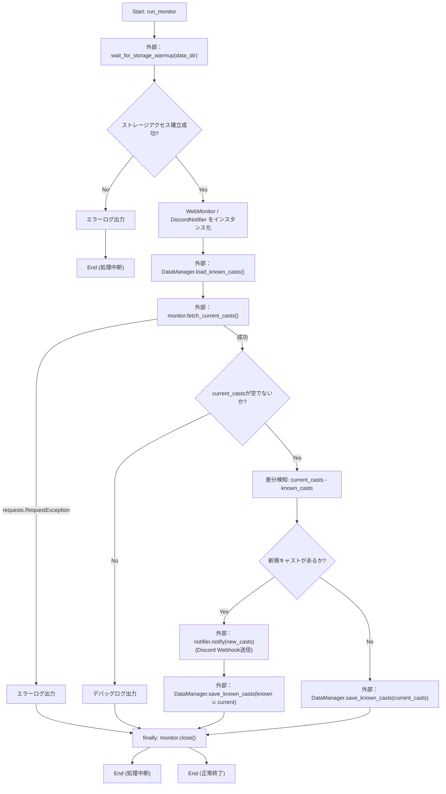

## 1. 解析メタ情報

| 項目 | 内容 |
| --- | --- |
| 対象ファイル | `newface_monitor.py` |
| 言語 | Python |
| 解析対象 | 提供されたコードのみ |
| 推測・補完 | 一切なし |

## 2. ファイルの概要

* モジュールDocstring上「NewFace Monitor System (Refactored for MY_HOME_SYSTEM)」と称される、対象Webサイト（`https://petitpetit-dream.com/newface/`）の新人キャスト紹介ページを定期巡回し、新規キャストの追加をDiscord Webhookで通知するバッチスクリプトである。
* `MY_HOME_SYSTEM`の共通コア機能（`core.logger`, `core.nas_utils`, `core.utils`）のインポートを試み、失敗時（単体テスト用・モジュール欠損時）はファイル内にフォールバック実装（ロガー、NASディレクトリ解決の簡易版、ストレージウォームアップ処理）を用意している。
* `requests`と`BeautifulSoup`を用いてターゲットページをスクレイピングし、キャスト情報（ID・名前・詳細URL・画像URL）を抽出、既知キャスト一覧（JSON永続化）との差分検知により新規キャストのみをDiscordへ通知する。
* 保存データはNAS等のストレージ上に一時ファイル経由のアトミック書き込みで永続化される。
* 根拠: [モジュールDocstring] (行番号: 4〜11 / 抜粋: "NewFace Monitor System (Refactored for MY_HOME_SYSTEM)\nTarget: https://petitpetit-dream.com/newface/")

## 3. 外部依存関係

### インポート一覧

| 名称 | 種類 | 用途 | 根拠 |
| --- | --- | --- | --- |
| `os` | 標準ライブラリ | 環境変数取得(`os.getenv`)、パス操作(`os.path.basename`) | 根拠: [import文] (行番号: 13 / 抜粋: "import os") |
| `json` | 標準ライブラリ | キャストデータのJSONシリアライズ/デシリアライズ | 根拠: [import文] (行番号: 14 / 抜粋: "import json") |
| `time` | 標準ライブラリ | Discord通知間のレート制限待機、リトライ間隔・Bot検知回避のランダム待機 | 根拠: [import文] (行番号: 15 / 抜粋: "import time") |
| `random` | 標準ライブラリ | スクレイピング前のランダムな待機時間生成 | 根拠: [import文] (行番号: 16 / 抜粋: "import random") |
| `sys` | 標準ライブラリ | `sys.path`へのプロジェクトルート追加 | 根拠: [import文] (行番号: 17 / 抜粋: "import sys ") |
| `logging` | 標準ライブラリ | フォールバック時のロガー基本設定・生成 | 根拠: [import文] (行番号: 18 / 抜粋: "import logging") |
| `dataclasses.dataclass`, `asdict` | 標準ライブラリ | `CastMember`データクラスの定義、辞書変換 | 根拠: [import文] (行番号: 19 / 抜粋: "from dataclasses import dataclass, asdict") |
| `pathlib.Path` | 標準ライブラリ | ファイル・ディレクトリパスの操作全般 | 根拠: [import文] (行番号: 20 / 抜粋: "from pathlib import Path") |
| `typing.List`, `Set`, `Dict`, `Optional` | 標準ライブラリ | 型ヒント全般 | 根拠: [import文] (行番号: 21 / 抜粋: "from typing import List, Set, Dict, Optional") |
| `urllib.parse.urljoin` | 標準ライブラリ | 相対URL（キャスト詳細ページ・画像）の絶対URL化 | 根拠: [import文] (行番号: 22 / 抜粋: "from urllib.parse import urljoin") |
| `requests` | サードパーティ | HTTPセッションの生成・GETリクエスト送信、Discord Webhookへの POST送信 | 根拠: [import文] (行番号: 30 / 抜粋: "import requests") |
| `requests.adapters.HTTPAdapter` | サードパーティ | セッションへのリトライ用アダプタのマウント | 根拠: [import文] (行番号: 31 / 抜粋: "from requests.adapters import HTTPAdapter") |
| `urllib3.util.retry.Retry` | サードパーティ | HTTPリクエストのリトライポリシー定義 | 根拠: [import文] (行番号: 32 / 抜粋: "from urllib3.util.retry import Retry") |
| `bs4.BeautifulSoup` | サードパーティ | 取得したHTMLのパース・要素抽出 | 根拠: [import文] (行番号: 33 / 抜粋: "from bs4 import BeautifulSoup") |
| `core.logger.get_logger` | 内部モジュール（オプショナル、try節） | ロガーインスタンスの取得。インポート失敗時はファイル内フォールバック実装を使用 | 根拠: [import文] (行番号: 38 / 抜粋: "from core.logger import get_logger") |
| `core.nas_utils.get_managed_target_directory` | 内部モジュール（オプショナル、try節） | NAS/ローカルのデータ保存ディレクトリの解決・管理。インポート失敗時はファイル内フォールバック実装を使用 | 根拠: [import文] (行番号: 39 / 抜粋: "from core.nas_utils import get_managed_target_directory") |
| `core.utils.wait_for_storage_warmup` | 内部モジュール（オプショナル、try節） | ストレージ（NAS等）が書き込み可能になるまでの待機処理。インポート失敗時はファイル内フォールバック実装を使用 | 根拠: [import文] (行番号: 40 / 抜粋: "from core.utils import wait_for_storage_warmup") |

### ブラックボックスとなる外部要素

| 名称 | 理由 | 根拠 |
| --- | --- | --- |
| `core.logger.get_logger` | インポート成功時に実際に使用される実装（フォーマット、出力先、ログレベル等）の詳細が本ファイルからは不明。フォールバック実装（`logging.getLogger`ベース）のみがこのファイルから確認できる。 | 根拠: [import文とフォールバック定義] (行番号: 38, 48〜49 / 抜粋: "from core.logger import get_logger") |
| `core.nas_utils.get_managed_target_directory` | インポート成功時の実際の実装（NASマウント確認・自動修復ロジックの詳細）が不明。フォールバック実装は単に`Path("./data")`を返すのみ。 | 根拠: [import文とフォールバック定義] (行番号: 39, 51〜52 / 抜粋: "from core.nas_utils import get_managed_target_directory") |
| `core.utils.wait_for_storage_warmup` | インポート成功時の実際の実装が不明。フォールバック実装（Exponential Backoffでのテストファイル書き込み確認）のみがこのファイルから確認できる。 | 根拠: [import文とフォールバック定義] (行番号: 40, 54〜91 / 抜粋: "from core.utils import wait_for_storage_warmup") |
| `https://petitpetit-dream.com/newface/` (対象Webサイト) | HTML構造（CSSセレクタが依拠する`ul.gallist li`等の実際のマークアップ）は本ファイルのコードからは分からず、外部Webサイトの実物に依存する。 | 根拠: [TARGET_URLとセレクタ定義] (行番号: 106, 109〜112 / 抜粋: "SELECTOR_CONTAINER: str = 'ul.gallist li'") |
| Discord Webhook API | Webhookエンドポイントの認証・レート制限・レスポンス仕様の詳細は本ファイルのコードからは分からず、Discord側の実装に依存する。 | 根拠: [Webhook POST送信] (行番号: 239 / 抜粋: "response = requests.post(self.webhook_url, json=payload, timeout=10)") |

## 4. 主要要素の定義（関数 / エンドポイント / コンポーネント）

### `get_logger` (フォールバック実装)

* **役割**: `core.logger`のインポートに失敗した場合に使用される、標準`logging`モジュールベースの簡易ロガー取得関数。
* 根拠: [関数定義] (行番号: 48〜49 / 抜粋: "def get_logger(name: str) -> logging.Logger: \n        return logging.getLogger(name)")

* **引数/リクエスト**: `name: str`
* 根拠: [引数定義] (行番号: 48 / 抜粋: "def get_logger(name: str) -> logging.Logger: ")

* **戻り値/レスポンス**: `logging.Logger`
* 根拠: [戻り値ヒント] (行番号: 48 / 抜粋: "-> logging.Logger: ")

* **副作用**: なし（`logging.getLogger`は既存ロガーの取得または新規作成）
* **エラーハンドリング**: なし

### `get_managed_target_directory` (フォールバック実装)

* **役割**: `core.nas_utils`のインポートに失敗した場合に使用される、常に固定のローカルディレクトリ`./data`を返す簡易フォールバック関数。
* 根拠: [関数定義] (行番号: 51〜52 / 抜粋: "def get_managed_target_directory(*args, **kwargs) -> Path: \n        return Path("./data")")

* **引数/リクエスト**: `*args`, `**kwargs`（本フォールバック実装では未使用、シグネチャ互換のためのみ受け取る）
* 根拠: [引数定義] (行番号: 51 / 抜粋: "def get_managed_target_directory(*args, **kwargs) -> Path: ")

* **戻り値/レスポンス**: `Path`（常に`Path("./data")`）
* 根拠: [戻り値] (行番号: 52 / 抜粋: "return Path("./data")")

* **副作用**: なし
* **エラーハンドリング**: なし

### `wait_for_storage_warmup` (フォールバック実装)

* **役割**: NAS等のストレージがマウントされ書き込み可能になるまで、テストファイルの作成・削除による死活確認とExponential Backoffでのリトライにより待機する。`core.utils`のインポート失敗時に使用される。
* 根拠: [関数定義とDocstring] (行番号: 54〜66 / 抜粋: "def wait_for_storage_warmup(target_dir: Path, max_retries: int = 5, base_delay: float = 1.0) -> bool:\n        """\n        NAS等のストレージがマウントされ、書き込み可能になるまで待機する。")

* **引数/リクエスト**: `target_dir: Path`（アクセス確認を行う対象ディレクトリ）, `max_retries: int = 5`（最大リトライ回数）, `base_delay: float = 1.0`（ベースとなる待機時間・秒）
* 根拠: [引数定義とDocstring] (行番号: 54, 59〜62 / 抜粋: "target_dir (Path): アクセス確認を行う対象ディレクトリ。\n            max_retries (int): 最大リトライ回数。\n            base_delay (float): ベースとなる待機時間（秒）。")

* **戻り値/レスポンス**: `bool`（アクセス確立できた場合`True`、最大リトライ到達で`False`）
* 根拠: [Docstring] (行番号: 64〜65 / 抜粋: "bool: ストレージへのアクセスが確立できた場合はTrue、タイムアウトした場合はFalse。")

* **副作用**: ディレクトリ作成試行(`target_dir.mkdir`)、テストファイル(`.storage_warmup_test`)の書き込み・削除、デバッグ/エラーログ出力、リトライ時の`time.sleep`。
* 根拠: [処理内容] (行番号: 70, 80〜81 / 抜粋: "test_file.write_text("warmup_check", encoding="utf-8")\n                test_file.unlink()")

* **エラーハンドリング**: ディレクトリ作成失敗(`OSError`)時はデバッグログを出力し後続I/Oテストへ処理を継続。テストファイルの書き込み/削除失敗(`IOError`/`OSError`)時はExponential Backoffで待機しリトライ。最大試行後もアクセスできない場合はエラーログを出力し`False`を返す（パニックを起こさない設計）。
* 根拠: [try-exceptブロックとコメント] (行番号: 71〜73, 84〜87, 89〜91 / 抜粋: "# 最終的にアクセスできない場合はパニックを起こさずFalseを返す\n        logger.error(f"Storage warmup failed after {max_retries} attempts.")\n        return False")

### `MonitorConfig`

* **役割**: 監視対象URL、CSSセレクタ、ファイルパス、ネットワーク設定（User-Agent、タイムアウト、リトライ）、Discord Webhook URLなど、モニタリング処理全体で使用される設定値・定数を集約管理するクラス。
* 根拠: [クラス定義とDocstring] (行番号: 102〜103 / 抜粋: "class MonitorConfig:\n    """モニタリング設定および定数管理クラス。"""")

* **引数/リクエスト**: なし（クラス変数として静的に定義。インスタンス化は行われない）
* 根拠: [クラス変数定義群] (行番号: 106〜131 / 抜粋: "TARGET_URL: str = 'https://petitpetit-dream.com/newface/'")

* **戻り値/レスポンス**: 該当なし
* **副作用**: `DISCORD_WEBHOOK_URL`のクラス変数定義時に環境変数`DISCORD_WEBHOOK_URL`を読み込む。
* 根拠: [環境変数読み込み] (行番号: 131 / 抜粋: "DISCORD_WEBHOOK_URL: Optional[str] = os.getenv('DISCORD_WEBHOOK_URL')")

* **エラーハンドリング**: なし

### `MonitorConfig.get_data_dir`

* **役割**: NASアクセスを検証・修復し、動的にデータディレクトリを解決するクラスメソッド。クラスロード時ではなく実処理が必要になったタイミング（遅延評価）でマウント確認・自動修復ロジックを実行する。
* 根拠: [メソッド定義とDocstring] (行番号: 133〜147 / 抜粋: "def get_data_dir(cls) -> Path:\n        """NASアクセスを検証・修復し、動的にデータディレクトリを解決する。")

* **引数/リクエスト**: なし（`cls`のみ、`@classmethod`）
* 根拠: [デコレータと引数] (行番号: 133〜134 / 抜粋: "@classmethod\n    def get_data_dir(cls) -> Path:")

* **戻り値/レスポンス**: `Path`（利用可能なデータディレクトリパス）
* 根拠: [Docstringと戻り値] (行番号: 140〜143 / 抜粋: "Returns:\n            Path: 利用可能なディレクトリパス\n        """\n        return get_managed_target_directory(")

* **副作用**: `get_managed_target_directory`（インポート成功時は`core.nas_utils`、失敗時はフォールバック実装）の呼び出し。
* 根拠: [呼び出し] (行番号: 143〜147 / 抜粋: "return get_managed_target_directory(\n            nas_dir_str=cls.NAS_DIR_STR, \n            fallback_dir_str=cls.LOCAL_DIR_STR,\n            mount_point=cls.MOUNT_POINT\n        )")

* **エラーハンドリング**: なし（本メソッド自体には例外処理なし。委譲先の実装に依存）

### `MonitorConfig.get_data_file`

* **役割**: 既知キャストデータを保存するJSONファイル(`known_casts.json`)の完全なパスを取得するクラスメソッド。
* 根拠: [メソッド定義とDocstring] (行番号: 149〜156 / 抜粋: "def get_data_file(cls) -> Path:\n        """保存先JSONファイルのパスを取得する。")

* **引数/リクエスト**: なし（`cls`のみ、`@classmethod`）
* 根拠: [デコレータと引数] (行番号: 149〜150 / 抜粋: "@classmethod\n    def get_data_file(cls) -> Path:")

* **戻り値/レスポンス**: `Path`（`known_casts.json`の完全なパス）
* 根拠: [Docstringと戻り値] (行番号: 153〜156 / 抜粋: "Returns:\n            Path: known_casts.json の完全なパス\n        """\n        return cls.get_data_dir() / 'known_casts.json'")

* **副作用**: `get_data_dir()`の呼び出し（間接的にNASアクセス検証等の副作用を引き起こしうる）。
* 根拠: [呼び出し] (行番号: 156 / 抜粋: "return cls.get_data_dir() / 'known_casts.json'")

* **エラーハンドリング**: なし

### `CastMember`

* **役割**: キャスト情報（ID、名前、詳細URL、画像URL）を表現するイミュータブルでないデータクラス。ID(`id`)に基づくハッシュ・等価比較を独自定義することで、`Set[CastMember]`による重複排除・差分検知を可能にしている。
* 根拠: [クラス定義とDocstring] (行番号: 163〜176 / 抜粋: "@dataclass\nclass CastMember:\n    """キャスト情報を表現するデータクラス。")

* **引数/リクエスト**: `id: str`, `name: str`, `detail_url: str`, `image_url: str`
* 根拠: [フィールド定義] (行番号: 173〜176 / 抜粋: "id: str\n    name: str\n    detail_url: str\n    image_url: str")

* **戻り値/レスポンス**: 該当なし（データクラスのフィールド定義自体）
* **副作用**: なし
* **エラーハンドリング**: なし

### `CastMember.__hash__`

* **役割**: `id`フィールドのみに基づくハッシュ値を返す。`Set[CastMember]`での重複排除の基準を`id`のみとするためのオーバーライド。
* 根拠: [メソッド定義] (行番号: 178〜179 / 抜粋: "def __hash__(self) -> int:\n        return hash(self.id)")

* **引数/リクエスト**: なし（`self`のみ）
* **戻り値/レスポンス**: `int`
* 根拠: [戻り値ヒント] (行番号: 178 / 抜粋: "def __hash__(self) -> int:")

* **副作用**: なし
* **エラーハンドリング**: なし

### `CastMember.__eq__`

* **役割**: 比較対象が`CastMember`インスタンスであり、かつ`id`が一致する場合にのみ等価と判定する。
* 根拠: [メソッド定義] (行番号: 181〜184 / 抜粋: "def __eq__(self, other: object) -> bool:\n        if not isinstance(other, CastMember):\n            return False\n        return self.id == other.id")

* **引数/リクエスト**: `other: object`
* **戻り値/レスポンス**: `bool`
* 根拠: [戻り値ヒント] (行番号: 181 / 抜粋: "def __eq__(self, other: object) -> bool:")

* **副作用**: なし
* **エラーハンドリング**: なし（型不一致時は例外ではなく`False`を返す設計）

### `CastMember.to_dict`

* **役割**: `CastMember`インスタンスをJSONシリアライズ可能な辞書形式に変換する。
* 根拠: [メソッド定義とDocstring] (行番号: 186〜192 / 抜粋: "def to_dict(self) -> Dict[str, str]:\n        """辞書形式に変換する。")

* **引数/リクエスト**: なし（`self`のみ）
* **戻り値/レスポンス**: `Dict[str, str]`（`asdict(self)`の結果）
* 根拠: [戻り値] (行番号: 192 / 抜粋: "return asdict(self)")

* **副作用**: なし
* **エラーハンドリング**: なし

### `DiscordNotifier`

* **役割**: Discordへの通知送信を担当するサービスクラス。コンストラクタでWebhook URLを受け取り保持する。
* 根拠: [クラス定義とDocstring] (行番号: 199〜200 / 抜粋: "class DiscordNotifier:\n    """Discordへの通知を担当するサービスクラス。"""")

* **引数/リクエスト**: `__init__(self, webhook_url: Optional[str])`
* 根拠: [__init__定義] (行番号: 202〜207 / 抜粋: "def __init__(self, webhook_url: Optional[str]):")

* **戻り値/レスポンス**: 該当なし
* **副作用**: `self.webhook_url`への代入
* 根拠: [属性代入] (行番号: 207 / 抜粋: "self.webhook_url = webhook_url")

* **エラーハンドリング**: なし

### `DiscordNotifier.notify`

* **役割**: 新規キャストのリストを受け取り、各キャストごとにDiscord埋め込みメッセージ(embed)を構築してWebhook経由で送信する。Webhook URL未設定時は送信をスキップし、認証エラー(401/404)発生時は残りの通知処理を打ち切る（サーキットブレーカー）。
* 根拠: [メソッド定義とDocstring] (行番号: 209〜214 / 抜粋: "def notify(self, new_casts: List[CastMember]) -> None:\n        """新規キャスト情報をDiscordに通知する。")

* **引数/リクエスト**: `new_casts: List[CastMember]`
* 根拠: [引数定義とDocstring] (行番号: 209, 212〜213 / 抜粋: "new_casts (List[CastMember]): 通知対象の新規キャストリスト。")

* **戻り値/レスポンス**: `None`
* 根拠: [戻り値ヒント] (行番号: 209 / 抜粋: "def notify(self, new_casts: List[CastMember]) -> None:")

* **副作用**: Webhook URL未設定時の警告ログ出力、各キャストごとのレート制限回避待機(`time.sleep(1)`)、Discord Webhookへの`requests.post`呼び出し、成功/失敗のログ出力。
* 根拠: [送信処理] (行番号: 238〜241 / 抜粋: "time.sleep(1)\n                response = requests.post(self.webhook_url, json=payload, timeout=10)\n                response.raise_for_status()\n                logger.info(f"Notification sent successfully for: {cast.name}")")

* **エラーハンドリング**: Webhook URLが未設定または`'YOUR_DISCORD'`を含む場合は警告ログを出力し即座に処理を中断(`return`)。`requests.HTTPError`発生時はエラーログを出力し、ステータスコードが401または404であればさらにエラーログを出力したうえで通知ループを`break`で打ち切る。それ以外の`requests.RequestException`発生時はエラーログを出力し次のキャストの処理を継続する。
* 根拠: [各エラー分岐] (行番号: 215〜217, 242〜254 / 抜粋: "if not self.webhook_url or 'YOUR_DISCORD' in self.webhook_url:\n            logger.warning("Discord Webhook URL is not configured. Skipping notification.")\n            return")

### `DataManager`

* **役割**: 既知キャストデータのファイルへの永続化と読み込みを担当するクラス（インスタンス化不要、`@staticmethod`のみで構成）。
* 根拠: [クラス定義とDocstring] (行番号: 257〜258 / 抜粋: "class DataManager:\n    """データの永続化と読み込みを担当するクラス。"""")

* **引数/リクエスト**: 該当なし（クラス自体には状態を持たない）
* **戻り値/レスポンス**: 該当なし
* **副作用**: なし（クラス定義自体には副作用なし）
* **エラーハンドリング**: なし

### `DataManager.load_known_casts`

* **役割**: `MonitorConfig.get_data_file()`が指すJSONファイルから既知キャストデータを読み込み、`CastMember`の集合として返す静的メソッド。
* 根拠: [メソッド定義とDocstring] (行番号: 260〜266 / 抜粋: "def load_known_casts() -> Set[CastMember]:\n        """保存済みのキャストデータを読み込む。")

* **引数/リクエスト**: なし
* 根拠: [引数] (行番号: 261 / 抜粋: "def load_known_casts() -> Set[CastMember]:")

* **戻り値/レスポンス**: `Set[CastMember]`（ファイル不在時・読み込み失敗時は空集合）
* 根拠: [Docstringと各return] (行番号: 264〜265, 270, 275, 279 / 抜粋: "Returns:\n            Set[CastMember]: 既知のキャストの集合。読み込み失敗時は空集合を返す。")

* **副作用**: JSONファイルの読み込み(`open`, `json.load`)、デバッグ/エラーログ出力。
* 根拠: [ファイル読み込み] (行番号: 273〜275 / 抜粋: "with open(data_file, 'r', encoding='utf-8') as f:\n                data = json.load(f)\n                return {CastMember(**item) for item in data}")

* **エラーハンドリング**: データファイルが存在しない場合はデバッグログを出力し空集合を返す。`json.JSONDecodeError`または`IOError`発生時はエラーログを出力し、安全側に倒して空集合を返す（コメントに「データ破損時は安全側に倒して空集合（再通知される可能性があるがシステム停止よりマシ）」と明記）。
* 根拠: [try-exceptブロックとコメント] (行番号: 276〜279 / 抜粋: "except (json.JSONDecodeError, IOError) as e:\n            logger.error(f"Failed to load data from {data_file}: {e}")\n            # データ破損時は安全側に倒して空集合（再通知される可能性があるがシステム停止よりマシ）\n            return set()")

### `DataManager.save_known_casts`

* **役割**: キャスト集合をJSONファイルへアトミックに保存する静的メソッド。一時ファイルへ書き出したのち`replace`で置き換えることで、書き込み中断時の既存データ破損/消失を防ぐ。
* 根拠: [メソッド定義とDocstring] (行番号: 281〜287 / 抜粋: "def save_known_casts(casts: Set[CastMember]) -> None:\n        """キャストデータをJSONファイルに保存する。")

* **引数/リクエスト**: `casts: Set[CastMember]`
* 根拠: [引数定義とDocstring] (行番号: 282, 285〜286 / 抜粋: "casts (Set[CastMember]): 保存対象のキャスト集合。")

* **戻り値/レスポンス**: `None`
* 根拠: [戻り値ヒント] (行番号: 282 / 抜粋: "def save_known_casts(casts: Set[CastMember]) -> None:")

* **副作用**: 保存先ディレクトリの作成(`mkdir`)、一時ファイル(`.tmp`)への書き込み、`tmp_path.replace(data_file)`によるアトミックな置換、デバッグログ出力。
* 根拠: [アトミック書き込み処理とコメント] (行番号: 293〜299 / 抜粋: "# アトミック書き込み: 一時ファイルに書き出してから置き換えることで、\n            # 書き込み中断時に既存データが破損/空になるのを防ぐ\n            # (batch_download_discord.py の _purge_skipped_tasks と同じパターン)\n            tmp_path = data_file.with_suffix(data_file.suffix + '.tmp')")

* **エラーハンドリング**: `IOError`発生時は`exc_info=True`付きでエラーログを出力する（例外の再送出はしない）。
* 根拠: [try-exceptブロック] (行番号: 302〜303 / 抜粋: "except IOError as e:\n            logger.error(f"Failed to save data: {e}", exc_info=True)")

### `WebMonitor`

* **役割**: 対象Webサイトの監視・スクレイピングを統括するクラス。コンストラクタでリトライ機能付きHTTPセッションを初期化する。
* 根拠: [クラス定義とDocstring] (行番号: 306〜307 / 抜粋: "class WebMonitor:\n    """Webサイトの監視とスクレイピングを統括するクラス。"""")

* **引数/リクエスト**: `__init__(self)`（引数なし）
* 根拠: [__init__定義とDocstring] (行番号: 309〜311 / 抜粋: "def __init__(self):\n        """HTTPセッションの初期化を行う。"""\n        self.session = self._create_robust_session()")

* **戻り値/レスポンス**: 該当なし
* **副作用**: `self.session`への`_create_robust_session()`結果の代入。
* 根拠: [属性代入] (行番号: 311 / 抜粋: "self.session = self._create_robust_session()")

* **エラーハンドリング**: なし

### `WebMonitor._create_robust_session`

* **役割**: `MonitorConfig`の設定（`RETRY_TOTAL`, `RETRY_BACKOFF`, `USER_AGENT`）に基づき、HTTP 500/502/503/504エラー時にGETリクエストをリトライする`requests.Session`を生成する。
* 根拠: [メソッド定義とDocstring] (行番号: 313〜319 / 抜粋: "def _create_robust_session(self) -> requests.Session:\n        """リトライロジックを組み込んだ堅牢なHTTPセッションを作成する。")

* **引数/リクエスト**: なし（`self`のみ）
* 根拠: [引数定義] (行番号: 313 / 抜粋: "def _create_robust_session(self) -> requests.Session:")

* **戻り値/レスポンス**: `requests.Session`（設定済みセッションオブジェクト）
* 根拠: [Docstringと戻り値] (行番号: 316〜317, 330 / 抜粋: "Returns:\n            requests.Session: 設定済みのセッションオブジェクト。")

* **副作用**: なし（セッションオブジェクトの生成・設定のみ、外部通信は発生しない）
* 根拠: [処理内容] (行番号: 319〜329 / 抜粋: "session = requests.Session()\n        retries = Retry(")

* **エラーハンドリング**: なし

### `WebMonitor.fetch_current_casts`

* **役割**: Bot検知回避のためのランダム待機後、対象URLにGETリクエストを送信し、レスポンスHTMLを`_parse_html`に渡してキャスト情報の集合を取得する。
* 根拠: [メソッド定義とDocstring] (行番号: 332〜339 / 抜粋: "def fetch_current_casts(self) -> Set[CastMember]:\n        """ターゲットURLから現在のキャスト一覧を取得する。")

* **引数/リクエスト**: なし（`self`のみ）
* 根拠: [引数定義] (行番号: 332 / 抜粋: "def fetch_current_casts(self) -> Set[CastMember]:")

* **戻り値/レスポンス**: `Set[CastMember]`（現在掲載されているキャストの集合）
* 根拠: [Docstring] (行番号: 335〜336 / 抜粋: "Returns:\n            Set[CastMember]: 現在掲載されているキャストの集合。")

* **副作用**: ランダム待機(`time.sleep(random.uniform(1.0, 3.0))`)、ターゲットURLへのHTTP GETリクエスト、デバッグログ出力。
* 根拠: [処理内容] (行番号: 343, 346 / 抜粋: "time.sleep(random.uniform(1.0, 3.0))\n\n            logger.debug(f"Fetching URL: {MonitorConfig.TARGET_URL}")\n            response = self.session.get(MonitorConfig.TARGET_URL, timeout=MonitorConfig.TIMEOUT)")

* **エラーハンドリング**: `requests.RequestException`発生時はエラーログを出力したうえで例外を再送出(`raise`)し、呼び出し元でのハンドリングを要求する（Docstringにも「通信エラー時」に本例外を送出する旨明記）。
* 根拠: [try-exceptブロックとDocstring] (行番号: 338〜339, 352〜355 / 抜粋: "Raises:\n            requests.RequestException: 通信エラー時。")

### `WebMonitor._parse_html`

* **役割**: `BeautifulSoup`オブジェクトから、設定済みCSSセレクタ（`SELECTOR_CONTAINER`, `SELECTOR_NAME`, `SELECTOR_LINK`, `SELECTOR_IMAGE`）を用いて各キャストのコンテナ要素を抽出し、名前・詳細URL・ID・画像URLを取り出して`CastMember`集合を構築する。
* 根拠: [メソッド定義とDocstring] (行番号: 357〜364 / 抜粋: "def _parse_html(self, soup: BeautifulSoup) -> Set[CastMember]:\n        """HTMLスープからキャスト情報を抽出する。")

* **引数/リクエスト**: `soup: BeautifulSoup`
* 根拠: [引数定義とDocstring] (行番号: 357, 360〜361 / 抜粋: "soup (BeautifulSoup): 解析対象のHTML。")

* **戻り値/レスポンス**: `Set[CastMember]`（抽出されたキャストの集合。コンテナ要素が見つからない場合は空集合）
* 根拠: [Docstringと各return] (行番号: 363〜364, 374, 421 / 抜粋: "Returns:\n            Set[CastMember]: 抽出されたキャストの集合。")

* **副作用**: セレクタが要素にマッチしなかった場合の警告ログ出力、個別要素のパース失敗時の警告ログ出力、デバッグログ出力。URLの正規化（クエリ文字列除去によるID安定化、`urljoin`による絶対URL化）を行う。
* 根拠: [ID正規化のコメントと処理] (行番号: 391〜395 / 抜粋: "# クエリ文字列(?utm=...等)が付与されるとcast_idが実行ごとに\n                    # ブレて「新規キャスト」の誤検知を招くため、先に除去する\n                    href_no_query = href.split('?')[0]\n                    clean_path = href_no_query.rstrip('/')\n                    cast_id = os.path.basename(clean_path)")

* **エラーハンドリング**: コンテナ要素が1件も見つからない場合は警告ログを出力し空集合を返す。個別のキャスト要素パース中に例外が発生した場合は警告ログを出力し、その要素をスキップして次の要素の処理を継続する（`continue`）。
* 根拠: [try-exceptブロック] (行番号: 415〜418 / 抜粋: "except Exception as e:\n                # 個別のパースエラーで全体を止めない\n                logger.warning(f"Error parsing specific cast element: {e}")\n                continue")

### `WebMonitor.close`

* **役割**: 保持しているHTTPセッションのリソースを明示的に解放する。
* 根拠: [メソッド定義とDocstring] (行番号: 423〜426 / 抜粋: "def close(self):\n        """リソースを明示的に解放する。"""\n        if self.session:\n            self.session.close()")

* **引数/リクエスト**: なし（`self`のみ）
* **戻り値/レスポンス**: `None`（暗黙）
* **副作用**: `self.session.close()`によるHTTPセッションのクローズ。
* 根拠: [クローズ処理] (行番号: 426 / 抜粋: "self.session.close()")

* **エラーハンドリング**: `self.session`が存在する場合にのみクローズを実行するガード節のみ。
* 根拠: [ガード節] (行番号: 425 / 抜粋: "if self.session:")

### `run_monitor`

* **役割**: モニタープロセス全体のメインロジック。ストレージのウォームアップ確認、既知キャストの読み込み、現在キャストの取得、差分検知、新規キャストのDiscord通知、データ保存を順に実行するオーケストレーション関数。
* 根拠: [関数定義とDocstring] (行番号: 433〜434 / 抜粋: "def run_monitor() -> None:\n    """モニタープロセスのメインロジック。"""")

* **引数/リクエスト**: なし
* 根拠: [引数定義] (行番号: 433 / 抜粋: "def run_monitor() -> None:")

* **戻り値/レスポンス**: `None`
* 根拠: [戻り値ヒント] (行番号: 433 / 抜粋: "def run_monitor() -> None:")

* **副作用**: デバッグログ出力（開始・終了）、`wait_for_storage_warmup`の呼び出し、`WebMonitor`・`DiscordNotifier`のインスタンス化、`DataManager.load_known_casts`/`save_known_casts`の呼び出し、`monitor.fetch_current_casts()`によるHTTP通信、`notifier.notify()`によるDiscord通知、`finally`ブロックでの`monitor.close()`呼び出し。
* 根拠: [メイン処理フロー] (行番号: 447〜477 / 抜粋: "monitor = WebMonitor()\n        notifier = DiscordNotifier(MonitorConfig.DISCORD_WEBHOOK_URL)")

* **エラーハンドリング**: ストレージウォームアップ失敗時はエラーログを出力し処理を中断(`return`)。`monitor.fetch_current_casts()`での`requests.RequestException`発生時はエラーログを出力し中断(`return`)。キャストが1件も取得できなかった場合はデバッグログを出力し中断。それ以外の全ての例外は最上位の`try-except Exception`で捕捉し`logger.critical`（`exc_info=True`付き）でログ出力する。`finally`ブロックで`monitor`が生成済みであれば`close()`を確実に呼び出す。
* 根拠: [各種エラーハンドリング] (行番号: 440〜442, 456〜458, 460〜462, 479〜480, 482〜485 / 抜粋: "except Exception as e:\n        logger.critical(f"Critical error in NewFace Monitor: {e}", exc_info=True)")

### `if __name__ == "__main__":` ブロック

* **役割**: スクリプトとして直接実行された場合に`run_monitor()`を呼び出すエントリーポイント。
* 根拠: [エントリーポイント定義] (行番号: 489〜490 / 抜粋: "if __name__ == "__main__":\n    run_monitor()")

* **引数/リクエスト**: なし
* **戻り値/レスポンス**: 該当なし
* **副作用**: `run_monitor()`の実行（本関数がもつ全ての副作用を誘発）。
* 根拠: [呼び出し] (行番号: 490 / 抜粋: "run_monitor()")

* **エラーハンドリング**: なし（`run_monitor`内部で例外が処理される設計）

## 5. 処理フロー図

`run_monitor`のメインロジックのフローを示します。

## 6. 依存関係図

```mermaid
graph TD
    subgraph "newface_monitor.py"
        logger["logger (Global)"]
        MonitorConfig["MonitorConfig"]
        CastMember["CastMember"]
        DiscordNotifier["DiscordNotifier"]
        DataManager["DataManager"]
        WebMonitor["WebMonitor"]
        run_monitor["run_monitor()"]
        get_logger_fb["get_logger() (fallback)"]
        get_managed_dir_fb["get_managed_target_directory() (fallback)"]
        wait_warmup_fb["wait_for_storage_warmup() (fallback)"]
    end

    subgraph "外部依存（コアモジュール、try節）"
        core_logger["core.logger.get_logger"]
        core_nas_utils["core.nas_utils.get_managed_target_directory"]
        core_utils["core.utils.wait_for_storage_warmup"]
    end

    subgraph "外部依存（サードパーティ）"
        requests_mod["requests"]
        bs4["bs4.BeautifulSoup"]
        urllib3["urllib3.util.retry.Retry"]
    end

    subgraph "外部依存（外部システム）"
        TargetSite["対象Webサイト<br>(petitpetit-dream.com)"]
        DiscordAPI["Discord Webhook API"]
        Storage["NAS/ローカルストレージ"]
    end

    logger -.->|"インポート成功時"| core_logger
    logger -.->|"インポート失敗時"| get_logger_fb

    MonitorConfig -->|"get_data_dir経由"| core_nas_utils
    MonitorConfig -.->|"インポート失敗時"| get_managed_dir_fb

    run_monitor --> wait_warmup_fb
    run_monitor -.->|"インポート成功時"| core_utils
    run_monitor --> WebMonitor
    run_monitor --> DiscordNotifier
    run_monitor --> DataManager
    run_monitor --> MonitorConfig

    WebMonitor --> requests_mod
    WebMonitor --> bs4
    WebMonitor --> urllib3
    WebMonitor --> MonitorConfig
    WebMonitor --> TargetSite

    DiscordNotifier --> requests_mod
    DiscordNotifier --> DiscordAPI

    DataManager --> MonitorConfig
    DataManager --> Storage

    WebMonitor --> CastMember
```

## 7. 次のステップ（リバースエンジニアリングの提案）

| 優先度 | ファイル名(推測可) | 理由 | 根拠 |
| --- | --- | --- | --- |
| 高 | `core/nas_utils.py` | `get_managed_target_directory`の実際の実装（NASマウント確認・自動修復ロジック）が、フォールバック実装（単に`Path("./data")`を返すのみ）とどう異なるかを確認する必要があるため。 | 根拠: [import文] (行番号: 39 / 抜粋: "from core.nas_utils import get_managed_target_directory") |
| 中 | `core/utils.py` | `wait_for_storage_warmup`の実際の実装が、フォールバック実装（Exponential Backoffでのテストファイル書き込み確認）と同等かどうかを確認するため。 | 根拠: [import文] (行番号: 40 / 抜粋: "from core.utils import wait_for_storage_warmup") |
| 中 | `core/logger.py` | `get_logger`の実際の実装（出力フォーマット、ログレベル、出力先）を確認するため。 | 根拠: [import文] (行番号: 38 / 抜粋: "from core.logger import get_logger") |
| 低 | 対象Webサイトの実際のHTML構造（`petitpetit-dream.com/newface/`） | `SELECTOR_CONTAINER`等のCSSセレクタが正しく機能する前提となる実際のマークアップ構造を確認するため（コード外の外部サイト）。 | 根拠: [セレクタ定義] (行番号: 109〜112 / 抜粋: "SELECTOR_CONTAINER: str = 'ul.gallist li'") |

## 8. 保守上の注意点

* **フォールバック実装と本番実装の差異リスク**: `core.logger`, `core.nas_utils`, `core.utils`のインポートに失敗した場合、ファイル内の簡易フォールバック実装（特に`get_managed_target_directory`は常に`Path("./data")`を返すのみ）に切り替わる。本番環境で意図せずインポートが失敗した場合、NASではなくローカルディスクにデータが保存される可能性がある。
* **広範な例外キャッチ**: `run_monitor`の最上位で`except Exception as e:`により全例外を捕捉している。予期しないバグ（型エラー等）も`logger.critical`でログされるのみで処理が握りつぶされる。
* **HTML構造への強い依存**: `_parse_html`は`MonitorConfig`にハードコードされたCSSセレクタ（`ul.gallist li`, `article h3 a`, `div.ph img:not(.list_today)`）に依存しており、対象サイトのレイアウト変更で抽出が機能しなくなるリスクがある（該当箇所には警告ログでの検知は用意されている）。
* **`CastMember`の`__eq__`/`__hash__`が`id`のみに依拠**: `name`, `detail_url`, `image_url`が変化しても`id`が同一であれば同一キャストとみなされ、差分検知(`current_casts - known_casts`)では検知されない（名前変更等は新規追加として通知されない）。
* **Discord通知のレート制限考慮**: `notify`メソッドは各キャスト送信前に`time.sleep(1)`の固定待機のみで、Discord側の実際のレート制限ヘッダー（`X-RateLimit-*`等）を参照した動的な調整は行っていない。
* **`__init__.py`側の`import time`重複**: フォールバックブロック内（行番号45）で`import time`が再度行われており、モジュール冒頭（行番号15）の`import time`と重複している（実害はないが冗長）。
* **ハードコードされた値**: 対象URL、CSSセレクタ、NASパス(`/mnt/nas/home_system/newface_monitor/data`)、User-Agent文字列、タイムアウト・リトライ回数などがすべて`MonitorConfig`にハードコードされている。

## 9. 不明事項一覧

| 項目 | 理由 | 必要なファイル |
| --- | --- | --- |
| `core.logger.get_logger`の実際の実装 | ログの出力フォーマット、出力先、ログレベルの詳細が本ファイルからは不明（フォールバック実装のみ確認可能）。 | `core/logger.py` |
| `core.nas_utils.get_managed_target_directory`の実際の実装 | NASマウント確認・自動修復ロジックの詳細な挙動が不明（フォールバック実装は単純なローカルパス返却のみ）。 | `core/nas_utils.py` |
| `core.utils.wait_for_storage_warmup`の実際の実装 | フォールバック実装と同等の挙動をするか、追加のロジックがあるかが不明。 | `core/utils.py` |
| 対象Webサイトの実際のHTML構造 | `SELECTOR_CONTAINER`等のセレクタが対応する正確なマークアップ構造は本ファイルのコードからは分からない。 | 対象サイトの実際のHTMLソース（コード外） |
| Discord Webhook APIの詳細仕様 | ペイロード形式以外の認証方式、レート制限、エラーレスポンスの詳細仕様が本ファイルからは不明。 | Discord公式APIドキュメント（コード外） |
| 本ファイルの実行方法（cron設定等） | `if __name__ == "__main__":`で直接実行される想定だが、定期実行のスケジューリング方法（cron、systemdタイマー等）は本ファイルからは不明。 | デプロイ設定・cron定義ファイル等 |

## 10. 自己検証結果

* [x] 推測・外部ファイルの仕様を一切含んでいない
* [x] 全関数・全クラス・全コンポーネントを列挙した
* [x] 全てのインポート要素を列挙した
* [x] すべての仕様説明に「根拠（行番号・抜粋）」を明記した
* [x] 根拠漏れが0件である
* [x] Mermaid構文にエラーの原因となる記号（エスケープ漏れ）がない
* [x] 不明事項を漏れなく列挙した

完了
