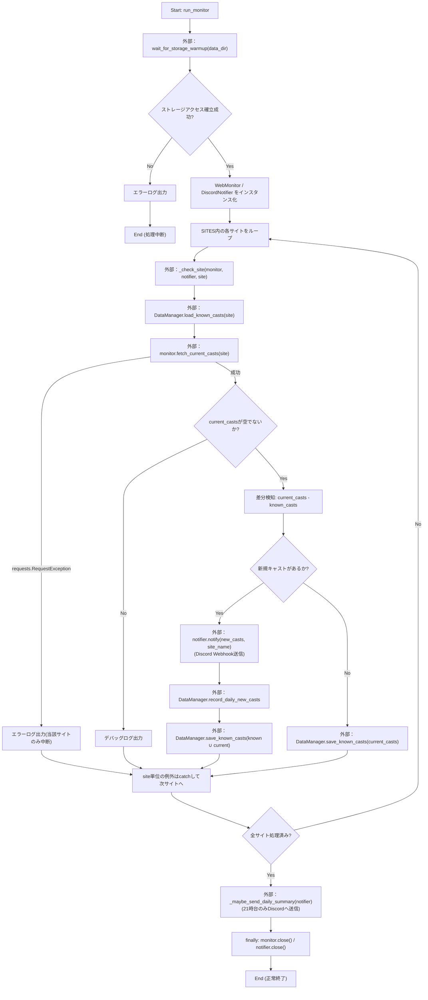

## 1. 解析メタ情報

| 項目 | 内容 |
| --- | --- |
| 対象ファイル | `newface_monitor.py` |
| 言語 | Python |
| 解析対象 | 提供されたコードのみ |
| 推測・補完 | 一切なし |

## 関連ドキュメント

* [../MY_HOME_SYSTEM/nas_utils.md](../MY_HOME_SYSTEM/nas_utils.md) — 本ファイルがインポートを試みる`core.nas_utils.get_managed_target_directory`の実装候補（同名関数のシグネチャ・実装が確認できる）。
* [../MY_HOME_SYSTEM/utils.md](../MY_HOME_SYSTEM/utils.md) — 本ファイルがインポートを試みる`core.utils.wait_for_storage_warmup`の実装候補（同名関数のシグネチャ・実装が確認できる）。
* [../MY_HOME_SYSTEM/logger.md](../MY_HOME_SYSTEM/logger.md) — `core.logger`配下のロガー実装（`setup_logging`, `DiscordErrorHandler`）に関する参考情報。ただし本ファイルがインポートする`get_logger`関数自体はこのドキュメントでは文書化されていない。
* [../MY_HOME_SYSTEM/notification_service.md](../MY_HOME_SYSTEM/notification_service.md) — Discord Webhook通知の別実装パターンとの比較参考（本ファイルは`services.notification_service`を使わず、独自の`DiscordNotifier`クラスで`requests`セッションを直接使いWebhookへPOSTする）。
* [../MY_HOME_SYSTEM/nas_monitor.md](../MY_HOME_SYSTEM/nas_monitor.md) — NAS監視・容量管理という運用文脈での関連。
* [batch_download_discord.md](./batch_download_discord.md) — 一時ファイル経由のアトミック書き込み（`.tmp`→`replace`）という同一パターンを採用している同じDDDサブシステム内の類似スクリプト（`DataManager.save_known_casts`のコメントで直接言及されている）。

## 2. ファイルの概要

* モジュールDocstring上「NewFace Monitor System (Refactored for MY_HOME_SYSTEM)」と称される、`MonitorConfig.SITES`に登録された複数のWebサイトの新人紹介ページを定期巡回し、新規キャストの追加をDiscord Webhookで通知するバッチスクリプトである。監視対象サイトは`SiteConfig`インスタンスを`MonitorConfig.SITES`に追加するだけで拡張できる設計になっている。
* 根拠: [モジュールDocstring] (行番号: 4〜12 / 抜粋: "NewFace Monitor System (Refactored for MY_HOME_SYSTEM)\nTargets: MonitorConfig.SITES に登録された複数サイト")
* `MY_HOME_SYSTEM`の共通コア機能（`core.logger`, `core.nas_utils`, `core.utils`）のインポートを試み、失敗時（単体テスト用・モジュール欠損時）はファイル内にフォールバック実装（ロガー、NASディレクトリ解決の簡易版、ストレージウォームアップ処理）を用意している。
* 根拠: [try-exceptブロック] (行番号: 39〜44 / 抜粋: "try:\n    # システム統合環境下でのインポート\n    from core.logger import get_logger\n    from core.nas_utils import get_managed_target_directory\n    from core.utils import wait_for_storage_warmup\nexcept ImportError:")
* `SiteConfig`データクラスは監視対象1サイト分の設定（対象URL、CSSセレクタ、画像取得方法、名前抽出時の特殊処理フラグ等）を保持し、`MonitorConfig.SITES`にはこの`SiteConfig`インスタンスが80件登録されている。各サイトのHTML構造の違い（lazyload画像、インラインCSS背景画像、年齢バッジの位置、クエリパラメータ形式のID等）を、コード変更ではなく`SiteConfig`のフラグ・パラメータ調整のみで吸収する設計である。
* 根拠: [SiteConfigクラスとSITES定義] (行番号: 122〜127, 195〜198 / 抜粋: "新しいサイトを監視対象に加える場合は、このデータクラスのインスタンスを\n    MonitorConfig.SITES に追加するだけでよい（コード本体の変更は不要）。")
* `requests`と`BeautifulSoup`を用いて各サイトをスクレイピングし、キャスト情報（ID・名前・詳細URL・画像URL・年齢）を抽出、サイトごとに保存された既知キャスト一覧（JSON永続化、`known_casts_{site_id}.json`）との差分検知により新規キャストのみをDiscordへ通知する。
* 根拠: [WebMonitor._parse_htmlとCastMember] (行番号: 1583〜1734, 1225〜1241 / 抜粋: "def _parse_html(self, soup: BeautifulSoup, site: SiteConfig) -> Set[CastMember]:")
* 1サイトの通信障害・レイアウト変更・パースエラーが他サイトの監視処理に波及しないよう、サイト単位の処理は`_check_site`関数として分離され、例外は`run_monitor`内でサイトごとに個別捕捉される。
* 根拠: [_check_site Docstring] (行番号: 1746〜1755 / 抜粋: "サイト単位の処理を分離することで、あるサイトの通信障害・レイアウト変更が\n    他サイトの監視処理に波及しないようにする。")
* 各サイトの新規検知件数はサイト単位のJSONに加え、`daily_summary.json`にも当日分として累積され、21時台の実行時に1日分の集計をテキスト形式でDiscordへ別途通知する（重複送信は送信済み日付の永続化で防止）。
* 根拠: [_maybe_send_daily_summary Docstring] (行番号: 1793〜1804 / 抜粋: "このスクリプトはcron等により1時間毎に別プロセスとして起動される前提\n    (デーモン常駐ではない)のため、「21時になったら送る」という時刻トリガーは\n    実行時刻の時(hour)が21かどうかで判定する。")
* 保存データはNAS等のストレージ上に一時ファイル経由のアトミック書き込みで永続化される。
* 根拠: [DataManager.save_known_castsのコメント] (行番号: 1443〜1445 / 抜粋: "# アトミック書き込み: 一時ファイルに書き出してから置き換えることで、\n            # 書き込み中断時に既存データが破損/空になるのを防ぐ")

## 3. 外部依存関係

### インポート一覧

| 名称 | 種類 | 用途 | 根拠 |
| --- | --- | --- | --- |
| `os` | 標準ライブラリ | 環境変数取得(`os.getenv`)、パス操作(`os.path.basename`) | 根拠: [import文] (行番号: 14 / 抜粋: "import os") |
| `json` | 標準ライブラリ | キャストデータ・日次サマリのJSONシリアライズ/デシリアライズ | 根拠: [import文] (行番号: 15 / 抜粋: "import json") |
| `re` | 標準ライブラリ | 年齢抽出(`AGE_PATTERN`)、背景画像URL抽出用の正規表現処理 | 根拠: [import文] (行番号: 16 / 抜粋: "import re") |
| `time` | 標準ライブラリ | Discord通知間のレート制限待機、スクレイピング前のBot検知回避待機、フォールバック実装のリトライ間隔 | 根拠: [import文] (行番号: 17 / 抜粋: "import time") |
| `random` | 標準ライブラリ | スクレイピング前のランダムな待機時間生成 | 根拠: [import文] (行番号: 18 / 抜粋: "import random") |
| `sys` | 標準ライブラリ | `sys.path`へのプロジェクトルート追加 | 根拠: [import文] (行番号: 19 / 抜粋: "import sys") |
| `logging` | 標準ライブラリ | フォールバック時のロガー基本設定・生成 | 根拠: [import文] (行番号: 20 / 抜粋: "import logging") |
| `hashlib` | 標準ライブラリ | ID未取得時のフォールバックIDを生成するためのフィンガープリント(sha1)算出 | 根拠: [import文] (行番号: 21 / 抜粋: "import hashlib") |
| `dataclasses.dataclass`, `asdict` | 標準ライブラリ | `SiteConfig`/`CastMember`データクラスの定義、辞書変換 | 根拠: [import文] (行番号: 22 / 抜粋: "from dataclasses import dataclass, asdict") |
| `datetime.datetime` | 標準ライブラリ | 現在時刻の取得（日次サマリの日付判定、21時台判定） | 根拠: [import文] (行番号: 23 / 抜粋: "from datetime import datetime") |
| `pathlib.Path` | 標準ライブラリ | ファイル・ディレクトリパスの操作全般 | 根拠: [import文] (行番号: 24 / 抜粋: "from pathlib import Path") |
| `typing.List`, `Set`, `Dict`, `Optional` | 標準ライブラリ | 型ヒント全般 | 根拠: [import文] (行番号: 25 / 抜粋: "from typing import List, Set, Dict, Optional") |
| `urllib.parse.urljoin`, `urlparse`, `parse_qs` | 標準ライブラリ | 相対URL（キャスト詳細ページ・画像）の絶対URL化、クエリパラメータからのID抽出 | 根拠: [import文] (行番号: 26 / 抜粋: "from urllib.parse import urljoin, urlparse, parse_qs") |
| `requests` | サードパーティ | HTTPセッションの生成・GETリクエスト送信、Discord Webhookへの POST送信 | 根拠: [import文] (行番号: 34 / 抜粋: "import requests") |
| `requests.adapters.HTTPAdapter` | サードパーティ | セッションへのリトライ用アダプタのマウント | 根拠: [import文] (行番号: 35 / 抜粋: "from requests.adapters import HTTPAdapter") |
| `urllib3.util.retry.Retry` | サードパーティ | HTTPリクエストのリトライポリシー定義（Discord向けは429の`Retry-After`尊重を含む） | 根拠: [import文] (行番号: 36 / 抜粋: "from urllib3.util.retry import Retry") |
| `bs4.BeautifulSoup`, `NavigableString` | サードパーティ | 取得したHTMLのパース・要素抽出、テキストノード判定（`name_first_text_only`処理） | 根拠: [import文] (行番号: 37 / 抜粋: "from bs4 import BeautifulSoup, NavigableString") |
| `core.logger.get_logger` | 内部モジュール（オプショナル、try節） | ロガーインスタンスの取得。インポート失敗時はファイル内フォールバック実装を使用 | 根拠: [import文] (行番号: 41 / 抜粋: "from core.logger import get_logger") |
| `core.nas_utils.get_managed_target_directory` | 内部モジュール（オプショナル、try節） | NAS/ローカルのデータ保存ディレクトリの解決・管理。インポート失敗時はファイル内フォールバック実装を使用 | 根拠: [import文] (行番号: 42 / 抜粋: "from core.nas_utils import get_managed_target_directory") |
| `core.utils.wait_for_storage_warmup` | 内部モジュール（オプショナル、try節） | ストレージ（NAS等）が書き込み可能になるまでの待機処理。インポート失敗時はファイル内フォールバック実装を使用 | 根拠: [import文] (行番号: 43 / 抜粋: "from core.utils import wait_for_storage_warmup") |

### ブラックボックスとなる外部要素

| 名称 | 理由 | 根拠 |
| --- | --- | --- |
| `core.logger.get_logger` | インポート成功時に実際に使用される実装（フォーマット、出力先、ログレベル等）の詳細が本ファイルからは不明。フォールバック実装（`logging.getLogger`ベース）のみがこのファイルから確認できる。 | 根拠: [import文とフォールバック定義] (行番号: 41, 51〜52 / 抜粋: "from core.logger import get_logger") |
| `core.nas_utils.get_managed_target_directory` | インポート成功時の実際の実装（NASマウント確認・自動修復ロジックの詳細）が不明。フォールバック実装は`fallback_dir_str`引数をそのまま返すのみ。 | 根拠: [import文とフォールバック定義] (行番号: 42, 54〜62 / 抜粋: "from core.nas_utils import get_managed_target_directory") |
| `core.utils.wait_for_storage_warmup` | インポート成功時の実際の実装が不明。フォールバック実装（Exponential Backoffでのテストファイル書き込み確認）のみがこのファイルから確認できる。 | 根拠: [import文とフォールバック定義] (行番号: 43, 64〜101 / 抜粋: "from core.utils import wait_for_storage_warmup") |
| `MonitorConfig.SITES`に登録された80件の対象Webサイト | 各サイトのHTML構造（CSSセレクタが依拠する実際のマークアップ）は本ファイルのコードからは分からず、外部Webサイトの実物に依存する。 | 根拠: [SiteConfig各エントリ] (行番号: 198〜1171 / 抜粋: "SITES: List[SiteConfig] = [") |
| Discord Webhook API | Webhookエンドポイントの認証・レート制限・レスポンス仕様の詳細は本ファイルのコードからは分からず、Discord側の実装に依存する。 | 根拠: [Webhook POST送信] (行番号: 1341, 1396 / 抜粋: "response = self.session.post(self.webhook_url, json=payload, timeout=10)") |

## 4. 主要要素の定義（関数 / エンドポイント / コンポーネント）

### `get_logger` (フォールバック実装)

* **役割**: `core.logger`のインポートに失敗した場合に使用される、標準`logging`モジュールベースの簡易ロガー取得関数。
* 根拠: [関数定義] (行番号: 51〜52 / 抜粋: "def get_logger(name: str) -> logging.Logger: \n        return logging.getLogger(name)")

* **引数/リクエスト**: `name: str`
* 根拠: [引数定義] (行番号: 51 / 抜粋: "def get_logger(name: str) -> logging.Logger: ")

* **戻り値/レスポンス**: `logging.Logger`
* 根拠: [戻り値ヒント] (行番号: 51 / 抜粋: "-> logging.Logger: ")

* **副作用**: なし（`logging.getLogger`は既存ロガーの取得または新規作成）
* **エラーハンドリング**: なし

### `get_managed_target_directory` (フォールバック実装)

* **役割**: `core.nas_utils`のインポートに失敗した場合に使用される簡易フォールバック関数。呼び出し元(`get_data_dir`)が渡す`fallback_dir_str`（`BASE_DIR/'data'`の絶対パス）があればそれを、なければカレントディレクトリ相対の`./data`を返す。カレントディレクトリ相対パスを無条件に返すと実行時のカレントディレクトリ次第で保存先が変わり、既存データが見つからず全キャストを新人として誤検知する不具合につながるため、絶対パスの`fallback_dir_str`を優先する設計であることがコメントで明記されている。
* 根拠: [関数定義とコメント] (行番号: 54〜62 / 抜粋: "def get_managed_target_directory(*args, **kwargs) -> Path:\n        # 呼び出し元(get_data_dir)はfallback_dir_str（BASE_DIR/'data'の絶対パス）を\n        # 渡してくる想定。これを無視してカレントディレクトリ相対の"./data"を返すと、\n        # 実行時のカレントディレクトリ次第で保存先が毎回変わってしまい、\n        # known_casts_*.jsonが見つからず全キャストを新人として誤検知する原因になる。")

* **引数/リクエスト**: `*args`, `**kwargs`（本フォールバック実装では`kwargs.get("fallback_dir_str")`のみを参照する）
* 根拠: [引数定義と参照箇所] (行番号: 54, 59 / 抜粋: "fallback_dir_str = kwargs.get("fallback_dir_str")")

* **戻り値/レスポンス**: `Path`（`fallback_dir_str`が渡されていればそれを`Path`化した値、なければ`Path("./data")`）
* 根拠: [各return文] (行番号: 61〜62 / 抜粋: "if fallback_dir_str:\n            return Path(fallback_dir_str)\n        return Path("./data")")

* **副作用**: なし
* **エラーハンドリング**: なし

### `wait_for_storage_warmup` (フォールバック実装)

* **役割**: NAS等のストレージがマウントされ書き込み可能になるまで、テストファイルの作成・削除による死活確認とExponential Backoffでのリトライにより待機する。`core.utils`のインポート失敗時に使用される。
* 根拠: [関数定義とDocstring] (行番号: 64〜76 / 抜粋: "def wait_for_storage_warmup(target_dir: Path, max_retries: int = 5, base_delay: float = 1.0) -> bool:\n        """\n        NAS等のストレージがマウントされ、書き込み可能になるまで待機する。")

* **引数/リクエスト**: `target_dir: Path`（アクセス確認を行う対象ディレクトリ）, `max_retries: int = 5`（最大リトライ回数）, `base_delay: float = 1.0`（ベースとなる待機時間・秒）
* 根拠: [引数定義とDocstring] (行番号: 64, 69〜72 / 抜粋: "target_dir (Path): アクセス確認を行う対象ディレクトリ。\n            max_retries (int): 最大リトライ回数。\n            base_delay (float): ベースとなる待機時間（秒）。")

* **戻り値/レスポンス**: `bool`（アクセス確立できた場合`True`、最大リトライ到達で`False`）
* 根拠: [Docstring] (行番号: 74〜75 / 抜粋: "bool: ストレージへのアクセスが確立できた場合はTrue、タイムアウトした場合はFalse。")

* **副作用**: ディレクトリ作成試行(`target_dir.mkdir`)、テストファイル(`.storage_warmup_test`)の書き込み・削除、デバッグ/エラーログ出力、リトライ時の`time.sleep`。
* 根拠: [処理内容] (行番号: 80, 90〜91 / 抜粋: "test_file.write_text("warmup_check", encoding="utf-8")\n                test_file.unlink()")

* **エラーハンドリング**: ディレクトリ作成失敗(`OSError`)時はデバッグログを出力し後続I/Oテストへ処理を継続。テストファイルの書き込み/削除失敗(`IOError`/`OSError`)時はExponential Backoffで待機しリトライ。最大試行後もアクセスできない場合はエラーログを出力し`False`を返す（パニックを起こさない設計）。
* 根拠: [try-exceptブロックとコメント] (行番号: 81〜83, 94〜97, 99〜101 / 抜粋: "# 最終的にアクセスできない場合はパニックを起こさずFalseを返す\n        logger.error(f"Storage warmup failed after {max_retries} attempts.")\n        return False")

### `AGE_PATTERN` (モジュール定数)

* **役割**: 名前要素のテキストから年齢を抽出するための正規表現。"うるは(23歳)"のような全角/半角括弧付き数字、または「歳」「才」が続く数字表記のいずれかにマッチする。ランキングバッジ等の1桁の括弧数字（例: "(1)"）を誤って年齢と判定しないよう、桁数を2桁に限定している。
* 根拠: [定義とコメント] (行番号: 113〜119 / 抜粋: "# 名前要素のテキストから年齢を抽出するための正規表現。\n# "うるは(23歳)" / "浅見ゆき（30）" / "小鳥(ことり)セラピスト  22歳" のように、\n...\nAGE_PATTERN = re.compile(r'[（(]\\s*(\\d{2})\\s*(?:歳|才)?\\s*[）)]|(\\d{2})\\s*(?:歳|才)')")

### `SiteConfig`

* **役割**: 監視対象サイト1件分の設定を保持するイミュータブル(`frozen=True`)なデータクラス。対象URL、キャスト一覧・名前・リンク・画像取得用のCSSセレクタ、既知キャストの保存先ファイル名、ID/画像/名前抽出時の各種特殊処理フラグを持つ。新規サイトを追加する際はこのクラスのインスタンスを`MonitorConfig.SITES`へ追記するだけでよい設計である。
* 根拠: [クラス定義とDocstring] (行番号: 122〜127 / 抜粋: "@dataclass(frozen=True)\nclass SiteConfig:\n    """監視対象サイト1件分の設定。\n\n    新しいサイトを監視対象に加える場合は、このデータクラスのインスタンスを\n    MonitorConfig.SITES に追加するだけでよい（コード本体の変更は不要）。")

* **引数/リクエスト**: `site_id: str`, `name: str`, `target_url: str`, `selector_container: str`, `selector_name: str`, `selector_link: str`, `selector_image: str`, `data_filename: str = ""`, `id_query_param: Optional[str] = None`, `image_attr: str = "src"`, `image_from_style: bool = False`, `name_first_text_only: bool = False`, `name_strip_after_tab: bool = False`
* 根拠: [フィールド定義] (行番号: 168〜180 / 抜粋: "site_id: str\n    name: str\n    target_url: str\n    selector_container: str\n    selector_name: str\n    selector_link: str\n    selector_image: str")

* **戻り値/レスポンス**: 該当なし（データクラスのフィールド定義自体）
* **副作用**: なし
* **エラーハンドリング**: なし

### `SiteConfig.get_data_filename`

* **役割**: 既知キャストの保存先ファイル名を返す。`data_filename`が明示指定されていればそれを、なければ`site_id`から導出したデフォルトファイル名（`known_casts_{site_id}.json`）を返す。
* 根拠: [メソッド定義とDocstring] (行番号: 182〜189 / 抜粋: "def get_data_filename(self) -> str:\n        """既知キャストの保存先ファイル名を返す。")

* **引数/リクエスト**: なし（`self`のみ）
* **戻り値/レスポンス**: `str`
* 根拠: [戻り値ヒントとreturn文] (行番号: 182, 189 / 抜粋: "return self.data_filename or f"known_casts_{self.site_id}.json"")

* **副作用**: なし
* **エラーハンドリング**: なし

### `MonitorConfig`

* **役割**: 監視対象サイト一覧（`SITES`）、ファイルパス、ネットワーク設定（User-Agent、タイムアウト、リトライ）、Discord Webhook URLなど、モニタリング処理全体で使用される設定値・定数を集約管理するクラス（インスタンス化は行われない）。
* 根拠: [クラス定義とDocstring] (行番号: 192〜193 / 抜粋: "class MonitorConfig:\n    """モニタリング設定および定数管理クラス。"""")

* **引数/リクエスト**: なし（クラス変数として静的に定義）
* 根拠: [クラス変数定義群] (行番号: 195〜1190 / 抜粋: "SITES: List[SiteConfig] = [")

* **戻り値/レスポンス**: 該当なし
* **副作用**: `DISCORD_WEBHOOK_URL`のクラス変数定義時に環境変数`DISCORD_WEBHOOK_URL`を読み込む。
* 根拠: [環境変数読み込み] (行番号: 1190 / 抜粋: "DISCORD_WEBHOOK_URL: Optional[str] = os.getenv('DISCORD_WEBHOOK_URL')")

* **エラーハンドリング**: なし

#### `MonitorConfig.SITES` について（データ内容の補足）

`SITES`は`SiteConfig`インスタンスを80件含むリストであり、各エントリはコメント付きで対象サイトのHTML構造上の特殊事情（例: lazyload画像は`image_attr='data-original'`、インラインCSS背景画像は`image_from_style=True`、名前要素に年齢が兄弟要素またはタブ区切りで同居する場合は`name_first_text_only=True`/`name_strip_after_tab=True`、クエリパラメータ形式のID体系は`id_query_param`）を個別に記載している。これらは設定データであり、個別のロジック（関数・メソッド）ではないため本セクションでは項目単位の列挙は行わず、全体としての設計方針のみを記載する。
* 根拠: [SITES定義の冒頭と代表的なエントリ] (行番号: 195〜198, 205〜207, 240〜241, 252〜253 / 抜粋: "# 新規サイトを監視対象に加える場合は、このリストに SiteConfig を追記する。\n    SITES: List[SiteConfig] = [")

### `MonitorConfig.get_data_dir`

* **役割**: NASアクセスを検証・修復し、動的にデータディレクトリを解決するクラスメソッド。クラスロード時ではなく実処理が必要になったタイミング（遅延評価）でマウント確認・自動修復ロジックを実行する。
* 根拠: [メソッド定義とDocstring] (行番号: 1192〜1201 / 抜粋: "def get_data_dir(cls) -> Path:\n        """NASアクセスを検証・修復し、動的にデータディレクトリを解決する。")

* **引数/リクエスト**: なし（`cls`のみ、`@classmethod`）
* 根拠: [デコレータと引数] (行番号: 1192〜1193 / 抜粋: "@classmethod\n    def get_data_dir(cls) -> Path:")

* **戻り値/レスポンス**: `Path`（利用可能なデータディレクトリパス）
* 根拠: [Docstringと戻り値] (行番号: 1199〜1201 / 抜粋: "Returns:\n            Path: 利用可能なディレクトリパス\n        """\n        return get_managed_target_directory(")

* **副作用**: `get_managed_target_directory`（インポート成功時は`core.nas_utils`、失敗時はフォールバック実装）の呼び出し。
* 根拠: [呼び出し] (行番号: 1202〜1206 / 抜粋: "return get_managed_target_directory(\n            nas_dir_str=cls.NAS_DIR_STR, \n            fallback_dir_str=cls.LOCAL_DIR_STR,\n            mount_point=cls.MOUNT_POINT\n        )")

* **エラーハンドリング**: なし（本メソッド自体には例外処理なし。委譲先の実装に依存）

### `MonitorConfig.get_data_file`

* **役割**: 指定サイトの既知キャストデータを保存するJSONファイルの完全なパスを取得するクラスメソッド。ファイル名は`site.get_data_filename()`から決定される。
* 根拠: [メソッド定義とDocstring] (行番号: 1208〜1217 / 抜粋: "def get_data_file(cls, site: SiteConfig) -> Path:\n        """指定サイトの既知キャスト保存先JSONファイルのパスを取得する。")

* **引数/リクエスト**: `cls`（`@classmethod`）, `site: SiteConfig`（対象サイトの設定）
* 根拠: [デコレータと引数] (行番号: 1208〜1209, 1212〜1213 / 抜粋: "@classmethod\n    def get_data_file(cls, site: SiteConfig) -> Path:", "site (SiteConfig): 対象サイトの設定。")

* **戻り値/レスポンス**: `Path`（サイトごとの既知キャストデータファイルの完全なパス）
* 根拠: [Docstringと戻り値] (行番号: 1215〜1218 / 抜粋: "Returns:\n            Path: サイトごとの既知キャストデータファイルの完全なパス。\n        """\n        return cls.get_data_dir() / site.get_data_filename()")

* **副作用**: `get_data_dir()`の呼び出し（間接的にNASアクセス検証等の副作用を引き起こしうる）。
* 根拠: [呼び出し] (行番号: 1218 / 抜粋: "return cls.get_data_dir() / site.get_data_filename()")

* **エラーハンドリング**: なし

### `CastMember`

* **役割**: キャスト情報（ID、名前、詳細URL、画像URL、年齢）を表現するデータクラス。ID(`id`)に基づくハッシュ・等価比較を独自定義することで、`Set[CastMember]`による重複排除・差分検知を可能にしている。
* 根拠: [クラス定義とDocstring] (行番号: 1225〜1236 / 抜粋: "@dataclass\nclass CastMember:\n    """キャスト情報を表現するデータクラス。")

* **引数/リクエスト**: `id: str`, `name: str`, `detail_url: str`, `image_url: str`, `age: str = ""`（一覧ページ上に年齢表記が見つからない場合は空文字）
* 根拠: [フィールド定義とDocstring] (行番号: 1234〜1235, 1237〜1241 / 抜粋: "age (str): 年齢（数字のみ、例: "23"）。一覧ページ上に年齢表記が\n            見つからないサイト・キャストでは空文字となる。")

* **戻り値/レスポンス**: 該当なし（データクラスのフィールド定義自体）
* **副作用**: なし
* **エラーハンドリング**: なし

### `CastMember.__hash__`

* **役割**: `id`フィールドのみに基づくハッシュ値を返す。`Set[CastMember]`での重複排除の基準を`id`のみとするためのオーバーライド。
* 根拠: [メソッド定義] (行番号: 1243〜1244 / 抜粋: "def __hash__(self) -> int:\n        return hash(self.id)")

* **引数/リクエスト**: なし（`self`のみ）
* **戻り値/レスポンス**: `int`
* 根拠: [戻り値ヒント] (行番号: 1243 / 抜粋: "def __hash__(self) -> int:")

* **副作用**: なし
* **エラーハンドリング**: なし

### `CastMember.__eq__`

* **役割**: 比較対象が`CastMember`インスタンスであり、かつ`id`が一致する場合にのみ等価と判定する。
* 根拠: [メソッド定義] (行番号: 1246〜1249 / 抜粋: "def __eq__(self, other: object) -> bool:\n        if not isinstance(other, CastMember):\n            return False\n        return self.id == other.id")

* **引数/リクエスト**: `other: object`
* **戻り値/レスポンス**: `bool`
* 根拠: [戻り値ヒント] (行番号: 1246 / 抜粋: "def __eq__(self, other: object) -> bool:")

* **副作用**: なし
* **エラーハンドリング**: なし（型不一致時は例外ではなく`False`を返す設計）

### `CastMember.to_dict`

* **役割**: `CastMember`インスタンスをJSONシリアライズ可能な辞書形式に変換する。
* 根拠: [メソッド定義とDocstring] (行番号: 1251〜1257 / 抜粋: "def to_dict(self) -> Dict[str, str]:\n        """辞書形式に変換する。")

* **引数/リクエスト**: なし（`self`のみ）
* **戻り値/レスポンス**: `Dict[str, str]`（`asdict(self)`の結果）
* 根拠: [戻り値] (行番号: 1257 / 抜粋: "return asdict(self)")

* **副作用**: なし
* **エラーハンドリング**: なし

### `DiscordNotifier.__init__`

* **役割**: Discordへの通知送信を担当するサービスクラスのコンストラクタ。Webhook URLを保持し、レート制限に自動追従するHTTPセッションを生成する。
* 根拠: [クラス定義とDocstringおよび__init__] (行番号: 1264〜1273 / 抜粋: "class DiscordNotifier:\n    """Discordへの通知を担当するサービスクラス。"""\n\n    def __init__(self, webhook_url: Optional[str]):")

* **引数/リクエスト**: `webhook_url: Optional[str]`（DiscordのWebhook URL）
* 根拠: [引数定義とDocstring] (行番号: 1267, 1269〜1271 / 抜粋: "webhook_url (Optional[str]): DiscordのWebhook URL。")

* **戻り値/レスポンス**: 該当なし
* **副作用**: `self.webhook_url`への代入、`self.session`への`_create_rate_limited_session()`結果の代入。
* 根拠: [属性代入] (行番号: 1272〜1273 / 抜粋: "self.webhook_url = webhook_url\n        self.session = self._create_rate_limited_session()")

* **エラーハンドリング**: なし

### `DiscordNotifier._create_rate_limited_session`

* **役割**: Discordのレート制限(429)に自動追従するHTTPセッションを作成する。Discord Webhookはバーストした`POST`に対して429を返すことがあり、固定`sleep`だけでは不十分なため、`urllib3`の`Retry`が`Retry-After`ヘッダーを尊重して自動的にバックオフ・リトライする仕組みに委譲している。
* 根拠: [メソッド定義とDocstring] (行番号: 1275〜1286 / 抜粋: "def _create_rate_limited_session(self) -> requests.Session:\n        """Discordのレート制限(429)に自動追従するHTTPセッションを作成する。")

* **引数/リクエスト**: なし（`self`のみ）
* 根拠: [引数定義] (行番号: 1275 / 抜粋: "def _create_rate_limited_session(self) -> requests.Session:")

* **戻り値/レスポンス**: `requests.Session`（429/5xx時に自動リトライするセッション）
* 根拠: [Docstringと戻り値] (行番号: 1284〜1286, 1297 / 抜粋: "Returns:\n            requests.Session: 429/5xx時に自動リトライするセッション。")

* **副作用**: なし（セッションオブジェクトの生成・設定のみ、外部通信は発生しない）
* 根拠: [処理内容] (行番号: 1287〜1296 / 抜粋: "session = requests.Session()\n        retries = Retry(")

* **エラーハンドリング**: なし

### `DiscordNotifier.close`

* **役割**: 保持しているHTTPセッションのリソースを明示的に解放する。
* 根拠: [メソッド定義とDocstring] (行番号: 1299〜1302 / 抜粋: "def close(self) -> None:\n        """保持しているHTTPセッションのリソースを明示的に解放する。"""\n        if self.session:\n            self.session.close()")

* **引数/リクエスト**: なし（`self`のみ）
* **戻り値/レスポンス**: `None`
* 根拠: [戻り値ヒント] (行番号: 1299 / 抜粋: "def close(self) -> None:")

* **副作用**: `self.session.close()`によるHTTPセッションのクローズ。
* **エラーハンドリング**: `self.session`が存在する場合にのみクローズを実行するガード節のみ。
* 根拠: [ガード節] (行番号: 1301 / 抜粋: "if self.session:")

### `DiscordNotifier.notify`

* **役割**: 新規キャストのリストを受け取り、各キャストごとにDiscord埋め込みメッセージ(embed)を構築してWebhook経由で送信する。`site_name`が指定されている場合はどのサイトの新着かを区別できるよう埋め込みタイトルに`【サイト名】`のプレフィックスを付与する。Webhook URL未設定時は送信をスキップし、認証エラー(401/404)発生時は残りの通知処理を打ち切る（サーキットブレーカー）。
* 根拠: [メソッド定義とDocstring] (行番号: 1304〜1311 / 抜粋: "def notify(self, new_casts: List[CastMember], site_name: str = "") -> None:\n        """新規キャスト情報をDiscordに通知する。")

* **引数/リクエスト**: `new_casts: List[CastMember]`（通知対象の新規キャストリスト）, `site_name: str = ""`（通知元サイトの表示名）
* 根拠: [引数定義とDocstring] (行番号: 1304, 1308〜1310 / 抜粋: "new_casts (List[CastMember]): 通知対象の新規キャストリスト。\n            site_name (str): 通知元サイトの表示名。")

* **戻り値/レスポンス**: `None`
* 根拠: [戻り値ヒント] (行番号: 1304 / 抜粋: "def notify(self, new_casts: List[CastMember], site_name: str = "") -> None:")

* **副作用**: Webhook URL未設定時の警告ログ出力、各キャストごとのレート制限回避待機(`time.sleep(1)`)、Discord Webhookへの`session.post`呼び出し、成功/失敗のログ出力。年齢(`cast.age`)が存在する場合のみ`Age`フィールドを追加する。
* 根拠: [送信処理] (行番号: 1320〜1324, 1340〜1344 / 抜粋: "if cast.age:\n                fields.append({"name": "Age", "value": f"{cast.age}歳", "inline": True})")

* **エラーハンドリング**: Webhook URLが未設定または`'YOUR_DISCORD'`を含む場合は警告ログを出力し即座に処理を中断(`return`)。`requests.HTTPError`発生時はレスポンス本文の先頭300文字を含めてエラーログを出力し、ステータスコードが401または404であればさらにエラーログを出力したうえで通知ループを`break`で打ち切る。それ以外の`requests.RequestException`発生時はエラーログを出力し次のキャストの処理を継続する。
* 根拠: [各エラー分岐] (行番号: 1312〜1314, 1345〜1360 / 抜粋: "if not self.webhook_url or 'YOUR_DISCORD' in self.webhook_url:\n            logger.warning("Discord Webhook URL is not configured. Skipping notification.")\n            return")

### `DiscordNotifier.notify_daily_summary`

* **役割**: その日に新規検知したサイト別件数を、個別キャスト通知(embed形式)とは異なるテキスト形式(content)で1件だけDiscordへ通知する。
* 根拠: [メソッド定義とDocstring] (行番号: 1362〜1371 / 抜粋: "def notify_daily_summary(self, counts: Dict[str, int], site_names: Dict[str, str], date_str: str) -> None:\n        """その日に新規検知したサイト別件数を、テキスト形式でDiscordに通知する。")

* **引数/リクエスト**: `counts: Dict[str, int]`（site_id→新規検知件数）, `site_names: Dict[str, str]`（site_id→表示名）, `date_str: str`（サマリ対象日）
* 根拠: [引数定義とDocstring] (行番号: 1362, 1368〜1371 / 抜粋: "counts (Dict[str, int]): site_id -> 新規検知件数 の集計。\n            site_names (Dict[str, str]): site_id -> 表示名 の対応表。\n            date_str (str): サマリ対象日（'YYYY-MM-DD'）。")

* **戻り値/レスポンス**: `None`
* 根拠: [戻り値ヒント] (行番号: 1362 / 抜粋: "def notify_daily_summary(self, counts: Dict[str, int], site_names: Dict[str, str], date_str: str) -> None:")

* **副作用**: 件数降順でのサマリ文字列組み立て、2000文字制限に対する安全な切り詰め（1900文字超過分）、Webhookへの`session.post`呼び出し、成功/失敗ログ出力。
* 根拠: [文字数制限処理] (行番号: 1390〜1392 / 抜粋: "# Discordのcontentは2000文字制限があるため、超過分は安全側で切り詰める\n        if len(content) > 1900:\n            content = content[:1900] + "\\n...(以下省略)"")

* **エラーハンドリング**: Webhook URL未設定時は警告ログを出力して`return`。`requests.RequestException`発生時はエラーログを出力する（例外は再送出しない）。
* 根拠: [try-exceptブロック] (行番号: 1395〜1400 / 抜粋: "except requests.RequestException as e:\n            logger.error(f"Failed to send daily summary notification: {e}")")

### `DataManager.load_known_casts`

* **役割**: 指定サイトの保存済みキャストデータ(`MonitorConfig.get_data_file(site)`)をJSONファイルから読み込み、`CastMember`の集合として返す静的メソッド。
* 根拠: [メソッド定義とDocstring] (行番号: 1406〜1414 / 抜粋: "def load_known_casts(site: SiteConfig) -> Set[CastMember]:\n        """指定サイトの保存済みキャストデータを読み込む。")

* **引数/リクエスト**: `site: SiteConfig`
* 根拠: [引数定義とDocstring] (行番号: 1407, 1410〜1411 / 抜粋: "site (SiteConfig): 対象サイトの設定。")

* **戻り値/レスポンス**: `Set[CastMember]`（ファイル不在時・読み込み失敗時は空集合）
* 根拠: [Docstringと各return] (行番号: 1413〜1414, 1419, 1424, 1428 / 抜粋: "Returns:\n            Set[CastMember]: 既知のキャストの集合。読み込み失敗時は空集合を返す。")

* **副作用**: JSONファイルの読み込み(`open`, `json.load`)、デバッグ/エラーログ出力。
* 根拠: [ファイル読み込み] (行番号: 1422〜1424 / 抜粋: "with open(data_file, 'r', encoding='utf-8') as f:\n                data = json.load(f)\n                return {CastMember(**item) for item in data}")

* **エラーハンドリング**: データファイルが存在しない場合はデバッグログを出力し空集合を返す。`json.JSONDecodeError`または`IOError`発生時はエラーログを出力し、安全側に倒して空集合を返す（コメントに「データ破損時は安全側に倒して空集合（再通知される可能性があるがシステム停止よりマシ）」と明記）。
* 根拠: [try-exceptブロックとコメント] (行番号: 1425〜1428 / 抜粋: "except (json.JSONDecodeError, IOError) as e:\n            logger.error(f"Failed to load data from {data_file}: {e}")\n            # データ破損時は安全側に倒して空集合（再通知される可能性があるがシステム停止よりマシ）\n            return set()")

### `DataManager.save_known_casts`

* **役割**: 指定サイトのキャスト集合をJSONファイルへアトミックに保存する静的メソッド。一時ファイルへ書き出したのち`replace`で置き換えることで、書き込み中断時の既存データ破損/消失を防ぐ。
* 根拠: [メソッド定義とDocstring] (行番号: 1430〜1437 / 抜粋: "def save_known_casts(site: SiteConfig, casts: Set[CastMember]) -> None:\n        """指定サイトのキャストデータをJSONファイルに保存する。")

* **引数/リクエスト**: `site: SiteConfig`, `casts: Set[CastMember]`（保存対象のキャスト集合）
* 根拠: [引数定義とDocstring] (行番号: 1431, 1434〜1436 / 抜粋: "site (SiteConfig): 対象サイトの設定。\n            casts (Set[CastMember]): 保存対象のキャスト集合。")

* **戻り値/レスポンス**: `None`
* 根拠: [戻り値ヒント] (行番号: 1431 / 抜粋: "def save_known_casts(site: SiteConfig, casts: Set[CastMember]) -> None:")

* **副作用**: 保存先ディレクトリの作成(`mkdir`)、一時ファイル(`.tmp`)への書き込み、`tmp_path.replace(data_file)`によるアトミックな置換、デバッグログ出力。
* 根拠: [アトミック書き込み処理とコメント] (行番号: 1443〜1449 / 抜粋: "# アトミック書き込み: 一時ファイルに書き出してから置き換えることで、\n            # 書き込み中断時に既存データが破損/空になるのを防ぐ\n            # (batch_download_discord.py の _purge_skipped_tasks と同じパターン)\n            tmp_path = data_file.with_suffix(data_file.suffix + '.tmp')")

* **エラーハンドリング**: `IOError`発生時は`exc_info=True`付きでエラーログを出力する（例外の再送出はしない）。
* 根拠: [try-exceptブロック] (行番号: 1452〜1453 / 抜粋: "except IOError as e:\n            logger.error(f"Failed to save data: {e}", exc_info=True)")

### `DataManager._daily_summary_file`

* **役割**: 日次サマリの集計状態を保存するファイル(`daily_summary.json`)のパスを返す静的メソッド。サイト単位の`known_casts_*.json`とは別にトップレベルのファイルとして管理される。
* 根拠: [メソッド定義とDocstring] (行番号: 1455〜1461 / 抜粋: "def _daily_summary_file() -> Path:\n        """日次サマリの集計状態を保存するファイルのパスを返す。")

* **引数/リクエスト**: なし
* **戻り値/レスポンス**: `Path`
* 根拠: [戻り値] (行番号: 1462 / 抜粋: "return MonitorConfig.get_data_dir() / 'daily_summary.json'")

* **副作用**: なし
* **エラーハンドリング**: なし

### `DataManager.load_daily_summary`

* **役割**: 日次サマリの集計状態（`{'date': ..., 'counts': {...}, 'last_sent_date': ...}`形式）をJSONファイルから読み込む静的メソッド。
* 根拠: [メソッド定義とDocstring] (行番号: 1464〜1472 / 抜粋: "def load_daily_summary() -> Dict:\n        """日次サマリの集計状態を読み込む。")

* **引数/リクエスト**: なし
* **戻り値/レスポンス**: `Dict`（ファイル不在・読み込み失敗時は空辞書）
* 根拠: [Docstring] (行番号: 1468〜1472 / 抜粋: "Returns:\n            Dict: {'date': 'YYYY-MM-DD', 'counts': {site_id: count},\n                'last_sent_date': 'YYYY-MM-DD'} 形式の集計状態。\n                ファイルが存在しない・読み込みに失敗した場合は空辞書を返す。")

* **副作用**: JSONファイルの読み込み。
* 根拠: [ファイル読み込み] (行番号: 1478〜1479 / 抜粋: "with open(summary_file, 'r', encoding='utf-8') as f:\n                return json.load(f)")

* **エラーハンドリング**: `json.JSONDecodeError`または`IOError`発生時はエラーログを出力し空辞書を返す。
* 根拠: [try-exceptブロック] (行番号: 1480〜1482 / 抜粋: "except (json.JSONDecodeError, IOError) as e:\n            logger.error(f"Failed to load daily summary from {summary_file}: {e}")\n            return {}")

### `DataManager.save_daily_summary`

* **役割**: 日次サマリの集計状態を、`save_known_casts`と同じ一時ファイル経由のアトミックパターンでJSONファイルに保存する静的メソッド。
* 根拠: [メソッド定義とDocstring] (行番号: 1484〜1490 / 抜粋: "def save_daily_summary(data: Dict) -> None:\n        """日次サマリの集計状態をJSONファイルに保存する。")

* **引数/リクエスト**: `data: Dict`（保存対象の集計状態）
* 根拠: [引数定義とDocstring] (行番号: 1485, 1488〜1489 / 抜粋: "data (Dict): 保存対象の集計状態。")

* **戻り値/レスポンス**: `None`
* 根拠: [戻り値ヒント] (行番号: 1485 / 抜粋: "def save_daily_summary(data: Dict) -> None:")

* **副作用**: 保存先ディレクトリの作成、一時ファイルへの書き込みとアトミックな`replace`。
* 根拠: [アトミック書き込みとコメント] (行番号: 1495〜1499 / 抜粋: "# アトミック書き込み: save_known_castsと同じパターン\n            tmp_path = summary_file.with_suffix(summary_file.suffix + '.tmp')")

* **エラーハンドリング**: `IOError`発生時は`exc_info=True`付きでエラーログを出力する。
* 根拠: [try-exceptブロック] (行番号: 1500〜1501 / 抜粋: "except IOError as e:\n            logger.error(f"Failed to save daily summary: {e}", exc_info=True)")

### `DataManager.record_daily_new_casts`

* **役割**: サイト単位で検知した新規キャスト件数を、当日分の集計に加算する静的メソッド。cron等により1時間毎に別プロセスとして実行される前提のため、実行毎にファイルを読み書きして状態を永続化する。集計中の日付が当日と異なる場合（日付が変わった後の最初の検知）は集計をリセットしてから加算する。
* 根拠: [メソッド定義とDocstring] (行番号: 1503〜1515 / 抜粋: "def record_daily_new_casts(site_id: str, count: int) -> None:\n        """サイト単位で検知した新規キャスト件数を、当日分の集計に加算する。")

* **引数/リクエスト**: `site_id: str`（検知元サイトのID）, `count: int`（当該サイトで新たに検知した件数）
* 根拠: [引数定義とDocstring] (行番号: 1504, 1512〜1514 / 抜粋: "site_id (str): 検知元サイトのID。\n            count (int): 当該サイトで新たに検知した件数。")

* **戻り値/レスポンス**: `None`
* 根拠: [戻り値ヒント] (行番号: 1504 / 抜粋: "def record_daily_new_casts(site_id: str, count: int) -> None:")

* **副作用**: `DataManager.load_daily_summary`/`save_daily_summary`の呼び出し（ファイル読み書き）。`count <= 0`の場合は何もせず即座に`return`する。
* 根拠: [ガード節と呼び出し] (行番号: 1516〜1517, 1520, 1526 / 抜粋: "if count <= 0:\n            return")

* **エラーハンドリング**: なし（内部で呼び出す`load_daily_summary`/`save_daily_summary`側のエラーハンドリングに依存）

### `WebMonitor.__init__`

* **役割**: Webサイトの監視・スクレイピングを統括するクラスのコンストラクタ。リトライ機能付きHTTPセッションを初期化する。
* 根拠: [クラス定義とDocstringおよび__init__] (行番号: 1529〜1534 / 抜粋: "class WebMonitor:\n    """Webサイトの監視とスクレイピングを統括するクラス。"""\n\n    def __init__(self):\n        """HTTPセッションの初期化を行う。"""\n        self.session = self._create_robust_session()")

* **引数/リクエスト**: なし（`self`のみ）
* **戻り値/レスポンス**: 該当なし
* **副作用**: `self.session`への`_create_robust_session()`結果の代入。
* 根拠: [属性代入] (行番号: 1534 / 抜粋: "self.session = self._create_robust_session()")

* **エラーハンドリング**: なし

### `WebMonitor._create_robust_session`

* **役割**: `MonitorConfig`の設定（`RETRY_TOTAL`, `RETRY_BACKOFF`, `USER_AGENT`）に基づき、HTTP 500/502/503/504エラー時にGETリクエストをリトライする`requests.Session`を生成する。
* 根拠: [メソッド定義とDocstring] (行番号: 1536〜1542 / 抜粋: "def _create_robust_session(self) -> requests.Session:\n        """リトライロジックを組み込んだ堅牢なHTTPセッションを作成する。")

* **引数/リクエスト**: なし（`self`のみ）
* 根拠: [引数定義] (行番号: 1536 / 抜粋: "def _create_robust_session(self) -> requests.Session:")

* **戻り値/レスポンス**: `requests.Session`（設定済みセッションオブジェクト）
* 根拠: [Docstringと戻り値] (行番号: 1539〜1540, 1553 / 抜粋: "Returns:\n            requests.Session: 設定済みのセッションオブジェクト。")

* **副作用**: なし（セッションオブジェクトの生成・設定のみ、外部通信は発生しない）
* 根拠: [処理内容] (行番号: 1542〜1552 / 抜粋: "session = requests.Session()\n        retries = Retry(")

* **エラーハンドリング**: なし

### `WebMonitor.fetch_current_casts`

* **役割**: Bot検知回避のためのランダム待機後、指定サイトのターゲットURLにGETリクエストを送信し、レスポンスHTMLを`_parse_html`に渡してキャスト情報の集合を取得する。
* 根拠: [メソッド定義とDocstring] (行番号: 1555〜1562 / 抜粋: "def fetch_current_casts(self, site: SiteConfig) -> Set[CastMember]:\n        """指定サイトのターゲットURLから現在のキャスト一覧を取得する。")

* **引数/リクエスト**: `site: SiteConfig`
* 根拠: [引数定義とDocstring] (行番号: 1555, 1558〜1559 / 抜粋: "site (SiteConfig): 対象サイトの設定。")

* **戻り値/レスポンス**: `Set[CastMember]`（現在掲載されているキャストの集合）
* 根拠: [Docstring] (行番号: 1561〜1562 / 抜粋: "Returns:\n            Set[CastMember]: 現在掲載されているキャストの集合。")

* **副作用**: ランダム待機(`time.sleep(random.uniform(1.0, 3.0))`)、対象サイトのURLへのHTTP GETリクエスト、デバッグログ出力。
* 根拠: [処理内容] (行番号: 1569, 1571〜1572 / 抜粋: "time.sleep(random.uniform(1.0, 3.0))\n\n            logger.debug(f"Fetching URL: {site.target_url}")\n            response = self.session.get(site.target_url, timeout=MonitorConfig.TIMEOUT)")

* **エラーハンドリング**: `requests.RequestException`発生時はエラーログを出力したうえで例外を再送出(`raise`)し、呼び出し元でのハンドリングを要求する（Docstringにも「通信エラー時」に本例外を送出する旨明記）。
* 根拠: [try-exceptブロックとDocstring] (行番号: 1564〜1565, 1578〜1581 / 抜粋: "Raises:\n            requests.RequestException: 通信エラー時。")

### `WebMonitor._parse_html`

* **役割**: `BeautifulSoup`オブジェクトから、サイト設定済みCSSセレクタ（`selector_container`, `selector_name`, `selector_link`, `selector_image`）を用いて各キャストのコンテナ要素を抽出し、名前・年齢・詳細URL・ID・画像URLを取り出して`CastMember`集合を構築する。名前抽出は`name_first_text_only`/`name_strip_after_tab`フラグに応じて分岐し、リンク抽出はコンテナ自体が`<a>`要素であるフォールバックにも対応する。ID抽出は`id_query_param`指定時のクエリパラメータ優先、次にキー=値形式でないクエリ文字列全体、最後にパス末尾セグメントの順でフォールバックし、それでも取得できない場合はコンテナHTMLのSHA1フィンガープリントを付与した`name_{name}_{fingerprint}`形式のIDを生成する。画像抽出は`image_from_style`指定時のインラインCSS背景画像抽出、通常時は`image_attr`（未取得なら`src`へのフォールバック）を用いる。
* 根拠: [メソッド定義とDocstring] (行番号: 1583〜1592 / 抜粋: "def _parse_html(self, soup: BeautifulSoup, site: SiteConfig) -> Set[CastMember]:\n        """HTMLスープからキャスト情報を抽出する。")

* **引数/リクエスト**: `soup: BeautifulSoup`（解析対象のHTML）, `site: SiteConfig`（対象サイトの設定。セレクタ・ベースURLに使用）
* 根拠: [引数定義とDocstring] (行番号: 1583, 1586〜1588 / 抜粋: "soup (BeautifulSoup): 解析対象のHTML。\n            site (SiteConfig): 対象サイトの設定（セレクタ・ベースURLに使用）。")

* **戻り値/レスポンス**: `Set[CastMember]`（抽出されたキャストの集合。コンテナ要素が見つからない場合は空集合）
* 根拠: [Docstringと各return] (行番号: 1590〜1591, 1601, 1734 / 抜粋: "Returns:\n            Set[CastMember]: 抽出されたキャストの集合。")

* **副作用**: セレクタが要素にマッチしなかった場合の警告ログ出力、個別要素のパース失敗時の警告ログ出力、デバッグログ出力。URLの正規化（クエリ文字列・フラグメントの除去によるID安定化、`urljoin`による絶対URL化、別ドメインリンクへのドメインプレフィックス付与）を行う。
* 根拠: [ID正規化のコメントと処理] (行番号: 1673〜1680 / 抜粋: "# クエリ文字列(?utm=...等)やURLフラグメント(#...等)が付与\n                        # されるとcast_idが実行ごとにブレて「新規キャスト」の\n                        # 誤検知を招くため、先に除去する")

* **エラーハンドリング**: コンテナ要素が1件も見つからない場合は警告ログを出力し空集合を返す。個別のキャスト要素パース中に例外が発生した場合は警告ログを出力し、その要素をスキップして次の要素の処理を継続する（`continue`）。
* 根拠: [try-exceptブロック] (行番号: 1728〜1731 / 抜粋: "except Exception as e:\n                # 個別のパースエラーで全体を止めない\n                logger.warning(f"Error parsing specific cast element (site: '{site.site_id}'): {e}")\n                continue")

### `WebMonitor.close`

* **役割**: 保持しているHTTPセッションのリソースを明示的に解放する。
* 根拠: [メソッド定義とDocstring] (行番号: 1736〜1739 / 抜粋: "def close(self):\n        """リソースを明示的に解放する。"""\n        if self.session:\n            self.session.close()")

* **引数/リクエスト**: なし（`self`のみ）
* **戻り値/レスポンス**: `None`（暗黙）
* **副作用**: `self.session.close()`によるHTTPセッションのクローズ。
* **エラーハンドリング**: `self.session`が存在する場合にのみクローズを実行するガード節のみ。
* 根拠: [ガード節] (行番号: 1738 / 抜粋: "if self.session:")

### `_check_site`

* **役割**: 1サイト分の巡回（既知キャスト読み込み→現在キャスト取得→差分検知→通知→保存）を行う関数。サイト単位の処理を分離することで、あるサイトの通信障害・レイアウト変更が他サイトの監視処理に波及しないようにする。
* 根拠: [関数定義とDocstring] (行番号: 1746〜1755 / 抜粋: "def _check_site(monitor: WebMonitor, notifier: DiscordNotifier, site: SiteConfig) -> None:\n        """1サイト分の巡回・差分検知・通知・保存を行う。")

* **引数/リクエスト**: `monitor: WebMonitor`（使い回すインスタンス）, `notifier: DiscordNotifier`（使い回すインスタンス）, `site: SiteConfig`（処理対象のサイト設定）
* 根拠: [引数定義とDocstring] (行番号: 1746, 1752〜1755 / 抜粋: "monitor (WebMonitor): 使い回すWebMonitorインスタンス。\n        notifier (DiscordNotifier): 使い回すDiscordNotifierインスタンス。\n        site (SiteConfig): 処理対象のサイト設定。")

* **戻り値/レスポンス**: `None`
* 根拠: [戻り値ヒント] (行番号: 1746 / 抜粋: "def _check_site(monitor: WebMonitor, notifier: DiscordNotifier, site: SiteConfig) -> None:")

* **副作用**: `DataManager.load_known_casts`/`save_known_casts`の呼び出し、`monitor.fetch_current_casts`によるHTTP通信、新規検知時の`notifier.notify`によるDiscord通知と`DataManager.record_daily_new_casts`による日次集計更新。
* 根拠: [メイン処理フロー] (行番号: 1760, 1764, 1781〜1790 / 抜粋: "known_casts = DataManager.load_known_casts(site)")

* **エラーハンドリング**: `monitor.fetch_current_casts`での`requests.RequestException`発生時はエラーログを出力して`return`（当該サイトのみ中断、他サイトへは影響しない）。取得キャストが0件の場合はデバッグログを出力して`return`。
* 根拠: [try-exceptとガード節] (行番号: 1763〜1767, 1769〜1774 / 抜粋: "except requests.RequestException:\n        logger.error(f"Aborting monitor run for site '{site.site_id}' due to network failure.")\n        return")

### `_maybe_send_daily_summary`

* **役割**: 21時台の実行のときだけ、その日の新規検知サマリをDiscordへテキスト通知する関数。cron等による1時間毎の別プロセス実行を前提に、実行時刻の時(hour)が21かどうかで時刻トリガーを判定し、同日中の重複送信は送信済み日付(`last_sent_date`)の永続化で防止する。
* 根拠: [関数定義とDocstring] (行番号: 1793〜1804 / 抜粋: "def _maybe_send_daily_summary(notifier: DiscordNotifier) -> None:\n        """21時台の実行のときだけ、その日の新規検知サマリをDiscordへテキスト通知する。")

* **引数/リクエスト**: `notifier: DiscordNotifier`（使い回すインスタンス）
* 根拠: [引数定義とDocstring] (行番号: 1793, 1802〜1803 / 抜粋: "notifier (DiscordNotifier): 使い回すDiscordNotifierインスタンス。")

* **戻り値/レスポンス**: `None`
* 根拠: [戻り値ヒント] (行番号: 1793 / 抜粋: "def _maybe_send_daily_summary(notifier: DiscordNotifier) -> None:")

* **副作用**: `DataManager.load_daily_summary`/`save_daily_summary`の呼び出し、条件成立時の`notifier.notify_daily_summary`呼び出し。
* 根拠: [メイン処理] (行番号: 1810, 1816, 1821 / 抜粋: "notifier.notify_daily_summary(counts, site_names, today_str)")

* **エラーハンドリング**: 現在時刻が21時台でない場合、または当日分が送信済みの場合は早期`return`する（例外処理は本関数にはない）。
* 根拠: [ガード節] (行番号: 1806〜1807, 1811〜1812 / 抜粋: "if now.hour != 21:\n        return")

### `run_monitor`

* **役割**: モニタープロセス全体のメインロジック。ストレージのウォームアップ確認後、`MonitorConfig.SITES`に登録された全サイトを順に`_check_site`で処理し、最後に`_maybe_send_daily_summary`を呼び出すオーケストレーション関数。
* 根拠: [関数定義とDocstring] (行番号: 1824〜1825 / 抜粋: "def run_monitor() -> None:\n    """モニタープロセスのメインロジック。MonitorConfig.SITESに登録された全サイトを順に処理する。"""")

* **引数/リクエスト**: なし
* 根拠: [引数定義] (行番号: 1824 / 抜粋: "def run_monitor() -> None:")

* **戻り値/レスポンス**: `None`
* 根拠: [戻り値ヒント] (行番号: 1824 / 抜粋: "def run_monitor() -> None:")

* **副作用**: デバッグログ出力（開始・終了）、`wait_for_storage_warmup`の呼び出し、`WebMonitor`・`DiscordNotifier`のインスタンス化、全`SITES`エントリに対する`_check_site`の逐次呼び出し、`_maybe_send_daily_summary`の呼び出し、`finally`ブロックでの`monitor.close()`/`notifier.close()`呼び出し。
* 根拠: [メイン処理フロー] (行番号: 1839〜1849 / 抜粋: "monitor = WebMonitor()\n        notifier = DiscordNotifier(MonitorConfig.DISCORD_WEBHOOK_URL)\n\n        for site in MonitorConfig.SITES:")

* **エラーハンドリング**: ストレージウォームアップ失敗時はエラーログを出力し処理を中断(`return`)。各サイトの`_check_site`呼び出しで発生した予期しない例外は`except Exception`で個別に捕捉し、`logger.critical`（`exc_info=True`付き）でログ出力して次のサイトの処理を継続する。それ以外（ループ外）の全ての例外は最上位の`try-except Exception`で捕捉し`logger.critical`でログ出力する。`finally`ブロックで`monitor`/`notifier`が生成済みであれば`close()`を確実に呼び出す。
* 根拠: [各種エラーハンドリング] (行番号: 1830〜1833, 1843〜1847, 1851〜1852, 1854〜1859 / 抜粋: "except Exception as e:\n                # 1サイトの予期しない例外で他サイトの処理を止めない\n                logger.critical(f"Critical error while checking site '{site.site_id}': {e}", exc_info=True)")

### `if __name__ == "__main__":` ブロック

* **役割**: スクリプトとして直接実行された場合に`run_monitor()`を呼び出すエントリーポイント。
* 根拠: [エントリーポイント定義] (行番号: 1863〜1864 / 抜粋: "if __name__ == "__main__":\n    run_monitor()")

* **引数/リクエスト**: なし
* **戻り値/レスポンス**: 該当なし
* **副作用**: `run_monitor()`の実行（本関数がもつ全ての副作用を誘発）。
* 根拠: [呼び出し] (行番号: 1864 / 抜粋: "run_monitor()")

* **エラーハンドリング**: なし（`run_monitor`内部で例外が処理される設計）

## 5. 処理フロー図

`run_monitor`のメインロジックのフローを示します。

## 6. 依存関係図

```mermaid
graph TD
    subgraph "newface_monitor.py"
        logger["logger (Global)"]
        SiteConfig["SiteConfig"]
        MonitorConfig["MonitorConfig"]
        CastMember["CastMember"]
        DiscordNotifier["DiscordNotifier"]
        DataManager["DataManager"]
        WebMonitor["WebMonitor"]
        check_site["_check_site()"]
        daily_summary["_maybe_send_daily_summary()"]
        run_monitor["run_monitor()"]
        get_logger_fb["get_logger() (fallback)"]
        get_managed_dir_fb["get_managed_target_directory() (fallback)"]
        wait_warmup_fb["wait_for_storage_warmup() (fallback)"]
    end

    subgraph "外部依存（コアモジュール、try節）"
        core_logger["core.logger.get_logger"]
        core_nas_utils["core.nas_utils.get_managed_target_directory"]
        core_utils["core.utils.wait_for_storage_warmup"]
    end

    subgraph "外部依存（サードパーティ）"
        requests_mod["requests"]
        bs4["bs4.BeautifulSoup / NavigableString"]
        urllib3["urllib3.util.retry.Retry"]
    end

    subgraph "外部依存（外部システム）"
        TargetSites["80件の対象Webサイト<br>(MonitorConfig.SITES)"]
        DiscordAPI["Discord Webhook API"]
        Storage["NAS/ローカルストレージ"]
    end

    logger -.->|"インポート成功時"| core_logger
    logger -.->|"インポート失敗時"| get_logger_fb

    MonitorConfig -->|"get_data_dir経由"| core_nas_utils
    MonitorConfig -.->|"インポート失敗時"| get_managed_dir_fb
    MonitorConfig --> SiteConfig

    run_monitor --> wait_warmup_fb
    run_monitor -.->|"インポート成功時"| core_utils
    run_monitor --> WebMonitor
    run_monitor --> DiscordNotifier
    run_monitor --> MonitorConfig
    run_monitor --> check_site
    run_monitor --> daily_summary

    check_site --> WebMonitor
    check_site --> DiscordNotifier
    check_site --> DataManager
    daily_summary --> DiscordNotifier
    daily_summary --> DataManager

    WebMonitor --> requests_mod
    WebMonitor --> bs4
    WebMonitor --> urllib3
    WebMonitor --> SiteConfig
    WebMonitor --> TargetSites

    DiscordNotifier --> requests_mod
    DiscordNotifier --> urllib3
    DiscordNotifier --> DiscordAPI

    DataManager --> MonitorConfig
    DataManager --> Storage

    WebMonitor --> CastMember
```

## 7. 次のステップ（リバースエンジニアリングの提案）

| 優先度 | ファイル名(推測可) | 理由 | 根拠 |
| --- | --- | --- | --- |
| 高 | `core/nas_utils.py` | `get_managed_target_directory`の実際の実装（NASマウント確認・自動修復ロジック）が、フォールバック実装（`fallback_dir_str`をそのまま返すのみ）とどう異なるかを確認する必要があるため。 | 根拠: [import文] (行番号: 42 / 抜粋: "from core.nas_utils import get_managed_target_directory") |
| 中 | `core/utils.py` | `wait_for_storage_warmup`の実際の実装が、フォールバック実装（Exponential Backoffでのテストファイル書き込み確認）と同等かどうかを確認するため。 | 根拠: [import文] (行番号: 43 / 抜粋: "from core.utils import wait_for_storage_warmup") |
| 中 | `core/logger.py` | `get_logger`の実際の実装（出力フォーマット、ログレベル、出力先）を確認するため。 | 根拠: [import文] (行番号: 41 / 抜粋: "from core.logger import get_logger") |
| 低 | `MonitorConfig.SITES`に登録された各対象Webサイトの実際のHTML構造 | `selector_container`等のCSSセレクタが正しく機能する前提となる実際のマークアップ構造を確認するため（コード外の外部サイト、80件）。 | 根拠: [SiteConfig各エントリのセレクタ定義] (行番号: 202〜205等 / 抜粋: "selector_container='ul.gallist li',") |

## 8. 保守上の注意点

* **フォールバック実装と本番実装の差異リスク**: `core.logger`, `core.nas_utils`, `core.utils`のインポートに失敗した場合、ファイル内の簡易フォールバック実装に切り替わる。本番環境で意図せずインポートが失敗した場合、NASではなくローカルディスクにデータが保存される可能性がある。
* **広範な例外キャッチ**: `run_monitor`はサイトごとのループ内と最上位の両方で`except Exception as e:`により全例外を捕捉している。予期しないバグ（型エラー等）も`logger.critical`でログされるのみで処理が握りつぶされる。
* **HTML構造への強い依存**: `_parse_html`は各`SiteConfig`にハードコードされたCSSセレクタに依存しており、対象サイトのレイアウト変更で抽出が機能しなくなるリスクがある（該当箇所には警告ログでの検知は用意されている）。
* **`CastMember`の`__eq__`/`__hash__`が`id`のみに依拠**: `name`, `detail_url`, `image_url`, `age`が変化しても`id`が同一であれば同一キャストとみなされ、差分検知(`current_casts - known_casts`)では検知されない（名前変更等は新規追加として通知されない）。
* **Discord通知のレート制限考慮**: `notify`メソッドは各キャスト送信前に`time.sleep(1)`の固定待機に加え、セッション側の`Retry`（`respect_retry_after_header=True`）による429時の自動バックオフも備える。
* **80サイトを1プロセスで逐次処理する構成**: `run_monitor`は`MonitorConfig.SITES`の全80件を単一プロセス内で順次処理するため、1回の実行時間はサイト数に比例して増大する。各サイト間の待機は`fetch_current_casts`内の`time.sleep(random.uniform(1.0, 3.0))`のみであり、サイト単位の並列化やレート制限の個別調整は行われていない。
* **`id_query_param`未指定時の複数段フォールバック**: `_parse_html`のID抽出は`id_query_param`指定時のクエリパラメータ優先、次に「キー=値」形式でないクエリ文字列全体、最後にパス末尾セグメントという複数段のフォールバックロジックであり、サイトのURL構造変更時に意図しないIDが生成される可能性がある。
* **ハードコードされた値**: 各サイトの対象URL・CSSセレクタ、NASパス(`/mnt/nas/home_system/newface_monitor/data`)、User-Agent文字列、タイムアウト・リトライ回数、日次サマリ送信時刻（21時固定）などがすべて`MonitorConfig`にハードコードされている。

## 9. 不明事項一覧

| 項目 | 理由 | 必要なファイル |
| --- | --- | --- |
| `core.logger.get_logger`の実際の実装 | ログの出力フォーマット、出力先、ログレベルの詳細が本ファイルからは不明（フォールバック実装のみ確認可能）。 | `core/logger.py` |
| `core.nas_utils.get_managed_target_directory`の実際の実装 | NASマウント確認・自動修復ロジックの詳細な挙動が不明（フォールバック実装は`fallback_dir_str`をそのまま返すのみ）。 | `core/nas_utils.py` |
| `core.utils.wait_for_storage_warmup`の実際の実装 | フォールバック実装と同等の挙動をするか、追加のロジックがあるかが不明。 | `core/utils.py` |
| `MonitorConfig.SITES`に登録された各対象Webサイトの実際のHTML構造 | `selector_container`等のセレクタが対応する正確なマークアップ構造は本ファイルのコードからは分からない。 | 各対象サイトの実際のHTMLソース（コード外） |
| Discord Webhook APIの詳細仕様 | ペイロード形式以外の認証方式、レート制限、エラーレスポンスの詳細仕様が本ファイルからは不明。 | Discord公式APIドキュメント（コード外） |
| 本ファイルの実行方法（cron設定等） | `if __name__ == "__main__":`で直接実行される想定だが、定期実行のスケジューリング方法（cron、systemdタイマー等、および1時間毎という前提の根拠）は本ファイルからは不明。リポジトリ全体を`newface_monitor`および`cron`/`systemd`/`docker-compose`関連のファイル名・記述で検索したが、本ファイルの実行スケジュールを定義する設定ファイルはリポジトリ内に見つからなかった（デプロイ環境側の設定である可能性が高い）。 | デプロイ設定・cron定義ファイル等（リポジトリ内には存在せず） |

## 相互参照による補足情報

| 元の不明事項 | 判明した内容 | 参照元ドキュメント |
| --- | --- | --- |
| `core.logger.get_logger`の実際の実装 | `MY_HOME_SYSTEM/core/logger.py`を直接確認したところ、同ファイルには`get_logger`という名前の関数は一切定義されていない（定義されているのは`setup_logging(name, webhook_url=None)`関数と`DiscordErrorHandler`クラスのみ）。したがって`from core.logger import get_logger`（本ファイル42行目）は実行環境によらず常に`ImportError`となり、本ファイルは常にファイル内フォールバック実装（`logging.getLogger`ベース、51〜52行目）を使用する設計であることが確定した。傍証として、`core/nas_utils.py`自身も8行目で同じ`from core.logger import get_logger`を試み、14行目に同様のフォールバック定義を持っており、リポジトリ内のどこにも`get_logger`という関数は存在しない。 | 直接ソース確認: `MY_HOME_SYSTEM/core/logger.py`（全85行、`get_logger`定義なし）, `MY_HOME_SYSTEM/core/nas_utils.py:8, 14` |
| `core.nas_utils.get_managed_target_directory`の実際の実装 | `MY_HOME_SYSTEM/core/nas_utils.py:87-123`を直接確認した。シグネチャは`get_managed_target_directory(nas_dir_str: str, fallback_dir_str: str, mount_point: str = "/mnt/nas") -> Path`であり、本ファイルの呼び出し箇所（`cls.NAS_DIR_STR`, `cls.LOCAL_DIR_STR`, `cls.MOUNT_POINT`）と引数名が完全に一致することを確認した。実装は、(1) `is_mounted_and_writable`でマウント・書き込み可否を確認し正常ならフォールバックデータをNASへ同期して`nas_dir`を返す、(2) 異常時は`attempt_remount`で再マウントを試行し成功すれば同様に同期して`nas_dir`を返す、(3) それでも復旧しない場合はエラーログ出力と`config.LINE_USER_ID`宛のDiscord/LINE通知(`send_push`)を行った上でローカルの`fallback_dir`を作成して返す、というフェイルソフト設計である。関連ドキュメント`nas_utils.md`の記述内容と一致することも確認した。 | 直接ソース確認: `MY_HOME_SYSTEM/core/nas_utils.py:87-123`（参考: [../MY_HOME_SYSTEM/nas_utils.md](../MY_HOME_SYSTEM/nas_utils.md)） |
| `core.utils.wait_for_storage_warmup`の実際の実装 | `MY_HOME_SYSTEM/core/utils.py:56-96`を直接確認した。シグネチャは`wait_for_storage_warmup(target_path: Union[str, Path], max_retries: int = 5, base_delay: float = 1.0, max_delay: float = 16.0) -> bool`。本ファイルのフォールバック実装（テストファイルの書き込み・削除でアクセス確認）とは異なり、実際の実装は`os.access(check_target, os.R_OK | os.W_OK)`によるアクセス権限チェック（ファイルパスが渡された場合は親ディレクトリを対象とする）を、`min(max_delay, base_delay * (2 ** attempt))`の指数バックオフで`max_retries`回リトライする方式であることを確認した。関連ドキュメント`utils.md`が推測していたシグネチャ・挙動と一致することを確認した。 | 直接ソース確認: `MY_HOME_SYSTEM/core/utils.py:56-96`（参考: [../MY_HOME_SYSTEM/utils.md](../MY_HOME_SYSTEM/utils.md)） |

## 10. 自己検証結果

* [x] 推測・外部ファイルの仕様を一切含んでいない
* [x] 全関数・全クラス・全コンポーネントを列挙した
* [x] 全てのインポート要素を列挙した
* [x] すべての仕様説明に「根拠（行番号・抜粋）」を明記した
* [x] 根拠漏れが0件である
* [x] Mermaid構文にエラーの原因となる記号（エスケープ漏れ）がない
* [x] 不明事項を漏れなく列挙した

完了
