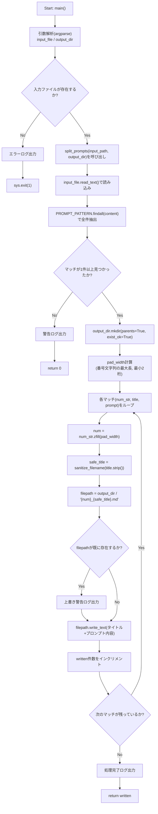
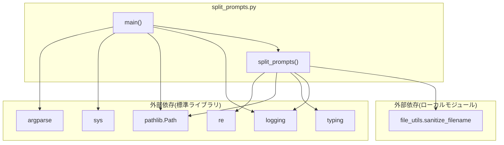

## 1. 解析メタ情報

| 項目 | 内容 |
| --- | --- |
| 対象ファイル | `split_prompts.py` |
| 言語 | Python |
| 解析対象 | 提供されたコードのみ |
| 推測・補完 | 一切なし |

## 関連ドキュメント

* [file_utils.md](./file_utils.md) — 本ファイルが利用する共通ファイル名サニタイズ処理（`sanitize_filename`）の実装元。

## 2. ファイルの概要

* モジュールDocstring上「Prompt List Splitter」と称される、「番号. タイトル」＋「Prompt: 内容」形式で列挙されたMarkdownファイルを、項目ごとの個別Markdownファイルへ分割するスクリプトである。
* 根拠: [モジュールDocstring] (行番号: 4〜9 / 抜粋: "Prompt List Splitter\n---------------------\n「番号. タイトル」+「Prompt: 内容」形式で列挙されたMarkdownファイルを、\n項目ごとの個別Markdownファイルへ分割するスクリプト。")
* 中核となる正規表現`PROMPT_PATTERN`で入力ファイル全体から「番号」「タイトル」「Prompt内容」の3要素を一括抽出し、各項目ごとに`{ゼロ埋め番号}_{サニタイズ済みタイトル}.md`という名前のファイルへ書き出す関数`split_prompts`を提供する。
* 根拠: [PROMPT_PATTERN定義とsplit_prompts関数] (行番号: 27〜29, 32〜80 / 抜粋: "PROMPT_PATTERN = re.compile(r'(\\d+)\\.\\s+([^\\n]+)\\n+Prompt:\\s+([^\\n]+)')")
* ゼロ埋め幅（`pad_width`）は固定2桁ではなく、実際に出現する番号文字列の最大長から動的に決定される。これは、項目数ではなく番号の桁数を基準にすることで、100番以降で文字列ソート順と数値順が食い違う不具合を避けるための設計である。
* 根拠: [pad_width計算のコメント] (行番号: 57〜61 / 抜粋: "固定2桁だと100番以降で "01" < "100" < "1000" < "23" の\n    # ように文字列ソートが数値順と食い違う不具合が発生するため、項目「数」ではなく\n    # 実際に出現する番号「文字列」の最大長を基準にする。")
* `main`関数はコマンドライン引数（入力ファイル・出力ディレクトリ、いずれもデフォルト値あり）を解析し、入力ファイルの存在確認後に`split_prompts`を呼び出すエントリーポイントである。
* 根拠: [main関数] (行番号: 83〜102 / 抜粋: "def main() -> None:\n    parser = argparse.ArgumentParser(description="Split a numbered prompt list Markdown file into individual files.")")

## 3. 外部依存関係

### インポート一覧

| 名称 | 種類 | 用途 | 根拠 |
| --- | --- | --- | --- |
| `argparse` | 標準ライブラリ | コマンドライン引数（入力ファイル・出力ディレクトリ）の解析 | 根拠: [import文] (行番号: 11 / 抜粋: "import argparse") |
| `logging` | 標準ライブラリ | ロガーの設定（`basicConfig`）と出力 | 根拠: [import文] (行番号: 12 / 抜粋: "import logging") |
| `re` | 標準ライブラリ | `PROMPT_PATTERN`による「番号. タイトル」「Prompt: 内容」形式の抽出 | 根拠: [import文] (行番号: 13 / 抜粋: "import re") |
| `sys` | 標準ライブラリ | 入力ファイル不在時の`sys.exit(1)` | 根拠: [import文] (行番号: 14 / 抜粋: "import sys") |
| `pathlib.Path` | 標準ライブラリ | 入力ファイル・出力ディレクトリ・出力ファイルのパス操作全般 | 根拠: [import文] (行番号: 15 / 抜粋: "from pathlib import Path") |
| `typing.List`, `Tuple` | 標準ライブラリ | `matches`（正規表現マッチ結果）の型ヒント | 根拠: [import文] (行番号: 16 / 抜粋: "from typing import List, Tuple") |
| `file_utils.sanitize_filename` (as `_shared_sanitize_filename`) | ローカルモジュール | 抽出したタイトルをファイル名として安全な文字列へ変換する処理の委譲先 | 根拠: [import文] (行番号: 18 / 抜粋: "from file_utils import sanitize_filename as _shared_sanitize_filename") |

### ブラックボックスとなる外部要素

| 名称 | 理由 | 根拠 |
| --- | --- | --- |
| `file_utils.sanitize_filename` | サニタイズの具体的なルール（禁止文字、長さ制限等）は本ファイル単体からは不明。ただし関連ドキュメント`file_utils.md`に実装の解析結果が存在する（下記「相互参照による補足情報」参照）。 | 根拠: [import文] (行番号: 18 / 抜粋: "from file_utils import sanitize_filename as _shared_sanitize_filename") |

## 4. 主要要素の定義（関数 / エンドポイント / コンポーネント）

### `split_prompts`

* **役割**: 入力Markdownファイルの内容から「番号. タイトル」＋「Prompt: 内容」形式の項目を正規表現で全件抽出し、項目ごとに個別のMarkdownファイル（`{ゼロ埋め番号}_{サニタイズ済みタイトル}.md`）として`output_dir`へ書き出す。
* 根拠: [関数定義とDocstring] (行番号: 32〜44 / 抜粋: "def split_prompts(input_file: Path, output_dir: Path) -> int:\n    """入力Markdownファイルを項目ごとの個別ファイルへ分割する。")

* **引数/リクエスト**: `input_file: Path`（「番号. タイトル」「Prompt: 内容」形式を含む入力ファイル）, `output_dir: Path`（分割結果を書き出す出力先ディレクトリ、存在しなければ作成する）
* 根拠: [引数定義とDocstring] (行番号: 32, 35〜37 / 抜粋: "input_file: 「番号. タイトル」「Prompt: 内容」形式を含む入力ファイル。\n        output_dir: 分割結果を書き出す出力先ディレクトリ（存在しなければ作成する）。")

* **戻り値/レスポンス**: `int`（書き出したファイルの件数。マッチが1件も見つからなければ`0`）
* 根拠: [Docstringとreturn文] (行番号: 39〜40, 53, 80 / 抜粋: "Returns:\n        書き出したファイルの件数。")

* **副作用**: `input_file`の読み込み（`read_text`）、`output_dir`の作成（`mkdir`）、抽出項目ごとのMarkdownファイル書き込み（`write_text`）、ログ出力（警告・情報）。
* 根拠: [ファイルI/O処理] (行番号: 45, 55, 76 / 抜粋: "content = input_file.read_text(encoding='utf-8')", "output_dir.mkdir(parents=True, exist_ok=True)", "filepath.write_text(f"# {raw_title}\\n\\nPrompt: {prompt_text}\\n", encoding='utf-8')")

* **エラーハンドリング**: 関数自体には`try-except`がなく、Docstringに`FileNotFoundError`（`input_file`が存在しない場合）を送出しうる旨が明記されているが、実際の送出は`input_file.read_text()`（標準ライブラリ側の挙動）に委ねられている。マッチが0件の場合は例外ではなく警告ログと`0`の返却で処理を打ち切る。出力ファイルが既に存在する場合は上書きするが、警告ログを出力するのみで処理は継続する。
* 根拠: [Docstringのraises節とガード節] (行番号: 42〜43, 48〜53, 73〜74 / 抜粋: "Raises:\n        FileNotFoundError: input_file が存在しない場合。")

### `main`

* **役割**: コマンドライン引数（入力ファイルパス・出力ディレクトリパス）を`argparse`で解析し、入力ファイルの存在確認後に`split_prompts`を呼び出すエントリーポイント関数。
* 根拠: [関数定義] (行番号: 83〜102 / 抜粋: "def main() -> None:\n    parser = argparse.ArgumentParser(description="Split a numbered prompt list Markdown file into individual files.")")

* **引数/リクエスト**: なし（`sys.argv`経由でコマンドライン引数を`argparse`が解析）。位置引数`input_file`（デフォルト`"一ノ瀬蓮_プロンプト1000選.md"`）、`output_dir`（デフォルト`"split_results"`）はいずれも省略可能。
* 根拠: [argparse定義] (行番号: 85〜94 / 抜粋: "parser.add_argument(\n        "input_file", nargs="?",\n        default="一ノ瀬蓮_プロンプト1000選.md",")

* **戻り値/レスポンス**: `None`
* 根拠: [戻り値ヒント] (行番号: 83 / 抜粋: "def main() -> None:")

* **副作用**: 入力ファイル不在時のエラーログ出力とプロセス終了(`sys.exit(1)`)、`split_prompts`の呼び出し（間接的にファイル書き込み等の副作用を誘発）。
* 根拠: [存在確認とexit] (行番号: 98〜100 / 抜粋: "if not input_path.exists():\n        logger.error(f"❌ 入力ファイルが見つかりません: {input_path}")\n        sys.exit(1)")

* **エラーハンドリング**: 入力ファイルが存在しない場合はエラーログを出力し`sys.exit(1)`でプロセスを終了する。それ以外の例外処理はない。
* 根拠: [ガード節] (行番号: 98〜100 / 抜粋: "if not input_path.exists():")

## 5. 処理フロー図

## 6. 依存関係図

## 7. 次のステップ（リバースエンジニアリングの提案）

| 優先度 | ファイル名(推測可) | 理由 | 根拠 |
| --- | --- | --- | --- |
| 低 | `file_utils.py` | `sanitize_filename`の具体的なサニタイズルールを確認するため。既に`docs/specifications/DDD/file_utils.md`として解析済みだが、本ファイルの挙動理解のため相互参照が必要。 | 根拠: [import文] (行番号: 18 / 抜粋: "from file_utils import sanitize_filename as _shared_sanitize_filename") |
| 低 | `一ノ瀬蓮_プロンプト1000選.md`（デフォルト入力ファイル） | `input_file`引数のデフォルト値として指定されているデータファイルであり、実際にどのような内容・件数のプロンプト一覧が想定されているかを確認するため（本ファイルはPythonソースファイルではないため対象外の可能性あり）。 | 根拠: [argparse定義] (行番号: 87 / 抜粋: "default="一ノ瀬蓮_プロンプト1000選.md",") |

## 8. 保守上の注意点

* **入力形式への強い依存**: `PROMPT_PATTERN`（正規表現）は「番号. タイトル」の直後（空行を挟んでも可）に「Prompt: 内容」が続くという厳密な形式を前提としており、この形式と一致しない項目は無条件でスキップされる（エラー通知なし）。
* 根拠: [PROMPT_PATTERN定義] (行番号: 29 / 抜粋: "PROMPT_PATTERN = re.compile(r'(\\d+)\\.\\s+([^\\n]+)\\n+Prompt:\\s+([^\\n]+)')")
* **タイトル・プロンプト内容とも単一行想定**: 正規表現のキャプチャグループが`[^\n]+`（改行を含まない）であるため、複数行にまたがるタイトルやプロンプト本文には対応していない。
* 根拠: [PROMPT_PATTERN定義] (行番号: 29 / 抜粋: "([^\\n]+)\\n+Prompt:\\s+([^\\n]+)")
* **既存ファイルの無警告上書き**: 出力先に同名ファイルが既に存在する場合、警告ログは出力されるが処理は中断されず上書きされる。番号・タイトルの重複時にデータが意図せず失われるリスクがある。
* 根拠: [上書きチェック] (行番号: 73〜74 / 抜粋: "if filepath.exists():\n            logger.warning(f"⚠️ 上書き: {filename} は既に存在します（元データの番号/タイトルが重複している可能性）")")
* **`pad_width`計算の前提**: ゼロ埋め幅は実際に出現する番号「文字列」の最大長（最小2桁）を基準に動的決定される設計だが、`matches`が空の場合はこの計算自体が実行されない（`HasMatches`分岐で早期`return`されるため空リストに対する`max()`のエラーは発生しない）。
* 根拠: [pad_width計算] (行番号: 61 / 抜粋: "pad_width = max(2, max(len(num_str) for num_str, _, _ in matches))")
* **CLIデフォルト値の環境依存性**: `input_file`のデフォルト値`"一ノ瀬蓮_プロンプト1000選.md"`は特定の用途・環境を前提とした固定値であり、汎用スクリプトとして流用する際は明示的な引数指定が推奨される。
* 根拠: [argparse定義] (行番号: 85〜89 / 抜粋: "default="一ノ瀬蓮_プロンプト1000選.md",")

## 9. 不明事項一覧

該当なし（本ファイル単体および相互参照可能な`file_utils.md`により、コード上の疑問点はすべて解消されている）。

## 相互参照による補足情報

| 元の不明事項 | 判明した内容 | 参照元ドキュメント |
| --- | --- | --- |
| `sanitize_filename`の詳細ルール | `DDD/file_utils.py:9-21`を直接確認した。シグネチャは`sanitize_filename(filename: str, max_length: int = 200) -> str`。実装は`re.sub(r'[\\/*?:"<>|]', '_', filename).strip()`で禁止文字（`\ / * ? : " < > |`）をアンダースコアに置換し前後の空白を除去した後、`safe[:max_length].strip('. ')`で`max_length`（既定200文字。ext4等の255バイト制限に対する安全マージンとしてDocstringに明記）まで切り詰め、さらに末尾のピリオド・空白を除去する。関連ドキュメント`file_utils.md`の解析結果と完全に一致することを確認した。 | 直接ソース確認: `DDD/file_utils.py:9-21`（参考: [file_utils.md](./file_utils.md)） |

## 10. 自己検証結果

* [x] 推測・外部ファイルの仕様を一切含んでいない
* [x] 全関数・全クラス・全コンポーネントを列挙した
* [x] 全てのインポート要素を列挙した
* [x] すべての仕様説明に「根拠（行番号・抜粋）」を明記した
* [x] 根拠漏れが0件である
* [x] Mermaid構文にエラーの原因となる記号（エスケープ漏れ）がない
* [x] 不明事項を漏れなく列挙した

完了
