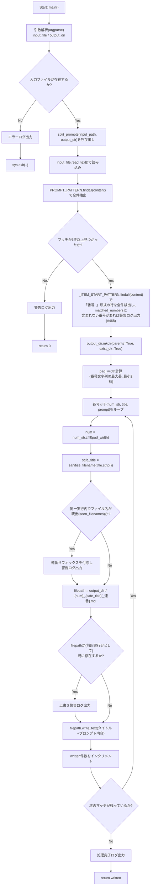
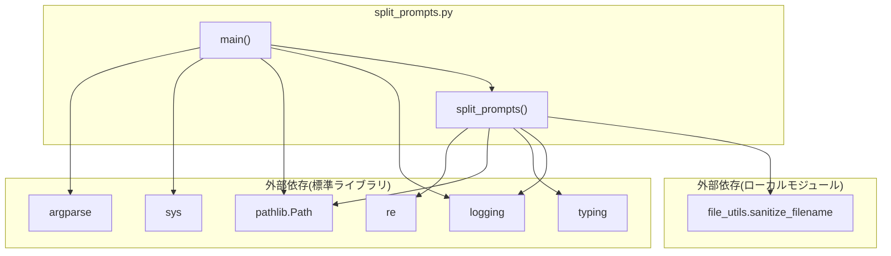

## 1. 解析メタ情報

| 項目 | 内容 |
| --- | --- |
| 対象ファイル | `split_prompts.py` |
| 言語 | Python |
| 解析対象 | 提供されたコードのみ |
| 推測・補完 | 一切なし |
| 解析基準コミット | `dbbfc81` |

## 関連ドキュメント

* [file_utils.md](./file_utils.md) — 本ファイルが利用する共通ファイル名サニタイズ処理（`sanitize_filename`）の実装元。
* `test_split_prompts.py`（Issue #244回帰テスト。`test_*.py`のため専用の仕様書は本リポジトリの命名規則上対応なし）— 同一実行内でのファイル名衝突時の連番サフィックス付与、および前回実行分ファイルへの上書き継続を検証する。

## 2. ファイルの概要

* モジュールDocstring上「Prompt List Splitter」と称される、「番号. タイトル」＋「Prompt: 内容」形式で列挙されたMarkdownファイルを、項目ごとの個別Markdownファイルへ分割するスクリプトである。
* 根拠: [モジュールDocstring] (行番号: 4〜9 / 抜粋: "Prompt List Splitter\n---------------------\n「番号. タイトル」+「Prompt: 内容」形式で列挙されたMarkdownファイルを、\n項目ごとの個別Markdownファイルへ分割するスクリプト。")
* 中核となる正規表現`PROMPT_PATTERN`で入力ファイル全体から「番号」「タイトル」「Prompt内容」の3要素を一括抽出し、各項目ごとに`{ゼロ埋め番号}_{サニタイズ済みタイトル}.md`という名前のファイルへ書き出す関数`split_prompts`を提供する。
* 根拠: [PROMPT_PATTERN定義とsplit_prompts関数] (行番号: 27〜29, 32〜80 / 抜粋: "PROMPT_PATTERN = re.compile(r'(\\d+)\\.\\s+([^\\n]+)\\n+Prompt:\\s+([^\\n]+)')")
* ゼロ埋め幅（`pad_width`）は固定2桁ではなく、実際に出現する番号文字列の最大長から動的に決定される。これは、項目数ではなく番号の桁数を基準にすることで、100番以降で文字列ソート順と数値順が食い違う不具合を避けるための設計である。
* 根拠: [pad_width計算のコメント] (行番号: 57〜61 / 抜粋: "固定2桁だと100番以降で "01" < "100" < "1000" < "23" の\n    # ように文字列ソートが数値順と食い違う不具合が発生するため、項目「数」ではなく\n    # 実際に出現する番号「文字列」の最大長を基準にする。")
* `main`関数はコマンドライン引数（入力ファイル・出力ディレクトリ、いずれもデフォルト値あり）を解析し、入力ファイルの存在確認後に`split_prompts`を呼び出すエントリーポイントである。
* 根拠: [main関数] (行番号: 121〜139 / 抜粋: "def main() -> None:\n    parser = argparse.ArgumentParser(description="Split a numbered prompt list Markdown file into individual files.")")
* **（Issue #468で追加）** `PROMPT_PATTERN`は「番号. タイトル」の直後に単一行の「Prompt: 内容」が続く形式にのみ一致するため、直後にPromptが続かない・複数行にまたがる等の理由でフォーマット外になった項目は以前は無警告でスキップされていた。新設のモジュールレベル正規表現`_ITEM_START_PATTERN`（「番号. 」で始まる行だけを緩く検出する、`PROMPT_PATTERN`より広く一致するパターン）で「番号. 」形式に見える行をすべて洗い出し、`PROMPT_PATTERN`ではヒットしなかった番号を`split_prompts`が警告ログで報告するようになった。
* 根拠: [_ITEM_START_PATTERN定義とコメント] (行番号: 31〜36 / 抜粋: "# #468: PROMPT_PATTERNは「番号. タイトル」の直後に単一行の「Prompt: 内容」が\n# 続く形式にのみ一致する。直後にPromptが続かない・複数行にまたがる等の理由で\n# フォーマット外になった項目を検知するため、「番号. 」で始まる行だけを緩く\n# 検出する。" / "_ITEM_START_PATTERN = re.compile(r'^(\\d+)\\.\\s+\\S', re.MULTILINE)")

## 3. 外部依存関係

### インポート一覧

| 名称 | 種類 | 用途 | 根拠 |
| --- | --- | --- | --- |
| `argparse` | 標準ライブラリ | コマンドライン引数（入力ファイル・出力ディレクトリ）の解析 | 根拠: [import文] (行番号: 11 / 抜粋: "import argparse") |
| `logging` | 標準ライブラリ | ロガーの設定（`basicConfig`）と出力 | 根拠: [import文] (行番号: 12 / 抜粋: "import logging") |
| `re` | 標準ライブラリ | `PROMPT_PATTERN`による「番号. タイトル」「Prompt: 内容」形式の抽出 | 根拠: [import文] (行番号: 13 / 抜粋: "import re") |
| `sys` | 標準ライブラリ | 入力ファイル不在時の`sys.exit(1)` | 根拠: [import文] (行番号: 14 / 抜粋: "import sys") |
| `pathlib.Path` | 標準ライブラリ | 入力ファイル・出力ディレクトリ・出力ファイルのパス操作全般 | 根拠: [import文] (行番号: 15 / 抜粋: "from pathlib import Path") |
| `typing.List`, `Tuple` | 標準ライブラリ | `matches`（正規表現マッチ結果）の型ヒント | 根拠: [import文] (行番号: 16 / 抜粋: "from typing import List, Tuple") |
| `file_utils.sanitize_filename` (as `_shared_sanitize_filename`) | ローカルモジュール | 抽出したタイトルをファイル名として安全な文字列へ変換する処理の委譲先 | 根拠: [import文] (行番号: 18 / 抜粋: "from file_utils import sanitize_filename as _shared_sanitize_filename") |

### ブラックボックスとなる外部要素

| 名称 | 理由 | 根拠 |
| --- | --- | --- |
| `file_utils.sanitize_filename` | サニタイズの具体的なルール（禁止文字、長さ制限等）は本ファイル単体からは不明。ただし関連ドキュメント`file_utils.md`に実装の解析結果が存在する（下記「相互参照による補足情報」参照）。 | 根拠: [import文] (行番号: 18 / 抜粋: "from file_utils import sanitize_filename as _shared_sanitize_filename") |

## 4. 主要要素の定義（関数 / エンドポイント / コンポーネント）

### `_ITEM_START_PATTERN`（モジュールレベル変数、Issue #468で追加）

* **役割**: 行頭が「番号. 」（数字1文字以上＋ピリオド＋空白1文字以上＋非空白文字）で始まる行を検出する、`re.MULTILINE`フラグ付きの正規表現。`PROMPT_PATTERN`（「番号. タイトル」の直後に単一行の「Prompt: 内容」が続く形式にのみ一致）より緩い条件で一致するため、`split_prompts`が「`PROMPT_PATTERN`ではヒットしなかったがフォーマット外の項目らしき番号」を洗い出すのに使われる。
* 根拠: [定義とコメント] (行番号: 31〜36)

* **引数/リクエスト**: 該当なし（モジュールロード時に1度だけコンパイルされる定数）
* **戻り値/レスポンス**: 該当なし（`re.Pattern`オブジェクトそのもの。`findall`で使われた場合はマッチした番号文字列の`List[str]`を返す）
* **副作用**: なし（`re.compile`によるパターンのコンパイルのみ）
* **エラーハンドリング**: なし
* 根拠: [定義] (行番号: 36)

### `split_prompts`（Issue #468で変更）

* **役割**: 入力Markdownファイルの内容から「番号. タイトル」＋「Prompt: 内容」形式の項目を正規表現で全件抽出し、項目ごとに個別のMarkdownファイル（`{ゼロ埋め番号}_{サニタイズ済みタイトル}.md`）として`output_dir`へ書き出す。**（Issue #468で追加）** 抽出後、`_ITEM_START_PATTERN`で入力全体から「番号. 」形式に見える行の番号をすべて洗い出し、`PROMPT_PATTERN`でマッチした番号の集合(`matched_numbers`)に含まれないもの（＝「番号. 」で始まってはいるがフォーマット完全一致ではなかった項目）があれば、該当番号を列挙した警告ログを1件出力する（この検知自体は項目のスキップや処理中断を行わず、あくまで気づけるようにするための追加のログ出力である）。**（Issue #244で修正）** 以前は、同一実行内で複数の項目が同じファイル名（ゼロ埋め番号+サニタイズ後タイトルの組み合わせ）に解決した場合、警告ログを出すのみで無条件に上書きしており、先に書き出した項目のPrompt内容が後続の項目によって完全に失われていた。現在は同一実行内で使用済みのファイル名を`seen_filenames`集合で追跡し、衝突時は`_2`, `_3`...という連番サフィックスを付与して両方の項目を保存する。出力先ディレクトリに前回実行分の同名ファイルが既に存在するケース（意図的な再実行時の上書き）とは区別され、そちらは従来通り上書きされる。
* 根拠: [関数定義とDocstring] (行番号: 39〜51 / 抜粋: "def split_prompts(input_file: Path, output_dir: Path) -> int:\n    """入力Markdownファイルを項目ごとの個別ファイルへ分割する。")、フォーマット外検知とコメント (行番号: 62〜74 / 抜粋: "# #468: 「番号. 」で始まるが完全な形式(直後に単一行のPrompt:)に一致しなかった\n    # 項目を検知し、無警告でスキップされないようにする。\n    matched_numbers = {num_str for num_str, _, _ in matches}\n    unmatched_numbers = [\n        n for n in _ITEM_START_PATTERN.findall(content) if n not in matched_numbers\n    ]\n    if unmatched_numbers:\n        logger.warning(")

* **引数/リクエスト**: `input_file: Path`（「番号. タイトル」「Prompt: 内容」形式を含む入力ファイル）, `output_dir: Path`（分割結果を書き出す出力先ディレクトリ、存在しなければ作成する）
* 根拠: [引数定義とDocstring] (行番号: 39, 42〜44 / 抜粋: "input_file: 「番号. タイトル」「Prompt: 内容」形式を含む入力ファイル。\n        output_dir: 分割結果を書き出す出力先ディレクトリ（存在しなければ作成する）。")

* **戻り値/レスポンス**: `int`（書き出したファイルの件数。マッチが1件も見つからなければ`0`）
* 根拠: [Docstringとreturn文] (行番号: 46〜47, 60, 118 / 抜粋: "Returns:\n        書き出したファイルの件数。")

* **副作用**: `input_file`の読み込み（`read_text`）、`output_dir`の作成（`mkdir`）、抽出項目ごとのMarkdownファイル書き込み（`write_text`）、ログ出力（警告・情報）。**（Issue #468で追加）** `_ITEM_START_PATTERN.findall(content)`による入力全体の再走査（フォーマット外項目の検知用）と、該当項目があった場合の追加の警告ログ出力。
* 根拠: [ファイルI/O処理] (行番号: 52, 76, 114 / 抜粋: "content = input_file.read_text(encoding='utf-8')", "output_dir.mkdir(parents=True, exist_ok=True)", "filepath.write_text(f"# {raw_title}\\n\\nPrompt: {prompt_text}\\n", encoding='utf-8')")、フォーマット外検知 (行番号: 64〜74)

* **エラーハンドリング**: 関数自体には`try-except`がなく、Docstringに`FileNotFoundError`（`input_file`が存在しない場合）を送出しうる旨が明記されているが、実際の送出は`input_file.read_text()`（標準ライブラリ側の挙動）に委ねられている。マッチが0件の場合は例外ではなく警告ログと`0`の返却で処理を打ち切る（この場合、`_ITEM_START_PATTERN`によるフォーマット外検知には到達しない）。**（Issue #244で修正）** 同一実行内でファイル名が衝突する場合は例外を送出せず、連番サフィックスを付与して警告ログを出力した上で両方の項目を保存する。出力先ディレクトリに前回実行分の同名ファイルが既に存在する場合（同一実行内の衝突とは区別）は、従来通り警告ログを出力するのみで上書きを継続する。**（Issue #468で追加）** フォーマット外の項目が検知された場合も例外は送出せず、警告ログの出力のみで当該項目はそのまま（従来通り）スキップされて処理が続行される。
* 根拠: [Docstringのraises節とガード節] (行番号: 49〜50, 55〜60 / 抜粋: "Raises:\n        FileNotFoundError: input_file が存在しない場合。")、フォーマット外検知の警告ログ (行番号: 68〜74)、同一実行内衝突時のサフィックス付与 (行番号: 97〜107 / 抜粋: "base_filename = f"{num}_{safe_title}.md"\n        filename = base_filename\n        if filename in seen_filenames:\n            suffix = 2\n            while f"{num}_{safe_title}_{suffix}.md" in seen_filenames:\n                suffix += 1\n            filename = f"{num}_{safe_title}_{suffix}.md"")、前回実行分の上書き (行番号: 111〜112 / 抜粋: "if filepath.exists():\n            logger.warning(f"⚠️ 上書き: {filename} は既に存在します（前回実行分の可能性）")")

### `main`

* **役割**: コマンドライン引数（入力ファイルパス・出力ディレクトリパス）を`argparse`で解析し、入力ファイルの存在確認後に`split_prompts`を呼び出すエントリーポイント関数。
* 根拠: [関数定義] (行番号: 83〜102 / 抜粋: "def main() -> None:\n    parser = argparse.ArgumentParser(description="Split a numbered prompt list Markdown file into individual files.")")

* **引数/リクエスト**: なし（`sys.argv`経由でコマンドライン引数を`argparse`が解析）。位置引数`input_file`は**（D-L13で修正）** 必須（以前は特定の個人用途を前提とした固定ファイル名`"一ノ瀬蓮_プロンプト1000選.md"`がデフォルト値になっており、汎用スクリプトとして他環境で実行した際に紛らわしい/意図しないデフォルト依存を招きうる問題があった。省略時は`argparse`が使用方法を表示して終了する）。`output_dir`（デフォルト`"split_results"`）は引き続き省略可能。
* 根拠: [argparse定義] (行番号: 102〜110 / 抜粋: "parser.add_argument(\n        "input_file",\n        help="Input Markdown file (「番号. タイトル」「Prompt: 内容」形式)"\n    )")

* **戻り値/レスポンス**: `None`
* 根拠: [戻り値ヒント] (行番号: 83 / 抜粋: "def main() -> None:")

* **副作用**: 入力ファイル不在時のエラーログ出力とプロセス終了(`sys.exit(1)`)、`split_prompts`の呼び出し（間接的にファイル書き込み等の副作用を誘発）。
* 根拠: [存在確認とexit] (行番号: 98〜100 / 抜粋: "if not input_path.exists():\n        logger.error(f"❌ 入力ファイルが見つかりません: {input_path}")\n        sys.exit(1)")

* **エラーハンドリング**: 入力ファイルが存在しない場合はエラーログを出力し`sys.exit(1)`でプロセスを終了する。それ以外の例外処理はない。
* 根拠: [ガード節] (行番号: 98〜100 / 抜粋: "if not input_path.exists():")

## 5. 処理フロー図

## 6. 依存関係図

## 7. 次のステップ（リバースエンジニアリングの提案）

| 優先度 | ファイル名(推測可) | 理由 | 根拠 |
| --- | --- | --- | --- |
| 低 | `file_utils.py` | `sanitize_filename`の具体的なサニタイズルールを確認するため。既に`docs/specifications/DDD/file_utils.md`として解析済みだが、本ファイルの挙動理解のため相互参照が必要。 | 根拠: [import文] (行番号: 18 / 抜粋: "from file_utils import sanitize_filename as _shared_sanitize_filename") |

## 8. 保守上の注意点

* **入力形式への強い依存（Issue #468で部分的に緩和）**: `PROMPT_PATTERN`（正規表現）は「番号. タイトル」の直後（空行を挟んでも可）に単一行の「Prompt: 内容」が続くという厳密な形式を前提としており、この形式と一致しない項目は依然として無条件でスキップされる（項目としては保存されない）。以前はこのスキップが完全に無警告だったが、現在は`_ITEM_START_PATTERN`による緩い検出との差分から「番号. 」で始まるがフォーマット外だった項目の番号を警告ログで報告するようになったため、少なくとも運用者が「何件かフォーマット違反でスキップされた」ことに気づけるようにはなった（自動的な救済や修正は行われない）。
* 根拠: [PROMPT_PATTERN定義] (行番号: 29 / 抜粋: "PROMPT_PATTERN = re.compile(r'(\\d+)\\.\\s+([^\\n]+)\\n+Prompt:\\s+([^\\n]+)')")、[_ITEM_START_PATTERNとフォーマット外検知] (行番号: 31〜36, 62〜74)
* **タイトル・プロンプト内容とも単一行想定**: 正規表現のキャプチャグループが`[^\n]+`（改行を含まない）であるため、複数行にまたがるタイトルやプロンプト本文には対応していない。
* 根拠: [PROMPT_PATTERN定義] (行番号: 29 / 抜粋: "([^\\n]+)\\n+Prompt:\\s+([^\\n]+)")
* **(Issue #244バグ修正の背景)** 以前は出力先に同名ファイルが既に存在する場合、警告ログは出力されるが処理は中断されず無条件に上書きされていた。同一実行内で番号・タイトルの組が重複する入力データの場合、先に書き出した項目のPrompt内容が後続の項目によって完全に失われるデータ損失があった。現在は同一実行内での衝突（`seen_filenames`で追跡）に限り連番サフィックス（`_2`, `_3`...）を付与して両方の項目を保存するよう修正されている。出力先ディレクトリに前回実行分の同名ファイルが既に存在するケース（再実行時の意図的な上書き）は、この修正の対象外として従来通り上書きされる点に注意（`FileManager.save`（`extract_youtube_urls.py`）の無警告上書きと同様の「再実行時は上書き」という設計判断を踏襲）。今後、同様に「1回の実行内で複数件を同一の出力先へ書き出す」処理を追加する際は、実行内衝突と前回実行分の上書きを混同しないよう注意すること。
* 根拠: [同一実行内衝突時のサフィックス付与とコメント] (行番号: 68〜87 / 抜粋: "# #244: 同一実行内で複数の項目が同じファイル名(番号+サニタイズ後タイトル)に\n    # 解決すると、以前は無警告で後勝ちの上書きとなり、先に書き出した項目の内容が\n    # 完全に失われていた。")、前回実行分の上書き (行番号: 90〜91 / 抜粋: "if filepath.exists():\n            logger.warning(f"⚠️ 上書き: {filename} は既に存在します（前回実行分の可能性）")")
* **`pad_width`計算の前提**: ゼロ埋め幅は実際に出現する番号「文字列」の最大長（最小2桁）を基準に動的決定される設計だが、`matches`が空の場合はこの計算自体が実行されない（`HasMatches`分岐で早期`return`されるため空リストに対する`max()`のエラーは発生しない）。
* 根拠: [pad_width計算] (行番号: 61 / 抜粋: "pad_width = max(2, max(len(num_str) for num_str, _, _ in matches))")
* **（D-L13で修正）CLIデフォルト値の環境依存性は解消済み**: 以前は`input_file`のデフォルト値が`"一ノ瀬蓮_プロンプト1000選.md"`という特定の用途・環境を前提とした固定値になっており、汎用スクリプトとして他環境で実行した際に紛らわしかった。`input_file`を必須引数に変更し、省略時は`argparse`が使用方法を表示して終了するようにした。
* 根拠: [argparse定義] (行番号: 102〜105 / 抜粋: "parser.add_argument(\n        "input_file",\n        help="Input Markdown file (「番号. タイトル」「Prompt: 内容」形式)"\n    )")

## 9. 不明事項一覧

該当なし（本ファイル単体および相互参照可能な`file_utils.md`により、コード上の疑問点はすべて解消されている）。

## 相互参照による補足情報

| 元の不明事項 | 判明した内容 | 参照元ドキュメント |
| --- | --- | --- |
| `sanitize_filename`の詳細ルール | `DDD/file_utils.py:9-21`を直接確認した。シグネチャは`sanitize_filename(filename: str, max_length: int = 200) -> str`。実装は`re.sub(r'[\\/*?:"<>|]', '_', filename).strip()`で禁止文字（`\ / * ? : " < > |`）をアンダースコアに置換し前後の空白を除去した後、`safe[:max_length].strip('. ')`で`max_length`（既定200文字。ext4等の255バイト制限に対する安全マージンとしてDocstringに明記）まで切り詰め、さらに末尾のピリオド・空白を除去する。関連ドキュメント`file_utils.md`の解析結果と完全に一致することを確認した。 | 直接ソース確認: `DDD/file_utils.py:9-21`（参考: [file_utils.md](./file_utils.md)） |

## 10. 自己検証結果

* [x] 推測・外部ファイルの仕様を一切含んでいない
* [x] 全関数・全クラス・全コンポーネントを列挙した
* [x] 全てのインポート要素を列挙した
* [x] すべての仕様説明に「根拠（行番号・抜粋）」を明記した
* [x] 根拠漏れが0件である
* [x] Mermaid構文にエラーの原因となる記号（エスケープ漏れ）がない
* [x] 不明事項を漏れなく列挙した

完了
