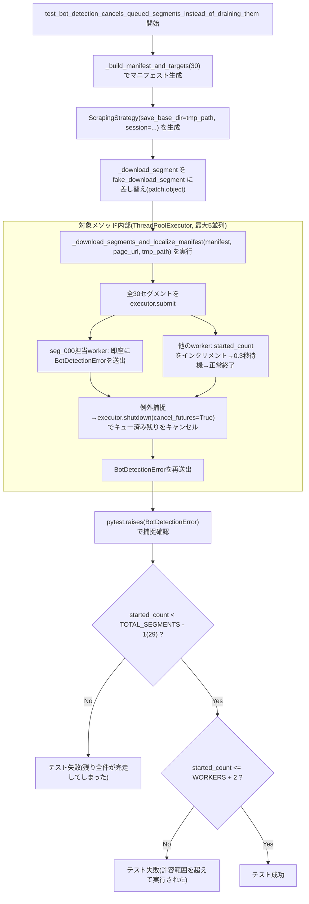

## 1. 解析メタ情報

| 項目 | 内容 |
| --- | --- |
| 対象ファイル | `test_batch_download_bot_detection_abort.py` |
| 言語 | Python |
| 解析対象 | 提供されたコードのみ |
| 推測・補完 | 一切なし |

## 関連ドキュメント

* [batch_download_discord.md](./batch_download_discord.md) — 本ファイルが検証対象とする`ScrapingStrategy._download_segments_and_localize_manifest`（Issue #104の修正箇所）の実装本体。

## 2. ファイルの概要

* `ScrapingStrategy._download_segments_and_localize_manifest`が、HLSセグメント取得中にボット検知（403/429/503による`BotDetectionError`）が発生した場合、まだ実行が始まっていないキュー済みの残りセグメント取得を実際にキャンセルすることを検証する回帰テストである（Issue #104対策）。
* モジュールDocstringによれば、修正前は`with ThreadPoolExecutor(...) as executor:`ブロック終了時に暗黙で呼ばれる`executor.shutdown(wait=True)`（`cancel_futures`指定なし）が、キュー済みの残り全セグメントのHTTP GETが完走するまで例外の伝播をブロックしてしまい、モジュール/仕様書が謳う「即時セッション中断」が事実上機能していなかったとされる。
* テスト関数は1本のみで、`_download_segment`をモック化し、最初のセグメント（`seg_000`）だけ即座に`BotDetectionError`を送出させ、他のセグメントは「実際に実行が開始されたこと」をカウンタに記録してから短い遅延を挟んで完了する、という模擬的なセグメント群に対して本体メソッドを実行し、最終的なカウンタ値がキュー済み全件（`TOTAL_SEGMENTS - 1`）よりも十分小さいこと（＝キャンセルが機能していること）を検証する。
* 根拠: [モジュールDocstring] (行番号: 3〜19 / 抜粋: "Issue #104の回帰テスト。\n\nScrapingStrategy._download_segments_and_localize_manifest は、HLSの全セグメントを\nThreadPoolExecutor(max_workers=5)へ一括submitしたのち、as_completed()で回収する。")

## 3. 外部依存関係

### インポート一覧

| 名称 | 種類 | 用途 | 根拠 |
| --- | --- | --- | --- |
| `sys` | 標準ライブラリ | `batch_download_discord`をimportできるよう`DDD_DIR`をsys.pathへ追加するため | 根拠: [import文] (行番号: 21 / 抜粋: "import sys") |
| `threading` | 標準ライブラリ | 並行実行される`fake_download_segment`から`started_count`を安全にインクリメントするための`threading.Lock` | 根拠: [import文] (行番号: 22 / 抜粋: "import threading") |
| `time` | 標準ライブラリ | `fake_download_segment`内で「実際にダウンロードが実行された」状態を一定時間維持するための`time.sleep` | 根拠: [import文] (行番号: 23 / 抜粋: "import time") |
| `Path`（`pathlib`） | 標準ライブラリ | 本ファイル自身のディレクトリ（`DDD_DIR`）の解決 | 根拠: [import文] (行番号: 24 / 抜粋: "from pathlib import Path") |
| `patch`（`unittest.mock`） | 標準ライブラリ | `ScrapingStrategy._download_segment`をテスト用の`fake_download_segment`へ差し替えるため | 根拠: [import文] (行番号: 25 / 抜粋: "from unittest.mock import patch") |
| `pytest` | サードパーティ | `pytest.raises`による例外発生の検証 | 根拠: [import文] (行番号: 27 / 抜粋: "import pytest") |
| `batch_download_discord`（`module`としてimport） | テスト対象モジュール | `ScrapingStrategy`・`BotDetectionError`・`NetworkManager`の参照元 | 根拠: [import文] (行番号: 32 / 抜粋: "import batch_download_discord as module  # noqa: E402") |

### ブラックボックスとなる外部要素

* `batch_download_discord.ScrapingStrategy._download_segments_and_localize_manifest`の内部実装 — 本ファイルは`_download_segment`のみをモック化し、`ThreadPoolExecutor`のキャンセル処理自体は実際のメソッド実装に委ねているため、そのキャンセルロジックの正しさは本ファイル単体からは検証できず、対象メソッド側の実装（`batch_download_discord.md`参照）に依存する。

## 4. 主要要素の定義（関数 / エンドポイント / コンポーネント）

### `TOTAL_SEGMENTS` / `WORKERS`（モジュールレベル定数）

* **役割**: `TOTAL_SEGMENTS`はテストで使用する模擬セグメント総数（30）。`WORKERS`はテスト対象クラスの`_FRAGMENT_DOWNLOAD_WORKERS`をモジュールから直接参照した値であり、テスト対象側の並列数が将来変更されてもテストの許容範囲が追随できるようにするための定数である。
* 根拠: (行番号: 34〜37 / 抜粋: "TOTAL_SEGMENTS = 30\n# ScrapingStrategy._FRAGMENT_DOWNLOAD_WORKERS と同じ値を前提にする\n# (テスト対象が変更された場合に追随できるよう、モジュール側の値を直接参照する)。\nWORKERS = module.ScrapingStrategy._FRAGMENT_DOWNLOAD_WORKERS")

### `_build_manifest_and_targets`

* **役割**: `seg_000.ts`から`seg_{n-1}.ts`までのURIのみを持つ、最小構成のHLSマニフェスト文字列（`#EXTM3U`ヘッダー・`#EXTINF`行・セグメントURI・`#EXT-X-ENDLIST`）を組み立てるヘルパー関数。
* 根拠: (行番号: 40〜47 / 抜粋: "def _build_manifest_and_targets(n: int) -> str:\n    \"\"\"seg_000.ts 〜 seg_{n-1}.ts のURIのみを持つ最小のHLSマニフェスト文字列を作る。\"\"\"")


* **引数/リクエスト**: `n: int`（生成するセグメント数）
* 根拠: (行番号: 40)


* **戻り値/レスポンス**: `str`（改行区切りのHLSマニフェスト本文）
* 根拠: (行番号: 47 / 抜粋: "return \"\\n\".join(lines)")


* **副作用**: なし（純粋な文字列組み立てのみ）
* **エラーハンドリング**: なし

### `test_bot_detection_cancels_queued_segments_instead_of_draining_them`

* **役割**: 本ファイルの唯一のテスト関数。`ScrapingStrategy._download_segment`を`fake_download_segment`（`seg_000`のみ即座に`BotDetectionError`を送出し、他のセグメントは`started_count`をインクリメントしたうえで0.3秒待機して正常終了する）に差し替えた状態で、`TOTAL_SEGMENTS`(30)件のセグメントを持つマニフェストに対し`_download_segments_and_localize_manifest`を実行し、`BotDetectionError`が呼び出し元まで伝播すること（`pytest.raises`）、および最終的な`started_count`が「キュー済み残り全件が完走してしまった」場合の値（`TOTAL_SEGMENTS - 1` = 29）より十分小さく、かつ「実行中だった分（`WORKERS`件程度）」の許容範囲に収まることを検証する。
* 根拠: (行番号: 50〜90 / 抜粋: "def test_bot_detection_cancels_queued_segments_instead_of_draining_them(tmp_path):")
* 根拠: `fake_download_segment`の定義 (行番号: 59〜70 / 抜粋: "def fake_download_segment(self, url: str, page_url: str) -> bytes:\n        # 最初のセグメント(0番)だけボット検知を模したエラーを即座に送出する。\n        if \"seg_000\" in url:\n            raise module.BotDetectionError(f\"{url}: HTTP 403（ボット検知/レート制限の可能性）\")")
* 根拠: `ScrapingStrategy`のインスタンス化と実行 (行番号: 74〜77 / 抜粋: "strategy = module.ScrapingStrategy(save_base_dir=tmp_path, session=module.NetworkManager.create_session())\n    with patch.object(module.ScrapingStrategy, \"_download_segment\", fake_download_segment):\n        with pytest.raises(module.BotDetectionError):\n            strategy._download_segments_and_localize_manifest(manifest, \"https://example.test/page\", tmp_path)")


* **引数/リクエスト**: `tmp_path`（pytest標準の一時ディレクトリfixture。`ScrapingStrategy`の`save_base_dir`とセグメント保存先`tmp_dir`の両方に流用される）
* 根拠: (行番号: 50, 74, 77)


* **戻り値/レスポンス**: なし（`assert`文による成否判定のみ）
* 根拠: (行番号: 82〜90)


* **副作用**: `ScrapingStrategy._download_segment`のモック化（`unittest.mock.patch.object`、`with`ブロックの範囲内のみ）。実際のネットワークアクセスは`_download_segment`自体をモック化しているため発生しない。
* 根拠: (行番号: 75 / 抜粋: "with patch.object(module.ScrapingStrategy, \"_download_segment\", fake_download_segment):")


* **エラーハンドリング**: `pytest.raises(module.BotDetectionError)`により、`_download_segments_and_localize_manifest`の呼び出しが`BotDetectionError`を送出することを前提としている（送出されなければテスト自体が失敗する）。続く2つの`assert`は、それぞれ「キュー済み残りがキャンセルされず完走してしまっていないか」（`started_count < TOTAL_SEGMENTS - 1`）と、「実行中だった分の許容範囲を超えていないか」（`started_count <= WORKERS + 2`）を検証し、失敗時は`started_count`の実測値を含むメッセージを表示する。
* 根拠: (行番号: 82〜90 / 抜粋: "assert started_count < TOTAL_SEGMENTS - 1, (\n        f\"started_count={started_count} 件が実行された。\"\n        f\"キュー済みの残りセグメントがキャンセルされずに完走してしまっている可能性がある。\"\n    )\n    # 実行中だった分(最大でも初期に走り出したWORKERS件程度)は許容する。\n    assert started_count <= WORKERS + 2, (")

## 5. 処理フロー図



## 6. 依存関係図

```mermaid
graph TD
    subgraph "test_batch_download_bot_detection_abort.py"
        Consts["TOTAL_SEGMENTS / WORKERS"]
        BuildManifest["_build_manifest_and_targets()"]
        TestFunc["test_bot_detection_cancels_queued_segments_instead_of_draining_them()"]
    end

    subgraph "標準ライブラリ"
        sys_mod["sys"]
        threading_mod["threading"]
        time_mod["time"]
        pathlib_mod["pathlib.Path"]
        mock_mod["unittest.mock.patch"]
    end

    subgraph "サードパーティ"
        pytest_mod["pytest"]
    end

    subgraph "検証対象(batch_download_discord.py)"
        ScrapingStrategy["ScrapingStrategy"]
        DownloadSegments["_download_segments_and_localize_manifest()"]
        DownloadSegment["_download_segment()(モック化対象)"]
        BotDetectionError["BotDetectionError"]
        NetworkManager["NetworkManager.create_session()"]
    end

    TestFunc --> Consts
    TestFunc --> BuildManifest
    TestFunc --> threading_mod
    TestFunc --> time_mod
    TestFunc --> mock_mod
    TestFunc --> pytest_mod
    TestFunc -.インスタンス化.-> ScrapingStrategy
    TestFunc -.session取得.-> NetworkManager
    TestFunc -.モック差し替え.-> DownloadSegment
    ScrapingStrategy --> DownloadSegments
    DownloadSegments -.呼び出し(モック経由).-> DownloadSegment
    DownloadSegments -.捕捉して再送出.-> BotDetectionError
    Consts -.sys.path経由でimport.-> sys_mod
    Consts -.参照.-> ScrapingStrategy
```

## 7. 次のステップ（リバースエンジニアリングの提案）

| 優先度 | ファイル名(推測可) | 理由 | 根拠 |
| --- | --- | --- | --- |
| 高 | `batch_download_discord.py` | 本テストが検証している`_download_segments_and_localize_manifest`のキャンセル処理そのものの実装を持つため必読。 | 根拠: [モジュールDocstring] (行番号: 5〜6 / 抜粋: "ScrapingStrategy._download_segments_and_localize_manifest は、HLSの全セグメントを\nThreadPoolExecutor(max_workers=5)へ一括submitしたのち") |

## 8. 保守上の注意点

* **タイミング依存のテスト設計**: `fake_download_segment`内の`time.sleep(0.3)`は、5並列のworkerがキュー済みタスクを取り合っている間にキャンセル処理が間に合うことを期待した経験的な待機時間である。CI環境やローカル環境の負荷が高い場合、理論上はタイミングがずれてFlakyになるリスクがあるが、`assert started_count <= WORKERS + 2`のように多少の余裕（+2）を持たせることで一定の耐性を持たせている。
* **`started_count`のカウント対象**: `fake_download_segment`は「関数が呼ばれた（＝ダウンロードが開始された）」ことのみをカウントしており、実際のHTTPリクエストの送信有無そのものは検証していない（`_download_segment`自体をモック化しているため、実ネットワークアクセスは発生しない）。実際のキャンセル効果（本物のHTTP GETが送信されないこと）を検証したい場合は、モックの粒度をより低レベル（`curl_cffi`呼び出し自体）に変更する必要がある。

## 9. 不明事項一覧

該当なし（本ファイルの解析範囲内で不明な点はない）。

## 10. 自己検証結果

* [x] 推測・外部ファイルの仕様を一切含んでいない
* [x] 全関数・全クラス・全コンポーネントを列挙した
* [x] 全てのインポート要素を列挙した
* [x] すべての仕様説明に「根拠（行番号・抜粋）」を明記した
* [x] 根拠漏れが0件である
* [x] Mermaid構文にエラーの原因となる記号（エスケープ漏れ）がない
* [x] 不明事項を漏れなく列挙した

完了
