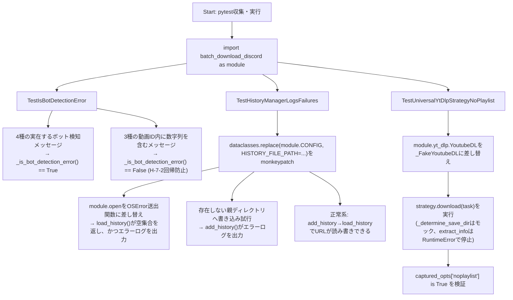

## 1. 解析メタ情報

| 項目 | 内容 |
| --- | --- |
| 対象ファイル | `test_batch_download_discord_fixes.py` |
| 言語 | Python |
| 解析対象 | 提供されたコードのみ |
| 推測・補完 | 一切なし |

## 関連ドキュメント

* [batch_download_discord.md](./batch_download_discord.md) — 本ファイルがテスト対象とするモジュール（`_is_bot_detection_error`, `HistoryManager.load_history`/`add_history`, `UniversalYtDlpStrategy.download`）の解析ドキュメント。本ファイルの各テストは同ドキュメントに記載されたM-7の3件の修正内容（ボット検知マーカーの単語境界判定、履歴ファイルI/O失敗のログ出力、`noplaylist`設定）を直接検証する。

## 2. ファイルの概要

* モジュールDocstring上「M-7: batch_download_discord.py の回帰テスト」と称される、`DDD/batch_download_discord.py`に対する回帰テストスイートである。DDDにはpytest基盤(`conftest.py`等)が無いため、`pytest DDD/test_batch_download_discord_fixes.py`のように直接ファイル指定して実行する前提であり、`MY_HOME_SYSTEM/pytest.ini`の`testpaths=tests`のスコープ外であることがDocstringに明記されている。
* 根拠: [モジュールDocstring] (行番号: 2〜8 / 抜粋: "M-7: batch_download_discord.py の回帰テスト。\n\nDDDにはpytest基盤(conftest.py等)が無いため、本ファイルは\n`pytest DDD/test_batch_download_discord_fixes.py` のように直接指定して実行する\n(MY_HOME_SYSTEM/pytest.ini の testpaths=tests のスコープ外)。")
* `DDD_DIR`（本ファイルの親ディレクトリ）を`sys.path`の先頭に挿入したうえで`import batch_download_discord as module`を実行し、以降のテストは`module`経由でテスト対象の関数・クラスにアクセスする。
* 根拠: [モジュールレベルのセットアップ] (行番号: 16〜19 / 抜粋: "DDD_DIR = Path(__file__).resolve().parent\nsys.path.insert(0, str(DDD_DIR))\n\nimport batch_download_discord as module  # noqa: E402")
* テストは3件のクラスに分かれている。`TestIsBotDetectionError`は`_is_bot_detection_error`の数字マーカー誤検知修正（M-7-2）、`TestHistoryManagerLogsFailures`は`HistoryManager.load_history`/`add_history`のI/O失敗ログ出力修正（M-7-1）、`TestUniversalYtDlpStrategyNoPlaylist`は`UniversalYtDlpStrategy.download`への`noplaylist`オプション追加修正（M-7-3）を、それぞれ検証する。
* 根拠: [各テストクラスのDocstring] (行番号: 22〜23, 45〜49, 85〜87 / 抜粋: "class TestIsBotDetectionError:\n    """M-7-2: "403"/"429"/"503" の部分文字列マッチが動画ID等に誤爆する問題の回帰テスト。"""")
* `TestHistoryManagerLogsFailures`は、`AppConfig`がfrozenな`dataclass`であるため、フィールドの直接書き換えではなく`dataclasses.replace()`で差し替えたインスタンスを`module.CONFIG`ごと`monkeypatch`で入れ替える手法を用いている（クラスDocstringに明記）。
* 根拠: [TestHistoryManagerLogsFailures Docstring] (行番号: 45〜49 / 抜粋: "AppConfigはfrozenなdataclassのため、フィールドの直接書き換えではなく\n    dataclasses.replace()で差し替えたインスタンスをmodule.CONFIGごと入れ替える。")
* `if __name__ == "__main__":`ブロックにより、`pytest`未経由でも`python test_batch_download_discord_fixes.py`のように直接実行可能である。
* 根拠: [エントリーポイント] (行番号: 119〜120 / 抜粋: "if __name__ == "__main__":\n    sys.exit(pytest.main([__file__, "-v"]))")

## 3. 外部依存関係

### インポート一覧

| 名称 | 種類 | 用途 | 根拠 |
| --- | --- | --- | --- |
| `dataclasses` | 標準ライブラリ | frozenな`AppConfig`インスタンスをフィールド差し替えつきで複製する(`dataclasses.replace`) | 根拠: [import文] (行番号: 9 / 抜粋: "import dataclasses") |
| `logging` | 標準ライブラリ | `caplog.at_level(logging.ERROR, ...)`によるログレベル指定 | 根拠: [import文] (行番号: 10 / 抜粋: "import logging") |
| `sys` | 標準ライブラリ | `sys.path`への`DDD_DIR`挿入、`sys.exit` | 根拠: [import文] (行番号: 11 / 抜粋: "import sys") |
| `pathlib.Path` | 標準ライブラリ | `DDD_DIR`および壊れたパス（`unwritable_dir`等）の構築 | 根拠: [import文] (行番号: 12 / 抜粋: "from pathlib import Path") |
| `pytest` | サードパーティ | テストフレームワーク本体、`pytest.mark.parametrize`によるパラメータ化テスト、`tmp_path`/`monkeypatch`/`caplog`フィクスチャの提供元、`pytest.main`によるエントリーポイント実行 | 根拠: [import文] (行番号: 14 / 抜粋: "import pytest") |
| `batch_download_discord` (as `module`) | ローカルモジュール（テスト対象） | 本ファイルが検証する対象モジュール本体（`_is_bot_detection_error`, `HistoryManager`, `UniversalYtDlpStrategy`, `DownloadTask`, `CONFIG`, `yt_dlp`, `logger`）。`DDD_DIR`を`sys.path`に追加した上でインポートされる | 根拠: [import文] (行番号: 19 / 抜粋: "import batch_download_discord as module  # noqa: E402") |

### ブラックボックスとなる外部要素

| 名称 | 理由 | 根拠 |
| --- | --- | --- |
| `batch_download_discord`モジュールの内部実装 | `_is_bot_detection_error`, `HistoryManager`, `UniversalYtDlpStrategy`, `AppConfig`, `DownloadTask`の実装詳細は本ファイルからは分からず、テスト対象モジュール自体（`batch_download_discord.py`）に依存する。 | 根拠: [import文] (行番号: 19 / 抜粋: "import batch_download_discord as module  # noqa: E402") |
| `pytest`の`tmp_path`/`monkeypatch`/`caplog`フィクスチャ | 各テストメソッドの引数として使用されるが、フィクスチャ自体の実装は`pytest`本体に依存し、本ファイルのコードからは分からない。 | 根拠: [テストメソッドのシグネチャ] (行番号: 51, 67, 76, 89 / 抜粋: "def test_load_history_logs_error_on_read_failure(self, tmp_path, monkeypatch, caplog):") |
| `yt_dlp.YoutubeDL`の実際のオプション解釈 | `test_ydl_opts_includes_noplaylist`は`module.yt_dlp.YoutubeDL`自体を`_FakeYoutubeDL`に差し替えて`ydl_opts`辞書の内容のみを検証しており、実際の`yt_dlp`が`noplaylist`オプションをどう解釈・処理するかは本ファイルからは分からない（`yt_dlp`本体の実装に依存）。 | 根拠: [monkeypatch.setattr] (行番号: 111 / 抜粋: "monkeypatch.setattr(module.yt_dlp, "YoutubeDL", _FakeYoutubeDL)") |

## 4. 主要要素の定義（関数 / エンドポイント / コンポーネント）

### `TestIsBotDetectionError` (テストクラス)

* **役割**: `_is_bot_detection_error`の"403"/"429"/"503"の部分文字列マッチが動画ID等に誤爆する問題（M-7-2）の回帰テストをまとめたクラス。
* 根拠: [クラス定義とDocstring] (行番号: 22〜23 / 抜粋: "class TestIsBotDetectionError:\n    """M-7-2: "403"/"429"/"503" の部分文字列マッチが動画ID等に誤爆する問題の回帰テスト。"""")

* **引数/リクエスト**: 該当なし
* **戻り値/レスポンス**: 該当なし
* **副作用**: なし
* **エラーハンドリング**: なし

### `TestIsBotDetectionError.test_detects_genuine_bot_detection_messages`

* **役割**: `"HTTP Error 403: Forbidden"`等、実際のボット検知/レート制限を示す4種類のエラーメッセージに対して`_is_bot_detection_error`が`True`を返すことを、`@pytest.mark.parametrize`で4パターン一括検証するテストメソッド。
* 根拠: [パラメータ化とメソッド定義] (行番号: 25〜32 / 抜粋: "@pytest.mark.parametrize("message", [\n        "HTTP Error 403: Forbidden",\n        "urllib.error.HTTPError: HTTP Error 429: Too Many Requests",\n        "requests.exceptions.RetryError: too many 503 error responses",\n        "ERROR: Sign in to confirm you're not a bot",\n    ])\n    def test_detects_genuine_bot_detection_messages(self, message):\n        assert module._is_bot_detection_error(Exception(message)) is True")

* **引数/リクエスト**: `self`, `message: str`（`@pytest.mark.parametrize`により4パターンが順次注入される）
* 根拠: [引数定義] (行番号: 31 / 抜粋: "def test_detects_genuine_bot_detection_messages(self, message):")

* **戻り値/レスポンス**: 該当なし
* **副作用**: なし（`module._is_bot_detection_error`の呼び出しのみ、副作用のある操作なし）
* **エラーハンドリング**: なし
* 根拠: [assert文] (行番号: 32 / 抜粋: "assert module._is_bot_detection_error(Exception(message)) is True")

### `TestIsBotDetectionError.test_does_not_misfire_on_status_code_substrings_inside_video_ids`

* **役割**: 動画IDの中に偶然"403"等の数字列が含まれる3種類のメッセージ（例:`"ERROR: [youtube] AbC403XyZ: Video unavailable"`）に対して、`_is_bot_detection_error`が誤って`True`を返さない（`False`を返す）ことを検証するH-7-2回帰防止テストメソッド。数字マーカーの単語境界判定（M-7-2の修正内容）の中核的な検証を行う。
* 根拠: [パラメータ化とDocstring] (行番号: 34〜41 / 抜粋: "@pytest.mark.parametrize("message", [\n        "ERROR: [youtube] AbC403XyZ: Video unavailable",\n        "ERROR: [youtube] xyz429abc123: This video is private",\n        "ERROR: [generic] id_503_video: Unsupported URL",\n    ])\n    def test_does_not_misfire_on_status_code_substrings_inside_video_ids(self, message):\n        """H-7-2回帰防止: 動画IDの中に偶然'403'等の数字列が含まれていても\n        誤ってボット検知と判定しないこと。"""")

* **引数/リクエスト**: `self`, `message: str`（`@pytest.mark.parametrize`により3パターンが順次注入される）
* 根拠: [引数定義] (行番号: 39 / 抜粋: "def test_does_not_misfire_on_status_code_substrings_inside_video_ids(self, message):")

* **戻り値/レスポンス**: 該当なし
* **副作用**: なし
* **エラーハンドリング**: なし
* 根拠: [assert文] (行番号: 42 / 抜粋: "assert module._is_bot_detection_error(Exception(message)) is False")

### `TestHistoryManagerLogsFailures` (テストクラス)

* **役割**: `HistoryManager.load_history`/`add_history`が履歴ファイルのI/O失敗を`except: pass`で握りつぶしログにすら残していなかった問題（M-7-1）の回帰テストをまとめたクラス。`AppConfig`がfrozenな`dataclass`であることを踏まえ、`dataclasses.replace()`で差し替えたインスタンスを`module.CONFIG`ごと入れ替える手法を用いる。
* 根拠: [クラス定義とDocstring] (行番号: 45〜49 / 抜粋: "class TestHistoryManagerLogsFailures:\n    """M-7-1: 履歴ファイルI/O失敗が except: pass で握りつぶされ、\n    ログにすら残らなかった問題の回帰テスト。\n    AppConfigはfrozenなdataclassのため、フィールドの直接書き換えではなく\n    dataclasses.replace()で差し替えたインスタンスをmodule.CONFIGごと入れ替える。"""")

* **引数/リクエスト**: 該当なし
* **戻り値/レスポンス**: 該当なし
* **副作用**: なし（クラス定義自体には副作用なし）
* **エラーハンドリング**: なし

### `TestHistoryManagerLogsFailures.test_load_history_logs_error_on_read_failure`

* **役割**: 履歴ファイルの読み込みに失敗した場合、`HistoryManager.load_history`が空集合を返しつつ（安全側フォールバック）、`logger.error`で「読み込みに失敗」を含むエラーログを実際に出力することを検証するテストメソッド。`module.open`を強制的に`OSError`を送出する関数へ差し替えることで読み込み失敗を人工的に発生させる。
* 根拠: [メソッド定義] (行番号: 51〜65 / 抜粋: "def test_load_history_logs_error_on_read_failure(self, tmp_path, monkeypatch, caplog):\n        broken_path = tmp_path / "history.txt"\n        broken_path.write_text("dummy", encoding="utf-8")\n        monkeypatch.setattr(module, "CONFIG", dataclasses.replace(module.CONFIG, HISTORY_FILE_PATH=broken_path))")

* **引数/リクエスト**: `self`, `tmp_path`, `monkeypatch`, `caplog`（いずれもpytestフィクスチャ）
* 根拠: [引数定義] (行番号: 51 / 抜粋: "def test_load_history_logs_error_on_read_failure(self, tmp_path, monkeypatch, caplog):")

* **戻り値/レスポンス**: 該当なし
* **副作用**: テスト用履歴ファイルの作成(`broken_path.write_text`)、`module.CONFIG`を`HISTORY_FILE_PATH=broken_path`に差し替えたインスタンスへ`monkeypatch`、`module.open`を常に`OSError`を送出する関数へ`monkeypatch`(`raising=False`)、`caplog.at_level(logging.ERROR, ...)`のコンテキストで`module.HistoryManager.load_history()`を実行。
* 根拠: [openの差し替えと実行] (行番号: 56〜62 / 抜粋: "def _raise_open(*args, **kwargs):\n            raise OSError("simulated read failure")\n\n        monkeypatch.setattr(module, "open", _raise_open, raising=False)\n\n        with caplog.at_level(logging.ERROR, logger=module.logger.name):\n            result = module.HistoryManager.load_history()")

* **エラーハンドリング**: `load_history`が例外を再送出せず空集合を返すこと、かつ`caplog.records`のいずれかのメッセージに「読み込みに失敗」が含まれること（エラーログが実際に出力されたこと）の両方をアサーションで検証する。
* 根拠: [assert文] (行番号: 64〜65 / 抜粋: "assert result == set()\n        assert any("読み込みに失敗" in rec.message for rec in caplog.records)")

### `TestHistoryManagerLogsFailures.test_add_history_logs_error_on_write_failure`

* **役割**: 履歴ファイルへの書き込みに失敗した場合（存在しない親ディレクトリへの書き込みを試行させることで失敗を誘発）、`HistoryManager.add_history`が`logger.error`で「書き込みに失敗」を含むエラーログを実際に出力することを検証するテストメソッド。
* 根拠: [メソッド定義] (行番号: 67〜74 / 抜粋: "def test_add_history_logs_error_on_write_failure(self, tmp_path, monkeypatch, caplog):\n        unwritable_dir = tmp_path / "no_such_dir" / "history.txt"\n        monkeypatch.setattr(module, "CONFIG", dataclasses.replace(module.CONFIG, HISTORY_FILE_PATH=unwritable_dir))\n\n        with caplog.at_level(logging.ERROR, logger=module.logger.name):\n            module.HistoryManager.add_history("https://example.com/video")\n\n        assert any("書き込みに失敗" in rec.message for rec in caplog.records)")

* **引数/リクエスト**: `self`, `tmp_path`, `monkeypatch`, `caplog`
* 根拠: [引数定義] (行番号: 67 / 抜粋: "def test_add_history_logs_error_on_write_failure(self, tmp_path, monkeypatch, caplog):")

* **戻り値/レスポンス**: 該当なし
* **副作用**: 存在しない親ディレクトリを指すパス（`unwritable_dir`）を`HISTORY_FILE_PATH`に設定した`module.CONFIG`への差し替え、`module.HistoryManager.add_history`の実行（内部で書き込み失敗が発生する）。
* 根拠: [CONFIG差し替えと実行] (行番号: 68〜72 / 抜粋: "unwritable_dir = tmp_path / "no_such_dir" / "history.txt"\n        monkeypatch.setattr(module, "CONFIG", dataclasses.replace(module.CONFIG, HISTORY_FILE_PATH=unwritable_dir))\n\n        with caplog.at_level(logging.ERROR, logger=module.logger.name):\n            module.HistoryManager.add_history("https://example.com/video")")

* **エラーハンドリング**: 例外の送出有無は直接検証せず（`add_history`は例外を捕捉して継続する設計のため）、`caplog.records`にエラーログが記録されたことのみをアサーションで検証する。
* 根拠: [assert文] (行番号: 74 / 抜粋: "assert any("書き込みに失敗" in rec.message for rec in caplog.records)")

### `TestHistoryManagerLogsFailures.test_add_history_still_writes_successfully_in_the_normal_case`

* **役割**: 正常系（書き込み先ディレクトリが存在する通常のケース）において、`HistoryManager.add_history`で追記したURLが、続けて`HistoryManager.load_history`で正しく読み込めることを確認する正常系テストメソッド（M-7-1の修正がエラーログ出力を追加しただけで、正常系の動作を壊していないことの確認）。
* 根拠: [メソッド定義] (行番号: 76〜82 / 抜粋: "def test_add_history_still_writes_successfully_in_the_normal_case(self, tmp_path, monkeypatch):\n        history_path = tmp_path / "history.txt"\n        monkeypatch.setattr(module, "CONFIG", dataclasses.replace(module.CONFIG, HISTORY_FILE_PATH=history_path))\n\n        module.HistoryManager.add_history("https://example.com/video1")\n\n        assert "https://example.com/video1" in module.HistoryManager.load_history()")

* **引数/リクエスト**: `self`, `tmp_path`, `monkeypatch`
* 根拠: [引数定義] (行番号: 76 / 抜粋: "def test_add_history_still_writes_successfully_in_the_normal_case(self, tmp_path, monkeypatch):")

* **戻り値/レスポンス**: 該当なし
* **副作用**: `tmp_path`配下の`history.txt`を`HISTORY_FILE_PATH`とする`module.CONFIG`への差し替え、`add_history`によるファイルへの実書き込み、`load_history`によるファイルからの実読み込み。
* 根拠: [add_historyとload_historyの呼び出し] (行番号: 80, 82 / 抜粋: "module.HistoryManager.add_history("https://example.com/video1")", "assert "https://example.com/video1" in module.HistoryManager.load_history()")

* **エラーハンドリング**: なし
* 根拠: [assert文] (行番号: 82 / 抜粋: "assert "https://example.com/video1" in module.HistoryManager.load_history()")

### `TestUniversalYtDlpStrategyNoPlaylist` (テストクラス)

* **役割**: リストの1行がプレイリスト/チャンネルURLだった場合に無制限ダウンロードされる問題（M-7-3）の回帰テストをまとめたクラス。`noplaylist`オプションが`ydl_opts`に設定されていることを確認する。
* 根拠: [クラス定義とDocstring] (行番号: 85〜87 / 抜粋: "class TestUniversalYtDlpStrategyNoPlaylist:\n    """M-7-3: リストの1行がプレイリスト/チャンネルURLだった場合に無制限DLされる\n    問題の回帰テスト。noplaylistオプションが設定されていることを確認する。"""")

* **引数/リクエスト**: 該当なし
* **戻り値/レスポンス**: 該当なし
* **副作用**: なし
* **エラーハンドリング**: なし

### `TestUniversalYtDlpStrategyNoPlaylist.test_ydl_opts_includes_noplaylist`

* **役割**: `UniversalYtDlpStrategy.download`が内部で構築する`ydl_opts`辞書に`'noplaylist': True`が含まれることを検証するテストメソッド。`module.yt_dlp.YoutubeDL`を、コンストラクタに渡された`opts`を捕捉するだけの`_FakeYoutubeDL`に差し替え、実際のネットワークアクセスは`extract_info`内で`RuntimeError`を送出させることで意図的に阻止する。`_determine_save_dir`もモック化し、ディレクトリ作成・容量チェックの副作用を回避する。
* 根拠: [メソッド定義とFakeクラス] (行番号: 89〜116 / 抜粋: "def test_ydl_opts_includes_noplaylist(self, tmp_path, monkeypatch):\n        strategy = module.UniversalYtDlpStrategy.__new__(module.UniversalYtDlpStrategy)\n        monkeypatch.setattr(strategy, "_determine_save_dir", lambda *a, **k: tmp_path)")

* **引数/リクエスト**: `self`, `tmp_path`, `monkeypatch`
* 根拠: [引数定義] (行番号: 89 / 抜粋: "def test_ydl_opts_includes_noplaylist(self, tmp_path, monkeypatch):")

* **戻り値/レスポンス**: 該当なし
* **副作用**: `UniversalYtDlpStrategy.__new__`による（`__init__`を経由しない）インスタンス生成、`_determine_save_dir`のモック化(`tmp_path`を返す)、`module.yt_dlp.YoutubeDL`を`_FakeYoutubeDL`へ差し替え、`DownloadTask`の生成、`strategy.download(task)`の実行（内部の`extract_info`呼び出しで`RuntimeError`が送出され、以降の実ダウンロード処理には到達しない）。
* 根拠: [各種セットアップとdownload呼び出し] (行番号: 90〜91, 111, 113〜114 / 抜粋: "strategy = module.UniversalYtDlpStrategy.__new__(module.UniversalYtDlpStrategy)\n        monkeypatch.setattr(strategy, "_determine_save_dir", lambda *a, **k: tmp_path)", "monkeypatch.setattr(module.yt_dlp, "YoutubeDL", _FakeYoutubeDL)")

* **エラーハンドリング**: `strategy.download(task)`内部で`_FakeYoutubeDL.extract_info`が送出する`RuntimeError`は、`UniversalYtDlpStrategy.download`自身の`except Exception`節で捕捉され`False`が返る設計のため、本テストメソッド自体はその例外を捕捉せずダウンロード失敗という結果を許容し、`captured_opts`（`_FakeYoutubeDL.__init__`が捕捉した`ydl_opts`）の内容のみをアサーションで検証する。
* 根拠: [assert文] (行番号: 116 / 抜粋: "assert captured_opts.get("noplaylist") is True")

#### `TestUniversalYtDlpStrategyNoPlaylist.test_ydl_opts_includes_noplaylist._FakeYoutubeDL` (テスト内フェイクダブル)

* **役割**: `yt_dlp.YoutubeDL`の代替として使われるテストダブル。コンストラクタで渡された`opts`辞書を`captured_opts`（クロージャ変数）へコピーし、`with`文のコンテキストマネージャプロトコル（`__enter__`/`__exit__`）を実装する。`extract_info`は常に`RuntimeError`を送出して実際のネットワークアクセスより前で処理を止める。
* 根拠: [クラス定義] (行番号: 95〜109 / 抜粋: "class _FakeYoutubeDL:\n            def __init__(self, opts):\n                captured_opts.update(opts)")

* **引数/リクエスト**: `__init__(self, opts)`、`extract_info(self, url, download=False)`、`prepare_filename(self, info)`
* 根拠: [各メソッド定義] (行番号: 96, 105, 108 / 抜粋: "def __init__(self, opts):", "def extract_info(self, url, download=False):", "def prepare_filename(self, info):")

* **戻り値/レスポンス**: `__enter__`は`self`、`__exit__`は`False`（例外を抑制しない）、`prepare_filename`はダミーのファイルパス文字列を返す。`extract_info`は戻り値を返さず例外を送出する。
* 根拠: [各メソッドの戻り値] (行番号: 99〜100, 102〜103, 108〜109 / 抜粋: "def __enter__(self):\n                return self\n\n            def __exit__(self, *args):\n                return False")

* **副作用**: `captured_opts`（外側スコープの辞書）への`update`。
* 根拠: [__init__の副作用] (行番号: 96〜97 / 抜粋: "def __init__(self, opts):\n                captured_opts.update(opts)")

* **エラーハンドリング**: `extract_info`が無条件に`RuntimeError("stop before actual network access")`を送出することで、意図的にダウンロード処理を早期中断させる（テスト内で明示的にネットワークアクセスを防ぐための設計）。
* 根拠: [extract_info定義] (行番号: 105〜106 / 抜粋: "def extract_info(self, url, download=False):\n                raise RuntimeError("stop before actual network access")")

### `if __name__ == "__main__":` ブロック

* **役割**: 本ファイルが`pytest`経由ではなく直接実行された場合に、`pytest.main`を用いて自身のテストを実行するエントリーポイント。
* 根拠: [エントリーポイント定義] (行番号: 119〜120 / 抜粋: "if __name__ == "__main__":\n    sys.exit(pytest.main([__file__, "-v"]))")

* **引数/リクエスト**: なし
* **戻り値/レスポンス**: 該当なし
* **副作用**: `pytest.main([__file__, "-v"])`の実行、その終了コードでの`sys.exit`。
* 根拠: [pytest.main呼び出し] (行番号: 120 / 抜粋: "sys.exit(pytest.main([__file__, "-v"]))")

* **エラーハンドリング**: なし

## 5. 処理フロー図

3件のテストクラスがそれぞれM-7の3修正（M-7-2/M-7-1/M-7-3）をどう検証するかを示します。

## 6. 依存関係図

```mermaid
graph TD
    subgraph "test_batch_download_discord_fixes.py"
        BotClass["TestIsBotDetectionError"]
        BotTest1["test_detects_genuine_bot_detection_messages"]
        BotTest2["test_does_not_misfire_on_status_code_substrings_inside_video_ids"]

        HistoryClass["TestHistoryManagerLogsFailures"]
        HistoryTest1["test_load_history_logs_error_on_read_failure"]
        HistoryTest2["test_add_history_logs_error_on_write_failure"]
        HistoryTest3["test_add_history_still_writes_successfully_in_the_normal_case"]

        NoPlaylistClass["TestUniversalYtDlpStrategyNoPlaylist"]
        NoPlaylistTest["test_ydl_opts_includes_noplaylist"]
        FakeYdlClass["_FakeYoutubeDL (テストダブル)"]
    end

    subgraph "テスト対象"
        IsBotFn["batch_download_discord._is_bot_detection_error()"]
        HistoryMgr["batch_download_discord.HistoryManager<br>(load_history / add_history)"]
        UniversalStrategy["batch_download_discord.UniversalYtDlpStrategy.download()"]
        ConfigObj["batch_download_discord.CONFIG (AppConfig)"]
        DownloadTaskCls["batch_download_discord.DownloadTask"]
    end

    subgraph "外部依存（標準ライブラリ）"
        dataclasses_mod["dataclasses.replace"]
        logging_mod["logging"]
    end

    subgraph "外部依存（サードパーティ）"
        pytest_mod["pytest (parametrize/tmp_path/monkeypatch/caplog)"]
        yt_dlp_mod["yt_dlp.YoutubeDL (差し替え対象)"]
    end

    BotClass --> BotTest1
    BotClass --> BotTest2
    BotTest1 --> IsBotFn
    BotTest2 --> IsBotFn

    HistoryClass --> HistoryTest1
    HistoryClass --> HistoryTest2
    HistoryClass --> HistoryTest3
    HistoryTest1 --> HistoryMgr
    HistoryTest2 --> HistoryMgr
    HistoryTest3 --> HistoryMgr
    HistoryTest1 --> ConfigObj
    HistoryTest2 --> ConfigObj
    HistoryTest3 --> ConfigObj
    HistoryTest1 --> dataclasses_mod
    HistoryTest2 --> dataclasses_mod
    HistoryTest3 --> dataclasses_mod
    HistoryTest1 --> logging_mod
    HistoryTest2 --> logging_mod

    NoPlaylistClass --> NoPlaylistTest
    NoPlaylistTest --> UniversalStrategy
    NoPlaylistTest --> DownloadTaskCls
    NoPlaylistTest --> FakeYdlClass
    FakeYdlClass -.->|"差し替え先"| yt_dlp_mod

    BotTest1 --> pytest_mod
    BotTest2 --> pytest_mod
    HistoryTest1 --> pytest_mod
    HistoryTest2 --> pytest_mod
    HistoryTest3 --> pytest_mod
    NoPlaylistTest --> pytest_mod
```

## 7. 次のステップ（リバースエンジニアリングの提案）

| 優先度 | ファイル名(推測可) | 理由 | 根拠 |
| --- | --- | --- | --- |
| 高 | `DDD/batch_download_discord.py` | 本ファイルがテストする`_is_bot_detection_error`, `HistoryManager`, `UniversalYtDlpStrategy`の実装本体であり、既に`batch_download_discord.md`として解析済み。両ドキュメントを突き合わせて整合性を確認するとよい。 | 根拠: [import文] (行番号: 19 / 抜粋: "import batch_download_discord as module  # noqa: E402") |
| 低 | `MY_HOME_SYSTEM/pytest.ini` | 本ファイルのDocstringが言及する「`testpaths=tests`のスコープ外」という記述の裏付けとなる設定ファイル（既に直接確認済み: `testpaths = tests`）。 | 根拠: [モジュールDocstring] (行番号: 7 / 抜粋: "(MY_HOME_SYSTEM/pytest.ini の testpaths=tests のスコープ外)。") |

## 8. 保守上の注意点

* **`monkeypatch.setattr(module, "open", ...)`はビルトインの完全な差し替え**: `test_load_history_logs_error_on_read_failure`は`module`名前空間の`open`を差し替えているが、これは`raising=False`（対象属性が元々存在しなくてもエラーにしない）指定であり、`batch_download_discord`モジュール内で呼ばれる全ての`open()`呼び出しに影響する点に注意が必要（本テストの対象範囲では`HistoryManager.load_history`のみが呼ばれるため実害はないが、テスト対象コードが拡張された場合は影響範囲が広がりうる）。
* 根拠: [monkeypatch.setattr呼び出し] (行番号: 59 / 抜粋: "monkeypatch.setattr(module, "open", _raise_open, raising=False)")
* **`UniversalYtDlpStrategy.__new__`による`__init__`バイパス**: `test_ydl_opts_includes_noplaylist`は`__new__`でインスタンスを生成し`__init__`（`save_base_dir`/`session`の設定）を経由しないため、`strategy.session`等の属性は未設定のままである。本テストが検証する`ydl_opts`構築ロジックがこれらの属性に依存するよう変更された場合、`AttributeError`でテストが失敗する可能性がある。
* 根拠: [__new__の使用] (行番号: 90 / 抜粋: "strategy = module.UniversalYtDlpStrategy.__new__(module.UniversalYtDlpStrategy)")
* **`_FakeYoutubeDL.extract_info`が例外で処理を止める設計への依存**: `noplaylist`検証は`ydl_opts`が`YoutubeDL.__init__`に渡された時点で完了しているため、その後の`extract_info`が例外を送出しても検証には影響しない。ただし`UniversalYtDlpStrategy.download`の実装が変更され`YoutubeDL`のインスタンス化と`ydl_opts`確定のタイミングがずれた場合、本テストの前提が崩れる可能性がある。
* 根拠: [extract_infoの例外送出とassert] (行番号: 105〜106, 116 / 抜粋: "def extract_info(self, url, download=False):\n                raise RuntimeError("stop before actual network access")")

## 9. 不明事項一覧

| 項目 | 理由 | 必要なファイル |
| --- | --- | --- |
| 本ファイルが実際にCI等で自動実行されているか | Docstringには手動実行コマンド（`pytest DDD/test_batch_download_discord_fixes.py`）の記載はあるが、CI設定（GitHub Actions等）で本ファイルが自動的に収集・実行されているかは本ファイルからは不明。 | `.github/workflows/`配下のCI定義ファイル等（コード外） |
| `ScrapingStrategy`側の`noplaylist`相当の対策の有無 | 本ファイルは`UniversalYtDlpStrategy`の`noplaylist`設定のみを検証しており、`ScrapingStrategy._download_with_ytdlp`（missav用）側に同様の対策が必要かどうかは本ファイルの解析対象外。 | `DDD/batch_download_discord.py`（`ScrapingStrategy._download_with_ytdlp`の`ydl_opts`定義、既に`batch_download_discord.md`で解析済み） |

## 10. 自己検証結果

* [x] 推測・外部ファイルの仕様を一切含んでいない
* [x] 全関数・全クラス・全コンポーネントを列挙した
* [x] 全てのインポート要素を列挙した
* [x] すべての仕様説明に「根拠（行番号・抜粋）」を明記した
* [x] 根拠漏れが0件である
* [x] Mermaid構文にエラーの原因となる記号（エスケープ漏れ）がない
* [x] 不明事項を漏れなく列挙した

完了
