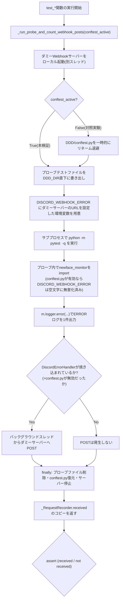
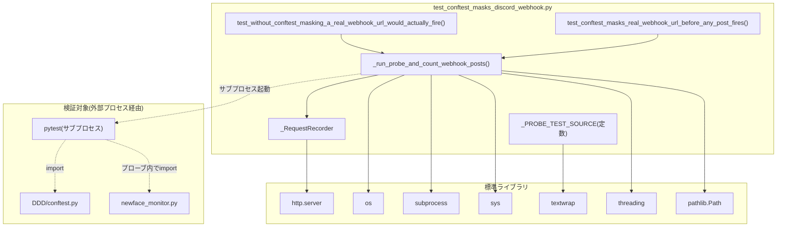

## 1. 解析メタ情報

| 項目 | 内容 |
| --- | --- |
| 対象ファイル | `test_conftest_masks_discord_webhook.py` |
| 言語 | Python |
| 解析対象 | 提供されたコードのみ |
| 推測・補完 | 一切なし |

## 関連ドキュメント

* [conftest.md](./conftest.md) — 本ファイルが検証対象とする、環境変数無害化の実装本体。
* [newface_monitor.md](./newface_monitor.md) — 本ファイルがプローブとして実際にimport・ERRORログ発火に使うモジュール。

## 2. ファイルの概要

* `DDD/conftest.py`によるDiscord Webhook関連環境変数の無害化（Issue #103対策）が実際に機能していることを検証する回帰テストである。
* 同一プロセス内での`monkeypatch`では「`core.logger.setup_logging()`がモジュールimport時点で一度だけconfig値をハンドラへ焼き込み、以降は変更を反映しない」という挙動を正しく再現できないため、別プロセス（サブプロセスのpytest実行）とローカルに立てたダミーHTTPサーバーへの実POSTの有無を観測することで検証する、という方式を取る。
* テストは2本存在し、(1) `DDD/conftest.py`を一時的に退避した状態で実際にPOSTが発生することを確認する対照実験と、(2) `DDD/conftest.py`がある通常の状態でPOSTが発生しないことを確認する本修正の検証、をそれぞれ担う。
* 根拠: [モジュールDocstring] (行番号: 3〜18 / 抜粋: "Issue #103の回帰テスト。\n\nnewface_monitor.py は MY_HOME_SYSTEM を sys.path に追加して本物の\ncore.logger.get_logger() を import しており")

## 3. 外部依存関係

### インポート一覧

| 名称 | 種類 | 用途 | 根拠 |
| --- | --- | --- | --- |
| `http.server` | 標準ライブラリ | ダミーのDiscord Webhookサーバー（`HTTPServer`/`BaseHTTPRequestHandler`）をローカルに立てるため | 根拠: [import文] (行番号: 20 / 抜粋: "import http.server") |
| `os` | 標準ライブラリ | サブプロセスに渡す環境変数の複製・上書き（`os.environ.copy()`） | 根拠: [import文] (行番号: 21 / 抜粋: "import os") |
| `subprocess` | 標準ライブラリ | プローブテストを別プロセスのpytestとして実行するため（`subprocess.run`） | 根拠: [import文] (行番号: 22 / 抜粋: "import subprocess") |
| `sys` | 標準ライブラリ | サブプロセス起動時のPythonインタプリタパス取得（`sys.executable`） | 根拠: [import文] (行番号: 23 / 抜粋: "import sys") |
| `textwrap` | 標準ライブラリ | プローブテストのソースコード文字列を`dedent`で整形するため | 根拠: [import文] (行番号: 24 / 抜粋: "import textwrap") |
| `threading` | 標準ライブラリ | ダミーWebhookサーバーをバックグラウンドスレッドで動かすため | 根拠: [import文] (行番号: 25 / 抜粋: "import threading") |
| `Path`（`pathlib`） | 標準ライブラリ | 本ファイル自身のディレクトリ（`DDD_DIR`）およびプローブテストファイル・`conftest.py`退避先パスの操作 | 根拠: [import文] (行番号: 26 / 抜粋: "from pathlib import Path") |

### ブラックボックスとなる外部要素

* `pytest`本体（サブプロセスとして`python -m pytest <probe>`で起動される） — 本ファイルはpytestの終了コードや標準出力を直接検証しておらず、ダミーサーバーへの到達有無のみで結果を判定するため、サブプロセス側のpytest実行が内部でどう動作するかはブラックボックスとして扱っている。
* `newface_monitor.py`（プローブテストのソース文字列内でimportされる） — 本ファイル自体はこのモジュールの内部実装を参照せず、`m.logger.error(...)`が呼べることのみを前提としている。

## 4. 主要要素の定義（関数 / エンドポイント / コンポーネント）

### `_PROBE_TEST_SOURCE`（モジュールレベル定数）

* **役割**: `DDD_DIR`配下に一時的に書き出される、最小構成のpytestテストファイルのソースコード文字列。自身のディレクトリをsys.pathへ追加したうえで`newface_monitor`をimportし、`m.logger.error(...)`でERRORレベルのログを1件出力してから1.5秒待機する、という「破損ファイル検知等でERRORログを出す既存テストケース」を模したプローブとして機能する。
* 根拠: (行番号: 30〜46 / 抜粋: "_PROBE_TEST_SOURCE = textwrap.dedent(\n    \"\"\"\\\n    import sys\n    from pathlib import Path\n    sys.path.insert(0, str(Path(__file__).resolve().parent))\n\n    import newface_monitor as m\n\n    def test_probe_emits_error_log():")

### `_RequestRecorder`（`http.server.BaseHTTPRequestHandler`のサブクラス）

* **役割**: ローカルに立てるダミーDiscord Webhookサーバーのリクエストハンドラ。POSTリクエストを受け取るたびにクラス変数`received`（リスト）へリクエストパスを追記し、200 OKを返す。サーバー起動ごとに`_RequestRecorder.received`が呼び出し元から明示的にリセットされる前提のクラス変数実装である。標準の`log_message`はオーバーライドしてテスト出力を汚さないよう抑制している。
* 根拠: `do_POST` (行番号: 49〜55 / 抜粋: "class _RequestRecorder(http.server.BaseHTTPRequestHandler):\n    received = []\n\n    def do_POST(self):\n        _RequestRecorder.received.append(self.path)\n        self.send_response(200)\n        self.end_headers()")
* 根拠: `log_message`の抑制 (行番号: 57〜58 / 抜粋: "def log_message(self, format, *args):  # noqa: A002 - BaseHTTPRequestHandlerのシグネチャに合わせる\n        pass")

* **引数/リクエスト**: `http.server.BaseHTTPRequestHandler`の標準シグネチャに従う（`do_POST`はインスタンスメソッドとして引数を取らない、`log_message`は`format`と可変長引数`*args`を受け取るがいずれも無視する）
* 根拠: (行番号: 52, 57)

* **戻り値/レスポンス**: `do_POST`はHTTPレスポンスとして200ステータスコードのみを返す（レスポンスボディは送信しない）
* 根拠: (行番号: 54〜55 / 抜粋: "self.send_response(200)\n        self.end_headers()")

* **副作用**: クラス変数`_RequestRecorder.received`へのリクエストパスの追記。テスト全体を通じて同一クラスを使い回すため、呼び出し元（`_run_probe_and_count_webhook_posts`）が実行前に`received = []`で明示的にリセットしている。
* 根拠: (行番号: 53 / 抜粋: "_RequestRecorder.received.append(self.path)")

* **エラーハンドリング**: なし。リクエストの内容（ヘッダ・ボディ）の検証は行わず、POSTを受け取ったという事実のみを記録する。

### `_run_probe_and_count_webhook_posts`

* **役割**: 本ファイルの中核となるヘルパー関数。(1) ローカルにダミーWebhookサーバーを起動し、(2) `conftest_active`が偽の場合は`DDD/conftest.py`を一時的にリネームして退避し、(3) `_PROBE_TEST_SOURCE`を`DDD_DIR`直下に一時ファイルとして書き出し、(4) `DISCORD_WEBHOOK_ERROR`環境変数にダミーサーバーのURLを設定したサブプロセスで`python -m pytest <プローブファイル> -q`を実行し、(5) `finally`ブロックでプローブファイルの削除・`conftest.py`の復元・サーバーの停止を行う。最終的にダミーサーバーが受け取ったリクエストパスのリストを返す。
* 根拠: (行番号: 61〜104 / 抜粋: "def _run_probe_and_count_webhook_posts(*, conftest_active: bool) -> list:")
* 根拠: `conftest.py`の退避 (行番号: 81〜82 / 抜粋: "if not conftest_active:\n            conftest_path.rename(conftest_backup_path)")
* 根拠: サブプロセス実行 (行番号: 89〜95 / 抜粋: "subprocess.run(\n            [sys.executable, \"-m\", \"pytest\", str(probe_path), \"-q\"],\n            cwd=str(DDD_DIR),\n            env=env,\n            timeout=30,\n            capture_output=True,\n        )")

* **引数/リクエスト**: キーワード専用引数 `conftest_active: bool`（`DDD/conftest.py`を有効なまま実行するか、一時的に退避して実行するかを切り替える）
* 根拠: (行番号: 61 / 抜粋: "def _run_probe_and_count_webhook_posts(*, conftest_active: bool) -> list:")

* **戻り値/レスポンス**: `list`（ダミーサーバーが受信したPOSTリクエストのパスのリスト。1件も受信しなければ空リスト）
* 根拠: (行番号: 104 / 抜粋: "return list(_RequestRecorder.received)")

* **副作用**: ローカルポート（`127.0.0.1`の空きポートを`HTTPServer`に自動割当）でのHTTPサーバー起動・停止、バックグラウンドスレッドの起動、`DDD_DIR`直下への一時ファイル（プローブテスト）の書き込み・削除、`conftest_active=False`時は`DDD/conftest.py`自体の一時的なリネーム、別プロセスでの`pytest`実行
* 根拠: (行番号: 70〜102)

* **エラーハンドリング**: `try`/`finally`により、サブプロセス実行が例外を送出した場合や`subprocess.run`が`timeout`（30秒）に達した場合でも、プローブファイルの削除・`conftest.py`の復元・サーバー停止が必ず実行されるようにしている。サブプロセス自体の終了コードや標準出力・標準エラー出力は明示的に検証していない（`capture_output=True`で捕捉はするが、戻り値の`CompletedProcess`を後続処理で参照していない）。
* 根拠: (行番号: 80〜102 / 抜粋: "try:\n        if not conftest_active:\n            conftest_path.rename(conftest_backup_path)\n\n        probe_path.write_text(_PROBE_TEST_SOURCE, encoding=\"utf-8\")\n\n        env = os.environ.copy()\n        env[\"DISCORD_WEBHOOK_ERROR\"] = f\"http://127.0.0.1:{port}/fake-webhook\"\n\n        subprocess.run(\n            [sys.executable, \"-m\", \"pytest\", str(probe_path), \"-q\"],\n            cwd=str(DDD_DIR),\n            env=env,\n            timeout=30,\n            capture_output=True,\n        )\n    finally:")

### `test_without_conftest_masking_a_real_webhook_url_would_actually_fire`

* **役割**: 対照実験。`DDD/conftest.py`による無害化が無い状態（`conftest_active=False`）でプローブを実行し、ダミーWebhookサーバーが実際にPOSTを受信すること（＝本テストが検出している脆弱性が実在すること、本テスト自体の前提が崩れていないこと）を確認する。
* 根拠: (行番号: 107〜115 / 抜粋: "def test_without_conftest_masking_a_real_webhook_url_would_actually_fire():\n    \"\"\"対照実験: DDD/conftest.pyによる無害化が無い場合")

* **引数/リクエスト**: なし（pytestのテスト関数）
* 根拠: (行番号: 107)

* **戻り値/レスポンス**: なし（`assert`文による成否判定のみ）
* 根拠: (行番号: 112〜115)

* **副作用**: `_run_probe_and_count_webhook_posts(conftest_active=False)`の呼び出しに伴う一連の副作用（上記参照）
* 根拠: (行番号: 111 / 抜粋: "received = _run_probe_and_count_webhook_posts(conftest_active=False)")

* **エラーハンドリング**: `received`が空（＝POSTが1件も発生しなかった）の場合、`assert`により「本テスト自体の前提が崩れている可能性がある」旨のメッセージ付きで失敗する。
* 根拠: (行番号: 112〜115 / 抜粋: "assert received, (\n        \"DDD/conftest.pyが無い状態でも実POSTが発生しなかった。\"\n        \"本テスト自体の前提(newface_monitor経由の焼き込み)が崩れている可能性がある。\"\n    )")

### `test_conftest_masks_real_webhook_url_before_any_post_fires`

* **役割**: 本修正（Issue #103対策）の検証本体。`DDD/conftest.py`が通常通り存在する状態（`conftest_active=True`）でプローブを実行し、ダミーWebhookサーバーがPOSTを一切受信しないこと（＝`DISCORD_WEBHOOK_ERROR`が空文字に無害化され、DiscordErrorHandlerが焼き込まれないこと）を確認する。
* 根拠: (行番号: 118〜123 / 抜粋: "def test_conftest_masks_real_webhook_url_before_any_post_fires():\n    \"\"\"本修正の本体: DDD/conftest.pyがある状態では")

* **引数/リクエスト**: なし（pytestのテスト関数）
* 根拠: (行番号: 118)

* **戻り値/レスポンス**: なし（`assert`文による成否判定のみ）
* 根拠: (行番号: 122〜123)

* **副作用**: `_run_probe_and_count_webhook_posts(conftest_active=True)`の呼び出しに伴う一連の副作用（上記参照。ただしこちらは`conftest.py`の退避・復元は行われない）
* 根拠: (行番号: 122 / 抜粋: "received = _run_probe_and_count_webhook_posts(conftest_active=True)")

* **エラーハンドリング**: `received`が空でない（＝1件以上のPOSTが発生した）場合、`assert`により受信したパスの一覧を含むメッセージ付きで失敗する。
* 根拠: (行番号: 123 / 抜粋: "assert not received, f\"DDD/conftest.pyがあるにも関わらずWebhookへPOSTが発生した: {received}\"")

## 5. 処理フロー図

## 6. 依存関係図

## 7. 次のステップ（リバースエンジニアリングの提案）

| 優先度 | ファイル名(推測可) | 理由 | 根拠 |
| --- | --- | --- | --- |
| 高 | `conftest.py` | 本ファイルが検証している無害化ロジックそのものであり、対象環境変数の一覧や実装方式を正確に理解するために必読。 | 根拠: [モジュールDocstring] (行番号: 11 / 抜粋: "(DDD/conftest.py が無く、MY_HOME_SYSTEM/tests/conftest.py と同様の\n環境変数の無害化が行われていなかったため)。") |
| 中 | `MY_HOME_SYSTEM/core/logger.py` | プローブが依存する`m.logger.error(...)`の実際の送信ロジック（`DiscordErrorHandler.emit`）を持つファイルであり、本テストがなぜバックグラウンドスレッド経由のPOSTを検知できるかの裏付けとなる。 | 根拠: [モジュールDocstring] (行番号: 6〜7 / 抜粋: "core.logger.get_logger() を import しており、これはモジュール import 時点\n(=pytestのcollection時点)で config.DISCORD_WEBHOOK_ERROR を") |

## 8. 保守上の注意点

* **`_RequestRecorder.received`のクラス変数共有**: `received`はインスタンス変数ではなくクラス変数のため、`_run_probe_and_count_webhook_posts`の冒頭で明示的に`_RequestRecorder.received = []`によりリセットされることに依存している。将来テストを並列実行（`pytest-xdist`等）する場合、クラス変数の共有により意図しない干渉が起きる可能性がある。
* **`conftest.py`のリネームによる一時的な保護喪失**: `test_without_conftest_masking_a_real_webhook_url_would_actually_fire`の実行中は`DDD/conftest.py`が一時的にファイルシステム上から消える（リネームされる）。この間に他のプロセスが並行して`DDD/`配下のpytestを実行すると、その実行は無害化されない状態で走ってしまう。テストの並列実行時にはこの一時的な状態変化に注意が必要。
* **タイムアウト・待機時間のマジックナンバー**: プローブ側の`time.sleep(1.5)`（バックグラウンドスレッドでのPOST送信を待つため）や`subprocess.run`の`timeout=30`は経験的な値であり、CI環境の負荷状況によってはPOSTの送信完了前にプローブプロセスが終了し、`test_without_conftest_masking_a_real_webhook_url_would_actually_fire`側が誤って失敗する（Flakyになる）リスクが理論上存在する。

## 9. 不明事項一覧

| 項目 | 理由 | 必要なファイル |
| --- | --- | --- |
| 本ファイルがCI（`.github/workflows/test.yml`）で実際に実行されているか | `test.yml`の`test`ジョブは`MY_HOME_SYSTEM/tests/`のみを対象にしており、`DDD/`配下のpytest実行はCIワークフロー定義に含まれていない可能性があるが、本ファイル単体からは判別できない。 | `.github/workflows/test.yml` |

## 10. 自己検証結果

* [x] 推測・外部ファイルの仕様を一切含んでいない
* [x] 全関数・全クラス・全コンポーネントを列挙した
* [x] 全てのインポート要素を列挙した
* [x] すべての仕様説明に「根拠（行番号・抜粋）」を明記した
* [x] 根拠漏れが0件である
* [x] Mermaid構文にエラーの原因となる記号（エスケープ漏れ）がない
* [x] 不明事項を漏れなく列挙した

完了
