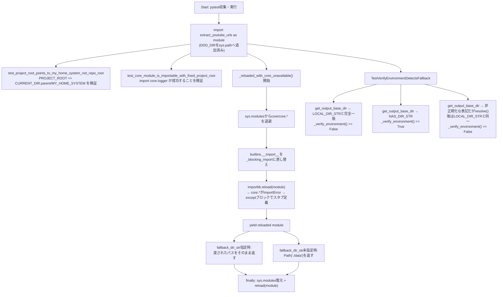

## 1. 解析メタ情報

| 項目 | 内容 |
| --- | --- |
| 対象ファイル | `test_extract_youtube_urls_paths.py` |
| 言語 | Python |
| 解析対象 | 提供されたコードのみ |
| 推測・補完 | 一切なし |

## 関連ドキュメント

* [extract_youtube_urls.md](./extract_youtube_urls.md) — 本ファイルがテスト対象とするモジュール（`PROJECT_ROOT`の解決、`get_managed_target_directory`フォールバックスタブ、`SubscriptionManager._verify_environment`）の解析ドキュメント。本ファイルの各テストは同ドキュメントに記載された修正内容（`fallback_dir_str`尊重、パス正規化比較）を直接検証する。
* [newface_monitor.md](./newface_monitor.md) — 本ファイルのモジュールDocstringおよびテスト内コメントで「newface_monitor.pyでは既に修正済みの同一バグ」として直接言及されている、同種のフォールバックパス解決バグを持つ別スクリプトの解析ドキュメント。

## 2. ファイルの概要

* モジュールDocstring上「H-12: extract_youtube_urls.py のPROJECT_ROOT解決・NASフォールバック挙動の回帰テスト」と称される、`DDD/extract_youtube_urls.py`に対する回帰テストスイートである。DDDにはpytest基盤(`conftest.py`等)が無いため、`pytest DDD/test_extract_youtube_urls_paths.py`のように直接ファイル指定して実行する前提であり、`MY_HOME_SYSTEM/pytest.ini`の`testpaths=tests`のスコープ外であることがDocstringに明記されている。
* 根拠: [モジュールDocstring] (行番号: 2〜16 / 抜粋: "H-12: extract_youtube_urls.py のPROJECT_ROOT解決・NASフォールバック挙動の回帰テスト。\n\nDDDにはpytest基盤(conftest.py等)が無いため、本ファイルは\n`pytest DDD/test_extract_youtube_urls_paths.py` のように直接指定して実行する\n(MY_HOME_SYSTEM/pytest.ini の testpaths=tests のスコープ外)。")
* Docstringには、修正前は`PROJECT_ROOT = CURRENT_DIR.parent`（`develop/`）を`core/`の実位置だと誤認しており、実リポジトリ配置では`from core.logger import get_logger`が`ImportError`になっていたこと、その結果使われるフォールバック用ローカルスタブ`get_managed_target_directory`が引数を無視してCWD相対の`"./data"`を返すバグを持っていたため実行ディレクトリ次第で保存先が毎回変わる不具合があったことが背景として記載されている（`newface_monitor.py`では既に修正済みの同一バグとも言及）。
* 根拠: [モジュールDocstring] (行番号: 9〜15 / 抜粋: "以前は PROJECT_ROOT = CURRENT_DIR.parent (develop/) を core/ の実位置だと\n誤認しており、実リポジトリ配置では `from core.logger import get_logger` が\nImportErrorになっていた。")
* `DDD_DIR`（本ファイルの親ディレクトリ）を`sys.path`の先頭に挿入したうえで`import extract_youtube_urls as module`を実行し、以降のテストは`module`経由でテスト対象の関数・クラスにアクセスする。
* 根拠: [モジュールレベルのセットアップ] (行番号: 25〜28 / 抜粋: "DDD_DIR = Path(__file__).resolve().parent\nsys.path.insert(0, str(DDD_DIR))\n\nimport extract_youtube_urls as module  # noqa: E402")
* 2件の単体テスト関数（`PROJECT_ROOT`の解決先検証、`core.logger`のインポート可否検証）と、2件のテストクラス（フォールバックスタブの引数尊重を検証する`TestFallbackStubRespectsExplicitPath`、`_verify_environment`のフォールバック検知を検証する`TestVerifyEnvironmentDetectsFallback`）で構成される。
* 根拠: [各テスト定義] (行番号: 31, 38, 45, 95 / 抜粋: "def test_project_root_points_to_my_home_system_not_repo_root():")
* `TestFallbackStubRespectsExplicitPath`内の`_reloaded_with_core_unavailable`コンテキストマネージャは、`builtins.__import__`をパッチして`core`パッケージのインポートを強制的に`ImportError`化したうえで`importlib.reload(module)`することで、実環境のインポート失敗時と同じ`except ImportError`分岐（フォールバックスタブ定義）を再現する。
* 根拠: [_reloaded_with_core_unavailable Docstring] (行番号: 54〜60 / 抜粋: "core.logger/core.nas_utilsのimportだけをImportErrorにしてモジュールを\n        再読込する。sys.pathからPROJECT_ROOTを除去するだけでは、モジュール自身の\n        トップレベルコードが `if str(PROJECT_ROOT) not in sys.path: sys.path.append(...)`\n        で毎回再追加してしまい、exceptブロックに到達できないため、\n        importそのものをブロックする。")
* `if __name__ == "__main__":`ブロックにより、`pytest`未経由でも`python test_extract_youtube_urls_paths.py`のように直接実行可能である。
* 根拠: [エントリーポイント] (行番号: 119〜120 / 抜粋: "if __name__ == "__main__":\n    sys.exit(pytest.main([__file__, "-v"]))")

## 3. 外部依存関係

### インポート一覧

| 名称 | 種類 | 用途 | 根拠 |
| --- | --- | --- | --- |
| `importlib` | 標準ライブラリ | `_reloaded_with_core_unavailable`内での`extract_youtube_urls`モジュールの再読込(`importlib.reload`) | 根拠: [import文] (行番号: 17 / 抜粋: "import importlib") |
| `sys` | 標準ライブラリ | `sys.path`への`DDD_DIR`挿入、`sys.modules`の退避・復元、`sys.exit` | 根拠: [import文] (行番号: 18 / 抜粋: "import sys") |
| `contextlib.contextmanager` | 標準ライブラリ | `_reloaded_with_core_unavailable`をコンテキストマネージャとして定義するためのデコレータ | 根拠: [import文] (行番号: 19 / 抜粋: "from contextlib import contextmanager") |
| `pathlib.Path` | 標準ライブラリ | ファイルパスの操作全般、テスト内でのパス構築・比較 | 根拠: [import文] (行番号: 20 / 抜粋: "from pathlib import Path") |
| `unittest.mock.patch` | 標準ライブラリ | `builtins.__import__`のパッチ、`AppConfig.get_output_base_dir`のパッチ | 根拠: [import文] (行番号: 21 / 抜粋: "from unittest.mock import patch") |
| `pytest` | サードパーティ | テストフレームワーク本体、`pytest.main`によるエントリーポイント実行 | 根拠: [import文] (行番号: 23 / 抜粋: "import pytest") |
| `extract_youtube_urls` (as `module`) | ローカルモジュール（テスト対象） | 本ファイルが検証する対象モジュール本体。`DDD_DIR`を`sys.path`に追加した上でインポートされる | 根拠: [import文] (行番号: 28 / 抜粋: "import extract_youtube_urls as module  # noqa: E402") |
| `builtins` | 標準ライブラリ | `_reloaded_with_core_unavailable`内で`__import__`をパッチするために元の`builtins.__import__`を保持 | 根拠: [import文] (行番号: 61 / 抜粋: "import builtins") |
| `core.logger` | 内部モジュール（テスト対象の間接依存） | `test_core_module_is_importable_with_fixed_project_root`が、修正後の`PROJECT_ROOT`で実際にインポート可能であることを直接検証する対象 | 根拠: [import文] (行番号: 42 / 抜粋: "import core.logger  # noqa: F401  (ImportErrorにならないこと自体が検証)") |

### ブラックボックスとなる外部要素

| 名称 | 理由 | 根拠 |
| --- | --- | --- |
| `extract_youtube_urls`モジュールの内部実装 | `PROJECT_ROOT`, `get_managed_target_directory`, `AppConfig`, `SubscriptionManager._verify_environment`の実装詳細は本ファイルからは分からず、テスト対象モジュール自体（`extract_youtube_urls.py`）に依存する。 | 根拠: [import文] (行番号: 28 / 抜粋: "import extract_youtube_urls as module  # noqa: E402") |
| `core.logger`の実際の実装 | `import core.logger`が成功すること自体は検証されるが、`core.logger`モジュール内部の実装（`get_logger`関数の有無等）は本ファイルからは分からない。 | 根拠: [import文] (行番号: 42 / 抜粋: "import core.logger  # noqa: F401  (ImportErrorにならないこと自体が検証)") |
| `pytest`の`tmp_path`/`monkeypatch`フィクスチャ | 各テストメソッドの引数として使用されるが、フィクスチャ自体の実装は`pytest`本体に依存し、本ファイルのコードからは分からない。 | 根拠: [テストメソッドのシグネチャ] (行番号: 96, 101, 108 / 抜粋: "def test_detects_fallback_when_base_dir_matches_local_dir_exactly(self):") |

## 4. 主要要素の定義（関数 / エンドポイント / コンポーネント）

### `test_project_root_points_to_my_home_system_not_repo_root`

* **役割**: `module.PROJECT_ROOT`が、DDDの単なる親ディレクトリ（リポジトリルート）ではなく、`core/`が実在する`MY_HOME_SYSTEM`ディレクトリを指すことを検証するテスト関数。`extract_youtube_urls.py`が`CURRENT_DIR.parent / "MY_HOME_SYSTEM"`という新しい方式で`PROJECT_ROOT`を解決するようになったことを直接検証する。
* 根拠: [関数定義とDocstring] (行番号: 31〜33 / 抜粋: "def test_project_root_points_to_my_home_system_not_repo_root():\n    """H-12: PROJECT_ROOTはDDDの単なる親(repoルート)ではなく、\n    core/ が実在する develop/MY_HOME_SYSTEM を指すこと。"""")

* **引数/リクエスト**: なし
* 根拠: [関数定義] (行番号: 31 / 抜粋: "def test_project_root_points_to_my_home_system_not_repo_root():")

* **戻り値/レスポンス**: 該当なし（`assert`文による検証のみ、戻り値なし）
* **副作用**: なし（`module.PROJECT_ROOT`/`module.CURRENT_DIR`の参照のみ）
* **エラーハンドリング**: なし（アサーション失敗時は`pytest`がテスト失敗として報告する）
* 根拠: [assert文] (行番号: 34〜35 / 抜粋: "assert module.PROJECT_ROOT == module.CURRENT_DIR.parent / "MY_HOME_SYSTEM"\n    assert module.PROJECT_ROOT.name == "MY_HOME_SYSTEM"")

### `test_core_module_is_importable_with_fixed_project_root`

* **役割**: 修正後の`PROJECT_ROOT`が`sys.path`に含まれており、実際に`core.logger`をインポートできる（ローカルフォールバックスタブに落ちない）ことを検証するテスト関数。
* 根拠: [関数定義とDocstring] (行番号: 38〜40 / 抜粋: "def test_core_module_is_importable_with_fixed_project_root():\n    """修正後のPROJECT_ROOTでは実際にcore.loggerがimportでき、\n    ローカルフォールバックスタブに落ちないこと。"""")

* **引数/リクエスト**: なし
* 根拠: [関数定義] (行番号: 38 / 抜粋: "def test_core_module_is_importable_with_fixed_project_root():")

* **戻り値/レスポンス**: 該当なし
* **副作用**: `core.logger`モジュールの実際のインポート実行（`sys.modules`へのキャッシュを含む）。
* 根拠: [import文] (行番号: 42 / 抜粋: "import core.logger  # noqa: F401  (ImportErrorにならないこと自体が検証)")

* **エラーハンドリング**: なし（`import core.logger`が`ImportError`を送出した場合、テスト自体が失敗する。すなわち「例外が発生しないこと」自体が検証内容である）
* 根拠: [assert文とコメント] (行番号: 41〜42 / 抜粋: "assert str(module.PROJECT_ROOT) in sys.path\n    import core.logger  # noqa: F401  (ImportErrorにならないこと自体が検証)")

### `TestFallbackStubRespectsExplicitPath._reloaded_with_core_unavailable`

* **役割**: `core.logger`/`core.nas_utils`のインポートを`builtins.__import__`のパッチにより強制的に`ImportError`化し、`importlib.reload(module)`でモジュールを再読込することで、実環境でインポートが失敗した場合と同じ`except ImportError`分岐（フォールバックスタブ定義）を再現するコンテキストマネージャ。`sys.path`から`PROJECT_ROOT`を除去するだけでは、モジュール自身のトップレベルコードが再度`sys.path`へ追加してしまい`except`ブロックに到達できないため、`import`自体をブロックする方式を採る。
* 根拠: [メソッド定義とDocstring] (行番号: 52〜60 / 抜粋: "def _reloaded_with_core_unavailable(self):\n        """\n        core.logger/core.nas_utilsのimportだけをImportErrorにしてモジュールを\n        再読込する。")

* **引数/リクエスト**: なし（`self`のみ）
* 根拠: [メソッド定義] (行番号: 53 / 抜粋: "def _reloaded_with_core_unavailable(self):")

* **戻り値/レスポンス**: `yield`により再読込後の`module`オブジェクトを呼び出し元の`with`文へ渡す（`@contextmanager`によるジェネレータベースのコンテキストマネージャ）。
* 根拠: [yield文] (行番号: 77 / 抜粋: "yield importlib.reload(module)")

* **副作用**: `sys.modules`から`core`および`core.*`モジュールを一時的に除去、`builtins.__import__`のパッチ（`core`/`core.*`向けのインポートを`ImportError`化）、`module`の再読込（フォールバックスタブが有効な状態になる）。`finally`節で`sys.modules`を復元し、`module`を再度`reload`して`core`利用可能な元の状態に戻す。
* 根拠: [副作用のあるコード] (行番号: 70〜74, 76〜77, 79〜80 / 抜粋: "removed_modules = {\n            name: sys.modules.pop(name)\n            for name in list(sys.modules)\n            if name == "core" or name.startswith("core.")\n        }")

* **エラーハンドリング**: `try`/`finally`により、`with`ブロック内（呼び出し元のテストコード）で例外が発生した場合でも、`sys.modules`の復元と`module`の再読込を確実に実行する。
* 根拠: [try-finally] (行番号: 75〜80 / 抜粋: "try:\n            with patch("builtins.__import__", side_effect=_blocking_import):\n                yield importlib.reload(module)\n        finally:\n            sys.modules.update(removed_modules)\n            importlib.reload(module)  # core利用可能な元の状態に戻す")

### `TestFallbackStubRespectsExplicitPath._blocking_import`（内部関数）

* **役割**: `_reloaded_with_core_unavailable`内で定義される、`builtins.__import__`の差し替え用関数。インポート対象名が`"core"`またはその配下（`"core."`始まり）の場合にのみ`ImportError`を送出し、それ以外は元の`__import__`（`real_import`）へ委譲する。
* 根拠: [関数定義] (行番号: 65〜68 / 抜粋: "def _blocking_import(name, *args, **kwargs):\n            if name == "core" or name.startswith("core."):\n                raise ImportError(f"blocked for test: {name}")\n            return real_import(name, *args, **kwargs)")

* **引数/リクエスト**: `name`（インポート対象モジュール名）, `*args`, `**kwargs`（`__import__`標準シグネチャに準拠）
* 根拠: [引数定義] (行番号: 65 / 抜粋: "def _blocking_import(name, *args, **kwargs):")

* **戻り値/レスポンス**: `core`関連以外のインポートについては`real_import(name, *args, **kwargs)`の戻り値をそのまま返す。
* 根拠: [return文] (行番号: 68 / 抜粋: "return real_import(name, *args, **kwargs)")

* **副作用**: なし（元の`__import__`への委譲、または例外送出のみ）
* **エラーハンドリング**: 対象が`core`関連の場合は`ImportError`を意図的に送出する（テストのための擬似障害注入）。
* 根拠: [if文とraise] (行番号: 66〜67 / 抜粋: "if name == "core" or name.startswith("core."):\n                raise ImportError(f"blocked for test: {name}")")

### `TestFallbackStubRespectsExplicitPath.test_stub_returns_the_passed_fallback_dir_str_not_cwd_relative`

* **役割**: `core`利用不可時に再読込された`module`の`get_managed_target_directory`フォールバックスタブが、`fallback_dir_str`引数を渡された場合はそれを`Path`化して返す（CWD相対の`"./data"`を返さない）ことを検証するテストメソッド。`extract_youtube_urls.md`が記載する修正内容（`fallback_dir_str`尊重）の主要な回帰テストである。
* 根拠: [メソッド定義] (行番号: 82〜87 / 抜粋: "def test_stub_returns_the_passed_fallback_dir_str_not_cwd_relative(self):\n        with self._reloaded_with_core_unavailable() as reloaded:\n            result = reloaded.get_managed_target_directory(\n                nas_dir_str="/mnt/nas/x", fallback_dir_str="/home/user/develop/DDD/data", mount_point="/mnt/nas"\n            )\n        assert result == Path("/home/user/develop/DDD/data")")

* **引数/リクエスト**: なし（`self`のみ）
* **戻り値/レスポンス**: 該当なし
* **副作用**: `_reloaded_with_core_unavailable`経由でのモジュール再読込（一時的な`sys.modules`改変を伴う）。
* 根拠: [with文] (行番号: 83 / 抜粋: "with self._reloaded_with_core_unavailable() as reloaded:")

* **エラーハンドリング**: なし（`assert`失敗時はテスト失敗として報告される）
* 根拠: [assert文] (行番号: 87 / 抜粋: "assert result == Path("/home/user/develop/DDD/data")")

### `TestFallbackStubRespectsExplicitPath.test_stub_falls_back_to_relative_data_only_when_no_kwarg_given`

* **役割**: `fallback_dir_str`引数が渡されない場合に限り、フォールバックスタブが`Path("./data")`を返すことを検証するテストメソッド（引数省略時の後方互換的なデフォルト挙動の確認）。
* 根拠: [メソッド定義] (行番号: 89〜92 / 抜粋: "def test_stub_falls_back_to_relative_data_only_when_no_kwarg_given(self):\n        with self._reloaded_with_core_unavailable() as reloaded:\n            result = reloaded.get_managed_target_directory()\n        assert result == Path("./data")")

* **引数/リクエスト**: なし（`self`のみ）
* **戻り値/レスポンス**: 該当なし
* **副作用**: `_reloaded_with_core_unavailable`経由でのモジュール再読込。
* **エラーハンドリング**: なし
* 根拠: [assert文] (行番号: 92 / 抜粋: "assert result == Path("./data")")

### `TestVerifyEnvironmentDetectsFallback.test_detects_fallback_when_base_dir_matches_local_dir_exactly`

* **役割**: `AppConfig.get_output_base_dir`が`AppConfig.LOCAL_DIR_STR`と完全一致するパスを返す場合、`SubscriptionManager._verify_environment`が`False`（ローカルフォールバック中と判定）を返すことを検証するテストメソッド。
* 根拠: [メソッド定義] (行番号: 96〜99 / 抜粋: "def test_detects_fallback_when_base_dir_matches_local_dir_exactly(self):\n        with patch.object(module.AppConfig, "get_output_base_dir", return_value=Path(module.AppConfig.LOCAL_DIR_STR)):\n            manager = module.SubscriptionManager.__new__(module.SubscriptionManager)\n            assert manager._verify_environment() is False")

* **引数/リクエスト**: なし（`self`のみ）
* **戻り値/レスポンス**: 該当なし
* **副作用**: `module.AppConfig.get_output_base_dir`の一時的なパッチ、`SubscriptionManager.__new__`による（`__init__`を経由しない）インスタンス生成。
* 根拠: [patch.objectと__new__] (行番号: 97〜98 / 抜粋: "with patch.object(module.AppConfig, "get_output_base_dir", return_value=Path(module.AppConfig.LOCAL_DIR_STR)):\n            manager = module.SubscriptionManager.__new__(module.SubscriptionManager)")

* **エラーハンドリング**: なし
* 根拠: [assert文] (行番号: 99 / 抜粋: "assert manager._verify_environment() is False")

### `TestVerifyEnvironmentDetectsFallback.test_does_not_flag_fallback_when_base_dir_is_the_real_nas_path`

* **役割**: `AppConfig.get_output_base_dir`が`AppConfig.NAS_DIR_STR`（本来のNASパス）を返す場合、`_verify_environment`が`True`（正常なNAS環境）を返すことを検証するテストメソッド。
* 根拠: [メソッド定義] (行番号: 101〜106 / 抜粋: "def test_does_not_flag_fallback_when_base_dir_is_the_real_nas_path(self):\n        with patch.object(\n            module.AppConfig, "get_output_base_dir", return_value=Path(module.AppConfig.NAS_DIR_STR)\n        ):\n            manager = module.SubscriptionManager.__new__(module.SubscriptionManager)\n            assert manager._verify_environment() is True")

* **引数/リクエスト**: なし（`self`のみ）
* **戻り値/レスポンス**: 該当なし
* **副作用**: `module.AppConfig.get_output_base_dir`の一時的なパッチ、`SubscriptionManager.__new__`によるインスタンス生成。
* **エラーハンドリング**: なし
* 根拠: [assert文] (行番号: 106 / 抜粋: "assert manager._verify_environment() is True")

### `TestVerifyEnvironmentDetectsFallback.test_detects_fallback_even_with_non_normalized_path_representation`

* **役割**: 旧実装（絶対パスの部分文字列包含チェック）ではフォールバック関数がバグって短い相対パス`"./data"`を返した場合にフォールバック状態を検知できなかったことのH-12回帰防止テスト。`LOCAL_DIR_STR`に対して`/../`を挟んだ非正規化な表記のパス（`resolve()`すれば同一パスになる）を`get_output_base_dir`の戻り値として与え、パス正規化した比較であれば表記が異なっても`False`（フォールバック検知）を返すことを検証する。
* 根拠: [メソッド定義とDocstring] (行番号: 108〜116 / 抜粋: "def test_detects_fallback_even_with_non_normalized_path_representation(self):\n        """H-12回帰防止: 旧実装(部分文字列 in チェック)は、フォールバック関数が\n        バグって短い相対パス './data' を返した場合にフォールバック状態を\n        検知できなかった。")

* **引数/リクエスト**: なし（`self`のみ）
* **戻り値/レスポンス**: 該当なし
* **副作用**: `Path(module.AppConfig.LOCAL_DIR_STR + "/../" + ...)`による非正規化パスの構築、`AppConfig.get_output_base_dir`の一時的なパッチ、`SubscriptionManager.__new__`によるインスタンス生成。
* 根拠: [messy_pathの構築とpatch] (行番号: 113〜115 / 抜粋: "messy_path = Path(module.AppConfig.LOCAL_DIR_STR + "/../" + Path(module.AppConfig.LOCAL_DIR_STR).name)\n        with patch.object(module.AppConfig, "get_output_base_dir", return_value=messy_path):\n            manager = module.SubscriptionManager.__new__(module.SubscriptionManager)")

* **エラーハンドリング**: なし
* 根拠: [assert文] (行番号: 116 / 抜粋: "assert manager._verify_environment() is False")

### `if __name__ == "__main__":` ブロック

* **役割**: 本ファイルが`pytest`経由ではなく直接実行された場合に、`pytest.main`を用いて自身のテストを実行するエントリーポイント。
* 根拠: [エントリーポイント定義] (行番号: 119〜120 / 抜粋: "if __name__ == "__main__":\n    sys.exit(pytest.main([__file__, "-v"]))")

* **引数/リクエスト**: なし
* **戻り値/レスポンス**: 該当なし
* **副作用**: `pytest.main([__file__, "-v"])`の実行（自身のテスト全件を詳細出力モードで実行）、その終了コードでの`sys.exit`。
* 根拠: [pytest.main呼び出し] (行番号: 120 / 抜粋: "sys.exit(pytest.main([__file__, "-v"]))")

* **エラーハンドリング**: なし

## 5. 処理フロー図

`TestFallbackStubRespectsExplicitPath`のコンテキストマネージャによるモジュール再読込の仕組みを中心に、本ファイルのテスト実行フローを示します。

## 6. 依存関係図

```mermaid
graph TD
    subgraph "test_extract_youtube_urls_paths.py"
        TestRootFn["test_project_root_points_to_my_home_system_not_repo_root()"]
        TestCoreImportFn["test_core_module_is_importable_with_fixed_project_root()"]
        FallbackStubClass["TestFallbackStubRespectsExplicitPath"]
        ReloadCtx["_reloaded_with_core_unavailable()"]
        BlockingImport["_blocking_import()"]
        VerifyEnvClass["TestVerifyEnvironmentDetectsFallback"]
    end

    subgraph "テスト対象"
        ExtractModule["extract_youtube_urls.py<br>(PROJECT_ROOT / get_managed_target_directory /<br>AppConfig / SubscriptionManager._verify_environment)"]
    end

    subgraph "外部依存（標準ライブラリ）"
        importlib_mod["importlib.reload"]
        unittest_mock["unittest.mock.patch"]
        builtins_mod["builtins.__import__"]
        contextlib_mod["contextlib.contextmanager"]
    end

    subgraph "外部依存（サードパーティ/内部）"
        pytest_mod["pytest"]
        core_logger["core.logger (MY_HOME_SYSTEM)"]
    end

    TestRootFn --> ExtractModule
    TestCoreImportFn --> ExtractModule
    TestCoreImportFn --> core_logger

    FallbackStubClass --> ReloadCtx
    ReloadCtx --> BlockingImport
    ReloadCtx --> importlib_mod
    ReloadCtx --> builtins_mod
    ReloadCtx --> unittest_mock
    ReloadCtx --> contextlib_mod
    ReloadCtx --> ExtractModule

    VerifyEnvClass --> ExtractModule
    VerifyEnvClass --> unittest_mock

    TestRootFn --> pytest_mod
    TestCoreImportFn --> pytest_mod
    FallbackStubClass --> pytest_mod
    VerifyEnvClass --> pytest_mod
```

## 7. 次のステップ（リバースエンジニアリングの提案）

| 優先度 | ファイル名(推測可) | 理由 | 根拠 |
| --- | --- | --- | --- |
| 高 | `DDD/extract_youtube_urls.py` | 本ファイルがテストする全ての挙動（`PROJECT_ROOT`解決、フォールバックスタブ、`_verify_environment`）の実装本体であり、既に`extract_youtube_urls.md`として解析済み。両ドキュメントを突き合わせて整合性を確認するとよい。 | 根拠: [import文] (行番号: 28 / 抜粋: "import extract_youtube_urls as module  # noqa: E402") |
| 中 | `MY_HOME_SYSTEM/core/logger.py` | `test_core_module_is_importable_with_fixed_project_root`が成功前提とする`core.logger`モジュールの実体を確認するため。 | 根拠: [import文] (行番号: 42 / 抜粋: "import core.logger  # noqa: F401  (ImportErrorにならないこと自体が検証)") |
| 低 | `MY_HOME_SYSTEM/pytest.ini` | 本ファイルのDocstringが言及する「`testpaths=tests`のスコープ外」という記述の裏付けとなる設定ファイル（既に直接確認済み: `testpaths = tests`）。 | 根拠: [モジュールDocstring] (行番号: 7 / 抜粋: "(MY_HOME_SYSTEM/pytest.ini の testpaths=tests のスコープ外)。") |

## 8. 保守上の注意点

* **`sys.modules`の直接操作によるグローバル状態への影響**: `_reloaded_with_core_unavailable`は`sys.modules`から`core`関連モジュールを削除し`importlib.reload`でモジュールを再読込するため、テストが並列実行される環境（`pytest-xdist`等）では他のテストと`sys.modules`の状態を奪い合い、意図しない副作用を引き起こすリスクがある。`finally`節での復元処理はあるが、復元前に別スレッド/プロセスが介入する余地までは排除されていない。
* 根拠: [sys.modules操作] (行番号: 70〜74, 79〜80 / 抜粋: "removed_modules = {\n            name: sys.modules.pop(name)\n            for name in list(sys.modules)\n            if name == "core" or name.startswith("core.")\n        }")
* **`builtins.__import__`のグローバルパッチ**: `_blocking_import`は`core`関連のインポートを無条件に`ImportError`化するため、`with patch("builtins.__import__", ...)`のブロック内で偶然`core.*`を必要とする他のコードが実行されると、意図せずそちらも`ImportError`になる。
* 根拠: [_blocking_import定義] (行番号: 65〜68 / 抜粋: "def _blocking_import(name, *args, **kwargs):\n            if name == "core" or name.startswith("core."):\n                raise ImportError(f"blocked for test: {name}")")
* **`test_core_module_is_importable_with_fixed_project_root`が実環境の`core.logger`存在に依存**: このテストは、実際に`MY_HOME_SYSTEM/core/logger.py`が存在し`import core.logger`が成功する環境でのみパスする。`core`パッケージがリポジトリから削除・移動された場合はテスト自体が（本来検証したい`PROJECT_ROOT`解決ロジックとは無関係な理由で）失敗しうる。
* 根拠: [import文] (行番号: 42 / 抜粋: "import core.logger  # noqa: F401  (ImportErrorにならないこと自体が検証)")
* **DDD配下にpytest基盤が無いことへの依存**: Docstringに明記の通り、本ファイルは`MY_HOME_SYSTEM/pytest.ini`の`testpaths=tests`スコープ外であり、CI等で`pytest`が自動収集する設定になっていない場合、個別にファイル指定して実行しない限りこのテストは実行されない。

## 9. 不明事項一覧

| 項目 | 理由 | 必要なファイル |
| --- | --- | --- |
| 本ファイルが実際にCI等で自動実行されているか | Docstringには手動実行コマンド（`pytest DDD/test_extract_youtube_urls_paths.py`）の記載はあるが、CI設定（GitHub Actions等）で本ファイルが自動的に収集・実行されているかは本ファイルからは不明。 | `.github/workflows/`配下のCI定義ファイル等（コード外） |
| `pytest-xdist`等の並列実行プラグインの利用有無 | `sys.modules`直接操作を伴うテストのため、並列実行時の安全性は利用しているpytestプラグイン構成に依存するが、本ファイルからは分からない。 | `MY_HOME_SYSTEM/pytest.ini`（`testpaths`以外のプラグイン設定は本ファイルの解析対象外）、`requirements*.txt`等 |

## 10. 自己検証結果

* [x] 推測・外部ファイルの仕様を一切含んでいない
* [x] 全関数・全クラス・全コンポーネントを列挙した
* [x] 全てのインポート要素を列挙した
* [x] すべての仕様説明に「根拠（行番号・抜粋）」を明記した
* [x] 根拠漏れが0件である
* [x] Mermaid構文にエラーの原因となる記号（エスケープ漏れ）がない
* [x] 不明事項を漏れなく列挙した

完了
