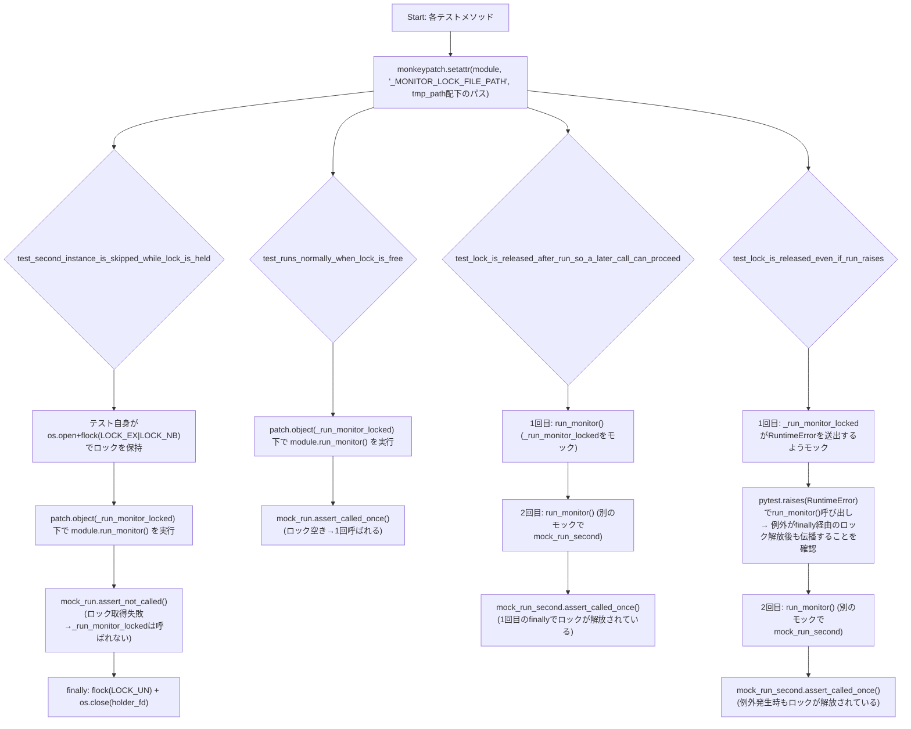
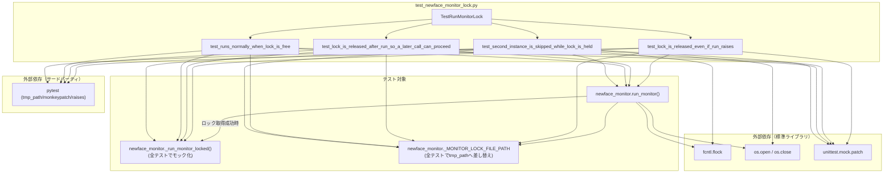

## 1. 解析メタ情報

| 項目 | 内容 |
| --- | --- |
| 対象ファイル | `test_newface_monitor_lock.py` |
| 言語 | Python |
| 解析対象 | 提供されたコードのみ |
| 推測・補完 | 一切なし |

## 関連ドキュメント

* [newface_monitor.md](./newface_monitor.md) — 本ファイルがテスト対象とするモジュール（`run_monitor`, `_run_monitor_locked`, `_MONITOR_LOCK_FILE_PATH`）の解析ドキュメント。本ファイルの各テストは同ドキュメントに記載された多重起動防止ロック（M-7-4）の挙動を直接検証する。
* [batch_download_discord.md](./batch_download_discord.md) — 本ファイルのモジュールDocstringで「既にflockによる多重起動防止ロックを持つ」と直接言及されている、同種の`fcntl.flock`ロックパターンを先に採用していたスクリプトの解析ドキュメント。

## 2. ファイルの概要

* モジュールDocstring上「M-7-4: newface_monitor.py の多重起動防止ロックの回帰テスト」と称される、`DDD/newface_monitor.py`の`run_monitor`/`_run_monitor_locked`に対する回帰テストスイートである。DDDにはpytest基盤(`conftest.py`等)が無いため、`pytest DDD/test_newface_monitor_lock.py`のように直接ファイル指定して実行する前提であり、`MY_HOME_SYSTEM/pytest.ini`の`testpaths=tests`のスコープ外であることがDocstringに明記されている。
* 根拠: [モジュールDocstring] (行番号: 2〜13 / 抜粋: "M-7-4: newface_monitor.py の多重起動防止ロックの回帰テスト。\n\nDDDにはpytest基盤(conftest.py等)が無いため、本ファイルは\n`pytest DDD/test_newface_monitor_lock.py` のように直接指定して実行する\n(MY_HOME_SYSTEM/pytest.ini の testpaths=tests のスコープ外)。")
* Docstringには、`batch_download_discord.py`は既に`flock`による多重起動防止ロックを持つ一方、`newface_monitor.py`には無く、cronの1回が想定より長引く（1時間超）と新旧プロセスが並行実行され、既知キャストリスト・サマリファイルの読み書きが競合しうる問題があったことが背景として記載されている。
* 根拠: [モジュールDocstring] (行番号: 9〜12 / 抜粋: "batch_download_discord.py は既にflockによる多重起動防止ロックを持つが、\nnewface_monitor.py には無く、cronの1回が想定より長引く(1時間超)と\n新旧プロセスが並行実行され、既知キャストリスト・サマリファイルの\n読み書きが競合しうる問題があった。")
* `DDD_DIR`（本ファイルの親ディレクトリ）を`sys.path`の先頭に挿入したうえで`import newface_monitor as module`を実行し、以降のテストは`module`経由でテスト対象の関数にアクセスする。
* 根拠: [モジュールレベルのセットアップ] (行番号: 22〜25 / 抜粋: "DDD_DIR = Path(__file__).resolve().parent\nsys.path.insert(0, str(DDD_DIR))\n\nimport newface_monitor as module  # noqa: E402")
* テストは単一のクラス`TestRunMonitorLock`に4件のテストメソッドとしてまとめられており、いずれも`monkeypatch.setattr(module, "_MONITOR_LOCK_FILE_PATH", lock_path)`で実際のロックファイルパスをpytestの一時ディレクトリ（`tmp_path`）配下に差し替えたうえで、`module._run_monitor_locked`を`unittest.mock.patch.object`でモック化して検証する。これにより、実際のサイト巡回処理（`_run_monitor_locked`本体）を一切実行せずに、ロック取得・解放のロジックだけを分離して検証できる。
* 根拠: [各テストメソッドのmonkeypatch/patch.object] (行番号: 30〜31, 38 / 抜粋: "lock_path = tmp_path / ".newface_monitor.lock"\n        monkeypatch.setattr(module, "_MONITOR_LOCK_FILE_PATH", lock_path)")
* `if __name__ == "__main__":`ブロックにより、`pytest`未経由でも`python test_newface_monitor_lock.py`のように直接実行可能である。
* 根拠: [エントリーポイント] (行番号: 78〜79 / 抜粋: "if __name__ == "__main__":\n    sys.exit(pytest.main([__file__, "-v"]))")

## 3. 外部依存関係

### インポート一覧

| 名称 | 種類 | 用途 | 根拠 |
| --- | --- | --- | --- |
| `fcntl` | 標準ライブラリ | `test_second_instance_is_skipped_while_lock_is_held`内で、テスト自身が「1つ目のインスタンス」としてロックを保持するために直接`flock`を呼び出す | 根拠: [import文] (行番号: 14 / 抜粋: "import fcntl") |
| `os` | 標準ライブラリ | ロックファイルディスクリプタのオープン(`os.open`)・クローズ(`os.close`) | 根拠: [import文] (行番号: 15 / 抜粋: "import os") |
| `sys` | 標準ライブラリ | `sys.path`への`DDD_DIR`挿入、`sys.exit` | 根拠: [import文] (行番号: 16 / 抜粋: "import sys") |
| `pathlib.Path` | 標準ライブラリ | ロックファイルパス（`tmp_path / ".newface_monitor.lock"`）の構築 | 根拠: [import文] (行番号: 17 / 抜粋: "from pathlib import Path") |
| `unittest.mock.patch` | 標準ライブラリ | `module._run_monitor_locked`のモック化(`patch.object`) | 根拠: [import文] (行番号: 18 / 抜粋: "from unittest.mock import patch") |
| `pytest` | サードパーティ | テストフレームワーク本体、`tmp_path`/`monkeypatch`フィクスチャの提供元、`pytest.raises`、`pytest.main`によるエントリーポイント実行 | 根拠: [import文] (行番号: 20 / 抜粋: "import pytest") |
| `newface_monitor` (as `module`) | ローカルモジュール（テスト対象） | 本ファイルが検証する対象モジュール本体（`run_monitor`, `_run_monitor_locked`, `_MONITOR_LOCK_FILE_PATH`）。`DDD_DIR`を`sys.path`に追加した上でインポートされる | 根拠: [import文] (行番号: 25 / 抜粋: "import newface_monitor as module  # noqa: E402") |

### ブラックボックスとなる外部要素

| 名称 | 理由 | 根拠 |
| --- | --- | --- |
| `newface_monitor`モジュールの内部実装 | `run_monitor`, `_run_monitor_locked`, `_MONITOR_LOCK_FILE_PATH`以外の実装詳細（`WebMonitor`, `DiscordNotifier`等）は本ファイルからは分からず、テスト対象モジュール自体（`newface_monitor.py`）に依存する。本ファイルは`_run_monitor_locked`を常にモック化しており、その内部処理は一切実行・検証しない。 | 根拠: [import文とpatch.object] (行番号: 25, 38 / 抜粋: "import newface_monitor as module  # noqa: E402") |
| `pytest`の`tmp_path`/`monkeypatch`フィクスチャ | 各テストメソッドの引数として使用されるが、フィクスチャ自体の実装は`pytest`本体に依存し、本ファイルのコードからは分からない。 | 根拠: [テストメソッドのシグネチャ] (行番号: 29, 45, 54, 65 / 抜粋: "def test_second_instance_is_skipped_while_lock_is_held(self, tmp_path, monkeypatch):") |
| OS依存の`fcntl.flock`セマンティクス | `flock`の排他ロック・非ブロッキング動作（`LOCK_EX \| LOCK_NB`）はOS（POSIX）のファイルロック実装に依存し、本ファイルのコードからはその正確な意味論（例えばネットワークファイルシステム上での挙動）までは分からない。 | 根拠: [flock呼び出し] (行番号: 36 / 抜粋: "fcntl.flock(holder_fd, fcntl.LOCK_EX | fcntl.LOCK_NB)") |

## 4. 主要要素の定義（関数 / エンドポイント / コンポーネント）

### `TestRunMonitorLock` (テストクラス)

* **役割**: `newface_monitor.py`の多重起動防止ロック機構（`run_monitor`によるロック取得・解放と、ロック取得成功時のみ`_run_monitor_locked`を呼び出す設計）を検証する4件のテストメソッドをまとめたテストクラス。
* 根拠: [クラス定義] (行番号: 28 / 抜粋: "class TestRunMonitorLock:")

* **引数/リクエスト**: 該当なし（クラス自体はインスタンス化パラメータを持たない）
* **戻り値/レスポンス**: 該当なし
* **副作用**: なし（クラス定義自体には副作用なし。各テストメソッド実行時の副作用は個別に記載）
* **エラーハンドリング**: なし

### `TestRunMonitorLock.test_second_instance_is_skipped_while_lock_is_held`

* **役割**: ロックファイルを別プロセス（この場合はテスト自身が模擬する「1つ目のインスタンス」）が排他ロック中の状態で`module.run_monitor()`を呼び出した場合、`_run_monitor_locked`が一切呼び出されず即座にスキップされることを検証するテストメソッド。
* 根拠: [メソッド定義とコメント] (行番号: 29〜34 / 抜粋: "def test_second_instance_is_skipped_while_lock_is_held(self, tmp_path, monkeypatch):\n        lock_path = tmp_path / ".newface_monitor.lock"\n        monkeypatch.setattr(module, "_MONITOR_LOCK_FILE_PATH", lock_path)\n\n        # 1つ目の"インスタンス"としてロックを保持したまま、\n        # 2つ目の run_monitor() 呼び出しが即座にスキップされることを検証する。")

* **引数/リクエスト**: `self`, `tmp_path`（pytestフィクスチャ、一時ディレクトリ）, `monkeypatch`（pytestフィクスチャ）
* 根拠: [引数定義] (行番号: 29 / 抜粋: "def test_second_instance_is_skipped_while_lock_is_held(self, tmp_path, monkeypatch):")

* **戻り値/レスポンス**: 該当なし
* **副作用**: `_MONITOR_LOCK_FILE_PATH`を一時パスへ差し替え(`monkeypatch.setattr`)、`os.open`+`fcntl.flock`によるロックファイルの排他ロック取得（テスト自身が「他のインスタンス」を模擬）、`module._run_monitor_locked`のモック化、`module.run_monitor()`の実行、`finally`節でのロック解放とディスクリプタクローズ。
* 根拠: [ロック取得と実行] (行番号: 35〜40 / 抜粋: "holder_fd = os.open(str(lock_path), os.O_CREAT | os.O_RDWR)\n        fcntl.flock(holder_fd, fcntl.LOCK_EX | fcntl.LOCK_NB)\n        try:\n            with patch.object(module, "_run_monitor_locked") as mock_run:\n                module.run_monitor()\n            mock_run.assert_not_called()")

* **エラーハンドリング**: `try`/`finally`により、アサーション失敗時も含めてロックファイルディスクリプタのロック解放・クローズを確実に行う。
* 根拠: [try-finally] (行番号: 37〜43 / 抜粋: "try:\n            with patch.object(module, "_run_monitor_locked") as mock_run:\n                module.run_monitor()\n            mock_run.assert_not_called()\n        finally:\n            fcntl.flock(holder_fd, fcntl.LOCK_UN)\n            os.close(holder_fd)")

### `TestRunMonitorLock.test_runs_normally_when_lock_is_free`

* **役割**: ロックが誰にも保持されていない（空いている）状態で`module.run_monitor()`を呼び出した場合、`_run_monitor_locked`が1回だけ呼び出されることを検証するテストメソッド（正常系）。
* 根拠: [メソッド定義] (行番号: 45〜52 / 抜粋: "def test_runs_normally_when_lock_is_free(self, tmp_path, monkeypatch):\n        lock_path = tmp_path / ".newface_monitor.lock"\n        monkeypatch.setattr(module, "_MONITOR_LOCK_FILE_PATH", lock_path)\n\n        with patch.object(module, "_run_monitor_locked") as mock_run:\n            module.run_monitor()\n\n        mock_run.assert_called_once()")

* **引数/リクエスト**: `self`, `tmp_path`, `monkeypatch`
* 根拠: [引数定義] (行番号: 45 / 抜粋: "def test_runs_normally_when_lock_is_free(self, tmp_path, monkeypatch):")

* **戻り値/レスポンス**: 該当なし
* **副作用**: `_MONITOR_LOCK_FILE_PATH`を一時パスへ差し替え、`module._run_monitor_locked`のモック化、`module.run_monitor()`の実行。
* 根拠: [with文] (行番号: 49〜50 / 抜粋: "with patch.object(module, "_run_monitor_locked") as mock_run:\n            module.run_monitor()")

* **エラーハンドリング**: なし
* 根拠: [assert文] (行番号: 52 / 抜粋: "mock_run.assert_called_once()")

### `TestRunMonitorLock.test_lock_is_released_after_run_so_a_later_call_can_proceed`

* **役割**: 1回目の`run_monitor()`呼び出し（`_run_monitor_locked`をモック化した正常終了）の後、ロックが確実に解放されており、2回目の`run_monitor()`呼び出しも問題なく`_run_monitor_locked`を1回呼び出せることを検証するテストメソッド。
* 根拠: [メソッド定義] (行番号: 54〜63 / 抜粋: "def test_lock_is_released_after_run_so_a_later_call_can_proceed(self, tmp_path, monkeypatch):\n        lock_path = tmp_path / ".newface_monitor.lock"\n        monkeypatch.setattr(module, "_MONITOR_LOCK_FILE_PATH", lock_path)\n\n        with patch.object(module, "_run_monitor_locked"):\n            module.run_monitor()\n\n        with patch.object(module, "_run_monitor_locked") as mock_run_second:\n            module.run_monitor()\n        mock_run_second.assert_called_once()")

* **引数/リクエスト**: `self`, `tmp_path`, `monkeypatch`
* 根拠: [引数定義] (行番号: 54 / 抜粋: "def test_lock_is_released_after_run_so_a_later_call_can_proceed(self, tmp_path, monkeypatch):")

* **戻り値/レスポンス**: 該当なし
* **副作用**: `module.run_monitor()`を2回連続で実行（1回目・2回目とも`_run_monitor_locked`をモック化）。
* 根拠: [2回のrun_monitor呼び出し] (行番号: 58〜62 / 抜粋: "with patch.object(module, "_run_monitor_locked"):\n            module.run_monitor()\n\n        with patch.object(module, "_run_monitor_locked") as mock_run_second:\n            module.run_monitor()")

* **エラーハンドリング**: なし
* 根拠: [assert文] (行番号: 63 / 抜粋: "mock_run_second.assert_called_once()")

### `TestRunMonitorLock.test_lock_is_released_even_if_run_raises`

* **役割**: `_run_monitor_locked`が例外を送出した場合でも（`run_monitor`がその例外を`finally`でのロック解放後に伝播させる設計であることを前提に）、ロックが確実に解放され、後続の`run_monitor()`呼び出しが問題なく`_run_monitor_locked`を1回呼び出せることを検証するテストメソッド。
* 根拠: [メソッド定義] (行番号: 65〜75 / 抜粋: "def test_lock_is_released_even_if_run_raises(self, tmp_path, monkeypatch):\n        lock_path = tmp_path / ".newface_monitor.lock"\n        monkeypatch.setattr(module, "_MONITOR_LOCK_FILE_PATH", lock_path)\n\n        with patch.object(module, "_run_monitor_locked", side_effect=RuntimeError("boom")):\n            with pytest.raises(RuntimeError):\n                module.run_monitor()")

* **引数/リクエスト**: `self`, `tmp_path`, `monkeypatch`
* 根拠: [引数定義] (行番号: 65 / 抜粋: "def test_lock_is_released_even_if_run_raises(self, tmp_path, monkeypatch):")

* **戻り値/レスポンス**: 該当なし
* **副作用**: `_run_monitor_locked`を`RuntimeError`を送出するようモック化し、`module.run_monitor()`を実行（例外が`run_monitor`の外まで伝播することを`pytest.raises`で確認）、続けて別のモックで2回目の`run_monitor()`を実行。
* 根拠: [side_effectとpytest.raises] (行番号: 69〜71 / 抜粋: "with patch.object(module, "_run_monitor_locked", side_effect=RuntimeError("boom")):\n            with pytest.raises(RuntimeError):\n                module.run_monitor()")

* **エラーハンドリング**: `pytest.raises(RuntimeError)`により、`run_monitor()`が`_run_monitor_locked`の例外をロック解放後もそのまま再送出する（握りつぶさない）ことを積極的に検証している。
* 根拠: [pytest.raisesと後続呼び出し] (行番号: 70〜75 / 抜粋: "with pytest.raises(RuntimeError):\n                module.run_monitor()\n\n        with patch.object(module, "_run_monitor_locked") as mock_run_second:\n            module.run_monitor()\n        mock_run_second.assert_called_once()")

### `if __name__ == "__main__":` ブロック

* **役割**: 本ファイルが`pytest`経由ではなく直接実行された場合に、`pytest.main`を用いて自身のテストを実行するエントリーポイント。
* 根拠: [エントリーポイント定義] (行番号: 78〜79 / 抜粋: "if __name__ == "__main__":\n    sys.exit(pytest.main([__file__, "-v"]))")

* **引数/リクエスト**: なし
* **戻り値/レスポンス**: 該当なし
* **副作用**: `pytest.main([__file__, "-v"])`の実行、その終了コードでの`sys.exit`。
* 根拠: [pytest.main呼び出し] (行番号: 79 / 抜粋: "sys.exit(pytest.main([__file__, "-v"]))")

* **エラーハンドリング**: なし

## 5. 処理フロー図

4件のテストメソッドが`_MONITOR_LOCK_FILE_PATH`の差し替えと`_run_monitor_locked`のモック化を通じてロック機構をどう検証するかを示します。

## 6. 依存関係図

## 7. 次のステップ（リバースエンジニアリングの提案）

| 優先度 | ファイル名(推測可) | 理由 | 根拠 |
| --- | --- | --- | --- |
| 高 | `DDD/newface_monitor.py` | 本ファイルがテストする`run_monitor`/`_run_monitor_locked`/`_MONITOR_LOCK_FILE_PATH`の実装本体であり、既に`newface_monitor.md`として解析済み。両ドキュメントを突き合わせて整合性を確認するとよい。 | 根拠: [import文] (行番号: 25 / 抜粋: "import newface_monitor as module  # noqa: E402") |
| 中 | `DDD/batch_download_discord.py` | 本ファイルのDocstringが比較対象として言及する、先行して`flock`ロックを実装済みのスクリプト（既に`batch_download_discord.md`として解析済み）。 | 根拠: [モジュールDocstring] (行番号: 9 / 抜粋: "batch_download_discord.py は既にflockによる多重起動防止ロックを持つが、") |
| 低 | `MY_HOME_SYSTEM/pytest.ini` | 本ファイルのDocstringが言及する「`testpaths=tests`のスコープ外」という記述の裏付けとなる設定ファイル（既に直接確認済み: `testpaths = tests`）。 | 根拠: [モジュールDocstring] (行番号: 7 / 抜粋: "(MY_HOME_SYSTEM/pytest.ini の testpaths=tests のスコープ外)。") |

## 8. 保守上の注意点

* **`_run_monitor_locked`が常にモック化され、実処理は一切検証されない**: 本ファイルの4テストは全て`patch.object(module, "_run_monitor_locked")`でモック化しているため、ロック取得・解放のロジックのみが検証対象であり、`_run_monitor_locked`内部の実際のサイト巡回・通知処理（`WebMonitor`, `DiscordNotifier`等）の正しさはこのテストファイルでは一切保証されない。
* 根拠: [patch.objectの使用箇所] (行番号: 38, 49, 58, 61, 69, 73 / 抜粋: "with patch.object(module, "_run_monitor_locked") as mock_run:")
* **`test_second_instance_is_skipped_while_lock_is_held`は同一プロセス内でのロック競合を検証**: `fcntl.flock`のPOSIXセマンティクス上、同一プロセス内の別ファイルディスクリプタ間でも排他ロックは機能するため、このテストは実際の「別プロセス」を起動せずに多重起動状態を模擬できている。ただし、これは実運用（cronによる別プロセス起動）とは異なる条件下でのテストである点に留意が必要（`fcntl.flock`はプロセス単位ではなくファイルディスクリプタ単位でロックを管理するため、同一プロセス内の別fdからの競合検知も実際のマルチプロセス競合と同様に機能する）。
* 根拠: [holder_fdによるロック取得] (行番号: 35〜36 / 抜粋: "holder_fd = os.open(str(lock_path), os.O_CREAT | os.O_RDWR)\n        fcntl.flock(holder_fd, fcntl.LOCK_EX | fcntl.LOCK_NB)")
* **`monkeypatch.setattr`による`_MONITOR_LOCK_FILE_PATH`の差し替えはモジュールレベル定数への直接代入**: `newface_monitor.py`側でこの定数がモジュールロード時に一度だけ評価される設計を前提としており、`run_monitor`関数内で毎回再評価される設計に変更された場合は本テストの前提が崩れる可能性がある。

## 9. 不明事項一覧

| 項目 | 理由 | 必要なファイル |
| --- | --- | --- |
| 本ファイルが実際にCI等で自動実行されているか | Docstringには手動実行コマンド（`pytest DDD/test_newface_monitor_lock.py`）の記載はあるが、CI設定（GitHub Actions等）で本ファイルが自動的に収集・実行されているかは本ファイルからは不明。 | `.github/workflows/`配下のCI定義ファイル等（コード外） |
| 実運用のcron環境における`flock`の挙動 | 本ファイルのテストはローカルファイルシステム上の一時ディレクトリ（`tmp_path`）でのロック取得・解放のみを検証しており、実運用でのNAS/ネットワークファイルシステム上での`flock`の挙動（本ファイルの保守上の注意点で言及）までは検証していない。 | 実運用環境のファイルシステム構成情報（コード外） |

## 10. 自己検証結果

* [x] 推測・外部ファイルの仕様を一切含んでいない
* [x] 全関数・全クラス・全コンポーネントを列挙した
* [x] 全てのインポート要素を列挙した
* [x] すべての仕様説明に「根拠（行番号・抜粋）」を明記した
* [x] 根拠漏れが0件である
* [x] Mermaid構文にエラーの原因となる記号（エスケープ漏れ）がない
* [x] 不明事項を漏れなく列挙した

完了
