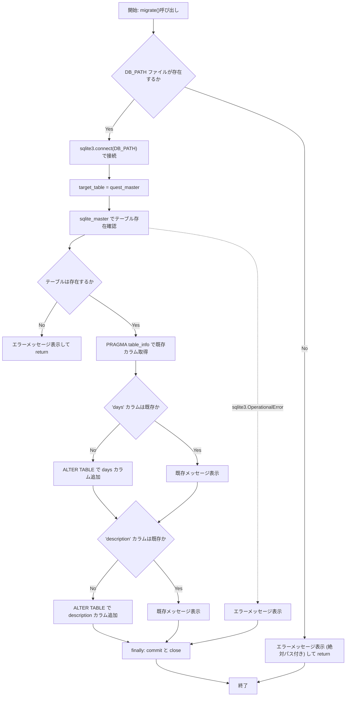
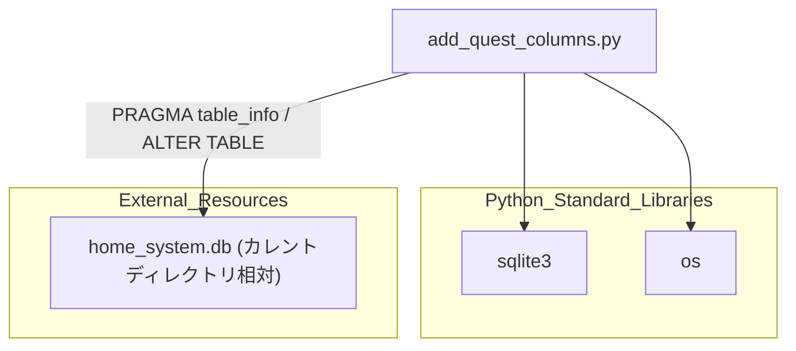

## 1. 解析メタ情報

| 項目 | 内容 |
| --- | --- |
| 対象ファイル | `add_quest_columns.py` |
| 言語 | Python |
| 解析対象 | 提供されたコードのみ |
| 推測・補完 | 一切なし |

## 関連ドキュメント

* [quest_service.md](./quest_service.md) - `quest_master`テーブルを扱う本番サービス側モジュールと推測され、本ファイルが追加する`days`/`description`カラムの利用先として関連
* [fix_quest_reset_period.md](./fix_quest_reset_period.md) - 同じ`quest_master`テーブルに対して別の観点（`reset_period`修正）でマイグレーションを行う同系統のスクリプト
* [init_unified_db.md](./init_unified_db.md) - `quest_master`テーブルを含むDBスキーマの初期構築を担うと推測される関連ドキュメント

## 2. ファイルの概要

相対パス`home_system.db`のSQLiteデータベースに接続し、`quest_master`テーブルに`days`カラムと`description`カラム（いずれもTEXT型）を、未追加の場合のみ追加する`migrate`関数を定義するスクリプト。テーブルの存在確認および既存カラムの確認を行った上でカラム追加を行い、モジュール直接実行時に`migrate()`が呼び出される。

* 根拠: `[DB_PATH定義]` (行番号: 4 / 抜粋: "DB_PATH = \"home_system.db\"")
* 根拠: `[テーブル存在確認]` (行番号: 19〜21 / 抜粋: "cur.execute(f\"SELECT name FROM sqlite_master WHERE type='table' AND name='{target_table}';\")\n        if not cur.fetchone():")
* 根拠: `[daysカラム追加]` (行番号: 29〜30 / 抜粋: "if 'days' not in columns:\n            cur.execute(f\"ALTER TABLE {target_table} ADD COLUMN days TEXT\")")
* 根拠: `[descriptionカラム追加]` (行番号: 36〜37 / 抜粋: "if 'description' not in columns:\n            cur.execute(f\"ALTER TABLE {target_table} ADD COLUMN description TEXT\")")
* 根拠: `[main実行部]` (行番号: 48〜49 / 抜粋: "if __name__ == \"__main__\":\n    migrate()")

## 3. 外部依存関係

### インポート一覧

| 名称 | 種類 | 用途 | 根拠 |
| --- | --- | --- | --- |
| `sqlite3` | 標準ライブラリ | SQLiteデータベースへの接続、カーソル生成、SQL実行、`OperationalError`の捕捉 | 根拠: `[import sqlite3]` (行番号: 1 / 抜粋: "import sqlite3") |
| `os` | 標準ライブラリ | `DB_PATH`の存在確認（`os.path.exists`）および絶対パス表示（`os.path.abspath`） | 根拠: `[os.path.exists / os.path.abspath]` (行番号: 7〜8 / 抜粋: "if not os.path.exists(DB_PATH):\n        print(f\"❌ Error: Database file not found at: {os.path.abspath(DB_PATH)}\")") |

### ブラックボックスとなる外部要素

| 名称 | 理由 | 根拠 |
| --- | --- | --- |
| `home_system.db`（実行時カレントディレクトリ相対）の既存スキーマ | データベースファイルの実体・`quest_master`テーブルの既存カラム全体が当ファイル内では提供されていないため。 | 根拠: `[DB_PATH]` (行番号: 4 / 抜粋: "DB_PATH = \"home_system.db\"") |

## 4. 主要要素の定義（関数 / エンドポイント / コンポーネント）

### `migrate`

* **役割**: `home_system.db`に接続し、`quest_master`テーブルの存在確認後、既存カラムを取得して`days`・`description`カラムを未追加の場合のみそれぞれ追加する。
* 根拠: `[migrate定義]` (行番号: 6 / 抜粋: "def migrate():")

* **引数/リクエスト**: なし
* 根拠: `[関数シグネチャ]` (行番号: 6 / 抜粋: "def migrate():")

* **戻り値/レスポンス**: なし。`DB_PATH`が存在しない場合、またはテーブルが存在しない場合は早期`return`（明示的な戻り値は持たない）。
* 根拠: `[早期return（ファイル不在）]` (行番号: 7〜9 / 抜粋: "if not os.path.exists(DB_PATH):\n        print(f\"❌ Error: Database file not found at: {os.path.abspath(DB_PATH)}\")\n        return")
* 根拠: `[早期return（テーブル不在）]` (行番号: 20〜22 / 抜粋: "if not cur.fetchone():\n            print(f\"❌ Error: Table '{target_table}' does not exist.\")\n            return")

* **副作用**: `sqlite3.connect`によるDB接続確立、`PRAGMA table_info`によるカラム情報取得、`ALTER TABLE`によるスキーマ変更、`finally`節での`conn.commit()`と`conn.close()`。
* 根拠: `[connect]` (行番号: 12 / 抜粋: "conn = sqlite3.connect(DB_PATH)")
* 根拠: `[finally節]` (行番号: 44〜46 / 抜粋: "finally:\n        conn.commit()\n        conn.close()")

* **エラーハンドリング**: `sqlite3.OperationalError`を捕捉しエラーメッセージを`print`表示。`finally`節で例外の有無に関わらず必ず`conn.commit()`と`conn.close()`を実行する。
* 根拠: `[except節]` (行番号: 42〜43 / 抜粋: "except sqlite3.OperationalError as e:\n        print(f\"⚠️ SQLite Error: {e}\")")

## 5. 処理フロー図

## 6. 依存関係図

## 7. 次のステップ（リバースエンジニアリングの提案）

| 優先度 | ファイル名(推測可) | 理由 | 根拠 |
| --- | --- | --- | --- |
| 高 | `quest_service.py` | 追加された`days`・`description`カラムが実際にどのようなロジックで利用されるかを確認するため。 | 根拠: `[days / description カラム追加]` (行番号: 30, 37 / 抜粋: "cur.execute(f\"ALTER TABLE {target_table} ADD COLUMN days TEXT\")") |
| 中 | `init_unified_db.py` | `quest_master`テーブルの完全な初期スキーマ（本ファイルが追加する前のカラム構成）を確認するため。 | 根拠: `[target_table = \"quest_master\"]` (行番号: 15 / 抜粋: "target_table = \"quest_master\"") |

## 8. 保守上の注意点

* **相対パスによるDB指定**: `DB_PATH = "home_system.db"`が相対パスであり、スクリプトの実行時カレントディレクトリに依存する。誤った場所から実行するとファイル不在エラーになるか、意図しない別のDBファイルに接続する可能性がある。
* 根拠: `[DB_PATH]` (行番号: 4 / 抜粋: "DB_PATH = \"home_system.db\"")
* **f-stringによるSQL文の動的構築**: テーブル名`target_table`をf-stringでSQL文に直接埋め込んでいる。本ファイルでは`target_table`はハードコードされた固定値`"quest_master"`のため実害はないが、パラメータ化されたクエリ（プレースホルダ）を使っていない点はSQLインジェクション対策の観点で潜在的な設計上の懸念点である。
* 根拠: `[f-stringによるSQL構築]` (行番号: 19, 25, 30, 37 / 抜粋: "cur.execute(f\"SELECT name FROM sqlite_master WHERE type='table' AND name='{target_table}';\")")
* **`Exception`全般の非捕捉**: `sqlite3.OperationalError`のみを捕捉しており、それ以外の予期しない例外（例: ファイルI/Oエラー等）は捕捉されず、`finally`節を通過した後にそのまま呼び出し元に伝播する。
* 根拠: `[exceptがOperationalErrorのみ]` (行番号: 42〜43 / 抜粋: "except sqlite3.OperationalError as e:\n        print(f\"⚠️ SQLite Error: {e}\")")

## 9. 不明事項一覧

| 項目 | 理由 | 必要なファイル |
| --- | --- | --- |
| `quest_master`テーブルの完全なスキーマ | `days`・`description`カラム以外の既存カラム構成が当ファイルからは判断できないため。 | `init_unified_db.py`等のスキーマ定義ファイル |
| 追加された`days`・`description`カラムの実際の利用箇所 | どのモジュールがこれらのカラムを読み書きするかは当ファイルからは判断できないため。 | `quest_service.py`等、`quest_master`を参照するモジュール |
| 本スクリプトの想定実行ディレクトリ | 相対パス`home_system.db`がどのディレクトリを基準に解決される想定かが当ファイル内には明記されていないため。 | 運用手順書または呼び出し元スクリプト |

## 相互参照による補足情報

| 元の不明事項 | 判明した内容 | 参照元ドキュメント |
| --- | --- | --- |
| `quest_master`テーブルの完全なスキーマ | `init_unified_db.py`を直接確認した。392〜409行目の`CREATE TABLE IF NOT EXISTS quest_master`文により、`quest_id INTEGER PRIMARY KEY AUTOINCREMENT, title TEXT NOT NULL, description TEXT, quest_type TEXT DEFAULT 'daily', exp_gain INTEGER DEFAULT 10, gold_gain INTEGER DEFAULT 5, icon_key TEXT, day_of_week TEXT, target_user TEXT DEFAULT 'all', start_date TEXT, end_date TEXT, pre_requisite_quest_id INTEGER, occurrence_chance REAL DEFAULT 1.0, start_time TEXT, end_time TEXT`という初期スキーマであることが判明した。注目すべき点として、この初期スキーマには`description`カラムが最初から含まれており(395行目)、本ファイル(`add_quest_columns.py`)による`ALTER TABLE ... ADD COLUMN description`(37行目)は`init_unified_db.py`実行済みの環境では冗長な処理となる。一方`days`という名前のカラムはこの初期スキーマに存在せず、代わりに`day_of_week`カラムが存在する。さらに`services/quest_service.py`723〜724行目には、実行時に`reset_period`カラムが存在しなければ`ALTER TABLE quest_master ADD COLUMN reset_period TEXT DEFAULT 'weekly_monday'`を自動追加するマイグレーション処理があり、`quest_master`は複数のスクリプト・処理により段階的にカラムが追加されていく設計であることを確認した。 | 直接ソース確認: `MY_HOME_SYSTEM/init_unified_db.py:392-409`, `MY_HOME_SYSTEM/services/quest_service.py:719-724` |
| 追加された`days`・`description`カラムの実際の利用箇所 | `services/quest_service.py`を直接確認した。`description`カラムは744〜767行目の`INSERT INTO quest_master (..., description, ...) ... ON CONFLICT(quest_id) DO UPDATE SET ... description = excluded.description`により、クエストマスタデータ同期処理で実際に読み書きされていることを確認した。一方、`add_quest_columns.py`が追加する`days`という名前のカラムについては、`quest_master`を参照する箇所を検索したが、直接読み書きしている箇所は見つからなかった。むしろ163〜166行目のコメント「原因: DB生データには 'days' キーがなく、'day_of_week' カラムが存在する」および166行目`if quest['day_of_week']:`という実装が示す通り、コード側は`day_of_week`カラムを参照しており、`q['days']`という辞書キーは535〜541行目で`day_of_week`カラムの値から実行時に動的に生成される派生値(Pythonの辞書上のみに存在するキー)であって、DBの`days`という物理カラムそのものを参照するコードはリポジトリ内に見当たらなかった。 | 直接ソース確認: `MY_HOME_SYSTEM/services/quest_service.py:162-166, 535-541, 744-767` |
| 本スクリプトの想定実行ディレクトリ | 明確な運用手順書はリポジトリ内に見当たらなかったが、関連する複数のソースを直接確認した。`config.py`212行目の`BASE_DIR: str = os.path.dirname(os.path.abspath(__file__))`（`config.py`自身の存在ディレクトリ、すなわち`MY_HOME_SYSTEM/`）を基準に、222行目で`SQLITE_DB_PATH: str = os.getenv("SQLITE_DB_PATH") or os.path.join(BASE_DIR, "home_system.db")`と定義されている。また同様に相対パス`DB_PATH = "home_system.db"`を用いる`MY_HOME_SYSTEM/old/db_fix.py`は、4行目のコメント「修正点: configに依存せず、直接絶対パスを指定します」に続き、5行目で`DB_PATH = "/home/masahiro/develop/MY_HOME_SYSTEM/home_system.db"`という絶対パスを直書きしており、これは`MY_HOME_SYSTEM/`ディレクトリ自体を指している。以上から、`add_quest_columns.py`の相対パス`home_system.db`も同様に、`MY_HOME_SYSTEM/`ディレクトリ（`config.BASE_DIR`と同じ場所）をカレントディレクトリとして実行される想定であると判断できる。 | 直接ソース確認: `MY_HOME_SYSTEM/config.py:212, 222`, `MY_HOME_SYSTEM/old/db_fix.py:5` |

## 10. 自己検証結果

* [x] 推測・外部ファイルの仕様を一切含んでいない（完了）
* [x] 全関数・全クラス・全コンポーネントを列挙した（完了）
* [x] 全てのインポート要素を列挙した（完了）
* [x] すべての仕様説明に「根拠（行番号・抜粋）」を明記した（完了）
* [x] 根拠漏れが0件である（完了）
* [x] Mermaid構文にエラーの原因となる記号（エスケープ漏れ）がない（完了）
* [x] 不明事項を漏れなく列挙した（完了）
