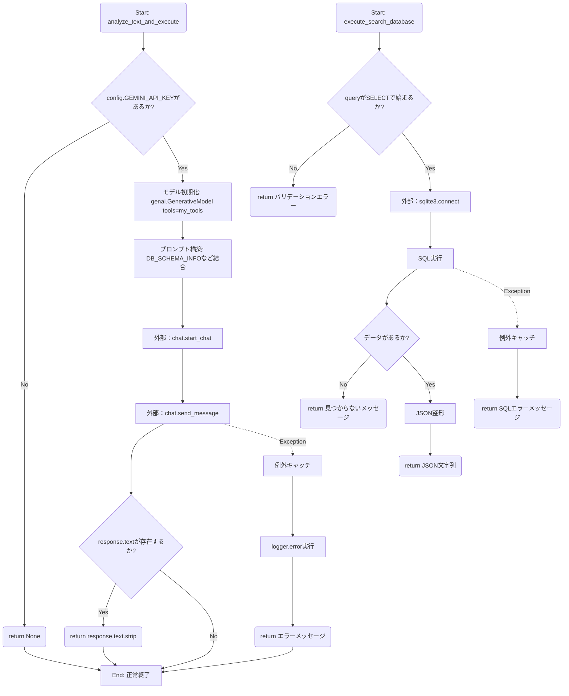
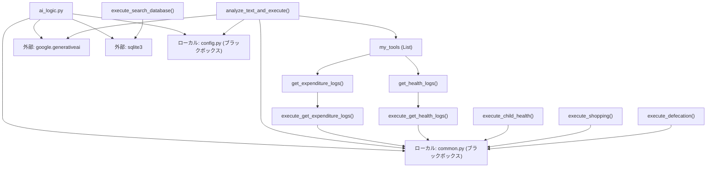

## 1. 解析メタ情報

| 項目 | 内容 |
| --- | --- |
| 対象ファイル | `ai_logic.py` |
| 言語 | Python |
| 解析対象 | 提供されたコードのみ |
| 推測・補完 | 一切なし |

## 2. ファイルの概要

* このファイルは、家庭用アシスタント「セバスチャン」として、ユーザーからの入力テキストをGoogleのGemini API (`gemini-2.5-flash`) を用いて解析し、意図に応じた処理を決定・実行する役割を持つ。
* 具体的には、子供の体調、買い物履歴、排便などのログをデータベース（SQLite）へ記録・検索するための機能群（ツールや実行ロジック）を定義し、AIモデルと連携させている。

## 3. 外部依存関係

### インポート一覧

| 名称 | 種類 | 用途 | 根拠 |
| --- | --- | --- | --- |
| `google.generativeai` | 外部 | Gemini APIの利用 | 根拠: `import` (行番号取得不可 / 抜粋: "import google.generativeai") |
| `FunctionDeclaration`, `Tool` | 外部 | Gemini用のツール定義（使用箇所はコード上に明示なし） | 根拠: `import` (行番号取得不可 / 抜粋: "from google.generativeai.types") |
| `json` | 標準 | SQL検索結果のJSON文字列化 | 根拠: `import json` (行番号取得不可 / 抜粋: "import json") |
| `datetime` | 標準 | 日付処理用（直接的なメソッド呼び出しはコード上に明示なし） | 根拠: `import datetime` (行番号取得不可 / 抜粋: "import datetime") |
| `traceback` | 標準 | エラー発生時のトレースバック出力 | 根拠: `import traceback` (行番号取得不可 / 抜粋: "import traceback") |
| `sqlite3` | 標準 | SQLiteデータベースへの接続とクエリ実行 | 根拠: `import sqlite3` (行番号取得不可 / 抜粋: "import sqlite3") |
| `re` | 標準 | 実行SQLがSELECT文であるかの正規表現チェック | 根拠: `import re` (行番号取得不可 / 抜粋: "import re") |
| `common` | ローカル | ログ保存、現在時刻取得、SQL実行、通知などの共通処理 | 根拠: `import common` (行番号取得不可 / 抜粋: "import common") |
| `config` | ローカル | APIキー、テーブル名、DBパスなどの設定値参照 | 根拠: `import config` (行番号取得不可 / 抜粋: "import config") |

### ブラックボックスとなる外部要素

| 名称 | 理由 | 根拠 |
| --- | --- | --- |
| `common` モジュールの各関数 | 実装が別ファイルであり、具体的な保存先、通知先、SQL実行の内部処理が不明（commonファイルに依存のため要確認） | 根拠: `common.setup_logging` など複数箇所 (行番号取得不可 / 抜粋: "common.setup_logging") |
| `config` モジュールの各変数 | APIキーやDBパス、各テーブル名の具体的な文字列や設定状態が不明（configファイルに依存のため要確認） | 根拠: `config.GEMINI_API_KEY` など複数箇所 (行番号取得不可 / 抜粋: "config.GEMINI_API_KEY") |

## 4. 主要要素の定義（関数 / エンドポイント / コンポーネント）

### `declare_child_health`

* **役割**: 子供の体調や怪我、様子を記録するツール定義用関数（内部処理は `pass`）。
* 根拠: `declare_child_health` (行番号取得不可 / 抜粋: "子供の体調や怪我、様子を記録する。")

* **引数/リクエスト**: `child_name` (str), `condition` (str), `is_emergency` (bool, デフォルトFalse)。
* 根拠: `declare_child_health` (行番号取得不可 / 抜粋: "child_name: str, condition")

* **戻り値/レスポンス**: なし。
* 根拠: `declare_child_health` (行番号取得不可 / 抜粋: "pass")

* **副作用**: なし。
* 根拠: `declare_child_health` (行番号取得不可 / 抜粋: "pass")

* **エラーハンドリング**: なし。
* 根拠: `declare_child_health` (行番号取得不可 / 抜粋: "pass")

### `declare_shopping`

* **役割**: 買い物や支出を記録するツール定義用関数（内部処理は `pass`）。
* 根拠: `declare_shopping` (行番号取得不可 / 抜粋: "買い物や支出を記録する。")

* **引数/リクエスト**: `item_name` (str), `price` (int), `date_str` (str, デフォルトNone)。
* 根拠: `declare_shopping` (行番号取得不可 / 抜粋: "item_name: str, price: int")

* **戻り値/レスポンス**: なし。
* 根拠: `declare_shopping` (行番号取得不可 / 抜粋: "pass")

* **副作用**: なし。
* 根拠: `declare_shopping` (行番号取得不可 / 抜粋: "pass")

* **エラーハンドリング**: なし。
* 根拠: `declare_shopping` (行番号取得不可 / 抜粋: "pass")

### `declare_defecation`

* **役割**: 排便やお腹の調子を記録するツール定義用関数（内部処理は `pass`）。
* 根拠: `declare_defecation` (行番号取得不可 / 抜粋: "排便やトイレ、お腹の調子を記録する。")

* **引数/リクエスト**: `condition` (str), `note` (str, デフォルト空文字)。
* 根拠: `declare_defecation` (行番号取得不可 / 抜粋: "condition: str, note: str")

* **戻り値/レスポンス**: なし。
* 根拠: `declare_defecation` (行番号取得不可 / 抜粋: "pass")

* **副作用**: なし。
* 根拠: `declare_defecation` (行番号取得不可 / 抜粋: "pass")

* **エラーハンドリング**: なし。
* 根拠: `declare_defecation` (行番号取得不可 / 抜粋: "pass")

### `search_database`

* **役割**: データベース検索用ツール定義用関数（内部処理は `pass`）。
* 根拠: `search_database` (行番号取得不可 / 抜粋: "データベースから情報を検索する。")

* **引数/リクエスト**: `sql_query` (str)。
* 根拠: `search_database` (行番号取得不可 / 抜粋: "sql_query: str")

* **戻り値/レスポンス**: なし。
* 根拠: `search_database` (行番号取得不可 / 抜粋: "pass")

* **副作用**: なし。
* 根拠: `search_database` (行番号取得不可 / 抜粋: "pass")

* **エラーハンドリング**: なし。
* 根拠: `search_database` (行番号取得不可 / 抜粋: "pass")

### `get_health_logs`

* **役割**: 体調記録や排便記録を確認するツールであり、`execute_get_health_logs` に処理を委譲する。
* 根拠: `get_health_logs` (行番号取得不可 / 抜粋: "return execute_get_health_logs")

* **引数/リクエスト**: `child_name` (str, デフォルトNone), `days` (int, デフォルト7)。
* 根拠: `get_health_logs` (行番号取得不可 / 抜粋: "child_name: str = None")

* **戻り値/レスポンス**: `execute_get_health_logs` の戻り値（型指定なし）。
* 根拠: `get_health_logs` (行番号取得不可 / 抜粋: "return execute_get_health_logs")

* **副作用**: なし（委譲先で発生）。
* 根拠: `get_health_logs` (行番号取得不可 / 抜粋: "return execute_get_health_logs")

* **エラーハンドリング**: なし。
* 根拠: `get_health_logs` (行番号取得不可 / 抜粋: "return execute_get_health_logs")

### `execute_get_expenditure_logs`

* **役割**: 買い物履歴のSELECTクエリを組み立て、`common.execute_read_query` を呼び出す。
* 根拠: `execute_get_expenditure_logs` (行番号取得不可 / 抜粋: "return common.execute_read_")

* **引数/リクエスト**: `args` (辞書オブジェクトを想定)。
* 根拠: `execute_get_expenditure_logs` (行番号取得不可 / 抜粋: "def execute_get_expenditure_l")

* **戻り値/レスポンス**: `common.execute_read_query` の戻り値（型指定なし）。
* 根拠: `execute_get_expenditure_logs` (行番号取得不可 / 抜粋: "return common.execute_read_")

* **副作用**: 外部DB読み取り処理の実行。
* 根拠: `execute_get_expenditure_logs` (行番号取得不可 / 抜粋: "return common.execute_read_")

* **エラーハンドリング**: なし。
* 根拠: `execute_get_expenditure_logs` (行番号取得不可 / 抜粋: "return common.execute_read_")

### `get_expenditure_logs`

* **役割**: 買い物履歴や支出を検索するツールであり、`execute_get_expenditure_logs` に処理を委譲する。
* 根拠: `get_expenditure_logs` (行番号取得不可 / 抜粋: "return execute_get_expenditur")

* **引数/リクエスト**: `item_keyword` (str, デフォルトNone), `platform` (str, デフォルトNone), `days` (int, デフォルト30)。
* 根拠: `get_expenditure_logs` (行番号取得不可 / 抜粋: "item_keyword: str = None")

* **戻り値/レスポンス**: `execute_get_expenditure_logs` の戻り値（型指定なし）。
* 根拠: `get_expenditure_logs` (行番号取得不可 / 抜粋: "return execute_get_expenditur")

* **副作用**: なし（委譲先で発生）。
* 根拠: `get_expenditure_logs` (行番号取得不可 / 抜粋: "return execute_get_expenditur")

* **エラーハンドリング**: なし。
* 根拠: `get_expenditure_logs` (行番号取得不可 / 抜粋: "return execute_get_expenditur")

### `execute_child_health`

* **役割**: 子供の体調をDBに保存し、緊急時はプッシュ通知を送信する。
* 根拠: `execute_child_health` (行番号取得不可 / 抜粋: "common.save_log_generic")

* **引数/リクエスト**: `args` (辞書オブジェクト想定), `user_id` (型指定なし), `user_name` (型指定なし)。
* 根拠: `execute_child_health` (行番号取得不可 / 抜粋: "def execute_child_health(args")

* **戻り値/レスポンス**: 記録結果のメッセージ文字列 (str)。
* 根拠: `execute_child_health` (行番号取得不可 / 抜粋: "return msg")

* **副作用**: `common.save_log_generic` による外部DB書き込み。`is_emergency` がTrueの場合は `common.send_push` による外部通信。
* 根拠: `execute_child_health` (行番号取得不可 / 抜粋: "common.send_push(")

* **エラーハンドリング**: なし。
* 根拠: `execute_child_health` (行番号取得不可 / 抜粋: "return msg")

### `execute_shopping`

* **役割**: 買い物をDBに保存し、ユニークID（UNIXタイムスタンプを利用）を生成する。
* 根拠: `execute_shopping` (行番号取得不可 / 抜粋: "common.save_log_generic(")

* **引数/リクエスト**: `args` (辞書オブジェクト想定), `user_id` (型指定なし), `user_name` (型指定なし)。
* 根拠: `execute_shopping` (行番号取得不可 / 抜粋: "def execute_shopping(args, us")

* **戻り値/レスポンス**: 記録結果のメッセージ文字列 (str)。
* 根拠: `execute_shopping` (行番号取得不可 / 抜粋: "return f"💰 家計簿につけました！")

* **副作用**: `time` モジュールのローカルインポートと利用。`common.save_log_generic` による外部DB書き込み。
* 根拠: `execute_shopping` (行番号取得不可 / 抜粋: "common.save_log_generic(")

* **エラーハンドリング**: `price` 取得時に `ValueError`, `TypeError` をキャッチし `0` にフォールバックする。
* 根拠: `execute_shopping` (行番号取得不可 / 抜粋: "except (ValueError, TypeError")

### `execute_defecation`

* **役割**: 排便ログをDBに保存する。
* 根拠: `execute_defecation` (行番号取得不可 / 抜粋: "common.save_log_generic(")

* **引数/リクエスト**: `args` (辞書オブジェクト想定), `user_id` (型指定なし), `user_name` (型指定なし)。
* 根拠: `execute_defecation` (行番号取得不可 / 抜粋: "def execute_defecation(args, ")

* **戻り値/レスポンス**: 記録結果のメッセージ文字列 (str)。
* 根拠: `execute_defecation` (行番号取得不可 / 抜粋: "return f"🚽 お腹の記録をしました。")

* **副作用**: `common.save_log_generic` による外部DB書き込み。
* 根拠: `execute_defecation` (行番号取得不可 / 抜粋: "common.save_log_generic(")

* **エラーハンドリング**: なし。
* 根拠: `execute_defecation` (行番号取得不可 / 抜粋: "return f"🚽 お腹の記録をしました。")

### `execute_search_database`

* **役割**: `sqlite3` を用いて読み取り専用モードでDBに接続し、引数で渡されたSQL（SELECTのみ許可）を実行し、結果をJSON形式で返す。
* 根拠: `execute_search_database` (行番号取得不可 / 抜粋: "conn = sqlite3.connect(")

* **引数/リクエスト**: `args` (辞書オブジェクト想定)。
* 根拠: `execute_search_database` (行番号取得不可 / 抜粋: "def execute_search_database(a")

* **戻り値/レスポンス**: JSON形式の文字列またはエラーメッセージ文字列 (str)。
* 根拠: `execute_search_database` (行番号取得不可 / 抜粋: "return json.dumps(result_list")

* **副作用**: `sqlite3` によるファイルシステムへの接続および読み取り処理。
* 根拠: `execute_search_database` (行番号取得不可 / 抜粋: "cursor.execute(query)")

* **エラーハンドリング**: SQL実行時のあらゆる例外 (`Exception`) をキャッチし、ログ出力およびエラーメッセージを返却する。
* 根拠: `execute_search_database` (行番号取得不可 / 抜粋: "except Exception as e:")

### `execute_get_health_logs`

* **役割**: `config.SQLITE_TABLE_CHILD` と `config.SQLITE_TABLE_DEFECATION` をUNIONしたSELECTクエリを組み立て、`common.execute_read_query` を呼び出す。
* 根拠: `execute_get_health_logs` (行番号取得不可 / 抜粋: "UNION ALL")

* **引数/リクエスト**: `args` (辞書オブジェクト想定)。
* 根拠: `execute_get_health_logs` (行番号取得不可 / 抜粋: "def execute_get_health_logs(a")

* **戻り値/レスポンス**: `common.execute_read_query` の戻り値（型指定なし）。
* 根拠: `execute_get_health_logs` (行番号取得不可 / 抜粋: "return common.execute_read_qu")

* **副作用**: 外部DB読み取り処理の実行。
* 根拠: `execute_get_health_logs` (行番号取得不可 / 抜粋: "return common.execute_read_qu")

* **エラーハンドリング**: なし。
* 根拠: `execute_get_health_logs` (行番号取得不可 / 抜粋: "return common.execute_read_qu")

### `analyze_text_and_execute`

* **役割**: ユーザー入力テキストを元に、Gemini APIを用いてプロンプト（DBスキーマやツールリストを含む）を送信し、応答を取得する。
* 根拠: `analyze_text_and_execute` (行番号取得不可 / 抜粋: "response = chat.send_message")

* **引数/リクエスト**: `text` (str), `user_id` (str), `user_name` (str)。
* 根拠: `analyze_text_and_execute` (行番号取得不可 / 抜粋: "def analyze_text_and_execute(")

* **戻り値/レスポンス**: Geminiの応答テキスト文字列 (str) または None (APIキー未設定時)。
* 根拠: `analyze_text_and_execute` (行番号取得不可 / 抜粋: "-> str:")

* **副作用**: `genai` を用いた外部API（Google Gemini）へのHTTP通信。
* 根拠: `analyze_text_and_execute` (行番号取得不可 / 抜粋: "chat.send_message(prompt)")

* **エラーハンドリング**: API呼び出し時のあらゆる例外 (`Exception`) をキャッチし、ログ出力および謝罪メッセージを返却する。
* 根拠: `analyze_text_and_execute` (行番号取得不可 / 抜粋: "except Exception as e:")

## 5. 処理フロー図

※本ファイルのメインとなるエントリポイント `analyze_text_and_execute` および代表的な実行ロジックのフロー。なお、AIがツール呼び出しを要求した後に `execute_*` 関数をディスパッチするロジックは本ファイル内に明示的に存在しないため、分離して描画する。

## 6. 依存関係図

## 7. 次のステップ（リバースエンジニアリングの提案）

| 優先度 | ファイル名(推測可) | 理由 | 根拠 |
| --- | --- | --- | --- |
| 高 | `common.py` | `save_log_generic`, `send_push`, `execute_read_query` などの実際の副作用（DBへの書き込み、外部通知）を担う主要ロジックの実装を確認するため。 | 根拠: `common.save_log_generic` (行番号取得不可 / 抜粋: "common.save_log_generic(") |
| 高 | 本ファイルを呼び出しているファイル（推測：ルーティングやBotのメインエンドポイントファイル） | `my_tools` に定義された関数群と、`execute_*` 実装関数群を紐づけ、AIがFunction Callingを要求した際に実際に実行をキックするディスパッチャーのロジックが本ファイル内には存在しないため。 | 根拠: 当該ファイルのコード全般にディスパッチ処理がないこと |
| 中 | `config.py` | 使用されているDBテーブルのスキーマの完全な定義、APIキーの環境変数管理状況、およびファイルパスなどの設定値を確認するため。 | 根拠: `config.SQLITE_TABLE_CHILD` など (行番号取得不可 / 抜粋: "config.SQLITE_TABLE_CHILD") |

## 8. 保守上の注意点

* **例外処理の粒度**: `execute_shopping` 内での `price` の型変換例外はキャッチされているが、他の `execute_*` における辞書 `args` からの値取得（`.get`）後におけるバリデーションおよび型検証が実装されていない。
* **SQL実行のセキュリティ**: `execute_search_database` はAIが動的生成した文字列をそのまま `execute()` に渡している。一応 `re.match` でSELECT以外のクエリ実行を弾き、sqlite3の `ro` (読み取り専用) モードを使用しているが、クエリ文字列自体への直接的なサニタイズ処理は実装されていない。
* **構造上の乖離**: Function Calling定義用の関数（`declare_child_health`等、中身は `pass`）と、実際の実行ロジック（`execute_child_health` 等）が分離して定義されているが、両者を結合するロジックがこのファイル内に存在しない。

## 9. 不明事項一覧

| 項目 | 理由 | 必要なファイル |
| --- | --- | --- |
| `common` モジュールの各関数の仕様 | インポートされているが、内部の実装内容が提供されていないため | `common.py` |
| `config` モジュールの各定数の値 | インポートされているが、具体的な値が提供されていないため | `config.py` |
| ツール（Function Calling）の実行ディスパッチ処理 | 本ファイルではAIモデルの応答を受け取るのみで、AIが要求したツール呼び出しを `execute_*` 関数へルーティングするロジックが含まれていないため | `ai_logic.py` をインポートして呼び出している親モジュール |

## 10. 自己検証結果

* [x] 推測・外部ファイルの仕様を一切含んでいない（完了）
* [x] 全関数・全クラス・全コンポーネントを列挙した（完了）
* [x] 全てのインポート要素を列挙した（完了）
* [x] すべての仕様説明に「根拠（行番号・抜粋）」を明記した（完了）
* [x] 根拠漏れが0件である（完了）
* [x] Mermaid構文にエラーの原因となる記号（エスケープ漏れ）がない（完了）
* [x] 不明事項を漏れなく列挙した（完了）