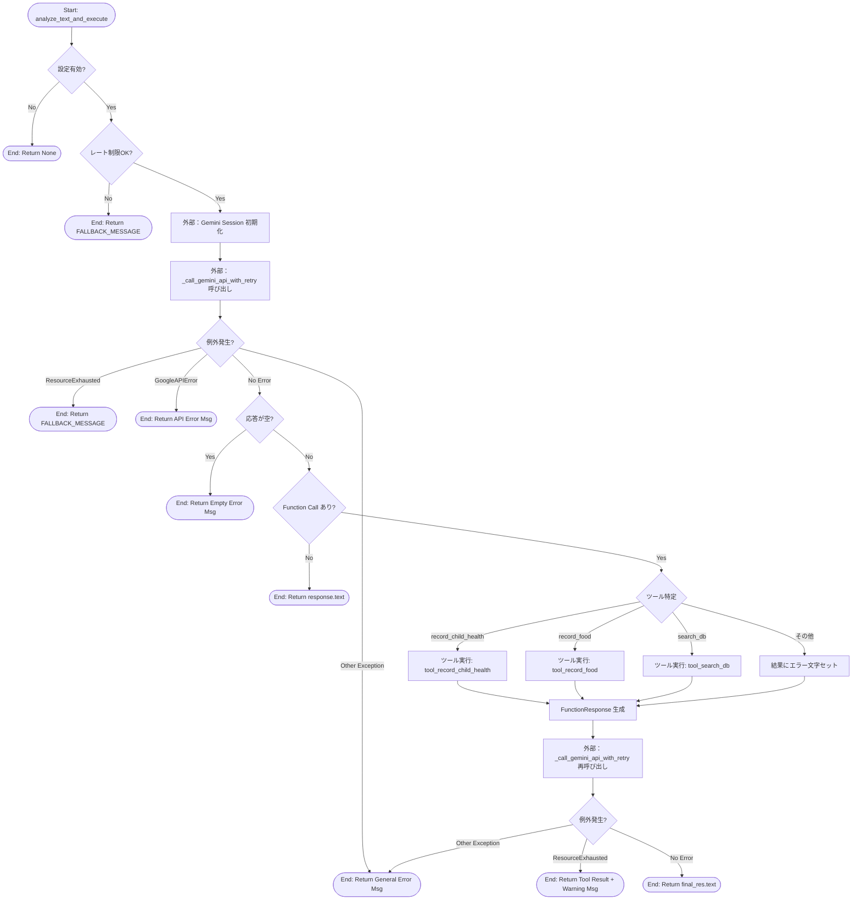
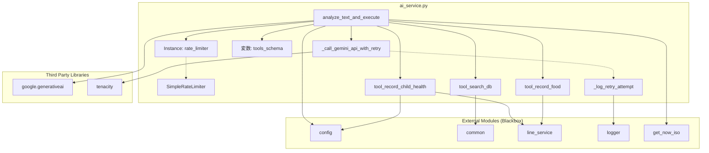

## 1. 解析メタ情報

| 項目 | 内容 |
| --- | --- |
| 対象ファイル | ai_service.py |
| 言語 | Python |
| 解析対象 | 提供されたコードのみ |
| 推測・補完 | 一切なし |

## 2. ファイルの概要

* AI（Gemini API）を利用してユーザーからのテキスト入力を解析し、適切な会話応答の生成や、登録されたツール（機能呼び出し）を通じて外部サービスへの記録・DB検索の実行を仲介・制御する。
* 簡易的なレート制限機能やAPI通信時のリトライ機能を提供し、APIの枯渇や一時的なエラーに対する耐性を持つ。

## 3. 外部依存関係

### インポート一覧

| 名称 | 種類 | 用途 | 根拠 |
| --- | --- | --- | --- |
| `asyncio` | 標準ライブラリ | 非同期処理制御およびスレッド委譲（`Lock`, `to_thread`） | `import asyncio` (抜粋: "import asyncio") |
| `time` | 標準ライブラリ | レート制限における経過時間計測 | `import time` (抜粋: "import time") |
| `json` | 標準ライブラリ | インポートされているが未使用 | `import json` (抜粋: "import json") |
| `traceback` | 標準ライブラリ | 例外発生時のスタックトレース取得 | `import traceback` (抜粋: "import traceback") |
| `typing` (`Optional`, `Dict`, `Any`, `List`) | 標準ライブラリ | 型ヒント | `from typing import Optional, ...` (抜粋: "from typing import Optional, Dict") |
| `datetime` | 標準ライブラリ | インポートされているが未使用 | `from datetime import datetime` (抜粋: "from datetime import datetime") |
| `google.generativeai` | 外部ライブラリ | Gemini APIのクライアント初期化およびモデル呼び出し | `import google.generativeai as genai` (抜粋: "import google.generativeai as genai") |
| `GoogleAPIError`, `ResourceExhausted` | 外部ライブラリ | Gemini API呼び出し時の例外ハンドリング | `from google.api_core.exceptions ...` (抜粋: "from google.api_core.exceptions import GoogleAPIError") |
| `content` | 外部ライブラリ | Gemini APIの関数呼び出し結果レスポンス生成用 | `from google.ai.generativelanguage_v1beta.types import content` (抜粋: "from google.ai.generativelanguage_v1beta.types import content") |
| `tenacity` | 外部ライブラリ | API呼び出し失敗時のリトライ制御 | `from tenacity import (...)` (抜粋: "from tenacity import (") |
| `config` | 内部モジュール | APIキー、DBテーブル名、家族設定などの定数参照 | `import config` (抜粋: "import config") |
| `common` | 内部モジュール | DBへの読み取りクエリ実行 | `import common` (抜粋: "import common") |
| `setup_logging` | 内部モジュール | ロガーの初期化 | `from core.logger import setup_logging` (抜粋: "from core.logger import setup_logging") |
| `get_now_iso` | 内部モジュール | 現在時刻のISO文字列取得 | `from core.utils import get_now_iso` (抜粋: "from core.utils import get_now_iso") |
| `line_service` | 内部モジュール | LINEサービス連携（記録機能の実装） | `from services import line_service` (抜粋: "from services import line_service") |

### ブラックボックスとなる外部要素

| 名称 | 理由 | 根拠 |
| --- | --- | --- |
| `config` の各種プロパティ | APIキーや各種定数の具体的な値や構造が不明なため | `config.GEMINI_API_KEY` 等 (抜粋: "if config.GEMINI_API_KEY:") |
| `common.execute_read_query` | 内部のDB接続仕様、戻り値の正確なデータ構造、発生しうる例外が不明なため | `common.execute_read_query` (抜粋: "common.execute_read_query, sql") |
| `line_service.log_child_health` | 関数内部の挙動、戻り値（`msg_obj.text`を持つオブジェクト）の詳細な型が不明なため | `line_service.log_child_health` (抜粋: "await line_service.log_child_health") |
| `line_service.log_food_record` | 関数内部の挙動、戻り値（`msg_obj.text`を持つオブジェクト）の詳細な型が不明なため | `line_service.log_food_record` (抜粋: "await line_service.log_food_record") |
| `setup_logging` | ロガーの具体的な出力先やフォーマット仕様が不明なため | `setup_logging("ai_service")` (抜粋: "setup_logging("ai_service")") |
| `get_now_iso` | 返す時刻文字列の厳密なフォーマット仕様が不明なため | `get_now_iso()` (抜粋: "現在時刻: {get_now_iso()}") |

## 4. 主要要素の定義（関数 / エンドポイント / コンポーネント）

### `SimpleRateLimiter` (クラス)

* **役割**: 指定された期間（1分）内のリクエスト数を制限する状態管理を行う。
* 根拠: `class SimpleRateLimiter:` (行番号取得不可 / 抜粋: "class SimpleRateLimiter:")

* **引数/リクエスト**: `limit: int` (デフォルト: `REQUESTS_PER_MINUTE_LIMIT`)
* 根拠: `def __init__(self, limit: int = REQUESTS_PER_MINUTE_LIMIT):` (行番号取得不可 / 抜粋: "def **init**(self, limit: int")

* **戻り値/レスポンス**: オブジェクトインスタンス
* 根拠: コンストラクタ定義による (行番号取得不可 / 抜粋: "def **init**")

* **副作用**: なし
* 根拠: インスタンス変数の初期化のみ (行番号取得不可 / 抜粋: "self.limit = limit")

* **エラーハンドリング**: なし
* 根拠: 例外処理の記述なし (行番号取得不可 / 抜粋: "self._lock = asyncio.Lock()")

### `SimpleRateLimiter.allow_request` (メソッド)

* **役割**: リクエストが許可されるかどうかを判定し、1分経過時のカウンタリセットと許可時のカウンタ加算を行う。
* 根拠: `async def allow_request(self) -> bool:` (行番号取得不可 / 抜粋: "async def allow_request(self) -> bool:")

* **引数/リクエスト**: なし
* 根拠: `def allow_request(self)` (行番号取得不可 / 抜粋: "async def allow_request(self)")

* **戻り値/レスポンス**: `bool` (許可ならTrue、制限超過ならFalse)
* 根拠: `return True` / `return False` (行番号取得不可 / 抜粋: "return True")

* **副作用**: `self.count` および `self.last_reset_time` の更新
* 根拠: `self.count += 1` (行番号取得不可 / 抜粋: "self.count += 1")

* **エラーハンドリング**: 非同期ロック (`asyncio.Lock`) により並行処理時の競合を防止。
* 根拠: `async with self._lock:` (行番号取得不可 / 抜粋: "async with self._lock:")

### `tool_record_child_health` (関数)

* **役割**: 子供の体調を記録するため `line_service.log_child_health` を呼び出し、結果メッセージを返す。
* 根拠: `async def tool_record_child_health` (行番号取得不可 / 抜粋: "async def tool_record_child_health")

* **引数/リクエスト**: `user_id: str`, `user_name: str`, `args: Dict[str, Any]`
* 根拠: 関数シグネチャ (行番号取得不可 / 抜粋: "user_id: str, user_name: str")

* **戻り値/レスポンス**: `str`
* 根拠: `return f"記録完了: {msg_obj.text}"` (行番号取得不可 / 抜粋: "return f"記録完了: {msg_obj.text}"")

* **副作用**: `line_service.log_child_health` の呼び出し（外部サービス・DB操作の可能性）
* 根拠: `await line_service.log_child_health` (行番号取得不可 / 抜粋: "await line_service.log_child_health")

* **エラーハンドリング**: なし
* 根拠: try-except構文なし (行番号取得不可 / 抜粋: "msg_obj = await line_service")

### `tool_record_food` (関数)

* **役割**: 食事の内容を記録するため `line_service.log_food_record` を呼び出し、結果メッセージを返す。
* 根拠: `async def tool_record_food` (行番号取得不可 / 抜粋: "async def tool_record_food")

* **引数/リクエスト**: `user_id: str`, `user_name: str`, `args: Dict[str, Any]`
* 根拠: 関数シグネチャ (行番号取得不可 / 抜粋: "user_id: str, user_name: str")

* **戻り値/レスポンス**: `str`
* 根拠: `return f"記録完了: {msg_obj.text}"` (行番号取得不可 / 抜粋: "return f"記録完了: {msg_obj.text}"")

* **副作用**: `line_service.log_food_record` の呼び出し（外部サービス・DB操作の可能性）
* 根拠: `await line_service.log_food_record` (行番号取得不可 / 抜粋: "await line_service.log_food_record")

* **エラーハンドリング**: なし
* 根拠: try-except構文なし (行番号取得不可 / 抜粋: "msg_obj = await line_service")

### `tool_search_db` (関数)

* **役割**: 引数で渡されたSQLクエリを用いて読み取り専用のDB検索を行い、結果を文字列で返す。
* 根拠: `async def tool_search_db` (行番号取得不可 / 抜粋: "async def tool_search_db")

* **引数/リクエスト**: `args: Dict[str, Any]`
* 根拠: 関数シグネチャ (行番号取得不可 / 抜粋: "args: Dict[str, Any]")

* **戻り値/レスポンス**: `str`
* 根拠: `return str(rows)[:2000]` またはエラー文字列 (行番号取得不可 / 抜粋: "return str(rows)[:2000]")

* **副作用**: `common.execute_read_query` の呼び出し（DB読み取り）
* 根拠: `await asyncio.to_thread(common.execute_read_query, sql)` (行番号取得不可 / 抜粋: "common.execute_read_query, sql")

* **エラーハンドリング**:
* 引数 `sql_query` の存在確認。
* クエリが "SELECT" で始まらない場合は実行をブロックしエラーメッセージを返却。
* DB検索時のあらゆる例外を捕捉し、エラーメッセージとして返却。
* 根拠: `if not sql.strip().upper().startswith("SELECT"):` / `except Exception as e:` (行番号取得不可 / 抜粋: "except Exception as e:")

### `_log_retry_attempt` (関数)

* **役割**: リトライ実行時にコールバックとして呼び出され、警告ログを出力する。
* 根拠: `def _log_retry_attempt(retry_state):` (行番号取得不可 / 抜粋: "def _log_retry_attempt(retry_state):")

* **引数/リクエスト**: `retry_state`
* 根拠: 関数シグネチャ (行番号取得不可 / 抜粋: "retry_state")

* **戻り値/レスポンス**: なし
* 根拠: return文なし (行番号取得不可 / 抜粋: "logger.warning(")

* **副作用**: `logger.warning` によるログ書き込み
* 根拠: `logger.warning(...)` (行番号取得不可 / 抜粋: "logger.warning(")

* **エラーハンドリング**: なし
* 根拠: try-except構文なし (行番号取得不可 / 抜粋: "exception = retry_state")

### `_call_gemini_api_with_retry` (関数)

* **役割**: Gemini APIへのリクエストを別スレッドで実行し、`ResourceExhausted` 例外発生時に指数バックオフによるリトライを行う。
* 根拠: `@retry(...)` / `async def _call_gemini_api_with_retry` (行番号取得不可 / 抜粋: "async def _call_gemini_api_with_retry")

* **引数/リクエスト**: `chat_session`, `prompt: str`
* 根拠: 関数シグネチャ (行番号取得不可 / 抜粋: "chat_session, prompt: str")

* **戻り値/レスポンス**: APIレスポンスオブジェクト
* 根拠: `return await asyncio.to_thread(chat_session.send_message, prompt)` (行番号取得不可 / 抜粋: "return await asyncio.to_thread")

* **副作用**: APIへのネットワーク通信
* 根拠: `chat_session.send_message` (行番号取得不可 / 抜粋: "chat_session.send_message")

* **エラーハンドリング**: `tenacity` ライブラリによる自動リトライ（最大3回）。最終的に失敗した場合は例外を再スロー（`reraise=True`）。
* 根拠: `@retry(retry=retry_if_exception_type(ResourceExhausted), ...)` (行番号取得不可 / 抜粋: "retry_if_exception_type(ResourceExhausted)")

### `analyze_text_and_execute` (関数)

* **役割**: レートリミット確認後、システムプロンプトと共にユーザー入力をGemini APIに送信し、APIがツール呼び出しを要求した場合は該当ツールを実行し、その結果を再度APIに送信して最終的な応答文を返す。
* 根拠: `async def analyze_text_and_execute` (行番号取得不可 / 抜粋: "async def analyze_text_and_execute")

* **引数/リクエスト**: `user_id: str`, `user_name: str`, `text: str`
* 根拠: 関数シグネチャ (行番号取得不可 / 抜粋: "user_id: str, user_name: str, text: str")

* **戻り値/レスポンス**: `Optional[str]`
* 根拠: 関数シグネチャおよび `return response.text` / `return None` (行番号取得不可 / 抜粋: "-> Optional[str]:")

* **副作用**: API通信、RateLimiterのカウント更新、および選択されたツールによる副作用（DB/外部サービス操作）
* 根拠: `await rate_limiter.allow_request()` / `await _call_gemini_api_with_retry` / ツール関数の呼び出し (行番号取得不可 / 抜粋: "await _call_gemini_api_with_retry")

* **エラーハンドリング**:
* `MODEL_NAME` や APIキーが不在の場合は早期リターン (`None`)。
* レート制限超過時はフォールバックメッセージを返却。
* `ResourceExhausted` 時はフォールバックメッセージ（ツール実行後の場合はツール結果と警告文）を返却。
* `GoogleAPIError` 時は特定のエラーメッセージを返却。
* 空のレスポンス時はエラーメッセージを返却。
* 未知のツール名指定時はエラーメッセージを結果として扱う。
* その他予期せぬ例外発生時はエラーログ出力と汎用エラーメッセージを返却。
* 根拠: `except ResourceExhausted:` / `except GoogleAPIError as e:` / `except Exception as e:` (行番号取得不可 / 抜粋: "except Exception as e:")

## 5. 処理フロー図

## 6. 依存関係図

## 7. 次のステップ（リバースエンジニアリングの提案）

| 優先度 | ファイル名(推測可) | 理由 | 根拠 |
| --- | --- | --- | --- |
| 高 | `config.py` | AIがツールを使用する際のスキーマ定義や動作フラグ、各種DBのテーブル名などのコア定数が定義されているため。 | `config.GEMINI_API_KEY`, `config.FAMILY_SETTINGS`, 各種 `config.SQLITE_TABLE_*` の参照 |
| 高 | `services/line_service.py` | 実際にデータの記録を行っている実体であり、その挙動と戻り値構造の特定が副作用の理解に必須なため。 | `line_service.log_child_health`, `line_service.log_food_record` の呼び出し |
| 中 | `common.py` | DB検索機能の実体であり、クエリ実行時の内部の安全性やエラーの有無を把握するため。 | `common.execute_read_query` の呼び出し |

## 8. 保守上の注意点

* `tool_search_db` 内でクエリの `SELECT` 開始チェックを行っているが、それ以外のSQL構文解析やサニタイズは行われておらず、`common.execute_read_query` 側での安全確保に依存している。
* レートリミットクラス (`SimpleRateLimiter`) はオンメモリで状態を保持するため、複数プロセス（ワーカー）でアプリケーションを稼働させる場合、プロセス間で制限が共有されない。
* `analyze_text_and_execute` の終盤での例外キャッチ (`except Exception as e:`) は広範であり、意図しないエラーも一律のメッセージで握りつぶす仕様となっている。
* `json` と `datetime` モジュールがインポートされているが、ファイル内で一度も使用されていない。

## 9. 不明事項一覧

| 項目 | 理由 | 必要なファイル |
| --- | --- | --- |
| 外部モジュールの詳細仕様 | DBアクセス、設定定数、ログ出力、LINE連携の厳密な型・挙動が現在のファイルからは判別できないため。 | `config.py`, `common.py`, `services/line_service.py`, `core/logger.py`, `core/utils.py` |
| Gemini APIレスポンスの詳細なオブジェクト構造 | `response.parts[0].function_call.args` 等でアクセスしているが、APIライブラリのバージョンや仕様によるためコード単体では確定できない。 | 外部ライブラリ (`google-generativeai`) の公式ドキュメント |

## 10. 自己検証結果

* [x] 推測・外部ファイルの仕様を一切含んでいない完了
* [x] 全関数・全クラス・全コンポーネントを列挙した完了
* [x] 全てのインポート要素を列挙した完了
* [x] すべての仕様説明に「根拠（行番号・抜粋）」を明記した完了
* [x] 根拠漏れが0件である完了
* [x] Mermaid構文にエラーの原因となる記号（エスケープ漏れ）がない完了
* [x] 不明事項を漏れなく列挙した完了