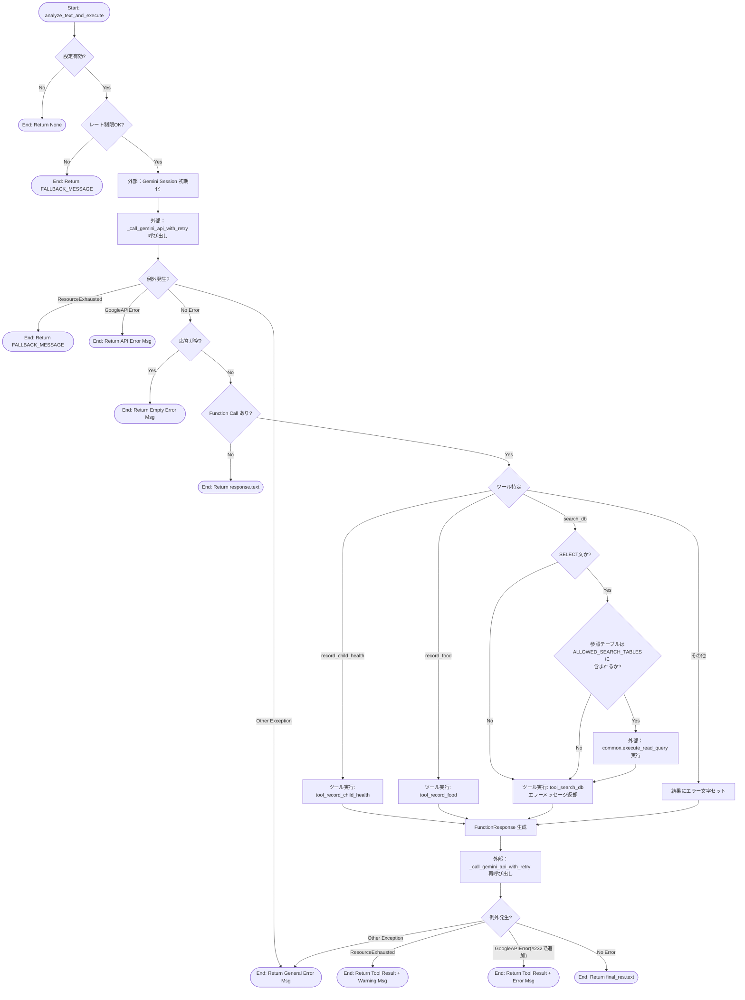
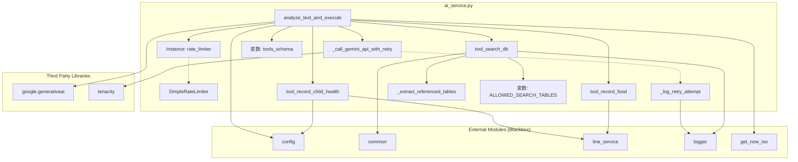

## 1. 解析メタ情報

| 項目 | 内容 |
| --- | --- |
| 対象ファイル | ai_service.py |
| 言語 | Python |
| 解析対象 | 提供されたコードのみ |
| 推測・補完 | 一切なし |

## 関連ドキュメント

- [config.md](./config.md) — `GEMINI_API_KEY` や `SQLITE_TABLE_*` など、本ファイルが参照する各種定数・共通設定を提供する。
- [common.md](./common.md) — `line_service` は直接importしているが、`common.execute_read_query` 相当のDB読み取り処理を提供するFacadeモジュール。
- [database.md](./database.md) — `common.execute_read_query` の実体（`core/database.py`）の仕様書。
- [line_service.md](./line_service.md) — `tool_record_child_health`/`tool_record_food` の呼び出し先（`log_child_health`/`log_food_record`）。
- [logger.md](./logger.md) — `setup_logging` の実装元。
- [utils.md](./utils.md) — `get_now_iso` の実装元。

## 2. ファイルの概要

* AI（Gemini API）を利用してユーザーからのテキスト入力を解析し、適切な会話応答の生成や、登録されたツール（機能呼び出し）を通じて外部サービスへの記録・DB検索の実行を仲介・制御する。
* 簡易的なレート制限機能やAPI通信時のリトライ機能を提供し、APIの枯渇や一時的なエラーに対する耐性を持つ。

## 3. 外部依存関係

### インポート一覧

| 名称 | 種類 | 用途 | 根拠 |
| --- | --- | --- | --- |
| `asyncio` | 標準ライブラリ | 非同期処理制御およびスレッド委譲（`Lock`, `to_thread`） | `import asyncio` (抜粋: "import asyncio") |
| `re` | 標準ライブラリ | `tool_search_db`が生成SQLから参照テーブル名を抽出するための正規表現マッチング | `import re` (行番号: 3 / 抜粋: "import re") |
| `time` | 標準ライブラリ | レート制限における経過時間計測 | `import time` (抜粋: "import time") |
| `json` | 標準ライブラリ | インポートされているが未使用 | `import json` (抜粋: "import json") |
| `traceback` | 標準ライブラリ | 例外発生時のスタックトレース取得 | `import traceback` (抜粋: "import traceback") |
| `typing` (`Optional`, `Dict`, `Any`, `List`) | 標準ライブラリ | 型ヒント | `from typing import Optional, ...` (抜粋: "from typing import Optional, Dict") |
| `datetime` | 標準ライブラリ | インポートされているが未使用 | `from datetime import datetime` (抜粋: "from datetime import datetime") |
| `google.generativeai` | 外部ライブラリ | Gemini APIのクライアント初期化およびモデル呼び出し | `import google.generativeai as genai` (抜粋: "import google.generativeai as genai") |
| `GoogleAPIError`, `ResourceExhausted` | 外部ライブラリ | Gemini API呼び出し時の例外ハンドリング | `from google.api_core.exceptions ...` (抜粋: "from google.api_core.exceptions import GoogleAPIError") |
| `content` | 外部ライブラリ | Gemini APIの関数呼び出し結果レスポンス生成用 | `from google.ai.generativelanguage_v1beta.types import content` (抜粋: "from google.ai.generativelanguage_v1beta.types import content") |
| `tenacity` | 外部ライブラリ | API呼び出し失敗時のリトライ制御 | `from tenacity import (...)` (抜粋: "from tenacity import (") |
| `config` | 内部モジュール | APIキー、DBテーブル名、家族設定などの定数参照 | `import config` (抜粋: "import config") |
| `common` | 内部モジュール | DBへの読み取りクエリ実行 | `import common` (抜粋: "import common") |
| `setup_logging` | 内部モジュール | ロガーの初期化 | `from core.logger import setup_logging` (抜粋: "from core.logger import setup_logging") |
| `get_now_iso` | 内部モジュール | 現在時刻のISO文字列取得 | `from core.utils import get_now_iso` (抜粋: "from core.utils import get_now_iso") |
| `line_service` | 内部モジュール | LINEサービス連携（記録機能の実装） | `from services import line_service` (抜粋: "from services import line_service") |

### ブラックボックスとなる外部要素

| 名称 | 理由 | 根拠 |
| --- | --- | --- |
| `config` の各種プロパティ | APIキーや各種定数の具体的な値や構造が不明なため | `config.GEMINI_API_KEY` 等 (抜粋: "if config.GEMINI_API_KEY:") |
| `common.execute_read_query` | 内部のDB接続仕様は不明なため。戻り値については、Issue #180の修正で`tool_search_db`側が`"検索エラー:"`プレフィックス付き文字列（エラー時）という部分的な構造を前提とするようになったが、それ以外（正常時のJSON形式データ・該当なしメッセージの厳密な形式）の詳細は本ファイルからは分からない（[database.md](./database.md)参照） | `common.execute_read_query` (抜粋: "common.execute_read_query, sql") |
| `line_service.log_child_health` | 関数内部の挙動、戻り値（`msg_obj.text`を持つオブジェクト）の詳細な型が不明なため | `line_service.log_child_health` (抜粋: "await line_service.log_child_health") |
| `line_service.log_food_record` | 関数内部の挙動、戻り値（`msg_obj.text`を持つオブジェクト）の詳細な型が不明なため | `line_service.log_food_record` (抜粋: "await line_service.log_food_record") |
| `setup_logging` | ロガーの具体的な出力先やフォーマット仕様が不明なため | `setup_logging("ai_service")` (抜粋: "setup_logging("ai_service")") |
| `get_now_iso` | 返す時刻文字列の厳密なフォーマット仕様が不明なため | `get_now_iso()` (抜粋: "現在時刻: {get_now_iso()}") |

## 4. 主要要素の定義（関数 / エンドポイント / コンポーネント）

### `SimpleRateLimiter` (クラス)

* **役割**: 指定された期間（1分）内のリクエスト数を制限する状態管理を行う。
* 根拠: `class SimpleRateLimiter:` (行番号: 52 / 抜粋: "class SimpleRateLimiter:")

* **引数/リクエスト**: `limit: int` (デフォルト: `REQUESTS_PER_MINUTE_LIMIT`)
* 根拠: `def __init__(self, limit: int = REQUESTS_PER_MINUTE_LIMIT):` (行番号: 57 / 抜粋: "def **init**(self, limit: int")

* **戻り値/レスポンス**: オブジェクトインスタンス
* 根拠: コンストラクタ定義による (行番号: 57 / 抜粋: "def **init**")

* **副作用**: なし
* 根拠: インスタンス変数の初期化のみ (行番号: 58 / 抜粋: "self.limit = limit")

* **エラーハンドリング**: なし
* 根拠: 例外処理の記述なし (行番号: 61 / 抜粋: "self._lock = asyncio.Lock()")

### `SimpleRateLimiter.allow_request` (メソッド)

* **役割**: リクエストが許可されるかどうかを判定し、1分経過時のカウンタリセットと許可時のカウンタ加算を行う。
* 根拠: `async def allow_request(self) -> bool:` (行番号: 63 / 抜粋: "async def allow_request(self) -> bool:")

* **引数/リクエスト**: なし
* 根拠: `def allow_request(self)` (行番号: 63 / 抜粋: "async def allow_request(self)")

* **戻り値/レスポンス**: `bool` (許可ならTrue、制限超過ならFalse)
* 根拠: `return True` / `return False` (行番号: 78, 81 / 抜粋: "return True")

* **副作用**: `self.count` および `self.last_reset_time` の更新
* 根拠: `self.count += 1` (行番号: 80 / 抜粋: "self.count += 1")

* **エラーハンドリング**: 非同期ロック (`asyncio.Lock`) により並行処理時の競合を防止。
* 根拠: `async with self._lock:` (行番号: 70 / 抜粋: "async with self._lock:")

### `tool_record_child_health` (関数)

* **役割**: 子供の体調を記録するため `line_service.log_child_health` を呼び出し、結果メッセージを返す。
* 根拠: `async def tool_record_child_health` (行番号: 91 / 抜粋: "async def tool_record_child_health")

* **引数/リクエスト**: `user_id: str`, `user_name: str`, `args: Dict[str, Any]`
* 根拠: 関数シグネチャ (行番号: 91 / 抜粋: "user_id: str, user_name: str")

* **戻り値/レスポンス**: `str`
* 根拠: `return f"記録完了: {msg_obj.text}"` (行番号: 110 / 抜粋: "return f"記録完了: {msg_obj.text}"")

* **副作用**: `line_service.log_child_health` の呼び出し（外部サービス・DB操作の可能性）
* 根拠: `await line_service.log_child_health` (行番号: 109 / 抜粋: "await line_service.log_child_health")

* **エラーハンドリング**: なし
* 根拠: try-except構文なし (行番号: 109 / 抜粋: "msg_obj = await line_service")

### `tool_record_food` (関数)

* **役割**: 食事の内容を記録するため `line_service.log_food_record` を呼び出し、結果メッセージを返す。
* 根拠: `async def tool_record_food` (行番号: 113 / 抜粋: "async def tool_record_food")

* **引数/リクエスト**: `user_id: str`, `user_name: str`, `args: Dict[str, Any]`
* 根拠: 関数シグネチャ (行番号: 113 / 抜粋: "user_id: str, user_name: str")

* **戻り値/レスポンス**: `str`
* 根拠: `return f"記録完了: {msg_obj.text}"` (行番号: 129 / 抜粋: "return f"記録完了: {msg_obj.text}"")

* **副作用**: `line_service.log_food_record` の呼び出し（外部サービス・DB操作の可能性）
* 根拠: `await line_service.log_food_record` (行番号: 128 / 抜粋: "await line_service.log_food_record")

* **エラーハンドリング**: なし
* 根拠: try-except構文なし (行番号: 128 / 抜粋: "msg_obj = await line_service")

### `ALLOWED_SEARCH_TABLES` (変数)

* **役割**: `tool_search_db`がSELECTで参照することを許可するテーブル名の集合(set)。`config.SQLITE_TABLE_CHILD`, `_FOOD`, `_SHOPPING`, `_POWER_USAGE`の4テーブルのみを許可する。
* 根拠: `ALLOWED_SEARCH_TABLES = {...}` (行番号: 132-138 / 抜粋: "ALLOWED_SEARCH_TABLES = {")

### `_skip_optional_alias` (関数、Issue #224で追加)

* **役割**: `_extract_referenced_tables`が使う内部ヘルパー。指定位置に続くテーブルエイリアス（`AS name`または`name`）があれば読み飛ばした位置を返す。次の識別子が`_SQL_KEYWORDS_NOT_ALIAS`に含まれるSQLキーワード（`WHERE`/`JOIN`等、テーブル参照の終端を示すもの）の場合はエイリアスとみなさず元の位置をそのまま返す。**導入経緯**: `_extract_referenced_tables`はカンマ結合(暗黙CROSS JOIN)の2つ目以降のテーブルを、直前のテーブル名の直後にカンマが続くかで判定していたが、`FROM power_usage c, quest_users s`のように1つ目のテーブルにエイリアスが付くと識別子の直後がカンマではなくエイリアス文字列になり、カンマ判定が即座に失敗して2つ目のテーブルが検出漏れしていた。
* 根拠: 関数定義 (行番号: 155〜162 / 抜粋: "def _skip_optional_alias(sql: str, pos: int) -> int:")

### `_extract_referenced_tables` (関数)

* **役割**: SQL文字列中で `FROM` / `JOIN` が参照するテーブル名をすべて抽出する簡易パーサ。単純な「FROM/JOIN直後の1識別子」だけでなく、`FROM a, b` のような暗黙CROSS JOIN（カンマ結合）の2つ目以降のテーブルや、`FROM (SELECT ... FROM x) AS y` のようなサブクエリ内の`FROM`/`JOIN`（`re.finditer`がSQL全文を走査するため自然に検出される）も対象にする（H-6での修正）。**（Issue #224で修正）** カンマ結合の各テーブル名の直後で`_skip_optional_alias`によりエイリアスを読み飛ばしてからカンマ判定を行うようになり、`FROM power_usage c, quest_users s`のようにエイリアス付きの1つ目のテーブルに続く2つ目のテーブルも検出できるようになった。
* 根拠: 関数Docstring (行番号: 143〜150 / 抜粋: "`FROM a, b` のような暗黙CROSS JOIN(カンマ結合)の2つ目以降のテーブル")、エイリアス読み飛ばし (行番号: 190, 197 / 抜粋: "pos = _skip_optional_alias(sql, m.end())")

* **引数/リクエスト**: `sql: str`
* 根拠: 関数シグネチャ (行番号: 141 / 抜粋: "def _extract_referenced_tables(sql: str) -> List[str]:")

* **戻り値/レスポンス**: `List[str]` (マッチしたテーブル名のリスト。同一テーブルが複数回参照されれば重複を含みうる)
* 根拠: `return tables` (行番号: 172 / 抜粋: "return tables")

* **副作用**: なし
* 根拠: `tables: List[str] = []` へのローカル追加のみ (行番号: 152 / 抜粋: "tables: List[str] = []")

* **エラーハンドリング**: なし（正規表現マッチングのみ。マッチしない場合は空リストを返す）。`(` トークンにマッチした場合（サブクエリの開始）は `continue` でスキップし、テーブル名として追加しない。
* 根拠: `if token == "(":` (行番号: 159〜161 / 抜粋: "サブクエリの開始。中身のFROM/JOINはこのループが引き続き検出する。")

### `tool_search_db` (関数)

* **役割**: 引数で渡されたSQLクエリが `SELECT` で始まり、かつ参照テーブルが `ALLOWED_SEARCH_TABLES` に含まれることを確認したうえで読み取り専用のDB検索を行い、結果を文字列で返す。**（Issue #180で修正）** `common.execute_read_query`（実体は`core/database.py`の`execute_read_query`）は例外発生時も送出せず内部で捕捉し、"検索エラー: ..."という非空文字列として返す設計になっている。以前はこの戻り値の実際の型・意味を誤認しており、`if not rows:`（`rows`は常に非空文字列のため恒偽でデッドコード）と`except Exception`（`execute_read_query`自体は例外を送出しないため到達不能）の両方が実質機能しておらず、DB実行時エラーの文字列がそのまま正常な検索結果としてログにも残らずAIへ渡っていた。`execute_read_query`の内部エラープレフィックス（`"検索エラー:"`）を判定し、検出時は警告ログを出力したうえでAIへエラーであることが分かる形（`"DB検索エラー: ..."`）で返すよう修正した。
* 根拠: `async def tool_search_db` (行番号: 183 / 抜粋: "async def tool_search_db")

* **引数/リクエスト**: `args: Dict[str, Any]`
* 根拠: 関数シグネチャ (行番号: 183 / 抜粋: "args: Dict[str, Any]")

* **戻り値/レスポンス**: `str`。正常時は`common.execute_read_query`の戻り値文字列（該当データなしメッセージまたはJSON形式の検索結果文字列、2000文字でカット）をそのまま返す。`execute_read_query`内部でエラーが発生した場合（`"検索エラー:"`プレフィックスで検出）は`"DB検索エラー: ..."`という別形式のエラー文字列に変換して返す。
* 根拠: `return result[:2000]` (行番号: 227 / 抜粋: "return result[:2000]")、エラー変換 (行番号: 222〜224 / 抜粋: "if result.startswith(\"検索エラー:\"):\n        logger.warning(f\"⚠️ search_db query failed: {result} (sql={sql!r})\")\n        return f\"DB検索エラー: {result[len('検索エラー:'):].strip()}\"")

* **副作用**: `common.execute_read_query` の呼び出し（DB読み取り）。許可外テーブルへのアクセス試行、および`execute_read_query`が内部エラー文字列を返した場合を`logger.warning`で記録。
* 根拠: `result = await asyncio.to_thread(common.execute_read_query, sql)` (行番号: 212 / 抜粋: "common.execute_read_query, sql")、エラー時の警告ログ (行番号: 223 / 抜粋: "logger.warning(f\"⚠️ search_db query failed: {result} (sql={sql!r})\")")

* **エラーハンドリング**:
* 引数 `sql_query` の存在確認。
* クエリが "SELECT" で始まらない場合は実行をブロックしエラーメッセージを返却。
* `_extract_referenced_tables` で参照テーブルを特定できない場合はエラーメッセージを返却。
* 参照テーブルのいずれかが `ALLOWED_SEARCH_TABLES` に含まれない場合は、警告ログを出力しエラーメッセージを返却（実行しない）。
* `asyncio.to_thread`自体が送出しうる例外（`common.execute_read_query`自体は内部で例外を捕捉するため通常は送出されないが、スレッド実行基盤側の例外に備える）を捕捉し、エラーメッセージとして返却。
* `common.execute_read_query`が内部エラーを`"検索エラー:"`プレフィックス付き文字列として返した場合（Issue #180で追加）、これを検出し警告ログを出力したうえで`"DB検索エラー: ..."`として返却（送出された例外ではないため`try/except`では捕捉できない）。
* 根拠: `if not sql.strip().upper().startswith("SELECT"):` (行番号: 198) / `disallowed = [t for t in referenced_tables if t not in ALLOWED_SEARCH_TABLES]` (行番号: 205) / `except Exception as e:` (行番号: 213) / `if result.startswith("検索エラー:"):` (行番号: 222)

### `_log_retry_attempt` (関数)

* **役割**: リトライ実行時にコールバックとして呼び出され、警告ログを出力する。
* 根拠: `def _log_retry_attempt(retry_state):` (行番号: 299 / 抜粋: "def _log_retry_attempt(retry_state):")

* **引数/リクエスト**: `retry_state`
* 根拠: 関数シグネチャ (行番号: 299 / 抜粋: "retry_state")

* **戻り値/レスポンス**: なし
* 根拠: return文なし (行番号: 302〜306 / 抜粋: "logger.warning(")

* **副作用**: `logger.warning` によるログ書き込み
* 根拠: `logger.warning(...)` (行番号: 302〜306 / 抜粋: "logger.warning(")

* **エラーハンドリング**: なし
* 根拠: try-except構文なし (行番号: 301 / 抜粋: "exception = retry_state")

### `_call_gemini_api_with_retry` (関数)

* **役割**: Gemini APIへのリクエストを別スレッドで実行し、`ResourceExhausted` 例外発生時に指数バックオフによるリトライを行う。
* 根拠: `@retry(...)` / `async def _call_gemini_api_with_retry` (行番号: 308〜315 / 抜粋: "async def _call_gemini_api_with_retry")

* **引数/リクエスト**: `chat_session`, `prompt: str`
* 根拠: 関数シグネチャ (行番号: 315 / 抜粋: "chat_session, prompt: str")

* **戻り値/レスポンス**: APIレスポンスオブジェクト
* 根拠: `return await asyncio.to_thread(chat_session.send_message, prompt)` (行番号: 327 / 抜粋: "return await asyncio.to_thread")

* **副作用**: APIへのネットワーク通信
* 根拠: `chat_session.send_message` (行番号: 327 / 抜粋: "chat_session.send_message")

* **エラーハンドリング**: `tenacity` ライブラリによる自動リトライ（最大3回）。最終的に失敗した場合は例外を再スロー（`reraise=True`）。
* 根拠: `@retry(retry=retry_if_exception_type(ResourceExhausted), ...)` (行番号: 309 / 抜粋: "retry_if_exception_type(ResourceExhausted)")

### `analyze_text_and_execute` (関数)

* **役割**: レートリミット確認後、システムプロンプトと共にユーザー入力をGemini APIに送信し、APIがツール呼び出しを要求した場合は該当ツールを実行し、その結果を再度APIに送信して最終的な応答文を返す。**（Issue #232で修正）** 1回目のGemini呼び出しは`ResourceExhausted`/`GoogleAPIError`をそれぞれ専用メッセージで処理するのに対し、ツール実行後の2回目呼び出しは以前`ResourceExhausted`用のフォールバックしか持たず、それ以外の`GoogleAPIError`は関数末尾の汎用`except Exception`（「処理中にエラーが発生しました」）まで伝播していた。この時点で`tool_record_child_health`/`tool_record_food`は既にDB書き込みを完了しているため、ユーザーには保存が失敗したかのように見え、冪等性チェックの無い記録処理への重複登録を誘発しうる不具合があった。2回目呼び出しにも`except GoogleAPIError`を追加し、`ResourceExhausted`と同様に`tool_result`（実行結果）へ注記を添えて返すようにした。
* 根拠: `async def analyze_text_and_execute` (行番号: 334 / 抜粋: "async def analyze_text_and_execute")

* **引数/リクエスト**: `user_id: str`, `user_name: str`, `text: str`
* 根拠: 関数シグネチャ (行番号: 334 / 抜粋: "user_id: str, user_name: str, text: str")

* **戻り値/レスポンス**: `Optional[str]`
* 根拠: 関数シグネチャおよび `return response.text` / `return None` (行番号: 334 / 抜粋: "-> Optional[str]:")

* **副作用**: API通信、RateLimiterのカウント更新、および選択されたツールによる副作用（DB/外部サービス操作）
* 根拠: `await rate_limiter.allow_request()` / `await _call_gemini_api_with_retry` / ツール関数の呼び出し (行番号: 351, 355, 397 / 抜粋: "await _call_gemini_api_with_retry")

* **エラーハンドリング**:
* `MODEL_NAME` や APIキーが不在の場合は早期リターン (`None`)。
* レート制限超過時はフォールバックメッセージを返却。
* 1回目のGemini呼び出しで`ResourceExhausted`発生時はフォールバックメッセージ(`FALLBACK_MESSAGE`)を、`GoogleAPIError`発生時は「AIサービスで予期せぬエラーが発生しました」を返却。
* **（Issue #232で修正）** ツール実行後の2回目のGemini呼び出し（最終応答生成）で`ResourceExhausted`発生時はツール結果(`tool_result`)に「制限を超過したため、実行結果のみ表示します」という注記を添えて返却する。同様に`GoogleAPIError`（`ResourceExhausted`以外）発生時も、以前は捕捉されず末尾の汎用`except Exception`まで伝播していたが、現在は`tool_result`に「エラーが発生したため、実行結果のみ表示します」という注記を添えて返却する（ツール実行=DB書き込みは既に成功しているため、その結果を正しくユーザーへ伝える）。
* 空のレスポンス時はエラーメッセージを返却。
* 未知のツール名指定時はエラーメッセージを結果として扱う。
* その他予期せぬ例外発生時はエラーログ出力と汎用エラーメッセージを返却。
* 根拠: 1回目呼び出しの分岐 (行番号: 409, 412 / 抜粋: "except ResourceExhausted:", "except GoogleAPIError as e:")、2回目呼び出しの分岐 (行番号: 452, 456 / 抜粋: "except ResourceExhausted:\n                # ツール実行は成功しているが、最終回答生成でコケた場合", "except GoogleAPIError as e:\n                # #232: ツール実行(record_child_health/record_food等、DB書き込みを伴う)は")、末尾の汎用ハンドラ (行番号: 470 / 抜粋: "except Exception as e:")

## 5. 処理フロー図

```mermaid
flowchart TD
    Start([Start: analyze_text_and_execute]) --> CheckConfig{設定有効?}
    CheckConfig -- No --> EndNone([End: Return None])
    CheckConfig -- Yes --> CheckLimit{レート制限OK?}
    
    CheckLimit -- No --> EndFallback1([End: Return FALLBACK_MESSAGE])
    CheckLimit -- Yes --> InitChat[外部：Gemini Session 初期化]
    InitChat --> CallAPI1[外部：_call_gemini_api_with_retry 呼び出し]
    
    CallAPI1 --> CheckException1{例外発生?}
    CheckException1 -- "ResourceExhausted" --> EndFallback2([End: Return FALLBACK_MESSAGE])
    CheckException1 -- "GoogleAPIError" --> EndAPIError([End: Return API Error Msg])
    CheckException1 -- "Other Exception" --> EndGeneralError([End: Return General Error Msg])
    
    CheckException1 -- "No Error" --> CheckEmpty{応答が空?}
    CheckEmpty -- Yes --> EndEmptyError([End: Return Empty Error Msg])
    CheckEmpty -- No --> CheckTool{Function Call あり?}
    
    CheckTool -- No --> ReturnText([End: Return response.text])
    
    CheckTool -- Yes --> IdentifyTool{ツール特定}
    IdentifyTool -- "record_child_health" --> RunHealth[ツール実行: tool_record_child_health]
    IdentifyTool -- "record_food" --> RunFood[ツール実行: tool_record_food]
    IdentifyTool -- "search_db" --> CheckSelect{"SELECT文か?"}
    CheckSelect -- No --> RunSearch[ツール実行: tool_search_db<br>エラーメッセージ返却]
    CheckSelect -- Yes --> CheckTableAllowed{"参照テーブルは<br>ALLOWED_SEARCH_TABLESに<br>含まれるか?"}
    CheckTableAllowed -- No --> RunSearch
    CheckTableAllowed -- Yes --> RunSearchOk[外部：common.execute_read_query 実行]
    RunSearchOk --> RunSearch
    IdentifyTool -- "その他" --> SetUnknownError[結果にエラー文字セット]
    
    RunHealth --> BuildFuncRes[FunctionResponse 生成]
    RunFood --> BuildFuncRes
    RunSearch --> BuildFuncRes
    SetUnknownError --> BuildFuncRes
    
    BuildFuncRes --> CallAPI2[外部：_call_gemini_api_with_retry 再呼び出し]
    CallAPI2 --> CheckException2{例外発生?}
    
    CheckException2 -- "ResourceExhausted" --> EndToolOnly([End: Return Tool Result + Warning Msg])
    CheckException2 -- "GoogleAPIError(#232で追加)" --> EndToolOnlyApiErr([End: Return Tool Result + Error Msg])
    CheckException2 -- "Other Exception" --> EndGeneralError
    CheckException2 -- "No Error" --> ReturnFinalText([End: Return final_res.text])

```

## 6. 依存関係図

```mermaid
graph TD
    subgraph "ai_service.py"
        analyze_text_and_execute
        SimpleRateLimiter
        _call_gemini_api_with_retry
        _log_retry_attempt
        tool_record_child_health
        tool_record_food
        tool_search_db
        _extract_referenced_tables
        ALLOWED_SEARCH_TABLES[変数: ALLOWED_SEARCH_TABLES]
        rate_limiter[Instance: rate_limiter]
        tools_schema[変数: tools_schema]
    end

    subgraph "External Modules (Blackbox)"
        config
        common
        line_service
        logger
        get_now_iso
    end

    subgraph "Third Party Libraries"
        genai["google.generativeai"]
        tenacity
    end

    analyze_text_and_execute --> rate_limiter
    analyze_text_and_execute --> _call_gemini_api_with_retry
    analyze_text_and_execute --> tool_record_child_health
    analyze_text_and_execute --> tool_record_food
    analyze_text_and_execute --> tool_search_db
    analyze_text_and_execute --> genai
    analyze_text_and_execute --> get_now_iso
    analyze_text_and_execute --> config
    analyze_text_and_execute --> tools_schema

    rate_limiter -.-> SimpleRateLimiter

    _call_gemini_api_with_retry --> tenacity
    _call_gemini_api_with_retry -.-> _log_retry_attempt
    _log_retry_attempt --> logger

    tool_record_child_health --> line_service
    tool_record_child_health --> config
    
    tool_record_food --> line_service
    
    tool_search_db --> common
    tool_search_db --> _extract_referenced_tables
    tool_search_db --> ALLOWED_SEARCH_TABLES
    tool_search_db --> logger

```

## 7. 次のステップ（リバースエンジニアリングの提案）

| 優先度 | ファイル名(推測可) | 理由 | 根拠 |
| --- | --- | --- | --- |
| 高 | `config.py` | AIがツールを使用する際のスキーマ定義や動作フラグ、各種DBのテーブル名などのコア定数が定義されているため。 | `config.GEMINI_API_KEY`, `config.FAMILY_SETTINGS`, 各種 `config.SQLITE_TABLE_*` の参照 |
| 高 | `services/line_service.py` | 実際にデータの記録を行っている実体であり、その挙動と戻り値構造の特定が副作用の理解に必須なため。 | `line_service.log_child_health`, `line_service.log_food_record` の呼び出し |
| 中 | `common.py` | DB検索機能の実体であり、クエリ実行時の内部の安全性やエラーの有無を把握するため。 | `common.execute_read_query` の呼び出し |

## 8. 保守上の注意点

* `tool_search_db` は `SELECT` 開始チェックに加え、`_extract_referenced_tables` によるテーブル名抽出と `ALLOWED_SEARCH_TABLES` との突合による許可テーブルチェックを行う。`_extract_referenced_tables` はH-6の修正により `FROM a, b` のようなカンマ結合（暗黙CROSS JOIN）の2つ目以降のテーブルと、サブクエリ内の`FROM`/`JOIN`も抽出対象になったが、依然として正規表現による簡易パーサであり、完全なSQL構文解析ではない点に留意。例えば `main.table_name` のようなスキーマ修飾名は識別子の`.`部分が正規表現にマッチしないため`main`のみが抽出され、意図せず許可テーブル判定に影響する可能性がある。またSQLコメント(`--`や`/* */`)の内容も区別なく走査対象になる。**（Issue #224で強化）** H-6のカンマ結合対応後も、`FROM power_usage c, quest_users s`のように1つ目のテーブルにエイリアスが付くと、識別子の直後がカンマではなくエイリアス文字列になるため、2つ目以降のテーブルが検出漏れし許可テーブルチェックを回避しうる状態だった(読み取り専用接続のため直接的なデータ改ざんはないが、非公開テーブルの内容がAI応答経由で漏洩しうる)。`_skip_optional_alias`でエイリアス(`AS name`または`name`。ただし`WHERE`/`JOIN`等のSQLキーワードはエイリアスとみなさない)を読み飛ばしてからカンマ判定するよう修正した。
* 根拠: `_extract_referenced_tables`, `ALLOWED_SEARCH_TABLES`, `_skip_optional_alias` (行番号: 132-138, 141-172, 155-162)

* レートリミットクラス (`SimpleRateLimiter`) はオンメモリで状態を保持するため、複数プロセス（ワーカー）でアプリケーションを稼働させる場合、プロセス間で制限が共有されない。
* `analyze_text_and_execute` の終盤での例外キャッチ (`except Exception as e:`) は広範であり、意図しないエラーも一律のメッセージで握りつぶす仕様となっている。**（Issue #232で対応範囲を縮小）** 以前はツール実行後の2回目Gemini呼び出しで`ResourceExhausted`以外の`GoogleAPIError`が発生した場合もこの汎用ハンドラまで伝播し、ツール(DB書き込み)は既に成功しているにもかかわらず「処理中にエラーが発生しました」という一般エラーになっていた。ユーザーが保存失敗と誤解して再送信すると、冪等性チェックの無い記録処理(`tool_record_child_health`/`tool_record_food`)が重複登録を起こしうる状態だった。2回目呼び出し専用の`except GoogleAPIError`を追加し、この経路がこの汎用ハンドラに到達しないようにした。
* `json` と `datetime` モジュールがインポートされているが、ファイル内で一度も使用されていない。

## 9. 不明事項一覧

| 項目 | 理由 | 必要なファイル |
| --- | --- | --- |
| 外部モジュールの詳細仕様 | DBアクセス、設定定数、ログ出力、LINE連携の厳密な型・挙動が現在のファイルからは判別できないため。 | `config.py`, `common.py`, `services/line_service.py`, `core/logger.py`, `core/utils.py` |
| Gemini APIレスポンスの詳細なオブジェクト構造 | `response.parts[0].function_call.args` 等でアクセスしているが、APIライブラリのバージョンや仕様によるためコード単体では確定できない（リポジトリ内を検索したが`google-generativeai`/`google.generativeai`パッケージのソースコード自体は存在せず、解消不可）。 | 外部ライブラリ (`google-generativeai`) の公式ドキュメント |

## 相互参照による補足情報

| 元の不明事項 | 判明した内容 | 参照元ドキュメント |
| --- | --- | --- |
| 外部モジュールの詳細仕様（`config`, `FAMILY_SETTINGS`） | `MY_HOME_SYSTEM/config.py`を直接確認した。`GEMINI_API_KEY`（203行目、`os.getenv("GEMINI_API_KEY")`）、`SQLITE_TABLE_CHILD`（245行目、値`"child_health_records"`）、`SQLITE_TABLE_FOOD`（242行目、値`"food_records"`）、`SQLITE_TABLE_SHOPPING`（248行目、値`"shopping_records"`）、`SQLITE_TABLE_POWER_USAGE`（237行目、値`"power_usage"`）がいずれもモジュールレベルの単純な定数として定義されていることを確認した。`FAMILY_SETTINGS`（469〜477行目）は`{"members": [...], "styles": {...}}`という辞書であり、本ファイル(ai_service.py)が参照する`config.FAMILY_SETTINGS.get('members', [])`（ai_service.py:197）は実在する4名（智矢・涼花・将博・春菜）の氏名リストを返すことを確認した。 | 直接ソース確認: `MY_HOME_SYSTEM/config.py:203, 237, 242, 245, 248, 469-477` |
| 外部モジュールの詳細仕様（`common.execute_read_query`） | `MY_HOME_SYSTEM/common.py:22-27`を直接確認したところ、`execute_read_query`は`core.database`からの再エクスポートであることが確定した。実体である`MY_HOME_SYSTEM/core/database.py:52-65`の`execute_read_query(query: str, params: tuple = ()) -> str`を直接確認した結果、`sqlite3.connect(f"file:{config.SQLITE_DB_PATH}?mode=ro", uri=True)`により読み取り専用モードで接続し、`cursor.execute(query, params)`でクエリを実行、結果が空なら`"該当するデータはありませんでした。"`という文字列を、結果があれば`json.dumps([dict(r) for r in rows], ensure_ascii=False, default=str)`によるJSON文字列を返す。例外発生時は`except Exception as e:`で捕捉し、例外を送出せず`f"検索エラー: {str(e)}"`という文字列を返す実装であることを確認した。 | 直接ソース確認: `MY_HOME_SYSTEM/common.py:22-27`, `MY_HOME_SYSTEM/core/database.py:52-65` |
| 外部モジュールの詳細仕様（`setup_logging`） | `MY_HOME_SYSTEM/core/logger.py:46-86`の`setup_logging(name: str, webhook_url: str = None) -> logging.Logger`を直接確認した。`logging.getLogger(name)`を取得後、既存ハンドラをクリアしログレベルを`INFO`に設定、コンソール出力用の`StreamHandler`と、`logs/home_system.log`への日次ローテーション（`TimedRotatingFileHandler`, `when='midnight'`, `backupCount=7`）を行う`FileHandler`を追加する。さらに`webhook_url`引数（未指定時は`config.DISCORD_WEBHOOK_ERROR`、78行目）が設定されている場合、`DiscordErrorHandler`を`logging.ERROR`レベルで追加し、ERROR以上のログをDiscordへ自動通知する構成であることを確認した。 | 直接ソース確認: `MY_HOME_SYSTEM/core/logger.py:46-86` |
| 外部モジュールの詳細仕様（`get_now_iso`） | `MY_HOME_SYSTEM/core/utils.py:12-13`を直接確認した。`get_now_iso() -> str`は`datetime.datetime.now(pytz.timezone("Asia/Tokyo")).isoformat()`を返すのみの実装であり、"Asia/Tokyo"タイムゾーンの現在時刻をISO 8601形式の文字列で返すことを確定した。 | 直接ソース確認: `MY_HOME_SYSTEM/core/utils.py:12-13` |
| 外部モジュールの詳細仕様（`line_service.log_child_health`/`log_food_record` の戻り値） | `MY_HOME_SYSTEM/services/line_service.py:8-9, 34-41, 43-51`を直接確認した。8〜9行目で`from linebot.v3.messaging import (TextMessage, ...)`をインポートしており、`log_child_health`（34〜41行目）は`return TextMessage(text=f"【{child_name}】{condition} を記録しました！🏥")`、`log_food_record`（43〜51行目）は`return TextMessage(text=f"🍽️ {category}「{item}」を記録しました！")`を返す実装であることを確認した。本ファイル(ai_service.py)が参照する`msg_obj.text`（109〜110行目, 128〜129行目）は、この`TextMessage`インスタンスの`text`属性（コンストラクタ引数としてセットされたメッセージ文字列）に対応することが確定した。ただし`linebot`ライブラリ自体（`TextMessage`クラスの定義）はリポジトリ内には存在しない（外部パッケージ）。 | 直接ソース確認: `MY_HOME_SYSTEM/services/line_service.py:8-9, 34-41, 43-51` |

## 10. 自己検証結果

* [x] 推測・外部ファイルの仕様を一切含んでいない完了
* [x] 全関数・全クラス・全コンポーネントを列挙した完了
* [x] 全てのインポート要素を列挙した完了
* [x] すべての仕様説明に「根拠（行番号・抜粋）」を明記した完了
* [x] 根拠漏れが0件である完了
* [x] Mermaid構文にエラーの原因となる記号（エスケープ漏れ）がない完了
* [x] 不明事項を漏れなく列挙した完了