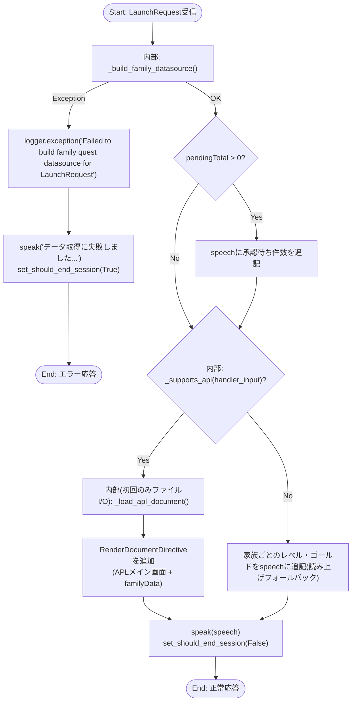
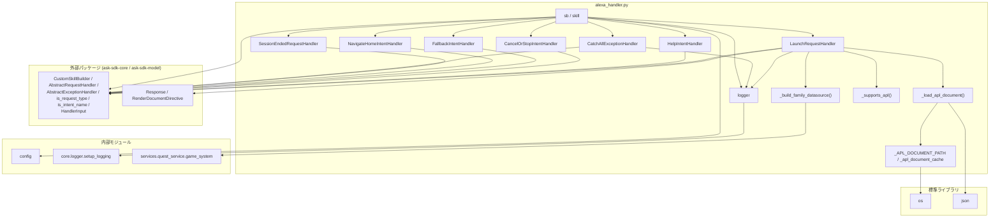

## 1. 解析メタ情報

| 項目 | 内容 |
| --- | --- |
| 対象ファイル | `alexa_handler.py` |
| 言語 | Python |
| 解析対象 | 提供されたコードのみ |
| 推測・補完 | 一切なし |

## 関連ドキュメント

* [alexa_router.md](./alexa_router.md) - 呼び出し元。`POST /webhook/alexa`エンドポイントが署名・タイムスタンプ検証後、本ファイルの`skill`(`skill.serializer.deserialize`→`asyncio.to_thread(skill.invoke, ...)`→`skill.serializer.serialize`)にディスパッチする
* [unified_server.md](./unified_server.md) - `alexa_router.router`(本ファイルの`skill`を利用するルーター)を実際にマウントするFastAPIエントリーポイント
* [quest_service.md](./quest_service.md) - `game_system.get_all_view_data()`の実装元。ユーザーのレベル・経験値・ゴールド・承認待ちクエスト等の集計データを提供する
* [config.md](./config.md) - `ALEXA_SKILL_ID`設定値を提供
* [logger.md](./logger.md) - `setup_logging`の実体

## 2. ファイルの概要

Alexaカスタムスキル「ファミクエ」のリクエストハンドラ群を定義するモジュール。「アレクサ、ファミクエを開いて」という発話がAlexa側では専用のIntent/Invocationを介さず`LaunchRequest`として届くため、`LaunchRequestHandler`がこれを処理し、`services.quest_service.game_system`と同じデータソースから、画面対応デバイス向けにはAPL(Alexa Presentation Language)でネイティブにメイン画面相当(家族ごとのLv/EXP/所持金/承認待ち件数)を組み立てて表示し、画面非対応デバイス向けには同内容を読み上げにフォールバックする。加えて、Alexa認定に必須のビルトインインテント(ヘルプ・キャンセル/ストップ・フォールバック・ホーム遷移・セッション終了・例外)のハンドラも本ファイル内で定義し、モジュール末尾で`CustomSkillBuilder`にすべて登録した`skill`オブジェクトを構築する。
根拠: [モジュールDocstring] (行番号: 2-13 / 抜粋: "Alexaカスタムスキル「ファミクエ」のリクエストハンドラ。\n\n「アレクサ、ファミクエを開いて」は Alexa側では LaunchRequest として届く(専用の\nIntentもInvocationも不要)ため、ここでは LaunchRequest だけを扱う。\n\n既存の family-quest Web アプリ(React、/quest/ で配信)をEcho Show上にそのまま\n表示するには APL WebView コンポーネントが要るが、これはAmazonへの個別申請が必要な\n限定提供機能のため使わない。代わりに quest_service.game_system.get_all_view_data()\nと同じデータソースから、APL(Alexa Presentation Language)でネイティブに\nメイン画面相当(家族ごとのLv/EXP/所持金/承認待ち件数)を組み立てて表示する。")

## 3. 外部依存関係

### インポート一覧

| 名称 | 種類 | 用途 | 根拠 |
| --- | --- | --- | --- |
| `os` | 標準ライブラリ | APLドキュメントファイルパス(`_APL_DOCUMENT_PATH`)の組み立て(`os.path.join`, `os.path.dirname`) | 根拠: [インポート宣言および使用箇所] (行番号: 14, 32 / 抜粋: "import os", "_APL_DOCUMENT_PATH = os.path.join(os.path.dirname(__file__), \"..\", \"alexa\", \"apl\", \"main_screen.json\")") |
| `json` | 標準ライブラリ | APLドキュメントJSONファイルの読み込み(`json.load`) | 根拠: [インポート宣言および使用箇所] (行番号: 15, 40 / 抜粋: "import json", "_apl_document_cache = json.load(f)") |
| `typing`(`Any`, `Dict`, `List`, `Optional`) | 標準ライブラリ | 型ヒント | 根拠: [インポート宣言] (行番号: 16 / 抜粋: "from typing import Any, Dict, List, Optional") |
| `ask_sdk_core.skill_builder.CustomSkillBuilder` | 外部パッケージ | Alexaスキル(`skill`)を構築するビルダー | 根拠: [インポート宣言] (行番号: 18 / 抜粋: "from ask_sdk_core.skill_builder import CustomSkillBuilder") |
| `ask_sdk_core.dispatch_components`(`AbstractRequestHandler`, `AbstractExceptionHandler`) | 外部パッケージ | 各リクエスト/例外ハンドラクラスの基底クラス | 根拠: [インポート宣言] (行番号: 19 / 抜粋: "from ask_sdk_core.dispatch_components import AbstractRequestHandler, AbstractExceptionHandler") |
| `ask_sdk_core.utils.is_request_type` | 外部パッケージ | リクエスト種別(`LaunchRequest`/`SessionEndedRequest`)判定 | 根拠: [インポート宣言] (行番号: 20 / 抜粋: "from ask_sdk_core.utils import is_request_type") |
| `ask_sdk_core.utils.predicate.is_intent_name` | 外部パッケージ | インテント名(`AMAZON.HelpIntent`等)判定 | 根拠: [インポート宣言] (行番号: 21 / 抜粋: "from ask_sdk_core.utils.predicate import is_intent_name") |
| `ask_sdk_core.handler_input.HandlerInput` | 外部パッケージ | 各`can_handle`/`handle`メソッドの引数型 | 根拠: [インポート宣言] (行番号: 22 / 抜粋: "from ask_sdk_core.handler_input import HandlerInput") |
| `ask_sdk_model.Response` | 外部パッケージ | 各`handle`メソッドの戻り値型 | 根拠: [インポート宣言] (行番号: 23 / 抜粋: "from ask_sdk_model import Response") |
| `ask_sdk_model.interfaces.alexa.presentation.apl.RenderDocumentDirective` | 外部パッケージ | APLドキュメントをレスポンスに添付するディレクティブ | 根拠: [インポート宣言] (行番号: 24 / 抜粋: "from ask_sdk_model.interfaces.alexa.presentation.apl import RenderDocumentDirective") |
| `config` | 内部モジュール | `ALEXA_SKILL_ID`設定値の取得 | 根拠: [インポート宣言] (行番号: 26 / 抜粋: "import config") |
| `core.logger.setup_logging` | 内部モジュール | ロガーの初期化 | 根拠: [インポート宣言] (行番号: 27 / 抜粋: "from core.logger import setup_logging") |
| `services.quest_service.game_system` | 内部モジュール | 家族の集計ビューデータ(`get_all_view_data`)の取得元 | 根拠: [インポート宣言] (行番号: 28 / 抜粋: "from services.quest_service import game_system") |

### ブラックボックスとなる外部要素

| 名称 | 理由 | 根拠 |
| --- | --- | --- |
| `ask_sdk_core`/`ask_sdk_model`(`CustomSkillBuilder`, `HandlerInput`, `Response`, `RenderDocumentDirective`等)の内部実装 | 外部パッケージ(`ask-sdk-core`/`ask-sdk-model`)のディスパッチ・シリアライズ処理の詳細は本ファイルからは分からない。 | 根拠: [各種インポート] (行番号: 18-24) |
| `config.ALEXA_SKILL_ID`の実際の値 | `.env`等から供給される値そのものは本ファイルからは分からない。 | 根拠: [変数参照] (行番号: 212 / 抜粋: "if config.ALEXA_SKILL_ID:") |
| `services.quest_service.game_system.get_all_view_data()`が返す`data`の完全なスキーマ | 本ファイルでは`data.get("pendingQuests", [])`の要素の`user_id`、`data.get("users", [])`の要素の`user_id`/`name`/`avatar`/`level`/`exp`/`nextLevelExp`/`gold`のみを参照しており、それ以外にどのようなキーが含まれるかは本ファイルからは分からない。 | 根拠: [呼び出しおよびキー参照] (行番号: 46, 49-52, 55-68 / 抜粋: "data = game_system.get_all_view_data()") |
| `alexa/apl/main_screen.json`(APLドキュメント)の内容 | `_load_apl_document()`が読み込むJSONファイルの実体であり、`datasources={"payload": {"familyData": family_data}}`(行番号113)がどのように画面へレンダリングされるかの詳細は、このJSON自体を解析しない限り本ファイルからは分からない(なお`.json`ファイルは本リポジトリの仕様書ドリフト対象外のため対応する仕様書は存在しない)。 | 根拠: [ファイルパス定義および読み込み] (行番号: 32, 39 / 抜粋: "_APL_DOCUMENT_PATH = os.path.join(...)", "_apl_document_cache = json.load(f)") |

## 4. 主要要素の定義（関数 / エンドポイント / コンポーネント）

### `logger`

* **役割**: `"alexa_handler"`という名前でロガーを初期化し保持する。
* **引数/リクエスト**: 該当なし
* **戻り値/レスポンス**: 該当なし
* **副作用**: なし
* **エラーハンドリング**: なし
* 根拠: [変数宣言] (行番号: 30 / 抜粋: 'logger = setup_logging("alexa_handler")')

### `_APL_DOCUMENT_PATH` / `_apl_document_cache`

* **役割**: `_APL_DOCUMENT_PATH`は本ファイルからの相対パス(`../alexa/apl/main_screen.json`)としてAPLドキュメントファイルの絶対パスを組み立てるモジュールレベル定数。`_apl_document_cache`は`_load_apl_document()`がファイルI/Oを繰り返さないためのモジュールレベルキャッシュ変数(初期値`None`)。
* **引数/リクエスト**: 該当なし
* **戻り値/レスポンス**: 該当なし
* **副作用**: なし(値の代入のみ)
* **エラーハンドリング**: なし
* 根拠: [変数宣言] (行番号: 32-33 / 抜粋: '_APL_DOCUMENT_PATH = os.path.join(os.path.dirname(__file__), "..", "alexa", "apl", "main_screen.json")\n_apl_document_cache: Optional[Dict[str, Any]] = None')

### `_load_apl_document()`

* **役割**: APLドキュメント(`main_screen.json`)を読み込んで返す。2回目以降の呼び出しでは`_apl_document_cache`にキャッシュ済みの内容をそのまま返し、ファイルの再読み込みを行わない。
* **引数/リクエスト**: なし
* **戻り値/レスポンス**: `Dict[str, Any]`(パース済みのAPLドキュメント)
* **副作用**: 初回呼び出し時のみ、ファイルシステムからの読み込み(`open`)とグローバル変数`_apl_document_cache`への書き込み。
* **エラーハンドリング**: なし(ファイルが存在しない場合や不正なJSONの場合の`try/except`は本関数内に存在しない)。
* 根拠: [関数定義] (行番号: 36-41 / 抜粋: "def _load_apl_document() -> Dict[str, Any]:\n    global _apl_document_cache\n    if _apl_document_cache is None:\n        with open(_APL_DOCUMENT_PATH, \"r\", encoding=\"utf-8\") as f:\n            _apl_document_cache = json.load(f)\n    return _apl_document_cache")

### `_build_family_datasource()`

* **役割**: `game_system.get_all_view_data()`から取得した集計データを、APL表示および読み上げの両方で使う軽量なビューモデル(辞書)に変換する。承認待ちクエスト一覧(`pendingQuests`)からユーザーIDごとの件数を集計し、各ユーザーについて経験値バー用の`expPercent`(次レベル必要経験値に対する現在経験値の割合、0〜100の整数)を算出する。
* **引数/リクエスト**: なし
* **戻り値/レスポンス**: `Dict[str, Any]`。キーは`title`(固定文字列"ファミリークエスト")、`users`(各要素が`userId`/`name`/`avatar`/`level`/`exp`/`nextLevelExp`/`expPercent`/`gold`/`pendingCount`を持つリスト)、`pendingTotal`(承認待ちクエストの総件数)。
* **副作用**: `game_system.get_all_view_data()`の呼び出しに伴う副作用(DBアクセス等、詳細は[quest_service.md](./quest_service.md)を参照)。
* **エラーハンドリング**: 本関数自体に`try/except`はない(呼び出し元の`LaunchRequestHandler.handle`が例外を捕捉する)。
* 根拠: [関数定義] (行番号: 44-75 / 抜粋: "def _build_family_datasource() -> Dict[str, Any]:")、[avatarのデフォルト値] (行番号: 62 / 抜粋: '"avatar": u.get("avatar") or "🙂",')、[expPercent計算] (行番号: 56-58 / 抜粋: "next_level_exp = u.get(\"nextLevelExp\") or 0\n    exp = u.get(\"exp\") or 0\n    exp_percent = round(min(exp / next_level_exp, 1.0) * 100) if next_level_exp > 0 else 0")

### `_supports_apl(handler_input)`

* **役割**: リクエスト元デバイスがAPL(画面表示)に対応しているかどうかを判定する。
* **引数/リクエスト**: `handler_input: HandlerInput`
* **戻り値/レスポンス**: `bool`(`handler_input.request_envelope.context.system.device.supported_interfaces.alexa_presentation_apl`が`None`でなければ`True`)
* **副作用**: なし
* **エラーハンドリング**: なし(`supported_interfaces`や`device`が想定外の構造だった場合の例外処理は存在しない)。
* 根拠: [関数定義] (行番号: 78-80 / 抜粋: "def _supports_apl(handler_input: HandlerInput) -> bool:\n    supported = handler_input.request_envelope.context.system.device.supported_interfaces\n    return supported.alexa_presentation_apl is not None")

### `LaunchRequestHandler`

* **役割**: 「アレクサ、ファミクエを開いて」で発火する`LaunchRequest`を処理する中心的なハンドラ。`_build_family_datasource()`でデータを組み立て、承認待ち件数があれば読み上げ文にその件数を付加する。APL対応デバイスでは`RenderDocumentDirective`でメイン画面をレンダリングし、非対応デバイスでは家族ごとのレベル・ゴールドを読み上げ文に追加する(フォールバック)。
* **引数/リクエスト**: `can_handle(handler_input: HandlerInput) -> bool`、`handle(handler_input: HandlerInput) -> Response`
* **戻り値/レスポンス**: `can_handle`は`bool`(`is_request_type("LaunchRequest")(handler_input)`の結果)。`handle`は`Response`。
* **副作用**: `_build_family_datasource()`経由での`game_system.get_all_view_data()`呼び出し、失敗時の`logger.exception`呼び出し、APL対応時は`_load_apl_document()`(初回のみファイル読み込み)。
* **エラーハンドリング**: `_build_family_datasource()`が例外を送出した場合、`logger.exception`でスタックトレース付きログを出力し、「ファミリークエストのデータ取得に失敗しました。少し時間をおいて試してください。」と読み上げてセッションを終了(`set_should_end_session(True)`)する。それ以外の正常系では`set_should_end_session(False)`でセッションを継続する。
* 根拠: [クラス定義とcan_handle] (行番号: 83-87 / 抜粋: "class LaunchRequestHandler(AbstractRequestHandler):\n\n    def can_handle(self, handler_input: HandlerInput) -> bool:\n        return is_request_type(\"LaunchRequest\")(handler_input)")、[handle定義とtry/except] (行番号: 89-101 / 抜粋: "try:\n            family_data = _build_family_datasource()\n        except Exception:\n            logger.exception(\"Failed to build family quest datasource for LaunchRequest\")")、[承認待ち件数の読み上げ追加] (行番号: 103-106 / 抜粋: 'if pending_total:\n            speech += f"承認待ちのクエストが{pending_total}件あります。"')、[APL分岐] (行番号: 108-119 / 抜粋: "if _supports_apl(handler_input):\n            response_builder.add_directive(\n                RenderDocumentDirective(\n                    token=\"familyQuestMainScreen\",\n                    document=_load_apl_document(),\n                    datasources={\"payload\": {\"familyData\": family_data}},\n                )\n            )\n        else:")

### `HelpIntentHandler`

* **役割**: Alexa認定に必須のビルトインインテント。「アレクサ、ヘルプ」で発火し、使い方(「開いて」と言うとレベル・ゴールドが見られる旨)を読み上げる。
* **引数/リクエスト**: `can_handle(handler_input: HandlerInput) -> bool`、`handle(handler_input: HandlerInput) -> Response`
* **戻り値/レスポンス**: `can_handle`は`is_intent_name("AMAZON.HelpIntent")(handler_input)`の結果(`bool`)。`handle`は`Response`。
* **副作用**: なし
* **エラーハンドリング**: なし(セッションは`set_should_end_session(False)`で継続)。
* 根拠: [クラス定義] (行番号: 125-138 / 抜粋: 'class HelpIntentHandler(AbstractRequestHandler):\n    """Alexa認定に必須のビルトインインテント。「アレクサ、ヘルプ」で発火する。"""\n\n    def can_handle(self, handler_input: HandlerInput) -> bool:\n        return is_intent_name("AMAZON.HelpIntent")(handler_input)')

### `CancelOrStopIntentHandler`

* **役割**: Alexa認定に必須のビルトインインテント。「アレクサ、やめて/ストップ」で発火し、「またね。」と応答してセッションを終了する。
* **引数/リクエスト**: `can_handle(handler_input: HandlerInput) -> bool`、`handle(handler_input: HandlerInput) -> Response`
* **戻り値/レスポンス**: `can_handle`は`AMAZON.CancelIntent`または`AMAZON.StopIntent`のいずれかに一致すれば`True`。`handle`は`Response`。
* **副作用**: なし
* **エラーハンドリング**: なし(`set_should_end_session(True)`でセッション終了)。
* 根拠: [クラス定義] (行番号: 141-156 / 抜粋: 'def can_handle(self, handler_input: HandlerInput) -> bool:\n        return (\n            is_intent_name("AMAZON.CancelIntent")(handler_input)\n            or is_intent_name("AMAZON.StopIntent")(handler_input)\n        )')

### `FallbackIntentHandler`

* **役割**: Alexa認定に必須のビルトインインテント。認識できない発話で発火し、「開いて」と言うよう促す。
* **引数/リクエスト**: `can_handle(handler_input: HandlerInput) -> bool`、`handle(handler_input: HandlerInput) -> Response`
* **戻り値/レスポンス**: `can_handle`は`is_intent_name("AMAZON.FallbackIntent")(handler_input)`の結果。`handle`は`Response`。
* **副作用**: なし
* **エラーハンドリング**: なし(`set_should_end_session(False)`でセッション継続)。
* 根拠: [クラス定義] (行番号: 159-172 / 抜粋: 'class FallbackIntentHandler(AbstractRequestHandler):\n\n    def can_handle(self, handler_input: HandlerInput) -> bool:\n        return is_intent_name("AMAZON.FallbackIntent")(handler_input)')

### `NavigateHomeIntentHandler`

* **役割**: Echo Show等でユーザーが「ホームに戻って」と言ったときの必須ハンドラ。Amazonのマルチモーダル認定要件どおり、発話なしでセッションを終了し、Alexaのホーム画面への遷移をデバイス側に委ねる。
* **引数/リクエスト**: `can_handle(handler_input: HandlerInput) -> bool`、`handle(handler_input: HandlerInput) -> Response`
* **戻り値/レスポンス**: `can_handle`は`is_intent_name("AMAZON.NavigateHomeIntent")(handler_input)`の結果。`handle`は`Response`(`speak`呼び出しなし)。
* **副作用**: なし
* **エラーハンドリング**: なし(`set_should_end_session(True)`のみ)。
* 根拠: [クラス定義] (行番号: 175-186 / 抜粋: '"""Echo Show等でユーザーが「ホームに戻って」と言ったときの必須ハンドラ。\n\n    Amazonのマルチモーダル認定要件どおり、発話なしでセッションを終了し、\n    Alexaのホーム画面への遷移をデバイス側に委ねる。\n    """\n\n    def can_handle(self, handler_input: HandlerInput) -> bool:\n        return is_intent_name("AMAZON.NavigateHomeIntent")(handler_input)\n\n    def handle(self, handler_input: HandlerInput) -> Response:\n        return handler_input.response_builder.set_should_end_session(True).response')

### `SessionEndedRequestHandler`

* **役割**: セッション終了リクエスト(`SessionEndedRequest`)を処理する。何もせず空の`Response`を返す。
* **引数/リクエスト**: `can_handle(handler_input: HandlerInput) -> bool`、`handle(handler_input: HandlerInput) -> Response`
* **戻り値/レスポンス**: `can_handle`は`is_request_type("SessionEndedRequest")(handler_input)`の結果。`handle`は`handler_input.response_builder.response`。
* **副作用**: なし
* **エラーハンドリング**: なし
* 根拠: [クラス定義] (行番号: 189-194 / 抜粋: "class SessionEndedRequestHandler(AbstractRequestHandler):\n    def can_handle(self, handler_input: HandlerInput) -> bool:\n        return is_request_type(\"SessionEndedRequest\")(handler_input)\n\n    def handle(self, handler_input: HandlerInput) -> Response:\n        return handler_input.response_builder.response")

### `CatchAllExceptionHandler`

* **役割**: スキル全体の未処理例外を捕捉するグローバルな例外ハンドラ。すべての例外を捕捉対象とする(`can_handle`は常に`True`)。
* **引数/リクエスト**: `can_handle(handler_input: HandlerInput, exception: Exception) -> bool`、`handle(handler_input: HandlerInput, exception: Exception) -> Response`
* **戻り値/レスポンス**: `can_handle`は常に`True`。`handle`は`Response`。
* **副作用**: `logger.error`によるスタックトレース付きエラーログ出力(`exc_info=exception`)。
* **エラーハンドリング**: 「すみません、うまく処理できませんでした。」と読み上げてセッションを終了(`set_should_end_session(True)`)する。
* 根拠: [クラス定義] (行番号: 197-208 / 抜粋: "class CatchAllExceptionHandler(AbstractExceptionHandler):\n    def can_handle(self, handler_input: HandlerInput, exception: Exception) -> bool:\n        return True\n\n    def handle(self, handler_input: HandlerInput, exception: Exception) -> Response:\n        logger.error(f\"Alexa skill unhandled error: {exception}\", exc_info=exception)")

### `sb` / `skill`(モジュール末尾のビルダー初期化)

* **役割**: `CustomSkillBuilder`をインスタンス化し、`config.ALEXA_SKILL_ID`が設定されていればスキルID検証を有効化する(未設定の場合は警告ログを出力し検証を無効のままにする)。上記の全リクエストハンドラを`add_request_handler`で、`CatchAllExceptionHandler`を`add_exception_handler`で登録し、最終的に`sb.create()`で`skill`オブジェクトを構築する。この`skill`が`routers/alexa_router.py`から`from handlers.alexa_handler import skill`としてインポートされ、Webhookエンドポイントのディスパッチに使われる。
* **引数/リクエスト**: 該当なし(モジュールレベルの初期化コード)
* **戻り値/レスポンス**: `skill`(`CustomSkillBuilder.create()`の戻り値)
* **副作用**: `config.ALEXA_SKILL_ID`が未設定の場合、モジュールインポート時に`logger.warning`が発火する。
* **エラーハンドリング**: なし(`config.ALEXA_SKILL_ID`が空の場合でも例外は送出せず、警告ログを出力した上でスキルID検証を無効にしたまま処理を継続する)。
* 根拠: [ビルダー初期化とスキルID検証分岐] (行番号: 211-215 / 抜粋: 'sb = CustomSkillBuilder()\nif config.ALEXA_SKILL_ID:\n    sb.skill_id = config.ALEXA_SKILL_ID\nelse:\n    logger.warning("⚠️ ALEXA_SKILL_ID is not set — skill ID verification is DISABLED. Set the env var to enable it.")')、[ハンドラ登録] (行番号: 217-223 / 抜粋: "sb.add_request_handler(LaunchRequestHandler())\nsb.add_request_handler(HelpIntentHandler())\nsb.add_request_handler(CancelOrStopIntentHandler())\nsb.add_request_handler(FallbackIntentHandler())\nsb.add_request_handler(NavigateHomeIntentHandler())\nsb.add_request_handler(SessionEndedRequestHandler())\nsb.add_exception_handler(CatchAllExceptionHandler())")、[skill構築] (行番号: 225 / 抜粋: "skill = sb.create()")

## 5. 処理フロー図

以下は中心的なロジックである`LaunchRequestHandler.handle`のフローチャートです。

## 6. 依存関係図

## 7. 次のステップ（リバースエンジニアリングの提案）

| 優先度 | ファイル名(推測可) | 理由 | 根拠 |
| --- | --- | --- | --- |
| 中 | `services/quest_service.py`(`game_system.get_all_view_data`) | 本ファイルが依存する`data["users"]`/`data["pendingQuests"]`の完全なスキーマ・DBアクセス内容を確認するため。既に[quest_service.md](./quest_service.md)が存在するため、差分がないか確認する程度で足りる可能性が高い。 | 根拠: [呼び出し箇所] (行番号: 46) |
| 低 | `MY_HOME_SYSTEM/alexa/apl/main_screen.json` | `RenderDocumentDirective`に渡されるAPLドキュメントの実際のレイアウト・データバインディング方法を確認するため(`.json`のため仕様書ドリフト対象外だが、UI仕様の把握には有用)。 | 根拠: [ファイル読み込み] (行番号: 32, 39, 111-114) |
| 低 | `ask-sdk-core`/`ask-sdk-model`のライブラリドキュメント | `CustomSkillBuilder`/`AbstractRequestHandler`/`RenderDocumentDirective`等のSDK内部動作を確認するため(このリポジトリ外の外部パッケージ)。 | 根拠: [各種インポート] (行番号: 18-24) |

## 8. 保守上の注意点

* `_load_apl_document()`のキャッシュ(`_apl_document_cache`)はプロセスのグローバル変数であり、プロセスを再起動しない限り`main_screen.json`の変更は反映されない。
* 根拠: (行番号: 33, 36-41 / 抜粋: "_apl_document_cache: Optional[Dict[str, Any]] = None")

* `_build_family_datasource()`・`_load_apl_document()`のいずれも独自の`try/except`を持たず、例外は呼び出し元の`LaunchRequestHandler.handle`(データ取得失敗時のみ)、または`CatchAllExceptionHandler`(その他の未処理例外全般)に委ねられている。
* 根拠: (行番号: 36-75, 92-101, 197-208)

* `config.ALEXA_SKILL_ID`が未設定の場合、スキルID検証(`sb.skill_id`)が無効なまま動作を継続する設計であり、警告ログのみでモジュールのインポート自体は失敗しない。
* 根拠: (行番号: 212-215 / 抜粋: 'else:\n    logger.warning("⚠️ ALEXA_SKILL_ID is not set — skill ID verification is DISABLED. Set the env var to enable it.")')

* `LaunchRequestHandler.handle`は、APL非対応デバイス向けの読み上げフォールバック時、家族の人数分だけ`speech`にレベル・ゴールドの文言を連結していく(行番号118-119)。家族の人数が多い場合、読み上げ文が非常に長くなる可能性があるが、文字数の上限チェックは本ファイル内には存在しない。
* 根拠: (行番号: 116-119 / 抜粋: 'for u in family_data["users"]:\n                speech += f"{u[\'name\']}さんはレベル{u[\'level\']}、{u[\'gold\']}ゴールドです。"')

## 9. 不明事項一覧

`MY_HOME_SYSTEM/unified_server.py`(行番号33, 251)を直接確認し、`alexa_router.router`が`app.include_router(alexa_router.router, tags=["alexa"])`としてマウントされ、`routers/alexa_router.py`が`from handlers.alexa_handler import skill`で本ファイルの`skill`を利用していることを確認したため、本ファイルの呼び出し経路・スキル登録経路に関する不明事項は残っていない。

| 項目 | 理由 | 必要なファイル |
| --- | --- | --- |
| `services.quest_service.game_system.get_all_view_data()`が返す`data`の完全なスキーマ | 本ファイルで参照しているキー(`pendingQuests[].user_id`、`users[].{user_id,name,avatar,level,exp,nextLevelExp,gold}`)以外にどのようなフィールドが含まれるかは本ファイルからは分からない。 | `services/quest_service.py`(対応する仕様書[quest_service.md](./quest_service.md)は既存) |
| `alexa/apl/main_screen.json`の具体的なレイアウト・データバインディング仕様 | `datasources={"payload": {"familyData": family_data}}`(行番号113)がAPL側でどのように描画されるかは、このJSONファイル自体を解析しないと分からない。 | `MY_HOME_SYSTEM/alexa/apl/main_screen.json` |
| `ask-sdk-core`/`ask-sdk-model`の内部ディスパッチ・シリアライズの詳細 | 外部パッケージであり、本ファイルからは動作の詳細を確認できない。 | 該当外部パッケージのソース/ドキュメント |

## 10. 自己検証結果

* [x] 完了: 推測・外部ファイルの仕様を一切含んでいない
* [x] 完了: 全関数・全クラス・全コンポーネントを列挙した
* [x] 完了: 全てのインポート要素を列挙した
* [x] 完了: すべての仕様説明に「根拠（行番号・抜粋）」を明記した
* [x] 完了: 根拠漏れが0件である
* [x] 完了: Mermaid構文にエラーの原因となる記号（エスケープ漏れ）がない
* [x] 完了: 不明事項を漏れなく列挙した
