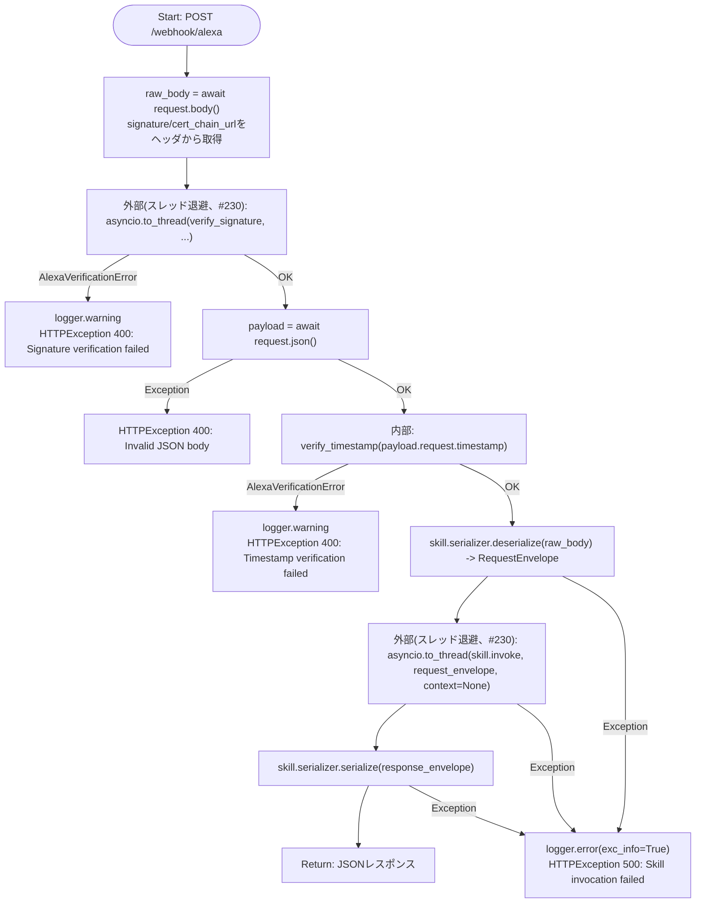
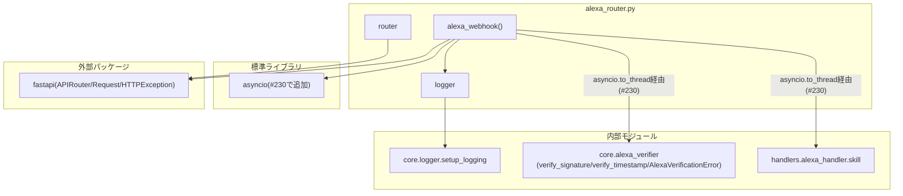

## 1. 解析メタ情報

| 項目 | 内容 |
| --- | --- |
| 対象ファイル | `alexa_router.py` |
| 言語 | Python |
| 解析対象 | 提供されたコードのみ |
| 推測・補完 | 一切なし |

## 関連ドキュメント

* [alexa_verifier.md](./alexa_verifier.md) - `verify_signature`/`verify_timestamp`/`AlexaVerificationError`の実装元
* [unified_server.md](./unified_server.md) - 本ルーターをマウントするFastAPIアプリのエントリーポイント(`alexa_router`という名前でIssue #126にてマウントが追記されているが、マウント元コードは`unified_server.py`側にあるため本ファイルからは確認できない)
* `handlers/alexa_handler.py`(対応する仕様書は`docs/specifications/`配下に見つからなかった) - `skill`オブジェクト(`ask-sdk-core`の`CustomSkillBuilder`)の実体。`LaunchRequestHandler`が`quest_service.game_system`のデータをAPLで組み立てて返す実装を持つ

## 2. ファイルの概要

* Alexaカスタムスキル「ファミクエ」をWebサービスとしてホストするための単一エンドポイント(`POST /webhook/alexa`)を提供するFastAPIルーター。AWS Lambda等を別途用意せず、既存のunified_server(LINE Webhookと同じ公開HTTPS)上でAlexaスキルを動かす設計であることがモジュールDocstringに明記されている。
* 根拠: [モジュールDocstring] (行番号: 2-13 / 抜粋: "Alexaカスタムスキル「ファミクエ」のWebサービスエンドポイント。\n\nAlexa Developer Console側のスキルエンドポイントに、このunified_serverの\n公開URL + `/webhook/alexa` を設定することで、AWS Lambda等を用意せずに\n既存インフラ(LINE Webhookと同じ公開HTTPS)上でスキルを動かす。")
* リクエストごとに、(1) `core.alexa_verifier`でSignature/SignatureCertChainUrlヘッダとタイムスタンプを検証、(2) `handlers.alexa_handler.skill`(ask-sdk-core)にディスパッチ、(3) 生成されたResponseEnvelopeをJSONとして返す、という3段階の処理を行う。
* 根拠: [モジュールDocstring] (行番号: 9-12 / 抜粋: "リクエストごとに:\n    1. core.alexa_verifier で Signature / SignatureCertChainUrl ヘッダとタイムスタンプを検証\n    2. handlers.alexa_handler.skill (ask-sdk-core) にディスパッチ\n    3. 生成された ResponseEnvelope をJSONとして返す")
* **（Issue #230で修正）** `verify_signature`(証明書キャッシュミス時に`requests.get`で同期的にHTTP通信する)と`skill.invoke`(内部で`quest_service`のSQLite同期アクセスを含む)は、以前は`async def`のエンドポイント内で直接呼び出されており、unified_serverが`workers`指定なしの単一プロセス・単一イベントループ構成であるにもかかわらずブロッキングI/Oをスレッドへ退避していなかった。LINE(`webhook_router.py`)やDB非同期アクセス(`save_log_async`)は同種の配慮を既にしているのに対し、Alexa経路だけがこれを欠いていた。現在は両呼び出しとも`asyncio.to_thread`でラップされている。
* 根拠: [verify_signatureのto_thread化] (行番号: 33-38 / 抜粋: "await asyncio.to_thread(verify_signature, raw_body, signature, cert_chain_url)")、[skill.invokeのto_thread化] (行番号: 60-64 / 抜粋: "response_envelope = await asyncio.to_thread(\n            skill.invoke, request_envelope=request_envelope, context=None\n        )")

## 3. 外部依存関係

### インポート一覧

| 名称 | 種類 | 用途 | 根拠 |
| --- | --- | --- | --- |
| `asyncio`（Issue #230で追加） | 標準ライブラリ | `verify_signature`/`skill.invoke`をスレッドへ退避する`asyncio.to_thread`の呼び出し | 根拠: [import文] (行番号: 14 / 抜粋: "import asyncio") |
| `fastapi`(`APIRouter`, `Request`, `HTTPException`) | 外部パッケージ | ルーター定義、リクエストオブジェクト、HTTPエラーレスポンスの送出 | 根拠: [import文] (行番号: 16 / 抜粋: "from fastapi import APIRouter, Request, HTTPException") |
| `core.logger.setup_logging` | 内部モジュール | ロガーの初期化 | 根拠: [import文] (行番号: 18 / 抜粋: "from core.logger import setup_logging") |
| `core.alexa_verifier`(`verify_signature`, `verify_timestamp`, `AlexaVerificationError`) | 内部モジュール | 署名・証明書・タイムスタンプの検証、および検証失敗時に送出される例外の捕捉 | 根拠: [import文] (行番号: 19 / 抜粋: "from core.alexa_verifier import verify_signature, verify_timestamp, AlexaVerificationError") |
| `handlers.alexa_handler.skill` | 内部モジュール | Alexaリクエストのデシリアライズ・ディスパッチ・レスポンスのシリアライズを行う`ask-sdk-core`の`CustomSkillBuilder`インスタンス | 根拠: [import文] (行番号: 20 / 抜粋: "from handlers.alexa_handler import skill") |

### ブラックボックスとなる外部要素

| 名称 | 理由 | 根拠 |
| --- | --- | --- |
| `skill`(`handlers.alexa_handler`の`CustomSkillBuilder`インスタンス)の`serializer`/`invoke`の内部実装 | `ask-sdk-core`ライブラリおよび`handlers/alexa_handler.py`(対応する仕様書は`docs/specifications/`配下に見つからなかった)の内部実装に依存し、本ファイルからは分からない。 | 根拠: [skill呼び出し箇所] (行番号: 56-64 / 抜粋: "request_envelope = skill.serializer.deserialize(...)", "response_envelope = await asyncio.to_thread(\n            skill.invoke, request_envelope=request_envelope, context=None\n        )") |
| `verify_signature`/`verify_timestamp`が実際に検証する証明書チェーン取得先(Amazon S3)の応答内容・遅延特性 | `core/alexa_verifier.py`側の実装、およびAmazon側インフラに依存し、本ファイルからは分からない([alexa_verifier.md](./alexa_verifier.md)参照)。 | 根拠: [verify_signature呼び出し] (行番号: 38 / 抜粋: "await asyncio.to_thread(verify_signature, raw_body, signature, cert_chain_url)") |
| 本ルーターの`unified_server.py`側でのマウント方法(`app.include_router`のprefix/tags指定等) | `unified_server.py`本体を確認していないため、`/webhook/alexa`パス以外に付与される可能性のあるprefixや、`ip_restriction_middleware`の例外パス一覧に含まれるか等は本ファイルからは分からない。 | 根拠: 本ファイル自体には`app.include_router`呼び出しが存在しない (行番号: 全体) |

## 4. 主要要素の定義（関数 / エンドポイント / コンポーネント）

### `logger`

* **役割**: `"alexa_router"`という名前でロガーを初期化し保持する。
* 根拠: [変数宣言] (行番号: 22 / 抜粋: 'logger = setup_logging("alexa_router")')

* **引数/リクエスト**: 該当なし
* **戻り値/レスポンス**: 該当なし
* **副作用**: なし
* **エラーハンドリング**: なし
* 根拠: [変数宣言] (行番号: 22 / 抜粋: 'logger = setup_logging("alexa_router")')

### `router`

* **役割**: 本ファイルが定義する`/webhook/alexa`エンドポイントを登録するための`APIRouter`インスタンス。
* 根拠: [変数宣言] (行番号: 23 / 抜粋: "router = APIRouter()")

* **引数/リクエスト**: 該当なし
* **戻り値/レスポンス**: 該当なし
* **副作用**: なし
* **エラーハンドリング**: なし
* 根拠: [変数宣言] (行番号: 23 / 抜粋: "router = APIRouter()")

### `alexa_webhook` (エンドポイント: `POST /webhook/alexa`)

* **役割**: Alexaからのスキルリクエストを受け取り、(1)署名検証、(2)リクエストJSONのパース、(3)タイムスタンプ検証、(4)`ask-sdk-core`へのディスパッチ、を順に行い、生成されたレスポンスをJSONとして返すエンドポイント。**（Issue #230で修正）** 署名検証(`verify_signature`)とスキルディスパッチ(`skill.invoke`)はいずれも同期的なブロッキング処理(前者は証明書キャッシュミス時のHTTP通信、後者はSQLite同期アクセスを含む)を伴うため、`asyncio.to_thread`でスレッドへ退避し、単一イベントループを占有しないようにしている。
* 根拠: [関数定義とデコレータ] (行番号: 26-27 / 抜粋: '@router.post("/webhook/alexa")\nasync def alexa_webhook(request: Request):')

* **引数/リクエスト**: `request: Request`(FastAPIのリクエストオブジェクト。`Signature`/`SignatureCertChainUrl`ヘッダとJSONボディを内部で参照する)
* 根拠: [関数定義] (行番号: 27 / 抜粋: "async def alexa_webhook(request: Request):")、[ヘッダ参照] (行番号: 29-30 / 抜粋: 'signature = request.headers.get("Signature", "")\n    cert_chain_url = request.headers.get("SignatureCertChainUrl", "")')

* **戻り値/レスポンス**: `skill.serializer.serialize(response_envelope)`の戻り値(FastAPIにより自動的にJSONへ変換される)。検証・処理失敗時は`HTTPException`(400または500)を送出する。
* 根拠: [戻り値] (行番号: 65 / 抜粋: "return skill.serializer.serialize(response_envelope)")

* **副作用**: `asyncio.to_thread`経由での`verify_signature`呼び出し(証明書チェーンのHTTPS取得を伴いうる)、`asyncio.to_thread`経由での`skill.invoke`呼び出し(`quest_service`のSQLite同期アクセスを含みうる)、検証失敗・処理失敗時の警告/エラーログ出力。
* 根拠: [verify_signature呼び出し] (行番号: 38 / 抜粋: "await asyncio.to_thread(verify_signature, raw_body, signature, cert_chain_url)")、[skill.invoke呼び出し] (行番号: 62-64 / 抜粋: "response_envelope = await asyncio.to_thread(\n            skill.invoke, request_envelope=request_envelope, context=None\n        )")、[ログ出力] (行番号: 40, 52, 67 / 抜粋: 'logger.warning(f"Alexa request signature verification failed: {e}")')

* **エラーハンドリング**: 署名検証失敗(`AlexaVerificationError`)時は警告ログを出力し`HTTPException(400, "Signature verification failed")`を送出する。リクエストボディのJSONパース失敗(任意の`Exception`)時は`HTTPException(400, "Invalid JSON body")`を送出する。タイムスタンプ検証失敗(`AlexaVerificationError`)時は警告ログを出力し`HTTPException(400, "Timestamp verification failed")`を送出する。デシリアライズ・ディスパッチ・シリアライズのいずれかで例外(任意の`Exception`)が発生した場合はスタックトレース付きでエラーログを出力し`HTTPException(500, "Skill invocation failed")`を送出する。
* 根拠: [各try-except節] (行番号: 32-41, 43-46, 49-53, 55-68 / 抜粋: "except AlexaVerificationError as e:\n        logger.warning(f\"Alexa request signature verification failed: {e}\")\n        raise HTTPException(status_code=400, detail=\"Signature verification failed\")")

## 5. 処理フロー図

## 6. 依存関係図

## 7. 次のステップ（リバースエンジニアリングの提案）

| 優先度 | ファイル名(推測可) | 理由 | 根拠 |
| --- | --- | --- | --- |
| 高 | `handlers/alexa_handler.py` | `skill`オブジェクトの実体であり、`LaunchRequestHandler`が実際にどのようなSQLiteアクセス(`quest_service.game_system`経由)やAPL組み立てを行っているかを把握するため必読。対応する仕様書は現時点で未作成。 | 根拠: [import文] (行番号: 20 / 抜粋: "from handlers.alexa_handler import skill") |
| 中 | `unified_server.py` | 本ルーターが実際にどのprefixでマウントされ、`ip_restriction_middleware`の例外パス扱いになっているか(LINE/SwitchBotと同様の外部公開が必要なため)を確認するため。 | 根拠: 本ファイル自体にはマウント処理が存在しない |

## 8. 保守上の注意点

* **（Issue #230で修正）ブロッキングI/Oのスレッド退避**: `verify_signature`(証明書キャッシュミス時の`requests.get`)と`skill.invoke`(`quest_service`のSQLite同期アクセスを含む)は、以前は`async def`エンドポイント内で直接(await無しで)呼び出されており、unified_serverが`workers`指定なしの単一プロセス・単一イベントループ構成であるため、これらのブロッキング処理の間、同時間帯のSwitchBot/LINE Webhook・Family Quest APIの処理まで遅延しうる状態だった。LINE経路(`webhook_router.py`)は同種の同期ハンドラ呼び出しを`asyncio.to_thread`でスレッドへ退避する配慮を既にしていたのに対し、Alexa経路だけがこの配慮を欠いていた。現在は両呼び出しとも`asyncio.to_thread`でラップされている。
* 根拠: (行番号: 33-38, 60-64)
* `verify_timestamp`は同期呼び出しのまま(`asyncio.to_thread`化されていない)。[alexa_verifier.md](./alexa_verifier.md)によれば`verify_timestamp`は外部I/Oを行わず現在時刻比較のみのため、ブロッキングの実害は無いと考えられる。
* 根拠: (行番号: 49-53)

## 9. 不明事項一覧

| 項目 | 理由 | 必要なファイル |
| --- | --- | --- |
| `skill`オブジェクトの内部実装(ハンドラ一覧、`serializer`の詳細) | `handlers/alexa_handler.py`を直接解析していないため、`LaunchRequestHandler`以外にどのようなインテント/リクエストハンドラが登録されているか、`serializer.deserialize`/`serialize`が対応する型の範囲が不明。 | `handlers/alexa_handler.py` |
| `unified_server.py`側のマウント設定 | 本ルーターがどのprefixで、どのミドルウェア例外パス設定と共にマウントされているかが不明。 | `unified_server.py` |

## 10. 自己検証結果

* [x] 完了: 推測・外部ファイルの仕様を一切含んでいない
* [x] 完了: 全関数・全クラス・全コンポーネントを列挙した
* [x] 完了: 全てのインポート要素を列挙した
* [x] 完了: すべての仕様説明に「根拠（行番号・抜粋）」を明記した
* [x] 完了: 根拠漏れが0件である
* [x] 完了: Mermaid構文にエラーの原因となる記号（エスケープ漏れ）がない
* [x] 完了: 不明事項を漏れなく列挙した
