## 1. 解析メタ情報

| 項目 | 内容 |
| --- | --- |
| 対象ファイル | `alexa_verifier.py` |
| 言語 | Python |
| 解析対象 | 提供されたコードのみ |
| 推測・補完 | 一切なし |

## 関連ドキュメント

* `MY_HOME_SYSTEM/routers/alexa_router.py`（対応する仕様書は`docs/specifications/`配下に見つからなかった） — `verify_signature`/`verify_timestamp`の呼び出し元。`verify_timestamp`が送出する`AlexaVerificationError`をルーター側が捕捉し、HTTP 400として応答する（Issue #110の対象）。

## 2. ファイルの概要

* AlexaスキルをカスタムのWebサービスエンドポイントとしてホストする際に必須のリクエスト検証（署名検証 + タイムスタンプ検証）を提供するモジュール。モジュールDocstringによれば、公式SDK同梱の`ask-sdk-webservice-support`の検証器は`certvalidator`→`oscrypto`経由でlibcryptoを動的ロードしようとするが、oscryptoはOpenSSL 3.x環境（Raspberry Pi OS Bookworm等）でロードに失敗することがある既知の未解決issueがあるため、本番のPi上でimport時に落ちるリスクを避ける目的で、Alexa公式ドキュメント記載の検証手順を既存依存の`cryptography`と`requests`だけで自前実装している。
* モジュールDocstringに明記された検証手順は、(1) `SignatureCertChainUrl`がAmazon純正のURL形式か、(2) そのURLから証明書チェーンを取得し先頭（リーフ）証明書を使う、(3) リーフ証明書が有効期限内であること、(4) リーフ証明書のSANに`echo-api.amazon.com`が含まれること、(5) `Signature`ヘッダ（base64）をリーフ証明書の公開鍵 + SHA1withRSAでリクエスト生ボディに対して検証する、(6) リクエストJSON内の`request.timestamp`が現在時刻から一定範囲内であること（リプレイ攻撃対策）、の6段階。証明書チェーンの取得自体はHTTPS（`s3.amazonaws.com`、通常のCA検証あり）経由で行われ、かつURLがAmazon管理下のパスに固定されるため、ルートCAまでのチェーン構築（full path validation）は行っていない、という設計上の割り切りもDocstringに明記されている。
* 根拠: [モジュールDocstring] (行番号: 3〜25 / 抜粋: "AlexaスキルをカスタムのWebサービスエンドポイントとしてホストする際に必須の\nリクエスト検証(署名 + タイムスタンプ)。")

## 3. 外部依存関係

### インポート一覧

| 名称 | 種類 | 用途 | 根拠 |
| --- | --- | --- | --- |
| `time` | 標準ライブラリ | 証明書キャッシュのTTL判定（`time.time()`との比較） | 根拠: [import文] (行番号: 27 / 抜粋: "import time") |
| `base64` | 標準ライブラリ | `Signature`ヘッダのbase64デコード | 根拠: [import文] (行番号: 28 / 抜粋: "import base64") |
| `logging` | 標準ライブラリ | モジュール用ロガーの取得 | 根拠: [import文] (行番号: 29 / 抜粋: "import logging") |
| `datetime`, `timezone`（`datetime`モジュール） | 標準ライブラリ | 証明書有効期限・タイムスタンプ許容範囲のUTC基準時刻比較 | 根拠: [import文] (行番号: 30 / 抜粋: "from datetime import datetime, timezone") |
| `Dict`, `Tuple`（`typing`） | 標準ライブラリ | `_cert_cache`の型ヒント | 根拠: [import文] (行番号: 31 / 抜粋: "from typing import Dict, Tuple") |
| `urlparse`（`urllib.parse`） | 標準ライブラリ | `SignatureCertChainUrl`のURL形式検証 | 根拠: [import文] (行番号: 32 / 抜粋: "from urllib.parse import urlparse") |
| `requests` | サードパーティ | 証明書チェーンのHTTPS取得 | 根拠: [import文] (行番号: 34 / 抜粋: "import requests") |
| `x509`（`cryptography`） | サードパーティ | PEM証明書チェーンのパース、SAN拡張の読み取り | 根拠: [import文] (行番号: 35 / 抜粋: "from cryptography import x509") |
| `hashes`（`cryptography.hazmat.primitives`） | サードパーティ | 署名検証時のハッシュアルゴリズム（SHA1）指定 | 根拠: [import文] (行番号: 36 / 抜粋: "from cryptography.hazmat.primitives import hashes") |
| `padding`（`cryptography.hazmat.primitives.asymmetric`） | サードパーティ | 署名検証時のパディング方式（PKCS1v15）指定 | 根拠: [import文] (行番号: 37 / 抜粋: "from cryptography.hazmat.primitives.asymmetric import padding") |
| `InvalidSignature`（`cryptography.exceptions`） | サードパーティ | 署名不一致時に送出される例外の捕捉 | 根拠: [import文] (行番号: 38 / 抜粋: "from cryptography.exceptions import InvalidSignature") |

### ブラックボックスとなる外部要素

| 名称 | 理由 | 根拠 |
| --- | --- | --- |
| `s3.amazonaws.com`上のAmazon証明書チェーン（`SignatureCertChainUrl`） | 実際に取得される証明書の内容・更新頻度・障害時の挙動は、Amazon側のインフラに依存し本ファイルからは分からない。 | 根拠: [_fetch_leaf_certificate] (行番号: 76 / 抜粋: "resp = requests.get(cert_chain_url, timeout=5)") |
| `cryptography`ライブラリの`x509`/署名検証の内部実装 | 証明書パース・SAN抽出・RSA署名検証（`public_key.verify`）の内部アルゴリズム実装の詳細は`cryptography`本体に依存し、本ファイルからは分からない。 | 根拠: [x509.load_pem_x509_certificates呼び出しとpublic_key.verify呼び出し] (行番号: 79, 117 / 抜粋: "certs = x509.load_pem_x509_certificates(resp.content)", "public_key.verify(signature, raw_body, padding.PKCS1v15(), hashes.SHA1())  # nosec B303") |
| 呼び出し元（`MY_HOME_SYSTEM/routers/alexa_router.py`と推測されるが対応する仕様書は`docs/specifications/`配下に見つからなかった） | `verify_signature`/`verify_timestamp`が送出する`AlexaVerificationError`をどのように捕捉しHTTPレスポンスへ変換しているかの実装は本ファイルからは分からない。 | 根拠: [AlexaVerificationErrorクラスDocstring] (行番号: 51〜52 / 抜粋: "class AlexaVerificationError(Exception):\n    \"\"\"署名・証明書・タイムスタンプの検証に失敗した\"\"\"") |

## 4. 主要要素の定義（関数 / エンドポイント / コンポーネント）

### モジュールレベル定数

* **役割**: `CERT_CHAIN_URL_SCHEME`/`CERT_CHAIN_URL_HOSTNAME`/`CERT_CHAIN_URL_PATH_PREFIX`/`CERT_CHAIN_URL_PORT`はAmazon純正の`SignatureCertChainUrl`形式を判定するための固定値（Amazon公式ドキュメントの検証手順に基づく）。`REQUIRED_SAN`はリーフ証明書のSANに含まれるべきホスト名。`TIMESTAMP_TOLERANCE_SECONDS`（150秒）は`verify_timestamp`のデフォルトのリプレイ攻撃対策許容範囲。`CERT_CACHE_TTL_SECONDS`（3600秒=1時間）は`_cert_cache`のエントリ有効期間。
* 根拠: (行番号: 42〜48 / 抜粋: "CERT_CHAIN_URL_SCHEME = \"https\"\nCERT_CHAIN_URL_HOSTNAME = \"s3.amazonaws.com\"\nCERT_CHAIN_URL_PATH_PREFIX = \"/echo.api/\"\nCERT_CHAIN_URL_PORT = 443\nREQUIRED_SAN = \"echo-api.amazon.com\"\nTIMESTAMP_TOLERANCE_SECONDS = 150\nCERT_CACHE_TTL_SECONDS = 60 * 60")

* **副作用**: なし（定数定義のみ）
* **エラーハンドリング**: 該当なし

### `AlexaVerificationError`（例外クラス）

* **役割**: 署名・証明書・タイムスタンプの検証に失敗したことを表す、本モジュール固有の例外。`Exception`を直接継承する薄いクラスで、独自の属性・メソッドは持たない。
* 根拠: (行番号: 51〜52 / 抜粋: "class AlexaVerificationError(Exception):\n    \"\"\"署名・証明書・タイムスタンプの検証に失敗した\"\"\"")

* **副作用**: なし
* **エラーハンドリング**: 該当なし（本モジュール内の各検証関数が送出する側）

### `_cert_cache`（モジュールレベル変数）

* **役割**: `SignatureCertChainUrl`（キー）から取得済みのリーフ証明書と、そのキャッシュ有効期限（`time.time()`基準のUNIXタイムスタンプ）のタプルへマップする、プロセス内メモリキャッシュ。`_fetch_leaf_certificate`が読み書きする。
* 根拠: (行番号: 55 / 抜粋: "_cert_cache: Dict[str, Tuple[x509.Certificate, float]] = {}")

* **副作用**: なし（変数定義のみ。実際の読み書きは`_fetch_leaf_certificate`側）
* **エラーハンドリング**: 該当なし

### `_validate_cert_chain_url`

* **役割**: `SignatureCertChainUrl`ヘッダの値がAmazon純正のURL形式（`https://s3.amazonaws.com/echo.api/...`、ポート443）であることを検証する内部ヘルパー関数。scheme・hostname（大文字小文字を無視）・pathプレフィックス・portの4項目をそれぞれ`CERT_CHAIN_URL_*`定数と比較する。
* 根拠: (行番号: 58〜67 / 抜粋: "def _validate_cert_chain_url(url: str) -> None:\n    parsed = urlparse(url)")

* **引数/リクエスト**: `url: str`（`SignatureCertChainUrl`ヘッダの値）
* 根拠: (行番号: 58)

* **戻り値/レスポンス**: `None`（検証成功時は何も返さず正常終了）
* 根拠: (行番号: 58)

* **副作用**: なし（`urlparse`によるURL解析のみ）
* 根拠: (行番号: 59 / 抜粋: "parsed = urlparse(url)")

* **エラーハンドリング**: scheme/hostname/pathプレフィックス/portのいずれかが期待値と異なる場合、それぞれ`AlexaVerificationError`を送出する。
* 根拠: (行番号: 60〜67 / 抜粋: "if parsed.scheme != CERT_CHAIN_URL_SCHEME:\n        raise AlexaVerificationError(f\"Invalid SignatureCertChainUrl scheme: {parsed.scheme!r}\")")

### `_fetch_leaf_certificate`

* **役割**: `SignatureCertChainUrl`から証明書チェーンをHTTPS経由で取得し、先頭（リーフ）証明書を返す内部ヘルパー関数。`_cert_cache`にキャッシュ済みかつ有効期限内であればHTTP取得を省略してキャッシュを返す。取得成功時は`CERT_CACHE_TTL_SECONDS`（1時間）後を有効期限として`_cert_cache`へ書き込む。
* 根拠: (行番号: 70〜85 / 抜粋: "def _fetch_leaf_certificate(cert_chain_url: str) -> x509.Certificate:\n    now = time.time()\n    cached = _cert_cache.get(cert_chain_url)\n    if cached and cached[1] > now:\n        return cached[0]")

* **引数/リクエスト**: `cert_chain_url: str`
* 根拠: (行番号: 70)

* **戻り値/レスポンス**: `x509.Certificate`（証明書チェーンの先頭＝リーフ証明書）
* 根拠: (行番号: 70, 83〜85 / 抜粋: "leaf = certs[0]\n    _cert_cache[cert_chain_url] = (leaf, now + CERT_CACHE_TTL_SECONDS)\n    return leaf")

* **副作用**: `requests.get`によるHTTPSリクエスト（タイムアウト5秒）、成功時の`_cert_cache`への書き込み。
* 根拠: (行番号: 76〜77, 84 / 抜粋: "resp = requests.get(cert_chain_url, timeout=5)\n    resp.raise_for_status()")

* **エラーハンドリング**: `requests.get`が失敗した場合（`resp.raise_for_status()`）、呼び出し元の`requests`例外がそのまま伝播する（`AlexaVerificationError`への変換は行われない）。証明書チェーンのパース結果が空リストの場合は`AlexaVerificationError`を送出する。
* 根拠: (行番号: 77, 80〜81 / 抜粋: "resp.raise_for_status()", "if not certs:\n        raise AlexaVerificationError(\"Certificate chain response is empty\")")

### `verify_signature`

* **役割**: `Signature`ヘッダと`SignatureCertChainUrl`ヘッダを使ってリクエストボディの署名を検証する公開関数。(1) 両ヘッダの非空チェック、(2) `_validate_cert_chain_url`によるURL形式検証、(3) `_fetch_leaf_certificate`によるリーフ証明書取得、(4) 証明書の有効期限チェック（`not_valid_before_utc <= now <= not_valid_after_utc`）、(5) SANに`echo-api.amazon.com`が含まれるかのチェック、(6) `Signature`ヘッダのbase64デコード、(7) リーフ証明書の公開鍵によるRSA署名検証（PKCS1v15パディング + SHA1ハッシュ、Amazon Alexaの署名アルゴリズム仕様で固定）、を順に行う。
* 根拠: [関数定義とDocstring] (行番号: 88〜92 / 抜粋: "def verify_signature(raw_body: bytes, signature_b64: str, cert_chain_url: str) -> None:\n    \"\"\"SignatureヘッダとSignatureCertChainUrlヘッダを使ってリクエストボディを検証する。\n\n    検証失敗時は AlexaVerificationError を送出する。\n    \"\"\"")

* **引数/リクエスト**: `raw_body: bytes`（リクエストの生ボディ）, `signature_b64: str`（`Signature`ヘッダの値）, `cert_chain_url: str`（`SignatureCertChainUrl`ヘッダの値）
* 根拠: (行番号: 88)

* **戻り値/レスポンス**: `None`（検証成功時は何も返さず正常終了）
* 根拠: (行番号: 88)

* **副作用**: `_fetch_leaf_certificate`経由のHTTPSリクエスト（キャッシュ済みなら省略）、`public_key.verify`によるCPU負荷のかかる暗号演算。
* 根拠: (行番号: 97, 117 / 抜粋: "leaf_cert = _fetch_leaf_certificate(cert_chain_url)", "public_key.verify(signature, raw_body, padding.PKCS1v15(), hashes.SHA1())  # nosec B303")

* **エラーハンドリング**: ヘッダ欠落・URL形式不正・証明書期限切れ/未到達・SAN不一致・base64デコード失敗（`ValueError`/`TypeError`）・署名不一致（`InvalidSignature`）のいずれについても、それぞれ`AlexaVerificationError`（該当箇所は`from exc`で元例外を連鎖）を送出する。
* 根拠: (行番号: 93〜94, 100〜101, 105〜106, 109〜111, 118〜119 / 抜粋: "if not signature_b64 or not cert_chain_url:\n        raise AlexaVerificationError(\"Missing Signature or SignatureCertChainUrl header\")", "except InvalidSignature as exc:\n        raise AlexaVerificationError(\"Request signature does not match body\") from exc")

### `verify_timestamp`

* **役割**: リクエストJSON内の`request.timestamp`が、リプレイ攻撃対策の許容範囲内（既定`TIMESTAMP_TOLERANCE_SECONDS`=150秒）であることを確認する公開関数。`request_timestamp`の末尾`"Z"`を`"+00:00"`に置換したうえで`datetime.fromisoformat`でパースし、現在時刻（UTC）との差の絶対値が許容範囲を超えていれば拒否する。**Issue #110の修正**により、パース成功後にタイムゾーン情報（`tzinfo`）の有無を確認するガードが追加された。`datetime.fromisoformat`はタイムゾーン情報のないISO文字列（例:`"2026-08-30T00:00:00"`）もパース成功として受理してしまう（`ValueError`にならない）が、Alexaの`request.timestamp`は仕様上常にタイムゾーン付きのため、これは仕様外の不正な形式として扱い`AlexaVerificationError`を送出する。このガードが無いと、後続の`now(tz付き) - ts(tz無し)`比較が`TypeError`を送出し、呼び出し元ルーターが`AlexaVerificationError`のみを捕捉する設計のため、本来返すべき400ではなく500が返っていた。
* 根拠: [関数定義とDocstring] (行番号: 122〜123 / 抜粋: "def verify_timestamp(request_timestamp: str, tolerance_seconds: int = TIMESTAMP_TOLERANCE_SECONDS) -> None:\n    \"\"\"リクエストJSON内の request.timestamp がリプレイ攻撃対策の許容範囲内であることを確認する。\"\"\"")
* 根拠: [tzinfoガード(Issue #110)] (行番号: 129〜136 / 抜粋: "if ts.tzinfo is None:\n        # datetime.fromisoformat はタイムゾーン情報のないISO文字列(例: \"2026-08-30T00:00:00\")\n        # もパース成功として受理してしまう(ValueErrorにならない)。", "raise AlexaVerificationError(f\"Request timestamp missing timezone info: {request_timestamp!r}\")")

* **引数/リクエスト**: `request_timestamp: str`（Alexaリクエストの`request.timestamp`フィールド）, `tolerance_seconds: int = TIMESTAMP_TOLERANCE_SECONDS`（許容範囲の秒数、既定150秒）
* 根拠: (行番号: 122)

* **戻り値/レスポンス**: `None`（検証成功時は何も返さず正常終了）
* 根拠: (行番号: 122)

* **副作用**: なし（`datetime.now(timezone.utc)`による現在時刻取得のみ、外部I/Oなし）
* 根拠: (行番号: 138 / 抜粋: "now = datetime.now(timezone.utc)")

* **エラーハンドリング**: `fromisoformat`のパース失敗時（`ValueError`/`AttributeError`）は`AlexaVerificationError`を送出（`from exc`で連鎖）。パース成功してもタイムゾーン情報が無い場合（Issue #110）は`AlexaVerificationError`を送出。許容範囲を超えた場合も`AlexaVerificationError`を送出する。
* 根拠: (行番号: 124〜127, 129〜136, 139〜141 / 抜粋: "except (ValueError, AttributeError) as exc:\n        raise AlexaVerificationError(f\"Invalid request timestamp: {request_timestamp!r}\") from exc", "delta = abs((now - ts).total_seconds())\n    if delta > tolerance_seconds:\n        raise AlexaVerificationError(f\"Request timestamp outside tolerance window ({delta:.0f}s)\")")

## 5. 処理フロー図

```mermaid
flowchart TD
    subgraph "verify_signature"
        VSStart["Start: verify_signature(raw_body, signature_b64, cert_chain_url)"] --> VSHeaderCheck{"signature_b64/cert_chain_urlともに非空か?"}
        VSHeaderCheck -- No --> VSErr1["AlexaVerificationError: ヘッダ欠落"]
        VSHeaderCheck -- Yes --> VSUrlValidate["_validate_cert_chain_url(cert_chain_url)"]
        VSUrlValidate -- 不正 --> VSErr2["AlexaVerificationError: URL形式不正"]
        VSUrlValidate -- OK --> VSFetchCert["_fetch_leaf_certificate(cert_chain_url)<br>(キャッシュ有効ならHTTPS省略)"]
        VSFetchCert --> VSExpiryCheck{"証明書は有効期限内か?"}
        VSExpiryCheck -- No --> VSErr3["AlexaVerificationError: 期限切れ/未到達"]
        VSExpiryCheck -- Yes --> VSSanCheck{"SANにecho-api.amazon.comを含むか?"}
        VSSanCheck -- No --> VSErr4["AlexaVerificationError: SAN不一致"]
        VSSanCheck -- Yes --> VSBase64Decode["signature_b64をbase64デコード"]
        VSBase64Decode -- "ValueError/TypeError" --> VSErr5["AlexaVerificationError: base64不正"]
        VSBase64Decode -- OK --> VSVerify["public_key.verify(署名, raw_body, PKCS1v15, SHA1)"]
        VSVerify -- "InvalidSignature" --> VSErr6["AlexaVerificationError: 署名不一致"]
        VSVerify -- OK --> VSEnd["正常終了(None)"]
    end

    subgraph "verify_timestamp"
        VTStart["Start: verify_timestamp(request_timestamp, tolerance_seconds)"] --> VTParse["datetime.fromisoformat(Zを+00:00に置換したtimestamp)"]
        VTParse -- "ValueError/AttributeError" --> VTErr1["AlexaVerificationError: パース失敗"]
        VTParse -- 成功 --> VTTzCheck{"ts.tzinfo is None?<br>(Issue #110で追加)"}
        VTTzCheck -- Yes --> VTErr2["AlexaVerificationError: タイムゾーン情報なし"]
        VTTzCheck -- No --> VTDelta["delta = abs(now(UTC) - ts).total_seconds()"]
        VTDelta --> VTRange{"delta > tolerance_seconds?"}
        VTRange -- Yes --> VTErr3["AlexaVerificationError: 許容範囲外"]
        VTRange -- No --> VTEnd["正常終了(None)"]
    end
```

## 6. 依存関係図

```mermaid
graph TD
    subgraph "alexa_verifier.py"
        ValidateCertUrl["_validate_cert_chain_url()"]
        FetchLeafCert["_fetch_leaf_certificate()"]
        VerifySignature["verify_signature()"]
        VerifyTimestamp["verify_timestamp()"]
        CertCache["_cert_cache(モジュール変数)"]
        VerificationError["AlexaVerificationError"]
    end

    subgraph "標準ライブラリ"
        time_mod["time"]
        base64_mod["base64"]
        logging_mod["logging"]
        datetime_mod["datetime / timezone"]
        typing_mod["typing"]
        urlparse_mod["urllib.parse.urlparse"]
    end

    subgraph "サードパーティ"
        requests_mod["requests"]
        x509_mod["cryptography.x509"]
        hashes_mod["cryptography.hazmat.primitives.hashes"]
        padding_mod["cryptography.hazmat.primitives.asymmetric.padding"]
        invalid_sig["cryptography.exceptions.InvalidSignature"]
    end

    subgraph "外部(コード外)"
        S3["s3.amazonaws.com(Amazon証明書チェーン)"]
    end

    ValidateCertUrl --> urlparse_mod
    FetchLeafCert --> time_mod
    FetchLeafCert --> requests_mod
    FetchLeafCert --> x509_mod
    FetchLeafCert --> CertCache
    FetchLeafCert -.HTTPS.-> S3

    VerifySignature --> ValidateCertUrl
    VerifySignature --> FetchLeafCert
    VerifySignature --> datetime_mod
    VerifySignature --> base64_mod
    VerifySignature --> hashes_mod
    VerifySignature --> padding_mod
    VerifySignature --> invalid_sig
    VerifySignature --> VerificationError

    VerifyTimestamp --> datetime_mod
    VerifyTimestamp --> VerificationError

    ValidateCertUrl --> VerificationError
    FetchLeafCert --> VerificationError
```

## 7. 次のステップ（リバースエンジニアリングの提案）

| 優先度 | ファイル名(推測可) | 理由 | 根拠 |
| --- | --- | --- | --- |
| 高 | `MY_HOME_SYSTEM/routers/alexa_router.py` | `verify_signature`/`verify_timestamp`の実際の呼び出し元であり、送出された`AlexaVerificationError`をどのようにHTTPレスポンス（400等）へ変換しているかを確認するため必読。 | 根拠: [AlexaVerificationErrorクラスDocstring] (行番号: 51〜52) |

## 8. 保守上の注意点

* **`oscrypto`起因の依存回避という設計判断**: モジュールDocstringに明記の通り、本来使えるはずの`ask-sdk-webservice-support`の検証器を使わず、署名・タイムスタンプ検証を`cryptography`と`requests`のみで自前実装している。これはRaspberry Pi OS Bookworm等のOpenSSL 3.x環境で`oscrypto`のロードに失敗する既知の未解決issueを回避するためであり、`ask-sdk-webservice-support`側でこの問題が解消されても、本ファイルの自前実装への依存自体は自動的には解消されない。
* 根拠: [モジュールDocstring] (行番号: 6〜10 / 抜粋: "ask-sdk-webservice-support 同梱の検証器は certvalidator -> oscrypto 経由で\nlibcrypto を動的ロードしようとするが")
* **ルートCAまでの証明書チェーン検証を行っていない**: モジュールDocstringに明記の通り、証明書チェーンの取得自体がHTTPS（通常のCA検証あり）経由かつAmazon管理下のURLパスに固定されるという前提のもとで、ルートCAまでのフルパス検証(full path validation)は意図的に省略されている。この前提（`_validate_cert_chain_url`によるURL形式チェック）が破られた場合の防御は、このURL形式チェック自体に一元的に依存する。
* 根拠: [モジュールDocstring] (行番号: 23〜25 / 抜粋: "なお、証明書チェーンの取得自体はHTTPS(s3.amazonaws.com、通常のCA検証あり)経由で\n行われ、かつURLがAmazon管理下のパスに固定されるため")
* **`_fetch_leaf_certificate`のHTTP取得失敗時は`AlexaVerificationError`に変換されない**: `resp.raise_for_status()`が送出する`requests`例外（`requests.exceptions.HTTPError`等）はそのまま呼び出し元へ伝播し、`AlexaVerificationError`への変換は行われない。呼び出し元ルーターが`AlexaVerificationError`のみを捕捉する設計の場合、Amazon側の証明書チェーンURLが一時的に応答不能になっただけでも、意図しない形（500等）でエラーが伝播しうる（Issue #110で`verify_timestamp`側の同種の問題が修正されたが、`_fetch_leaf_certificate`のHTTP取得失敗経路自体は本Issueのスコープ外で未修正）。
* 根拠: (行番号: 77 / 抜粋: "resp.raise_for_status()")
* **タイムスタンプのタイムゾーン欠落ガード（Issue #110で追加）**: `verify_timestamp`は、`datetime.fromisoformat`がタイムゾーン情報のないISO文字列もパース成功として受理してしまう挙動に対し、パース後に`tzinfo is None`を明示的にチェックして`AlexaVerificationError`を送出するガードを持つ。このガードが無かった旧実装では、後続の`now(tz付き) - ts(tz無し)`比較が`TypeError`を送出し、呼び出し元が`AlexaVerificationError`のみを捕捉する設計のため、本来返すべき400ではなく500が返っていた（実害は署名検証を通過した後にしか到達しないため極小）。
* 根拠: (行番号: 129〜136)

## 9. 不明事項一覧

| 項目 | 理由 | 必要なファイル |
| --- | --- | --- |
| 呼び出し元ルーターが`AlexaVerificationError`以外の例外（`requests`例外等）をどう扱うか | `verify_signature`/`verify_timestamp`の一部エラー経路（`_fetch_leaf_certificate`のHTTP取得失敗等）は`AlexaVerificationError`に変換されずそのまま伝播するが、呼び出し元がこれをHTTPレスポンスへどう変換するかは本ファイルからは不明。 | `MY_HOME_SYSTEM/routers/alexa_router.py` |
| `_cert_cache`のプロセス間共有の有無 | `unified_server.py`が複数プロセス/ワーカー構成で稼働する場合、`_cert_cache`はプロセスごとに独立するかどうかが本ファイルからは不明。 | `MY_HOME_SYSTEM/unified_server.py`、デプロイ構成（起動コマンド等） |

## 10. 自己検証結果

* [x] 推測・外部ファイルの仕様を一切含んでいない
* [x] 全関数・全クラス・全コンポーネントを列挙した
* [x] 全てのインポート要素を列挙した
* [x] すべての仕様説明に「根拠（行番号・抜粋）」を明記した
* [x] 根拠漏れが0件である
* [x] Mermaid構文にエラーの原因となる記号（エスケープ漏れ）がない
* [x] 不明事項を漏れなく列挙した

完了
