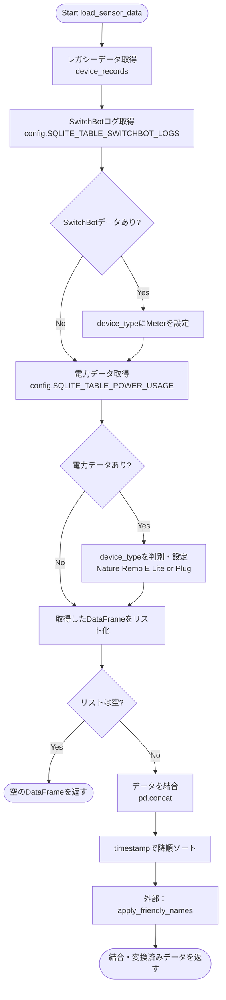

## 1. 解析メタ情報

| 項目 | 内容 |
| --- | --- |
| 対象ファイル | analysis_service.py |
| 言語 | Python |
| 解析対象 | 提供されたコードのみ |
| 推測・補完 | 一切なし |

## 2. ファイルの概要

* このファイルは、データベース（SQLite）やOSシステム情報（ディスク、メモリ、システムログ）、外部API（ngrok）からデータを取得し、Pandas DataFrame等を用いて加工・集計（タイムゾーン変換、デバイス名のマッピング、月額コスト計算など）を行うデータ分析・取得用のサービス層（Service層）を担っている。

## 3. 外部依存関係

### インポート一覧

| 名称 | 種類 | 用途 | 根拠 |
| --- | --- | --- | --- |
| `sqlite3` | 標準ライブラリ | SQLiteデータベースへの接続およびクエリ実行 | `import sqlite3` (行番号取得不可 / 抜粋: "import sqlite3") |
| `shutil` | 標準ライブラリ | ディスク使用量の取得 | `import shutil` (行番号取得不可 / 抜粋: "import shutil") |
| `subprocess` | 標準ライブラリ | OSコマンド（free, journalctl）の実行 | `import subprocess` (行番号取得不可 / 抜粋: "import subprocess") |
| `requests` | サードパーティ | ngrokのローカルAPIへのHTTPリクエスト | `import requests` (行番号取得不可 / 抜粋: "import requests") |
| `os` | 標準ライブラリ | 未使用（インポートのみ） | `import os` (行番号取得不可 / 抜粋: "import os") |
| `datetime`, `timedelta`, `date` | 標準ライブラリ | 日付や時間の取得・計算 | `from datetime import ...` (行番号取得不可 / 抜粋: "from datetime import datetime") |
| `pytz` | サードパーティ | タイムゾーンの指定 | `import pytz` (行番号取得不可 / 抜粋: "import pytz") |
| `typing` | 標準ライブラリ | 型ヒントの定義 | `from typing import ...` (行番号取得不可 / 抜粋: "from typing import Dict, List") |
| `pandas` as `pd` | サードパーティ | データの保持、加工、結合、集計 | `import pandas as pd` (行番号取得不可 / 抜粋: "import pandas as pd") |
| `config` | 内部ファイル | 各種定数、テーブル名、デバイス定義の取得 | `import config` (行番号取得不可 / 抜粋: "import config") |
| `core.logger` | 内部ファイル | ロガーのセットアップ | `from core.logger import setup_logging` (行番号取得不可 / 抜粋: "from core.logger import setup_logging") |

### ブラックボックスとなる外部要素

| 名称 | 理由 | 根拠 |
| --- | --- | --- |
| `config` | ファイル内に定義がないため、`SQLITE_DB_PATH`や`MONITOR_DEVICES`などの具体的な値や構造が不明。 | `config.SQLITE_DB_PATH` (行番号取得不可 / 抜粋: "config.SQLITE_DB_PATH") |
| `core.logger.setup_logging` | ファイル内に実装がないため、ログの出力先やフォーマットが不明。 | `setup_logging("analysis_service")` (行番号取得不可 / 抜粋: "setup_logging("analysis_service")") |
| データベースの各種テーブル | スキーマ定義が提供されていないため、カラムの型や制約、インデックスの有無が不明。 | `SELECT * FROM {table_name}` (行番号取得不可 / 抜粋: "SELECT * FROM {table_name}") |
| `home_system.service` | OSのSystemdサービス。具体的な動作や内容が不明。 | `journalctl -u home_system.service` (行番号取得不可 / 抜粋: "home_system.service") |

## 4. 主要要素の定義（関数 / エンドポイント / コンポーネント）

### `get_ro_db_connection`

* **役割**: 読み取り専用でSQLiteデータベース接続を取得する。
* 根拠: `get_ro_db_connection` (行番号取得不可 / 抜粋: "f"file:{config.SQLITE_DB_PATH}?mode=ro"")

* **引数/リクエスト**: なし
* 根拠: `def get_ro_db_connection() -> sqlite3.Connection:` (行番号取得不可 / 抜粋: "def get_ro_db_connection()")

* **戻り値/レスポンス**: `sqlite3.Connection` (SQLiteの接続オブジェクト)
* 根拠: `-> sqlite3.Connection:` (行番号取得不可 / 抜粋: "-> sqlite3.Connection:")

* **副作用**: 外部データベース（SQLiteファイル）への接続を開く。
* 根拠: `sqlite3.connect` (行番号取得不可 / 抜粋: "sqlite3.connect(")

* **エラーハンドリング**: なし
* 根拠: 該当関数内に `try-except` なし (行番号取得不可 / 抜粋: "def get_ro_db_connection()")

### `process_dataframe`

* **役割**: DataFrameの `timestamp` カラムを日本時間（Asia/Tokyo）に変換する。
* 根拠: `process_dataframe` (行番号取得不可 / 抜粋: "dt.tz_convert("Asia/Tokyo")")

* **引数/リクエスト**: `df` (`pd.DataFrame`): 処理対象のデータフレーム
* 根拠: `df: pd.DataFrame` (行番号取得不可 / 抜粋: "def process_dataframe(df: pd.DataFrame)")

* **戻り値/レスポンス**: `pd.DataFrame` (変換後のデータフレーム)
* 根拠: `-> pd.DataFrame` (行番号取得不可 / 抜粋: "-> pd.DataFrame:")

* **副作用**: なし
* 根拠: `df = df.copy()` でコピーを作成し副作用を回避 (行番号取得不可 / 抜粋: "df = df.copy()")

* **エラーハンドリング**: なし
* 根拠: 該当関数内に `try-except` なし (行番号取得不可 / 抜粋: "def process_dataframe(")

### `apply_friendly_names`

* **役割**: DataFrameのデバイスID等から表示名（`friendly_name`）や場所（`location`）をマッピングし、特定の名称を置換する。
* 根拠: `apply_friendly_names` (行番号取得不可 / 抜粋: "df["friendly_name"] = df["device_id"].map(id_map)")

* **引数/リクエスト**: `df` (`pd.DataFrame`): 処理対象のデータフレーム
* 根拠: `df: pd.DataFrame` (行番号取得不可 / 抜粋: "def apply_friendly_names(df: pd.DataFrame)")

* **戻り値/レスポンス**: `pd.DataFrame` (マッピング適用後のデータフレーム)
* 根拠: `-> pd.DataFrame` (行番号取得不可 / 抜粋: "-> pd.DataFrame:")

* **副作用**: なし
* 根拠: `df = df.copy()` でコピーを作成 (行番号取得不可 / 抜粋: "df = df.copy()")

* **エラーハンドリング**: DBの最新デバイス名からのマッピング上書き時に例外をキャッチしログを出力。
* 根拠: `try ... except Exception as e:` (行番号取得不可 / 抜粋: "except Exception as e:")

### `load_data_from_db`

* **役割**: 汎用的なSQLクエリを実行し、結果をDataFrameとしてロード。指定された日付カラムを `timestamp` として処理関数に通す。
* 根拠: `load_data_from_db` (行番号取得不可 / 抜粋: "df = pd.read_sql_query(query, conn)")

* **引数/リクエスト**: `query` (`str`): 実行するSQL。`date_column` (`str`, デフォルト `"timestamp"`): 日付対象のカラム名。
* 根拠: `query: str, date_column: str = "timestamp"` (行番号取得不可 / 抜粋: "query: str, date_column: str = "timestamp"")

* **戻り値/レスポンス**: `pd.DataFrame` (取得したデータのデータフレーム)
* 根拠: `-> pd.DataFrame:` (行番号取得不可 / 抜粋: "-> pd.DataFrame:")

* **副作用**: データベースの読み取り操作。
* 根拠: `get_ro_db_connection()` (行番号取得不可 / 抜粋: "conn = get_ro_db_connection()")

* **エラーハンドリング**: 例外をキャッチしてエラーログを出力し、空のDataFrameを返す。`finally`でDB接続を確実に閉じる。
* 根拠: `except Exception as e:` および `finally:` (行番号取得不可 / 抜粋: "finally:")

### `load_nas_status`

* **役割**: データベースからNASの最新状態を1件取得する。
* 根拠: `load_nas_status` (行番号取得不可 / 抜粋: "ORDER BY timestamp DESC LIMIT 1")

* **引数/リクエスト**: なし
* 根拠: `def load_nas_status() -> Optional[pd.Series]:` (行番号取得不可 / 抜粋: "def load_nas_status()")

* **戻り値/レスポンス**: `Optional[pd.Series]` (最新の1件。存在しない場合は `None`)
* 根拠: `-> Optional[pd.Series]:` (行番号取得不可 / 抜粋: "-> Optional[pd.Series]:")

* **副作用**: データベースの読み取り操作。
* 根拠: `get_ro_db_connection()` (行番号取得不可 / 抜粋: "with get_ro_db_connection() as conn:")

* **エラーハンドリング**: 例外発生時はエラーログを出力し `None` を返す。
* 根拠: `except Exception as e:` (行番号取得不可 / 抜粋: "logger.error(f"NAS Data Load Error: {e}")")

### `load_generic_data`

* **役割**: 指定したテーブルから汎用的に最新のデータを取得する。
* 根拠: `load_generic_data` (行番号取得不可 / 抜粋: "query = f"SELECT * FROM {table_name}")

* **引数/リクエスト**: `table_name` (`str`): テーブル名。`limit` (`int`, デフォルト `500`): 取得件数。
* 根拠: `table_name: str, limit: int = 500` (行番号取得不可 / 抜粋: "table_name: str, limit: int = 500")

* **戻り値/レスポンス**: `pd.DataFrame` (取得したデータのデータフレーム)
* 根拠: `-> pd.DataFrame:` (行番号取得不可 / 抜粋: "-> pd.DataFrame:")

* **副作用**: データベースの読み取り操作。
* 根拠: `load_data_from_db(query)` を呼び出し。 (行番号取得不可 / 抜粋: "return load_data_from_db(query)")

* **エラーハンドリング**: 内部で呼び出される `load_data_from_db` に依存。
* 根拠: `return load_data_from_db(query)` (行番号取得不可 / 抜粋: "return load_data_from_db(query)")

### `load_sensor_data`

* **役割**: `device_records`、SwitchBotのログ、電力使用量の3つのテーブルからデータを取得・統合・ソートし、表示名を適用する。
* 根拠: `load_sensor_data` (行番号取得不可 / 抜粋: "df_merged = pd.concat(df_list, ignore_index=True)")

* **引数/リクエスト**: `limit` (`int`, デフォルト `5000`): 取得件数の上限。
* 根拠: `limit: int = 5000` (行番号取得不可 / 抜粋: "def load_sensor_data(limit: int = 5000)")

* **戻り値/レスポンス**: `pd.DataFrame` (統合されたセンサーデータのデータフレーム)
* 根拠: `-> pd.DataFrame:` (行番号取得不可 / 抜粋: "-> pd.DataFrame:")

* **副作用**: データベースの読み取り操作。
* 根拠: `load_data_from_db` を複数回呼び出し。 (行番号取得不可 / 抜粋: "df_legacy = load_data_from_db(query_legacy)")

* **エラーハンドリング**: 内部で呼び出される `load_data_from_db` に依存。
* 根拠: 該当関数内に独自の `try-except` なし (行番号取得不可 / 抜粋: "def load_sensor_data(")

### `calculate_monthly_cost_cumulative`

* **役割**: 当月の電力使用量データから、今月の電気代概算（kwh * 31）を算出する。新テーブルが空なら旧テーブルへフォールバックする。
* 根拠: `calculate_monthly_cost_cumulative` (行番号取得不可 / 抜粋: "return int(df["kwh"].sum() * 31)")

* **引数/リクエスト**: なし
* 根拠: `def calculate_monthly_cost_cumulative() -> int:` (行番号取得不可 / 抜粋: "def calculate_monthly_cost_cumulative()")

* **戻り値/レスポンス**: `int` (計算された電気代概算)
* 根拠: `-> int:` (行番号取得不可 / 抜粋: "-> int:")

* **副作用**: データベースの読み取り操作。
* 根拠: `load_data_from_db(query)` を呼び出し。 (行番号取得不可 / 抜粋: "df = load_data_from_db(query)")

* **エラーハンドリング**: 例外発生時はエラーログを出力し `0` を返す。
* 根拠: `except Exception as e:` (行番号取得不可 / 抜粋: "return 0")

### `load_weather_history`

* **役割**: 指定された日数分、指定された場所（デフォルトは伊丹）の天気履歴を取得する。
* 根拠: `load_weather_history` (行番号取得不可 / 抜粋: "FROM weather_history")

* **引数/リクエスト**: `days` (`int`, デフォルト `40`): 遡る日数。`location` (`str`, デフォルト `"伊丹"`): 取得対象の場所。
* 根拠: `days: int = 40, location: str = "伊丹"` (行番号取得不可 / 抜粋: "days: int = 40, location: str = "伊丹"")

* **戻り値/レスポンス**: `pd.DataFrame` (天気履歴のデータフレーム)
* 根拠: `-> pd.DataFrame:` (行番号取得不可 / 抜粋: "-> pd.DataFrame:")

* **副作用**: データベースの読み取り操作。
* 根拠: `pd.read_sql_query(query, conn)` (行番号取得不可 / 抜粋: "df = pd.read_sql_query(query, conn)")

* **エラーハンドリング**: 例外発生時はエラーログを出力し空のデータフレームを返す。`finally`で接続を閉じる。
* 根拠: `except Exception as e:` (行番号取得不可 / 抜粋: "return pd.DataFrame()")

### `load_yearly_temperature_stats`

* **役割**: 指定年の天気履歴（外気温）と室内センサーログ（室温）の日次最小・最大統計を取得し、マージして返す。
* 根拠: `load_yearly_temperature_stats` (行番号取得不可 / 抜粋: "df_merged = pd.merge(df_weather, df_sensor, on="date"")

* **引数/リクエスト**: `year` (`int`): 対象年。`location` (`str`, デフォルト `"伊丹"`): 対象場所。
* 根拠: `year: int, location: str = "伊丹"` (行番号取得不可 / 抜粋: "year: int, location: str = "伊丹"")

* **戻り値/レスポンス**: `pd.DataFrame` (マージされた統計データのデータフレーム)
* 根拠: `-> pd.DataFrame:` (行番号取得不可 / 抜粋: "-> pd.DataFrame:")

* **副作用**: データベースの読み取り操作。
* 根拠: `pd.read_sql_query` (行番号取得不可 / 抜粋: "df_weather = pd.read_sql_query(q_weather, conn)")

* **エラーハンドリング**: 各クエリ実行ごとに `try-except` で回避処理。全体の例外発生時はエラーログを出力し空のデータフレームを返す。`finally`で接続を閉じる。
* 根拠: `try: df_new = pd.read_sql_query(q_new, conn) except: pass` 等 (行番号取得不可 / 抜粋: "except: pass")

### `load_bicycle_data`

* **役割**: 駐輪場データを取得する。対象テーブルが存在するか事前に検証する。
* 根拠: `load_bicycle_data` (行番号取得不可 / 抜粋: "SELECT * FROM {table_name}")

* **引数/リクエスト**: `limit` (`int`, デフォルト `2000`): 取得件数の上限。
* 根拠: `limit: int = 2000` (行番号取得不可 / 抜粋: "limit: int = 2000")

* **戻り値/レスポンス**: `pd.DataFrame` (駐輪場データのデータフレーム)
* 根拠: `-> pd.DataFrame:` (行番号取得不可 / 抜粋: "-> pd.DataFrame:")

* **副作用**: データベースの読み取り操作。
* 根拠: `load_data_from_db(query)` (行番号取得不可 / 抜粋: "return load_data_from_db(query)")

* **エラーハンドリング**: 例外発生時はエラーログを出力し空のデータフレームを返す。
* 根拠: `except Exception as e:` (行番号取得不可 / 抜粋: "return pd.DataFrame()")

### `load_ai_report`

* **役割**: データベースから最新のAIレポートを1件取得する。
* 根拠: `load_ai_report` (行番号取得不可 / 抜粋: "ORDER BY id DESC LIMIT 1")

* **引数/リクエスト**: なし
* 根拠: `def load_ai_report() -> Optional[pd.Series]:` (行番号取得不可 / 抜粋: "def load_ai_report()")

* **戻り値/レスポンス**: `Optional[pd.Series]` (最新の1件。存在しない場合は `None`)
* 根拠: `-> Optional[pd.Series]:` (行番号取得不可 / 抜粋: "-> Optional[pd.Series]:")

* **副作用**: データベースの読み取り操作。
* 根拠: `load_data_from_db(query)` (行番号取得不可 / 抜粋: "df = load_data_from_db(query)")

* **エラーハンドリング**: 内部で呼び出される `load_data_from_db` に依存。
* 根拠: 該当関数内に独自の `try-except` なし (行番号取得不可 / 抜粋: "def load_ai_report()")

### `load_ranking_dates`

* **役割**: アプリランキング（`app_rankings`）テーブルに存在する日付のリストを重複なしで降順で取得する。
* 根拠: `load_ranking_dates` (行番号取得不可 / 抜粋: "SELECT DISTINCT date FROM app_rankings ORDER BY date DESC")

* **引数/リクエスト**: `limit` (`int`, デフォルト `3`): 取得する日付の数。
* 根拠: `limit: int = 3` (行番号取得不可 / 抜粋: "limit: int = 3")

* **戻り値/レスポンス**: `List[str]` (日付の文字列リスト)
* 根拠: `-> List[str]:` (行番号取得不可 / 抜粋: "-> List[str]:")

* **副作用**: データベースの読み取り操作。
* 根拠: `pd.read_sql_query(query, conn)` (行番号取得不可 / 抜粋: "df = pd.read_sql_query(query, conn)")

* **エラーハンドリング**: 例外発生時はエラーログを出力し空のリストを返す。
* 根拠: `except Exception as e:` (行番号取得不可 / 抜粋: "return []")

### `load_ranking_data`

* **役割**: 特定日付とランキングタイプに応じたランキングデータを取得する。
* 根拠: `load_ranking_data` (行番号取得不可 / 抜粋: "SELECT rank, title, app_id FROM app_rankings")

* **引数/リクエスト**: `date_str` (`str`): 対象日付。`ranking_type` (`str`): ランキングの種別。
* 根拠: `date_str: str, ranking_type: str` (行番号取得不可 / 抜粋: "date_str: str, ranking_type: str")

* **戻り値/レスポンス**: `pd.DataFrame` (ランキングデータのデータフレーム)
* 根拠: `-> pd.DataFrame:` (行番号取得不可 / 抜粋: "-> pd.DataFrame:")

* **副作用**: データベースの読み取り操作。
* 根拠: `pd.read_sql_query(query, conn)` (行番号取得不可 / 抜粋: "return pd.read_sql_query(query, conn)")

* **エラーハンドリング**: 例外発生時はエラーログを出力し空のデータフレームを返す。`finally`で接続を閉じる。
* 根拠: `except Exception as e:` (行番号取得不可 / 抜粋: "return pd.DataFrame()")

### `get_ngrok_url`

* **役割**: ngrokのローカルAPI（ポート4040）を叩き、公開されているURL（8000ポート/8501ポート対応）を取得する。
* 根拠: `get_ngrok_url` (行番号取得不可 / 抜粋: "res = requests.get("[http://127.0.0.1:4040/api/tunnels](http://127.0.0.1:4040/api/tunnels)"")

* **引数/リクエスト**: なし
* 根拠: `def get_ngrok_url() -> Dict[str, str]:` (行番号取得不可 / 抜粋: "def get_ngrok_url()")

* **戻り値/レスポンス**: `Dict[str, str]` (`server` や `dashboard` をキーとしたURLの辞書)
* 根拠: `-> Dict[str, str]:` (行番号取得不可 / 抜粋: "-> Dict[str, str]:")

* **副作用**: 外部API（`http://127.0.0.1:4040/api/tunnels`）へのHTTP GETリクエストの実行。
* 根拠: `requests.get` (行番号取得不可 / 抜粋: "requests.get(")

* **エラーハンドリング**: 例外発生時（接続エラー等）はエラーを握り潰して空の辞書を返す。
* 根拠: `except Exception: pass` (行番号取得不可 / 抜粋: "except Exception:")

### `get_disk_usage`

* **役割**: ルートディレクトリ（`/`）のディスク使用量（全体、使用済、空き、使用率）を取得する。
* 根拠: `get_disk_usage` (行番号取得不可 / 抜粋: "total, used, free = shutil.disk_usage("/")")

* **引数/リクエスト**: なし
* 根拠: `def get_disk_usage() -> Optional[Dict[str, float]]:` (行番号取得不可 / 抜粋: "def get_disk_usage()")

* **戻り値/レスポンス**: `Optional[Dict[str, float]]` (GB単位の容量とパーセンテージを格納した辞書。失敗時は `None`)
* 根拠: `-> Optional[Dict[str, float]]:` (行番号取得不可 / 抜粋: "-> Optional[Dict[str, float]]:")

* **副作用**: OSファイルシステムのディスク容量読み取り。
* 根拠: `shutil.disk_usage("/")` (行番号取得不可 / 抜粋: "shutil.disk_usage("/")")

* **エラーハンドリング**: 例外発生時はエラーログを出力し `None` を返す。
* 根拠: `except Exception as e:` (行番号取得不可 / 抜粋: "return None")

### `get_memory_usage`

* **役割**: OSの `free -m` コマンドを実行し、結果をパースしてメモリの使用状況を取得する。
* 根拠: `get_memory_usage` (行番号取得不可 / 抜粋: "subprocess.run(["free", "-m"], capture_output=True")

* **引数/リクエスト**: なし
* 根拠: `def get_memory_usage() -> Optional[Dict[str, float]]:` (行番号取得不可 / 抜粋: "def get_memory_usage()")

* **戻り値/レスポンス**: `Optional[Dict[str, float]]` (MB単位の容量とパーセンテージを格納した辞書。失敗時は `None`)
* 根拠: `-> Optional[Dict[str, float]]:` (行番号取得不可 / 抜粋: "-> Optional[Dict[str, float]]:")

* **副作用**: OSコマンド（`free`）の実行。
* 根拠: `subprocess.run` (行番号取得不可 / 抜粋: "subprocess.run(["free", "-m"]")

* **エラーハンドリング**: 例外発生時はエラーログを出力し `None` を返す。
* 根拠: `except Exception as e:` (行番号取得不可 / 抜粋: "return None")

### `get_system_logs`

* **役割**: OSの `journalctl` コマンドを実行し、`home_system.service` のシステムログを取得する。
* 根拠: `get_system_logs` (行番号取得不可 / 抜粋: "cmd = ["journalctl", "-u", "home_system.service"")

* **引数/リクエスト**: `lines` (`int`, デフォルト `50`): 行数。`priority` (`Optional[str]`): ログの優先度。`target_date` (`Optional[date]`): 対象日付。
* 根拠: `lines: int = 50, priority: Optional[str] = None, target_date: Optional[date] = None` (行番号取得不可 / 抜粋: "lines: int = 50, priority: Optional[str] = None")

* **戻り値/レスポンス**: `str` (取得したログの文字列。失敗時はエラーメッセージの文字列)
* 根拠: `-> str:` (行番号取得不可 / 抜粋: "-> str:")

* **副作用**: OSコマンド（`journalctl`）の実行。
* 根拠: `subprocess.run` (行番号取得不可 / 抜粋: "subprocess.run(cmd")

* **エラーハンドリング**: 例外発生時はエラーメッセージを文字列として返す。
* 根拠: `except Exception as e:` (行番号取得不可 / 抜粋: "return f"ログ取得エラー: {e}"")

## 5. 処理フロー図

以下は、3つのテーブルからデータを取得・統合する `load_sensor_data` の主要フローです。

## 6. 依存関係図

ファイル内の主要要素および外部要素との依存関係です。

```mermaid
graph TD
    subgraph External
        SQLite[(SQLite Database)]
        OS[OS System / Commands]
        Ngrok[ngrok API]
        Config[config module]
        Pandas[pandas]
    end

    subgraph Database Helpers
        GetConn["get_ro_db_connection()"]
        ProcessDF["process_dataframe()"]
        ApplyNames["apply_friendly_names()"]
        LoadDB["load_data_from_db()"]
    end

    subgraph Data Fetching Methods
        LoadNAS["load_nas_status()"]
        LoadGen["load_generic_data()"]
        LoadSen["load_sensor_data()"]
        CalcCost["calculate_monthly_cost_cumulative()"]
        LoadWea["load_weather_history()"]
        LoadYearly["load_yearly_temperature_stats()"]
        LoadBike["load_bicycle_data()"]
        LoadAI["load_ai_report()"]
        LoadRankD["load_ranking_dates()"]
        LoadRankData["load_ranking_data()"]
    end

    subgraph System Stats & Utils
        GetNgrok["get_ngrok_url()"]
        GetDisk["get_disk_usage()"]
        GetMem["get_memory_usage()"]
        GetLogs["get_system_logs()"]
    end

    %% Dependencies
    GetConn --> SQLite
    GetConn --> Config
    ApplyNames --> Config
    ProcessDF --> Pandas
    LoadDB --> GetConn
    LoadDB --> ProcessDF

    LoadNAS --> LoadDB
    LoadNAS --> Config
    LoadGen --> LoadDB
    LoadSen --> LoadDB
    LoadSen --> ApplyNames
    LoadSen --> Config
    LoadSen --> Pandas
    CalcCost --> LoadDB
    CalcCost --> Config
    CalcCost --> Pandas
    LoadWea --> GetConn
    LoadYearly --> GetConn
    LoadYearly --> Config
    LoadBike --> LoadDB
    LoadAI --> LoadDB
    LoadRankD --> GetConn
    LoadRankData --> GetConn

    GetNgrok --> Ngrok
    GetDisk --> OS
    GetMem --> OS
    GetLogs --> OS

```

## 7. 次のステップ（リバースエンジニアリングの提案）

| 優先度 | ファイル名(推測可) | 理由 | 根拠 |
| --- | --- | --- | --- |
| 高 | `config.py` | データベースのパス(`SQLITE_DB_PATH`)や、テーブル名、デバイスのマッピング情報(`MONITOR_DEVICES`)が定義されており、これがないと正確なデータ構造や参照先が判明しないため。 | `config.SQLITE_DB_PATH`, `config.MONITOR_DEVICES` など多数の参照 (行番号取得不可 / 抜粋: "import config") |
| 中 | データベースのスキーマ定義ファイル（または実際のSQLiteファイル） | `device_records`, `weather_history`, `app_rankings` など、複数のテーブルのカラム構造を把握しなければ、他サービスとの連携仕様が掴めないため。 | 各SQLクエリ内の `SELECT` 対象 (行番号取得不可 / 抜粋: "FROM weather_history") |
| 低 | `core/logger.py` | ログの出力先、レベル（INFO, ERRORなど）、ローテーションルールを確認し、運用時の障害調査手法を確立するため。 | `setup_logging("analysis_service")` (行番号取得不可 / 抜粋: "from core.logger import setup_logging") |

## 8. 保守上の注意点

* `process_dataframe` 内で `pd.to_datetime` の引数に `format="mixed"` が指定されているため、フォーマットが混在しているデータでは処理速度の低下や意図しないパース結果を招く可能性がある。
* `calculate_monthly_cost_cumulative` では、直近データ間の差分（`time_diff`）が1.0時間以内のものだけを抽出し、その総和に一律で `31` を掛けて月額概算を算出しているため、月の実際の稼働日数や欠損データの有無によって計算結果がブレる可能性がある。
* `get_memory_usage` は `subprocess.run(["free", "-m"])` の出力を文字列分割でパースしているため、OSのディストリビューションやバージョン変更により `free` コマンドの出力形式が変わると `IndexError` 等が発生するリスクがある。
* `get_system_logs` で `subprocess.run` に引数を渡す際、`target_date` などが外部から未検証のまま渡されると意図しないコマンド引数として解釈される可能性がある。
* SQLiteの接続時に `?mode=ro` (Read Only) と URI オプションを使用しているため、SQLiteのバージョンやコンパイルオプションによっては URI がサポートされず接続エラーになる可能性がある。

## 9. 不明事項一覧

| 項目 | 理由 | 必要なファイル |
| --- | --- | --- |
| デバイス情報の詳細 | `config.MONITOR_DEVICES` の内部構造が不明なため、どのようなデバイスがマッピング対象になるかが完全に特定できない。 | `config.py` |
| 各種テーブルのスキーマ | `device_records`, `weather_history`, `app_rankings` 等のテーブル構造定義がないため、各カラムのデータ型や制約が不明。 | DBスキーマ定義ファイルまたは実際のSQLiteファイル |
| NASのテーブル名 | `getattr(config, "SQLITE_TABLE_NAS", "nas_records")` とされており、本番環境で動的にどちらが使われるか不明。 | `config.py` |
| 駐輪場データのテーブル名 | `getattr(config, "SQLITE_TABLE_BICYCLE", "bicycle_parking_records")` とされており、設定値が不明。 | `config.py` |
| Systemdサービスの詳細 | `home_system.service` の実体が不明なため、このサービスが何を出力しているのか不明。 | OSのSystemdサービス定義ファイル |

## 10. 自己検証結果

* [x] 推測・外部ファイルの仕様を一切含んでいない
* [x] 全関数・全クラス・全コンポーネントを列挙した
* [x] 全てのインポート要素を列挙した
* [x] すべての仕様説明に「根拠（行番号・抜粋）」を明記した
* [x] 根拠漏れが0件である
* [x] Mermaid構文にエラーの原因となる記号（エスケープ漏れ）がない
* [x] 不明事項を漏れなく列挙した

完了