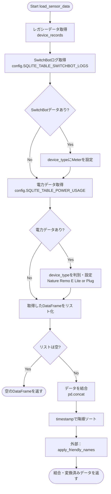

## 1. 解析メタ情報

| 項目 | 内容 |
| --- | --- |
| 対象ファイル | analysis_service.py |
| 言語 | Python |
| 解析対象 | 提供されたコードのみ |
| 推測・補完 | 一切なし |
| 解析基準コミット | `a4fb40f` |

## 関連ドキュメント

- [config.md](./config.md) — `SQLITE_DB_PATH`、`MONITOR_DEVICES`、各種`SQLITE_TABLE_*`などの設定値を提供する。
- [logger.md](./logger.md) — `setup_logging`の実装元。
- [dashboard.md](./dashboard.md) — 本ファイルの`load_*`関数群・`get_ngrok_url`/`get_disk_usage`/`get_memory_usage`/`get_system_logs`等を呼び出す主要な呼び出し元（Streamlitダッシュボード）。
- [database.md](./database.md) — 同じくSQLiteへの読み取りアクセスを提供するが、本ファイルは`get_ro_db_connection`による直接の`sqlite3.connect`を用いており、`database.md`が扱う`core/database.py`の`get_db_cursor`等とは別経路であることに留意。

## 2. ファイルの概要

* このファイルは、データベース（SQLite）やOSシステム情報（ディスク、メモリ、システムログ）、外部API（ngrok）からデータを取得し、Pandas DataFrame等を用いて加工・集計（タイムゾーン変換、デバイス名のマッピング、月額コスト計算など）を行うデータ分析・取得用のサービス層（Service層）を担っている。

## 3. 外部依存関係

### インポート一覧

| 名称 | 種類 | 用途 | 根拠 |
| --- | --- | --- | --- |
| `sqlite3` | 標準ライブラリ | SQLiteデータベースへの接続およびクエリ実行 | `import sqlite3` (行番号: 2 / 抜粋: "import sqlite3") |
| `shutil` | 標準ライブラリ | ディスク使用量の取得 | `import shutil` (行番号: 3 / 抜粋: "import shutil") |
| `subprocess` | 標準ライブラリ | OSコマンド（free, journalctl）の実行 | `import subprocess` (行番号: 4 / 抜粋: "import subprocess") |
| `requests` | サードパーティ | ngrokのローカルAPIへのHTTPリクエスト | `import requests` (行番号: 5 / 抜粋: "import requests") |
| `os` | 標準ライブラリ | 未使用（インポートのみ） | `import os` (行番号: 6 / 抜粋: "import os") |
| `datetime`, `timedelta`, `date` | 標準ライブラリ | 日付や時間の取得・計算 | `from datetime import ...` (行番号: 7 / 抜粋: "from datetime import datetime") |
| `pytz` | サードパーティ | タイムゾーンの指定 | `import pytz` (行番号: 8 / 抜粋: "import pytz") |
| `typing` | 標準ライブラリ | 型ヒントの定義 | `from typing import ...` (行番号: 9 / 抜粋: "from typing import Dict, List") |
| `pandas` as `pd` | サードパーティ | データの保持、加工、結合、集計 | `import pandas as pd` (行番号: 11 / 抜粋: "import pandas as pd") |
| `config` | 内部ファイル | 各種定数、テーブル名、デバイス定義の取得 | `import config` (行番号: 13 / 抜粋: "import config") |
| `core.logger` | 内部ファイル | ロガーのセットアップ | `from core.logger import setup_logging` (行番号: 14 / 抜粋: "from core.logger import setup_logging") |

### ブラックボックスとなる外部要素

| 名称 | 理由 | 根拠 |
| --- | --- | --- |
| `config` | ファイル内に定義がないため、`SQLITE_DB_PATH`や`MONITOR_DEVICES`などの具体的な値や構造が不明。 | `config.SQLITE_DB_PATH` (行番号: 38 / 抜粋: "config.SQLITE_DB_PATH") |
| `core.logger.setup_logging` | ファイル内に実装がないため、ログの出力先やフォーマットが不明。 | `setup_logging("analysis_service")` (行番号: 17 / 抜粋: "setup_logging("analysis_service")") |
| データベースの各種テーブル | スキーマ定義が提供されていないため、カラムの型や制約、インデックスの有無が不明。 | `SELECT * FROM {table_name}` (行番号: 155, 164, 349 / 抜粋: "SELECT * FROM {table_name}") |
| `home_system.service` | OSのSystemdサービス。具体的な動作や内容が不明。 | `journalctl -u home_system.service` (行番号: 451 / 抜粋: "home_system.service") |

## 4. 主要要素の定義（関数 / エンドポイント / コンポーネント）

### `get_ro_db_connection`

* **役割**: 読み取り専用でSQLiteデータベース接続を取得する。
* 根拠: `get_ro_db_connection` (行番号: 38 / 抜粋: "f"file:{config.SQLITE_DB_PATH}?mode=ro"")

* **引数/リクエスト**: なし
* 根拠: `def get_ro_db_connection() -> sqlite3.Connection:` (行番号: 32 / 抜粋: "def get_ro_db_connection()")

* **戻り値/レスポンス**: `sqlite3.Connection` (SQLiteの接続オブジェクト)
* 根拠: `-> sqlite3.Connection:` (行番号: 32 / 抜粋: "-> sqlite3.Connection:")

* **副作用**: 外部データベース（SQLiteファイル）への接続を開く。
* 根拠: `sqlite3.connect` (行番号: 37 / 抜粋: "sqlite3.connect(")

* **エラーハンドリング**: なし
* 根拠: 該当関数内に `try-except` なし (行番号: 32〜39 / 抜粋: "def get_ro_db_connection()")

### `_parse_timestamp_to_jst`

* **役割**: タイムスタンプ値をJSTの`pd.Timestamp`へ変換する。オフセット付き(aware)の値はそのオフセットを尊重してJSTへ変換し、tzinfoが無い(naive)値は保存規約(`core.utils.get_now_iso`)に合わせて「元からJSTで記録されている」とみなして`tz_localize`する（M-1-4: 以前は`process_dataframe`が`pd.to_datetime(..., utc=True)`で一律UTCとみなしていたため、tzinfoの無いレガシーレコードがグラフ・電気代集計で9時間ズレる原因になっていた）。
* 根拠: `_parse_timestamp_to_jst` のDocstring (行番号: 45〜50 / 抜粋: "pd.to_datetime(..., utc=True) で一律UTCとみなしていたため、tzinfoの無い")

* **引数/リクエスト**: `value`（型ヒントなし。タイムスタンプ文字列またはタイムスタンプ相当の値を想定）
* 根拠: `def _parse_timestamp_to_jst(value) -> pd.Timestamp:` (行番号: 41 / 抜粋: "def _parse_timestamp_to_jst(value) -> pd.Timestamp:")

* **戻り値/レスポンス**: `pd.Timestamp`（Asia/Tokyoにローカライズ/変換済み）
* 根拠: `-> pd.Timestamp:` (行番号: 41 / 抜粋: "-> pd.Timestamp:")

* **副作用**: なし
* 根拠: `ts = pd.Timestamp(value)` で新規オブジェクトを生成するのみ (行番号: 52 / 抜粋: "ts = pd.Timestamp(value)")

* **エラーハンドリング**: なし（`pd.Timestamp(value)`が不正な値でパースに失敗した場合の例外は本関数内で捕捉されず、呼び出し元に伝播する）
* 根拠: 該当関数内に `try-except` なし (行番号: 41〜55 / 抜粋: "def _parse_timestamp_to_jst(value) -> pd.Timestamp:")

### `process_dataframe`

* **役割**: DataFrameの `timestamp` カラムの各値を `_parse_timestamp_to_jst` に通し、日本時間（Asia/Tokyo）に変換する。
* 根拠: `process_dataframe` (行番号: 65 / 抜粋: "df["timestamp"] = df["timestamp"].apply(_parse_timestamp_to_jst)")

* **引数/リクエスト**: `df` (`pd.DataFrame`): 処理対象のデータフレーム
* 根拠: `df: pd.DataFrame` (行番号: 58 / 抜粋: "def process_dataframe(df: pd.DataFrame)")

* **戻り値/レスポンス**: `pd.DataFrame` (変換後のデータフレーム)
* 根拠: `-> pd.DataFrame` (行番号: 58 / 抜粋: "-> pd.DataFrame:")

* **副作用**: なし
* 根拠: `df = df.copy()` でコピーを作成し副作用を回避 (行番号: 63 / 抜粋: "df = df.copy()")

* **エラーハンドリング**: なし（内部で呼び出す`_parse_timestamp_to_jst`が例外を送出した場合、`.apply()`経由で呼び出し元に伝播する）
* 根拠: 該当関数内に `try-except` なし (行番号: 58〜67 / 抜粋: "def process_dataframe(")

### `apply_friendly_names`

* **役割**: DataFrameのデバイスID等から表示名（`friendly_name`）や場所（`location`）をマッピングし、特定の名称を置換する。
* 根拠: `apply_friendly_names` (行番号: 102 / 抜粋: "df["friendly_name"] = df["device_id"].map(id_map)")

* **引数/リクエスト**: `df` (`pd.DataFrame`): 処理対象のデータフレーム
* 根拠: `df: pd.DataFrame` (行番号: 69 / 抜粋: "def apply_friendly_names(df: pd.DataFrame)")

* **戻り値/レスポンス**: `pd.DataFrame` (マッピング適用後のデータフレーム)
* 根拠: `-> pd.DataFrame` (行番号: 69 / 抜粋: "-> pd.DataFrame:")

* **副作用**: なし
* 根拠: `df = df.copy()` でコピーを作成 (行番号: 74 / 抜粋: "df = df.copy()")

* **エラーハンドリング**: DBの最新デバイス名からのマッピング上書き時に例外をキャッチしログを出力。
* 根拠: `try ... except Exception as e:` (行番号: 98 / 抜粋: "except Exception as e:")

### `load_data_from_db`

* **役割**: 汎用的なSQLクエリを実行し、結果をDataFrameとしてロード。指定された日付カラムを `timestamp` として処理関数に通す。
* 根拠: `load_data_from_db` (行番号: 122 / 抜粋: "df = pd.read_sql_query(query, conn)")

* **引数/リクエスト**: `query` (`str`): 実行するSQL。`date_column` (`str`, デフォルト `"timestamp"`): 日付対象のカラム名。
* 根拠: `query: str, date_column: str = "timestamp"` (行番号: 117 / 抜粋: "query: str, date_column: str = "timestamp"")

* **戻り値/レスポンス**: `pd.DataFrame` (取得したデータのデータフレーム)
* 根拠: `-> pd.DataFrame:` (行番号: 117 / 抜粋: "-> pd.DataFrame:")

* **副作用**: データベースの読み取り操作。
* 根拠: `get_ro_db_connection()` (行番号: 121 / 抜粋: "conn = get_ro_db_connection()")

* **エラーハンドリング**: 例外をキャッチしてエラーログを出力し、空のDataFrameを返す。`finally`でDB接続を確実に閉じる。
* 根拠: `except Exception as e:` および `finally:` (行番号: 134〜139 / 抜粋: "finally:")

### `load_nas_status`

* **役割**: データベースからNASの最新状態を1件取得する。
* 根拠: `load_nas_status` (行番号: 155 / 抜粋: "ORDER BY timestamp DESC LIMIT 1")

* **引数/リクエスト**: なし
* 根拠: `def load_nas_status() -> Optional[pd.Series]:` (行番号: 145 / 抜粋: "def load_nas_status()")

* **戻り値/レスポンス**: `Optional[pd.Series]` (最新の1件。存在しない場合は `None`)
* 根拠: `-> Optional[pd.Series]:` (行番号: 145 / 抜粋: "-> Optional[pd.Series]:")

* **副作用**: データベースの読み取り操作。
* 根拠: `get_ro_db_connection()` (行番号: 149 / 抜粋: "with get_ro_db_connection() as conn:")

* **エラーハンドリング**: 例外発生時はエラーログを出力し `None` を返す。
* 根拠: `except Exception as e:` (行番号: 159 / 抜粋: "logger.error(f"NAS Data Load Error: {e}")")

### `load_generic_data`

* **役割**: 指定したテーブルから汎用的に最新のデータを取得する。
* 根拠: `load_generic_data` (行番号: 164 / 抜粋: "query = f"SELECT * FROM {table_name}")

* **引数/リクエスト**: `table_name` (`str`): テーブル名。`limit` (`int`, デフォルト `500`): 取得件数。
* 根拠: `table_name: str, limit: int = 500` (行番号: 162 / 抜粋: "table_name: str, limit: int = 500")

* **戻り値/レスポンス**: `pd.DataFrame` (取得したデータのデータフレーム)
* 根拠: `-> pd.DataFrame:` (行番号: 162 / 抜粋: "-> pd.DataFrame:")

* **副作用**: データベースの読み取り操作。
* 根拠: `load_data_from_db(query)` を呼び出し。 (行番号: 165 / 抜粋: "return load_data_from_db(query)")

* **エラーハンドリング**: 内部で呼び出される `load_data_from_db` に依存。
* 根拠: `return load_data_from_db(query)` (行番号: 165 / 抜粋: "return load_data_from_db(query)")

### `load_sensor_data`

* **役割**: `device_records`、SwitchBotのログ、電力使用量の3つのテーブルからデータを取得・統合・ソートし、表示名を適用する。電力使用量(`config.SQLITE_TABLE_POWER_USAGE`)由来の行は、`device_name`に`"Remo"`を含めば`device_type="Nature Remo E Lite"`(スマートメーター全体消費)、含まなければ`device_type="Plug"`(個別家電)として分類される。**（Issue #169で解消）** 以前はこの分類直後に`.replace("Plug", "Nature Remo E Lite")`が実行されており、"Plug"に分類された全行が無条件で"Nature Remo E Lite"へ上書きされていた(`str.contains("Plug")`で個別家電を絞り込む`views/dashboard/sensor_tab.py`側のフィルタが構造的に一致しなくなり、個別家電グラフが常に空になる・全プラグの消費電力がスマートメーター全体消費のグラフへ混入する不具合)。この一括置換は削除され、"Remo"を含むかどうかの判定結果がそのまま最終的な`device_type`になる。
* 根拠: `load_sensor_data` (行番号: 217 / 抜粋: "df_merged = pd.concat(df_list, ignore_index=True)")、`device_type`分類 (行番号: 202〜205 / 抜粋: "df_power[\"device_type\"] = df_power[\"device_name\"].apply(\n            lambda x: \"Nature Remo E Lite\" if x and \"Remo\" in str(x) else \"Plug\"\n        )")

* **引数/リクエスト**: `limit` (`int`, デフォルト `5000`): 取得件数の上限。
* 根拠: `limit: int = 5000` (行番号: 167 / 抜粋: "def load_sensor_data(limit: int = 5000)")

* **戻り値/レスポンス**: `pd.DataFrame` (統合されたセンサーデータのデータフレーム)
* 根拠: `-> pd.DataFrame:` (行番号: 167 / 抜粋: "-> pd.DataFrame:")

* **副作用**: データベースの読み取り操作。
* 根拠: `load_data_from_db` を複数回呼び出し。 (行番号: 180 / 抜粋: "df_legacy = load_data_from_db(query_legacy)")

* **エラーハンドリング**: 内部で呼び出される `load_data_from_db` に依存。
* 根拠: 該当関数内に独自の `try-except` なし (行番号: 167 / 抜粋: "def load_sensor_data(")

### `calculate_monthly_cost_cumulative`

* **役割**: 当月の電力使用量データから、今月の電気代概算（kwh * 31）を算出する。新テーブルが空なら旧テーブルへフォールバックする。**（Issue #170で修正）** `power_usage`テーブルにはスマートメーター(全体消費)と各プラグ(個別家電。既にスマートメーターの計測値に含まれる部分集合)が同居しているため、新テーブル側のSELECTに`device_name LIKE '%Remo%'`条件を追加し(`load_sensor_data`の`"Remo"`部分一致による分類基準と同一)、スマートメーターの行のみを対象にするよう修正した(以前は全デバイスを無差別に合算しておりプラグ分が二重計上されていた)。また、`time_diff`(経過時間)の算出を`device_id`ごとにグループ化してから`diff()`を取るよう変更した(以前は時系列でソートしただけの全行に対しdiff()を取っており、複数拠点のスマートメーター等、直前行が別デバイスの場合に誤った時間幅が使われていた)。
* 根拠: `calculate_monthly_cost_cumulative` (行番号: 224〜271 / 抜粋: "return int(df["kwh"].sum() * 31)")、デバイス絞り込み (行番号: 230〜236 / 抜粋: "WHERE timestamp >= '{start_of_month}' AND device_name LIKE '%Remo%'")、device_idごとのグループ化 (行番号: 260〜264 / 抜粋: "df.groupby(\"device_id\", dropna=False)[\"timestamp\"].diff()")

* **引数/リクエスト**: なし
* 根拠: `def calculate_monthly_cost_cumulative() -> int:` (行番号: 224 / 抜粋: "def calculate_monthly_cost_cumulative()")

* **戻り値/レスポンス**: `int` (計算された電気代概算)
* 根拠: `-> int:` (行番号: 224 / 抜粋: "-> int:")

* **副作用**: データベースの読み取り操作。
* 根拠: `load_data_from_db(query)` を呼び出し。 (行番号: 242 / 抜粋: "df = load_data_from_db(query)")

* **エラーハンドリング**: 例外発生時はエラーログを出力し `0` を返す。
* 根拠: `except Exception as e:` (行番号: 269〜271 / 抜粋: "return 0")

### `load_weather_history`

* **役割**: 指定された日数分、指定された場所（デフォルトは伊丹）の天気履歴を取得する。
* 根拠: `load_weather_history` (行番号: 266 / 抜粋: "FROM weather_history")

* **引数/リクエスト**: `days` (`int`, デフォルト `40`): 遡る日数。`location` (`str`, デフォルト `"伊丹"`): 取得対象の場所。
* 根拠: `days: int = 40, location: str = "伊丹"` (行番号: 262 / 抜粋: "days: int = 40, location: str = "伊丹"")

* **戻り値/レスポンス**: `pd.DataFrame` (天気履歴のデータフレーム)
* 根拠: `-> pd.DataFrame:` (行番号: 262 / 抜粋: "-> pd.DataFrame:")

* **副作用**: データベースの読み取り操作。
* 根拠: `pd.read_sql_query(query, conn)` (行番号: 271 / 抜粋: "df = pd.read_sql_query(query, conn)")

* **エラーハンドリング**: 例外発生時はエラーログを出力し空のデータフレームを返す。`finally`で接続を閉じる。
* 根拠: `except Exception as e:` (行番号: 275 / 抜粋: "return pd.DataFrame()")

### `load_yearly_temperature_stats`

* **役割**: 指定年の天気履歴（外気温）と室内センサーログ（室温）の日次最小・最大統計を取得し、マージして返す。
* 根拠: `load_yearly_temperature_stats` (行番号: 331 / 抜粋: "df_merged = pd.merge(df_weather, df_sensor, on="date"")

* **引数/リクエスト**: `year` (`int`): 対象年。`location` (`str`, デフォルト `"伊丹"`): 対象場所。
* 根拠: `year: int, location: str = "伊丹"` (行番号: 279 / 抜粋: "year: int, location: str = "伊丹"")

* **戻り値/レスポンス**: `pd.DataFrame` (マージされた統計データのデータフレーム)
* 根拠: `-> pd.DataFrame:` (行番号: 279 / 抜粋: "-> pd.DataFrame:")

* **副作用**: データベースの読み取り操作。
* 根拠: `pd.read_sql_query` (行番号: 291 / 抜粋: "df_weather = pd.read_sql_query(q_weather, conn)")

* **エラーハンドリング**: 各クエリ実行ごとに `try-except` で回避処理。全体の例外発生時はエラーログを出力し空のデータフレームを返す。`finally`で接続を閉じる。
* 根拠: `try: df_new = pd.read_sql_query(q_new, conn) except: pass` 等 (行番号: 314, 318 / 抜粋: "except: pass")

### `load_bicycle_data`

* **役割**: 駐輪場データを取得する。対象テーブルが存在するか事前に検証する。
* 根拠: `load_bicycle_data` (行番号: 349 / 抜粋: "SELECT * FROM {table_name}")

* **引数/リクエスト**: `limit` (`int`, デフォルト `2000`): 取得件数の上限。
* 根拠: `limit: int = 2000` (行番号: 340 / 抜粋: "limit: int = 2000")

* **戻り値/レスポンス**: `pd.DataFrame` (駐輪場データのデータフレーム)
* 根拠: `-> pd.DataFrame:` (行番号: 340 / 抜粋: "-> pd.DataFrame:")

* **副作用**: データベースの読み取り操作。
* 根拠: `load_data_from_db(query)` (行番号: 350 / 抜粋: "return load_data_from_db(query)")

* **エラーハンドリング**: 例外発生時はエラーログを出力し空のデータフレームを返す。
* 根拠: `except Exception as e:` (行番号: 353 / 抜粋: "return pd.DataFrame()")

### `load_ai_report`

* **役割**: データベースから最新のAIレポートを1件取得する。
* 根拠: `load_ai_report` (行番号: 357 / 抜粋: "ORDER BY id DESC LIMIT 1")

* **引数/リクエスト**: なし
* 根拠: `def load_ai_report() -> Optional[pd.Series]:` (行番号: 355 / 抜粋: "def load_ai_report()")

* **戻り値/レスポンス**: `Optional[pd.Series]` (最新の1件。存在しない場合は `None`)
* 根拠: `-> Optional[pd.Series]:` (行番号: 355 / 抜粋: "-> Optional[pd.Series]:")

* **副作用**: データベースの読み取り操作。
* 根拠: `load_data_from_db(query)` (行番号: 358 / 抜粋: "df = load_data_from_db(query)")

* **エラーハンドリング**: 内部で呼び出される `load_data_from_db` に依存。
* 根拠: 該当関数内に独自の `try-except` なし (行番号: 355 / 抜粋: "def load_ai_report()")

### `load_ranking_dates`

* **役割**: アプリランキング（`app_rankings`）テーブルに存在する日付のリストを重複なしで降順で取得する。
* 根拠: `load_ranking_dates` (行番号: 368 / 抜粋: "SELECT DISTINCT date FROM app_rankings ORDER BY date DESC")

* **引数/リクエスト**: `limit` (`int`, デフォルト `3`): 取得する日付の数。
* 根拠: `limit: int = 3` (行番号: 361 / 抜粋: "limit: int = 3")

* **戻り値/レスポンス**: `List[str]` (日付の文字列リスト)
* 根拠: `-> List[str]:` (行番号: 361 / 抜粋: "-> List[str]:")

* **副作用**: データベースの読み取り操作。
* 根拠: `pd.read_sql_query(query, conn)` (行番号: 369 / 抜粋: "df = pd.read_sql_query(query, conn)")

* **エラーハンドリング**: 例外発生時はエラーログを出力し空のリストを返す。
* 根拠: `except Exception as e:` (行番号: 373 / 抜粋: "return []")

### `load_ranking_data`

* **役割**: 特定日付とランキングタイプに応じたランキングデータを取得する。
* 根拠: `load_ranking_data` (行番号: 378 / 抜粋: "SELECT rank, title, app_id FROM app_rankings")

* **引数/リクエスト**: `date_str` (`str`): 対象日付。`ranking_type` (`str`): ランキングの種別。
* 根拠: `date_str: str, ranking_type: str` (行番号: 375 / 抜粋: "date_str: str, ranking_type: str")

* **戻り値/レスポンス**: `pd.DataFrame` (ランキングデータのデータフレーム)
* 根拠: `-> pd.DataFrame:` (行番号: 375 / 抜粋: "-> pd.DataFrame:")

* **副作用**: データベースの読み取り操作。
* 根拠: `pd.read_sql_query(query, conn)` (行番号: 384 / 抜粋: "return pd.read_sql_query(query, conn)")

* **エラーハンドリング**: 例外発生時はエラーログを出力し空のデータフレームを返す。`finally`で接続を閉じる。
* 根拠: `except Exception as e:` (行番号: 387 / 抜粋: "return pd.DataFrame()")

### `get_ngrok_url`

* **役割**: ngrokのローカルAPI（ポート4040）を叩き、公開されているURL（8000ポート/8501ポート対応）を取得する。
* 根拠: `get_ngrok_url` (行番号: 398 / 抜粋: "res = requests.get("[http://127.0.0.1:4040/api/tunnels](http://127.0.0.1:4040/api/tunnels)"")

* **引数/リクエスト**: なし
* 根拠: `def get_ngrok_url() -> Dict[str, str]:` (行番号: 395 / 抜粋: "def get_ngrok_url()")

* **戻り値/レスポンス**: `Dict[str, str]` (`server` や `dashboard` をキーとしたURLの辞書)
* 根拠: `-> Dict[str, str]:` (行番号: 395 / 抜粋: "-> Dict[str, str]:")

* **副作用**: 外部API（`http://127.0.0.1:4040/api/tunnels`）へのHTTP GETリクエストの実行。
* 根拠: `requests.get` (行番号: 398 / 抜粋: "requests.get(")

* **エラーハンドリング**: 例外発生時（接続エラー等）はエラーを握り潰して空の辞書を返す。
* 根拠: `except Exception: pass` (行番号: 409 / 抜粋: "except Exception:")

### `get_disk_usage`

* **役割**: ルートディレクトリ（`/`）のディスク使用量（全体、使用済、空き、使用率）を取得する。
* 根拠: `get_disk_usage` (行番号: 416 / 抜粋: "total, used, free = shutil.disk_usage("/")")

* **引数/リクエスト**: なし
* 根拠: `def get_disk_usage() -> Optional[Dict[str, float]]:` (行番号: 413 / 抜粋: "def get_disk_usage()")

* **戻り値/レスポンス**: `Optional[Dict[str, float]]` (GB単位の容量とパーセンテージを格納した辞書。失敗時は `None`)
* 根拠: `-> Optional[Dict[str, float]]:` (行番号: 413 / 抜粋: "-> Optional[Dict[str, float]]:")

* **副作用**: OSファイルシステムのディスク容量読み取り。
* 根拠: `shutil.disk_usage("/")` (行番号: 416 / 抜粋: "shutil.disk_usage("/")")

* **エラーハンドリング**: 例外発生時はエラーログを出力し `None` を返す。
* 根拠: `except Exception as e:` (行番号: 425 / 抜粋: "return None")

### `get_memory_usage`

* **役割**: OSの `free -m` コマンドを実行し、結果をパースしてメモリの使用状況を取得する。
* 根拠: `get_memory_usage` (行番号: 430 / 抜粋: "subprocess.run(["free", "-m"], capture_output=True")

* **引数/リクエスト**: なし
* 根拠: `def get_memory_usage() -> Optional[Dict[str, float]]:` (行番号: 427 / 抜粋: "def get_memory_usage()")

* **戻り値/レスポンス**: `Optional[Dict[str, float]]` (MB単位の容量とパーセンテージを格納した辞書。失敗時は `None`)
* 根拠: `-> Optional[Dict[str, float]]:` (行番号: 427 / 抜粋: "-> Optional[Dict[str, float]]:")

* **副作用**: OSコマンド（`free`）の実行。
* 根拠: `subprocess.run` (行番号: 430 / 抜粋: "subprocess.run(["free", "-m"]")

* **エラーハンドリング**: 例外発生時はエラーログを出力し `None` を返す。
* 根拠: `except Exception as e:` (行番号: 446 / 抜粋: "return None")

### `get_system_logs`

* **役割**: OSの `journalctl` コマンドを実行し、`home_system.service` のシステムログを取得する。
* 根拠: `get_system_logs` (行番号: 451 / 抜粋: "cmd = ["journalctl", "-u", "home_system.service"")

* **引数/リクエスト**: `lines` (`int`, デフォルト `50`): 行数。`priority` (`Optional[str]`): ログの優先度。`target_date` (`Optional[date]`): 対象日付。
* 根拠: `lines: int = 50, priority: Optional[str] = None, target_date: Optional[date] = None` (行番号: 448 / 抜粋: "lines: int = 50, priority: Optional[str] = None")

* **戻り値/レスポンス**: `str` (取得したログの文字列。失敗時はエラーメッセージの文字列)
* 根拠: `-> str:` (行番号: 448 / 抜粋: "-> str:")

* **副作用**: OSコマンド（`journalctl`）の実行。
* 根拠: `subprocess.run` (行番号: 461 / 抜粋: "subprocess.run(cmd")

* **エラーハンドリング**: 例外発生時はエラーメッセージを文字列として返す。
* 根拠: `except Exception as e:` (行番号: 464 / 抜粋: "return f"ログ取得エラー: {e}"")

## 5. 処理フロー図

以下は、3つのテーブルからデータを取得・統合する `load_sensor_data` の主要フローです。

```mermaid
flowchart TD
    Start([Start load_sensor_data]) --> Q1[レガシーデータ取得<br/>device_records]
    Q1 --> Q2[SwitchBotログ取得<br/>config.SQLITE_TABLE_SWITCHBOT_LOGS]
    Q2 --> C1{SwitchBotデータあり?}
    C1 -- Yes --> SetT1[device_typeにMeterを設定]
    C1 -- No --> Q3[電力データ取得<br/>config.SQLITE_TABLE_POWER_USAGE]
    SetT1 --> Q3
    Q3 --> C2{電力データあり?}
    C2 -- Yes --> SetT2[device_typeを判別・設定<br/>Nature Remo E Lite or Plug]
    C2 -- No --> Merge[取得したDataFrameをリスト化]
    SetT2 --> Merge
    Merge --> C3{リストは空?}
    C3 -- Yes --> ReturnEmpty([空のDataFrameを返す])
    C3 -- No --> Concat[データを結合<br/>pd.concat]
    Concat --> Sort[timestampで降順ソート]
    Sort --> Apply[外部：apply_friendly_names]
    Apply --> Return([結合・変換済みデータを返す])

```

## 6. 依存関係図

ファイル内の主要要素および外部要素との依存関係です。

```mermaid
graph TD
    subgraph External
        SQLite[(SQLite Database)]
        OS[OS System / Commands]
        Ngrok[ngrok API]
        Config[config module]
        Pandas[pandas]
    end

    subgraph Database Helpers
        GetConn["get_ro_db_connection()"]
        ProcessDF["process_dataframe()"]
        ApplyNames["apply_friendly_names()"]
        LoadDB["load_data_from_db()"]
    end

    subgraph Data Fetching Methods
        LoadNAS["load_nas_status()"]
        LoadGen["load_generic_data()"]
        LoadSen["load_sensor_data()"]
        CalcCost["calculate_monthly_cost_cumulative()"]
        LoadWea["load_weather_history()"]
        LoadYearly["load_yearly_temperature_stats()"]
        LoadBike["load_bicycle_data()"]
        LoadAI["load_ai_report()"]
        LoadRankD["load_ranking_dates()"]
        LoadRankData["load_ranking_data()"]
    end

    subgraph System Stats & Utils
        GetNgrok["get_ngrok_url()"]
        GetDisk["get_disk_usage()"]
        GetMem["get_memory_usage()"]
        GetLogs["get_system_logs()"]
    end

    %% Dependencies
    GetConn --> SQLite
    GetConn --> Config
    ApplyNames --> Config
    ProcessDF --> Pandas
    LoadDB --> GetConn
    LoadDB --> ProcessDF

    LoadNAS --> LoadDB
    LoadNAS --> Config
    LoadGen --> LoadDB
    LoadSen --> LoadDB
    LoadSen --> ApplyNames
    LoadSen --> Config
    LoadSen --> Pandas
    CalcCost --> LoadDB
    CalcCost --> Config
    CalcCost --> Pandas
    LoadWea --> GetConn
    LoadYearly --> GetConn
    LoadYearly --> Config
    LoadBike --> LoadDB
    LoadAI --> LoadDB
    LoadRankD --> GetConn
    LoadRankData --> GetConn

    GetNgrok --> Ngrok
    GetDisk --> OS
    GetMem --> OS
    GetLogs --> OS

```

## 7. 次のステップ（リバースエンジニアリングの提案）

| 優先度 | ファイル名(推測可) | 理由 | 根拠 |
| --- | --- | --- | --- |
| 高 | `config.py` | データベースのパス(`SQLITE_DB_PATH`)や、テーブル名、デバイスのマッピング情報(`MONITOR_DEVICES`)が定義されており、これがないと正確なデータ構造や参照先が判明しないため。 | `config.SQLITE_DB_PATH`, `config.MONITOR_DEVICES` など多数の参照 (行番号: 13 / 抜粋: "import config") |
| 中 | データベースのスキーマ定義ファイル（または実際のSQLiteファイル） | `device_records`, `weather_history`, `app_rankings` など、複数のテーブルのカラム構造を把握しなければ、他サービスとの連携仕様が掴めないため。 | 各SQLクエリ内の `SELECT` 対象 (行番号: 266, 288 / 抜粋: "FROM weather_history") |
| 低 | `core/logger.py` | ログの出力先、レベル（INFO, ERRORなど）、ローテーションルールを確認し、運用時の障害調査手法を確立するため。 | `setup_logging("analysis_service")` (行番号: 14 / 抜粋: "from core.logger import setup_logging") |

## 8. 保守上の注意点

* `process_dataframe` は `timestamp` カラムの各値へ `_parse_timestamp_to_jst` を `.apply()` で1件ずつ適用する実装であり、ベクトル化された `pd.to_datetime` に比べて大量データでは処理速度が低下する可能性がある。また `_parse_timestamp_to_jst` はtzinfoの無い(naive)値を常にJST（`core.utils.get_now_iso`の保存規約）とみなして`tz_localize`するため、万一この規約に反してUTC等の別タイムゾーンでnaiveなタイムスタンプが書き込まれるテーブル・経路が将来的に生まれた場合、9時間のズレが再発する（M-1-4でUTC一律解釈からJST一律解釈に変更されたことに伴う新たな前提）。
* `calculate_monthly_cost_cumulative` では、直近データ間の差分（`time_diff`）が1.0時間以内のものだけを抽出し、その総和に一律で `31` を掛けて月額概算を算出しているため、月の実際の稼働日数や欠損データの有無によって計算結果がブレる可能性がある。
* **（Issue #170で解消）デバイス混在によるtime_diffの誤算出**: 以前は`power_usage`テーブルの全デバイス(スマートメーター+各プラグ)の行を無差別にSELECTし、`device_id`でグループ化せず時系列のまま`diff()`を取っていたため、(1)プラグの消費電力がスマートメーターの計測値へ二重計上され、(2)複数拠点のスマートメーター等が交互に記録された場合に直前行が別デバイスとなり誤った時間幅が使われる、という2つの系統的な計算誤差があった。現在はSQL側で`device_name LIKE '%Remo%'`によりスマートメーターの行のみに絞り、`time_diff`の算出も`device_id`ごとにグループ化してから行う。`weekly_analyze_report.get_analysis_data`の電気代算出(`SELECT AVG(wattage)`)にも同様の問題があり、同じ`device_name LIKE '%Remo%'`条件で修正済み。
* `get_memory_usage` は `subprocess.run(["free", "-m"])` の出力を文字列分割でパースしているため、OSのディストリビューションやバージョン変更により `free` コマンドの出力形式が変わると `IndexError` 等が発生するリスクがある。
* `get_system_logs` で `subprocess.run` に引数を渡す際、`target_date` などが外部から未検証のまま渡されると意図しないコマンド引数として解釈される可能性がある。
* SQLiteの接続時に `?mode=ro` (Read Only) と URI オプションを使用しているため、SQLiteのバージョンやコンパイルオプションによっては URI がサポートされず接続エラーになる可能性がある。

## 9. 不明事項一覧

| 項目 | 理由 | 必要なファイル |
| --- | --- | --- |
| デバイス情報の詳細 | `config.MONITOR_DEVICES` の内部構造が不明なため、どのようなデバイスがマッピング対象になるかが完全に特定できない。 | `config.py` |
| 各種テーブルのスキーマ | `device_records`, `weather_history`, `app_rankings` 等のテーブル構造定義がないため、各カラムのデータ型や制約が不明。 | DBスキーマ定義ファイルまたは実際のSQLiteファイル |
| NASのテーブル名 | `getattr(config, "SQLITE_TABLE_NAS", "nas_records")` とされており、本番環境で動的にどちらが使われるか不明。 | `config.py` |
| 駐輪場データのテーブル名 | `getattr(config, "SQLITE_TABLE_BICYCLE", "bicycle_parking_records")` とされており、設定値が不明。 | `config.py` |
| Systemdサービスの詳細 | `home_system.service` の実体が不明なため、このサービスが何を出力しているのか不明。（リポジトリ内を`*.service`・`*.timer`等で検索したが該当するSystemdユニット定義ファイルは見つからず、解消不可） | OSのSystemdサービス定義ファイル |

## 相互参照による補足情報

| 元の不明事項 | 判明した内容 | 参照元ドキュメント |
| --- | --- | --- |
| デバイス情報の詳細 | `MY_HOME_SYSTEM/config.py`を直接確認したところ、`MONITOR_DEVICES`は`devices.json`（`DEVICES_JSON_PATH`、`config.py:232`）の`monitor_devices`キーを`DeviceConfig`Pydanticモデル（`config.py:160〜165`）でバリデーションし`model_dump()`した辞書のリストであることが判明した。`DeviceConfig`のフィールドは`id: str`, `type: str`, `location: str`, `name: str`, `notify_settings: NotifySettings`（デフォルトは`NotifySettings()`）であり、これは`analysis_service.py`側の`apply_friendly_names`が参照する`d["id"]`, `d.get("name", d["id"])`, `d.get("location", "その他")`という辞書アクセスと矛盾なく整合することを確認した。ただし`devices.json`自体（実際に登録されているデバイスの一覧データ）はリポジトリ内に見つからず、実データの内容は依然として不明である。 | 直接ソース確認: `MY_HOME_SYSTEM/config.py:160〜165, 232, 296〜313` |
| 各種テーブルのスキーマ | `MY_HOME_SYSTEM/current_schema.sql`を直接確認したところ、本ファイルが参照する主要テーブルのスキーマが判明した。`device_records`（1〜16行目）: `id INTEGER PRIMARY KEY AUTOINCREMENT`, `timestamp DATETIME NOT NULL`, `device_name/device_id/device_type TEXT NOT NULL`, `power_watts/temperature_celsius/humidity_percent REAL`, `contact_state/movement_state/brightness_state/hub_onoff/cam_onoff TEXT`, `threshold_watts REAL`, `battery_level INTEGER`。`weather_history`（107〜118行目）: `id INTEGER PRIMARY KEY AUTOINCREMENT`, `date TEXT NOT NULL`, `location TEXT DEFAULT '伊丹'`, `min_temp/max_temp REAL`, `weather_desc TEXT`, `max_pop INTEGER`, `umbrella_level TEXT`, `recorded_at TEXT`, `UNIQUE(date, location)`。`app_rankings`（119〜131行目）: `id INTEGER PRIMARY KEY AUTOINCREMENT`, `date TEXT NOT NULL`, `ranking_type TEXT`（'free'または'grossing'とコメントあり）, `rank INTEGER`, `app_id/title/developer/icon_url TEXT`, `score REAL`, `recorded_at TEXT`, `UNIQUE(date, ranking_type, rank)`。加えて`bicycle_parking_records`（132〜138行目）と`nas_records`（152〜163行目）のスキーマも確認でき、これらはそれぞれ`analysis_service.py`の`load_bicycle_data`・`load_nas_status`が発行する`SELECT * FROM {table_name}`クエリの対象カラムと整合する。 | 直接ソース確認: `MY_HOME_SYSTEM/current_schema.sql:1〜16, 107〜118, 119〜131, 132〜138, 152〜163` |
| NASのテーブル名 | `MY_HOME_SYSTEM/config.py:249`を直接確認したところ、`SQLITE_TABLE_NAS: str = "nas_records"`とハードコードされた文字列定数として定義されている（環境変数からの読み込みではない）。`analysis_service.py`側の`getattr(config, "SQLITE_TABLE_NAS", "nas_records")`のデフォルト値と完全に一致しており、本番環境でも常に`"nas_records"`が使われることが確定した。 | 直接ソース確認: `MY_HOME_SYSTEM/config.py:249` |
| 駐輪場データのテーブル名 | `MY_HOME_SYSTEM/config.py:250`を直接確認したところ、`SQLITE_TABLE_BICYCLE: str = "bicycle_parking_records"`とハードコードされた文字列定数として定義されている。`analysis_service.py`側の`getattr(config, "SQLITE_TABLE_BICYCLE", "bicycle_parking_records")`のデフォルト値と完全に一致しており、本番環境でも常に`"bicycle_parking_records"`が使われることが確定した。 | 直接ソース確認: `MY_HOME_SYSTEM/config.py:250` |

## 10. 自己検証結果

* [x] 推測・外部ファイルの仕様を一切含んでいない
* [x] 全関数・全クラス・全コンポーネントを列挙した
* [x] 全てのインポート要素を列挙した
* [x] すべての仕様説明に「根拠（行番号・抜粋）」を明記した
* [x] 根拠漏れが0件である
* [x] Mermaid構文にエラーの原因となる記号（エスケープ漏れ）がない
* [x] 不明事項を漏れなく列挙した

完了