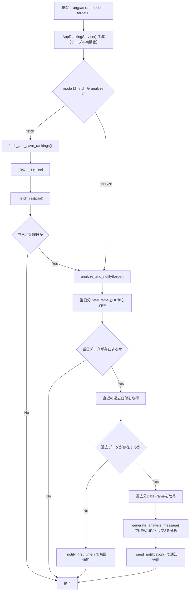
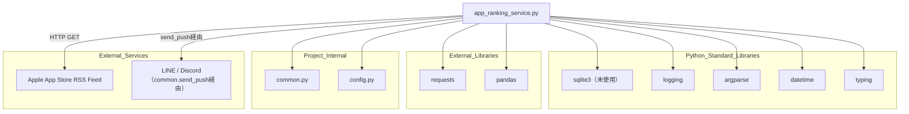

## 1. 解析メタ情報

| 項目 | 内容 |
| --- | --- |
| 対象ファイル | app_ranking_service.py |
| 言語 | Python |
| 解析対象 | 提供されたコードのみ |
| 推測・補完 | 一切なし |

## 関連ドキュメント

- [common.md](./common.md) — `get_db_cursor`, `send_push`, `get_now_iso` を再エクスポートするFacadeモジュール
- [config.md](./config.md) — `LINE_USER_ID`設定値を提供
- [database.md](./database.md) — `common.get_db_cursor` の実体
- [notification_service.md](./notification_service.md) — `common.send_push` の実体
- [weekly_analyze_report.md](./weekly_analyze_report.md) — 週次分析・通知を行う類似構成の関連モジュール（直接のimport関係はなし）

## 2. ファイルの概要

`AppRankingService`クラスは、Apple App Store公式RSSフィード（無料/有料 各トップ50）から日次のアプリランキング情報を取得してSQLiteに保存し、前回保存日との比較分析（新着・急上昇・トップ3）を行った上でLINE/Discordへ通知するサービスである。クラスのdocstringには「安定性確保のためApple App Storeの公式RSSフィードを使用する」旨が明記されている。
根拠: [AppRankingServiceクラスdocstring] (行番号: 17〜21 / 抜粋: "※安定性確保のため、Apple App Storeの公式RSSフィードを使用します。")

`__main__`ブロックは`argparse`で`--mode`（`fetch`または`analyze`、デフォルト`fetch`）と`--target`（デフォルト`discord`）を受け取り、`fetch`モードでは取得後、当日が金曜日（`weekday()==4`）の場合のみ分析・通知も追加実行する。
根拠: [__main__ブロック] (行番号: 294〜309 / 抜粋: "if datetime.now().weekday() == 4:")

分析処理（`analyze_and_notify`）はPandasの`DataFrame`を用いて当日データと直近の過去データを比較し、新着アプリ・急上昇アプリ（3ランク以上上昇）・無料トップ3を抽出したメッセージを生成する。
根拠: [_generate_analysis_message] (行番号: 220〜267 / 抜粋: "up_apps = up_apps[up_apps['rank_diff'] >= 3] # 3ランク以上アップ")

## 3. 外部依存関係

### インポート一覧

| 名称 | 種類 | 用途 | 根拠 |
| --- | --- | --- | --- |
| `sqlite3` | 標準ライブラリ | インポートされているが本ファイル内での使用箇所なし（DBアクセスは`common.get_db_cursor`経由） | 根拠: [import sqlite3] (行番号: 2 / 抜粋: "import sqlite3") |
| `logging` | 標準ライブラリ | `logging.getLogger`によるロガー取得（`common.setup_logging`は使用していない） | 根拠: [import logging] (行番号: 3 / 抜粋: "import logging") |
| `argparse` | 標準ライブラリ | CLI実行時の`--mode`/`--target`引数解析 | 根拠: [import argparse] (行番号: 4 / 抜粋: "import argparse") |
| `requests` | 外部ライブラリ | Apple App Store RSSフィード(JSON)へのHTTP GETリクエスト送信 | 根拠: [import requests] (行番号: 5 / 抜粋: "import requests") |
| `datetime.datetime` | 標準ライブラリ | 実行日の文字列化、曜日判定（金曜日チェック） | 根拠: [from datetime import datetime] (行番号: 6 / 抜粋: "from datetime import datetime") |
| `typing.List, Dict, Any, Optional` | 標準ライブラリ | 型ヒント（`Optional`は本ファイル内での使用箇所なし） | 根拠: [from typing import ...] (行番号: 7 / 抜粋: "from typing import List, Dict, Any, Optional") |
| `pandas` | 外部ライブラリ | SQLiteから取得したランキングデータの比較分析（`DataFrame`操作・マージ・ソート） | 根拠: [import pandas as pd] (行番号: 8 / 抜粋: "import pandas as pd") |
| `config` | 内部モジュール | 通知先ユーザーID（`LINE_USER_ID`）の提供 | 根拠: [import config] (行番号: 11 / 抜粋: "import config") |
| `common` | 内部モジュール | DBカーソル取得、通知送信、日時ユーティリティの提供 | 根拠: [import common] (行番号: 12 / 抜粋: "import common") |

### ブラックボックスとなる外部要素

| 名称 | 理由 | 根拠 |
| --- | --- | --- |
| `config.LINE_USER_ID` | `config`モジュールの実装が提供されておらず、通知先ユーザーIDの実値が不明 | 根拠: [_handle_error, _send_notification] (行番号: 63, 289 / 抜粋: "config.LINE_USER_ID,") |
| `common.get_db_cursor` | DBカーソルのトランザクション管理・エラー時挙動が不明。また`cursor.connection`をPandasの`read_sql_query`に渡せる実装であることが前提となっている | 根拠: [analyze_and_notify] (行番号: 170, 178 / 抜粋: "with common.get_db_cursor() as cursor:") |
| `common.send_push` | 通知送信の実装・対応プラットフォーム・失敗時挙動が不明 | 根拠: [_handle_error, _send_notification] (行番号: 62〜67, 289 / 抜粋: "common.send_push(") |
| `common.get_now_iso` | 返却される日時文字列の正確なフォーマットが不明 | 根拠: [_fetch_rss] (行番号: 153 / 抜粋: "common.get_now_iso()") |
| Apple App Store RSSフィード (`rss.applemarketingtools.com`) のレスポンス仕様 | 公式サービスの完全な仕様書は本ファイル内に含まれず、コード上使用されているフィールド（`id`, `name`, `artistName`, `artworkUrl100`等）以外の構造は不明 | 根拠: [_fetch_rss] (行番号: 100〜103 / 抜粋: "feed: Dict[str, Any] = data.get('feed', {})") |

## 4. 主要要素の定義（関数 / エンドポイント / コンポーネント）

### `AppRankingService`

* **役割**: アプリランキング情報の取得・保存・分析・通知を行うクラス本体。`TABLE_NAME`, `FETCH_COUNT`, `URL_FREE`, `URL_PAID`をクラス定数として保持する。
* 根拠: [AppRankingService] (行番号: 17〜28 / 抜粋: "class AppRankingService:")

### `__init__`

* **役割**: インスタンス生成時にDBテーブルの存在を保証する。
* 根拠: [**init**] (行番号: 30〜31 / 抜粋: "def __init__(self) -> None:")

* **引数/リクエスト**: `None`（`self`のみ）
* 根拠: [**init**] (行番号: 30 / 抜粋: "def __init__(self) -> None:")

* **戻り値/レスポンス**: `None`
* 根拠: [**init**] (行番号: 30〜31 / 抜粋: "self._ensure_table_exists()")

* **副作用**: `self._ensure_table_exists()`の呼び出し（DBテーブル作成の可能性）
* 根拠: [**init**] (行番号: 31 / 抜粋: "self._ensure_table_exists()")

* **エラーハンドリング**: なし（呼び出し先で例外処理）

### `_ensure_table_exists`

* **役割**: `app_rankings`テーブルが存在しなければ、日付・種別・順位・アプリ情報を保持するスキーマで作成する。
* 根拠: [_ensure_table_exists] (行番号: 33〜56 / 抜粋: "def _ensure_table_exists(self) -> None:")

* **引数/リクエスト**: `None`（`self`のみ）
* 根拠: [_ensure_table_exists] (行番号: 33 / 抜粋: "def _ensure_table_exists(self) -> None:")

* **戻り値/レスポンス**: `None`
* 根拠: [_ensure_table_exists] (行番号: 33〜56 / 抜粋: "\"\"\"DBテーブルの初期化\"\"\"")

* **副作用**: `common.get_db_cursor(commit=True)`経由での`CREATE TABLE IF NOT EXISTS app_rankings`実行
* 根拠: [_ensure_table_exists] (行番号: 36〜54 / 抜粋: "CREATE TABLE IF NOT EXISTS {self.TABLE_NAME} (")

* **エラーハンドリング**: `cursor`が取得できた場合のみ実行し、`try/except Exception as e`でDDL実行エラーを捕捉して`self._handle_error`を呼び出す。
* 根拠: [_ensure_table_exists] (行番号: 52〜56 / 抜粋: "self._handle_error(f\"DB初期化エラー: {e}\")")

### `_handle_error`

* **役割**: エラーメッセージをログ出力し、Discordのエラーチャンネルへ通知する共通エラーハンドリング処理。
* 根拠: [_handle_error] (行番号: 58〜69 / 抜粋: "\"\"\"エラーハンドリング共通処理\"\"\"")

* **引数/リクエスト**: `message` (`str`。エラーメッセージ)
* 根拠: [_handle_error] (行番号: 58 / 抜粋: "def _handle_error(self, message: str) -> None:")

* **戻り値/レスポンス**: `None`
* 根拠: [_handle_error] (行番号: 58〜69 / 抜粋: "logger.error(message)")

* **副作用**: `logger.error`によるログ出力、`common.send_push`によるDiscordエラーチャンネルへの通知送信
* 根拠: [_handle_error] (行番号: 60〜67 / 抜粋: "common.send_push(\n                config.LINE_USER_ID, ")

* **エラーハンドリング**: `common.send_push`実行時の例外を`except Exception: pass`で握りつぶす（通知失敗が伝播しない）。
* 根拠: [_handle_error] (行番号: 68〜69 / 抜粋: "except Exception:\n            pass")

### `fetch_and_save_rankings`

* **役割**: 無料・有料それぞれのランキングフィードを`_fetch_rss`経由で取得・保存する。
* 根拠: [fetch_and_save_rankings] (行番号: 71〜90 / 抜粋: "\"\"\"ランキングフィードからデータを取得してDBに保存\"\"\"")

* **引数/リクエスト**: `None`（`self`のみ）
* 根拠: [fetch_and_save_rankings] (行番号: 71 / 抜粋: "def fetch_and_save_rankings(self) -> None:")

* **戻り値/レスポンス**: `None`
* 根拠: [fetch_and_save_rankings] (行番号: 71〜90 / 抜粋: "logger.info(f\"🚀 ランキング取得開始 (Source: Apple RSS): {today_str}\")")

* **副作用**: `self._fetch_rss`を`free`/`paid`の2回呼び出す（HTTP通信・DB書き込みを伴う）
* 根拠: [fetch_and_save_rankings] (行番号: 77〜88 / 抜粋: "self._fetch_rss(\n            self.URL_FREE, ")

* **エラーハンドリング**: なし（内部の`_fetch_rss`が個別に例外処理）

### `_fetch_rss`

* **役割**: 指定URLのRSS(JSON)を取得し、アプリ情報（`id`, `name`, `artistName`, `artworkUrl100`等）を抽出して`app_rankings`テーブルへ`INSERT OR REPLACE`で保存する。
* 根拠: [_fetch_rss] (行番号: 92〜160 / 抜粋: "\"\"\"RSS(JSON)を取得してDBに保存\"\"\"")

* **引数/リクエスト**: `url` (`str`), `type_label` (`str`。`"free"`または`"paid"`), `today_str` (`str`。実行日の日付文字列)
* 根拠: [_fetch_rss] (行番号: 92 / 抜粋: "def _fetch_rss(self, url: str, type_label: str, today_str: str) -> None:")

* **戻り値/レスポンス**: `None`（取得件数0件の場合は早期`return`）
* 根拠: [_fetch_rss] (行番号: 130〜132 / 抜粋: "if count == 0:\n                logger.warning(f\"データが見つかりませんでした ({type_label})\")\n                return")

* **副作用**: `requests.get`によるHTTP通信、`app_rankings`テーブルへの`INSERT OR REPLACE`（`common.get_db_cursor`経由）
* 根拠: [_fetch_rss] (行番号: 97, 135〜155 / 抜粋: "res = requests.get(url, timeout=10)")

* **エラーハンドリング**: 個々のアプリ項目のパース失敗は`except Exception: continue`でスキップ。全体（HTTPリクエスト・パース）の例外は`except Exception as e`で捕捉し`self._handle_error`を呼び出す。
* 根拠: [_fetch_rss] (行番号: 124〜125, 159〜160 / 抜粋: "self._handle_error(f\"RSS取得エラー ({type_label}): {e}\")")

### `analyze_and_notify`

* **役割**: 当日データと直近の過去データをDBから取得・比較分析し、結果をメッセージ化して通知する。過去データがない場合は初回実行用の通知に切り替える。
* 根拠: [analyze_and_notify] (行番号: 162〜218 / 抜粋: "\"\"\"前回との比較分析を行い通知する\"\"\"")

* **引数/リクエスト**: `target` (`str`。デフォルト`"discord"`。通知先)
* 根拠: [analyze_and_notify] (行番号: 162 / 抜粋: "def analyze_and_notify(self, target: str = \"discord\") -> None:")

* **戻り値/レスポンス**: `None`（`cursor`未取得時、当日データなし、または各クエリ失敗時は早期`return`）
* 根拠: [analyze_and_notify] (行番号: 171〜172, 184〜186 / 抜粋: "if df_today.empty:\n                logger.warning(\"本日のデータがないため分析を中止します\")\n                return")

* **副作用**: `common.get_db_cursor`経由でのSQL実行（`pandas.read_sql_query`含む）、`self._notify_first_time`または`self._generate_analysis_message`+`self._send_notification`の呼び出しによる通知送信
* 根拠: [analyze_and_notify] (行番号: 176〜218 / 抜粋: "df_today = pd.read_sql_query(")

* **エラーハンドリング**: 各SQL実行（`pd.read_sql_query`, `cursor.execute`）ごとに個別の`try/except Exception as e`でエラーログを出力し早期`return`する。
* 根拠: [analyze_and_notify] (行番号: 180〜182, 193〜195, 210〜212 / 抜粋: "logger.error(f\"データ取得エラー(Today): {e}\")")

### `_generate_analysis_message`

* **役割**: 当日・過去の無料ランキングDataFrameを比較し、新着(NEW)・急上昇(UP、3ランク以上)・トップ3を抽出して主婦向けの通知メッセージ文字列を組み立てる。
* 根拠: [_generate_analysis_message] (行番号: 220〜267 / 抜粋: "\"\"\"分析ロジックとメッセージ生成（主婦向け）\"\"\"")

* **引数/リクエスト**: `df_today` (`pd.DataFrame`), `df_last` (`pd.DataFrame`), `today_str` (`str`), `last_date_str` (`str`)
* 根拠: [_generate_analysis_message] (行番号: 220 / 抜粋: "def _generate_analysis_message(self, df_today: pd.DataFrame, df_last: pd.DataFrame, today_str: str, last_date_str: str) -> str:")

* **戻り値/レスポンス**: `str`（分析結果メッセージ）
* 根拠: [_generate_analysis_message] (行番号: 267 / 抜粋: "return msg")

* **副作用**: なし
* 根拠: [_generate_analysis_message] (行番号: 220〜267 / 抜粋: "df_today_free = df_today[df_today['ranking_type'] == 'free']")

* **エラーハンドリング**: なし（例外捕捉なし。`top3.iterrows()`で`row['rank']-1`をリストのインデックスとして使う`medal = ['🥇','🥈','🥉'][row['rank']-1]`は、`rank`が1〜3以外の値の場合`IndexError`となりうる）
* 根拠: [_generate_analysis_message] (行番号: 262 / 抜粋: "medal = ['🥇','🥈','🥉'][row['rank']-1]")

### `_notify_first_time`

* **役割**: 過去の比較対象データが存在しない初回実行時に、現在の無料トップ5を通知する。
* 根拠: [_notify_first_time] (行番号: 269〜281 / 抜粋: "\"\"\"初回実行時の通知\"\"\"")

* **引数/リクエスト**: `df_today` (`pd.DataFrame`), `target` (`str`)
* 根拠: [_notify_first_time] (行番号: 269 / 抜粋: "def _notify_first_time(self, df_today: pd.DataFrame, target: str) -> None:")

* **戻り値/レスポンス**: `None`
* 根拠: [_notify_first_time] (行番号: 269〜281 / 抜粋: "df_free = df_today[df_today['ranking_type'] == 'free'].sort_values('rank').head(5)")

* **副作用**: `self._send_notification`の呼び出しによる通知送信
* 根拠: [_notify_first_time] (行番号: 281 / 抜粋: "self._send_notification(msg, target)")

* **エラーハンドリング**: なし

### `_send_notification`

* **役割**: 指定ターゲット（`line`/`discord`/`both`）に応じて`common.send_push`を呼び出す通知送信共通処理。
* 根拠: [_send_notification] (行番号: 283〜292 / 抜粋: "\"\"\"通知送信共通処理\"\"\"")

* **引数/リクエスト**: `message` (`str`), `target` (`str`。`"both"`の場合は`line`と`discord`の両方に送信)
* 根拠: [_send_notification] (行番号: 283, 285 / 抜粋: "targets = ['line', 'discord'] if target == 'both' else [target]")

* **戻り値/レスポンス**: `None`
* 根拠: [_send_notification] (行番号: 283〜292 / 抜粋: "for t in targets:")

* **副作用**: `common.send_push`によるLINE/Discordへの通知送信、送信結果のログ出力
* 根拠: [_send_notification] (行番号: 289〜290 / 抜粋: "common.send_push(config.LINE_USER_ID, [{\"type\": \"text\", \"text\": message}], target=t)")

* **エラーハンドリング**: `target`ごとに個別の`try/except Exception as e`で送信失敗を捕捉しエラーログを出力する（1件の失敗が他のターゲットへの送信を妨げない）。
* 根拠: [_send_notification] (行番号: 291〜292 / 抜粋: "logger.error(f\"送信失敗 ({t}): {e}\")")

## 5. 処理フロー図

## 6. 依存関係図

## 7. 次のステップ（リバースエンジニアリングの提案）

| 優先度 | ファイル名(推測可) | 理由 | 根拠 |
| --- | --- | --- | --- |
| 高 | `common.py` | `get_db_cursor`が返す`cursor.connection`をPandasに渡せる実装であることの確認、`send_push`の仕様確認のため。（本リポジトリでは`common.md`として既に解析済み） | 根拠: [common参照箇所] (行番号: 170, 178, 289 / 抜粋: "with common.get_db_cursor() as cursor:") |
| 中 | `config.py` | `LINE_USER_ID`の実値を確認するため。（本リポジトリでは`config.md`として既に解析済み） | 根拠: [config参照箇所] (行番号: 63, 289 / 抜粋: "config.LINE_USER_ID") |
| 低 | ロギング初期化を行う起動元モジュール | `logger = logging.getLogger('AppRankingService')`が`common.setup_logging`を経由していないため、実際にハンドラが構成されどこに出力されるかは、本ファイルを起動するエントリスクリプト側の設定に依存する。 | 根拠: [logger定義] (行番号: 15 / 抜粋: "logger = logging.getLogger('AppRankingService')") |

## 8. 保守上の注意点

* **他モジュールと異なるロガー初期化方法**: 本ファイルは`common.setup_logging`を使わず`logging.getLogger('AppRankingService')`で直接ロガーを取得している。ハンドラが別途構成されない限り、ログ出力先（コンソール/ファイル/Discord通知）がシステム内の他モジュールと異なる可能性がある。
  * 根拠: [logger定義] (行番号: 15 / 抜粋: "logger = logging.getLogger('AppRankingService')")
* **未使用インポート**: `sqlite3`と`typing.Optional`がインポートされているが、DBアクセスは`common.get_db_cursor`経由、`Optional`は型ヒントとして未使用であり、本ファイル内で使用されている箇所が確認できない。
  * 根拠: [import文] (行番号: 2, 7 / 抜粋: "import sqlite3")
* **SQL文字列へのf-string直接埋め込み**: `analyze_and_notify`内の`pd.read_sql_query`および`cursor.execute`が、`today_str`や`last_date_str`をプレースホルダではなくf-stringで直接SQL文に埋め込んでおり、値が外部入力由来である場合SQLインジェクションのリスクがある（本ファイル内では`datetime.now()`由来の値のみで直接の外部入力は確認できない）。
  * 根拠: [analyze_and_notify] (行番号: 176〜179, 189 / 抜粋: "f\"SELECT * FROM {self.TABLE_NAME} WHERE date = '{today_str}'\"")
* **`_generate_analysis_message`のインデックスアクセスによる潜在的エラー**: `medal = ['🥇','🥈','🥉'][row['rank']-1]`はトップ3の`rank`が常に1〜3であることを前提としており、呼び出し元でその保証（`.head(3)`）がされているが、関数単体としては`rank`が範囲外の場合`IndexError`を起こしうる。
  * 根拠: [_generate_analysis_message] (行番号: 262 / 抜粋: "medal = ['🥇','🥈','🥉'][row['rank']-1]")
* **`_handle_error`内の通知失敗の握りつぶし**: `common.send_push`の例外を`except Exception: pass`で無視しており、エラー通知自体が失敗しても検知できない。
  * 根拠: [_handle_error] (行番号: 68〜69 / 抜粋: "except Exception:\n            pass")

## 9. 不明事項一覧

| 項目 | 理由 | 必要なファイル |
| --- | --- | --- |
| `config.LINE_USER_ID`の実際の値 | 通知先ユーザーIDの実値が本ファイル内で定義されていないため。 | `config.py` |
| `common.get_db_cursor()`（引数なし呼び出し時）の挙動 | `commit`引数を省略した場合のデフォルト動作、および返却される`cursor.connection`がPandasの`read_sql_query`に安全に渡せる実装かが不明であるため。 | `common.py` |
| `AppRankingService`用ロガーのハンドラ構成 | `logging.getLogger('AppRankingService')`のみでは、実際にログがどこに出力されるか（コンソール/ファイル/通知）が本ファイル単体では確認できないため。 | 起動元スクリプト、`common.py` / ロギング設定箇所 |
| Apple App Store RSSフィードの完全なJSON構造 | 本ファイルで参照されているフィールド以外の構造・バージョン変更の可能性が不明であるため。 | Apple公式のRSS Generator API仕様書 |

## 10. 自己検証結果

* [x] 推測・外部ファイルの仕様を一切含んでいない
* [x] 全関数・全クラス・全コンポーネントを列挙した
* [x] 全てのインポート要素を列挙した
* [x] すべての仕様説明に「根拠（行番号・抜粋）」を明記した
* [x] 根拠漏れが0件である
* [x] Mermaid構文にエラーの原因となる記号（エスケープ漏れ）がない
* [x] 不明事項を漏れなく列挙した
