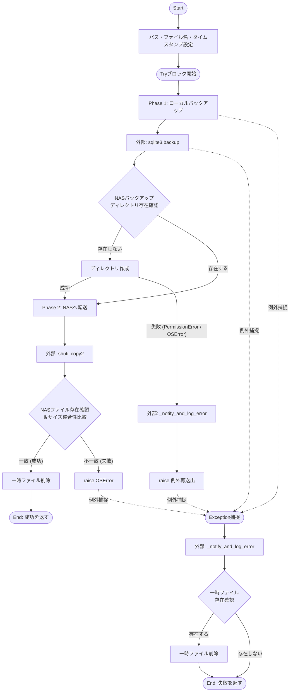
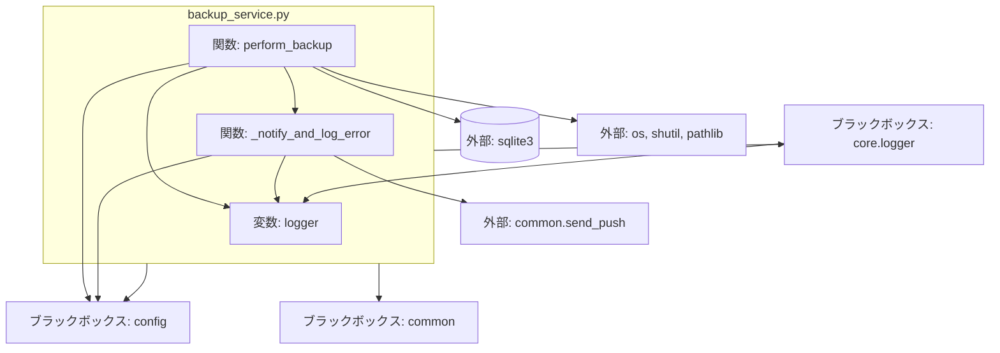

## 1. 解析メタ情報

| 項目 | 内容 |
| --- | --- |
| 対象ファイル | `backup_service.py` |
| 言語 | Python |
| 解析対象 | 提供されたコードのみ |
| 推測・補完 | 一切なし |

## 2. ファイルの概要

* データベースのバックアップを実行し、NASへ転送する。
* NASへの転送失敗（権限エラー・接続断等）時は、管理者の介入が必要な恒久的障害（ERROR）として扱い、即時通知を行う責務を持つ。

## 3. 外部依存関係

### インポート一覧

| 名称 | 種類 | 用途 | 根拠 |
| --- | --- | --- | --- |
| `sqlite3` | 標準ライブラリ | DB接続およびバックアップ機能の利用 | `import sqlite3` (行番号: 1 / 抜粋: "import sqlite3") |
| `os` | 標準ライブラリ | パス結合、ディレクトリ作成、ファイルサイズ取得、ファイル削除 | `import os` (行番号: 2 / 抜粋: "import os") |
| `datetime` | 標準ライブラリ | バックアップファイル名用のタイムスタンプ生成 | `import datetime` (行番号: 3 / 抜粋: "import datetime") |
| `shutil` | 標準ライブラリ | ファイルのNASへのコピー | `import shutil` (行番号: 4 / 抜粋: "import shutil") |
| `time` | 標準ライブラリ | 未使用 | `import time` (行番号: 5 / 抜粋: "import time") |
| `Path` | `pathlib` | パス文字列の構築と操作 | `from pathlib import Path` (行番号: 6 / 抜粋: "from pathlib import Path") |
| `Tuple` | `typing` | 関数の戻り値の型ヒント | `from typing import Tuple` (行番号: 7 / 抜粋: "from typing import Tuple") |
| `setup_logging` | `common` | 未使用（直後に上書きされている） | `from common import setup_logging` (行番号: 8 / 抜粋: "from common import setup_l...") |
| `setup_logging` | `core.logger` | ロガーの初期化。設計書に従い使用 | `from core.logger import setup_logging` (行番号: 10 / 抜粋: "from core.logger import se...") |
| `send_push` | `common` | エラー時の通知送信 | `from common import send_push` (行番号: 11 / 抜粋: "from common import send_push") |
| `config` | ローカルモジュール | 各種パスやIDなどの設定値の取得 | `import config` (行番号: 12 / 抜粋: "import config") |

### ブラックボックスとなる外部要素

| 名称 | 理由 | 根拠 |
| --- | --- | --- |
| `config.SQLITE_DB_PATH` | 定義元が存在せず、バックアップ対象の元DBパスの実体・値が不明 | `config.SQLITE_DB_PATH` (行番号: 26 / 抜粋: "src_db_path = config.SQLIT...") |
| `config.BASE_DIR` | 定義元が存在せず、一時ディレクトリのベースパスの実体・値が不明 | `config.BASE_DIR` (行番号: 31 / 抜粋: "temp_dir = Path(config.BAS...") |
| `config.NAS_PROJECT_ROOT` | 定義元が存在せず、NASのルートパスの実体・値が不明 | `getattr(config, "NAS_PROJE..."` (行番号: 33 / 抜粋: "nas_root = getattr(config,...") |
| `config.NAS_MOUNT_POINT` | 定義元が存在せず、NASマウントポイントの実体・値が不明 | `os.path.join(config.NAS_MO..."` (行番号: 33 / 抜粋: "os.path.join(config.NAS_MO...") |
| `config.LINE_USER_ID` | 定義元が存在せず、通知先IDの実体が不明 | `getattr(config, "LINE_USER..."` (行番号: 68 / 抜粋: "user_id=getattr(config, "L...") |
| `core.logger.setup_logging` | 実装が提供されておらず、ログの出力先・出力形式が不明 | `setup_logging("backup")` (行番号: 15 / 抜粋: "logger = setup_logging("ba...") |
| `common.send_push` | 実装が提供されておらず、実際の通信方式や成否の扱いが不明 | `send_push(...)` (行番号: 67 / 抜粋: "send_push(") |

## 4. 主要要素の定義（関数 / エンドポイント / コンポーネント）

### `logger`

* **役割**: `setup_logging` によって生成されたロガーインスタンスを保持する。
* 根拠: `logger = setup_logging("backup")` (行番号: 15 / 抜粋: "logger = setup_logging("backup")")

### `perform_backup`

* **役割**: データベースのバックアップを実行し、NASへ転送する。NASへの転送失敗時は管理者の介入が必要な恒久的障害として扱い、即時通知を行う。
* 根拠: `def perform_backup() -> Tuple[bool, str, float]:` (行番号: 17〜62 / 抜粋: "def perform_backup() -> Tu...")

* **引数/リクエスト**: なし
* 根拠: `def perform_backup():` (行番号: 17 / 抜粋: "def perform_backup() -> Tu...")

* **戻り値/レスポンス**: `Tuple[bool, str, float]`。成功時は `(True, "バックアップ完了", バックアップサイズMB)`、失敗時は `(False, エラーメッセージ, 0.0)` を返す。
* 根拠: `return True, "バックアップ完了", local_size_mb` および `return False, str(e), 0.0` (行番号: 55, 62 / 抜粋: "return True, "バックアップ完了",...")

* **副作用**: ローカルに一時ディレクトリおよびDBファイルを作成、`sqlite3` によるDBの読み取り・書き込み、NASディレクトリへファイルをコピー出力、一時ファイルの削除、標準出力（ログ出力）、外部API呼び出し（`send_push`）。
* 根拠: `src_conn.backup(...)`、`shutil.copy2(...)`、`os.remove(...)` (行番号: 42, 50, 54 / 抜粋: "src_conn.backup(dst_conn, ...")

* **エラーハンドリング**:
* NASディレクトリ作成時に `PermissionError` または `OSError` が発生した場合、エラーを通知した上で例外を再送出（`raise`）する。
* 処理全体を `try...except Exception as e` で囲み、あらゆる例外を捕捉して `_notify_and_log_error` へ渡し、一時ファイルが存在する場合は削除して失敗のタプルを返す。
* 根拠: `except (PermissionError, OSError) as e:` および `except Exception as e:` (行番号: 48〜50, 58〜62 / 抜粋: "except Exception as e:")

### `_notify_and_log_error`

* **役割**: ERRORレベルの記録と管理者への即時通知を行う。
* 根拠: `def _notify_and_log_error(message: str) -> None:` (行番号: 64〜71 / 抜粋: "def _notify_and_log_error(...)")

* **引数/リクエスト**: `message: str` (エラー内容を示すメッセージ文字列)
* 根拠: `def _notify_and_log_error(message: str)` (行番号: 64 / 抜粋: "def _notify_and_log_error(...)")

* **戻り値/レスポンス**: `None`
* 根拠: `-> None:` (行番号: 64 / 抜粋: "def _notify_and_log_error(...)")

* **副作用**: ロガーへのエラー書き込み、外部API呼び出し（`send_push`）。
* 根拠: `logger.error(...)`、`send_push(...)` (行番号: 66〜67 / 抜粋: "logger.error(f"❌ {message...")

* **エラーハンドリング**: なし（内部で例外捕捉は行われていない）。
* 根拠: `def _notify_and_log_error(message: str) -> None:` 内部の実装 (行番号: 64〜71 / 抜粋: "def _notify_and_log_error(...)")

## 5. 処理フロー図

## 6. 依存関係図

## 7. 次のステップ（リバースエンジニアリングの提案）

| 優先度 | ファイル名(推測可) | 理由 | 根拠 |
| --- | --- | --- | --- |
| 高 | `config.py` | データベースの正確なパス、一時ディレクトリの場所、NASの接続先、LINEユーザーIDなど、実行に必須となる環境依存の定数値を把握するため。 | `import config` (行番号: 12 / 抜粋: "import config") |
| 中 | `common.py` | `send_push` 関数が実際にどのサービス（LINEかDiscordか等）へどのように通知を送信しているか、またエラー時の挙動を確認するため。 | `from common import send_push` (行番号: 11 / 抜粋: "from common import send_push") |
| 低 | `core/logger.py` | ログがどこ（標準出力、ファイル、外部監視システムなど）に、どのようなフォーマットで出力されているかを特定するため。 | `from core.logger import setup_logging` (行番号: 10 / 抜粋: "from core.logger import se...") |

## 8. 保守上の注意点

* `common` モジュールから `setup_logging` をインポートした後、直後に `core.logger` の `setup_logging` で上書きしており、未使用のインポートが存在する。
* `import time` が宣言されているが、コード内で一度も使用されていない。
* `_notify_and_log_error` の `send_push` 呼び出しにおいて、`user_id` に `config.LINE_USER_ID` を指定しているにもかかわらず、引数として `target="discord"` を指定しており、設定意図と実態が不整合を起こしている可能性がある。
* NASディレクトリ作成失敗時のエラーハンドリング（48〜50行目）で `_notify_and_log_error` を呼び出した後 `raise` しているため、外側の `except Exception as e:` （58行目）で再度例外が捕捉され、同一エラーに対して `_notify_and_log_error` が二重に呼び出される構造になっている。

## 9. 不明事項一覧

| 項目 | 理由 | 必要なファイル |
| --- | --- | --- |
| 環境設定値の全貌 | パス（DB, ベース, NAS）や通知先IDの実際の設定値が不明なため。 | `config.py` |
| プッシュ通知の仕様 | `send_push` が同期処理か非同期処理か、通知失敗時に例外が発生するか不明なため。 | `common.py` |
| ロガーの仕様 | ログレベルの設定値、出力先、ローテーションの有無が不明なため。 | `core/logger.py` |
| データベースの仕様 | バックアップ対象のDB（home_system）のテーブル構造やデータ量が不明なため。 | `config.SQLITE_DB_PATH` の参照先ファイル |

## 10. 自己検証結果

* [x] 推測・外部ファイルの仕様を一切含んでいない
* [x] 全関数・全クラス・全コンポーネントを列挙した
* [x] 全てのインポート要素を列挙した
* [x] すべての仕様説明に「根拠（行番号・抜粋）」を明記した
* [x] 根拠漏れが0件である
* [x] Mermaid構文にエラーの原因となる記号（エスケープ漏れ）がない
* [x] 不明事項を漏れなく列挙した