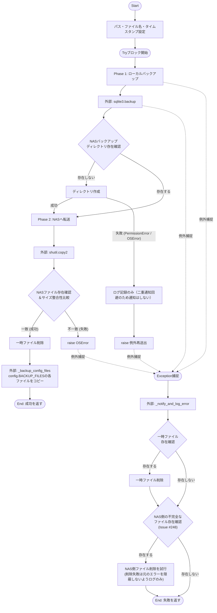
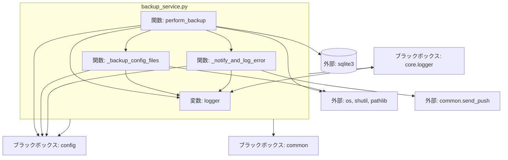

## 1. 解析メタ情報

| 項目 | 内容 |
| --- | --- |
| 対象ファイル | `backup_service.py` |
| 言語 | Python |
| 解析対象 | 提供されたコードのみ |
| 推測・補完 | 一切なし |
| 解析基準コミット | `1704765` |

## 関連ドキュメント

- [config.md](./config.md) — `SQLITE_DB_PATH`、`BASE_DIR`、`NAS_PROJECT_ROOT`、`NAS_MOUNT_POINT`、`LINE_USER_ID`等の設定を提供する。
- [common.md](./common.md) — `send_push`をFacade経由でインポートしている実体（`services.notification_service`の再エクスポート）。
- [notification_service.md](./notification_service.md) — `common.send_push`の実装元。
- [logger.md](./logger.md) — `setup_logging`の実装元。

## 2. ファイルの概要

* データベースのバックアップを実行し、NASへ転送する。あわせて `config.BACKUP_FILES` に列挙されたDB以外の設定ファイル（`config.py`/`.env`/`devices.json`等）もNASへコピーする。
* NASへの転送失敗（権限エラー・接続断等）時は、管理者の介入が必要な恒久的障害（ERROR）として扱い、即時通知を行う責務を持つ。

## 3. 外部依存関係

### インポート一覧

| 名称 | 種類 | 用途 | 根拠 |
| --- | --- | --- | --- |
| `sqlite3` | 標準ライブラリ | DB接続およびバックアップ機能の利用 | `import sqlite3` (行番号: 1 / 抜粋: "import sqlite3") |
| `os` | 標準ライブラリ | パス結合、ディレクトリ作成、ファイルサイズ取得、ファイル削除 | `import os` (行番号: 2 / 抜粋: "import os") |
| `datetime` | 標準ライブラリ | バックアップファイル名用のタイムスタンプ生成 | `import datetime` (行番号: 3 / 抜粋: "import datetime") |
| `shutil` | 標準ライブラリ | ファイルのNASへのコピー | `import shutil` (行番号: 4 / 抜粋: "import shutil") |
| `time` | 標準ライブラリ | 未使用 | `import time` (行番号: 5 / 抜粋: "import time") |
| `Path` | `pathlib` | パス文字列の構築と操作 | `from pathlib import Path` (行番号: 6 / 抜粋: "from pathlib import Path") |
| `Tuple` | `typing` | 関数の戻り値の型ヒント | `from typing import Tuple` (行番号: 7 / 抜粋: "from typing import Tuple") |
| `setup_logging` | `common` | 未使用（直後に上書きされている） | `from common import setup_logging` (行番号: 8 / 抜粋: "from common import setup_l...") |
| `setup_logging` | `core.logger` | ロガーの初期化。設計書に従い使用 | `from core.logger import setup_logging` (行番号: 10 / 抜粋: "from core.logger import se...") |
| `send_push` | `common` | エラー時の通知送信 | `from common import send_push` (行番号: 11 / 抜粋: "from common import send_push") |
| `config` | ローカルモジュール | 各種パスやIDなどの設定値の取得 | `import config` (行番号: 12 / 抜粋: "import config") |

### ブラックボックスとなる外部要素

| 名称 | 理由 | 根拠 |
| --- | --- | --- |
| `config.SQLITE_DB_PATH` | 定義元が存在せず、バックアップ対象の元DBパスの実体・値が不明 | `config.SQLITE_DB_PATH` (行番号: 27 / 抜粋: "src_db_path = config.SQLIT...") |
| `config.BASE_DIR` | 定義元が存在せず、一時ディレクトリのベースパスの実体・値が不明 | `config.BASE_DIR` (行番号: 32 / 抜粋: "temp_dir = Path(config.BAS...") |
| `config.NAS_PROJECT_ROOT` | 定義元が存在せず、NASのルートパスの実体・値が不明 | `getattr(config, "NAS_PROJE..."` (行番号: 34 / 抜粋: "nas_root = getattr(config,...") |
| `config.NAS_MOUNT_POINT` | 定義元が存在せず、NASマウントポイントの実体・値が不明 | `os.path.join(config.NAS_MO..."` (行番号: 34 / 抜粋: "os.path.join(config.NAS_MO...") |
| `config.BACKUP_FILES` | 定義元が存在せず、DB以外にバックアップ対象へ追加するファイルパス一覧の実体・値が不明 | `getattr(config, "BACKUP_FI..."` (行番号: 84 / 抜粋: "for entry in getattr(confi...") |
| `core.logger.setup_logging` | 実装が提供されておらず、ログの出力先・出力形式が不明 | `setup_logging("backup")` (行番号: 15 / 抜粋: "logger = setup_logging("ba...") |
| `common.send_push` | 実装が提供されておらず、実際の通信方式や成否の扱いが不明 | `send_push(...)` (行番号: 80 / 抜粋: "send_push(") |

## 4. 主要要素の定義（関数 / エンドポイント / コンポーネント）

### `logger`

* **役割**: `setup_logging` によって生成されたロガーインスタンスを保持する。
* 根拠: `logger = setup_logging("backup")` (行番号: 15 / 抜粋: "logger = setup_logging("backup")")

### `perform_backup`

* **役割**: データベースのバックアップを実行し、NASへ転送する。転送成功後は `_backup_config_files` を呼び出し、`config.BACKUP_FILES` に列挙されたDB以外の設定ファイルもあわせてNASへコピーする。NASへの転送失敗時は管理者の介入が必要な恒久的障害として扱い、即時通知を行う。
* 根拠: `def perform_backup() -> Tuple[bool, str, float]:` (行番号: 17〜76 / 抜粋: "def perform_backup() -> Tu...")

* **引数/リクエスト**: なし
* 根拠: `def perform_backup():` (行番号: 17 / 抜粋: "def perform_backup() -> Tu...")

* **戻り値/レスポンス**: `Tuple[bool, str, float]`。成功時は `(True, "バックアップ完了", バックアップサイズMB)`、失敗時は `(False, エラーメッセージ, 0.0)` を返す。
* 根拠: `return True, "バックアップ完了", local_size_mb` および `return False, str(e), 0.0` (行番号: 67, 76 / 抜粋: "return True, "バックアップ完了",...")

* **副作用**: ローカルに一時ディレクトリおよびDBファイルを作成、`sqlite3` によるDBの読み取り・書き込み、NASディレクトリへファイルをコピー出力、一時ファイル（および失敗時はIssue #247で追加されたNAS側の不完全ファイル）の削除、標準出力（ログ出力）、`_backup_config_files` 経由での追加設定ファイルのNASへのコピー、外部API呼び出し（`send_push`）。
* 根拠: `src_conn.backup(...)`、`shutil.copy2(...)`、`os.remove(...)`、`_backup_config_files(nas_backup_dir, timestamp, src_db_path)` (行番号: 45, 60, 64, 66 / 抜粋: "_backup_config_files(nas_b...")

* **エラーハンドリング**:
* NASディレクトリ作成時に `PermissionError` または `OSError` が発生した場合、（外側の `except` での二重通知を避けるため）ここでは通知を送らずログにのみ記録し、例外を再送出（`raise`）する。
* 処理全体を `try...except Exception as e` で囲み、あらゆる例外を捕捉して `_notify_and_log_error` へ渡し（＝通知は最終的にこの1箇所のみで行われる）、一時ファイル（`temp_path`）が存在する場合は削除して失敗のタプルを返す。**（Issue #248で修正）** 従来はローカルの一時ファイルのみを削除しており、`shutil.copy2`がNAS側のディスク逼迫・切断等でコピー途中に失敗した場合、または転送後の整合性確認（サイズ比較）に失敗した場合、NAS側に書きかけ・破損した不完全なファイル（`nas_final_path`）がそのまま残置されていた（バックアップの成否には影響しないが、正常なバックアップと誤認されうるゴミファイルがNAS上に残る問題）。現在は`temp_path`の削除に続けて`nas_final_path`が存在する場合はこちらも削除を試みる。この削除自体が失敗した場合（NAS切断等）は`logger.error`でログに残すのみとし、元の例外に基づく戻り値（`False, str(e), 0.0`）はそのまま返す（削除失敗によって元のエラー内容が上書き・隠蔽されないようにするため）。
* 根拠: `except (PermissionError, OSError) as e:` および `except Exception as e:` (行番号: 54〜58, 71〜76 / 抜粋: "except Exception as e:")
* 根拠: NAS側不完全ファイルの削除とコメント (行番号: 76〜86 / 抜粋: "# #248: shutil.copy2()がNAS側の容量不足・切断等でコピー途中に失敗した場合、\n        # または転送後の整合性確認(サイズ比較)に失敗した場合、NAS側には書きかけ・\n        # 破損した不完全なファイル(nas_final_path)がそのまま残置されていた。", "if nas_final_path.exists():\n            try:\n                os.remove(nas_final_path)\n            except OSError as cleanup_err:\n                logger.error(f\"❌ NAS側の不完全なバックアップファイルの削除に失敗: {cleanup_err}\")")

### `_backup_config_files`

* **役割**: `config.BACKUP_FILES` に列挙された設定ファイル(DB以外)をNASへコピーする。`src_db_path` と一致するエントリ（DB本体、既にPhase 1/2でバックアップ済み）はスキップする。個々のファイルのコピー失敗（ファイル不存在・`OSError`）はログに残すのみで、`perform_backup` 全体の成否には影響させない。
* 根拠: `def _backup_config_files(nas_backup_dir: Path, timestamp: str, src_db_path: str) -> None:` (行番号: 78〜97 / 抜粋: "def _backup_config_files(n...")

* **引数/リクエスト**: `nas_backup_dir: Path` (コピー先のNASバックアップディレクトリ), `timestamp: str` (ファイル名に付与するタイムスタンプ文字列), `src_db_path: str` (スキップ対象となるDBパス、`perform_backup`の`config.SQLITE_DB_PATH`)
* 根拠: `def _backup_config_files(nas_backup_dir: Path, timestamp: str, src_db_path: str)` (行番号: 78 / 抜粋: "def _backup_config_files(n...")

* **戻り値/レスポンス**: `None`
* 根拠: `-> None:` (行番号: 78 / 抜粋: "def _backup_config_files(n...")

* **副作用**: `config.BACKUP_FILES` の各エントリについて、相対パスは `config.BASE_DIR` を基準に解決したうえで存在確認し、存在すれば `nas_backup_dir` へ `<ファイル名(拡張子除く)>_<timestamp><拡張子>` という名前で `shutil.copy2` によりコピーする。存在確認・コピー結果をログ出力する。
* 根拠: `src_path = entry if os.path.isabs(entry) else os.path.join(config.BASE_DIR, entry)`、`shutil.copy2(src_path, dest_path)` (行番号: 87, 94 / 抜粋: "shutil.copy2(src_path, des...")

* **エラーハンドリング**: 対象ファイルが存在しない場合は `logger.warning` を出力してそのエントリをスキップする（例外は送出しない）。`shutil.copy2` が `OSError` を送出した場合は `except OSError` で捕捉し `logger.error` を出力するのみで、他のエントリの処理・呼び出し元(`perform_backup`)への伝播は行わない。
* 根拠: `if not os.path.exists(src_path): logger.warning(...); continue` および `except OSError as e: logger.error(...)` (行番号: 88〜90, 96〜97 / 抜粋: "except OSError as e:")

### `_notify_and_log_error`

* **役割**: ERRORレベルの記録と管理者への即時通知を行う。
* 根拠: `def _notify_and_log_error(message: str) -> None:` (行番号: 99〜107 / 抜粋: "def _notify_and_log_error(...)")

* **引数/リクエスト**: `message: str` (エラー内容を示すメッセージ文字列)
* 根拠: `def _notify_and_log_error(message: str)` (行番号: 99 / 抜粋: "def _notify_and_log_error(...)")

* **戻り値/レスポンス**: `None`
* 根拠: `-> None:` (行番号: 99 / 抜粋: "def _notify_and_log_error(...)")

* **副作用**: ロガーへのエラー書き込み、外部API呼び出し（`send_push`）。
* 根拠: `logger.error(...)`、`send_push(...)` (行番号: 101〜102 / 抜粋: "logger.error(f"❌ {message...")

* **エラーハンドリング**: なし（内部で例外捕捉は行われていない）。
* 根拠: `def _notify_and_log_error(message: str) -> None:` 内部の実装 (行番号: 99〜107 / 抜粋: "def _notify_and_log_error(...)")

## 5. 処理フロー図

```mermaid
flowchart TD
  Start([Start]) --> Init[パス・ファイル名・タイムスタンプ設定]
  Init --> TryStart([Tryブロック開始])

  TryStart --> Phase1[Phase 1: ローカルバックアップ]
  Phase1 --> SQLiteBackup[外部: sqlite3.backup]
  SQLiteBackup --> CheckNASDir{NASバックアップ\nディレクトリ存在確認}

  CheckNASDir -- 存在しない --> TryCreateDir[ディレクトリ作成]
  TryCreateDir -- 成功 --> CopyNAS
  TryCreateDir -- "失敗 (PermissionError / OSError)" --> LogDirErr["ログ記録のみ（二重通知回避のため通知はしない）"]
  LogDirErr --> RaiseDirErr[raise 例外再送出]

  CheckNASDir -- 存在する --> CopyNAS[Phase 2: NASへ転送]
  CopyNAS --> ShutilCopy[外部: shutil.copy2]

  ShutilCopy --> Validate{NASファイル存在確認\n＆サイズ整合性比較}
  Validate -- "一致 (成功)" --> RemoveTempSuccess[一時ファイル削除]
  RemoveTempSuccess --> BackupConfigFiles[外部: _backup_config_files\nconfig.BACKUP_FILESの各ファイルをコピー]
  BackupConfigFiles --> ReturnSuccess([End: 成功を返す])

  Validate -- "不一致 (失敗)" --> RaiseOSError[raise OSError]

  RaiseDirErr -. "例外捕捉" .-> GlobalCatch
  RaiseOSError -. "例外捕捉" .-> GlobalCatch
  Phase1 -. "例外捕捉" .-> GlobalCatch
  SQLiteBackup -. "例外捕捉" .-> GlobalCatch

  GlobalCatch([Exception捕捉]) --> NotifyError[外部: _notify_and_log_error]
  NotifyError --> CheckTemp{一時ファイル\n存在確認}
  CheckTemp -- 存在する --> RemoveTempFail[一時ファイル削除]
  RemoveTempFail --> CheckNasPartial
  CheckTemp -- 存在しない --> CheckNasPartial{"NAS側の不完全な\nファイル存在確認\n(Issue #248)"}
  CheckNasPartial -- 存在する --> RemoveNasPartial["NAS側ファイル削除を試行\n(削除失敗は元のエラーを隠蔽しないようログのみ)"]
  RemoveNasPartial --> ReturnFail([End: 失敗を返す])
  CheckNasPartial -- 存在しない --> ReturnFail

```

## 6. 依存関係図

```mermaid
graph TD
  backup_service.py --> config[ブラックボックス: config]
  backup_service.py --> core.logger[ブラックボックス: core.logger]
  backup_service.py --> common[ブラックボックス: common]

  subgraph backup_service.py
    logger[変数: logger]
    perform_backup[関数: perform_backup]
    _backup_config_files[関数: _backup_config_files]
    _notify_and_log_error[関数: _notify_and_log_error]
  end

  perform_backup --> config
  perform_backup --> logger
  perform_backup --> _backup_config_files
  perform_backup --> _notify_and_log_error
  perform_backup --> SQLite[(外部: sqlite3)]
  perform_backup --> OS[外部: os, shutil, pathlib]

  _backup_config_files --> config
  _backup_config_files --> logger
  _backup_config_files --> OS

  _notify_and_log_error --> logger
  _notify_and_log_error --> send_push[外部: common.send_push]
  _notify_and_log_error --> config

  core.logger --> logger

```

## 7. 次のステップ（リバースエンジニアリングの提案）

| 優先度 | ファイル名(推測可) | 理由 | 根拠 |
| --- | --- | --- | --- |
| 高 | `config.py` | データベースの正確なパス、一時ディレクトリの場所、NASの接続先、LINEユーザーIDなど、実行に必須となる環境依存の定数値を把握するため。 | `import config` (行番号: 12 / 抜粋: "import config") |
| 中 | `common.py` | `send_push` 関数が実際にどのサービス（LINEかDiscordか等）へどのように通知を送信しているか、またエラー時の挙動を確認するため。 | `from common import send_push` (行番号: 11 / 抜粋: "from common import send_push") |
| 低 | `core/logger.py` | ログがどこ（標準出力、ファイル、外部監視システムなど）に、どのようなフォーマットで出力されているかを特定するため。 | `from core.logger import setup_logging` (行番号: 10 / 抜粋: "from core.logger import se...") |

## 8. 保守上の注意点

* `common` モジュールから `setup_logging` をインポートした後、直後に `core.logger` の `setup_logging` で上書きしており、未使用のインポートが存在する。
* `import time` が宣言されているが、コード内で一度も使用されていない。
* Issue #289で`send_push`のシグネチャが再設計され、`target="discord"`のみの呼び出しに`user_id`引数が不要になった。これに伴い`_notify_and_log_error`の`send_push`呼び出しからは、以前存在した`user_id=getattr(config, "LINE_USER_ID", None)`(target="discord"であるにも関わらずLINE宛先を渡していた不整合)が撤去されている。
* NASディレクトリ作成失敗時のエラーハンドリング（54〜58行目）は、意図的に `_notify_and_log_error`（通知）を呼び出さずログ記録のみを行ってから例外を再送出している。これは、外側の `except Exception as e:`（71行目）でも同一エラーが捕捉されて通知が二重送信されるのを防ぐための設計であり、コード中にもその旨のコメントが付されている（過去に二重通知が発生していたための対策）。この一本化された経路を崩さないよう、将来的にこのブロックへ通知呼び出しを追加する際は二重送信に注意する必要がある。
* Issue #113で修正: 従来 `config.BACKUP_FILES`（`config.py`/`.env`/`devices.json`を列挙）はどのコードからも参照されず、`perform_backup` はDBファイル単体しかNASへ転送していなかった（CLAUDE.mdの説明と実装が食い違う死に設定になっていた）。`_backup_config_files` を新設し、`perform_backup` の転送成功後にこれを呼び出すことで、`config.BACKUP_FILES` に列挙されたファイルが実際にバックアップされるようにした。相対パスのエントリは `config.BASE_DIR` を基準に解決するため、`config.BACKUP_FILES` に新しいファイルを追加する場合は `config.BASE_DIR`（`MY_HOME_SYSTEM/`）からの相対パス、または絶対パスで指定する必要がある。
* `_backup_config_files` が書き込む先の `nas_backup_dir`（`NAS_PROJECT_ROOT/db_backups`、すなわち `config.DB_BACKUPS_DIR`）は `monitors/nas_monitor.py` の `run_retention_cleanup` によるリテンション削除の対象でもある。以前はこの削除処理が拡張子 `.db` のみを対象としていたため、`_backup_config_files` が生成する設定ファイルのコピー（`.py`/`.json`拡張子、および`.env`はコピー時に拡張子なしのファイル名になる）は一切削除されず無限に蓄積していた（Issue #191、詳細は `docs/specifications/MY_HOME_SYSTEM/nas_monitor.md` の `run_retention_cleanup` を参照）。`nas_monitor.py` 側で `DB_BACKUPS_DIR` 全体を拡張子を問わず削除対象とするよう修正済みのため、`config.BACKUP_FILES` に新しい拡張子のファイルを追加しても、削除対象からは自動的に漏れない。
* **(Issue #248バグ修正の背景)** `perform_backup`の外側`except Exception`ブロックは、以前はローカルの一時ファイル(`temp_path`)のみを削除しており、`shutil.copy2`によるNAS転送がディスク逼迫・切断等で途中失敗した場合、または転送後の整合性確認（サイズ比較）に失敗した場合に、NAS側へ書きかけ・破損した状態で残った不完全なファイル(`nas_final_path`)がそのまま放置されていた。データ損失は伴わない（正常なバックアップは別途成功時にのみ作成される）が、破損したゴミファイルがNAS上に無期限に蓄積するリスクがあった。現在は`temp_path`と同様に`nas_final_path`の存在確認・削除も行うが、この削除自体の失敗（NAS切断等）が発生した場合は、ログにのみ記録し元のエラー内容（戻り値の`msg`）を上書きしないようにしている。新たに同様の「ローカル/リモート両方に副産物を残しうる」処理を追加する際は、失敗時のクリーンアップ対象がローカル側だけになっていないか確認すること。

## 9. 不明事項一覧

| 項目 | 理由 | 必要なファイル |
| --- | --- | --- |
| 環境設定値の全貌 | パス（DB, ベース, NAS）や通知先IDの実際の設定値が不明なため。（`config.py`のパス定義自体は下記の相互参照で直接確認できたが、`.env`が`.gitignore`により追跡対象外のため、環境変数由来の実値そのものは依然として解消不可） | `config.py` |
| プッシュ通知の仕様 | `send_push` が同期処理か非同期処理か、通知失敗時に例外が発生するか不明なため。 | `common.py` |
| ロガーの仕様 | ログレベルの設定値、出力先、ローテーションの有無が不明なため。 | `core/logger.py` |
| データベースの仕様 | バックアップ対象のDB（home_system）のテーブル構造やデータ量が不明なため。（テーブル構造は下記の相互参照で`current_schema.sql`から直接確認できたが、実データの量自体は`home_system.db`本体が`.gitignore`の`*.db`規則により追跡対象外のため解消不可） | `config.SQLITE_DB_PATH` の参照先ファイル |

## 相互参照による補足情報

| 元の不明事項 | 判明した内容 | 参照元ドキュメント |
| --- | --- | --- |
| プッシュ通知の仕様 | `notification_service.md`の解析によれば、`send_push`は`target`引数（"discord"/"line"/"both"）に応じて送信先を振り分け、LINE送信に失敗した場合はDiscordのerrorチャンネルへフォールバック通知を行う関数で、戻り値は`bool`（成功可否）と推測される。内部で発生した例外は関数内で捕捉され、呼び出し元へは送出されない（＝同期処理で、失敗時も例外は発生しないと推測される）実装と考えられる。ただし`common.py`側での再エクスポート実装自体は未確認。 | notification_service.md |
| ロガーの仕様 | `logger.md`の解析によれば、`setup_logging`はコンソール出力・日次ローテーションファイル出力に加え、ERRORレベル以上のログをDiscord Webhookへ自動通知するハンドラを登録すると推測される。ログファイル名は`home_system.log`固定と推測される。ただし`config.BASE_DIR`の実際の値は未確認。 | logger.md |
| プッシュ通知の仕様 | `common.py`および`services/notification_service.py`を直接確認した。`common.py`31〜37行目で`send_push`は`services.notification_service`から`from ... import (send_push, ...)`として再エクスポートされているのみで、`common.py`自体には独自ロジックはない。実体の`send_push(messages, *, target="both", channel="notify", user_id=None, image_data=None, filename="snapshot.jpg")`(`notification_service.py`116〜163行目、Issue #289でシグネチャ再設計)は同期関数(`async def`ではない通常の`def`)であり、Discord送信は`_send_discord_webhook`内の`try/except Exception as e: logger.error(...); return False`で、LINE送信は`_send_line_push`内で例外を捕捉して`bool`を返す設計のため、`send_push`自体から例外が呼び出し元へ送出されることはない（失敗時は戻り値`False`とログ出力のみ）ことを確認した。`backup_service.py`は`target="discord"`のみで呼び出すため`user_id`は渡していない。`backup_service.py`側の`_notify_and_log_error`は`send_push`の戻り値を特に確認せず呼び出すのみの実装であることも合わせて確認した。 | 直接ソース確認: `MY_HOME_SYSTEM/common.py:31-37`, `MY_HOME_SYSTEM/services/notification_service.py:30-71, 116-163`, `MY_HOME_SYSTEM/services/backup_service.py:99-104` |
| ロガーの仕様 | `core/logger.py`を直接確認した。`setup_logging(name, webhook_url=None)`(46〜86行目)は、渡された`name`のロガーに対し`propagate = False`を設定したうえで既存ハンドラをクリアし(51〜52行目)、`logging.INFO`レベル(54行目)で(1)`StreamHandler`によるコンソール出力(58〜60行目)、(2)`TimedRotatingFileHandler(filename=os.path.join(config.BASE_DIR, "logs", "home_system.log"), when='midnight', interval=1, backupCount=7)`による日次ローテーション・7世代保持のファイル出力(63〜74行目、ログファイル名は`home_system.log`で全ロガー共通)、(3)`config.DISCORD_WEBHOOK_ERROR`（または引数指定分）が設定されていれば`DiscordErrorHandler`(ERRORレベル以上のみ発火)、の3種のハンドラを追加する実装であることを確認した。`backup_service.py`15行目は`logger = setup_logging("backup")`のためこの仕組みがそのまま適用される。`config.BASE_DIR`は`config.py`212行目で`os.path.dirname(os.path.abspath(__file__))`（＝`MY_HOME_SYSTEM/`ディレクトリ自身）と定義されている。 | 直接ソース確認: `MY_HOME_SYSTEM/core/logger.py:46-86`, `MY_HOME_SYSTEM/services/backup_service.py:15`, `MY_HOME_SYSTEM/config.py:212` |
| 環境設定値の全貌 | `config.py`を直接確認した。`SQLITE_DB_PATH`は222行目で`os.getenv("SQLITE_DB_PATH") or os.path.join(BASE_DIR, "home_system.db")`、`BASE_DIR`は212行目で`os.path.dirname(os.path.abspath(__file__))`（`config.py`自身のディレクトリ、すなわち`MY_HOME_SYSTEM/`）、`NAS_MOUNT_POINT`は216行目で`os.getenv("NAS_MOUNT_POINT", "/mnt/nas")`、`NAS_PROJECT_ROOT`は217行目で`os.path.join(NAS_MOUNT_POINT, "home_system")`と定義されており、`backup_service.py`34行目の`nas_root = getattr(config, "NAS_PROJECT_ROOT", ...)`が参照する値と一致することを確認した。通知先である`LINE_USER_ID`(185行目)は`os.getenv("LINE_USER_ID")`。これらの定義式（パスの組み立てロジック）自体は確認できたが、`.env`ファイルはリポジトリの`.gitignore`13行目の`.env`規則により追跡対象外(バージョン管理外)であり、`MY_HOME_SYSTEM/.env.example`にもこれらのキーの記載はなかったため、実際の環境変数の値そのものは解消できなかった。 | 直接ソース確認: `MY_HOME_SYSTEM/config.py:185, 212, 216-217, 222`, `MY_HOME_SYSTEM/services/backup_service.py:34`（`.env`は`.gitignore:13`により追跡対象外） |
| データベースの仕様 | `config.SQLITE_DB_PATH`が指す`home_system.db`本体は`.gitignore`の`*.db`規則により追跡対象外でリポジトリ内に存在しないため、実データそのもの（データ量等）は解消できなかった。ただしテーブル構造については、リポジトリ内の`current_schema.sql`（DBスキーマのダンプと見られるテキストファイル）を直接確認したところ、`sqlite_sequence`を含めて計40件の`CREATE TABLE`文が記録されており(`device_records`, `ohayo_records`, `daily_records`, `health_records`, `car_records`, `quest_master`, `quest_history`, `app_rankings`, `bicycle_parking_records`など計39実テーブル)、`backup_service.py`は個別テーブルを選ばず`sqlite3.Connection.backup(dst_conn, pages=-1)`(45行目)によりDBファイル全体を丸ごとバックアップする実装であるため、これら全テーブルがバックアップ対象に含まれることを確認した。 | 直接ソース確認: `MY_HOME_SYSTEM/current_schema.sql`（`CREATE TABLE`文の一覧、全40件）, `MY_HOME_SYSTEM/services/backup_service.py:27-45`（`home_system.db`本体は`.gitignore`の`*.db`規則により追跡対象外） |

## 10. 自己検証結果

* [x] 推測・外部ファイルの仕様を一切含んでいない
* [x] 全関数・全クラス・全コンポーネントを列挙した
* [x] 全てのインポート要素を列挙した
* [x] すべての仕様説明に「根拠（行番号・抜粋）」を明記した
* [x] 根拠漏れが0件である
* [x] Mermaid構文にエラーの原因となる記号（エスケープ漏れ）がない
* [x] 不明事項を漏れなく列挙した