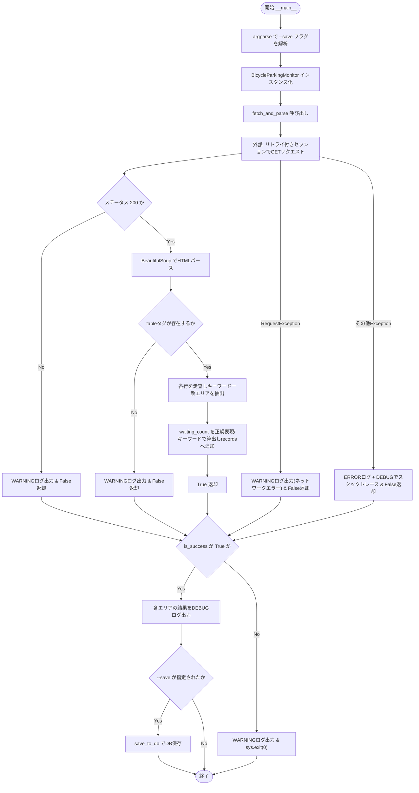

## 1. 解析メタ情報

| 項目 | 内容 |
| --- | --- |
| 対象ファイル | `monitors/old/bicycle_parking_monitor.py` |
| 言語 | Python |
| 解析対象 | 提供されたコードのみ |
| 推測・補完 | 一切なし |

## 関連ドキュメント

* [logger.md](./logger.md) - `setup_logging`の提供元
* [config.md](./config.md) - `BICYCLE_PARKING_URL`, `SQLITE_TABLE_BICYCLE`等の設定値を提供
* [database.md](./database.md) - `save_log_generic`の提供元
* [utils.md](./utils.md) - `get_now_iso`の提供元
* [network.md](./network.md) - HTTPリトライ用の`Retry`/`HTTPAdapter`セッション構築を独自に行っている点で類似機能を持つモジュール（推測: 本ファイルはこのユーティリティを使わず独自実装している）

## 2. ファイルの概要

近鉄系駐輪場（デフォルトURL: `midi-kintetsu.com`）の定期利用待機状況ページをスクレイピングし、特定エリア（鈴原・伊丹・阪急）の待機人数をDBに記録するモニタースクリプトである。
根拠: [クラスDocstring] (行番号: 31〜33 / 抜粋: "駐輪場の定期利用待機状況をスクレイピングし、DBに記録するクラス。")

`_get_session`はHTTP 500/502/503/504エラーおよび接続エラーに対して最大3回、バックオフ係数1でリトライする`requests.Session`を構築する。
根拠: [_get_session] (行番号: 47〜57 / 抜粋: "retries = Retry(\n            total=3,                # 最大リトライ回数\n            backoff_factor=1,")

`fetch_and_parse`は取得したHTMLから`<table>`要素内の行を走査し、エリア名に`鈴原`・`伊丹`・`阪急`のいずれかを含む行のみを抽出、待機人数を正規表現(`(\d+)人`)またはキーワード（`空`/`○`）判定で0または数値として`self.records`に格納する。
根拠: [fetch_and_parse] (行番号: 86〜111 / 抜粋: "target_keywords = [\"鈴原\", \"伊丹\", \"阪急\"]")

`save_to_db`は`self.records`の各要素を`core.database.save_log_generic`を用いてDBの`table_name`テーブルへ保存する。
根拠: [save_to_db] (行番号: 126〜149 / 抜粋: "if save_log_generic(self.table_name, cols, vals):")

スクリプトとして実行された場合、`argparse`で`--save`フラグを受け取り、指定時のみDB保存を行う。ネットワーク/パースエラー時は`sys.exit(0)`で正常終了させ、スケジューラ側の異常検知（タスク失敗通知）を意図的に抑制している。
根拠: [__main__] (行番号: 152〜181 / 抜粋: "logger.warning(\"⚠️ Task finished incompletely due to network/parsing issues.\")\n        sys.exit(0) # Schedulerへの通知を抑制")

## 3. 外部依存関係

### インポート一覧

| 名称 | 種類 | 用途 | 根拠 |
| --- | --- | --- | --- |
| `requests` | 外部ライブラリ | 対象URLへのHTTP GETリクエスト送信、セッション管理 | 根拠: `[import requests]` (行番号: 1 / 抜粋: "import requests") |
| `HTTPAdapter` | 外部ライブラリ(`requests.adapters`) | セッションへのリトライアダプタのマウント | 根拠: `[from requests.adapters import HTTPAdapter]` (行番号: 2 / 抜粋: "from requests.adapters import HTTPAdapter  # <--- 追加") |
| `Retry` | 外部ライブラリ(`urllib3.util.retry`) | リトライ戦略（回数・バックオフ・対象ステータス）の定義 | 根拠: `[from urllib3.util.retry import Retry]` (行番号: 3 / 抜粋: "from urllib3.util.retry import Retry       # <--- 追加") |
| `BeautifulSoup` | 外部ライブラリ(`bs4`) | 取得したHTMLのパースおよびテーブル・行要素の抽出 | 根拠: `[from bs4 import BeautifulSoup]` (行番号: 4 / 抜粋: "from bs4 import BeautifulSoup") |
| `sys` | 標準ライブラリ | プロジェクトルートへのパス追加、正常終了コードの制御(`sys.exit`) | 根拠: `[import sys]` (行番号: 5 / 抜粋: "import sys") |
| `os` | 標準ライブラリ | パス結合 | 根拠: `[import os]` (行番号: 6 / 抜粋: "import os") |
| `argparse` | 標準ライブラリ | コマンドライン引数(`--save`)の解析 | 根拠: `[import argparse]` (行番号: 7 / 抜粋: "import argparse") |
| `re` | 標準ライブラリ | 待機人数の正規表現抽出(`(\d+)人`) | 根拠: `[import re]` (行番号: 8 / 抜粋: "import re") |
| `traceback` | 標準ライブラリ | パースエラー発生時のスタックトレース取得(DEBUGログ用) | 根拠: `[import traceback]` (行番号: 9 / 抜粋: "import traceback") |
| `List`, `TypedDict` | 標準ライブラリ(`typing`) | 型ヒントおよびレコード構造(`ParkingRecord`)の定義 | 根拠: `[from typing import List, TypedDict]` (行番号: 10 / 抜粋: "from typing import List, TypedDict") |
| `config` | 内部モジュール | 監視URL・DBテーブル名等の設定値の提供 | 根拠: `[import config]` (行番号: 15 / 抜粋: "import config") |
| `setup_logging` | 内部モジュール(`core.logger`) | ロガーインスタンスの初期化 | 根拠: `[from core.logger import setup_logging]` (行番号: 17 / 抜粋: "from core.logger import setup_logging") |
| `save_log_generic` | 内部モジュール(`core.database`) | 汎用ログレコードのDB保存 | 根拠: `[from core.database import save_log_generic]` (行番号: 18 / 抜粋: "from core.database import save_log_generic") |
| `get_now_iso` | 内部モジュール(`core.utils`) | ISO形式の現在時刻取得 | 根拠: `[from core.utils import get_now_iso]` (行番号: 19 / 抜粋: "from core.utils import get_now_iso") |

### ブラックボックスとなる外部要素

| 名称 | 理由 | 根拠 |
| --- | --- | --- |
| `config.BICYCLE_PARKING_URL` / `config.SQLITE_TABLE_BICYCLE` | `config`モジュールの実装が提供されておらず、実際の値が不明であるため(`getattr`によるデフォルト値フォールバック付き)。 | 根拠: `[getattr(config, ...)]` (行番号: 37〜38 / 抜粋: "self.url: str = getattr(config, \"BICYCLE_PARKING_URL\", \"https://www.midi-kintetsu.com/mpns/pa/h-itami/teiki/index.php\")") |
| 監視対象Webサイト(`midi-kintetsu.com`)のHTML構造 | 外部サイトの実際のテーブル構造・クラス名等は本ファイルからは確認できないため。 | 根拠: `[tables = soup.find_all('table')]` (行番号: 79 / 抜粋: "tables = soup.find_all('table')") |
| `save_log_generic`の内部実装 | `core.database`モジュールの実装が本ファイルに含まれていないため。 | 根拠: `[save_log_generic呼び出し]` (行番号: 144 / 抜粋: "if save_log_generic(self.table_name, cols, vals):") |

## 4. 主要要素の定義（関数 / エンドポイント / コンポーネント）

### `ParkingRecord`

* **役割**: 駐輪場エリアの解析結果（エリア名・状態テキスト・待機人数）を表す`TypedDict`。
* 根拠: `[ParkingRecord]` (行番号: 25〜28 / 抜粋: "class ParkingRecord(TypedDict):")
* **引数/リクエスト**: 該当なし（データ構造定義のみ、フィールドは`area_name: str`, `status_text: str`, `waiting_count: int`）。
* 根拠: `[フィールド定義]` (行番号: 26〜28 / 抜粋: "area_name: str\n    status_text: str\n    waiting_count: int")
* **戻り値/レスポンス**: 該当なし。
* 根拠: `[ParkingRecord定義全体]` (行番号: 25〜28 / 抜粋: "class ParkingRecord(TypedDict):")
* **副作用**: なし。
* 根拠: `[ParkingRecord定義全体]` (行番号: 25〜28 / 抜粋: "class ParkingRecord(TypedDict):")
* **エラーハンドリング**: なし。
* 根拠: `[ParkingRecord定義全体]` (行番号: 25〜28 / 抜粋: "class ParkingRecord(TypedDict):")

### `BicycleParkingMonitor`

* **役割**: 駐輪場の定期利用待機状況をスクレイピングし、DBに記録するクラス。
* 根拠: `[クラスDocstring]` (行番号: 30〜33 / 抜粋: "駐輪場の定期利用待機状況をスクレイピングし、DBに記録するクラス。")

### `BicycleParkingMonitor.__init__`

* **役割**: `config`から監視URL・DBテーブル名を読み込み、`records`リストを空で初期化する。
* 根拠: `[__init__]` (行番号: 35〜39 / 抜粋: "def __init__(self) -> None:")
* **引数/リクエスト**: `self`のみ。
* 根拠: `[__init__シグネチャ]` (行番号: 35 / 抜粋: "def __init__(self) -> None:")
* **戻り値/レスポンス**: なし(`None`)。
* 根拠: `[__init__シグネチャ]` (行番号: 35 / 抜粋: "def __init__(self) -> None:")
* **副作用**: インスタンス属性(`url`, `table_name`, `records`)の設定のみ。
* 根拠: `[__init__本体]` (行番号: 37〜39 / 抜粋: "self.records: List[ParkingRecord] = []")
* **エラーハンドリング**: なし。
* 根拠: `[__init__本体]` (行番号: 35〜39 / 抜粋: "def __init__(self) -> None:")

### `BicycleParkingMonitor._get_session`

* **役割**: 接続エラー・5xxエラーに対して自動リトライを行うよう設定した`requests.Session`を作成して返す。
* 根拠: `[_get_session]` (行番号: 41〜46 / 抜粋: "リトライ戦略を設定したrequestsセッションを作成して返す。")
* **引数/リクエスト**: `self`のみ。
* 根拠: `[_get_sessionシグネチャ]` (行番号: 41 / 抜粋: "def _get_session(self) -> requests.Session:")
* **戻り値/レスポンス**: `requests.Session` (リトライアダプタがマウント済みのセッション)。
* 根拠: `[return文]` (行番号: 57 / 抜粋: "return session")
* **副作用**: `requests.Session`インスタンスの生成、`HTTPAdapter`のマウント。
* 根拠: `[session.mount]` (行番号: 55〜56 / 抜粋: "session.mount(\"https://\", adapter)\n        session.mount(\"http://\", adapter)")
* **エラーハンドリング**: なし（リトライ設定自体がエラーハンドリングの一部）。
* 根拠: `[_get_session本体]` (行番号: 41〜57 / 抜粋: "def _get_session(self) -> requests.Session:")

### `BicycleParkingMonitor.fetch_and_parse`

* **役割**: Webサイトからデータを取得し、対象エリアの待機状況をパースして`self.records`に格納する。
* 根拠: `[fetch_and_parse]` (行番号: 59〜62 / 抜粋: "Webサイトからデータを取得し、self.recordsに格納する。")
* **引数/リクエスト**: `self`のみ。
* 根拠: `[fetch_and_parseシグネチャ]` (行番号: 59 / 抜粋: "def fetch_and_parse(self) -> bool:")
* **戻り値/レスポンス**: `bool` (取得・パース成功時`True`、HTTPエラー・テーブル無し・ネットワークエラー・予期せぬエラー時`False`)。
* 根拠: `[各return文]` (行番号: 74, 82, 112, 118, 124 / 抜粋: "return True")
* **副作用**: HTTP GETリクエストの送信、`self.records`の書き換え(初期化して再構築)。
* 根拠: `[self.records = []]` (行番号: 84 / 抜粋: "self.records = []")
* **エラーハンドリング**: `requests.exceptions.RequestException`をWARNINGログで捕捉、それ以外の`Exception`をERRORログ＋DEBUGレベルでのスタックトレース出力で捕捉し、いずれも`False`を返す。
* 根拠: `[except節]` (行番号: 114〜124 / 抜粋: "except requests.exceptions.RequestException as e:\n            ...\n        except Exception as e:\n            logger.error(f\"Unexpected Scraping failed: {e}\")\n            logger.debug(traceback.format_exc())")

### `BicycleParkingMonitor.save_to_db`

* **役割**: 取得したデータ(`self.records`)をDBに保存する。
* 根拠: `[save_to_db]` (行番号: 126〜127 / 抜粋: "取得したデータをDBに保存する")
* **引数/リクエスト**: `self`のみ。
* 根拠: `[save_to_dbシグネチャ]` (行番号: 126 / 抜粋: "def save_to_db(self) -> None:")
* **戻り値/レスポンス**: なし(`None`)。`records`が空の場合は早期`return`。
* 根拠: `[早期return]` (行番号: 128〜130 / 抜粋: "if not self.records:\n            logger.debug(\"No records to save.\")\n            return")
* **副作用**: `save_log_generic`呼び出しによるDBへの書き込み（レコードごとに実行）。
* 根拠: `[save_log_generic呼び出し]` (行番号: 144 / 抜粋: "if save_log_generic(self.table_name, cols, vals):")
* **エラーハンドリング**: レコードごとの`Exception`をキャッチしERRORログを出力、他のレコードの処理は継続する。
* 根拠: `[except Exception]` (行番号: 146〜147 / 抜粋: "except Exception as e:\n                logger.error(f\"DB保存エラー ({r['area_name']}): {e}\")")

## 5. 処理フロー図

## 6. 依存関係図

```mermaid
graph TD
    BicycleMonitorPY["bicycle_parking_monitor.py"]

    subgraph Python_Standard_Libraries
        Sys["sys"]
        OS["os"]
        Argparse["argparse"]
        Re["re"]
        Traceback["traceback"]
        Typing["typing"]
    end

    subgraph External_Libraries
        Requests["requests"]
        HTTPAdapter["requests.adapters.HTTPAdapter"]
        Retry["urllib3.util.retry.Retry"]
        BS4["bs4.BeautifulSoup"]
    end

    subgraph Project_Internal
        Config["config.py"]
        Logger["core/logger.py (setup_logging)"]
        Database["core/database.py (save_log_generic)"]
        Utils["core/utils.py (get_now_iso)"]
    end

    subgraph External_Services
        ParkingSite["近鉄系駐輪場 予約状況ページ (Webサイト)"]
    end

    BicycleMonitorPY --> Sys
    BicycleMonitorPY --> OS
    BicycleMonitorPY --> Argparse
    BicycleMonitorPY --> Re
    BicycleMonitorPY --> Traceback
    BicycleMonitorPY --> Typing
    BicycleMonitorPY --> Requests
    BicycleMonitorPY --> HTTPAdapter
    BicycleMonitorPY --> Retry
    BicycleMonitorPY --> BS4
    BicycleMonitorPY --> Config
    BicycleMonitorPY --> Logger
    BicycleMonitorPY --> Database
    BicycleMonitorPY --> Utils

    BicycleMonitorPY -->|GETリクエスト| ParkingSite
```

## 7. 次のステップ（リバースエンジニアリングの提案）

| 優先度 | ファイル名(推測可) | 理由 | 根拠 |
| --- | --- | --- | --- |
| 高 | `config.py` | `BICYCLE_PARKING_URL`, `SQLITE_TABLE_BICYCLE`の実際の設定値を確認するため。 | 根拠: `[getattr(config, ...)]` (行番号: 37〜38 / 抜粋: "self.url: str = getattr(config, \"BICYCLE_PARKING_URL\", ...)") |
| 中 | `core/database.py` | `save_log_generic`の実装（DBスキーマ・戻り値の意味）を確認するため。 | 根拠: `[save_log_generic呼び出し]` (行番号: 144 / 抜粋: "if save_log_generic(self.table_name, cols, vals):") |
| 低 | 本スクリプトを起動するスケジューラ(`scheduler_boot.py`等) | `sys.exit(0)`で異常時も正常終了扱いにする設計となっており、実際にどう定期実行・監視されているか確認する必要があるため。 | 根拠: `[sys.exit(0)]` (行番号: 181 / 抜粋: "sys.exit(0) # Schedulerへの通知を抑制") |

## 8. 保守上の注意点

* ネットワークエラーやパースエラー発生時も`sys.exit(0)`で正常終了させる設計であり、コメントにも設計判断の経緯が記されている。これにより呼び出し元のスケジューラが失敗を検知できず、障害が長期化しても気づきにくいリスクがある。
* 根拠: `[__main__のコメントとsys.exit(0)]` (行番号: 173〜181 / 抜粋: "今回は「通知ノイズ削減」が主目的なので、スクリプト内でWARNINGログを出した上で\n        # sys.exit(0) することでSchedulerの \"Task failed\" 通知も抑制します。")
* 対象エリアのキーワード(`鈴原`, `伊丹`, `阪急`)や待機人数の抽出正規表現(`(\d+)人`)がハードコードされており、Webサイト側の表記変更（例：全角数字化、キーワード変更）に弱い。
* 根拠: `[target_keywordsと正規表現]` (行番号: 87, 101 / 抜粋: "target_keywords = [\"鈴原\", \"伊丹\", \"阪急\"]")
* コメントに「common廃止 -> coreモジュールへ移行」と明記されており、過去に別モジュール(`common`)からのリファクタリングが行われたことが読み取れる。
* 根拠: `[コメント]` (行番号: 16 / 抜粋: "# 【修正】common廃止 -> coreモジュールへ移行")
* `monitors/old/`ディレクトリに配置されており、後継または現行版の同等モジュールが別途存在する可能性がある（本ファイル単体では判別不可）。
* 根拠: `[ファイルパス]` (行番号: 該当なし / 抜粋: "monitors/old/bicycle_parking_monitor.py")

## 9. 不明事項一覧

| 項目 | 理由 | 必要なファイル |
| --- | --- | --- |
| `config.BICYCLE_PARKING_URL` / `config.SQLITE_TABLE_BICYCLE`の実際の設定値 | `config`モジュールの実装が本ファイルに含まれていないため。 | `config.py` |
| `save_log_generic`の内部実装（DBスキーマ含む） | `core.database`モジュールの実装が本ファイルに含まれていないため。 | `core/database.py` |
| 監視対象Webサイトの実際のHTML構造 | 外部サイトの内容は本ファイルからは確認できないため。（リポジトリ内を検索したが、対象Webサイト`https://www.midi-kintetsu.com/...`のレスポンス自体はリポジトリ外の外部リソースであり、解消不可） | 対象Webサイトの実際のレスポンス（動的にしか取得不可） |
| `monitors/old/`ディレクトリの位置づけ（現行版との関係） | ディレクトリ名から旧版の可能性が示唆されるが、本ファイル単体では現行版の有無や移行状況を判断できないため。 | `monitors/`配下の他ファイル一覧 |

## 相互参照による補足情報

| 元の不明事項 | 判明した内容 | 参照元ドキュメント |
| --- | --- | --- |
| `config.BICYCLE_PARKING_URL` / `config.SQLITE_TABLE_BICYCLE`の実際の設定値 | `config.py`を直接確認した。250行目で`SQLITE_TABLE_BICYCLE: str = "bicycle_parking_records"`、366行目で`BICYCLE_PARKING_URL: str = "https://www.midi-kintetsu.com/mpns/pa/h-itami/teiki/index.php"`という固定値(ハードコード)で定義されていることを確認した。本ファイル38行目の`getattr(config, "SQLITE_TABLE_BICYCLE", "bicycle_parking_logs")`のフォールバック値`"bicycle_parking_logs"`は実際には使われず、常に`config.py`で定義済みの`"bicycle_parking_records"`が使用される。 | 直接ソース確認: `MY_HOME_SYSTEM/config.py:250, 366` |
| `save_log_generic`の内部実装（DBスキーマ含む） | `core/database.py`を直接確認した。`save_log_generic(table, columns_list, values_list)`(67〜79行目)は`get_db_cursor(commit=True)`を使い、`INSERT INTO {table} ({columns}) VALUES ({placeholders})`という動的SQLを構築・実行するだけの汎用関数で、成功時`True`・例外発生時はログを出力して`False`を返す(戻り値`bool`)。テーブル自体のスキーマ定義はこの関数には含まれないため`init_unified_db.py`も確認したところ、327〜334行目の`CREATE TABLE IF NOT EXISTS {config.SQLITE_TABLE_BICYCLE} (id INTEGER PRIMARY KEY AUTOINCREMENT, area_name TEXT, status_text TEXT, waiting_count INTEGER, timestamp DATETIME NOT NULL)`という定義を確認した。さらに`current_schema.sql`132〜138行目にも同一構造の`CREATE TABLE bicycle_parking_records`が記録されており、本ファイル133行目の`cols = ["timestamp", "area_name", "status_text", "waiting_count"]`という保存時のカラム順序と実スキーマが一致することを確認した。 | 直接ソース確認: `MY_HOME_SYSTEM/core/database.py:12-13, 67-79`, `MY_HOME_SYSTEM/init_unified_db.py:327-334`, `MY_HOME_SYSTEM/current_schema.sql:132-138` |
| `monitors/old/`ディレクトリの位置づけ（現行版との関係） | `monitors/`ディレクトリを直接確認したところ、`bicycle_parking_monitor.py`という同名ファイルは`monitors/old/`配下にのみ存在し、`monitors/`直下（現行版が置かれる場所）には存在しなかった(`monitors/`直下の一覧: `camera_monitor.py`, `daily_timelapse_job.py`, `memory_monitor.py`, `nas_monitor.py`, `nature_remo_monitor.py`, `scheduled_timelapse.py`, `server_watchdog.py`, `smart_timelapse_generator.py`, `switchbot_power_monitor.py`, `timelapse_generator.py`, `timelapse_runner.py`, `tv_lock_monitor.py`のみ)。さらに起動スクリプト`start_all.sh`および`scheduler_boot.py`を直接確認したが、いずれも`bicycle_parking_monitor.py`を起動・参照する記述は見つからなかった。以上より、少なくとも現在の起動パイプライン(`start_all.sh`→`unified_server.py`/`scheduler_boot.py`)からは呼び出されておらず、後継の非`old`版も存在しないことを確認した。ただし、他の手段(手動実行やcron等)で使われている可能性までは本調査の範囲では排除できない。 | 直接ソース確認: `MY_HOME_SYSTEM/monitors/`ディレクトリ一覧, `MY_HOME_SYSTEM/monitors/old/`ディレクトリ一覧, `MY_HOME_SYSTEM/start_all.sh`（全75行）, `MY_HOME_SYSTEM/scheduler_boot.py`（`grep`による該当箇所なしを確認） |

## 10. 自己検証結果

* [x] 推測・外部ファイルの仕様を一切含んでいない（完了）
* [x] 全関数・全クラス・全コンポーネントを列挙した（完了）
* [x] 全てのインポート要素を列挙した（完了）
* [x] すべての仕様説明に「根拠（行番号・抜粋）」を明記した（完了）
* [x] 根拠漏れが0件である（完了）
* [x] Mermaid構文にエラーの原因となる記号（エスケープ漏れ）がない（完了）
* [x] 不明事項を漏れなく列挙した（完了）
