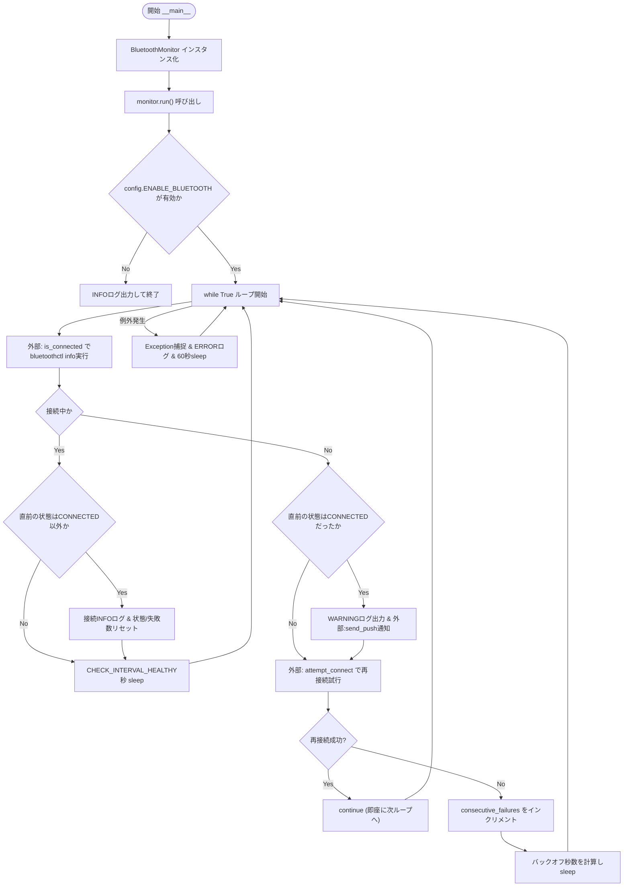
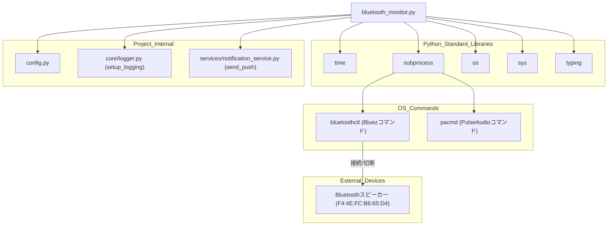

## 1. 解析メタ情報

| 項目 | 内容 |
| --- | --- |
| 対象ファイル | `monitors/old/bluetooth_monitor.py` |
| 言語 | Python |
| 解析対象 | 提供されたコードのみ |
| 推測・補完 | 一切なし |

## 関連ドキュメント

* [logger.md](./logger.md) - `setup_logging`の提供元
* [config.md](./config.md) - `ENABLE_BLUETOOTH`, `LINE_USER_ID`の設定値を提供
* [notification_service.md](./notification_service.md) - `send_push`の提供元
* [connect_speaker.md](./connect_speaker.md) - Bluetoothスピーカー等への音声出力連携という点で近接するモジュール（推測: 用途の近さによる。本ファイルとの直接の依存関係は確認できない）
* [sound_manager.md](./sound_manager.md) - PulseAudioのシンク切り替えという点で音声出力管理に関連するモジュール（推測: 用途の近さによる）

## 2. ファイルの概要

`bluetoothctl`コマンドを`subprocess`経由で呼び出し、特定のBluetoothデバイス(`TARGET_MAC`)の接続状態を常時監視し、切断時は自動的に再接続を試み、切断発生時はDiscordへ通知を送信する常駐監視スクリプトである。
根拠: [TARGET_MAC定義とis_connected] (行番号: 13, 25〜35 / 抜粋: "TARGET_MAC: str = \"F4:4E:FC:B6:65:D4\"")

`is_connected`は`bluetoothctl info <MAC>`の標準出力に`"Connected: yes"`が含まれるかで接続状態を判定する。
根拠: [is_connected] (行番号: 25〜35 / 抜粋: "return \"Connected: yes\" in result.stdout")

`attempt_connect`は`bluetoothctl trust`および`bluetoothctl connect`を実行し、接続成功時は`pacmd set-default-sink`でPulseAudioの出力先をBluetoothスピーカーへ切り替える。
根拠: [attempt_connect] (行番号: 37〜53 / 抜粋: "subprocess.run([\"pacmd\", \"set-default-sink\", sink_name], capture_output=True)")

`run`は`config.ENABLE_BLUETOOTH`が`False`の場合は即座に終了する。それ以外は`while True`の無限ループで接続チェックを行い、切断検知時は通知送信・再接続試行を行い、再接続失敗が続く場合は指数関数的バックオフ（最大`MAX_BACKOFF_SECONDS`=3600秒）で待機時間を延ばす。
根拠: [run] (行番号: 55〜92 / 抜粋: "wait_seconds = min(30 * (2 ** (self.consecutive_failures - 1)), MAX_BACKOFF_SECONDS)")

ループ内で予期せぬ例外が発生した場合はERRORログを出力し60秒待機した上でループを継続する（プロセス自体は終了しない設計）。
根拠: [except Exception] (行番号: 90〜92 / 抜粋: "except Exception as e:\n                logger.error(f\"Unexpected error in monitor loop: {e}\")\n                time.sleep(60)")

## 3. 外部依存関係

### インポート一覧

| 名称 | 種類 | 用途 | 根拠 |
| --- | --- | --- | --- |
| `time` | 標準ライブラリ | 監視ループ内の待機(`time.sleep`)、バックオフ待機 | 根拠: `[import time]` (行番号: 1 / 抜粋: "import time") |
| `subprocess` | 標準ライブラリ | `bluetoothctl`, `pacmd`コマンドの実行 | 根拠: `[import subprocess]` (行番号: 2 / 抜粋: "import subprocess") |
| `os` | 標準ライブラリ | プロジェクトルートへのパス解決 | 根拠: `[import os]` (行番号: 3 / 抜粋: "import os") |
| `sys` | 標準ライブラリ | プロジェクトルートへのパス追加(`sys.path.append`) | 根拠: `[import sys]` (行番号: 4 / 抜粋: "import sys") |
| `Optional` | 標準ライブラリ(`typing`) | 型ヒントの定義 | 根拠: `[from typing import Optional]` (行番号: 5 / 抜粋: "from typing import Optional") |
| `config` | 内部モジュール | Bluetooth監視の有効/無効フラグ、LINEユーザーIDの提供 | 根拠: `[import config]` (行番号: 8 / 抜粋: "import config") |
| `setup_logging` | 内部モジュール(`core.logger`) | ロガーインスタンスの初期化 | 根拠: `[from core.logger import setup_logging]` (行番号: 9 / 抜粋: "from core.logger import setup_logging") |
| `send_push` | 内部モジュール(`services.notification_service`) | 切断検知時のDiscord通知送信 | 根拠: `[from services.notification_service import send_push]` (行番号: 10 / 抜粋: "from services.notification_service import send_push") |

### ブラックボックスとなる外部要素

| 名称 | 理由 | 根拠 |
| --- | --- | --- |
| `config.ENABLE_BLUETOOTH` / `config.LINE_USER_ID` | `config`モジュールの実装が提供されておらず、実際の値が不明であるため。 | 根拠: `[config参照箇所]` (行番号: 57, 74 / 抜粋: "if not getattr(config, \"ENABLE_BLUETOOTH\", True):") |
| `bluetoothctl`コマンド（OSコマンド） | OSにインストールされたBluezのCLIツールであり、その内部実装・実際の出力フォーマットの全容は本ファイルからは確認できないため。 | 根拠: `[subprocess.run([\"bluetoothctl\", ...])]` (行番号: 28〜31 / 抜粋: "[\"bluetoothctl\", \"info\", TARGET_MAC], \n                capture_output=True, text=True, timeout=10") |
| `pacmd`コマンド（PulseAudioのCLIツール） | OSコマンドであり、実行環境依存の内部実装は本ファイルからは確認できないため。 | 根拠: `[subprocess.run([\"pacmd\", ...])]` (行番号: 48 / 抜粋: "subprocess.run([\"pacmd\", \"set-default-sink\", sink_name], capture_output=True)") |
| `send_push`の内部実装 | `services.notification_service`モジュールの実装が本ファイルに含まれていないため。 | 根拠: `[send_push呼び出し]` (行番号: 73〜77 / 抜粋: "send_push(\n                            config.LINE_USER_ID, ") |
| 対象Bluetoothデバイス（`F4:4E:FC:B6:65:D4`）の実機 | ハードウェアデバイスであり、実際の応答挙動は本ファイルからは確認できないため。 | 根拠: `[TARGET_MAC定義]` (行番号: 13 / 抜粋: "TARGET_MAC: str = \"F4:4E:FC:B6:65:D4\"") |

## 4. 主要要素の定義（関数 / エンドポイント / コンポーネント）

### `BluetoothMonitor`

* **役割**: Bluetoothデバイスの接続状態を監視し、切断時の再接続・通知を行うクラス。
* 根拠: `[クラス定義]` (行番号: 20〜23 / 抜粋: "class BluetoothMonitor:")

### `BluetoothMonitor.__init__`

* **役割**: 連続失敗回数(`consecutive_failures`)と直近の接続状態(`last_status`)を初期化する。
* 根拠: `[__init__]` (行番号: 21〜23 / 抜粋: "def __init__(self) -> None:")
* **引数/リクエスト**: `self`のみ。
* 根拠: `[__init__シグネチャ]` (行番号: 21 / 抜粋: "def __init__(self) -> None:")
* **戻り値/レスポンス**: なし(`None`)。
* 根拠: `[__init__シグネチャ]` (行番号: 21 / 抜粋: "def __init__(self) -> None:")
* **副作用**: インスタンス属性(`consecutive_failures`, `last_status`)の設定のみ。
* 根拠: `[__init__本体]` (行番号: 22〜23 / 抜粋: "self.consecutive_failures: int = 0\n        self.last_status: str = \"UNKNOWN\"")
* **エラーハンドリング**: なし。
* 根拠: `[__init__本体]` (行番号: 21〜23 / 抜粋: "def __init__(self) -> None:")

### `BluetoothMonitor.is_connected`

* **役割**: `bluetoothctl info`コマンドの出力から対象デバイスの接続有無を判定する。
* 根拠: `[is_connected]` (行番号: 25〜26 / 抜粋: "Bluetoothデバイスが接続されているか確認する")
* **引数/リクエスト**: `self`のみ。
* 根拠: `[is_connectedシグネチャ]` (行番号: 25 / 抜粋: "def is_connected(self) -> bool:")
* **戻り値/レスポンス**: `bool` (接続中なら`True`、コマンド実行失敗時も`False`)。
* 根拠: `[return文]` (行番号: 32, 35 / 抜粋: "return \"Connected: yes\" in result.stdout")
* **副作用**: `subprocess.run`によるOSコマンド実行。
* 根拠: `[subprocess.run]` (行番号: 28〜31 / 抜粋: "result = subprocess.run(\n                [\"bluetoothctl\", \"info\", TARGET_MAC], ")
* **エラーハンドリング**: `Exception`全般をキャッチしERRORログを出力、`False`を返す。
* 根拠: `[except Exception]` (行番号: 33〜35 / 抜粋: "except Exception as e:\n            logger.error(f\"Status check failed: {e}\")\n            return False")

### `BluetoothMonitor.attempt_connect`

* **役割**: 接続を試行し、成功すればPulseAudioのデフォルト出力シンクをBluetoothスピーカーに設定する。
* 根拠: `[attempt_connect]` (行番号: 37〜38 / 抜粋: "接続を試行し、成功すればPulseAudioのシンクを設定する")
* **引数/リクエスト**: `self`のみ。
* 根拠: `[attempt_connectシグネチャ]` (行番号: 37 / 抜粋: "def attempt_connect(self) -> bool:")
* **戻り値/レスポンス**: `bool` (接続成功時`True`、失敗時`False`)。
* 根拠: `[各return文]` (行番号: 49〜50, 53 / 抜粋: "if ret.returncode == 0:")
* **副作用**: `bluetoothctl trust`/`connect`コマンドの実行、成功時は`pacmd set-default-sink`によるPulseAudio出力先の切り替え。
* 根拠: `[subprocess.run×3]` (行番号: 41〜48 / 抜粋: "subprocess.run([\"bluetoothctl\", \"trust\", TARGET_MAC], capture_output=True, timeout=10)")
* **エラーハンドリング**: `subprocess.TimeoutExpired`をキャッチしERRORログを出力、`False`を返す。それ以外の例外は捕捉していない。
* 根拠: `[except subprocess.TimeoutExpired]` (行番号: 51〜53 / 抜粋: "except subprocess.TimeoutExpired:\n            logger.error(\"Connection attempt timed out.\")\n            return False")

### `BluetoothMonitor.run`

* **役割**: メインの監視ループ。接続状態を定期チェックし、切断検知時に通知・再接続、失敗時はバックオフ待機を行う。
* 根拠: `[run]` (行番号: 55〜61 / 抜粋: "def run(self) -> None:")
* **引数/リクエスト**: `self`のみ。
* 根拠: `[runシグネチャ]` (行番号: 55 / 抜粋: "def run(self) -> None:")
* **戻り値/レスポンス**: なし(`None`)。`config.ENABLE_BLUETOOTH`が`False`の場合は早期`return`（`while True`ループのため通常は復帰しない）。
* 根拠: `[早期returnとwhile True]` (行番号: 57〜59, 62 / 抜粋: "if not getattr(config, \"ENABLE_BLUETOOTH\", True):\n            logger.info(\"🚫 Bluetooth Monitor is disabled by config. Exiting.\")\n            return")
* **副作用**: `time.sleep`による待機、`send_push`による通知送信、`self.last_status`/`self.consecutive_failures`の更新、`is_connected`/`attempt_connect`呼び出しによる連鎖的な副作用（OSコマンド実行）。
* 根拠: `[send_pushとtime.sleep]` (行番号: 69, 73〜77, 88 / 抜粋: "send_push(\n                            config.LINE_USER_ID, ")
* **エラーハンドリング**: ループ内の`Exception`全般をキャッチしERRORログを出力、60秒待機した上でループを継続する（プロセスは終了しない）。
* 根拠: `[except Exception]` (行番号: 90〜92 / 抜粋: "except Exception as e:\n                logger.error(f\"Unexpected error in monitor loop: {e}\")\n                time.sleep(60)")

## 5. 処理フロー図

## 6. 依存関係図

## 7. 次のステップ（リバースエンジニアリングの提案）

| 優先度 | ファイル名(推測可) | 理由 | 根拠 |
| --- | --- | --- | --- |
| 高 | `config.py` | `ENABLE_BLUETOOTH`, `LINE_USER_ID`の実際の設定値を確認するため。 | 根拠: `[config参照箇所]` (行番号: 57, 74 / 抜粋: "if not getattr(config, \"ENABLE_BLUETOOTH\", True):") |
| 中 | `services/notification_service.py` | `send_push`の実際の通知先(`target=\"discord\"`)や送信失敗時の挙動を確認するため。 | 根拠: `[send_push呼び出し]` (行番号: 73〜77 / 抜粋: "send_push(\n                            config.LINE_USER_ID, ") |
| 低 | 本スクリプトを起動するプロセス管理設定(`start_all.py`等) | `while True`の無限ループを持つ常駐プロセスであり、どのように起動・監視・再起動されるかを確認する必要があるため。 | 根拠: `[run内のwhile True]` (行番号: 62 / 抜粋: "while True:") |

## 8. 保守上の注意点

* `Optional`が`typing`からインポートされているが、本ファイル内の型ヒントで使用されている箇所が確認できない（未使用インポートの可能性）。
* 根拠: `[import文]` (行番号: 5 / 抜粋: "from typing import Optional")
* `run`メソッド内で`config.LINE_USER_ID`を`getattr`を介さず直接参照しており（`config.ENABLE_BLUETOOTH`は`getattr`でデフォルト値付きなのと対照的）、`config`モジュールに`LINE_USER_ID`属性自体が存在しない場合は`AttributeError`が送出される可能性がある。
* 根拠: `[config.LINE_USER_ID直接参照]` (行番号: 74 / 抜粋: "config.LINE_USER_ID, ")
* `TARGET_MAC`（監視対象のBluetooth MACアドレス）がモジュールレベル定数としてハードコードされており、対象デバイスを変更する場合はコード修正が必要になる。
* 根拠: `[TARGET_MAC定義]` (行番号: 13 / 抜粋: "TARGET_MAC: str = \"F4:4E:FC:B6:65:D4\"")
* `while True`の無限ループ構造であり、`Exception`捕捉後も60秒待機してループを継続する設計のため、プロセス自体の異常終了は`attempt_connect`内の未捕捉例外（`subprocess.TimeoutExpired`以外）等、限られたケースでのみ発生しうる。
* 根拠: `[except Exceptionとtime.sleep(60)]` (行番号: 90〜92 / 抜粋: "logger.error(f\"Unexpected error in monitor loop: {e}\")\n                time.sleep(60)")
* `monitors/old/`ディレクトリに配置されており、後継または現行版の同等モジュールが別途存在する可能性がある（本ファイル単体では判別不可）。
* 根拠: `[ファイルパス]` (行番号: 該当なし / 抜粋: "monitors/old/bluetooth_monitor.py")

## 9. 不明事項一覧

| 項目 | 理由 | 必要なファイル |
| --- | --- | --- |
| `config.ENABLE_BLUETOOTH` / `config.LINE_USER_ID`の実際の設定値 | `config`モジュールの実装が本ファイルに含まれていないため。 | `config.py` |
| `send_push`の内部実装（Discord通知の実際の送信方法） | `services.notification_service`モジュールの実装が本ファイルに含まれていないため。 | `services/notification_service.py` |
| 本スクリプトの起動・プロセス管理方法 | `while True`の常駐プロセス設計だが、実際にどう起動・監視されるかは本ファイルからは不明であるため。 | プロセス起動スクリプト(`start_all.py`等) |
| `monitors/old/`ディレクトリの位置づけ（現行版との関係） | ディレクトリ名から旧版の可能性が示唆されるが、本ファイル単体では現行版の有無や移行状況を判断できないため。 | `monitors/`配下の他ファイル一覧 |

## 10. 自己検証結果

* [x] 推測・外部ファイルの仕様を一切含んでいない（完了）
* [x] 全関数・全クラス・全コンポーネントを列挙した（完了）
* [x] 全てのインポート要素を列挙した（完了）
* [x] すべての仕様説明に「根拠（行番号・抜粋）」を明記した（完了）
* [x] 根拠漏れが0件である（完了）
* [x] Mermaid構文にエラーの原因となる記号（エスケープ漏れ）がない（完了）
* [x] 不明事項を漏れなく列挙した（完了）
