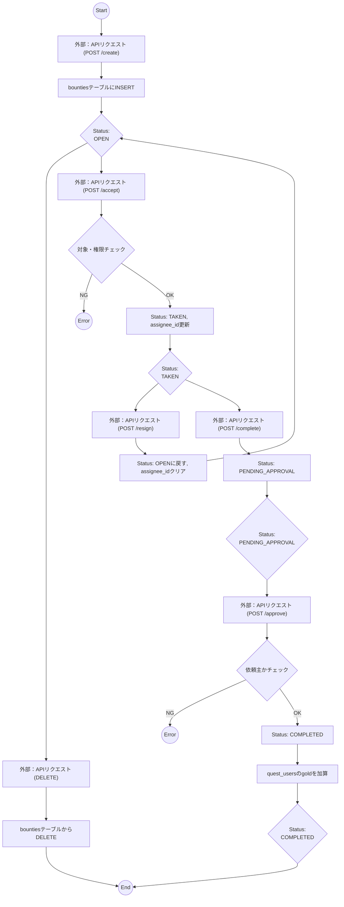
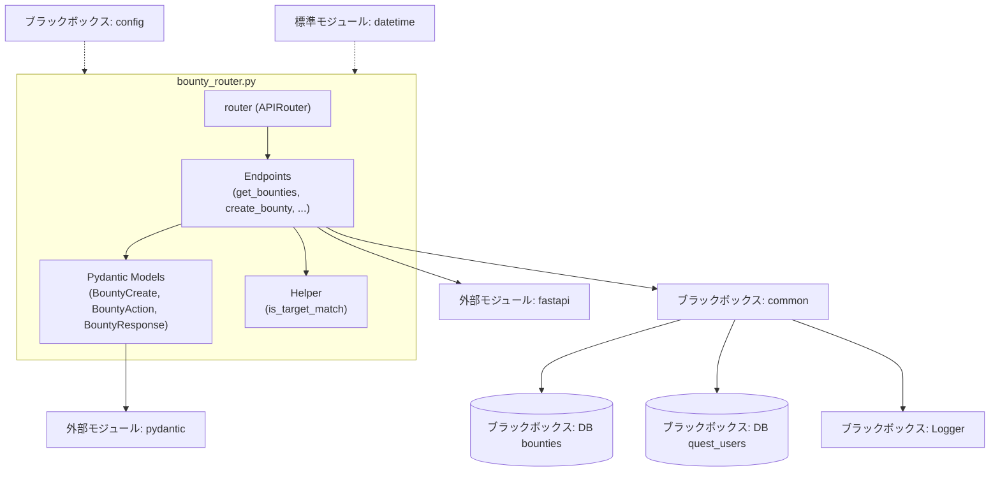

## 1. 解析メタ情報

| 項目 | 内容 |
| --- | --- |
| 対象ファイル | `bounty_router.py` |
| 言語 | Python (FastAPI) |
| 解析対象 | 提供されたコードのみ |
| 推測・補完 | 一切なし |

## 2. ファイルの概要

* FastAPIのルーター機能を利用し、依頼（Bounty）の作成、一覧取得、受注、完了報告、承認、辞退、削除を行うためのAPIエンドポイント群を提供する。
* `common` モジュールのデータベース接続（`get_db_cursor`）を利用して、`bounties` テーブルおよび `quest_users` テーブルに対するCRUD操作や状態遷移（OPEN, TAKEN, PENDING_APPROVAL, COMPLETED）の管理を行う。

## 3. 外部依存関係

### インポート一覧

| 名称 | 種類 | 用途 | 根拠 |
| --- | --- | --- | --- |
| `APIRouter`, `HTTPException`, `Query`, `Body` | 外部ライブラリ (`fastapi`) | APIルーティングおよびリクエスト/レスポンス処理のため | 根拠: `fastapi` (行番号: 2 / 抜粋: "from fastapi import APIRouter...") |
| `BaseModel`, `Field`, `field_validator` | 外部ライブラリ (`pydantic`) | データ検証およびスキーマ定義のため | 根拠: `pydantic` (行番号: 3 / 抜粋: "from pydantic import BaseModel...") |
| `List`, `Optional` | 標準ライブラリ (`typing`) | 型ヒント定義のため | 根拠: `typing` (行番号: 4 / 抜粋: "from typing import List, Optio...") |
| `datetime` | 標準ライブラリ | 日時処理のため（コード内で未使用） | 根拠: `datetime` (行番号: 5 / 抜粋: "import datetime") |
| `common` | ローカル（外部ファイル） | ロギング、DB接続、現在時刻取得などの共通処理のため | 根拠: `common` (行番号: 6 / 抜粋: "import common") |
| `config` | ローカル（外部ファイル） | 不明（明示的な使用箇所なし） | 根拠: `config` (行番号: 7 / 抜粋: "import config") |

### ブラックボックスとなる外部要素

| 名称 | 理由 | 根拠 |
| --- | --- | --- |
| `common.setup_logging` | 実装が提供されていないため、ログの出力先やフォーマットが不明（`common.py`に依存のため要確認）。 | 根拠: `logger` (行番号: 10 / 抜粋: "logger = common.setup_logging...") |
| `common.get_db_cursor` | 実装が提供されていないため、接続先DBの種類、トランザクションの仕様（`commit=True`時の排他制御やロールバック挙動）が不明（`common.py`に依存のため要確認）。 | 根拠: `get_db_cursor` (行番号: 73 / 抜粋: "with common.get_db_cursor() as...") |
| `common.get_now_iso` | 実装が提供されていないため、タイムゾーンや正確なISOフォーマットの形式が不明（`common.py`に依存のため要確認）。 | 根拠: `get_now_iso` (行番号: 133 / 抜粋: "now_iso = common.get_now_iso()") |
| `bounties` テーブル | DDLが提供されていないため、各カラムの厳密な型や制約が不明（DBスキーマに依存のため要確認）。 | 根拠: `SQLクエリ` (行番号: 76 / 抜粋: "SELECT * FROM bounties ORDER B...") |
| `quest_users` テーブル | DDLが提供されていないため、各カラムの厳密な型や制約が不明（DBスキーマに依存のため要確認）。 | 根拠: `SQLクエリ` (行番号: 226 / 抜粋: "UPDATE quest_users SET gold = ...") |

## 4. 主要要素の定義（関数 / エンドポイント / コンポーネント）

### `PARENTS` (定数)

* **役割**: 大人のユーザーIDのリスト（`'dad'`, `'mom'`）を定義する。
* 根拠: `PARENTS` (行番号: 13 / 抜粋: "PARENTS = ['dad', 'mom']")

### `CHILDREN` (定数)

* **役割**: 子供のユーザーIDのリスト（`'daughter'`, `'son'`, `'child'`）を定義する。
* 根拠: `CHILDREN` (行番号: 14 / 抜粋: "CHILDREN = ['daughter', 'son',...")

### `BountyCreate` (Pydantic Model)

* **役割**: 新規依頼作成時の入力スキーマを定義する。
* 根拠: `BountyCreate` (行番号: 18 / 抜粋: "class BountyCreate(BaseModel):")

* **プロパティ**: `title` (str), `description` (Optional[str]), `reward_gold` (int), `target_type` (str), `target_user_id` (Optional[str]), `created_by` (str)
* 根拠: クラス変数定義 (行番号: 19〜26 / 抜粋: "title: str...")

### `BountyCreate.parse_reward_gold` (Validator)

* **役割**: 入力された `reward_gold` を数値に変換し、負の数は0、10,000を超える場合は10,000に丸める。数値として解釈できない場合は0を返す。
* 根拠: `parse_reward_gold` (行番号: 28〜48 / 抜粋: "def parse_reward_gold(cls, v):...")

* **引数/リクエスト**: `v` (任意の型)
* 根拠: メソッド引数 (行番号: 30 / 抜粋: "def parse_reward_gold(cls, v):")

* **戻り値/レスポンス**: `int` (0〜10,000の整数)
* 根拠: 戻り値 (行番号: 44, 48 / 抜粋: "return int(val)")

* **副作用**: なし
* 根拠: メソッド内ロジック (行番号: 30〜48 / 抜粋: "try: val = float(v)...")

* **エラーハンドリング**: `ValueError`, `TypeError` をキャッチし、例外発生時は `0` を返す。
* 根拠: 例外処理 (行番号: 46〜48 / 抜粋: "except (ValueError, TypeError)...")

### `BountyAction` (Pydantic Model)

* **役割**: 依頼に対するアクション（受注、完了、承認など）実行時の入力スキーマを定義する。
* 根拠: `BountyAction` (行番号: 50 / 抜粋: "class BountyAction(BaseModel):")

* **プロパティ**: `user_id` (str)
* 根拠: クラス変数定義 (行番号: 51 / 抜粋: "user_id: str")

### `BountyResponse` (Pydantic Model)

* **役割**: 依頼情報を返却する際のレスポンススキーマを定義する。
* 根拠: `BountyResponse` (行番号: 53 / 抜粋: "class BountyResponse(BaseMode...")

### `is_target_match` (関数)

* **役割**: 指定されたユーザーIDが、募集対象の条件（ALL, USER, ADULTS, CHILDREN）に一致するかを判定する。
* 根拠: `is_target_match` (行番号: 68〜77 / 抜粋: "def is_target_match(user_id: s...")

* **引数/リクエスト**: `user_id` (str), `target_type` (str), `target_user_id` (Optional[str])
* 根拠: 関数引数 (行番号: 68 / 抜粋: "def is_target_match(user_id: s...")

* **戻り値/レスポンス**: `bool`
* 根拠: 関数定義 (行番号: 68 / 抜粋: "-> bool:")

* **副作用**: なし
* 根拠: 関数内ロジック (行番号: 69〜77 / 抜粋: "if target_type == 'ALL':...")

* **エラーハンドリング**: なし
* 根拠: 関数内ロジック (行番号: 69〜77 / 抜粋: "if target_type == 'ALL':...")

### `get_bounties` (エンドポイント)

* **役割**: 掲示板に表示すべき依頼一覧（自分が作成したもの、自分が受注したもの、自分に向けられた募集中のもの）を取得し、表示用フラグ（`is_mine`, `is_assigned_to_me`, `can_accept`）を付与して返却する。
* 根拠: `get_bounties` (行番号: 81〜125 / 抜粋: "def get_bounties(user_id: str ...")

* **引数/リクエスト**: `user_id` (str: Queryパラメータ)
* 根拠: 関数引数 (行番号: 82 / 抜粋: "def get_bounties(user_id: str ...")

* **戻り値/レスポンス**: `List[BountyResponse]`
* 根拠: デコレータ定義 (行番号: 81 / 抜粋: "response_model=List[BountyResp...")

* **副作用**: DBからのデータ読み取り（`bounties` テーブル全件取得）。
* 根拠: DBクエリ (行番号: 92 / 抜粋: "rows = cur.execute("SELECT * F...")

* **エラーハンドリング**: なし
* 根拠: 関数内ロジック (行番号: 90〜125 / 抜粋: "with common.get_db_cursor() as...")

### `create_bounty` (エンドポイント)

* **役割**: 新しい依頼をDBに作成する。
* 根拠: `create_bounty` (行番号: 127〜145 / 抜粋: "def create_bounty(bounty: Boun...")

* **引数/リクエスト**: `bounty` (BountyCreate)
* 根拠: 関数引数 (行番号: 128 / 抜粋: "def create_bounty(bounty: Boun...")

* **戻り値/レスポンス**: `dict` (`{"status": "created"}`)
* 根拠: 戻り値 (行番号: 145 / 抜粋: "return {"status": "created"}")

* **副作用**: DBへのデータ書き込み（`bounties` テーブルへのINSERT）、ロギング。
* 根拠: DBクエリ及びロガー (行番号: 134〜143 / 抜粋: "INSERT INTO bounties ( title, ...")

* **エラーハンドリング**: `bounty.reward_gold < 0` の場合、HTTP 400エラーを送出する。
* 根拠: 例外処理 (行番号: 130 / 抜粋: "raise HTTPException(status_cod...")

### `accept_bounty` (エンドポイント)

* **役割**: 指定された依頼を受注状態（`TAKEN`）に更新し、受注者（`assignee_id`）を登録する。
* 根拠: `accept_bounty` (行番号: 147〜178 / 抜粋: "def accept_bounty(bounty_id: i...")

* **引数/リクエスト**: `bounty_id` (int), `action` (BountyAction)
* 根拠: 関数引数 (行番号: 148 / 抜粋: "def accept_bounty(bounty_id: i...")

* **戻り値/レスポンス**: `dict` (`{"status": "taken", "assignee_id": action.user_id}`)
* 根拠: 戻り値 (行番号: 178 / 抜粋: "return {"status": "taken", "as...")

* **副作用**: DBからのデータ読み取り、DBへのデータ書き込み（`bounties` テーブルのUPDATE）、ロギング。
* 根拠: DBクエリ及びロガー (行番号: 167〜176 / 抜粋: "UPDATE bounties SET status = '...")

* **エラーハンドリング**: レコード不在時(404)、ステータスがOPEN以外時(409)、依頼主と一致時(400)、対象外ユーザー時(403)、排他制御による更新失敗時(409)に `HTTPException` を送出する。
* 根拠: 例外処理群 (行番号: 153〜174 / 抜粋: "raise HTTPException(status_cod...")

### `complete_bounty` (エンドポイント)

* **役割**: 受注者が依頼の完了報告を行い、ステータスを承認待ち（`PENDING_APPROVAL`）に更新する。
* 根拠: `complete_bounty` (行番号: 181〜196 / 抜粋: "def complete_bounty(bounty_id:...")

* **引数/リクエスト**: `bounty_id` (int), `action` (BountyAction)
* 根拠: 関数引数 (行番号: 182 / 抜粋: "def complete_bounty(bounty_id:...")

* **戻り値/レスポンス**: `dict` (`{"status": "pending_approval"}`)
* 根拠: 戻り値 (行番号: 196 / 抜粋: "return {"status": "pending_app...")

* **副作用**: DBへのデータ書き込み（`bounties` テーブルのUPDATE）、ロギング。
* 根拠: DBクエリ及びロガー (行番号: 185〜194 / 抜粋: "UPDATE bounties SET status = '...")

* **エラーハンドリング**: 更新件数が0件（ステータス不整合または権限なし）の場合、HTTP 400エラーを送出する。
* 根拠: 例外処理 (行番号: 191 / 抜粋: "raise HTTPException(status_cod...")

### `approve_bounty` (エンドポイント)

* **役割**: 依頼主が完了報告を承認し、ステータスを完了（`COMPLETED`）に更新し、受注者の所持ゴールドを増加させる。
* 根拠: `approve_bounty` (行番号: 198〜231 / 抜粋: "def approve_bounty(bounty_id: ...")

* **引数/リクエスト**: `bounty_id` (int), `action` (BountyAction)
* 根拠: 関数引数 (行番号: 199 / 抜粋: "def approve_bounty(bounty_id: ...")

* **戻り値/レスポンス**: `dict` (`{"status": "completed", "reward_paid": reward}`)
* 根拠: 戻り値 (行番号: 231 / 抜粋: "return {"status": "completed",...")

* **副作用**: DB読み取り、DBデータ書き込み（`bounties` テーブルのUPDATE、`quest_users` テーブルのUPDATE）、ロギング。
* 根拠: DBクエリ群 (行番号: 216〜229 / 抜粋: "UPDATE bounties SET status = '..." 及び "UPDATE quest_users SET gold = ...")

* **エラーハンドリング**: レコード不在時(404)、ステータスがPENDING_APPROVAL以外時(400)、依頼主以外が実行時(403)に `HTTPException` を送出する。
* 根拠: 例外処理群 (行番号: 204〜211 / 抜粋: "raise HTTPException(status_cod...")

### `delete_bounty` (エンドポイント)

* **役割**: 依頼を取り下げ、レコードを物理削除する。
* 根拠: `delete_bounty` (行番号: 233〜252 / 抜粋: "def delete_bounty(bounty_id: i...")

* **引数/リクエスト**: `bounty_id` (int), `user_id` (str: Queryパラメータ)
* 根拠: 関数引数 (行番号: 234 / 抜粋: "def delete_bounty(bounty_id: i...")

* **戻り値/レスポンス**: `dict` (`{"status": "deleted"}`)
* 根拠: 戻り値 (行番号: 252 / 抜粋: "return {"status": "deleted"}")

* **副作用**: DBからのデータ削除（`bounties` テーブルのDELETE）、ロギング。
* 根拠: DBクエリ及びロガー (行番号: 247〜250 / 抜粋: "cur.execute("DELETE FROM bount...")

* **エラーハンドリング**: レコード不在時(404)、依頼主以外が実行時(403)、ステータスがOPEN以外時(400)に `HTTPException` を送出する。
* 根拠: 例外処理群 (行番号: 238〜244 / 抜粋: "raise HTTPException(status_cod...")

### `resign_bounty` (エンドポイント)

* **役割**: 受注者が依頼の受注を辞退し、ステータスを `OPEN` に戻す。
* 根拠: `resign_bounty` (行番号: 254〜275 / 抜粋: "def resign_bounty(bounty_id: i...")

* **引数/リクエスト**: `bounty_id` (int), `action` (BountyAction)
* 根拠: 関数引数 (行番号: 255 / 抜粋: "def resign_bounty(bounty_id: i...")

* **戻り値/レスポンス**: `dict` (`{"status": "resigned"}`)
* 根拠: 戻り値 (行番号: 275 / 抜粋: "return {"status": "resigned"}")

* **副作用**: DBへのデータ書き込み（`bounties` テーブルのUPDATE）、ロギング。
* 根拠: DBクエリ及びロガー (行番号: 267〜273 / 抜粋: "UPDATE bounties SET status = '...")

* **エラーハンドリング**: レコード不在時(404)、ステータスがTAKEN以外または受注者以外が実行時(400)に `HTTPException` を送出する。
* 根拠: 例外処理群 (行番号: 259〜263 / 抜粋: "raise HTTPException(status_cod...")

## 5. 処理フロー図

## 6. 依存関係図

## 7. 次のステップ（リバースエンジニアリングの提案）

| 優先度 | ファイル名(推測可) | 理由 | 根拠 |
| --- | --- | --- | --- |
| 高 | `common.py` | DB接続処理、トランザクション制御の厳密な仕様、現在時刻取得の実装詳細を確認するため。 | `import common`, `common.get_db_cursor()`, `common.get_now_iso()` (行番号: 6, 73, 133) |
| 高 | DBスキーマ定義ファイル（`schema.sql`等） | `bounties`テーブル、`quest_users`テーブルの正確なデータ型、制約（NOT NULL、外部キー等）を確認するため。 | SQLクエリ内のテーブル名 (行番号: 76, 226) |
| 中 | `config.py` | インポートされているが使用箇所がないため、モジュール初期化時の副作用等がないか確認するため。 | `import config` (行番号: 7) |

## 8. 保守上の注意点

* `BountyCreate` 内のバリデーター `parse_reward_gold` は、変換に失敗（`ValueError`, `TypeError`）した場合に例外を送出せず静かに `0` を返す仕様となっており、呼び出し側で入力不備を検知できない。
* `get_bounties` において、`SELECT * FROM bounties` でDBから全件取得した後にPythonのメモリ上でループを用いてフィルタリングを行っているため、レコード数が増加した際にパフォーマンス低下やメモリ枯渇が発生する可能性が高い。
* `approve_bounty` にて、`quest_users` テーブルの `gold` を更新（`UPDATE quest_users SET gold = gold + ? WHERE user_id = ?`）しているが、対象ユーザーが存在しなかった場合の `cur.rowcount == 0` チェックやエラーハンドリングが実装されていない。
* `config` モジュールおよび `datetime` モジュールがインポートされているが、ファイル内で一度も使用されていない（未使用コード）。

## 9. 不明事項一覧

| 項目 | 理由 | 必要なファイル |
| --- | --- | --- |
| `common.get_db_cursor` のトランザクション仕様 | `commit=True` 引数を渡した際のロールバック挙動や、複数クエリ実行時の排他制御の厳密な仕様が不明。 | `common.py` |
| `common.get_now_iso` の日時仕様 | 生成されるISO 8601フォーマットのタイムゾーン（UTCかJSTか等）が不明。 | `common.py` |
| DBテーブルのカラム型と制約 | `bounties` および `quest_users` テーブルのカラムの厳密なデータ型、外部キー制約、デフォルト値が不明。 | DBのDDL定義ファイル |
| `config` モジュールの副作用 | 明示的な使用がないため、インポート時の副作用（環境変数のロード等）の有無が不明。 | `config.py` |

## 10. 自己検証結果

* [完了] 推測・外部ファイルの仕様を一切含んでいない
* [完了] 全関数・全クラス・全コンポーネントを列挙した
* [完了] 全てのインポート要素を列挙した
* [完了] すべての仕様説明に「根拠（行番号・抜粋）」を明記した
* [完了] 根拠漏れが0件である
* [完了] Mermaid構文にエラーの原因となる記号（エスケープ漏れ）がない
* [完了] 不明事項を漏れなく列挙した