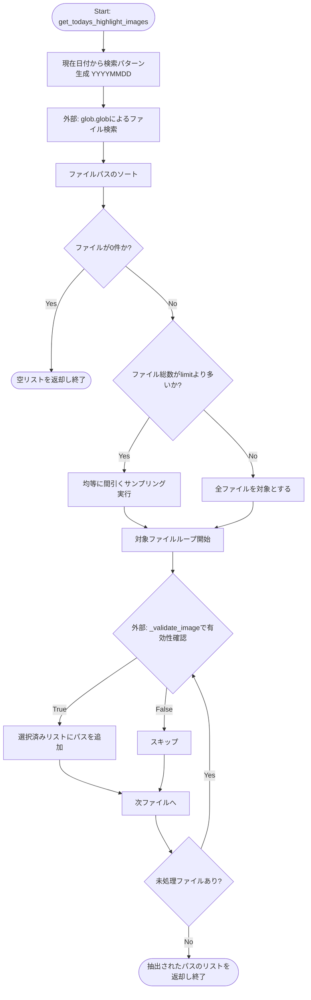
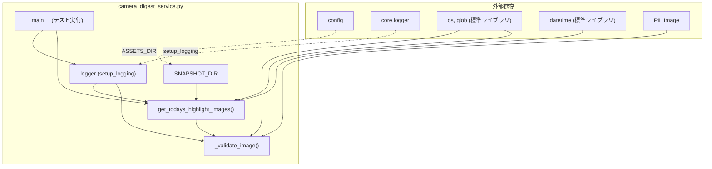

## 1. 解析メタ情報

| 項目 | 内容 |
| --- | --- |
| 対象ファイル | camera_digest_service.py |
| 言語 | Python |
| 解析対象 | 提供されたコードのみ |
| 推測・補完 | 一切なし |

## 2. ファイルの概要

本ファイルは、設定されたディレクトリから当日のスナップショット画像を取得し、画像の破損や読み込み可否を検証した上で、指定枚数に均等サンプリングして有効な画像のファイルパス一覧を提供する機能を持つ。

* 根拠: `get_todays_highlight_images` のDocstringおよび処理内容 (行番号: 46〜83 / 抜粋: "今日のスナップショットから、AI解析用に有効な画像を抽出・サンプリングする。")

## 3. 外部依存関係

### インポート一覧

| 名称 | 種類 | 用途 | 根拠 |
| --- | --- | --- | --- |
| `os` | 標準ライブラリ | パス結合(`os.path.join`)、ファイル存在確認(`os.path.exists`)、ファイル名取得(`os.path.basename`) | `import os` (行番号: 2 / 抜粋: "import os") |
| `glob` | 標準ライブラリ | パターンマッチによるファイル一覧の取得(`glob.glob`) | `import glob` (行番号: 3 / 抜粋: "import glob") |
| `datetime` | 標準ライブラリ | 現在の日付取得と文字列フォーマット(`datetime.now().strftime`) | `from datetime import datetime` (行番号: 4 / 抜粋: "from datetime import datetime") |
| `List` | 標準ライブラリ | 型ヒント | `from typing import List` (行番号: 5 / 抜粋: "from typing import List") |
| `Image` | 外部ライブラリ (PIL) | 画像の読み込みと検証(`Image.open`, `verify`) | `from PIL import Image...` (行番号: 7 / 抜粋: "from PIL import Image, Unident...") |
| `UnidentifiedImageError` | 外部ライブラリ (PIL) | 画像形式が不明な場合のエラーハンドリング | `from PIL import Image...` (行番号: 7 / 抜粋: "from PIL import Image, Unident...") |
| `config` | 内部モジュール | 設定値(`ASSETS_DIR`)の参照 | `import config` (行番号: 9 / 抜粋: "import config") |
| `setup_logging` | 内部モジュール | 本ファイル用のロガー初期化 | `from core.logger import setup_...` (行番号: 11 / 抜粋: "from core.logger import setup_...") |

### ブラックボックスとなる外部要素

| 名称 | 理由 | 根拠 |
| --- | --- | --- |
| `config.ASSETS_DIR` | `config`モジュール内の実装が提供されておらず、基準となるディレクトリパスの具体的な値が不明であるため。 | `os.path.join(config.ASSETS_DIR, "snapshots")` (行番号: 17 / 抜粋: "os.path.join(config.ASSETS_DIR...") |
| `core.logger.setup_logging` | 関数の実装が提供されておらず、ログの出力先、フォーマット、デフォルトのログレベルが不明であるため。 | `logger = setup_logging(__name__)` (行番号: 14 / 抜粋: "logger = setup_logging(_*name*...") |

## 4. 主要要素の定義（関数 / エンドポイント / コンポーネント）

### `_validate_image`

* **役割**: 指定されたファイルパスの画像が存在し、画像ファイルとして正常に開けるかを検証する。
* 根拠: `_validate_image` 関数の実装 (行番号: 19〜43 / 抜粋: "画像ファイルが正常に開けるか検証する。")

* **引数/リクエスト**: `file_path: str` (検証対象のファイルパス)
* 根拠: 関数のシグネチャ (行番号: 19 / 抜粋: "def _validate_image(file_path:...")

* **戻り値/レスポンス**: `bool` (正常な画像ファイルであればTrue、破損や読込不可の場合はFalse)
* 根拠: 関数のシグネチャとDocstring (行番号: 19, 27 / 抜粋: "-> bool:")

* **副作用**: なし (ファイルの読み込みとログ出力のみ)
* 根拠: 関数内の処理内容 (行番号: 29〜43 / 抜粋: "with Image.open(file_path) as ...")

* **エラーハンドリング**: `UnidentifiedImageError`, `OSError`, および広範な `Exception` をキャッチし、ログ出力の上 `False` を返す。
* 根拠: `except` ブロック (行番号: 38〜43 / 抜粋: "except (UnidentifiedImageError...")

### `get_todays_highlight_images`

* **役割**: 当日の日付文字列をもとにスナップショット画像一覧を取得・ソートし、指定上限数に応じて均等にサンプリングを行い、有効な画像のみを抽出して返す。
* 根拠: 関数の実装とDocstring (行番号: 46〜83 / 抜粋: "今日のスナップショットから、AI解析用に有効な画像を抽出・サンプリングする。")

* **引数/リクエスト**: `limit: int = 10` (抽出する画像の最大枚数)
* 根拠: 関数のシグネチャ (行番号: 46 / 抜粋: "limit: int = 10")

* **戻り値/レスポンス**: `List[str]` (有効な画像ファイルパスのリスト)
* 根拠: 関数のシグネチャと戻り値 (行番号: 46, 83 / 抜粋: "-> List[str]:")

* **副作用**: なし (ファイルシステムの検索とログ出力のみ)
* 根拠: 関数内の処理内容 (行番号: 54〜83 / 抜粋: "glob.glob(pattern)")

* **エラーハンドリング**: 該当する画像がない場合は空のリストを返す。ファイルの破損検証は `_validate_image` に委譲してエラーを回避する。
* 根拠: ファイル数0件時の処理および有効性チェックループ (行番号: 62〜64, 78〜81 / 抜粋: "if not files: return []")

### `__main__` ブロック

* **役割**: スクリプトが直接実行された際に、抽出処理 (`get_todays_highlight_images`) をテスト実行し、結果と抽出されたファイル名をログ出力する。
* 根拠: `if __name__ == "__main__":` 配下の実装 (行番号: 87〜101 / 抜粋: "# テスト実行")

* **引数/リクエスト**: なし
* 根拠: トップレベルの実行ブロックであるため (行番号: 87 / 抜粋: "if **name** == "**main**":")

* **戻り値/レスポンス**: なし
* 根拠: トップレベルの実行ブロックであるため (行番号: 87〜101 / 抜粋: "if **name** == "**main**":")

* **副作用**: テスト用のログ出力処理が実行される。
* 根拠: `logger.info`, `logger.debug`, `logger.critical` の呼び出し (行番号: 90, 93, 97, 101 / 抜粋: "logger.info("Result: {len(imgs...")

* **エラーハンドリング**: 全体の処理を `try-except Exception as e` で囲み、エラー発生時は `logger.critical` でスタックトレース付きのログを出力する。
* 根拠: `try-except` ブロック (行番号: 89, 100〜101 / 抜粋: "except Exception as e: logger....")

## 5. 処理フロー図

## 6. 依存関係図

## 7. 次のステップ（リバースエンジニアリングの提案）

| 優先度 | ファイル名(推測可) | 理由 | 根拠 |
| --- | --- | --- | --- |
| 高 | `config.py` | `ASSETS_DIR`の実体が不明なため、対象となるディレクトリの物理パスやシステム全体のディレクトリ構造を把握するため。 | `import config` (行番号: 9) / `config.ASSETS_DIR` (行番号: 17) |
| 中 | 画像生成元となるスクリプト (例: `camera_capture.py` など) | `snapshot_{id}_{YYYYMMDD}_{HHMMSS}.jpg` の命名規則で画像を生成している処理の流れと、ファイルの保存タイミングを把握するため。 | `f"*_{today_str}_*.jpg"` (行番号: 56) |
| 低 | `core/logger.py` | ログがどこに出力されているか（標準出力、ファイル、外部サービス等）および設定レベルを確認するため。 | `from core.logger import setup_logging` (行番号: 11) |

## 8. 保守上の注意点

* `_validate_image` 内で `os.path.exists` の確認後、`Image.open` を実行するまでの間にファイルが削除または変更される競合（Time-of-check to time-of-use）が発生する可能性がある。
* 根拠: (行番号: 29〜36)

* `_validate_image` 内で `Exception` による広範なエラーキャッチを行っており、予期せぬ不具合（構文エラーやメモリ不足など）を握りつぶし、単なる `False` として処理してしまう可能性がある。
* 根拠: (行番号: 41〜43)

* `get_todays_highlight_images` のサンプリング処理において `int(i * step)` を用いているため、総数や `limit` の値によってはインデックスが完全に均等にならず、分布にわずかな偏りが生じる。
* 根拠: (行番号: 72〜73)

* `get_todays_highlight_images` で `_validate_image` が `False` を返したファイルはスキップされるため、結果として返却されるリストの要素数が `limit` を下回る可能性がある。
* 根拠: (行番号: 78〜81)

## 9. 不明事項一覧

| 項目 | 理由 | 必要なファイル |
| --- | --- | --- |
| 画像ファイルの生成元とライフサイクル | このファイルはファイルの読み取りのみを行っており、画像がいつ、どのようなプロセスで生成・削除されるかが不明。 | 画像キャプチャやクリーンアップを担う実装ファイル |
| `ASSETS_DIR` の物理パス | 設定ファイルからの読み込みとなっているため、ローカルパスかネットワークマウントか等のインフラ仕様が不明。 | `config.py` |
| ログの運用仕様 | `logger` の実装が外部化されているため、ログレベル（DEBUG, INFOなど）が環境ごとにどう制御されているか不明。 | `core/logger.py` |

## 10. 自己検証結果

* [x] 完了: 推測・外部ファイルの仕様を一切含んでいない
* [x] 完了: 全関数・全クラス・全コンポーネントを列挙した
* [x] 完了: 全てのインポート要素を列挙した
* [x] 完了: すべての仕様説明に「根拠（行番号・抜粋）」を明記した
* [x] 完了: 根拠漏れが0件である
* [x] 完了: Mermaid構文にエラーの原因となる記号（エスケープ漏れ）がない
* [x] 完了: 不明事項を漏れなく列挙した