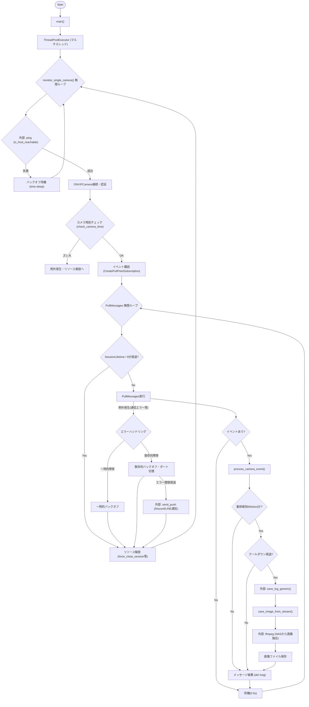
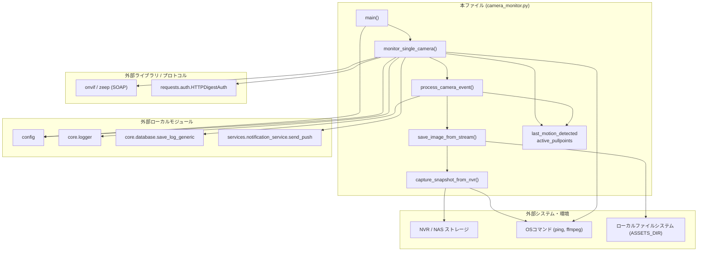

## 1. 解析メタ情報

| 項目 | 内容 |
| --- | --- |
| 対象ファイル | camera_monitor.py |
| 言語 | Python |
| 解析対象 | 提供されたコードのみ |
| 推測・補完 | 一切なし |

## 2. ファイルの概要

このファイルは、ONVIFプロトコルを用いてネットワークカメラ（防犯カメラ）に接続し、動体検知イベントを監視するシステムの一部である。
カメラからのイベント（PullPointサブスクリプション）を定期的に取得し、動体が検知された際には外部データベースへログを記録し、NVR（ネットワークビデオレコーダー）上の動画ファイルからFFmpegを用いてスナップショット画像を切り出して保存する責務を持つ。また、ネットワーク断やセッション切れに対する自動再接続・リソース解放機能を備えている。

## 3. 外部依存関係

### インポート一覧

| 名称 | 種類 | 用途 | 根拠 |
| --- | --- | --- | --- |
| `os`, `sys`, `time`, `socket`, `subprocess`, `uuid`, `platform` | 標準ライブラリ | システム操作、プロセス実行、パス解決、通信等 | 根拠: `import os` など (行番号: 2〜14 / 抜粋: "import os") |
| `asyncio` | 標準ライブラリ | 非同期イベントループの実行 | 根拠: `import asyncio` (行番号: 4 / 抜粋: "import asyncio") |
| `logging` | 標準ライブラリ | ログ出力（直接使用せず外部モジュール経由用） | 根拠: `import logging` (行番号: 7 / 抜粋: "import logging") |
| `datetime` (dt_class, timedelta) | 標準ライブラリ | 時刻取得、時間差計算、タイムゾーン処理 | 根拠: `from datetime import datetime ...` (行番号: 15 / 抜粋: "from datetime import datetime") |
| `typing` | 標準ライブラリ | 型アノテーション | 根拠: `from typing import Optional...` (行番号: 16 / 抜粋: "from typing import Optional") |
| `concurrent.futures.ThreadPoolExecutor` | 標準ライブラリ | 複数カメラ監視プロセスの並行実行 | 根拠: `from concurrent.futures...` (行番号: 17 / 抜粋: "from concurrent.futures import") |
| `requests.auth.HTTPDigestAuth` | 外部ライブラリ | ONVIFサービスのDigest認証 | 根拠: `from requests.auth import...` (行番号: 20 / 抜粋: "from requests.auth import") |
| `onvif` (ONVIFCamera, ONVIFService, ONVIFError) | 外部ライブラリ | ONVIFカメラとの通信およびイベント購読 | 根拠: `from onvif import ONVIFCamera...` (行番号: 24 / 抜粋: "from onvif import ONVIFCamera") |
| `zeep.exceptions` | 外部ライブラリ | SOAP通信時の例外捕捉 | 根拠: `import zeep.exceptions` (行番号: 26 / 抜粋: "import zeep.exceptions") |
| `lxml.etree` | 外部ライブラリ | ONVIFから返却されるXMLのパース | 根拠: `from lxml import etree` (行番号: 27 / 抜粋: "from lxml import etree") |
| `config` | ローカルモジュール | 設定値（カメラ情報、パス、定数）の取得 | 根拠: `import config` (行番号: 35 / 抜粋: "import config") |
| `core.logger.setup_logging` | ローカルモジュール | ロガーの初期化 | 根拠: `from core.logger import...` (行番号: 36 / 抜粋: "from core.logger import setup") |
| `core.database.save_log_generic` | ローカルモジュール | 動体検知時のデータベース保存 | 根拠: `from core.database import...` (行番号: 37 / 抜粋: "from core.database import save_") |
| `services.notification_service.send_push` | ローカルモジュール | 障害時の管理者へのプッシュ通知送信 | 根拠: `from services.notification_service...` (行番号: 38 / 抜粋: "from services.notification") |

### ブラックボックスとなる外部要素

| 名称 | 理由 | 根拠 |
| --- | --- | --- |
| `config` モジュールの詳細 | `CAMERAS`, `ASSETS_DIR`, `MOTION_COOLDOWN_SEC`, `LINE_USER_ID` 等の構造や定義値が本ファイルに存在しないため。 | 根拠: `config.CAMERAS` (行番号: 486 / 抜粋: "for cam in config.CAMERAS") |
| `save_log_generic` の実装・スキーマ | 関数の内部ロジック、および保存先DBの種類・テーブルスキーマが不明なため。 | 根拠: `save_log_generic("device_records"...` (行番号: 290 / 抜粋: "save_log_generic("device_records") |
| `send_push` の実装 | プッシュ通知の送信手段（LINE等）や実際の処理内容が不明なため。 | 根拠: `send_push(config.LINE_USER_ID...` (行番号: 425 / 抜粋: "send_push(") |
| NVR（NAS）のディレクトリ構造 | 外部ストレージ上の動画ファイルの配置ルールが環境依存であるため。 | 根拠: `cam_conf.get("nas_folder")` (行番号: 154 / 抜粋: "nas_folder = cam_conf.get(") |

## 4. 主要要素の定義（関数 / エンドポイント / コンポーネント）

### `cleanup_handler`

* **役割**: SIGINTやSIGTERMなどのプロセス終了シグナルを受信した際に、アクティブなPullPointサブスクリプションを解除して安全に終了する。
* 根拠: `cleanup_handler` (行番号: 62〜72 / 抜粋: "def cleanup_handler(signum:")

* **引数/リクエスト**: `signum: int` (シグナル番号), `frame: Any` (実行フレーム)
* 根拠: `cleanup_handler` (行番号: 62 / 抜粋: "def cleanup_handler(signum: int,")

* **戻り値/レスポンス**: `None`
* 根拠: `cleanup_handler` (行番号: 62 / 抜粋: "-> None:")

* **副作用**: ONVIFのUnsubscribeリクエスト送信、プロセス終了(`os._exit(0)`)。
* 根拠: `os._exit` (行番号: 72 / 抜粋: "os._exit(0)")

* **エラーハンドリング**: Unsubscribe時の例外(`Exception`)は無視(`pass`)される。
* 根拠: `except Exception` (行番号: 69 / 抜粋: "except Exception: pass")

### `is_host_reachable`

* **役割**: OSのpingコマンドを実行し、指定されたIPアドレスの到達性を確認する。
* 根拠: `is_host_reachable` (行番号: 77〜90 / 抜粋: "def is_host_reachable(ip:")

* **引数/リクエスト**: `ip: str` (対象のIPアドレス)
* 根拠: `is_host_reachable` (行番号: 77 / 抜粋: "def is_host_reachable(ip: str)")

* **戻り値/レスポンス**: `bool` (到達可能ならTrue)
* 根拠: `is_host_reachable` (行番号: 77 / 抜粋: "-> bool:")

* **副作用**: 外部コマンド（ping）の実行。
* 根拠: `subprocess.run` (行番号: 83 / 抜粋: "subprocess.run(cmd,")

* **エラーハンドリング**: タイムアウトや実行例外発生時はFalseを返す。
* 根拠: `except` (行番号: 88 / 抜粋: "except (subprocess.TimeoutExpired")

### `find_wsdl_path`

* **役割**: `sys.path` を走査し、ONVIFのWSDLファイル (`devicemgmt.wsdl`) が存在するディレクトリパスを探索する。
* 根拠: `find_wsdl_path` (行番号: 93〜101 / 抜粋: "def find_wsdl_path() ->")

* **引数/リクエスト**: なし
* 根拠: `find_wsdl_path` (行番号: 93 / 抜粋: "def find_wsdl_path() ->")

* **戻り値/レスポンス**: `Optional[str]` (見つかったディレクトリパス、なければNone)
* 根拠: `find_wsdl_path` (行番号: 93 / 抜粋: "-> Optional[str]:")

* **副作用**: なし
* 根拠: `find_wsdl_path` (行番号: 93〜101 / 抜粋: "return candidate")

* **エラーハンドリング**: なし

### `perform_emergency_diagnosis`

* **役割**: 指定されたIPの特定ポート（80, 2020）へのTCP接続テストを行い、ポートの状態（Open/Closed）をログに出力する。
* 根拠: `perform_emergency_diagnosis` (行番号: 105〜120 / 抜粋: "def perform_emergency_diagnosis")

* **引数/リクエスト**: `ip: str` (対象のIPアドレス)
* 根拠: `perform_emergency_diagnosis` (行番号: 105 / 抜粋: "(ip: str) -> Dict[int, bool]:")

* **戻り値/レスポンス**: `Dict[int, bool]` (ポート番号と接続可否の辞書)
* 根拠: `perform_emergency_diagnosis` (行番号: 105 / 抜粋: "-> Dict[int, bool]:")

* **副作用**: TCPソケットの作成と接続試行。
* 根拠: `sock.connect_ex` (行番号: 112 / 抜粋: "res = sock.connect_ex((ip,")

* **エラーハンドリング**: 接続エラー時は例外をキャッチし、エラー文字列をログ用メッセージに追記する。
* 根拠: `except Exception` (行番号: 116 / 抜粋: "except Exception as e:")

### `check_camera_time`

* **役割**: カメラのシステム時刻(UTC)を取得し、稼働サーバーの現在時刻(JST想定)との差分が5分(300秒)以上あるかチェックして警告を出す。
* 根拠: `check_camera_time` (行番号: 122〜147 / 抜粋: "def check_camera_time(devicemgmt")

* **引数/リクエスト**: `devicemgmt: Any` (ONVIFデバイス管理サービス), `cam_name: str` (カメラ名)
* 根拠: `check_camera_time` (行番号: 122 / 抜粋: "(devicemgmt: Any, cam_name: str)")

* **戻り値/レスポンス**: `bool` (時刻ズレが5分以内の場合、またはチェック失敗時はFail-SoftのためTrue、ズレが大きい場合はFalse)
* 根拠: `check_camera_time` (行番号: 122 / 抜粋: "-> bool:")

* **副作用**: `devicemgmt.GetSystemDateAndTime()` によるカメラへのAPIリクエスト。
* 根拠: `devicemgmt.GetSystemDateAndTime()` (行番号: 125 / 抜粋: "sys_dt = devicemgmt.GetSystemDa")

* **エラーハンドリング**: XML/Dateパースエラーなどの例外が発生した場合はエラーログを出力し、True（Fail-Soft）を返す。
* 根拠: `except Exception` (行番号: 140 / 抜粋: "except Exception as e:")

### `capture_snapshot_from_nvr`

* **役割**: NAS上に保存されている最新の動画ファイル(.mp4)を検索し、FFmpegを用いてファイル末尾から1秒前のフレームを切り出してJPEG画像のバイト列を返す。
* 根拠: `capture_snapshot_from_nvr` (行番号: 149〜196 / 抜粋: "def capture_snapshot_from_nvr(")

* **引数/リクエスト**: `cam_conf: dict` (カメラ設定), `target_time: dt_class = None` (対象時刻・現在未使用)
* 根拠: `capture_snapshot_from_nvr` (行番号: 149 / 抜粋: "(cam_conf: dict, target_time: dt")

* **戻り値/レスポンス**: `Optional[bytes]` (画像バイト列、または失敗時はNone)
* 根拠: `capture_snapshot_from_nvr` (行番号: 149 / 抜粋: "-> Optional[bytes]:")

* **副作用**: NASフォルダの走査(`glob.glob`)、一時ファイルの作成(`uuid`使用)と削除、外部コマンド(`ffmpeg`)の実行。
* 根拠: `subprocess.run(cmd` (行番号: 180 / 抜粋: "subprocess.run(cmd,")

* **エラーハンドリング**: FFmpegのタイムアウトや実行エラー(`CalledProcessError`, `Exception`)をキャッチし、最大3回のExponential Backoffによるリトライを行う。
* 根拠: `except subprocess.TimeoutExpired` (行番号: 187 / 抜粋: "except subprocess.TimeoutExpire")

### `save_image_from_stream`

* **役割**: `capture_snapshot_from_nvr` を呼び出してスナップショットを取得し、指定されたディレクトリ(`ASSETS_DIR`)にファイルとして保存する。
* 根拠: `save_image_from_stream` (行番号: 198〜222 / 抜粋: "def save_image_from_stream(")

* **引数/リクエスト**: `cam_name: str` (カメラ名), `event_type: str = "motion"` (イベント種別)
* 根拠: `save_image_from_stream` (行番号: 198 / 抜粋: "(cam_name: str, event_type:")

* **戻り値/レスポンス**: `Optional[str]` (保存されたファイルのパス、失敗時はNone)
* 根拠: `save_image_from_stream` (行番号: 198 / 抜粋: "-> Optional[str]:")

* **副作用**: ファイルシステムへの画像ファイル書き込み。
* 根拠: `f.write(image_data)` (行番号: 218 / 抜粋: "f.write(image_data)")

* **エラーハンドリング**: ファイル保存時の例外をキャッチし、ログ出力してNoneを返す。
* 根拠: `except Exception as e` (行番号: 220 / 抜粋: "except Exception as e:")

### `close_camera_session`

* **役割**: ONVIFカメラインスタンスの内部セッション（Zeepやtransport）を強制的にクローズする。
* 根拠: `close_camera_session` (行番号: 224〜233 / 抜粋: "def close_camera_session(")

* **引数/リクエスト**: `camera_instance: Any` (ONVIFカメラインスタンス)
* 根拠: `close_camera_session` (行番号: 224 / 抜粋: "(camera_instance: Any):")

* **戻り値/レスポンス**: 型ヒントなし（暗黙的にNone）
* 根拠: `close_camera_session` (行番号: 224 / 抜粋: "def close_camera_session(")

* **副作用**: HTTPセッション(`requests.Session`)の解放。
* 根拠: `session.close()` (行番号: 229 / 抜粋: "camera_instance.devicemgmt.trans")

* **エラーハンドリング**: 全ての例外をキャッチし、警告ログ（debugレベル）を出力。
* 根拠: `except Exception` (行番号: 232 / 抜粋: "except Exception as e:")

### `force_close_session`

* **役割**: さまざまなパターンのオブジェクト（ONVIFService, ONVIFCamera, zeep_client等）からHTTPセッションを探し出して強制的にクローズし、ファイル記述子を解放する。
* 根拠: `force_close_session` (行番号: 235〜255 / 抜粋: "def force_close_session(")

* **引数/リクエスト**: `service_obj: Any` (対象オブジェクト)
* 根拠: `force_close_session` (行番号: 235 / 抜粋: "(service_obj: Any) -> None:")

* **戻り値/レスポンス**: `None`
* 根拠: `force_close_session` (行番号: 235 / 抜粋: "-> None:")

* **副作用**: HTTPセッション(`requests.Session`)の解放。
* 根拠: `session.close()` (行番号: 245 / 抜粋: "service_obj.zeep_client.tran")

* **エラーハンドリング**: 全ての例外をキャッチし、警告ログ（debugレベル）を出力。
* 根拠: `except Exception` (行番号: 254 / 抜粋: "except Exception as e:")

### `process_camera_event`

* **役割**: ONVIFイベントメッセージをパースし、動体検知イベントであるかを判定。クールダウン判定後、DB保存とスナップショット保存を実行する。
* 根拠: `process_camera_event` (行番号: 257〜304 / 抜粋: "def process_camera_event(")

* **引数/リクエスト**: `msg: Any` (ONVIFイベントメッセージ), `cam_conf: Dict[str, Any]` (カメラ設定)
* 根拠: `process_camera_event` (行番号: 257 / 抜粋: "(msg: Any, cam_conf: Dict")

* **戻り値/レスポンス**: `None`
* 根拠: `process_camera_event` (行番号: 257 / 抜粋: "-> None:")

* **副作用**: DB保存(`save_log_generic`)、画像取得・保存(`save_image_from_stream`)、グローバル変数 `last_motion_detected` の更新。
* 根拠: `save_log_generic` (行番号: 295 / 抜粋: "save_log_generic("device_record")

* **エラーハンドリング**: パースエラー等の例外をキャッチして警告ログを出力し、`finally` ブロックで `del msg` を実行しリソースを解放する。
* 根拠: `except Exception as e` (行番号: 299 / 抜粋: "except Exception as e:")

### `monitor_single_camera`

* **役割**: 単一のカメラに対する死活監視、ONVIF接続、イベント購読（PullPoint）ループ、例外時（ネットワーク断等）のExponential Backoffリトライ、ポート切り替え、セッション更新などを制御するメインループ。
* 根拠: `monitor_single_camera` (行番号: 307〜481 / 抜粋: "def monitor_single_camera(")

* **引数/リクエスト**: `cam_conf: Dict[str, Any]` (対象カメラ設定)
* 根拠: `monitor_single_camera` (行番号: 307 / 抜粋: "(cam_conf: Dict[str, Any]) -> ")

* **戻り値/レスポンス**: `None` (無限ループ)
* 根拠: `monitor_single_camera` (行番号: 307 / 抜粋: "-> None:")

* **副作用**: ONVIF APIコール、例外発生時のプッシュ通知送信(`send_push`)、グローバル変数 `active_pullpoints` への参照追加/削除。
* 根拠: `send_push` (行番号: 424 / 抜粋: "send_push(")

* **エラーハンドリング**: 一時的障害（`RemoteDisconnected`等）と、致命的障害（その他例外）を分けて処理。連続エラー回数に基づくExponential Backoff（最大3600秒）、特定条件（5回・12の倍数回失敗時）での管理者への通知を行う。
* 根拠: `except (RemoteDisconnected...` (行番号: 396 / 抜粋: "except (RemoteDisconnected, Pro")

### `main`

* **役割**: 登録された全てのカメラ設定（`config.CAMERAS`）に対して、`ThreadPoolExecutor` を用いて並行で `monitor_single_camera` を実行する。
* 根拠: `main` (行番号: 483〜487 / 抜粋: "async def main() -> None:")

* **引数/リクエスト**: なし
* 根拠: `main` (行番号: 483 / 抜粋: "async def main() -> None:")

* **戻り値/レスポンス**: `None`
* 根拠: `main` (行番号: 483 / 抜粋: "-> None:")

* **副作用**: 複数スレッドの起動。
* 根拠: `ThreadPoolExecutor` (行番号: 485 / 抜粋: "with ThreadPoolExecutor")

* **エラーハンドリング**: WSDLが見つからない場合はエラーログを出力して終了。
* 根拠: `if not WSDL_DIR:` (行番号: 484 / 抜粋: "if not WSDL_DIR: return logger")

## 5. 処理フロー図

## 6. 依存関係図

## 7. 次のステップ（リバースエンジニアリングの提案）

| 優先度 | ファイル名(推測可) | 理由 | 根拠 |
| --- | --- | --- | --- |
| 高 | `config.py` | `CAMERAS`（IP、ポート、認証情報等）、`MOTION_COOLDOWN_SEC`等の重要な環境変数が定義されており、監視対象や動作閾値の全容を把握するため。 | 根拠: `config.CAMERAS` (行番号: 486 / 抜粋: "config.CAMERAS"), `config.MOTION_COOLDOWN_SEC` (行番号: 56 / 抜粋: "getattr(config, 'MOTION_COOLD") |
| 中 | `core/database.py` | `save_log_generic` 関数の引数（`columns`, `values`）は判明しているが、実際にどのデータベース（SQLite/MySQL等）にどのようなスキーマで書き込まれるか確認するため。 | 根拠: `save_log_generic("device_records"` (行番号: 295 / 抜粋: "save_log_generic("device_record") |
| 中 | `services/notification_service.py` | 障害発生時のアラート仕様（送信先プラットフォームが引数の `discord` か `LINE_USER_ID` かなど）の動作を特定するため。 | 根拠: `send_push` (行番号: 424 / 抜粋: "send_push(") |

## 8. 保守上の注意点

* **スレッド間の状態共有リスク**: 複数スレッド（`ThreadPoolExecutor`）からグローバル変数 `last_motion_detected` や `active_pullpoints` への参照・更新が行われている。スレッドセーフなロック機構（`Lock`）が存在しないため、タイミングにより競合状態（Race Condition）が発生する可能性がある。
* **ハードコードされた識別子**: `"玄関カメラ"` という特定の名前を用いた条件分岐が記述されており、設定ファイル(`config.py`)上の名前変更に弱く、カメラ増設・名称変更時にこのロジックが意図せず無効化される。
* **強制終了の影響**: シグナルハンドラ `cleanup_handler` にて `os._exit(0)` を呼び出している。これにより実行中の他のスレッドやリソースのクリーンアップ処理が即座に強制中断される。
* **外部コマンド依存**: `ping` や `ffmpeg` といったOS環境に依存するコマンドを `subprocess.run` で実行している。対象環境へのコマンドインストールパスが通っていない場合は実行時エラーとなる。

## 9. 不明事項一覧

| 項目 | 理由 | 必要なファイル |
| --- | --- | --- |
| 設定値の構造と中身 | 監視対象のカメラ設定リストやNASのパス、クールダウンの秒数などの実際の設定値が不明。 | `config.py` |
| DBの保存先とスキーマ | 動体検知ログ（`device_records` テーブル）の物理構造およびDBエンジンが不明。 | `core/database.py` |
| プッシュ通知の仕様 | アラート通知のルーティングロジック、フォーマット変換の仕組みが不明。 | `services/notification_service.py` |
| NVR上の動画ファイル保存規則 | NAS上に保存される `*.mp4` ファイルの命名規則やディレクトリ階層が不明であり、`glob` 検索時のパフォーマンスに影響する可能性がある。 | 環境または外部仕様書 |

## 10. 自己検証結果

* [x] 推測・外部ファイルの仕様を一切含んでいない
* [x] 全関数・全クラス・全コンポーネントを列挙した
* [x] 全てのインポート要素を列挙した
* [x] すべての仕様説明に「根拠（行番号・抜粋）」を明記した
* [x] 根拠漏れが0件である
* [x] Mermaid構文にエラーの原因となる記号（エスケープ漏れ）がない
* [x] 不明事項を漏れなく列挙した

完了