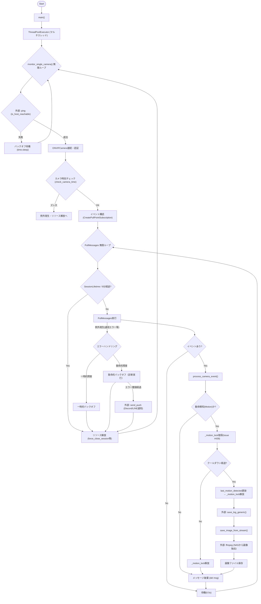
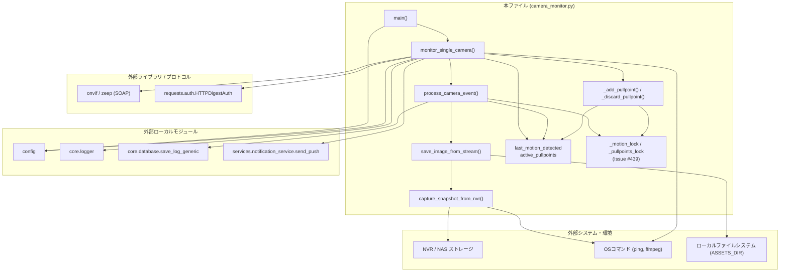

## 1. 解析メタ情報

| 項目 | 内容 |
| --- | --- |
| 対象ファイル | camera_monitor.py |
| 言語 | Python |
| 解析対象 | 提供されたコードのみ |
| 推測・補完 | 一切なし |
| 解析基準コミット | `dbbfc81` |

## 関連ドキュメント

- [config.md](./config.md) — `CAMERAS`、`ASSETS_DIR`、`MOTION_COOLDOWN_SEC`、`LINE_USER_ID`、`NVR_RECORD_DIR`等の設定を提供する。
- [database.md](./database.md) — `save_log_generic`の実装元（`core/database.py`）。
- [notification_service.md](./notification_service.md) — `send_push`の実装元。
- `camera_digest_service.py`（本リポジトリに実体なし。実機デプロイ先にのみ存在すると見られる） — 本ファイルが生成するスナップショット画像の消費先。
- [camera_service.md](./camera_service.md) — 同様のONVIF/WSDL動的探索ロジック（`find_wsdl_path`）を持つ姉妹モジュール（ライブ配信・録画用）。
- `collect_onvif_logs.py`（本リポジトリに実体なし。実機デプロイ先にのみ存在すると見られる） — 同様にONVIFイベント（PullPointSubscription）を収集する別スクリプト。

## 2. ファイルの概要

このファイルは、ONVIFプロトコルを用いてネットワークカメラ（防犯カメラ）に接続し、動体検知イベントを監視するシステムの一部である。
カメラからのイベント（PullPointサブスクリプション）を定期的に取得し、動体が検知された際には外部データベースへログを記録し、NVR（ネットワークビデオレコーダー）上の動画ファイルからFFmpegを用いてスナップショット画像を切り出して保存する責務を持つ。また、ネットワーク断やセッション切れに対する自動再接続・リソース解放機能を備えている。

## 3. 外部依存関係

### インポート一覧

| 名称 | 種類 | 用途 | 根拠 |
| --- | --- | --- | --- |
| `os`, `sys`, `time`, `socket`, `subprocess`, `uuid`, `platform` | 標準ライブラリ | システム操作、プロセス実行、パス解決、通信等 | 根拠: `import os` など (行番号: 2〜14 / 抜粋: "import os") |
| `tempfile` | 標準ライブラリ | `capture_snapshot_from_nvr`のスナップショット一時ファイルパスをOS標準の一時ディレクトリ配下に解決するために使用（#414 C-L7で追加。以前は`/tmp/`を直書きしていた） | 根拠: `import tempfile` (行番号: 8 / 抜粋: "import tempfile") |
| `threading`（Issue #439で追加） | 標準ライブラリ | `last_motion_detected`辞書の読んでから書くまでを保護する`_motion_lock`、`active_pullpoints`リストへのappend/removeを保護する`_pullpoints_lock`という2つの`threading.Lock`の生成 | 根拠: `import threading` (行番号: 9 / 抜粋: "import threading") |
| `asyncio` | 標準ライブラリ | 非同期イベントループの実行 | 根拠: `import asyncio` (行番号: 4 / 抜粋: "import asyncio") |
| `logging` | 標準ライブラリ | ログ出力（直接使用せず外部モジュール経由用） | 根拠: `import logging` (行番号: 7 / 抜粋: "import logging") |
| `traceback` | 標準ライブラリ | 例外発生時のスタックトレース取得（`process_camera_event`のエラーログに使用） | 根拠: `import traceback` (行番号: 9 / 抜粋: "import traceback") |
| `signal` | 標準ライブラリ | SIGINT/SIGTERM受信時のクリーンアップハンドラ登録 | 根拠: `import signal` (行番号: 10 / 抜粋: "import signal") |
| `requests` | 外部ライブラリ | インポートされているが、`requests.auth.HTTPDigestAuth`経由での間接的な利用が主（本体の直接呼び出しはなし） | 根拠: `import requests` (行番号: 12 / 抜粋: "import requests") |
| `datetime` (dt_class, timedelta) | 標準ライブラリ | 時刻取得、時間差計算、タイムゾーン処理 | 根拠: `from datetime import datetime ...` (行番号: 15 / 抜粋: "from datetime import datetime") |
| `typing` | 標準ライブラリ | 型アノテーション | 根拠: `from typing import Optional...` (行番号: 16 / 抜粋: "from typing import Optional") |
| `concurrent.futures.ThreadPoolExecutor` | 標準ライブラリ | 複数カメラ監視プロセスの並行実行 | 根拠: `from concurrent.futures...` (行番号: 17 / 抜粋: "from concurrent.futures import") |
| `http.client.RemoteDisconnected` | 標準ライブラリ | `monitor_single_camera`の一時的ネットワーク障害の判定に使用する例外クラス | 根拠: `from http.client import RemoteDisconnected` (行番号: 18 / 抜粋: "from http.client import RemoteDisconnected") |
| `urllib3.exceptions.ProtocolError` | 外部ライブラリ | 同上、一時的ネットワーク障害の判定に使用する例外クラス | 根拠: `from urllib3.exceptions import ProtocolError` (行番号: 19 / 抜粋: "from urllib3.exceptions import ProtocolError") |
| `requests.auth.HTTPDigestAuth` | 外部ライブラリ | ONVIFサービスのDigest認証 | 根拠: `from requests.auth import...` (行番号: 20 / 抜粋: "from requests.auth import") |
| `onvif` (ONVIFCamera, ONVIFService, ONVIFError) | 外部ライブラリ | ONVIFカメラとの通信およびイベント購読 | 根拠: `from onvif import ONVIFCamera...` (行番号: 24 / 抜粋: "from onvif import ONVIFCamera") |
| `zeep.exceptions` | 外部ライブラリ | SOAP通信時の例外捕捉 | 根拠: `import zeep.exceptions` (行番号: 26 / 抜粋: "import zeep.exceptions") |
| `lxml.etree` | 外部ライブラリ | ONVIFから返却されるXMLのパース | 根拠: `from lxml import etree` (行番号: 27 / 抜粋: "from lxml import etree") |
| `config` | ローカルモジュール | 設定値（カメラ情報、パス、定数）の取得 | 根拠: `import config` (行番号: 38 / 抜粋: "import config") |
| `core.logger.setup_logging` | ローカルモジュール | ロガーの初期化 | 根拠: `from core.logger import...` (行番号: 39 / 抜粋: "from core.logger import setup") |
| `core.database.save_log_generic` | ローカルモジュール | 動体検知時のデータベース保存 | 根拠: `from core.database import...` (行番号: 40 / 抜粋: "from core.database import save_") |
| `services.notification_service.send_push` | ローカルモジュール | 障害時の管理者へのプッシュ通知送信 | 根拠: `from services.notification_service...` (行番号: 41 / 抜粋: "from services.notification") |

### ブラックボックスとなる外部要素

| 名称 | 理由 | 根拠 |
| --- | --- | --- |
| `config` モジュールの詳細 | `CAMERAS`, `ASSETS_DIR`, `MOTION_COOLDOWN_SEC`, `LINE_USER_ID`, `NVR_RECORD_DIR` 等の構造や定義値が本ファイルに存在しないため。 | 根拠: `config.CAMERAS` (行番号: 636 / 抜粋: "for cam in config.CAMERAS") |
| `save_log_generic` の実装・スキーマ | 関数の内部ロジック、および保存先DBの種類・テーブルスキーマが不明なため。 | 根拠: `save_log_generic("device_records"...` (行番号: 365 / 抜粋: "save_log_generic("device_records") |
| `send_push` の実装 | プッシュ通知の送信手段（LINE等）や実際の処理内容が不明なため。 | 根拠: `send_push([{"type": "text"...` (行番号: 564 / 抜粋: "send_push(") |
| NVR（NAS）のディレクトリ構造 | 外部ストレージ上の動画ファイルの配置ルールが環境依存であるため。 | 根拠: `cam_conf.get("nas_folder")` (行番号: 187 / 抜粋: "nas_folder_name = cam_conf.get(") |

## 4. 主要要素の定義（関数 / エンドポイント / コンポーネント）

### `_motion_lock` / `_pullpoints_lock`（Issue #439 で追加）

* **役割**: グローバル変数`last_motion_detected`（クールダウン判定の「読んでから書く」区間）と`active_pullpoints`（PullPointの追加・削除・走査）を、カメラごとの監視スレッド間で排他制御するための2つの`threading.Lock`。個々のdict/list操作自体はGILにより原子的だが、複数操作にまたがる区間はそれだけでは保護されないため、明示的なロックで囲む設計になっている。
* 根拠: `_motion_lock = threading.Lock()` (行番号: 70 / 抜粋: "# #439: last_motion_detected はカメラごとの監視スレッドから並行して読み書きされる。\n# 個々のdict操作自体はGILにより原子的だが、クールダウン判定の「読んでから書く」までを\n# 不可分にするためにこのLockで保護する。\n_motion_lock = threading.Lock()")、`_pullpoints_lock = threading.Lock()` (行番号: 77 / 抜粋: "# #439: active_pullpoints はカメラごとの監視スレッドから並行してappend/removeされる。\n...\n_pullpoints_lock = threading.Lock()")

* **引数/リクエスト**: 該当なし
* 根拠: 同上

* **戻り値/レスポンス**: 該当なし
* 根拠: 同上

* **副作用**: なし（`threading.Lock`インスタンスの生成のみ）
* 根拠: 同上

* **エラーハンドリング**: なし
* 根拠: 同上

### `is_camera_enabled` / `_read_enabled_flags_from_devices_json`（Issue #652 で追加）

* **役割**: `devices.json` の `enabled` フラグを**監視ループの実行中に読み直す**ためのヘルパー。`services/camera_service.set_camera_enabled` は `devices.json` を書き換えたうえで**サーバープロセス内の** `config.CAMERAS` しか更新せず、`camera_monitor` は `unified_server.py` から別プロセスとして起動され起動時の `config.CAMERAS` を保持し続けるため、以前はUIでカメラを無効化してもサーバー再起動までONVIF購読・スナップショット・通知が継続していた（設定画面の表示と実挙動の食い違い）。`is_camera_enabled(cam_conf)` は `devices.json` の `st_mtime_ns` が前回確認時から変わっている場合のみ再読込し、`stat` 自体も `ENABLED_RECHECK_INTERVAL_SEC`(5秒)に1回へ抑える（キャッシュは `_enabled_cache` と `_enabled_cache_lock` でスレッド間共有）。`devices.json` が存在しない・JSONとして壊れている・該当 `id` が無い場合は、起動時の `cam_conf["enabled"]`（既定 `True`）へフォールバックする。SIGHUP方式ではなくポーリング方式を採ったのは、子プロセスの再起動・シグナルハンドラの追加を伴わず、監視スレッドごとの判定だけで完結するため。
* 根拠: `def is_camera_enabled(cam_conf: Dict[str, Any]) -> bool:` (行番号: 159〜189 / 抜粋: "\"\"\"該当カメラが現在有効かを devices.json の最新値で返す(#652)。")、`def _read_enabled_flags_from_devices_json() -> Optional[Dict[str, bool]]:` (行番号: 97〜109 / 抜粋: "devices.json を読み {camera_id: enabled} を返す。読めない・壊れている場合は None。")

* **引数/リクエスト**: `is_camera_enabled` は `cam_conf: Dict[str, Any]`（`id` と `enabled` を参照）。`_read_enabled_flags_from_devices_json` は引数なし。
* 根拠: 同上

* **戻り値/レスポンス**: `is_camera_enabled` は `bool`。`_read_enabled_flags_from_devices_json` は `{camera_id: enabled}` の `Dict[str, bool]`、読み込み失敗時は `None`。
* 根拠: 同上

* **副作用**: `devices.json` の `os.stat` と読み込み、モジュールグローバル `_enabled_cache` の更新。
* 根拠: 同上

* **エラーハンドリング**: `os.stat` の `OSError`、JSONパース失敗を含む全例外を握りつぶし、DEBUGログを出して前回値または起動時値へフォールバックする（監視スレッドを落とさない）。
* 根拠: `except Exception as e:` (行番号: 107〜108 / 抜粋: "logger.debug(f\"devices.json の enabled 再読込に失敗(前回値/起動時値を使う): {e}\")")

### `_add_pullpoint` / `_discard_pullpoint`（Issue #439 で追加）

* **役割**: `active_pullpoints`リストへの安全な追加・削除を担うヘルパー関数。`_add_pullpoint`は`_pullpoints_lock`保護下で`append`する。`_discard_pullpoint`は同様の保護下で`remove`を試み、既に別スレッドにより削除済みで`ValueError`が送出された場合はそれを無視する。以前の呼び出し元は`if x in active_pullpoints: active_pullpoints.remove(x)`という「存在確認してから削除」パターンを各所に直接書いていたが、この2ステップの間に別スレッドが同じ要素を削除すると`list.remove()`が`ValueError`を送出しうり(`finally`節内で発生すると後始末処理が中断する)、この2関数への集約でその競合を解消した。
* 根拠: `def _add_pullpoint(pullpoint: Any) -> None:` (行番号: 200〜202 / 抜粋: "with _pullpoints_lock:\n        active_pullpoints.append(pullpoint)")、`def _discard_pullpoint(pullpoint: Any) -> None:` (行番号: 85〜91 / 抜粋: "\"\"\"active_pullpointsから安全に削除する(既に削除済みでも例外を出さない)。\"\"\"\n    with _pullpoints_lock:\n        try:\n            active_pullpoints.remove(pullpoint)\n        except ValueError:\n            pass")

* **引数/リクエスト**: `pullpoint: Any`（いずれも共通）
* 根拠: 同上

* **戻り値/レスポンス**: `None`（いずれも共通）
* 根拠: 同上

* **副作用**: `active_pullpoints`リストの変更（`_pullpoints_lock`保護下）。
* 根拠: 同上

* **エラーハンドリング**: `_discard_pullpoint`は`list.remove()`が送出する`ValueError`(既に削除済みの場合)のみを捕捉して無視する。それ以外の例外は捕捉しない。`_add_pullpoint`は例外を捕捉しない。
* 根拠: `except ValueError:\n            pass` (行番号: 90〜91)

### `cleanup_handler`

* **役割**: SIGINTやSIGTERMなどのプロセス終了シグナルを受信した際に、アクティブなPullPointサブスクリプションを解除して安全に終了する。
* **（Issue #439 で修正）** `active_pullpoints`の走査は以前`for svc in list(active_pullpoints):`と直接コピーしていたが、`monitor_single_camera`（他スレッド）が同時にリストを変更しうるため、`_pullpoints_lock`保護下でスナップショット(`pullpoints_snapshot`)を取得してからロックを解放し、そのスナップショットを走査するよう変更された。
* 根拠: `cleanup_handler` (行番号: 214〜230 / 抜粋: "def cleanup_handler(signum: int, frame: Any) -> None:")、[ロック保護下のスナップショット取得] (行番号: 99〜100 / 抜粋: "with _pullpoints_lock:\n        pullpoints_snapshot = list(active_pullpoints)")

* **引数/リクエスト**: `signum: int` (シグナル番号), `frame: Any` (実行フレーム)
* 根拠: `cleanup_handler` (行番号: 214 / 抜粋: "def cleanup_handler(signum: int, frame: Any) -> None:")

* **戻り値/レスポンス**: `None`
* 根拠: `cleanup_handler` (行番号: 94 / 抜粋: "-> None:")

* **副作用**: `_pullpoints_lock`保護下での`active_pullpoints`のスナップショット取得、ONVIFのUnsubscribeリクエスト送信、プロセス終了(`os._exit(0)`)。
* 根拠: `os._exit` (行番号: 110 / 抜粋: "os._exit(0)")、[スナップショット取得] (行番号: 99〜100)

* **エラーハンドリング**: Unsubscribe時の例外(`Exception`)は無視(`pass`)される。
* 根拠: `except Exception` (行番号: 107〜108 / 抜粋: "except Exception:\n            pass")

### `is_host_reachable`

* **役割**: OSのpingコマンドを実行し、指定されたIPアドレスの到達性を確認する。
* 根拠: `is_host_reachable` (行番号: 235〜251 / 抜粋: "def is_host_reachable(ip:")

* **引数/リクエスト**: `ip: str` (対象のIPアドレス)
* 根拠: `is_host_reachable` (行番号: 235 / 抜粋: "def is_host_reachable(ip: str)")

* **戻り値/レスポンス**: `bool` (到達可能ならTrue)
* 根拠: `is_host_reachable` (行番号: 89 / 抜粋: "-> bool:")

* **副作用**: 外部コマンド（ping）の実行。
* 根拠: `subprocess.run` (行番号: 96 / 抜粋: "subprocess.run(cmd,")

* **エラーハンドリング**: 実行時のあらゆる例外（タイムアウト含む）を包括的な `except Exception` で捕捉してFalseを返す。
* 根拠: `except` (行番号: 103 / 抜粋: "except Exception as e:")

### `find_wsdl_path`（Issue #661 で core/onvif_utils.py へ移動）

* **役割**: `sys.path` を走査し、ONVIFのWSDLファイル (`devicemgmt.wsdl`) が存在するディレクトリパスを探索する。**実体は本ファイルには無く、`core/onvif_utils.py` から import している**(以前は `services/camera_service.py` にも一字一句同じ実装が重複しており、探索規則を変えるときに片方だけ直す事故が起きうる状態だった)。モジュール読み込み時に1回だけ呼ばれ、結果は `WSDL_DIR` に保持される。
* 根拠: `from core.onvif_utils import find_wsdl_path` (行番号: 41)、`WSDL_DIR: Optional[str] = find_wsdl_path()` (行番号: 209)
* 詳細: [onvif_utils.md](./onvif_utils.md)

### `perform_emergency_diagnosis`

* **役割**: 指定されたIPの特定ポート（80, 2020）へのTCP接続テストを行い、ポートの状態（Open/Closed）をログに出力する。
* 根拠: `perform_emergency_diagnosis` (行番号: 256〜272 / 抜粋: "def perform_emergency_diagnosis")

* **引数/リクエスト**: `ip: str` (対象のIPアドレス)
* 根拠: `perform_emergency_diagnosis` (行番号: 121 / 抜粋: "(ip: str) -> Dict[int, bool]:")

* **戻り値/レスポンス**: `Dict[int, bool]` (ポート番号と接続可否の辞書)
* 根拠: `perform_emergency_diagnosis` (行番号: 121 / 抜粋: "-> Dict[int, bool]:")

* **副作用**: TCPソケットの作成と接続試行。
* 根拠: `sock.connect_ex` (行番号: 129 / 抜粋: "res = sock.connect_ex((ip,")

* **エラーハンドリング**: 接続エラー時は例外をキャッチし、エラー文字列をログ用メッセージに追記する。
* 根拠: `except Exception` (行番号: 134 / 抜粋: "except Exception as e:")

### `check_camera_time`

* **役割**: カメラのシステム時刻(UTC)を取得し、稼働サーバーの現在時刻(JST想定)との差分が5分(300秒)以上あるかチェックして警告を出す。
* 根拠: `check_camera_time` (行番号: 274〜305 / 抜粋: "def check_camera_time(devicemgmt")
* **（Issue #382 で修正）** カメラのUTC時刻を `tzinfo=timezone.utc` の aware datetime として組み立て、`dt_class.now(timezone.utc)` と比較する。以前は +9h した naive 値をホストローカル時刻と比較する JST 前提だったため、ホストの TZ が UTC 等の環境では差が常に 9h となり全カメラが永久に「時刻ズレ」で接続不能になっていた。
* 根拠: `cam_time_utc = dt_class(...)` (行番号: 148〜150)、`now_utc = dt_class.now(timezone.utc)` (行番号: 151)

* **引数/リクエスト**: `devicemgmt: Any` (ONVIFデバイス管理サービス), `cam_name: str` (カメラ名)
* 根拠: `check_camera_time` (行番号: 139 / 抜粋: "(devicemgmt: Any, cam_name: str)")

* **戻り値/レスポンス**: `bool` (時刻ズレが5分以内の場合、またはチェック失敗時はFail-SoftのためTrue、ズレが大きい場合はFalse)
* 根拠: `check_camera_time` (行番号: 139 / 抜粋: "-> bool:")

* **副作用**: `devicemgmt.GetSystemDateAndTime()` によるカメラへのAPIリクエスト。
* 根拠: `devicemgmt.GetSystemDateAndTime()` (行番号: 142 / 抜粋: "sys_dt = devicemgmt.GetSystemDa")

* **エラーハンドリング**: XML/Dateパースエラーなどの例外が発生した場合はエラーログを出力し、True（Fail-Soft）を返す。
* 根拠: `except Exception` (行番号: 161 / 抜粋: "except Exception as e:")

### `_UnexpandedOnvifDateFilter`(zeep ロガーのフィルタ)

* **役割**: カメラが書式の展開されていない日付(`'2026-%m-07'`・`'%Y-09-18'` のように strftime の書式指定子が残った値)を ONVIF 応答に入れてきたときに、zeep(`zeep.xsd.types.simple` ロガー)が出す `Error during xml -> python translation` の ERROR(トレースバック付き)だけを落とす `logging.Filter`。モジュールの import 時に登録する。
* **（2026-09-19 追加）** 実機で、`camera_monitor` のプロセスが1日数回このエラーを標準エラーへ出していることを確認した(原因はカメラ側ファームウェア)。zeep はこの場合その項目を `None` にして処理を続けるため監視の動作には影響しない。`health_watch.py` の `check_journal_errors` が journal の標準エラーも見るようになったことで誤報の元になるため、発生源で抑止する。抑止するのは例外メッセージに `ISO 8601` と `%` の両方を含む場合だけで、それ以外の日付解釈エラーは別の原因でありうるため従来どおり ERROR のまま出す。抑止した内容は `camera` ロガーの DEBUG に残す。
* 根拠: `class _UnexpandedOnvifDateFilter(logging.Filter):`、`logging.getLogger("zeep.xsd.types.simple").addFilter(_UnexpandedOnvifDateFilter())`(回帰テスト: `tests/test_camera_monitor_onvif_date_filter.py`)

### `capture_snapshot_from_nvr`

* **（Issue #537 で修正）** 録画チャンクの検索パターンを新設の `_nvr_search_patterns(nas_folder, now)` で組み立てる。当日プレフィックス(`YYYYMMDD_*.mp4`)に加え、`now.hour == 0` のときは前日プレフィックスも検索する(0時台は最新チャンクが前日 23:5x 開始のファイルであるため、以前は "No NVR video files found" で画像が保存されなかった)。また、NAS 側ディレクトリ作成失敗時のフォールバック先を `BASE_DIR/temp_assets/snapshots` から `config.FALLBACK_ROOT/assets/snapshots` に変更した(`nas_monitor` の保持期間削除・同期の対象パスに揃える)。
* 根拠: [パターン関数] (行番号: 208〜219 / 抜粋: "if now.hour == 0:\n        yesterday = now - timedelta(days=1)")、[呼び出し] (行番号: 250)、[フォールバック先] (行番号: 59)

* **役割**: NAS上に保存されている最新の動画ファイル(.mp4)を検索し、FFmpegを用いてファイル末尾の数秒手前(既定3秒)のフレームを切り出してJPEG画像のバイト列を返す。
* **（Issue #703 で修正）スナップショット取得が動体検知の約3割で失敗していた**: 以前は最新ファイルの末尾1秒前(`-sseof -1`)を読んでいた。NVR の録画は fragmented MP4(`moof`/`mdat` の繰り返し)で、CIFS 越しに見えるファイル末尾は常に最後の `mdat` の途中で切れている(ファイルサイズが 256KiB 単位で伸びる)ため、末尾1秒前へのシークが不完全な末尾フラグメントに当たると ffmpeg が `partial file` / `Invalid NAL unit size` で失敗していた(終了コード 69 / 183)。失敗はセグメント開始直後に偏っておらず(初回失敗74件中57件が開始から120秒以上経過後)、「書き込み中だから未完成」ではなく「末尾の数秒が常に未完成」が原因である。2026-09-19 の実機計測(書き込み中のファイルへ連続20回)で、庭カメラは `-sseof -1` が 0/20・`-3` が 20/20、駐車場カメラは `-1` が 4/20・`-3` が 20/20 だった。これを受けて試行計画をモジュール定数 `NVR_SNAPSHOT_ATTEMPTS = ((0, 3), (0, 6), (1, 3))`((新しい順の何番目のファイルか, 末尾から何秒手前か))に切り出し、1回目は最新ファイルの3秒手前、2回目は6秒手前、3回目は書き込みが完了している1つ前のセグメントの3秒手前を読む(1つ前が無い当日最初のファイルでは最新ファイルで代用)。対象ファイルの一覧はリトライのたびに取り直す(試行の間に録画ファイルが切り替わりうるため)。録画ファイルが1つも無い場合の判定(`No NVR video files found` を警告して `None` を返す)も各試行の中で行い、ループ前には一覧を取得しない(#707 のレビュー指摘: 以前はループ前にも取得していて、正常系でも初回に CIFS 越しの glob が2回走っていた)。あわせて、以前は `stderr=subprocess.DEVNULL` で捨てていた ffmpeg の出力を `PIPE` で受け、失敗時の警告に終了コード・対象ファイル・シーク位置・stderr の最終行を載せるようにした(以前のログは `exit status 69` しか分からず、原因の特定に実機での再現が必要だった)。
* 根拠: [試行計画] `NVR_SNAPSHOT_ATTEMPTS: tuple = ((0, 3), (0, 6), (1, 3))`、[ループ] `for attempt, (file_index, seconds_before_eof) in enumerate(NVR_SNAPSHOT_ATTEMPTS, start=1):`、[シーク] `"-sseof", f"-{seconds_before_eof}",`、[失敗ログ] `f"(rc={e.returncode}, src={os.path.basename(src)}, sseof=-{seconds_before_eof}): "`(回帰テスト: `tests/test_camera_monitor_snapshot_seek.py`)
* 根拠: `capture_snapshot_from_nvr` (行番号: 321〜423 / 抜粋: "def capture_snapshot_from_nvr(")
* **（Issue #405 で修正）** NVR ディレクトリは `config.NVR_RECORD_DIR` を直接参照する（以前の `getattr(config, ..., os.getenv("NVR_RECORD_DIR", ...))` は config が常に定義するため到達不能なフォールバックで、`.env.example` 整合テストの死角だった）。
* 根拠: `nvr_base_dir = config.NVR_RECORD_DIR` (行番号: 186)
* **[修正済み] #414 C-L7: スナップショット一時ファイルパスを`tempfile.gettempdir()`経由で解決**: `output_tmp`は以前`f"/tmp/snapshot_{cam_conf['name']}_{uuid.uuid4().hex}.jpg"`と`/tmp`を直書きしていたが、`os.path.join(tempfile.gettempdir(), f"snapshot_{...}.jpg")`に変更した。実行環境のOS標準一時ディレクトリ（Linuxでは通常`/tmp`のまま、`TMPDIR`環境変数があればそちらに追従）に解決される。テスト側(`tests/test_camera_monitor_low_priority.py`)が並列実行時に実`/tmp`をglobして他プロセスの残骸と衝突する偽陽性を避けられるよう、`tempfile.gettempdir`をmonkeypatchして隔離できるようにするための変更。
* 根拠: `output_tmp = os.path.join(tempfile.gettempdir(), ...)` (行番号: 205 / 抜粋: "output_tmp = os.path.join(tempfile.gettempdir()")

* **引数/リクエスト**: `cam_conf: dict` (カメラ設定), `target_time: dt_class = None` (対象時刻・現在未使用)
* 根拠: `capture_snapshot_from_nvr` (行番号: 171 / 抜粋: "(cam_conf: dict, target_time: dt")

* **戻り値/レスポンス**: `Optional[bytes]` (画像バイト列、または失敗時はNone)
* 根拠: `capture_snapshot_from_nvr` (行番号: 171 / 抜粋: "-> Optional[bytes]:")

* **副作用**: NASフォルダの走査(`glob.glob`)、一時ファイルの作成(`uuid`使用、`tempfile.gettempdir()`配下)と削除、外部コマンド(`ffmpeg`)の実行。
* 根拠: `subprocess.run(cmd` (行番号: 223 / 抜粋: "subprocess.run(cmd,")

* **（#411 S-L10で修正）** 最新mp4ファイルの検索は以前 `os.path.join(nas_folder, "**", "*.mp4")` を `recursive=True` で走査しており、動体検知のたびにNVRの保存期間全体（数十日分）をCIFS越しにglobしていた。`camera_service.py` の録画ファイル命名規則（`{YYYYMMDD}_*.mp4`）に合わせ、当日分の日付プレフィックスに絞った非再帰globに変更した。
* 根拠: `today_str = dt_class.now().strftime("%Y%m%d")` (行番号: 198)、`search_pattern = os.path.join(nas_folder, f"{today_str}_*.mp4")` (行番号: 199)

* **エラーハンドリング**: FFmpegのタイムアウトや実行エラー(`CalledProcessError`, `Exception`)をキャッチし、`NVR_SNAPSHOT_ATTEMPTS` の要素数(既定3回)まで Exponential Backoff によるリトライを行う(各試行の対象ファイルとシーク位置は上記 Issue #703 の項を参照)。加えて、リトライループ全体を外側の`try`/`finally`で包み、成功・タイムアウト・リトライ失敗・予期しない例外のいずれの終了経路でも`output_tmp`に残った一時ファイルを`os.remove`で確実に削除する（削除自体が失敗した場合の`OSError`は無視する）。以前は成功時のみ`os.remove`が呼ばれておりタイムアウト等の異常終了時は一時ディレクトリに`snapshot_*.jpg`の残骸が蓄積し続けていたが、この`finally`ブロックにより解消されている。
* 根拠: `except subprocess.TimeoutExpired` (行番号: 233 / 抜粋: "except subprocess.TimeoutExpired:")、`finally` (行番号: 248 / 抜粋: "finally:")、`os.remove(output_tmp)` (行番号: 254 / 抜粋: "os.remove(output_tmp)")、`except OSError` (行番号: 255 / 抜粋: "except OSError:")

* **（#411 S-L10で修正）** リトライ間のExponential Backoff (`time.sleep(2 ** attempt)`) は以前、最終試行(3回目)の失敗後にも実行されており、結果が確定した(呼出元を待たせるだけの)状態のまま最大8秒の無駄な待機が発生していた。次のリトライが残っている場合のみsleepするよう変更した。
* 根拠: `if attempt < max_retries:` (行番号: 244)

### `save_image_from_stream`

* **役割**: `capture_snapshot_from_nvr` を呼び出してスナップショットを取得し、指定されたディレクトリ(`ASSETS_DIR`)にファイルとして保存する。
* 根拠: `save_image_from_stream` (行番号: 426〜452 / 抜粋: "def save_image_from_stream(")

* **引数/リクエスト**: `cam_name: str` (カメラ名), `event_type: str = "motion"` (イベント種別)
* 根拠: `save_image_from_stream` (行番号: 250 / 抜粋: "(cam_name: str, event_type:")

* **戻り値/レスポンス**: `Optional[str]` (保存されたファイルのパス、失敗時はNone)
* 根拠: `save_image_from_stream` (行番号: 250 / 抜粋: "-> Optional[str]:")

* **副作用**: ファイルシステムへの画像ファイル書き込み。
* 根拠: `f.write(image_data)` (行番号: 272 / 抜粋: "f.write(image_data)")

* **エラーハンドリング**: ファイル保存時の例外をキャッチし、ログ出力してNoneを返す。
* 根拠: `except Exception as e` (行番号: 274 / 抜粋: "except Exception as e:")

### `force_close_session`

* **役割**: さまざまなパターンのオブジェクト（ONVIFService, ONVIFCamera, zeep_client等）からHTTPセッションを探し出して強制的にクローズし、ファイル記述子を解放する。
* 根拠: `force_close_session` (行番号: 454〜477 / 抜粋: "def force_close_session(")

* **引数/リクエスト**: `service_obj: Any` (対象オブジェクト)
* 根拠: `force_close_session` (行番号: 278 / 抜粋: "(service_obj: Any) -> None:")

* **戻り値/レスポンス**: `None`
* 根拠: `force_close_session` (行番号: 278 / 抜粋: "-> None:")

* **副作用**: HTTPセッション(`requests.Session`)の解放。
* 根拠: `session.close()` (行番号: 290 / 抜粋: "service_obj.zeep_client.tran")

* **エラーハンドリング**: 全ての例外をキャッチし、警告ログ（debugレベル）を出力。
* 根拠: `except Exception` (行番号: 300 / 抜粋: "except Exception as e:")

### `process_camera_event`

* **役割**: ONVIFイベントメッセージをパースし、動体検知イベントであるかを判定。クールダウン判定後、DB保存とスナップショット保存を実行する。
* 根拠: `process_camera_event` (行番号: 479〜548 / 抜粋: "def process_camera_event(")

* **引数/リクエスト**: `msg: Any` (ONVIFイベントメッセージ), `cam_conf: Dict[str, Any]` (カメラ設定)
* 根拠: `process_camera_event` (行番号: 303 / 抜粋: "(msg: Any, cam_conf: Dict")

* **戻り値/レスポンス**: `None`
* 根拠: `process_camera_event` (行番号: 303 / 抜粋: "-> None:")

* **副作用**: DB保存(`save_log_generic`)、画像取得・保存(`save_image_from_stream`)、グローバル変数 `last_motion_detected` の更新。
* **（Issue #439 で修正）** クールダウン判定(`last_motion_detected.get(cam_id, 0.0)`の読み取りと、クールダウン未経過でない場合の`last_motion_detected[cam_id] = current_time`への書き込み)は、以前はロックなしで行われていた（カメラごとの監視スレッドが並行して同じ辞書にアクセスしうる）。この「読んでから書く」区間全体を`_motion_lock`で囲むよう修正された。
* 根拠: `save_log_generic` (行番号: 365 / 抜粋: "save_log_generic("device_record")、[クールダウン判定のロック保護] (行番号: 383〜390 / 抜粋: "current_time: float = time.time()\n        with _motion_lock:\n            last_detected_time: float = last_motion_detected.get(cam_id, 0.0)\n            if current_time - last_detected_time < MOTION_COOLDOWN_SEC:\n                logger.debug(...)\n                return\n            last_motion_detected[cam_id] = current_time")

* **エラーハンドリング**: パースエラー等の例外をキャッチして警告ログを出力し、`finally` ブロックで `del msg` を実行しリソースを解放する。
* 根拠: `except Exception as e` (行番号: 368 / 抜粋: "except Exception as e:")

### `monitor_single_camera` とその補助関数

* **（Issue #662 で分割）** 以前は 255行・二重 `while True` の単一関数で、`consecutive_errors` / `transient_error_count` / `last_transient_error_time` / `is_first_connect` / `was_disabled` の5つの状態をループ外で初期化し `try`/`except` の両方から書き換えていた。次の単位へ分割してある（挙動は変えていない。`tests/test_camera_monitor_backoff.py` の特性テスト20件が、バックオフ間隔・通知の発火回数・緊急診断の有無・解放処理の対象を固定している）。

| 単位 | 責務 |
| --- | --- |
| `_ReconnectBackoff` | 再接続バックオフの状態と更新規則（`record_failure` / `note_transient` / `reset`） |
| `_CameraSession` | 1セッションが確保したリソースと `release()` |
| `_connect_and_subscribe` | ONVIF接続からイベント購読まで |
| `_pull_events_until_reconnect` | イベント受信ループ（内側の `while True`） |
| `_suspend_after_transient_error` | 一時的障害の待機とログ |
| `_suspend_after_fatal_error` | 致命的障害の待機・通知・緊急診断 |
| `monitor_single_camera` | 外側ループの制御のみ |

* 根拠: `_ReconnectBackoff` (行番号: 551 / 抜粋: "class _ReconnectBackoff:")、`_CameraSession` (行番号: 588 / 抜粋: "class _CameraSession:")、`monitor_single_camera` (行番号: 843 / 抜粋: "def monitor_single_camera(")

* **役割**: 単一のカメラに対する死活監視、ONVIF接続、イベント購読（PullPoint）ループ、例外時（ネットワーク断等）のExponential Backoffリトライ、セッション更新などを制御するメインループ。ポートは設定ファイル指定の1つのみを使用し、ローテーションは行わない。
* **（Issue #652 で追加）** 外側ループの先頭で `is_camera_enabled(cam_conf)` を確認し、`devices.json` 上で無効化されていればONVIF接続にも到達性チェックにも進まず `DISABLED_POLL_INTERVAL_SEC`(30秒)ごとに再確認して待機する（無効化・再有効化の遷移時のみINFOログを1回出す）。`_pull_events_until_reconnect` でも `SESSION_LIFETIME` 判定の直後に同じ確認を行い、監視中に無効化された場合は `return` して `finally` の `Unsubscribe`・セッションクローズを通り、外側の待機へ移る。
* 根拠: `monitor_single_camera` (行番号: 843 / 抜粋: "def monitor_single_camera(")

* **（Issue #766 で修正）** 購読期限が切れる前に自発的に張り直す処理(`FORCE_RECONNECT_INTERVAL_SEC` = 540秒)を、玄関カメラ専用の分岐から**全カメラ共通**へ変更した。`CreatePullPointSubscription()` が返す既定の `TerminationTime` は10分で、先回りの無い庭・駐車場(VIGI)は10分ごとに期限切れ → `PullMessages` が3回連続失敗 → WARNING を出して張り直す、を繰り返していた(1台あたり毎時6回。実機ログの失敗間隔 10分17秒〜10分24秒がこの10分と一致する)。期限切れから再購読までの数秒はイベントを取りこぼすため、1台あたり1日約144回その窓が開いていた。なお `RENEW_DURATION` は定義のみで `Renew` を呼ぶ箇所は無く、購読の延長ではなく張り直しで対応している。
* 根拠: [変数宣言] (行番号: 102 / 抜粋: "FORCE_RECONNECT_INTERVAL_SEC: int = 540")、[再接続判定] (行番号: 732 / 抜粋: "if current_time - last_subscribe_time > FORCE_RECONNECT_INTERVAL_SEC:")

* **（2026-09-06 品質監査で修正）** 玄関カメラ以外(駐車場・庭)の `PullMessages` 失敗時の扱いを変更した。以前は例外を DEBUG ログに落として `events = None` で継続するだけだったため、カメラ再起動等でサブスクリプションが消えると `SESSION_LIFETIME`(3600秒)が経過するまで最長1時間、動体検知が止まったまま(警告も出ない)だった。`_pull_events_until_reconnect` の冒頭に `consecutive_pull_failures = 0` を置き、`PullMessages` 成功時に 0 へ戻し、失敗が `PULL_FAILURE_RECONNECT_THRESHOLD`(3)回連続したら WARNING を出して `return` し、外側の再接続処理へ移行する(玄関カメラは従来どおり1回目で `return`)。
* 根拠: `_pull_events_until_reconnect` (行番号: 698 / 抜粋: "def _pull_events_until_reconnect(")

* **引数/リクエスト**: `cam_conf: Dict[str, Any]` (対象カメラ設定)
* **戻り値/レスポンス**: `None` (無限ループ)

* **副作用**: ONVIF APIコール、例外発生時のプッシュ通知送信(`send_push`)、グローバル変数 `active_pullpoints` への参照追加/削除。
* **（Issue #439 で修正）** `active_pullpoints`への追加は`_add_pullpoint(pullpoint)`、削除は`_discard_pullpoint(...)`という排他制御されたヘルパー関数経由に統一された。以前は接続成功時に`active_pullpoints.append(pullpoint)`を直接呼び、例外処理時とリソース解放時にはそれぞれ「存在確認してから削除」パターンを直接書いていた。分割後は、追加が `_connect_and_subscribe`、削除が `_suspend_after_fatal_error` と `_CameraSession.release` にある。
* 根拠: `_connect_and_subscribe` (行番号: 627 / 抜粋: "def _connect_and_subscribe(")、`_suspend_after_fatal_error` (行番号: 790 / 抜粋: "def _suspend_after_fatal_error(")

* **エラーハンドリング**: 一時的障害（`RemoteDisconnected`等）と、致命的障害（その他例外）を分けて処理。連続エラー回数に基づくExponential Backoff（最大3600秒）、特定条件（5回・12の倍数回失敗時）での管理者への通知を行う。`_CameraSession.release()` は `ONVIFService` の構築前後どちらで失敗しても呼べるようになっており、構築に失敗した場合は直前に作った生のサブスクリプションを `Unsubscribe` する（カメラ側に購読を残さないため）。
* 根拠: `_suspend_after_transient_error` (行番号: 775 / 抜粋: "def _suspend_after_transient_error(")、`_suspend_after_fatal_error` (行番号: 790 / 抜粋: "def _suspend_after_fatal_error(")

### `main`

* **役割**: 登録された全てのカメラ設定（`config.CAMERAS`）に対して、`ThreadPoolExecutor` を用いて並行で `monitor_single_camera` を実行する。
* 根拠: `main` (行番号: 906〜916 / 抜粋: "async def main() -> None:")

* **引数/リクエスト**: なし
* 根拠: `main` (行番号: 906 / 抜粋: "async def main() -> None:")

* **戻り値/レスポンス**: `None`
* 根拠: `main` (行番号: 626 / 抜粋: "-> None:")

* **副作用**: 複数スレッドの起動。
* 根拠: `ThreadPoolExecutor` (行番号: 635 / 抜粋: "with ThreadPoolExecutor")

* **エラーハンドリング**: WSDLが見つからない場合はエラーログを出力して終了。
* 根拠: `if not WSDL_DIR:` (行番号: 627 / 抜粋: "if not WSDL_DIR: return logger")

* **（#411 S-L3で修正）** `config.CAMERAS` が空（`devices.json` 未配置等）の場合、以前は `ThreadPoolExecutor(max_workers=len(config.CAMERAS))` が `max_workers=0` となり `ValueError` を送出してプロセスが即座に落ちていた。カメラが1台も無い場合は警告ログを出して何もせず正常終了し、カメラが存在する場合も `max_workers` を `max(1, ...)` で下限保護する。
* 根拠: `if not config.CAMERAS:` (行番号: 631)、`ThreadPoolExecutor(max_workers=max(1, len(config.CAMERAS)))` (行番号: 635)

## 5. 処理フロー図

```mermaid
flowchart TD
    Start([Start]) --> Main["main()"]
    Main --> InitThreadPool["ThreadPoolExecutor (マルチスレッド)"]
    InitThreadPool --> MonitorLoop{"monitor_single_camera() 無限ループ"}
    
    MonitorLoop --> ReachCheck{"外部: ping (is_host_reachable)"}
    ReachCheck -- 失敗 --> BackoffSleep["バックオフ待機 (time.sleep)"]
    BackoffSleep --> MonitorLoop
    
    ReachCheck -- 成功 --> ConnectONVIF["ONVIFCamera接続・認証"]
    ConnectONVIF --> TimeCheck{"カメラ時刻チェック (check_camera_time)"}
    TimeCheck -- ズレ大 --> ThrowError["例外発生・リソース解放へ"]
    TimeCheck -- OK --> SubEvent["イベント購読 (CreatePullPointSubscription)"]
    
    SubEvent --> PullLoop{"PullMessages 無限ループ"}
    PullLoop --> LifetimeCheck{"SessionLifetime / 9分経過?"}
    LifetimeCheck -- Yes --> ResourceCleanup["リソース解放 (force_close_session等)"]
    ResourceCleanup --> MonitorLoop
    
    LifetimeCheck -- No --> PullCall["PullMessages実行"]
    PullCall --> HasEvent{"イベントあり?"}
    HasEvent -- No --> Sleep05["待機(0.5s)"]
    Sleep05 --> PullLoop
    
    HasEvent -- Yes --> ProcessEvent["process_camera_event()"]
    ProcessEvent --> IsMotion{"動体検知(Motion)か?"}
    IsMotion -- No --> CleanupMsg["メッセージ破棄 (del msg)"]
    CleanupMsg --> Sleep05
    
    IsMotion -- Yes --> AcquireMotionLock["_motion_lock取得(Issue #439)"]
    AcquireMotionLock --> CooldownCheck{"クールダウン経過?"}
    CooldownCheck -- No --> ReleaseLockSkip["_motion_lock解放"]
    ReleaseLockSkip --> CleanupMsg
    CooldownCheck -- Yes --> UpdateTimestamp["last_motion_detected更新 → _motion_lock解放"]
    UpdateTimestamp --> SaveDB["外部: save_log_generic()"]
    SaveDB --> TriggerSnap["save_image_from_stream()"]
    TriggerSnap --> FFmpeg["外部: ffmpeg (NASから画像抽出)"]
    FFmpeg --> SaveFile["画像ファイル保存"]
    SaveFile --> CleanupMsg
    
    PullCall -- 例外発生(通信エラー等) --> HandleError{"エラーハンドリング"}
    HandleError -- 一時的障害 --> TransientBackoff["一時的バックオフ"]
    HandleError -- 致命的障害 --> FatalBackoff["致命的バックオフ（診断実行）"]
    TransientBackoff --> ResourceCleanup
    FatalBackoff --> ResourceCleanup
    FatalBackoff -- エラー閾値超過 --> Push["外部: send_push (Discord/LINE通知)"]
    Push --> ResourceCleanup

```

## 6. 依存関係図

```mermaid
graph TD
    subgraph "本ファイル (camera_monitor.py)"
        Main["main()"]
        Monitor["monitor_single_camera()"]
        Process["process_camera_event()"]
        Snapshot["capture_snapshot_from_nvr()"]
        SaveImg["save_image_from_stream()"]
        GlobalVars["last_motion_detected<br/>active_pullpoints"]
        Locks["_motion_lock / _pullpoints_lock<br/>(Issue #439)"]
        PullpointHelpers["_add_pullpoint() / _discard_pullpoint()"]
        
        Main --> Monitor
        Monitor --> Process
        Process --> SaveImg
        SaveImg --> Snapshot
        Monitor --> GlobalVars
        Process --> GlobalVars
        Process --> Locks
        Monitor --> PullpointHelpers
        PullpointHelpers --> Locks
        PullpointHelpers --> GlobalVars
    end

    subgraph "外部ローカルモジュール"
        Config["config"]
        Logger["core.logger"]
        DBLog["core.database.save_log_generic"]
        Notify["services.notification_service.send_push"]
    end

    subgraph "外部ライブラリ / プロトコル"
        ONVIF_Lib["onvif / zeep (SOAP)"]
        RequestAuth["requests.auth.HTTPDigestAuth"]
    end

    subgraph "外部システム・環境"
        NVR_NAS["NVR / NAS ストレージ"]
        OS_Cmd["OSコマンド (ping, ffmpeg)"]
        FileSystem["ローカルファイルシステム (ASSETS_DIR)"]
    end

    Main --> Config
    Monitor --> Config
    Monitor --> Logger
    Process --> DBLog
    Monitor --> Notify
    Monitor --> ONVIF_Lib
    Monitor --> RequestAuth
    Snapshot --> OS_Cmd
    Monitor --> OS_Cmd
    Snapshot --> NVR_NAS
    SaveImg --> FileSystem

```

## 7. 次のステップ（リバースエンジニアリングの提案）

| 優先度 | ファイル名(推測可) | 理由 | 根拠 |
| --- | --- | --- | --- |
| 高 | `config.py` | `CAMERAS`（IP、ポート、認証情報等）、`MOTION_COOLDOWN_SEC`、`NVR_RECORD_DIR`等の重要な環境変数が定義されており、監視対象や動作閾値の全容を把握するため。 | 根拠: `config.CAMERAS` (行番号: 622 / 抜粋: "config.CAMERAS"), `config.MOTION_COOLDOWN_SEC` (行番号: 63 / 抜粋: "getattr(config, 'MOTION_COOLD") |
| 中 | `core/database.py` | `save_log_generic` 関数の引数（`columns`, `values`）は判明しているが、実際にどのデータベース（SQLite/MySQL等）にどのようなスキーマで書き込まれるか確認するため。 | 根拠: `save_log_generic("device_records"` (行番号: 365 / 抜粋: "save_log_generic("device_record") |
| 中 | `services/notification_service.py` | 障害発生時のアラート仕様（送信先プラットフォームが引数の `discord` か `LINE_USER_ID` かなど）の動作を特定するため。 | 根拠: `send_push` (行番号: 564 / 抜粋: "send_push(") |

## 8. 保守上の注意点

* **[修正済み] スレッド間の状態共有リスク（Issue #439）**: 複数スレッド（`ThreadPoolExecutor`）からグローバル変数 `last_motion_detected` や `active_pullpoints` への参照・更新が行われている。以前はスレッドセーフなロック機構が存在せず、タイミングにより競合状態（Race Condition。特に`active_pullpoints`の「存在確認してから削除」パターンでは`list.remove()`が`ValueError`を送出しうり、`finally`節内で発生すると後始末処理自体が中断しうる不具合の恐れがあった）が発生する可能性があった。`_motion_lock`（クールダウン判定の読んでから書くまでを保護）と`_pullpoints_lock`（`active_pullpoints`への追加・削除・走査を保護する`_add_pullpoint`/`_discard_pullpoint`/`cleanup_handler`のスナップショット取得を通じて保護）という2つの`threading.Lock`が導入され、この競合状態は解消された。
* **ハードコードされた識別子**: `"玄関カメラ"` という特定の名前を用いた条件分岐が記述されており、設定ファイル(`config.py`)上の名前変更に弱く、カメラ増設・名称変更時にこのロジックが意図せず無効化される。**（Issue #766 で一部解消）** このうち「購読期限切れ前の自発的な再購読」は全カメラ共通になったため名前依存が外れた。残るのは `PullMessages` 失敗時の扱い(玄関は1回目、他は3回連続で再接続)と、生イベントペイロードのdebugログ出力の2箇所。増設したカメラは後者の分岐に入らないため、既定では「3回連続で再接続」側の挙動になる。
* **強制終了の影響**: シグナルハンドラ `cleanup_handler` にて `os._exit(0)` を呼び出している。これにより実行中の他のスレッドやリソースのクリーンアップ処理が即座に強制中断される。
* **外部コマンド依存**: `ping` や `ffmpeg` といったOS環境に依存するコマンドを `subprocess.run` で実行している。対象環境へのコマンドインストールパスが通っていない場合は実行時エラーとなる。
* **[修正済み] ASSETS_DIRの到達不能変数リスク（Issue #497 C-4）**: 以前は`ASSETS_DIR = os.path.join(config.ASSETS_DIR, "snapshots")`が`try`節内の1行目にあり、`os.path.join`自体が失敗した場合、`except`節のログ出力(`ASSETS_DIR`を参照)で`ASSETS_DIR`が未束縛のまま参照される可能性があった(静的解析でも検知)。現在は`_nas_assets_dir = os.path.join(config.ASSETS_DIR, "snapshots")`を`try`節の外で先に計算し、`try`節内では`ASSETS_DIR: str = _nas_assets_dir`という代入のみを行うことで、`except`節では常に束縛済みの`_nas_assets_dir`をログに使うよう修正されている。

## 9. 不明事項一覧

| 項目 | 理由 | 必要なファイル |
| --- | --- | --- |
| 設定値の構造と中身 | 監視対象のカメラ設定リストやNASのパス、クールダウンの秒数などの実際の設定値が不明。 | `config.py` |
| DBの保存先とスキーマ | 動体検知ログ（`device_records` テーブル）の物理構造およびDBエンジンが不明。 | `core/database.py` |
| プッシュ通知の仕様 | アラート通知のルーティングロジック、フォーマット変換の仕組みが不明。 | `services/notification_service.py` |
| NVR上の動画ファイル保存規則 | NAS上に保存される `*.mp4` ファイルの命名規則やディレクトリ階層が不明であり、`glob` 検索時のパフォーマンスに影響する可能性がある。（リポジトリ内を検索したが、NAS/NVR機器側のファイル命名規則を記載した仕様書は存在せず、解消不可。外部NVR機器が管理するストレージ仕様のため。なお`camera_monitor.py`自体は196〜197行目で`os.path.join(nas_folder, "**", "*.mp4")`という再帰globパターンをファイル更新時刻`os.path.getmtime`でソートして使用しており、特定の命名規則には依存しない実装であることは直接確認できた） | 環境または外部仕様書 |

## 相互参照による補足情報

| 元の不明事項 | 判明した内容 | 参照元ドキュメント |
| --- | --- | --- |
| DBの保存先とスキーマ | `database.md`の解析によれば、`save_log_generic`は`core/database.py`が提供する汎用INSERT関数で、指定されたテーブル・カラム・値からSQLを動的に構築しSQLiteへ書き込むと推測される。ただし`device_records`テーブル自体の正確なカラム定義は`database.md`側でも「呼び出し元依存で不明」とされており、依然として不明。 | database.md |
| プッシュ通知の仕様 | `notification_service.md`の解析によれば、`send_push`は`target`引数（"discord"/"line"/"both"）に応じて通知先を振り分け、LINE送信失敗時はDiscordのerrorチャンネルへフォールバック通知を行う関数（戻り値`bool`）と推測される。 | notification_service.md |
| 設定値の構造と中身 | `config.py`および`monitors/camera_monitor.py`を直接確認した。`config.CAMERAS`は`devices.json`（リポジトリ内に実体なし、`.gitignore`の`*.json`規則により追跡対象外）から297〜305行目でPydanticモデル`CameraConfig`（`id, name, nas_folder, location, ip, port(既定2020), user, password(エイリアス"pass"), rtsp_url`、144〜153行目）としてロードされるリストで、`camera_monitor.py`251行目の`next((c for c in config.CAMERAS if c["name"] == cam_name), None)`および621〜622行目の`ThreadPoolExecutor(max_workers=len(config.CAMERAS))`で実際に利用されている。NASのパスは`config.py`216〜217行目の`NAS_MOUNT_POINT = os.getenv("NAS_MOUNT_POINT", "/mnt/nas")` / `NAS_PROJECT_ROOT = os.path.join(NAS_MOUNT_POINT, "home_system")`が起点であり、`camera_monitor.py`50行目の`_nas_assets_dir = os.path.join(config.ASSETS_DIR, "snapshots")`（`try`節内52行目で`ASSETS_DIR`へ代入される）はさらにそのサブディレクトリを指す。クールダウン秒数は`camera_monitor.py`63行目の`MOTION_COOLDOWN_SEC: int = getattr(config, 'MOTION_COOLDOWN_SEC', 60)`により参照され、実体は`config.py`325行目の`MOTION_COOLDOWN_SEC: int = int(os.getenv("MOTION_COOLDOWN_SEC", "60"))`（環境変数未設定時は既定60秒）であることを確認した。 | 直接ソース確認: `MY_HOME_SYSTEM/config.py:144-153, 216-217, 297-305, 325`, `MY_HOME_SYSTEM/monitors/camera_monitor.py:47, 63, 251, 621-622` |

## 10. 自己検証結果

* [x] 推測・外部ファイルの仕様を一切含んでいない
* [x] 全関数・全クラス・全コンポーネントを列挙した
* [x] 全てのインポート要素を列挙した
* [x] すべての仕様説明に「根拠（行番号・抜粋）」を明記した
* [x] 根拠漏れが0件である
* [x] Mermaid構文にエラーの原因となる記号（エスケープ漏れ）がない
* [x] 不明事項を漏れなく列挙した

完了