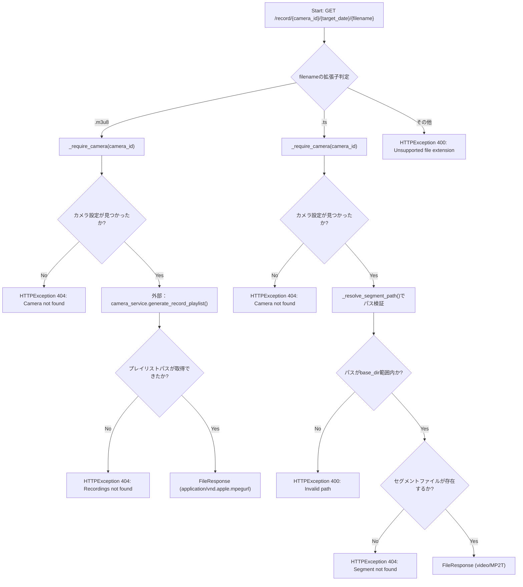
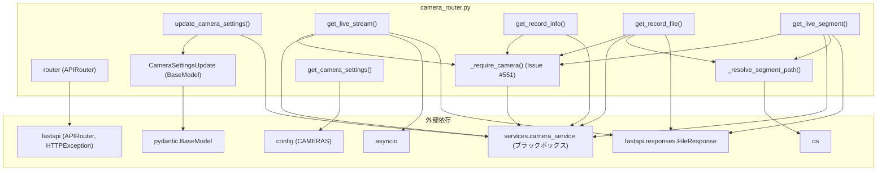

## 1. 解析メタ情報

| 項目 | 内容 |
| --- | --- |
| 対象ファイル | `camera_router.py` |
| 言語 | Python |
| 解析対象 | 提供されたコードのみ |
| 推測・補完 | 一切なし |

## 関連ドキュメント

- [camera_service.md](./camera_service.md) — 呼び出し先（委譲先）。`start_hls_stream`, `get_record_start_offset`, `generate_record_playlist`, `set_camera_enabled`, `HLS_LIVE_DIR`, `HLS_VOD_DIR`に加え、**（Issue #551で追加）** `get_camera_config_or_none`を提供する。
- [config.md](./config.md) — `CAMERAS`設定を提供する。
- [CameraDashboard.md](../family-quest/src/features/camera/components/CameraDashboard.md) — フロントエンド側の対応コンポーネント（`/settings`エンドポイントの利用元と推測される）。
- [LiveView.md](../family-quest/src/features/camera/components/LiveView.md) — フロントエンド側の対応コンポーネント（ライブ配信エンドポイントの利用元と推測される）。
- [RecordView.md](../family-quest/src/features/camera/components/RecordView.md) — フロントエンド側の対応コンポーネント（録画配信エンドポイントの利用元と推測される）。
- [index.md](../family-quest/src/features/camera/types/index.md) — `get_camera_settings`が返す`id`/`name`/`order`/`enabled`に対応する`CameraConfig`型定義。
- [HlsPlayer.md](../family-quest/src/components/ui/HlsPlayer.md) — `.m3u8`/`.ts`エンドポイントが配信するHLSストリームを実際に再生するプレイヤーコンポーネント。

## 2. ファイルの概要

* FastAPIの `APIRouter` を用いて、カメラのライブ配信・録画再生に関するHTTPエンドポイントを定義するルーターモジュールである。
* カメラ設定一覧の取得(`/settings`)、カメラ有効/無効の切り替え(`PUT /settings/{camera_id}`)、ライブHLSプレイリストの取得(`/live/{camera_id}/stream.m3u8`)、ライブHLSセグメントの配信(`/live/{camera_id}/{segment_file}`)、録画情報の取得(`/record/{camera_id}/{target_date}/info`)、録画プレイリスト/セグメントの配信(`/record/{camera_id}/{target_date}/{filename}`)の6つのエンドポイントを提供する。
* 実際のストリーム生成・録画処理は `services.camera_service` モジュールに委譲し、本ファイルはHTTPリクエストの受付・パラメータ検証・レスポンス形式への変換（パストラバーサル対策を含む）を担う。
* コミット`95d3e55`（E-3: camera enable/disable persistence）により、`GET /settings`が返す`enabled`は常に`True`固定だった状態から、`config.CAMERAS`側の`enabled`キー（`devices.json`から読み込み、無ければ`True`）を反映するよう修正され、`PUT /settings/{camera_id}`エンドポイントと`CameraSettingsUpdate`リクエストモデルが新規追加された。これにより`camera_service.set_camera_enabled`経由で`devices.json`へ有効/無効設定を永続化できるようになった。
* **（Issue #551で追加）** `get_live_stream`・`get_record_info`・`get_record_file`（`.m3u8`/`.ts`両分岐）・`get_live_segment`の5箇所に、それぞれ独立に`next((c for c in config.CAMERAS if c["id"] == camera_id), None)` + `HTTPException(404)`という同一のカメラ設定ルックアップが重複していた。これを`services.camera_service.get_camera_config_or_none(camera_id)`（新規追加）を呼び出すだけの新設ヘルパー`_require_camera(camera_id) -> Dict[str, Any]`（見つからなければ本ファイル側で404を送出）へ一元化した。5箇所のうち`get_live_stream`と`get_record_info`は戻り値の`cam_conf`をその後の処理でも使うため変数に受け、`get_record_file`の`.ts`分岐と`get_live_segment`は存在確認のみが目的だったため戻り値を受け取らずに呼び出すだけの形にしている。
* 根拠: [モジュール全体の構成] (行番号: 1〜152 / 抜粋: "from fastapi import APIRouter, HTTPException"), `"enabled": cam.get("enabled", True)` (行番号: 54 / 抜粋: "cam.get(\"enabled\", True)"), `@router.put("/settings/{camera_id}")` (行番号: 58 / 抜粋: "@router.put(\"/settings/{camera_id}\")"), `def _require_camera(camera_id: str) -> Dict[str, Any]:` (行番号: 18〜25 / 抜粋: "cam_conf = camera_service.get_camera_config_or_none(camera_id)\n    if not cam_conf:\n        raise HTTPException(status_code=404, detail=\"Camera not found\")\n    return cam_conf")

## 3. 外部依存関係

### インポート一覧

| 名称 | 種類 | 用途 | 根拠 |
| --- | --- | --- | --- |
| `asyncio` | 標準ライブラリ | **（Issue #457で追加）** `get_live_stream`内で`camera_service.start_hls_stream`をスレッドプールへオフロードする(`asyncio.to_thread`)ため、および初期セグメント生成待ちループ中にイベントループを他リクエストへ譲る非同期スリープ(`asyncio.sleep`)のため | 根拠: [import文] (行番号: 1 / 抜粋: "import asyncio")、[使用箇所] (行番号: 73, 85 / 抜粋: "await asyncio.to_thread(camera_service.start_hls_stream, cam_conf)", "await asyncio.sleep(0.5)") |
| `os` | 標準ライブラリ | パス結合(`os.path.join`)、実パス解決(`os.path.realpath`)、共通パス判定(`os.path.commonpath`)、ファイル存在確認(`os.path.exists`) | 根拠: [import文] (行番号: 2 / 抜粋: "import os") |
| `re` | 標準ライブラリ | `target_date`のYYYYMMDD形式検証用正規表現(`_TARGET_DATE_RE`)のコンパイル | 根拠: [import文] (行番号: 3 / 抜粋: "import re") |
| `typing.Any`, `typing.Dict` | 標準ライブラリ | **（Issue #551で追加）** `_require_camera`の戻り値型注釈`Dict[str, Any]` | 根拠: [import文] (行番号: 4 / 抜粋: "from typing import Any, Dict") |
| `fastapi.APIRouter`, `HTTPException` | 外部ライブラリ | ルーターの生成、HTTPエラーレスポンスの送出 | 根拠: [import文] (行番号: 5 / 抜粋: "from fastapi import APIRouter, HTTPException") |
| `fastapi.responses.FileResponse` | 外部ライブラリ | 動画/プレイリストファイルをHTTPレスポンスとして返却 | 根拠: [import文] (行番号: 6 / 抜粋: "from fastapi.responses import FileResponse") |
| `pydantic.BaseModel` | 外部ライブラリ | `PUT /settings/{camera_id}`のリクエストボディ用モデル`CameraSettingsUpdate`の基底クラス | 根拠: [import文] (行番号: 7 / 抜粋: "from pydantic import BaseModel") |
| `config` | 内部モジュール | カメラ設定一覧(`config.CAMERAS`)の取得（`get_camera_settings`のみが直接参照。他5エンドポイントは**Issue #551**で`_require_camera`経由に統一されたため`config.CAMERAS`を直接参照しない） | 根拠: [config.CAMERASの参照] (行番号: 49 / 抜粋: "for idx, cam in enumerate(config.CAMERAS):") |
| `services.camera_service` | 内部モジュール | ライブ配信開始、録画情報取得、録画プレイリスト生成、カメラ有効/無効の永続化、HLSディレクトリパスの取得、**（Issue #551で追加）** カメラ設定のルックアップ(`get_camera_config_or_none`) | 根拠: [import文] (行番号: 9 / 抜粋: "from services import camera_service") |

### ブラックボックスとなる外部要素

| 名称 | 理由 | 根拠 |
| --- | --- | --- |
| `camera_service` | 本タスクの指示により、本ファイル執筆時点では `camera_service.py` を読み込まずブラックボックスとして扱う。`start_hls_stream`, `get_record_start_offset`, `generate_record_playlist`, `set_camera_enabled`, `get_camera_config_or_none`, `HLS_VOD_DIR`, `HLS_LIVE_DIR` の内部実装・戻り値の詳細仕様は不明（**Issue #551で追加**の`get_camera_config_or_none`は戻り値が`config.CAMERAS`から検索した辞書または`None`であることは呼び出し側`_require_camera`の使い方から明らかだが、内部実装自体は本ファイルからは不明）。**（Issue #457対応）** `start_hls_stream`の呼び出しは`get_live_stream`が`async def`化されたことに伴い`await asyncio.to_thread(camera_service.start_hls_stream, cam_conf)`という形に変わった（呼び出し先の関数自体のシグネチャ・戻り値は変わらない）。 | 根拠: [import文と呼び出し箇所] (行番号: 9, 22, 61, 73, 106, 117, 128, 148 / 抜粋: "from services import camera_service", "await asyncio.to_thread(camera_service.start_hls_stream, cam_conf)", "cam_conf = camera_service.get_camera_config_or_none(camera_id)") |
| `config` | `config.CAMERAS` の構造（各カメラ辞書のキー、読み込み元ファイル等）が本ファイルからは不明。 | 根拠: [config.CAMERASの参照] (行番号: 49 / 抜粋: "config.CAMERAS") |

## 4. 主要要素の定義（関数 / エンドポイント / コンポーネント）

### `_require_camera`（Issue #551で新規追加）

* **役割**: `camera_id`に対応するカメラ設定を`camera_service.get_camera_config_or_none`で取得し、見つかった場合はその辞書を返す。見つからなければ本ファイル側で`HTTPException(404, "Camera not found")`を送出する。以前は5つのエンドポイントそれぞれが`next((c for c in config.CAMERAS if c["id"] == camera_id), None)` + 同一の404送出ロジックを個別に持っていたが、それを1関数へ一元化したもの。
* 根拠: [関数定義とDocstring] (行番号: 18〜25 / 抜粋: "def _require_camera(camera_id: str) -> Dict[str, Any]:\n    \"\"\"camera_idに対応するカメラ設定を返し、無ければ404を送出する(#551)。")

* **引数/リクエスト**: `camera_id: str`
* 根拠: [引数定義] (行番号: 18 / 抜粋: "def _require_camera(camera_id: str) -> Dict[str, Any]:")

* **戻り値/レスポンス**: `Dict[str, Any]`（見つかったカメラ設定の辞書）
* 根拠: [戻り値] (行番号: 25 / 抜粋: "return cam_conf")

* **副作用**: なし（`camera_service.get_camera_config_or_none`の呼び出しのみ）
* 根拠: [処理内容] (行番号: 22 / 抜粋: "cam_conf = camera_service.get_camera_config_or_none(camera_id)")

* **エラーハンドリング**: `camera_service.get_camera_config_or_none`がFalsy（`None`）を返した場合、`HTTPException(status_code=404, detail="Camera not found")`を送出する。
* 根拠: [ガード節] (行番号: 23〜24 / 抜粋: "if not cam_conf:\n        raise HTTPException(status_code=404, detail=\"Camera not found\")")

### `_resolve_segment_path`

* **役割**: `base_dir/camera_id/filename` からパスを構築し、実パス解決後に `base_dir` の外側に出ていないか（パストラバーサル）を検証したうえで、安全な絶対パスを返す。
* 根拠: [関数定義とDocstring] (行番号: 28〜41 / 抜粋: "def _resolve_segment_path(base_dir: str, camera_id: str, filename: str) -> str:")

* **引数/リクエスト**: `base_dir: str`（基準ディレクトリ）, `camera_id: str`（カメラID）, `filename: str`（対象ファイル名）
* 根拠: [引数定義] (行番号: 28 / 抜粋: "def _resolve_segment_path(base_dir: str, camera_id: str, filename: str) -> str:")

* **戻り値/レスポンス**: `str`（範囲内であることを検証済みの実パス（絶対パス）文字列）
* 根拠: [戻り値] (行番号: 41 / 抜粋: "return resolved_candidate")

* **副作用**: なし（`os.path.realpath` によるファイルシステム参照のみ）
* 根拠: [処理内容] (行番号: 34〜36 / 抜粋: "resolved_candidate = os.path.realpath(candidate)")

* **エラーハンドリング**: 解決後のパスが `base_dir` の実パスと共通しない（範囲外）場合、`HTTPException(status_code=400, detail="Invalid path")` を送出する。
* 根拠: [ガード節] (行番号: 38〜39 / 抜粋: "if os.path.commonpath([resolved_base, resolved_candidate]) != resolved_base:\n        raise HTTPException(status_code=400, detail="Invalid path")")

### `CameraSettingsUpdate`

* **役割**: `PUT /settings/{camera_id}`のリクエストボディを表すPydanticモデル。カメラの有効/無効切り替え値を受け取る。
* 根拠: `class CameraSettingsUpdate(BaseModel):` (行番号: 14-15 / 抜粋: "class CameraSettingsUpdate(BaseModel):")

* **引数/リクエスト**: `enabled: bool`（必須フィールド）
* 根拠: `enabled: bool` (行番号: 15 / 抜粋: "enabled: bool")

* **戻り値/レスポンス**: 該当なし（Pydanticモデルの定義のみ）
* 根拠: `class CameraSettingsUpdate(BaseModel):` (行番号: 14-15 / 抜粋: "class CameraSettingsUpdate(BaseModel):")

* **副作用**: なし
* 根拠: `class CameraSettingsUpdate(BaseModel):` (行番号: 14-15 / 抜粋: "class CameraSettingsUpdate(BaseModel):")

* **エラーハンドリング**: Pydanticの機能に依存するバリデーションエラー（`enabled`が`bool`に変換できない場合等）。
* 根拠: `class CameraSettingsUpdate(BaseModel):` (行番号: 14-15 / 抜粋: "class CameraSettingsUpdate(BaseModel):")

### `get_camera_settings` (`GET /settings`)

* **役割**: `config.CAMERAS` からカメラ設定一覧を読み出し、フロントエンド向けにID・名前・表示順・有効フラグを含む辞書のリストを構築して返す。
* 根拠: [エンドポイント定義とDocstring] (行番号: 44〜46 / 抜粋: "def get_camera_settings():\n    """フロントエンドへ有効なカメラの一覧と設定を返す"""")

* **引数/リクエスト**: なし（パスパラメータ・クエリパラメータなし）
* 根拠: [ルート定義] (行番号: 44〜45 / 抜粋: "@router.get("/settings")\ndef get_camera_settings():")

* **戻り値/レスポンス**: カメラ設定辞書のリスト。各要素は `id`, `name`, `order`（配列インデックス+1）, `enabled`（`cam.get("enabled", True)`。コミット`95d3e55`以降は`config.CAMERAS`側の実際の値を反映し、キーが無い場合のみ`True`にフォールバック）を含む。
* 根拠: [レスポンス構築] (行番号: 50〜55 / 抜粋: "settings.append({\n            "id": cam["id"],\n            "name": cam["name"],\n            "order": idx + 1,  # 配列の順序を表示順とする\n            "enabled": cam.get("enabled", True)\n        })")

* **副作用**: なし
* **エラーハンドリング**: なし（`config.CAMERAS` の各要素に `id`/`name` キーが存在しない場合の例外処理はコード上に存在しない）

### `update_camera_settings` (`PUT /settings/{camera_id}`)

* **役割**: 指定カメラIDの有効/無効フラグを`camera_service.set_camera_enabled`経由で`devices.json`に永続化する。コミット`95d3e55`（E-3）で新規追加。
* 根拠: `def update_camera_settings(camera_id: str, payload: CameraSettingsUpdate):` (行番号: 58〜64 / 抜粋: "def update_camera_settings(camera_id: str, payload: CameraSettingsUpdate):")

* **引数/リクエスト**: `camera_id: str`（パスパラメータ）, `payload: CameraSettingsUpdate`（リクエストボディ、`enabled: bool`を含む）
* 根拠: [引数定義] (行番号: 58〜59 / 抜粋: "@router.put("/settings/{camera_id}")\ndef update_camera_settings(camera_id: str, payload: CameraSettingsUpdate):")

* **戻り値/レスポンス**: `{"id": camera_id, "enabled": payload.enabled}` 形式の辞書。カメラID未検出時は404。
* 根拠: `return {"id": camera_id, "enabled": payload.enabled}` (行番号: 64 / 抜粋: "return {"id": camera_id, "enabled": payload.enabled}")

* **副作用**: `camera_service.set_camera_enabled(camera_id, payload.enabled)` の呼び出しにより、`devices.json`ファイルへの書き込み（永続化）と`config.CAMERAS`（インメモリ）への反映を誘発しうる。本エンドポイントは`_require_camera`を使わず`set_camera_enabled`の戻り値（`bool`）で直接404判定する既存の実装のままである（Issue #551の対象外）。
* 根拠: `if not camera_service.set_camera_enabled(camera_id, payload.enabled):` (行番号: 61 / 抜粋: "camera_service.set_camera_enabled(camera_id, payload.enabled)")

* **エラーハンドリング**: `camera_service.set_camera_enabled`が`False`を返した場合（対象カメラが見つからない等）、`HTTPException(status_code=404, detail="Camera not found")`を送出する。
* 根拠: `if not camera_service.set_camera_enabled(camera_id, payload.enabled):\n        raise HTTPException(status_code=404, detail="Camera not found")` (行番号: 61〜62 / 抜粋: "raise HTTPException(status_code=404, detail=\"Camera not found\")")

### `get_live_stream` (`GET /live/{camera_id}/stream.m3u8`)

* **役割**: 指定カメラIDのライブHLSストリーム生成を `camera_service.start_hls_stream` に依頼し、プレイリストファイル(.m3u8)が生成されるまで最大5秒待機したうえでファイルレスポンスを返す。**（Issue #551で修正）** カメラ設定のルックアップは`_require_camera(camera_id)`呼び出しに置き換わった（挙動は変わらず、404送出のタイミング・条件は従来と同一）。**（Issue #457で修正）** 以前は同期`def`エンドポイントとして実装され、`camera_service.start_hls_stream`（ffmpeg起動等のブロッキング処理を含む）を直接呼び出し、待機ループも`time.sleep(0.5)`（同期）で実装されていたため、その間サーバーの共有スレッドプールのワーカースレッドを占有し続け、同時アクセス集中時に他リクエストの遅延要因になっていた。現在は`async def`エンドポイントに変更され、`start_hls_stream`の呼び出しは`asyncio.to_thread`でスレッドプールへオフロードし、待機ループも`await asyncio.sleep(0.5)`に変更してイベントループを他リクエストへ譲るようになった。
* 根拠: [エンドポイント定義とDocstring] (行番号: 66〜69 / 抜粋: "async def get_live_stream(camera_id: str):\n    """ライブHLSプレイリスト（.m3u8）の取得"""\n    cam_conf = _require_camera(camera_id)")、[オフロード呼び出し] (行番号: 71〜73 / 抜粋: "# #457: start_hls_stream はffmpeg起動等のブロッキング処理を含むため、\n    # イベントループを止めないようスレッドプールへオフロードする。\n    playlist_path = await asyncio.to_thread(camera_service.start_hls_stream, cam_conf)")

* **引数/リクエスト**: `camera_id: str`（パスパラメータ）
* 根拠: [引数定義] (行番号: 66〜67 / 抜粋: "@router.get("/live/{camera_id}/stream.m3u8")\nasync def get_live_stream(camera_id: str):")

* **戻り値/レスポンス**: `FileResponse`（media_type="application/vnd.apple.mpegurl"）。カメラ未検出時は404、ストリーム初期化失敗時は500、生成タイムアウト時は503を送出。
* 根拠: [FileResponse返却] (行番号: 84 / 抜粋: "return FileResponse(playlist_path, media_type="application/vnd.apple.mpegurl")")

* **副作用**: `camera_service.start_hls_stream` を`asyncio.to_thread`経由でスレッドプール実行（ストリーム開始プロセスの起動を誘発しうる）、最大10回×0.5秒の`await asyncio.sleep(0.5)`による非同期待機ループ（イベントループはブロックしない）。
* 根拠: [待機ループ] (行番号: 82〜85 / 抜粋: "for _ in range(10):\n        if os.path.exists(playlist_path):\n            return FileResponse(playlist_path, media_type="application/vnd.apple.mpegurl")\n        await asyncio.sleep(0.5)")

* **エラーハンドリング**: カメラID未検出時に404（`_require_camera`内で送出）、`start_hls_stream`が空文字列相当（falsy）を返した場合に500、待機ループ内でファイルが生成されなかった場合に503の `HTTPException` を送出。
* 根拠: [各種例外送出] (行番号: 69, 75〜76, 87 / 抜粋: "cam_conf = _require_camera(camera_id)", "if not playlist_path:\n        raise HTTPException(status_code=500, detail=\"Failed to initialize stream\")")

### `get_record_info` (`GET /record/{camera_id}/{target_date}/info`)

* **役割**: 指定カメラ・指定日の録画ファイルのメタデータとして、開始オフセット秒数を `camera_service.get_record_start_offset` から取得し返す。**（Issue #551で修正）** カメラ設定のルックアップは`_require_camera(camera_id)`呼び出しに置き換わった。
* 根拠: [エンドポイント定義とDocstring] (行番号: 100〜104 / 抜粋: "def get_record_info(camera_id: str, target_date: str):\n    """指定日の録画ファイルのメタデータ（最初のファイルのオフセット秒数）を返す"""\n    _validate_target_date(target_date)\n    cam_conf = _require_camera(camera_id)")
* **（Issue #386 で追加）** `target_date` は `_validate_target_date` で `^\d{8}$`（YYYYMMDD）に一致することを検証し、不一致なら `HTTPException(400)`。`target_date` は camera_service 側で glob パターンと concat ファイル名に埋め込まれるため、未検証だと `*` で全期間の録画を1本に結合する数時間の ffmpeg ジョブを外部から起動できた。
* 根拠: `_TARGET_DATE_RE = re.compile(r"^\d{8}$")` (行番号: 92)、`def _validate_target_date(target_date: str) -> None:` (行番号: 95〜97)、呼び出し (行番号: 103, 112)

* **引数/リクエスト**: `camera_id: str`, `target_date: str`（いずれもパスパラメータ）
* 根拠: [引数定義] (行番号: 100〜101 / 抜粋: "@router.get("/record/{camera_id}/{target_date}/info")\ndef get_record_info(camera_id: str, target_date: str):")

* **戻り値/レスポンス**: `{"offset_seconds": offset}` 形式の辞書（`offset`は`int`）
* 根拠: [レスポンス構築] (行番号: 107 / 抜粋: "return {"offset_seconds": offset}")

* **副作用**: `camera_service.get_record_start_offset` の呼び出し
* 根拠: [呼び出し] (行番号: 106 / 抜粋: "offset = camera_service.get_record_start_offset(cam_conf, target_date)")

* **エラーハンドリング**: カメラID未検出時に404の `HTTPException` を送出（`_require_camera`内で送出）。
* 根拠: [呼び出し] (行番号: 104 / 抜粋: "cam_conf = _require_camera(camera_id)")

### `get_record_file` (`GET /record/{camera_id}/{target_date}/{filename}`)

* **役割**: リクエストされたファイル名の拡張子により処理を分岐する。`.m3u8`の場合は録画プレイリストを生成・返却し、`.ts`の場合は録画セグメントファイルを配信、それ以外の拡張子は400エラーとする。**（Issue #551で修正）** 両分岐のカメラ設定ルックアップは`_require_camera(camera_id)`呼び出しに置き換わった。`.m3u8`分岐は戻り値`cam_conf`を`generate_record_playlist`に渡すため変数で受けるが、`.ts`分岐は存在確認のみが目的のため戻り値を受け取らずに呼び出すだけになっている。
* 根拠: [エンドポイント定義とDocstring] (行番号: 109〜112 / 抜粋: "def get_record_file(camera_id: str, target_date: str, filename: str):\n    """録画VODのプレイリスト（.m3u8）またはセグメント（.ts）を配信"""")、[両分岐の呼び出し] (行番号: 115, 125 / 抜粋: "cam_conf = _require_camera(camera_id)", "_require_camera(camera_id)")
* **（Issue #386 で追加）** `target_date` は `_validate_target_date` で `^\d{8}$`（YYYYMMDD）に一致することを検証し、不一致なら `HTTPException(400)`。`target_date` は camera_service 側で glob パターンと concat ファイル名に埋め込まれるため、未検証だと `*` で全期間の録画を1本に結合する数時間の ffmpeg ジョブを外部から起動できた。
* 根拠: `_TARGET_DATE_RE = re.compile(r"^\d{8}$")` (行番号: 92)、`def _validate_target_date(target_date: str) -> None:` (行番号: 95〜97)、呼び出し (行番号: 103, 112)

* **引数/リクエスト**: `camera_id: str`, `target_date: str`, `filename: str`（いずれもパスパラメータ）
* 根拠: [引数定義] (行番号: 109〜110 / 抜粋: "@router.get("/record/{camera_id}/{target_date}/{filename}")\ndef get_record_file(camera_id: str, target_date: str, filename: str):")

* **戻り値/レスポンス**: `.m3u8`要求時は `FileResponse`（media_type="application/vnd.apple.mpegurl"）、`.ts`要求時は `FileResponse`（media_type="video/MP2T"）。
* 根拠: [各分岐でのレスポンス返却] (行番号: 121, 132 / 抜粋: "return FileResponse(playlist_path, media_type="application/vnd.apple.mpegurl")")

* **副作用**: `.m3u8`分岐では `camera_service.generate_record_playlist` の呼び出し（プレイリスト・セグメント生成を誘発しうる）。`.ts`分岐では `_resolve_segment_path` によるパス検証と `camera_service.HLS_VOD_DIR` の参照。
* 根拠: [各分岐の処理] (行番号: 117, 128 / 抜粋: "playlist_path = camera_service.generate_record_playlist(cam_conf, target_date)")

* **エラーハンドリング**: カメラID未検出時404（各分岐で`_require_camera`が個別に判定）。`.m3u8`分岐でプレイリスト生成失敗時404。`.ts`分岐でセグメントファイル不在時404。上記いずれの拡張子でもない場合は400。
* 根拠: [各エラー分岐] (行番号: 115, 118〜119, 125, 129〜130, 134〜135 / 抜粋: "else:\n        raise HTTPException(status_code=400, detail="Unsupported file extension")")

### `get_live_segment` (`GET /live/{camera_id}/{segment_file}`)

* **役割**: ライブHLSの `.ts` セグメントファイルを、拡張子チェックとパストラバーサル検証を経て配信する。Issue #172の修正（コミット時点）により、`.ts`以外の拡張子は400で拒否するようになった。修正前は拡張子を一切検証していなかったため、`_resolve_segment_path`のパストラバーサル対策のみでは防げない形で、同一ディレクトリ内に配置される`ffmpeg.log`（RTSP認証情報を含みうる。`camera_service.md`参照）等の任意ファイルがそのまま配信され得た。**（Issue #551で修正）** カメラ設定のルックアップは`_require_camera(camera_id)`呼び出しに置き換わった（存在確認のみが目的のため戻り値は受け取らない）。
* 根拠: [エンドポイント定義とDocstring] (行番号: 137〜139 / 抜粋: "def get_live_segment(camera_id: str, segment_file: str):\n    """ライブのHLSセグメント（.tsファイル）を配信"""")、[拡張子チェック] (行番号: 143〜144 / 抜粋: "if not segment_file.endswith(\".ts\"):\n        raise HTTPException(status_code=400, detail=\"Unsupported file extension\")")、[カメラ確認] (行番号: 146 / 抜粋: "_require_camera(camera_id)")

* **引数/リクエスト**: `camera_id: str`, `segment_file: str`（いずれもパスパラメータ）
* 根拠: [引数定義] (行番号: 137〜138 / 抜粋: "@router.get("/live/{camera_id}/{segment_file}")\ndef get_live_segment(camera_id: str, segment_file: str):")

* **戻り値/レスポンス**: `FileResponse`（media_type="video/MP2T"）
* 根拠: [レスポンス返却] (行番号: 152 / 抜粋: "return FileResponse(segment_path, media_type="video/MP2T")")

* **副作用**: `_resolve_segment_path` によるパス検証、`camera_service.HLS_LIVE_DIR` の参照。
* 根拠: [パス解決] (行番号: 148 / 抜粋: "segment_path = _resolve_segment_path(camera_service.HLS_LIVE_DIR, camera_id, segment_file)")

* **エラーハンドリング**: `segment_file`が`.ts`で終わらない場合400（カメラID検証より前に判定）、カメラID未検出時404（`_require_camera`内）、セグメントファイル不在時404（`_resolve_segment_path`内で範囲外パスの場合も400が送出されうる）。
* 根拠: [エラー分岐] (行番号: 143〜144, 146, 149〜150 / 抜粋: "if not segment_file.endswith(\".ts\"):\n        raise HTTPException(status_code=400, detail=\"Unsupported file extension\")")

## 5. 処理フロー図

録画ファイル配信のエンドポイント `get_record_file` を例に、拡張子による分岐ロジックを示します。**（Issue #551で改訂）** カメラ設定の検索は`_require_camera`ヘルパーへ一元化された。

## 6. 依存関係図

## 7. 次のステップ（リバースエンジニアリングの提案）

| 優先度 | ファイル名(推測可) | 理由 | 根拠 |
| --- | --- | --- | --- |
| 高 | `services/camera_service.py` | `start_hls_stream`, `get_record_start_offset`, `generate_record_playlist`, `set_camera_enabled`, `get_camera_config_or_none`, `HLS_VOD_DIR`, `HLS_LIVE_DIR` の実装がすべてブラックボックスであり、本ルーターが依存するストリーム生成・録画処理・設定永続化・カメラ設定ルックアップロジックの実態を把握する必要があるため。 | 根拠: [import文] (行番号: 9 / 抜粋: "from services import camera_service") |
| 中 | `config.py` | `config.CAMERAS` のデータ構造（各カメラ辞書に含まれるキーの全容）と読み込み元が不明であるため。 | 根拠: [config.CAMERASの参照] (行番号: 49 / 抜粋: "for idx, cam in enumerate(config.CAMERAS):") |

## 8. 保守上の注意点

* **（Issue #551で解消）カメラ設定ルックアップの重複**: 以前は5つのエンドポイントがそれぞれ`next((c for c in config.CAMERAS if c["id"] == camera_id), None)` + `HTTPException(404, "Camera not found")`という同一のロジックを個別に実装しており、CLAUDE.mdの「ルーターはパース・検証のみ、ロジックはservices/*.pyへ委譲する」規約から乖離していた。`services.camera_service.get_camera_config_or_none`（新設）へルックアップ自体を委譲し、ルーター側は404送出だけを担う`_require_camera`ヘルパー1つに一元化した。
* 根拠: `def _require_camera(camera_id: str) -> Dict[str, Any]:` (行番号: 18〜25)
* **[修正済み・Issue #457] 同期的な待機処理によるブロッキングを解消**: 以前は `get_live_stream` が同期`def`エンドポイントとして実装され、`camera_service.start_hls_stream`（ffmpeg起動を含むブロッキング処理）を直接呼び出したうえで最大5秒間 `time.sleep(0.5)` によるポーリングでブロックしており、デフォルトのスレッドプール実行下ではリクエストごとにワーカースレッドを占有し続け、同時アクセス集中時に他リクエストの遅延要因になっていた。現在は`async def`化され、`start_hls_stream`の呼び出しは`asyncio.to_thread`でスレッドプールへオフロードし、待機ループも`await asyncio.sleep(0.5)`に変更してイベントループを他リクエスト処理に譲るようになった。
* **（コミット`95d3e55`, E-3で解消）`enabled`フラグの固定値**: 修正前は `get_camera_settings` の `enabled` が常に `True`固定で、`config.CAMERAS` 側で無効化されたカメラの状態を反映する仕組みがなかった。現在は `cam.get("enabled", True)` により実際の値を反映し、`PUT /settings/{camera_id}`（`update_camera_settings`）で `camera_service.set_camera_enabled` 経由の永続化（`devices.json`書き込み）が可能になっている。
* **例外処理の欠如**: `get_camera_settings` では `config.CAMERAS` の各要素に `id`/`name` キーが存在しない場合の `KeyError` に対する処理がない（`enabled`キーのみ`.get`で防御的にアクセスしている）。`update_camera_settings` も `camera_service.set_camera_enabled` 呼び出し自体に対する `try-except` は持たず、`False`戻り値（対象カメラ不在）のみをHTTP 404として扱う（`_require_camera`は使わない独自実装のまま、Issue #551の対象外）。
* **パストラバーサル対策の一元化**: `.ts` セグメント配信は `_resolve_segment_path` により防御されているが、`.m3u8` の場合は `camera_service.generate_record_playlist` / `start_hls_stream` の戻り値パスをそのまま `FileResponse` に渡しており、パス検証の責務が `camera_service` 側にあるかは本ファイルからは確認できない。
* **（Issue #172で解消）拡張子チェックの非対称性**: `get_record_file` は`.m3u8`/`.ts`以外を400で拒否していたが、`get_live_segment` は修正前は拡張子を一切検証しておらず、`_resolve_segment_path`のパストラバーサル対策だけでは防げない形で同一カメラディレクトリ内の`ffmpeg.log`（`camera_service.py`が`chmod 600`で保護しているファイル。RTSP認証情報を含みうる）等が配信され得た。現在は`get_record_file`と同様に`.ts`以外を400で拒否する。

## 9. 不明事項一覧

| 項目 | 理由 | 必要なファイル |
| --- | --- | --- |
| `camera_service` の各関数の内部実装 | `start_hls_stream`, `get_record_start_offset`, `generate_record_playlist`, `set_camera_enabled`, `get_camera_config_or_none` の処理内容、`HLS_VOD_DIR`/`HLS_LIVE_DIR` の実際の値が本ファイルからは不明。 | `services/camera_service.py` |
| `config.CAMERAS` のデータ構造 | 各カメラ辞書のキー一覧や設定ファイルの読み込み元が不明。 | `config.py` |

## 相互参照による補足情報

| 元の不明事項 | 判明した内容 | 参照元ドキュメント |
| --- | --- | --- |
| `camera_service` の各関数の内部実装 | `camera_service.md`の解析によれば、`start_hls_stream`はffmpegプロセスをカメラID単位で起動しHLSライブ配信用プレイリストパス（`str`、RTSP URL取得失敗時は空文字列）を返し、`get_record_start_offset`は指定日最初の録画ファイル名から算出した0時からの経過秒数（`int`、失敗時は`0`）を返し、`generate_record_playlist`は10分単位に分割されたmp4群を`ffconcat`で結合したVOD用HLSプレイリストパス（`Optional[str]`、保存先ディレクトリ不在時や対象ファイルなし時は`None`）を返すと推測される。ただし`HLS_LIVE_DIR`/`HLS_VOD_DIR`の実際のパス値自体は`camera_service.md`側でも本文中に明記が確認できず、依然として不明。 | camera_service.md |
| `camera_service` の各関数の内部実装（`HLS_LIVE_DIR`/`HLS_VOD_DIR`の実値） | `services/camera_service.py`を直接確認した。23行目で`BASE_DIR = os.path.dirname(os.path.dirname(__file__))`（`services/`の親、すなわち`MY_HOME_SYSTEM/`）と定義され、24〜25行目で`HLS_LIVE_DIR = os.path.join(BASE_DIR, "data", "hls_streams", "live")`、`HLS_VOD_DIR = os.path.join(BASE_DIR, "data", "hls_streams", "vod")`という固定のローカルディレクトリパス（`MY_HOME_SYSTEM/data/hls_streams/live`および`MY_HOME_SYSTEM/data/hls_streams/vod`）であることを確認した。ライブHLS配信の実処理は238行目で`init_output_dir(HLS_LIVE_DIR, cam_id)`、`generate_record_playlist`は350行目で`init_output_dir(HLS_VOD_DIR, cam_id)`をそれぞれ呼び出しており、camera_service.md側の推測が実際のパス値でも裏付けられることを確認した。**（Issue #439で`start_hls_stream`は`_live_stream_lock`を取得する薄いラッパーに変更され、上記の実処理自体は新設の`_start_hls_stream_locked`関数（237〜289行目）に分離されている。）** `set_camera_enabled(camera_id, enabled) -> bool`(451〜478行目)は、`config.DEVICES_JSON_PATH`が存在しなければ`False`を返し(454〜455行目)、存在すれば`devices.json`を読み込んで対象カメラを`id`で検索、見つからなければ`False`を返す(460〜463行目)。見つかった場合は`target["enabled"] = enabled`で更新した上で、一時ファイル(`{DEVICES_JSON_PATH}.tmp`)へ書き込んでから`os.replace`でアトミックに本ファイルへ反映し(466〜471行目。書き込み途中のクラッシュでdevices.json自体が壊れることを防ぐ設計)、さらに`config.CAMERAS`（インメモリ）内の対応する辞書の`enabled`も直接更新する(473〜476行目)ことを確認した。**（Issue #551で追加）** `get_camera_config_or_none(camera_id) -> Optional[Dict[str, Any]]`は`config.CAMERAS`から`camera_id`に一致する辞書を`next()`で検索して返す（見つからなければ`None`）だけの単純な関数であり、例外は送出しない。 | 直接ソース確認: `MY_HOME_SYSTEM/services/camera_service.py:23-25, 237-289, 350, 451-478` |
| `config.CAMERAS` のデータ構造 | `config.py`を直接確認した。`CAMERAS: List[Dict[str, Any]] = []`(297行目)は、`devices.json`（リポジトリ内に実体なし、`.gitignore`の`*.json`規則により追跡対象外）が存在すれば300〜305行目で`CAMERAS = [CameraConfig(**c).model_dump(by_alias=True) for c in _devices_data["cameras"]]`として読み込まれる。`CameraConfig`(Pydanticモデル、144〜154行目)のキー一覧は`id: str, name: str, nas_folder: Optional[str], location: str, ip: str, port: int(既定2020), user: Optional[str], password: Optional[str](エイリアス"pass"), rtsp_url: Optional[str], enabled: bool(既定True。コミット`95d3e55`で追加)`である。本ファイル(`camera_router.py`)自身も49〜55行目で`for idx, cam in enumerate(config.CAMERAS): {"id": cam["id"], "name": cam["name"], "enabled": cam.get("enabled", True)}`のように`id`/`name`キーへ実際にアクセスし`enabled`は`.get`で防御的に取得しており、**（Issue #551で追加）** 他5エンドポイントは`_require_camera`経由で`services.camera_service.get_camera_config_or_none`が同様の`next((c for c in config.CAMERAS if c["id"] == camera_id), None)`検索を行い、その結果の`cam_conf`辞書を`camera_service`の各関数へそのまま渡していることを確認した。 | 直接ソース確認: `MY_HOME_SYSTEM/config.py:144-154, 297, 300-305`, `MY_HOME_SYSTEM/routers/camera_router.py:49-55`, `MY_HOME_SYSTEM/services/camera_service.py`(`get_camera_config_or_none`) |

## 10. 自己検証結果

* [x] 推測・外部ファイルの仕様を一切含んでいない
* [x] 全関数・全クラス・全コンポーネントを列挙した
* [x] 全てのインポート要素を列挙した
* [x] すべての仕様説明に「根拠（行番号・抜粋）」を明記した
* [x] 根拠漏れが0件である
* [x] Mermaid構文にエラーの原因となる記号（エスケープ漏れ）がない
* [x] 不明事項を漏れなく列挙した

完了
