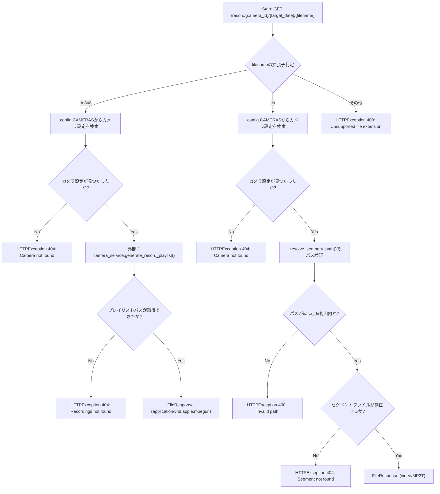
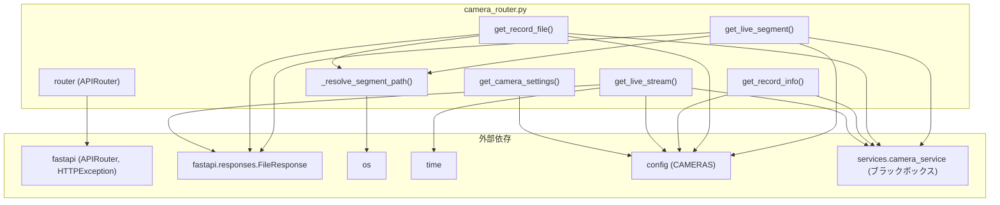

## 1. 解析メタ情報

| 項目 | 内容 |
| --- | --- |
| 対象ファイル | `camera_router.py` |
| 言語 | Python |
| 解析対象 | 提供されたコードのみ |
| 推測・補完 | 一切なし |

## 2. ファイルの概要

* FastAPIの `APIRouter` を用いて、カメラのライブ配信・録画再生に関するHTTPエンドポイントを定義するルーターモジュールである。
* カメラ設定一覧の取得(`/settings`)、ライブHLSプレイリストの取得(`/live/{camera_id}/stream.m3u8`)、ライブHLSセグメントの配信(`/live/{camera_id}/{segment_file}`)、録画情報の取得(`/record/{camera_id}/{target_date}/info`)、録画プレイリスト/セグメントの配信(`/record/{camera_id}/{target_date}/{filename}`)の5つのエンドポイントを提供する。
* 実際のストリーム生成・録画処理は `services.camera_service` モジュールに委譲し、本ファイルはHTTPリクエストの受付・パラメータ検証・レスポンス形式への変換（パストラバーサル対策を含む）を担う。
* 根拠: [モジュール全体の構成] (行番号: 1〜114 / 抜粋: "from fastapi import APIRouter, HTTPException")

## 3. 外部依存関係

### インポート一覧

| 名称 | 種類 | 用途 | 根拠 |
| --- | --- | --- | --- |
| `os` | 標準ライブラリ | パス結合(`os.path.join`)、実パス解決(`os.path.realpath`)、共通パス判定(`os.path.commonpath`)、ファイル存在確認(`os.path.exists`) | 根拠: [import文] (行番号: 1 / 抜粋: "import os") |
| `time` | 標準ライブラリ | ストリーム生成待機のためのスリープ(`time.sleep`) | 根拠: [import文] (行番号: 2 / 抜粋: "import time") |
| `fastapi.APIRouter`, `HTTPException` | 外部ライブラリ | ルーターの生成、HTTPエラーレスポンスの送出 | 根拠: [import文] (行番号: 3 / 抜粋: "from fastapi import APIRouter, HTTPException") |
| `fastapi.responses.FileResponse` | 外部ライブラリ | 動画/プレイリストファイルをHTTPレスポンスとして返却 | 根拠: [import文] (行番号: 4 / 抜粋: "from fastapi.responses import FileResponse") |
| `typing.List`, `Dict`, `Any` | 標準ライブラリ | 型ヒント（本ファイル内での明示的な使用箇所はimport文のみ） | 根拠: [import文] (行番号: 5 / 抜粋: "from typing import List, Dict, Any") |
| `config` | 内部モジュール | カメラ設定一覧(`config.CAMERAS`)の取得 | 根拠: [config.CAMERASの参照] (行番号: 33 / 抜粋: "for idx, cam in enumerate(config.CAMERAS):") |
| `services.camera_service` | 内部モジュール | ライブ配信開始、録画情報取得、録画プレイリスト生成、HLSディレクトリパスの取得 | 根拠: [import文] (行番号: 7 / 抜粋: "from services import camera_service") |

### ブラックボックスとなる外部要素

| 名称 | 理由 | 根拠 |
| --- | --- | --- |
| `camera_service` | 本タスクの指示により、本ファイル執筆時点では `camera_service.py` を読み込まずブラックボックスとして扱う。`start_hls_stream`, `get_record_start_offset`, `generate_record_playlist`, `HLS_VOD_DIR`, `HLS_LIVE_DIR` の内部実装・戻り値の詳細仕様は不明。 | 根拠: [import文と呼び出し箇所] (行番号: 7, 49, 69, 81, 94, 110 / 抜粋: "from services import camera_service") |
| `config` | `config.CAMERAS` の構造（各カメラ辞書のキー、読み込み元ファイル等）が本ファイルからは不明。 | 根拠: [config.CAMERASの参照] (行番号: 33, 45, 65, 77, 89, 106 / 抜粋: "config.CAMERAS") |

## 4. 主要要素の定義（関数 / エンドポイント / コンポーネント）

### `_resolve_segment_path`

* **役割**: `base_dir/camera_id/filename` からパスを構築し、実パス解決後に `base_dir` の外側に出ていないか（パストラバーサル）を検証したうえで、安全な絶対パスを返す。
* 根拠: [関数定義とDocstring] (行番号: 12〜25 / 抜粋: "def _resolve_segment_path(base_dir: str, camera_id: str, filename: str) -> str:")

* **引数/リクエスト**: `base_dir: str`（基準ディレクトリ）, `camera_id: str`（カメラID）, `filename: str`（対象ファイル名）
* 根拠: [引数定義] (行番号: 12 / 抜粋: "def _resolve_segment_path(base_dir: str, camera_id: str, filename: str) -> str:")

* **戻り値/レスポンス**: `str`（範囲内であることを検証済みの実パス（絶対パス）文字列）
* 根拠: [戻り値] (行番号: 25 / 抜粋: "return resolved_candidate")

* **副作用**: なし（`os.path.realpath` によるファイルシステム参照のみ）
* 根拠: [処理内容] (行番号: 18〜20 / 抜粋: "resolved_candidate = os.path.realpath(candidate)")

* **エラーハンドリング**: 解決後のパスが `base_dir` の実パスと共通しない（範囲外）場合、`HTTPException(status_code=400, detail="Invalid path")` を送出する。
* 根拠: [ガード節] (行番号: 22〜23 / 抜粋: "if os.path.commonpath([resolved_base, resolved_candidate]) != resolved_base:\n        raise HTTPException(status_code=400, detail="Invalid path")")

### `get_camera_settings` (`GET /settings`)

* **役割**: `config.CAMERAS` からカメラ設定一覧を読み出し、フロントエンド向けにID・名前・表示順・有効フラグを含む辞書のリストを構築して返す。
* 根拠: [エンドポイント定義とDocstring] (行番号: 28〜30 / 抜粋: "def get_camera_settings():\n    """フロントエンドへ有効なカメラの一覧と設定を返す"""")

* **引数/リクエスト**: なし（パスパラメータ・クエリパラメータなし）
* 根拠: [ルート定義] (行番号: 28〜29 / 抜粋: "@router.get("/settings")\ndef get_camera_settings():")

* **戻り値/レスポンス**: カメラ設定辞書のリスト。各要素は `id`, `name`, `order`（配列インデックス+1）, `enabled`（常に`True`固定値）を含む。
* 根拠: [レスポンス構築] (行番号: 34〜39 / 抜粋: "settings.append({\n            "id": cam["id"],\n            "name": cam["name"],\n            "order": idx + 1,  # 配列の順序を表示順とする\n            "enabled": True\n        })")

* **副作用**: なし
* **エラーハンドリング**: なし（`config.CAMERAS` の各要素に `id`/`name` キーが存在しない場合の例外処理はコード上に存在しない）

### `get_live_stream` (`GET /live/{camera_id}/stream.m3u8`)

* **役割**: 指定カメラIDのライブHLSストリーム生成を `camera_service.start_hls_stream` に依頼し、プレイリストファイル(.m3u8)が生成されるまで最大5秒待機したうえでファイルレスポンスを返す。
* 根拠: [エンドポイント定義とDocstring] (行番号: 42〜44 / 抜粋: "def get_live_stream(camera_id: str):\n    """ライブHLSプレイリスト（.m3u8）の取得"""")

* **引数/リクエスト**: `camera_id: str`（パスパラメータ）
* 根拠: [引数定義] (行番号: 42〜43 / 抜粋: "@router.get("/live/{camera_id}/stream.m3u8")\ndef get_live_stream(camera_id: str):")

* **戻り値/レスポンス**: `FileResponse`（media_type="application/vnd.apple.mpegurl"）。カメラ未検出時は404、ストリーム初期化失敗時は500、生成タイムアウト時は503を送出。
* 根拠: [FileResponse返却] (行番号: 57 / 抜粋: "return FileResponse(playlist_path, media_type="application/vnd.apple.mpegurl")")

* **副作用**: `camera_service.start_hls_stream` の呼び出し（ストリーム開始プロセスの起動を誘発しうる）、最大10回×0.5秒の待機ループによるブロッキング。
* 根拠: [待機ループ] (行番号: 55〜58 / 抜粋: "for _ in range(10):\n        if os.path.exists(playlist_path):\n            return FileResponse(playlist_path, media_type="application/vnd.apple.mpegurl")\n        time.sleep(0.5)")

* **エラーハンドリング**: カメラID未検出時に404、`start_hls_stream`が空文字列相当（falsy）を返した場合に500、待機ループ内でファイルが生成されなかった場合に503の `HTTPException` を送出。
* 根拠: [各種例外送出] (行番号: 46〜47, 51〜52, 60 / 抜粋: "if not cam_conf:\n        raise HTTPException(status_code=404, detail="Camera not found")")

### `get_record_info` (`GET /record/{camera_id}/{target_date}/info`)

* **役割**: 指定カメラ・指定日の録画ファイルのメタデータとして、開始オフセット秒数を `camera_service.get_record_start_offset` から取得し返す。
* 根拠: [エンドポイント定義とDocstring] (行番号: 62〜64 / 抜粋: "def get_record_info(camera_id: str, target_date: str):\n    """指定日の録画ファイルのメタデータ（最初のファイルのオフセット秒数）を返す"""")

* **引数/リクエスト**: `camera_id: str`, `target_date: str`（いずれもパスパラメータ）
* 根拠: [引数定義] (行番号: 62〜63 / 抜粋: "@router.get("/record/{camera_id}/{target_date}/info")\ndef get_record_info(camera_id: str, target_date: str):")

* **戻り値/レスポンス**: `{"offset_seconds": offset}` 形式の辞書（`offset`は`int`）
* 根拠: [レスポンス構築] (行番号: 70 / 抜粋: "return {"offset_seconds": offset}")

* **副作用**: `camera_service.get_record_start_offset` の呼び出し
* 根拠: [呼び出し] (行番号: 69 / 抜粋: "offset = camera_service.get_record_start_offset(cam_conf, target_date)")

* **エラーハンドリング**: カメラID未検出時に404の `HTTPException` を送出。
* 根拠: [ガード節] (行番号: 66〜67 / 抜粋: "if not cam_conf:\n        raise HTTPException(status_code=404, detail="Camera not found")")

### `get_record_file` (`GET /record/{camera_id}/{target_date}/{filename}`)

* **役割**: リクエストされたファイル名の拡張子により処理を分岐する。`.m3u8`の場合は録画プレイリストを生成・返却し、`.ts`の場合は録画セグメントファイルを配信、それ以外の拡張子は400エラーとする。
* 根拠: [エンドポイント定義とDocstring] (行番号: 72〜74 / 抜粋: "def get_record_file(camera_id: str, target_date: str, filename: str):\n    """録画VODのプレイリスト（.m3u8）またはセグメント（.ts）を配信"""")

* **引数/リクエスト**: `camera_id: str`, `target_date: str`, `filename: str`（いずれもパスパラメータ）
* 根拠: [引数定義] (行番号: 72〜73 / 抜粋: "@router.get("/record/{camera_id}/{target_date}/{filename}")\ndef get_record_file(camera_id: str, target_date: str, filename: str):")

* **戻り値/レスポンス**: `.m3u8`要求時は `FileResponse`（media_type="application/vnd.apple.mpegurl"）、`.ts`要求時は `FileResponse`（media_type="video/MP2T"）。
* 根拠: [各分岐でのレスポンス返却] (行番号: 85, 98 / 抜粋: "return FileResponse(playlist_path, media_type="application/vnd.apple.mpegurl")")

* **副作用**: `.m3u8`分岐では `camera_service.generate_record_playlist` の呼び出し（プレイリスト・セグメント生成を誘発しうる）。`.ts`分岐では `_resolve_segment_path` によるパス検証と `camera_service.HLS_VOD_DIR` の参照。
* 根拠: [各分岐の処理] (行番号: 81, 94 / 抜粋: "playlist_path = camera_service.generate_record_playlist(cam_conf, target_date)")

* **エラーハンドリング**: カメラID未検出時404（各分岐で個別に判定）。`.m3u8`分岐でプレイリスト生成失敗時404。`.ts`分岐でセグメントファイル不在時404。上記いずれの拡張子でもない場合は400。
* 根拠: [各エラー分岐] (行番号: 82〜83, 95〜96, 100〜101 / 抜粋: "else:\n        raise HTTPException(status_code=400, detail="Unsupported file extension")")

### `get_live_segment` (`GET /live/{camera_id}/{segment_file}`)

* **役割**: ライブHLSの `.ts` セグメントファイルを、パストラバーサル検証を経て配信する。
* 根拠: [エンドポイント定義とDocstring] (行番号: 103〜105 / 抜粋: "def get_live_segment(camera_id: str, segment_file: str):\n    """ライブのHLSセグメント（.tsファイル）を配信"""")

* **引数/リクエスト**: `camera_id: str`, `segment_file: str`（いずれもパスパラメータ）
* 根拠: [引数定義] (行番号: 103〜104 / 抜粋: "@router.get("/live/{camera_id}/{segment_file}")\ndef get_live_segment(camera_id: str, segment_file: str):")

* **戻り値/レスポンス**: `FileResponse`（media_type="video/MP2T"）
* 根拠: [レスポンス返却] (行番号: 114 / 抜粋: "return FileResponse(segment_path, media_type="video/MP2T")")

* **副作用**: `_resolve_segment_path` によるパス検証、`camera_service.HLS_LIVE_DIR` の参照。
* 根拠: [パス解決] (行番号: 110 / 抜粋: "segment_path = _resolve_segment_path(camera_service.HLS_LIVE_DIR, camera_id, segment_file)")

* **エラーハンドリング**: カメラID未検出時404、セグメントファイル不在時404（`_resolve_segment_path`内で範囲外パスの場合は400が送出されうる）。
* 根拠: [エラー分岐] (行番号: 107〜108, 111〜112 / 抜粋: "if not os.path.exists(segment_path):\n        raise HTTPException(status_code=404, detail="Segment not found")")

## 5. 処理フロー図

録画ファイル配信のエンドポイント `get_record_file` を例に、拡張子による分岐ロジックを示します。

## 6. 依存関係図

## 7. 次のステップ（リバースエンジニアリングの提案）

| 優先度 | ファイル名(推測可) | 理由 | 根拠 |
| --- | --- | --- | --- |
| 高 | `services/camera_service.py` | `start_hls_stream`, `get_record_start_offset`, `generate_record_playlist`, `HLS_VOD_DIR`, `HLS_LIVE_DIR` の実装がすべてブラックボックスであり、本ルーターが依存するストリーム生成・録画処理ロジックの実態を把握する必要があるため。 | 根拠: [import文] (行番号: 7 / 抜粋: "from services import camera_service") |
| 中 | `config.py` | `config.CAMERAS` のデータ構造（各カメラ辞書に含まれるキーの全容）と読み込み元が不明であるため。 | 根拠: [config.CAMERASの参照] (行番号: 33 / 抜粋: "for idx, cam in enumerate(config.CAMERAS):") |

## 8. 保守上の注意点

* **同期的な待機処理によるブロッキング**: `get_live_stream` は最大5秒間 `time.sleep(0.5)` によるポーリングでブロックする。FastAPIの同期関数（`def`、`async def`ではない）内であるため、デフォルトのスレッドプール実行であればリクエストごとにワーカースレッドを占有する点に留意が必要。
* **`enabled`フラグの固定値**: `get_camera_settings` の `enabled` は常に `True`固定であり、`config.CAMERAS` 側で無効化されたカメラの状態を反映する仕組みがコード上には見られない。
* **例外処理の欠如**: `get_camera_settings` では `config.CAMERAS` の各要素に `id`/`name` キーが存在しない場合の `KeyError` に対する処理がない。
* **パストラバーサル対策の一元化**: `.ts` セグメント配信は `_resolve_segment_path` により防御されているが、`.m3u8` の場合は `camera_service.generate_record_playlist` / `start_hls_stream` の戻り値パスをそのまま `FileResponse` に渡しており、パス検証の責務が `camera_service` 側にあるかは本ファイルからは確認できない。

## 9. 不明事項一覧

| 項目 | 理由 | 必要なファイル |
| --- | --- | --- |
| `camera_service` の各関数の内部実装 | `start_hls_stream`, `get_record_start_offset`, `generate_record_playlist` の処理内容、`HLS_VOD_DIR`/`HLS_LIVE_DIR` の実際の値が本ファイルからは不明。 | `services/camera_service.py` |
| `config.CAMERAS` のデータ構造 | 各カメラ辞書のキー一覧や設定ファイルの読み込み元が不明。 | `config.py` |

## 10. 自己検証結果

* [x] 推測・外部ファイルの仕様を一切含んでいない
* [x] 全関数・全クラス・全コンポーネントを列挙した
* [x] 全てのインポート要素を列挙した
* [x] すべての仕様説明に「根拠（行番号・抜粋）」を明記した
* [x] 根拠漏れが0件である
* [x] Mermaid構文にエラーの原因となる記号（エスケープ漏れ）がない
* [x] 不明事項を漏れなく列挙した

完了
