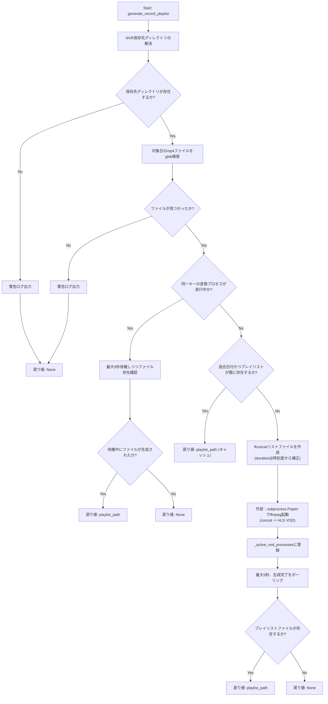

## 1. 解析メタ情報

| 項目 | 内容 |
| --- | --- |
| 対象ファイル | `camera_service.py` |
| 言語 | Python |
| 解析対象 | 提供されたコードのみ |
| 推測・補完 | 一切なし |

## 関連ドキュメント

- [config.md](./config.md) — `NVR_RECORD_DIR`、`CAMERAS`設定を提供する。
- [camera_router.md](./camera_router.md) — 呼び出し元。本ファイルの各関数がどのHTTPエンドポイントから、どのようなエラーハンドリングと共に呼び出されているかが確認できる。
- [camera_monitor.md](./camera_monitor.md) — 同様のONVIF/WSDL動的探索ロジック（`find_wsdl_path`）を持つ姉妹モジュール（動体検知監視用）。
- [logger.md](./logger.md) — `setup_logging`の実装元。

## 2. ファイルの概要

* ONVIF対応カメラのRTSP URL取得、ffmpegを用いたライブHLSストリーミング配信、NASに保存された録画mp4ファイル群を結合したVOD（録画）HLSプレイリストの生成を担うサービス層モジュールである。
* RTSP URLはONVIFカメラへの問い合わせ結果（またはカメラ設定に直接指定された`rtsp_url`）をメモリ上のキャッシュ(`_rtsp_cache`)に保持する。
* ライブ配信・録画変換はそれぞれ`subprocess.Popen`で起動したffmpegプロセスをカメラID／`カメラID_日付`単位で管理辞書(`_active_processes`, `_active_vod_processes`)に登録し、同一キーでの多重起動を防止する。
* 録画プレイリスト生成では、10分単位に分割されたmp4ファイル群から`ffconcat`形式のリストファイルを作成し、ファイル間の時刻差からdurationを補正することで録画の欠落区間にも対応する。
* 根拠: [モジュール冒頭のコメントと定数定義] (行番号: 19〜26 / 抜粋: "# /tmp (RAM) から物理ストレージ（プロジェクト直下のdataディレクトリ）へ変更")

## 3. 外部依存関係

### インポート一覧

| 名称 | 種類 | 用途 | 根拠 |
| --- | --- | --- | --- |
| `os` | 標準ライブラリ | パス操作(`os.path.join`, `os.path.dirname`, `os.makedirs`, `os.path.exists`, `os.path.basename`)、環境変数取得(`os.getenv`) | 根拠: [import文] (行番号: 1 / 抜粋: "import os") |
| `sys` | 標準ライブラリ | `sys.path` を走査したWSDLディレクトリ探索 | 根拠: [import文] (行番号: 2 / 抜粋: "import sys") |
| `subprocess` | 標準ライブラリ | ffmpegプロセスの起動(`Popen`)と型ヒント(`subprocess.Popen`) | 根拠: [import文] (行番号: 3 / 抜粋: "import subprocess") |
| `time` | 標準ライブラリ | プレイリスト生成待機のスリープ(`time.sleep`) | 根拠: [import文] (行番号: 4 / 抜粋: "import time") |
| `urllib.parse` | 標準ライブラリ | RTSP URIのパース(`urlparse`)、認証情報のURLエンコード(`quote`) | 根拠: [import文] (行番号: 5 / 抜粋: "import urllib.parse") |
| `glob` | 標準ライブラリ | 日付パターンに一致するmp4ファイルの検索(`glob.glob`) | 根拠: [import文] (行番号: 6 / 抜粋: "import glob") |
| `datetime.datetime` | 標準ライブラリ | ファイル名中の時刻文字列のパース、現在日付との比較 | 根拠: [import文] (行番号: 7 / 抜粋: "from datetime import datetime") |
| `typing.Optional`, `Dict`, `Any`, `List` | 標準ライブラリ | 型ヒント（`List`は本ファイル内で明示的な使用箇所なし） | 根拠: [import文] (行番号: 8 / 抜粋: "from typing import Optional, Dict, Any, List") |
| `core.logger.setup_logging` | 内部モジュール | ロガーインスタンスの生成 | 根拠: [import文] (行番号: 9 / 抜粋: "from core.logger import setup_logging") |
| `config` | 内部モジュール | NVR録画保存ディレクトリ(`NVR_RECORD_DIR`)の取得（属性が無い場合は環境変数にフォールバック） | 根拠: [config参照] (行番号: 124, 152 / 抜粋: "nvr_base_dir = getattr(config, 'NVR_RECORD_DIR', os.getenv("NVR_RECORD_DIR", "/mnt/nas/home_system/nvr_recordings"))") |
| `onvif.ONVIFCamera` | 外部ライブラリ（任意依存） | ONVIFカメラへの接続、メディアプロファイル取得、ストリームURI取得。インポート失敗時は`Any`にフォールバック | 根拠: [try-exceptインポート] (行番号: 12〜15 / 抜粋: "try:\n    from onvif import ONVIFCamera\nexcept ImportError:\n    ONVIFCamera = Any") |

### ブラックボックスとなる外部要素

| 名称 | 理由 | 根拠 |
| --- | --- | --- |
| `ONVIFCamera` (onvifライブラリ) | `create_media_service`, `GetProfiles`, `create_type`, `GetStreamUri` 等のメソッドの内部実装・通信プロトコル詳細は本ファイルからは不明。 | 根拠: [ONVIFCameraの利用箇所] (行番号: 59〜68 / 抜粋: "mycam = ONVIFCamera(cam_conf['ip'], cam_conf.get('port', 80), cam_conf['user'], cam_conf.get('pass', ''), wsdl_dir=wsdl_path)") |
| `config` | `config.NVR_RECORD_DIR` 属性の有無や値がどのように設定されているか（環境変数、設定ファイル等）が本ファイルからは不明。 | 根拠: [getattr呼び出し] (行番号: 124 / 抜粋: "nvr_base_dir = getattr(config, 'NVR_RECORD_DIR', os.getenv("NVR_RECORD_DIR", "/mnt/nas/home_system/nvr_recordings"))") |
| `setup_logging` | 生成されるロガーの出力先・フォーマット・ログレベルの詳細が不明。 | 根拠: [ロガー生成] (行番号: 17 / 抜粋: "logger = setup_logging("camera_service")") |
| `ffmpeg` / `nice` (外部コマンド) | `subprocess.Popen`で起動される外部コマンドの内部動作・エラー時の終了コード仕様は本ファイルの管理対象外。 | 根拠: [Popen呼び出し] (行番号: 101, 117, 224, 241 / 抜粋: "cmd = [\n        "nice", "-n", "15",\n        "ffmpeg", "-y",") |

## 4. 主要要素の定義（関数 / エンドポイント / コンポーネント）

### `init_output_dir`

* **役割**: `base_dir/camera_id` のディレクトリを作成（既存の場合はそのまま）し、そのパスを返す。
* 根拠: [関数定義] (行番号: 28〜31 / 抜粋: "def init_output_dir(base_dir: str, camera_id: str) -> str:")

* **引数/リクエスト**: `base_dir: str`, `camera_id: str`
* 根拠: [引数定義] (行番号: 28 / 抜粋: "def init_output_dir(base_dir: str, camera_id: str) -> str:")

* **戻り値/レスポンス**: `str`（作成済みディレクトリの絶対/相対パス）
* 根拠: [戻り値] (行番号: 31 / 抜粋: "return cam_dir")

* **副作用**: ディレクトリ作成(`os.makedirs`, `exist_ok=True`)。
* 根拠: [makedirs呼び出し] (行番号: 30 / 抜粋: "os.makedirs(cam_dir, exist_ok=True)")

* **エラーハンドリング**: なし（`os.makedirs`が権限エラー等で例外を送出した場合、呼び出し元に伝播する）

### `find_wsdl_path`

* **役割**: `sys.path` 上の各ディレクトリを走査し、`onvif/wsdl` または `wsdl` サブディレクトリ内に `devicemgmt.wsdl` が存在するパスを探索して返す。
* 根拠: [関数定義とDocstring] (行番号: 33〜43 / 抜粋: "def find_wsdl_path() -> Optional[str]:\n    """camera_monitor.pyと同等のWSDL動的探索ロジック"""")

* **引数/リクエスト**: なし
* 根拠: [関数定義] (行番号: 33 / 抜粋: "def find_wsdl_path() -> Optional[str]:")

* **戻り値/レスポンス**: `Optional[str]`（見つかったWSDLディレクトリのパス、見つからない場合は`None`）
* 根拠: [戻り値] (行番号: 42〜43 / 抜粋: "return candidate\n    return None")

* **副作用**: なし（`os.path.exists`によるファイルシステム参照のみ）
* **エラーハンドリング**: なし

### `get_rtsp_url`

* **役割**: カメラのRTSP URLを取得する。キャッシュ(`_rtsp_cache`)、設定内の直接指定(`rtsp_url`)、ONVIF経由の動的取得の順に解決を試み、ONVIF取得時は認証情報をURLエンコードして埋め込んだURIを構築する。
* 根拠: [関数定義] (行番号: 45〜82 / 抜粋: "def get_rtsp_url(cam_conf: Dict[str, Any]) -> str:")

* **引数/リクエスト**: `cam_conf: Dict[str, Any]`（カメラ設定辞書。`id`, `ip`, `user`, `pass`, `port`, `rtsp_url`等のキーを想定）
* 根拠: [引数定義] (行番号: 45 / 抜粋: "def get_rtsp_url(cam_conf: Dict[str, Any]) -> str:")

* **戻り値/レスポンス**: `str`（RTSP URL文字列。キャッシュヒット時・直接指定時はそのまま、ONVIF取得時は認証情報埋め込み済みURI）
* 根拠: [各return文] (行番号: 48, 52, 79 / 抜粋: "auth_uri = f"rtsp://{safe_user}:{safe_pass}@{parsed.netloc}{parsed.path}?{parsed.query}"")

* **副作用**: `_rtsp_cache` への書き込み（キャッシュ登録）、ONVIFカメラへのネットワーク接続、取得失敗時のエラーログ出力。
* 根拠: [キャッシュ登録とエラーログ] (行番号: 78, 81 / 抜粋: "_rtsp_cache[cam_id] = auth_uri")

* **エラーハンドリング**: WSDLパスが見つからない場合は`FileNotFoundError`を送出。ONVIF通信等で例外が発生した場合はエラーログを出力したうえで例外を再送出(`raise`)する（呼び出し元での処理が必要）。
* 根拠: [try-exceptブロック] (行番号: 54, 57, 80〜82 / 抜粋: "except Exception as e:\n        logger.error(f"❌ [{cam_conf['name']}] ONVIF経由のRTSP URL取得に失敗: {e}")\n        raise")

### `start_hls_stream`

* **役割**: 指定カメラのライブHLSストリーミングをffmpegプロセスとして起動する。既に同一カメラIDのプロセスが実行中であれば新規起動せず既存のプレイリストパスを返す。
* 根拠: [関数定義] (行番号: 84〜119 / 抜粋: "def start_hls_stream(cam_conf: Dict[str, Any]) -> str:")

* **引数/リクエスト**: `cam_conf: Dict[str, Any]`
* 根拠: [引数定義] (行番号: 84 / 抜粋: "def start_hls_stream(cam_conf: Dict[str, Any]) -> str:")

* **戻り値/レスポンス**: `str`（プレイリストファイルのパス。RTSP URL取得に失敗した場合は空文字列`""`）
* 根拠: [各return文] (行番号: 90, 95, 119 / 抜粋: "except Exception:\n        return """)

* **副作用**: 出力ディレクトリの作成(`init_output_dir`)、ffmpegログファイルのオープン(`open`)、`subprocess.Popen`によるffmpegプロセスの起動、`_active_processes`辞書への登録、ログ出力（パスワードをマスクしたRTSP URLを含む）。
* 根拠: [プロセス起動と登録] (行番号: 116〜118 / 抜粋: "log_file = open(os.path.join(cam_dir, "ffmpeg.log"), "w")\n    process = subprocess.Popen(cmd, stdout=log_file, stderr=subprocess.STDOUT)\n    _active_processes[cam_id] = process")

* **エラーハンドリング**: `get_rtsp_url`が例外を送出した場合、これを捕捉して空文字列を返す（フェイルソフト）。ffmpegプロセス自体の起動失敗（`subprocess.Popen`の例外）に対する捕捉は本関数内には存在しない。
* 根拠: [try-exceptブロック] (行番号: 92〜95 / 抜粋: "try:\n        rtsp_url = get_rtsp_url(cam_conf)\n    except Exception:\n        return """)

### `get_record_start_offset`

* **役割**: 指定日付の最初の録画mp4ファイル名から時刻部分を抽出し、0時0分0秒からの経過秒数を算出して返す。
* 根拠: [関数定義とDocstring] (行番号: 121〜123 / 抜粋: "def get_record_start_offset(cam_conf: Dict[str, Any], target_date: str) -> int:\n        """指定日の最初の録画ファイルの開始時刻を0時からの秒数で返す"""")

* **引数/リクエスト**: `cam_conf: Dict[str, Any]`, `target_date: str`
* 根拠: [引数定義] (行番号: 121 / 抜粋: "def get_record_start_offset(cam_conf: Dict[str, Any], target_date: str) -> int:")

* **戻り値/レスポンス**: `int`（0時からの経過秒数）。該当ファイルが存在しない場合、または解析に失敗した場合は`0`。
* 根拠: [各return文] (行番号: 131, 137, 140 / 抜粋: "return dt.hour * 3600 + dt.minute * 60 + dt.second")

* **副作用**: `config`/環境変数の参照、ファイルシステム検索(`glob.glob`)、解析失敗時の警告ログ出力。
* 根拠: [glob検索] (行番号: 127〜128 / 抜粋: "search_pattern = os.path.join(search_dir, f"{target_date}_*.mp4")\n        mp4_files = sorted(glob.glob(search_pattern))")

* **エラーハンドリング**: 対象ファイルが存在しない場合は即座に`0`を返す。ファイル名の時刻文字列パース(`datetime.strptime`)で例外が発生した場合は警告ログを出力し`0`を返す。
* 根拠: [try-exceptブロック] (行番号: 133, 138〜140 / 抜粋: "except Exception as e:\n            logger.warning(f"Failed to parse start offset for {cam_conf['name']}: {e}")\n            return 0")

### `generate_record_playlist`

* **役割**: 指定日の10分単位分割mp4ファイル群を`ffconcat`形式のリストファイルにまとめ、ffmpegでVOD用HLSプレイリストへ変換する。同一カメラ・日付の変換プロセスの多重実行を防止し、過去日付かつ生成済みの場合はキャッシュされたプレイリストを返す。
* 根拠: [関数定義とDocstring] (行番号: 143〜147 / 抜粋: "def generate_record_playlist(cam_conf: Dict[str, Any], target_date: str) -> Optional[str]:\n    """\n    指定された日付の録画ファイル群を結合し、シームレス再生用のVODプレイリストを生成する\n    target_date 形式: YYYYMMDD (例: 20260716)\n    """")

* **引数/リクエスト**: `cam_conf: Dict[str, Any]`, `target_date: str`
* 根拠: [引数定義] (行番号: 143 / 抜粋: "def generate_record_playlist(cam_conf: Dict[str, Any], target_date: str) -> Optional[str]:")

* **戻り値/レスポンス**: `Optional[str]`（生成または既存のプレイリストパス。保存先ディレクトリ不在時・対象ファイルなし時・生成待機後もファイルが存在しない場合は`None`）
* 根拠: [各return文] (行番号: 157, 165, 182, 189, 250 / 抜粋: "return playlist_path if os.path.exists(playlist_path) else None")

* **副作用**: NVR保存先ディレクトリ・mp4ファイルの検索、出力ディレクトリの作成(`init_output_dir`)、`ffconcat`リストファイルへの書き込み、`subprocess.Popen`によるffmpegプロセスの起動、`_active_vod_processes`辞書への登録、警告・情報・デバッグログの出力、生成待機のための`time.sleep`。
* 根拠: [concatファイル書き込みとプロセス起動] (行番号: 192〜220, 241〜242 / 抜粋: "process = subprocess.Popen(cmd, stdout=subprocess.DEVNULL, stderr=subprocess.DEVNULL)\n    _active_vod_processes[process_key] = process")

* **エラーハンドリング**: 保存先ディレクトリが存在しない場合、または対象日のmp4ファイルが見つからない場合は警告ログを出力して`None`を返す。同一キーの変換プロセスが実行中の場合は最大5秒(10回×0.5秒)待機し、それでも未生成なら`None`を返す。ファイル間duration計算時の例外は個別に捕捉し警告ログを出力したうえでデフォルト値(600.0秒)を使用して処理を継続する。
* 根拠: [各ガード節とtry-except] (行番号: 155〜157, 163〜165, 175〜182, 217〜218 / 抜粋: "except Exception as e:\n                    logger.warning(f"Failed to calculate duration for {mp4}: {e}")")

## 5. 処理フロー図

`generate_record_playlist` の録画結合プレイリスト生成ロジックのフローを示します。

## 6. 依存関係図

```mermaid
graph TD
    subgraph "camera_service.py"
        logger["logger (Global)"]
        active_processes["_active_processes (Global)"]
        active_vod_processes["_active_vod_processes (Global)"]
        rtsp_cache["_rtsp_cache (Global)"]
        init_output_dir["init_output_dir()"]
        find_wsdl_path["find_wsdl_path()"]
        get_rtsp_url["get_rtsp_url()"]
        start_hls_stream["start_hls_stream()"]
        get_record_start_offset["get_record_start_offset()"]
        generate_record_playlist["generate_record_playlist()"]
    end

    subgraph "外部依存"
        config["config"]
        core_logger["core.logger"]
        onvif["onvif.ONVIFCamera (任意依存)"]
        subprocess_mod["subprocess (ffmpeg/nice)"]
        os_mod["os"]
        glob_mod["glob"]
    end

    logger --> core_logger
    get_rtsp_url --> onvif
    get_rtsp_url --> find_wsdl_path
    get_rtsp_url --> rtsp_cache

    start_hls_stream --> init_output_dir
    start_hls_stream --> get_rtsp_url
    start_hls_stream --> active_processes
    start_hls_stream --> subprocess_mod

    get_record_start_offset --> config
    get_record_start_offset --> glob_mod

    generate_record_playlist --> config
    generate_record_playlist --> glob_mod
    generate_record_playlist --> init_output_dir
    generate_record_playlist --> active_vod_processes
    generate_record_playlist --> subprocess_mod
    generate_record_playlist --> os_mod
```

## 7. 次のステップ（リバースエンジニアリングの提案）

| 優先度 | ファイル名(推測可) | 理由 | 根拠 |
| --- | --- | --- | --- |
| 高 | `config.py` | `config.NVR_RECORD_DIR`属性の有無や値、`cam_conf`辞書（`id`, `ip`, `user`, `pass`, `port`, `rtsp_url`, `nas_folder`, `name`）を供給する`CAMERAS`設定の全容を把握する必要があるため。 | 根拠: [getattr呼び出し] (行番号: 124 / 抜粋: "nvr_base_dir = getattr(config, 'NVR_RECORD_DIR', ...)") |
| 中 | `core/logger.py` | `setup_logging`によるロガー設定（出力先、フォーマット、ログレベル）を確認するため。 | 根拠: [import文] (行番号: 9 / 抜粋: "from core.logger import setup_logging") |
| 中 | `routers/camera_router.py` | 本モジュールの各関数（`start_hls_stream`, `get_record_start_offset`, `generate_record_playlist`, `HLS_LIVE_DIR`, `HLS_VOD_DIR`）がどのようなHTTPエンドポイントから、どのようなエラーハンドリングと共に呼び出されているかを確認するため。 | 根拠: [呼び出し元ファイル。本ファイル単体からは不明] |
| 低 | `onvif`ライブラリ（サードパーティパッケージ） | `ONVIFCamera`クラスの`GetProfiles`/`GetStreamUri`等のAPI仕様を確認するため。 | 根拠: [try-exceptインポート] (行番号: 12〜15 / 抜粋: "from onvif import ONVIFCamera") |

## 8. 保守上の注意点

* **プロセス管理辞書のスレッドセーフティ**: `_active_processes`, `_active_vod_processes`, `_rtsp_cache` はいずれもモジュールレベルのグローバル辞書であり、ロック等の排他制御なしに読み書きされている。マルチスレッド/マルチワーカー環境下で同時にアクセスされた場合、競合状態が発生する可能性がある。
* **`start_hls_stream`の広範な例外抑制**: `get_rtsp_url`呼び出しを`except Exception:`で包括的に捕捉し、詳細を握りつぶして空文字列を返している（呼び出し元では失敗理由が判別できない）。
* **ffmpeg起動失敗の未捕捉**: `start_hls_stream`および`generate_record_playlist`内の`subprocess.Popen`呼び出し自体（例: ffmpeg実行ファイルが存在しない場合の`FileNotFoundError`）に対するtry-exceptが存在せず、例外は呼び出し元に伝播する。
* **ログファイルのクローズ漏れ**: `start_hls_stream`で`open(...)`により開いたログファイルオブジェクト`log_file`が明示的に`close()`されていない（プロセスが標準出力/エラーとして保持するが、Python側のファイルディスクリプタリークの可能性がある）。
* **ハードコードされたパス・値**: NVRのフォールバックパス`/mnt/nas/home_system/nvr_recordings`、ffmpegの`nice`優先度`15`、HLSセグメント長(`2`秒/`4`秒)やリストサイズ(`5`)、待機ループの最大回数(`10`回)・間隔(`0.5`秒)など多数のマジックナンバーがコード中に直接埋め込まれている。
* **`get_record_start_offset`と`generate_record_playlist`のロジック重複**: 両関数とも「NVR保存先の解決」「mp4ファイル名からの時刻抽出」処理をそれぞれ個別に実装しており、重複コードとなっている。

## 9. 不明事項一覧

| 項目 | 理由 | 必要なファイル |
| --- | --- | --- |
| `config.CAMERAS` および `config.NVR_RECORD_DIR` の実体 | `cam_conf`辞書に含まれる正確なキー一覧や、`NVR_RECORD_DIR`属性が設定されているかどうかが本ファイルからは不明。 | `config.py` |
| ロガーの出力仕様 | `setup_logging`が生成するロガーの出力先・フォーマット・ログレベルが不明。 | `core/logger.py` |
| `onvif`ライブラリのAPI仕様 | `ONVIFCamera`, `create_media_service`, `GetProfiles`, `GetStreamUri`等の正確な引数・戻り値仕様が不明。（リポジトリ内および実行環境を検索したが、`onvif`パッケージ自体はインストールされておらず(`ModuleNotFoundError: No module named 'onvif'`)、ソースはリポジトリ内に存在しない。PyPI配布の外部サードパーティ製ライブラリであるため解消不可。なお本ファイル12〜15行目で`try: from onvif import ONVIFCamera except ImportError: ONVIFCamera = Any`という防御的インポートになっており、未インストール環境でも本ファイル自体のインポートは失敗しない設計であることは直接確認できた） | `onvif`パッケージのソースまたは公式ドキュメント |
| 呼び出し元（ルーター）でのエラーハンドリング | 本モジュールの関数が返す`""`, `None`, `0`, 例外の再送出等を、呼び出し側（`camera_router.py`等）がどのようにHTTPレスポンスへ変換しているかは本ファイルからは不明。 | `routers/camera_router.py` |

## 相互参照による補足情報

| 元の不明事項 | 判明した内容 | 参照元ドキュメント |
| --- | --- | --- |
| 呼び出し元（ルーター）でのエラーハンドリング | `camera_router.md`の解析によれば、`start_hls_stream`の戻り値が空文字列相当（falsy）の場合はHTTP 500、ポーリングループでプレイリストファイルが生成されなかった場合はHTTP 503を返し、`get_record_start_offset`の戻り値（`int`）はそのまま`{"offset_seconds": offset}`として200で返却され、`generate_record_playlist`が`None`を返した場合はHTTP 404（"Recordings not found"）に変換されると推測される。 | camera_router.md |
| ロガーの出力仕様 | `logger.md`の解析によれば、`setup_logging`はコンソール出力・日次ローテーションファイル出力に加え、ERRORレベル以上のログをDiscord Webhookへ自動通知するハンドラを登録すると推測される。 | logger.md |
| `config.CAMERAS` および `config.NVR_RECORD_DIR` の実体 | `config.py`および呼び出し元`routers/camera_router.py`を直接確認した。`config.CAMERAS`(297行目で`List[Dict[str, Any]] = []`初期化、300〜305行目で`devices.json`から`CameraConfig(**c).model_dump(by_alias=True)`としてロード)の各要素のキーは`CameraConfig`(144〜153行目)により`id, name, nas_folder(任意), location, ip, port(既定2020), user(任意), password(エイリアス"pass", 任意), rtsp_url(任意)`であることを確認した。本ファイル(`camera_service.py`)は`config.CAMERAS`を直接参照せず、呼び出し元の`camera_router.py`が`next((c for c in config.CAMERAS if c["id"] == camera_id), None)`(例: 45行目)で取得した`cam_conf`辞書を各関数の引数として渡す設計であることを確認した。`config.NVR_RECORD_DIR`は`config.py`436行目で`str = os.path.join(NAS_MOUNT_POINT, "home_system", "nvr_recordings")`（既定`NAS_MOUNT_POINT="/mnt/nas"`のため`/mnt/nas/home_system/nvr_recordings`）と定義されており、確かに設定されている。本ファイル124行目・152行目の`getattr(config, 'NVR_RECORD_DIR', os.getenv("NVR_RECORD_DIR", "/mnt/nas/home_system/nvr_recordings"))`というフォールバック用ハードコード値は、`config.py`のデフォルト計算結果と完全に一致することを確認した。 | 直接ソース確認: `MY_HOME_SYSTEM/config.py:144-153, 216-217, 297, 300-305, 436`, `MY_HOME_SYSTEM/services/camera_service.py:121-124, 143-152`, `MY_HOME_SYSTEM/routers/camera_router.py:45-46` |

## 10. 自己検証結果

* [x] 推測・外部ファイルの仕様を一切含んでいない
* [x] 全関数・全クラス・全コンポーネントを列挙した
* [x] 全てのインポート要素を列挙した
* [x] すべての仕様説明に「根拠（行番号・抜粋）」を明記した
* [x] 根拠漏れが0件である
* [x] Mermaid構文にエラーの原因となる記号（エスケープ漏れ）がない
* [x] 不明事項を漏れなく列挙した

完了
