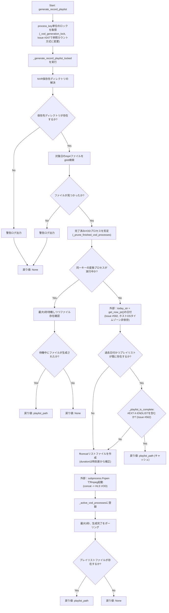
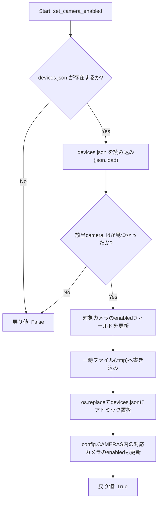

## 1. 解析メタ情報

| 項目 | 内容 |
| --- | --- |
| 対象ファイル | `camera_service.py` |
| 言語 | Python |
| 解析対象 | 提供されたコードのみ |
| 推測・補完 | 一切なし |

## 関連ドキュメント

- [config.md](./config.md) — `NVR_RECORD_DIR`、`CAMERAS`、`DEVICES_JSON_PATH`設定を提供する。
- [camera_router.md](./camera_router.md) — 呼び出し元。本ファイルの各関数がどのHTTPエンドポイントから、どのようなエラーハンドリングと共に呼び出されているかが確認できる（`PUT /settings/{camera_id}`が`set_camera_enabled`を呼び出す）。**（Issue #551で追加）** `get_camera_config_or_none`はルーター側の新設ヘルパー`_require_camera`から呼び出される。
- [camera_monitor.md](./camera_monitor.md) — 同様のONVIF/WSDL動的探索ロジック（`find_wsdl_path`）を持つ姉妹モジュール（動体検知監視用）。
- [logger.md](./logger.md) — `setup_logging`の実装元。
- [utils.md](./utils.md) — Issue #592で追加された`get_now_jst`の実体。`_generate_record_playlist_locked`の`today_str`（過去日付キャッシュ判定・当日分再利用判定の基準）算出に使用。

## 2. ファイルの概要

* ONVIF対応カメラのRTSP URL取得、ffmpegを用いたライブHLSストリーミング配信、NASに保存された録画mp4ファイル群を結合したVOD（録画）HLSプレイリストの生成、および`devices.json`へのカメラ有効/無効設定の永続化を担うサービス層モジュールである。
* RTSP URLはONVIFカメラへの問い合わせ結果（またはカメラ設定に直接指定された`rtsp_url`）をメモリ上のキャッシュ(`_rtsp_cache`)に保持する。
* ライブ配信・録画変換はそれぞれ`subprocess.Popen`で起動したffmpegプロセスをカメラID／`カメラID_日付`単位で管理辞書(`_active_processes`, `_active_vod_processes`)に登録し、同一キーでの多重起動を防止する。
* 録画プレイリスト生成では、10分単位に分割されたmp4ファイル群から`ffconcat`形式のリストファイルを作成し、ファイル間の時刻差からdurationを補正することで録画の欠落区間にも対応する。
* 根拠: [モジュール冒頭のコメントと定数定義] (行番号: 22〜25 / 抜粋: "# /tmp (RAM) から物理ストレージ（プロジェクト直下のdataディレクトリ）へ変更")

* RTSP URLに含まれる認証情報をログ出力する際は、`urlparse`でnetloc部分のみを安全に再構築する`_mask_rtsp_url_for_log`関数でマスクする。パスワードが空文字の場合に`str.replace('', '***')`が文字列の全文字間へ`***`を挿入して破壊するという以前の不具合を修正したものである。
* 根拠: [_mask_rtsp_url_for_log関数のDocstring] (行番号: 164〜167 / 抜粋: "パスワードが空文字の場合、str.replace('', '***')は文字列の全文字間に")

* ライブ配信ffmpegプロセス起動時には`-hide_banner`/`-loglevel error`オプションを付与し、認証情報込みのRTSP URLがffmpeg自身の起動バナー経由でログファイルに平文出力されるのを防止する。また`ffmpeg.log`は`os.chmod`で`0o600`（所有者のみ読み書き可）に設定し、他ローカルユーザーからの閲覧を防ぐ。
* 根拠: [ffmpegコマンドとchmod] (行番号: 270, 288 / 抜粋: "\"-hide_banner\",")

* **（Issue #439で追加）** ライブ配信の起動(`start_hls_stream`)・録画プレイリスト生成(`generate_record_playlist`)に加え、`_active_processes`/`_active_vod_processes`/`_rtsp_cache`の3グローバル辞書への読み書き自体も、モジュールレベルの`_state_lock`で保護されるようになった。以前はこれら3辞書がロック無しで複数スレッドから同時にチェック・更新されており、「チェックしてから更新する」までの一連の操作が原子的でなかったため、既に終了したプロセスをactiveと誤認する等の不整合が起こりうる状態だった。
* 根拠: [`_state_lock`定義とコメント] (行番号: 45〜50 / 抜粋: "# 読み書きの一連の操作をこのLockで保護する。\n_state_lock = threading.Lock()")

* `start_hls_stream`で開いたffmpegログファイルのハンドルは、`subprocess.Popen`呼び出し後に`finally`ブロックで親プロセス側から明示的に`close()`される（子プロセスは`dup()`済みのfdを保持するため親側は不要であり、以前はプロセス再起動のたびにファイルハンドルがリークしていた）。
* 根拠: [ログファイルクローズ] (行番号: 282〜286 / 抜粋: "log_file.close()")

* 録画プレイリスト生成(`generate_record_playlist`)は、`process_key`（`カメラID_日付`）単位のロック（コンテキストマネージャ`_vod_generation_lock`）で排他制御された内部関数`_generate_record_playlist_locked`へ処理を委譲し、同一キーへの同時リクエストによるffmpegの二重起動と同一ファイルへの競合書き込みを防止する。**（Issue #247で修正）** 以前は`_get_vod_generation_lock`関数が`カメラID_日付`単位の`threading.Lock`を`_vod_generation_locks`辞書へ登録するのみで、`_active_vod_processes`に対応する`_prune_finished_vod_processes`のような削除・剪定手段が無く、日々無限に蓄積し続けていた。現在は参照カウント方式(`_RefCountedLock`)を導入した`_vod_generation_lock`コンテキストマネージャに置き換え、使用が終わった(参照カウントが0に戻った)エントリのみを安全に削除する。単純に「ロックが未取得状態なら削除」する方式だと、ロック取得元が辞書からロックオブジェクトを取り出した直後・実際に獲得する直前の隙間で別スレッドが剪定してしまい、同一`process_key`に対して2つの別々のロックオブジェクトが生成されて同時に「取得成功」する（このロック機構が本来防ぐべき二重起動と同じ問題を再発させる）ため、参照カウントで安全性を担保している。**（Issue #439で同一パターンを流用）** ライブ配信の起動(`start_hls_stream`)も、`cam_id`単位で同じ参照カウント方式（`_live_stream_lock`）により排他制御されるようになった。
* 根拠: [ロック委譲] (行番号: 347 / 抜粋: "with _vod_generation_lock(process_key):")、`_RefCountedLock`と参照カウントによる安全な削除のコメント (行番号: 55〜57 / 抜粋: "# #247: _active_vod_processesには対応する_prune_finished_vod_processes()が\n# あるが、以前はこの辞書には剪定処理が存在せず、cam_id×target_dateの組み合わせが\n# 増えるたびに(long-running環境で日々)無限に蓄積していた。")、`_live_stream_lock`定義 (行番号: 105〜121)

* `_active_vod_processes`に登録されたプロセスのうち完了済み（`poll()`が`None`でない）ものは、`_generate_record_playlist_locked`の呼び出しの都度`_prune_finished_vod_processes`により除去され、`カメラID_日付`キーが無限に蓄積することを防ぐ。
* 根拠: [プルーニング呼び出し] (行番号: 378 / 抜粋: "_prune_finished_vod_processes()")

* `set_camera_enabled`は`devices.json`上の該当カメラの`enabled`フラグを更新し、`config.CAMERAS`にも反映する。書き込みは一時ファイル(`.tmp`)への書き込み後に`os.replace`でアトミックに置き換える方式であり、書き込み途中のクラッシュ・電源断による`devices.json`破損を防ぐ。
* 根拠: [set_camera_enabled関数] (行番号: 505〜508 / 抜粋: "tmp_path = f\"{config.DEVICES_JSON_PATH}.tmp\"")

## 3. 外部依存関係

### インポート一覧

| 名称 | 種類 | 用途 | 根拠 |
| --- | --- | --- | --- |
| `contextlib` | 標準ライブラリ | `_vod_generation_lock`/`_live_stream_lock`をジェネレータベースのコンテキストマネージャとして定義する(`@contextlib.contextmanager`) | 根拠: [import文] (行番号: 1 / 抜粋: "import contextlib") |
| `json` | 標準ライブラリ | `devices.json`の読み込み・書き込み（`set_camera_enabled`） | 根拠: [import文] (行番号: 2 / 抜粋: "import json") |
| `os` | 標準ライブラリ | パス操作(`os.path.join`, `os.path.dirname`, `os.makedirs`, `os.path.exists`, `os.path.basename`)、環境変数取得(`os.getenv`)、`os.chmod`によるパーミッション変更、`os.replace`によるアトミックなファイル置換 | 根拠: [import文] (行番号: 3 / 抜粋: "import os") |
| `sys` | 標準ライブラリ | `sys.path` を走査したWSDLディレクトリ探索 | 根拠: [import文] (行番号: 4 / 抜粋: "import sys") |
| `subprocess` | 標準ライブラリ | ffmpegプロセスの起動(`Popen`)と型ヒント(`subprocess.Popen`) | 根拠: [import文] (行番号: 5 / 抜粋: "import subprocess") |
| `threading` | 標準ライブラリ | **（Issue #439で拡大）** 以前はVOD生成の`process_key`単位ロック(`_vod_generation_locks`/`_vod_generation_locks_guard`)のみで使用していたが、現在は`_active_processes`/`_active_vod_processes`/`_rtsp_cache`の3辞書を保護する`_state_lock`、およびライブ配信の`cam_id`単位ロック(`_live_stream_locks`/`_live_stream_locks_guard`)にも使用される | 根拠: [import文] (行番号: 6 / 抜粋: "import threading")、[新規ロック定義] (行番号: 50, 102 / 抜粋: "_state_lock = threading.Lock()", "_live_stream_locks_guard = threading.Lock()") |
| `time` | 標準ライブラリ | プレイリスト生成待機のスリープ(`time.sleep`) | 根拠: [import文] (行番号: 7 / 抜粋: "import time") |
| `urllib.parse` | 標準ライブラリ | RTSP URIのパース(`urlparse`)、認証情報のURLエンコード(`quote`)、ログ用マスク処理(`_mask_rtsp_url_for_log`内での`urlparse`/`_replace`) | 根拠: [import文] (行番号: 8 / 抜粋: "import urllib.parse") |
| `glob` | 標準ライブラリ | 日付パターンに一致するmp4ファイルの検索(`glob.glob`) | 根拠: [import文] (行番号: 9 / 抜粋: "import glob") |
| `datetime.datetime` | 標準ライブラリ | ファイル名中の時刻文字列のパース、現在日付との比較 | 根拠: [import文] (行番号: 10 / 抜粋: "from datetime import datetime") |
| `typing.Optional`, `Dict`, `Any` | 標準ライブラリ | 型ヒント | 根拠: [import文] (行番号: 11 / 抜粋: "from typing import Optional, Dict, Any") |
| `core.logger.setup_logging` | 内部モジュール | ロガーインスタンスの生成 | 根拠: [import文] (行番号: 12 / 抜粋: "from core.logger import setup_logging") |
| `core.utils.get_now_jst`（Issue #592で追加） | 内部モジュール | JSTの現在時刻(aware `datetime`)の取得。`_generate_record_playlist_locked`内の`today_str`（過去日付キャッシュ判定・当日分再利用判定の基準）算出に使用。以前は同じ用途に`datetime.now()`（標準ライブラリ、ホストOSのタイムゾーン設定に依存するnaive時刻）を使っていた | 根拠: [import文] (行番号: 13 / 抜粋: "from core.utils import get_now_jst")、[today_str算出] (行番号: 401〜406) |
| `config` | 内部モジュール | NVR録画保存ディレクトリ(`NVR_RECORD_DIR`)、`devices.json`のパス(`DEVICES_JSON_PATH`)、カメラ設定一覧(`CAMERAS`)の参照・更新 | 根拠: [config参照] (行番号: 306, 359, 491, 497, 511, 516 / 抜粋: "nvr_base_dir = config.NVR_RECORD_DIR") |
| `onvif.ONVIFCamera` | 外部ライブラリ（任意依存） | ONVIFカメラへの接続、メディアプロファイル取得、ストリームURI取得。インポート失敗時は`Any`にフォールバック | 根拠: [try-exceptインポート] (行番号: 15〜18 / 抜粋: "try:\n    from onvif import ONVIFCamera\nexcept ImportError:\n    ONVIFCamera = Any") |

### ブラックボックスとなる外部要素

| 名称 | 理由 | 根拠 |
| --- | --- | --- |
| `ONVIFCamera` (onvifライブラリ) | `create_media_service`, `GetProfiles`, `create_type`, `GetStreamUri` 等のメソッドの内部実装・通信プロトコル詳細は本ファイルからは不明。 | 根拠: [ONVIFCameraの利用箇所] (行番号: 214 / 抜粋: "mycam = ONVIFCamera(cam_conf['ip'], cam_conf.get('port', 80), cam_conf['user'], cam_conf.get('pass', ''), wsdl_dir=wsdl_path)") |
| `config` | `config.NVR_RECORD_DIR`の値、`config.DEVICES_JSON_PATH`が指す実際のファイルパス、`config.CAMERAS`の実データがどのように設定されているか（環境変数、設定ファイル等）が本ファイルからは不明。 | 根拠: [config参照] (行番号: 306 / 抜粋: "nvr_base_dir = config.NVR_RECORD_DIR") |
| `setup_logging` | 生成されるロガーの出力先・フォーマット・ログレベルの詳細が不明。 | 根拠: [ロガー生成] (行番号: 20 / 抜粋: "logger = setup_logging(\"camera_service\")") |
| `ffmpeg` / `nice` (外部コマンド) | `subprocess.Popen`で起動される外部コマンドの内部動作・エラー時の終了コード仕様は本ファイルの管理対象外。 | 根拠: [Popen呼び出し] (行番号: 265, 451 / 抜粋: "\"nice\", \"-n\", str(FFMPEG_NICE_LEVEL),")（Issue #451でnice値をハードコード文字列から`FFMPEG_NICE_LEVEL`定数へ変更） |
| `devices.json` (外部ファイル) | `set_camera_enabled`が読み書きする対象であり、既存カメラエントリの正確なJSON構造・件数は本ファイルからは不明。 | 根拠: [devices.json読み書き] (行番号: 491 / 抜粋: "if not os.path.exists(config.DEVICES_JSON_PATH):") |

## 4. 主要要素の定義（関数 / エンドポイント / コンポーネント）

### `_state_lock`（Issue #439で追加）

* **役割**: `_active_processes`（ライブ配信プロセス）・`_active_vod_processes`（VODプロセス）・`_rtsp_cache`（RTSP URLキャッシュ）の3つのモジュールレベル辞書を保護するグローバルロック。FastAPIの同期エンドポイント（スレッドプール実行）から複数スレッドで同時に読み書きされうるため、個々のdict操作自体はGILにより原子的でも「チェックしてから更新する」までの一連の操作は原子的でなかった（既に終了したプロセスをactiveと誤認する等の不整合が起こりうる）ことへの対応として追加された。
* 根拠: [変数定義とコメント] (行番号: 45〜50 / 抜粋: "# 読み書きの一連の操作をこのLockで保護する。\n_state_lock = threading.Lock()")

* **引数/リクエスト**: 該当なし
* **戻り値/レスポンス**: 該当なし
* **副作用**: なし（`threading.Lock`インスタンスの生成のみ）
* **エラーハンドリング**: なし

### `_RefCountedLock` (クラス、Issue #247で追加)

* **役割**: 参照カウント付きロックの1エントリが表す状態（実際の`threading.Lock`と、現在何人の利用者が参照中かを示す`ref_count`）を保持するだけの単純なコンテナクラス。`_vod_generation_lock`コンテキストマネージャが、使用が終わった(ref_countが0に戻った)エントリのみを安全に辞書から削除できるようにするための土台。**（Issue #439で用途拡大）** 従来は`_vod_generation_locks`（VOD生成の`process_key`単位ロック）専用だったが、現在は`_live_stream_locks`（ライブ配信の`cam_id`単位ロック）でも同じクラスがそのまま再利用されている。
* 根拠: [クラス定義] (行番号: 65〜70 / 抜粋: "class _RefCountedLock:\n    __slots__ = (\"lock\", \"ref_count\")\n\n    def __init__(self) -> None:\n        self.lock = threading.Lock()\n        self.ref_count = 0")、[`_live_stream_locks`での再利用] (行番号: 101, 111 / 抜粋: "_live_stream_locks: Dict[str, _RefCountedLock] = {}", "entry = _RefCountedLock()")

* **引数/リクエスト**: なし（`__init__`は引数を取らない）
* **戻り値/レスポンス**: 該当なし
* **副作用**: `self.lock`（新規`threading.Lock`）・`self.ref_count`（0）の初期化のみ
* **エラーハンドリング**: なし

### `_vod_generation_lock` (コンテキストマネージャ、Issue #247で`_get_vod_generation_lock`を置き換え)

* **役割**: 指定された`process_key`単位で排他制御を行うコンテキストマネージャ。`_vod_generation_locks_guard`で保護しつつ、`_vod_generation_locks`辞書から対応する`_RefCountedLock`を取得（無ければ新規作成）し`ref_count`を1増やしたうえで、実際のロック（`entry.lock`）を獲得して処理ブロックを実行する。処理完了後は`ref_count`を1減らし、0になった（＝他に利用者がいない）場合にのみそのエントリを辞書から削除する。**Issue #247で修正**: 以前の`_get_vod_generation_lock`は`threading.Lock`を返すだけの単純な取得専用関数で、一度登録されたエントリを削除する手段が無く、`カメラID_日付`の組み合わせが増えるたびに無限に蓄積していた。「ロックが未取得状態(`lock.locked() is False`)なら削除する」という単純な方式は、ロック取得元が辞書からロックオブジェクトの参照を取り出した直後・実際に`with`文で獲得する直前の隙間で、別スレッドがその一瞬の未取得状態を見て剪定してしまい、同一`process_key`に対して2つの別々のロックオブジェクトが生成され両方が同時に「取得成功」してしまう（本来このロック機構が防ぐべき、ffmpegの二重起動と全く同じ問題を再発させる）ため採用しなかった。代わりに参照カウントを導入し、そのエントリを実際に使用中の呼び出し（辞書からの取得からブロック完了まで）が1件でも存在する間は、他のスレッドが決して削除できないようにしている。**（Issue #439で同一パターンを流用）** ライブ配信起動の排他制御用に、同じ参照カウント方式を`_live_stream_lock`（後述）としてそのまま複製している。
* 根拠: [関数定義とDocstring] (行番号: 78〜81 / 抜粋: "def _vod_generation_lock(process_key: str):\n    \"\"\"process_key単位で排他制御を行うコンテキストマネージャ。\n    使用中(参照カウント>0)のエントリは剪定されず、使用を終えた\n    (参照カウントが0に戻った)エントリのみ_vod_generation_locksから削除される。\"\"\"")
* 根拠: [取得・ref_count加算] (行番号: 82〜87 / 抜粋: "with _vod_generation_locks_guard:\n        entry = _vod_generation_locks.get(process_key)\n        if entry is None:\n            entry = _RefCountedLock()\n            _vod_generation_locks[process_key] = entry\n        entry.ref_count += 1")
* 根拠: [解放・ref_count減算と条件付き削除] (行番号: 88〜95 / 抜粋: "try:\n        with entry.lock:\n            yield\n    finally:\n        with _vod_generation_locks_guard:\n            entry.ref_count -= 1\n            if entry.ref_count == 0 and _vod_generation_locks.get(process_key) is entry:\n                del _vod_generation_locks[process_key]")

* **引数/リクエスト**: `process_key: str`
* 根拠: [引数定義] (行番号: 78 / 抜粋: "def _vod_generation_lock(process_key: str):")

* **戻り値/レスポンス**: なし（`@contextlib.contextmanager`によるジェネレータベースのコンテキストマネージャ。`with`文のブロック内で保護対象の処理を実行する）
* 根拠: [デコレータ] (行番号: 77 / 抜粋: "@contextlib.contextmanager")

* **副作用**: `_vod_generation_locks`辞書への新規`_RefCountedLock`登録（未登録時のみ）、`ref_count`の増減、`ref_count`が0に戻った場合の辞書からの削除、`entry.lock`の獲得・解放。
* 根拠: (行番号: 82〜95)

* **エラーハンドリング**: なし（`try`/`finally`により、ブロック内で例外が送出された場合でも`ref_count`の減算と条件付き削除は必ず実行される）

### `_live_stream_lock`（コンテキストマネージャ、Issue #439で追加）

* **役割**: 指定された`cam_id`単位で排他制御を行うコンテキストマネージャ。`_vod_generation_lock`と全く同じ参照カウント方式（`_RefCountedLock`を流用）を、ライブHLS配信の起動（`start_hls_stream`）に対して適用したもの。同一`cam_id`への同時リクエストで「実行中でない」というチェックとffmpeg起動・`_active_processes`への登録までを不可分な区間にし、ffmpegの二重起動を防ぐ。
* 根拠: [関数定義とDocstring・コメント] (行番号: 98〜107 / 抜粋: "# #439: ライブHLS配信の起動も、同一cam_idへの同時リクエストで「実行中でない」の\n# チェックとffmpeg起動・登録までを不可分にする必要がある(_vod_generation_lockと同じ\n# check-then-act競合)。cam_id単位の参照カウント付きロックとして同じ仕組みを流用する。\n...\ndef _live_stream_lock(cam_id: str):\n    \"\"\"cam_id単位でライブHLS配信の起動を排他制御するコンテキストマネージャ。\"\"\"")
* 根拠: [取得・ref_count加算] (行番号: 108〜113 / 抜粋: "with _live_stream_locks_guard:\n        entry = _live_stream_locks.get(cam_id)\n        if entry is None:\n            entry = _RefCountedLock()\n            _live_stream_locks[cam_id] = entry\n        entry.ref_count += 1")
* 根拠: [解放・ref_count減算と条件付き削除] (行番号: 114〜121 / 抜粋: "try:\n        with entry.lock:\n            yield\n    finally:\n        with _live_stream_locks_guard:\n            entry.ref_count -= 1\n            if entry.ref_count == 0 and _live_stream_locks.get(cam_id) is entry:\n                del _live_stream_locks[cam_id]")

* **引数/リクエスト**: `cam_id: str`
* 根拠: [引数定義] (行番号: 106 / 抜粋: "def _live_stream_lock(cam_id: str):")

* **戻り値/レスポンス**: なし（`_vod_generation_lock`と同様のジェネレータベースのコンテキストマネージャ）
* 根拠: [デコレータ] (行番号: 105 / 抜粋: "@contextlib.contextmanager")

* **副作用**: `_live_stream_locks`辞書への新規`_RefCountedLock`登録（未登録時のみ）、`ref_count`の増減、`ref_count`が0に戻った場合の辞書からの削除、`entry.lock`の獲得・解放。
* 根拠: (行番号: 108〜121)

* **エラーハンドリング**: なし（`try`/`finally`により、ブロック内で例外が送出された場合でも`ref_count`の減算と条件付き削除は必ず実行される）

### `_prune_finished_vod_processes`

* **役割**: `_active_vod_processes`に登録されたプロセスのうち、`poll()`が`None`でない（完了済み）ものをすべて辞書から除去する。**（Issue #439で修正）** 以前はロックなしで走査・削除していたが、現在はスキャンから削除までを`_state_lock`で囲んだ単一の原子的区間として実行する。
* 根拠: [関数定義とDocstring] (行番号: 153〜156 / 抜粋: "キーがcam_id×target_dateの組み合わせのため、剪定しないと日々増え続けて")、[`_state_lock`での保護] (行番号: 157〜160 / 抜粋: "with _state_lock:\n        finished_keys = [key for key, proc in _active_vod_processes.items() if proc.poll() is not None]\n        for key in finished_keys:\n            _active_vod_processes.pop(key, None)")

* **引数/リクエスト**: なし
* 根拠: [関数定義] (行番号: 153 / 抜粋: "def _prune_finished_vod_processes() -> None:")

* **戻り値/レスポンス**: `None`
* 根拠: [関数定義] (行番号: 153 / 抜粋: "def _prune_finished_vod_processes() -> None:")

* **副作用**: `_state_lock`保持下で`_active_vod_processes`辞書から完了済みエントリを削除する。
* 根拠: [削除処理] (行番号: 157〜160 / 抜粋: "with _state_lock:\n        finished_keys = [key for key, proc in _active_vod_processes.items() if proc.poll() is not None]")

* **エラーハンドリング**: なし

### `_mask_rtsp_url_for_log`

* **役割**: RTSP URLに含まれる認証情報(user:pass)をログ出力用にマスクする。`urlparse`でnetloc部分のみを`***@host`（パスワードなし）または`***:***@host`（パスワードあり）に置換して再構築する。ユーザー名・パスワードのいずれも含まれないURLはそのまま返す。
* 根拠: [関数定義とDocstring] (行番号: 163〜167 / 抜粋: "'***'を挿入して破壊する(Pythonの仕様)ため、urlparseでnetloc部分のみ")

* **引数/リクエスト**: `url: str`
* 根拠: [引数定義] (行番号: 163 / 抜粋: "def _mask_rtsp_url_for_log(url: str) -> str:")

* **戻り値/レスポンス**: `str`（マスク済みURL。パース処理中に例外が発生した場合は固定文字列`"***"`）
* 根拠: [各return文] (行番号: 171, 176, 178 / 抜粋: "return parsed._replace(netloc=masked_netloc).geturl()")

* **副作用**: なし

* **エラーハンドリング**: `urlparse`等での例外を`except Exception:`で包括的に捕捉し、固定文字列`"***"`を返す（フェイルセーフ）。
* 根拠: [try-exceptブロック] (行番号: 177〜178 / 抜粋: "except Exception:\n        return \"***\"")

### `init_output_dir`

* **役割**: `base_dir/camera_id` のディレクトリを作成（既存の場合はそのまま）し、そのパスを返す。
* 根拠: [関数定義] (行番号: 180〜183 / 抜粋: "def init_output_dir(base_dir: str, camera_id: str) -> str:")

* **引数/リクエスト**: `base_dir: str`, `camera_id: str`
* 根拠: [引数定義] (行番号: 180 / 抜粋: "def init_output_dir(base_dir: str, camera_id: str) -> str:")

* **戻り値/レスポンス**: `str`（作成済みディレクトリの絶対/相対パス）
* 根拠: [戻り値] (行番号: 183 / 抜粋: "return cam_dir")

* **副作用**: ディレクトリ作成(`os.makedirs`, `exist_ok=True`)。
* 根拠: [makedirs呼び出し] (行番号: 182 / 抜粋: "os.makedirs(cam_dir, exist_ok=True)")

* **エラーハンドリング**: なし（`os.makedirs`が権限エラー等で例外を送出した場合、呼び出し元に伝播する）

### `find_wsdl_path`

* **役割**: `sys.path` 上の各ディレクトリを走査し、`onvif/wsdl` または `wsdl` サブディレクトリ内に `devicemgmt.wsdl` が存在するパスを探索して返す。
* 根拠: [関数定義とDocstring] (行番号: 185〜186 / 抜粋: "\"\"\"camera_monitor.pyと同等のWSDL動的探索ロジック\"\"\"")

* **引数/リクエスト**: なし
* 根拠: [関数定義] (行番号: 185 / 抜粋: "def find_wsdl_path() -> Optional[str]:")

* **戻り値/レスポンス**: `Optional[str]`（見つかったWSDLディレクトリのパス、見つからない場合は`None`）
* 根拠: [戻り値] (行番号: 194〜195 / 抜粋: "return candidate\n    return None")

* **副作用**: なし（`os.path.exists`によるファイルシステム参照のみ）
* **エラーハンドリング**: なし

### `get_rtsp_url`

* **役割**: カメラのRTSP URLを取得する。キャッシュ(`_rtsp_cache`)、設定内の直接指定(`rtsp_url`)、ONVIF経由の動的取得の順に解決を試み、ONVIF取得時は認証情報をURLエンコードして埋め込んだURIを構築する。**（Issue #439で修正）** `_rtsp_cache`への読み書きはいずれも`_state_lock`を保持した状態で行うよう修正された。ただし低速なONVIFネットワーク通信自体（`ONVIFCamera`接続からストリームURI取得まで）は`_state_lock`を保持したままでは行わず、通信完了後にロックを取得してキャッシュへ書き込む設計になっている（ロック保持中に外部通信でブロックし他スレッドを長時間待たせないため）。
* 根拠: [関数定義] (行番号: 197〜238 / 抜粋: "def get_rtsp_url(cam_conf: Dict[str, Any]) -> str:")、[キャッシュ読み取り] (行番号: 199〜202 / 抜粋: "with _state_lock:\n        cached = _rtsp_cache.get(cam_id)\n    if cached:\n        return cached")、[ONVIF通信外でのキャッシュ書込] (行番号: 233〜235 / 抜粋: "with _state_lock:\n            _rtsp_cache[cam_id] = auth_uri\n        return auth_uri")

* **引数/リクエスト**: `cam_conf: Dict[str, Any]`（カメラ設定辞書。`id`, `ip`, `user`, `pass`, `port`, `rtsp_url`等のキーを想定）
* 根拠: [引数定義] (行番号: 197 / 抜粋: "def get_rtsp_url(cam_conf: Dict[str, Any]) -> str:")

* **戻り値/レスポンス**: `str`（RTSP URL文字列。キャッシュヒット時・直接指定時はそのまま、ONVIF取得時は認証情報埋め込み済みURI）
* 根拠: [各return文] (行番号: 202, 207, 235 / 抜粋: "return auth_uri")

* **副作用**: `_state_lock`保持下での`_rtsp_cache`の読み取り・書き込み（キャッシュ登録）、ONVIFカメラへのネットワーク接続（`_state_lock`は保持しない）、取得失敗時のエラーログ出力。
* 根拠: [キャッシュ登録とエラーログ] (行番号: 205〜206, 233〜234, 237 / 抜粋: "with _state_lock:\n            _rtsp_cache[cam_id] = cam_conf[\"rtsp_url\"]")

* **エラーハンドリング**: WSDLパスが見つからない場合は`FileNotFoundError`を送出。ONVIF通信等で例外が発生した場合はエラーログを出力したうえで例外を再送出(`raise`)する（呼び出し元での処理が必要）。
* 根拠: [try-exceptブロック] (行番号: 212, 236〜238 / 抜粋: "except Exception as e:\n        logger.error(f\"❌ [{cam_conf['name']}] ONVIF経由のRTSP URL取得に失敗: {e}\")\n        raise")

### `start_hls_stream`（Issue #439で薄いラッパーに分割）

* **役割**: 指定カメラのライブHLSストリーミング起動を、`cam_id`単位の`_live_stream_lock`で排他制御しつつ、実際の処理を担う内部関数`_start_hls_stream_locked`へ委譲する薄いラッパー。**（Issue #439で修正）** 以前は本関数自体が「実行中チェック→ffmpeg起動・登録」の全ロジックを直接持っており、同一`cam_id`への同時リクエストで両方が「実行中でない」と判定しffmpegを二重起動しうる check-then-act 競合があった。現在は`_generate_record_playlist`と同じパターンで、ロック取得と実処理を分離している。
* 根拠: [関数定義] (行番号: 240〜245 / 抜粋: "def start_hls_stream(cam_conf: Dict[str, Any]) -> str:\n    cam_id = cam_conf['id']\n    # #439: 同一cam_idへの同時リクエストで「実行中でないチェック→ffmpeg起動・登録」が\n    # 競合しないよう、cam_id単位でこの一連の処理全体を排他する。\n    with _live_stream_lock(cam_id):\n        return _start_hls_stream_locked(cam_conf, cam_id)")

* **引数/リクエスト**: `cam_conf: Dict[str, Any]`
* 根拠: [引数定義] (行番号: 240 / 抜粋: "def start_hls_stream(cam_conf: Dict[str, Any]) -> str:")

* **戻り値/レスポンス**: `str`（`_start_hls_stream_locked`の戻り値をそのまま返す）
* 根拠: [戻り値] (行番号: 245 / 抜粋: "return _start_hls_stream_locked(cam_conf, cam_id)")

* **副作用**: `cam_id`の抽出、`_live_stream_lock(cam_id)`によるロックの取得・解放（`with`文）。
* 根拠: [ロック取得] (行番号: 244 / 抜粋: "with _live_stream_lock(cam_id):")

* **エラーハンドリング**: なし（内部実装`_start_hls_stream_locked`に委譲）

### `_start_hls_stream_locked`（Issue #439で`start_hls_stream`から分離）

* **役割**: 指定カメラのライブHLSストリーミングをffmpegプロセスとして起動する実処理。既に同一カメラIDのプロセスが実行中であれば新規起動せず既存のプレイリストパスを返す。ffmpegログファイルは`chmod 0o600`（所有者のみ読み書き可）で作成し、起動バナー経由の認証情報露出を防ぐため`-hide_banner`/`-loglevel error`オプションを付与する。呼び出し元`start_hls_stream`が取得した`cam_id`単位のロック内で実行されることを前提とする。
* 根拠: [関数定義] (行番号: 248〜300 / 抜粋: "def _start_hls_stream_locked(cam_conf: Dict[str, Any], cam_id: str) -> str:")

* **引数/リクエスト**: `cam_conf: Dict[str, Any]`, `cam_id: str`
* 根拠: [引数定義] (行番号: 248 / 抜粋: "def _start_hls_stream_locked(cam_conf: Dict[str, Any], cam_id: str) -> str:")

* **戻り値/レスポンス**: `str`（プレイリストファイルのパス。RTSP URL取得に失敗した場合は空文字列`""`）
* 根拠: [各return文] (行番号: 255, 259〜260, 300 / 抜粋: "except Exception:\n        return \"\"")

* **副作用**: `_state_lock`保持下での`_active_processes`の読み取り（既存プロセスチェック）・書き込み（登録）、出力ディレクトリの作成(`init_output_dir`)、ffmpegログファイルのオープンと`chmod 0o600`によるパーミッション設定、`subprocess.Popen`によるffmpegプロセスの起動、起動後の親プロセス側でのログファイルクローズ、マスク済みRTSP URLを含むログ出力。
* 根拠: [既存プロセスチェック] (行番号: 252〜255 / 抜粋: "with _state_lock:\n        existing = _active_processes.get(cam_id)\n    if existing is not None and existing.poll() is None:\n        return playlist_path")、[ログファイル作成・chmod・Popen・クローズ・登録] (行番号: 285〜299 / 抜粋: "log_path = os.path.join(cam_dir, \"ffmpeg.log\")", "with _state_lock:\n        _active_processes[cam_id] = process")

* **エラーハンドリング**: `get_rtsp_url`が例外を送出した場合、これを捕捉して空文字列を返す（フェイルソフト）。ffmpegプロセス自体の起動失敗（`subprocess.Popen`の例外）に対する捕捉は本関数内には存在しないが、ログファイルのクローズは`finally`ブロックにより保証される。
* 根拠: [try-exceptブロックとfinally] (行番号: 257〜260, 291〜297 / 抜粋: "try:\n        rtsp_url = get_rtsp_url(cam_conf)\n    except Exception:\n        return \"\"")

### `get_record_start_offset`

* **役割**: 指定日付の最初の録画mp4ファイル名から時刻部分を抽出し、0時0分0秒からの経過秒数を算出して返す。
* 根拠: [関数定義とDocstring] (行番号: 303〜304 / 抜粋: "\"\"\"指定日の最初の録画ファイルの開始時刻を0時からの秒数で返す\"\"\"")
* **（Issue #405 で修正）** NVR ディレクトリは `config.NVR_RECORD_DIR` を直接参照する（環境変数への到達不能なフォールバックを削除）。
* 根拠: `nvr_base_dir = config.NVR_RECORD_DIR` (行番号: 306)

* **引数/リクエスト**: `cam_conf: Dict[str, Any]`, `target_date: str`
* 根拠: [引数定義] (行番号: 303 / 抜粋: "def get_record_start_offset(cam_conf: Dict[str, Any], target_date: str) -> int:")

* **戻り値/レスポンス**: `int`（0時からの経過秒数）。該当ファイルが存在しない場合、または解析に失敗した場合は`0`。
* 根拠: [各return文] (行番号: 313, 319, 322 / 抜粋: "return dt.hour * 3600 + dt.minute * 60 + dt.second")

* **副作用**: `config`の参照、ファイルシステム検索(`glob.glob`)、解析失敗時の警告ログ出力。
* 根拠: [glob検索] (行番号: 309〜310 / 抜粋: "search_pattern = os.path.join(search_dir, f\"{target_date}_*.mp4\")")

* **エラーハンドリング**: 対象ファイルが存在しない場合は即座に`0`を返す。ファイル名の時刻文字列パース(`datetime.strptime`)で例外が発生した場合は警告ログを出力し`0`を返す。
* 根拠: [try-exceptブロック] (行番号: 320〜322 / 抜粋: "except Exception as e:\n            logger.warning(f\"Failed to parse start offset for {cam_conf['name']}: {e}\")\n            return 0")

### `_playlist_is_complete`（Issue #562で追加）

* **役割**: 指定されたm3u8プレイリストファイルの中身に、ffmpegの`-hls_playlist_type vod`が処理完走時にのみ末尾へ書き込む`#EXT-X-ENDLIST`タグが含まれているかどうかを判定する。ファイルを開けない場合（`OSError`）は`False`を返す。`_generate_record_playlist_locked`が過去日付の既存プレイリストをキャッシュとして信頼してよいかどうかの判定に用いられる。
* 根拠: [関数定義とDocstring] (行番号: 325〜329 / 抜粋: "def _playlist_is_complete(path: str) -> bool:\n    \"\"\"m3u8ファイルにffmpegの`-hls_playlist_type vod`が処理完走時のみ末尾へ\n    書き込む`#EXT-X-ENDLIST`タグが存在するかを確認する(#562)。\n    シャットダウン時のterminate等で生成途中のまま終わったプレイリストは\n    このタグを持たないため、過去日付キャッシュとして返してよいかの判定に使う。\"\"\"")

* **引数/リクエスト**: `path: str`（判定対象のm3u8ファイルパス）
* 根拠: [引数定義] (行番号: 325 / 抜粋: "def _playlist_is_complete(path: str) -> bool:")

* **戻り値/レスポンス**: `bool`（`#EXT-X-ENDLIST`を含む場合`True`、ファイルを開けない場合（`OSError`）は`False`）
* 根拠: [戻り値] (行番号: 332, 334 / 抜粋: "return \"#EXT-X-ENDLIST\" in f.read()")

* **副作用**: なし（対象ファイルの読み取りのみ）

* **エラーハンドリング**: ファイルのオープン・読み取りで`OSError`が発生した場合は`except OSError:`で捕捉し`False`を返す（フェイルセーフ。存在しない・権限エラー等のファイルは「未完成」として扱われる）。
* 根拠: [try-exceptブロック] (行番号: 330〜334 / 抜粋: "try:\n        with open(path, \"r\", encoding=\"utf-8\") as f:\n            return \"#EXT-X-ENDLIST\" in f.read()\n    except OSError:\n        return False")

### `stop_all_processes`（Issue #360 で追加）

* **役割**: `_active_processes`（ライブ配信）と `_active_vod_processes`（VOD生成）に登録された ffmpeg 子プロセスをすべて `terminate()` → timeout 後 `kill()` し、両レジストリを空にして停止数を返す。`unified_server.py` の lifespan 終了処理から呼ばれる。以前は終了処理が scheduler/camera_monitor しか止めておらず、ffmpeg が孤児化して再起動後の新 ffmpeg と同じ HLS パスへ二重書き込みし再生が破損していた。**（Issue #439で修正）** レジストリの走査対象スナップショット取得(`list(registry.items())`)と、停止後のキー削除(`registry.pop`)は、それぞれ`_state_lock`で保護される。実際の`terminate()`/`kill()`呼び出し自体は`_state_lock`の外側で行われる（プロセス終了待ち`proc.wait(timeout=timeout)`という遅い処理をロック保持中に行わないため）。
* 根拠: `def stop_all_processes(timeout: float = 5.0) -> int:` (行番号: 124〜150)、[スナップショット取得] (行番号: 132〜134 / 抜粋: "for registry in (_active_processes, _active_vod_processes):\n        with _state_lock:\n            items = list(registry.items())")、[削除] (行番号: 146〜147 / 抜粋: "with _state_lock:\n                registry.pop(key, None)")
* **引数/リクエスト**: `timeout: float`（既定 5.0）
* 根拠: (行番号: 124)
* **戻り値/レスポンス**: `int`（停止したプロセス数）
* 根拠: (行番号: 150)
* **副作用**: `_state_lock`保持下でのレジストリのスナップショット取得・キー削除、子プロセスの terminate/kill（ロック外）、ログ出力
* 根拠: (行番号: 132〜149)
* **エラーハンドリング**: 個々の停止失敗は WARNING ログのみで続行
* 根拠: (行番号: 144〜145)

### `generate_record_playlist`

* **役割**: 指定日の録画プレイリスト生成を、`process_key`（`カメラID_日付`）単位の`threading.Lock`で排他制御しながら内部実装`_generate_record_playlist_locked`へ委譲するラッパー関数。実際の生成ロジックは`_generate_record_playlist_locked`が担う。
* 根拠: [関数定義] (行番号: 337〜349 / 抜粋: "def generate_record_playlist(cam_conf: Dict[str, Any], target_date: str) -> Optional[str]:")

* **引数/リクエスト**: `cam_conf: Dict[str, Any]`, `target_date: str`
* 根拠: [引数定義] (行番号: 337 / 抜粋: "def generate_record_playlist(cam_conf: Dict[str, Any], target_date: str) -> Optional[str]:")

* **戻り値/レスポンス**: `Optional[str]`（`_generate_record_playlist_locked`の戻り値をそのまま返す）
* 根拠: [戻り値] (行番号: 349 / 抜粋: "return _generate_record_playlist_locked(cam_conf, target_date, process_key)")

* **副作用**: `process_key`（`f"{cam_id}_{target_date}"`）の算出、`_vod_generation_lock`によるロックの取得・解放（`with`文。Issue #247で`_get_vod_generation_lock`から置き換え）。
* 根拠: [process_key算出とロック取得] (行番号: 343, 348 / 抜粋: "process_key = f\"{cam_id}_{target_date}\"", "with _vod_generation_lock(process_key):")

* **エラーハンドリング**: なし（内部実装`_generate_record_playlist_locked`に委譲）

### `_generate_record_playlist_locked`

* **役割**: 指定日の10分単位分割mp4ファイル群を`ffconcat`形式のリストファイルにまとめ、ffmpegでVOD用HLSプレイリストへ変換する。呼び出し前に完了済みVODプロセスを`_prune_finished_vod_processes`で剪定したうえで同一カメラ・日付の変換プロセスの多重実行を防止し、過去日付かつ既にプレイリストファイルが存在し、**かつ`_playlist_is_complete`によりそのファイルの完全性が確認できた場合にのみ**、キャッシュされたプレイリストを返す。呼び出し元`generate_record_playlist`が取得した`process_key`単位のロック内で実行されることを前提とする。**（Issue #439で修正）** `_active_vod_processes`の読み取り（実行中チェック）と書き込み（プロセス登録）はいずれも`_state_lock`保持下で行うよう修正された。
* 根拠: [関数定義] (行番号: 352〜483 / 抜粋: "def _generate_record_playlist_locked(cam_conf: Dict[str, Any], target_date: str, process_key: str) -> Optional[str]:")、[`_state_lock`での実行中チェック] (行番号: 382〜384 / 抜粋: "with _state_lock:\n        existing_vod_process = _active_vod_processes.get(process_key)\n    if existing_vod_process is not None and existing_vod_process.poll() is None:")、[`_state_lock`での登録] (行番号: 474〜475 / 抜粋: "with _state_lock:\n        _active_vod_processes[process_key] = process")
* **（Issue #562で修正）** 過去日付キャッシュのヒット条件に、プレイリストファイルの完全性チェック（`_playlist_is_complete`）が追加された。以前は`target_date < today_str and os.path.exists(playlist_path)`という2条件のみで「生成済み」と判定していたため、シャットダウン時のffmpeg `terminate()`（Issue #360系）や、本関数自身の下記「生成待機」タイムアウトにより生成途中のまま終わったプレイリストが存在すると、完全性を確認せずそのまま「完成品」として`HLS_VOD_RETENTION_DAYS`（既定3日）の間ずっと配信し続けてしまっていた。現在は`_playlist_is_complete(playlist_path)`（ffmpegの`-hls_playlist_type vod`が正常完走時にのみ書き込む`#EXT-X-ENDLIST`タグの有無を確認する）が`True`の場合にのみキャッシュを返し、不完全なプレイリストは以降の生成処理へフォールスルーして再生成される。
* 根拠: [キャッシュ判定条件とコメント] (行番号: 393〜407 / 抜粋: "if target_date < today_str and os.path.exists(playlist_path) and _playlist_is_complete(playlist_path):")
* **（Issue #592で修正）** `today_str`（過去日付キャッシュ判定の基準となる「今日の日付」）の算出方法を、ホストOSのタイムゾーン設定に依存するnaiveな`datetime.now().strftime("%Y%m%d")`から`get_now_jst().strftime("%Y%m%d")`に置き換えた。`target_date`引数はフロントエンド（ブラウザのローカル日付、実質的にJSTカレンダー日）から`YYYYMMDD`形式で渡される実世界のJST日付であり（`routers/camera_router.py`の`target_date`パスパラメータ）、これと比較する`today_str`もJST基準で揃えないと、ホストがJST以外の設定の場合にUTCとの9時間ずれによりJSTの日付境界をまたぐ時間帯で「当日か過去日か」の判定を誤りうる（Issue #382/#293と同じ不具合クラス。Issue #592の追加調査で見つかった別件）。この置き換えにより、本ファイルの`from datetime import datetime`は`.strptime()`呼び出し（`get_record_start_offset`・duration計算）に引き続き必要なため削除されていない。
* 根拠: `today_str = get_now_jst().strftime("%Y%m%d")` (行番号: 401〜406 / 抜粋: "# Issue #592: target_dateはフロントエンド(ブラウザのローカル日付、実質JST)から\n    # 渡される「YYYYMMDD」形式の日付で、実世界のJSTカレンダー日を意図している。\n    # ホストOSのタイムゾーン設定に依存するnaiveなdatetime.now()で today_str を\n    # 求めると、ホストがJST以外の設定の場合、JSTの日付境界(UTCの日付境界と\n    # 9時間ずれる)をまたぐ時間帯で「当日」の判定を誤りうるため、明示的にJSTを使う。\n    today_str = get_now_jst().strftime(\"%Y%m%d\")")
* **（Issue #359 / #405 で修正）** 当日分（`target_date == today_str`）のプレイリストが存在し、その更新時刻から `VOD_TODAY_REUSE_SECONDS`（300 秒）以内なら再生成せずに返す。以前は当日分をキャッシュ対象外としていたため、プレイリスト要求のたびに当日の全録画を再多重化していた。NVR ディレクトリは `config.NVR_RECORD_DIR` を直接参照する。
* 根拠: `VOD_TODAY_REUSE_SECONDS = 300` (行番号: 29)、`nvr_base_dir = config.NVR_RECORD_DIR` (行番号: 359)、`if target_date == today_str and os.path.exists(playlist_path):` (行番号: 414〜421)

* **引数/リクエスト**: `cam_conf: Dict[str, Any]`, `target_date: str`, `process_key: str`
* 根拠: [引数定義] (行番号: 352 / 抜粋: "def _generate_record_playlist_locked(cam_conf: Dict[str, Any], target_date: str, process_key: str) -> Optional[str]:")

* **戻り値/レスポンス**: `Optional[str]`（生成または既存のプレイリストパス。保存先ディレクトリ不在時・対象ファイルなし時・生成待機後もファイルが存在しない場合は`None`）
* 根拠: [各return文] (行番号: 364, 372, 391, 483 / 抜粋: "return playlist_path if os.path.exists(playlist_path) else None")

* **副作用**: NVR保存先ディレクトリ・mp4ファイルの検索、出力ディレクトリの作成(`init_output_dir`)、完了済みVODプロセスの剪定(`_prune_finished_vod_processes`)、`_state_lock`保持下での`_active_vod_processes`の読み取り・書き込み、`ffconcat`リストファイルへの書き込み、`subprocess.Popen`によるffmpegプロセスの起動、警告・情報・デバッグログの出力、生成待機のための`time.sleep`。
* 根拠: [プルーニングとプロセス起動・登録] (行番号: 379, 473〜475 / 抜粋: "process = subprocess.Popen(cmd, stdout=subprocess.DEVNULL, stderr=subprocess.DEVNULL)\n    with _state_lock:\n        _active_vod_processes[process_key] = process")

* **エラーハンドリング**: 保存先ディレクトリが存在しない場合、または対象日のmp4ファイルが見つからない場合は警告ログを出力して`None`を返す。同一キーの変換プロセスが実行中の場合は最大5秒(10回×0.5秒)待機し、それでも未生成なら`None`を返す。ファイル間duration計算時の例外は個別に捕捉し警告ログを出力したうえでデフォルト値(600.0秒)を使用して処理を継続する。
* 根拠: [各ガード節とtry-except] (行番号: 362〜364, 370〜372, 382〜391, 449〜450 / 抜粋: "except Exception as e:\n                    logger.warning(f\"Failed to calculate duration for {mp4}: {e}\")")

### `get_camera_config_or_none`（Issue #551で新規追加）

* **役割**: `config.CAMERAS`（`devices.json`からロードされたカメラ定義一覧）から`camera_id`に一致する設定辞書を検索して返す。見つからない場合は`None`を返す（例外は送出しない）。ルーター側の`camera_router.py`に5箇所重複していた`next((c for c in config.CAMERAS if c["id"] == camera_id), None)` + `HTTPException(404)`のうち、検索部分だけを本関数へ切り出し、404送出自体はルーター側の新設ヘルパー`_require_camera`が担うように責務分割した。
* 根拠: [関数定義とDocstring] (行番号: 486〜490 / 抜粋: "def get_camera_config_or_none(camera_id: str) -> Optional[Dict[str, Any]]:\n    \"\"\"config.CAMERAS(devices.jsonからロードされたカメラ定義一覧)からcamera_idに\n    一致する設定を返す。見つからない場合はNoneを返す(#551: camera_router側に\n    重複していた同一のlookup+404送出を、ルーターの`_require_camera`ヘルパーへ\n    一元化するために切り出した)。\"\"\"")

* **引数/リクエスト**: `camera_id: str`
* 根拠: [引数定義] (行番号: 486 / 抜粋: "def get_camera_config_or_none(camera_id: str) -> Optional[Dict[str, Any]]:")

* **戻り値/レスポンス**: `Optional[Dict[str, Any]]`（見つかったカメラ設定の辞書、または`None`）
* 根拠: [戻り値] (行番号: 491 / 抜粋: "return next((c for c in config.CAMERAS if c[\"id\"] == camera_id), None)")

* **副作用**: なし（`config.CAMERAS`の参照のみ）
* 根拠: (行番号: 491)

* **エラーハンドリング**: なし（見つからない場合は`None`を返すのみで例外は送出しない）
* 根拠: (行番号: 491)

### `set_camera_enabled`

* **役割**: `devices.json`上の該当カメラの`enabled`フラグを更新し、`config.CAMERAS`（メモリ上のキャッシュ）にも反映する。`devices.json`が存在しない場合、または該当カメラIDが見つからない場合は`False`を返す。書き込みは一時ファイル(`.tmp`)への書き込み後に`os.replace`で本ファイルへアトミックに置き換える方式であり、書き込み途中のクラッシュ・電源断による`devices.json`破損を防ぐ。
* 根拠: [関数定義とDocstring] (行番号: 494〜496 / 抜粋: "\"\"\"devices.json 上の該当カメラの enabled フラグを更新し、config.CAMERAS にも反映する。")

* **引数/リクエスト**: `camera_id: str`, `enabled: bool`
* 根拠: [引数定義] (行番号: 494 / 抜粋: "def set_camera_enabled(camera_id: str, enabled: bool) -> bool:")

* **戻り値/レスポンス**: `bool`（成功時`True`、`devices.json`不在または該当カメラ未検出時は`False`）
* 根拠: [各return文] (行番号: 498, 506, 521 / 抜粋: "return True")

* **副作用**: `devices.json`の読み込み(`json.load`)、対象カメラの`enabled`フィールド更新、一時ファイルへの書き込みと`os.replace`によるアトミックな置き換え、`config.CAMERAS`内の対応するカメラ辞書の`enabled`フィールド更新。
* 根拠: [アトミック書込] (行番号: 511〜514 / 抜粋: "tmp_path = f\"{config.DEVICES_JSON_PATH}.tmp\"")

* **エラーハンドリング**: `devices.json`が存在しない場合、または該当カメラIDが見つからない場合は`False`を返す（例外は送出しない）。`json.load`やファイルI/O自体で発生し得る例外（不正なJSON、権限エラー等）に対するtry-exceptは本関数内に存在せず、呼び出し元に伝播する。
* 根拠: [ガード節] (行番号: 497〜498, 505〜506 / 抜粋: "if target is None:\n        return False")

## 5. 処理フロー図

`generate_record_playlist`（ロック取得）と`_generate_record_playlist_locked`（実際の録画結合プレイリスト生成ロジック）のフローを示します。

`set_camera_enabled`のフローを示します。

## 6. 依存関係図

```mermaid
graph TD
    subgraph "camera_service.py"
        logger["logger (Global)"]
        active_processes["_active_processes (Global)"]
        active_vod_processes["_active_vod_processes (Global)"]
        rtsp_cache["_rtsp_cache (Global)"]
        state_lock["_state_lock (Global, Issue #439)"]
        vod_locks["_vod_generation_locks (Global)"]
        get_vod_lock["_vod_generation_lock()"]
        live_stream_locks["_live_stream_locks (Global, Issue #439)"]
        live_stream_lock["_live_stream_lock() (Issue #439)"]
        prune_vod["_prune_finished_vod_processes()"]
        stop_all["stop_all_processes()"]
        mask_rtsp["_mask_rtsp_url_for_log()"]
        init_output_dir["init_output_dir()"]
        find_wsdl_path["find_wsdl_path()"]
        get_rtsp_url["get_rtsp_url()"]
        start_hls_stream["start_hls_stream()"]
        start_hls_stream_locked["_start_hls_stream_locked() (Issue #439)"]
        get_record_start_offset["get_record_start_offset()"]
        playlist_is_complete["_playlist_is_complete() (Issue #562)"]
        generate_record_playlist["generate_record_playlist()"]
        generate_record_playlist_locked["_generate_record_playlist_locked()"]
        get_camera_config_or_none["get_camera_config_or_none() (Issue #551)"]
        set_camera_enabled["set_camera_enabled()"]
    end

    subgraph "外部依存"
        config["config"]
        core_logger["core.logger"]
        core_utils_jst["core.utils.get_now_jst (Issue #592)"]
        onvif["onvif.ONVIFCamera (任意依存)"]
        subprocess_mod["subprocess (ffmpeg/nice)"]
        os_mod["os"]
        glob_mod["glob"]
        json_mod["json"]
        threading_mod["threading"]
        contextlib_mod["contextlib"]
        devices_json["devices.json"]
    end

    logger --> core_logger
    get_rtsp_url --> onvif
    get_rtsp_url --> find_wsdl_path
    get_rtsp_url --> rtsp_cache
    get_rtsp_url --> state_lock

    start_hls_stream --> live_stream_lock
    live_stream_lock --> live_stream_locks
    live_stream_lock --> threading_mod
    live_stream_lock --> contextlib_mod
    start_hls_stream --> start_hls_stream_locked
    start_hls_stream_locked --> init_output_dir
    start_hls_stream_locked --> get_rtsp_url
    start_hls_stream_locked --> active_processes
    start_hls_stream_locked --> state_lock
    start_hls_stream_locked --> subprocess_mod
    start_hls_stream_locked --> mask_rtsp
    mask_rtsp --> os_mod

    stop_all --> active_processes
    stop_all --> active_vod_processes
    stop_all --> state_lock

    prune_vod --> active_vod_processes
    prune_vod --> state_lock

    get_record_start_offset --> config
    get_record_start_offset --> glob_mod

    generate_record_playlist --> get_vod_lock
    get_vod_lock --> vod_locks
    get_vod_lock --> threading_mod
    get_vod_lock --> contextlib_mod
    generate_record_playlist --> generate_record_playlist_locked

    generate_record_playlist_locked --> config
    generate_record_playlist_locked --> glob_mod
    generate_record_playlist_locked --> init_output_dir
    generate_record_playlist_locked --> active_vod_processes
    generate_record_playlist_locked --> state_lock
    generate_record_playlist_locked --> prune_vod
    generate_record_playlist_locked --> subprocess_mod
    generate_record_playlist_locked --> os_mod
    generate_record_playlist_locked --> playlist_is_complete
    generate_record_playlist_locked --> core_utils_jst

    set_camera_enabled --> config
    set_camera_enabled --> json_mod
    set_camera_enabled --> os_mod
    set_camera_enabled --> devices_json

    get_camera_config_or_none --> config
```

## 7. 次のステップ（リバースエンジニアリングの提案）

| 優先度 | ファイル名(推測可) | 理由 | 根拠 |
| --- | --- | --- | --- |
| 高 | `config.py` | `config.NVR_RECORD_DIR`属性の有無や値、`config.DEVICES_JSON_PATH`、`cam_conf`辞書（`id`, `ip`, `user`, `pass`, `port`, `rtsp_url`, `nas_folder`, `name`, `enabled`）を供給する`CAMERAS`設定の全容を把握する必要があるため。 | 根拠: [getattr呼び出し] (行番号: 182 / 抜粋: "nvr_base_dir = getattr(config, 'NVR_RECORD_DIR', ...)") |
| 中 | `core/logger.py` | `setup_logging`によるロガー設定（出力先、フォーマット、ログレベル）を確認するため。 | 根拠: [import文] (行番号: 11 / 抜粋: "from core.logger import setup_logging") |
| 中 | `routers/camera_router.py` | 本モジュールの各関数（`start_hls_stream`, `get_record_start_offset`, `generate_record_playlist`, `set_camera_enabled`, `get_camera_config_or_none`（Issue #551）, `HLS_LIVE_DIR`, `HLS_VOD_DIR`）がどのようなHTTPエンドポイントから、どのようなエラーハンドリングと共に呼び出されているかを確認するため。 | 根拠: [呼び出し元ファイル。本ファイル単体からは不明] |
| 低 | `onvif`ライブラリ（サードパーティパッケージ） | `ONVIFCamera`クラスの`GetProfiles`/`GetStreamUri`等のAPI仕様を確認するため。 | 根拠: [try-exceptインポート] (行番号: 14〜17 / 抜粋: "from onvif import ONVIFCamera") |
| 低 | `MY_HOME_SYSTEM/tests/test_camera_service_unit.py` | URLマスクの空パスワード耐性、VODプロセスの剪定、`devices.json`のアトミック書込、ログファイルハンドルのclose、同時リクエストでのffmpeg単一起動など、本ファイルの期待仕様が単体テストとして記述されているため、実装意図の確認に有用。 | 根拠: [set_camera_enabled関数] (行番号: 488〜515 / 抜粋: "def set_camera_enabled(camera_id: str, enabled: bool) -> bool:") |

## 8. 保守上の注意点

* **[修正済み・Issue #439] プロセス管理辞書のスレッドセーフティ**: 以前は`_active_processes`, `_active_vod_processes`, `_rtsp_cache`がモジュールレベルのグローバル辞書でありながら、ロック等の排他制御なしに読み書きされていた（`_active_vod_processes`への登録・判定のみ同一`process_key`について`_vod_generation_lock`によるロックで直列化されていた）。個々のdict操作自体はGILにより原子的でも、「チェックしてから更新する」までの一連の操作は原子的ではなく、既に終了したプロセスをactiveと誤認する等の不整合が起こりうる状態だった。現在は`_state_lock`（グローバル`threading.Lock`）を導入し、3辞書全ての読み書き（`stop_all_processes`のスナップショット取得・削除、`_prune_finished_vod_processes`の走査・削除、`get_rtsp_url`のキャッシュ読み書き、`_start_hls_stream_locked`の既存プロセスチェック・登録、`_generate_record_playlist_locked`の既存プロセスチェック・登録）を保護している。ただし外部通信・プロセス生成・`proc.wait()`等の低速な処理自体は`_state_lock`を保持したまま行わない設計になっている。また、ライブ配信の起動(`start_hls_stream`)自体も、同一`cam_id`への同時リクエストによるffmpeg二重起動を防ぐため、`_vod_generation_lock`と同じ参照カウント方式の`_live_stream_lock`で`cam_id`単位に排他制御されるようになった（実処理は新設の`_start_hls_stream_locked`に分離）。
* **(Issue #247バグ修正の背景)** `_vod_generation_locks`は以前、`_get_vod_generation_lock`関数が`カメラID_日付`単位の`threading.Lock`を登録するだけで、`_active_vod_processes`に対応する`_prune_finished_vod_processes`のような削除・剪定手段が無く、長期稼働環境で日々無限に蓄積し続けていた（`threading.Lock`自体は軽量なため実運用上のメモリ影響は小さいという判断で、優先度は低として記録されていた）。現在は`_RefCountedLock`による参照カウント方式へ置き換え、そのエントリを実際に使用中の呼び出しが1件も無くなった時点で自動的に辞書から削除するようにした。「未取得状態なら削除する」という単純な方式は、取得元がロックオブジェクトの参照を辞書から取り出した直後・実際に獲得する直前の隙間で別スレッドに剪定されてしまい、同一`process_key`に対して2つの別々のロックオブジェクトが生成され両方が同時に「取得成功」してしまう（このロック機構が本来防ぐべきffmpegの二重起動と同じ問題を再発させる）ため採用しなかった。今後同様に「使用頻度に応じてキー空間が際限なく増えるモジュールレベルの辞書」を追加する際は、この参照カウントパターン、または`_active_vod_processes`のような「完了済み/未使用の状態を外部から判定できる」剪定パターンのいずれかを検討すること。
* **`_start_hls_stream_locked`の広範な例外抑制**: `get_rtsp_url`呼び出しを`except Exception:`で包括的に捕捉し、詳細を握りつぶして空文字列を返している（呼び出し元では失敗理由が判別できない）。Issue #439で`start_hls_stream`から実処理が`_start_hls_stream_locked`へ分離されたが、この挙動自体は変わっていない。
* **ffmpeg起動失敗の未捕捉**: `_start_hls_stream_locked`および`_generate_record_playlist_locked`内の`subprocess.Popen`呼び出し自体（例: ffmpeg実行ファイルが存在しない場合の`FileNotFoundError`）に対するtry-exceptが存在せず、例外は呼び出し元に伝播する。
* **RTSP URLのargv経由の残存露出**: ログファイルへの平文露出は`-hide_banner`/`-loglevel error`と`_mask_rtsp_url_for_log`により対策されたが、`subprocess.Popen`に渡す`cmd`のargv自体には認証情報込みのRTSP URLがそのまま含まれており、`ps`コマンド等によるプロセス一覧の閲覧では引き続き見える。ffmpeg CLIの仕様上URLを間接参照する手段がなく、完全な対策は本ファイルの変更のみでは行えない既知の残存リスクである。
* **[修正済み・Issue #451] ffmpeg/HLS関連のマジックナンバー**: 以前はffmpegの`nice`優先度`15`、HLSセグメント長(`2`秒/`4`秒)やリストサイズ(`5`)、待機ループの最大回数(`10`回)・間隔(`0.5`秒)、ffmpegログのパーミッション(`0o600`)、正常時のセグメントduration既定値(`600.0`秒)、duration異常値判定閾値(`43200`秒)が、各呼び出し箇所に直接埋め込まれていた。現在はファイル冒頭に`FFMPEG_NICE_LEVEL`/`HLS_LIVE_SEGMENT_SECONDS`/`HLS_LIVE_LIST_SIZE`/`HLS_VOD_SEGMENT_SECONDS`/`FFMPEG_LOG_FILE_MODE`/`DEFAULT_SEGMENT_DURATION_SECONDS`/`MAX_PLAUSIBLE_SEGMENT_GAP_SECONDS`/`PLAYLIST_WAIT_MAX_ATTEMPTS`/`PLAYLIST_WAIT_POLL_INTERVAL_SEC`という名前付き定数として集約している(値は変更していない)。なお、NVRの保存先パスは元々`config.NVR_RECORD_DIR`経由であり、以前存在した環境変数直読みのフォールバック(`getattr`/`os.getenv`)は#405で既に撤去済み。devices.jsonの一時ファイル拡張子(`.tmp`)は本Issueの対象外として未着手。
* **[修正済み・Issue #562] 過去日付VODプレイリストキャッシュの未検証信頼**: `_generate_record_playlist_locked`は以前、過去日付(`target_date < today_str`)かつ`os.path.exists(playlist_path)`の2条件のみでプレイリストを「生成済み」とみなし、完全性の検証なしにそのまま返していた。シャットダウン時のffmpeg `terminate()`(Issue #360)や、本関数自身の生成待機タイムアウト(前述)により生成途中で終わったプレイリストが存在する場合、それが`HLS_VOD_RETENTION_DAYS`(既定3日)の間ずっと「完成品」として配信され続けてしまうバグがあった。現在は新設の`_playlist_is_complete`関数が、ffmpegの`-hls_playlist_type vod`指定時に正常完走した場合にのみ書き込まれる`#EXT-X-ENDLIST`タグの有無を確認し、タグが無い(＝未完成の)プレイリストは以降の生成処理へフォールスルーして再生成されるようになった。
* **`get_record_start_offset`と`_generate_record_playlist_locked`のロジック重複**: 両関数とも「NVR保存先の解決」「mp4ファイル名からの時刻抽出」処理をそれぞれ個別に実装しており、重複コードとなっている。
* **`set_camera_enabled`のファイルI/O例外未捕捉**: `devices.json`の読み込み・書き込み時に発生し得る`json.JSONDecodeError`や`OSError`等に対するtry-exceptが本関数内に存在せず、呼び出し元（`camera_router.py`の`PUT /settings/{camera_id}`）に例外がそのまま伝播する設計になっている。
* **（Issue #592で修正）** `_generate_record_playlist_locked`の`today_str`（過去日付キャッシュ判定・当日分再利用判定の基準）算出を、ホストOSのタイムゾーン設定に依存するnaiveな`datetime.now().strftime("%Y%m%d")`から`core.utils.get_now_jst()`（[utils.md](./utils.md)参照）に置き換えた(406行目)。`target_date`引数はフロントエンド(ブラウザのローカル日付、実質JST)から渡される実世界のJST日付であり、比較対象の`today_str`もJST基準で揃えないと、ホストがJST以外の設定の場合にJSTの日付境界をまたぐ時間帯で「当日か過去日か」の判定を誤りうる。Issue #592自体は元々`monitors/camera_monitor.py`(#382)と`services/quest_service.py`(#293)の2件の既存修正がタイムゾーン非依存かどうかを検証する調査だったが（結論: 両方とも元からタイムゾーン非依存で問題なし）、その追加調査で本ファイルを含む別の4箇所が実際にホスト依存のnaive時刻を使っていたことが判明し、本ファイルはその修正対象の1つとなった。本ファイルの`from datetime import datetime`（10行目）は`.strptime()`呼び出し（`get_record_start_offset`、duration計算）に引き続き使われているため削除されていない。

## 9. 不明事項一覧

| 項目 | 理由 | 必要なファイル |
| --- | --- | --- |
| `config.CAMERAS` および `config.NVR_RECORD_DIR` の実体 | `cam_conf`辞書に含まれる正確なキー一覧や、`NVR_RECORD_DIR`属性が設定されているかどうかが本ファイルからは不明。 | `config.py` |
| ロガーの出力仕様 | `setup_logging`が生成するロガーの出力先・フォーマット・ログレベルが不明。 | `core/logger.py` |
| `onvif`ライブラリのAPI仕様 | `ONVIFCamera`, `create_media_service`, `GetProfiles`, `GetStreamUri`等の正確な引数・戻り値仕様が不明。（リポジトリ内および実行環境を検索したが、`onvif`パッケージ自体はインストールされておらず(`ModuleNotFoundError: No module named 'onvif'`)、ソースはリポジトリ内に存在しない。PyPI配布の外部サードパーティ製ライブラリであるため解消不可。なお本ファイル15〜18行目で`try: from onvif import ONVIFCamera except ImportError: ONVIFCamera = Any`という防御的インポートになっており、未インストール環境でも本ファイル自体のインポートは失敗しない設計であることは直接確認できた） | `onvif`パッケージのソースまたは公式ドキュメント |
| 呼び出し元（ルーター）でのエラーハンドリング | 本モジュールの関数が返す`""`, `None`, `0`, `False`, 例外の再送出等を、呼び出し側（`camera_router.py`等）がどのようにHTTPレスポンスへ変換しているかは本ファイルからは不明。 | `routers/camera_router.py` |

## 相互参照による補足情報

| 元の不明事項 | 判明した内容 | 参照元ドキュメント |
| --- | --- | --- |
| 呼び出し元（ルーター）でのエラーハンドリング | `camera_router.md`の解析によれば、`start_hls_stream`の戻り値が空文字列相当（falsy）の場合はHTTP 500、ポーリングループでプレイリストファイルが生成されなかった場合はHTTP 503を返し、`get_record_start_offset`の戻り値（`int`）はそのまま`{"offset_seconds": offset}`として200で返却され、`generate_record_playlist`が`None`を返した場合はHTTP 404（"Recordings not found"）に変換されると推測される。加えて、本ファイル(`camera_service.py`)488〜515行目の`set_camera_enabled`は`routers/camera_router.py`の`PUT /settings/{camera_id}`（`update_camera_settings(camera_id, payload: CameraSettingsUpdate)`）から呼び出され、`False`が返った場合は`HTTPException(status_code=404, detail="Camera not found")`に変換され、成功時は`{"id": camera_id, "enabled": payload.enabled}`を返すことを`camera_router.py`47〜53行目で直接確認した。 | camera_router.md（直接ソース確認: `MY_HOME_SYSTEM/routers/camera_router.py:47-53`） |
| ロガーの出力仕様 | `logger.md`の解析によれば、`setup_logging`はコンソール出力・日次ローテーションファイル出力に加え、ERRORレベル以上のログをDiscord Webhookへ自動通知するハンドラを登録すると推測される。 | logger.md |
| `config.CAMERAS` および `config.NVR_RECORD_DIR` の実体 | `config.py`および呼び出し元`routers/camera_router.py`を直接確認した。`config.CAMERAS`(297行目で`List[Dict[str, Any]] = []`初期化、300〜305行目で`devices.json`から`CameraConfig(**c).model_dump(by_alias=True)`としてロード)の各要素のキーは`CameraConfig`(144〜154行目)により`id, name, nas_folder(任意), location, ip, port(既定2020), user(任意), password(エイリアス"pass", 任意), rtsp_url(任意), enabled(既定True)`であることを確認した。`enabled`フィールド(154行目)は`set_camera_enabled`が読み書きする`devices.json`カメラエントリの`enabled`キー、および`routers/camera_router.py`の`GET /settings`が返す`"enabled": cam.get("enabled", True)`(43行目)と対応する。本ファイル(`camera_service.py`)は`config.CAMERAS`を`set_camera_enabled`内でのみ直接参照・更新し（510〜512行目）、それ以外の関数は呼び出し元の`camera_router.py`が`next((c for c in config.CAMERAS if c["id"] == camera_id), None)`(例: 45行目)で取得した`cam_conf`辞書を各関数の引数として渡す設計であることを確認した。`config.NVR_RECORD_DIR`は`config.py`436行目で`str = os.path.join(NAS_MOUNT_POINT, "home_system", "nvr_recordings")`（既定`NAS_MOUNT_POINT="/mnt/nas"`のため`/mnt/nas/home_system/nvr_recordings"`）と定義されており、確かに設定されている。**注**: 本ファイルにかつて存在した`getattr(config, 'NVR_RECORD_DIR', os.getenv(...))`というフォールバック用ハードコード値（本節がここで直接確認していた182・221行目相当の記述）は、Issue #405で撤去済みであり、現在の`get_record_start_offset`（305行目）・`_generate_record_playlist_locked`（358行目）はいずれも`config.NVR_RECORD_DIR`を直接参照する（詳細は本ドキュメント4章・8章のIssue #405の記述を参照）。 | 直接ソース確認: `MY_HOME_SYSTEM/config.py:144-154, 216-217, 297, 300-305, 436`, `MY_HOME_SYSTEM/services/camera_service.py:305, 358, 510-512`, `MY_HOME_SYSTEM/routers/camera_router.py:33-45` |

## 10. 自己検証結果

* [x] 推測・外部ファイルの仕様を一切含んでいない
* [x] 全関数・全クラス・全コンポーネントを列挙した
* [x] 全てのインポート要素を列挙した
* [x] すべての仕様説明に「根拠（行番号・抜粋）」を明記した
* [x] 根拠漏れが0件である
* [x] Mermaid構文にエラーの原因となる記号（エスケープ漏れ）がない
* [x] 不明事項を漏れなく列挙した

完了
