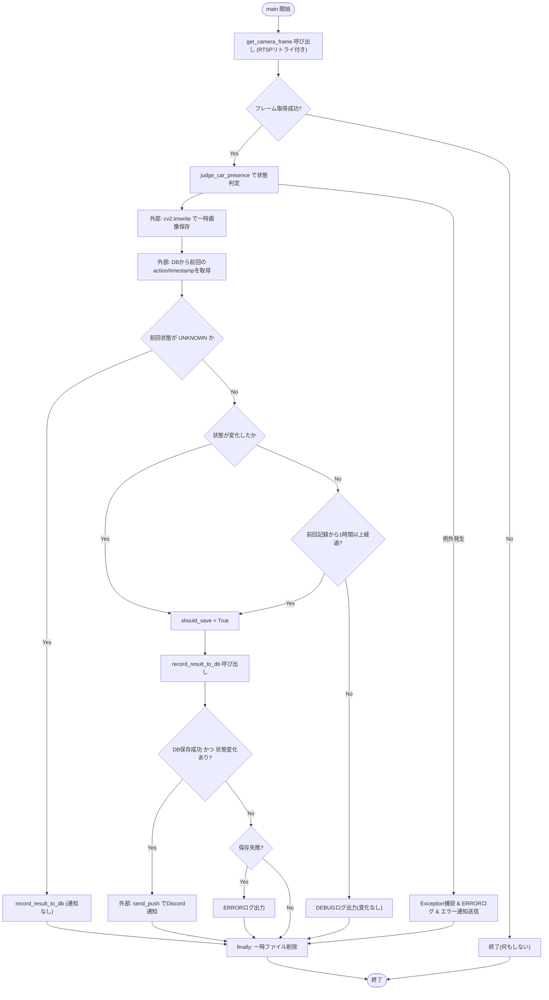
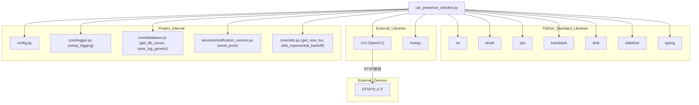

## 1. 解析メタ情報

| 項目 | 内容 |
| --- | --- |
| 対象ファイル | `monitors/old/car_presence_checker.py` |
| 言語 | Python |
| 解析対象 | 提供されたコードのみ |
| 推測・補完 | 一切なし |

## 関連ドキュメント

* [logger.md](./logger.md) - `setup_logging`の提供元
* [config.md](./config.md) - `CAMERA_IP`, `CAMERA_USER`, `CAMERA_PASS`, `ASSETS_DIR`, `SQLITE_TABLE_CAR`, `LINE_USER_ID`等の設定値を提供
* [database.md](./database.md) - `get_db_cursor`, `save_log_generic`の提供元
* [notification_service.md](./notification_service.md) - `send_push`の提供元
* [utils.md](./utils.md) - `get_now_iso`, `with_exponential_backoff`の提供元
* [camera_monitor.md](./camera_monitor.md) - 同様にネットワークカメラを監視対象とする関連モジュール（推測: 用途の近さによる）

## 2. ファイルの概要

RTSPカメラの映像フレームを取得し、画像処理（昼間は青色ピクセル比率、夜間は輝度）によって車庫内の車の有無を判定、状態変化時にDB記録とDiscord通知を行うバッチスクリプトである。
根拠: [ファイル先頭コメント] (行番号: 1 / 抜粋: "# MY_HOME_SYSTEM/monitors/car_presence_checker.py")

`get_camera_frame`は`config.CAMERA_IP`等からRTSP URLを構築し、`cv2.VideoCapture`で接続、失敗時は指数関数的バックオフ(Exponential Backoff)で最大`MAX_RETRIES`回リトライする。
根拠: [get_camera_frame] (行番号: 65, 100 / 抜粋: "backoff_time = interval * (2 ** (attempt - 1))")

`judge_car_presence`は画像中央部を切り出し、現在時刻が`NIGHT_START_HOUR`〜`NIGHT_END_HOUR`の範囲であれば輝度判定、それ以外は青色ピクセル比率判定によって`STATE_PRESENT`/`STATE_ABSENT`を返す。
根拠: [judge_car_presence] (行番号: 126〜140 / 抜粋: "is_night: bool = now_hour >= NIGHT_START_HOUR or now_hour < NIGHT_END_HOUR")

`record_result_to_db`は判定結果をDBに記録し、状態変化時は一時保存された画像を`config.ASSETS_DIR/car_history`へ`shutil.move`で永続化する。
根拠: [record_result_to_db] (行番号: 160〜170 / 抜粋: "shutil.move(img_path, permanent_path)")

`main`はフレーム取得→AI判定→DB上の前回状態との比較→状態変化または1時間経過時の保存・通知、を行い、いずれの段階でも例外は`try/except/finally`で捕捉し一時ファイルのクリーンアップを保証する。
根拠: [main] (行番号: 172〜250 / 抜粋: "finally:\n        # 5. クリーンアップ (例外発生時にも必ず実行)")

状態が初回（DBに前回記録なし）の場合は通知を送らずDB記録のみ行う。
根拠: [main] (行番号: 202〜205 / 抜粋: "logger.info(f\"🆕 Initial state detected: {current_action}. Saving without notification.\")")

状態変化がなくても、前回記録から3600秒（1時間）以上経過している場合は定期記録として再度DBに保存する（通知は状態変化時のみ）。
根拠: [main] (行番号: 209〜222 / 抜粋: "if (now - last_dt).total_seconds() > 3600:\n                    should_save = True")

## 3. 外部依存関係

### インポート一覧

| 名称 | 種類 | 用途 | 根拠 |
| --- | --- | --- | --- |
| `cv2` | 外部ライブラリ(OpenCV) | RTSPからの映像取得(`VideoCapture`)、色空間変換、画像書き込み等の画像処理 | 根拠: `[import cv2]` (行番号: 2 / 抜粋: "import cv2") |
| `numpy` (`np`) | 外部ライブラリ | 画像配列演算、色範囲定数(`BLUE_LOWER`等)の定義 | 根拠: `[import numpy as np]` (行番号: 3 / 抜粋: "import numpy as np") |
| `os` | 標準ライブラリ | パス結合・存在確認・削除等のOS操作 | 根拠: `[import os]` (行番号: 4 / 抜粋: "import os") |
| `shutil` | 標準ライブラリ | 一時画像ファイルの永続保存先への移動(`shutil.move`) | 根拠: `[import shutil]` (行番号: 5 / 抜粋: "import shutil") |
| `sys` | 標準ライブラリ | プロジェクトルートへのパス追加 | 根拠: `[import sys]` (行番号: 6 / 抜粋: "import sys") |
| `traceback` | 標準ライブラリ | 例外発生時のスタックトレース文字列生成 | 根拠: `[import traceback]` (行番号: 7 / 抜粋: "import traceback") |
| `time` | 標準ライブラリ | リトライ時の待機(`time.sleep`) | 根拠: `[import time]` (行番号: 8 / 抜粋: "import time") |
| `datetime` | 標準ライブラリ | 現在時刻取得（昼夜判定・タイムスタンプ生成・前回記録との時間差計算） | 根拠: `[from datetime import datetime]` (行番号: 9 / 抜粋: "from datetime import datetime") |
| `Tuple`, `Optional`, `List`, `Any` | 標準ライブラリ(`typing`) | 型ヒントの定義 | 根拠: `[from typing import Tuple, Optional, List, Any]` (行番号: 10 / 抜粋: "from typing import Tuple, Optional, List, Any") |
| `config` | 内部モジュール | カメラ接続情報・DBテーブル名・LINEユーザーID等の設定値の提供 | 根拠: `[import config]` (行番号: 15 / 抜粋: "import config") |
| `setup_logging` | 内部モジュール(`core.logger`) | ロガーインスタンスの初期化 | 根拠: `[from core.logger import setup_logging]` (行番号: 16 / 抜粋: "from core.logger import setup_logging") |
| `get_db_cursor`, `save_log_generic` | 内部モジュール(`core.database`) | DBカーソルの取得(コンテキストマネージャ)、汎用ログレコードの保存 | 根拠: `[from core.database import get_db_cursor, save_log_generic]` (行番号: 17 / 抜粋: "from core.database import get_db_cursor, save_log_generic") |
| `send_push` | 内部モジュール(`services.notification_service`) | 状態変化・エラー発生時の通知送信 | 根拠: `[from services.notification_service import send_push]` (行番号: 18 / 抜粋: "from services.notification_service import send_push") |
| `get_now_iso`, `with_exponential_backoff` | 内部モジュール(`core.utils`) | ISO形式の現在時刻取得、指数バックオフ機能の提供 | 根拠: `[from core.utils import get_now_iso, with_exponential_backoff]` (行番号: 19 / 抜粋: "from core.utils import get_now_iso, with_exponential_backoff") |

### ブラックボックスとなる外部要素

| 名称 | 理由 | 根拠 |
| --- | --- | --- |
| `config.CAMERA_IP` / `config.CAMERA_USER` / `config.CAMERA_PASS` / `config.ASSETS_DIR` / `config.SQLITE_TABLE_CAR` / `config.LINE_USER_ID` | `config`モジュールの実装が提供されておらず、実際の値が不明であるため。 | 根拠: `[config参照箇所]` (行番号: 61, 65, 161, 170, 195, 230〜231 / 抜粋: "f\"rtsp://{config.CAMERA_USER}:{config.CAMERA_PASS}@{config.CAMERA_IP}:{RTSP_PORT}/stream1\"") |
| `cv2`(OpenCV)の内部実装 | 外部ライブラリであり、RTSPデコードや色空間変換の内部アルゴリズムは提供コードから読み取れないため。 | 根拠: `[cv2.VideoCapture / cv2.cvtColor]` (行番号: 70, 130, 135 / 抜粋: "cap = cv2.VideoCapture(rtsp_url)") |
| `get_db_cursor`, `save_log_generic`の内部実装 | `core.database`モジュールの実装が本ファイルに含まれていないため、DB接続方式やエラー処理の詳細が不明。 | 根拠: `[get_db_cursor / save_log_generic呼び出し]` (行番号: 170, 193 / 抜粋: "with get_db_cursor() as cur:") |
| `send_push`の内部実装 | `services.notification_service`モジュールの実装が本ファイルに含まれていないため、実際の通知手段（Discord API等）の詳細が不明。 | 根拠: `[send_push呼び出し]` (行番号: 230〜234 / 抜粋: "send_push(\n                    config.LINE_USER_ID or \"\", ") |
| `with_exponential_backoff`の内部実装・使用有無 | `core.utils`からインポートされているが、本ファイル内で呼び出し箇所が確認できないため（リトライ処理は`get_camera_frame`内で独自に実装されている）。 | 根拠: `[import文]` (行番号: 19 / 抜粋: "from core.utils import get_now_iso, with_exponential_backoff") |

## 4. 主要要素の定義（関数 / エンドポイント / コンポーネント）

### `get_camera_frame`

* **役割**: RTSP経由でカメラの最新フレームを取得する。接続失敗時は指定回数リトライを行い、試行ごとにリソースを解放する。
* 根拠: `[get_camera_frame]` (行番号: 49〜59 / 抜粋: "RTSP経由でカメラの最新フレームを取得する。")
* **引数/リクエスト**: `retries` (型: `int`、デフォルト`MAX_RETRIES`=3。最大リトライ回数)、`interval` (型: `int`、デフォルト`RETRY_INTERVAL`=5。リトライ間隔秒数)。
* 根拠: `[シグネチャ]` (行番号: 49 / 抜粋: "def get_camera_frame(retries: int = MAX_RETRIES, interval: int = RETRY_INTERVAL) -> Optional[np.ndarray]:")
* **戻り値/レスポンス**: `Optional[np.ndarray]` (取得成功時は画像フレーム、失敗時は`None`)。
* 根拠: `[戻り値型ヒントおよびreturn]` (行番号: 59, 85, 106 / 抜粋: "-> Optional[np.ndarray]:")
* **副作用**: `cv2.VideoCapture`によるRTSP接続の確立・解放(`cap.release()`)、`time.sleep`による待機。
* 根拠: `[cap.releaseとtime.sleep]` (行番号: 95, 102 / 抜粋: "cap.release()")
* **エラーハンドリング**: `Exception`全般をキャッチしWARNINGログを出力、`finally`ブロックで確実にリソースを解放する。カメラ設定が不足している場合は早期に`None`を返す。
* 根拠: `[try/except/finally]` (行番号: 61〜96 / 抜粋: "except Exception as e:\n            logger.warning(f\"⚠️ Unexpected error during RTSP connection: {e}\")\n            \n        finally:")

### `judge_car_presence`

* **役割**: 画像から車の有無を判定する。中央部を切り出し、夜間は輝度、昼間は青色ピクセル比率で判定する。
* 根拠: `[judge_car_presence]` (行番号: 108〜117 / 抜粋: "画像から車の有無を判定するロジック。")
* **引数/リクエスト**: `img` (型: `np.ndarray`。判定対象の画像フレーム)。
* 根拠: `[シグネチャ]` (行番号: 108 / 抜粋: "def judge_car_presence(img: np.ndarray) -> Tuple[str, str, float]:")
* **戻り値/レスポンス**: `Tuple[str, str, float]` (判定結果状態(`STATE_PRESENT`/`STATE_ABSENT`/`UNKNOWN`)、判定理由の詳細文字列、判定スコア)。
* 根拠: `[戻り値型ヒントおよび各return]` (行番号: 108, 119, 133, 140 / 抜粋: "-> Tuple[str, str, float]:")
* **副作用**: なし。
* 根拠: `[judge_car_presence全体]` (行番号: 108〜140 / 抜粋: "def judge_car_presence(img: np.ndarray) -> Tuple[str, str, float]:")
* **エラーハンドリング**: 引数`img`が`None`の場合、`"UNKNOWN", "Invalid Image", 0.0`を返す早期リターンのみ。それ以外の例外捕捉なし。
* 根拠: `[Noneチェック]` (行番号: 118〜119 / 抜粋: "if img is None:\n        return \"UNKNOWN\", \"Invalid Image\", 0.0")

### `record_result_to_db`

* **役割**: 判定結果をDBに記録し、状態変化時は一時保存された画像を履歴用ディレクトリへ移動して永続保存する。
* 根拠: `[record_result_to_db]` (行番号: 142〜155 / 抜粋: "判定結果をDBに記録し、状態変化時は画像を永続保存する。")
* **引数/リクエスト**: `action` (型: `str`。車の有無状態)、`details` (型: `str`。判定理由)、`score` (型: `float`。判定スコア)、`img_path` (型: `str`。一時保存画像のパス)、`is_changed` (型: `bool`。前回から状態が変化したか)。
* 根拠: `[シグネチャ]` (行番号: 142 / 抜粋: "def record_result_to_db(action: str, details: str, score: float, img_path: str, is_changed: bool) -> bool:")
* **戻り値/レスポンス**: `bool` (`save_log_generic`の戻り値。DB記録の成功可否)。
* 根拠: `[return文]` (行番号: 170 / 抜粋: "return save_log_generic(config.SQLITE_TABLE_CAR, cols, vals)")
* **副作用**: 状態変化かつ画像が存在する場合、`config.ASSETS_DIR/car_history`ディレクトリの作成(`os.makedirs`)、および`shutil.move`による画像ファイルの移動。DBへのレコード書き込み。
* 根拠: `[os.makedirsとshutil.move]` (行番号: 162, 165 / 抜粋: "os.makedirs(save_dir, exist_ok=True)")
* **エラーハンドリング**: 画像移動時の`Exception`をキャッチしWARNINGログを出力（DB記録処理自体は継続）。
* 根拠: `[except Exception]` (行番号: 167〜168 / 抜粋: "except Exception as e:\n            logger.warning(f\"⚠️ Image move failed: {e}\")")

### `main`

* **役割**: メイン監視プロセス。フレーム取得、AI判定、前回状態との比較、DB保存、状態変化時の通知を統括する。
* 根拠: `[main]` (行番号: 172〜173 / 抜粋: "メイン監視プロセス。定期実行により車の入出庫状態を判定し、通知・記録を行う。")
* **引数/リクエスト**: なし。
* 根拠: `[シグネチャ]` (行番号: 172 / 抜粋: "def main() -> None:")
* **戻り値/レスポンス**: なし(`None`)。フレーム取得失敗時は早期`return`。
* 根拠: `[早期return]` (行番号: 178〜180 / 抜粋: "if frame is None:\n            return ")
* **副作用**: `cv2.imwrite`による一時画像ファイルの書き込み、DBへのレコード保存、状態変化時の`send_push`によるDiscord通知送信、`finally`ブロックでの一時ファイル削除(`os.remove`)。
* 根拠: `[cv2.imwrite・send_push・os.remove]` (行番号: 187, 230〜234, 249 / 抜粋: "cv2.imwrite(tmp_img_path, frame)")
* **エラーハンドリング**: `Exception`全般をキャッチしERRORログ出力の上、エラー通知(`send_push`, `channel=\"error\"`)を送信する。`finally`ブロックで一時ファイルの削除を保証する。
* 根拠: `[except Exceptionとfinally]` (行番号: 241〜250 / 抜粋: "except Exception as e:\n        err_detail: str = f\"🔥 Car Presence Checker Error: {e}\\n{traceback.format_exc()}\"")

## 5. 処理フロー図

## 6. 依存関係図

## 7. 次のステップ（リバースエンジニアリングの提案）

| 優先度 | ファイル名(推測可) | 理由 | 根拠 |
| --- | --- | --- | --- |
| 高 | `core/database.py` | `get_db_cursor`, `save_log_generic`の実装を確認し、DB接続・記録処理の詳細を把握する必要があるため。 | 根拠: `[import文]` (行番号: 17 / 抜粋: "from core.database import get_db_cursor, save_log_generic") |
| 高 | `config.py` | `CAMERA_IP`, `CAMERA_USER`, `SQLITE_TABLE_CAR`等、動作を左右する設定値の内容を確認するため。 | 根拠: `[config参照]` (行番号: 61, 65, 195 / 抜粋: "if not config.CAMERA_IP or not config.CAMERA_USER:") |
| 中 | `services/notification_service.py` | `send_push`の実際の通知先(`target=\"discord\"`)や失敗時挙動を確認するため。 | 根拠: `[send_push呼び出し]` (行番号: 230〜234 / 抜粋: "send_push(\n                    config.LINE_USER_ID or \"\", ") |
| 低 | `core/utils.py` | インポートされている`with_exponential_backoff`が本ファイル内で使用されていないため、意図された用途を確認する必要がある。 | 根拠: `[import文]` (行番号: 19 / 抜粋: "from core.utils import get_now_iso, with_exponential_backoff") |

## 8. 保守上の注意点

* `with_exponential_backoff`が`core.utils`からインポートされているが、本ファイル内での呼び出し箇所が見当たらない（未使用インポートの可能性）。リトライ処理は`get_camera_frame`内で独自にバックオフ計算(`interval * (2 ** (attempt - 1))`)が実装されている。
* 根拠: `[import文とget_camera_frame内のバックオフ計算]` (行番号: 19, 100 / 抜粋: "backoff_time = interval * (2 ** (attempt - 1))")
* `main`内のDB前回状態取得処理で、`row["action"]`（辞書アクセス）と`row[0]`（インデックスアクセス）を`isinstance(row, dict)`で分岐しており、DBカーソルの戻り値の型がsqlite3.Rowか通常のタプルかによって挙動を切り替える設計になっている点は、DB層の実装（`core.database`）と密結合している。
* 根拠: `[row型分岐]` (行番号: 198〜199 / 抜粋: "last_action = row[\"action\"] if isinstance(row, dict) else row[0]")
* `send_push`呼び出し時に`config.LINE_USER_ID or \"\"`としており、`config.LINE_USER_ID`が未設定でも空文字列で呼び出しを続行する設計だが、これが`send_push`側でどう扱われるかは本ファイルからは不明。
* 根拠: `[send_push呼び出し]` (行番号: 230〜231 / 抜粋: "send_push(\n                    config.LINE_USER_ID or \"\", ")
* `monitors/old/`ディレクトリに配置されており、後継または現行版の同等モジュールが別途存在する可能性がある（本ファイル単体では判別不可）。
* 根拠: `[ファイルパス]` (行番号: 該当なし / 抜粋: "monitors/old/car_presence_checker.py")
* `tmp_img_path`が`"/tmp/car_check_latest.jpg"`という固定パスでハードコードされており、複数プロセスが並行実行された場合の競合リスクがある。
* 根拠: `[tmp_img_path定義]` (行番号: 174 / 抜粋: "tmp_img_path: str = \"/tmp/car_check_latest.jpg\"")

## 9. 不明事項一覧

| 項目 | 理由 | 必要なファイル |
| --- | --- | --- |
| `config.CAMERA_IP`等の実際の設定値 | `config`モジュールの実装が本ファイルに含まれていないため。 | `config.py` |
| `get_db_cursor` / `save_log_generic`の内部実装 | `core.database`モジュールの実装が本ファイルに含まれていないため。 | `core/database.py` |
| `send_push`の内部実装（Discord通知の実際の送信方法） | `services.notification_service`モジュールの実装が本ファイルに含まれていないため。 | `services/notification_service.py` |
| `with_exponential_backoff`が実際に使用されているか | インポートのみで呼び出し箇所が本ファイル内に見当たらないため。 | `core/utils.py`、本ファイルの完全な実行経路の確認 |
| `monitors/old/`ディレクトリの位置づけ（現行版との関係） | ディレクトリ名から旧版の可能性が示唆されるが、本ファイル単体では現行版の有無や移行状況を判断できないため。 | `monitors/`配下の他ファイル一覧 |

## 10. 自己検証結果

* [x] 推測・外部ファイルの仕様を一切含んでいない（完了）
* [x] 全関数・全クラス・全コンポーネントを列挙した（完了）
* [x] 全てのインポート要素を列挙した（完了）
* [x] すべての仕様説明に「根拠（行番号・抜粋）」を明記した（完了）
* [x] 根拠漏れが0件である（完了）
* [x] Mermaid構文にエラーの原因となる記号（エスケープ漏れ）がない（完了）
* [x] 不明事項を漏れなく列挙した（完了）
