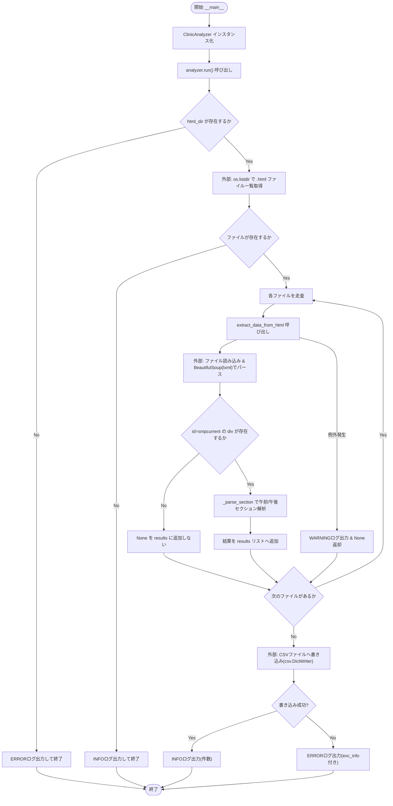
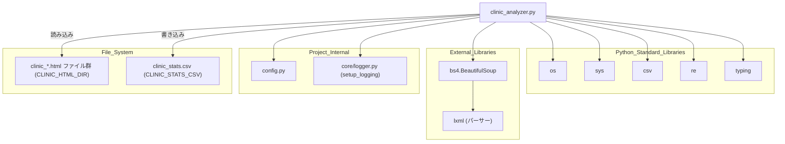

## 1. 解析メタ情報

| 項目 | 内容 |
| --- | --- |
| 対象ファイル | `monitors/old/clinic_analyzer.py` |
| 言語 | Python |
| 解析対象 | 提供されたコードのみ |
| 推測・補完 | 一切なし |

## 関連ドキュメント

* [logger.md](./logger.md) - `setup_logging`の提供元
* [config.md](./config.md) - `CLINIC_HTML_DIR`, `CLINIC_STATS_CSV`, `ASSETS_DIR`等の設定値を提供
* [clinic_monitor.md](./clinic_monitor.md) - 本ファイルが読み込む`clinic_YYYYMMDD_HHMMSS.html`ファイルの生成元（推測: ファイル命名規則`clinic_(\d{8})_(\d{6})`が一致するため）
* [clinic_visualizer.md](./clinic_visualizer.md) - 本ファイルが出力するCSV(`CLINIC_STATS_CSV`)を読み込んでグラフ化する後続処理（推測: 設定キー名が一致するため）

## 2. ファイルの概要

蓄積された小児科（伊丹たかの小児科）の予約ページHTMLファイル群を解析し、午前・午後それぞれの予約人数・院内待ち人数を抽出してCSVファイルに出力するバッチスクリプトである。
根拠: [クラスDocstring] (行番号: 18〜19 / 抜粋: "蓄積された小児科のHTMLファイルを解析し、混雑状況をCSVに抽出するクラス。")

`_count_items`は、テキスト中に「おられません」「受付は終了」「なし」のいずれかが含まれる場合は0を返し、それ以外は全角読点・半角カンマで分割した要素数をカウントする。
根拠: [_count_items] (行番号: 38〜57 / 抜粋: "if \"おられません\" in text or \"受付は終了\" in text or \"なし\" in text:\n            return 0")

`_parse_section`は`BeautifulSoup`のセクション要素から、`class=\"waitlistall\"`のspanで予約総数を、`class=\"nowinfo\"`かつ「院内でお待ちの方」を含むpタグ内のspanで院内待ち人数をそれぞれ抽出する。
根拠: [_parse_section] (行番号: 72〜92 / 抜粋: "wait_span = section.find(\"span\", class_=\"waitlistall\")")

`extract_data_from_html`はファイル名から正規表現(`clinic_(\d{4})(\d{2})(\d{2})_(\d{2})(\d{2})(\d{2})`)でタイムスタンプを抽出し、`id=\"smpcurrent\"`のdiv内の`aroundline10`(午前)・`aroundline7`(午後)クラスのセクションをそれぞれ解析する。
根拠: [extract_data_from_html] (行番号: 106〜123 / 抜粋: "match = re.search(r\"clinic_(\\d{4})(\\d{2})(\\d{2})_(\\d{2})(\\d{2})(\\d{2})\", filename)")

`run`は`html_dir`内の`.html`ファイルを全て走査し、解析結果を`csv.DictWriter`で`output_csv`へ書き出す。
根拠: [run] (行番号: 141〜171 / 抜粋: "writer = csv.DictWriter(f, fieldnames=self.headers)\n                writer.writeheader()\n                writer.writerows(results)")

## 3. 外部依存関係

### インポート一覧

| 名称 | 種類 | 用途 | 根拠 |
| --- | --- | --- | --- |
| `os` | 標準ライブラリ | パス結合・存在確認・ディレクトリ内ファイル一覧取得(`os.listdir`) | 根拠: `[import os]` (行番号: 1 / 抜粋: "import os") |
| `sys` | 標準ライブラリ | プロジェクトルートへのパス追加 | 根拠: `[import sys]` (行番号: 2 / 抜粋: "import sys") |
| `csv` | 標準ライブラリ | 解析結果のCSVファイル書き出し(`csv.DictWriter`) | 根拠: `[import csv]` (行番号: 3 / 抜粋: "import csv") |
| `re` | 標準ライブラリ | ファイル名からのタイムスタンプ抽出、テキストの要素分割正規表現 | 根拠: `[import re]` (行番号: 4 / 抜粋: "import re") |
| `List`, `Dict`, `Optional`, `Tuple` | 標準ライブラリ(`typing`) | 型ヒントの定義 | 根拠: `[from typing import List, Dict, Optional, Tuple]` (行番号: 5 / 抜粋: "from typing import List, Dict, Optional, Tuple") |
| `BeautifulSoup` | 外部ライブラリ(`bs4`) | HTMLファイルのパースおよびDOM要素の探索 | 根拠: `[from bs4 import BeautifulSoup]` (行番号: 6 / 抜粋: "from bs4 import BeautifulSoup") |
| `config` | 内部モジュール | HTML読み込み元ディレクトリ・CSV出力先パス・アセットディレクトリの提供 | 根拠: `[import config]` (行番号: 11 / 抜粋: "import config") |
| `setup_logging` | 内部モジュール(`core.logger`) | ロガーインスタンスの初期化 | 根拠: `[from core.logger import setup_logging]` (行番号: 12 / 抜粋: "from core.logger import setup_logging") |

### ブラックボックスとなる外部要素

| 名称 | 理由 | 根拠 |
| --- | --- | --- |
| `config.CLINIC_HTML_DIR` / `config.CLINIC_STATS_CSV` / `config.ASSETS_DIR` | `config`モジュールの実装が提供されておらず、実際の値が不明であるため(`getattr`によるデフォルト値フォールバック付き)。 | 根拠: `[getattr(config, ...)]` (行番号: 29〜30 / 抜粋: "self.html_dir: str = getattr(config, \"CLINIC_HTML_DIR\", os.path.join(config.ASSETS_DIR, \"clinic_html\"))") |
| `lxml`パーサー | `BeautifulSoup(f, \"lxml\")`で指定されているHTMLパーサーライブラリであり、そのインストール状況・内部実装は本ファイルからは確認できないため。 | 根拠: `[BeautifulSoup(f, \"lxml\")]` (行番号: 116 / 抜粋: "soup = BeautifulSoup(f, \"lxml\")") |
| 解析対象HTMLファイルの実際のDOM構造（`smpcurrent`, `aroundline10`, `aroundline7`, `waitlistall`, `nowinfo`等のクラス/ID） | 監視対象Webサイトが出力する実際のHTML構造であり、本ファイル単体からは全容を確認できないため（`clinic_monitor.py`が保存したファイルが前提）。 | 根拠: `[各find呼び出し]` (行番号: 118, 122〜123, 74, 82 / 抜粋: "current_div = soup.find(\"div\", id=\"smpcurrent\")") |

## 4. 主要要素の定義（関数 / エンドポイント / コンポーネント）

### `ClinicAnalyzer`

* **役割**: 蓄積された小児科のHTMLファイルを解析し、混雑状況をCSVに抽出するクラス。
* 根拠: `[クラスDocstring]` (行番号: 17〜19 / 抜粋: "蓄積された小児科のHTMLファイルを解析し、混雑状況をCSVに抽出するクラス。")

### `ClinicAnalyzer.__init__`

* **役割**: `config`からHTML読み込み元ディレクトリとCSV出力先パスを読み込み、CSVヘッダー定義を初期化する。
* 根拠: `[__init__]` (行番号: 27〜36 / 抜粋: "def __init__(self) -> None:")
* **引数/リクエスト**: `self`のみ。
* 根拠: `[__init__シグネチャ]` (行番号: 27 / 抜粋: "def __init__(self) -> None:")
* **戻り値/レスポンス**: なし(`None`)。
* 根拠: `[__init__シグネチャ]` (行番号: 27 / 抜粋: "def __init__(self) -> None:")
* **副作用**: インスタンス属性(`html_dir`, `output_csv`, `headers`)の設定のみ。
* 根拠: `[__init__本体]` (行番号: 29〜36 / 抜粋: "self.headers: List[str] = [")
* **エラーハンドリング**: なし。
* 根拠: `[__init__本体]` (行番号: 27〜36 / 抜粋: "def __init__(self) -> None:")

### `ClinicAnalyzer._count_items`

* **役割**: テキスト内の要素数をカウントする（除外キーワードチェック後、読点・カンマで分割）。
* 根拠: `[_count_items]` (行番号: 38〜47 / 抜粋: "テキスト内の要素数をカウントする。")
* **引数/リクエスト**: `text` (型: `str`。解析対象のテキスト、例: "１、３、５")。
* 根拠: `[シグネチャ]` (行番号: 38 / 抜粋: "def _count_items(self, text: str) -> int:")
* **戻り値/レスポンス**: `int` (要素数)。
* 根拠: `[戻り値型ヒントおよびreturn]` (行番号: 38, 49, 53, 57 / 抜粋: "def _count_items(self, text: str) -> int:")
* **副作用**: なし。
* 根拠: `[_count_items全体]` (行番号: 38〜57 / 抜粋: "def _count_items(self, text: str) -> int:")
* **エラーハンドリング**: なし（`text`が空の場合は早期`return 0`）。
* 根拠: `[早期return]` (行番号: 48〜49 / 抜粋: "if not text:\n            return 0")

### `ClinicAnalyzer._parse_section`

* **役割**: 午前/午後のセクションブロック(`BeautifulSoup`要素)から予約人数・院内待ち人数を抽出する。
* 根拠: `[_parse_section]` (行番号: 59〜60 / 抜粋: "午前/午後のセクションブロックを解析する。")
* **引数/リクエスト**: `section` (型: `Optional[BeautifulSoup]`。解析対象のdiv要素)。
* 根拠: `[シグネチャ]` (行番号: 59 / 抜粋: "def _parse_section(self, section: Optional[BeautifulSoup]) -> Tuple[int, int]:")
* **戻り値/レスポンス**: `Tuple[int, int]` (予約人数, 院内待ち人数)。`section`が`None`の場合は`(0, 0)`。
* 根拠: `[戻り値型ヒントおよびreturn]` (行番号: 59, 70, 92 / 抜粋: "return r_count, c_count")
* **副作用**: なし。
* 根拠: `[_parse_section全体]` (行番号: 59〜92 / 抜粋: "def _parse_section(self, section: Optional[BeautifulSoup]) -> Tuple[int, int]:")
* **エラーハンドリング**: なし（明示的な例外捕捉は行わず、要素未検出時はデフォルト値0を用いる）。
* 根拠: `[_parse_section全体]` (行番号: 59〜92 / 抜粋: "def _parse_section(self, section: Optional[BeautifulSoup]) -> Tuple[int, int]:")

### `ClinicAnalyzer.extract_data_from_html`

* **役割**: 1つのHTMLファイルから午前・午後の混雑データを抽出する。
* 根拠: `[extract_data_from_html]` (行番号: 94〜95 / 抜粋: "1つのHTMLファイルから午前・午後の混雑データを抽出する。")
* **引数/リクエスト**: `file_path` (型: `str`。HTMLファイルのパス)。
* 根拠: `[シグネチャ]` (行番号: 94 / 抜粋: "def extract_data_from_html(self, file_path: str) -> Optional[Dict[str, any]]:")
* **戻り値/レスポンス**: `Optional[Dict[str, any]]` (抽出データの辞書、`smpcurrent`要素が見つからない場合や例外発生時は`None`)。
* 根拠: `[戻り値型ヒントおよびreturn]` (行番号: 94, 119〜120, 128〜134, 139 / 抜粋: "if not current_div:\n                return None")
* **副作用**: `open`によるローカルファイルの読み込み。
* 根拠: `[open]` (行番号: 115 / 抜粋: "with open(file_path, \"r\", encoding=\"utf-8\", errors=\"ignore\") as f:")
* **エラーハンドリング**: `Exception`全般をキャッチしWARNINGログを出力（ファイル単位の解析エラーとして扱い処理継続）、`None`を返す。
* 根拠: `[except Exception]` (行番号: 136〜139 / 抜粋: "except Exception as e:\n            # Rule 8.2: ファイル単位の解析エラーはWARNING扱いで継続 \n            logger.warning(f\"⚠️ Failed to parse {file_path}: {e}\")\n            return None")

### `ClinicAnalyzer.run`

* **役割**: ディレクトリ内の全HTMLファイルを解析してCSVに出力する。
* 根拠: `[run]` (行番号: 141〜143 / 抜粋: "ディレクトリ内の全ファイルを解析してCSVに出力する。")
* **引数/リクエスト**: `self`のみ。
* 根拠: `[runシグネチャ]` (行番号: 141 / 抜粋: "def run(self) -> None:")
* **戻り値/レスポンス**: なし(`None`)。ディレクトリ不在時・対象ファイル無し時は早期`return`。
* 根拠: `[早期return]` (行番号: 145〜152 / 抜粋: "if not os.path.exists(self.html_dir):\n            logger.error(f\"HTML directory not found: {self.html_dir}\")\n            return")
* **副作用**: `os.listdir`によるディレクトリ走査、`extract_data_from_html`の連続呼び出し（ファイル読み込み）、CSVファイルへの書き込み(`open`と`csv.DictWriter`)。
* 根拠: `[csv書き込み]` (行番号: 164〜167 / 抜粋: "with open(self.output_csv, \"w\", encoding=\"utf-8\", newline=\"\") as f:")
* **エラーハンドリング**: CSV書き込み時の`OSError`をキャッチし、スタックトレース付き(`exc_info=True`)でERRORログを出力する。
* 根拠: `[except OSError]` (行番号: 169〜171 / 抜粋: "except OSError as e:\n            # Rule 8.2: IOエラーはERROR \n            logger.error(f\"❌ Failed to save CSV: {e}\", exc_info=True)")

## 5. 処理フロー図

## 6. 依存関係図

## 7. 次のステップ（リバースエンジニアリングの提案）

| 優先度 | ファイル名(推測可) | 理由 | 根拠 |
| --- | --- | --- | --- |
| 高 | `monitors/old/clinic_monitor.py` | 本ファイルが解析対象とするHTMLファイル(`clinic_*.html`)の生成元であり、ファイル命名規則・生成タイミングの整合性を確認するため。 | 根拠: `[ファイル名正規表現]` (行番号: 107 / 抜粋: "match = re.search(r\"clinic_(\\d{4})(\\d{2})(\\d{2})_(\\d{2})(\\d{2})(\\d{2})\", filename)") |
| 中 | `monitors/old/clinic_visualizer.py` | 本ファイルの出力CSV(`CLINIC_STATS_CSV`)を後続で読み込みグラフ化していると推測されるモジュールであり、CSVスキーマの整合性を確認するため。 | 根拠: `[headers定義]` (行番号: 32〜36 / 抜粋: "self.headers: List[str] = [") |
| 中 | `config.py` | `CLINIC_HTML_DIR`, `CLINIC_STATS_CSV`, `ASSETS_DIR`の実際の設定値を確認するため。 | 根拠: `[getattr(config, ...)]` (行番号: 29〜30 / 抜粋: "self.html_dir: str = getattr(config, \"CLINIC_HTML_DIR\", ...)") |

## 8. 保守上の注意点

* `extract_data_from_html`の戻り値型ヒントが`Optional[Dict[str, any]]`となっており、`any`（組み込み関数）が誤って型として指定されている（本来は`typing.Any`が期待される箇所）。型チェッカーによっては意図通りに機能しない可能性がある。
* 根拠: `[戻り値型ヒント]` (行番号: 94 / 抜粋: "def extract_data_from_html(self, file_path: str) -> Optional[Dict[str, any]]:")
* HTML構造の解析対象クラス名(`waitlistall`, `nowinfo`, `aroundline10`, `aroundline7`)、ID(`smpcurrent`)、除外キーワード（「おられません」「受付は終了」「なし」）が全てハードコードされており、監視対象Webサイトの表記・構造変更に弱い。
* 根拠: `[各種ハードコード値]` (行番号: 52, 74, 82〜83, 118, 122〜123 / 抜粋: "if \"おられません\" in text or \"受付は終了\" in text or \"なし\" in text:")
* CSVファイルの書き込みは`\"w\"`モード（上書き）で行われており、実行のたびに`output_csv`の内容が全件洗い替えされる（追記ではない）。過去のCSVをバックアップせずに実行すると、対象HTMLファイルが削除されていた場合はその分のデータが失われる。
* 根拠: `[open(..., \"w\", ...)]` (行番号: 164 / 抜粋: "with open(self.output_csv, \"w\", encoding=\"utf-8\", newline=\"\") as f:")
* `monitors/old/`ディレクトリに配置されており、後継または現行版の同等モジュールが別途存在する可能性がある（本ファイル単体では判別不可）。
* 根拠: `[ファイルパス]` (行番号: 該当なし / 抜粋: "monitors/old/clinic_analyzer.py")

## 9. 不明事項一覧

| 項目 | 理由 | 必要なファイル |
| --- | --- | --- |
| `config.CLINIC_HTML_DIR` / `config.CLINIC_STATS_CSV` / `config.ASSETS_DIR`の実際の設定値 | `config`モジュールの実装が本ファイルに含まれていないため。 | `config.py` |
| 対象Webサイトの実際のHTML構造(`smpcurrent`, `aroundline10/7`等) | 監視対象Webサイトが出力する実HTMLの内容そのものは本ファイルからは確認できないため。 | `clinic_monitor.py`が保存した実際のHTMLサンプルファイル |
| 本ファイルの実行トリガー（cron/スケジューラ設定） | `__main__`ブロックが1回のみの実行を行う設計であり、定期実行の仕組みが本ファイルからは不明であるため。 | スケジューラ関連ファイル(`scheduler_boot.py`等) |
| `monitors/old/`ディレクトリの位置づけ（現行版との関係） | ディレクトリ名から旧版の可能性が示唆されるが、本ファイル単体では現行版の有無や移行状況を判断できないため。 | `monitors/`配下の他ファイル一覧 |

## 10. 自己検証結果

* [x] 推測・外部ファイルの仕様を一切含んでいない（完了）
* [x] 全関数・全クラス・全コンポーネントを列挙した（完了）
* [x] 全てのインポート要素を列挙した（完了）
* [x] すべての仕様説明に「根拠（行番号・抜粋）」を明記した（完了）
* [x] 根拠漏れが0件である（完了）
* [x] Mermaid構文にエラーの原因となる記号（エスケープ漏れ）がない（完了）
* [x] 不明事項を漏れなく列挙した（完了）
