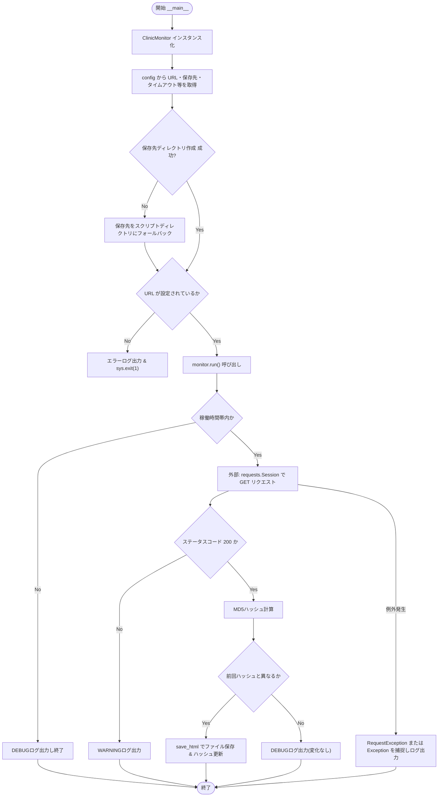
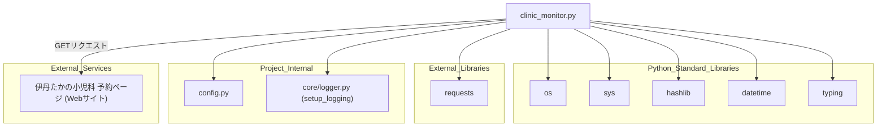

## 1. 解析メタ情報

| 項目 | 内容 |
| --- | --- |
| 対象ファイル | `monitors/old/clinic_monitor.py` |
| 言語 | Python |
| 解析対象 | 提供されたコードのみ |
| 推測・補完 | 一切なし |

## 関連ドキュメント

* [logger.md](./logger.md) - `setup_logging`の提供元
* [config.md](./config.md) - `CLINIC_MONITOR_URL`, `CLINIC_HTML_DIR`, `CLINIC_REQUEST_TIMEOUT`等の設定値を提供
* [clinic_analyzer.md](./clinic_analyzer.md) - 本ファイルが保存したHTMLファイル群(`clinic_YYYYMMDD_HHMMSS.html`)を読み込んで解析する後続処理（推測: ファイル命名規則が一致するため）
* [clinic_visualizer.md](./clinic_visualizer.md) - `clinic_analyzer`の出力CSVをグラフ化する後続処理（本ファイルとは直接の依存関係なし）

## 2. ファイルの概要

伊丹たかの小児科の予約ページのHTMLを定期的に取得し、前回取得内容とのMD5ハッシュ差分がある場合にのみファイルとして保存する監視スクリプトである。
根拠: [クラスDocstring] (行番号: 18〜19 / 抜粋: "伊丹たかの小児科の予約ページHTMLを定期収集するモニタークラス。")

`ClinicMonitor.__init__`にて`config`モジュールから監視対象URL・保存先ディレクトリ・タイムアウト・User-Agentを読み込み、保存先ディレクトリの作成に失敗した場合は自身のスクリプト配置ディレクトリへフォールバックする。
根拠: [__init__] (行番号: 29〜46 / 抜粋: "self.url: str = getattr(config, \"CLINIC_MONITOR_URL\", \"\")")

`is_operating_hours`により、設定された時間帯（デフォルト8〜19時）以外は処理をスキップする。
根拠: [is_operating_hours] (行番号: 55〜60 / 抜粋: "return start <= current_hour <= end")

`run`メソッドは`requests.Session`を用いてHTMLを取得し、MD5ハッシュ(`hashlib.md5`)によって前回取得分との差分を検知した場合のみ`save_html`でファイル保存を行う。差分がない場合はDEBUGログのみ出力する。
根拠: [run] (行番号: 90〜108 / 抜粋: "current_hash: str = hashlib.md5(content).hexdigest()")

URLが設定されていない場合は`__init__`内でエラーログを出力し`sys.exit(1)`によりプロセスを終了する。
根拠: [__init__] (行番号: 51〜53 / 抜粋: "logger.error(\"❌ Config Invalid: CLINIC_MONITOR_URL is missing.\")\n            sys.exit(1)")

スクリプトとして直接実行された場合、`ClinicMonitor`をインスタンス化し`run()`を1回だけ呼び出す（内部ループは持たない、cron等の外部スケジューラによる定期実行を前提とした設計）。
根拠: [__main__] (行番号: 117〜119 / 抜粋: "monitor = ClinicMonitor()\n    monitor.run()")

## 3. 外部依存関係

### インポート一覧

| 名称 | 種類 | 用途 | 根拠 |
| --- | --- | --- | --- |
| `os` | 標準ライブラリ | パス結合(`os.path.join`)・ディレクトリ作成(`os.makedirs`)等のOS操作 | 根拠: `[import os]` (行番号: 1 / 抜粋: "import os") |
| `sys` | 標準ライブラリ | プロジェクトルートへのパス追加(`sys.path.append`)、および設定不備時の異常終了(`sys.exit`) | 根拠: `[import sys]` (行番号: 2 / 抜粋: "import sys") |
| `requests` | 外部ライブラリ | 監視対象URLへのHTTP GETリクエスト送信 | 根拠: `[import requests]` (行番号: 3 / 抜粋: "import requests") |
| `hashlib` | 標準ライブラリ | 取得HTMLコンテンツのMD5ハッシュ計算(差分検知) | 根拠: `[import hashlib]` (行番号: 4 / 抜粋: "import hashlib") |
| `datetime` | 標準ライブラリ | 現在時刻の取得(稼働時間判定・保存ファイル名のタイムスタンプ生成) | 根拠: `[from datetime import datetime]` (行番号: 5 / 抜粋: "from datetime import datetime") |
| `Dict`, `Optional` | 標準ライブラリ(`typing`) | 型ヒントの定義 | 根拠: `[from typing import Dict, Optional]` (行番号: 6 / 抜粋: "from typing import Dict, Optional") |
| `config` | 内部モジュール | 監視URL・保存先ディレクトリ・タイムアウト・User-Agent・稼働時間帯等の設定値の提供 | 根拠: `[import config]` (行番号: 11 / 抜粋: "import config") |
| `setup_logging` | 内部モジュール(`core.logger`) | ロガーインスタンスの初期化 | 根拠: `[from core.logger import setup_logging]` (行番号: 12 / 抜粋: "from core.logger import setup_logging") |

### ブラックボックスとなる外部要素

| 名称 | 理由 | 根拠 |
| --- | --- | --- |
| `config.CLINIC_MONITOR_URL` / `config.CLINIC_HTML_DIR` / `config.CLINIC_REQUEST_TIMEOUT` / `config.CLINIC_USER_AGENT` / `config.CLINIC_MONITOR_START_HOUR` / `config.CLINIC_MONITOR_END_HOUR` | `config`モジュールの実装が提供されておらず、各設定値の実際の値が不明であるため(すべて`getattr`によるデフォルト値フォールバック付きで参照されている)。 | 根拠: `[getattr(config, ...)]` (行番号: 31, 33, 45, 46, 58, 59 / 抜粋: "self.url: str = getattr(config, \"CLINIC_MONITOR_URL\", \"\")") |
| `requests`ライブラリの内部実装 | 外部ライブラリであり、HTTP通信・セッション管理の詳細な内部挙動は提供コードから読み取れないため。 | 根拠: `[requests.Session()]` (行番号: 91 / 抜粋: "with requests.Session() as session:") |
| 監視対象Webサイト（伊丹たかの小児科の予約ページ）のHTML構造 | 外部サイトの実際のレスポンス内容・構造は本ファイルからは確認できないため。 | 根拠: `[クラスDocstring]` (行番号: 19 / 抜粋: "伊丹たかの小児科の予約ページHTMLを定期収集するモニタークラス。") |

## 4. 主要要素の定義（関数 / エンドポイント / コンポーネント）

### `ClinicMonitor`

* **役割**: 伊丹たかの小児科の予約ページHTMLを定期収集するモニタークラス。設定のロード、HTML取得、差分検知、保存を一貫して担う。
* 根拠: `[クラス定義]` (行番号: 17〜27 / 抜粋: "class ClinicMonitor:")

### `ClinicMonitor.__init__`

* **役割**: `config`から監視URL・保存先ディレクトリ・タイムアウト・User-Agentを読み込んで初期化し、保存先ディレクトリを作成する。URL未設定時はプロセスを終了する。
* 根拠: `[__init__]` (行番号: 29〜53 / 抜粋: "def __init__(self) -> None:")
* **引数/リクエスト**: `self`のみ（外部引数なし）。
* 根拠: `[__init__シグネチャ]` (行番号: 29 / 抜粋: "def __init__(self) -> None:")
* **戻り値/レスポンス**: なし(`None`)。
* 根拠: `[__init__シグネチャ]` (行番号: 29 / 抜粋: "def __init__(self) -> None:")
* **副作用**: `os.makedirs`による保存先ディレクトリの作成、インスタンス属性(`url`, `save_dir`, `timeout`, `user_agent`, `last_html_hash`)の設定。URL未設定時は`sys.exit(1)`でプロセスを終了する。
* 根拠: `[os.makedirsおよびsys.exit]` (行番号: 40, 53 / 抜粋: "os.makedirs(self.save_dir, exist_ok=True)")
* **エラーハンドリング**: `os.makedirs`失敗時に`OSError`をキャッチし、エラーログを出力した上で保存先をスクリプト自身のディレクトリにフォールバックする。
* 根拠: `[except OSError]` (行番号: 41〜43 / 抜粋: "except OSError as e:\n            logger.error(f\"❌ Failed to create save directory...")

### `ClinicMonitor.is_operating_hours`

* **役割**: 現在時刻が設定された監視対象時間帯（デフォルト8時〜19時）内かどうかを判定する。
* 根拠: `[is_operating_hours]` (行番号: 55〜60 / 抜粋: "def is_operating_hours(self) -> bool:")
* **引数/リクエスト**: `self`のみ。
* 根拠: `[is_operating_hoursシグネチャ]` (行番号: 55 / 抜粋: "def is_operating_hours(self) -> bool:")
* **戻り値/レスポンス**: `bool` (時間帯内なら`True`)。
* 根拠: `[return文]` (行番号: 60 / 抜粋: "return start <= current_hour <= end")
* **副作用**: なし。
* 根拠: `[is_operating_hours全体]` (行番号: 55〜60 / 抜粋: "def is_operating_hours(self) -> bool:")
* **エラーハンドリング**: なし（明示的な例外捕捉なし）。
* 根拠: `[is_operating_hours全体]` (行番号: 55〜60 / 抜粋: "def is_operating_hours(self) -> bool:")

### `ClinicMonitor.save_html`

* **役割**: 取得したHTMLバイナリをタイムスタンプ付きファイル名で保存先ディレクトリに書き込む。
* 根拠: `[save_html]` (行番号: 62〜74 / 抜粋: "def save_html(self, content: bytes) -> None:")
* **引数/リクエスト**: `content` (型: `bytes`。保存対象のHTMLコンテンツ)。
* 根拠: `[save_htmlシグネチャ]` (行番号: 62 / 抜粋: "def save_html(self, content: bytes) -> None:")
* **戻り値/レスポンス**: なし(`None`)。
* 根拠: `[save_htmlシグネチャ]` (行番号: 62 / 抜粋: "def save_html(self, content: bytes) -> None:")
* **副作用**: `clinic_YYYYMMDD_HHMMSS.html`形式のファイルをローカルファイルシステムに書き込む。
* 根拠: `[open書き込み]` (行番号: 69〜70 / 抜粋: "with open(filepath, \"wb\") as f:\n                f.write(content)")
* **エラーハンドリング**: ファイル書き込み失敗時に`OSError`をキャッチし、スタックトレース付き(`exc_info=True`)でエラーログを出力する。
* 根拠: `[except OSError]` (行番号: 73〜74 / 抜粋: "except OSError as e:\n            logger.error(f\"❌ Failed to save HTML...\", exc_info=True)")

### `ClinicMonitor.run`

* **役割**: 稼働時間帯チェック後にHTMLを取得し、MD5ハッシュによる差分検知を行い、変化があれば`save_html`を呼び出す。
* 根拠: `[run]` (行番号: 76〜115 / 抜粋: "def run(self) -> None:")
* **引数/リクエスト**: `self`のみ。
* 根拠: `[runシグネチャ]` (行番号: 76 / 抜粋: "def run(self) -> None:")
* **戻り値/レスポンス**: なし(`None`)。稼働時間外の場合は早期`return`。
* 根拠: `[早期return]` (行番号: 78〜81 / 抜粋: "if not self.is_operating_hours():\n            ...\n            return")
* **副作用**: HTTP GETリクエストの送信、状態変化時の`save_html`呼び出し（ファイル書き込み）、`self.last_html_hash`の更新。
* 根拠: `[self.last_html_hash更新]` (行番号: 103〜105 / 抜粋: "if self.last_html_hash != current_hash:\n                        self.save_html(content)\n                        self.last_html_hash = current_hash")
* **エラーハンドリング**: `requests.exceptions.RequestException`をキャッチしWARNINGログを出力、それ以外の`Exception`をキャッチしスタックトレース付き(`exc_info=True`)でERRORログを出力する。HTTPステータスが200以外の場合はWARNINGログを出力する。
* 根拠: `[except節]` (行番号: 109〜115 / 抜粋: "except requests.exceptions.RequestException as e:\n            logger.warning(f\"⚠️ Connection failed: {e}\")\n        except Exception as e:")

## 5. 処理フロー図

## 6. 依存関係図

## 7. 次のステップ（リバースエンジニアリングの提案）

| 優先度 | ファイル名(推測可) | 理由 | 根拠 |
| --- | --- | --- | --- |
| 高 | `config.py` | `CLINIC_MONITOR_URL`等、本ファイルの動作を左右する設定値の具体的な内容を確認するため。 | 根拠: `[getattr(config, "CLINIC_MONITOR_URL", "")]` (行番号: 31 / 抜粋: "self.url: str = getattr(config, \"CLINIC_MONITOR_URL\", \"\")") |
| 中 | `monitors/old/clinic_analyzer.py` | 本ファイルが保存する`clinic_*.html`ファイルの後続の消費者（解析処理）と推測されるため、実際に読み込まれているか確認する必要がある。 | 根拠: `[save_html]` (行番号: 65 / 抜粋: "filename: str = f\"clinic_{timestamp}.html\"") |
| 低 | 本スクリプトを起動するスケジューラ(`scheduler_boot.py`等) | `run()`が1回のみ実行される設計であるため、定期実行の仕組み（cron/スケジューラ）を特定する必要がある。 | 根拠: `[__main__]` (行番号: 117〜119 / 抜粋: "monitor = ClinicMonitor()\n    monitor.run()") |

## 8. 保守上の注意点

* `is_operating_hours`は`getattr`のデフォルト値(8時〜19時)を用いるが、`start > end`となるような設定値（日をまたぐ時間帯）が設定された場合、`start <= current_hour <= end`の単純比較では正しく判定できない。
* 根拠: `[is_operating_hours]` (行番号: 58〜60 / 抜粋: "return start <= current_hour <= end")
* `self.last_html_hash`はインスタンス変数（インメモリ）であり、プロセス再起動のたびに`None`にリセットされる。`__main__`から`run()`が1回のみ呼ばれる設計（本ファイル単体では継続ループを持たない）と組み合わさっているため、cron等で毎回新規プロセスとして起動される場合は差分検知が実質的に機能しない可能性がある。
* 根拠: `[last_html_hash初期化と__main__]` (行番号: 49, 117〜119 / 抜粋: "self.last_html_hash: Optional[str] = None")
* `monitors/old/`ディレクトリに配置されており、後継または現行版の同等モジュールが別途存在する可能性がある（本ファイル単体では判別不可）。
* 根拠: `[ファイルパス]` (行番号: 該当なし / 抜粋: "monitors/old/clinic_monitor.py")

## 9. 不明事項一覧

| 項目 | 理由 | 必要なファイル |
| --- | --- | --- |
| `CLINIC_MONITOR_URL`等の実際の設定値 | `config`モジュールの実装が本ファイルに含まれていないため。 | `config.py` |
| 本スクリプトの実行トリガー（cron/スケジューラ設定） | `__main__`ブロックが1回のみの実行を行う設計であり、定期実行の仕組みが本ファイルからは不明であるため。 | スケジューラ関連ファイル(`scheduler_boot.py`等) |
| `monitors/old/`ディレクトリの位置づけ（現行版との関係） | ディレクトリ名から旧版の可能性が示唆されるが、本ファイル単体では現行版の有無や移行状況を判断できないため。 | `monitors/`配下の他ファイル一覧 |

## 相互参照による補足情報

| 元の不明事項 | 判明した内容 | 参照元ドキュメント |
| --- | --- | --- |
| `CLINIC_MONITOR_URL`等の実際の設定値 | `MY_HOME_SYSTEM/config.py`を直接確認した。`CLINIC_MONITOR_URL`(502行目)は`os.getenv("CLINIC_MONITOR_URL", "https://ssc6.doctorqube.com/itami-shounika/")`で環境変数未設定時はこのURLが既定値となる。同ファイル507〜510行目には`CLINIC_MONITOR_START_HOUR`(既定8)、`CLINIC_MONITOR_END_HOUR`(既定19)、`CLINIC_REQUEST_TIMEOUT`(既定10)、`CLINIC_USER_AGENT`(既定`"MyHomeSystem/1.0 (Family Health Monitor)"`)も定義されていることを確認した。 | 直接ソース確認: `MY_HOME_SYSTEM/config.py:502, 507-510` |
| 本スクリプトの実行トリガー（cron/スケジューラ設定） | `MY_HOME_SYSTEM/scheduler_boot.py`を直接確認した。29〜43行目の`TASKS`リスト（定期実行対象スクリプトの一覧）に`clinic_monitor.py`を含む`monitors/old/`配下のスクリプトは1件も含まれておらず、本ファイルは同スケジューラによる定期実行対象になっていないことを確認した。リポジトリ全体を`clinic_monitor`で検索しても、本ファイルを呼び出す箇所は自分自身（`monitors/old/clinic_monitor.py`）以外に見つからず、実際の実行トリガーは特定できなかった。 | 直接ソース確認: `MY_HOME_SYSTEM/scheduler_boot.py:29-43` |
| `monitors/old/`ディレクトリの位置づけ（現行版との関係） | `MY_HOME_SYSTEM/monitors/`配下のファイル一覧を直接確認した。`monitors/`直下には`camera_monitor.py`, `nas_monitor.py`, `nature_remo_monitor.py`, `memory_monitor.py`, `server_watchdog.py`, `switchbot_power_monitor.py`, `timelapse_generator.py`, `timelapse_runner.py`, `scheduled_timelapse.py`, `daily_timelapse_job.py`, `smart_timelapse_generator.py`, `tv_lock_monitor.py`等が存在するが、`clinic_`で始まるファイルは`monitors/old/`配下の`clinic_analyzer.py`, `clinic_monitor.py`, `clinic_visualizer.py`の3件のみであり、現行の`monitors/`直下に後継版は存在しないことを確認した。またリポジトリ全体を`clinic`で検索しても、この3ファイルと`config.py`（設定値定義のみ）以外に`clinic`関連の記述は見つからず、後継モジュールの実体は確認できなかった。 | 直接ソース確認: `MY_HOME_SYSTEM/monitors/`配下のディレクトリ一覧（`monitors/old/clinic_analyzer.py`, `monitors/old/clinic_monitor.py`, `monitors/old/clinic_visualizer.py`のみ該当） |

## 10. 自己検証結果

* [x] 推測・外部ファイルの仕様を一切含んでいない（完了）
* [x] 全関数・全クラス・全コンポーネントを列挙した（完了）
* [x] 全てのインポート要素を列挙した（完了）
* [x] すべての仕様説明に「根拠（行番号・抜粋）」を明記した（完了）
* [x] 根拠漏れが0件である（完了）
* [x] Mermaid構文にエラーの原因となる記号（エスケープ漏れ）がない（完了）
* [x] 不明事項を漏れなく列挙した（完了）
