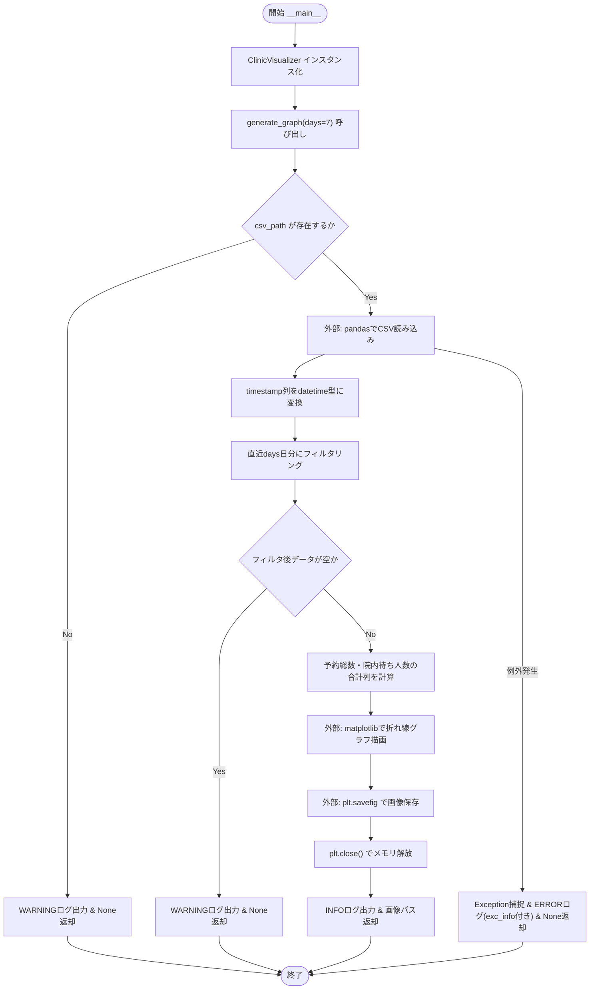
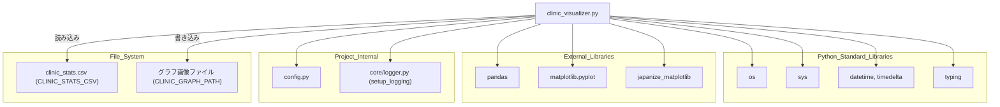

## 1. 解析メタ情報

| 項目 | 内容 |
| --- | --- |
| 対象ファイル | `monitors/old/clinic_visualizer.py` |
| 言語 | Python |
| 解析対象 | 提供されたコードのみ |
| 推測・補完 | 一切なし |

## 関連ドキュメント

* [logger.md](./logger.md) - `setup_logging`の提供元
* [config.md](./config.md) - `CLINIC_STATS_CSV`, `CLINIC_GRAPH_PATH`の設定値を提供
* [clinic_analyzer.md](./clinic_analyzer.md) - 本ファイルが読み込むCSV(`CLINIC_STATS_CSV`)の生成元（推測: 設定キー名およびCSVカラム名`am_reserved`等が一致するため）

## 2. ファイルの概要

`clinic_analyzer.py`が出力したCSV(`CLINIC_STATS_CSV`)を読み込み、直近N日間の予約総数・院内待ち人数の推移を折れ線グラフとして画像ファイルに保存するクラスである。
根拠: [クラスDocstring] (行番号: 17〜19 / 抜粋: "小児科の混雑データを可視化し、グラフ画像を生成するクラス。")

`generate_graph`はCSVをPandasで読み込み、`timestamp`列を`datetime`型に変換した上で直近`days`日分（デフォルト7日）にフィルタリングし、`am_reserved`+`pm_reserved`を「予約総数」、`am_in_clinic`+`pm_in_clinic`を「院内待ち」として`matplotlib`で折れ線グラフを描画する。
根拠: [generate_graph] (行番号: 42〜64 / 抜粋: "df['total_reserved'] = df['am_reserved'] + df['pm_reserved']\n            df['total_in_clinic'] = df['am_in_clinic'] + df['pm_in_clinic']")

グラフは`config.CLINIC_GRAPH_PATH`へ`plt.savefig`で保存され、メモリ解放のため`plt.close()`が呼ばれる。
根拠: [generate_graph] (行番号: 77〜78 / 抜粋: "plt.savefig(self.output_image, bbox_inches='tight')\n            plt.close() # メモリ解放")

CSVファイルが存在しない場合、またはフィルタ後のデータが空の場合はWARNINGログを出力し`None`を返す。
根拠: [generate_graph] (行番号: 36〜38, 51〜53 / 抜粋: "if not os.path.exists(self.csv_path):\n            logger.warning(f\"CSV file not found: {self.csv_path}\")\n            return None")

スクリプトとして直接実行された場合、`ClinicVisualizer`をインスタンス化し`generate_graph(days=7)`を1回だけ呼び出す。
根拠: [__main__] (行番号: 87〜89 / 抜粋: "viz = ClinicVisualizer()\n    viz.generate_graph(days=7)")

## 3. 外部依存関係

### インポート一覧

| 名称 | 種類 | 用途 | 根拠 |
| --- | --- | --- | --- |
| `os` | 標準ライブラリ | CSVファイルの存在確認(`os.path.exists`) | 根拠: `[import os]` (行番号: 1 / 抜粋: "import os") |
| `sys` | 標準ライブラリ | プロジェクトルートへのパス追加 | 根拠: `[import sys]` (行番号: 2 / 抜粋: "import sys") |
| `pandas` (`pd`) | 外部ライブラリ | CSV読み込み(`pd.read_csv`)、日時型変換、データフィルタリング | 根拠: `[import pandas as pd]` (行番号: 3 / 抜粋: "import pandas as pd") |
| `matplotlib.pyplot` (`plt`) | 外部ライブラリ | グラフの描画・保存 | 根拠: `[import matplotlib.pyplot as plt]` (行番号: 4 / 抜粋: "import matplotlib.pyplot as plt") |
| `japanize_matplotlib` | 外部ライブラリ | matplotlibでの日本語フォント文字化け対策（インポートのみで直接呼び出しなし） | 根拠: `[import japanize_matplotlib]` (行番号: 5 / 抜粋: "import japanize_matplotlib  # 日本語豆腐文字化け対策") |
| `datetime`, `timedelta` | 標準ライブラリ | 現在時刻取得、期間フィルタリングの基準日計算 | 根拠: `[from datetime import datetime, timedelta]` (行番号: 6 / 抜粋: "from datetime import datetime, timedelta") |
| `Optional` | 標準ライブラリ(`typing`) | 型ヒントの定義 | 根拠: `[from typing import Optional]` (行番号: 7 / 抜粋: "from typing import Optional") |
| `config` | 内部モジュール | CSV読み込み元パス・グラフ画像出力先パスの提供 | 根拠: `[import config]` (行番号: 12 / 抜粋: "import config") |
| `setup_logging` | 内部モジュール(`core.logger`) | ロガーインスタンスの初期化 | 根拠: `[from core.logger import setup_logging]` (行番号: 13 / 抜粋: "from core.logger import setup_logging") |

### ブラックボックスとなる外部要素

| 名称 | 理由 | 根拠 |
| --- | --- | --- |
| `config.CLINIC_STATS_CSV` / `config.CLINIC_GRAPH_PATH` | `config`モジュールの実装が提供されておらず、実際の値が不明であるため(`getattr`によるデフォルト値`""`フォールバック付き)。 | 根拠: `[getattr(config, ...)]` (行番号: 23〜24 / 抜粋: "self.csv_path: str = getattr(config, \"CLINIC_STATS_CSV\", \"\")") |
| `pandas`, `matplotlib`, `japanize_matplotlib`の内部実装 | 外部ライブラリであり、CSVパース・グラフ描画・フォント処理の内部アルゴリズムは提供コードから読み取れないため。 | 根拠: `[pd.read_csv / plt.plot]` (行番号: 42, 63〜64 / 抜粋: "df = pd.read_csv(self.csv_path)") |
| 入力CSVファイル(`CLINIC_STATS_CSV`)の実際の内容 | `clinic_analyzer.py`が生成すると推測される外部ファイルであり、実際のデータ内容は本ファイルからは確認できないため。 | 根拠: `[pd.read_csv呼び出し]` (行番号: 42 / 抜粋: "df = pd.read_csv(self.csv_path)") |

## 4. 主要要素の定義（関数 / エンドポイント / コンポーネント）

### `ClinicVisualizer`

* **役割**: 小児科の混雑データを可視化し、グラフ画像を生成するクラス。
* 根拠: `[クラスDocstring]` (行番号: 17〜19 / 抜粋: "小児科の混雑データを可視化し、グラフ画像を生成するクラス。")

### `ClinicVisualizer.__init__`

* **役割**: `config`からCSV読み込み元パスとグラフ画像出力先パスを読み込み初期化する。
* 根拠: `[__init__]` (行番号: 22〜24 / 抜粋: "def __init__(self) -> None:")
* **引数/リクエスト**: `self`のみ。
* 根拠: `[__init__シグネチャ]` (行番号: 22 / 抜粋: "def __init__(self) -> None:")
* **戻り値/レスポンス**: なし(`None`)。
* 根拠: `[__init__シグネチャ]` (行番号: 22 / 抜粋: "def __init__(self) -> None:")
* **副作用**: インスタンス属性(`csv_path`, `output_image`)の設定のみ。
* 根拠: `[__init__本体]` (行番号: 23〜24 / 抜粋: "self.output_image: str = getattr(config, \"CLINIC_GRAPH_PATH\", \"\")")
* **エラーハンドリング**: なし。
* 根拠: `[__init__本体]` (行番号: 22〜24 / 抜粋: "def __init__(self) -> None:")

### `ClinicVisualizer.generate_graph`

* **役割**: 過去N日分のデータをグラフ化し、画像ファイルとして保存する。
* 根拠: `[generate_graph]` (行番号: 26〜27 / 抜粋: "過去N日分のデータをグラフ化し、画像ファイルとして保存する。")
* **引数/リクエスト**: `days` (型: `int`、デフォルト`7`。表示する期間の日数)。
* 根拠: `[シグネチャ]` (行番号: 26 / 抜粋: "def generate_graph(self, days: int = 7) -> Optional[str]:")
* **戻り値/レスポンス**: `Optional[str]` (保存した画像のパス。CSV不在・データ空・例外発生時は`None`)。
* 根拠: `[戻り値型ヒントおよび各return]` (行番号: 26, 38, 53, 81, 85 / 抜粋: "return self.output_image")
* **副作用**: `pd.read_csv`によるファイル読み込み、`plt.figure`/`plt.plot`等によるグラフ描画状態の生成、`plt.savefig`によるローカルファイルへの画像書き込み、`plt.close()`によるグラフリソースの解放。
* 根拠: `[plt.savefigとplt.close]` (行番号: 77〜78 / 抜粋: "plt.savefig(self.output_image, bbox_inches='tight')\n            plt.close() # メモリ解放")
* **エラーハンドリング**: `Exception`全般をキャッチし、スタックトレース付き(`exc_info=True`)でERRORログを出力、`None`を返す。CSVファイル不在時・フィルタ後データ空時はそれぞれWARNINGログを出力し`None`を返す（例外としては扱わない早期リターン）。
* 根拠: `[except Exceptionと早期return]` (行番号: 36〜38, 51〜53, 83〜85 / 抜粋: "except Exception as e:\n            logger.error(f\"❌ Failed to generate graph: {e}\", exc_info=True)\n            return None")

## 5. 処理フロー図

## 6. 依存関係図

## 7. 次のステップ（リバースエンジニアリングの提案）

| 優先度 | ファイル名(推測可) | 理由 | 根拠 |
| --- | --- | --- | --- |
| 高 | `monitors/old/clinic_analyzer.py` | 本ファイルが読み込む入力CSV(`CLINIC_STATS_CSV`)の生成元と推測されるモジュールであり、カラム定義(`am_reserved`等)の整合性を確認するため。 | 根拠: `[df['am_reserved']等参照]` (行番号: 60〜61 / 抜粋: "df['total_reserved'] = df['am_reserved'] + df['pm_reserved']") |
| 中 | `config.py` | `CLINIC_STATS_CSV`, `CLINIC_GRAPH_PATH`の実際の設定値を確認するため。 | 根拠: `[getattr(config, ...)]` (行番号: 23〜24 / 抜粋: "self.csv_path: str = getattr(config, \"CLINIC_STATS_CSV\", \"\")") |
| 低 | 本ファイルが生成したグラフ画像の利用先（ダッシュボード等） | 生成された画像がどこで表示・配信されるか（例: `dashboard.py`）を確認する必要があるため。 | 根拠: `[output_image定義]` (行番号: 24 / 抜粋: "self.output_image: str = getattr(config, \"CLINIC_GRAPH_PATH\", \"\")") |

## 8. 保守上の注意点

* `japanize_matplotlib`はインポートされているのみで、コード内で明示的に呼び出されている箇所はない。これは同ライブラリの一般的な使用法（インポート時の副作用でフォント設定を変更する）に基づくものと考えられるが、本ファイル単体では実際の効果は確認できない。
* 根拠: `[import japanize_matplotlib]` (行番号: 5 / 抜粋: "import japanize_matplotlib  # 日本語豆腐文字化け対策")
* コメントにて「同時間帯に両方立つことは稀なため」という前提のもと、AMとPMのデータを単純加算(`total_reserved`, `total_in_clinic`)している。この前提が崩れるデータが混入した場合、グラフの数値が実態と乖離する可能性がある。
* 根拠: `[コメント]` (行番号: 59 / 抜粋: "# ※簡易的にAMとPMを足し合わせる（同時間帯に両方立つことは稀なため）")
* `generate_graph`は画像を`output_image`パスへ`\"w\"`相当の上書き保存(`plt.savefig`)しており、過去のグラフ画像を保持しない（実行のたびに同一パスが上書きされる）設計である。
* 根拠: `[plt.savefig]` (行番号: 77 / 抜粋: "plt.savefig(self.output_image, bbox_inches='tight')")
* `monitors/old/`ディレクトリに配置されており、後継または現行版の同等モジュールが別途存在する可能性がある（本ファイル単体では判別不可）。
* 根拠: `[ファイルパス]` (行番号: 該当なし / 抜粋: "monitors/old/clinic_visualizer.py")

## 9. 不明事項一覧

| 項目 | 理由 | 必要なファイル |
| --- | --- | --- |
| `config.CLINIC_STATS_CSV` / `config.CLINIC_GRAPH_PATH`の実際の設定値 | `config`モジュールの実装が本ファイルに含まれていないため。 | `config.py` |
| 入力CSVの実際のスキーマ・データ内容 | 本ファイルは特定のカラム名(`timestamp`, `am_reserved`等)を前提として読み込むが、生成元の実装は本ファイルに含まれていないため。 | `monitors/old/clinic_analyzer.py` |
| 生成されたグラフ画像の実際の利用先（表示箇所） | 本ファイルは画像ファイルの生成のみを行い、その配信・表示方法は不明であるため。 | `dashboard.py`等、画像を参照する可能性のあるファイル |
| 本ファイルの実行トリガー（cron/スケジューラ設定） | `__main__`ブロックが1回のみの実行を行う設計であり、定期実行の仕組みが本ファイルからは不明であるため。 | スケジューラ関連ファイル(`scheduler_boot.py`等) |
| `monitors/old/`ディレクトリの位置づけ（現行版との関係） | ディレクトリ名から旧版の可能性が示唆されるが、本ファイル単体では現行版の有無や移行状況を判断できないため。 | `monitors/`配下の他ファイル一覧 |

## 10. 自己検証結果

* [x] 推測・外部ファイルの仕様を一切含んでいない（完了）
* [x] 全関数・全クラス・全コンポーネントを列挙した（完了）
* [x] 全てのインポート要素を列挙した（完了）
* [x] すべての仕様説明に「根拠（行番号・抜粋）」を明記した（完了）
* [x] 根拠漏れが0件である（完了）
* [x] Mermaid構文にエラーの原因となる記号（エスケープ漏れ）がない（完了）
* [x] 不明事項を漏れなく列挙した（完了）
