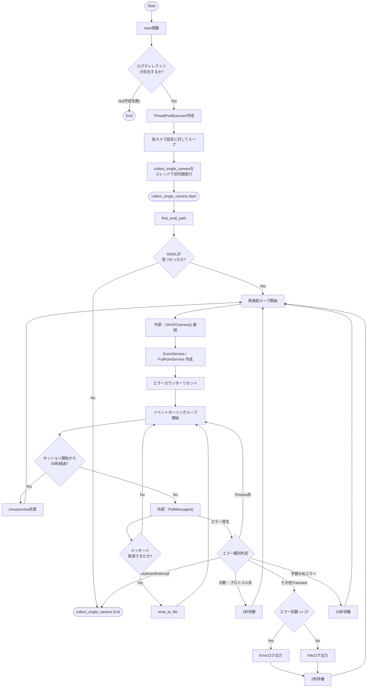
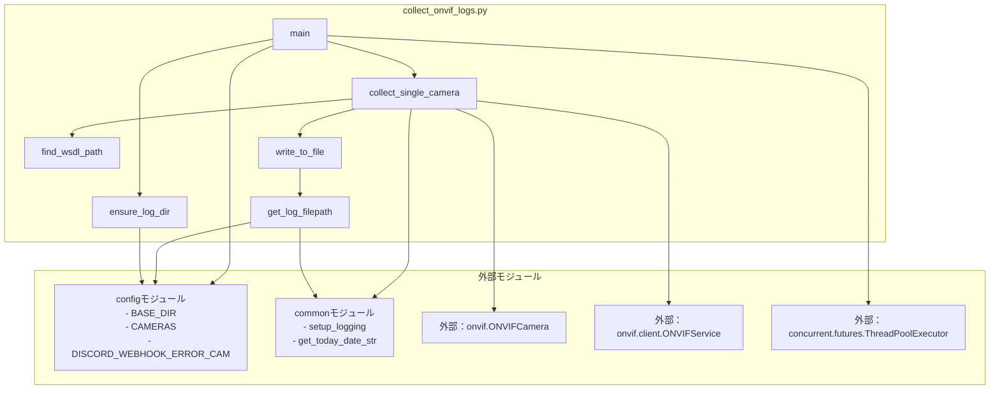

## 1. 解析メタ情報

| 項目 | 内容 |
| --- | --- |
| 対象ファイル | collect_onvif_logs.py |
| 言語 | Python |
| 解析対象 | 提供されたコードのみ |
| 推測・補完 | 一切なし |

## 2. ファイルの概要

ONVIF対応カメラからイベントログ（PullPointSubscriptionBindingを利用したメッセージ）を収集し、ローカルのファイルに保存するためのスクリプト。複数カメラに対する非同期ポーリング処理、通信切断時の自発的な再接続制御（セッションライフタイムの管理）、およびエラーハンドリングを含んでいる。

## 3. 外部依存関係

### インポート一覧

| 名称 | 種類 | 用途 | 根拠 |
| --- | --- | --- | --- |
| `onvif.ONVIFCamera` | クラス | ONVIFカメラへの接続 | `from onvif import ONVIFCamera` (行番号: 2) |
| `onvif.client.ONVIFService` | クラス | イベント取得用サービスの作成 | `from onvif.client import ONVIFService` (行番号: 3) |
| `requests.auth.HTTPDigestAuth` | クラス | HTTP Digest認証情報の付与 | `from requests.auth import HTTPDigestAuth` (行番号: 4) |
| `config` | モジュール | 設定値（保存先、Webhook、カメラ情報等）の取得 | `import config` (行番号: 5) |
| `common` | モジュール | ロガー設定や日付取得などの共通処理 | `import common` (行番号: 6) |
| `asyncio` | モジュール | 非同期処理ループの制御 | `import asyncio` (行番号: 7) |
| `datetime.datetime` | クラス | ログ記録用のタイムスタンプ取得 | `from datetime import datetime, timedelta` (行番号: 8) |
| `datetime.timedelta` | クラス | ポーリングのタイムアウト時間指定 | `from datetime import datetime, timedelta` (行番号: 8) |
| `os` | モジュール | ディレクトリ作成やパスの結合・走査 | `import os` (行番号: 9) |
| `sys` | モジュール | システムパス（WSDL探索）の参照 | `import sys` (行番号: 10) |
| `time` | モジュール | 待機処理やセッションライフタイムの計測 | `import time` (行番号: 11) |
| `lxml.etree` | モジュール | 取得したイベントのXML文字列化 | `from lxml import etree` (行番号: 12) |
| `logging` | モジュール | システムログの出力 | `import logging` (行番号: 13) |
| `concurrent.futures.ThreadPoolExecutor` | クラス | カメラ別処理用スレッドプールの作成 | `from concurrent.futures import ThreadPoolExecutor` (行番号: 14) |
| `http.client.RemoteDisconnected` | 例外 | ネットワーク切断の捕捉 | `from http.client import RemoteDisconnected` (行番号: 15) |
| `urllib3.exceptions.ProtocolError` | 例外 | プロトコルエラーの捕捉 | `from urllib3.exceptions import ProtocolError` (行番号: 16) |

### ブラックボックスとなる外部要素

| 名称 | 理由 | 根拠 |
| --- | --- | --- |
| `config` モジュール内の定義 | `BASE_DIR`, `CAMERAS`, `DISCORD_WEBHOOK_ERROR_CAM` などの具体的なデータ構造や値が提供されたコード内に存在しないため。 | `os.path.join(config.BASE_DIR, "logs")` (行番号: 24 / 抜粋: "config.BASE_DIR") |
| `common` モジュール内の実装 | `setup_logging`, `get_today_date_str` の内部処理や正確な戻り値が提供されたコード内に存在しないため。 | `common.setup_logging(...)` (行番号: 18 / 抜粋: "common.setup_logging") |

## 4. 主要要素の定義（関数 / エンドポイント / コンポーネント）

### `ensure_log_dir`

* **役割**: ログ保存用ディレクトリが存在するか確認し、存在しない場合は作成する。
* 根拠: `ensure_log_dir` (行番号: 29-37 / 抜粋: "def ensure_log_dir():")

* **引数/リクエスト**: なし
* 根拠: `ensure_log_dir` (行番号: 29 / 抜粋: "def ensure_log_dir():")

* **戻り値/レスポンス**: bool（作成成功・既存の場合はTrue、失敗時はFalse）
* 根拠: `return` (行番号: 35, 37 / 抜粋: "return True", "return False")

* **副作用**: ファイルシステム上にディレクトリを作成する (`os.makedirs`)。
* 根拠: `os.makedirs` (行番号: 32 / 抜粋: "os.makedirs(LOG_DIR)")

* **エラーハンドリング**: `OSError` を捕捉し、エラーログを出力してFalseを返す。
* 根拠: `except OSError` (行番号: 34 / 抜粋: "except OSError as e:")

### `get_log_filepath`

* **役割**: カメラIDからファイル名に使えない文字（英数字、アンダースコア、ハイフン以外）を除去し、日付を含めたログファイルの保存パスを生成する。
* 根拠: `get_log_filepath` (行番号: 39-44 / 抜粋: "def get_log_filepath(camera_id):")

* **引数/リクエスト**: `camera_id` (文字列として処理される)
* 根拠: `camera_id` (行番号: 39 / 抜粋: "def get_log_filepath(camera_id):")

* **戻り値/レスポンス**: 文字列（ログファイルの絶対パス）
* 根拠: `return` (行番号: 44 / 抜粋: "return os.path.join(LOG_DIR, ...)")

* **副作用**: なし
* 根拠: 文字列操作とパス結合のみを実行しているため。

* **エラーハンドリング**: なし
* 根拠: `try...except` ブロックが存在しない。

### `write_to_file`

* **役割**: 指定されたカメラのログファイルにタイムスタンプとテキストを追記する。
* 根拠: `write_to_file` (行番号: 46-55 / 抜粋: "def write_to_file(camera_id, text):")

* **引数/リクエスト**: `camera_id` (ファイル名生成用), `text` (ファイルに書き込む内容)
* 根拠: `camera_id, text` (行番号: 46 / 抜粋: "def write_to_file(camera_id, text):")

* **戻り値/レスポンス**: なし
* 根拠: 関数内に `return` 文が存在しない。

* **副作用**: ファイルシステムへの書き込み（追記モードによるファイルオープンと書き込み）。
* 根拠: `open` (行番号: 50 / 抜粋: "with open(filepath, "a", ...)")

* **エラーハンドリング**: `Exception` を捕捉し、ロガーにエラーを出力する。
* 根拠: `except Exception` (行番号: 54 / 抜粋: "except Exception as e:")

### `find_wsdl_path`

* **役割**: `sys.path` を走査し、`onvif/wsdl/devicemgmt.wsdl` または `devicemgmt.wsdl` が存在するディレクトリパスを探索する。
* 根拠: `find_wsdl_path` (行番号: 57-65 / 抜粋: "def find_wsdl_path():")

* **引数/リクエスト**: なし
* 根拠: `find_wsdl_path` (行番号: 57 / 抜粋: "def find_wsdl_path():")

* **戻り値/レスポンス**: 文字列（ディレクトリパス）または None（見つからなかった場合）
* 根拠: `return` (行番号: 62, 64, 65 / 抜粋: "return candidate", "return None")

* **副作用**: ファイルシステムの走査 (`os.walk`) を実行する。
* 根拠: `os.walk` (行番号: 63 / 抜粋: "for root, dirs, files in os.walk(path):")

* **エラーハンドリング**: なし
* 根拠: `try...except` ブロックが存在しない。

### `collect_single_camera`

* **役割**: 単一のカメラに対するONVIF接続を初期化し、イベントを定期的にポーリングしてログファイルに保存する。指定秒数経過時の定期再接続、および各種通信エラー時の再試行制御を行う。
* 根拠: `collect_single_camera` (行番号: 67-175 / 抜粋: "def collect_single_camera(cam_conf):")

* **引数/リクエスト**: `cam_conf`（`name`, `ip`, `id`, `user`, `pass` などのキーを含む辞書オブジェクト）
* 根拠: `cam_conf` (行番号: 67, 69-71 / 抜粋: "cam_name = cam_conf['name']")

* **戻り値/レスポンス**: なし
* 根拠: 関数内に値を返す `return` 文が存在しない。

* **副作用**: 外部APIへのネットワークリクエスト（ONVIF通信）、ファイルへのログ書き込み、スリープ処理。
* 根拠: `ONVIFCamera` (行番号: 87 / 抜粋: "mycam = ONVIFCamera(...)")

* **エラーハンドリング**:
* `TimeOut` / `timed out` を含む例外は無視し処理を継続する。
* `RemoteDisconnected`, `ProtocolError`, `BrokenPipeError`, `ConnectionResetError` は想定内切断として1秒待機し再試行。
* `KeyboardInterrupt` を捕捉しループを抜ける。
* その他例外は文字列マッチングで一時的エラーか予期せぬエラーか判別し、閾値に基づくエラーログ出力とスリープ（2秒または10秒）を実施する。
* 根拠: `except` ブロック全体 (行番号: 136-175 / 抜粋: "except (RemoteDisconnected, ...)")

### `main`

* **役割**: ログディレクトリの確認後、`config.CAMERAS` に定義されたカメラリストに基づいてスレッドプールを生成し、各カメラの収集処理を非同期で実行する。
* 根拠: `main` (行番号: 177-187 / 抜粋: "async def main():")

* **引数/リクエスト**: なし
* 根拠: `main` (行番号: 177 / 抜粋: "async def main():")

* **戻り値/レスポンス**: なし
* 根拠: 関数内に値を返す `return` 文が存在しない。

* **副作用**: スレッドプールの生成と実行。
* 根拠: `ThreadPoolExecutor` (行番号: 183 / 抜粋: "with ThreadPoolExecutor(...)")

* **エラーハンドリング**: なし（呼び出し元でのハンドリングに依存）。
* 根拠: `try...except` ブロックが存在しない。

## 5. 処理フロー図

## 6. 依存関係図

## 7. 次のステップ（リバースエンジニアリングの提案）

| 優先度 | ファイル名(推測可) | 理由 | 根拠 |
| --- | --- | --- | --- |
| 高 | `config.py` | `CAMERAS` リストの各要素の正確な構造や、`BASE_DIR` などシステム全体の挙動を決定づける環境変数の定義を確認するため。 | `import config` (行番号: 5), `config.CAMERAS` (行番号: 184) |
| 中 | `common.py` | `setup_logging` によるロギングの詳細な仕様（DiscordへのWebhook連携の仕組み等）や日付フォーマットの仕様を確認するため。 | `import common` (行番号: 6), `common.setup_logging` (行番号: 18) |

## 8. 保守上の注意点

* `SESSION_LIFETIME` が50秒でハードコードされており、対象カメラの仕様（ONVIFのタイムアウト設定）によっては意図しない頻回な再接続が発生する可能性がある。
* ファイルの書き込み処理 (`write_to_file`) がイベント受信のたびに実行され `with open(...)` を用いて都度ファイルを開閉しているため、高頻度なイベント受信時にI/O負荷が高まる可能性がある。
* `find_wsdl_path` において `os.walk(path)` を実行しているため、Pythonのライブラリ環境 (`sys.path`) が巨大な場合、実行時にパフォーマンス低下を招く可能性がある。
* エラーのハンドリングにおいて、例外オブジェクトの文字列表現 (`err_str = str(e)`) に特定のキーワードが含まれているかを判定している箇所があるため、依存ライブラリのバージョンアップによるエラーメッセージの変更に影響を受けやすい。
* `config.LINE_USER_ID` および `common.send_push` を利用したLINE通知機能は現在コメントアウトされている。

## 9. 不明事項一覧

| 項目 | 理由 | 必要なファイル |
| --- | --- | --- |
| `config.BASE_DIR` の設定パス | 外部モジュールで定義されており、本ファイル内に値の記述がないため | `config.py` |
| `config.CAMERAS` のリスト構造と要素数 | 外部モジュールで定義されており、カメラの台数や設定値の仕様が不明なため | `config.py` |
| `common.setup_logging` の詳細な実装 | 外部モジュールで定義されており、出力されるログフォーマットやWebhookの挙動が不明なため | `common.py` |
| `common.get_today_date_str` の日付フォーマット | 外部モジュールで定義されており、返却される文字列の形式が不明なため | `common.py` |

## 10. 自己検証結果

* [x] 推測・外部ファイルの仕様を一切含んでいない
* [x] 全関数・全クラス・全コンポーネントを列挙した
* [x] 全てのインポート要素を列挙した
* [x] すべての仕様説明に「根拠（行番号・抜粋）」を明記した
* [x] 根拠漏れが0件である
* [x] Mermaid構文にエラーの原因となる記号（エスケープ漏れ）がない
* [x] 不明事項を漏れなく列挙した

完了