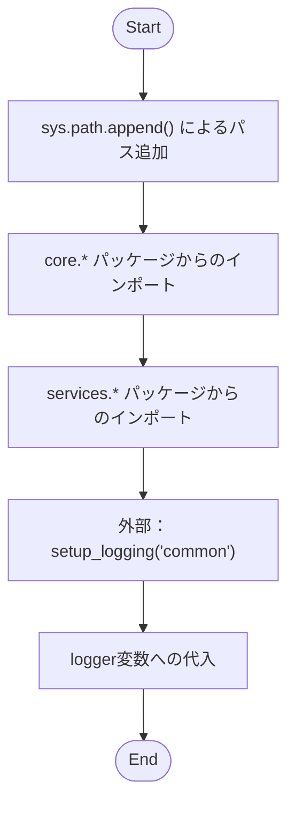
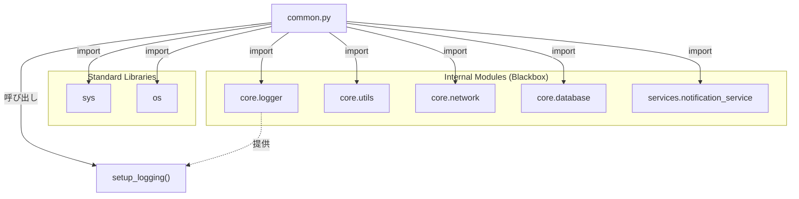

## 1. 解析メタ情報

| 項目 | 内容 |
| --- | --- |
| 対象ファイル | `common.py` |
| 言語 | Python |
| 解析対象 | 提供されたコードのみ |
| 推測・補完 | 一切なし |

## 2. ファイルの概要

* 下位互換性のために維持されているFacadeパターンのモジュールである。
* 根拠: モジュールのdocstring (行番号: 3〜7 / 抜粋: "Deprecated: This module is ke")

* システム内の各コアモジュール（`core.*`）およびサービスモジュール（`services.*`）から各種機能を集約してインポートしている。
* 根拠: インポート文群 (行番号: 15〜37 / 抜粋: "from core.logger import setup")

* ファイルのロード時にモジュール探索パスを変更し、自身の名前空間用のグローバルロガーを初期化する。
* 根拠: `sys.path.append` と `setup_logging` の呼び出し (行番号: 12, 40 / 抜粋: "sys.path.append(os.path.dirna")

## 3. 外部依存関係

### インポート一覧

| 名称 | 種類 | 用途 | 根拠 |
| --- | --- | --- | --- |
| `sys` | 標準ライブラリ | システムパス（`sys.path`）の操作 | `import sys` (行番号: 8 / 抜粋: "import sys") |
| `os` | 標準ライブラリ | ファイルパスの絶対パス取得やディレクトリ名の取得 | `import os` (行番号: 9 / 抜粋: "import os") |
| `setup_logging` | 外部関数 | グローバルロガーの初期化 | `from core.logger import setup...` (行番号: 15 / 抜粋: "from core.logger import setup") |
| `DiscordErrorHandler` | 外部クラス等 | 本ファイル内では使用されていない（外部提供用） | `from core.logger import setup...` (行番号: 15 / 抜粋: "from core.logger import setup") |
| `get_now_iso`, `get_today_date_str`, `get_display_date` | 外部関数等 | 本ファイル内では使用されていない（外部提供用） | `from core.utils import get_no...` (行番号: 16 / 抜粋: "from core.utils import get_no") |
| `get_retry_session`, `create_resilient_session`, `retry_api_call` | 外部関数等 | 本ファイル内では使用されていない（外部提供用） | `from core.network import (` (行番号: 17〜21 / 抜粋: "from core.network import (") |
| `get_db_cursor`, `execute_read_query`, `save_log_generic`, `save_log_async` | 外部関数等 | 本ファイル内では使用されていない（外部提供用） | `from core.database import (` (行番号: 22〜27 / 抜粋: "from core.database import (") |
| `send_push`, `send_reply`, `get_line_message_quota`, `_send_discord_webhook`, `_send_line_push` | 外部関数等 | 本ファイル内では使用されていない（外部提供用） | `from services.notification_se...` (行番号: 31〜37 / 抜粋: "from services.notification_se") |

### ブラックボックスとなる外部要素

| 名称 | 理由 | 根拠 |
| --- | --- | --- |
| `core.logger` などの外部モジュールの実装 | このファイル内では名前がインポートされているだけであり、具体的な処理内容や副作用がソースコード上に存在しないため。 | インポート文 (行番号: 15〜37 / 抜粋: "from core.logger import setup") |
| `setup_logging("common")` の挙動 | 外部関数のため、引数 `"common"` を渡した結果どのような設定のロガーが生成されるか判断できないため。 | `logger = setup_logging("common")` (行番号: 40 / 抜粋: "logger = setup_logging("commo") |

## 4. 主要要素の定義（関数 / エンドポイント / コンポーネント）

※このファイルには関数、クラス、エンドポイントなどの定義は存在しないため「該当なし」。ただし、トップレベルで定義されているグローバル変数について以下に記載する。

### グローバル変数 `logger`

* **役割**: `"common"` という名前空間で初期化されたグローバルロガーインスタンスを保持する。
* 根拠: `logger` 変数の初期化 (行番号: 40 / 抜粋: "logger = setup_logging("commo")

* **引数/リクエスト**: なし（変数定義のため）
* **戻り値/レスポンス**: `setup_logging` の戻り値（型は不明）
* 根拠: `logger = setup_logging("common")` (行番号: 40 / 抜粋: "logger = setup_logging("commo")

* **副作用**: `setup_logging` 呼び出しによる副作用（ロガーの生成、設定変更など。詳細はブラックボックスのため不明）。
* 根拠: `logger = setup_logging("common")` (行番号: 40 / 抜粋: "logger = setup_logging("commo")

* **エラーハンドリング**: なし（例外キャッチは行われていない）。
* 根拠: トップレベルの実行文 (行番号: 40 / 抜粋: "logger = setup_logging("commo")

## 5. 処理フロー図

## 6. 依存関係図

## 7. 次のステップ（リバースエンジニアリングの提案）

| 優先度 | ファイル名(推測可) | 理由 | 根拠 |
| --- | --- | --- | --- |
| 高 | `core/logger.py` | モジュールロード時に実行される `setup_logging` の副作用や、戻り値の型を特定するため。 | `from core.logger import setup_logging` (行番号: 15 / 抜粋: "from core.logger import setup") |
| 中 | `core/network.py`, `core/database.py`, `core/utils.py` | 本ファイルを通じて公開されている基盤処理の実装詳細と依存関係を把握するため。 | 各種インポート文 (行番号: 16〜27 / 抜粋: "from core.network import (") |
| 中 | `services/notification_service.py` | 通知処理（LINE、Discordなど）の具体的な実装を把握するため。 | インポート文 (行番号: 31〜37 / 抜粋: "from services.notification_se") |

## 8. 保守上の注意点

* **非推奨モジュール**: このファイルは下位互換性のために残されており、非推奨（Deprecated）である。将来の開発では `core.*` や `services.*` から直接インポートすることが推奨されている。
* 根拠: モジュールdocstring (行番号: 4〜6 / 抜粋: "Deprecated: This module is ke")

* **パス操作による副作用**: ファイルロード時に `sys.path.append` が実行され、実行環境のモジュール検索パスが変更される。これにより、予期せぬモジュールがインポートされるリスクが内在する。
* 根拠: `sys.path.append` 実行 (行番号: 12 / 抜粋: "sys.path.append(os.path.dirna")

* **未使用インポートの警告**: 大半のインポートは外部に公開するためのものであり、本ファイル内では使用されていない。Lintツール（flake8, pylint等）で未使用インポート警告が発生する可能性がある。
* 根拠: 各種インポート文が定義内で利用されていないこと (行番号: 15〜37 / 抜粋: "from core.logger import setup")

## 9. 不明事項一覧

| 項目 | 理由 | 必要なファイル |
| --- | --- | --- |
| `setup_logging` の詳細な挙動・副作用・戻り値 | 外部モジュールであり、本コード上に実装がないため。 | `core/logger.py` |
| インポートされている全外部関数の詳細なシグネチャと挙動 | 本ファイルは単なるFacadeであり、実装が一切記載されていないため。 | `core/*.py` および `services/notification_service.py` |
| `sys.path.append` によって追加されるパスの正確な解決結果 | 実行環境に依存して `__file__` が決定されるため。 | 実行環境のパス構成とエントリーポイント |

## 10. 自己検証結果

* [x] 推測・外部ファイルの仕様を一切含んでいない
* [x] 全関数・全クラス・全コンポーネントを列挙した
* [x] 全てのインポート要素を列挙した
* [x] すべての仕様説明に「根拠（行番号・抜粋）」を明記した
* [x] 根拠漏れが0件である
* [x] Mermaid構文にエラーの原因となる記号（エスケープ漏れ）がない
* [x] 不明事項を漏れなく列挙した

完了